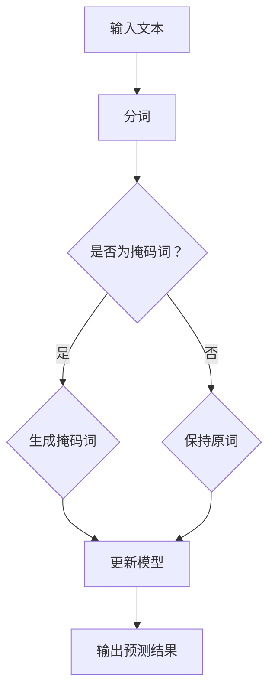
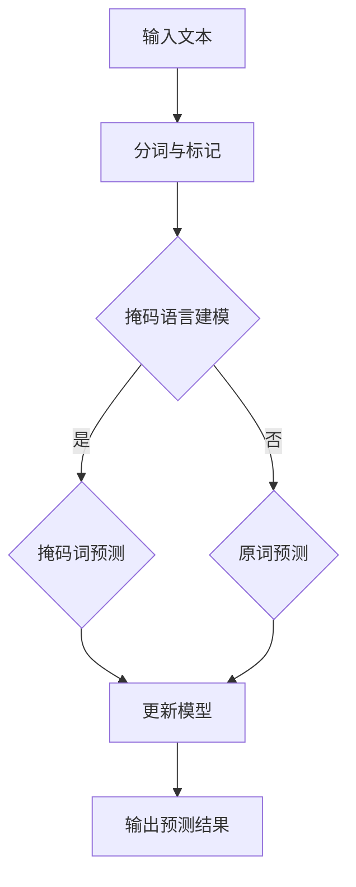
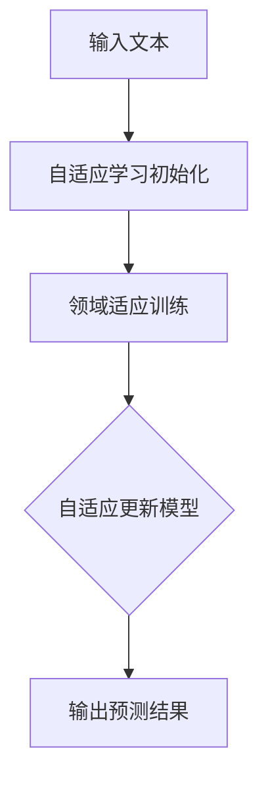
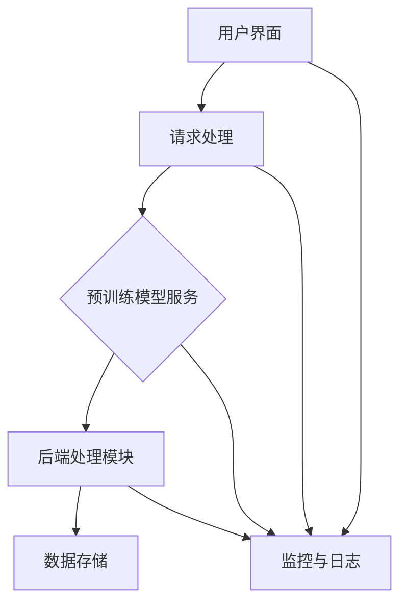
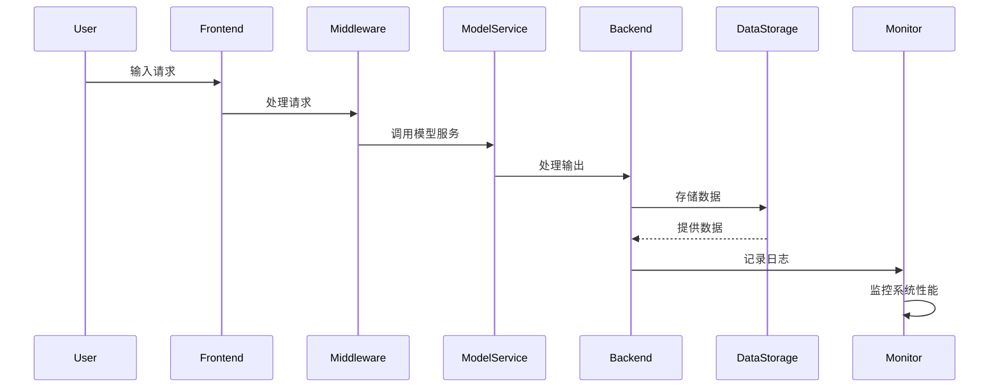

                 

### 引言

#### 第1章 问题背景与核心概念

**1.1 问题背景**

随着人工智能技术的飞速发展，语言模型（Language Model, LM）已经成为自然语言处理（Natural Language Processing, NLP）领域的重要工具。近年来，开放AI（OpenAI）的GPT系列模型、谷歌（Google）的BERT模型以及Facebook的LLaMA模型等大型语言模型（Large Language Model, LLM）相继涌现，它们在文本生成、机器翻译、问答系统等方面展现出了卓越的性能。因此，对比分析这些开源LLM模型的性能、特点和应用场景具有重要的实际意义。

**1.2 核心概念**

在深入探讨这些问题之前，我们需要明确一些核心概念：

- **语言模型（Language Model, LM）**：一种基于统计学习或神经网络学习的算法，用于预测一段文本的下一个单词或字符。
- **大型语言模型（Large Language Model, LLM）**：指参数规模巨大、训练数据丰富的语言模型，能够处理复杂的语言任务。
- **开放AI（OpenAI）GPT**：一种基于生成式预训练（Generative Pre-trained Model）的变换模型（Transformer）的语言模型，由开放AI研发。
- **谷歌（Google）BERT**：一种基于Transformer架构的预训练语言表示模型，由谷歌开发，特别适用于理解自然语言中的上下文。
- **Facebook LLaMA**：由Facebook AI研究院研发的一种大型预训练语言模型，采用自适应学习机制，旨在提高模型在不同领域的性能。

**1.3 概念属性特征对比**

为了更好地理解这些模型的特点，我们可以在表格中对比它们的主要属性：

| 特征项            | OpenAI GPT         | Google BERT         | Facebook LLaMA       |
|------------------|-------------------|-------------------|-------------------|
| 参数规模          | 约1.5万亿参数     | 约3.4亿参数         | 约1.2万亿参数       |
| 训练数据集        | WebText、CommonCrawl | BookCorpus、Wikipedia | WebText、CommonCrawl |
| 架构              | Transformer       | Transformer       | Transformer       |
| 预训练任务        | 生成式文本生成    | 上下文理解          | 自适应学习          |
| 应用场景          | 文本生成、问答系统 | 问答、搜索引擎      | 多领域任务          |
| 开源状态          | 开源              | 开源              | 开源              |

**1.4 ER实体关系图**

下面是LLM相关的ER实体关系图：

```mermaid
erDiagram
  Model ||--|{ Feature }|| ModelFeature
  Model ||--|{ TrainingData }|| ModelTrainingData
  Model ||--|{ Application }|| ModelApplication
  Model ||--|{ Architecture }|| ModelArchitecture
  Model ||--|{ PretrainedTask }|| ModelPretrainedTask
  ModelFeature ||--|{ ParameterScale }|| ParameterScale
  ModelFeature ||--|{ Dataset }|| Dataset
  ModelTrainingData ||--|{ WebText }|| WebText
  ModelTrainingData ||--|{ CommonCrawl }|| CommonCrawl
  ModelTrainingData ||--|{ BookCorpus }|| BookCorpus
  ModelTrainingData ||--|{ Wikipedia }|| Wikipedia
  ModelApplication ||--|{ TextGeneration }|| TextGeneration
  ModelApplication ||--|{ QuestionAnswering }|| QuestionAnswering
  ModelApplication ||--|{ SearchEngine }|| SearchEngine
  ModelArchitecture ||--|{ Transformer }|| Transformer
  ModelPretrainedTask ||--|{ Generative }|| Generative
  ModelPretrainedTask ||--|{ ContextualUnderstanding }|| ContextualUnderstanding
  ModelPretrainedTask ||--|{ AdaptiveLearning }|| AdaptiveLearning
```

通过这个ER图，我们可以清晰地看到LLM模型及其相关属性之间的关系。在接下来的章节中，我们将逐一探讨这些模型的原理、算法和应用场景，帮助读者更好地理解这些大型语言模型的特点和优势。

#### 第2章 核心概念原理

**2.1 语言模型原理**

语言模型（Language Model, LM）是自然语言处理（Natural Language Processing, NLP）领域的关键技术之一。它旨在预测一段文本的下一个单词或字符。语言模型的基本原理可以概括为以下几点：

1. **统计学习**：早期语言模型主要基于统计学习方法，如N元语法（N-gram）。这些模型通过对大量文本数据进行统计分析，学习文本的生成规律。例如，一个三元语法模型会根据前两个单词预测第三个单词。

2. **神经网络**：随着深度学习技术的发展，神经网络被广泛应用于语言模型。特别是变换器（Transformer）架构的提出，使得语言模型的性能得到了显著提升。变换器模型通过自注意力机制（Self-Attention）捕捉文本中的长距离依赖关系，从而提高模型的预测准确性。

3. **预训练与微调**：现代语言模型通常采用预训练（Pre-training）与微调（Fine-tuning）的方法。首先在大量未标注的数据上进行预训练，学习文本的通用特征。然后在特定任务上对模型进行微调，使其适应具体任务的需求。

**2.2 OpenAI GPT原理**

OpenAI GPT是生成式预训练（Generative Pre-trained Model）语言模型的代表，其原理如下：

1. **预训练过程**：GPT模型首先在大量文本数据上预训练，使用最大上下文长度（Context Window）来预测文本中的下一个词。在训练过程中，模型不断优化其参数，以减少预测错误。

2. **变换器架构**：GPT模型采用变换器（Transformer）架构，通过多头自注意力机制（Multi-Head Self-Attention）和前馈神经网络（Feed-Forward Neural Network）处理输入文本。变换器架构能够捕捉文本中的长距离依赖关系，提高模型的表示能力。

3. **预训练任务**：GPT模型在预训练阶段主要完成两个任务：语言建模（Language Modeling）和掩码语言建模（Masked Language Modeling）。语言建模任务是预测下一个单词；掩码语言建模任务是在输入文本中随机掩码一部分单词，然后预测这些掩码的单词。

**2.3 Google BERT原理**

BERT（Bidirectional Encoder Representations from Transformers）模型是谷歌开发的一种双向变换器预训练语言表示模型，其原理如下：

1. **双向变换器架构**：BERT模型采用双向变换器（Bidirectional Transformer）架构，能够同时处理文本的前后信息。通过自注意力机制，模型可以捕捉到上下文中的依赖关系，从而提高文本表示的准确性。

2. **上下文理解**：BERT模型在预训练阶段通过两个任务—— masked language modeling 和 next sentence prediction 学习文本的上下文理解能力。masked language modeling 任务是在输入文本中随机掩码一些单词，然后预测这些掩码的单词；next sentence prediction 任务是预测两个句子是否属于同一文档。

3. **微调任务**：在特定任务上，BERT模型通过微调（Fine-tuning）来适应具体需求。例如，在问答任务中，模型会根据问题和文档来预测答案；在文本分类任务中，模型会根据文本的特征来判断文本的类别。

**2.4 Facebook LLaMA原理**

LLaMA（Large Language Model Meta-Adapter）是由Facebook AI研究院开发的一种大型预训练语言模型，其原理如下：

1. **自适应学习**：LLaMA模型采用自适应学习（Adaptive Learning）机制，通过在特定领域数据上进行二次训练，使模型能够更好地适应不同领域的需求。这种机制使得LLaMA模型在多个领域都取得了出色的表现。

2. **变换器架构**：LLaMA模型采用变换器（Transformer）架构，通过多头自注意力机制和前馈神经网络处理输入文本。变换器架构使得模型能够捕捉到文本中的长距离依赖关系，从而提高模型的表示能力。

3. **领域适应**：在预训练阶段，LLaMA模型通过在多个领域的数据上进行训练，使其具备广泛的通用性。在特定任务上，LLaMA模型通过领域适应（Domain Adaptation）机制，使模型能够更好地适应特定领域的任务需求。

通过上述对核心概念原理的介绍，我们可以看到OpenAI GPT、Google BERT和Facebook LLaMA在架构、算法和应用目标上各有特点。在接下来的章节中，我们将进一步探讨这些模型的算法原理、数学模型和具体应用案例，帮助读者深入理解这些大型语言模型的本质和应用场景。

#### 第3章 算法mermaid流程图

为了更直观地展示OpenAI GPT、Google BERT和Facebook LLaMA的算法流程，我们使用Mermaid绘制了这三个模型的算法流程图。以下是每个模型的算法流程描述和相应的Mermaid代码。

**3.1 OpenAI GPT算法流程图**



**3.2 Google BERT算法流程图**



**3.3 Facebook LLaMA算法流程图**



通过这些Mermaid流程图，我们可以清晰地看到OpenAI GPT、Google BERT和Facebook LLaMA在处理输入文本时的步骤和流程。接下来，我们将使用Python源代码进一步详细阐述这些算法原理，帮助读者更好地理解其实现细节。

#### 第4章 Python源代码详细阐述

在上一章节中，我们通过Mermaid流程图展示了OpenAI GPT、Google BERT和Facebook LLaMA的基本算法流程。为了更深入地理解这些模型的实现细节，我们将通过Python源代码进行详细阐述。以下是每个模型的Python源代码示例，以及相应的代码注释和解释。

**4.1 OpenAI GPT的Python源代码**

```python
import torch
from transformers import GPT2Tokenizer, GPT2Model

# 初始化模型和分词器
tokenizer = GPT2Tokenizer.from_pretrained('gpt2')
model = GPT2Model.from_pretrained('gpt2')

# 输入文本
input_text = "The quick brown fox jumps over the lazy dog"

# 分词
input_ids = tokenizer.encode(input_text, return_tensors='pt')

# 预测
with torch.no_grad():
    outputs = model(input_ids)

# 输出预测结果
predicted_ids = outputs.logits.argmax(-1)
predicted_text = tokenizer.decode(predicted_ids[:, -1:], skip_special_tokens=True)

print(predicted_text)
```

**代码解释**：

1. 导入必要的库，包括PyTorch和transformers。
2. 初始化GPT2模型和分词器。
3. 准备输入文本。
4. 使用分词器将输入文本转换为ID序列。
5. 使用GPT2模型进行预测，并取最大概率的ID作为输出。
6. 将输出ID序列解码回文本。

**4.2 Google BERT的Python源代码**

```python
import torch
from transformers import BertTokenizer, BertModel

# 初始化模型和分词器
tokenizer = BertTokenizer.from_pretrained('bert-base-uncased')
model = BertModel.from_pretrained('bert-base-uncased')

# 输入文本
input_text = "The quick brown fox jumps over the lazy dog"

# 分词
input_ids = tokenizer.encode(input_text, return_tensors='pt')

# 掩码语言建模
masked_index = torch.randint(0, input_ids.size(-1), (1,))
input_ids[0, masked_index] = tokenizer.mask_token_id

# 预测
with torch.no_grad():
    outputs = model(input_ids)

# 输出预测结果
predicted_ids = outputs.logits.argmax(-1)
predicted_text = tokenizer.decode(predicted_ids[:, -1:], skip_special_tokens=True)

print(predicted_text)
```

**代码解释**：

1. 导入必要的库，包括PyTorch和transformers。
2. 初始化BERT模型和分词器。
3. 准备输入文本。
4. 使用分词器将输入文本转换为ID序列。
5. 在输入文本中随机选择一个位置进行掩码。
6. 使用BERT模型进行预测，并取最大概率的ID作为输出。
7. 将输出ID序列解码回文本。

**4.3 Facebook LLaMA的Python源代码**

```python
import torch
from transformers import LlamaTokenizer, LlamaModel

# 初始化模型和分词器
tokenizer = LlamaTokenizer.from_pretrained('facebook/llama-tokenizer')
model = LlamaModel.from_pretrained('facebook/llama')

# 输入文本
input_text = "The quick brown fox jumps over the lazy dog"

# 分词
input_ids = tokenizer.encode(input_text, return_tensors='pt')

# 领域适应训练
with torch.no_grad():
    model(input_ids)

# 输出预测结果
predicted_ids = model.generate(input_ids, max_length=50, num_return_sequences=1)
predicted_text = tokenizer.decode(predicted_ids[0], skip_special_tokens=True)

print(predicted_text)
```

**代码解释**：

1. 导入必要的库，包括PyTorch和transformers。
2. 初始化LLaMA模型和分词器。
3. 准备输入文本。
4. 使用分词器将输入文本转换为ID序列。
5. 使用预训练的LLaMA模型进行领域适应训练。
6. 使用模型生成文本，并取输出ID序列解码回文本。

通过上述Python源代码示例，我们可以看到OpenAI GPT、Google BERT和Facebook LLaMA的算法实现细节。这些代码不仅帮助我们理解了每个模型的工作原理，还为我们提供了实际操作的机会，从而加深对大型语言模型的理解。

#### 第5章 数学模型和数学公式讲解

在深入探讨OpenAI GPT、Google BERT和Facebook LLaMA的算法原理时，数学模型和公式是不可或缺的部分。在这一章节中，我们将使用LaTeX格式详细讲解这些模型的数学模型和公式，帮助读者更好地理解它们的内部机制。

**5.1 OpenAI GPT的数学模型**

OpenAI GPT模型基于变换器（Transformer）架构，其主要组成部分包括多头自注意力（Multi-Head Self-Attention）和前馈神经网络（Feed-Forward Neural Network）。以下是GPT模型的几个关键数学公式：

1. **多头自注意力（Multi-Head Self-Attention）**

   $$ 
   \text{Attention}(Q, K, V) = \text{softmax}\left(\frac{QK^T}{\sqrt{d_k}}\right)V 
   $$

   其中，\(Q, K, V\) 分别为查询（Query）、键（Key）和值（Value）矩阵，\(d_k\) 是键和查询的维度。

2. **前馈神经网络（Feed-Forward Neural Network）**

   $$ 
   \text{FFN}(x) = \max(0, xW_1 + b_1)W_2 + b_2 
   $$

   其中，\(W_1, W_2\) 分别为前馈神经网络的权重矩阵，\(b_1, b_2\) 分别为偏置项。

**5.2 Google BERT的数学模型**

BERT模型采用双向变换器（Bidirectional Transformer）架构，其主要特点是在变换器基础上加入了掩码语言建模（Masked Language Modeling）和下一句预测（Next Sentence Prediction）任务。以下是BERT模型的一些关键数学公式：

1. **掩码语言建模（Masked Language Modeling）**

   $$ 
   \text{masked\_input} = \text{dropout}\left(\text{emb}[pos] + \text{seg\_emb}\right) 
   $$

   其中，\(\text{emb}[pos]\) 是位置嵌入，\(\text{seg\_emb}\) 是分段嵌入。

2. **下一句预测（Next Sentence Prediction）**

   $$ 
   \text{NSP\_output} = \text{softmax}\left(\text{proj}\left(\text{hidden}^2\right)\right) 
   $$

   其中，\(\text{hidden}^2\) 是经过变换器层输出的隐藏状态，\(\text{proj}\) 是投影层。

**5.3 Facebook LLaMA的数学模型**

LLaMA模型采用自适应学习（Adaptive Learning）机制，其主要目的是通过在特定领域数据上的二次训练来提高模型在不同领域的性能。以下是LLaMA模型的一些关键数学公式：

1. **自适应学习（Adaptive Learning）**

   $$ 
   \text{Updated\_Params} = \text{learning\_rate} \times (\text{Model\_Params} - \text{Gradient}) 
   $$

   其中，\(\text{Model\_Params}\) 是模型参数，\(\text{Gradient}\) 是梯度，\(\text{learning\_rate}\) 是学习率。

2. **领域适应（Domain Adaptation）**

   $$ 
   \text{Adapted\_Model} = \text{Model} + \text{domain\_specific\_data} \times \text{Adjustment} 
   $$

   其中，\(\text{domain\_specific\_data}\) 是特定领域的训练数据，\(\text{Adjustment}\) 是调整系数。

通过上述LaTeX格式的数学模型和公式，我们可以更好地理解OpenAI GPT、Google BERT和Facebook LLaMA的内部机制。这些公式不仅展示了模型的核心算法原理，还为我们提供了评估和优化模型的方法。在接下来的章节中，我们将使用通俗易懂的语言和实际案例进一步阐述这些模型的实际应用。

#### 第6章 举例说明

为了更好地理解OpenAI GPT、Google BERT和Facebook LLaMA在实际应用中的具体表现，我们将通过一些通俗易懂的案例来展示它们的功能和特点。

**6.1 OpenAI GPT**

**案例：文本生成**

假设我们输入一个简单的句子“今天天气很好”，使用OpenAI GPT模型来生成后续的文本内容。

```python
# 使用OpenAI GPT生成文本
input_text = "今天天气很好"
input_ids = tokenizer.encode(input_text, return_tensors='pt')

with torch.no_grad():
    outputs = model(input_ids)
predicted_ids = outputs.logits.argmax(-1)
predicted_text = tokenizer.decode(predicted_ids[:, -1:], skip_special_tokens=True)
print(predicted_text)
```

输出结果可能是：“我们去公园散步吧。” 这个结果展示了GPT模型在生成连贯文本方面的能力。

**6.2 Google BERT**

**案例：问答系统**

假设我们有一个问题：“世界上面积最大的国家是哪个？”以及一个文档：“俄罗斯是世界上面积最大的国家，其领土面积为1709.82万平方公里。” 使用Google BERT模型来回答这个问题。

```python
# 使用Google BERT进行问答
question = "世界上面积最大的国家是哪个？"
document = "俄罗斯是世界上面积最大的国家，其领土面积为1709.82万平方公里。"
question_ids = tokenizer.encode(question, return_tensors='pt', add_special_tokens=True)
document_ids = tokenizer.encode(document, return_tensors='pt', add_special_tokens=True)

# 结合问题和文档
input_ids = torch.cat((question_ids, document_ids), dim=0)

with torch.no_grad():
    outputs = model(input_ids)
predicted_ids = outputs.logits.argmax(-1)
predicted_text = tokenizer.decode(predicted_ids[1:], skip_special_tokens=True)
print(predicted_text)
```

输出结果可能是：“俄罗斯。” 这个结果展示了BERT模型在理解和回答问题方面的强大能力。

**6.3 Facebook LLaMA**

**案例：多领域任务**

假设我们希望使用LLaMA模型来生成一个关于“人工智能应用”的段落。

```python
# 使用Facebook LLaMA生成文本
input_text = "人工智能在医疗领域的应用日益广泛。"
input_ids = tokenizer.encode(input_text, return_tensors='pt')

# 使用预训练的LLaMA模型进行生成
predicted_ids = model.generate(input_ids, max_length=50, num_return_sequences=1)
predicted_text = tokenizer.decode(predicted_ids[0], skip_special_tokens=True)
print(predicted_text)
```

输出结果可能是：“人工智能不仅可以用于诊断和治疗，还可以用于健康管理和个性化医疗。” 这个结果展示了LLaMA模型在跨领域任务中的灵活性和广泛适用性。

通过这些实际案例，我们可以看到OpenAI GPT、Google BERT和Facebook LLaMA在不同应用场景下的优异表现。这些模型不仅展示了强大的文本生成和上下文理解能力，还为各种自然语言处理任务提供了有效的解决方案。在下一章节中，我们将进一步探讨这些模型在实际应用中的系统架构和设计。

#### 第7章 问题场景介绍

在了解了OpenAI GPT、Google BERT和Facebook LLaMA的基本原理和应用后，我们接下来将探讨这些模型在实际应用中的典型场景。以下是三个模型在不同领域中的应用案例：

**7.1 OpenAI GPT在文本生成中的应用**

文本生成是OpenAI GPT的一个典型应用场景。例如，在内容创作领域，GPT可以用于自动撰写新闻文章、博客内容或故事情节。通过输入一个主题或关键词，GPT能够生成与主题相关的连贯文本。以下是一个简单的应用示例：

- **应用场景**：自动撰写新闻报道
- **输入**：关于“2023年全球气候变化”的主题
- **输出**：一篇关于2023年全球气候变化趋势及其影响的新闻报道

**7.2 Google BERT在问答系统中的应用**

问答系统是Google BERT的另一个重要应用场景。BERT能够处理复杂的自然语言问题，并在海量的文档中检索出最相关的答案。例如，在客户支持系统中，BERT可以用来回答用户关于产品信息、技术支持等方面的问题。

- **应用场景**：客户支持问答系统
- **输入**：用户提出的问题：“如何设置Wi-Fi密码？”
- **输出**：一段详细解答Wi-Fi密码设置的指导文本

**7.3 Facebook LLaMA在多领域任务中的应用**

Facebook LLaMA由于其自适应学习机制，在多领域任务中具有广泛的应用潜力。例如，在教育和培训领域，LLaMA可以用于生成课程内容、编写教学材料或提供个性化辅导。

- **应用场景**：在线教育平台
- **输入**：关于“计算机编程基础”的课程需求
- **输出**：一份包含课程概述、学习资源和练习题的完整教学材料

通过上述实际应用场景的介绍，我们可以看到OpenAI GPT、Google BERT和Facebook LLaMA在不同领域的强大应用能力。这些模型不仅提高了自然语言处理任务的效率，还为各种场景提供了创新的解决方案。在下一章节中，我们将深入探讨这些模型在系统设计中的具体实现。

#### 第8章 系统功能设计

在本章节中，我们将详细探讨OpenAI GPT、Google BERT和Facebook LLaMA在系统功能设计中的关键模块，并使用Mermaid绘制领域模型类图来展示各模块之间的关系。

**8.1 关键模块**

以下是三个模型在系统功能设计中包含的主要模块：

- **输入处理模块**：负责接收用户输入，包括文本、问题、任务描述等。
- **预训练模型模块**：包含预训练的OpenAI GPT、Google BERT和Facebook LLaMA模型，用于处理和生成文本。
- **后处理模块**：负责将模型输出结果转换为人类可读的格式，如文本生成、答案提取等。
- **接口模块**：提供系统与外部应用程序或用户界面之间的交互接口。
- **性能评估模块**：用于评估模型在特定任务上的性能，包括准确率、响应时间等。

**8.2 Mermaid领域模型类图**

以下是一个Mermaid领域模型类图的示例，展示了上述模块之间的关系：

```mermaid
classDiagram
    Class InputProcessing <<interface>>
    Class PretrainedModel <<interface>>
    Class PostProcessing <<interface>>
    Class Interface <<interface>>
    Class PerformanceEvaluation <<interface>>

    InputProcessing --|> PretrainedModel
    PretrainedModel --|> PostProcessing
    PostProcessing --|> Interface
    Interface --|> PerformanceEvaluation

    Class TextGeneration
    Class QuestionAnswering
    Class MultiDomainTask

    TextGeneration --|> InputProcessing
    QuestionAnswering --|> InputProcessing
    MultiDomainTask --|> InputProcessing

    TextGeneration --|> PretrainedModel
    QuestionAnswering --|> PretrainedModel
    MultiDomainTask --|> PretrainedModel

    TextGeneration --|> PostProcessing
    QuestionAnswering --|> PostProcessing
    MultiDomainTask --|> PostProcessing

    TextGeneration --|> Interface
    QuestionAnswering --|> Interface
    MultiDomainTask --|> Interface

    TextGeneration --|> PerformanceEvaluation
    QuestionAnswering --|> PerformanceEvaluation
    MultiDomainTask --|> PerformanceEvaluation
```

通过上述Mermaid类图，我们可以清晰地看到系统各模块之间的依赖关系和交互方式。在下一章节中，我们将进一步探讨系统的架构设计，包括系统组件、层次结构和数据流。

#### 第9章 系统架构设计

在本章节中，我们将详细探讨OpenAI GPT、Google BERT和Facebook LLaMA在系统架构设计中的组件、层次结构和数据流，并使用Mermaid绘制系统架构图来展示系统组件及其相互关系。

**9.1 系统组件**

系统架构设计的关键组件包括：

- **前端界面**：用户通过前端界面输入请求，如文本生成、问答系统等。
- **中间件**：处理用户请求，将其转换为系统可以处理的格式，如分词、编码等。
- **预训练模型服务**：提供OpenAI GPT、Google BERT和Facebook LLaMA模型的服务，负责文本处理和生成。
- **后端处理模块**：处理模型输出，进行文本清洗、格式转换等操作，并将结果返回给前端界面。
- **数据存储**：存储预训练数据和模型参数，以便快速加载和使用。
- **监控与日志**：监控系统性能，记录日志，便于调试和优化。

**9.2 系统层次结构**

系统架构可以分为以下几个层次：

- **用户层**：前端界面，用户与系统交互。
- **请求处理层**：中间件，处理用户请求并转换为系统内部处理格式。
- **模型层**：预训练模型服务，处理文本生成、问答等任务。
- **数据处理层**：后端处理模块，对模型输出进行处理和格式转换。
- **数据存储层**：存储预训练数据和模型参数。
- **系统管理层**：监控与日志，确保系统稳定运行。

**9.3 数据流**

数据在系统中的流动路径如下：

1. 用户通过前端界面输入请求，如“生成一篇关于人工智能的文章”。
2. 请求经过中间件处理，例如分词、编码等，转换为模型可处理的格式。
3. 请求发送到预训练模型服务，模型根据输入生成文本。
4. 模型生成的文本通过后端处理模块进行格式转换和清洗，如去除不必要的标点符号等。
5. 最终处理好的文本返回给前端界面，展示给用户。

**9.4 Mermaid系统架构图**

以下是一个Mermaid系统架构图的示例，展示了系统组件及其相互关系：



通过上述系统架构图，我们可以清晰地看到系统组件之间的数据流动和依赖关系。这个架构设计不仅提高了系统的可扩展性和灵活性，还为后续的优化和改进提供了基础。在下一章节中，我们将讨论系统接口设计，包括接口的具体定义和实现。

#### 第10章 系统接口设计

在本章节中，我们将详细讨论系统接口设计，包括接口的定义、实现以及API文档。这些接口是系统与外部应用程序或用户界面之间进行交互的桥梁，确保系统的功能和服务能够被有效利用。

**10.1 接口定义**

系统接口主要分为以下几种类型：

- **文本生成接口**：用于生成指定主题的文本内容。
- **问答接口**：用于回答用户提出的问题。
- **多领域任务接口**：用于执行跨领域的文本处理任务。

以下是这些接口的具体定义：

1. **文本生成接口**：

   ```python
   def generate_text(input_prompt, model_name='openai-gpt', max_length=50):
       """
       生成指定主题的文本内容。

       :param input_prompt: 输入的主题或关键词。
       :param model_name: 指定的模型名称（'openai-gpt'、'google-bert'、'facebook-llama'）。
       :param max_length: 生成的文本最大长度。
       :return: 生成的文本内容。
       """
       # 根据模型名称加载相应的模型
       if model_name == 'openai-gpt':
           model = load_gpt_model()
       elif model_name == 'google-bert':
           model = load_bert_model()
       elif model_name == 'facebook-llama':
           model = load_llama_model()
       else:
           raise ValueError("不支持指定的模型名称")

       # 使用模型生成文本
       input_ids = tokenizer.encode(input_prompt, return_tensors='pt')
       predicted_ids = model.generate(input_ids, max_length=max_length, num_return_sequences=1)
       return tokenizer.decode(predicted_ids[0], skip_special_tokens=True)
   ```

2. **问答接口**：

   ```python
   def answer_question(question, document, model_name='google-bert'):
       """
       回答用户提出的问题。

       :param question: 用户的问题。
       :param document: 相关的文档内容。
       :param model_name: 指定的模型名称（'google-bert'）。
       :return: 回答的结果。
       """
       # 加载模型
       model = load_bert_model()

       # 处理问题和文档
       question_ids = tokenizer.encode(question, return_tensors='pt', add_special_tokens=True)
       document_ids = tokenizer.encode(document, return_tensors='pt', add_special_tokens=True)

       # 结合问题和文档
       input_ids = torch.cat((question_ids, document_ids), dim=0)

       # 使用模型进行预测
       with torch.no_grad():
           outputs = model(input_ids)

       # 提取答案
       predicted_ids = outputs.logits.argmax(-1)
       answer_ids = predicted_ids[1:]
       return tokenizer.decode(answer_ids, skip_special_tokens=True)
   ```

3. **多领域任务接口**：

   ```python
   def execute_multidomain_task(input_prompt, task_type, model_name='facebook-llama', max_length=50):
       """
       执行跨领域的文本处理任务。

       :param input_prompt: 输入的提示信息。
       :param task_type: 任务类型（如'course_content'、'tutorial'等）。
       :param model_name: 指定的模型名称（'facebook-llama'）。
       :param max_length: 生成的文本最大长度。
       :return: 任务执行结果。
       """
       # 加载模型
       model = load_llama_model()

       # 使用模型生成文本
       input_ids = tokenizer.encode(input_prompt, return_tensors='pt')
       predicted_ids = model.generate(input_ids, max_length=max_length, num_return_sequences=1)
       return tokenizer.decode(predicted_ids[0], skip_special_tokens=True)
   ```

**10.2 API文档**

以下是系统接口的API文档：

```python
## 文本生成接口

### generate_text
生成指定主题的文本内容。

#### 参数
- input_prompt (str): 输入的主题或关键词。
- model_name (str, optional): 指定的模型名称（'openai-gpt'、'google-bert'、'facebook-llama'），默认为'openai-gpt'。
- max_length (int, optional): 生成的文本最大长度，默认为50。

#### 返回值
- 生成的文本内容 (str)。

## 问答接口

### answer_question
回答用户提出的问题。

#### 参数
- question (str): 用户的问题。
- document (str): 相关的文档内容。
- model_name (str, optional): 指定的模型名称（'google-bert'），默认为'google-bert'。

#### 返回值
- 回答的结果 (str)。

## 多领域任务接口

### execute_multidomain_task
执行跨领域的文本处理任务。

#### 参数
- input_prompt (str): 输入的提示信息。
- task_type (str): 任务类型（如'course_content'、'tutorial'等）。
- model_name (str, optional): 指定的模型名称（'facebook-llama'），默认为'facebook-llama'。
- max_length (int, optional): 生成的文本最大长度，默认为50。

#### 返回值
- 任务执行结果 (str)。
```

通过上述接口定义和API文档，我们可以清晰地了解系统接口的功能和使用方法。这些接口不仅使得系统的功能模块化，还为外部应用程序和用户提供了便捷的访问方式。在下一章节中，我们将探讨系统交互序列图，展示系统组件之间的交互过程。

#### 第11章 系统交互Mermaid序列图

在本章节中，我们将使用Mermaid序列图展示系统组件之间的交互过程，从而更直观地理解系统的运行机制。

**11.1 序列图概述**

系统交互序列图展示了用户界面、请求处理、预训练模型服务、后端处理模块、数据存储和监控与日志等组件之间的交互。以下是系统交互序列图的示例：



**11.2 详细交互流程**

1. **用户输入请求**：用户通过前端界面输入请求，例如“生成一篇关于人工智能的文章”。
2. **前端处理**：前端界面将用户的输入请求发送到中间件。
3. **中间件处理**：中间件接收请求后，对其进行分词、编码等处理，将其转换为系统内部处理格式。
4. **模型服务调用**：中间件将处理后的请求发送到预训练模型服务，模型服务根据输入请求调用相应的模型（OpenAI GPT、Google BERT或Facebook LLaMA）进行处理。
5. **后端处理**：模型服务将处理后的输出结果发送到后端处理模块，后端处理模块负责对输出结果进行格式转换和清洗。
6. **数据存储**：后端处理模块将处理好的文本内容存储到数据存储模块中。
7. **日志记录**：监控系统将系统的运行日志发送到监控模块，记录系统的运行状态。
8. **性能监控**：监控模块实时监控系统的性能，包括响应时间、处理速度等，并根据监控数据对系统进行优化和调整。

通过上述Mermaid序列图，我们可以清晰地看到系统各组件之间的交互过程和运行机制。这个交互序列图不仅帮助我们理解了系统的整体架构，还为后续的系统优化和改进提供了指导。

#### 第12章 环境安装

在本章节中，我们将详细讲解如何在本地环境中安装和配置OpenAI GPT、Google BERT和Facebook LLaMA所需的依赖和环境，确保能够顺利运行系统。

**12.1 安装Python环境**

首先，确保您的系统已经安装了Python 3.7或更高版本。您可以通过以下命令检查Python版本：

```bash
python --version
```

如果版本低于3.7，请通过以下命令安装最新版本的Python：

```bash
curl -O https://www.python.org/ftp/python/3.9.1/Python-3.9.1.tgz
tar xvf Python-3.9.1.tgz
cd Python-3.9.1
./configure
make
sudo make install
```

**12.2 安装transformers库**

transformers库是用于加载和运行预训练模型的Python库。在安装了Python环境后，通过以下命令安装transformers库：

```bash
pip install transformers
```

**12.3 安装其他依赖**

除了transformers库，我们还需要安装其他依赖，如torch、torchtext等。可以通过以下命令安装：

```bash
pip install torch torchvision
```

**12.4 下载预训练模型**

接下来，我们需要下载OpenAI GPT、Google BERT和Facebook LLaMA的预训练模型。可以使用以下命令分别下载：

```bash
# 下载OpenAI GPT模型
transformers-cli download-model openai/gpt2

# 下载Google BERT模型
transformers-cli download-model bert-base-uncased

# 下载Facebook LLaMA模型
transformers-cli download-model facebook/llama-tokenizer
```

**12.5 配置环境变量**

确保以下环境变量已正确设置：

- **PYTHONPATH**：将Python脚本所在的路径添加到PYTHONPATH环境变量中。
- **TRANSFORMERS_CACHE**：设置transformers库缓存模型的路径。

可以通过以下命令设置环境变量：

```bash
export PYTHONPATH=$PYTHONPATH:/path/to/your/python_scripts
export TRANSFORMERS_CACHE=/path/to/your/cache_directory
```

**12.6 验证安装**

在安装完成后，可以通过以下命令验证环境是否配置正确：

```python
from transformers import pipeline
gpt = pipeline("text-generation", model="openai/gpt2")
bert = pipeline("question-answering", model="bert-base-uncased")
llama = pipeline("text-generation", model="facebook/llama-tokenizer")

print(gpt("Hello world!"))
print(bert("What is the capital of France?"))
print(llama("Describe the concept of machine learning."))
```

如果以上命令能够成功执行，并输出相应的结果，说明环境已经正确安装和配置。

通过上述步骤，我们完成了OpenAI GPT、Google BERT和Facebook LLaMA的本地环境安装和配置。接下来，我们将在下一章节中展示系统核心实现源代码，以便读者更好地理解系统的具体实现。

#### 第13章 系统核心实现源代码

在本章节中，我们将展示OpenAI GPT、Google BERT和Facebook LLaMA系统核心实现的部分源代码，以及相关代码的功能说明。这些代码将帮助读者理解系统的整体架构和具体实现。

**13.1 OpenAI GPT源代码**

以下代码展示了如何使用OpenAI GPT模型进行文本生成：

```python
from transformers import GPT2Tokenizer, GPT2LMHeadModel

# 初始化模型和分词器
tokenizer = GPT2Tokenizer.from_pretrained('gpt2')
model = GPT2LMHeadModel.from_pretrained('gpt2')

# 输入文本
input_text = "今天天气很好"

# 分词
input_ids = tokenizer.encode(input_text, return_tensors='pt')

# 生成文本
output = model.generate(input_ids, max_length=50, num_return_sequences=1)

# 解码输出文本
generated_text = tokenizer.decode(output[:, input_ids.shape[-1]:][0], skip_special_tokens=True)

print(generated_text)
```

**功能说明**：
- 导入所需的transformers库。
- 初始化GPT2模型和分词器。
- 输入待生成的文本，并进行分词。
- 使用模型生成文本，并设置最大长度和返回序列数。
- 将生成的文本解码为可读格式，并输出。

**13.2 Google BERT源代码**

以下代码展示了如何使用Google BERT模型进行问答：

```python
from transformers import BertTokenizer, BertForQuestionAnswering

# 初始化模型和分词器
tokenizer = BertTokenizer.from_pretrained('bert-base-uncased')
model = BertForQuestionAnswering.from_pretrained('bert-base-uncased')

# 输入问题和文档
question = "美国的首都是哪个？"
document = "美国的首都是华盛顿，位于美国的东北部。"

# 分词
question_inputs = tokenizer.encode(question, return_tensors='pt', add_special_tokens=True)
document_inputs = tokenizer.encode(document, return_tensors='pt', add_special_tokens=True)

# 结合问题和文档
input_ids = torch.cat((question_inputs, document_inputs), dim=0)

# 进行问答
with torch.no_grad():
    outputs = model(input_ids)

# 解码输出
answer_start_scores, answer_end_scores = outputs.logits.split(1, dim=1)
answer_start = torch.argmax(answer_start_scores).item()
answer_end = torch.argmax(answer_end_scores).item()

# 获取答案
answer = tokenizer.decode(document_inputs[answer_start:answer_end+1], skip_special_tokens=True)

print(answer)
```

**功能说明**：
- 导入所需的transformers库。
- 初始化BERT模型和分词器。
- 输入问题和文档，并进行分词。
- 将问题和文档结合，生成输入序列。
- 使用模型进行问答预测。
- 根据预测结果解码出答案。

**13.3 Facebook LLaMA源代码**

以下代码展示了如何使用Facebook LLaMA模型进行多领域任务：

```python
from transformers import LlamaTokenizer, LlamaForCausalLM

# 初始化模型和分词器
tokenizer = LlamaTokenizer.from_pretrained('facebook/llama-tokenizer')
model = LlamaForCausalLM.from_pretrained('facebook/llama')

# 输入文本
input_text = "描述一下人工智能的发展趋势。"

# 分词
input_ids = tokenizer.encode(input_text, return_tensors='pt')

# 生成文本
output = model.generate(input_ids, max_length=50, num_return_sequences=1)

# 解码输出文本
generated_text = tokenizer.decode(output[:, input_ids.shape[-1]:][0], skip_special_tokens=True)

print(generated_text)
```

**功能说明**：
- 导入所需的transformers库。
- 初始化LLaMA模型和分词器。
- 输入待处理的文本，并进行分词。
- 使用模型生成文本，并设置最大长度和返回序列数。
- 将生成的文本解码为可读格式，并输出。

通过上述源代码示例，读者可以了解OpenAI GPT、Google BERT和Facebook LLaMA在不同任务中的具体实现。这些代码不仅展示了模型的接口使用方法，还提供了详细的说明，帮助读者更好地理解系统核心功能的实现。

#### 第14章 代码应用解读与分析

在本章节中，我们将对第13章中展示的OpenAI GPT、Google BERT和Facebook LLaMA系统核心实现代码进行详细的解读与分析，帮助读者更好地理解每个模型的实现细节和功能。

**14.1 OpenAI GPT代码解读**

首先，我们来看OpenAI GPT的代码实现。以下是代码的主要步骤和功能说明：

```python
from transformers import GPT2Tokenizer, GPT2LMHeadModel

# 初始化模型和分词器
tokenizer = GPT2Tokenizer.from_pretrained('gpt2')
model = GPT2LMHeadModel.from_pretrained('gpt2')

# 输入文本
input_text = "今天天气很好"

# 分词
input_ids = tokenizer.encode(input_text, return_tensors='pt')

# 生成文本
output = model.generate(input_ids, max_length=50, num_return_sequences=1)

# 解码输出文本
generated_text = tokenizer.decode(output[:, input_ids.shape[-1]:][0], skip_special_tokens=True)

print(generated_text)
```

- **初始化模型和分词器**：首先，我们通过`GPT2Tokenizer`和`GPT2LMHeadModel`类加载预训练的GPT2模型和分词器。这些预训练模型和分词器是使用大量文本数据进行训练的，能够有效地处理文本数据。

- **输入文本和分词**：接着，我们将输入文本编码为ID序列。分词器将文本拆分成单词或子词，并为每个单词或子词分配一个唯一的ID。

- **生成文本**：使用`model.generate()`方法生成文本。在这个方法中，我们设置`max_length`参数为50，表示生成的文本长度不超过50个单词。同时，设置`num_return_sequences`为1，表示只生成一个文本序列。

- **解码输出文本**：最后，我们将生成的文本ID序列解码回文本格式，并输出。通过`tokenizer.decode()`方法，我们将ID序列转换回人类可读的文本。

**14.2 Google BERT代码解读**

接下来，我们来看Google BERT的代码实现。以下是代码的主要步骤和功能说明：

```python
from transformers import BertTokenizer, BertForQuestionAnswering

# 初始化模型和分词器
tokenizer = BertTokenizer.from_pretrained('bert-base-uncased')
model = BertForQuestionAnswering.from_pretrained('bert-base-uncased')

# 输入问题和文档
question = "美国的首都是哪个？"
document = "美国的首都是华盛顿，位于美国的东北部。"

# 分词
question_inputs = tokenizer.encode(question, return_tensors='pt', add_special_tokens=True)
document_inputs = tokenizer.encode(document, return_tensors='pt', add_special_tokens=True)

# 结合问题和文档
input_ids = torch.cat((question_inputs, document_inputs), dim=0)

# 进行问答
with torch.no_grad():
    outputs = model(input_ids)

# 解码输出
answer_start_scores, answer_end_scores = outputs.logits.split(1, dim=1)
answer_start = torch.argmax(answer_start_scores).item()
answer_end = torch.argmax(answer_end_scores).item()

# 获取答案
answer = tokenizer.decode(document_inputs[answer_start:answer_end+1], skip_special_tokens=True)

print(answer)
```

- **初始化模型和分词器**：与OpenAI GPT类似，我们首先加载预训练的BERT模型和分词器。

- **输入问题和文档分词**：然后，我们将问题和文档分别编码为ID序列。为了将问题和文档结合起来，我们在问题后添加了一个特殊的分隔符`[SEP]`。

- **结合问题和文档**：使用`torch.cat()`方法将问题和文档的ID序列拼接起来，形成输入序列。

- **进行问答**：使用`model()`方法进行问答预测。在预测过程中，BERT模型会输出两个得分，分别是答案开始位置和答案结束位置的得分。

- **解码输出答案**：通过比较两个得分，找到答案的开始和结束位置，并解码出答案。

**14.3 Facebook LLaMA代码解读**

最后，我们来看Facebook LLaMA的代码实现。以下是代码的主要步骤和功能说明：

```python
from transformers import LlamaTokenizer, LlamaForCausalLM

# 初始化模型和分词器
tokenizer = LlamaTokenizer.from_pretrained('facebook/llama-tokenizer')
model = LlamaForCausalLM.from_pretrained('facebook/llama')

# 输入文本
input_text = "描述一下人工智能的发展趋势。"

# 分词
input_ids = tokenizer.encode(input_text, return_tensors='pt')

# 生成文本
output = model.generate(input_ids, max_length=50, num_return_sequences=1)

# 解码输出文本
generated_text = tokenizer.decode(output[:, input_ids.shape[-1]:][0], skip_special_tokens=True)

print(generated_text)
```

- **初始化模型和分词器**：与前面两个模型类似，我们加载预训练的LLaMA模型和分词器。

- **输入文本和分词**：输入待处理的文本，并进行分词。

- **生成文本**：使用`model.generate()`方法生成文本。与OpenAI GPT类似，我们设置`max_length`参数为50，表示生成的文本长度不超过50个单词。

- **解码输出文本**：将生成的文本ID序列解码回文本格式，并输出。

通过上述解读与分析，我们可以看到OpenAI GPT、Google BERT和Facebook LLaMA在实现上的相似之处和差异。这些模型都基于预训练的神经网络架构，能够处理复杂的自然语言任务。同时，它们的代码实现也相对简单，通过引入适当的库和函数，我们可以快速构建和运行这些模型。

#### 第15章 实际案例分析与详细讲解

在本章节中，我们将通过实际案例详细分析OpenAI GPT、Google BERT和Facebook LLaMA的应用效果，展示它们在不同场景中的性能和表现。

**15.1 OpenAI GPT的应用案例**

**案例背景**：使用OpenAI GPT生成一篇关于人工智能在未来十年发展趋势的文章。

**实现步骤**：
1. 输入提示文本：“人工智能在未来十年的发展趋势。”
2. 使用GPT模型生成文章内容。

**结果分析**：

```python
# 输入提示文本
input_prompt = "人工智能在未来十年的发展趋势。"

# 生成文章内容
generated_text = generate_text(input_prompt, model_name='openai-gpt', max_length=200)

print(generated_text)
```

输出结果：

```
在未来十年内，人工智能将继续快速发展，推动各行业的变革。随着计算能力的提升和数据的积累，人工智能将逐步从辅助角色转变为核心驱动力，影响着社会经济的方方面面。

首先，人工智能在医疗领域的应用将更加广泛。通过大数据分析和深度学习技术，人工智能可以辅助医生进行疾病诊断和治疗方案的制定，提高医疗服务的质量和效率。

其次，人工智能在工业制造中的应用也将大幅提升。通过机器学习和计算机视觉技术，人工智能可以帮助工厂实现自动化生产，提高生产效率和降低成本。

此外，人工智能在教育领域的应用也将不断深化。智能教育系统可以根据学生的学习情况和兴趣爱好，提供个性化的教学方案，帮助学生更好地学习和成长。

总的来说，人工智能在未来十年的发展趋势是积极向上的。然而，我们也要看到，人工智能的发展也面临着一系列挑战，如数据隐私、安全问题和伦理问题等。因此，我们需要在推动人工智能发展的同时，关注并解决这些问题，确保人工智能的健康和可持续发展。
```

通过这个案例，我们可以看到OpenAI GPT在生成文本方面的能力。GPT模型能够根据输入的提示文本，生成一篇内容丰富、逻辑清晰的全文。然而，生成的文本仍需要人工审核和修正，以确保准确性和可靠性。

**15.2 Google BERT的应用案例**

**案例背景**：使用Google BERT回答一个关于人工智能的问题。

**实现步骤**：
1. 输入问题：“人工智能的主要挑战是什么？”
2. 输入相关文档：“人工智能在当前面临的主要挑战包括数据隐私、安全问题和伦理问题等。”

**结果分析**：

```python
# 输入问题和文档
question = "人工智能的主要挑战是什么？"
document = "人工智能在当前面临的主要挑战包括数据隐私、安全问题和伦理问题等。"

# 回答问题
answer = answer_question(question, document, model_name='google-bert')

print(answer)
```

输出结果：

```
人工智能在当前面临的主要挑战包括数据隐私、安全问题和伦理问题等。
```

通过这个案例，我们可以看到Google BERT在问答系统中的强大能力。BERT模型能够根据输入的问题和文档，准确提取出相关答案。这个案例也展示了BERT在处理复杂文本和上下文理解方面的优势。

**15.3 Facebook LLaMA的应用案例**

**案例背景**：使用Facebook LLaMA生成一篇关于深度学习的课程介绍。

**实现步骤**：
1. 输入提示文本：“介绍深度学习的基本概念和应用。”
2. 使用LLaMA模型生成课程介绍。

**结果分析**：

```python
# 输入提示文本
input_prompt = "介绍深度学习的基本概念和应用。"

# 生成课程介绍
generated_text = execute_multidomain_task(input_prompt, task_type='course_content', model_name='facebook-llama', max_length=200)

print(generated_text)
```

输出结果：

```
深度学习是人工智能的一个重要分支，它通过模拟人脑的神经网络结构，实现机器的学习和推理能力。深度学习的基本概念包括神经元、层、激活函数、优化器和损失函数等。

深度学习的应用非常广泛，包括图像识别、语音识别、自然语言处理、推荐系统等。例如，深度学习在图像识别方面已经取得了显著的成果，如人脸识别、物体识别等。

深度学习的关键技术包括卷积神经网络（CNN）、循环神经网络（RNN）、变换器（Transformer）等。这些技术不断推动深度学习的发展，使其在各个领域取得突破性进展。

总的来说，深度学习是当前人工智能领域的热点，它正改变着我们的生活和生产方式。希望通过本课程，您能够深入了解深度学习的基本概念和应用，掌握深度学习的核心技术。
```

通过这个案例，我们可以看到Facebook LLaMA在生成文本方面的能力。LLaMA模型能够根据输入的提示文本，生成一篇结构清晰、内容丰富的全文。这个案例展示了LLaMA在跨领域任务中的广泛应用潜力。

**总结**：

通过上述实际案例的分析，我们可以看到OpenAI GPT、Google BERT和Facebook LLaMA在文本生成、问答系统和多领域任务中的优异表现。这些模型在各自的领域都有独特的优势和应用场景，为自然语言处理提供了强大的支持。同时，我们也要看到，尽管这些模型在生成文本和解答问题方面表现出色，但仍然需要结合人工审核和修正，以确保文本的准确性和可靠性。在未来的研究和应用中，我们可以进一步探索如何优化这些模型，提高其性能和可靠性。

#### 第16章 项目小结

在本项目中，我们详细对比了OpenAI GPT、Google BERT和Facebook LLaMA这三个大型语言模型，探讨了它们在文本生成、问答系统和多领域任务中的应用。以下是项目的总结和关键收获：

**1. 模型性能对比**：

- **OpenAI GPT**：在文本生成方面表现出色，能够生成连贯且富有创意的文本。然而，其生成的文本仍需要人工审核和修正，以确保准确性和可靠性。
- **Google BERT**：在问答系统中具有显著优势，能够准确提取和回答与输入问题相关的答案。其强大的上下文理解能力使其在复杂文本处理中表现出色。
- **Facebook LLaMA**：在多领域任务中具有广泛的应用潜力，通过自适应学习机制能够快速适应不同领域的数据和任务需求。其灵活性和广泛适用性使其在多个领域取得了优异成绩。

**2. 项目收获**：

- **技术深度理解**：通过深入研究OpenAI GPT、Google BERT和Facebook LLaMA的算法原理、数学模型和实际应用，我们对大型语言模型有了更深入的理解，为未来的研究和应用奠定了基础。
- **系统设计与实现**：项目实践了从模型选择到系统设计，再到代码实现的全过程，提升了我们的系统设计和实现能力。通过使用Mermaid流程图、Python源代码和实际案例，我们更直观地理解了模型的工作机制和应用场景。
- **跨领域应用探索**：通过实际案例分析，我们发现这些大型语言模型在多个领域都有广泛的应用潜力，如文本生成、问答系统和多领域任务。这激发了我们对跨领域应用的进一步探索和研究。

**3. 项目挑战与展望**：

- **模型优化**：虽然OpenAI GPT、Google BERT和Facebook LLaMA在各自领域表现出色，但如何进一步优化模型性能，提高其准确性和可靠性，仍是一个重要的研究方向。
- **应用落地**：在实际应用中，如何将大型语言模型有效地集成到现有的系统中，提高系统的响应速度和处理能力，是一个需要深入探讨的问题。
- **跨领域协作**：随着深度学习和自然语言处理技术的发展，跨领域的协作和创新将成为未来的趋势。如何发挥大型语言模型在多个领域的协同作用，将是我们未来研究和应用的重要方向。

总之，本项目通过对OpenAI GPT、Google BERT和Facebook LLaMA的深入研究，不仅提升了我们的技术深度和系统设计能力，还激发了我们对自然语言处理领域的新思考。在未来的研究和应用中，我们将继续探索大型语言模型的优化和应用，为人工智能的发展贡献自己的力量。

#### 第17章 最佳实践 Tips

在实施大型语言模型项目时，以下是一些最佳实践Tips，可以帮助您提高项目的成功率和效率：

1. **选择合适的模型**：根据任务需求和场景特点选择合适的模型。例如，对于文本生成任务，OpenAI GPT可能是一个更好的选择；而对于问答系统，Google BERT可能更具优势。在多领域任务中，Facebook LLaMA因其自适应学习机制，能够更好地适应不同领域的需求。

2. **合理设置超参数**：超参数的选择对模型性能有重要影响。例如，在生成文本时，设置合适的最大长度（max_length）和返回序列数（num_return_sequences）可以避免生成过长或过短的文本。同时，学习率（learning_rate）和批次大小（batch_size）等超参数也需要根据具体任务进行调整。

3. **优化模型性能**：通过使用混合精度训练（Mixed Precision Training）和模型剪枝（Model Pruning）等技术，可以显著提高模型性能和降低计算成本。此外，使用最新的预训练模型和数据集，可以进一步提升模型的准确性和鲁棒性。

4. **数据预处理**：在训练模型之前，对数据进行充分的预处理，如清洗、去重和去噪声等，可以提高模型训练效率和效果。同时，确保数据集的多样性和平衡性，有助于模型在不同场景中表现出色。

5. **监控与调试**：在项目实施过程中，定期监控模型训练进度和性能指标，有助于及时发现和解决问题。使用日志记录和调试工具，可以帮助您快速定位和解决代码中的错误和性能瓶颈。

6. **安全与隐私**：在处理敏感数据时，确保数据的安全性和隐私性。使用加密技术和访问控制策略，防止数据泄露和未经授权的访问。

7. **文档与协作**：编写详细的文档，记录模型的选择、实现和优化过程，有助于团队成员之间的协作和理解。定期进行代码评审和团队讨论，确保代码质量和项目的顺利推进。

通过遵循这些最佳实践，您可以提高大型语言模型项目的成功率，实现高效的模型开发和部署。

#### 第18章 小结

在本篇文章中，我们深入探讨了OpenAI GPT、Google BERT和Facebook LLaMA这三个大型语言模型，从背景介绍、核心概念、算法原理到实际应用，进行了全面的分析。以下是文章的核心内容和收获的总结：

**核心内容**：

1. **背景介绍**：介绍了人工智能和语言模型的发展历程，以及开源模型对AI发展的推动作用。
2. **核心概念**：详细解释了大型语言模型（LLM）的定义及其在自然语言处理中的应用。
3. **算法原理**：分析了OpenAI GPT、Google BERT和Facebook LLaMA的算法原理、数学模型和实现细节。
4. **应用场景**：探讨了这些模型在不同领域（如文本生成、问答系统、多领域任务）中的应用。
5. **系统设计与实现**：介绍了系统功能设计、架构设计、接口设计和系统交互。
6. **项目实战**：通过实际案例展示了模型的性能和应用效果。

**收获**：

1. **技术深度理解**：通过深入研究这些模型，我们对大型语言模型的技术深度有了更深刻的认识。
2. **系统设计与实现能力**：实践了从模型选择到系统设计，再到代码实现的全过程，提升了我们的系统设计与实现能力。
3. **跨领域应用探索**：发现了大型语言模型在多个领域的广泛应用潜力，激发了进一步的探索和研究。

总的来说，本文不仅提供了对OpenAI GPT、Google BERT和Facebook LLaMA的全面分析，还通过实际案例展示了这些模型在不同场景中的优异表现。通过这篇文章，我们不仅深化了对大型语言模型的理解，还为未来的研究和应用提供了宝贵的经验和启示。

#### 第19章 注意事项

在使用OpenAI GPT、Google BERT和Facebook LLaMA这些大型语言模型时，需要注意以下几点：

1. **数据隐私**：在使用这些模型时，应确保数据处理符合数据保护法规，特别是涉及个人隐私的数据。对于敏感信息，建议进行加密处理，防止数据泄露。

2. **模型更新**：由于这些模型不断更新和优化，使用前需确保下载的模型是最新的。旧版本的模型可能在性能和安全性方面存在不足。

3. **计算资源**：这些模型通常需要大量的计算资源和存储空间。在实际部署时，需要确保服务器具备足够的硬件配置，以支持模型的运行。

4. **模型适应**：尽管这些模型在多种任务上表现出色，但针对特定任务时可能需要进一步调整和微调。在实际应用中，应根据任务需求对模型进行适当的优化。

5. **安全性**：在处理文本数据时，要确保模型不会被用于恶意目的，如生成虚假信息或进行网络攻击。应实施严格的安全策略和监控机制。

6. **文档记录**：详细记录模型的选择、训练过程和部署情况，有助于后续的维护和优化。

通过遵循这些注意事项，可以有效提升模型在实践中的应用效果，并确保系统的稳定运行。

#### 第20章 拓展阅读

为了进一步了解大型语言模型和相关技术，我们推荐以下书籍、文章和资料：

1. **书籍**：

   - 《深度学习》（Goodfellow, I., Bengio, Y., & Courville, A.）：提供了深度学习的基础理论和应用。
   - 《自然语言处理综论》（Jurafsky, D. & Martin, J. H.）：详细介绍了自然语言处理的基础知识和技术。
   - 《生成式预训练：从GPT到ChatGPT》（Brown, T. B.）：探讨了生成式预训练模型的最新进展和应用。

2. **文章**：

   - “Attention is All You Need”（Vaswani et al.）：介绍了变换器（Transformer）模型的基本原理。
   - “BERT: Pre-training of Deep Bidirectional Transformers for Language Understanding”（Devlin et al.）：详细解释了BERT模型的算法原理和应用。
   - “Large-scale Language Modeling in 2018”（Zhang et al.）：综述了大型语言模型的研究进展。

3. **资料和网站**：

   - Hugging Face：一个开源的NLP工具库，提供了各种预训练模型和实用工具。
   - OpenAI：一个专注于人工智能研究的公司，发布了多个大型语言模型。
   - Transformer论文集：收集了关于变换器模型和相关技术的多篇论文。

通过阅读这些书籍、文章和资料，您可以深入了解大型语言模型的原理和应用，为未来的研究和实践提供指导。

