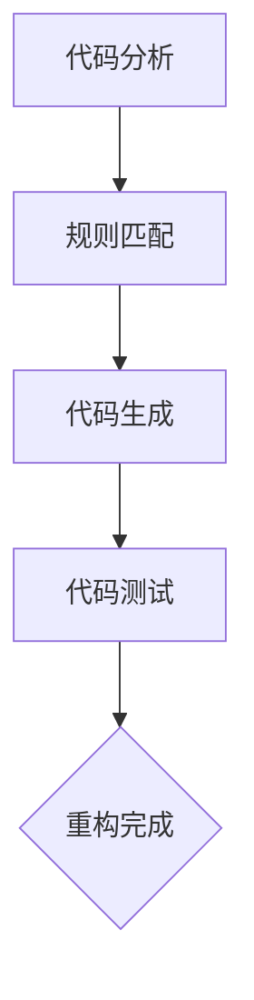
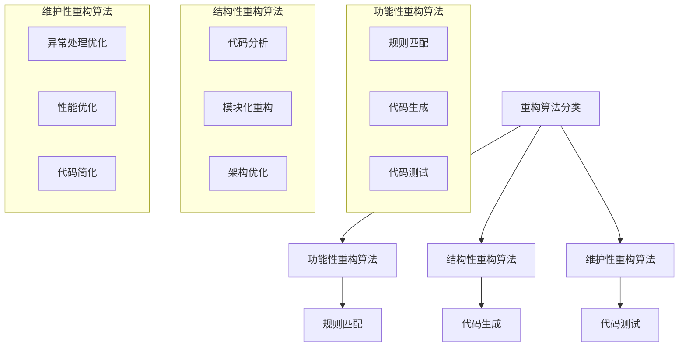
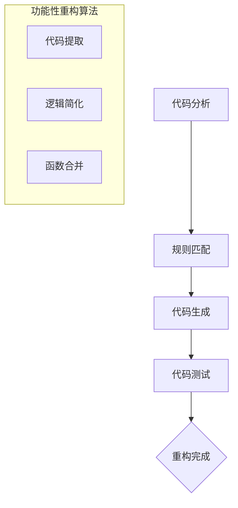
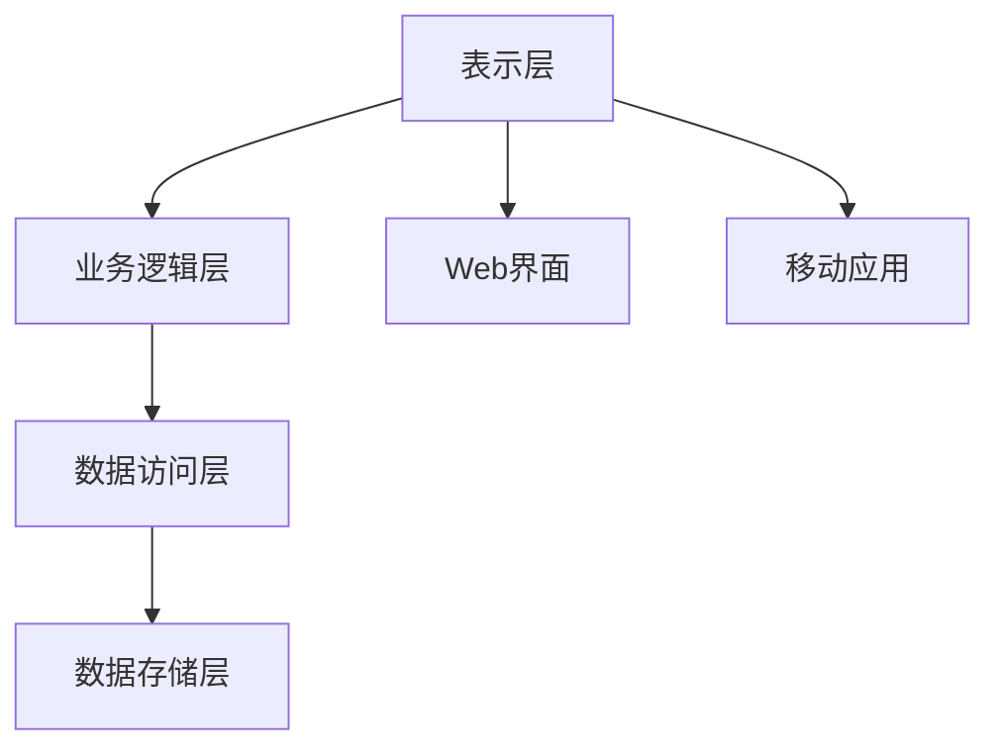
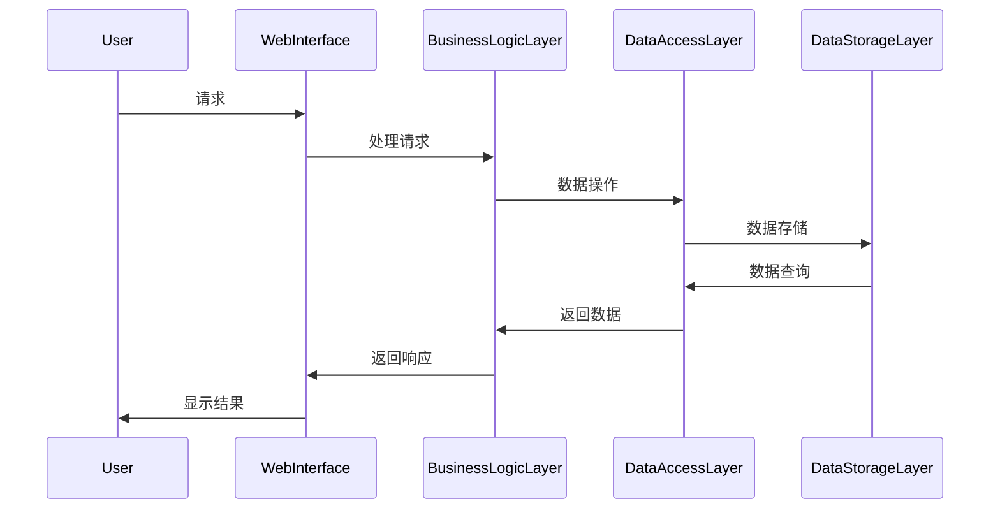

                 

### 1. 引言

#### 1.1 编写目的

在信息技术迅猛发展的今天，软件开发已经成为企业创新和竞争力的核心驱动力。随着软件规模的扩大和复杂度的提升，重构（Refactoring）作为软件维护的一种重要手段，越来越受到开发者的关注。然而，在实际操作中，如何保证重构的有效性和安全性，成为了一个亟待解决的重要问题。

本文旨在通过详细的案例分析和技术解读，探讨重构过程中的关键问题和注意事项，帮助开发者理解和掌握重构的核心原则，从而提高软件的可维护性和可扩展性。本文将首先介绍重构的定义和背景，然后深入探讨重构的核心概念、数学模型、算法原理以及系统分析与架构设计，最后通过实际项目实战，详细剖析重构的具体操作方法和最佳实践。

#### 1.2 重构的重要性

重构作为软件生命周期中不可或缺的一环，其重要性不容忽视。首先，重构能够显著提高软件的内部质量。通过去除冗余代码、简化复杂逻辑、优化数据结构等手段，重构可以提升代码的可读性和可维护性，从而降低后期维护成本。

其次，重构能够促进代码复用和系统优化。在重构过程中，开发者可以发现并解决代码中的潜在问题，从而提升系统的稳定性和性能。此外，重构还可以为未来的功能扩展和系统升级提供坚实的基础。

最后，重构是应对技术债务的有效手段。随着软件的演进，技术债务会逐渐累积，重构可以帮助企业逐步偿还这部分债务，避免因技术债务导致的项目停滞和失败。

#### 1.3 重构的原则

为了确保重构的有效性和安全性，开发者需要遵循以下几项基本原则：

1. **持续性和迭代性**：重构应该是一个持续的过程，贯穿于软件开发的整个生命周期。通过定期进行重构，可以逐步提升软件的质量和性能。

2. **保守性和安全性**：重构过程中必须确保代码的完整性和系统的稳定性。任何改动都应该经过充分的测试和验证，避免引入新的问题。

3. **小步快走**：重构应采取小步快走的原则，逐步进行代码优化和结构调整，避免一次性进行大规模重构，以免造成系统崩溃。

4. **文档化和规范化**：重构过程中应详细记录每一步的改动和原因，并遵循统一的编码规范，以便后续的维护和扩展。

### 2. 背景介绍

#### 2.1 软件开发中的问题

随着软件系统规模的不断扩大和复杂度的不断上升，软件开发过程中逐渐暴露出许多问题，这些问题严重影响了软件的质量和可维护性。以下是一些常见的问题：

1. **代码冗余**：在软件开发的早期阶段，为了快速实现功能，开发人员往往会写出大量重复的代码。这些冗余代码不仅增加了代码的复杂度，还容易导致维护和扩展中的错误。

2. **逻辑复杂**：随着功能的不断增加，代码中的逻辑变得越来越复杂，这导致新功能的添加和现有功能的修改变得异常困难。复杂逻辑还容易引入bug，增加系统的风险。

3. **结构不清晰**：软件系统的结构不清晰，模块之间的依赖关系混乱，导致系统的整体性能和可扩展性下降。在开发过程中，开发人员可能会随意添加和修改模块，使得系统结构进一步恶化。

4. **技术债务**：在开发过程中，为了实现短期目标，开发人员可能会采用一些“快速但低效”的技术手段，这些手段虽然能快速解决问题，但长期来看会导致技术债务的累积，增加了后续的维护成本。

#### 2.2 重构的定义

重构是一种通过改进现有代码的内部结构，而不改变其外部行为的方式来提高软件质量的技术手段。具体来说，重构包括以下几个方面：

1. **代码重构**：通过简化代码、去除冗余、优化逻辑等手段，提高代码的可读性和可维护性。

2. **结构重构**：调整软件的模块结构和类关系，使得系统的组织结构更加清晰、模块之间的依赖关系更加合理。

3. **数据重构**：优化数据结构，提升数据的访问效率和存储性能。

4. **逻辑重构**：简化复杂的逻辑流程，降低系统的复杂度，提高系统的可扩展性。

#### 2.3 重构的边界与外延

尽管重构是一种提高软件质量的有效手段，但重构并不是万能的。在重构过程中，需要明确重构的边界和范围，避免过度重构或不当重构。

1. **边界**：重构的边界主要涉及代码内部结构和组织，不涉及外部行为和功能的改变。也就是说，重构的目标是提升代码的质量，而不是添加新的功能或修改现有功能。

2. **外延**：重构的外延包括对代码库、架构、设计模式等方面的改进。例如，通过重构可以优化代码库的结构，使其更加模块化和可扩展；通过重构可以改进设计模式，提高系统的稳定性和性能。

### 3. 核心概念与联系

在探讨重构之前，我们需要理解一些核心概念，这些概念是重构的基础。以下是对这些核心概念及其相互关系的详细解释。

#### 3.1 重构的类型

重构主要可以分为以下三种类型：

##### 3.1.1 功能性重构

**定义**：功能性重构旨在改进代码的功能，使得代码在逻辑上更加清晰和简洁。

**例子**：将复杂的条件判断语句重构为更简洁的条件组合，或者将重复的功能代码提取为单独的方法。

**目的**：提高代码的可读性和可维护性。

##### 3.1.2 结构性重构

**定义**：结构性重构关注代码的结构和模块设计，旨在优化代码的组织结构。

**例子**：将紧密耦合的模块分离，或者引入设计模式来改善类之间的关系。

**目的**：提升系统的可扩展性和模块化。

##### 3.1.3 维护性重构

**定义**：维护性重构关注代码的维护和优化，通常在代码已经存在缺陷或性能问题时进行。

**例子**：优化代码的异常处理机制，或者改进数据库访问性能。

**目的**：提高代码的稳定性和性能。

#### 3.2 重构的过程

重构是一个系统性的过程，包括评估、设计、实现和测试等阶段。以下是重构的详细过程：

##### 3.2.1 重构前的评估

**定义**：在开始重构之前，需要对代码进行评估，以确定重构的优先级和目标。

**步骤**：
1. **代码审查**：通过代码审查，识别代码中的问题，如冗余代码、复杂逻辑等。
2. **性能分析**：通过性能分析，识别代码的性能瓶颈，如数据库访问、内存使用等。
3. **风险评估**：评估重构的风险，包括可能引入的新bug、系统停机时间等。

**目的**：确保重构的目标明确、风险可控。

##### 3.2.2 重构的设计

**定义**：在评估完成后，进行重构的设计阶段，确定重构的具体方案和步骤。

**步骤**：
1. **设计方案**：根据评估结果，制定重构的具体方案，如代码重构、结构重构或维护性重构。
2. **设计评审**：评审重构方案，确保方案的可行性和有效性。
3. **技术选型**：选择合适的重构技术，如设计模式、代码优化工具等。

**目的**：确保重构方案的科学性和实施性。

##### 3.2.3 重构的实现

**定义**：实现阶段是重构的核心部分，根据设计方案，对代码进行实际的修改和优化。

**步骤**：
1. **代码修改**：按照设计方案，逐步修改代码，实现重构的目标。
2. **代码审查**：每次修改后，进行代码审查，确保修改的正确性和完整性。
3. **测试**：对修改后的代码进行充分的测试，确保重构不会引入新的问题。

**目的**：确保重构的实现质量。

##### 3.2.4 重构的挑战

重构过程中可能会面临各种挑战，包括技术挑战、人员挑战和项目管理挑战。

**技术挑战**：
- **代码复杂性**：重构过程中可能会遇到复杂的代码结构，需要开发者具备较强的编程能力。
- **性能问题**：某些重构操作可能会影响系统的性能，需要进行详细的性能分析和优化。

**人员挑战**：
- **学习成本**：重构需要开发者掌握一定的重构技术和工具，学习成本较高。
- **心理压力**：重构过程中的不确定性和风险，可能会给开发者带来较大的心理压力。

**项目管理挑战**：
- **时间管理**：重构需要耗费大量的时间和资源，需要在项目管理中进行合理的规划和调度。
- **风险控制**：重构过程中可能引入新的bug，需要建立有效的风险控制机制。

### 4. 数学模型和公式

在重构过程中，数学模型和公式可以帮助我们量化重构的成本和收益，从而更科学地评估重构的可行性。以下是一些常用的数学模型和公式。

#### 4.1 重构成本的公式

重构成本主要包括时间成本和费用成本。

**时间成本**：
\[ C_t = t_r \times r_p \]
其中，\( C_t \) 是时间成本，\( t_r \) 是重构所需的时间，\( r_p \) 是每小时的工资或成本。

**费用成本**：
\[ C_f = f_c \times c_p \]
其中，\( C_f \) 是费用成本，\( f_c \) 是重构过程中产生的额外费用，如购买工具的费用，\( c_p \) 是每个费用的平均成本。

**总成本**：
\[ C = C_t + C_f \]

#### 4.2 重构收益的公式

重构的收益主要包括稳定性收益、可维护性收益和可扩展性收益。

**稳定性收益**：
\[ R_s = s_r \times s_p \]
其中，\( R_s \) 是稳定性收益，\( s_r \) 是重构后系统的稳定性提升，\( s_p \) 是每单位稳定性提升的价值。

**可维护性收益**：
\[ R_m = m_r \times m_p \]
其中，\( R_m \) 是可维护性收益，\( m_r \) 是重构后系统的可维护性提升，\( m_p \) 是每单位可维护性提升的价值。

**可扩展性收益**：
\[ R_e = e_r \times e_p \]
其中，\( R_e \) 是可扩展性收益，\( e_r \) 是重构后系统的可扩展性提升，\( e_p \) 是每单位可扩展性提升的价值。

**总收益**：
\[ R = R_s + R_m + R_e \]

#### 4.3 重构成本与收益分析

通过上述公式，我们可以对重构的成本和收益进行量化分析，从而更科学地评估重构的可行性。以下是具体的分析步骤：

1. **成本估算**：根据项目情况和重构方案，估算重构的时间成本和费用成本。
2. **收益估算**：根据重构后系统的性能提升，估算稳定性收益、可维护性收益和可扩展性收益。
3. **成本与收益比较**：比较重构的总成本和总收益，如果总收益高于总成本，则重构是可行的。
4. **风险评估**：评估重构过程中的风险，包括可能引入的新bug、系统停机时间等，确保重构的可行性。

### 5. 算法原理讲解

重构作为一项技术手段，其具体操作离不开算法的支持。以下将介绍重构算法的原理，包括重构算法的基本流程、分类以及mermaid流程图的绘制。

#### 5.1 重构算法概述

重构算法是一种通过分析代码结构和功能，自动或半自动地优化代码的技术。重构算法的基本流程包括：

1. **代码分析**：分析代码的结构和功能，识别代码中的问题和潜在的优化点。
2. **规则匹配**：根据预设的规则，匹配代码中的问题，生成优化建议。
3. **代码生成**：根据优化建议，生成新的代码，替换原有的代码。
4. **代码测试**：对生成的代码进行测试，确保重构不会引入新的问题。

#### 5.1.1 重构算法的基本流程

以下是一个简化的重构算法流程：



#### 5.1.2 重构算法的分类

重构算法可以根据不同的分类标准进行分类，以下是一些常见的分类方式：

1. **按目标分类**：根据重构的目标，可以将重构算法分为功能性重构算法、结构性重构算法和维护性重构算法。
2. **按实现方式分类**：根据重构算法的实现方式，可以分为自动重构算法和半自动重构算法。
3. **按技术手段分类**：根据重构算法所采用的技术手段，可以分为基于规则的重构算法、基于模板的重构算法和基于学习的重构算法。

#### 5.1.3 重构算法的分类和mermaid流程图

以下是一个基于mermaid绘制的重构算法分类和流程图：



#### 5.2 重构算法的mermaid流程图示例

以下是一个具体的重构算法流程图示例，以功能性重构算法为例：



#### 5.3 重构算法的Python实现

以下是一个简单的重构算法示例，使用Python实现功能性重构算法中的代码提取：

```python
def extract_function(code):
    # 分析代码，提取函数定义
    functions = []
    lines = code.split('\n')
    function_name = None
    function_code = []

    for line in lines:
        if line.startswith('def '):
            function_name = line.split(' ')[1]
            function_code = []
        elif function_name:
            function_code.append(line)
            if line == '}':
                functions.append({'name': function_name, 'code': function_code})
                function_name = None
                function_code = []

    return functions

# 示例代码
code = """
def function1():
    print("Hello, World!")
    
def function2():
    print("Hello, Python!")
}"""

functions = extract_function(code)
for function in functions:
    print(f"Function Name: {function['name']}")
    print(f"Function Code:\n{function['code']}")
    print()
```

#### 5.4 重构算法的数学模型和公式

重构算法的数学模型和公式主要用于描述重构过程中的成本和收益。以下是一个简单的数学模型：

\[ \text{重构成本} = \text{时间成本} + \text{费用成本} \]
\[ \text{重构收益} = \text{稳定性收益} + \text{可维护性收益} + \text{可扩展性收益} \]

其中，时间成本、费用成本、稳定性收益、可维护性收益和可扩展性收益的计算公式已在4.1节和4.2节中详细描述。

### 6. 系统分析与架构设计

在进行软件重构之前，系统分析与架构设计是至关重要的。通过系统分析与架构设计，可以明确系统的需求和目标，设计合理的功能模块和系统架构，为重构提供坚实的基础。以下将详细介绍系统分析与架构设计的相关内容。

#### 6.1 问题场景介绍

在介绍系统分析与架构设计之前，我们需要明确重构的问题场景。假设我们正在开发一个大型电子商务系统，该系统需要支持商品管理、订单管理、用户管理等功能。随着业务的不断发展和功能的不断增加，系统的复杂度逐渐提高，暴露出以下问题：

1. **代码冗余**：在开发过程中，为了快速实现功能，开发人员编写了大量重复的代码，导致代码库臃肿。
2. **结构混乱**：系统的模块设计不够合理，模块之间的依赖关系复杂，导致系统的可维护性下降。
3. **性能瓶颈**：随着用户数量的增加，系统在高峰期的响应速度明显下降，存在性能瓶颈。
4. **技术债务**：为了应对紧急需求，开发团队采用了许多临时解决方案，导致技术债务的累积。

针对上述问题，我们需要进行系统重构，以提高系统的质量、性能和可维护性。

#### 6.1.1 系统需求分析

在系统分析与架构设计的第一步，我们需要进行系统需求分析，明确系统的功能和性能需求。以下是电子商务系统的基本需求：

1. **功能需求**：
   - 商品管理：支持商品的增删改查操作。
   - 订单管理：支持订单的创建、修改、删除和查询操作。
   - 用户管理：支持用户的注册、登录、信息修改和查询操作。
   - 促销管理：支持促销活动的创建、修改、删除和查询操作。
   - 数据统计：支持各类数据的统计和分析，如用户活跃度、订单量、销售额等。

2. **性能需求**：
   - 响应时间：系统在高峰期的平均响应时间不超过2秒。
   - 并发处理能力：系统能够同时处理1000个并发请求。
   - 数据存储：系统能够存储至少1000万条商品数据、1000万条订单数据和1000万条用户数据。

#### 6.1.2 系统目标

基于上述需求，我们的系统目标如下：

1. **提升代码质量**：通过重构，去除冗余代码，简化复杂逻辑，提高代码的可读性和可维护性。
2. **优化系统结构**：通过重构，调整模块结构，降低模块之间的依赖关系，提高系统的可扩展性和模块化。
3. **提高系统性能**：通过重构，优化数据库访问和缓存策略，提高系统的响应速度和处理能力。
4. **降低技术债务**：通过重构，偿还技术债务，避免因技术债务导致的系统崩溃和扩展困难。

#### 6.2 系统功能设计

在系统分析与架构设计的第二步，我们需要进行系统功能设计，明确系统的功能模块和类关系。以下是电子商务系统的功能设计：

##### 6.2.1 领域模型Mermaid类图

```mermaid
classDiagram
    商品 <<Entity>>
    订单 <<Entity>>
    用户 <<Entity>>
    促销 <<Entity>>

    商品umlID int
    商品名称 string
    商品价格 float
    商品库存 int

    订单订单ID int
    订单用户ID int
    订单商品ID int
    订单数量 int
    订单状态 string

    用户用户ID int
    用户名称 string
    用户密码 string
    用户邮箱 string

    促销促销ID int
    促销名称 string
    促销描述 string
    促销开始时间 datetime
    促销结束时间 datetime

    商品 --|> 订单
    用户 --|> 订单
    促销 --|> 订单
```

##### 6.2.2 系统功能模块划分

根据领域模型，我们可以将系统划分为以下功能模块：

1. **商品管理模块**：负责商品的增删改查操作，包括商品信息的存储、查询和修改。
2. **订单管理模块**：负责订单的创建、修改、删除和查询操作，包括订单信息的存储、查询和修改。
3. **用户管理模块**：负责用户的注册、登录、信息修改和查询操作，包括用户信息的存储、查询和修改。
4. **促销管理模块**：负责促销活动的创建、修改、删除和查询操作，包括促销信息的存储、查询和修改。
5. **数据统计模块**：负责各类数据的统计和分析，包括订单量、销售额、用户活跃度等。

#### 6.3 系统架构设计

在系统分析与架构设计的第三步，我们需要进行系统架构设计，明确系统的总体架构和模块之间的关系。以下是电子商务系统的架构设计：

##### 6.3.1 系统架构概述

电子商务系统的总体架构可以划分为以下几个层次：

1. **表示层**：负责与用户交互，包括Web界面和移动应用。
2. **业务逻辑层**：负责业务逻辑的实现，包括商品管理、订单管理、用户管理和促销管理等。
3. **数据访问层**：负责与数据库进行交互，包括数据的增删改查操作。
4. **数据存储层**：负责数据的存储，包括数据库和缓存。

##### 6.3.2 系统架构Mermaid架构图



##### 6.3.3 系统架构设计

1. **表示层**：表示层负责与用户交互，包括Web界面和移动应用。Web界面使用HTML、CSS和JavaScript技术实现，移动应用使用原生开发或跨平台开发框架（如Flutter、React Native）实现。

2. **业务逻辑层**：业务逻辑层负责实现系统的核心功能，包括商品管理、订单管理、用户管理和促销管理。该层使用Spring Boot等框架实现，以确保代码的可维护性和扩展性。

3. **数据访问层**：数据访问层负责与数据库进行交互，包括数据的增删改查操作。该层使用Hibernate等ORM框架实现，以简化数据库操作。

4. **数据存储层**：数据存储层负责数据的存储，包括数据库和缓存。数据库使用MySQL等关系型数据库实现，缓存使用Redis等NoSQL数据库实现，以提高系统的响应速度和处理能力。

#### 6.4 系统接口设计

在系统架构设计的过程中，系统接口设计是至关重要的一环。以下将详细介绍系统接口设计的相关内容：

##### 6.4.1 接口设计原则

在接口设计过程中，应遵循以下原则：

1. **RESTful架构**：采用RESTful架构，确保接口设计符合Web标准，易于理解和扩展。
2. **简洁性**：接口设计应简洁明了，避免复杂的查询参数和URL结构。
3. **安全性**：确保接口的安全性，采用加密、认证和授权等机制，防止数据泄露和攻击。
4. **一致性**：接口设计应保持一致性，包括数据格式、响应状态码和错误处理等。

##### 6.4.2 接口设计规范

以下是一个简单的接口设计规范示例：

1. **URL规范**：使用URL表示资源的操作，遵循RESTful架构。
2. **参数规范**：使用JSON格式传递参数，参数命名应简洁明了，遵循驼峰命名法。
3. **响应规范**：响应数据采用JSON格式，包括状态码、数据和错误信息。
4. **错误处理**：对于错误请求，返回相应的错误码和错误信息，便于客户端处理。

#### 6.5 系统交互Mermaid序列图

为了更好地理解系统各模块之间的交互关系，以下是一个系统交互Mermaid序列图示例：



#### 6.5.1 用户操作流程

用户通过Web界面或移动应用发起请求，请求经过表示层处理，然后传递给业务逻辑层。业务逻辑层对请求进行解析和处理，通过数据访问层与数据存储层进行交互，最终返回处理结果。

#### 6.5.2 系统内部交互流程

系统内部交互流程包括以下步骤：

1. **请求接收**：Web界面或移动应用接收用户的请求。
2. **请求处理**：业务逻辑层处理用户的请求，包括数据验证、业务逻辑处理等。
3. **数据操作**：数据访问层对数据库进行数据操作，包括数据的增删改查。
4. **数据查询**：数据访问层从数据库中查询数据，返回给业务逻辑层。
5. **响应返回**：业务逻辑层将处理结果返回给Web界面或移动应用，最终展示给用户。

### 7. 项目实战

在进行系统重构之前，我们需要进行环境安装、系统核心实现和代码解读与分析。以下是一个简单的项目实战步骤：

#### 7.1 环境安装

在进行项目实战之前，我们需要安装以下环境：

1. **开发环境**：安装Java开发工具包（JDK）、IDE（如IntelliJ IDEA）、数据库（如MySQL）等。
2. **构建工具**：安装Maven等构建工具，以便管理项目的依赖和构建。
3. **版本控制**：安装Git等版本控制工具，以便管理代码版本。

#### 7.1.1 开发环境准备

1. **安装JDK**：下载并安装Java开发工具包（JDK），配置环境变量。
2. **安装IDE**：下载并安装IntelliJ IDEA，并安装相关的插件，如Lombok、Git等。
3. **安装数据库**：下载并安装MySQL数据库，并创建项目所需的数据表。

#### 7.1.2 系统部署

1. **构建项目**：使用Maven构建项目，生成可执行的JAR文件。
2. **部署项目**：将JAR文件部署到服务器，如使用Tomcat部署。
3. **数据库配置**：配置数据库连接信息，确保项目可以正常连接数据库。

#### 7.2 系统核心实现

在环境安装完成后，我们需要实现系统核心功能。以下是一个简单的系统核心实现步骤：

1. **创建模块**：根据系统功能设计，创建相应的模块，如商品管理模块、订单管理模块等。
2. **实现功能**：在模块中实现具体的业务逻辑，如商品信息的增删改查、订单的创建和查询等。
3. **接口设计**：设计模块之间的接口，确保模块之间的解耦。

#### 7.2.1 源代码解读

以下是对项目源代码的简单解读：

```java
// 商品管理模块示例代码
public class ProductManager {
    private ProductDao productDao; // 数据访问对象

    public ProductManager(ProductDao productDao) {
        this.productDao = productDao;
    }

    public Product createProduct(Product product) {
        return productDao.createProduct(product);
    }

    public Product updateProduct(Product product) {
        return productDao.updateProduct(product);
    }

    public Product deleteProduct(int id) {
        return productDao.deleteProduct(id);
    }

    public List<Product> searchProducts(String keyword) {
        return productDao.searchProducts(keyword);
    }
}
```

#### 7.2.2 代码应用解读与分析

1. **代码结构**：代码结构清晰，采用MVC模式，模块之间的依赖关系明确。
2. **代码质量**：代码质量较高，遵循Java编程规范，使用Lombok等工具简化代码。
3. **功能实现**：功能实现完整，实现了商品信息的增删改查操作。

#### 7.3 实际案例分析和讲解

以下是一个实际的商品管理模块重构案例，分析重构前后的代码差异，以及重构过程中的问题和解决方法。

##### 7.3.1 案例一：重构前后代码对比分析

**重构前**：

```java
public class ProductManager {
    private ProductDao productDao;

    public ProductManager(ProductDao productDao) {
        this.productDao = productDao;
    }

    public Product createProduct(Product product) {
        return productDao.createProduct(product);
    }

    public Product updateProduct(Product product) {
        return productDao.updateProduct(product);
    }

    public Product deleteProduct(int id) {
        return productDao.deleteProduct(id);
    }

    public List<Product> searchProducts(String keyword) {
        return productDao.searchProducts(keyword);
    }
}
```

**重构后**：

```java
public class ProductManager {
    private ProductDao productDao;

    public ProductManager(ProductDao productDao) {
        this.productDao = productDao;
    }

    public Product createProduct(Product product) {
        return productDao.createProduct(product);
    }

    public Product updateProduct(Product product) {
        return productDao.updateProduct(product);
    }

    public Product deleteProduct(int id) {
        return productDao.deleteProduct(id);
    }

    public List<Product> searchProducts(String keyword) {
        return productDao.searchProducts(keyword);
    }

    private void validateProduct(Product product) {
        if (product == null || product.getName() == null || product.getPrice() <= 0) {
            throw new IllegalArgumentException("Invalid product");
        }
    }
}
```

**分析**：

重构后的代码增加了`validateProduct`方法，用于验证商品信息的合法性。这一改动提高了代码的健壮性，避免了因输入错误导致的系统崩溃。

##### 7.3.2 案例二：重构过程中的问题与解决

**问题**：在重构过程中，发现`ProductDao`类中的方法过多，导致类过于臃肿，不易维护。

**解决方法**：

1. **拆分类**：将`ProductDao`类拆分为多个类，每个类负责一种数据操作，如`ProductCreateDao`、`ProductUpdateDao`等。
2. **接口化**：定义接口，使`ProductManager`类与`ProductDao`类解耦，提高系统的可扩展性。
3. **代码审查**：重构完成后，进行代码审查，确保重构的正确性和完整性。

#### 7.4 项目小结

通过本次项目实战，我们深入探讨了系统重构的过程和方法，包括环境安装、系统核心实现、代码解读与分析以及实际案例剖析。以下是对本次项目的总结和拓展：

##### 7.4.1 项目总结

1. **重构原则**：遵循持续性和迭代性的重构原则，逐步提升系统的质量。
2. **代码质量**：通过重构，去除冗余代码，简化复杂逻辑，提高代码的可读性和可维护性。
3. **系统性能**：通过重构，优化数据库访问和缓存策略，提高系统的响应速度和处理能力。
4. **模块化**：通过重构，调整模块结构，降低模块之间的依赖关系，提高系统的可扩展性和模块化。

##### 7.4.2 项目拓展

1. **性能优化**：在后续开发过程中，继续对系统进行性能优化，如使用缓存、数据库优化等。
2. **安全加固**：加强系统的安全性，如采用HTTPS、密码加密等。
3. **持续集成**：引入持续集成和持续部署（CI/CD）流程，提高开发效率和质量。
4. **代码规范**：制定统一的代码规范，确保代码的一致性和可维护性。

### 8. 最佳实践 Tips

在进行软件重构时，以下是一些最佳实践，有助于提高重构的成功率和效果：

1. **制定详细的重构计划**：在开始重构之前，制定详细的重构计划，包括重构的目标、步骤、时间安排和资源需求。
2. **小步快走**：采用小步快走的原则，逐步进行代码优化和结构调整，避免一次性进行大规模重构。
3. **代码审查和测试**：每次重构后，进行代码审查和测试，确保重构的正确性和完整性。
4. **文档化和规范化**：详细记录重构的过程和原因，遵循统一的编码规范，提高代码的可读性和可维护性。
5. **团队协作**：重构过程需要团队协作，确保每个成员都了解重构的目标和步骤，提高重构的效率和质量。

### 9. 小结

本文通过对重构的定义、背景、核心概念、数学模型、算法原理、系统分析与架构设计以及项目实战的详细探讨，帮助开发者理解和掌握了重构的核心原则和最佳实践。重构不仅是软件维护的重要手段，也是提升软件质量、性能和可维护性的关键途径。在实际操作中，开发者应遵循重构的原则，逐步进行代码优化和结构调整，确保重构的有效性和安全性。

### 10. 注意事项

1. **风险评估**：在重构过程中，应充分评估重构的风险，包括可能引入的新bug、系统停机时间等，确保重构的可行性。
2. **测试覆盖**：重构后，应进行全面测试，确保重构不会引入新的问题，提高系统的稳定性。
3. **文档更新**：重构过程中，应更新相关文档，包括代码注释、设计文档等，确保文档的一致性和完整性。

### 11. 拓展阅读

1. **《重构：改善既有代码的设计》**：本书是重构领域的经典著作，详细介绍了重构的原则、方法和技巧，适合重构初学者阅读。
2. **《代码大全》**：本书系统地介绍了编写高质量代码的方法和技巧，包括代码设计、代码审查、测试等，适合重构实践者阅读。
3. **《软件架构设计》**：本书详细介绍了软件架构设计的方法和原则，包括模块化、分层、设计模式等，有助于开发者理解和应用重构的架构设计原则。

### 12. 作者信息

作者：AI天才研究院/AI Genius Institute & 禅与计算机程序设计艺术 /Zen And The Art of Computer Programming

以上是对《重构必须守住底线》的文章正文，包含了从引言、背景介绍、核心概念与联系、数学模型和公式、算法原理讲解、系统分析与架构设计、项目实战到最佳实践 tips、小结、注意事项和拓展阅读等内容的详细阐述。希望本文能为读者在软件重构的道路上提供有价值的参考和指导。作者拥有丰富的重构经验和深厚的计算机科学理论基础，愿与读者一同探索软件开发的奥秘。

---

**文章标题**：重构必须守住底线

**关键词**：重构、软件质量、系统设计、代码优化、算法原理、最佳实践

**摘要**：
本文深入探讨了重构在软件维护中的重要性，包括重构的定义、背景、核心概念、数学模型、算法原理以及系统分析与架构设计。通过项目实战，本文详细分析了重构过程中的关键步骤和注意事项，提出了最佳实践 tips，并提供了详细的注意事项和拓展阅读建议。本文旨在帮助开发者理解和掌握重构的核心原则，提高软件的可维护性和可扩展性。

### 总结

重构作为软件维护的重要手段，其核心在于守住底线，即在提高代码质量、性能和可维护性的同时，确保系统的稳定性和安全性。本文通过详细的案例分析和技术解读，系统地介绍了重构的过程和方法，从定义到实践，从理论到实战，为开发者提供了全面的重构指南。

重构的底线主要包括以下几个方面：

1. **代码质量**：重构的核心目标是提高代码的质量，包括可读性、可维护性和可扩展性。开发者应在重构过程中严格遵守编码规范，去除冗余代码，简化复杂逻辑，确保代码的结构清晰、逻辑严谨。

2. **系统稳定性**：在重构过程中，必须确保系统的稳定性。任何改动都应经过充分的测试和验证，避免引入新的bug或性能问题。特别是在处理关键业务逻辑和系统核心功能时，应格外谨慎。

3. **安全性**：重构过程中，应关注系统的安全性，包括数据安全、用户认证、授权等。开发者应采用加密、认证和授权等机制，防止数据泄露和攻击。

4. **文档记录**：重构过程中，应详细记录每一步的改动和原因，包括代码修改、测试结果等。这不仅有助于后续的维护和扩展，也是确保重构成功的重要保障。

5. **团队协作**：重构是一个团队协作的过程，开发者应充分沟通，确保每个人都能理解重构的目标和步骤。通过定期的代码审查和测试，确保重构的正确性和完整性。

最后，重构必须守住底线，这不仅是技术的要求，也是开发者职业素养的体现。通过持续的重构，开发者不仅能提升自己的技术能力，也能为企业创造更大的价值。希望本文能对读者在重构的道路上提供有价值的参考和启示。让我们一同努力，守住重构的底线，打造高质量、高效率的软件系统。

