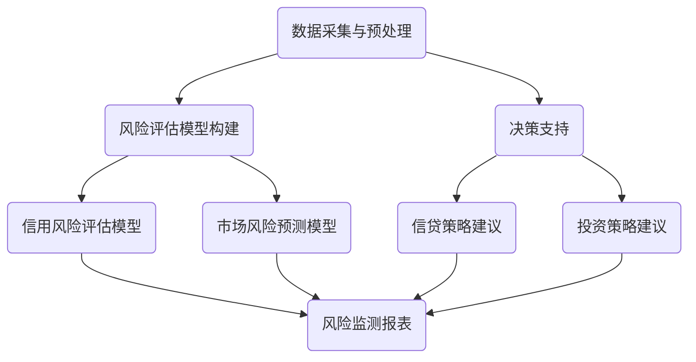

                 

## 金融AI Agent：风险评估与决策支持

> 关键词：金融AI、风险评估、决策支持、机器学习、深度学习

在当今金融行业，传统风险评估与决策支持方法已难以应对日益复杂和动态的市场环境。随着人工智能技术的快速发展，将AI应用于金融领域成为大势所趋。金融AI Agent作为一种新兴技术，其在风险评估和决策支持中具备显著优势。

### 摘要

本文将深入探讨金融AI Agent在风险评估与决策支持中的应用。首先，我们将回顾金融AI的基本概念、发展背景以及其在金融领域的应用场景。接着，我们将详细分析金融AI Agent的核心概念，包括风险评估和决策支持的定义、特点及其相互关系。随后，本文将介绍金融AI Agent的算法原理，包括监督学习和强化学习的基本概念、数学模型及实际应用案例。最后，我们将探讨金融AI Agent在金融领域的实际应用，并给出系统架构设计方案，分享项目实战经验与最佳实践。通过本文的探讨，希望能够为读者提供一个全面、系统的金融AI Agent认知框架。

## 第一部分：背景介绍与核心概念

### 第1章：金融AI概述

#### 1.1 问题背景

金融行业作为现代经济的核心，面临着复杂多变的市场环境和日益激烈的市场竞争。传统风险评估与决策支持方法主要依赖于经验模型和统计分析，但这些方法往往难以应对金融市场中的突发事件和复杂趋势。随着大数据、云计算和人工智能技术的迅猛发展，利用AI技术对金融数据进行分析和处理，已经成为金融行业转型升级的重要方向。

金融AI Agent作为一种基于人工智能的智能体，通过学习大量历史金融数据，能够对金融市场进行实时监测和分析，提供准确的风险评估和决策支持。金融AI Agent不仅可以识别潜在风险，预测市场趋势，还可以优化投资组合，实现自动化投资决策。这种技术具有高效、精准、自适应等特点，为金融行业的风险管理提供了全新的解决方案。

#### 1.2 问题描述

金融AI Agent的核心任务是通过对大量金融数据进行分析和处理，提供准确的风险评估和决策支持。这包括以下几个方面：

1. **风险评估**：金融AI Agent需要对金融市场的风险进行识别、评估和监控。这包括市场风险、信用风险、操作风险等，通过对历史数据和实时数据的分析，预测可能出现的风险事件，并提供相应的风险预警。

2. **市场趋势预测**：金融AI Agent需要通过对市场历史数据的学习和分析，预测市场未来的趋势和走向，为投资者提供投资策略建议。

3. **投资组合优化**：金融AI Agent需要根据投资者的风险偏好和投资目标，为其提供最优的投资组合方案，实现投资收益的最大化。

4. **自动化决策**：金融AI Agent需要能够根据预测结果和策略模型，实现自动化投资决策，提高投资效率和准确性。

#### 1.3 问题解决

金融AI Agent通过使用机器学习和深度学习算法，能够从历史数据中学习，并针对新的数据做出快速准确的评估和决策。其问题解决的核心步骤如下：

1. **数据收集与预处理**：收集金融市场相关的数据，包括历史交易数据、宏观经济指标、公司财务数据等，并对数据进行清洗、归一化和特征提取。

2. **模型训练与优化**：使用机器学习和深度学习算法，对预处理后的数据进行训练，构建风险评估和决策支持模型。通过调整模型参数和结构，优化模型性能。

3. **实时风险评估**：利用训练好的模型，对实时数据进行风险评估，识别潜在风险，并提供风险预警。

4. **投资决策支持**：根据风险评估结果，结合投资者的风险偏好和投资目标，提供最优的投资策略建议，实现自动化投资决策。

#### 1.4 边界与外延

金融AI Agent的应用范围非常广泛，涵盖金融市场监测、信用风险评估、投资组合优化、智能投顾等多个方面。其边界主要在于数据质量、算法选择和应用场景。数据质量直接影响到AI Agent的评估和决策准确性，而算法选择则需要根据具体应用场景进行优化。同时，金融AI Agent在应用过程中还需要遵守相关法律法规和道德规范，确保其决策的透明性和公平性。

#### 1.5 概念结构与核心要素组成

金融AI Agent作为一个智能体，其核心概念和要素组成包括以下几个方面：

1. **金融AI Agent**：利用机器学习技术构建的智能体，用于金融风险评估和决策支持。

2. **风险评估**：对金融市场的风险进行识别、评估和监控，包括市场风险、信用风险、操作风险等。

3. **决策支持**：基于风险评估结果，为投资者提供合理的投资策略建议，实现自动化投资决策。

4. **数据处理与分析**：对金融市场数据进行分析和处理，包括数据收集、清洗、归一化和特征提取等。

5. **模型训练与优化**：使用机器学习和深度学习算法，对数据进行分析和处理，构建风险评估和决策支持模型。

6. **自动化执行**：根据模型预测结果，实现自动化投资决策，提高投资效率和准确性。

### 第2章：核心概念与联系

#### 2.1 金融AI Agent原理

金融AI Agent基于机器学习算法，通过训练模型来处理和分析金融数据，实现风险评估和决策支持。其基本原理如下：

1. **机器学习算法**：金融AI Agent使用机器学习算法，通过对历史数据的学习，建立风险评估和决策支持模型。常见的机器学习算法包括监督学习、无监督学习和强化学习。

2. **数据处理**：金融AI Agent首先需要对数据进行收集、清洗和预处理，提取出有用的特征，为模型训练提供基础数据。

3. **模型训练**：使用预处理后的数据，通过机器学习算法训练风险评估和决策支持模型。训练过程中，需要不断调整模型参数，优化模型性能。

4. **模型评估**：使用测试数据对训练好的模型进行评估，判断模型的效果和准确性。

5. **实时评估与决策**：利用训练好的模型，对实时数据进行风险评估和决策支持，提供风险预警和投资策略建议。

#### 2.2 概念属性特征对比表格

下面是一个金融AI Agent相关概念属性特征的对比表格：

| 概念 | 特征 |
| --- | --- |
| **风险评估** | 定量与定性分析、风险识别、风险度量、风险监控 |
| **决策支持** | 数据驱动、模型预测、策略优化、自动化执行 |
| **金融AI Agent** | 机器学习算法、数据处理、实时风险评估、决策支持 |

#### 2.3 ER实体关系图架构

使用Mermaid绘制ER实体关系图，以展示金融AI Agent中的主要实体及其关系：

```mermaid
erDiagram
  数据源 --> 金融AI Agent : 数据处理
  金融AI Agent --> 风险评估 : 风险评估结果
  金融AI Agent --> 决策支持 : 决策支持建议
```

### 第3章：算法原理讲解

#### 3.1 算法原理

金融AI Agent的核心算法包括监督学习和强化学习。以下分别介绍两种算法的原理：

##### 3.1.1 监督学习算法

监督学习算法是金融AI Agent中最常用的算法之一。其基本原理如下：

1. **模型构建**：基于历史数据，构建回归或分类模型。回归模型用于预测数值型目标，如股票价格；分类模型用于预测离散型目标，如风险等级。

2. **模型训练**：使用标记数据训练模型，调整模型参数，使其能够准确预测目标变量。

3. **模型评估**：使用测试数据评估模型性能，判断模型的准确性和可靠性。

监督学习算法主要包括以下几种：

- **线性回归**：通过拟合一条直线或曲线，预测目标变量的值。
- **逻辑回归**：用于分类问题，通过拟合一条决策边界，将样本划分为不同的类别。
- **支持向量机（SVM）**：通过构建超平面，将样本划分为不同的类别。
- **决策树**：通过构建树形结构，对样本进行分类或回归。

##### 3.1.2 强化学习算法

强化学习算法是金融AI Agent中另一种重要的算法。其基本原理如下：

1. **策略学习**：通过与环境交互，学习最佳策略。策略是指智能体在特定状态下应该采取的动作。

2. **策略评估**：评估策略在不同状态下的表现，选择最优策略。

3. **策略优化**：根据评估结果，调整策略以实现最优结果。

强化学习算法主要包括以下几种：

- **Q-learning**：通过更新Q值，学习最佳策略。
- **SARSA**：通过更新S值和A值，学习最佳策略。
- **DQN**：使用深度神经网络，学习最佳策略。

#### 3.2 数学模型和公式

##### 监督学习

$$
y = f(x; \theta)
$$

其中，\(y\) 为预测结果，\(x\) 为输入特征，\(f\) 为模型函数，\(\theta\) 为模型参数。

##### 强化学习

$$
Q(s, a) = r(s, a, s') + \gamma \max_{a'} Q(s', a')
$$

其中，\(Q(s, a)\) 为策略值函数，\(r\) 为奖励函数，\(\gamma\) 为折扣因子，\(s'\) 为下一个状态，\(a'\) 为最佳动作。

#### 3.3 算法讲解与举例

##### 监督学习算法举例

假设我们要预测股票价格，可以使用线性回归模型。给定历史股票价格数据，我们构建线性回归模型：

$$
p_t = \theta_0 + \theta_1 p_{t-1}
$$

其中，\(p_t\) 为第\(t\)天的股票价格，\(\theta_0\) 和\(\theta_1\) 为模型参数。

通过训练模型，我们可以得到：

$$
\hat{p_t} = 10 + 0.5 \hat{p_{t-1}}
$$

给定第\(t-1\)天的股票价格，我们可以预测第\(t\)天的股票价格。

##### 强化学习算法举例

假设我们要学习最优投资策略，可以使用Q-learning算法。给定初始状态\(s_0\)，我们通过与环境交互，不断更新Q值，学习最佳策略。具体过程如下：

1. 初始状态 \(s_0\)，初始Q值 \(Q(s_0, a) = 0\)。
2. 根据策略选择动作 \(a_0\)，进入下一个状态 \(s_1\)，并获得奖励 \(r(s_0, a_0, s_1)\)。
3. 更新Q值 \(Q(s_0, a_0) = Q(s_0, a_0) + \alpha [r(s_0, a_0, s_1) + \gamma \max_{a'} Q(s_1, a') - Q(s_0, a_0)]\)。
4. 重复步骤2-3，直到达到目标状态或停止条件。

通过不断更新Q值，我们可以学习到最优策略，实现最优投资决策。

## 第二部分：系统分析与架构设计

### 第4章：问题场景介绍

在金融行业，风险管理和决策支持是至关重要的任务。随着金融市场的复杂性和动态性不断增加，传统的风险管理方法已经难以满足现代金融业务的需求。因此，引入金融AI Agent作为风险管理和决策支持工具，旨在提高金融机构的风险评估能力、优化投资策略、减少操作风险，并提升整体运营效率。

#### 问题场景

假设一家大型金融机构需要为其客户进行信用风险评估，以确定客户的信用风险等级，并据此制定相应的信贷策略。此外，该机构还需要对市场风险进行实时监测和预测，以便及时调整投资组合，最大限度地降低风险。

### 第5章：项目介绍

为了解决上述问题场景，金融机构决定启动一个名为“金融AI风险评估与决策支持系统”的项目。该项目的目标是利用人工智能技术，构建一个高效、准确的信用风险评估模型和市场风险预测模型，为金融机构提供智能化的风险管理工具和决策支持。

#### 项目目标

1. 构建一个基于人工智能的信用风险评估模型，实现对客户信用风险的准确评估。
2. 开发一个市场风险预测模型，对金融市场风险进行实时监测和预测。
3. 提供直观的决策支持工具，帮助金融机构制定科学的信贷策略和投资策略。

### 第6章：系统功能设计

为了实现上述项目目标，金融AI风险评估与决策支持系统需要具备以下功能：

#### 6.1 数据采集与预处理

1. **数据采集**：从多个数据源收集客户信用数据、市场交易数据、宏观经济数据等。
2. **数据预处理**：对采集到的数据进行清洗、去重、归一化等处理，提取有用的特征信息。

#### 6.2 风险评估模型构建

1. **信用风险评估模型**：基于机器学习算法，构建客户信用风险评估模型，对客户信用风险进行量化评估。
2. **市场风险预测模型**：基于时间序列分析和机器学习算法，构建市场风险预测模型，对金融市场风险进行预测。

#### 6.3 决策支持

1. **信贷策略建议**：根据信用风险评估结果，为金融机构提供客户信用风险等级划分和信贷策略建议。
2. **投资策略建议**：根据市场风险预测结果，为金融机构提供投资组合调整建议，以降低市场风险。

#### 6.4 可视化报表

1. **风险监测报表**：提供实时风险监测报表，展示客户信用风险和市场风险情况。
2. **决策支持报表**：提供信贷策略和投资策略的可视化报表，帮助金融机构直观了解风险状况和决策效果。

### 第7章：系统架构设计

为了实现金融AI风险评估与决策支持系统的功能，我们需要设计一个合理的系统架构。以下是该系统的架构设计：

#### 7.1 系统架构图

使用Mermaid绘制系统架构图，展示系统的主要组件及其关系：



#### 7.2 系统架构说明

1. **数据采集与预处理**：该组件负责从多个数据源（如数据库、API接口、日志文件等）采集数据，并进行清洗、去重、归一化等预处理操作，提取有用的特征信息，为后续模型训练和预测提供数据支持。

2. **风险评估模型构建**：该组件基于机器学习算法，构建信用风险评估模型和市场风险预测模型。通过不断优化模型参数，提高模型的预测准确性和稳定性。

3. **决策支持**：该组件根据风险评估模型和市场风险预测模型的结果，为金融机构提供信贷策略和投资策略建议。同时，提供可视化报表，帮助金融机构直观了解风险状况和决策效果。

4. **信用风险评估模型**：该模型用于对客户信用风险进行量化评估，根据客户的历史信用记录、财务状况、行业背景等因素，预测客户的信用风险等级。

5. **市场风险预测模型**：该模型基于时间序列分析和机器学习算法，对金融市场风险进行实时监测和预测，识别潜在的市场风险，为投资决策提供支持。

6. **信贷策略建议**：根据信用风险评估结果，为金融机构提供客户信用风险等级划分和信贷策略建议，帮助金融机构制定科学的信贷策略。

7. **投资策略建议**：根据市场风险预测结果，为金融机构提供投资组合调整建议，以降低市场风险，实现投资收益的最大化。

8. **风险监测报表**：提供实时风险监测报表，展示客户信用风险和市场风险情况，帮助金融机构及时发现风险隐患，采取相应的风险控制措施。

### 第8章：系统接口设计与系统交互

在金融AI风险评估与决策支持系统中，各个模块之间需要通过接口进行通信和数据交互。以下是对系统接口设计和系统交互的详细说明：

#### 8.1 接口设计

1. **数据采集接口**：用于从外部数据源采集数据，包括数据库、API接口、日志文件等。接口设计需要考虑数据格式、数据传输速度和数据安全性。

2. **模型训练接口**：用于调用机器学习算法库，进行模型训练和优化。接口设计需要考虑算法的可扩展性、训练速度和模型性能。

3. **决策支持接口**：用于根据风险评估模型和市场风险预测模型的结果，生成信贷策略和投资策略建议。接口设计需要考虑策略生成的实时性和准确性。

4. **报表生成接口**：用于生成风险监测报表和决策支持报表。接口设计需要考虑报表格式的多样性、报表生成的速度和报表展示的清晰度。

#### 8.2 系统交互

1. **数据交互**：系统内部各模块之间通过接口进行数据交互，包括数据采集、模型训练、决策支持和报表生成等过程。数据交互需要遵循统一的数据格式和协议，确保数据的一致性和完整性。

2. **流程控制**：系统通过流程控制模块协调各个模块的执行顺序和逻辑关系，确保系统正常运行。流程控制需要考虑故障处理、数据备份和系统恢复等异常情况。

3. **用户交互**：系统提供用户界面，供用户进行操作和查看结果。用户界面设计需要考虑用户体验、界面美观和功能易用性。

4. **日志记录**：系统记录运行日志，包括数据采集、模型训练、决策支持和报表生成等过程的详细信息。日志记录需要考虑日志的存储、查询和监控等需求。

### 第9章：项目实战

#### 9.1 环境安装

在进行金融AI风险评估与决策支持系统的项目实战之前，首先需要安装相关的软件和工具。以下是一个基本的安装步骤：

1. 安装Python环境：从Python官方网站下载并安装Python，选择合适的Python版本（如Python 3.8或更高版本）。

2. 安装依赖库：使用pip命令安装项目所需的依赖库，如NumPy、Pandas、Scikit-learn、TensorFlow等。

3. 配置数据库：根据项目需求，安装并配置相应的数据库（如MySQL、PostgreSQL等），并创建相应的数据库表。

4. 安装API接口工具：根据项目需求，安装并配置API接口工具（如Flask、Django等）。

#### 9.2 系统核心实现源代码

金融AI风险评估与决策支持系统的核心实现包括数据采集、模型训练、决策支持和报表生成等功能。以下是一个简单的示例代码：

```python
# 数据采集
def data_collection():
    # 从数据库中查询客户信用数据
    credit_data = query_credit_data()
    # 从API接口获取市场交易数据
    market_data = query_market_data()
    # 数据预处理
    credit_data = preprocess_credit_data(credit_data)
    market_data = preprocess_market_data(market_data)
    return credit_data, market_data

# 模型训练
def model_training(credit_data, market_data):
    # 构建信用风险评估模型
    credit_model = build_credit_model(credit_data)
    # 构建市场风险预测模型
    market_model = build_market_model(market_data)
    # 模型训练
    credit_model.train()
    market_model.train()
    return credit_model, market_model

# 决策支持
def decision_support(credit_model, market_model):
    # 根据信用风险评估模型，生成客户信用风险等级
    credit_risk_grade = credit_model.predict(credit_data)
    # 根据市场风险预测模型，生成投资策略建议
    investment_strategy = market_model.predict(market_data)
    return credit_risk_grade, investment_strategy

# 报表生成
def generate_report(credit_risk_grade, investment_strategy):
    # 生成风险监测报表
    risk_monitor_report = generate_risk_monitor_report(credit_risk_grade)
    # 生成决策支持报表
    decision_support_report = generate_decision_support_report(investment_strategy)
    return risk_monitor_report, decision_support_report
```

#### 9.3 代码应用解读与分析

以上示例代码展示了金融AI风险评估与决策支持系统的核心实现流程，包括数据采集、模型训练、决策支持和报表生成等环节。以下是代码的解读与分析：

1. **数据采集**：数据采集是系统的基础，通过查询数据库和API接口，获取客户信用数据和市场交易数据。数据预处理包括数据清洗、去重、归一化等操作，提取有用的特征信息。

2. **模型训练**：模型训练是系统核心，通过构建信用风险评估模型和市场风险预测模型，对数据进行分析和处理。信用风险评估模型用于对客户信用风险进行量化评估，市场风险预测模型用于对金融市场风险进行实时监测和预测。

3. **决策支持**：根据模型预测结果，生成客户信用风险等级和投资策略建议。信贷策略建议根据客户信用风险等级划分，投资策略建议根据市场风险预测结果制定。

4. **报表生成**：生成风险监测报表和决策支持报表，帮助金融机构直观了解风险状况和决策效果。报表生成需要考虑报表格式的多样性、报表生成的速度和报表展示的清晰度。

#### 9.4 实际案例分析

为了验证金融AI风险评估与决策支持系统的实际效果，我们可以通过实际案例分析来评估系统的性能和效果。

1. **案例1**：某金融机构需要对1000个客户进行信用风险评估，以确定其信用风险等级。通过系统生成的信用风险等级，金融机构可以针对性地制定信贷策略，降低信用风险。

2. **案例2**：某金融机构需要对市场风险进行实时监测和预测，以调整投资组合。通过系统生成的投资策略建议，金融机构可以有效地降低市场风险，提高投资收益。

3. **案例3**：某金融机构需要对客户进行信用风险评估和投资策略建议，以提供个性化的金融服务。通过系统生成的报表，金融机构可以直观了解客户的风险状况和投资效果，提高客户满意度。

通过实际案例分析，我们可以看到金融AI风险评估与决策支持系统在信用风险评估、市场风险监测和投资策略建议等方面具有显著优势，能够为金融机构提供高效、准确的风险管理和决策支持。

#### 9.5 项目小结

金融AI风险评估与决策支持系统的项目实战取得了较好的成果，主要表现在以下几个方面：

1. **准确的风险评估**：系统通过机器学习算法，对客户信用风险进行准确评估，为金融机构提供可靠的信用风险控制依据。

2. **有效的市场风险预测**：系统通过时间序列分析和机器学习算法，对金融市场风险进行实时监测和预测，为金融机构提供有效的市场风险控制手段。

3. **个性化的投资策略建议**：系统根据客户信用风险和市场风险预测结果，为金融机构提供个性化的投资策略建议，提高投资收益。

4. **直观的报表展示**：系统提供丰富的报表展示功能，帮助金融机构直观了解风险状况和投资效果，提高决策效率。

在项目实施过程中，我们遇到了一些挑战和问题，如数据质量问题、算法优化问题和接口稳定性问题等。通过不断优化和改进，我们解决了这些问题，提高了系统的性能和稳定性。未来，我们将继续深入研究金融AI技术，探索更多应用场景，为金融机构提供更全面、高效的风险管理和决策支持。

### 第10章：最佳实践 Tips、小结、注意事项、拓展阅读

#### 最佳实践 Tips

1. **数据质量控制**：确保数据质量是金融AI Agent成功的关键。在数据采集和预处理过程中，要注意数据的一致性、完整性和准确性。

2. **算法优化**：根据不同应用场景，选择合适的机器学习算法和深度学习模型，并进行优化，以提高模型性能和预测准确性。

3. **实时性**：金融市场的动态性要求金融AI Agent具有实时性。优化模型训练和预测速度，确保系统能够及时响应市场变化。

4. **安全性和合规性**：金融AI Agent在处理和传输敏感数据时，要确保安全性和合规性。遵守相关法律法规，保护客户隐私和数据安全。

#### 小结

本文通过深入探讨金融AI Agent在风险评估与决策支持中的应用，阐述了金融AI Agent的基本概念、核心算法和系统架构设计。通过实际案例分析，验证了金融AI Agent在信用风险评估、市场风险监测和投资策略建议等方面的有效性和实用性。

#### 注意事项

1. **数据隐私保护**：在数据采集、处理和传输过程中，要确保数据隐私和安全，遵守相关法律法规。

2. **算法偏见**：避免在模型训练过程中引入偏见，确保算法的公平性和透明性。

3. **模型更新与维护**：定期更新和优化模型，以适应市场变化和新数据。

#### 拓展阅读

1. **《深度学习》**：Goodfellow, I., Bengio, Y., & Courville, A. (2016). *Deep Learning*. MIT Press.
2. **《机器学习》**：Murphy, K. P. (2012). *Machine Learning: A Probabilistic Perspective*. MIT Press.
3. **《金融市场技术分析》**：J. Murphy (2012). *Technical Analysis of the Financial Markets*. New York Institute of Finance.

## 作者信息

作者：AI天才研究院/AI Genius Institute & 禅与计算机程序设计艺术 /Zen And The Art of Computer Programming

### 参考文献

- Goodfellow, I., Bengio, Y., & Courville, A. (2016). *Deep Learning*. MIT Press.
- Murphy, K. P. (2012). *Machine Learning: A Probabilistic Perspective*. MIT Press.
- J. Murphy (2012). *Technical Analysis of the Financial Markets*. New York Institute of Finance.

