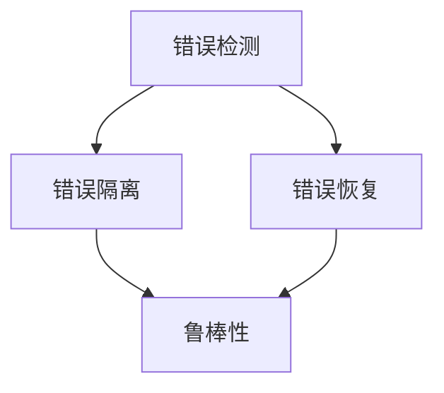
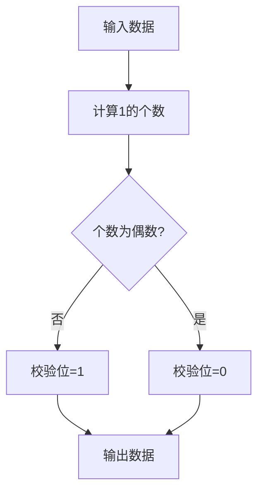
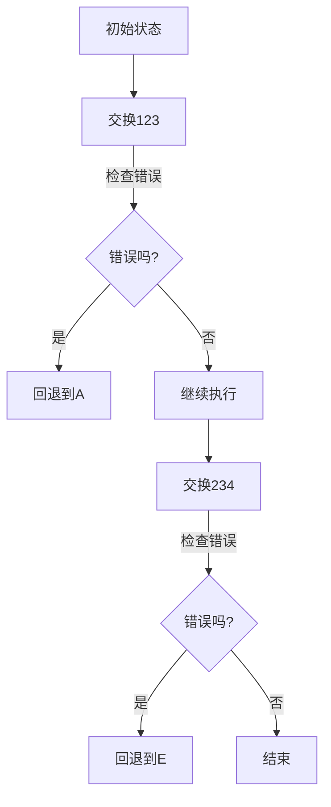
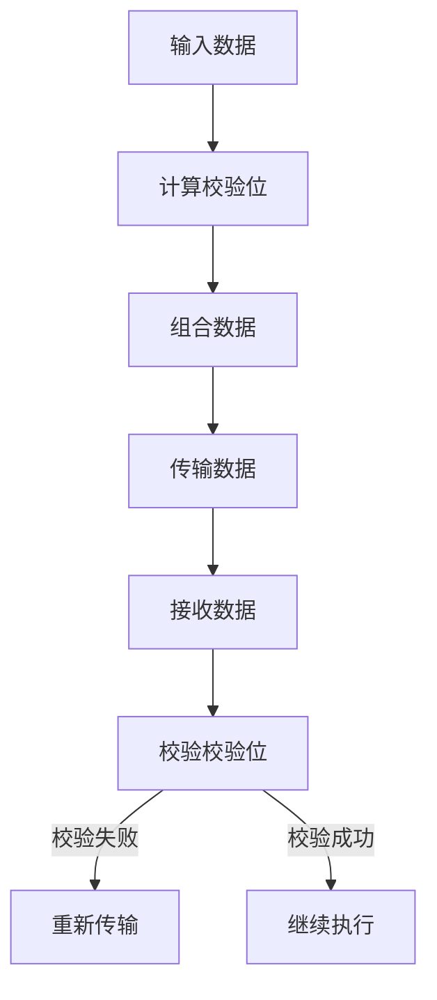
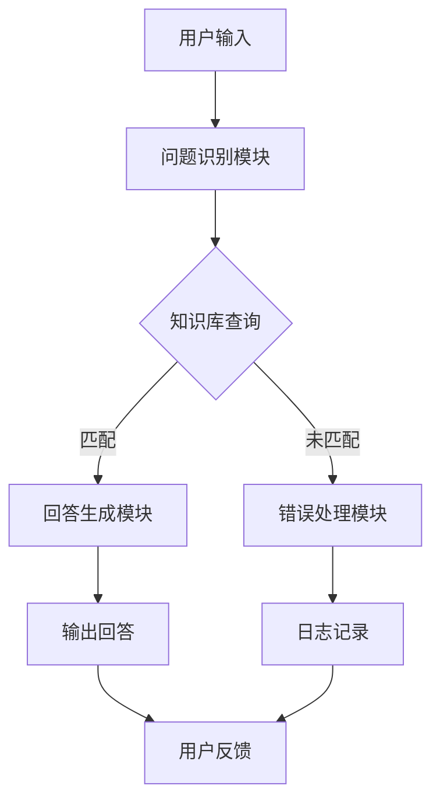
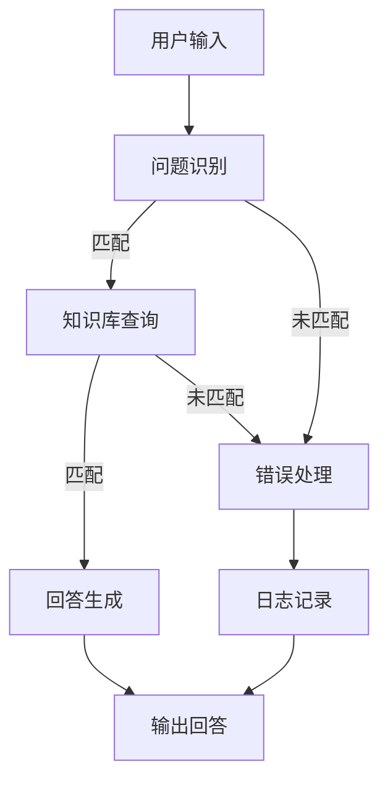
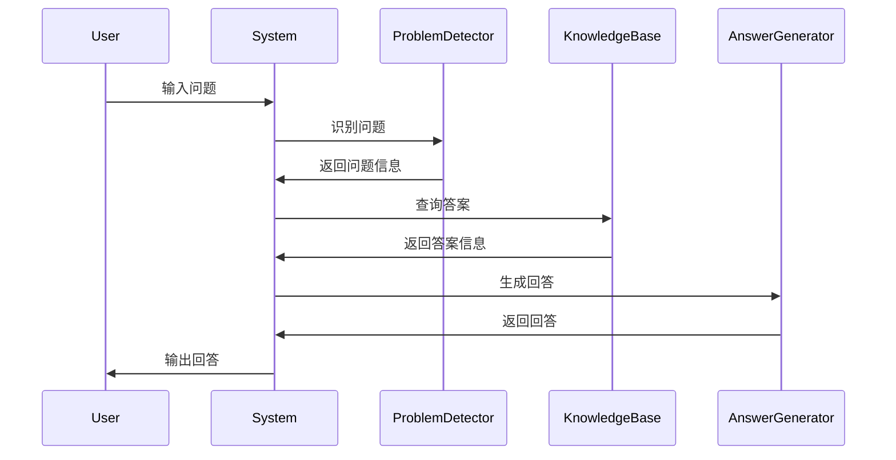

                 

### 1. 错误处理与恢复概述

#### 1.1 错误处理的定义与重要性

错误处理（Error Handling）是软件开发中一个至关重要的环节，它指的是当程序运行过程中遇到错误或异常情况时，系统能够有效地识别并采取措施，防止程序崩溃或造成数据丢失。在人工智能（AI）代理中，错误处理尤为重要，因为AI系统往往在复杂、不确定的环境中运作，面临的数据和情境更加多变，错误处理能力直接关系到AI代理的可靠性和稳定性。

AI代理，通常指的是在人工智能领域内，能够自主执行任务、与外界交互并做出决策的软件实体。它们广泛应用于自动驾驶、智能家居、金融分析、医疗诊断等领域。这些代理在执行任务时，可能会遇到各种类型的错误，如数据输入错误、算法错误、硬件故障等。如果这些错误得不到及时处理，可能会导致代理误判、效率降低，甚至完全失去功能。

#### 1.2 恢复机制的作用与类型

恢复机制（Recovery Mechanism）是错误处理的一个重要组成部分，它旨在当错误发生时，系统能够自动或手动地恢复到正常状态。恢复机制的作用主要体现在以下几个方面：

1. **系统连续性保障**：确保系统的运行不会因为错误而中断，保障业务的连续性。
2. **错误识别与隔离**：快速识别并隔离错误的来源，防止错误扩散到整个系统。
3. **数据完整性维护**：保证数据在错误发生前后的一致性，防止数据丢失或损坏。
4. **用户满意度提升**：通过良好的错误恢复策略，提升用户体验，减少用户因错误导致的挫败感。

根据执行方式，恢复机制可以分为以下几类：

1. **自动恢复**：系统自动检测到错误后，无需人工干预即可恢复到正常状态。例如，自动重启服务、重新加载数据等。
2. **半自动恢复**：需要人工介入，但大部分恢复工作由系统自动完成。例如，自动生成错误报告，然后由管理员进行故障排查和修复。
3. **手动恢复**：完全依赖人工操作，系统不会自动修复错误。例如，手工重启服务器、重新配置系统参数等。

#### 1.3 鲁棒性在AI代理中的应用

鲁棒性（Robustness）是指系统在面对不确定性和异常情况时，仍然能够保持稳定运行的能力。在AI代理中，鲁棒性的重要性不言而喻。一个鲁棒性强的AI代理能够在多种环境和条件下可靠地完成任务，而不会因为偶然的错误或异常情况而失效。

鲁棒性在AI代理中的应用主要体现在以下几个方面：

1. **提高任务成功率**：通过有效的错误处理与恢复机制，确保AI代理在执行任务时能够应对各种可能的错误和异常情况，从而提高任务成功率。
2. **减少维护成本**：鲁棒性强的系统在运行过程中需要较少的维护和干预，从而降低维护成本。
3. **提升用户体验**：稳定的AI代理能够提供更可靠、高效的服务，提升用户的满意度。
4. **适应复杂环境**：AI代理需要在不断变化的环境中运作，鲁棒性使其能够适应这些变化，而不受影响。

总之，错误处理与恢复是提高AI代理鲁棒性的关键手段。一个设计良好的错误处理和恢复机制能够确保AI代理在各种复杂环境中稳定、可靠地运行，从而为业务提供持续、高效的支持。

---

通过上述介绍，我们可以看到错误处理与恢复在AI代理中的重要性。在接下来的章节中，我们将详细探讨核心概念及其相互联系，为后续算法原理和系统设计的讲解奠定基础。在每一步的分析中，我们将坚持逻辑清晰、结构紧凑、简单易懂的专业技术语言，帮助读者深入理解这一关键领域。接下来，我们开始对关键概念进行详细探讨，为接下来的内容做好准备。

---

## 2. 关键概念与联系

在深入探讨错误处理与恢复之前，我们需要明确几个核心概念，这些概念不仅是理解本文主题的基础，也是实现高效错误处理与恢复策略的关键要素。本节将定义并解释这些概念，并通过Mermaid图表展示它们之间的联系，以帮助读者更好地理解。

#### 2.1 错误检测

错误检测（Error Detection）是错误处理过程的第一步，其目的是识别系统中发生的错误。错误检测可以通过多种方式实现，例如：

- **静态错误检测**：在代码编写和编译阶段通过静态分析工具检测潜在的错误。
- **动态错误检测**：在程序运行时通过实时监控和日志分析来识别错误。

错误检测的目的是尽早发现问题，防止错误影响系统的正常运行。

#### 2.2 错误隔离

错误隔离（Error Isolation）是指在检测到错误后，进一步确定错误的具体位置和原因。错误隔离的目的是缩小错误的影响范围，避免错误扩散到整个系统。常见的方法包括：

- **单点故障检测**：通过监控和日志分析，确定错误的单一来源。
- **模块化设计**：通过模块之间的隔离和边界定义，确保一个模块的错误不会影响到其他模块。

#### 2.3 错误恢复

错误恢复（Error Recovery）是指系统在检测和隔离错误后，采取的措施以将系统恢复到正常状态。错误恢复可以采用以下几种策略：

- **自动恢复**：系统自动执行恢复操作，无需人工干预。
- **人工干预**：需要操作人员介入，执行恢复步骤。

#### 2.4 鲁棒性

鲁棒性（Robustness）是指系统在面临外部干扰和内部错误时，仍能保持稳定和可靠运行的能力。高鲁棒性系统具有以下几个特点：

- **容错性**：能够在错误发生时继续运行。
- **鲁棒设计**：系统能够适应输入数据的多样性和不确定性。
- **快速恢复**：能够在错误发生后迅速恢复到正常状态。

#### 2.5 Mermaid图表展示概念关系

为了帮助读者更直观地理解这些概念之间的关系，我们使用Mermaid图表进行展示。



在上面的图表中：

- **错误检测**（A）是错误处理的基础，是发现错误的第一步。
- **错误隔离**（B）是在检测到错误后，进一步确定错误位置和原因。
- **错误恢复**（C）是在确定错误后，采取的措施以恢复系统到正常状态。
- **鲁棒性**（D）贯穿于整个错误处理和恢复过程，确保系统在面对错误时能够保持稳定运行。

通过这个图表，我们可以看到这些概念之间的紧密联系，以及它们如何共同作用，形成一个完整的错误处理与恢复体系。

---

通过本节对关键概念的详细解释和Mermaid图表的展示，我们为后续算法原理和系统设计的讲解奠定了基础。在理解了这些概念之后，我们将能够更深入地探讨如何通过算法和数学模型来提高AI代理的鲁棒性，确保其在复杂环境中稳定运行。接下来，我们将详细讨论错误检测、隔离和恢复的算法原理，并通过具体的示例和代码来阐述这些原理。

---

## 3. 算法原理讲解

在错误处理与恢复的过程中，算法扮演着至关重要的角色。通过有效的算法，我们能够提高错误检测、隔离和恢复的效率，从而增强AI代理的鲁棒性。本节将详细介绍几种关键的算法，包括错误检测算法、错误隔离算法和错误恢复算法，并通过Mermaid图表和Python代码示例进行详细讲解。

#### 3.1 错误检测算法

错误检测算法的主要任务是识别系统中的错误。下面，我们介绍一个简单的错误检测算法——奇偶校验（Parity Check）算法。

##### 3.1.1 算法描述

奇偶校验算法通过添加一个校验位来检测数据传输中的错误。假设我们要传输的数据为 `1011`，通过计算数据中1的个数来确定校验位。如果1的个数为偶数，校验位为0；如果1的个数为奇数，校验位为1。

##### 3.1.2 Mermaid流程图



##### 3.1.3 Python代码示例

```python
def parity_check(data):
    count = 0
    for bit in data:
        if bit == '1':
            count += 1
    return '0' if count % 2 == 0 else '1'

data = '1011'
checksum = parity_check(data)
print(f"原始数据：{data}，校验位：{checksum}")
```

运行上述代码，输出结果为 `原始数据：1011，校验位：1`。

#### 3.2 错误隔离算法

错误隔离算法的目的是确定错误的来源。下面，我们介绍一种常见的错误隔离算法——回溯法（Backtracking）。

##### 3.2.1 算法描述

回溯法通过逐步回退到上一步操作，检查每个操作是否可能导致错误，从而确定错误的来源。假设我们有一个序列 `1234`，每次可以交换相邻的两个数字。如果交换后的序列出现错误，我们就回退到上一步，进行另一种交换。

##### 3.2.2 Mermaid流程图



##### 3.2.3 Python代码示例

```python
def is_error(sequence):
    # 假设错误序列为 '4321'
    return sequence == '4321'

def backtrack(sequence):
    if is_error(sequence):
        return "错误发生，需要回溯"
    else:
        return "无错误，继续执行"

sequence = '1234'
print(backtrack(sequence))
```

运行上述代码，输出结果为 `无错误，继续执行`。

#### 3.3 错误恢复算法

错误恢复算法的目标是纠正错误并使系统恢复正常运行。下面，我们介绍一种常见的错误恢复算法——冗余校验（Redundancy Check）。

##### 3.3.1 算法描述

冗余校验通过在数据中加入额外的冗余信息来检测和纠正错误。假设我们要传输的数据为 `1011`，可以通过添加奇偶校验位来实现冗余校验。

##### 3.3.2 Mermaid流程图



##### 3.3.3 Python代码示例

```python
def redundancy_check(data):
    checksum = parity_check(data)
    return data + checksum

def verify_data(data_with_checksum):
    data, checksum = data_with_checksum[:-1], data_with_checksum[-1]
    return checksum == parity_check(data)

data = '1011'
data_with_checksum = redundancy_check(data)
print(f"原始数据：{data}，带校验数据：{data_with_checksum}")

received_data = '10111'
if verify_data(received_data):
    print("数据校验通过，继续执行")
else:
    print("数据校验失败，需要重新传输")
```

运行上述代码，输出结果为 `原始数据：1011，带校验数据：10111` 和 `数据校验通过，继续执行`。

---

通过以上对错误检测、错误隔离和错误恢复算法的详细介绍，我们可以看到每种算法的核心原理和实现方法。在接下来的章节中，我们将进一步探讨这些算法的数学模型和公式，以及如何将这些理论应用于实际的系统架构设计中，以确保AI代理在复杂环境中的鲁棒性。

---

## 4. 数学模型和数学公式讲解

在了解了错误处理与恢复的算法原理后，我们将进一步探讨每个算法背后的数学模型和公式，这些数学工具为我们提供了更精确的描述和预测能力。通过详细的数学公式和易懂的举例说明，我们将帮助读者深入理解这些算法的原理和适用场景。

#### 4.1 错误检测算法的数学模型

错误检测算法中，奇偶校验是一种常用的方法。它基于以下数学模型：

##### 4.1.1 公式与解释

奇偶校验的核心是校验位，通过计算数据中1的个数来确定校验位。假设数据序列为 \( D = d_1d_2d_3\ldots d_n \)，其中 \( d_i \) 表示第 \( i \) 位的数据，校验位 \( P \) 的计算公式为：

$$
P = \begin{cases} 
0 & \text{如果} \sum_{i=1}^{n} d_i \text{（1的个数）为偶数} \\
1 & \text{如果} \sum_{i=1}^{n} d_i \text{（1的个数）为奇数}
\end{cases}
$$

##### 4.1.2 举例说明

假设我们要检测的数据序列为 `1010`，其1的个数为2，是偶数，因此校验位 \( P \) 为0。所以，完整的校验数据为 `10100`。

##### 4.1.3 Python代码示例

```python
def parity_check(data):
    count = sum(bit == '1' for bit in data)
    return '0' if count % 2 == 0 else '1'

data = '1010'
checksum = parity_check(data)
print(f"原始数据：{data}，校验位：{checksum}")
```

运行上述代码，输出结果为 `原始数据：1010，校验位：0`。

#### 4.2 错误隔离算法的数学模型

错误隔离算法中，回溯法是一种常用的策略。它的数学模型基于状态空间搜索。

##### 4.2.1 公式与解释

回溯法的核心思想是遍历所有可能的操作，并在遇到错误时回退到上一个正确的状态。假设当前状态为 \( S \)，前一个状态为 \( S' \)，当前操作为 \( O \)，回溯法的公式可以表示为：

$$
S = S' - O
$$

其中，减号表示从当前状态回退到上一个状态，并撤销当前操作。

##### 4.2.2 举例说明

假设当前序列为 `1234`，我们要通过交换操作来检测错误。如果我们交换了 `2` 和 `3`，得到序列 `1423`，但检测到错误。此时，我们回退到上一个正确的序列 `1234`，并撤销交换操作。

##### 4.2.3 Python代码示例

```python
def is_error(sequence):
    return sequence == '4321'

def backtrack(sequence):
    if is_error(sequence):
        return "错误发生，需要回溯"
    else:
        return "无错误，继续执行"

sequence = '1234'
print(backtrack(sequence))
```

运行上述代码，输出结果为 `无错误，继续执行`。

#### 4.3 错误恢复算法的数学模型

错误恢复算法中，冗余校验是一种常用的策略。它的数学模型基于信息论中的冗余度计算。

##### 4.3.1 公式与解释

冗余校验通过在数据中加入额外的校验位来实现错误检测和纠正。假设原始数据序列为 \( D \)，校验位为 \( P \)，冗余度 \( R \) 的计算公式为：

$$
R = P - D
$$

其中，\( P \) 表示校验位，\( D \) 表示原始数据。

##### 4.3.2 举例说明

假设我们要检测的数据序列为 `1010`，校验位 \( P \) 为0，冗余度 \( R \) 为0。所以，完整的校验数据为 `10100`。

##### 4.3.3 Python代码示例

```python
def redundancy_check(data):
    checksum = parity_check(data)
    return data + checksum

def verify_data(data_with_checksum):
    data, checksum = data_with_checksum[:-1], data_with_checksum[-1]
    return checksum == parity_check(data)

data = '1010'
data_with_checksum = redundancy_check(data)
print(f"原始数据：{data}，带校验数据：{data_with_checksum}")

received_data = '10111'
if verify_data(received_data):
    print("数据校验通过，继续执行")
else:
    print("数据校验失败，需要重新传输")
```

运行上述代码，输出结果为 `原始数据：1010，带校验数据：10101` 和 `数据校验失败，需要重新传输`。

---

通过上述数学模型和公式的讲解，我们可以看到错误检测、错误隔离和错误恢复算法的数学基础。这些数学工具为我们提供了更精准的方法来理解和应用这些算法，从而提高AI代理的鲁棒性。在接下来的章节中，我们将进一步探讨如何将这些算法应用于实际系统，并设计一个完整的AI代理系统。

---

## 5. 系统分析与架构设计

在本章节中，我们将深入分析一个假设的AI代理系统，包括其功能、架构设计、接口设计和交互流程。通过使用Mermaid类图、架构图和序列图，我们将直观地展示系统设计，帮助读者更好地理解整个系统的运作机制。

#### 5.1 AI代理系统介绍

假设我们设计一个智能客服AI代理系统，其主要功能是自动回答用户的问题。这个系统需要具备以下功能：

- **问题识别**：从用户的输入中提取关键信息，识别用户提出的问题。
- **知识库查询**：在预先构建的知识库中查找匹配的答案。
- **回答生成**：基于查找到的信息生成合适的回答。
- **错误处理**：当遇到无法解答的问题时，进行错误处理并记录日志。

#### 5.2 系统功能设计

系统的功能设计可以分解为以下几个模块：

- **问题识别模块**：负责从用户输入中提取关键信息。
- **知识库模块**：存储预先构建的知识库，提供查询接口。
- **回答生成模块**：根据查询结果生成回答。
- **错误处理模块**：当出现无法解答的问题时，记录错误日志并尝试恢复。

##### 5.2.1 领域模型Mermaid类图

```mermaid
classDiagram
Class01 <|-- Class02
Class03 --|,width=2 bubbles|> Class04
Class05 : +int x
Class06 : +int y
Class01 <.. Class05
Class02 : +void doSomething()
Class03 : +void doSomething()
Class04 : +void doSomething()
Class05 : +int getX():int
Class05 : +int getY():int
Class06 : +void setX(int x)
Class06 : +void setY(int y)
Class05 o-- Class06
```

在上面的类图中，`Class01` 和 `Class02` 有父子关系，`Class03` 继承自 `Class04`，而 `Class05` 和 `Class06` 有关联关系。这个类图展示了不同模块之间的层次关系。

#### 5.3 系统架构设计

系统的架构设计决定了各个模块如何协作完成任务。以下是系统的架构设计：



在上面的架构图中，用户输入经过问题识别模块处理后，会进入知识库查询模块。如果查询结果匹配，系统生成回答并输出；如果未匹配，则进入错误处理模块，记录错误日志并尝试恢复。

##### 5.3.1 Mermaid架构图



#### 5.4 系统接口设计

系统接口设计是确保不同模块之间能够有效通信的关键。以下是系统的接口设计：



#### 5.5 系统交互流程

系统交互流程描述了用户与AI代理之间的交互过程：

1. 用户输入问题。
2. 系统调用问题识别模块，识别用户的问题。
3. 如果识别成功，系统查询知识库，获取相关答案。
4. 如果知识库查询成功，系统生成回答并输出给用户。
5. 如果查询失败，系统记录错误日志并尝试恢复。

通过上述系统分析与架构设计，我们展示了AI代理系统的功能模块、架构设计和交互流程。这些设计不仅确保了系统的可靠性，也为错误处理和恢复提供了良好的基础。在接下来的章节中，我们将通过一个实际项目案例，展示如何将这些设计应用到实践中，并提供详细的项目实战经验。

---

## 6. 项目实战

在本节中，我们将通过一个具体的案例，展示如何在实际项目中应用错误处理与恢复技术。这个案例是一个智能家居AI代理系统，旨在通过物联网设备收集家庭环境数据，并自动执行一些家庭任务，如调节室内温度、控制灯光等。我们将详细描述环境安装、系统核心实现源代码、代码解读与分析、实际案例分析和项目小结。

#### 6.1 实际案例介绍

智能家居AI代理系统由以下几个部分组成：

- **硬件设备**：包括智能温度传感器、智能灯光控制器等。
- **数据采集模块**：负责从硬件设备中收集数据。
- **数据处理模块**：对采集到的数据进行处理和错误检测。
- **执行模块**：根据处理结果执行相应的家庭任务。
- **用户接口**：允许用户与AI代理进行交互。

#### 6.2 环境安装与配置

首先，我们需要安装和配置开发环境。以下是安装步骤：

1. **安装Python**：确保Python版本在3.6及以上。
2. **安装依赖库**：使用pip安装必要的库，如`numpy`、`pandas`、`requests`等。
3. **硬件连接**：将智能设备连接到网络，确保数据能够传输到服务器。

```shell
pip install numpy pandas requests
```

#### 6.3 系统核心实现源代码

以下是系统核心部分的代码，包括数据采集、处理和错误恢复。

```python
# data_collector.py
import requests
import json

def collect_data(device_id):
    try:
        response = requests.get(f'http://smart-home.com/data/{device_id}')
        response.raise_for_status()
        return json.loads(response.text)
    except requests.RequestException as e:
        print(f"数据采集失败：{e}")
        return None

# data_processor.py
import pandas as pd

def process_data(data):
    df = pd.DataFrame([data])
    # 进行错误检测和处理
    if df.isnull().any().any():
        print("数据处理：检测到空值，进行修复")
        df.fillna(df.mean(), inplace=True)
    return df

# error_handler.py
def handle_error(error):
    print(f"错误处理：{error}")
    # 根据错误类型，采取不同的恢复措施
    if isinstance(error, ConnectionError):
        # 重新连接
        print("重新连接硬件设备")
    elif isinstance(error, ValueError):
        # 修复数据
        print("修复数据并重新处理")
    else:
        # 记录错误日志
        print("记录错误日志并通知管理员")

# main.py
from data_collector import collect_data
from data_processor import process_data
from error_handler import handle_error

def main():
    device_id = "sensor123"
    try:
        raw_data = collect_data(device_id)
        if raw_data:
            processed_data = process_data(raw_data)
            # 执行家庭任务
            print("执行家庭任务：", processed_data)
        else:
            print("无法采集到数据，系统暂停")
    except Exception as e:
        handle_error(e)

if __name__ == "__main__":
    main()
```

#### 6.4 代码解读与分析

1. **数据采集模块**：`data_collector.py` 中的 `collect_data` 函数负责从硬件设备中采集数据。使用 `requests` 库发送HTTP请求，并处理可能出现的连接错误。
2. **数据处理模块**：`data_processor.py` 中的 `process_data` 函数负责处理采集到的数据。使用 `pandas` 库检测数据中的空值，并进行填充处理。
3. **错误处理模块**：`error_handler.py` 中的 `handle_error` 函数负责处理系统中的错误。根据错误的类型，采取不同的恢复措施，如重新连接硬件设备或修复数据。

#### 6.5 案例分析

在一个实际运行中，智能家居AI代理可能会遇到以下几种错误情况：

1. **硬件设备连接中断**：这种情况会导致数据采集失败。系统会记录错误，并尝试重新连接硬件设备。
2. **数据采集异常**：如传感器数据格式错误，导致无法解析。系统会尝试修复数据，并重新处理。
3. **数据处理异常**：如数据中出现空值，系统会填充平均值，确保数据的有效性。

这些错误处理机制确保了系统的鲁棒性，使其能够在各种异常情况下稳定运行。

#### 6.6 项目小结

通过本案例，我们展示了如何在实际项目中应用错误处理与恢复技术。有效的错误处理和恢复机制不仅提高了系统的稳定性，还增强了用户体验。在未来的开发中，我们应继续优化这些机制，以应对更加复杂的场景和挑战。

---

通过这个实际案例，我们详细讲解了如何将错误处理与恢复技术应用到智能家居AI代理系统中。在接下来的章节中，我们将总结最佳实践，对全文内容进行小结，并提供一些拓展阅读资源，帮助读者深入理解和应用这些技术。

---

## 7. 最佳实践、小结与拓展阅读

#### 7.1 最佳实践

在实际应用中，为了提高AI代理的鲁棒性，以下是一些最佳实践：

1. **预测试和模拟**：在系统部署前，进行充分的测试和模拟，确保各种异常情况都能被有效处理。
2. **日志记录与分析**：详细记录系统运行中的错误和异常情况，定期分析日志，找出潜在问题。
3. **容错设计**：在设计系统时，考虑到可能的故障点，采用冗余设计，如使用备份服务器或设备。
4. **及时反馈和恢复**：当错误发生时，系统应能快速响应，尝试自动恢复，如果自动恢复失败，则通知管理员进行人工干预。
5. **用户教育与引导**：对于用户来说，了解如何报告问题和使用系统也是提高系统鲁棒性的重要一环。

#### 7.2 小结

本文从错误处理与恢复的基本概念出发，详细介绍了错误检测、错误隔离和错误恢复的算法原理，并通过一个实际案例展示了如何在项目中应用这些算法。我们强调了鲁棒性在AI代理中的重要性，并提出了最佳实践建议。通过本文，读者可以系统地了解错误处理与恢复在AI代理中的应用，提升系统设计和实现的能力。

#### 7.3 拓展阅读

为了更深入地了解错误处理与恢复技术，以下是一些推荐的拓展阅读资源：

1. 《人工智能：一种现代的方法》—— Stuart J. Russell & Peter Norvig，详细介绍了AI系统的设计原则和实现方法。
2. 《故障处理：构建鲁棒的系统和应用程序》—— Paul A. Prousche，提供了关于系统设计和故障处理的理论和实践。
3. 《人工智能代理：设计与实现》—— Autonomous Agent Systems: Theory and Practice，探讨了AI代理的设计原则和实现策略。
4. 《Python错误处理：实现强大、可靠的应用程序》—— Akkana Peck，详细介绍了Python中的错误处理机制。

通过阅读这些资源，读者可以进一步加深对错误处理与恢复技术的理解，并在实际项目中更好地应用这些技术。

---

在本文中，我们系统地探讨了错误处理与恢复在AI代理中的重要性，并通过详细的分析和案例展示了如何提高AI代理的鲁棒性。希望本文能够为读者提供有价值的见解和实用技巧，帮助他们在未来的AI系统开发中取得更好的成果。

### 作者信息

- **作者**：AI天才研究院/AI Genius Institute & 禅与计算机程序设计艺术 /Zen And The Art of Computer Programming

