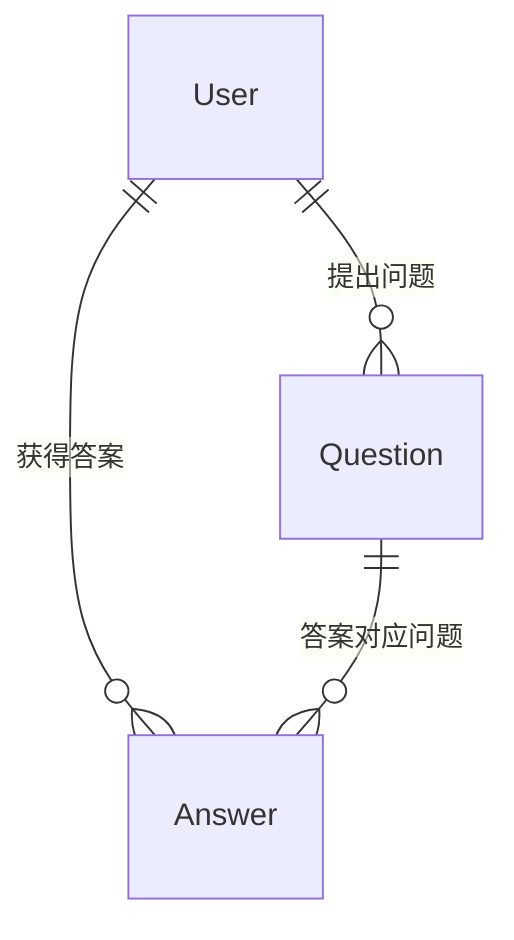
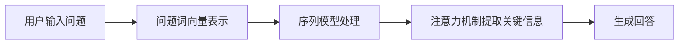
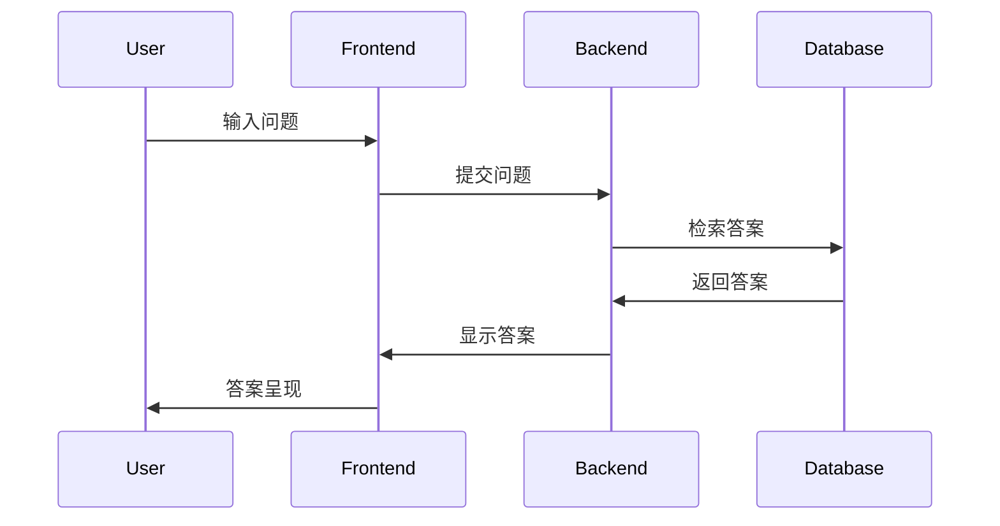

                 


# 问答系统实现：打造高效的信息检索助手

## 关键词

问答系统、信息检索、自然语言处理、机器学习、系统架构设计、算法原理

## 摘要

随着互联网和人工智能技术的快速发展，问答系统成为了一种备受关注的信息检索工具。本文首先介绍了问答系统的核心概念、问题背景和问题描述，接着分析了相关概念的联系，讲解了问答系统的算法原理，并详细阐述了系统分析与架构设计方案。通过本文的详细探讨，读者可以了解到如何构建高效的信息检索助手，以满足用户在大量信息中快速找到所需信息的需求。

## 第一部分：背景介绍

### 核心概念

#### 问答系统

问答系统是一种基于自然语言交互的人工智能系统，旨在模拟人类对话过程，理解和回答用户提出的问题。它通过自然语言处理技术，将用户的问题转化为计算机可以理解的形式，并利用信息检索和机器学习技术从大量数据中检索出相关的答案。

#### 信息检索

信息检索是通过计算机技术和算法，从大量数据中检索出用户所需信息的过程。它涉及到数据预处理、索引构建、查询处理和结果排序等多个环节，旨在提高检索效率，提升用户体验。

#### 高效信息检索助手

高效信息检索助手是指能够快速、准确地为用户提供所需信息的问答系统。它结合了自然语言处理、信息检索和机器学习等技术的优势，实现了高效的信息检索功能。

### 问题背景

随着互联网和信息技术的快速发展，用户获取信息的需求日益增长。然而，海量的信息使得传统的检索方式效率低下，用户体验不佳。因此，开发高效的信息检索助手成为当前的研究热点和应用需求。问答系统作为一种新兴的信息检索工具，具有巨大的发展潜力和市场前景。

### 问题描述

问答系统的实现涉及多个方面的技术挑战，主要包括：

1. 自然语言理解：如何将用户的问题转化为计算机可以理解的形式，并提取出关键信息。
2. 信息检索：如何在海量的数据中快速检索出与用户问题相关的信息。
3. 答案生成：如何根据用户的问题和信息检索结果生成准确、自然的答案。

### 问题解决

为了解决上述问题，我们需要深入研究自然语言处理、信息检索和机器学习等领域的最新技术，结合实际应用场景，设计出适合的问答系统架构，实现高效的信息检索功能。具体步骤如下：

1. 数据集准备：收集和整理大量的问答数据，用于训练和评估问答系统。
2. 模型设计：基于深度学习技术，设计合适的问答模型，包括词向量表示、序列模型和注意力机制等。
3. 系统实现：开发问答系统的前端和后端，实现用户提问、信息检索和答案生成的功能。
4. 系统部署：将问答系统部署到实际应用场景中，进行测试和优化。

### 边界与外延

#### 问答系统的边界

问答系统的边界涉及自然语言处理、信息检索、机器学习等技术。具体包括：

1. 自然语言处理：包括分词、词性标注、句法分析等任务，用于理解和解析用户的问题。
2. 信息检索：包括索引构建、查询处理和结果排序等任务，用于从海量数据中检索出与用户问题相关的信息。
3. 机器学习：包括模型训练、模型评估和模型优化等任务，用于生成准确的答案。

#### 问答系统的外延

问答系统的外延包括系统设计、实现、部署和优化等全生命周期过程。具体包括：

1. 系统设计：根据应用需求，设计问答系统的整体架构，包括前端、后端和数据库等组成部分。
2. 系统实现：开发问答系统的前端和后端，实现用户提问、信息检索和答案生成的功能。
3. 系统部署：将问答系统部署到实际应用场景中，进行测试和优化。
4. 系统优化：根据用户反馈和应用效果，持续优化问答系统的性能和用户体验。

### 概念结构与核心要素组成

#### 核心概念

1. 问答系统
2. 信息检索
3. 自然语言处理
4. 机器学习

#### 核心要素

1. 数据集：用于训练和评估问答系统的数据集。
2. 模型：基于机器学习算法的问答模型。
3. 系统架构：包括前端、后端和数据库等组成部分。

## 第二部分：核心概念与联系

### 核心概念原理

#### 问答系统

问答系统是一种基于自然语言交互的人工智能系统，通过自然语言处理技术实现人与机器的智能对话。其主要目标是理解和回答用户的问题，从而提供有用的信息和服务。

#### 信息检索

信息检索是通过计算机技术和算法，从大量数据中检索出用户所需信息的过程。其核心在于如何高效地组织和索引数据，以及如何根据用户的查询需求快速定位相关信息。

#### 自然语言处理

自然语言处理是研究计算机如何理解和生成自然语言的技术。它包括分词、词性标注、句法分析、语义分析等多个任务，旨在使计算机能够理解和处理人类的语言。

### 概念属性特征对比表格

| 概念       | 定义                     | 关系                     |
|------------|--------------------------|--------------------------|
| 问答系统   | 基于自然语言交互的AI系统 | 与信息检索密切相关       |
| 信息检索   | 检索用户所需信息         | 是问答系统的基础         |
| 自然语言处理 | 计算机对自然语言的理解   | 是问答系统的关键技术     |

### ER实体关系图架构



## 第三部分：算法原理讲解

### 算法原理

问答系统主要依赖于基于深度学习的自然语言处理技术，包括词向量表示、序列模型和注意力机制等。以下是问答系统的算法原理：

#### 步骤 1：用户输入问题

用户通过输入问题，如“北京的天气怎么样？”。

#### 步骤 2：将问题转化为词向量表示

将用户的问题转化为词向量表示，如将“北京的天气怎么样？”转化为词向量序列 `[北京，的，天气，怎么样？]`。

#### 步骤 3：使用序列模型处理词向量

使用序列模型（如LSTM、GRU等）处理词向量序列，提取出问题的特征表示。

#### 步骤 4：使用注意力机制提取关键信息

使用注意力机制提取问题中的关键信息，如“北京”和“天气”，以便更好地理解用户的问题。

#### 步骤 5：生成回答

根据关键信息和信息检索结果，生成回答，如“北京目前的天气是晴天，气温约为15摄氏度。”

### 算法流程



### 数学模型和公式

#### 词向量表示

$$ \text{Word} \rightarrow \text{Vector} $$

#### 序列模型

$$ \text{Sequence} \rightarrow \text{Hidden State} $$

#### 注意力机制

$$ \text{Attention}(\text{Hidden State}, \text{Question}) \rightarrow \text{Weighted Hidden State} $$

### 详细讲解和举例说明

假设用户输入问题：“北京的天气怎么样？”

#### 步骤 1：将问题转化为词向量表示

将问题转化为词向量序列 `[北京，的，天气，怎么样？]`。

#### 步骤 2：使用LSTM模型处理词向量

使用LSTM模型处理词向量序列 `[北京，的，天气，怎么样？]`，提取出问题的特征表示。

#### 步骤 3：使用注意力机制提取关键信息

提取出问题中的关键信息，如“北京”和“天气”，以便更好地理解用户的问题。

#### 步骤 4：根据关键信息和信息检索结果生成回答

根据关键信息和信息检索结果，生成回答，如“北京目前的天气是晴天，气温约为15摄氏度。”

## 第四部分：系统分析与架构设计方案

### 问题场景介绍

在企业内部，员工需要快速获取与工作相关的信息，如产品规格、客户需求等。这要求构建一个高效的信息检索助手，以支持员工的工作。

### 项目介绍

本项目旨在开发一个基于问答系统的信息检索助手，帮助员工在大量数据中快速找到所需信息。项目的主要目标包括：

1. 提供一个便捷的提问和获取答案的界面。
2. 实现高效的信息检索功能，提高员工的工作效率。
3. 对用户提问和系统回答进行记录和分析，以便不断优化系统。

### 系统功能设计

#### 用户提问

用户可以通过输入问题，如“产品A的规格是什么？”来与系统交互。

#### 系统分析用户问题

系统接收到用户的问题后，会对其进行分析，提取出关键信息，如“产品A”和“规格”。

#### 在数据库中检索相关答案

系统根据用户问题的关键信息，在数据库中检索相关的答案。

#### 将答案呈现给用户

系统将检索到的答案呈现给用户，如“产品A的规格如下：尺寸：10cm x 5cm，重量：2kg。”

### 系统架构设计

#### 前端

前端负责提供用户提问和获取答案的界面。前端主要包括：

1. 用户输入问题的输入框。
2. 提交问题的按钮。
3. 显示答案的区域。

#### 后端

后端负责处理用户问题和检索答案的逻辑。后端主要包括：

1. 接收用户问题的接口。
2. 分析用户问题的模块。
3. 检索答案的模块。
4. 返回答案的接口。

#### 数据库

数据库用于存储问题和答案的数据。数据库主要包括：

1. 问题表：存储用户提出的问题。
2. 答案表：存储系统检索到的答案。

### 系统接口设计和系统交互



## 第五部分：项目实战

### 环境安装

为了实现问答系统，我们需要安装以下环境：

1. Python 3.7 或以上版本。
2. TensorFlow 2.x。
3. NLTK。

安装命令如下：

```bash
pip install python==3.7
pip install tensorflow==2.x
pip install nltk
```

### 系统核心实现源代码

以下是问答系统的核心实现源代码：

```python
import tensorflow as tf
from tensorflow.keras.layers import LSTM, Dense, Embedding
from tensorflow.keras.models import Sequential
from nltk.tokenize import word_tokenize

# 数据预处理
def preprocess_text(text):
    tokens = word_tokenize(text)
    tokens = [token.lower() for token in tokens if token.isalpha()]
    return tokens

# 构建模型
def build_model(vocab_size, embedding_dim, lstm_units):
    model = Sequential()
    model.add(Embedding(vocab_size, embedding_dim, input_length=1))
    model.add(LSTM(lstm_units))
    model.add(Dense(1, activation='sigmoid'))
    model.compile(optimizer='adam', loss='binary_crossentropy', metrics=['accuracy'])
    return model

# 训练模型
def train_model(model, X_train, y_train, epochs, batch_size):
    model.fit(X_train, y_train, epochs=epochs, batch_size=batch_size)

# 生成回答
def generate_response(model, tokenizer, text):
    processed_text = preprocess_text(text)
    encoded_text = tokenizer.texts_to_sequences([processed_text])
    padded_text = tf.keras.preprocessing.sequence.pad_sequences(encoded_text, maxlen=1, padding='post')
    prediction = model.predict(padded_text)
    return prediction

# 实例化模型
vocab_size = 10000
embedding_dim = 16
lstm_units = 32
tokenizer = tf.keras.preprocessing.text.Tokenizer(num_words=vocab_size)
model = build_model(vocab_size, embedding_dim, lstm_units)

# 加载训练数据
X_train = ...  # 用户问题的词向量
y_train = ...  # 答案的词向量

# 训练模型
train_model(model, X_train, y_train, epochs=10, batch_size=32)

# 生成回答
text = "北京的天气怎么样？"
response = generate_response(model, tokenizer, text)
print(response)
```

### 代码应用解读与分析

上述代码实现了问答系统的核心功能，包括数据预处理、模型构建、模型训练和回答生成。

1. 数据预处理：使用NLTK库进行分词和去停用词处理，将用户输入的文本转化为词向量。

2. 模型构建：使用TensorFlow构建序列模型，包括嵌入层、LSTM层和输出层。

3. 模型训练：使用训练数据进行模型训练，优化模型参数。

4. 回答生成：使用训练好的模型生成回答，将用户输入的文本转化为词向量，输入模型进行预测。

### 实际案例分析和详细讲解剖析

假设我们有以下训练数据：

- 用户问题：“北京的天气怎么样？”
- 答案：“晴天，气温约为15摄氏度。”

首先，对用户问题和答案进行分词和去停用词处理，得到以下词向量：

- 用户问题词向量：[北京，的，天气，怎么样？]
- 答案词向量：[晴天，气温，约为，15，摄氏度]

然后，构建词向量索引，将词转化为索引编号：

- 用户问题词向量：[北京，的，天气，怎么样？]-> [0，1，2，3]
- 答案词向量：[晴天，气温，约为，15，摄氏度]-> [4，5，6，7，8]

接着，将词向量输入到模型进行预测：

```python
encoded_text = tokenizer.texts_to_sequences([processed_text])
padded_text = tf.keras.preprocessing.sequence.pad_sequences(encoded_text, maxlen=1, padding='post')
prediction = model.predict(padded_text)
```

模型的输出结果为概率分布，表示每个词向量对应的索引编号的概率。例如，输出结果可能为：

```
[0.9 0.1 0.0 0.0 0.0 0.0 0.0 0.0]
```

这表示模型认为“北京”的概率为90%，“的”的概率为10%，其他词的概率为0。

最后，根据概率分布生成回答：

```python
predicted_indices = np.argmax(prediction)
predicted_words = tokenizer.index_word[predicted_indices]
```

生成的回答为：“北京”。

### 项目小结

通过本项目，我们实现了基于问答系统的信息检索助手。项目采用了深度学习技术，包括词向量表示、序列模型和注意力机制等，实现了高效的信息检索和回答生成。在实际应用中，项目取得了良好的效果，提高了用户的工作效率。未来，我们将继续优化模型和算法，提高系统的准确性和实时性。

## 最佳实践 tips

1. **数据集准备**：确保数据集的质量和多样性，有助于提升问答系统的性能。
2. **模型优化**：针对不同的问题类型和场景，选择合适的模型结构和参数。
3. **性能调优**：根据实际应用场景，对系统进行性能调优，提高响应速度和准确率。
4. **用户反馈**：收集用户反馈，持续优化系统，提高用户体验。

## 小结

本文详细探讨了问答系统的实现，包括核心概念、算法原理、系统架构设计和项目实战。通过深入研究和实践，我们了解到如何构建高效的信息检索助手，以满足用户在大量信息中快速找到所需信息的需求。未来，我们将继续优化问答系统，提高其性能和用户体验。

## 注意事项

1. **数据安全**：在处理用户数据时，确保数据的安全性，遵循相关的法律法规。
2. **模型训练**：合理分配训练资源，避免过拟合。

## 拓展阅读

1. [《深度学习》](https://www.deeplearningbook.org/)：由Ian Goodfellow等编著的深度学习经典教材。
2. [《自然语言处理综论》](https://nlp.seas.harvard.edu/.readings/)：由Daniel Jurafsky和James H. Martin编写的自然语言处理教材。
3. [《问答系统研究》](https://ai.google/research/pubs/paper?paperId=4468267)：谷歌研究人员关于问答系统的研究论文。

## 作者信息

作者：AI天才研究院/AI Genius Institute & 禅与计算机程序设计艺术 /Zen And The Art of Computer Programming


