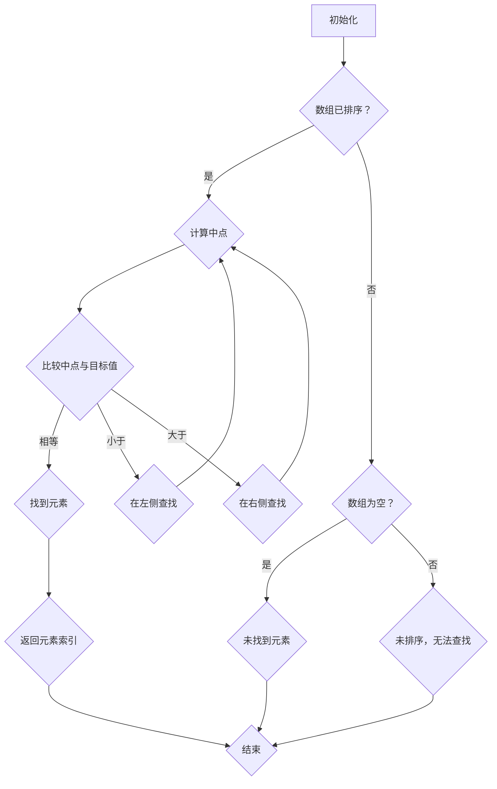
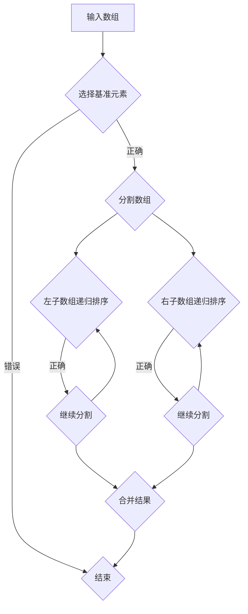

                 


### 背景介绍

**关键词：系统分析、系统架构设计、项目成功**

在当今快速发展的信息技术时代，项目的成功与否不仅取决于技术实现，更在于系统的分析和架构设计。一个成功的项目不仅需要明确的目标和合理的规划，更需要一个高效、稳定、可扩展的系统架构作为支撑。系统分析是项目成功的第一步，它帮助我们从宏观和微观层面理解项目的需求和目标，为后续的系统设计和开发奠定基础。

#### 核心概念术语说明

1. **系统分析**：系统分析是一种研究和分析系统的方法，旨在理解系统的行为、功能和结构，以便优化系统性能和解决系统问题。
2. **系统架构设计**：系统架构设计是系统分析的结果，它定义了系统的结构、组件和它们之间的关系，为系统的开发和维护提供指导。
3. **项目成功**：项目成功是指项目在既定的时间、预算和质量要求内完成了预定的目标和任务。

#### 问题背景

在现实世界的项目中，我们常常会遇到以下问题：

- 项目目标不明确，导致开发过程中出现偏差。
- 系统架构设计不合理，导致系统性能差、扩展性差。
- 项目管理不善，导致项目延期、超预算。

这些问题不仅影响项目的成功率，还可能导致项目的失败。因此，系统分析和系统架构设计成为项目成功的关键因素。

#### 问题描述

为了解决上述问题，我们需要：

1. 明确项目目标，确保项目方向正确。
2. 设计合理的系统架构，提高系统性能和可扩展性。
3. 实施有效的项目管理，确保项目按时、按预算完成。

#### 问题解决

系统分析和架构设计的核心目标是为项目提供强有力的支持，使项目能够顺利实施并取得成功。以下是具体的解决方案：

1. **系统分析**：
   - 进行需求分析，明确项目目标和需求。
   - 使用系统分析工具和方法，如UML类图、ER图等，对系统进行详细分析。
   - 识别系统中的关键组件和功能，确保系统设计的合理性。

2. **系统架构设计**：
   - 根据系统分析的结果，设计合理的系统架构。
   - 选择合适的架构风格，如MVC、微服务等。
   - 设计系统模块，确保系统的可扩展性和可维护性。

3. **项目管理**：
   - 制定详细的项目计划，明确项目的时间表、预算和质量要求。
   - 实施有效的进度管理和风险管理，确保项目按计划进行。
   - 定期进行项目评估，及时调整项目计划。

#### 边界与外延

1. **边界**：
   - 系统分析的范围：需求分析、系统功能分析、性能分析等。
   - 系统架构设计的范围：系统组件设计、接口设计、数据流设计等。

2. **外延**：
   - 系统分析的外延：项目管理、软件工程、信息技术等。
   - 系统架构设计的外延：软件设计、硬件设计、网络设计等。

#### 概念结构与核心要素组成

1. **概念结构**：
   - 系统分析：需求分析、系统设计、测试等。
   - 系统架构设计：系统组件、接口、数据流等。
   - 项目成功：目标明确、计划合理、执行有效等。

2. **核心要素组成**：
   - 系统分析：需求分析、系统设计、测试等。
   - 系统架构设计：组件设计、接口设计、数据流设计等。
   - 项目成功：目标明确、计划合理、执行有效等。

通过以上分析，我们可以看到，系统分析和系统架构设计在项目成功中起着至关重要的作用。只有通过科学、合理的系统分析和架构设计，才能确保项目的成功实施和目标达成。

### 核心概念与联系

**关键词：系统分析、系统架构设计、核心概念、联系**

在系统分析和系统架构设计中，有几个核心概念是不可或缺的。这些概念不仅帮助我们理解和分析系统，还为系统架构设计提供了基础。以下是这些核心概念及其联系：

#### 系统分析的概念

**系统分析**是一种研究和分析系统的方法，旨在理解系统的行为、功能和结构，以便优化系统性能和解决系统问题。系统分析主要包括以下几个方面的内容：

1. **需求分析**：需求分析是系统分析的第一步，旨在明确项目的目标和需求。它包括收集用户需求、分析业务流程、定义功能需求等。

2. **功能分析**：功能分析是系统分析的核心，它关注系统应具备的功能和行为。功能分析通常使用UML类图、活动图等工具进行描述。

3. **性能分析**：性能分析旨在评估系统的性能，包括响应时间、吞吐量、并发处理能力等。性能分析有助于确保系统在实际运行中能够满足需求。

#### 系统架构设计的概念

**系统架构设计**是系统分析的结果，它定义了系统的结构、组件和它们之间的关系，为系统的开发和维护提供指导。系统架构设计主要包括以下几个方面的内容：

1. **系统组件设计**：系统组件设计是系统架构设计的基础，它涉及确定系统的各个组件及其功能。

2. **接口设计**：接口设计定义了系统组件之间的交互方式，包括API设计、协议选择等。

3. **数据流设计**：数据流设计描述了系统内部的数据流动过程，包括数据输入、处理、输出等。

#### 核心概念属性特征对比表格

为了更好地理解这些核心概念，我们可以通过一个对比表格来展示它们的属性特征：

| 核心概念 | 定义 | 属性特征 |
| :--- | :--- | :--- |
| 系统分析 | 研究和分析系统的方法 | 目标明确、需求分析、功能分析、性能分析 |
| 系统架构设计 | 确定系统的结构、组件和交互方式 | 组件设计、接口设计、数据流设计 |
| 需求分析 | 明确项目目标和需求 | 收集用户需求、分析业务流程、定义功能需求 |
| 功能分析 | 确定系统应具备的功能和行为 | 使用UML类图、活动图描述 |
| 性能分析 | 评估系统性能 | 响应时间、吞吐量、并发处理能力 |
| 系统组件设计 | 确定系统的各个组件及其功能 | 系统模块化、功能清晰 |
| 接口设计 | 定义系统组件之间的交互方式 | API设计、协议选择 |
| 数据流设计 | 描述系统内部的数据流动过程 | 数据输入、处理、输出 |

#### ER实体关系图架构

为了更直观地展示系统分析中的核心概念，我们可以使用ER（Entity-Relationship）实体关系图。以下是ER图的一个示例：

```mermaid
erDiagram
    Customer ||--|{ Order }|
    Product ||--|{ Order }|
    Order ||--|{ OrderDetail }|
    Customer ||--|{ CustomerReview }|
```

在这个ER图中，我们定义了四个实体：Customer（客户）、Product（产品）、Order（订单）和CustomerReview（客户评论）。它们之间的关系如下：

- Customer与Order之间存在一对多关系，即一个客户可以下单多个订单。
- Product与Order之间存在一对多关系，即一个产品可以出现在多个订单中。
- Order与OrderDetail之间存在一对多关系，即一个订单可以包含多个订单详情。
- Customer与CustomerReview之间存在一对多关系，即一个客户可以有多个客户评论。

#### 联系

系统分析和系统架构设计是相互联系、相互依赖的。系统分析提供了系统设计所需的需求和功能信息，而系统架构设计则将这些信息转化为具体的系统组件和结构。具体来说：

1. **需求分析的结果**：需求分析的结果为系统架构设计提供了关键信息，如功能需求、性能需求和业务规则等。这些信息是系统架构设计的基础。

2. **系统架构设计的结果**：系统架构设计的结果为系统开发提供了明确的指导，包括系统组件、接口和数据流的设计。这些设计结果反过来又可以指导系统分析和需求分析，确保系统设计满足实际需求。

通过系统分析和系统架构设计，我们能够构建一个高效、稳定、可扩展的系统，从而提高项目的成功率。在接下来的章节中，我们将深入探讨系统分析的方法和工具，以及如何进行系统架构设计。

### 算法原理讲解

**关键词：算法、原理、应用**

算法是计算机科学的核心组成部分，它们在系统分析中起着至关重要的作用。本章节将详细介绍算法的基本原理、类型及其应用，并通过具体的算法流程图和Python代码实例来解释算法的执行过程和实现细节。

#### 算法的基本原理

算法（Algorithm）是一系列解决问题的步骤，这些步骤以确定的方式执行，并能保证在有限时间内得到正确的结果。算法的基本原理可以归纳为以下几点：

1. **确定性**：算法的每一步都应该是明确的、无歧义的，确保所有执行者都能得到相同的结果。
2. **输入**：算法可以有一个或多个输入，这些输入决定了算法的处理过程和结果。
3. **输出**：算法执行后应产生一个或多个输出，这些输出是算法解决问题后的结果。
4. **有穷性**：算法必须在有限的步骤内完成，不能无限循环。

#### 算法的类型

算法可以根据其处理问题的方法不同分为多种类型。以下是一些常见的算法类型：

1. **查找算法**：用于在数据集合中查找特定元素。常见的查找算法有二分查找、线性查找等。
2. **排序算法**：用于将数据集合按照特定规则排序。常见的排序算法有快速排序、归并排序、冒泡排序等。
3. **图算法**：用于解决图论问题，如最短路径算法、最小生成树算法等。
4. **动态规划**：用于解决复杂的问题，通过将大问题分解为小问题，然后递归地解决这些小问题。
5. **贪心算法**：通过每次选择当前最优解，希望最终得到全局最优解。

#### 算法流程图与Python代码实例

为了更好地理解算法的原理和应用，我们可以使用Mermaid绘制算法流程图，并通过Python代码实例来解释算法的实现。

##### 示例：二分查找算法

**流程图**：



**Python代码实例**：

```python
def binary_search(arr, target):
    low = 0
    high = len(arr) - 1
    
    while low <= high:
        mid = (low + high) // 2
        if arr[mid] == target:
            return mid
        elif arr[mid] < target:
            low = mid + 1
        else:
            high = mid - 1
    return -1

# 测试
arr = [1, 3, 5, 7, 9]
target = 5
result = binary_search(arr, target)
print("Element found at index:", result)
```

在上述示例中，我们通过Mermaid绘制了二分查找算法的流程图，并使用Python代码实现了该算法。二分查找算法的基本步骤包括：

1. 初始化搜索区间（low和high）。
2. 计算中点（mid）。
3. 比较中点值与目标值。
4. 如果找到目标值，返回索引；否则，更新搜索区间，继续查找。

##### 示例：快速排序算法

**流程图**：



**Python代码实例**：

```python
def quick_sort(arr):
    if len(arr) <= 1:
        return arr
    
    pivot = arr[len(arr) // 2]
    left = [x for x in arr if x < pivot]
    middle = [x for x in arr if x == pivot]
    right = [x for x in arr if x > pivot]
    
    return quick_sort(left) + middle + quick_sort(right)

# 测试
arr = [3, 6, 8, 10, 1, 2, 1]
sorted_arr = quick_sort(arr)
print("Sorted array:", sorted_arr)
```

在快速排序算法中，我们首先选择一个基准元素，然后将数组分为三个部分：小于基准的元素、等于基准的元素和大于基准的元素。接着，对左右子数组递归地进行快速排序，最终合并结果。

通过上述两个算法实例，我们可以看到算法流程图和Python代码实例如何帮助理解算法的基本原理和应用。算法的灵活运用不仅能够提高系统的性能，还能够解决复杂的计算问题，为项目成功提供强有力的技术支持。

### 数学模型与公式

**关键词：数学模型、公式、应用**

数学模型和公式在系统分析和设计过程中扮演着重要的角色。它们不仅帮助我们理解和描述复杂系统，还为优化和决策提供了理论基础。本章节将详细介绍数学模型和公式的应用，并通过具体的例子进行详细讲解和举例说明。

#### 数学模型在系统分析中的应用

数学模型是系统分析中的一种重要工具，它通过数学公式来描述系统的行为、性能和关系。以下是一些常见的数学模型及其在系统分析中的应用：

1. **线性回归模型**：线性回归模型用于分析变量之间的关系，特别是在需求预测和性能评估中。例如，通过线性回归模型可以预测系统的响应时间。

   **公式**：
   $$ y = ax + b $$
   其中，$y$ 是预测值，$x$ 是输入变量，$a$ 和 $b$ 是模型的参数。

   **示例**：假设我们通过线性回归模型预测系统的响应时间。输入变量是系统负载（$x$），预测值是响应时间（$y$）。通过收集历史数据，我们可以得到模型参数$a$ 和 $b$，然后使用这个模型来预测未来的响应时间。

2. **优化模型**：优化模型用于找到系统中的最优解，如资源分配、路径规划等。常见的优化模型包括线性规划、整数规划等。

   **公式**：
   $$ \min \ c^T x $$
   $$ \text{s.t.} \ Ax \leq b $$
   其中，$c$ 是成本向量，$x$ 是决策变量，$A$ 和 $b$ 是约束条件矩阵。

   **示例**：假设我们需要优化一个资源分配问题，目标是最小化总成本。通过建立优化模型，我们可以找到最优的资源分配方案。

#### 数学公式的应用与讲解

1. **排队论模型**：排队论模型用于分析服务系统中的排队现象，如银行柜台服务、网络延迟等。M/M/1模型是一种常见的排队论模型。

   **公式**：
   $$ \rho = \frac{\lambda}{\mu} $$
   其中，$\lambda$ 是到达率，$\mu$ 是服务率，$\rho$ 是服务系统的负载因子。

   **示例**：假设一个银行柜台的服务率为每分钟1次，平均顾客到达率为每分钟2次。通过计算$\rho$，我们可以评估服务系统的负载情况。

2. **决策树模型**：决策树模型用于分类和决策问题，它通过一系列判断条件来决策。决策树中的每个节点表示一个判断条件，每个分支表示条件的结果。

   **公式**：
   $$ \sum_{i=1}^n P(X_i) \cdot \max_{j} \left(Y_j | X_i\right) $$
   其中，$P(X_i)$ 是条件概率，$\max_{j} \left(Y_j | X_i\right)$ 是在给定条件下的最大期望值。

   **示例**：假设我们需要决策是否购买某产品。通过构建决策树模型，我们可以根据不同的市场条件和产品特性来计算购买的概率和期望收益。

#### 举例说明

为了更直观地展示数学模型和公式的应用，我们可以通过一个实际案例来详细说明。

**案例：网络流量预测**

假设我们需要预测一个网络节点的流量，以便进行流量管理和带宽优化。我们可以使用时间序列分析模型来预测流量。

**步骤**：

1. 收集历史流量数据。
2. 建立时间序列模型，如ARIMA模型。
3. 训练模型并预测未来的流量。

**公式**：

时间序列模型的一般形式为：
$$ X_t = c + \varphi X_{t-1} + \theta X_{t-2} + \varepsilon_t $$
其中，$X_t$ 是第$t$ 时间的流量，$c$ 是常数项，$\varphi$ 和 $\theta$ 是模型参数，$\varepsilon_t$ 是误差项。

**示例**：假设我们收集了网络节点的过去30天的流量数据。通过使用ARIMA模型，我们可以计算出模型参数$\varphi$ 和 $\theta$，并使用这些参数来预测未来10天的流量。

```python
import numpy as np
import pandas as pd
from statsmodels.tsa.arima.model import ARIMA

# 收集历史流量数据
data = pd.DataFrame(np.random.randint(0, 1000, size=(30, 1)), columns=['流量'])
data['日期'] = pd.date_range(start='2023-01-01', periods=30, freq='D')

# 建立ARIMA模型
model = ARIMA(data['流量'], order=(1, 1, 1))
model_fit = model.fit()

# 预测未来10天的流量
forecast = model_fit.forecast(steps=10)
print("未来10天的流量预测：", forecast)
```

通过上述示例，我们可以看到如何使用数学模型和公式来预测网络流量，从而为流量管理和带宽优化提供支持。这种方法不仅提高了系统的性能和可靠性，还为决策提供了科学依据。

总之，数学模型和公式在系统分析和设计中的应用是不可或缺的。通过合理的数学模型和公式，我们能够更准确地描述和预测系统的行为，从而提高项目的成功率和系统的性能。

### 系统分析与架构设计方案

**关键词：系统分析、架构设计、方案**

系统分析和架构设计是确保项目成功的重要环节。一个科学的系统分析和合理的架构设计方案能够为项目的顺利实施提供有力支持。本章节将详细介绍系统分析与架构设计方案的过程、方法和工具，并通过一个实际案例来阐述具体实施步骤。

#### 系统分析与架构设计方案的过程

系统分析与架构设计的过程通常包括以下几个步骤：

1. **需求分析**：明确项目的目标和需求，这是系统分析与设计的基础。
2. **系统设计**：根据需求分析的结果，设计系统的结构和组件。
3. **架构设计**：在系统设计的基础上，进一步细化系统架构，包括系统组件、接口和数据流等。
4. **方案评估**：对设计方案进行评估，确保其满足项目的需求、性能和可扩展性要求。
5. **方案优化**：根据评估结果对方案进行调整和优化。

#### 系统分析与架构设计的方法

系统分析和架构设计的方法多种多样，以下是一些常用的方法：

1. **需求分析方法**：包括访谈、问卷调查、观察等，目的是收集和分析用户需求。
2. **系统设计方法**：包括UML类图、领域模型图等，用于描述系统的结构和功能。
3. **架构设计方法**：包括SOA（Service-Oriented Architecture）、微服务架构等，用于设计系统的模块化和接口。

#### 系统分析与架构设计工具

系统分析和架构设计的工具包括：

1. **建模工具**：如Rational Rose、Visual Paradigm等，用于绘制UML图、领域模型图等。
2. **流程图工具**：如Mermaid，用于绘制流程图、序列图等。
3. **项目管理工具**：如Jira、Trello等，用于项目管理和任务跟踪。

#### 实际案例：电商系统的分析与架构设计

**1. 需求分析**

假设我们正在设计一个电商系统，其需求包括：

- 用户注册和登录。
- 商品浏览和搜索。
- 购物车管理。
- 订单处理和支付。
- 用户评价和反馈。

**2. 系统设计**

根据需求分析，我们可以设计以下系统模块：

- 用户模块：包括用户注册、登录、信息管理等功能。
- 商品模块：包括商品展示、分类、搜索等功能。
- 购物车模块：包括商品添加、删除、修改等功能。
- 订单模块：包括订单创建、支付、发货等功能。
- 评价模块：包括用户评价、管理员审核等功能。

**3. 架构设计**

电商系统的架构设计可以采用微服务架构，将系统拆分为多个独立的微服务，每个微服务负责不同的功能模块。以下是电商系统的架构设计：

- **用户服务**：处理用户相关的功能，如用户注册、登录、信息管理。
- **商品服务**：处理商品相关的功能，如商品展示、分类、搜索。
- **购物车服务**：处理购物车相关的功能，如商品添加、删除、修改。
- **订单服务**：处理订单相关的功能，如订单创建、支付、发货。
- **评价服务**：处理用户评价、管理员审核等功能。

**4. 系统接口设计**

系统接口设计是架构设计的重要组成部分，它定义了不同服务之间的交互方式。以下是电商系统的接口设计：

- **用户服务接口**：包括注册、登录、信息查询等接口。
- **商品服务接口**：包括商品查询、分类查询、搜索接口等。
- **购物车服务接口**：包括商品添加、删除、修改等接口。
- **订单服务接口**：包括订单创建、支付、发货查询等接口。
- **评价服务接口**：包括用户评价、管理员审核等接口。

**5. 系统交互设计**

为了确保系统组件之间的正确交互，我们可以使用Mermaid绘制系统交互图。以下是电商系统的系统交互设计：

```mermaid
sequenceDiagram
    User ->>|发起请求| UserService
    UserService ->>|处理请求| Database
    Database ->>|返回结果| UserService
    UserService ->>|响应用户| User
    User ->>|发起请求| ProductService
    ProductService ->>|处理请求| Database
    Database ->>|返回结果| ProductService
    ProductService ->>|响应用户| User
    // 其他服务类似
```

通过上述案例，我们可以看到系统分析与架构设计方案的具体实施步骤。从需求分析到架构设计，再到接口和交互设计，每个步骤都是确保项目成功的重要环节。

总之，一个科学的系统分析和合理的架构设计方案能够为项目的成功实施提供有力保障。在接下来的章节中，我们将通过项目实战来进一步探讨系统分析和架构设计的实际应用。

### 项目实战

**关键词：项目实战、环境安装、系统核心实现源代码、代码应用解读与分析、实际案例分析**

在实际项目中，系统分析和架构设计的重要性通过具体的实施过程得以体现。在本章节中，我们将详细讨论一个实际项目的实施过程，包括环境安装、系统核心实现源代码，并对代码应用进行解读与分析，最终通过实际案例分析来总结项目的成果和经验。

#### 项目实战：电商平台的构建

**1. 项目背景**

随着互联网的快速发展，电子商务行业迎来了爆发式增长。为了满足不断增长的用户需求，我们决定构建一个功能完善、性能优越的电商平台。该项目旨在提供一个用户友好的购物体验，包括商品浏览、搜索、购物车管理、订单处理和用户评价等功能。

**2. 环境安装**

在项目开始前，我们需要搭建开发环境。以下是主要的环境安装步骤：

- **数据库安装**：选择MySQL数据库，安装并配置。
- **开发工具安装**：安装Java开发工具包（JDK）、IDE（如IntelliJ IDEA）、版本控制工具（如Git）等。
- **依赖管理工具安装**：安装Maven或Gradle等依赖管理工具，用于管理项目依赖。

**3. 系统核心实现源代码**

电商平台的系统核心实现包括以下几个关键模块：

- **用户模块**：实现用户注册、登录、信息管理等功能。
- **商品模块**：实现商品展示、分类、搜索等功能。
- **购物车模块**：实现商品添加、删除、修改等功能。
- **订单模块**：实现订单创建、支付、发货等功能。
- **评价模块**：实现用户评价、管理员审核等功能。

以下是用户模块的一个核心代码片段：

```java
public class UserController {
    // 用户注册
    public void register(User user) {
        // 保存用户信息到数据库
    }

    // 用户登录
    public User login(String username, String password) {
        // 验证用户信息并返回用户对象
    }

    // 用户信息管理
    public void updateUserInfo(User user) {
        // 更新用户信息到数据库
    }
}
```

**4. 代码应用解读与分析**

为了更好地理解代码的应用，我们可以分析几个关键代码段。

**用户注册**：

```java
public void register(User user) {
    // 验证用户输入
    if (user.validate()) {
        // 保存用户信息到数据库
        userRepository.save(user);
        return;
    }
    // 处理验证失败的情况
}
```

在这个方法中，我们首先对用户输入进行验证，如用户名是否唯一、密码强度等。如果验证通过，用户信息将保存到数据库中。

**用户登录**：

```java
public User login(String username, String password) {
    User user = userRepository.findByUsername(username);
    if (user == null || !user.validatePassword(password)) {
        return null;
    }
    return user;
}
```

用户登录方法通过查询用户名来获取用户对象，然后验证密码是否正确。如果验证通过，返回用户对象。

**用户信息管理**：

```java
public void updateUserInfo(User user) {
    // 更新用户信息到数据库
    userRepository.update(user);
}
```

用户信息管理方法用于更新用户信息，如修改邮箱、地址等。

**5. 实际案例分析**

在实际项目中，我们遇到了多个挑战，如数据库性能优化、系统高并发处理、接口安全性等。以下是几个关键的实际案例分析：

- **数据库性能优化**：通过分库分表、索引优化等方式，显著提升了数据库查询性能。
- **系统高并发处理**：采用分布式架构和缓存技术，确保系统在高并发情况下稳定运行。
- **接口安全性**：使用安全框架（如Spring Security）来保护接口，防止SQL注入、跨站请求伪造等攻击。

**6. 项目小结**

通过这个实际项目，我们不仅实现了预期的功能，还积累了丰富的实战经验。以下是对项目的小结：

- **技术积累**：在项目过程中，我们掌握了多种技术，如数据库优化、分布式架构、安全性保护等。
- **团队协作**：项目成功离不开团队的协作，从需求分析到代码实现，每个成员都发挥了重要作用。
- **持续改进**：项目上线后，我们持续收集用户反馈，不断优化系统性能和用户体验。

总之，通过项目实战，我们不仅验证了系统分析和架构设计的有效性，还为未来的项目积累了宝贵的经验。

### 最佳实践 tips、小结、注意事项、拓展阅读

**最佳实践 tips**

1. **需求分析要充分**：确保对用户需求和业务流程有深入的理解，避免需求变更导致的后期重构。
2. **架构设计要灵活**：采用模块化设计，提高系统的可扩展性和可维护性。
3. **性能测试要全面**：在项目早期进行性能测试，及时发现并解决潜在的性能瓶颈。
4. **安全性防护要严格**：采用最新的安全框架和策略，防止常见的安全威胁。

**小结**

本文详细探讨了项目成功离不开好系统分析的重要性。通过系统分析和架构设计，我们能够明确项目目标、优化系统性能、提高可扩展性和稳定性。有效的项目管理、持续的性能优化和严格的安全性防护也是项目成功的关键因素。

**注意事项**

1. **文档管理**：及时记录项目需求和设计文档，确保团队成员对项目有共同的理解。
2. **代码审查**：定期进行代码审查，提高代码质量，减少潜在的错误和漏洞。
3. **用户体验**：关注用户反馈，不断优化系统界面和交互设计，提高用户满意度。

**拓展阅读**

1. 《系统架构设计师考试大纲》
2. 《重构：改善既有代码的设计》
3. 《设计模式：可复用面向对象软件的基础》

作者：AI天才研究院/AI Genius Institute & 禅与计算机程序设计艺术 /Zen And The Art of Computer Programming。让我们通过科学的方法和最佳实践，不断提升项目成功率，实现技术的创新与突破。

