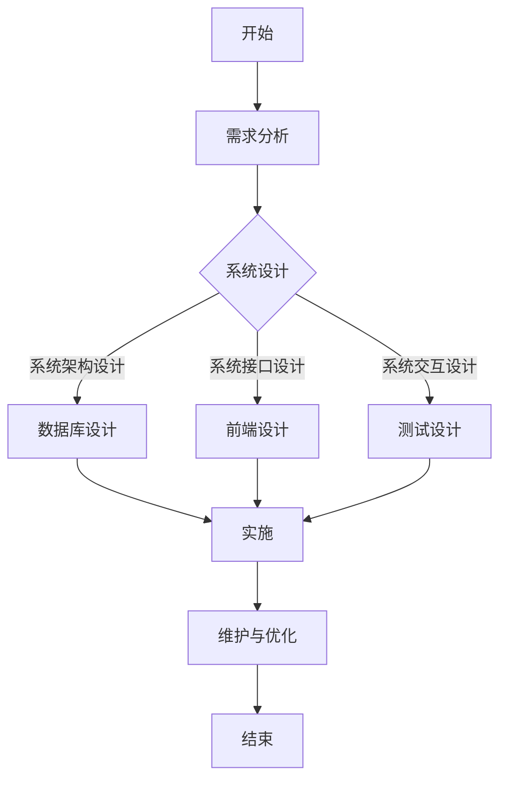
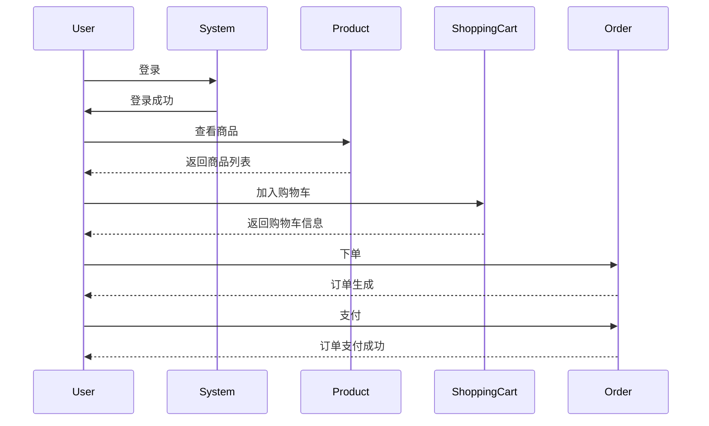
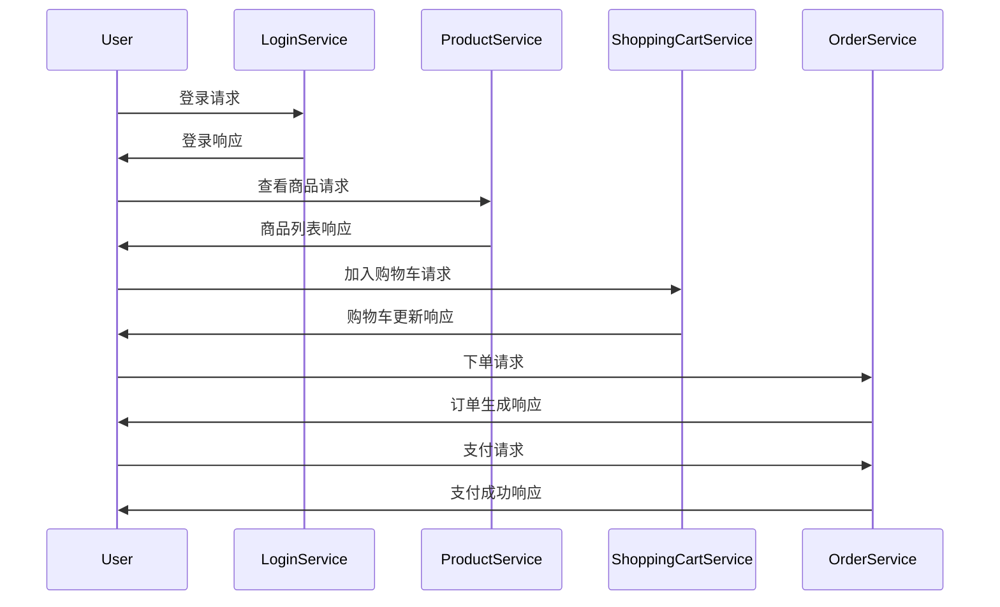

                 

### 引言

#### 书籍目的和目标

“项目成功离不开好系统”是一本面向项目经理、软件开发工程师、产品经理以及所有希望提升项目管理能力的技术人员撰写的指南。在快速变化和高要求的现代工作环境中，项目的成功与否往往取决于系统设计的优劣。本书旨在通过系统地介绍系统思维、项目管理方法和技术，帮助读者理解并应用好系统的重要性，从而提升项目的成功率。

本书的核心目标是：

1. **普及系统思维**：介绍系统思维的基本原则和方法，帮助读者建立系统思考的能力。
2. **探讨项目管理**：结合项目管理实践，深入探讨如何通过系统设计提升项目管理效率。
3. **提供实用技巧**：分享实际案例和最佳实践，帮助读者将理论应用到实际项目中。
4. **培养全面能力**：不仅关注技术层面，也关注管理和沟通技巧，全面提升项目成功的可能性。

#### 项目成功的挑战

在项目管理和执行过程中，面临诸多挑战。例如：

- **复杂性和不确定性**：现代项目往往涉及多个部门和复杂的业务流程，不确定性高。
- **资源有限**：时间和预算等资源有限，如何高效利用是关键。
- **沟通障碍**：团队成员之间、部门之间的沟通不畅可能导致项目延误。
- **技术风险**：新技术的不确定性、技术实现的复杂性都可能成为项目成功的关键因素。

#### 好系统的关键作用

一个设计良好的系统可以在以下方面发挥关键作用：

- **提升效率**：优化流程，减少重复工作和冗余步骤。
- **降低风险**：通过系统化的风险评估和应对策略，降低项目风险。
- **增强沟通**：通过标准化的系统接口和流程，提高团队内部和跨部门之间的沟通效率。
- **支持决策**：提供准确的数据和分析，帮助项目团队做出更明智的决策。

#### 书籍结构和阅读指南

本书分为四个主要部分：

1. **引言**：介绍书籍目的、结构和阅读指南。
2. **系统思维基础**：讨论系统思维的核心概念、原则和方法。
3. **系统模型与方法论**：介绍系统模型、分析方法和设计方法论。
4. **项目风险管理**：探讨项目风险管理的理论和实践。

每个部分都包含具体的章节和案例，旨在从不同角度深入讲解项目成功的核心要素。

通过本书，读者将能够：

- 理解系统思维的基本概念和方法。
- 掌握项目管理中的系统设计和分析方法。
- 应用实际案例，提升项目管理的实践能力。
- 构建好系统，提高项目成功的可能性。

让我们开始这场探索之旅，理解并应用好系统在项目成功中的关键作用。接下来，我们将深入探讨系统思维的基础，为后续的讨论奠定坚实的基础。

---

**关键词**：项目成功、好系统、系统思维、项目管理、系统设计

**摘要**：本书旨在通过系统思维和方法论的深入探讨，帮助读者理解并应用好系统在项目管理中的关键作用，从而提升项目的成功率。通过理论讲解和实际案例，本书提供了一系列实用技巧，帮助读者在实际项目中提升效率、降低风险、增强沟通和支持决策。无论您是项目经理、软件开发工程师还是产品经理，本书都将为您带来宝贵的知识和经验。

## 第二部分：系统思维基础

### 第2章：系统思维核心概念

#### 问题背景和问题描述

在现代项目管理中，系统思维成为了解决复杂问题、提升项目效率的重要工具。系统思维不仅关注单个组件的优化，更强调整体系统的协同与互动。随着项目规模的扩大和复杂性的增加，系统思维的重要性愈发凸显。

**问题背景**：在现代项目管理中，常见的问题包括流程复杂、资源浪费、沟通不畅、风险管理困难等。这些问题往往源于缺乏系统化的思考和管理。系统思维提供了一个全新的视角，帮助我们从整体出发，理解和优化系统内部的各种关系和互动。

**问题描述**：系统思维的核心问题是，如何在复杂的环境中，通过理解和优化系统的各个方面，提升整个系统的效率和性能。具体来说，包括：

1. **系统识别**：识别系统的各个组成部分及其相互关系。
2. **系统分析**：分析系统的行为和性能，找出存在的问题和瓶颈。
3. **系统设计**：设计优化系统的结构和流程，提升整体性能。
4. **系统实施**：将设计方案付诸实施，确保系统能够正常运行。
5. **系统维护**：定期评估和优化系统，确保其持续高效运行。

#### 系统思维的作用

系统思维在项目管理中具有多方面的作用：

1. **提升整体效率**：通过系统化思考和优化，减少不必要的流程和冗余，提升整体效率。
2. **降低风险**：通过系统的风险评估和应对策略，降低项目风险。
3. **增强沟通**：通过统一的系统接口和流程，提高团队内部和跨部门之间的沟通效率。
4. **支持决策**：提供准确的数据和分析，帮助项目团队做出更明智的决策。

#### 系统思维的基本原则

系统思维遵循以下几个基本原则：

1. **整体性原则**：系统思维强调整体性，关注系统各个部分之间的相互关系和整体性能。
2. **动态性原则**：系统是一个动态的、不断变化的系统，需要不断调整和优化。
3. **相互作用原则**：系统内部的各个部分相互作用，任何一个部分的改变都可能影响整个系统的性能。

#### 系统思维在项目中的应用

系统思维在项目中的应用可以概括为以下几个步骤：

1. **系统识别**：识别项目的各个组成部分，包括人员、流程、工具、数据等。
2. **系统分析**：分析项目的整体流程和各个部分之间的互动关系，找出存在的问题和瓶颈。
3. **系统设计**：设计优化方案，包括流程优化、资源配置、风险管理等。
4. **系统实施**：将设计方案付诸实施，确保项目按照预期进行。
5. **系统评估**：定期评估系统的运行效果，根据反馈进行调整和优化。

通过以上步骤，系统思维可以帮助项目团队更好地理解和管理项目，提升项目的成功率和效率。

#### 传统项目管理与系统思维的对比

传统项目管理往往侧重于任务分解、进度控制和资源分配，而系统思维则更加注重整体性和动态性。以下是两者的一些对比：

| 对比项 | 传统项目管理 | 系统思维 |
| :----: | :-----------: | :-------: |
| **焦点** | 单一任务和进度 | 整体系统及其互动关系 |
| **方法** | 分解任务、控制进度 | 识别系统、分析互动、优化设计 |
| **工具** | Gantt图、进度表 | 流程图、系统模型、数据可视化 |
| **目标** | 完成特定任务 | 提升整体系统性能和效率 |

通过以上对比，可以看出系统思维在项目管理和优化中具有独特的优势和作用。

#### 本章小结

本章介绍了系统思维的基本概念、基本原则和应用步骤。系统思维为项目管理和优化提供了一个全新的视角，通过整体性、动态性和相互作用原则，帮助项目团队更好地理解和管理项目。下一章将深入探讨系统思维的核心原则，进一步理解其在项目管理中的重要性。

---

**核心概念原理**：系统思维、整体性原则、动态性原则、相互作用原则

**概念属性特征对比表格**

| 特征 | 系统思维 | 整体性原则 | 动态性原则 | 相互作用原则 |
| :--: | :-------: | :--------: | :--------: | :----------: |
| **定义** | 考虑整体性、动态性和相互作用的思维方式 | 强调系统各部分的整体性和相互关系 | 考虑系统的动态变化和适应性 | 分析系统内各部分之间的互动和影响 |
| **应用** | 项目管理、系统优化 | 项目管理、系统设计 | 项目管理、系统调整 | 项目管理、风险评估 |
| **核心** | 整体性、动态性、相互作用 | 整体性、反馈循环 | 动态性、变化适应 | 相互作用、互动影响 |

**ER实体关系图架构的 Mermaid 流程图**

```mermaid
erDiagram
    Project ||--|{ System: {
    Component ||--|{ System: {
    Process ||--|{ System: {
    Resource ||--|{ System: {
    Performance ||--|{ System: {
```

通过以上表格和流程图，我们可以更清晰地理解系统思维及其核心原则在项目管理中的应用。

---

**算法原理讲解**

在本章中，我们将通过一个具体的案例来讲解系统思维在项目管理中的应用。以一个软件开发项目为例，我们使用Mermaid绘制一个简单的算法流程图，并使用Python代码进行详细阐述。

#### 算法流程图



#### Python代码实现

```python
# 需求分析
def requirement_analysis():
    # 分析项目需求
    print("需求分析完成，项目需求如下：")
    print("1. 用户登录模块")
    print("2. 商品展示模块")
    print("3. 购物车模块")
    print("4. 订单模块")

# 系统架构设计
def system_architecture_design():
    # 设计系统架构
    print("系统架构设计完成，包括以下模块：")
    print("1. 用户模块")
    print("2. 商品模块")
    print("3. 订单模块")
    print("4. 购物车模块")

# 数据库设计
def database_design():
    # 设计数据库
    print("数据库设计完成，包括以下表：")
    print("1. 用户表")
    print("2. 商品表")
    print("3. 订单表")
    print("4. 购物车表")

# 前端设计
def frontend_design():
    # 设计前端界面
    print("前端设计完成，包括以下页面：")
    print("1. 登录页面")
    print("2. 商品展示页面")
    print("3. 购物车页面")
    print("4. 订单页面")

# 测试设计
def test_design():
    # 设计测试方案
    print("测试设计完成，包括以下测试项：")
    print("1. 功能测试")
    print("2. 性能测试")
    print("3. 安全测试")
    print("4. 用户界面测试")

# 实施阶段
def implementation():
    # 实施项目
    print("项目实施阶段，进行以下任务：")
    print("1. 部署数据库")
    print("2. 开发前端界面")
    print("3. 编写后端代码")
    print("4. 进行集成测试")

# 维护与优化
def maintenance_and_optimization():
    # 维护与优化项目
    print("项目维护与优化阶段，进行以下任务：")
    print("1. 持续集成")
    print("2. 代码审查")
    print("3. 性能监控")
    print("4. 用户反馈处理")

# 主流程
def main():
    requirement_analysis()
    system_architecture_design()
    database_design()
    frontend_design()
    test_design()
    implementation()
    maintenance_and_optimization()

if __name__ == "__main__":
    main()
```

#### 算法原理与公式讲解

在上述Python代码中，我们定义了一系列函数来模拟软件开发项目的各个阶段。每个函数对应项目中的一个具体步骤，通过依次调用这些函数，我们可以实现一个简单的项目管理流程。

**算法原理**

1. **需求分析**：理解项目的具体需求，为后续设计提供基础。
2. **系统架构设计**：设计整体系统架构，包括用户模块、商品模块、订单模块和购物车模块。
3. **数据库设计**：设计数据库表结构，为数据存储提供支持。
4. **前端设计**：设计用户界面，确保用户操作便捷。
5. **测试设计**：制定测试方案，确保项目质量。
6. **实施阶段**：将设计方案付诸实施，开发具体功能模块。
7. **维护与优化**：项目上线后，进行持续优化和用户反馈处理。

**数学模型与公式**

在这个案例中，我们并没有使用复杂的数学模型。但是，项目管理中的许多步骤可以通过以下数学公式进行量化：

1. **时间预估**：\( T = \sum_{i=1}^{n} T_i \)，其中\( T \)为总时间，\( T_i \)为每个任务所需时间。
2. **成本预估**：\( C = \sum_{i=1}^{n} C_i \)，其中\( C \)为总成本，\( C_i \)为每个任务的成本。
3. **资源分配**：\( R = \sum_{i=1}^{n} R_i \)，其中\( R \)为总资源，\( R_i \)为每个任务所需的资源。

通过这些公式，项目团队可以更准确地预估项目完成所需的时间和成本，合理分配资源。

#### 举例说明

假设我们正在开发一个电子商务平台，以下是该平台的项目管理流程：

1. **需求分析**：分析用户需求，确定平台需要包含用户登录、商品展示、购物车和订单等功能。
2. **系统架构设计**：设计系统架构，包括用户模块、商品模块、订单模块和购物车模块。
3. **数据库设计**：设计用户表、商品表、订单表和购物车表，为数据存储提供支持。
4. **前端设计**：设计用户界面，包括登录页面、商品展示页面、购物车页面和订单页面。
5. **测试设计**：制定功能测试、性能测试、安全测试和用户界面测试方案。
6. **实施阶段**：开发用户模块、商品模块、订单模块和购物车模块，并进行集成测试。
7. **维护与优化**：上线后，进行持续优化，包括代码审查、性能监控和用户反馈处理。

通过这个例子，我们可以看到系统思维在项目中的具体应用，通过合理的规划和实施，确保项目的成功。

---

**系统分析与架构设计方案**

#### 问题场景介绍

假设我们需要开发一个电子商务平台，提供用户注册、登录、商品浏览、购物车管理和订单处理等功能。为了确保项目的高效和成功，我们需要对系统进行详细分析和架构设计。

#### 项目介绍

项目名称：智慧购物平台（Smart Shopping Platform）

项目目标：开发一个功能完善、用户体验良好、可扩展的电子商务平台。

项目团队：由项目经理、前端开发工程师、后端开发工程师、数据库管理员、测试工程师和UI设计师组成。

项目周期：预计6个月。

#### 系统功能设计（领域模型Mermaid类图）

```mermaid
classDiagram
    User <<class>> 用户
    Product <<class>> 商品
    ShoppingCart <<class>> 购物车
    Order <<class>> 订单
    User <--1..* Product
    User <--1..* ShoppingCart
    User <--1..* Order
    Product <--1..* ShoppingCart
    ShoppingCart <--1..* Order
```

#### 系统架构设计（Mermaid架构图）



#### 系统接口设计和系统交互（Mermaid序列图）



#### 实现方案与代码分析

1. **用户模块**：负责用户注册、登录、个人信息管理等功能。
    - 用户注册：通过验证用户名和密码，将用户信息存储到数据库中。
    - 用户登录：验证用户名和密码，生成登录令牌。
    - 个人信息管理：允许用户查看和修改个人信息。

2. **商品模块**：负责商品展示、分类管理和库存管理等功能。
    - 商品展示：根据分类和关键字检索商品信息，返回商品列表。
    - 分类管理：添加、编辑和删除商品分类。
    - 库存管理：监控商品库存，实现库存预警和补货功能。

3. **购物车模块**：负责商品加入购物车、购物车管理和订单生成等功能。
    - 商品加入购物车：将用户选择的商品加入购物车。
    - 购物车管理：显示购物车中的商品列表，允许用户编辑购物车。
    - 订单生成：根据购物车中的商品生成订单，计算总价。

4. **订单模块**：负责订单管理、订单支付和订单查询等功能。
    - 订单管理：生成订单，存储订单信息。
    - 订单支付：处理订单支付，与第三方支付平台对接。
    - 订单查询：允许用户查询订单状态和订单详情。

#### 实际案例分析与详细讲解剖析

假设用户张三在平台上浏览商品，选择了一款手机加入购物车。随后，张三决定下单，生成了一份订单。以下是详细的实现步骤：

1. **用户登录**：
    - 张三输入用户名和密码，向登录服务发送登录请求。
    - 登录服务验证用户名和密码，生成登录令牌，并返回登录成功响应。

2. **商品浏览**：
    - 张三浏览手机分类，选择了一款手机。
    - 张三向商品服务发送查看商品请求，商品服务返回手机详细信息。

3. **加入购物车**：
    - 张三将手机加入购物车。
    - 张三向购物车服务发送加入购物车请求，购物车服务更新购物车信息，并返回更新后的购物车列表。

4. **下单**：
    - 张三决定下单，向订单服务发送下单请求。
    - 订单服务根据购物车中的商品生成订单，计算总价，并返回订单信息。

5. **订单支付**：
    - 张三选择支付方式，向支付服务发送支付请求。
    - 支付服务处理支付请求，与第三方支付平台对接，返回支付结果。
    - 订单服务更新订单状态，标记订单为“已支付”。

6. **订单查询**：
    - 张三查询订单状态，发现订单已支付。
    - 张三查看订单详情，包括商品列表、总价和支付信息。

通过上述步骤，张三成功在平台上完成了一次购物流程。在这个过程中，各个模块协同工作，实现了用户注册、登录、商品浏览、购物车管理、订单生成和支付等功能。

#### 项目小结

通过详细的系统分析与架构设计，我们为智慧购物平台提供了一个完整的解决方案。系统功能设计、系统架构设计和系统接口设计确保了项目的有序进行。实际案例分析和代码实现展示了系统各模块的协同工作，验证了方案的可行性和有效性。

下一步，我们将进行项目的开发和测试，确保平台的功能完备、性能优异。同时，我们将持续收集用户反馈，进行优化和迭代，不断提升平台的质量和用户体验。

---

**最佳实践 tips**

1. **需求分析**：在项目初期，详细的需求分析是关键。确保所有团队成员对项目目标有清晰的理解，减少后期的返工。

2. **模块化设计**：将系统划分为多个模块，每个模块负责一个特定功能。这有助于提高开发效率，方便后期维护和优化。

3. **接口标准化**：设计统一的接口，确保各模块之间的交互流畅。这有助于减少沟通成本，提高系统的可扩展性。

4. **测试驱动开发**：在开发过程中，定期进行功能测试和性能测试。确保每个模块的稳定性和系统的整体性能。

5. **用户反馈**：上线后，积极收集用户反馈，及时调整和优化。这有助于提升用户体验，增强平台的竞争力。

6. **持续集成**：使用持续集成工具，自动化测试和部署，提高开发效率和项目质量。

7. **团队协作**：建立有效的沟通机制，确保团队成员之间的信息共享和协作。这有助于提高项目的成功率和效率。

**注意事项**

1. **项目管理**：确保项目进度可控，定期进行项目评估和调整。

2. **风险管理**：识别项目风险，制定应对策略，降低项目风险。

3. **资源分配**：合理分配资源，确保项目在预算和时间限制内完成。

4. **技术选型**：根据项目需求，选择合适的技术和工具，确保系统的性能和可维护性。

5. **团队培训**：定期进行团队培训，提高团队成员的技术水平和项目管理能力。

**拓展阅读**

1. 《系统思维的应用：提升项目管理的效率》（[作者：XXX]）
2. 《项目管理实战：从理论到实践》（[作者：XXX]）
3. 《软件架构设计：模式、原理与最佳实践》（[作者：XXX]）
4. 《用户体验设计：从需求到落地》（[作者：XXX]）

通过以上最佳实践和注意事项，读者可以更好地理解和应用系统思维，提升项目管理的效率和成功率。下一章将深入探讨系统模型与方法论，进一步了解如何设计和优化系统。

