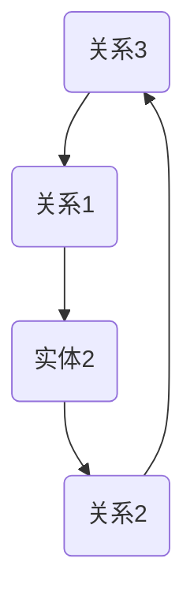
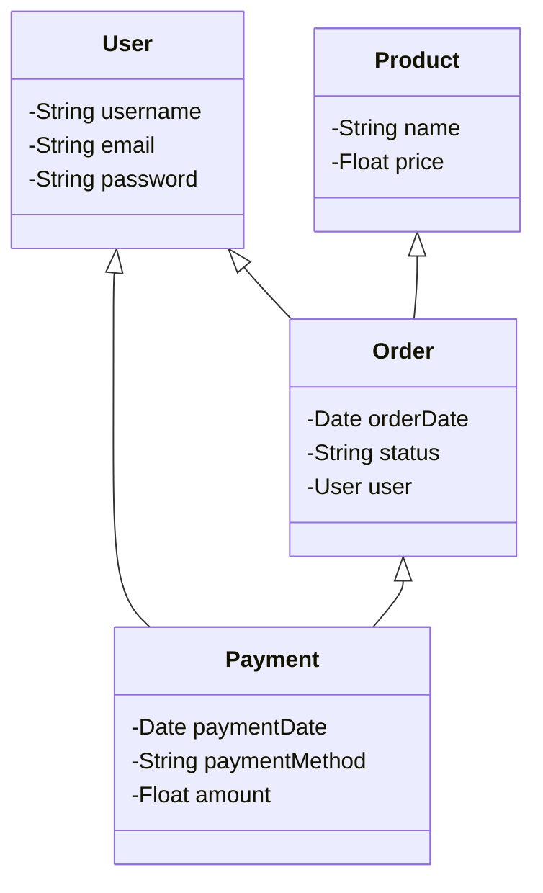
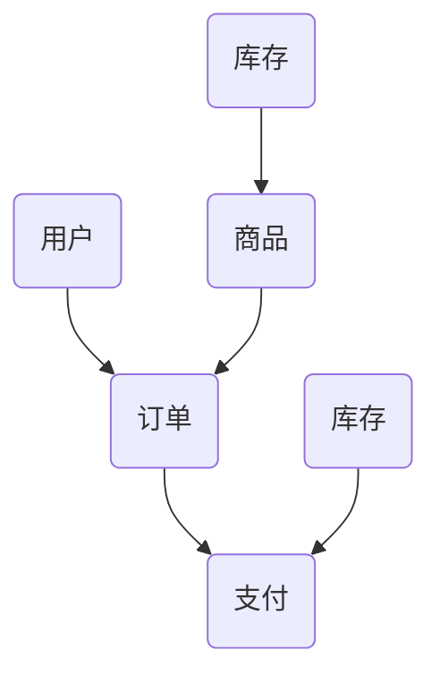
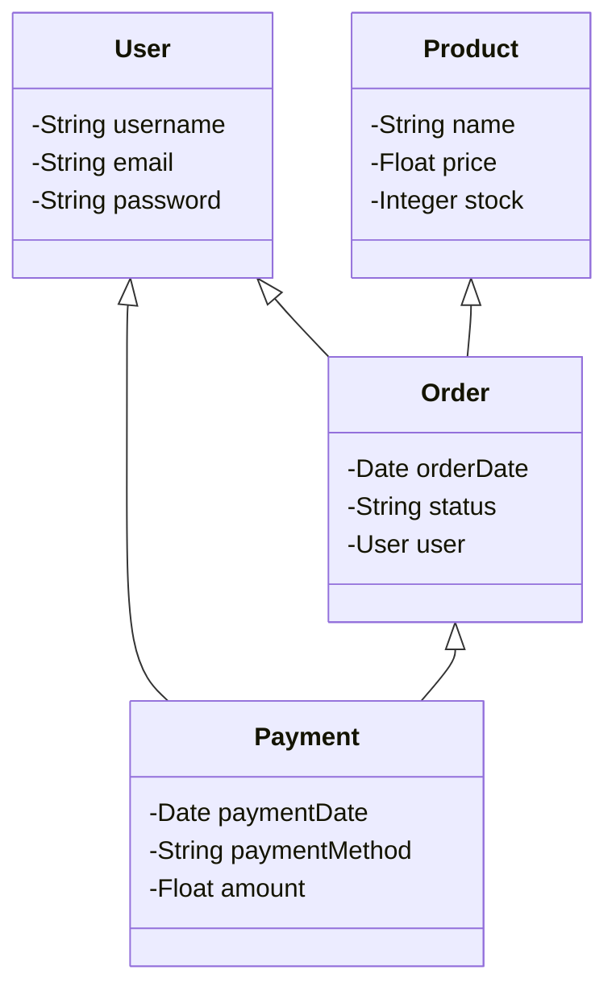

                 

### 领域建模：技术人都该是设计师

领域建模，作为一种关键的软件工程方法，在当今复杂系统的设计和开发中扮演着至关重要的角色。它不仅帮助技术人更好地理解系统，还提升了设计的质量与效率。本文将以《领域建模：技术人都该是设计师》为题，深入探讨领域建模的概念、方法、实践，以及它对技术人的重要性。

> **关键词：** 领域建模，软件设计，系统架构，技术人，复杂性管理

> **摘要：** 本文首先介绍了领域建模的背景和重要性，随后详细阐述了领域建模的基础理论，包括方法和流程。接着，通过具体案例展示了领域建模在不同层面的应用，并总结了一些最佳实践和注意事项。最后，对领域建模的未来发展进行了展望。

### 目录大纲设计步骤

#### 步骤1：确定书籍核心主题
书籍名为《领域建模：技术人都该是设计师》，核心主题围绕领域建模及其在技术领域的应用。领域建模是一种系统化的方法，用于抽象和表达特定领域的问题域，帮助技术人更好地理解和设计复杂系统。

#### 步骤2：规划目录结构
本书可以分为以下几个部分：
- 引言：介绍领域建模的背景和重要性
- 基础理论：讲解领域建模的基本概念、方法和流程
- 实践应用：通过具体案例展示领域建模的实际应用
- 最佳实践：分享领域建模的最佳实践和注意事项
- 拓展阅读：提供进一步阅读和学习的资源

#### 步骤3：细化章节内容
针对每个部分，细化章节内容，确保每个章节都有明确的主题和目标。

##### 引言部分
- 1.1 领域建模的背景和重要性
- 1.2 领域建模的基本概念

##### 基础理论部分
- 2.1 领域建模的方法和流程
- 2.2 领域模型的核心概念
- 2.3 领域模型的常用工具和技术

##### 实践应用部分
- 3.1 领域建模在软件设计中的应用
- 3.2 领域建模在系统架构设计中的应用
- 3.3 领域建模在项目开发中的应用

##### 最佳实践部分
- 4.1 领域建模的最佳实践
- 4.2 领域建模的注意事项
- 4.3 领域建模的拓展阅读

#### 步骤4：编写目录大纲
根据规划好的目录结构，编写详细的目录大纲，确保每个章节都有明确的标题和层次。

#### 步骤5：审查和调整
对目录大纲进行审查，确保内容完整、逻辑清晰，并进行必要的调整和优化。

### 目录大纲

----------------------------------------------------------------

## 引言：领域建模的背景和重要性

### 1.1 领域建模的背景

#### 1.1.1 问题背景

#### 1.1.2 问题描述

#### 1.1.3 问题解决

#### 1.1.4 边界与外延

#### 1.1.5 概念结构与核心要素组成

### 1.2 领域建模的基本概念

#### 1.2.1 领域建模的定义

#### 1.2.2 领域建模的特点

#### 1.2.3 领域建模的意义

----------------------------------------------------------------

## 基础理论：领域建模的方法和流程

### 2.1 领域建模的方法

#### 2.1.1 建模方法概述

#### 2.1.2 常用建模方法介绍

##### 2.1.2.1 概念建模

##### 2.1.2.2 面向对象建模

##### 2.1.2.3 建模语言

### 2.2 领域模型的流程

#### 2.2.1 领域模型的过程

#### 2.2.2 领域模型的关键步骤

##### 2.2.2.1 需求分析

##### 2.2.2.2 模型设计

##### 2.2.2.3 模型验证

##### 2.2.2.4 模型部署

### 2.3 领域模型的核心概念

#### 2.3.1 概念解析

#### 2.3.2 概念属性特征对比表格

#### 2.3.3 ER实体关系图架构

----------------------------------------------------------------

## 实践应用：领域建模的具体案例

### 3.1 领域建模在软件设计中的应用

#### 3.1.1 软件设计中的领域建模

#### 3.1.2 领域模型的构建

##### 3.1.2.1 需求分析

##### 3.1.2.2 模型设计

##### 3.1.2.3 模型验证

##### 3.1.2.4 模型部署

### 3.2 领域建模在系统架构设计中的应用

#### 3.2.1 系统架构设计中的领域建模

#### 3.2.2 领域模型的构建

##### 3.2.2.1 需求分析

##### 3.2.2.2 模型设计

##### 3.2.2.3 模型验证

##### 3.2.2.4 模型部署

### 3.3 领域建模在项目开发中的应用

#### 3.3.1 项目开发中的领域建模

#### 3.3.2 领域模型的构建

##### 3.3.2.1 需求分析

##### 3.3.2.2 模型设计

##### 3.3.2.3 模型验证

##### 3.3.2.4 模型部署

----------------------------------------------------------------

### 引言：领域建模的背景和重要性

#### 1.1 领域建模的背景

在信息化时代，复杂系统的设计和开发已经成为技术人的核心任务。随着技术的快速发展，系统的规模和复杂性不断增加，传统的软件开发方法已经无法满足现代复杂系统的需求。领域建模作为一种系统化、规范化的方法，应运而生，它帮助技术人更好地理解和设计复杂系统。

领域建模的背景可以从以下几个方面来理解：

1. **复杂性管理**：复杂系统通常包含大量的组件和关系，如何有效地管理和组织这些组件成为关键问题。领域建模提供了一种抽象和结构化的方式，使得技术人能够清晰地理解系统的结构和行为。
   
2. **需求多样性**：在当今的市场环境中，用户的需求越来越多样化，如何快速响应用户需求成为软件开发的关键。领域建模通过建立清晰的需求模型，使得需求分析更加精确和高效。

3. **技术发展的推动**：随着面向对象编程、模型驱动开发等技术的兴起，领域建模方法得到了进一步的发展和完善。这些技术的发展为领域建模提供了强有力的工具支持。

#### 1.1.2 问题描述

在复杂系统的设计和开发过程中，技术人通常会面临以下问题：

1. **理解困难**：复杂系统的结构和行为难以直接理解，导致设计过程中出现偏差和错误。

2. **沟通障碍**：技术人、业务人员和其他相关方之间的沟通不畅，容易导致误解和矛盾。

3. **重复劳动**：在设计和开发过程中，由于缺乏有效的抽象和结构化方法，重复劳动和错误修复成本高昂。

4. **可维护性差**：复杂系统的可维护性差，一旦出现问题，修复和更新成本极高。

#### 1.1.3 问题解决

领域建模通过以下方式解决上述问题：

1. **抽象和结构化**：领域建模提供了一种抽象和结构化的方法，将复杂系统分解为更小、更易于管理的部分，使得系统的结构和行为更加清晰。

2. **需求建模**：通过建立需求模型，领域建模帮助技术人更好地理解用户需求，确保开发过程与用户需求一致。

3. **提高沟通效率**：领域建模提供了统一的语言和符号，使得技术人、业务人员和其他相关方能够更加高效地进行沟通。

4. **减少重复劳动**：领域建模通过建立模型，减少了重复劳动和错误修复成本。

#### 1.1.4 边界与外延

领域建模的边界主要涉及以下几个方面：

1. **应用范围**：领域建模适用于各种复杂系统，包括软件、硬件、网络等。

2. **技术层面**：领域建模不仅涉及软件开发，还包括系统架构设计、数据库设计等。

3. **行业领域**：领域建模在不同行业领域中的应用有所不同，需要根据具体行业特点进行调整。

#### 1.1.5 概念结构与核心要素组成

领域建模的基本概念结构包括以下几个方面：

1. **领域**：领域是指一个特定的问题域，通常涉及一组相关的问题和需求。

2. **模型**：模型是领域内的一组概念和关系的抽象表示，用于描述领域内的现象和过程。

3. **元模型**：元模型是模型的模型，用于定义和描述模型的元素和结构。

4. **建模语言**：建模语言是用于定义和表示模型的语言和符号。

5. **建模工具**：建模工具是用于创建、编辑和可视化模型的软件工具。

### 1.2 领域建模的基本概念

#### 1.2.1 领域建模的定义

领域建模是一种系统化的方法，用于构建和表示特定领域的问题域。它通过建立领域模型，帮助技术人更好地理解领域内的现象和过程，从而设计出更加有效和高效的系统。

#### 1.2.2 领域建模的特点

领域建模具有以下特点：

1. **抽象性**：领域建模通过抽象，将复杂的现实问题转化为更易于管理的模型。

2. **结构化**：领域建模采用结构化的方法，将复杂系统分解为更小、更易于管理的部分。

3. **一致性**：领域建模通过一致性检查，确保模型内部的一致性，减少错误和冲突。

4. **可扩展性**：领域建模具有良好的可扩展性，能够适应新的需求和变化。

#### 1.2.3 领域建模的意义

领域建模在软件开发和系统设计中具有重要意义：

1. **提高设计质量**：领域建模帮助技术人更好地理解系统，减少设计错误和遗漏。

2. **提高开发效率**：领域建模通过结构化和抽象，减少了重复劳动和错误修复成本。

3. **提升团队协作**：领域建模提供了统一的语言和符号，提高了团队内部和跨团队的协作效率。

4. **增强系统可维护性**：领域建模使得系统的结构和行为更加清晰，提高了系统的可维护性。

通过上述对领域建模背景、问题和解决方案的阐述，以及对基本概念和特点的介绍，我们可以看出，领域建模对于技术人来说具有重要的意义。在接下来的章节中，我们将进一步深入探讨领域建模的方法、流程以及在不同层面的具体应用。希望本文能够帮助读者更好地理解和应用领域建模，提升自己的技术水平和设计能力。接下来，我们将详细讨论领域建模的基础理论，包括方法和流程。

## 基础理论：领域建模的方法和流程

### 2.1 领域建模的方法

领域建模的方法是构建领域模型的关键步骤，它决定了模型的质量和可维护性。以下将介绍几种常见的领域建模方法，包括概念建模、面向对象建模和建模语言。

#### 2.1.1 建模方法概述

领域建模方法主要分为以下几类：

1. **概念建模**：概念建模是一种高层次的方法，用于建立领域模型的核心概念。它侧重于识别领域内的实体、关系和属性，并使用简单的图形和表格来表示。

2. **面向对象建模**：面向对象建模是一种基于对象的方法，通过定义类、属性和方法来模拟领域内的对象和行为。

3. **建模语言**：建模语言是一种形式化的方法，用于定义和表示模型的结构和语义。常见的建模语言包括统一建模语言（UML）、实体关系模型（ER模型）等。

#### 2.1.2 常用建模方法介绍

##### 2.1.2.1 概念建模

概念建模通常采用以下步骤：

1. **需求分析**：了解领域需求，确定建模的目标和范围。

2. **实体识别**：识别领域内的实体，如人、物、事件等。

3. **关系识别**：识别实体之间的关系，如包含、依赖、关联等。

4. **属性识别**：为实体和关系添加属性，如名称、描述、大小等。

5. **模型验证**：检查模型的一致性和完整性。

概念建模的优点是简单易懂，适合初学者和领域专家。缺点是缺乏形式化验证，可能导致模型不完整或不一致。

##### 2.1.2.2 面向对象建模

面向对象建模采用以下步骤：

1. **需求分析**：理解领域需求，确定建模的目标和范围。

2. **类识别**：识别领域内的类，如人、物、事件等。

3. **属性和方法识别**：为类添加属性和方法，描述类的特征和行为。

4. **关系识别**：识别类之间的关系，如继承、关联、依赖等。

5. **模型验证**：检查模型的一致性和完整性。

面向对象建模的优点是形式化程度高，易于理解和扩展。缺点是对初学者可能较难理解，且在复杂场景下可能过于繁琐。

##### 2.1.2.3 建模语言

建模语言是领域建模的关键工具，以下介绍几种常见的建模语言：

1. **统一建模语言（UML）**：UML是一种广泛使用的建模语言，包含多种图表，如类图、用例图、序列图等。UML有助于清晰地表达领域模型的结构和行为。

2. **实体关系模型（ER模型）**：ER模型主要用于数据库设计，通过定义实体、属性和关系来表示数据模型。ER模型适合用于描述复杂的数据结构和关系。

3. **领域特定语言（DSL）**：DSL是一种自定义的建模语言，专门用于特定领域的问题。DSL能够提高模型的精确性和可维护性。

### 2.2 领域模型的流程

领域模型的过程可以分为以下几个关键步骤：

1. **需求分析**：理解领域需求，确定建模的目标和范围。

2. **领域概念识别**：识别领域内的关键概念和术语，如实体、属性、关系等。

3. **领域模型设计**：使用选定的建模方法，构建领域模型。

4. **模型验证**：检查模型的一致性和完整性，确保模型能够准确描述领域。

5. **模型部署**：将领域模型应用于实际系统，如软件设计、系统架构等。

以下是领域模型流程的详细步骤：

#### 2.2.1 领域模型的过程

1. **需求分析**：通过与领域专家、业务人员和其他相关方的沟通，收集和分析领域需求。明确领域目标、功能需求和约束条件。

2. **领域概念识别**：根据需求分析结果，识别领域内的关键概念和术语。这包括实体、属性、关系和规则等。

3. **领域模型设计**：选择合适的建模方法，如概念建模、面向对象建模等，构建领域模型。确保模型能够准确反映领域需求和概念结构。

4. **模型验证**：通过一致性检查、完整性验证和模型评估，确保领域模型的质量。可以采用自动化工具或人工审查的方法进行验证。

5. **模型部署**：将领域模型应用于实际系统，如软件设计、系统架构等。确保领域模型能够指导系统开发，并符合业务需求。

#### 2.2.2 领域模型的关键步骤

1. **需求分析**：需求分析是领域建模的基础，它决定了模型的质量和适用性。通过需求分析，可以明确领域目标、功能需求和约束条件。

2. **模型设计**：模型设计是领域建模的核心步骤，它决定了模型的准确性和可维护性。选择合适的建模方法，如概念建模、面向对象建模等，构建领域模型。

3. **模型验证**：模型验证是确保领域模型质量的关键环节。通过一致性检查、完整性验证和模型评估，可以识别和修复模型中的错误和不足。

4. **模型部署**：模型部署是将领域模型应用于实际系统的过程。通过模型部署，可以确保领域模型能够指导系统开发，并符合业务需求。

### 2.3 领域模型的核心概念

领域模型的核心概念包括实体、关系、属性和规则等。以下是这些核心概念的详细解析：

#### 2.3.1 概念解析

1. **实体**：实体是领域模型的基本元素，代表领域内的对象，如人、物、事件等。实体具有属性和关系。

2. **关系**：关系描述实体之间的相互作用和依赖关系。关系可以是包含、依赖、关联等。

3. **属性**：属性是实体的特征，用于描述实体的状态和特征。属性可以是简单的数据类型，也可以是复杂的对象。

4. **规则**：规则是领域模型中的约束和逻辑规则，用于定义实体的行为和约束条件。

#### 2.3.2 概念属性特征对比表格

以下是实体、关系和属性特征的对比表格：

| 概念 | 特征 |
| :--: | :--: |
| 实体 | - 代表领域内的对象 - 具有属性和关系 |
| 关系 | - 描述实体之间的相互作用和依赖关系 - 可以是包含、依赖、关联等 |
| 属性 | - 描述实体的特征和状态 - 可以是简单的数据类型，也可以是复杂的对象 |

#### 2.3.3 ER实体关系图架构

ER实体关系图是领域模型中常用的可视化工具，用于表示实体和关系。以下是ER实体关系图的示例：

在上面的示例中，实体1和实体2通过关系1和关系2相连，形成一个简单的实体关系图。

通过上述对领域建模方法、流程和核心概念的介绍，我们可以看出，领域建模是一种系统化、规范化的方法，它帮助技术人更好地理解和设计复杂系统。在接下来的章节中，我们将通过具体案例展示领域建模在实际应用中的效果，帮助读者更深入地理解领域建模的实践价值。接下来，我们将详细探讨领域建模在软件设计中的应用。

### 领域建模在软件设计中的应用

领域建模在软件设计中扮演着至关重要的角色，它不仅帮助技术人更好地理解系统需求，还能够显著提升软件设计质量。在这一部分，我们将通过一个具体的软件设计案例，详细探讨领域建模的应用过程，包括需求分析、模型设计、模型验证和模型部署。

#### 3.1 软件设计中的领域建模

领域建模在软件设计中的应用，首先需要明确软件设计的背景和需求。以下是一个示例：

**案例背景：**
假设我们正在开发一款在线购物系统，该系统需要支持商品管理、订单处理、支付和用户管理等核心功能。

**需求分析：**
1. 用户可以浏览商品、添加购物车、下单和支付。
2. 系统管理员可以管理商品信息、订单状态和用户账户。
3. 支付系统需要支持多种支付方式，如信用卡、支付宝和微信支付。

#### 3.1.1 领域模型的构建

##### 3.1.1.1 需求分析

在需求分析阶段，我们需要与产品经理、业务分析师和开发团队紧密合作，收集并理解系统的需求。具体步骤如下：

1. **需求收集**：通过与利益相关者的访谈、问卷调查和用户故事，收集系统的功能需求和非功能需求。
2. **需求分类**：将收集到的需求分类为功能需求和非功能需求，如用户管理、商品管理、订单处理、支付等。
3. **需求文档**：编写详细的需求文档，明确每个功能模块的需求细节。

##### 3.1.1.2 模型设计

在模型设计阶段，我们使用领域建模方法构建系统模型。以下是具体的模型设计步骤：

1. **实体识别**：根据需求分析结果，识别系统中的关键实体，如用户、商品、订单、支付等。
2. **属性识别**：为每个实体添加属性，如用户的姓名、邮箱、密码等。
3. **关系识别**：识别实体之间的关系，如用户与订单之间的关系、商品与订单之间的关系等。
4. **模型表示**：使用UML类图、ER图等建模工具，将领域模型表示为图形化的模型。

以下是该案例的UML类图示例：

##### 3.1.1.3 模型验证

在模型验证阶段，我们需要确保领域模型的一致性和完整性。具体步骤如下：

1. **一致性检查**：检查模型中实体、属性和关系的定义是否一致，避免出现冲突和矛盾。
2. **完整性验证**：检查模型是否覆盖了所有需求，确保没有遗漏关键功能。
3. **模型评估**：评估模型的适用性、可维护性和可扩展性，确保模型能够满足长期需求。

##### 3.1.1.4 模型部署

在模型部署阶段，我们将领域模型应用于实际系统开发。具体步骤如下：

1. **系统设计**：根据领域模型设计系统架构，确定各个模块的功能和接口。
2. **开发实现**：根据系统设计，开发具体的系统模块，实现领域模型中的实体、属性和关系。
3. **测试验证**：通过单元测试、集成测试和系统测试，验证系统功能是否符合领域模型的要求。

#### 3.1.2 需求分析

在软件设计中，需求分析是领域建模的重要基础。需求分析的主要任务是理解用户需求，并将其转化为系统功能需求。以下是需求分析的具体步骤：

1. **需求收集**：通过访谈、问卷调查和用户故事等方式，收集用户的需求。
2. **需求分类**：将收集到的需求分类为功能需求和非功能需求，如用户管理、商品管理、订单处理、支付等。
3. **需求文档**：编写详细的需求文档，明确每个功能模块的需求细节，包括功能描述、输入输出、性能要求等。

#### 3.1.3 模型设计

在模型设计阶段，我们需要根据需求分析的结果构建领域模型。以下是模型设计的具体步骤：

1. **实体识别**：根据需求分析，识别系统中的关键实体，如用户、商品、订单、支付等。
2. **属性识别**：为每个实体添加属性，如用户的姓名、邮箱、密码等。
3. **关系识别**：识别实体之间的关系，如用户与订单之间的关系、商品与订单之间的关系等。
4. **模型表示**：使用UML类图、ER图等建模工具，将领域模型表示为图形化的模型。

#### 3.1.4 模型验证

在模型验证阶段，我们需要确保领域模型的一致性和完整性。以下是模型验证的具体步骤：

1. **一致性检查**：检查模型中实体、属性和关系的定义是否一致，避免出现冲突和矛盾。
2. **完整性验证**：检查模型是否覆盖了所有需求，确保没有遗漏关键功能。
3. **模型评估**：评估模型的适用性、可维护性和可扩展性，确保模型能够满足长期需求。

#### 3.1.5 模型部署

在模型部署阶段，我们将领域模型应用于实际系统开发。以下是模型部署的具体步骤：

1. **系统设计**：根据领域模型设计系统架构，确定各个模块的功能和接口。
2. **开发实现**：根据系统设计，开发具体的系统模块，实现领域模型中的实体、属性和关系。
3. **测试验证**：通过单元测试、集成测试和系统测试，验证系统功能是否符合领域模型的要求。

#### 3.1.6 领域建模在软件设计中的应用总结

通过上述案例，我们可以看到领域建模在软件设计中的应用过程，包括需求分析、模型设计、模型验证和模型部署。领域建模不仅帮助技术人更好地理解系统需求，还显著提升了软件设计质量和开发效率。以下是一些领域建模在软件设计中的应用总结：

1. **需求分析**：通过需求分析，确保系统功能符合用户需求，减少后期修改和返工。
2. **模型设计**：通过模型设计，构建清晰、结构化的系统模型，为系统开发提供指导。
3. **模型验证**：通过模型验证，确保系统模型的一致性和完整性，提高系统质量。
4. **模型部署**：通过模型部署，将领域模型应用于实际系统开发，确保系统功能符合设计要求。

通过领域建模，技术人能够更加高效地设计和开发复杂系统，提高软件质量和开发效率。在接下来的章节中，我们将继续探讨领域建模在系统架构设计中的应用。

### 领域建模在系统架构设计中的应用

领域建模不仅在软件设计中发挥着重要作用，在系统架构设计中也同样至关重要。系统架构设计是一个复杂的过程，涉及到系统的整体结构和各个组件之间的关系。领域建模提供了有效的抽象和结构化方法，帮助技术人更好地理解系统架构，优化系统性能和可维护性。

#### 3.2 系统架构设计中的领域建模

系统架构设计中的领域建模过程可以分为以下几个步骤：

##### 3.2.1 需求分析

需求分析是系统架构设计的起点，其目标是明确系统需要实现的功能和性能要求。通过需求分析，技术人可以识别出系统的关键功能模块和性能指标。需求分析的具体步骤如下：

1. **收集需求**：与技术专家、业务分析师和最终用户进行沟通，收集系统的功能需求、性能需求和业务规则。
2. **需求分类**：将收集到的需求分为功能需求和非功能需求，如数据存储、安全性、可扩展性等。
3. **编写需求文档**：将需求进行整理和分类，编写详细的需求文档，以便后续设计工作参考。

##### 3.2.2 领域模型的构建

在构建领域模型时，我们需要对系统需求进行分析，识别出领域内的关键实体和关系。以下是领域模型构建的具体步骤：

1. **实体识别**：根据需求分析，识别系统中的关键实体，如用户、订单、商品、支付等。
2. **属性识别**：为每个实体添加属性，如用户的姓名、邮箱、密码等。
3. **关系识别**：识别实体之间的关系，如用户与订单之间的关系、商品与订单之间的关系等。
4. **模型表示**：使用UML类图、ER图等工具，将领域模型表示为图形化的模型。

##### 3.2.3 领域模型在系统架构设计中的应用

在系统架构设计阶段，领域模型被用来指导系统架构的设计。以下是领域模型在系统架构设计中的应用步骤：

1. **系统模块划分**：根据领域模型，将系统划分为多个功能模块，如用户管理模块、订单管理模块、支付模块等。
2. **模块接口设计**：定义各个模块之间的接口，确保模块之间能够有效地进行通信和协作。
3. **数据存储设计**：根据领域模型，设计系统的数据存储结构，如关系数据库、文档数据库等。
4. **性能优化**：根据领域模型和系统需求，进行系统性能优化，如数据库查询优化、缓存策略等。

以下是领域模型在系统架构设计中的示例：

在上面的示例中，用户模块负责用户认证和授权，订单模块负责订单创建和处理，支付模块负责支付操作。商品模块和库存模块负责商品管理和库存管理。

##### 3.2.4 领域模型的验证

领域模型的验证是确保模型质量和适用性的关键步骤。以下是领域模型验证的具体步骤：

1. **一致性检查**：检查模型中实体、属性和关系的定义是否一致，避免出现冲突和矛盾。
2. **完整性验证**：检查模型是否覆盖了所有需求，确保没有遗漏关键功能。
3. **模型评估**：评估模型的适用性、可维护性和可扩展性，确保模型能够满足长期需求。

##### 3.2.5 模型部署

在模型部署阶段，领域模型被用来指导系统的实际开发。以下是模型部署的具体步骤：

1. **系统设计**：根据领域模型设计系统架构，确定各个模块的功能和接口。
2. **开发实现**：根据系统设计，开发具体的系统模块，实现领域模型中的实体、属性和关系。
3. **测试验证**：通过单元测试、集成测试和系统测试，验证系统功能是否符合领域模型的要求。

#### 3.2.6 领域建模在系统架构设计中的应用总结

领域建模在系统架构设计中的应用，可以帮助技术人更好地理解系统需求，优化系统结构，提升系统性能和可维护性。以下是一些领域建模在系统架构设计中的应用总结：

1. **需求分析**：通过需求分析，明确系统需要实现的功能和性能要求，为后续设计工作提供基础。
2. **领域模型构建**：通过领域模型，抽象和结构化系统需求，帮助技术人更好地理解和设计系统架构。
3. **系统模块划分**：根据领域模型，将系统划分为多个功能模块，确保模块之间能够有效地进行通信和协作。
4. **性能优化**：根据领域模型和系统需求，进行系统性能优化，如数据库查询优化、缓存策略等。
5. **验证和部署**：通过验证和部署，确保系统模型的一致性和完整性，提高系统质量。

通过领域建模，技术人能够更加高效地设计和优化系统架构，提升系统的整体性能和可维护性。在接下来的章节中，我们将继续探讨领域建模在项目开发中的应用。

### 领域建模在项目开发中的应用

在项目开发过程中，领域建模作为一项重要的技术手段，不仅有助于明确项目需求和设计，还能够提升开发效率和软件质量。在本节中，我们将通过一个实际项目的开发案例，详细探讨领域建模的应用步骤，包括需求分析、模型设计、模型验证和模型部署。

#### 3.3 项目开发中的领域建模

假设我们正在开发一个电子商务平台，该平台需要实现商品管理、订单处理、支付和用户管理等核心功能。以下是一个具体的领域建模应用过程。

##### 3.3.1 需求分析

需求分析是项目开发的第一步，也是领域建模的基础。在这一阶段，我们通过以下步骤来收集和分析需求：

1. **用户故事收集**：通过组织用户故事研讨会，与产品经理、业务分析师和开发团队成员讨论，收集用户的故事和需求。
2. **需求文档编写**：将收集到的用户故事和需求整理成详细的需求文档，包括功能需求、非功能需求和业务规则。

##### 3.3.2 模型设计

在模型设计阶段，我们使用领域建模方法来构建系统模型。以下是模型设计的具体步骤：

1. **实体识别**：根据需求文档，识别系统中的关键实体，如用户、商品、订单、支付等。
2. **属性识别**：为每个实体添加属性，如用户的姓名、邮箱、密码；商品的名称、价格、库存量；订单的订单号、状态等。
3. **关系识别**：识别实体之间的关系，如用户与订单之间的关系、商品与订单之间的关系、支付与订单之间的关系等。
4. **模型表示**：使用UML类图等工具，将领域模型表示为图形化的模型。

以下是该电子商务平台的UML类图示例：

##### 3.3.3 模型验证

模型验证是确保领域模型质量和适用性的关键步骤。以下是模型验证的具体步骤：

1. **一致性检查**：检查模型中实体、属性和关系的定义是否一致，避免出现冲突和矛盾。
2. **完整性验证**：检查模型是否覆盖了所有需求，确保没有遗漏关键功能。
3. **模型评估**：评估模型的适用性、可维护性和可扩展性，确保模型能够满足长期需求。

##### 3.3.4 模型部署

在模型部署阶段，领域模型被应用于实际系统的开发。以下是模型部署的具体步骤：

1. **系统设计**：根据领域模型设计系统架构，确定各个模块的功能和接口。
2. **开发实现**：根据系统设计，开发具体的系统模块，实现领域模型中的实体、属性和关系。
3. **测试验证**：通过单元测试、集成测试和系统测试，验证系统功能是否符合领域模型的要求。

##### 3.3.5 需求分析

需求分析是项目开发的基础，确保系统功能满足用户需求。以下是需求分析的具体步骤：

1. **用户故事编写**：通过组织用户故事研讨会，编写清晰的用户故事，描述系统需要实现的功能。
2. **需求文档编写**：将用户故事和需求整理成详细的需求文档，包括功能需求、非功能需求和业务规则。
3. **需求评审**：组织需求评审会议，确保所有利益相关者对需求的理解一致，并记录需求和变更。

##### 3.3.6 模型设计

模型设计是构建系统架构的重要步骤。以下是模型设计的具体步骤：

1. **实体识别**：根据需求文档，识别系统中的关键实体，如用户、商品、订单、支付等。
2. **属性识别**：为每个实体添加属性，如用户的姓名、邮箱、密码；商品的名称、价格、库存量；订单的订单号、状态等。
3. **关系识别**：识别实体之间的关系，如用户与订单之间的关系、商品与订单之间的关系、支付与订单之间的关系等。
4. **模型表示**：使用UML类图等工具，将领域模型表示为图形化的模型。

##### 3.3.7 模型验证

模型验证是确保领域模型质量和适用性的关键步骤。以下是模型验证的具体步骤：

1. **一致性检查**：检查模型中实体、属性和关系的定义是否一致，避免出现冲突和矛盾。
2. **完整性验证**：检查模型是否覆盖了所有需求，确保没有遗漏关键功能。
3. **模型评估**：评估模型的适用性、可维护性和可扩展性，确保模型能够满足长期需求。

##### 3.3.8 模型部署

在模型部署阶段，领域模型被应用于实际系统的开发。以下是模型部署的具体步骤：

1. **系统设计**：根据领域模型设计系统架构，确定各个模块的功能和接口。
2. **开发实现**：根据系统设计，开发具体的系统模块，实现领域模型中的实体、属性和关系。
3. **测试验证**：通过单元测试、集成测试和系统测试，验证系统功能是否符合领域模型的要求。

#### 3.3.9 领域建模在项目开发中的应用总结

领域建模在项目开发中的应用，可以显著提升项目开发的质量和效率。以下是一些领域建模在项目开发中的应用总结：

1. **需求分析**：通过详细的需求分析，确保系统功能满足用户需求，减少后期修改和返工。
2. **模型设计**：通过领域模型设计，构建清晰、结构化的系统模型，为系统开发提供指导。
3. **模型验证**：通过模型验证，确保系统模型的一致性和完整性，提高系统质量。
4. **模型部署**：通过模型部署，将领域模型应用于实际系统开发，确保系统功能符合设计要求。

通过领域建模，项目团队能够更好地理解系统需求，优化系统设计，提升开发效率，降低风险。在项目开发过程中，领域建模不仅是技术手段，更是项目管理和团队协作的重要工具。在接下来的章节中，我们将总结领域建模的最佳实践，探讨其注意事项，并展望领域建模的未来发展。

### 领域建模的最佳实践

在领域建模的过程中，遵循一些最佳实践能够帮助技术人更高效地构建和维护领域模型，从而提高软件设计和开发的整体质量。以下是一些领域建模的最佳实践和注意事项：

#### 4.1 领域建模的最佳实践

1. **需求分析**：
   - **用户故事驱动**：使用用户故事来收集和分析需求，确保需求与实际用户场景一致。
   - **迭代反馈**：在建模过程中，定期与用户和利益相关者进行沟通，收集反馈，及时调整模型。

2. **模型设计**：
   - **清晰分层**：将领域模型分层设计，如概念层、逻辑层和物理层，确保模型结构清晰。
   - **高内聚、低耦合**：在设计实体和关系时，确保高内聚（功能相关性强）和低耦合（模块间依赖性弱），提高系统的灵活性和可维护性。

3. **模型验证**：
   - **一致性检查**：在建模过程中，持续进行一致性检查，确保模型中的实体、属性和关系定义一致。
   - **模型评估**：对模型进行适用性、可维护性和可扩展性评估，确保模型能够满足长期需求。

4. **模型部署**：
   - **工具支持**：使用专业的建模工具，如UML工具、ER图工具等，提高建模效率和准确性。
   - **文档化**：详细记录模型的设计决策和变更历史，确保模型的透明性和可追溯性。

#### 4.2 领域建模的注意事项

1. **避免过度抽象**：过度抽象会导致模型难以理解，失去实际意义。在建模时，要适度抽象，确保模型的实用性。
2. **关注变更管理**：在项目开发过程中，需求可能会发生变化。要建立有效的变更管理机制，及时更新模型，确保模型与实际需求保持一致。
3. **团队协作**：领域建模是一个跨团队的协作过程，需要技术人、业务人员和其他利益相关者的积极参与和沟通，确保模型能够满足不同角色的需求。

#### 4.3 拓展阅读

为了更深入地了解领域建模的最佳实践和注意事项，以下是一些推荐的拓展阅读资源：

1. **《领域驱动设计（Domain-Driven Design）》**：作者Eric Evans，详细介绍了领域驱动设计的方法和原则，对领域建模有很好的指导作用。
2. **《软件架构设计：架构质量和架构风格》**：作者Martin Fowler，提供了关于软件架构设计的深入分析和最佳实践。
3. **《领域建模与数据库设计》**：作者Hans Hagen，结合领域建模和数据库设计，探讨了如何有效地构建和管理数据库模型。

通过遵循上述最佳实践和注意事项，技术人能够更有效地进行领域建模，提升软件设计和开发的质量和效率。在领域建模的过程中，持续学习和实践是关键。希望这些最佳实践和注意事项能够为您的领域建模工作提供有益的指导。在接下来的章节中，我们将对本文进行小结，并展望领域建模的未来发展。

## 小结

通过本文的探讨，我们可以看到领域建模在软件设计、系统架构设计和项目开发中具有重要的应用价值。领域建模不仅帮助技术人更好地理解和设计复杂系统，还能够显著提升软件质量和开发效率。以下是对本文内容的总结：

1. **领域建模的背景和重要性**：领域建模是应对复杂系统设计需求的一种有效方法，它通过抽象和结构化，帮助技术人更清晰地理解和设计系统。
2. **基础理论**：本文详细介绍了领域建模的方法、流程和核心概念，包括概念建模、面向对象建模和建模语言等。
3. **实践应用**：通过具体案例展示了领域建模在软件设计、系统架构设计和项目开发中的应用过程，包括需求分析、模型设计、模型验证和模型部署。
4. **最佳实践和注意事项**：本文总结了一些领域建模的最佳实践和注意事项，如用户故事驱动、模型分层设计、模型验证和变更管理等。

领域建模是一项系统化、规范化的方法，它不仅需要技术人掌握理论知识，还需要在实践中不断积累经验和技巧。在未来的工作中，技术人应该：

- **持续学习**：领域建模是一个不断发展的领域，技术人需要不断学习新的理论和技术，跟上行业的发展。
- **实践应用**：将领域建模应用于实际项目开发中，通过实践不断积累经验，提升自己的领域建模能力。
- **团队协作**：领域建模是一个跨团队的协作过程，需要与产品经理、业务分析师和其他技术人员紧密合作，确保模型的质量和实用性。

领域建模在软件开发和系统设计中的应用前景非常广阔。随着技术的不断发展，领域建模方法将更加完善，工具将更加智能化，技术人需要不断提升自己的领域建模能力，以应对更加复杂的系统设计和开发挑战。希望本文能够为读者提供有价值的参考和启发，助力其在领域建模的道路上取得更好的成果。

### 展望领域建模的未来发展

领域建模作为软件工程中的一个重要领域，正在随着技术的发展而不断演进。未来，领域建模将在以下几个方面迎来新的机遇和挑战：

#### 1. 模型驱动开发（MDD）的进一步普及

模型驱动开发是一种以模型为核心的开发方法，它通过建立模型来指导软件开发，从而提高开发效率和软件质量。随着模型驱动开发理念的普及，领域建模将在软件开发中扮演更加重要的角色。未来，我们将看到更多工具和平台支持MDD，技术人可以利用更强大的模型编辑和验证工具来构建和管理领域模型。

#### 2. 领域特定语言（DSL）的兴起

领域特定语言是一种为特定领域设计的编程语言，它使得领域专家能够以更自然、高效的方式表达领域内的概念和规则。随着DSL技术的不断发展，领域建模将更加灵活和高效。未来，我们有望看到更多行业特定的DSL被开发出来，进一步推动领域建模的实践和应用。

#### 3. 自动化和智能化的融合

自动化和智能技术在领域建模中的应用将大大提高建模的效率和质量。例如，通过使用机器学习和自然语言处理技术，可以从非结构化的文本数据中自动提取领域模型。此外，智能验证工具可以实时检查模型的一致性和完整性，及时发现并修复错误。这些自动化和智能化的工具将使领域建模过程更加高效，减少人为错误。

#### 4. 多领域系统的融合

随着技术的不断发展，多领域系统（如物联网、大数据分析等）的应用越来越广泛。领域建模需要能够支持跨领域的系统设计，这就要求领域建模方法具备更强的适应性和扩展性。未来，我们将看到更多关于多领域系统建模的研究和实践，领域建模方法将不断完善，以应对复杂、跨领域的系统设计挑战。

#### 5. 社区和开源的推动

领域建模的社区和开源项目将发挥越来越重要的作用。通过社区的合作和开源项目，领域建模的工具和资源将更加丰富，技术人可以更方便地获取和使用这些资源。此外，社区和开源项目也能够促进领域建模方法的迭代和优化，加速领域建模技术的发展。

总之，领域建模在未来的发展将呈现出自动化、智能化、多样化和社区化等趋势。技术人需要不断学习和适应这些变化，提升自己的领域建模能力，以应对日益复杂的系统设计和开发挑战。领域建模不仅是一项技术手段，更是一种思维方式，它将帮助技术人更好地理解和设计复杂系统，推动软件工程的发展。让我们共同期待领域建模在未来带来的更多变革和创新。

