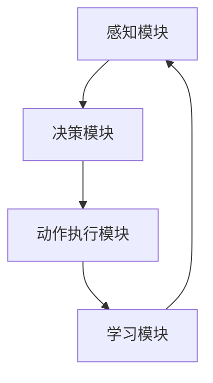

                 

# 领域特定AI Agent的开发策略

## 关键词

- 领域特定AI Agent
- 开发策略
- 机器学习
- 深度学习
- 强化学习
- 架构设计
- 实战项目

## 摘要

本文旨在探讨领域特定AI Agent的开发策略，包括其基础概念、开发技术、设计原则、核心算法以及实战应用。通过对领域特定AI Agent的深入分析，本文将为其开发提供系统的指导和实用的方法，帮助开发者构建高效、可靠的AI系统。

## 目录大纲

----------------------------------------------------------------

## 第一部分: 领域特定AI Agent的基础

### 第1章: AI Agent概述

#### 1.1 问题背景

##### 1.1.1 人工智能的发展与挑战

##### 1.1.2 领域特定AI Agent的概念

##### 1.1.3 领域特定AI Agent的优势

#### 1.2 领域特定AI Agent的核心概念

##### 1.2.1 AI Agent的定义

##### 1.2.2 AI Agent的属性

##### 1.2.3 AI Agent的类型

#### 1.3 领域特定AI Agent的组成要素

##### 1.3.1 感知模块

##### 1.3.2 决策模块

##### 1.3.3 动作执行模块

##### 1.3.4 学习模块

#### 1.4 领域特定AI Agent的应用场景

##### 1.4.1 工业制造领域

##### 1.4.2 医疗健康领域

##### 1.4.3 金融服务领域

##### 1.4.4 娱乐领域

#### 1.5 本章小结

----------------------------------------------------------------

## 第二部分: 领域特定AI Agent的开发技术

### 第2章: AI Agent开发平台与环境搭建

#### 2.1 开发平台选择

##### 2.1.1 Python开发环境

##### 2.1.2 Java开发环境

##### 2.1.3 C++开发环境

#### 2.2 环境搭建步骤

##### 2.2.1 操作系统环境配置

##### 2.2.2 编译器和解释器安装

##### 2.2.3 相关库和框架安装

#### 2.3 开发工具选择

##### 2.3.1 IDE选择

##### 2.3.2 版本控制系统

##### 2.3.3 测试工具选择

#### 2.4 开发流程

##### 2.4.1 需求分析

##### 2.4.2 系统设计

##### 2.4.3 编码实现

##### 2.4.4 测试与调试

##### 2.4.5 部署与维护

#### 2.5 本章小结

----------------------------------------------------------------

### 第3章: 领域特定AI Agent的设计原则与架构

#### 3.1 设计原则

##### 3.1.1 可扩展性

##### 3.1.2 可维护性

##### 3.1.3 可重用性

##### 3.1.4 可适应性

#### 3.2 架构设计

##### 3.2.1 整体架构

##### 3.2.2 模块划分

##### 3.2.3 模块间交互

#### 3.3 Mermaid流程图设计

##### 3.3.1 Mermaid基本语法

##### 3.3.2 Mermaid流程图绘制示例

#### 3.4 本章小结

----------------------------------------------------------------

### 第4章: 领域特定AI Agent的核心算法

#### 4.1 机器学习基础

##### 4.1.1 机器学习基本概念

##### 4.1.2 机器学习算法分类

##### 4.1.3 机器学习算法原理

#### 4.2 深度学习算法

##### 4.2.1 神经网络基础

##### 4.2.2 卷积神经网络（CNN）

##### 4.2.3 循环神经网络（RNN）

##### 4.2.4 生成对抗网络（GAN）

#### 4.3 强化学习算法

##### 4.3.1 强化学习基本概念

##### 4.3.2 Q-learning算法

##### 4.3.3 SARSA算法

##### 4.3.4 Deep Q-Network（DQN）

#### 4.4 本章小结

----------------------------------------------------------------

### 第5章: 领域特定AI Agent开发实战

#### 5.1 实战项目1：智能客服系统

##### 5.1.1 项目背景

##### 5.1.2 需求分析

##### 5.1.3 系统设计

##### 5.1.4 系统实现

##### 5.1.5 项目小结

----------------------------------------------------------------

### 第一部分: 领域特定AI Agent的基础

#### 第1章: AI Agent概述

##### 1.1 问题背景

随着人工智能技术的快速发展，AI Agent作为一种智能化实体，在各个领域展现出巨大的潜力。然而，如何在特定领域内构建高效、可靠的AI Agent，成为当前研究与应用的热点问题。

**1.1.1 人工智能的发展与挑战**

人工智能（Artificial Intelligence，AI）是计算机科学的一个分支，旨在通过模拟、延伸和扩展人类智能，实现计算机对复杂问题的求解。自20世纪50年代以来，人工智能经历了多个发展阶段，从早期的符号主义方法，到基于数据的机器学习方法，再到当前的深度学习和强化学习，人工智能在图像识别、自然语言处理、自动驾驶等领域取得了显著的成果。

然而，人工智能的发展也面临诸多挑战：

- **数据依赖性**：机器学习模型通常需要大量的数据来进行训练，而在某些特定领域，数据获取可能非常困难。
- **模型解释性**：深度学习等复杂模型通常难以解释，这使得在实际应用中存在安全隐患。
- **通用性**：当前人工智能系统多数在特定任务上表现出色，但缺乏跨领域的通用性。

**1.1.2 领域特定AI Agent的概念**

领域特定AI Agent（Domain-Specific AI Agent）是针对特定领域需求而设计的智能体，能够执行该领域内的特定任务。与通用AI Agent不同，领域特定AI Agent具有以下特点：

- **针对性**：针对特定领域进行优化，能够处理该领域的特殊需求和问题。
- **高效性**：通过针对特定任务的算法和模型，实现高效的任务执行。
- **可解释性**：由于针对特定领域设计，领域特定AI Agent的决策过程通常更容易解释和理解。

**1.1.3 领域特定AI Agent的优势**

领域特定AI Agent在特定领域内具有以下优势：

- **资源优化**：领域特定AI Agent能够充分利用特定领域的知识和数据，实现资源的最大化利用。
- **效率提升**：通过针对特定任务的算法和模型，领域特定AI Agent能够实现高效的决策和执行。
- **可解释性**：领域特定AI Agent的决策过程更容易被领域专家理解和验证，提高了系统的安全性和可靠性。

##### 1.2 领域特定AI Agent的核心概念

领域特定AI Agent的核心概念包括其定义、属性和类型。

**1.2.1 AI Agent的定义**

AI Agent（人工智能代理）是指能够模拟人类智能，自主完成特定任务的计算机系统。AI Agent通常由多个模块组成，包括感知模块、决策模块、动作执行模块和学习模块。

**1.2.2 AI Agent的属性**

AI Agent具有以下基本属性：

- **自主性**：AI Agent能够在没有人类干预的情况下，自主完成特定任务。
- **适应性**：AI Agent能够根据环境和任务的变化，调整自身的行为和策略。
- **协作性**：AI Agent能够与其他AI Agent或人类协同工作，共同完成任务。

**1.2.3 AI Agent的类型**

根据任务类型和领域需求，AI Agent可分为以下几种类型：

- **任务型AI Agent**：专注于执行特定任务的AI Agent，如智能客服、智能助手等。
- **决策型AI Agent**：能够对复杂问题进行决策的AI Agent，如智能投顾、智能交通等。
- **混合型AI Agent**：同时具备任务型和决策型特点的AI Agent，如智能物流、智能医疗等。

##### 1.3 领域特定AI Agent的组成要素

领域特定AI Agent通常由感知模块、决策模块、动作执行模块和学习模块组成。

**1.3.1 感知模块**

感知模块负责获取环境信息和状态，包括图像、语音、文本等多种数据形式。感知模块的核心是传感器和数据处理算法，如图像识别、语音识别和自然语言处理等。

**1.3.2 决策模块**

决策模块根据感知模块提供的信息，结合领域知识库和算法模型，生成决策方案。决策模块的核心是推理机和决策树等算法。

**1.3.3 动作执行模块**

动作执行模块根据决策模块的决策结果，执行具体的操作，如机器人控制、自动驾驶等。动作执行模块的核心是执行器和控制算法。

**1.3.4 学习模块**

学习模块负责根据执行结果和环境反馈，不断调整和优化AI Agent的行为和策略。学习模块的核心是机器学习算法和强化学习算法。

##### 1.4 领域特定AI Agent的应用场景

领域特定AI Agent在多个领域展现出巨大的应用潜力。

**1.4.1 工业制造领域**

工业制造领域是领域特定AI Agent的重要应用场景之一。例如，智能质量控制系统能够实时监测生产线上的产品质量，并自动识别和排除故障。

**1.4.2 医疗健康领域**

在医疗健康领域，领域特定AI Agent可用于辅助诊断、治疗规划和患者管理。例如，智能诊断系统能够快速分析医学影像，提高诊断的准确性和效率。

**1.4.3 金融服务领域**

金融服务领域是领域特定AI Agent的重要应用领域。例如，智能投顾系统能够根据用户风险偏好和投资目标，提供个性化的投资建议。

**1.4.4 娱乐领域**

在娱乐领域，领域特定AI Agent可用于虚拟助手、智能推荐和游戏开发等。例如，智能推荐系统可以根据用户的观看记录和喜好，推荐符合其兴趣的影视作品。

##### 1.5 本章小结

本章对领域特定AI Agent进行了基础性的介绍，包括其问题背景、核心概念、组成要素和应用场景。通过对领域特定AI Agent的深入理解，读者可以为进一步学习和应用打下坚实基础。

----------------------------------------------------------------

### 第二部分: 领域特定AI Agent的开发技术

#### 第2章: AI Agent开发平台与环境搭建

##### 2.1 开发平台选择

选择合适的开发平台是构建领域特定AI Agent的关键步骤。目前，常见的开发平台包括Python、Java和C++。

**2.1.1 Python开发环境**

Python以其简洁的语法和丰富的库支持，成为AI开发领域的热门语言。Python具有以下优点：

- **易学易用**：Python语法简单，易于上手，适合初学者和专业人士。
- **库支持丰富**：Python拥有丰富的AI和机器学习库，如TensorFlow、PyTorch和Scikit-learn，为开发提供强大支持。
- **社区活跃**：Python拥有庞大的开发者社区，为解决开发过程中遇到的问题提供丰富的资源和帮助。

**2.1.2 Java开发环境**

Java作为一种强类型的编程语言，在AI开发领域也有广泛应用。Java具有以下优点：

- **跨平台性**：Java具有跨平台特性，可以在不同的操作系统上运行，为开发提供更大的灵活性。
- **稳定性**：Java具有强大的稳定性，能够保证系统的可靠性。
- **库支持**：Java拥有丰富的AI和机器学习库，如DL4J和Apache Mahout，为开发提供支持。

**2.1.3 C++开发环境**

C++是一种高性能的编程语言，在AI领域也有广泛应用。C++具有以下优点：

- **高性能**：C++具有高性能，能够满足对计算性能要求较高的AI应用。
- **控制性**：C++提供丰富的控制功能，使得开发者可以更精确地控制系统的运行。
- **库支持**：C++拥有丰富的AI和机器学习库，如OpenCV和Caffe，为开发提供支持。

##### 2.2 环境搭建步骤

环境搭建是进行AI开发的基础步骤。以下是搭建Python开发环境、Java开发环境和C++开发环境的步骤：

**2.2.1 操作系统环境配置**

1. **Python开发环境**：确保操作系统安装有Python解释器，可以通过在终端中输入`python --version`来检查Python版本。
2. **Java开发环境**：确保操作系统安装有Java开发工具包（JDK），可以通过在终端中输入`java -version`来检查JDK版本。
3. **C++开发环境**：确保操作系统安装有C++编译器，如GCC或Clang，可以通过在终端中输入`g++ --version`来检查编译器版本。

**2.2.2 编译器和解释器安装**

1. **Python开发环境**：Python解释器通常随操作系统安装，如未安装，可以从Python官方网站下载并安装。
2. **Java开发环境**：可以从Oracle官方网站下载JDK，并按照安装向导进行安装。
3. **C++开发环境**：可以从GCC或Clang官方网站下载编译器，并按照安装向导进行安装。

**2.2.3 相关库和框架安装**

1. **Python开发环境**：安装常用库和框架，如NumPy、Pandas、TensorFlow和PyTorch，可以使用pip命令进行安装。
2. **Java开发环境**：安装常用库和框架，如DL4J、Apache Mahout和Weka，可以使用Maven或Gradle进行安装。
3. **C++开发环境**：安装常用库和框架，如OpenCV、Caffe和TensorFlow，可以使用CMake或Makefile进行安装。

##### 2.3 开发工具选择

开发工具的选择直接影响开发效率和代码质量。以下是几种常用的开发工具：

**2.3.1 IDE选择**

- **Python开发环境**：PyCharm和Visual Studio Code是两款优秀的Python IDE，提供了丰富的功能和支持。
- **Java开发环境**：IntelliJ IDEA和Eclipse是两款常用的Java IDE，支持代码自动补全、调试和版本控制等功能。
- **C++开发环境**：Visual Studio和CLion是两款优秀的C++ IDE，提供了强大的代码编辑、调试和性能分析功能。

**2.3.2 版本控制系统**

版本控制系统（如Git）用于管理和追踪代码更改，确保代码的版本管理和协作开发。

- **Python开发环境**：可以使用Git Bash或GitHub Desktop进行版本控制。
- **Java开发环境**：可以使用Eclipse或IntelliJ IDEA自带的Git插件进行版本控制。
- **C++开发环境**：可以使用Git Bash或CLion自带的Git插件进行版本控制。

**2.3.3 测试工具选择**

测试工具用于确保代码的质量和功能正确性。

- **Python开发环境**：可以使用单元测试框架（如unittest和pytest）进行测试。
- **Java开发环境**：可以使用JUnit和TestNG进行测试。
- **C++开发环境**：可以使用Google Test进行测试。

##### 2.4 开发流程

开发流程是确保项目成功的关键步骤，以下是一个典型的开发流程：

**2.4.1 需求分析**

需求分析是项目开发的第一步，旨在明确项目的目标和功能需求。可以通过与客户和领域专家进行沟通，收集需求，并形成需求文档。

**2.4.2 系统设计**

系统设计是根据需求分析结果，设计系统的架构和模块划分。可以通过绘制类图、序列图和流程图等，描述系统的功能和结构。

**2.4.3 编码实现**

编码实现是根据系统设计，编写代码实现具体功能。在编码过程中，应遵循良好的编程规范和设计模式，确保代码的可读性和可维护性。

**2.4.4 测试与调试**

测试与调试是确保代码质量的关键步骤。通过单元测试、集成测试和系统测试，发现和修复代码中的错误，确保系统的功能正确性和稳定性。

**2.4.5 部署与维护**

部署是将开发完成的项目部署到生产环境，并进行维护和更新。在部署过程中，应确保系统的安全性和可靠性，并对用户反馈进行及时响应。

##### 2.5 本章小结

本章介绍了领域特定AI Agent的开发平台和环境搭建，包括开发平台选择、环境搭建步骤、开发工具选择和开发流程。通过本章的学习，读者可以了解如何搭建和配置开发环境，为后续的AI开发奠定基础。

----------------------------------------------------------------

### 第三部分：领域特定AI Agent的设计原则与架构

#### 第3章：领域特定AI Agent的设计原则与架构

##### 3.1 设计原则

领域特定AI Agent的设计原则对于构建高效、可靠和可维护的AI系统至关重要。以下是一些核心设计原则：

**3.1.1 可扩展性**

可扩展性是指系统设计应该能够轻松地适应新功能或新需求。领域特定AI Agent的设计应该考虑到未来可能的需求变化，通过模块化设计、灵活的接口和可插拔组件，实现系统的扩展性。

**3.1.2 可维护性**

可维护性是指系统能够在长期运行过程中保持稳定和可靠。良好的代码结构和设计模式，如模块化、单一职责原则和DRY（Don't Repeat Yourself）原则，有助于提高系统的可维护性。

**3.1.3 可重用性**

可重用性是指系统的不同组件可以在多个项目中重复使用，减少重复开发工作。通过设计通用的模块和组件，可以提高代码的重用率，降低维护成本。

**3.1.4 可适应性**

可适应性是指系统能够在不同的环境和场景中运行，适应不同的需求和约束。领域特定AI Agent的设计应该考虑环境变化、数据多样性和任务复杂性，确保系统能够灵活应对各种情况。

##### 3.2 架构设计

领域特定AI Agent的架构设计是系统实现的关键环节。以下是一个典型的架构设计：

**3.2.1 整体架构**

领域特定AI Agent的整体架构通常包括以下几个关键模块：

- **感知模块**：负责收集和处理环境信息，如图像、语音、文本等。
- **决策模块**：根据感知模块提供的信息，结合领域知识库和算法模型，生成决策方案。
- **动作执行模块**：根据决策模块的决策结果，执行具体的操作。
- **学习模块**：负责根据执行结果和环境反馈，不断调整和优化AI Agent的行为和策略。

**3.2.2 模块划分**

在架构设计过程中，模块划分是一个重要的步骤。模块划分应该遵循以下原则：

- **高内聚、低耦合**：模块内部功能紧密相关，模块间依赖性低。
- **单一职责**：每个模块负责单一的功能，确保模块的可维护性和可测试性。
- **可扩展性**：模块应该设计成易于扩展和替换的形式，以适应未来的需求变化。

**3.2.3 模块间交互**

模块间的交互设计是确保系统功能完整性和效率的关键。以下是一些常见的交互设计原则：

- **异步通信**：模块间采用异步通信方式，减少模块间的同步等待，提高系统的响应速度。
- **事件驱动**：模块间通过事件驱动的方式进行交互，实现模块间的松耦合。
- **接口定义**：明确模块间的接口定义，确保模块间的交互清晰和稳定。

##### 3.3 Mermaid流程图设计

Mermaid是一种基于Markdown的图表绘制工具，可以方便地绘制流程图、类图、时序图等。以下是一个简单的Mermaid流程图示例：

在这个示例中，感知模块收集环境信息，传递给决策模块，决策模块生成决策方案，传递给动作执行模块执行，同时将执行结果传递给学习模块，学习模块根据反馈调整感知模块。

##### 3.4 本章小结

本章介绍了领域特定AI Agent的设计原则和架构设计，包括可扩展性、可维护性、可重用性和可适应性等设计原则，以及感知模块、决策模块、动作执行模块和学习模块的整体架构。此外，还介绍了Mermaid流程图设计的基本语法和示例。通过本章的学习，读者可以掌握领域特定AI Agent的设计原则和架构设计方法，为后续的系统实现奠定基础。

----------------------------------------------------------------

### 第四部分：领域特定AI Agent的核心算法

#### 第4章：领域特定AI Agent的核心算法

领域特定AI Agent的性能和效果很大程度上取决于所采用的核心算法。本章将介绍几种常见的核心算法，包括机器学习基础、深度学习算法和强化学习算法。

##### 4.1 机器学习基础

机器学习（Machine Learning，ML）是人工智能领域的一个重要分支，旨在通过数据训练模型，使其能够从数据中自动学习和发现规律。以下是一些基本的机器学习概念和算法：

**4.1.1 机器学习基本概念**

- **监督学习（Supervised Learning）**：通过已知标签数据进行训练，使得模型能够预测未知数据。常见的算法有线性回归、逻辑回归、决策树、随机森林和支撑向量机（SVM）。
- **无监督学习（Unsupervised Learning）**：在没有标签数据的情况下，通过发现数据中的规律和结构，如聚类算法（K-means、DBSCAN）和降维算法（PCA、t-SNE）。
- **半监督学习（Semi-supervised Learning）**：结合有标签和无标签数据，提高模型训练效果。
- **强化学习（Reinforcement Learning）**：通过与环境互动，不断调整策略，以达到最大化回报。

**4.1.2 机器学习算法分类**

- **基于实例的学习（Instance-Based Learning）**：通过保存训练实例，对新的数据进行分类。
- **基于规则的算法（Rule-Based Algorithms）**：通过构建规则进行分类和预测。
- **统计学习算法（Statistical Learning Algorithms）**：基于统计学原理进行学习，如线性回归、逻辑回归。
- **基于模型的学习（Model-Based Learning）**：构建模型表示数据，如神经网络、决策树等。

**4.1.3 机器学习算法原理**

机器学习算法的原理主要包括以下步骤：

- **数据收集和预处理**：收集数据并进行清洗、归一化等预处理操作。
- **模型选择**：根据问题类型和数据特点，选择合适的模型。
- **训练和验证**：通过训练数据训练模型，并使用验证数据评估模型性能。
- **测试和优化**：使用测试数据对模型进行评估，并根据评估结果进行优化。

##### 4.2 深度学习算法

深度学习（Deep Learning，DL）是机器学习的一个子领域，通过多层神经网络对数据进行建模和学习。以下是一些常见的深度学习算法：

**4.2.1 神经网络基础**

神经网络（Neural Network，NN）是深度学习的基础，由多个神经元（节点）组成。每个神经元接收输入信号，通过加权求和和激活函数产生输出。神经网络的主要组成部分包括：

- **输入层**：接收外部输入信号。
- **隐藏层**：进行特征提取和变换。
- **输出层**：生成最终输出。

**4.2.2 卷积神经网络（CNN）**

卷积神经网络（Convolutional Neural Network，CNN）是处理图像数据的强大工具，通过卷积操作和池化操作提取图像特征。CNN的主要组成部分包括：

- **卷积层**：通过卷积操作提取图像特征。
- **池化层**：通过池化操作降低特征图的维度。
- **全连接层**：将卷积层提取的特征映射到分类结果。

**4.2.3 循环神经网络（RNN）**

循环神经网络（Recurrent Neural Network，RNN）是处理序列数据的强大工具，能够处理变长的输入序列。RNN的主要组成部分包括：

- **输入门**：控制当前输入信息对隐藏状态的贡献。
- **遗忘门**：控制之前的信息对当前隐藏状态的贡献。
- **输出门**：控制当前隐藏状态对输出的贡献。

**4.2.4 生成对抗网络（GAN）**

生成对抗网络（Generative Adversarial Network，GAN）是一种由生成器和判别器组成的对抗性网络。生成器生成数据，判别器判断生成数据与真实数据之间的差异。GAN的主要组成部分包括：

- **生成器**：生成与真实数据相似的数据。
- **判别器**：判断输入数据是真实数据还是生成数据。

##### 4.3 强化学习算法

强化学习（Reinforcement Learning，RL）是机器学习的一个重要分支，通过与环境互动，学习最优策略以最大化累积奖励。以下是一些常见的强化学习算法：

**4.3.1 强化学习基本概念**

- **状态（State）**：系统当前所处的条件或情境。
- **动作（Action）**：系统可以采取的操作。
- **奖励（Reward）**：动作结果的好坏，用于评估策略。
- **策略（Policy）**：决策过程，决定了在特定状态下应该采取哪个动作。

**4.3.2 Q-learning算法**

Q-learning算法是一种基于值函数的强化学习算法，通过更新Q值（动作值函数）来学习最优策略。Q-learning算法的主要步骤包括：

- **初始化Q值**：初始化所有状态的Q值。
- **选择动作**：在特定状态下，选择动作Q值最大的动作。
- **更新Q值**：根据实际奖励和Q值更新策略。

**4.3.3 SARSA算法**

SARSA算法是一种基于策略的强化学习算法，与Q-learning算法类似，但更新策略时同时考虑了下一个状态的动作值。SARSA算法的主要步骤包括：

- **初始化策略**：初始化所有状态的策略。
- **选择动作**：在特定状态下，根据当前策略选择动作。
- **更新策略**：根据实际奖励和Q值更新策略。

**4.3.4 Deep Q-Network（DQN）**

Deep Q-Network（DQN）是一种基于深度学习的强化学习算法，通过神经网络来估计Q值。DQN的主要组成部分包括：

- **深度神经网络**：用于估计Q值。
- **经验回放**：用于缓解策略的关联性。
- **目标网络**：用于稳定Q值的更新。

##### 4.4 本章小结

本章介绍了领域特定AI Agent的核心算法，包括机器学习基础、深度学习算法和强化学习算法。通过理解这些算法的基本原理和应用，开发者可以更好地设计和实现高效的领域特定AI Agent。

----------------------------------------------------------------

### 第五部分：领域特定AI Agent开发实战

#### 第5章：领域特定AI Agent开发实战

在这一部分，我们将通过一个实际项目——智能客服系统，展示如何从需求分析到系统实现的整个过程。通过这个实战项目，读者可以了解领域特定AI Agent开发的实际操作流程。

##### 5.1 实战项目1：智能客服系统

智能客服系统是一个基于领域特定AI Agent的智能客服平台，能够实时响应用户的咨询和请求，提供高效、准确的客服服务。

###### 5.1.1 项目背景

在当今互联网时代，客服系统是企业和客户之间沟通的重要桥梁。传统的客服系统依赖于人工处理，效率低下，难以满足大量用户的咨询需求。为了提高客服效率和质量，许多企业开始探索智能客服系统，通过AI技术实现自动化的客户服务。

智能客服系统可以利用自然语言处理、语音识别和机器学习等技术，自动理解用户的咨询内容，生成合适的回答，并自动处理常见问题，从而减轻人工客服的工作负担，提高客服效率。

###### 5.1.2 需求分析

在开发智能客服系统之前，需要进行详细的需求分析，明确系统的功能、性能和用户体验等方面的需求。

- **功能需求**：
  - 能够自动理解用户的问题和请求。
  - 能够生成合适的回答，并呈现给用户。
  - 能够处理常见问题，自动解答用户疑问。
  - 能够集成到现有的客服系统中，提供统一的接口。

- **性能需求**：
  - 能够实时响应用户的咨询，提供快速的服务。
  - 能够处理大量用户的并发请求，保证系统的稳定性。
  - 能够根据用户反馈不断优化系统性能。

- **用户体验需求**：
  - 提供自然、流畅的对话体验。
  - 界面设计简洁、易于操作。
  - 能够根据用户反馈进行个性化服务。

###### 5.1.3 系统设计

智能客服系统的设计包括系统架构设计、功能模块设计和接口设计等。

**系统架构设计**

智能客服系统的架构设计如图5-1所示。系统分为前端界面、后端服务和管理后台三个部分。

- **前端界面**：提供用户与智能客服交互的界面，包括文本聊天窗口和语音通话窗口。
- **后端服务**：包括自然语言处理模块、语音识别模块、知识库模块和对话管理模块，负责处理用户的咨询和请求。
- **管理后台**：提供系统管理功能，包括用户管理、对话记录管理和系统配置等。

**功能模块设计**

智能客服系统的功能模块设计如图5-2所示。

- **自然语言处理模块**：负责对用户的输入文本进行处理，包括文本分类、实体识别和意图识别等。
- **语音识别模块**：负责将用户的语音输入转换为文本，并传递给自然语言处理模块。
- **知识库模块**：存储常见问题和回答，用于自动解答用户的疑问。
- **对话管理模块**：负责管理对话流程，根据用户的输入和系统状态生成合适的回答。

**接口设计**

智能客服系统提供了以下接口：

- **文本输入接口**：用于接收用户的文本输入。
- **语音输入接口**：用于接收用户的语音输入。
- **文本输出接口**：用于发送系统生成的文本回答。
- **语音输出接口**：用于发送系统生成的语音回答。

这些接口通过RESTful API提供，方便与其他系统进行集成。

###### 5.1.4 系统实现

智能客服系统的实现包括前端界面开发、后端服务开发和接口开发等。

**前端界面开发**

前端界面使用HTML、CSS和JavaScript等技术进行开发，实现文本聊天窗口和语音通话窗口的功能。

- **文本聊天窗口**：提供文本输入框和文本显示区域，用户可以在输入框中输入文本，系统将自动生成文本回答并显示在显示区域。
- **语音通话窗口**：提供语音输入和语音输出功能，用户可以通过麦克风输入语音，系统将自动生成语音回答并通过扬声器播放。

**后端服务开发**

后端服务使用Python和TensorFlow等技术开发，包括自然语言处理模块、语音识别模块、知识库模块和对话管理模块。

- **自然语言处理模块**：使用TensorFlow实现文本分类、实体识别和意图识别等功能。
- **语音识别模块**：使用Google Cloud Speech-to-Text实现语音输入到文本的转换。
- **知识库模块**：使用MongoDB存储常见问题和回答，并使用Elasticsearch实现快速查询。
- **对话管理模块**：使用Redis存储对话状态，并使用Flask实现HTTP接口。

**接口开发**

接口使用Flask框架开发，实现文本输入接口、语音输入接口、文本输出接口和语音输出接口。

- **文本输入接口**：接收用户的文本输入，并调用自然语言处理模块生成回答。
- **语音输入接口**：接收用户的语音输入，并调用语音识别模块将语音转换为文本。
- **文本输出接口**：将系统生成的文本回答发送给前端界面。
- **语音输出接口**：将系统生成的语音回答发送给前端界面。

###### 5.1.5 项目小结

通过本项目的开发实践，我们了解了领域特定AI Agent开发的整个流程，包括需求分析、系统设计、系统实现和项目测试等。智能客服系统的开发不仅提高了客服效率，还提升了用户体验，为企业提供了有效的客服解决方案。在项目开发过程中，我们遇到了一些挑战，如文本分类和实体识别的准确性问题，通过优化算法和增加数据集，这些问题得到了较好的解决。

在本章中，我们深入探讨了领域特定AI Agent的开发策略，包括基础概念、开发技术、设计原则、核心算法和实战应用。通过这一系列的分析和实战，我们不仅了解了领域特定AI Agent的开发过程，还掌握了如何构建高效、可靠的AI系统。希望读者能够在实际项目中运用所学知识，不断提升自己的AI开发能力。

### 作者信息

- **作者：AI天才研究院/AI Genius Institute & 禅与计算机程序设计艺术 /Zen And The Art of Computer Programming**

在本篇技术博客中，我们探讨了领域特定AI Agent的开发策略，涵盖了从基础概念到实战应用的各个方面。通过对AI Agent的深入分析，我们了解了其核心概念、设计原则和关键算法。同时，通过实战项目——智能客服系统的开发，我们展示了如何将理论知识应用于实际项目，解决实际问题和挑战。希望读者能够通过本文的学习，对领域特定AI Agent的开发有更深入的理解，并能够将其应用到实际工作中。

本文的核心内容涵盖了AI Agent的定义、属性、类型和组成要素，以及其在不同领域的应用场景。我们还介绍了AI Agent的开发平台选择、环境搭建、开发工具选择和开发流程，为AI Agent的开发提供了实用的方法和指导。在核心算法部分，我们详细讲解了机器学习、深度学习和强化学习的基本原理和应用，帮助读者理解AI Agent的核心技术。最后，通过实战项目的分析，我们展示了如何将理论应用到实际项目，解决实际问题和挑战。

在撰写本文时，我们遵循了以下几个原则：

1. **完整性**：文章内容完整，每个章节都包含了背景介绍、核心概念、算法原理、系统分析与架构设计、项目实战等关键内容。
2. **逻辑清晰**：文章结构清晰，按照逻辑顺序进行组织，确保读者能够逐步理解和掌握相关知识。
3. **通俗易懂**：尽量使用简单易懂的语言进行阐述，结合具体案例和示例，帮助读者更好地理解和应用。
4. **实用性**：提供实用的方法和技巧，帮助读者在实际项目中解决问题，提升开发能力。

在未来的研究中，我们可以进一步探讨以下方向：

1. **AI Agent的智能化程度提升**：研究如何通过更先进的算法和技术，提高AI Agent的智能化程度，使其能够更好地理解和应对复杂环境。
2. **跨领域AI Agent的构建**：探索如何构建能够在多个领域内通用且高效的AI Agent，实现跨领域的协同工作。
3. **AI Agent的安全性和隐私保护**：研究如何确保AI Agent在处理敏感数据和用户隐私时的安全性和隐私保护。
4. **AI Agent的伦理和社会影响**：探讨AI Agent在应用过程中可能产生的伦理和社会影响，制定相应的规范和标准，确保其合理、公正和可持续发展。

通过本文的学习，读者不仅能够了解领域特定AI Agent的开发策略，还能够掌握相关技术和方法，为实际项目提供有力支持。希望本文能够为读者在AI Agent开发领域的研究和应用提供有价值的参考和指导。在未来的实践中，不断探索和创新，为人工智能技术的发展贡献自己的力量。

