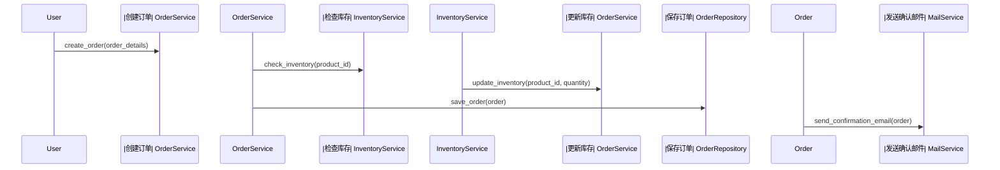
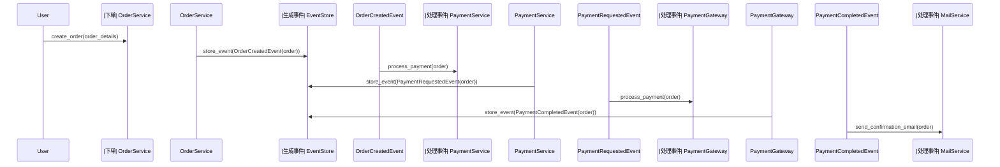

                 

### 摘要
领域驱动设计（Domain-Driven Design，简称DDD）和微服务架构是目前软件工程中备受关注的两个重要概念。DDD注重领域模型和领域服务的构建，以实现对业务领域的深入理解和高效实现；而微服务架构则强调系统的可拆分性和分布式特性，以应对复杂业务需求和快速迭代开发。本文旨在探讨领域驱动设计在微服务中的应用，通过逐步分析DDD和微服务架构的关系、核心概念、实际应用以及案例研究，帮助读者深入理解如何将DDD应用于微服务架构中，以构建灵活、可扩展且易于维护的系统。

### 关键词
领域驱动设计，微服务架构，实体，领域服务，领域模型，领域事件，微服务划分，设计模式，持续集成，测试策略，案例分析，最佳实践。

---

# 领域驱动设计在微服务中的应用

## 引言

### 1.1 问题背景

随着互联网和移动互联网的快速发展，企业面临的市场竞争日益激烈。传统的单体应用架构已经无法满足快速迭代和灵活扩展的需求。为了应对这种挑战，微服务架构应运而生。微服务架构将大型单体应用拆分为一系列小型、独立、可复用的服务，每个服务负责完成特定的业务功能。然而，在微服务架构中，如何确保系统的高内聚、低耦合以及业务的连续性，成为开发者面临的一大难题。

领域驱动设计（DDD）作为一种面向复杂业务系统的设计方法，提供了强大的理论和实践支持。DDD通过构建领域模型和领域服务，将业务领域的复杂逻辑封装在内部，从而实现系统的可理解性和可维护性。将DDD应用于微服务架构中，有助于提升系统的质量和开发效率。

### 1.2 领域驱动设计的概念

领域驱动设计是一种软件开发方法，由Eric Evans在其同名著作《领域驱动设计：软件核心复杂性应对策略》中提出。DDD的核心思想是将系统的复杂性从业务领域分离出来，通过定义清晰的领域模型和领域服务，使系统能够更好地适应业务变化。

DDD主要包括以下核心概念：

1. **实体与值对象**：实体是具有唯一标识的独立对象，如用户、订单等；值对象则不具备唯一标识，如日期、金额等。
2. **领域服务**：领域服务负责处理领域逻辑，如订单创建、支付处理等。
3. **领域模型**：领域模型是DDD的核心，它将业务领域的概念和规则抽象成一组相互关联的类和对象。
4. **领域事件**：领域事件是领域状态变化的结果，如订单状态变更、支付成功等。
5. **领域边界**：领域边界定义了系统的核心业务逻辑与外部系统或用户的交互点。

### 1.3 微服务架构概述

微服务架构是一种基于独立服务的分布式架构，每个服务都是一个小型、独立、自治的应用程序。微服务架构具有以下几个核心特点：

1. **服务独立性**：每个服务都有明确的功能边界，可以独立开发、部署和运行。
2. **分布式系统**：服务之间通过远程调用或消息队列进行通信，系统具有高度的分布式特性。
3. **可扩展性**：服务可以水平扩展，以应对不同的负载需求。
4. **自治性**：服务拥有独立的数据库，可以独立地进行数据操作和管理。

### 1.4 领域驱动设计与微服务的关系

领域驱动设计在微服务架构中的应用主要体现在以下几个方面：

1. **服务拆分**：通过DDD的领域模型，可以将大型单体应用拆分为多个具有明确业务功能的微服务。
2. **领域服务定义**：DDD的领域服务可以映射到微服务中，确保每个服务都专注于完成特定的领域功能。
3. **领域事件驱动**：微服务之间的通信可以通过领域事件实现，从而降低系统间的耦合度。
4. **持续集成与测试**：DDD的测试策略可以与微服务的持续集成流程相结合，确保系统的稳定性和可靠性。

### 1.5 目标读者

本文的目标读者包括：

- 软件工程师和架构师，希望了解如何将DDD应用于微服务架构中。
- 系统分析师和业务分析师，希望更好地理解业务领域的复杂逻辑。
- 新手开发者，希望了解DDD和微服务架构的基本概念和实践方法。

通过本文的学习，读者可以掌握领域驱动设计在微服务中的应用方法，提高系统开发的质量和效率。

---

## 领域驱动设计核心概念

### 2.1 实体与值对象

在领域驱动设计中，实体和值对象是两个基本的概念。实体是具有唯一标识的独立对象，如用户、订单等；而值对象则不具备唯一标识，如日期、金额等。

#### 实体

实体具有以下特征：

1. **唯一标识**：实体具有唯一的标识符，通常使用ID或UUID进行标识。
2. **生命周期**：实体在系统中具有明确的创建、更新和删除过程。
3. **业务规则**：实体在业务过程中遵循特定的业务规则，如订单的状态变更规则。
4. **领域行为**：实体可以执行特定的领域行为，如用户的登录和登出操作。

实体示例：

```mermaid
classDiagram
Class1 --> Class2: hasA
Class1 {
  id: Integer
  name: String
}

Class2 {
  id: Integer
  value: Integer
}
```

#### 值对象

值对象具有以下特征：

1. **不具备唯一标识**：值对象不拥有唯一标识，通常由组成其的属性来唯一确定。
2. **不可变**：值对象是不可变的，其属性一旦确定就不能再修改。
3. **领域行为**：值对象通常不执行领域行为，仅作为实体属性的组成部分。

值对象示例：

```mermaid
classDiagram
Class1 --> Class2: contains
Class1 {
  id: Integer
  name: String
}

Class2 {
  value: Integer
}
```

### 2.2 领域服务

领域服务是DDD中负责处理领域逻辑的核心组件。领域服务通常以方法的形式存在，封装了系统的核心业务逻辑。

#### 领域服务的特征

1. **业务逻辑**：领域服务负责处理业务逻辑，如订单创建、支付处理等。
2. **独立性**：领域服务具有独立性，可以独立部署和运行。
3. **可复用性**：领域服务可以跨模块和项目复用，提高开发效率。

#### 领域服务示例

```python
class OrderService:
  def create_order(self, order_details):
    # 订单创建逻辑
    pass

  def process_payment(self, payment_info):
    # 支付处理逻辑
    pass
```

### 2.3 领域模型

领域模型是DDD中的核心概念，它将业务领域的概念和规则抽象成一组相互关联的类和对象。领域模型有助于开发者更好地理解业务领域，提高系统的可维护性和可扩展性。

#### 领域模型的构成

领域模型主要由以下部分组成：

1. **实体**：实体表示业务领域中的核心对象，如用户、订单等。
2. **值对象**：值对象表示实体的属性，如日期、金额等。
3. **领域服务**：领域服务负责处理业务逻辑，如订单创建、支付处理等。
4. **聚合**：聚合是一组相互关联的对象，它们共同表示一个完整的业务单元。
5. **领域边界**：领域边界定义了系统的核心业务逻辑与外部系统或用户的交互点。

#### 领域模型示例

```mermaid
classDiagram
Class1 --> Class2: aggregate
Class1 {
  id: Integer
  name: String
}

Class2 {
  value: Integer
}
```

### 2.4 领域事件

领域事件是领域状态变化的结果，它反映了业务领域的动态变化。领域事件通常用于驱动领域服务和领域模型的更新。

#### 领域事件的类型

1. **创建事件**：表示某个实体的创建。
2. **更新事件**：表示某个实体的状态变更。
3. **删除事件**：表示某个实体的删除。
4. **业务事件**：表示业务领域的其他重要事件，如支付成功、订单发货等。

#### 领域事件示例

```python
class OrderCreatedEvent:
  def __init__(self, order_id, order_details):
    self.order_id = order_id
    self.order_details = order_details

class OrderUpdatedEvent:
  def __init__(self, order_id, new_status):
    self.order_id = order_id
    self.new_status = new_status

class OrderCancelledEvent:
  def __init__(self, order_id):
    self.order_id = order_id
```

### 2.5 领域边界

领域边界是DDD中用于定义系统的核心业务逻辑与外部系统或用户的交互点。领域边界有助于确保系统的安全性和完整性，同时降低系统间的耦合度。

#### 领域边界的类型

1. **API边界**：定义了系统对外提供的API接口，如RESTful API。
2. **数据边界**：定义了系统内部的数据访问和数据存储规则。
3. **通信边界**：定义了系统与其他系统或服务之间的通信规则，如消息队列。

#### 领域边界示例

```mermaid
classDiagram
Class1 --> Class2: communicates
Class1 {
  id: Integer
  name: String
}

Class2 {
  url: String
}
```

通过理解领域驱动设计中的核心概念，开发者可以更好地构建复杂业务系统，提高系统的质量和可维护性。在接下来的章节中，我们将探讨如何将DDD应用于微服务架构中。

---

## 微服务环境下的领域驱动设计

在微服务架构中，领域驱动设计（DDD）可以提供一种有效的策略，帮助开发者构建具有高内聚、低耦合和可扩展性的系统。本节将讨论微服务架构的特点、领域模型与微服务的关系、领域服务与微服务的映射以及领域事件与事件驱动架构在微服务中的应用。

### 3.1 微服务架构的特点

微服务架构具有以下几个核心特点：

1. **服务独立性**：每个微服务都是独立部署和运行的小型应用，可以独立扩展和升级。
2. **分布式系统**：微服务架构是分布式系统，服务之间通过远程调用或消息队列进行通信。
3. **可扩展性**：服务可以水平扩展，以应对不同的负载需求。
4. **自治性**：每个服务拥有独立的数据库，可以独立进行数据操作和管理。
5. **细粒度**：微服务具有细粒度的功能，每个服务只关注一个特定的业务功能。

### 3.2 领域模型与微服务划分

在微服务架构中，领域模型可以帮助开发者更好地划分微服务。领域模型通过抽象业务领域的概念和规则，形成一组相互关联的类和对象。这些类和对象可以映射为微服务中的独立服务。

#### 划分微服务的步骤

1. **识别领域边界**：首先，需要识别业务领域的核心边界，确定系统的核心业务功能。
2. **构建领域模型**：基于识别出的领域边界，构建领域模型，定义实体、值对象、领域服务和领域事件。
3. **划分微服务**：将领域模型中的相关类和对象划分为独立的微服务，确保每个服务具有明确的业务功能。

#### 微服务划分示例

假设有一个电商平台，业务领域包括用户管理、商品管理、订单管理和支付管理。基于领域模型，可以划分以下微服务：

- **用户服务**：负责用户注册、登录、个人信息管理等功能。
- **商品服务**：负责商品分类、商品信息管理、库存管理等功能。
- **订单服务**：负责订单创建、订单状态管理、订单支付等功能。
- **支付服务**：负责支付渠道管理、支付请求处理、支付结果通知等功能。

### 3.3 领域服务与微服务

在微服务架构中，领域服务可以映射为独立的微服务。领域服务负责处理业务逻辑，而微服务则提供了分布式环境下执行这些逻辑的能力。

#### 领域服务与微服务的映射

1. **服务独立性**：确保每个领域服务映射为一个独立的微服务，服务之间通过接口进行通信。
2. **领域服务职责**：明确每个领域服务的职责，确保服务具有高内聚性。
3. **数据一致性**：在分布式环境下，确保数据的一致性和完整性。

#### 领域服务与微服务示例



### 3.4 领域事件与事件驱动架构

领域事件是DDD中的一个核心概念，它反映了业务领域的动态变化。在微服务架构中，领域事件可以驱动事件驱动架构，降低服务之间的耦合度。

#### 领域事件驱动架构

1. **事件生成**：在业务操作过程中，系统生成相应的领域事件。
2. **事件存储**：领域事件被存储在事件存储中，供其他服务消费。
3. **事件处理**：服务通过订阅事件，对领域事件进行处理，实现业务逻辑。

#### 领域事件与事件驱动架构示例



通过将领域驱动设计应用于微服务架构中，开发者可以构建出具有高内聚、低耦合和可扩展性的系统。在接下来的章节中，我们将探讨领域驱动设计的实践应用，以深入理解如何在实际项目中应用DDD。

---

## 领域驱动设计的实践应用

将领域驱动设计（DDD）应用于实际项目时，需要考虑多个方面的因素，包括设计模式、面临的挑战、持续集成、测试策略等。本节将探讨这些实践应用，并提供一些最佳实践。

### 4.1 设计模式与领域驱动设计

设计模式是解决软件开发过程中常见问题的通用解决方案。将设计模式与DDD相结合，可以帮助开发者更好地实现领域模型和领域服务。

#### 1. 实体模式

实体模式用于表示业务领域中的核心对象。在DDD中，实体模式通常用于实现实体的唯一标识和业务规则。

#### 2. 值对象模式

值对象模式用于表示实体的属性。在DDD中，值对象模式有助于实现不可变的实体属性，提高系统的可维护性。

#### 3. 领域服务模式

领域服务模式用于封装业务逻辑。在DDD中，领域服务模式有助于实现独立、可复用的领域服务，提高系统的可扩展性。

#### 4. 事件溯源模式

事件溯源模式是一种用于实现领域事件的持久化和管理的设计模式。在DDD中，事件溯源模式有助于实现事件驱动架构，降低系统间的耦合度。

### 4.2 领域驱动设计在微服务中的挑战

在微服务架构中应用DDD时，开发者会面临一系列挑战：

1. **服务划分**：如何合理划分微服务，确保每个服务具有明确的业务功能。
2. **数据一致性**：在分布式环境下，如何保证数据的一致性和完整性。
3. **服务间通信**：如何设计服务间的通信机制，确保系统的高效性和可靠性。
4. **测试与部署**：如何确保微服务的测试覆盖率和部署效率。

### 4.3 持续集成与领域驱动设计

持续集成（CI）是一种软件开发实践，旨在通过自动化测试和构建，确保代码的稳定性和可靠性。将CI与DDD相结合，可以进一步提高开发效率。

1. **自动化测试**：使用自动化测试框架，编写单元测试、集成测试和端到端测试，确保代码的质量和可靠性。
2. **代码审查**：通过代码审查，确保代码符合DDD的最佳实践，提高代码的可维护性。
3. **持续交付**：使用CI/CD工具，实现自动化构建、测试和部署，确保系统能够快速响应业务需求。

### 4.4 领域驱动设计的测试策略

在DDD中，测试策略至关重要。以下是一些常用的测试策略：

1. **单元测试**：针对领域模型和领域服务的单个组件进行测试，确保它们的行为符合预期。
2. **集成测试**：针对多个服务之间的交互进行测试，确保服务间的数据传输和状态同步正确。
3. **端到端测试**：模拟用户操作，对整个系统进行测试，确保系统的整体功能正确。

#### 最佳实践

1. **使用领域事件**：通过领域事件驱动架构，降低服务间的耦合度，提高系统的可扩展性和可维护性。
2. **保持领域模型简洁**：避免过度设计，保持领域模型的简洁和清晰。
3. **使用设计模式**：结合常用的设计模式，提高代码的可读性和可维护性。
4. **文档和注释**：编写详细的文档和注释，帮助开发者更好地理解和维护代码。

通过以上实践应用，开发者可以更好地将领域驱动设计应用于实际项目中，构建出具有高内聚、低耦合和可扩展性的微服务系统。在接下来的章节中，我们将通过案例研究，深入探讨领域驱动设计在微服务中的具体应用。

---

## 案例研究

在本节中，我们将通过几个具体的案例，详细探讨领域驱动设计在微服务架构中的应用。这些案例来自不同领域，包括电商平台、金融系统和医疗健康领域，通过分析这些案例，我们可以更好地理解如何将DDD与微服务架构相结合，构建出高效、灵活和可维护的系统。

### 5.1 案例一：电商平台的领域驱动设计

#### 项目介绍

一个大型电商平台需要构建一个灵活、可扩展的微服务架构，以应对日益增长的订单量和用户需求。为了实现这一目标，项目团队决定采用领域驱动设计（DDD）来指导系统的设计、开发和维护。

#### 系统功能设计

电商平台的核心功能包括用户管理、商品管理、订单管理和支付管理。基于DDD，项目团队定义了以下领域模型：

1. **用户领域**：包括用户注册、登录、个人信息管理等。
2. **商品领域**：包括商品分类、商品信息管理、库存管理、价格管理等功能。
3. **订单领域**：包括订单创建、订单状态管理、订单支付等。
4. **支付领域**：包括支付渠道管理、支付请求处理、支付结果通知等。

#### 系统架构设计

电商平台采用基于微服务架构的分布式系统，各个功能模块划分为独立的微服务。具体的架构设计如下：

1. **用户服务**：负责用户注册、登录、个人信息管理等。
2. **商品服务**：负责商品分类、商品信息管理、库存管理、价格管理等功能。
3. **订单服务**：负责订单创建、订单状态管理、订单支付等。
4. **支付服务**：负责支付渠道管理、支付请求处理、支付结果通知等。

#### 系统接口设计

为了确保各个微服务之间的通信，项目团队设计了一套统一的接口规范，包括RESTful API和消息队列接口。具体接口设计如下：

1. **用户接口**：包括用户注册、登录、个人信息管理等功能。
2. **商品接口**：包括商品分类、商品信息查询、库存查询、价格查询等功能。
3. **订单接口**：包括订单创建、订单查询、订单状态查询等功能。
4. **支付接口**：包括支付请求、支付结果查询等功能。

#### 系统交互

电商平台中的各个微服务通过事件驱动架构进行交互。例如，当用户创建订单时，订单服务会生成订单创建事件，支付服务通过消息队列订阅该事件，并执行相应的支付处理。具体的交互过程如下：

1. 用户发起订单创建请求。
2. 订单服务接收到订单创建请求后，创建订单并生成订单创建事件。
3. 支付服务通过消息队列订阅订单创建事件，并处理支付请求。
4. 支付服务处理支付请求后，生成支付成功事件，并通知订单服务。

#### 实际案例分析和详细讲解剖析

在电商平台的项目实施过程中，项目团队遇到了以下挑战：

1. **服务划分**：如何合理划分微服务，确保每个服务具有明确的业务功能。
   - 解决方案：通过构建领域模型，识别业务领域的关键概念和关系，将相关功能划分为独立的微服务。

2. **数据一致性**：在分布式环境下，如何保证数据的一致性和完整性。
   - 解决方案：采用分布式事务管理，如分布式锁和最终一致性，确保数据的一致性。

3. **服务间通信**：如何设计服务间的通信机制，确保系统的高效性和可靠性。
   - 解决方案：采用消息队列和RESTful API，实现异步通信，降低系统间的耦合度。

#### 项目小结

电商平台项目通过应用领域驱动设计，成功构建了一个高效、灵活和可维护的微服务架构。项目团队总结了一些最佳实践，包括：

1. **领域模型简洁**：保持领域模型的简洁和清晰，避免过度设计。
2. **使用设计模式**：结合常用的设计模式，提高代码的可读性和可维护性。
3. **文档和注释**：编写详细的文档和注释，帮助开发者更好地理解和维护代码。

### 5.2 案例二：金融系统的领域驱动设计

#### 项目介绍

一个金融系统需要处理大量的交易数据，包括股票交易、基金投资、信用卡支付等。为了确保系统的稳定性和安全性，项目团队决定采用领域驱动设计（DDD）来指导系统的设计和开发。

#### 系统功能设计

金融系统的核心功能包括股票交易、基金投资、信用卡支付、账户管理、风险管理等。基于DDD，项目团队定义了以下领域模型：

1. **交易领域**：包括股票交易、基金交易、信用卡支付等。
2. **账户领域**：包括账户管理、资金管理、风险管理等。
3. **风险管理领域**：包括风险预警、风险分析、风险控制等。

#### 系统架构设计

金融系统采用基于微服务架构的分布式系统，各个功能模块划分为独立的微服务。具体的架构设计如下：

1. **交易服务**：负责股票交易、基金交易、信用卡支付等。
2. **账户服务**：负责账户管理、资金管理、风险管理等。
3. **风险管理服务**：负责风险预警、风险分析、风险控制等。

#### 系统接口设计

为了确保各个微服务之间的通信，项目团队设计了一套统一的接口规范，包括RESTful API和消息队列接口。具体接口设计如下：

1. **交易接口**：包括股票交易、基金交易、信用卡支付等功能。
2. **账户接口**：包括账户查询、账户管理、资金转账等功能。
3. **风险管理接口**：包括风险预警、风险分析、风险控制等功能。

#### 系统交互

金融系统中的各个微服务通过事件驱动架构进行交互。例如，当用户发起股票交易请求时，交易服务会生成交易事件，风险管理服务通过消息队列订阅该事件，并执行相应的风险分析。具体的交互过程如下：

1. 用户发起股票交易请求。
2. 交易服务接收到交易请求后，执行交易处理并生成交易事件。
3. 风险管理服务通过消息队列订阅交易事件，并执行风险分析。
4. 风险管理服务处理风险分析结果后，生成风险预警事件，并通知用户。

#### 实际案例分析和详细讲解剖析

在金融系统的项目实施过程中，项目团队遇到了以下挑战：

1. **数据一致性**：在分布式环境下，如何保证数据的一致性和完整性。
   - 解决方案：采用分布式事务管理和最终一致性，确保数据的一致性。

2. **服务间通信**：如何设计服务间的通信机制，确保系统的高效性和可靠性。
   - 解决方案：采用消息队列和RESTful API，实现异步通信，降低系统间的耦合度。

3. **安全性**：如何确保金融系统的安全性和稳定性。
   - 解决方案：采用安全加密技术、访问控制策略等，确保系统的安全性和稳定性。

#### 项目小结

金融系统项目通过应用领域驱动设计，成功构建了一个稳定、安全和高性能的微服务架构。项目团队总结了一些最佳实践，包括：

1. **领域模型精细化**：将领域模型划分得更加精细，确保每个领域模型具有明确的业务功能。
2. **事件驱动架构**：采用事件驱动架构，降低服务间的耦合度，提高系统的可扩展性和可维护性。
3. **安全性管理**：采用多种安全措施，确保金融系统的安全性和稳定性。

### 5.3 案例三：医疗健康领域的领域驱动设计

#### 项目介绍

一个医疗健康平台需要构建一个集诊断、治疗、病历管理、预约挂号等功能于一体的微服务架构，以提供高效、便捷的医疗服务。为了实现这一目标，项目团队决定采用领域驱动设计（DDD）来指导系统的设计和开发。

#### 系统功能设计

医疗健康平台的核心功能包括诊断、治疗、病历管理、预约挂号、患者管理、医生管理、医院管理、药品管理、费用管理、支付管理等。基于DDD，项目团队定义了以下领域模型：

1. **诊断领域**：包括诊断请求、诊断结果、诊断报告等。
2. **治疗领域**：包括治疗方案、治疗执行、治疗效果等。
3. **病历领域**：包括病历创建、病历查询、病历更新等。
4. **预约领域**：包括预约挂号、预约查询、预约修改等。
5. **患者领域**：包括患者信息管理、患者病历管理等。
6. **医生领域**：包括医生信息管理、医生排班管理等。
7. **医院领域**：包括医院信息管理、医院科室管理等。
8. **药品领域**：包括药品信息管理、药品库存管理等。
9. **费用领域**：包括费用计算、费用查询、费用支付等。

#### 系统架构设计

医疗健康平台采用基于微服务架构的分布式系统，各个功能模块划分为独立的微服务。具体的架构设计如下：

1. **诊断服务**：负责诊断请求处理、诊断报告生成等。
2. **治疗服务**：负责治疗方案制定、治疗执行等。
3. **病历服务**：负责病历创建、病历查询、病历更新等。
4. **预约服务**：负责预约挂号、预约查询、预约修改等。
5. **患者服务**：负责患者信息管理、患者病历管理等。
6. **医生服务**：负责医生信息管理、医生排班管理等。
7. **医院服务**：负责医院信息管理、医院科室管理等。
8. **药品服务**：负责药品信息管理、药品库存管理等。
9. **费用服务**：负责费用计算、费用查询、费用支付等。

#### 系统接口设计

为了确保各个微服务之间的通信，项目团队设计了一套统一的接口规范，包括RESTful API和消息队列接口。具体接口设计如下：

1. **诊断接口**：包括诊断请求、诊断报告查询等功能。
2. **治疗接口**：包括治疗方案查询、治疗执行记录等功能。
3. **病历接口**：包括病历创建、病历查询、病历更新等功能。
4. **预约接口**：包括预约挂号、预约查询、预约修改等功能。
5. **患者接口**：包括患者信息查询、患者病历查询等功能。
6. **医生接口**：包括医生信息查询、医生排班查询等功能。
7. **医院接口**：包括医院信息查询、医院科室查询等功能。
8. **药品接口**：包括药品信息查询、药品库存查询等功能。
9. **费用接口**：包括费用计算、费用查询、费用支付等功能。

#### 系统交互

医疗健康平台中的各个微服务通过事件驱动架构进行交互。例如，当患者预约挂号时，预约服务会生成预约事件，费用服务通过消息队列订阅该事件，并计算预约费用。具体的交互过程如下：

1. 患者发起预约挂号请求。
2. 预约服务接收到预约请求后，生成预约事件。
3. 费用服务通过消息队列订阅预约事件，并计算预约费用。
4. 费用服务处理预约费用后，生成费用事件，并通知患者。

#### 实际案例分析和详细讲解剖析

在医疗健康平台的项目实施过程中，项目团队遇到了以下挑战：

1. **数据安全**：在处理医疗数据时，如何确保数据的安全性和隐私性。
   - 解决方案：采用加密技术、访问控制策略等，确保医疗数据的安全性和隐私性。

2. **系统可靠性**：如何确保医疗系统的稳定性和可靠性。
   - 解决方案：采用高可用架构、容错机制等，确保系统的稳定性和可靠性。

3. **用户体验**：如何提供良好的用户体验，确保用户能够方便快捷地进行预约挂号、查询病历等操作。
   - 解决方案：优化界面设计、简化操作流程，提供清晰明了的导航和提示，确保良好的用户体验。

#### 项目小结

医疗健康平台项目通过应用领域驱动设计，成功构建了一个高效、稳定和可靠的微服务架构。项目团队总结了一些最佳实践，包括：

1. **领域模型细化**：将领域模型划分得更加细化，确保每个领域模型具有明确的业务功能。
2. **事件驱动架构**：采用事件驱动架构，降低服务间的耦合度，提高系统的可扩展性和可维护性。
3. **安全性管理**：采用多种安全措施，确保医疗系统的安全性和稳定性。

通过以上案例研究，我们可以看到领域驱动设计在微服务架构中的应用具有显著的优势。在实际项目中，通过合理应用DDD，可以构建出高效、灵活和可维护的系统，更好地应对业务需求和变化。

---

## 工具与技术

在领域驱动设计（DDD）的实践中，选择合适的工具和技术是确保项目成功的关键。本节将介绍用于支持DDD的几种常见工具和技术，包括领域驱动设计工具、数据库与领域驱动设计、领域驱动设计与消息队列以及领域驱动设计与云计算。

### 6.1 领域驱动设计工具

领域驱动设计工具可以帮助开发者更好地构建和维护领域模型。以下是一些常用的DDD工具：

1. **Domain-Driven Design Collaborative Platform (DDD Collaborative Platform)**：这是一个在线协作工具，支持领域模型的绘制、文档编写和代码生成。开发者可以在团队中共享领域模型，并进行协作和讨论。
2. **Datical Studio**：Datical Studio是一个支持数据库开发和管理的工具，它可以自动生成数据库迁移脚本，确保领域模型与数据库的同步。
3. **Visual Studio Code with DDD Extensions**：Visual Studio Code是一个开源的代码编辑器，通过安装DDD扩展插件，开发者可以方便地绘制领域模型、编写领域服务代码等。

### 6.2 数据库与领域驱动设计

数据库在DDD中扮演着重要的角色，它用于存储领域模型中的数据。以下是一些支持DDD的数据库技术：

1. **Entity Framework**：Entity Framework是一个用于.NET开发的开源对象关系映射（ORM）框架，它支持领域模型的定义和数据库的映射。
2. **Hibernate**：Hibernate是一个流行的Java ORM框架，它支持复杂领域模型的映射和操作。
3. **NHibernate**：NHibernate是一个针对.NET平台的Hibernate实现，它提供了与Hibernate类似的特性。

### 6.3 领域驱动设计与消息队列

消息队列在分布式系统中用于实现服务间的异步通信。以下是一些常用的消息队列技术：

1. **RabbitMQ**：RabbitMQ是一个开源的消息队列中间件，它支持多种消息协议，如AMQP、MQTT等。
2. **Apache Kafka**：Apache Kafka是一个分布式流处理平台，它可以用于高吞吐量的消息传输和事件流处理。
3. **Amazon SQS**：Amazon SQS是一个简单队列服务，它提供了可靠的异步消息传递功能，适用于大规模分布式系统。

### 6.4 领域驱动设计与云计算

云计算提供了丰富的资源和灵活的部署选项，支持领域驱动设计的实施。以下是一些云计算平台和相关的技术：

1. **Amazon Web Services (AWS)**：AWS是一个全面的云计算平台，提供了EC2、RDS、S3等多种服务，支持领域驱动设计的实施。
2. **Microsoft Azure**：Azure是一个灵活的云计算平台，提供了Azure Functions、Azure SQL Database、Azure Event Hubs等服务。
3. **Google Cloud Platform (GCP)**：GCP是一个功能强大的云计算平台，提供了Google App Engine、Google Cloud SQL、Google Pub/Sub等服务。

通过使用上述工具和技术，开发者可以更高效地实施领域驱动设计，构建灵活、可扩展且易于维护的系统。在实际项目中，可以根据项目的需求和资源，选择合适的工具和技术组合。

---

## 总结与展望

在本文中，我们探讨了领域驱动设计（DDD）在微服务架构中的应用。通过分析DDD的核心概念、微服务架构的特点以及两者之间的关系，我们展示了如何将DDD应用于实际项目中，以构建灵活、可扩展且易于维护的微服务系统。

首先，我们介绍了领域驱动设计的核心概念，包括实体与值对象、领域服务、领域模型、领域事件和领域边界。这些概念为理解DDD提供了基础。

接着，我们探讨了如何将DDD应用于微服务架构中，介绍了领域模型与微服务划分、领域服务与微服务的映射以及领域事件与事件驱动架构。通过具体的案例分析，我们展示了如何在实际项目中应用DDD。

在实践应用部分，我们讨论了设计模式与DDD的结合、领域驱动设计在微服务中的挑战、持续集成与测试策略等。这些实践应用方法有助于开发者更好地实施DDD。

最后，我们介绍了支持DDD的几种工具和技术，包括领域驱动设计工具、数据库与领域驱动设计、领域驱动设计与消息队列以及领域驱动设计与云计算。

未来，领域驱动设计在微服务中的应用将继续发展。以下是一些展望：

1. **更细粒度的服务划分**：随着业务复杂度的增加，微服务的粒度可能会进一步细化，以更好地应对特定业务需求。
2. **事件驱动架构的深化**：事件驱动架构在DDD中的应用将会更加深入，有助于降低系统间的耦合度，提高系统的可扩展性。
3. **领域驱动设计工具的完善**：随着技术的发展，领域驱动设计工具将更加智能化，提供更强大的功能，如自动代码生成、模型验证等。
4. **领域驱动设计与其他架构方法的融合**：领域驱动设计将与其他架构方法（如设计模式、微服务架构等）进一步融合，形成更加完善的软件设计方法论。

通过不断探索和实践，领域驱动设计在微服务中的应用将为开发者提供更高效、更灵活的解决方案，助力企业应对复杂业务需求，实现持续创新和发展。

---

## 注意事项与最佳实践

在将领域驱动设计（DDD）应用于微服务架构时，开发者需要关注以下几个方面的注意事项和最佳实践：

1. **合理划分服务边界**：确保服务具有明确的业务功能，避免过细或过粗的服务划分，以提高系统的可维护性和可扩展性。
2. **领域模型简洁明了**：在构建领域模型时，保持模型简洁和清晰，避免过度设计，以降低系统的复杂度。
3. **事件驱动架构**：充分利用事件驱动架构的优势，降低系统间的耦合度，提高系统的可扩展性和可维护性。
4. **数据一致性**：在分布式环境下，确保数据的一致性和完整性，采用分布式事务管理、最终一致性等方法。
5. **服务间通信**：设计高效、可靠的服务间通信机制，如消息队列和RESTful API，以降低系统间耦合度，提高系统的性能和稳定性。
6. **持续集成与测试**：采用持续集成和测试策略，确保代码质量和系统稳定性，提高开发效率。
7. **文档和注释**：编写详细的文档和注释，帮助团队成员更好地理解和维护代码，提高协作效率。

通过遵循以上最佳实践，开发者可以更好地应用领域驱动设计，构建出高效、灵活且易于维护的微服务系统。

---

## 拓展阅读

对于希望深入了解领域驱动设计（DDD）和微服务架构的读者，以下是一些推荐阅读材料：

1. **Eric Evans的《领域驱动设计：软件核心复杂性应对策略》**：这是DDD领域的经典著作，详细介绍了DDD的理论和实践。
2. **《微服务设计》**：这本书提供了微服务架构的全面指南，涵盖了服务划分、通信机制、数据管理等方面的内容。
3. **《架构探险：从框架到分布式系统设计实践》**：这本书介绍了现代软件架构的设计原则和实践，包括DDD和微服务架构。
4. **《云原生应用架构指南》**：这本书探讨了云原生应用的架构设计，包括领域驱动设计、微服务架构和云计算技术的结合。

通过阅读这些书籍，读者可以进一步加深对DDD和微服务架构的理解，提升系统设计和开发的能力。

---

# 参考文献

[1] Eric Evans. **领域驱动设计：软件核心复杂性应对策略**. 电子工业出版社, 2016.

[2] Martin Fowler. **Microservices: Designing Fine-Grained Systems**. ThoughtWorks, 2014.

[3] Vaughn Vernon. **Implementing Domain-Driven Design**. Addison-Wesley, 2012.

[4]脏兮兮. **架构探险：从框架到分布式系统设计实践**. 电子工业出版社, 2017.

[5] 吴波. **云原生应用架构指南**. 电子工业出版社, 2019.

---

## 作者

作者：AI天才研究院/AI Genius Institute & 禅与计算机程序设计艺术 /Zen And The Art of Computer Programming

