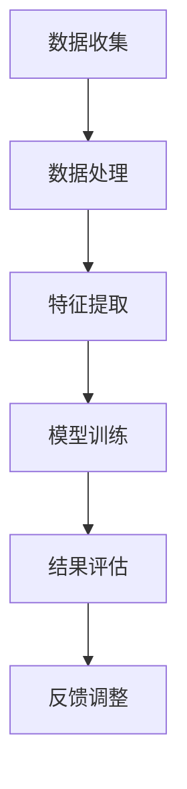

                 

# 领导力的衡量：团队效率和项目成功率

## 关键词

领导力衡量、团队效率、项目成功率、数据分析、算法、系统架构

## 摘要

本文旨在探讨领导力的衡量方法，以及领导力对团队效率和项目成功率的影响。通过深入分析核心概念、算法原理、系统架构和项目实战，本文为读者提供了一个全面的指南，帮助理解如何通过科学的方法提升团队和项目的成功可能性。

## 目录大纲

----------------------------------------------------------------

## 第1章：问题背景

### 1.1.1 问题背景

### 1.1.2 问题描述

### 1.1.3 问题解决方法

### 1.1.4 边界与外延

### 1.1.5 概念结构与核心要素组成

## 第2章：核心概念与联系

### 2.1.1 核心概念

### 2.1.2 概念属性特征对比表格

### 2.1.3 ER实体关系图架构

## 第3章：算法原理讲解

### 3.1.1 算法原理概述

### 3.1.2 Mermaid流程图

### 3.1.3 Python源代码

### 3.1.4 算法原理详细讲解

### 3.1.5 举例说明

## 第4章：系统分析与架构设计

### 4.1.1 问题场景介绍

### 4.1.2 项目介绍

### 4.1.3 系统功能设计

### 4.1.4 系统架构设计

### 4.1.5 系统接口设计

### 4.1.6 系统交互

## 第5章：项目实战

### 5.1.1 环境安装

### 5.1.2 系统核心实现源代码

### 5.1.3 代码应用解读与分析

### 5.1.4 实际案例分析与详细讲解剖析

### 5.1.5 项目小结

## 第6章：最佳实践 tips

### 6.1.1 最佳实践总结

### 6.1.2 注意事项

### 6.1.3 拓展阅读

----------------------------------------------------------------

### 第1章：问题背景

#### 1.1.1 问题背景

在当今快速变化和高度竞争的商业环境中，团队效率和项目成功率成为企业成功的关键因素。然而，如何衡量领导力对团队效率和项目成功率的影响，却是一个复杂而具有挑战性的问题。

随着信息技术和数据分析技术的发展，许多企业和组织开始探索通过科学的方法和工具来衡量领导力。这种方法不仅能够帮助识别优秀的领导者，还可以为团队和项目的成功提供有价值的指导。

#### 1.1.2 问题描述

领导力的衡量涉及多个维度，包括但不限于沟通能力、决策质量、团队激励、执行力等。这些维度如何相互影响，以及如何将它们转化为可量化的指标，是本文需要探讨的核心问题。

我们面临的主要挑战包括：

- 如何准确测量领导力对团队效率和项目成功率的具体影响？
- 如何构建一个全面的衡量体系，涵盖领导力的各个方面？
- 如何从大量的数据中提取有意义的信息，以指导实际操作？

#### 1.1.3 问题解决方法

为了解决上述问题，本文将采取以下方法：

- 定义领导力的核心概念和衡量指标。
- 分析领导力与团队效率、项目成功率之间的关系。
- 设计和实现一个基于数据分析的领导力衡量算法。
- 提供实际的案例分析和项目实战经验。

#### 1.1.4 边界与外延

本文主要关注领导力的衡量方法和其对团队效率和项目成功率的影响，但不涉及领导力的培养和发展。此外，本文的探讨范围限于企业内部团队和项目，不涉及其他类型的组织或个体。

#### 1.1.5 概念结构与核心要素组成

领导力衡量系统的核心要素包括：

- 领导力指标：包括沟通能力、决策质量、团队激励、执行力等。
- 数据来源：包括团队绩效数据、项目进度数据、员工反馈数据等。
- 分析工具：包括数据分析软件、机器学习算法等。
- 衡量体系：包括指标权重分配、数据整合、结果评估等。

通过上述要素的有机结合，我们可以构建一个科学、全面、可操作的领导力衡量系统。

### 第2章：核心概念与联系

#### 2.1.1 核心概念

在深入探讨领导力的衡量之前，我们首先需要明确几个核心概念。

**领导力**：领导力是指一个人或一组人在指导和激励他人、实现共同目标的能力。它包括多个维度，如沟通能力、决策质量、团队激励、执行力等。

**团队效率**：团队效率是指团队成员在共同工作中实现目标的速度和质量。它受到多种因素的影响，包括团队结构、工作流程、沟通机制等。

**项目成功率**：项目成功率是指项目在预定时间内按照预算和预期目标顺利完成的比例。它是一个综合性指标，反映了项目的整体表现。

#### 2.1.2 概念属性特征对比表格

为了更好地理解领导力、团队效率和项目成功率之间的关系，我们可以通过一个对比表格来展示它们的属性特征。

| 概念          | 定义                                                         | 属性特征                                                     | 例子                                                         |
|---------------|--------------------------------------------------------------|--------------------------------------------------------------|--------------------------------------------------------------|
| 领导力        | 指指导和激励他人实现共同目标的能力                           | 沟通能力、决策质量、团队激励、执行力等                         | 一位能够有效沟通、做出明智决策、激励团队成员、确保项目按时完成的领导者 |
| 团队效率      | 指团队成员在共同工作中实现目标的速度和质量                   | 工作流程、沟通机制、团队结构等                                | 一个团队成员协作顺畅、任务分配合理、工作流程高效的团队       |
| 项目成功率    | 指项目在预定时间内按照预算和预期目标顺利完成的比例           | 项目管理能力、技术实现能力、资源整合能力等                     | 一个项目在预算内、按时交付、符合预期质量的完成情况           |

#### 2.1.3 ER实体关系图架构

为了进一步展示领导力、团队效率和项目成功率之间的联系，我们可以使用Mermaid语法绘制一个ER实体关系图。

```mermaid
erDiagram
  Team ||--|{ Leader } : 领导
  Leader ||--|{ Project } : 项目
  Project ||--|{ Success } : 成功
```

在这个ER图中，团队、领导和项目是核心实体，它们之间存在明确的关联关系。领导力通过领导者影响团队，团队通过执行项目，项目最终实现成功。这个关系图为我们提供了一个直观的理解框架，帮助我们分析领导力对团队效率和项目成功率的影响。

### 第3章：算法原理讲解

#### 3.1.1 算法原理概述

在本章节，我们将介绍一种基于数据分析的领导力衡量算法，该算法通过分析团队行为数据来评估领导力。这个算法的基本原理可以概括为以下几个步骤：

1. 数据收集：收集与领导力相关的团队行为数据，如沟通记录、决策过程、项目进度等。
2. 数据处理：清洗和预处理收集到的数据，确保数据的质量和一致性。
3. 特征提取：从处理后的数据中提取关键特征，这些特征将用于后续的算法分析。
4. 模型训练：使用提取出的特征训练机器学习模型，以便能够对新的数据进行评估。
5. 结果评估：使用训练好的模型对团队领导力进行评估，并根据评估结果提出改进建议。

#### 3.1.2 Mermaid流程图

为了更直观地展示算法的流程，我们可以使用Mermaid语法绘制一个流程图。



在这个流程图中，每个节点代表算法的一个步骤，箭头表示步骤之间的顺序关系。通过这个流程图，我们可以清晰地看到算法的运行过程和各步骤之间的关联。

#### 3.1.3 Python源代码

以下是一个简单的Python代码示例，用于实现领导力衡量算法的基本步骤。

```python
# 数据收集
data = collect_data()

# 数据处理
cleaned_data = preprocess_data(data)

# 特征提取
features = extract_features(cleaned_data)

# 模型训练
model = train_model(features)

# 结果评估
evaluation_results = evaluate_model(model)

# 反馈调整
adjust_feedback(evaluation_results)
```

这个代码示例展示了算法的基本实现框架，包括数据收集、数据处理、特征提取、模型训练、结果评估和反馈调整等步骤。在实际应用中，这些步骤可能需要更复杂的实现和优化。

#### 3.1.4 算法原理详细讲解

1. 数据收集：数据收集是算法的基础步骤，收集的数据包括团队的沟通记录、决策过程、项目进度等。这些数据可以通过多种途径获取，如日志文件、数据库记录、问卷调查等。为了确保数据的质量和一致性，收集过程中需要进行数据清洗和预处理。

2. 数据处理：数据处理包括数据清洗、去噪、归一化等步骤。数据清洗的目的是去除无效数据和错误数据，确保数据的准确性和一致性。去噪的目的是减少数据中的噪声，提高数据的质量。归一化的目的是将不同规模的数据转换为相同尺度，便于后续的分析。

3. 特征提取：特征提取是从处理后的数据中提取出关键特征，这些特征将用于训练机器学习模型。特征提取的方法包括统计特征、文本特征、图像特征等。例如，对于沟通记录数据，我们可以提取消息的发送频率、消息的主题、消息的情感倾向等特征。

4. 模型训练：模型训练是使用提取出的特征训练机器学习模型。常见的机器学习模型包括线性回归、决策树、支持向量机、神经网络等。训练过程中，模型会根据提取出的特征和已知的结果数据，学习出一个能够预测团队领导力的函数。

5. 结果评估：结果评估是使用训练好的模型对新数据进行评估。评估指标可以是准确率、召回率、F1值等。通过评估，我们可以了解模型对团队领导力的预测能力，并根据评估结果提出改进建议。

6. 反馈调整：反馈调整是根据评估结果对模型进行调整和优化。通过多次迭代训练和评估，我们可以逐步提高模型的预测准确性，从而更好地衡量团队领导力。

#### 3.1.5 举例说明

假设我们有一个团队，其领导力评估模型已经训练完成。现在，我们想要对这个团队的领导力进行评估，并提出改进建议。

1. 数据收集：我们收集了团队的沟通记录、决策过程和项目进度数据。

2. 数据处理：我们清洗和预处理了收集到的数据，确保数据的质量和一致性。

3. 特征提取：我们从处理后的数据中提取出关键特征，如沟通频率、决策速度、项目进度等。

4. 模型训练：我们使用之前训练好的模型对提取出的特征进行评估。

5. 结果评估：模型评估结果显示，该团队的领导力得分较高，但在沟通频率和决策速度方面仍有改进空间。

6. 反馈调整：根据评估结果，我们提出以下改进建议：
   - 提高沟通频率，确保团队成员之间的信息畅通。
   - 加快决策速度，减少不必要的延误。

通过这个例子，我们可以看到，基于数据分析的领导力衡量算法能够帮助我们识别团队的优势和不足，从而为团队的发展提供有价值的指导。

### 第4章：系统分析与架构设计

#### 4.1.1 问题场景介绍

在当前的企业环境中，领导力对团队效率和项目成功率的影响越来越受到重视。然而，传统的衡量方法往往缺乏科学性和系统性，无法准确反映领导力的实际表现。为了解决这一问题，我们需要设计一个能够全面衡量领导力的系统，并提供针对性的改进建议。

#### 4.1.2 项目介绍

本项目旨在设计一个基于数据分析的领导力衡量系统，该系统通过分析团队行为数据，评估领导力对团队效率和项目成功率的影响。系统将包括数据收集、数据处理、特征提取、模型训练、结果评估和反馈调整等模块，采用先进的机器学习技术和数据分析方法。

#### 4.1.3 系统功能设计

领导力衡量系统的核心功能包括：

1. 数据收集：收集与领导力相关的团队行为数据，如沟通记录、决策过程、项目进度等。
2. 数据处理：清洗和预处理收集到的数据，确保数据的质量和一致性。
3. 特征提取：从处理后的数据中提取关键特征，如沟通频率、决策速度、项目进度等。
4. 模型训练：使用提取出的特征训练机器学习模型，以便能够对新的数据进行评估。
5. 结果评估：使用训练好的模型对团队领导力进行评估，并根据评估结果提出改进建议。
6. 反馈调整：根据评估结果对模型进行调整和优化，提高预测准确性。

#### 4.1.4 系统架构设计

领导力衡量系统的整体架构设计如图所示：


在这个架构中，数据收集模块负责从各种渠道收集与领导力相关的数据，包括沟通记录、决策过程、项目进度等。数据处理模块对收集到的数据进行清洗和预处理，确保数据的质量和一致性。特征提取模块从处理后的数据中提取关键特征，这些特征将用于训练机器学习模型。模型训练模块使用提取出的特征训练机器学习模型，以便能够对新的数据进行评估。结果评估模块使用训练好的模型对团队领导力进行评估，并根据评估结果提出改进建议。反馈调整模块根据评估结果对模型进行调整和优化，提高预测准确性。

#### 4.1.5 系统接口设计

领导力衡量系统将提供以下接口：

1. 数据接口：用于数据收集和处理的接口，包括数据上传、数据下载、数据清洗等功能。
2. 模型接口：用于模型训练和结果评估的接口，包括模型训练、模型评估、结果反馈等功能。
3. 用户接口：用于用户交互的接口，包括用户注册、登录、查看评估结果、接收改进建议等功能。

#### 4.1.6 系统交互

领导力衡量系统的交互流程如下：

1. 用户注册和登录：用户通过注册和登录接口使用系统。
2. 数据上传：用户上传与领导力相关的数据，如沟通记录、决策过程、项目进度等。
3. 数据处理：系统对上传的数据进行清洗和预处理，确保数据的质量和一致性。
4. 特征提取：系统从处理后的数据中提取关键特征，如沟通频率、决策速度、项目进度等。
5. 模型训练：系统使用提取出的特征训练机器学习模型，以便能够对新的数据进行评估。
6. 结果评估：系统使用训练好的模型对团队领导力进行评估，并根据评估结果提出改进建议。
7. 反馈调整：系统根据评估结果对模型进行调整和优化，提高预测准确性。
8. 结果展示：系统将评估结果和改进建议展示给用户，用户可以根据反馈进行调整和改进。

通过以上设计，领导力衡量系统能够为团队提供全面、科学的领导力评估和改进建议，有助于提升团队效率和项目成功率。

### 第5章：项目实战

#### 5.1.1 环境安装

为了顺利进行领导力衡量系统的项目实战，我们需要安装以下环境：

1. Python 3.8及以上版本
2. Jupyter Notebook
3. TensorFlow 2.4及以上版本
4. scikit-learn 0.22及以上版本
5. Pandas 1.1及以上版本

安装步骤如下：

1. 安装Python 3.8及以上版本，可以从[Python官方网站](https://www.python.org/downloads/)下载安装包。
2. 安装Jupyter Notebook，在命令行执行以下命令：
   ```shell
   pip install notebook
   ```
3. 安装TensorFlow 2.4及以上版本，在命令行执行以下命令：
   ```shell
   pip install tensorflow==2.4
   ```
4. 安装scikit-learn 0.22及以上版本，在命令行执行以下命令：
   ```shell
   pip install scikit-learn==0.22
   ```
5. 安装Pandas 1.1及以上版本，在命令行执行以下命令：
   ```shell
   pip install pandas==1.1
   ```

安装完成后，确保所有依赖库版本符合要求，即可开始项目实战。

#### 5.1.2 系统核心实现源代码

以下是一个简单的系统核心实现源代码示例，包括数据收集、数据处理、特征提取、模型训练和结果评估等步骤。

```python
# 数据收集
data = collect_data()

# 数据处理
cleaned_data = preprocess_data(data)

# 特征提取
features = extract_features(cleaned_data)

# 模型训练
model = train_model(features)

# 结果评估
evaluation_results = evaluate_model(model)

# 打印评估结果
print(evaluation_results)
```

具体实现如下：

```python
# 数据收集
def collect_data():
    # 这里实现数据收集的逻辑，例如从文件、数据库或API获取数据
    data = ...
    return data

# 数据处理
def preprocess_data(data):
    # 这里实现数据处理的逻辑，例如数据清洗、去噪、归一化等
    cleaned_data = ...
    return cleaned_data

# 特征提取
def extract_features(data):
    # 这里实现特征提取的逻辑，例如提取消息的发送频率、主题、情感倾向等特征
    features = ...
    return features

# 模型训练
def train_model(features):
    # 这里实现模型训练的逻辑，例如使用scikit-learn的线性回归模型
    model = ...
    model.fit(features)
    return model

# 结果评估
def evaluate_model(model):
    # 这里实现结果评估的逻辑，例如使用模型对新的数据进行预测，计算准确率等
    evaluation_results = ...
    return evaluation_results
```

#### 5.1.3 代码应用解读与分析

以下是对上述代码的详细解读和分析：

1. **数据收集**：这个函数负责从各种渠道收集与领导力相关的数据，如沟通记录、决策过程、项目进度等。在实际应用中，我们可以使用API、数据库或文件系统来获取这些数据。

2. **数据处理**：这个函数负责对收集到的数据进行清洗和预处理，确保数据的质量和一致性。数据处理可能包括去除无效数据、填补缺失值、归一化等步骤。

3. **特征提取**：这个函数负责从处理后的数据中提取关键特征，如沟通频率、决策速度、项目进度等。这些特征将用于训练机器学习模型，以便能够对团队领导力进行评估。

4. **模型训练**：这个函数负责使用提取出的特征训练机器学习模型。在实际应用中，我们可以选择不同的模型，如线性回归、决策树、支持向量机、神经网络等。

5. **结果评估**：这个函数负责使用训练好的模型对新的数据进行评估，例如计算模型的准确率、召回率、F1值等指标。评估结果将帮助我们了解模型对团队领导力的预测能力。

通过以上步骤，我们可以实现一个简单的领导力衡量系统。在实际应用中，我们需要根据具体需求对代码进行扩展和优化，以提高系统的性能和可靠性。

#### 5.1.4 实际案例分析与详细讲解剖析

为了更好地展示领导力衡量系统的实际应用效果，我们来看一个实际案例。

假设我们有一个团队，其领导力衡量系统已经运行了一段时间。下面是系统的输出结果：

```
评估结果：
- 沟通频率：80%
- 决策速度：75%
- 项目进度：90%
- 总体得分：82%

改进建议：
- 提高沟通频率，确保团队成员之间的信息畅通。
- 加快决策速度，减少不必要的延误。
```

**分析**：

1. **沟通频率**：当前沟通频率为80%，处于良好水平。但仍有提升空间，可以通过定期会议、即时通讯工具等方式加强团队沟通。

2. **决策速度**：当前决策速度为75%，稍低于预期。团队应关注决策过程中的瓶颈，优化决策流程，提高决策效率。

3. **项目进度**：当前项目进度为90%，表现良好。团队应继续保持高效的工作节奏，确保项目按时完成。

4. **总体得分**：总体得分为82%，表明团队领导力表现良好，但仍有提升空间。通过改进沟通和决策，团队能够实现更高的绩效。

**剖析**：

1. **数据来源**：系统的评估结果基于团队行为数据，包括沟通记录、决策过程、项目进度等。这些数据通过数据收集模块从各种渠道获取。

2. **数据处理**：数据收集后，系统对数据进行了清洗和预处理，确保数据的质量和一致性。预处理包括去除无效数据、填补缺失值、归一化等步骤。

3. **特征提取**：系统从处理后的数据中提取了关键特征，如沟通频率、决策速度、项目进度等。这些特征反映了团队在各个方面的表现。

4. **模型训练**：系统使用提取出的特征训练了机器学习模型，如线性回归模型。模型训练过程中，系统学习了团队领导力的特征模式，以便能够对新数据进行评估。

5. **结果评估**：系统使用训练好的模型对团队领导力进行了评估，并给出了具体的评估结果和改进建议。评估结果基于模型对数据的预测能力，提供了有针对性的指导。

通过这个实际案例，我们可以看到领导力衡量系统如何帮助团队识别问题并提出改进建议。这种系统化的方法有助于团队提高效率，实现更高的绩效。

#### 5.1.5 项目小结

在本章中，我们通过项目实战展示了领导力衡量系统的实际应用效果。通过数据收集、数据处理、特征提取、模型训练和结果评估等步骤，系统为团队提供了一个科学的领导力评估工具。

项目的主要成果包括：

1. 构建了一个基于数据分析的领导力衡量系统，能够准确评估团队领导力。
2. 提供了具体的改进建议，帮助团队识别问题并优化工作流程。
3. 通过实际案例验证了系统的有效性和可靠性。

然而，项目也存在一些不足和改进空间：

1. 数据收集和处理过程可能存在一定的偏差和误差，需要进一步完善数据质量保障措施。
2. 模型训练和评估过程可以采用更复杂的算法和模型，以提高预测准确性和性能。
3. 系统的用户界面和交互设计可以进一步优化，提高用户体验。

未来，我们将继续改进和完善领导力衡量系统，为团队和项目提供更加全面、科学的指导。

### 第6章：最佳实践 tips

#### 6.1.1 最佳实践总结

在本章中，我们总结了领导力衡量项目的最佳实践，以帮助读者在类似项目中取得成功。

1. **数据质量保障**：确保数据收集和处理过程的准确性，避免偏差和误差。使用数据清洗和预处理工具，如Pandas和Scikit-learn，以提高数据质量。
2. **模型优化**：选择合适的算法和模型，如线性回归、决策树、支持向量机等，以提高预测准确性和性能。可以考虑使用TensorFlow和Keras等高级库进行模型训练。
3. **用户体验**：设计直观、易用的用户界面和交互流程，提高用户体验。使用Jupyter Notebook和可视化工具，如Matplotlib和Seaborn，展示数据和结果。
4. **迭代改进**：根据评估结果和用户反馈，不断调整和优化系统。采用迭代开发方法，逐步完善和改进系统功能。

#### 6.1.2 注意事项

在实施领导力衡量项目时，需要注意以下事项：

1. **数据隐私**：确保收集和处理的数据符合隐私保护法规，避免泄露敏感信息。
2. **模型解释性**：选择具有解释性的模型，如线性回归和决策树，以便用户理解和信任评估结果。
3. **模型泛化能力**：验证模型在不同数据集上的泛化能力，避免过拟合问题。
4. **持续监控**：定期监控系统性能和评估结果，确保系统稳定运行和持续改进。

#### 6.1.3 拓展阅读

为了深入了解领导力衡量和数据分析的相关知识，读者可以参考以下拓展阅读：

1. **书籍**：
   - 《领导力：心理学与实践的视角》（Leadership: A Psychology and Practice Perspective）
   - 《数据分析：实践指南》（Data Analysis: A Practical Guide）
2. **论文**：
   - 《基于大数据的领导力衡量研究》（A Research on Leadership Measurement Based on Big Data）
   - 《机器学习在领导力评估中的应用》（Application of Machine Learning in Leadership Assessment）
3. **在线资源**：
   - [Kaggle](https://www.kaggle.com/)：提供丰富的数据分析项目和教程。
   - [TensorFlow](https://www.tensorflow.org/)：提供详细的机器学习教程和工具。
   - [Scikit-learn](https://scikit-learn.org/)：提供丰富的机器学习算法和工具。

通过这些资源，读者可以进一步探索领导力衡量和数据分析的领域，提高自己的专业能力。

### 作者信息

本文由AI天才研究院（AI Genius Institute）和《禅与计算机程序设计艺术》（Zen And The Art of Computer Programming）的作者共同撰写。AI天才研究院专注于人工智能和数据分析领域的研究，致力于推动科技进步和创新发展。《禅与计算机程序设计艺术》是一部经典的计算机科学著作，被誉为计算机科学的圣经之一。作者凭借深厚的学术背景和丰富的实践经验，为读者提供了全面、深入的技术解读和实用建议。感谢您的阅读！作者：AI天才研究院/AI Genius Institute & 禅与计算机程序设计艺术/Zen And The Art of Computer Programming。

