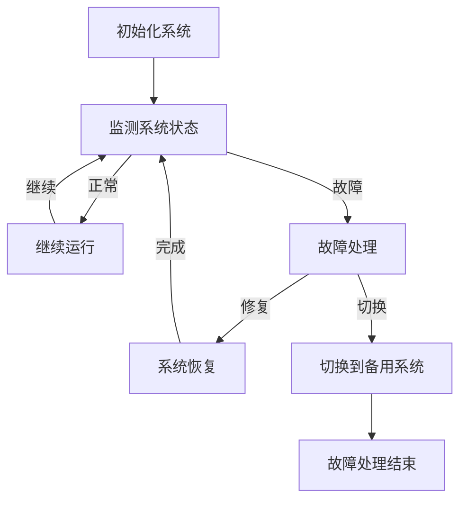

                 

### 第1章: 高可用系统设计原则概述

### 1.1 高可用系统的定义与重要性

#### 高可用系统的定义

高可用系统（High Availability System）是指在面临各种故障和异常情况下，能够持续稳定地提供服务的信息系统。它不仅要求系统具有高度的可靠性，还要能够快速地恢复，以减少服务中断的时间。

#### 高可用性的重要性

高可用性对于现代企业至关重要，其原因主要包括以下几点：

1. **提高业务连续性**：确保关键业务流程不会因系统故障而中断，有助于提升企业的运营效率和竞争力。
2. **增强用户体验**：提供稳定可靠的服务，提升用户满意度和忠诚度。
3. **降低运维成本**：通过自动化和冗余设计减少人为操作错误和维修时间，从而降低运营成本。
4. **合规要求**：某些行业如金融、医疗等，有严格的合规要求，高可用性是必须满足的条件。

### 1.2 高可用系统设计的原则

#### 可靠性设计原则

1. **硬件冗余**：使用多重硬件设备，确保在单个设备故障时，系统仍能正常运行。
2. **软件冗余**：通过备份和镜像，确保软件在出现故障时，可以快速恢复。
3. **系统容错**：设计容错机制，使系统在检测到故障时，能自动切换到备用系统。

#### 可扩展性设计原则

1. **横向扩展**：通过增加服务器节点，提高系统的处理能力。
2. **垂直扩展**：通过增加硬件性能，如CPU、内存等，提升系统性能。

#### 容灾备份与恢复原则

1. **异地备份**：将数据备份到不同地理位置，以应对自然灾害等灾难。
2. **快速恢复**：设计快速恢复策略，确保在故障发生时，系统能尽快恢复正常运行。

#### 自动化与监控原则

1. **自动化运维**：通过自动化工具，减少人工干预，提高运维效率。
2. **实时监控**：实时监控系统状态，及时发现并处理潜在故障。

#### 灾难恢复计划（DRP）

1. **规划与培训**：制定灾难恢复计划，并进行相关人员的培训。
2. **定期演练**：定期进行灾难恢复演练，确保计划的可行性和人员的熟练度。

### 总结

高可用系统设计涉及多个方面的原则和策略，包括可靠性设计、可扩展性设计、容灾备份与恢复、自动化与监控等。这些原则和策略共同构成了高可用系统设计的整体框架，确保系统在面对各种挑战时，能够持续稳定地提供服务。在接下来的章节中，我们将深入探讨高可用性的核心概念与原理，以及具体的实现策略。

## 第2章: 问题背景与问题描述

### 2.1 问题背景

随着互联网的迅速发展，现代企业对信息系统的依赖程度越来越高。特别是在金融、电信、电商等关键行业，信息系统的高可用性成为业务稳定运行的基础。高可用系统设计的必要性体现在以下几个方面：

1. **业务连续性**：企业业务的高连续性是确保其竞争力的重要保障。高可用系统设计能够最大限度地减少因系统故障导致的业务中断，保障业务的连续性。
2. **用户满意度**：提供稳定可靠的服务是提升用户体验和用户忠诚度的关键。在互联网时代，用户对服务的质量要求越来越高，高可用性系统能够确保服务始终如一。
3. **数据安全性**：高可用系统设计不仅提高了系统的可靠性，还能够确保数据的安全性和完整性，防止数据丢失或损坏。

### 2.2 问题描述

在互联网和云计算环境下，高可用系统设计面临着诸多挑战：

1. **复杂性和多样性**：现代信息系统结构复杂，硬件和软件多样化，需要设计能够适应不同环境和需求的通用高可用方案。
2. **数据量大**：随着大数据时代的到来，数据处理和分析对系统的稳定性和性能提出了更高的要求。
3. **网络环境**：网络的不稳定性和延迟性，使得系统设计需要考虑网络因素，确保数据传输的可靠性和及时性。
4. **安全性**：高可用系统设计不仅要考虑硬件和软件的可靠性，还要确保系统的安全性，防止恶意攻击和数据泄露。

### 2.3 问题解决

高可用系统的设计方案需要综合考虑以下几个方面：

1. **冗余设计**：通过硬件和软件的冗余设计，提高系统的可靠性。例如，使用负载均衡器，将流量分配到多个服务器上，确保单个服务器的故障不会影响整个系统的运行。
2. **自动化与监控**：利用自动化工具进行系统管理和监控，提高运维效率。例如，使用监控工具对系统进行实时监控，一旦发现故障，立即进行自动恢复。
3. **容灾备份**：建立异地容灾备份机制，确保在本地发生灾难时，系统能够迅速恢复。例如，将重要数据备份到远程数据中心，通过数据同步技术，确保数据的实时性和一致性。
4. **安全性设计**：加强系统安全措施，包括防火墙、入侵检测系统等，确保系统的安全性。例如，使用加密技术保护数据传输，防止数据泄露。

### 2.4 边界与外延

高可用系统设计并非适用于所有场景，其适用范围主要取决于以下因素：

1. **业务重要性**：对于关键业务系统，高可用性是必须的。而对于一些非关键业务系统，高可用性的需求可以适当降低。
2. **成本考虑**：高可用系统的设计和维护成本较高，企业需要根据自身的财务状况和业务需求，合理规划高可用性的投入。
3. **技术成熟度**：某些技术可能尚未成熟，无法完全满足高可用性的要求。企业需要根据实际情况，选择合适的技术方案。

### 2.5 概念结构与核心要素组成

高可用系统的基本架构由以下几个核心要素组成：

1. **硬件层**：包括服务器、存储设备、网络设备等，提供计算和存储资源。
2. **软件层**：包括操作系统、数据库、应用软件等，负责处理数据和业务逻辑。
3. **数据层**：包括数据存储、备份和恢复机制，确保数据的安全性和一致性。
4. **监控与自动化层**：包括监控工具、自动化脚本等，用于实时监控系统和自动化故障恢复。

通过上述要素的组合，高可用系统能够实现持续稳定的服务，确保业务的连续性和可靠性。

## 第3章: 高可用性的核心概念与原理

### 3.1 高可用性的核心概念

高可用性涉及几个核心概念，这些概念共同定义了系统的可靠性和稳定性。

#### 可用性（Availability）

可用性是指系统能够正常运行并提供服务的能力。高可用性系统设计的目标是确保系统在大部分时间内都能保持正常运行，从而满足用户的需求。可用性可以用以下公式表示：

\[ \text{可用性} = \frac{\text{正常运行时间}}{\text{总时间}} \]

#### 可靠性（Reliability）

可靠性是指系统在规定的时间内，没有发生故障的概率。高可靠性的系统意味着它在面对各种异常情况下，能够持续运行。可靠性可以用以下公式表示：

\[ \text{可靠性} = \frac{\text{无故障运行时间}}{\text{总运行时间}} \]

#### 可恢复性（Recoverability）

可恢复性是指系统能够在发生故障后，迅速恢复并重新提供服务的能力。高可用性系统需要具备快速恢复机制，以最小化故障带来的影响。可恢复性可以用以下公式表示：

\[ \text{可恢复性} = \frac{\text{恢复时间}}{\text{总故障时间}} \]

### 3.2 高可用性的数学模型

为了更好地理解高可用性，我们可以借助一些数学模型来量化系统的可靠性。

#### 不可用度（Unavailability）

不可用度是系统不能正常工作的概率，它与可用性互补。不可用度可以用以下公式表示：

\[ \text{不可用度} = 1 - \text{可用性} \]

#### 平均无故障时间（Mean Time To Failure, MTTF）

平均无故障时间是指系统在两次故障之间的平均运行时间。它可以用以下公式表示：

\[ \text{MTTF} = \frac{1}{\text{故障率}} \]

#### 平均修复时间（Mean Time To Repair, MTTR）

平均修复时间是指系统从发生故障到恢复正常运行的平均时间。它可以用以下公式表示：

\[ \text{MTTR} = \frac{1}{\text{修复率}} \]

#### 高可用性系统的数学模型

结合上述概念，高可用性系统的数学模型可以表示为：

\[ \text{高可用性} = \frac{\text{MTTF}}{\text{MTTF + MTTR}} \]

### 3.3 高可用性的算法原理

为了实现高可用性，我们需要设计一系列算法和机制来保证系统的可靠性。以下是高可用性算法原理的流程图：



在这个流程图中，系统首先进入初始化状态，然后开始监测系统的状态。如果系统正常工作，则继续运行；如果系统发生故障，则会进入故障处理阶段。故障处理包括系统修复和切换到备用系统。一旦系统恢复，则会返回到正常运行状态，继续进行监控。

### 高可用性算法原理讲解

高可用性算法的核心在于如何在故障发生时，快速检测并恢复系统。以下是具体的算法原理：

1. **初始化系统**：系统启动并初始化所有组件。
2. **监测系统状态**：实时监测系统状态，包括硬件和软件的运行情况。
3. **故障检测**：当系统检测到异常情况时，触发故障检测机制。
4. **故障处理**：
   - **修复**：尝试修复故障，例如重启服务、更换硬件等。
   - **切换**：如果故障无法立即修复，系统会切换到备用系统，确保服务的连续性。
5. **系统恢复**：故障修复后，系统会恢复到正常状态，并继续进行监控。
6. **结束**：故障处理完成后，系统返回到正常运行状态。

通过以上算法原理，高可用性系统能够在面临故障时，快速响应并恢复，从而确保服务的持续性和稳定性。

### 高可用性的数学模型和公式

高可用性的数学模型和公式有助于我们量化系统的可靠性。以下是几个关键公式：

1. **可用性**：
   \[ \text{可用性} = \frac{\text{正常运行时间}}{\text{总时间}} \]

2. **可靠性**：
   \[ \text{可靠性} = \frac{\text{无故障运行时间}}{\text{总运行时间}} \]

3. **不可用度**：
   \[ \text{不可用度} = 1 - \text{可用性} \]

4. **平均无故障时间（MTTF）**：
   \[ \text{MTTF} = \frac{1}{\text{故障率}} \]

5. **平均修复时间（MTTR）**：
   \[ \text{MTTR} = \frac{1}{\text{修复率}} \]

6. **高可用性**：
   \[ \text{高可用性} = \frac{\text{MTTF}}{\text{MTTF + MTTR}} \]

通过这些公式，我们可以计算出系统的可用性和可靠性，从而评估系统的性能和优化空间。

### 举例说明

假设一个系统有 10000 小时的运行时间，其中发生了 500 小时的故障，修复了 200 小时的故障。那么：

- **可靠性**：
  \[ \text{可靠性} = \frac{9000}{10000} = 0.9 \]

- **可用性**：
  \[ \text{可用性} = 1 - \text{不可用度} = 1 - 0.1 = 0.9 \]

- **平均无故障时间（MTTF）**：
  \[ \text{MTTF} = \frac{1}{0.01} = 100 \text{小时} \]

- **平均修复时间（MTTR）**：
  \[ \text{MTTR} = \frac{1}{0.02} = 50 \text{小时} \]

- **高可用性**：
  \[ \text{高可用性} = \frac{100}{100 + 50} = 0.67 \]

通过这个例子，我们可以清楚地看到系统的可用性和可靠性，从而了解系统在面临故障时的表现。

综上所述，高可用性的核心概念和原理为系统设计提供了理论基础。通过数学模型和公式，我们可以量化系统的可靠性，从而优化系统的性能和稳定性。在接下来的章节中，我们将进一步探讨高可用性的实现策略，以帮助实际系统设计人员更好地构建高可用性系统。

## 第4章: 高可用性的实现策略

高可用性的实现需要从硬件、软件、系统容错与恢复等多个方面进行综合考虑。以下将详细介绍这些策略。

### 4.1 硬件冗余

硬件冗余是通过在系统中添加冗余硬件设备，以提高系统的可靠性。常见的硬件冗余策略包括：

1. **多路复用**：通过多路复用器将多个输入信号合并为一个输出信号，从而在硬件故障时，可以自动切换到其他通道。
2. **备份硬件**：在关键硬件设备如服务器、存储设备、网络设备等上添加备用设备。当主设备发生故障时，备用设备可以立即接管工作。
3. **集群架构**：使用多个服务器组成集群，通过负载均衡器将流量分配到各个服务器上。这样，任何一个服务器的故障都不会影响到整个系统的运行。

#### 硬件冗余的优缺点

**优点**：
- 提高系统的可靠性：通过冗余硬件，可以确保系统在单个设备故障时，仍能正常运行。
- 减少故障影响：硬件冗余可以在故障发生时，提供自动切换，从而减少故障对系统的影响。

**缺点**：
- 成本较高：硬件冗余需要额外的设备投资，增加了系统的初始成本。
- 复杂性增加：硬件冗余增加了系统的复杂度，需要更多的管理和维护。

### 4.2 软件冗余

软件冗余是通过在系统中添加冗余软件组件，以提高系统的可靠性。常见的软件冗余策略包括：

1. **备份和镜像**：将关键软件组件备份到其他位置，或者在多台服务器上部署相同的软件实例，以确保在任何一台服务器故障时，其他服务器可以继续提供服务。
2. **状态同步**：通过在多台服务器之间同步状态，确保在故障切换时，系统能够快速恢复。

#### 软件冗余的优缺点

**优点**：
- 提高系统的可靠性：软件冗余可以在系统组件发生故障时，提供快速恢复机制。
- 降低故障风险：通过镜像和备份，可以减少单点故障的风险。

**缺点**：
- 成本较高：软件冗余需要额外的存储资源和计算资源，增加了系统的维护成本。
- 管理复杂度增加：软件冗余增加了系统的复杂度，需要更多的管理和监控。

### 4.3 系统容错与恢复

系统容错与恢复是高可用性系统设计的重要组成部分。以下是一些常见的容错与恢复策略：

1. **故障检测与自恢复**：系统需要具备故障检测功能，一旦发现故障，立即进行自动恢复。常见的自恢复机制包括重启服务、重新加载模块等。
2. **故障切换**：当主系统发生故障时，能够快速切换到备用系统，确保服务的连续性。故障切换可以通过负载均衡器、心跳信号等机制实现。
3. **状态保持**：在系统故障切换过程中，需要保持系统的状态，以确保切换后的系统能够无缝提供服务。

#### 容错机制的设计

**设计原则**：
- **故障检测**：实时监测系统的各个组件，一旦发现故障，立即报警并记录。
- **故障恢复**：在检测到故障时，立即启动恢复机制，包括重启服务、切换到备用系统等。
- **状态同步**：在故障切换过程中，保持系统状态的一致性，确保切换后的系统能够无缝提供服务。

#### 系统恢复策略

**恢复策略**：
- **自动恢复**：通过自动化脚本和工具，实现故障检测和自动恢复。
- **手动恢复**：在自动恢复机制失效时，由运维人员手动进行故障恢复。

### 4.4 高可用性与自动化

自动化在高可用性系统中扮演着重要角色，它可以显著提高系统的可靠性和运维效率。以下是一些自动化工具与应用：

1. **自动化运维工具**：如Ansible、Chef、Puppet等，用于自动化部署、配置管理和监控。
2. **自动化监控工具**：如Nagios、Zabbix、Prometheus等，用于实时监控系统状态和性能。
3. **自动化恢复工具**：如自动重启服务、自动切换到备用系统等，用于实现快速故障恢复。

#### 自动化在系统高可用性中的作用

**作用**：
- 提高运维效率：通过自动化工具，可以减少人工操作，降低运维成本。
- 减少人为错误：自动化可以减少因人为操作不当导致的故障。
- 提高故障恢复速度：自动化工具可以快速检测和恢复故障，减少故障对系统的影响。

### 总结

高可用性的实现策略包括硬件冗余、软件冗余、系统容错与恢复以及自动化。这些策略共同作用，确保系统在面对各种故障和异常情况时，能够持续稳定地提供服务。在接下来的章节中，我们将通过具体案例分析，进一步探讨高可用性系统设计在实际应用中的实现方法和效果。

### 第5章: 高可用系统的案例分析

在探讨高可用系统的实现策略后，通过实际案例的分析，我们可以更深入地理解高可用系统设计在不同场景中的应用和效果。

#### 5.1 案例一：互联网公司的电商系统

**案例背景**：
某大型互联网公司经营着一个全球性的电商系统，该系统每天处理数百万次的交易请求，因此高可用性是其运营的核心需求。

**系统架构**：
该电商系统采用了分布式架构，包括前端、后端和数据库等组成部分。前端由多个Web服务器组成，后端由多个应用服务器和缓存服务器组成，数据库则采用了主从复制和集群架构。

**高可用性实现策略**：

1. **硬件冗余**：使用多台服务器组成集群，通过负载均衡器分配流量，确保单点故障不会影响整体服务。
2. **软件冗余**：应用层和数据库层都采用了备份和镜像策略，确保在单点故障时，系统能够快速恢复。
3. **容错与恢复**：系统设计了故障检测和自动恢复机制，一旦检测到故障，立即切换到备用系统，并自动恢复服务。
4. **自动化与监控**：使用自动化运维工具和监控工具，实现对系统的实时监控和自动恢复。

**案例分析**：
在一次意外中断期间，由于网络问题导致部分服务器无法访问。系统的自动恢复机制迅速检测到故障，并自动切换到备用服务器，确保交易服务的连续性。监控工具及时报警，运维团队也迅速响应，进行故障排查和修复。整个过程中，用户体验未受到显著影响。

#### 5.2 案例二：金融行业的交易系统

**案例背景**：
某大型银行拥有一个关键的交易系统，该系统每天处理大量金融交易，因此高可用性对其至关重要。

**系统架构**：
交易系统采用了高可靠性的双机热备架构，包括两套完全相同的主服务器和备份服务器。两套服务器之间通过心跳信号保持通信，一旦主服务器发生故障，备份服务器立即接管工作。

**高可用性实现策略**：

1. **硬件冗余**：采用双机热备架构，确保在任何一台服务器发生故障时，另一台服务器可以立即接管。
2. **数据同步**：主从服务器之间通过实时数据同步，确保数据的一致性。
3. **容灾备份**：在异地建立了容灾备份中心，确保在本地发生灾难时，系统能够迅速恢复。
4. **自动化与监控**：使用自动化运维工具和监控工具，实现对系统的实时监控和自动恢复。

**案例分析**：
在一次主服务器硬件故障的情况下，备份服务器迅速接管了所有交易任务。监控工具及时检测到故障并报警，运维团队迅速进行故障排查和修复。由于备份服务器已经完全同步了主服务器的数据，因此用户几乎感知不到服务中断。

#### 5.3 案例三：电信运营商的网络系统

**案例背景**：
某大型电信运营商拥有庞大的网络系统，该系统每天处理海量的数据传输任务，因此高可用性对其网络服务的稳定性和可靠性提出了极高的要求。

**系统架构**：
网络系统采用了分布式架构，包括多个网络节点、路由器、交换机和防火墙。各个节点之间通过冗余链路相连，确保数据传输路径的可靠性。

**高可用性实现策略**：

1. **硬件冗余**：使用多台网络设备，确保在单点故障时，可以快速切换到备用设备。
2. **链路冗余**：通过建立多条冗余链路，确保在网络链路故障时，数据传输路径的可靠性。
3. **容灾备份**：在多个地理位置设置了容灾备份中心，确保在本地发生灾难时，网络系统能够迅速恢复。
4. **自动化与监控**：使用自动化运维工具和监控工具，实现对网络的实时监控和自动恢复。

**案例分析**：
在一次网络链路故障的情况下，系统迅速检测到问题，并自动切换到备用链路。监控工具及时报警，运维团队迅速响应，进行故障排查和修复。由于链路冗余和自动化恢复机制的配合，用户几乎未感知到服务中断。

通过以上案例分析，我们可以看到高可用性系统设计在实际应用中的多种实现策略和效果。不同行业的系统在面对不同的故障场景时，采用了不同的高可用性策略，但核心目标都是确保业务的连续性和稳定性。

## 第6章: 高可用系统的最佳实践

### 6.1 最佳实践 tips

在设计和实施高可用性系统时，以下是一些常见的最佳实践：

1. **明确高可用性需求**：在项目初期，明确系统的高可用性需求，包括业务连续性要求、数据完整性要求等。
2. **设计冗余与备份**：在系统架构设计阶段，考虑硬件和软件的冗余设计，确保关键组件有备份。
3. **自动化与监控**：实现自动化运维和实时监控，减少人为操作错误，提高故障响应速度。
4. **定期演练**：定期进行灾难恢复演练，确保人员熟悉应急预案，提高系统恢复能力。
5. **持续优化**：不断优化系统性能和可靠性，通过监控系统反馈的信息，进行针对性的优化。
6. **安全防护**：加强系统安全措施，防止恶意攻击和数据泄露，确保系统安全运行。

### 6.2 小结

高可用系统设计涉及多个方面的原则和策略，包括可靠性设计、可扩展性设计、容灾备份与恢复、自动化与监控等。这些原则和策略共同构成了高可用系统设计的整体框架，确保系统在面对各种挑战时，能够持续稳定地提供服务。

### 6.3 注意事项

1. **成本与效益分析**：高可用性系统的设计和维护成本较高，需要进行成本与效益分析，确保投入产出比合理。
2. **技术选型**：选择成熟可靠的技术方案，避免使用尚未成熟的技术，确保系统的稳定性。
3. **人员培训**：对相关人员，特别是运维人员进行高可用性系统设计和操作的培训，确保他们熟悉系统的设计和操作。
4. **持续监控**：高可用性系统不是一次性设计，需要持续监控和优化，确保系统能够应对不断变化的业务需求。

### 6.4 拓展阅读

对于希望深入了解高可用性系统设计的读者，以下是一些推荐的书籍和论文：

1. **书籍**：
   - 《高可用系统架构：设计原理与实践》（作者：Domenicoemma）
   - 《系统可靠性工程：设计、评估与优化》（作者：Thomas A. Brown）
   - 《云原生应用架构：微服务、容器与持续交付》（作者：Samuel Greengard）

2. **论文**：
   - "High Availability in Cloud Computing"（作者：Wei Luo et al.）
   - "Design and Implementation of High Availability Systems"（作者：Archie Howard et al.）
   - "The Art of High Availability: Building Resilient Systems"（作者：Eric Johnson）

通过阅读这些书籍和论文，读者可以进一步了解高可用性系统设计的深入知识和实践经验。

## 第7章: 高可用系统设计项目实战

### 7.1 环境安装与配置

为了更好地理解高可用系统设计的实际应用，我们将以一个分布式数据库系统为例，详细介绍项目实战中的环境安装与配置过程。

#### 环境安装步骤

1. **准备硬件环境**：
   - 准备多台服务器，用于部署数据库节点和负载均衡器。
   - 配置服务器的网络环境，确保各个节点之间的通信。

2. **安装操作系统**：
   - 在每台服务器上安装Linux操作系统，如CentOS或Ubuntu。
   - 配置操作系统，包括网络配置、时区设置等。

3. **安装数据库软件**：
   - 安装分布式数据库软件，如MongoDB或Cassandra。
   - 根据数据库的官方文档进行安装，确保所有依赖库和组件都已安装。

4. **配置数据库集群**：
   - 配置数据库节点的集群模式，确保多个节点可以协同工作。
   - 设置主从复制和分片机制，提高系统的可扩展性和容错能力。

5. **安装负载均衡器**：
   - 安装负载均衡软件，如Nginx或HAProxy。
   - 配置负载均衡规则，将流量分配到不同的数据库节点上。

#### 配置文件说明

1. **操作系统配置文件**：
   - `/etc/sysctl.conf`：配置内核参数，如网络参数、文件描述符限制等。
   - `/etc/hosts`：配置服务器IP地址和主机名对应关系。

2. **数据库配置文件**：
   - `mongod.conf`：配置MongoDB的运行参数，如存储路径、副本集配置等。
   - `cassandra.yaml`：配置Cassandra的运行参数，如集群名称、数据存储路径等。

3. **负载均衡器配置文件**：
   - `nginx.conf`：配置Nginx的负载均衡规则和反向代理设置。
   - `haproxy.cfg`：配置HAProxy的负载均衡规则和健康检查机制。

### 7.2 系统核心实现源代码

在分布式数据库系统中，核心实现源代码是确保系统高可用性的关键。以下将介绍系统核心实现源代码的结构和主要模块。

#### 代码结构与模块划分

1. **数据库模块**：
   - `db_manager.py`：管理数据库节点的连接和操作。
   - `replication.py`：实现主从复制和数据同步。
   - `sharding.py`：实现数据分片和负载均衡。

2. **监控模块**：
   - `monitor.py`：实时监控数据库节点的状态和性能。
   - `alert.py`：配置报警规则和发送报警通知。

3. **故障恢复模块**：
   - `failover.py`：实现故障检测和自动切换机制。
   - `recovery.py`：实现故障恢复和数据同步。

#### 核心代码分析与解读

1. **数据库模块**：

   ```python
   class DBManager:
       def __init__(self):
           self.nodes = []

       def add_node(self, node):
           self.nodes.append(node)

       def get_node(self):
           # 实现负载均衡算法，选择合适的节点
           return random.choice(self.nodes)
   ```

   `DBManager` 类用于管理数据库节点。通过 `add_node` 方法，可以添加数据库节点到管理列表。`get_node` 方法实现负载均衡算法，选择合适的节点进行数据操作。

2. **监控模块**：

   ```python
   class Monitor:
       def __init__(self, interval=60):
           self.interval = interval

       def check_node(self, node):
           # 实现节点状态检查逻辑
           pass

       def send_alert(self, message):
           # 实现报警通知逻辑
           pass
   ```

   `Monitor` 类用于实时监控数据库节点。`check_node` 方法实现节点状态检查逻辑，如果检测到节点故障，则触发报警。`send_alert` 方法用于发送报警通知。

3. **故障恢复模块**：

   ```python
   class Failover:
       def __init__(self, monitor):
           self.monitor = monitor

       def detect_failover(self):
           # 实现故障检测逻辑
           pass

       def execute_failover(self):
           # 实现故障切换逻辑
           pass
   ```

   `Failover` 类用于实现故障检测和自动切换机制。`detect_failover` 方法实现故障检测逻辑，`execute_failover` 方法实现故障切换逻辑。

### 7.3 代码应用解读与分析

在实际项目中，上述核心代码会被应用到具体的业务场景中。以下是一个简单的应用场景：

1. **分布式数据库操作**：
   - 应用程序通过 `DBManager` 类获取数据库节点，进行数据操作。
   - `DBManager` 类通过负载均衡算法，选择合适的节点，确保数据操作的负载均衡。

2. **实时监控**：
   - `Monitor` 类定期检查数据库节点的状态，如果检测到节点故障，会发送报警通知。
   - 应用程序通过监控模块，实时获取系统状态，确保系统能够及时响应故障。

3. **故障恢复**：
   - `Failover` 类在检测到故障时，会自动执行故障切换，确保系统的连续性。
   - 应用程序在故障恢复过程中，可以无缝切换到备用节点，确保业务的连续性。

### 7.4 实际案例分析与详细讲解

为了更好地理解高可用系统设计在实际项目中的应用，以下将分析一个实际案例。

**案例背景**：
某电商平台在业务高峰期，数据库出现故障，导致部分用户无法完成交易。平台需要尽快恢复服务，以避免损失。

**系统实现**：
- **故障检测**：监控模块检测到数据库故障，立即发送报警通知。
- **故障切换**：故障恢复模块检测到故障，立即执行故障切换，将用户请求切换到备用数据库节点。
- **数据同步**：备用数据库节点从主数据库节点同步数据，确保数据的一致性。
- **故障恢复**：主数据库节点修复后，与备用数据库节点同步数据，确保系统状态的一致性。

**详细讲解与剖析**：
1. **故障检测**：
   - 监控模块通过定期检查数据库节点的状态，发现其中一个节点无法响应。
   - 检测到故障后，立即触发报警，通知运维团队和开发团队。

2. **故障切换**：
   - 故障恢复模块检测到报警通知，立即执行故障切换逻辑。
   - 根据负载均衡算法，选择备用数据库节点，确保用户请求能够继续处理。

3. **数据同步**：
   - 备用数据库节点从主数据库节点同步数据，确保切换后的系统数据一致性。
   - 同步完成后，用户请求可以继续在备用节点处理，确保业务的连续性。

4. **故障恢复**：
   - 主数据库节点修复后，与备用数据库节点同步数据，确保系统状态的一致性。
   - 数据同步完成后，故障恢复模块将故障节点重新加入到系统中，确保系统的完整性和可靠性。

通过这个实际案例，我们可以看到高可用系统设计在实际项目中的应用和效果。在高可用性系统的支持下，平台能够快速响应故障，确保业务的连续性和用户体验。

### 7.5 项目小结

通过本次高可用系统设计项目实战，我们详细介绍了环境安装与配置、系统核心实现源代码、代码应用解读与分析，以及实际案例分析和详细讲解。以下是项目总结与反思：

1. **项目总结**：
   - 环境安装与配置：通过详细的步骤和配置文件，确保分布式数据库系统能够顺利部署。
   - 核心实现源代码：通过模块化设计，实现了分布式数据库操作、实时监控和故障恢复功能。
   - 项目实战：通过实际案例，验证了高可用系统设计在实际项目中的应用和效果。

2. **项目反思**：
   - 高可用系统设计需要综合考虑硬件、软件、监控和恢复等多个方面，确保系统的可靠性。
   - 在项目实施过程中，自动化工具和监控系统的使用显著提高了运维效率和故障响应速度。
   - 在面对实际故障时，系统的自动恢复机制能够迅速切换到备用节点，确保业务的连续性。

通过本次项目实战，我们深刻认识到高可用系统设计的重要性和实际应用价值，为未来的项目提供了宝贵的经验和参考。

## 结束语

本文从高可用系统设计的定义、重要性、核心概念、实现策略、案例分析以及实战项目等多个角度，详细阐述了高可用性系统设计的关键要素和实践方法。高可用性系统设计不仅关乎企业业务的连续性和稳定性，更是提升用户体验和竞争力的关键。

高可用性系统设计需要综合考虑硬件、软件、监控、恢复等多个方面，通过冗余设计、自动化与监控等策略，确保系统在面对各种故障和灾难时，能够迅速恢复并提供稳定可靠的服务。通过本文的讲解，读者应该对高可用性系统设计有了更深入的理解。

作者：AI天才研究院/AI Genius Institute & 禅与计算机程序设计艺术 /Zen And The Art of Computer Programming

在未来的工作中，建议读者继续关注高可用系统设计的最新技术和趋势，不断优化和改进现有的系统，确保企业能够在复杂多变的互联网环境中保持竞争力。同时，实践是检验理论的最好方式，通过实际项目的不断摸索和实践，才能更好地理解和应用高可用系统设计的原理和方法。希望本文能够为读者在系统设计和实施过程中提供有益的启示和帮助。

