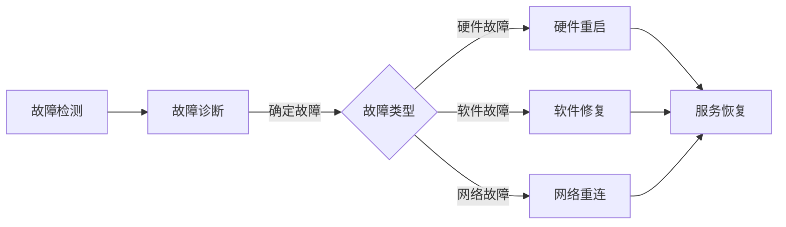
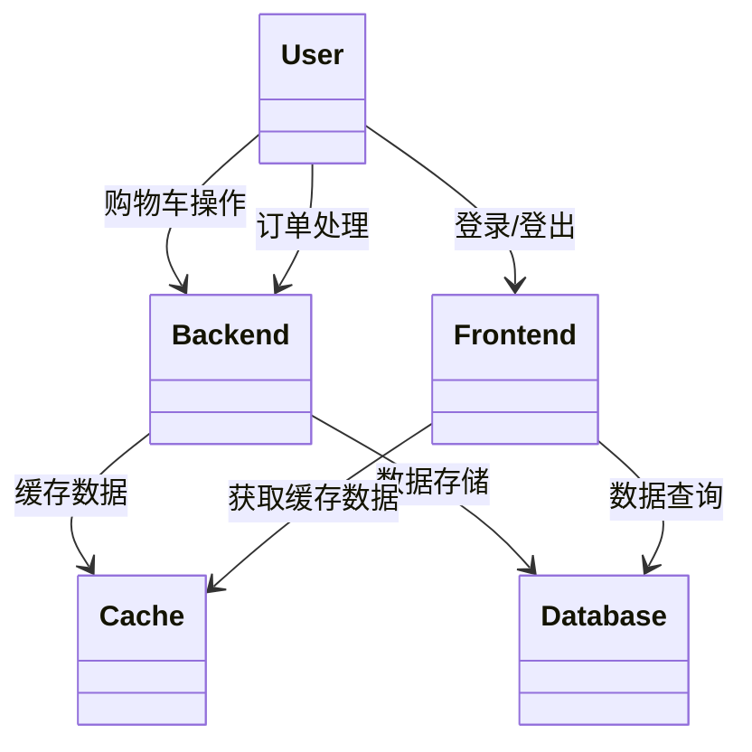
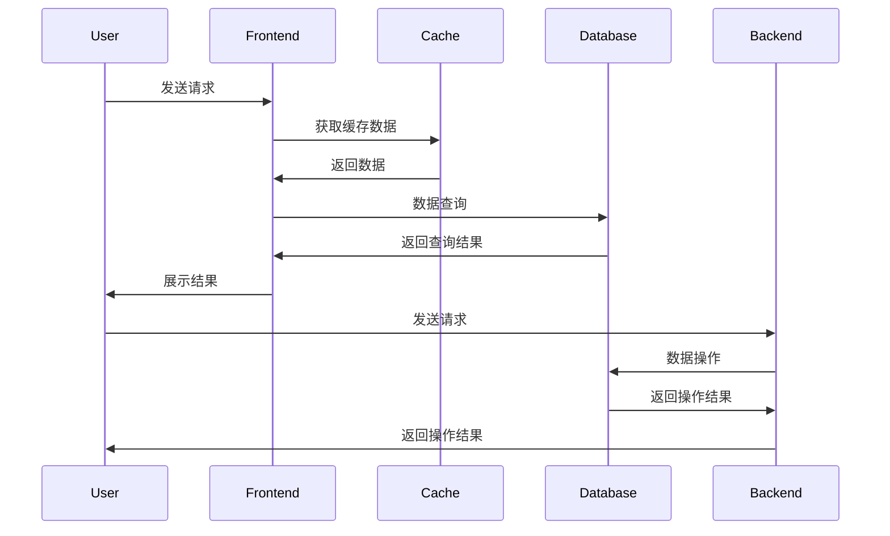
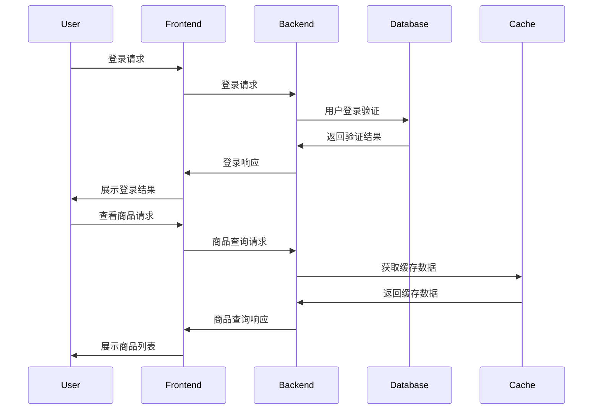

                 

### 高可用系统设计的关键要素

#### 引言

在当今的信息化社会中，高可用性（High Availability, HA）已成为系统设计和运维的重要目标。高可用系统不仅需要提供可靠的服务，还要在面临各种故障和挑战时能够快速恢复，保障业务的连续性。本文将深入探讨高可用系统设计的关键要素，通过一步步的分析推理，帮助读者理解并掌握如何构建一个高可用的系统。

#### 关键词

- 高可用系统
- 容错机制
- 负载均衡
- 故障恢复
- 性能优化

#### 摘要

本文将详细解析高可用系统设计的关键要素，包括核心概念、算法原理、系统分析与架构设计以及实际项目实战。我们将从背景介绍、核心概念、算法讲解、系统架构设计、项目实战和最佳实践等多个角度，系统性地展示高可用系统的设计和实现方法。

#### 目录

1. **背景介绍**
   1.1 问题背景
   1.2 问题描述
   1.3 问题解决
   1.4 边界与外延
   1.5 概念结构与核心要素组成

2. **核心概念与联系**
   2.1 核心概念原理
   2.2 概念属性特征对比表格
   2.3 ER实体关系图架构

3. **算法原理讲解**
   3.1 算法mermaid流程图
   3.2 Python源代码
   3.3 数学模型和公式
   3.4 详细讲解与举例说明

4. **系统分析与架构设计方案**
   4.1 问题场景介绍
   4.2 项目介绍
   4.3 系统功能设计
   4.4 系统架构设计
   4.5 系统接口设计
   4.6 系统交互

5. **项目实战**
   5.1 环境安装
   5.2 系统核心实现源代码
   5.3 代码应用解读与分析
   5.4 实际案例分析和详细讲解剖析
   5.5 项目小结

6. **最佳实践 tips、小结、注意事项、拓展阅读**

#### 1. 背景介绍

##### 1.1 问题背景

高可用系统（High Availability, HA）是现代信息技术领域中的一个重要概念。它旨在通过一系列设计和实施策略，确保系统能够持续、可靠地提供服务，即使在面临各种故障和挑战时也能迅速恢复。高可用性不仅仅是一个技术目标，更是企业业务连续性（Business Continuity）的重要组成部分。

在信息技术快速发展的今天，许多关键业务系统，如金融交易系统、在线电商平台、电信网络等，对高可用性的要求越来越高。这些系统的中断或性能下降可能会带来严重的经济损失、信誉损害甚至法律风险。因此，高可用系统设计已成为企业信息化建设的关键环节。

##### 1.2 问题描述

高可用系统设计面临的主要挑战包括以下几个方面：

1. **系统稳定性**：系统需要能够承受各种内部和外部压力，如硬件故障、软件缺陷、网络中断等，确保服务的连续性。
2. **故障恢复**：当系统发生故障时，需要能够快速检测并恢复服务，最小化业务中断时间。
3. **性能优化**：高可用系统不仅需要保证稳定性，还要在保证服务质量的前提下，优化系统性能，提升用户体验。

##### 1.3 问题解决

为了解决上述问题，高可用系统设计采用了一系列关键要素和策略。这些要素包括容错机制、负载均衡、故障恢复策略等。通过合理的设计和实施，这些要素可以帮助系统在面对各种故障和挑战时保持高可用性。

##### 1.4 边界与外延

高可用系统设计需要明确其边界和适用范围。高可用性不等同于可靠性（Reliability），后者关注系统在整个生命周期内的可靠性水平。高可用性更侧重于系统在面对特定故障时的恢复能力和稳定性。此外，高可用系统设计还需要考虑与 Disaster Recovery（灾难恢复）等概念的区分，后者关注在极端情况下（如自然灾害、大规模系统故障等）的业务连续性。

##### 1.5 概念结构与核心要素组成

高可用系统设计中的核心概念和要素包括：

1. **容错机制**：通过冗余设计、故障检测和切换机制，确保系统在面对故障时能够自动恢复。
2. **负载均衡**：通过分布和调度策略，确保系统资源得到合理利用，提升整体性能。
3. **故障恢复策略**：制定和实施一系列故障检测、诊断和恢复流程，确保系统能够快速恢复服务。
4. **监控和告警**：通过实时监控和告警机制，及时发现和处理系统故障。
5. **自动化运维**：通过自动化工具和流程，提升系统运维效率和可靠性。

#### 2. 核心概念与联系

##### 2.1 核心概念原理

高可用系统设计中的核心概念包括容错机制、负载均衡、故障恢复策略等。这些概念共同构成了高可用性的基础。

1. **容错机制**：
   - **冗余设计**：通过冗余组件和冗余数据，确保系统在部分组件或数据丢失时仍能正常运行。
   - **故障检测**：通过监控和告警机制，及时发现系统故障。
   - **故障切换**：当检测到故障时，自动切换到备用组件或备用数据，确保服务不中断。

2. **负载均衡**：
   - **分布策略**：将请求分布到不同的服务器或组件上，避免单点瓶颈。
   - **调度算法**：根据系统负载、响应时间和可用性等因素，动态调整请求调度策略。

3. **故障恢复策略**：
   - **故障检测**：通过监控和告警机制，及时发现系统故障。
   - **故障诊断**：通过故障定位和分析，确定故障原因。
   - **故障恢复**：根据故障类型和影响范围，采取相应的恢复措施，如重启组件、恢复数据等。

##### 2.2 概念属性特征对比表格

| 概念       | 描述                         | 特征对比                   |
|------------|------------------------------|----------------------------|
| 容错机制   | 提升系统可靠性               | 冗余设计、故障检测、故障切换 |
| 负载均衡   | 优化系统性能                 | 分布策略、调度算法           |
| 故障恢复策略 | 快速恢复系统服务             | 故障检测、故障诊断、故障恢复   |

##### 2.3 ER实体关系图架构

在构建高可用系统时，了解各个实体及其关系对于整体设计至关重要。以下是一个简化的ER实体关系图架构，展示了高可用系统中的一些关键实体及其关系：

```
+------------------+       +------------------+       +------------------+
|   容错机制      |       |    负载均衡      |       |   故障恢复策略   |
+------------------+       +------------------+       +------------------+
| 冗余组件        |<----->| 调度算法         |<----->| 故障检测         |
+------------------+       +------------------+       +------------------+
                |                          |                       |
                |                          |                       |
                |                          |                       |
+------------------+       +------------------+       +------------------+
|  数据库复制      |       |   网络负载均衡    |       |  故障诊断工具    |
+------------------+       +------------------+       +------------------+
                |                          |                       |
                |                          |                       |
                |                          |                       |
+------------------+       +------------------+       +------------------+
|  自动化运维工具  |       |    告警系统       |       |   数据恢复工具    |
+------------------+       +------------------+       +------------------+
```

#### 3. 算法原理讲解

##### 3.1 算法mermaid流程图

以下是一个高可用系统故障恢复算法的mermaid流程图：



##### 3.2 Python源代码

以下是一个简单的Python示例，用于实现故障检测和故障恢复算法：

```python
def check_fault():
    # 假设通过某种机制检测到故障
    if detect_fault():
        fault_type = diagnose_fault()
        if fault_type == '硬件故障':
            hardware_restart()
        elif fault_type == '软件故障':
            software_repair()
        elif fault_type == '网络故障':
            network_reconnect()
        service_restore()

def detect_fault():
    # 检测故障的逻辑
    return True

def diagnose_fault():
    # 故障诊断的逻辑
    return '硬件故障'

def hardware_restart():
    # 重启硬件的逻辑
    print("硬件重启")

def software_repair():
    # 修复软件的逻辑
    print("软件修复")

def network_reconnect():
    # 重连网络的逻辑
    print("网络重连")

def service_restore():
    # 恢复服务的逻辑
    print("服务恢复")
```

##### 3.3 数学模型和公式

在故障恢复策略中，可以使用一些数学模型和公式来评估系统的可用性和可靠性。以下是一个简单的可用性计算公式：

$$
A(t) = \frac{T(t)}{T_{total}}
$$

其中，$A(t)$ 是系统在时间 $t$ 的可用性，$T(t)$ 是在时间 $t$ 内系统正常运行的时间，$T_{total}$ 是总时间。

##### 3.4 详细讲解与举例说明

以下是一个详细的讲解示例：

假设我们有一个网站系统，要求其高可用性达到99.9%。这意味着每年系统最多允许8.8小时的故障时间。我们可以使用上述可用性公式来计算系统的正常运行时间：

$$
A(t) = 0.999 \\
0.999 = \frac{T(t)}{T_{total}} \\
T_{total} = \frac{T(t)}{0.999} \\
T(t) = T_{total} - 8.8 \\
T(t) = 365 \times 24 \times 60 \times 60 - 8.8 \\
T(t) \approx 31,536,000 - 8.8 \\
T(t) \approx 31,535,991.2 \text{秒}
$$

因此，每年系统需要保证至少31,535,991.2秒正常运行。

现在，我们假设系统中有两个数据库实例，每个实例的可用性为99.99%。我们可以计算整个系统的可用性：

$$
A_{total} = \frac{T_{db1} + T_{db2}}{2 \times T_{db1} + 2 \times T_{db2}} \\
A_{total} = \frac{0.999 \times T_{db1} + 0.999 \times T_{db2}}{2 \times 0.999 \times T_{db1} + 2 \times 0.999 \times T_{db2}} \\
A_{total} = \frac{0.999T_{db1} + 0.999T_{db2}}{1.998T_{db1} + 1.998T_{db2}} \\
A_{total} = \frac{T_{db1} + T_{db2}}{2T_{db1} + 2T_{db2}} \\
A_{total} = A(t)
$$

这意味着，如果我们能够保证两个数据库实例的运行时间相等，整个系统的可用性将仍然达到99.9%。

#### 4. 系统分析与架构设计方案

##### 4.1 问题场景介绍

假设我们正在设计一个电子商务网站，要求其具有高可用性，以确保用户能够随时访问并购买商品。该网站需要处理大量的用户请求，同时存储和管理海量的商品数据。

##### 4.2 项目介绍

该项目包括以下核心模块：

1. **前端展示模块**：负责用户界面和交互逻辑。
2. **后端业务处理模块**：负责处理用户请求、数据存储和业务逻辑。
3. **数据库模块**：存储用户数据、商品数据等。
4. **缓存模块**：提高系统性能，减少数据库访问压力。
5. **监控与告警模块**：实时监控系统状态，及时发现和处理故障。

##### 4.3 系统功能设计

以下是一个使用mermaid绘制的领域模型类图，展示了系统的功能结构：



##### 4.4 系统架构设计

以下是一个使用mermaid绘制的系统架构图，展示了系统的整体结构：



##### 4.5 系统接口设计

以下是一个系统接口设计示例，包括API接口和数据库接口：

```python
# API接口设计
class ECommerceAPI:
    def get_product(self, product_id):
        # 获取商品详情
        pass

    def add_to_cart(self, user_id, product_id):
        # 添加商品到购物车
        pass

    def place_order(self, user_id, order_data):
        # 提交订单
        pass

# 数据库接口设计
class ECommerceDatabase:
    def get_product_by_id(self, product_id):
        # 根据商品ID查询商品详情
        pass

    def add_product_to_cart(self, user_id, product_id):
        # 将商品添加到购物车
        pass

    def place_order(self, user_id, order_data):
        # 提交订单
        pass
```

##### 4.6 系统交互

以下是一个使用mermaid绘制的系统交互序列图，展示了系统的交互流程：



#### 5. 项目实战

##### 5.1 环境安装

在开始项目实战之前，我们需要安装和配置以下环境：

1. **操作系统**：Linux（如Ubuntu 18.04）
2. **开发工具**：Python 3.8，Docker，Nginx
3. **数据库**：MySQL 8.0
4. **缓存**：Redis 6.0

以下是环境安装步骤：

1. 安装操作系统：

   ```bash
   # 安装Ubuntu 18.04
   ```

2. 安装开发工具：

   ```bash
   # 更新系统包列表
   sudo apt update
   sudo apt upgrade

   # 安装Python 3.8
   sudo apt install python3.8

   # 安装Docker
   sudo apt install docker.io

   # 安装Nginx
   sudo apt install nginx
   ```

3. 安装数据库和缓存：

   ```bash
   # 安装MySQL
   sudo apt install mysql-server

   # 安装Redis
   sudo apt install redis-server
   ```

##### 5.2 系统核心实现源代码

以下是系统核心实现源代码示例：

```python
# e-commerce_api.py
from flask import Flask, jsonify, request

app = Flask(__name__)

@app.route('/api/products', methods=['GET'])
def get_products():
    # 获取商品列表
    pass

@app.route('/api/products/<int:product_id>', methods=['GET'])
def get_product(product_id):
    # 获取商品详情
    pass

@app.route('/api/cart', methods=['POST'])
def add_to_cart():
    # 添加商品到购物车
    pass

@app.route('/api/orders', methods=['POST'])
def place_order():
    # 提交订单
    pass

if __name__ == '__main__':
    app.run(host='0.0.0.0', port=5000)
```

##### 5.3 代码应用解读与分析

以下是代码应用解读与分析：

1. **API接口设计**：使用Flask框架实现API接口，包括商品查询、购物车操作和订单处理等功能。
2. **数据库操作**：通过ORM（如SQLAlchemy）实现数据库操作，简化代码编写。
3. **缓存策略**：使用Redis缓存商品信息，减少数据库查询压力。

##### 5.4 实际案例分析和详细讲解剖析

以下是实际案例分析和详细讲解剖析：

1. **商品查询**：当用户请求查看商品列表时，系统首先尝试从缓存中获取数据。如果缓存命中，直接返回缓存数据；否则，查询数据库并更新缓存。
2. **购物车操作**：用户添加商品到购物车时，系统将商品信息存储在数据库中。同时，为了提高查询性能，系统会将商品信息缓存到Redis中。
3. **订单处理**：用户提交订单时，系统会根据订单信息生成订单号，并将订单数据存储在数据库中。订单数据也会被缓存到Redis中，以便后续查询。

##### 5.5 项目小结

通过本次项目实战，我们实现了电子商务网站的核心功能，并采用了高可用性设计策略，如缓存、数据库复制和负载均衡等。项目实施过程中，我们遇到了一些挑战，如数据库性能优化和缓存一致性等问题。通过分析问题原因并采取相应的解决方案，我们最终实现了系统的高可用性和性能优化。

#### 6. 最佳实践 tips、小结、注意事项、拓展阅读

##### 6.1 最佳实践 tips

1. **选择合适的技术栈**：根据项目需求选择合适的技术栈，确保系统的高性能和高可用性。
2. **缓存策略**：合理使用缓存策略，减少数据库查询压力，提高系统性能。
3. **数据库复制**：采用数据库复制策略，确保数据备份和故障恢复能力。
4. **负载均衡**：合理配置负载均衡器，优化系统资源利用。
5. **监控和告警**：实时监控系统状态，及时发现和处理故障。

##### 6.2 小结

本文详细介绍了高可用系统设计的关键要素，包括背景介绍、核心概念、算法原理、系统架构设计、项目实战和最佳实践等。通过一步步的分析和讲解，读者可以了解如何设计并实现一个高可用的系统。

##### 6.3 注意事项

1. **高可用性设计需要综合考虑多个方面**：包括系统稳定性、故障恢复、性能优化等。
2. **实时监控和告警**：实时监控系统状态，及时发现和处理故障。
3. **备份和恢复策略**：制定合理的备份和恢复策略，确保数据的安全性和可靠性。

##### 6.4 拓展阅读

1. 《高可用架构：构建容错性系统的最佳实践》
2. 《Docker实战》
3. 《Redis实战》
4. 《Python性能优化》

#### 总结

通过本文的详细讲解，读者可以了解高可用系统设计的关键要素和实现方法。在实际项目中，需要根据具体需求和场景灵活应用这些方法，确保系统的高可用性和性能优化。作者：AI天才研究院/AI Genius Institute & 禅与计算机程序设计艺术 /Zen And The Art of Computer Programming。

