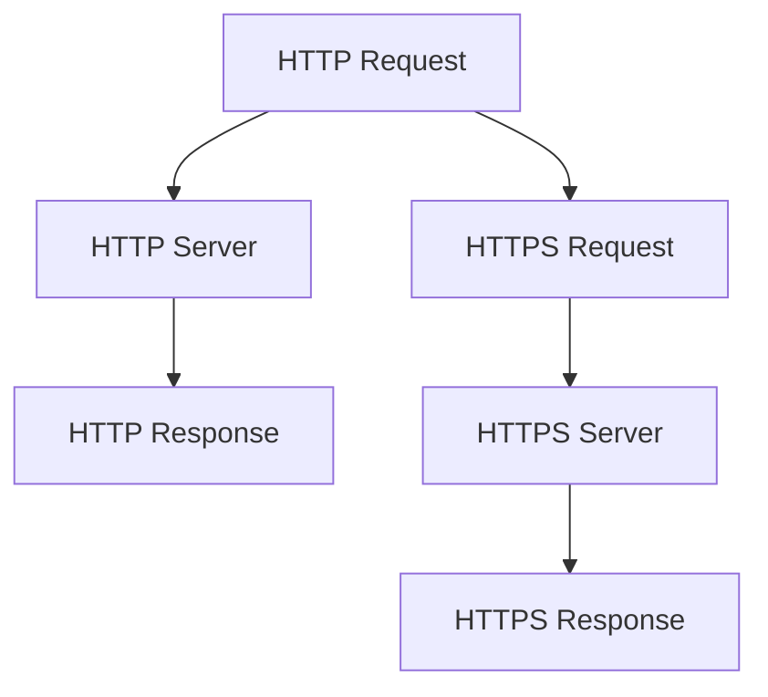
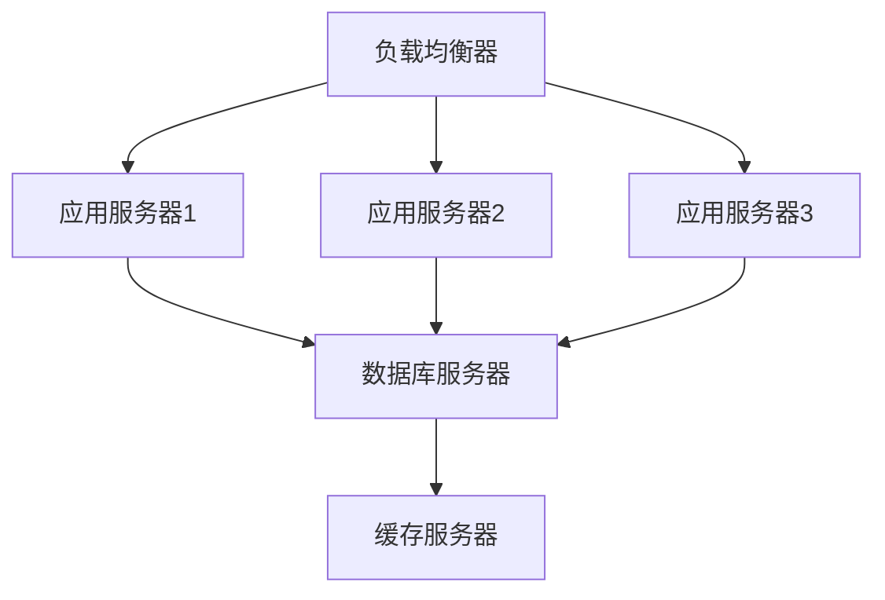
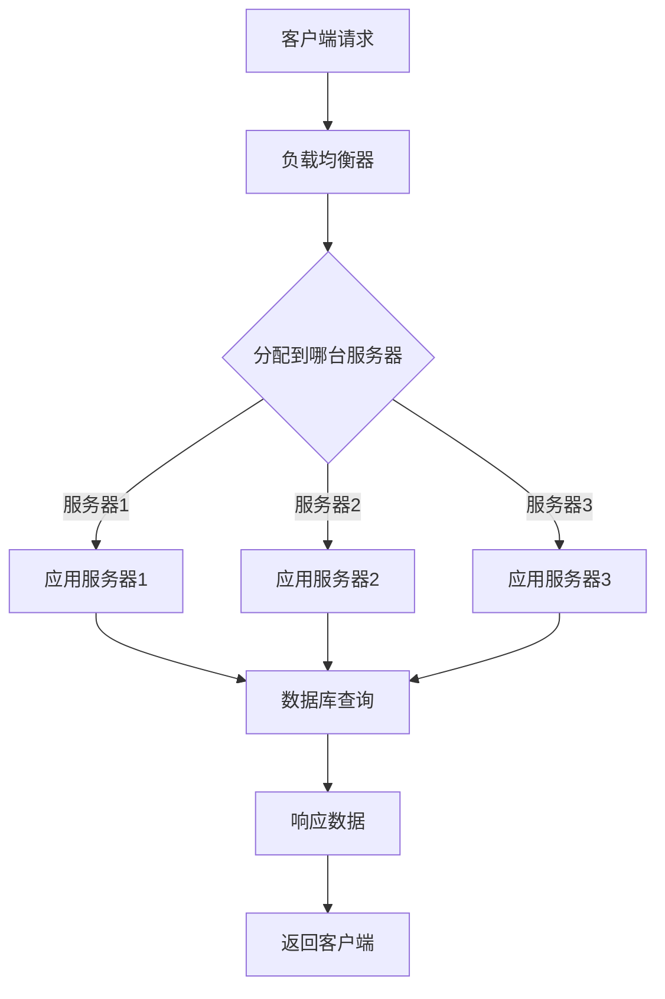
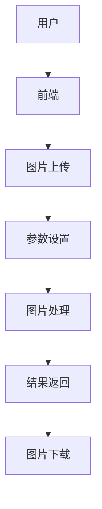
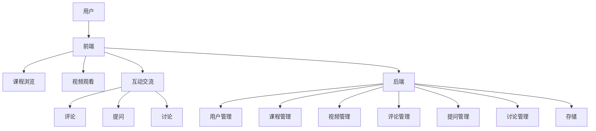

                 

### 高性能网络编程：构建高并发服务器的技巧

#### 关键词：高性能网络编程、高并发服务器、网络模型、IO模型、性能优化

> 摘要：本文将从高性能网络编程的概述、网络模型与协议、核心编程技术、网络性能优化策略、高并发服务器设计、具体实战案例等多个角度，深入探讨如何构建高并发服务器。通过系统的分析和实践，本文旨在为开发者提供一套完整的高性能网络编程指南。

---

### 目录大纲

#### 第一部分：高性能网络编程基础

- **第1章：高性能网络编程概述**
  - **1.1 高性能网络编程的重要性**
  - **1.2 高性能网络编程的核心要素**
  - **1.3 高性能网络编程的基本原则

- **第2章：网络模型与协议**
  - **2.1 网络模型的演进**
  - **2.2 TCP/IP协议族**
  - **2.3 常见网络协议分析

- **第3章：高性能网络编程核心技术**
  - **3.1 非阻塞IO编程**
  - **3.2 事件驱动编程**
  - **3.3 线程模型与并发处理

- **第4章：网络性能优化策略**
  - **4.1 网络延迟优化**
  - **4.2 网络吞吐量优化**
  - **4.3 网络安全性优化

#### 第二部分：高并发服务器构建

- **第5章：高并发服务器设计原则**
  - **5.1 高并发服务器的需求分析**
  - **5.2 高并发服务器的架构设计**
  - **5.3 高并发服务器的性能评估

- **第6章：Nginx实战**
  - **6.1 Nginx基本配置**
  - **6.2 Nginx负载均衡策略**
  - **6.3 Nginx性能调优技巧

- **第7章：Tornado框架应用**
  - **7.1 Tornado框架简介**
  - **7.2 Tornado异步编程模型**
  - **7.3 Tornado应用实例分析

- **第8章：性能测试与调优**
  - **8.1 性能测试工具介绍**
  - **8.2 性能瓶颈分析**
  - **8.3 性能调优实战

- **第9章：高并发服务器安全防护**
  - **9.1 高并发服务器的安全挑战**
  - **9.2 安全防护策略**
  - **9.3 常见攻击手段与防护措施

#### 第三部分：案例分析

- **第10章：案例一：构建高并发图片处理服务**
  - **10.1 项目背景**
  - **10.2 技术选型**
  - **10.3 架构设计**
  - **10.4 实现与优化

- **第11章：案例二：实现高并发在线教育平台**
  - **11.1 项目背景**
  - **11.2 技术选型**
  - **11.3 架构设计**
  - **11.4 实现与优化

- **第12章：案例分析总结与展望**
  - **12.1 经验与教训**
  - **12.2 未来发展趋势**
  - **12.3 拓展阅读**

---

### 第1章：高性能网络编程概述

#### 1.1 高性能网络编程的重要性

在现代互联网应用中，高性能网络编程扮演着至关重要的角色。随着互联网业务的不断发展，尤其是在大数据和云计算的背景下，网络编程的性能直接影响到用户体验和业务的成功。高性能网络编程不仅仅是提高系统响应速度的问题，更关乎到系统的稳定性、扩展性和安全性。

**问题背景**：许多互联网公司，特别是那些提供在线服务的企业，常常面临高并发访问的挑战。例如，电商平台在“双11”大促销期间，可能会瞬间产生数百万的并发请求。这时候，如果网络编程的性能不佳，服务器可能会因为处理请求不及时而崩溃，导致用户无法访问，甚至损失大量订单。

**问题描述**：如何通过高性能网络编程技术，构建稳定高效的网络服务，以应对高并发访问场景？

**问题解决**：通过优化网络通信协议、使用高效的网络编程模型和策略，可以提高网络编程的性能。

**边界与外延**：高性能网络编程不仅涉及客户端和服务器之间的通信，还包括网络设备、中间件、数据库等各个层次的性能优化。

**核心要素组成**：

1. **网络模型**：如TCP/IP模型，了解不同网络模型的工作原理对于优化网络编程至关重要。
2. **IO模型**：包括阻塞IO、非阻塞IO、IO多路复用等技术。
3. **并发处理**：通过多线程、异步编程等手段提高系统的并发处理能力。
4. **性能优化**：如减少网络延迟、提高吞吐量、优化安全性等。

#### 1.2 高性能网络编程的核心要素

高性能网络编程的核心要素包括网络模型、协议、IO模型和并发处理技术等。

**网络模型**：网络模型是计算机网络的基础框架，常见的有OSI七层模型和TCP/IP四层模型。不同的网络模型决定了网络通信的方式和协议的层次结构。

**协议**：网络协议是计算机网络中进行数据交换的规则，常见的网络协议有TCP、UDP、HTTP、HTTPS等。了解这些协议的工作原理和特性对于构建高性能的网络应用非常重要。

**IO模型**：IO模型是指程序在处理IO操作时的模型，常见的有阻塞IO、非阻塞IO和IO多路复用。非阻塞IO和IO多路复用技术可以提高IO操作的效率，适用于高并发场景。

**并发处理**：并发处理是指同时处理多个请求的能力。通过多线程、异步编程等技术，可以提升系统的并发处理能力，从而提高网络编程的性能。

#### 1.3 高性能网络编程的基本原则

在编写高性能的网络程序时，需要遵循以下基本原则：

1. **最小化上下文切换**：上下文切换是操作系统中一个耗时的过程，通过减少上下文切换可以提高程序的执行效率。
2. **减少锁竞争**：在多线程环境中，锁是常见的同步机制，但过多的锁竞争会导致系统性能下降，因此需要合理设计锁的使用。
3. **优化缓冲区处理**：缓冲区是网络编程中用于暂存数据的重要结构，合理的缓冲区处理可以提高数据的传输效率。
4. **充分利用网络协议的优势**：不同的网络协议有不同的优势和应用场景，了解并充分利用这些优势可以提高网络编程的性能。

### 第2章：网络模型与协议

#### 2.1 网络模型的演进

网络模型的演进是计算机网络技术发展的重要历程。最早的电路交换模型是基于电话网络的设计，其缺点是通信线路的利用率低，不适用于数据通信。随着计算机技术的发展，分组交换模型逐渐取代了电路交换模型，其优点是提高了通信线路的利用率，但仍然存在一定的延迟问题。

OSI七层模型是国际标准化组织（ISO）提出的一种网络体系结构，将网络通信过程分为物理层、数据链路层、网络层、传输层、会话层、表示层和应用层。TCP/IP模型则是一种更为实用的网络模型，通常被用于互联网的设计。TCP/IP模型将OSI七层模型中的部分层次合并，简化了网络协议的复杂性，但其层次结构并不完全对应OSI模型。

**ER实体关系图架构**：

```mermaid
erDiagram
    NetworkProtocol ||--|| NetworkModel : implements
    NetworkProtocol {
        +string protocol_name
        +int protocol_version
        +bool is_secure
    }
    NetworkModel {
        +string model_name
        +int model_version
        +bool is_adopted
    }
```

#### 2.2 TCP/IP协议族

TCP/IP协议族是互联网的核心协议族，包括TCP、UDP、ICMP等多种协议。TCP（传输控制协议）是一种面向连接的、可靠的、基于字节流的传输层通信协议，主要用于传输大量数据。UDP（用户数据报协议）是一种无连接的、不可靠的、基于数据报的传输层通信协议，适用于实时应用。ICMP（互联网控制消息协议）主要用于网络诊断和错误报告。

**算法原理讲解**：

TCP协议的算法原理主要包括三次握手和四次挥手。三次握手用于建立连接，四次挥手用于终止连接。以下是三次握手的流程：

```python
def three_way_handshake(source, destination):
    # 发送SYN包
    source.send("SYN")
    
    # 接收SYN+ACK包
    ack_packet = destination.recv()
    if ack_packet["type"] == "SYN" and ack_packet["ack"] == source.port:
        # 发送ACK包
        source.send("ACK")
        
        # 建立连接
        return True
    
    return False
```

#### 2.3 常见网络协议分析

除了TCP/IP协议族，还有许多常见的网络协议，如HTTP、HTTPS、FTP等。

**HTTP（超文本传输协议）**：HTTP是互联网上应用最广泛的协议，用于传输网页和其他超文本数据。HTTP是基于TCP协议的，使用HTTP协议的客户端可以通过发送HTTP请求来获取服务器上的资源。

**HTTPS（安全超文本传输协议）**：HTTPS是在HTTP基础上加入了SSL/TLS加密层的安全协议，主要用于保护传输过程中的数据安全。

**FTP（文件传输协议）**：FTP用于在计算机之间传输文件，是一种基于TCP协议的协议。FTP使用两个TCP连接：一个用于控制信息，另一个用于数据传输。

**Mermaid流程图**：



### 第3章：高性能网络编程核心技术

#### 3.1 非阻塞IO编程

非阻塞IO编程是一种提高IO性能的技术，它允许程序在等待IO操作完成时执行其他任务，从而提高系统的并发能力。在非阻塞IO编程中，程序通过调用特定的系统调用（如select、poll、epoll等），获取IO操作的完成状态，并在IO操作完成后进行相应的处理。

**算法原理讲解**：

非阻塞IO编程的关键在于如何有效地处理IO操作。以下是一个使用epoll实现非阻塞IO编程的简单示例：

```python
import socket
import select

def start_server(address):
    server_socket = socket.socket(socket.AF_INET, socket.SOCK_STREAM)
    server_socket.bind(address)
    server_socket.listen(5)
    server_socket.setblocking(0)
    
    epoller = select.epoll()
    epoller.register(server_socket.fileno(), select.EPOLLIN)
    
    connections = {}
    
    while True:
        events = epoller.poll()
        
        for fd, event in events:
            if fd == server_socket.fileno():
                client_socket, client_address = server_socket.accept()
                client_socket.setblocking(0)
                epoller.register(client_socket.fileno(), select.EPOLLIN, data=client_address)
            else:
                client_address = connections[fd]
                if event & select.EPOLLIN:
                    data = client_socket.recv(1024)
                    if not data:
                        epoller.unregister(fd)
                        client_socket.close()
                        del connections[fd]
                    else:
                        # 处理数据
                        process_data(data, client_address)
                elif event & select.EPOLLHUP:
                    # 处理连接断开
                    handle_disconnect(fd, client_address)
```

#### 3.2 事件驱动编程

事件驱动编程是一种以事件为中心的编程范式，它将程序的控制权交给事件循环。事件循环负责监听和处理各种事件，如用户输入、IO完成、定时器等。在事件驱动编程中，程序的主要任务是响应该事件，而不是主动执行任务。

**算法原理讲解**：

事件驱动编程的关键在于事件循环和事件处理。以下是一个使用Tornado框架实现事件驱动编程的简单示例：

```python
from tornado.ioloop import IOLoop
from tornado.web import Application, RequestHandler

class MainHandler(RequestHandler):
    def get(self):
        self.write("Hello, world")

def main():
    app = Application([
        (r"/", MainHandler),
    ])
    app.listen(8888)
    IOLoop.current().start()

if __name__ == "__main__":
    main()
```

#### 3.3 线程模型与并发处理

线程模型是并发处理的基础，它决定了程序如何同时处理多个任务。常见的线程模型包括进程间并发、线程池并发和异步并发。

**算法原理讲解**：

线程池并发是一种常用的并发处理技术，它通过预先创建一定数量的线程，并维护一个线程队列，来处理并发任务。以下是一个使用Python的`concurrent.futures`模块实现线程池并发的示例：

```python
from concurrent.futures import ThreadPoolExecutor

def fetch_url(url):
    # 访问URL并返回结果
    return requests.get(url).text

urls = ["https://example.com", "https://example.org", "https://example.net"]

with ThreadPoolExecutor(max_workers=5) as executor:
    results = list(executor.map(fetch_url, urls))
```

### 第4章：网络性能优化策略

#### 4.1 网络延迟优化

网络延迟是影响网络性能的一个重要因素，它包括传输延迟、处理延迟和队列延迟等。优化网络延迟可以显著提高系统的响应速度。

**优化策略**：

1. **减少传输延迟**：选择离用户更近的服务器和内容分发网络（CDN），使用更快的网络传输协议（如HTTP/2）。
2. **减少处理延迟**：优化服务器处理流程，减少不必要的计算和数据库查询。
3. **减少队列延迟**：提高网络设备的处理能力，减少网络拥塞。

#### 4.2 网络吞吐量优化

网络吞吐量是衡量网络性能的重要指标，它表示网络每秒可以传输的数据量。优化网络吞吐量可以提高系统的数据传输效率。

**优化策略**：

1. **优化网络设备**：升级网络设备，提高其处理能力和带宽。
2. **优化传输协议**：使用更高效的传输协议（如HTTP/2），减少数据传输的冗余。
3. **优化负载均衡**：合理分配网络负载，避免单点瓶颈。

#### 4.3 网络安全性优化

网络安全性是保障网络性能的重要一环，它关系到系统的稳定性和数据的安全。

**优化策略**：

1. **数据加密**：使用SSL/TLS协议对数据进行加密，防止数据被窃取。
2. **防火墙和入侵检测**：部署防火墙和入侵检测系统，防止恶意攻击。
3. **安全审计**：定期进行安全审计，发现并修复安全漏洞。

### 第5章：高并发服务器设计原则

#### 5.1 高并发服务器的需求分析

高并发服务器的需求分析是构建高效服务器的前提。主要需求包括：

1. **高并发处理能力**：服务器需要能够同时处理大量请求，保持系统稳定。
2. **高可用性**：服务器需要能够应对故障，快速恢复，确保服务不中断。
3. **高性能**：服务器需要能够快速响应请求，提供优质用户体验。
4. **可扩展性**：服务器需要能够根据业务需求进行水平或垂直扩展。

#### 5.2 高并发服务器的架构设计

高并发服务器的架构设计是关键，它决定了服务器的性能和可靠性。

**系统功能设计**：

- **负载均衡器**：用于分配请求到不同的服务器。
- **应用服务器**：处理具体的业务逻辑。
- **数据库服务器**：存储业务数据。
- **缓存服务器**：提高数据访问速度。

**系统架构设计**：



**系统接口设计和系统交互**：



### 第6章：Nginx实战

#### 6.1 Nginx基本配置

Nginx是一款高性能的Web服务器和反向代理服务器，它广泛应用于高并发场景。Nginx的基本配置包括设置监听端口、定义虚拟主机、配置负载均衡等。

**环境安装**：

1. 安装依赖库：`yum install -y pcre pcre-devel openssl openssl-devel`
2. 安装Nginx：`yum install -y nginx`

**基本配置**：

- 配置文件路径：`/etc/nginx/nginx.conf`
- 主配置：
  ```nginx
  user nginx;
  worker_processes  1;
  
  events {
      worker_connections  10240;
  }
  
  http {
      server {
          listen       80;
          server_name  localhost;
          
          location / {
              root   /usr/share/nginx/html;
              index  index.html index.htm;
          }
      }
  }
  ```

#### 6.2 Nginx负载均衡策略

Nginx的负载均衡策略可以根据不同的需求进行配置，常见的负载均衡策略包括轮询、权重、最小连接数等。

**配置示例**：

- 轮询：
  ```nginx
  http {
      upstream myapp {
          server app1.example.com;
          server app2.example.com;
          server app3.example.com;
      }
      
      server {
          listen       80;
          server_name  localhost;
          
          location / {
              proxy_pass http://myapp;
          }
      }
  }
  ```

- 权重：
  ```nginx
  http {
      upstream myapp {
          server app1.example.com weight=3;
          server app2.example.com weight=2;
          server app3.example.com weight=1;
      }
      
      server {
          listen       80;
          server_name  localhost;
          
          location / {
              proxy_pass http://myapp;
          }
      }
  }
  ```

#### 6.3 Nginx性能调优技巧

Nginx的性能调优是提高其处理能力的重要手段。以下是一些性能调优技巧：

- **优化工作进程数**：根据服务器CPU核数调整`worker_processes`，避免过多进程消耗资源。
- **调整连接超时**：合理设置`client_max_body_size`、`client_body_timeout`等参数，避免请求超时。
- **启用压缩**：开启HTTP压缩，减少传输数据量。
- **缓存优化**：使用缓存模块，提高数据访问速度。

```nginx
http {
    gzip on;
    gzip_types text/plain application/json application/javascript text/css text/xml application/xml application/xml+rss text/html;
}
```

### 第7章：Tornado框架应用

Tornado是一款基于Python的高性能Web服务器和Web框架，它支持异步编程，适用于高并发场景。

#### 7.1 Tornado框架简介

Tornado是一款异步Web框架，它具有以下特点：

- **异步I/O**：Tornado使用非阻塞I/O，可以同时处理大量连接。
- **Web服务器**：Tornado内置了非阻塞Web服务器，支持WebSocket等特性。
- **易于扩展**：Tornado提供了丰富的扩展接口，方便开发者进行定制化开发。

#### 7.2 Tornado异步编程模型

Tornado的异步编程模型基于`gen`函数，它允许开发者编写异步代码，提高程序的性能。

**异步函数示例**：

```python
from tornado.gen import spawn

@tornado.gen.coroutine
def fetch_url(url):
    response = yield tornado.httpclient.HTTPClient().fetch(url)
    yield tornado.gen.sleep(1)
    return response.body

@tornado.web.asynchronous
class MainHandler(tornado.web.RequestHandler):
    def get(self):
        self.write("Hello, world")
        
        # 调用异步函数
        future = spawn(fetch_url, "https://example.com")
        future.add_done_callback(self.on_fetch_done)

    def on_fetch_done(self, future):
        if future.exception():
            # 处理异常
            self.write("Error: " + str(future.exception()))
        else:
            # 处理结果
            self.write("Fetched: " + future.result())
        self.finish()
```

#### 7.3 Tornado应用实例分析

以下是一个简单的Tornado应用实例，演示了如何处理HTTP请求、异步I/O和WebSocket连接。

**应用实例**：

```python
import tornado.ioloop
import tornado.web

class MainHandler(tornado.web.RequestHandler):
    def get(self):
        self.write("Hello, world")

class EchoHandler(tornado.web.RequestHandler):
    def post(self):
        self.set_header("Content-Type", "text/plain")
        self.write(self.request.body)

def make_app():
    return tornado.web.Application([
        (r"/", MainHandler),
        (r"/echo", EchoHandler),
    ])

if __name__ == "__main__":
    app = make_app()
    app.listen(8888)
    tornado.ioloop.IOLoop.current().start()
```

### 第8章：性能测试与调优

#### 8.1 性能测试工具介绍

性能测试是评估系统性能的重要手段，以下介绍几种常用的性能测试工具：

- **Apache JMeter**：一款开源的性能测试工具，支持HTTP、HTTPS、SOAP等多种协议。
- **Gatling**：一款基于Scala的性能测试工具，适用于Web应用和REST API测试。
- **LoadRunner**：一款商业性能测试工具，支持多种协议和场景的测试。

#### 8.2 性能瓶颈分析

性能瓶颈分析是性能调优的关键，以下几种常见性能瓶颈：

- **CPU瓶颈**：CPU利用率过高，导致处理请求的速度变慢。
- **内存瓶颈**：内存占用过高，导致系统出现内存泄漏或内存溢出。
- **网络瓶颈**：网络带宽不足，导致数据传输速度变慢。
- **磁盘I/O瓶颈**：磁盘读写速度慢，导致数据处理速度变慢。

#### 8.3 性能调优实战

性能调优实战包括以下步骤：

1. **确定瓶颈**：使用性能测试工具分析系统性能，确定瓶颈。
2. **优化代码**：针对瓶颈进行代码优化，如减少计算复杂度、优化数据库查询等。
3. **调整配置**：优化服务器和应用程序的配置，如调整线程数、连接数等。
4. **垂直扩展**：增加硬件资源，如增加CPU、内存、磁盘等。
5. **水平扩展**：增加服务器节点，如使用负载均衡器分配请求。

### 第9章：高并发服务器安全防护

#### 9.1 高并发服务器的安全挑战

高并发服务器面临以下安全挑战：

- **DDoS攻击**：分布式拒绝服务攻击，可能导致服务器资源耗尽。
- **SQL注入**：恶意用户通过输入恶意SQL语句，获取敏感数据。
- **XSS攻击**：跨站脚本攻击，可能导致用户数据泄露。
- **CSRF攻击**：跨站请求伪造，可能导致用户执行恶意操作。

#### 9.2 安全防护策略

以下是一些常见的安全防护策略：

- **防火墙**：阻止非法访问，过滤恶意请求。
- **入侵检测系统（IDS）**：实时监测网络流量，检测和阻止攻击。
- **加密传输**：使用HTTPS协议，保护数据传输安全。
- **输入验证**：对用户输入进行验证，防止SQL注入和XSS攻击。
- **安全编码**：遵循安全编码规范，防止CSRF攻击。

#### 9.3 常见攻击手段与防护措施

- **DDoS攻击**：防护措施包括增加带宽、使用DDoS防护服务、部署防火墙和入侵检测系统。
- **SQL注入**：防护措施包括使用预编译SQL语句、对用户输入进行验证和转义。
- **XSS攻击**：防护措施包括对输出进行编码、使用内容安全策略（CSP）。
- **CSRF攻击**：防护措施包括使用CSRF令牌、验证Referer头。

### 第10章：案例一：构建高并发图片处理服务

#### 10.1 项目背景

随着互联网的快速发展，越来越多的应用需要处理大量图片数据。例如，社交媒体应用需要对上传的图片进行压缩、缩放和滤镜处理，以便快速展示给用户。为了满足高并发、高性能的要求，需要构建一个高并发图片处理服务。

#### 10.2 技术选型

为了构建高性能的图片处理服务，需要选择合适的编程语言、框架和中间件。

- **编程语言**：Python，因其丰富的库和强大的社区支持。
- **框架**：Tornado，因其支持异步编程，适合高并发场景。
- **中间件**：Nginx，作为反向代理和负载均衡器，提高系统性能。
- **图片处理库**：Pillow，提供丰富的图片处理功能。

#### 10.3 架构设计

高并发图片处理服务的架构设计包括前端、后端和存储三部分。

- **前端**：用户通过Web界面上传图片，并设置处理参数。
- **后端**：接收前端请求，处理图片数据，并将结果返回前端。
- **存储**：存储原始图片和处理后的图片，以便后续使用。

**系统功能设计**：

- **图片上传**：用户上传图片，系统验证图片格式和大小。
- **图片处理**：根据用户设置的参数，对图片进行压缩、缩放和滤镜处理。
- **图片下载**：用户下载处理后的图片。

**系统架构设计**：



#### 10.4 实现与优化

**环境安装**：

1. 安装Python环境：`pip install tornado pillow`
2. 安装Nginx：`yum install -y nginx`

**前端实现**：

```html
<!DOCTYPE html>
<html>
<head>
    <title>图片处理服务</title>
</head>
<body>
    <form action="/upload" method="post" enctype="multipart/form-data">
        <input type="file" name="file" accept="image/*">
        <input type="submit" value="上传">
    </form>
</body>
</html>
```

**后端实现**：

```python
import tornado.ioloop
import tornado.web
from PIL import Image
import io

class MainHandler(tornado.web.RequestHandler):
    def post(self):
        image_file = self.request.files['file'][0]
        image = Image.open(io.BytesIO(image_file.body))
        
        # 处理图片
        image = image.resize((800, 600))
        output_stream = io.BytesIO()
        image.save(output_stream, format='JPEG')
        
        # 返回结果
        self.set_header('Content-Type', 'image/jpeg')
        self.write(output_stream.getvalue())
        self.finish()

def make_app():
    return tornado.web.Application([
        (r"/", MainHandler),
    ])

if __name__ == "__main__":
    app = make_app()
    app.listen(8888)
    tornado.ioloop.IOLoop.current().start()
```

**性能优化**：

1. **使用异步处理**：使用Tornado的异步处理，提高并发处理能力。
2. **使用缓存**：使用Redis缓存处理结果，减少重复处理。
3. **使用负载均衡**：使用Nginx进行负载均衡，提高系统稳定性。
4. **使用压缩**：使用HTTP压缩，减少数据传输量。

### 第11章：案例二：实现高并发在线教育平台

#### 11.1 项目背景

随着在线教育的兴起，越来越多的用户需要访问在线教育平台，进行课程学习、视频观看和互动交流。为了满足高并发、高性能的要求，需要构建一个高并发在线教育平台。

#### 11.2 技术选型

为了构建高性能的在线教育平台，需要选择合适的编程语言、框架和中间件。

- **编程语言**：Java，因其成熟稳定、开发效率高。
- **框架**：Spring Boot，因其简化开发、易于扩展。
- **中间件**：Nginx，作为反向代理和负载均衡器。
- **数据库**：MySQL，作为关系型数据库，支持高并发读写。
- **缓存**：Redis，作为内存数据库，提高数据访问速度。

#### 11.3 架构设计

高并发在线教育平台的架构设计包括前端、后端和存储三部分。

- **前端**：用户通过Web浏览器访问平台，进行课程浏览、视频观看和互动交流。
- **后端**：接收前端请求，处理业务逻辑，并将结果返回前端。
- **存储**：存储用户数据、课程数据和视频数据。

**系统功能设计**：

- **课程浏览**：用户可以浏览和选择感兴趣的课程。
- **视频观看**：用户可以在线观看视频课程。
- **互动交流**：用户可以进行评论、提问和讨论。

**系统架构设计**：



#### 11.4 实现与优化

**前端实现**：

```html
<!DOCTYPE html>
<html>
<head>
    <title>在线教育平台</title>
</head>
<body>
    <h1>课程列表</h1>
    <ul>
        
            <li><a href="/video/{{ course.id }}">{{ course.name }}</a></li>
        
    </ul>
    <h1>视频播放</h1>
    <video width="320" height="240" controls>
        <source src="/video/{{ video.id }}" type="video/mp4">
        您的浏览器不支持视频标签。
    </video>
    <h1>评论</h1>
    <ul>
        
            <li>{{ comment.content }}</li>
        
    </ul>
    <form action="/comment" method="post">
        <input type="text" name="content" placeholder="输入评论">
        <input type="submit" value="提交">
    </form>
</body>
</html>
```

**后端实现**：

```java
@RestController
@RequestMapping("/api")
public class VideoController {
    @Autowired
    private VideoService videoService;

    @GetMapping("/video/{id}")
    public Video getVideo(@PathVariable Long id) {
        return videoService.getVideoById(id);
    }

    @PostMapping("/comment")
    public ResponseEntity<Comment> createComment(@RequestBody Comment comment) {
        commentService.createComment(comment);
        return ResponseEntity.ok().body(comment);
    }
}
```

**性能优化**：

1. **使用缓存**：使用Redis缓存课程数据、视频数据和评论数据，减少数据库访问。
2. **使用负载均衡**：使用Nginx进行负载均衡，提高系统稳定性。
3. **数据库优化**：使用索引、分库分表等策略，提高数据库性能。
4. **代码优化**：优化SQL查询、减少不必要的计算，提高代码性能。

### 第12章：案例分析总结与展望

#### 12.1 经验与教训

通过案例一和案例二的实践，我们可以总结出以下经验和教训：

- **技术选型**：选择合适的编程语言、框架和中间件对于构建高性能服务器至关重要。
- **异步处理**：异步处理可以提高系统并发能力，减少等待时间，提高系统性能。
- **缓存策略**：合理使用缓存可以显著提高数据访问速度，减少数据库压力。
- **负载均衡**：负载均衡可以提高系统稳定性，避免单点故障，提高系统性能。
- **性能优化**：持续进行性能优化，及时解决性能瓶颈，保持系统的高性能。

#### 12.2 未来发展趋势

未来，高性能网络编程和高并发服务器构建将继续朝着以下几个方向发展：

- **云计算与分布式计算**：云计算和分布式计算技术的发展将进一步提高系统的可扩展性和可靠性。
- **边缘计算**：边缘计算将数据和处理能力带到网络边缘，减少数据传输延迟，提高系统性能。
- **容器化与微服务**：容器化和微服务架构将进一步提高系统的部署和管理效率，提高系统的可扩展性和可靠性。
- **AI与机器学习**：AI和机器学习技术将在网络编程和服务器构建中发挥重要作用，提高系统的智能和自适应能力。

#### 12.3 拓展阅读

- 《高性能MySQL》：探讨MySQL数据库的性能优化和调优策略。
- 《大规模分布式存储系统》：介绍分布式存储系统的设计和实现。
- 《网络是怎样连接的》：详细解释网络协议和通信原理。
- 《深入理解计算机系统》：深入探讨计算机系统的组成和运行原理。

### 作者

作者：AI天才研究院/AI Genius Institute & 禅与计算机程序设计艺术 /Zen And The Art of Computer Programming

