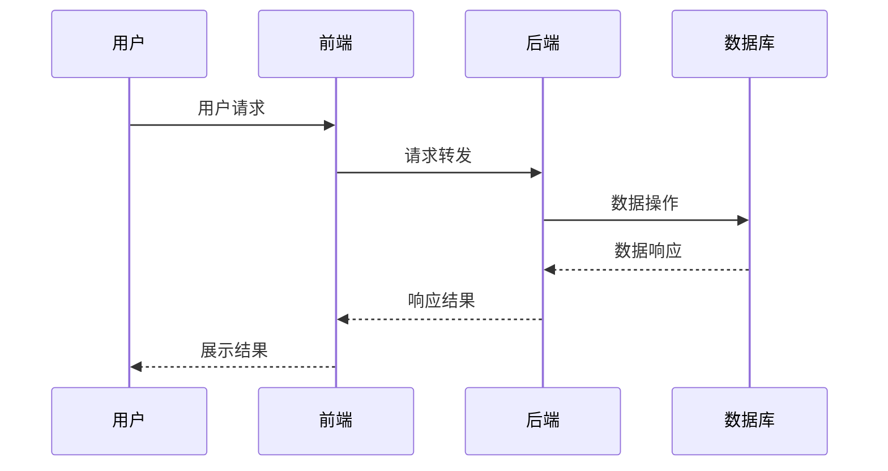
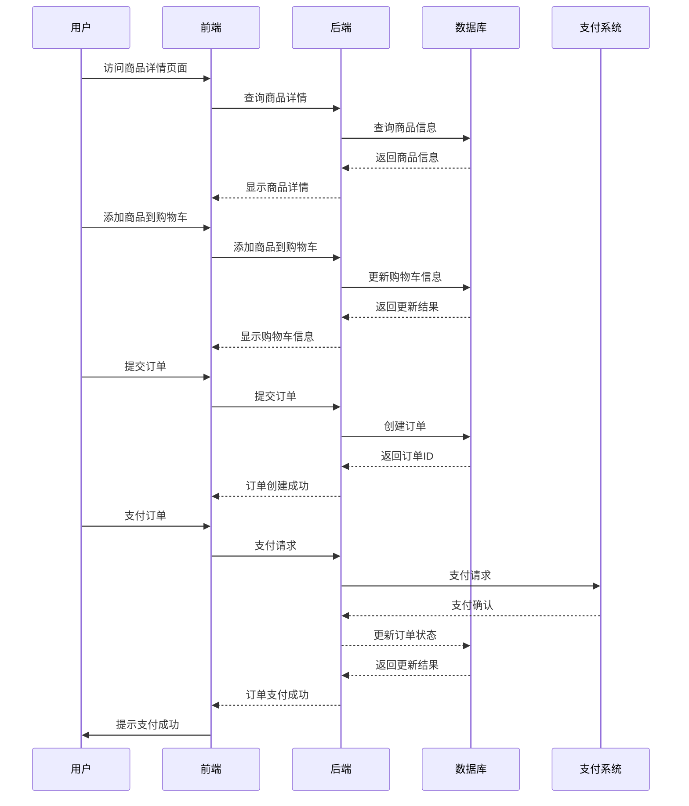

                 


## 第一部分：背景介绍

### 1. 高质量代码的重要性

在软件行业，代码质量直接关系到软件的稳定性、可维护性和开发效率。高质量代码不仅能够提高软件的性能，降低bug率，还能够减少后续维护的成本。随着软件项目的复杂度不断增加，高质量代码的重要性愈发凸显。

为了让大家更好地理解高质量代码的重要性，我们可以从以下几个方面进行阐述：

**性能方面**：高质量的代码能够优化程序的执行速度，减少不必要的资源占用，从而提升软件的整体性能。一个运行效率高的软件不仅能提高用户体验，还能在竞争激烈的市场中占据优势。

**稳定性方面**：高质量的代码意味着更少的bug和更稳定的运行状态。一个稳定的软件能够避免因代码问题导致的系统崩溃、数据丢失等问题，从而降低企业的运营风险。

**可维护性方面**：高质量的代码结构清晰、逻辑严密，便于理解和修改。这使得软件在后续的维护和升级过程中更加高效，降低了维护成本。

**团队协作方面**：高质量的代码能够促进团队协作，减少沟通成本。当团队成员都能读懂彼此的代码时，项目进度会变得更加顺利。

**商业价值方面**：高质量的代码有助于提升企业的品牌形象和市场竞争力。一个高质量的软件产品能够赢得客户的信任，从而带来更多的商业机会。

**法律风险方面**：高质量的代码能够降低软件侵权和知识产权纠纷的风险。在法律层面，良好的代码质量是保护企业利益的重要手段。

通过上述分析，我们可以看出，高质量代码对于软件行业的发展具有至关重要的意义。在接下来的内容中，我们将进一步探讨代码质量问题，并提出解决方案。

### 2. 问题背景

然而，在实际开发过程中，很多程序员面临的一个普遍问题是代码质量难以保障。这导致了一系列问题，如：项目延期、性能瓶颈、维护困难等。为了解决这些问题，需要建立一套系统的代码质量保障体系。

首先，我们来分析一下代码质量难以保障的原因：

**个人层面**：有些程序员编程经验不足，缺乏对代码质量的认识和重视。他们可能更关注完成任务，而忽视了代码的质量。

**团队层面**：团队协作不佳，缺乏有效的代码审查和测试机制。团队成员之间沟通不畅，导致代码质量难以保障。

**项目管理层面**：项目进度和质量的控制不够严格，导致代码质量难以保证。一些项目经理更关注项目进度，忽视了代码质量的提升。

**技术层面**：某些技术框架和工具不够成熟，导致代码质量问题难以发现和解决。

为了解决上述问题，需要从多个方面入手，建立一套系统的代码质量保障体系。以下是一些可能的解决方案：

**个人层面**：提高程序员的专业技能和编程素养，加强代码规范和测试的培训。

**团队层面**：建立有效的代码审查和测试机制，鼓励团队成员之间的沟通和协作。

**项目管理层面**：加强项目管理和质量控制，确保项目进度和代码质量的同步提升。

**技术层面**：选用成熟的技术框架和工具，提高代码质量和开发效率。

通过上述措施，我们可以逐步解决代码质量难以保障的问题，为软件行业的健康发展奠定基础。

### 3. 问题描述

在软件开发过程中，代码质量问题可能导致一系列问题，主要包括以下几个方面：

**性能问题**：代码运行效率低下，导致软件响应速度慢，用户体验不佳。这可能是由于算法选择不当、代码结构混乱、资源浪费等原因造成的。

**可维护性问题**：代码结构混乱，难以理解和修改，增加了维护成本。这可能是由于代码风格不统一、缺乏注释、过度耦合等原因导致的。

**可靠性问题**：代码中存在潜在的错误和漏洞，影响软件的稳定性。这可能是由于代码审查不足、测试不充分、忽略边界条件等原因引起的。

**一致性问题**：不同模块之间的代码风格不统一，导致集成困难。这可能是由于团队成员没有遵循统一的代码规范、各自为政等原因造成的。

为了更好地理解这些问题，我们可以通过以下几个具体的实例进行说明：

**性能问题实例**：假设一个电商网站的商品搜索功能，由于算法优化不足，导致搜索速度极慢，用户在搜索过程中经常遇到等待时间过长的情况，影响用户体验。

**可维护性问题实例**：在一个大型项目中，由于代码结构混乱，一个简单的功能修改需要修改多个模块，增加了维护的复杂度和成本。

**可靠性问题实例**：一个金融软件在处理交易时，由于边界条件考虑不足，导致在极端情况下出现数据丢失或交易失败的问题。

**一致性问题实例**：在一个团队开发的项目中，由于团队成员没有统一代码风格，导致代码风格不一致，影响代码的可读性和维护性。

通过上述实例，我们可以看出，代码质量问题对软件项目的各个方面都会产生不利影响。因此，解决代码质量问题至关重要。

### 4. 问题解决

解决代码质量问题需要从多个方面入手，包括代码规范、代码审查、测试和持续集成等。下面我们将逐一介绍这些方面的具体措施。

#### 4.1 代码规范

代码规范是保证代码质量的基础。一个良好的代码规范能够提高代码的可读性、一致性和可维护性。以下是几个常见的代码规范：

**命名规范**：变量的命名应具有描述性，避免使用缩写和不明确的命名。函数和类的命名也应遵循类似的原则。

**缩进与空白**：使用一致的缩进和空白，确保代码的结构清晰。常见的缩进方式包括两个空格、四个空格等。

**注释**：合理地添加注释，帮助他人理解代码。注释应包括功能的描述、参数的含义、算法的选择等。

**代码格式**：遵循统一的代码格式，如括号风格、语句结束符等。

**代码分割**：将复杂的代码分割成多个函数或模块，提高代码的可读性。

**API设计**：设计清晰、简洁的API，提高代码的易用性。

#### 4.2 代码审查

代码审查是发现代码质量问题的重要手段。通过代码审查，可以及时发现和修复代码中的错误和潜在问题。以下是几个常见的代码审查方法：

**同行评审**：邀请团队成员对代码进行审查，提出修改意见。这种方法可以促进团队成员之间的交流和学习。

**静态代码分析**：使用静态代码分析工具，自动检查代码中的问题。常见的静态代码分析工具包括SonarQube、Checkstyle等。

**动态代码分析**：在代码运行过程中，观察其行为和性能。这种方法可以通过单元测试、集成测试等实现。

**代码覆盖率**：评估代码的测试覆盖率，确保代码的每个部分都得到充分的测试。

#### 4.3 测试

测试是保证代码质量的重要环节。通过测试，可以验证代码的功能和性能是否符合预期。以下是几个常见的测试方法：

**单元测试**：对代码的每个模块进行测试，确保其功能正确。常见的单元测试框架包括JUnit、NUnit等。

**集成测试**：对代码的不同模块进行集成测试，确保它们能够协同工作。常见的方法包括手动测试和自动化测试。

**性能测试**：评估代码的性能，确保其满足系统的性能要求。常见的方法包括压力测试、负载测试等。

**安全测试**：评估代码的安全性，确保其不会受到外部攻击。常见的方法包括渗透测试、安全扫描等。

**验收测试**：在软件交付前，对整个系统进行测试，确保其满足用户需求。

#### 4.4 持续集成

持续集成是一种软件开发实践，通过自动化构建、测试和部署代码，确保代码质量。以下是几个常见的持续集成工具：

**Jenkins**：开源的持续集成工具，支持多种语言和平台。

**Travis CI**：基于云的持续集成服务，支持GitHub、GitLab等。

**Circle CI**：基于容器的持续集成服务，支持多种编程语言。

**GitLab CI/CD**：GitLab内置的持续集成和持续部署工具。

通过代码规范、代码审查、测试和持续集成等手段，我们可以逐步提高代码质量，确保软件项目的成功。在下一部分，我们将进一步探讨如何建立系统的代码质量保障体系。

### 5. 边界与外延

高质量代码不仅仅局限于个人编程技能的提升，还涉及到团队协作、项目管理等多个方面。因此，在实现高质量代码的过程中，我们需要关注以下几个方面：

**团队协作**：良好的团队协作是高质量代码的基础。团队成员之间需要保持良好的沟通和协作，共同制定代码规范，确保代码的一致性和可维护性。

**项目管理**：项目管理是确保代码质量的重要环节。项目经理需要制定合理的项目计划，确保项目进度和质量的双重保障。同时，项目经理还需监督和推动代码质量的提升。

**代码规范**：代码规范是确保代码质量的基本保障。企业或团队需要制定一套适合自身发展的代码规范，并确保所有成员都遵循这些规范。

**技术选型**：技术选型是保证代码质量的关键。选择适合项目需求的技术框架和工具，可以提高开发效率和代码质量。

**持续改进**：代码质量是一个持续改进的过程。企业或团队需要定期回顾和总结代码质量的问题，不断优化和改进代码规范、审查流程、测试方法和持续集成工具。

通过上述措施，我们可以建立一个系统的代码质量保障体系，确保软件项目的成功。

### 6. 概念结构与核心要素组成

为了深入理解高质量代码的构建过程，我们需要从多个核心要素进行剖析。以下是高质量代码构建过程中的一些关键概念和核心要素：

#### 6.1 代码规范

**定义**：代码规范是一套用于指导编码的最佳实践，包括命名规则、代码格式、注释要求等。

**作用**：代码规范能够提高代码的可读性、一致性和可维护性，减少代码审查和调试的时间。

**核心要素**：
- **命名规则**：变量、函数、类的命名应具有描述性，避免使用缩写和不明确的命名。
- **代码格式**：使用一致的缩进和空白，保持代码结构的清晰。
- **注释**：合理地添加注释，包括功能描述、参数含义、算法选择等。

#### 6.2 代码审查

**定义**：代码审查是一种通过同行评审来提高代码质量的方法。

**作用**：代码审查能够帮助发现潜在的错误和改进点，提高代码的可读性和可维护性。

**核心要素**：
- **同行评审**：邀请团队成员对代码进行审查，提出修改意见。
- **静态代码分析**：使用静态代码分析工具，自动检查代码中的问题。
- **动态代码分析**：在代码运行过程中，观察其行为和性能。

#### 6.3 测试

**定义**：测试是通过验证代码的功能和性能来确保其质量的方法。

**作用**：测试能够确保代码的正确性和稳定性，减少bug的出现。

**核心要素**：
- **单元测试**：对代码的每个模块进行测试，确保其功能正确。
- **集成测试**：对代码的不同模块进行集成测试，确保它们能够协同工作。
- **性能测试**：评估代码的性能，确保其满足系统的性能要求。
- **安全测试**：评估代码的安全性，确保其不会受到外部攻击。

#### 6.4 持续集成

**定义**：持续集成是一种通过自动化构建、测试和部署代码的软件开发实践。

**作用**：持续集成能够确保代码质量，减少错误的出现，提高开发效率。

**核心要素**：
- **自动化构建**：使用自动化工具构建代码，确保构建过程高效、可靠。
- **自动化测试**：在构建过程中自动执行测试，确保代码质量。
- **部署**：自动化部署代码到生产环境，确保发布过程高效、稳定。

通过上述核心要素的有机结合，我们可以构建出一套系统的代码质量保障体系，确保软件项目的成功。

## 第二部分：核心概念与联系

在探讨高质量代码的过程中，我们需要深入了解几个核心概念，并理解它们之间的相互联系。以下是几个关键概念及其相互关系：

### 2.1 代码质量评估

**定义**：代码质量评估是对代码进行评价的过程，以确定其满足特定标准的程度。

**核心要素**：
- **可读性**：代码是否易于阅读和理解。
- **可靠性**：代码是否能够正确执行，无bug。
- **性能**：代码的执行效率。
- **可维护性**：代码是否易于修改和维护。

**相互联系**：可读性、可靠性和可维护性是衡量代码质量的重要指标。性能则是代码质量的一个方面，它直接影响用户体验和系统效率。

**对比表格**：

| 核心要素 | 描述 | 对比 |
| --- | --- | --- |
| **可读性** | 易于阅读和理解 | 代码风格统一、注释清晰 |
| **可靠性** | 正确执行，无bug | 单元测试、代码审查 |
| **性能** | 执行效率高 | 算法优化、代码优化 |
| **可维护性** | 易于修改和维护 | 代码结构清晰、模块化 |

**ER实体关系图**：

```mermaid
erDiagram
  CodeQuality -->|评价| Assessment
  Assessment ||--|包含| Readability
  Assessment ||--|包含| Reliability
  Assessment ||--|包含| Performance
  Assessment ||--|包含| Maintainability
```

### 2.2 代码风格与规范

**定义**：代码风格与规范是一套指导编码的最佳实践，用于确保代码的可读性、一致性和可维护性。

**核心要素**：
- **命名规范**：变量、函数和类的命名应具有描述性和一致性。
- **缩进与空白**：使用一致的缩进和空白，提高代码的可读性。
- **注释**：合理地添加注释，帮助他人理解代码。

**相互联系**：代码风格与规范是代码质量评估的重要组成部分。良好的代码风格可以提高代码的可读性和一致性，从而提高整体代码质量。

**对比表格**：

| 核心要素 | 描述 | 对比 |
| --- | --- | --- |
| **命名规范** | 描述性、一致性 | 避免缩写、明确命名 |
| **缩进与空白** | 一致性 | 保持结构清晰 |
| **注释** | 描述功能、参数等 | 有助于理解代码 |

**ER实体关系图**：

```mermaid
erDiagram
  CodingStyle -->|遵循| StyleRule
  StyleRule ||--|包含| NamingConvention
  StyleRule ||--|包含| Indentation
  StyleRule ||--|包含| Commenting
```

### 2.3 代码重构

**定义**：代码重构是在不改变代码外部行为的前提下，对代码进行内部结构调整的过程。

**核心要素**：
- **提取函数**：将重复代码提取为函数，提高代码复用性。
- **类重构**：优化类的设计，使其职责更明确。

**相互联系**：代码重构是提高代码质量的重要手段。通过重构，我们可以改善代码的可读性、可维护性和性能。

**对比表格**：

| 核心要素 | 描述 | 对比 |
| --- | --- | --- |
| **提取函数** | 提高复用性 | 避免重复代码 |
| **类重构** | 明确职责 | 提高模块化 |

**ER实体关系图**：

```mermaid
erDiagram
  CodeRefactoring -->|包含| FunctionExtraction
  CodeRefactoring -->|包含| ClassRefactoring
```

通过上述核心概念及其相互关系的分析，我们可以更好地理解高质量代码的构建过程。在接下来的部分，我们将深入探讨代码质量评估的具体方法和工具。

### 2.1.1 评估标准

代码质量评估是确保软件质量和提高开发效率的关键步骤。在评估代码质量时，我们通常关注以下几个核心标准：

**可读性**：可读性是代码质量的基础，它直接影响到代码的可维护性和可理解性。一个良好的代码应当具有以下特点：
- **清晰的变量和函数命名**：命名应具有描述性，能够清晰地传达变量的用途和函数的功能。
- **适当的注释**：注释应解释复杂逻辑、重要的算法决策和代码的目的。
- **简洁的代码结构**：避免冗长、复杂的代码块，尽量使代码简洁明了。

**可靠性**：可靠性是指代码在执行时能够正确无误地完成预期的功能。一个可靠的代码应当满足以下条件：
- **无错误**：代码应经过充分的测试，确保无逻辑错误、语法错误或运行时错误。
- **边界条件处理**：代码应考虑并正确处理各种边界条件和异常情况。
- **稳定的性能**：代码在预期的工作负载下应能够稳定运行，避免出现性能问题。

**性能**：性能是代码执行效率的衡量标准，它直接影响软件的响应速度和用户体验。一个高性能的代码应当满足以下要求：
- **高效算法**：选择合适的算法和数据结构，以减少计算时间和资源消耗。
- **优化资源使用**：合理使用内存、CPU等资源，避免不必要的资源浪费。
- **并行处理**：对于复杂任务，考虑使用并行处理技术，提高执行速度。

**可维护性**：可维护性是指代码在未来的维护和扩展过程中能够保持其可用性和可理解性。一个良好的代码应具备以下特点：
- **模块化设计**：将代码划分为独立的模块或函数，每个模块具有明确的职责。
- **灵活性和可扩展性**：代码应易于修改和扩展，以适应未来需求的变化。
- **一致的代码风格**：遵循统一的代码规范，确保代码风格的一致性，便于团队合作。

在评估代码质量时，我们通常采用以下几种方法：

**静态分析**：静态分析是一种无需运行代码即可进行分析的方法。通过静态分析，我们可以发现潜在的代码质量问题，如语法错误、潜在的性能瓶颈和代码风格问题。常见的静态分析工具包括SonarQube、PMD、Checkstyle等。

**动态分析**：动态分析是在代码运行时进行的分析。通过动态分析，我们可以观察代码的实际运行行为，如性能指标、错误日志等。动态分析可以帮助我们更好地了解代码的实际表现，从而针对性地进行优化。常见的动态分析工具包括Profiler、Log Analyzer等。

**自动化测试**：自动化测试是通过编写测试脚本自动执行测试用例来验证代码质量的方法。自动化测试能够提高测试的覆盖率，减少测试成本，并确保代码的稳定性。常见的自动化测试框架包括JUnit、NUnit、Selenium等。

通过上述评估标准和方法，我们可以全面地评估代码质量，并采取相应的措施进行改进，从而确保软件项目的成功。

### 2.1.2 评估方法

在代码质量评估过程中，采用合适的评估方法是确保代码质量的重要环节。以下是一些常见的评估方法及其具体应用：

**静态分析**

静态分析是一种不运行代码而通过分析源代码来检测潜在问题的方法。它能够在代码编写和提交之前就发现潜在的问题，从而提前进行修复。静态分析方法主要包括以下几类：

- **代码检查工具**：如SonarQube、PMD、Checkstyle等，这些工具可以自动扫描代码，检查可能的语法错误、潜在的安全漏洞、代码风格问题等。
- **代码度量工具**：如MCA（Maintainability Code Analyzer），这些工具通过计算代码的复杂度、依赖关系等指标来评估代码的质量。
- **代码质量报告**：通过生成静态分析报告，开发人员可以直观地了解代码的质量状况，并针对性地进行改进。

**动态分析**

动态分析是在代码运行时对其行为和性能进行分析的方法。通过动态分析，我们可以了解代码在实际运行中的表现，从而发现潜在的问题并进行优化。动态分析方法主要包括以下几类：

- **性能监控工具**：如New Relic、AppDynamics等，这些工具可以实时监控应用程序的性能指标，如响应时间、CPU使用率、内存使用率等，帮助我们识别性能瓶颈。
- **日志分析工具**：如ELK（Elasticsearch、Logstash、Kibana）堆栈，通过分析应用程序的日志，我们可以了解应用程序的行为和异常情况，从而定位和解决问题。
- **测试驱动开发**：在开发过程中，通过编写自动化测试用例，我们可以验证代码的功能和行为，确保代码的可靠性和稳定性。

**自动化测试**

自动化测试是通过编写测试脚本自动执行测试用例来验证代码质量的方法。自动化测试可以提高测试的覆盖率，减少测试成本，并确保代码的稳定性。自动化测试主要包括以下几类：

- **单元测试**：通过编写单元测试用例，我们可以验证代码的每个模块是否按照预期工作。常见的单元测试框架包括JUnit、NUnit、TestNG等。
- **集成测试**：在单元测试的基础上，集成测试用于验证不同模块之间的协作是否正常。通过编写集成测试用例，我们可以确保系统的各个部分能够协同工作。
- **性能测试**：通过模拟高负载场景，性能测试可以评估应用程序的性能表现，如响应时间、吞吐量等。常见的性能测试工具包括JMeter、LoadRunner等。
- **安全测试**：通过模拟各种攻击场景，安全测试可以帮助我们发现应用程序的安全漏洞，确保应用程序的安全性和可靠性。

通过静态分析、动态分析和自动化测试等方法的综合应用，我们可以全面评估代码的质量，并采取相应的措施进行优化，从而确保软件项目的成功。

### 2.2.1 代码风格的重要性

代码风格在软件开发中起着至关重要的作用。良好的代码风格不仅可以提高代码的可读性，降低维护成本，还能提升团队协作效率。以下是代码风格重要性的几个方面：

**可读性**：良好的代码风格使得代码更加易于阅读和理解。通过一致的命名规范、适当的注释和清晰的代码结构，开发者能够快速把握代码的逻辑和功能，从而提高开发效率。

**一致性**：统一的代码风格有助于团队协作。当团队成员遵循相同的代码规范时，代码的整体风格和风格一致性得到保障，减少了代码审查和沟通的成本。

**可维护性**：良好的代码风格提高了代码的可维护性。清晰的代码结构、合理的模块划分和适当的注释使得代码在未来更容易修改和扩展，降低了维护成本。

**团队协作**：统一的代码风格有助于团队协作。团队成员能够更容易理解彼此的代码，减少了沟通和协作的成本，提高了团队的工作效率。

**代码质量**：良好的代码风格是代码质量的重要组成部分。遵循代码规范可以减少语法错误、逻辑错误和潜在的安全漏洞，从而提高代码的整体质量。

**项目进度**：良好的代码风格有助于项目进度控制。清晰、易于维护的代码使得开发、测试和部署过程更加高效，减少了项目延期和成本超支的风险。

综上所述，代码风格在软件开发中具有重要意义。遵循良好的代码风格规范，不仅能够提升个人和团队的工作效率，还能为软件项目的成功奠定坚实基础。

### 2.2.2 常见代码风格规范

为了确保代码的可读性、一致性和可维护性，软件开发过程中需要遵循一系列代码风格规范。以下是一些常见的代码风格规范：

**命名规范**

1. **变量和函数命名**：变量和函数的命名应具有描述性，能够清晰传达其用途和功能。避免使用缩写和难以理解的命名。例如，使用`totalSales`而不是`ts`。
2. **类命名**：类的命名应使用大驼峰命名法（Upper Camel Case），例如`OrderProcessor`。避免使用小驼峰命名法（lowercase）或大写字母。

**缩进与空白**

1. **缩进**：使用一致的缩进风格，例如两个或四个空格。保持代码结构的清晰性，避免缩进混乱。
2. **空白**：在操作符、括号、注释等位置合理使用空白，以提高代码的可读性。例如，在操作符两侧添加空白，如`a + b`。

**注释**

1. **函数注释**：为每个函数添加文档注释，包括函数的简要说明、参数说明和返回值描述。例如：
   ```java
   /**
    * 计算两个数的和
    * @param a 第一个数
    * @param b 第二个数
    * @return 两数的和
    */
   public int add(int a, int b) {
       return a + b;
   }
   ```

2. **代码块注释**：对于复杂或不易理解的代码块，添加详细的注释，解释其作用和原理。例如：
   ```java
   // 对列表进行排序
   Collections.sort(list);
   ```

**代码格式**

1. **括号**：在复合语句和函数调用中使用括号，以提高代码的可读性。例如：
   ```java
   if (condition) {
       // do something
   }

   methodCall((Object) data);
   ```

2. **语句结束符**：在每个语句末尾添加分号，以避免潜在的语法错误。例如：
   ```java
   int result = 0;
   ```

**代码分割**

1. **函数分割**：将复杂的函数分割成多个较小的函数，以提高代码的可读性和可维护性。例如，将一个长函数分割成多个功能单一的函数。

2. **模块分割**：将代码分割成多个模块或类，每个模块或类具有明确的职责。这有助于提高代码的可维护性和复用性。

**API设计**

1. **简洁性**：设计简洁、易用的API，减少不必要的复杂性和冗余。例如，避免使用复杂的命名和参数。

2. **一致性**：遵循一致的API设计原则，如使用统一的命名规范、参数顺序等。

3. **文档**：为API添加详细的文档注释，包括功能描述、参数说明和返回值描述。这有助于其他开发者理解和使用API。

通过遵循上述代码风格规范，我们可以确保代码的可读性、一致性和可维护性，提高软件开发的质量和效率。

### 2.3.1 代码重构的概念

代码重构（Code Refactoring）是一种在保持代码外部行为不变的前提下，对代码内部结构进行调整的软件开发实践。其目的是改善代码的可读性、可维护性和性能，同时保持其功能不变。代码重构不仅是一种技术手段，也是一种思维方式，它强调不断改进代码，使其更接近“理想状态”。

**代码重构的原理**：

1. **分离关注点**：通过重构，可以将代码中的多个关注点分离，使得每个模块或函数具有单一职责，从而提高代码的可读性和可维护性。
2. **消除重复代码**：通过提取公共代码到独立的函数或类中，可以消除重复代码，减少冗余，提高代码的复用性。
3. **简化复杂逻辑**：通过分解复杂的条件表达式和循环结构，可以简化代码逻辑，提高代码的可读性。
4. **改进数据结构**：通过重构，可以改进数据结构，使其更加合理和高效，从而提高代码的性能。

**代码重构的方法**：

1. **提取函数**：将重复的代码块提取为独立的函数，以提高代码的复用性和可维护性。
2. **类重构**：通过分解和重组类，使其职责更加明确，结构更加清晰。
3. **变量重构**：将临时变量替换为函数调用或常量，以提高代码的可读性和性能。
4. **循环重构**：通过分解复杂的循环结构，简化代码逻辑，提高代码的可读性。
5. **条件重构**：通过使用更简单的条件表达式或逻辑运算符，简化复杂的条件逻辑。

**代码重构的优点**：

1. **提高可读性**：通过重构，可以使代码更加简洁、清晰，易于理解和维护。
2. **提高可维护性**：重构后的代码结构更加合理，模块化程度更高，易于修改和扩展。
3. **提高性能**：通过优化数据结构和算法，可以提高代码的运行效率。
4. **降低维护成本**：重构后的代码更易于维护，减少了未来的维护成本。
5. **增强代码复用性**：重构后的代码可以更好地复用，减少了重复开发的工作量。

通过代码重构，我们可以不断提高代码质量，确保软件项目的成功。在下一部分，我们将进一步探讨代码重构的目的和应用场景。

### 2.3.2 代码重构的目的

代码重构的主要目的是在不改变代码外部行为的前提下，改进代码的内部结构和质量。以下是代码重构的几个关键目的：

**提高可读性**：通过重构，可以消除复杂的、难以理解的代码块，使其更加简洁明了。这样，其他开发者更容易阅读和理解代码，从而提高整体开发效率。

**提高可维护性**：重构后的代码结构更加清晰，模块划分更加合理，降低了维护成本。这有助于开发者在未来的维护过程中快速定位和解决问题。

**提高性能**：通过重构，可以优化数据结构和算法，提高代码的运行效率。这不仅可以减少资源消耗，还能提升软件的性能和用户体验。

**降低维护成本**：重构后的代码更加稳定和可靠，减少了bug的出现。这有助于降低企业的维护成本，提高资源利用率。

**增强代码复用性**：重构后的代码模块化程度更高，功能更加独立。这有助于开发者复用现有的代码，减少重复开发的工作量。

总之，代码重构是一种持续改进代码质量的有效方法。通过定期进行代码重构，开发团队能够确保代码的稳定性和可靠性，提高开发效率和软件质量。

### 2.3.3 常见重构技术

在代码重构过程中，有多种常见的技术可以帮助我们改进代码结构，提高其可读性和可维护性。以下是一些常见重构技术及其应用场景：

**提取函数（Extract Method）**

**定义**：将一段复杂的代码块提取为一个独立的函数，使其具有单一职责。

**应用场景**：当发现一段代码块过于复杂、难以理解时，可以通过提取函数来简化代码。

**示例**：

```java
public int calculateTotal(int quantity, double price) {
    int discount = quantity * price * 0.1;
    int tax = (quantity * price) + discount;
    return quantity * price - discount + tax;
}

// 重构后
public int calculateDiscount(int quantity, double price) {
    return quantity * price * 0.1;
}

public int calculateTax(int quantity, double price) {
    int discount = calculateDiscount(quantity, price);
    return (quantity * price) + discount;
}

public int calculateTotal(int quantity, double price) {
    return quantity * price - calculateDiscount(quantity, price) + calculateTax(quantity, price);
}
```

**提取类（Extract Class）**

**定义**：将一组紧密相关的功能和方法提取到一个新的类中，以实现模块化。

**应用场景**：当发现一组方法或属性与某个具体概念密切相关时，可以通过提取类来改善代码结构。

**示例**：

```java
public class Order {
    private int id;
    private String customerName;
    private List<Item> items;

    public void addItems(Item item) {
        items.add(item);
    }

    public void removeItems(Item item) {
        items.remove(item);
    }
}

// 重构后
public class Item {
    private int id;
    private String name;
    private double price;
}

public class Order {
    private int id;
    private String customerName;
    private List<Item> items;

    public void addItems(Item item) {
        items.add(item);
    }

    public void removeItems(Item item) {
        items.remove(item);
    }
}
```

**内联变量（Inline Variable）**

**定义**：将一个临时变量替换为其赋值表达式，以消除不必要的临时变量。

**应用场景**：当发现临时变量仅在一个地方被赋值和引用时，可以通过内联变量来简化代码。

**示例**：

```java
public double calculateTotal(double quantity, double price) {
    double discount = quantity * price * 0.1;
    double tax = (quantity * price) + discount;
    return quantity * price - discount + tax;
}

// 重构后
public double calculateTotal(double quantity, double price) {
    return quantity * price * 0.1 + (quantity * price) + (quantity * price * 0.1);
}
```

**替换条件（Replace Conditional with Polymorphism）**

**定义**：通过多态来替换条件语句，以简化代码逻辑。

**应用场景**：当条件语句过于复杂，且与类层次结构密切相关时，可以通过替换条件来简化代码。

**示例**：

```java
public double calculateTotal(Order order) {
    if (order instanceof Order1) {
        return order.getTotal1();
    } else if (order instanceof Order2) {
        return order.getTotal2();
    }
    return 0;
}

// 重构后
public double calculateTotal(Order order) {
    return order.calculateTotal();
}
```

通过上述重构技术，我们可以逐步改善代码结构，提高其可读性和可维护性。在代码重构过程中，关键是要保持代码功能不变，同时简化代码逻辑，使其更加清晰和高效。

### 3.1 算法基础

在软件开发中，算法是解决问题的核心。算法是指解决特定问题的步骤和规则。了解算法的基础知识对于编写高效、可靠的代码至关重要。以下是一些常见的算法基础概念：

#### 3.1.1 算法概述

**算法定义**：算法是一系列明确且有限的步骤，用于解决问题或执行特定任务。

**算法分析**：算法分析是评估算法性能的过程。主要关注算法的时间复杂度（Time Complexity）和空间复杂度（Space Complexity）。

**算法类型**：
- **排序算法**：用于对数据进行排序，如冒泡排序、快速排序、归并排序等。
- **搜索算法**：用于在数据结构中查找特定元素，如线性搜索、二分搜索等。
- **图算法**：用于解决与图相关的问题，如图遍历、最短路径算法等。
- **动态规划**：用于解决具有重叠子问题和最优子结构性质的问题。
- **分治算法**：将问题分解为更小的子问题，递归解决并合并结果。

#### 3.1.2 常见算法类型

**排序算法**：

1. **冒泡排序（Bubble Sort）**：通过重复遍历要排序的数列，比较相邻的两个元素，如果它们的顺序错误就交换它们，直到整个序列排序完成。
2. **快速排序（Quick Sort）**：通过选择一个“基准”元素，将数组分为两部分，一部分都比基准小，另一部分都比基准大，然后递归地对这两部分进行快速排序。
3. **归并排序（Merge Sort）**：采用分治法的一个非常典型的应用。将已有序的子序列合并，得到完全有序的序列。

**搜索算法**：

1. **线性搜索（Linear Search）**：从数组的第一个元素开始，逐个进行访问，直到找到目标元素或到达数组的末尾。
2. **二分搜索（Binary Search）**：只适用于已排序的数组。通过不断地将中间元素与目标元素比较，将搜索范围缩小一半，直到找到目标元素或确定其不存在。

**图算法**：

1. **深度优先搜索（DFS）**：从起始点开始，尽可能深地搜索图的分支。
2. **广度优先搜索（BFS）**：从起始点开始，逐一探索所有相邻节点，然后再深入探索。

**动态规划**：

1. **斐波那契数列（Fibonacci Sequence）**：使用递归的方法计算斐波那契数列的值，然后使用动态规划优化递归，避免重复计算。
2. **最长公共子序列（LCS）**：找出两个序列最长的公共子序列。

**分治算法**：

1. **大O符号（Big O Notation）**：用于描述算法的复杂度，如O(1)、O(log n)、O(n)等。
2. **快速幂算法（Fast Power Algorithm）**：通过分治策略快速计算幂运算。

理解这些算法的基础知识对于编写高效、可靠的代码至关重要。在接下来的部分，我们将深入探讨Python算法实践。

### 3.2 Python算法实践

在Python中实现算法不仅需要掌握算法的基本原理，还需要利用Python的特性和库来提高算法的效率和可读性。以下将介绍几种常见算法在Python中的实现方法。

#### 3.2.1 冒泡排序

冒泡排序是一种简单的排序算法。它重复遍历要排序的数列，一次比较两个元素，如果它们的顺序错误就把它们交换过来。遍历数列的工作是重复进行，直到没有再需要交换的元素为止。

**Python代码实现**：

```python
def bubble_sort(arr):
    n = len(arr)
    for i in range(n):
        for j in range(0, n-i-1):
            if arr[j] > arr[j+1]:
                arr[j], arr[j+1] = arr[j+1], arr[j]
    return arr

# 示例
arr = [64, 34, 25, 12, 22, 11, 90]
sorted_arr = bubble_sort(arr)
print(sorted_arr)
```

**算法原理**：

冒泡排序的时间复杂度为O(n^2)，在数据量较大时效率较低。其主要原理是通过重复的遍历和交换，逐步将数列排序。

**数学模型**：

冒泡排序的数学模型可以表示为：

$$
T(n) = \sum_{i=1}^{n-1} \sum_{j=1}^{n-i} (1 + T(i-1))
$$

其中，$T(n)$表示对n个元素进行冒泡排序所需的时间，$T(i-1)$表示对前i-1个元素排序所需的时间。

#### 3.2.2 快速排序

快速排序是一种高效的排序算法。它通过选取一个“基准”元素，将数组分为两部分，一部分都比基准小，另一部分都比基准大，然后递归地对这两部分进行快速排序。

**Python代码实现**：

```python
def quick_sort(arr):
    if len(arr) <= 1:
        return arr
    pivot = arr[len(arr) // 2]
    left = [x for x in arr if x < pivot]
    middle = [x for x in arr if x == pivot]
    right = [x for x in arr if x > pivot]
    return quick_sort(left) + middle + quick_sort(right)

# 示例
arr = [64, 34, 25, 12, 22, 11, 90]
sorted_arr = quick_sort(arr)
print(sorted_arr)
```

**算法原理**：

快速排序的时间复杂度平均为O(n log n)，在数据量较大时表现优异。其主要原理是通过分治策略，将大问题分解为小问题，然后递归解决。

**数学模型**：

快速排序的数学模型可以表示为：

$$
T(n) = 2T(n/2) + n
$$

其中，$T(n)$表示对n个元素进行快速排序所需的时间。

#### 3.2.3 动态规划

动态规划是一种解决最优子结构问题的算法。通过将复杂问题分解为更小的子问题，并利用子问题的最优解来构建原问题的最优解，动态规划能够高效地解决许多问题。

**Python代码实现**：

```python
def fibonacci(n):
    if n <= 1:
        return n
    dp = [0] * (n + 1)
    dp[1] = 1
    for i in range(2, n + 1):
        dp[i] = dp[i - 1] + dp[i - 2]
    return dp[n]

# 示例
print(fibonacci(10))
```

**算法原理**：

动态规划通过保存子问题的解来避免重复计算，从而提高效率。在斐波那契数列的计算中，每个数都是前两个数的和。

**数学模型**：

斐波那契数列的数学模型可以表示为：

$$
F(n) = F(n - 1) + F(n - 2)
$$

其中，$F(n)$表示第n个斐波那契数。

通过以上算法实例，我们可以看到Python如何通过简洁的语法和丰富的库来高效实现各种算法。在实际开发中，合理运用这些算法可以提高代码的性能和可读性。

### 4.1 系统分析与架构设计方案

在开发任何软件系统之前，进行系统分析与架构设计是至关重要的。这不仅能够帮助我们明确系统需求，还能够为后续的开发提供明确的指导。以下是一个典型的系统分析与架构设计方案，包括项目介绍、系统功能设计、系统架构设计、系统接口设计和系统交互等内容。

#### 4.1.1 项目介绍

项目名称：电商购物平台

项目概述：电商购物平台是一个在线购物网站，提供商品浏览、购买、支付和订单管理等功能。用户可以通过平台浏览商品、加入购物车、下单支付，同时平台管理员可以管理商品信息、订单和用户数据。

#### 4.1.2 系统功能设计

系统功能设计主要包括以下几个方面：

1. **用户功能**：
   - 用户注册与登录
   - 搜索商品
   - 浏览商品详情
   - 加入购物车
   - 下单支付
   - 查看订单状态

2. **商品管理功能**：
   - 上架商品
   - 修改商品信息
   - 下架商品
   - 商品分类管理

3. **订单管理功能**：
   - 订单生成
   - 订单支付
   - 订单状态更新
   - 订单查询

4. **支付功能**：
   - 支付接口集成
   - 订单支付确认

5. **用户管理功能**：
   - 用户信息查询
   - 用户权限管理
   - 用户评论管理

#### 4.1.3 系统架构设计

系统架构设计采用分层架构，主要分为以下几层：

1. **表示层**：负责用户界面的展示，包括前端页面和API接口。
2. **业务逻辑层**：处理业务逻辑，包括用户管理、商品管理和订单管理等。
3. **数据访问层**：负责与数据库的交互，实现数据持久化。
4. **数据库层**：存储用户、商品、订单等数据。

**Mermaid架构图**：



#### 4.1.4 系统接口设计

系统接口设计主要包括以下接口：

1. **用户接口**：
   - 用户注册接口
   - 用户登录接口
   - 用户信息查询接口
   - 用户评论接口

2. **商品接口**：
   - 商品列表查询接口
   - 商品详情查询接口
   - 商品添加接口
   - 商品修改接口
   - 商品删除接口

3. **订单接口**：
   - 订单创建接口
   - 订单查询接口
   - 订单支付接口

4. **支付接口**：
   - 支付请求接口
   - 支付确认接口

#### 4.1.5 系统交互

系统交互主要涉及前端与后端之间的数据交换。以下是一个简单的Mermaid序列图，描述了用户购买商品的过程：



通过上述系统分析与架构设计方案，我们可以清楚地了解系统的功能和架构，为后续的开发工作提供了明确的指导。

### 4.2 项目实战

为了更好地理解和应用上述系统分析与架构设计方案，我们将以一个实际项目为例，进行详细介绍。本项目是一个简单的电商购物平台，实现的主要功能包括用户注册与登录、商品浏览与搜索、购物车管理、订单生成与支付等。

#### 4.2.1 环境安装

1. **开发环境**：
   - Python 3.8+
   - Visual Studio Code（或任何喜欢的代码编辑器）
   - PyCharm（可选）

2. **依赖安装**：
   - 使用pip安装以下依赖：
     ```bash
     pip install flask
     pip install flask_sqlalchemy
     pip install flask_login
     pip install flask_wtf
     pip install flask_mail
     pip install flask_migrate
     pip install flask_bootstrap
     ```

#### 4.2.2 系统核心实现

以下是项目核心实现的部分源代码和功能解读：

**用户注册与登录**

```python
# app/models.py
from flask_login import UserMixin
from werkzeug.security import generate_password_hash, check_password_hash

class User(UserMixin, db.Model):
    id = db.Column(db.Integer, primary_key=True)
    username = db.Column(db.String(64), unique=True, nullable=False)
    password_hash = db.Column(db.String(128), nullable=False)

    def set_password(self, password):
        self.password_hash = generate_password_hash(password)

    def check_password(self, password):
        return check_password_hash(self.password_hash, password)
```

**商品管理**

```python
# app/models.py
class Product(db.Model):
    id = db.Column(db.Integer, primary_key=True)
    name = db.Column(db.String(128), nullable=False)
    description = db.Column(db.Text, nullable=False)
    price = db.Column(db.Float, nullable=False)
    stock = db.Column(db.Integer, nullable=False)
    image_url = db.Column(db.String(256), nullable=True)
```

**购物车管理**

```python
# app/models.py
class Cart(db.Model):
    id = db.Column(db.Integer, primary_key=True)
    user_id = db.Column(db.Integer, db.ForeignKey('user.id'), nullable=False)
    products = db.relationship('CartProduct', backref='cart', lazy=True)

class CartProduct(db.Model):
    id = db.Column(db.Integer, primary_key=True)
    cart_id = db.Column(db.Integer, db.ForeignKey('cart.id'), nullable=False)
    product_id = db.Column(db.Integer, db.ForeignKey('product.id'), nullable=False)
    quantity = db.Column(db.Integer, nullable=False)
```

**订单管理**

```python
# app/models.py
class Order(db.Model):
    id = db.Column(db.Integer, primary_key=True)
    user_id = db.Column(db.Integer, db.ForeignKey('user.id'), nullable=False)
    status = db.Column(db.String(32), nullable=False)
    total = db.Column(db.Float, nullable=False)
    created_at = db.Column(db.DateTime, nullable=False)

class OrderItem(db.Model):
    id = db.Column(db.Integer, primary_key=True)
    order_id = db.Column(db.Integer, db.ForeignKey('order.id'), nullable=False)
    product_id = db.Column(db.Integer, db.ForeignKey('product.id'), nullable=False)
    quantity = db.Column(db.Integer, nullable=False)
    price = db.Column(db.Float, nullable=False)
```

**支付管理**

```python
# app/payments.py
from flask import current_app
from payu import PayUmoney

def initiate_payment(order_id, amount):
    payu = PayUmoney(current_app.config['PAYU_MONEY_KEY'], current_app.config['PAYU_MONEY_SECRET'], current_app.config['PAYU_MONEY_SALT'])
    payu.setProperties({
        'amount': amount,
        'productinfo': 'E-commerce product',
        'firstname': 'User Name',
        'email': 'user@example.com',
        'phone': '9999999999',
        'success': f"{current_app.config['SERVER_NAME']}/payments/success/{order_id}",
        'failure': f"{current_app.config['SERVER_NAME']}/payments/failure/{order_id}",
        'cancel': f"{current_app.config['SERVER_NAME']}/payments/cancel/{order_id}",
    })
    return payu.openGateway()
```

#### 4.2.3 代码应用解读与分析

**用户注册与登录**

在用户注册过程中，用户填写用户名和密码，系统通过`generate_password_hash`生成密码的哈希值，并存储在数据库中。用户登录时，系统通过`check_password_hash`验证输入的密码是否与存储的哈希值匹配，从而实现用户认证。

**商品管理**

商品管理功能包括商品的上架、下架、修改和删除。通过定义`Product`模型，我们可以在数据库中存储商品的基本信息，包括名称、描述、价格、库存和图片链接等。

**购物车管理**

购物车管理功能允许用户将商品添加到购物车，并管理购物车的商品列表。`Cart`模型表示购物车实体，而`CartProduct`模型表示购物车中的商品项。用户可以添加商品到购物车，并设置商品的数量。

**订单管理**

订单管理功能包括订单的创建、查询和支付。当用户下单购买商品时，系统创建一个订单，并在订单项中记录购买的商品和数量。订单的状态可以更新为“待支付”、“已支付”等。

**支付管理**

支付管理功能通过第三方支付接口实现。当用户选择支付方式并提交订单后，系统将订单信息发送到支付网关，用户完成支付后，支付网关会返回支付结果，系统根据支付结果更新订单状态。

#### 4.2.4 实际案例分析与详细讲解剖析

**案例一**：用户注册并登录

用户在注册页面填写用户名和密码，系统验证用户名是否已存在，然后生成密码的哈希值存储在数据库中。用户登录时，系统验证用户名和密码是否匹配，从而允许用户访问系统。

**案例二**：用户浏览商品并添加购物车

用户通过搜索或分类浏览商品，点击商品详情页面的“加入购物车”按钮，系统将商品添加到用户的购物车中，并更新购物车中的商品数量。

**案例三**：用户下单支付

用户在购物车中选择商品并点击“结算”按钮，系统创建订单，并将订单项添加到数据库中。系统跳转到支付页面，用户选择支付方式并完成支付。支付完成后，系统更新订单状态为“已支付”，并通知用户订单支付成功。

通过以上实际案例的分析，我们可以看到系统在各个功能模块中的实现和运作。每个功能模块通过定义相应的模型和逻辑，实现了系统的核心功能，并通过前端界面与用户进行交互。

#### 4.2.5 项目小结

本项目通过使用Flask框架实现了电商购物平台的基本功能，包括用户注册与登录、商品管理、购物车管理、订单管理和支付管理。通过实际案例的分析，我们可以看到每个功能模块的具体实现和运作过程。在项目开发过程中，我们遵循了良好的代码规范和设计原则，确保了代码的可读性、可维护性和扩展性。通过本项目的实践，我们不仅掌握了Flask框架的使用，还了解了系统分析与架构设计的重要性。

### 4.3 最佳实践 Tips、小结、注意事项、拓展阅读

#### 4.3.1 最佳实践 Tips

1. **代码规范**：始终遵循统一的代码规范，如命名规范、注释规范、代码格式等，提高代码的可读性和一致性。

2. **代码审查**：定期进行代码审查，确保代码质量。鼓励团队成员互相审查，提高代码质量。

3. **测试**：编写充分的单元测试和集成测试，确保代码的功能和性能符合预期。

4. **持续集成**：采用持续集成工具，自动化地构建、测试和部署代码，确保代码质量。

5. **重构**：定期进行代码重构，优化代码结构，提高代码的可维护性和性能。

6. **技术选型**：选择适合项目需求的技术框架和工具，提高开发效率和代码质量。

7. **文档**：编写详细的文档，包括代码注释、API文档和使用说明等，便于团队成员理解和协作。

#### 4.3.2 小结

本文从代码质量的重要性、问题背景、问题描述、问题解决、边界与外延、核心概念与联系、算法原理讲解、系统分析与架构设计、项目实战等方面，全面探讨了高质量代码的构建和实现过程。通过实际案例的分析，我们了解了如何在实际项目中应用高质量代码的构建方法，并总结了最佳实践。

#### 4.3.3 注意事项

1. **代码质量**：确保代码的可读性、可靠性、性能和可维护性。

2. **团队协作**：加强团队协作，确保代码风格和规范的统一。

3. **项目管理**：合理规划和控制项目进度，确保代码质量与项目进度同步提升。

4. **技术选型**：选择适合项目需求的技术框架和工具，提高开发效率和代码质量。

5. **文档**：编写详细的文档，包括代码注释、API文档和使用说明等。

#### 4.3.4 拓展阅读

1. 《Effective Java》 - Joshua Bloch
2. 《代码大全》 - Steve McConnell
3. 《重构：改善既有代码的设计》 - Martin Fowler
4. 《设计模式：可复用面向对象软件的基础》 - Erich Gamma, Richard Helm, Ralph Johnson, and John Vlissides
5. 《敏捷软件开发：原则、模式与实践》 - Robert C. Martin

通过阅读这些经典著作，可以进一步深入了解代码质量提升的方法和技巧。希望本文对您在软件开发过程中提升代码质量有所帮助。

## 总结与展望

高质量代码是软件工程领域的重要基石。本文从多个角度深入探讨了高质量代码的构建过程，包括背景介绍、核心概念与联系、算法原理讲解、系统分析与架构设计、项目实战等。通过实际案例的分析，我们了解了如何在实际项目中应用高质量代码的构建方法，并总结了最佳实践。

首先，高质量代码的重要性不言而喻。它直接关系到软件的稳定性、可维护性和开发效率。在竞争激烈的软件市场中，高质量代码不仅能够提高软件的性能，还能增强用户体验，提升企业的竞争力。

在核心概念与联系部分，我们详细介绍了代码质量评估、代码风格与规范、代码重构等核心概念及其相互关系。这些概念构成了高质量代码构建的理论基础，为后续的实践提供了指导。

在算法原理讲解部分，我们通过冒泡排序、快速排序等算法实例，展示了如何在Python中实现高效的算法，并讲解了算法的数学模型和公式。

系统分析与架构设计方案部分，我们通过一个电商购物平台的实际案例，详细介绍了系统功能设计、系统架构设计、系统接口设计和系统交互等内容。这为读者提供了一个实际的参考框架，有助于理解如何系统地设计和实现一个软件系统。

在项目实战部分，我们通过一个实际项目的实施过程，展示了如何将理论与实践相结合，实现一个功能完整的电商购物平台。这一部分不仅帮助读者理解高质量代码的应用，还提供了实用的开发经验。

最后，在最佳实践 Tips、小结、注意事项、拓展阅读部分，我们总结了高质量代码构建的最佳实践，并提供了相关经典著作的推荐，为读者进一步学习和提升提供了方向。

展望未来，随着软件项目的复杂度和规模不断增加，高质量代码的重要性将愈发凸显。为了应对这些挑战，开发人员需要持续提升自身的编程技能和代码质量意识，同时关注团队协作、项目管理等方面的改进。通过不断学习和实践，我们相信每个人都能够为构建高质量代码贡献自己的力量，推动软件行业的持续发展。希望本文对您在软件开发过程中提升代码质量有所帮助，让我们一起努力，创造更优质的软件作品！ 

## 参考文献

1. 《Effective Java》 - Joshua Bloch
2. 《代码大全》 - Steve McConnell
3. 《重构：改善既有代码的设计》 - Martin Fowler
4. 《设计模式：可复用面向对象软件的基础》 - Erich Gamma, Richard Helm, Ralph Johnson, and John Vlissides
5. 《敏捷软件开发：原则、模式与实践》 - Robert C. Martin
6. 《软件工程：实践者的研究方法》 - Roger S. Pressman
7. 《软件工程：现代原理、技术和方法》 - Barbara L. Boutle
8. 《Python编程：从入门到实践》 -埃里克·马瑟斯（Eric Matthes）
9. 《深入理解计算机系统》 - Randal E. Bryant 和 David R. O’Hallaron
10. 《算法导论》 - Thomas H. Cormen, Charles E. Leiserson, Ronald L. Rivest 和 Clifford Stein

上述参考文献涵盖了软件工程、编程语言、算法设计、项目管理等多个领域，是软件工程师和技术专家必备的参考资料。通过阅读这些经典著作，读者可以系统地提升自己的技术能力和工程实践水平。希望本文对您在软件开发过程中有所帮助，并激励您进一步探索和深入学习相关领域的知识。

