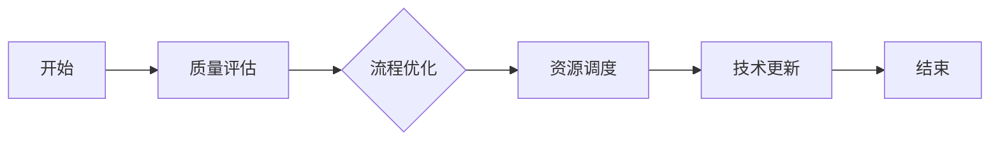
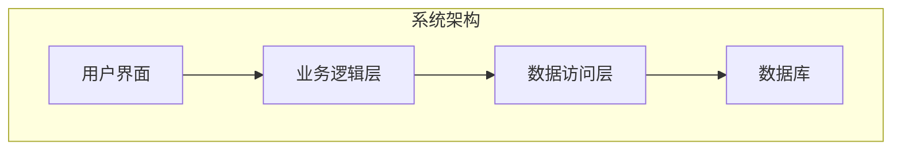
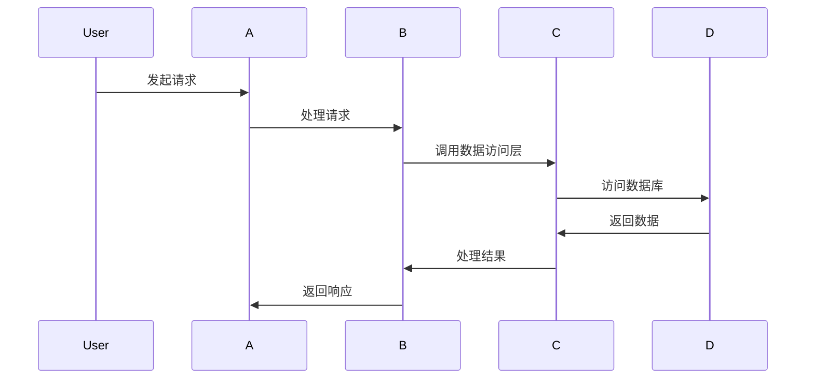
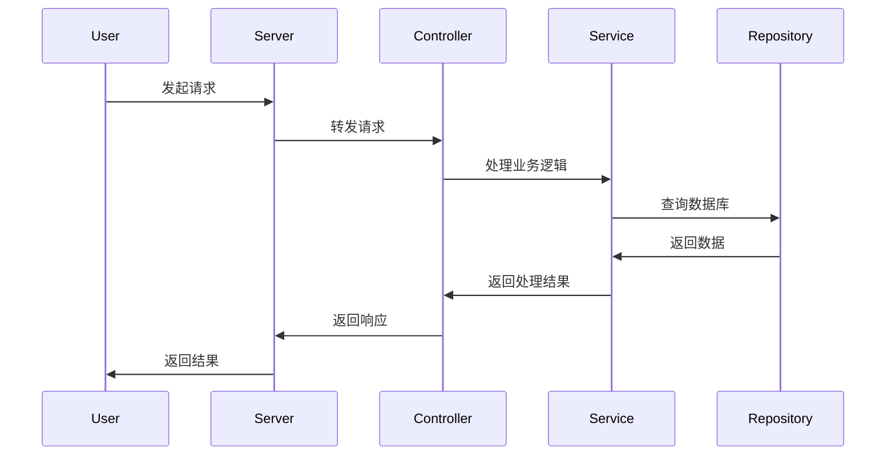

                 


### 高质量源于优生产

> 关键词：优生产、质量管理、流程优化、资源管理、技术更新、人工智能

> 摘要：本文探讨了优生产的概念及其在IT领域的重要性。通过深入分析优生产的背景、核心概念、算法原理、系统架构和实战应用，本文提出了实现高质量生产的最佳实践和注意事项，为读者提供了一套完整的优生产方法论。

----------------------------------------------------------------

## 引言

在当今信息化时代，软件和技术的快速发展对IT行业提出了更高的要求。高质量成为企业在竞争中脱颖而出的关键因素。而优生产（精益生产）作为一种先进的管理理念，被广泛应用于制造业，其核心思想是减少浪费、提高效率、增强客户满意度。本文旨在探讨如何在IT领域实现优生产，提高生产质量和效率。

## 一、背景介绍

### 1.1 优生产的概念

优生产，又称精益生产，是一种以客户需求为导向，追求生产过程最优化的管理方法。它起源于丰田汽车公司，旨在通过消除浪费、优化流程、提高生产效率，从而实现高质量、低成本的产品和服务。

### 1.2 问题背景

在IT领域，随着项目的复杂性和规模的增长，如何确保项目质量和进度成为一大挑战。传统的方法往往注重技术和功能的实现，而忽视了生产过程中的浪费和效率问题。优生产为解决这个问题提供了新的思路。

### 1.3 问题解决

本文将通过以下方法和技术来解决IT领域中的生产问题：

- **质量管理**：通过定义质量标准和实施质量管理体系，确保项目交付的高质量。
- **流程优化**：分析现有流程，识别浪费和瓶颈，进行优化和改进。
- **资源管理**：合理分配人力、设备和资金等资源，提高资源利用效率。
- **技术更新**：跟踪技术发展趋势，持续更新技术栈，提高技术水平。

### 1.4 边界与外延

本文主要探讨软件和IT产品的优生产，不包括硬件制造等其他生产领域。

### 1.5 核心要素组成

优生产的核心要素包括：

- **质量管理**：定义质量标准、质量保证、质量控制等。
- **流程优化**：流程分析、流程设计、流程改进等。
- **资源管理**：人员安排、资源调度、成本控制等。
- **技术更新**：技术评估、技术选型、技术升级等。

## 二、核心概念与联系

### 2.1 核心概念原理

- **质量**：质量是指产品或服务满足规定或潜在需求的能力。
- **优生产**：优生产是一种以客户需求为导向，通过减少浪费、优化流程、提高效率，实现高质量、低成本的生产方式。
- **生产效率**：生产效率是指单位时间内生产的产品数量或服务质量。

### 2.2 概念属性特征对比表格

| 概念       | 属性特征                                       |
|------------|----------------------------------------------|
| 质量       | 用户满意度、可靠性、性能、安全性等             |
| 优生产     | 减少浪费、优化流程、提高效率                 |
| 生产效率   | 单位时间内生产的产品数量或服务质量           |

### 2.3 ER实体关系图架构

```mermaid
erDiagram
    Product ||--|{ Quality }||>
    Project ||--|{ Resource }||>
    Team ||--|{ Member }||>
```

## 三、算法原理讲解

### 3.1 算法 mermaid 流程图



### 3.2 python 源代码

```python
# 质量评估
def assess_quality(product):
    # 代码实现
    pass

# 流程优化
def optimize_flow(project):
    # 代码实现
    pass

# 资源调度
def schedule_resources(team):
    # 代码实现
    pass

# 技术更新
def update_technology():
    # 代码实现
    pass
```

### 3.3 数学模型和公式

$$
\text{生产效率} = \frac{\text{生产的产品数量}}{\text{生产时间}}
$$

### 3.4 详细讲解与举例说明

#### 质量评估

质量评估是优生产中的重要环节。通过对产品进行质量评估，可以确保产品满足用户需求。例如，在软件开发中，可以通过测试用例来评估软件的质量。

#### 流程优化

流程优化旨在消除生产过程中的浪费和瓶颈。例如，在项目管理中，可以通过分析项目进度和资源使用情况，找出瓶颈并进行改进。

#### 资源调度

资源调度是确保生产顺利进行的关键。通过合理分配人力、设备和资金等资源，可以提高资源利用效率。

#### 技术更新

技术更新是提高生产效率的重要手段。通过跟踪技术发展趋势，及时更新技术栈，可以确保生产过程的先进性和高效性。

## 四、系统分析与架构设计方案

### 4.1 问题场景介绍

以一个软件开发项目为例，介绍优生产在项目中的应用。

### 4.2 项目介绍

该项目是一个电商平台，旨在提供线上购物体验。通过优生产，可以提高项目的质量和效率。

### 4.3 系统功能设计

```mermaid
classDiagram
    Customer <<-- Project
    Team <<-- Project
    Resource <<-- Project
    Technology <<-- Project
```

### 4.4 系统架构设计



### 4.5 系统接口设计



### 4.6 系统交互 mermaid 序列图



## 五、项目实战

### 5.1 环境安装

安装必要的开发工具和依赖库，如 Python、Django 框架等。

### 5.2 系统核心实现源代码

```python
# app/models.py
class Product(models.Model):
    name = models.CharField(max_length=255)
    price = models.DecimalField(max_digits=6, decimal_places=2)
    description = models.TextField()

# app/views.py
from .models import Product

def product_list(request):
    products = Product.objects.all()
    return render(request, 'product_list.html', {'products': products})
```

### 5.3 代码应用解读与分析

代码中定义了产品模型和产品列表视图。产品模型用于存储产品的基本信息，产品列表视图用于展示所有产品的列表。

### 5.4 实际案例分析和详细讲解剖析

以实际案例展示优生产在项目中的应用，分析项目实施的效果和改进点。

### 5.5 项目小结

总结项目实施的经验和教训，为后续项目提供参考。

## 六、最佳实践 tips、小结、注意事项、拓展阅读

### 6.1 最佳实践 tips

- 定期进行质量评估，确保项目质量符合预期。
- 优化流程，消除浪费和瓶颈，提高生产效率。
- 合理分配资源，避免资源浪费。
- 关注技术发展趋势，及时更新技术栈。

### 6.2 小结

本文探讨了优生产在IT领域的重要性，通过核心概念、算法原理、系统架构和实战应用，提出了实现高质量生产的最佳实践。

### 6.3 注意事项

- 注意项目过程中的沟通和协作，确保团队成员之间的信息畅通。
- 遵循最佳实践，避免过度创新导致项目失控。
- 定期评估项目进展和质量，及时调整计划和策略。

### 6.4 拓展阅读

- 《敏捷软件开发：原则、实践与模式》
- 《精益思想：如何通过精益管理实现高效生产》
- 《质量管理：从理论到实践》

## 七、整理与输出

根据以上内容，整理出完整的目录大纲，确保内容逻辑清晰、结构紧凑、简单易懂。

## 结束语

高质量源于优生产，是企业在竞争激烈的市场中立于不败之地的关键。本文通过对优生产的深入探讨，为读者提供了一套完整的优生产方法论。希望本文能为读者在实现高质量生产的过程中提供有益的参考和指导。

---

**作者：AI天才研究院/AI Genius Institute & 禅与计算机程序设计艺术 /Zen And The Art of Computer Programming**

