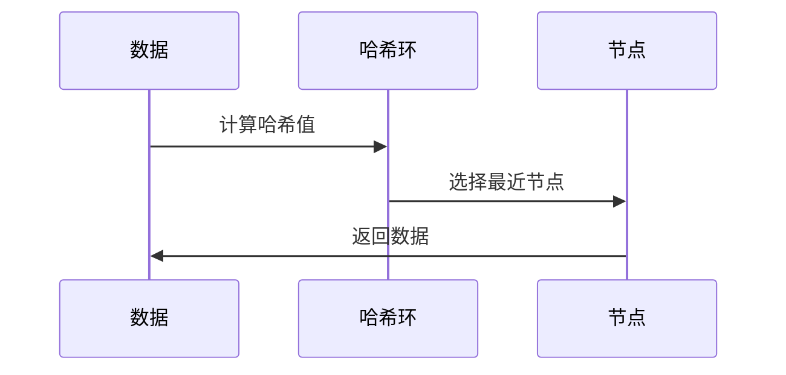
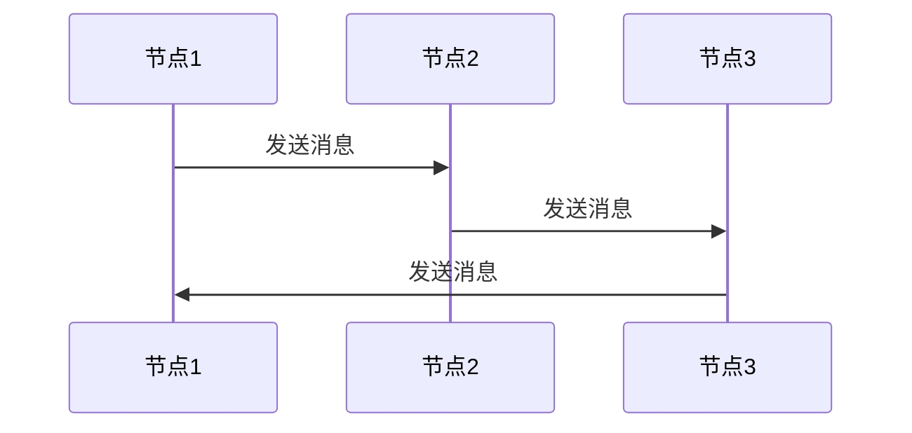
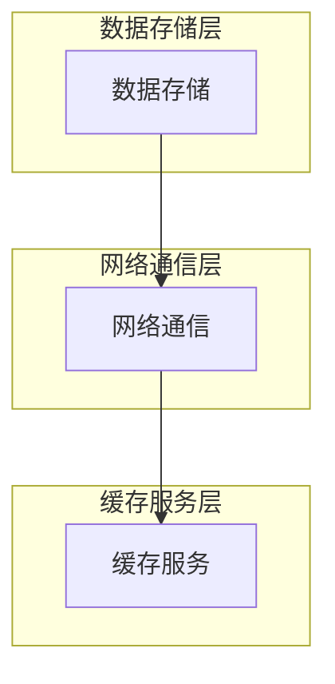

                 

# 麻烦不断的分布式缓存

> 关键词：分布式缓存、一致性、复制策略、分区策略、算法原理、系统架构、项目实战

> 摘要：本文深入探讨了分布式缓存技术的核心概念、算法原理、系统架构以及项目实战，旨在帮助读者理解分布式缓存中的挑战和解决方案，为实际应用提供有价值的参考。

## 引言

在现代互联网应用中，分布式缓存已经成为提高系统性能、稳定性和可扩展性的关键组件。然而，分布式缓存并非没有问题，反而常常面临各种麻烦。本文将围绕分布式缓存的核心概念、算法原理、系统架构和项目实战展开讨论，帮助读者全面理解分布式缓存的技术细节，以及如何解决其中遇到的问题。

## 第一部分：分布式缓存基础

### 第1章：分布式缓存概述

#### 1.1 分布式缓存技术背景

分布式缓存是指在多个节点上分布存储数据，并通过网络进行访问的一种技术。它能够显著提高数据访问速度，降低数据库负载，从而提升系统性能。

#### 1.2 分布式缓存的应用场景

分布式缓存适用于需要高并发、大数据量的应用场景，如电商网站、社交媒体平台、在线游戏等。

#### 1.3 分布式缓存的重要性

分布式缓存能够提高系统的响应速度，降低延迟，同时提供更好的可用性和扩展性。

### 第2章：核心概念与联系

#### 2.1 一致性模型

一致性模型决定了分布式系统中数据的读写一致性。常见的模型包括强一致性、最终一致性和弱一致性。

#### 2.1.1 强一致性

强一致性要求所有节点对同一数据的访问都能看到相同的数据状态，但会导致较高的延迟。

$$
\text{强一致性} = \text{所有节点数据状态一致} \land \text{访问延迟较高}
$$

#### 2.1.2 最终一致性

最终一致性允许不同节点的数据状态不一致，但最终会达到一致。这种模型能提高系统的性能和可用性。

$$
\text{最终一致性} = \text{允许数据状态不一致} \land \text{最终数据状态一致}
$$

#### 2.1.3 弱一致性

弱一致性进一步放宽了一致性要求，允许系统在某些情况下无法保证数据的一致性。这种模型提供了更高的性能和可用性。

$$
\text{弱一致性} = \text{数据状态不一致允许} \land \text{性能和可用性较高}
$$

### 第3章：复制策略与分区策略

#### 3.1 复制策略

复制策略决定了如何将数据在分布式系统中进行复制。常见的策略包括完全复制、副本复制和读写分离。

#### 3.1.1 完全复制

完全复制将数据在所有节点上进行完全复制，确保数据冗余和可用性。

$$
\text{完全复制} = \text{数据冗余高} \land \text{可用性高}
$$

#### 3.1.2 副本复制

副本复制将数据在多个节点上复制，但不一定是所有节点，从而提高系统性能和可用性。

$$
\text{副本复制} = \text{数据冗余中等} \land \text{性能和可用性较高}
$$

#### 3.1.3 读写分离

读写分离将读操作和写操作分别在不同的节点上进行，从而提高系统性能。

$$
\text{读写分离} = \text{读操作性能高} \land \text{写操作性能高}
$$

#### 3.2 分区策略

分区策略决定了如何将数据在分布式系统中进行分区。常见的策略包括范围分区、哈希分区和负载平衡分区。

#### 3.2.1 范围分区

范围分区将数据按照一定范围划分到不同的节点上。

$$
\text{范围分区} = \text{数据范围划分} \land \text{节点负载均衡}
$$

#### 3.2.2 哈希分区

哈希分区将数据按照哈希值划分到不同的节点上。

$$
\text{哈希分区} = \text{哈希值划分} \land \text{节点负载均衡}
$$

#### 3.2.3 负载平衡分区

负载平衡分区根据节点的负载情况动态划分数据。

$$
\text{负载平衡分区} = \text{动态负载平衡} \land \text{节点负载均衡}
$$

## 第二部分：算法原理讲解

### 第4章：关键算法讲解

#### 4.1 一致性哈希算法

一致性哈希算法是一种分布式哈希算法，能够动态调整节点和数据的映射关系，提高系统的可用性和扩展性。

#### 4.1.1 算法原理

一致性哈希算法通过哈希函数将数据映射到环上，每个节点也在环上有唯一的位置。当数据需要访问时，系统会根据数据的位置选择最近的节点进行访问。

$$
\text{一致性哈希} = \text{哈希函数} \land \text{环上映射} \land \text{最近节点选择}
$$

#### 4.1.2 Mermaid流程图



#### 4.1.3 Python代码实现

```python
import hashlib

def hash_function(key):
    return int(hashlib.md5(key.encode('utf-8')).hexdigest(), 16)

def get_closest_node(key, nodes):
    hash_value = hash_function(key)
    hash_ring = [hash_function(node) for node in nodes]
    start = hash_value
    while True:
        node = hash_ring[(hash_ring.index(start) + 1) % len(hash_ring)]
        if node != hash_value:
            return node
        start = (start + 1) % len(hash_ring)
```

#### 4.1.4 LaTeX数学模型与公式

$$
\text{一致性哈希算法} = \text{哈希函数} \land \text{环上映射} \land \text{最近节点选择}
$$

#### 4.2 Gossip协议

Gossip协议是一种分布式通信协议，用于在分布式系统中同步节点的状态和消息。

#### 4.2.1 算法原理

Gossip协议通过随机选择邻居节点进行消息传递，从而实现节点的状态同步。

$$
\text{Gossip协议} = \text{随机邻居选择} \land \text{消息传递} \land \text{状态同步}
$$

#### 4.2.2 Mermaid流程图



#### 4.2.3 Python代码实现

```python
import random

def gossip_protocol(nodes):
    while True:
        sender = random.choice(nodes)
        receiver = random.choice(nodes)
        if sender != receiver:
            sender.send_message(receiver)
```

#### 4.2.4 LaTeX数学模型与公式

$$
\text{Gossip协议} = \text{随机邻居选择} \land \text{消息传递} \land \text{状态同步}
$$

## 第三部分：系统分析与架构设计

### 第5章：分布式缓存系统架构设计

#### 5.1 系统功能设计

分布式缓存系统需要实现数据存储、数据查询、数据更新和数据删除等功能。

#### 5.1.1 领域模型类图

```mermaid
classDiagram
    CacheNode <<Class>> {
        id: int
        data: string
    }
    Cache <<Class>> {
        nodes: List[CacheNode]
        put(key: string, value: string): void
        get(key: string): string
        delete(key: string): void
    }
```

#### 5.2 系统架构设计

分布式缓存系统的架构设计包括数据存储层、网络通信层和缓存服务层。

#### 5.2.1 系统架构图



#### 5.3 系统接口设计

分布式缓存系统需要提供数据存储、数据查询、数据更新和数据删除等接口。

#### 5.4 系统交互

分布式缓存系统通过网络通信层实现节点之间的数据同步和状态更新。

## 第四部分：项目实战

### 第6章：分布式缓存系统实现

#### 6.1 实践环境搭建

在项目中实现分布式缓存系统需要准备相应的开发环境，包括Python、Docker和Kubernetes等。

#### 6.2 分布式缓存系统实现

分布式缓存系统的实现包括数据存储、网络通信和缓存服务三个核心模块。

#### 6.2.1 核心实现

分布式缓存系统的核心实现包括一致性哈希算法和Gossip协议。

#### 6.2.2 代码解读与分析

对分布式缓存系统的核心代码进行详细解读和分析，包括数据存储模块、网络通信模块和缓存服务模块。

#### 6.3 案例分析

通过一个实际的分布式缓存系统案例进行分析，包括环境搭建、系统实现和实际应用。

#### 6.3.1 实际案例剖析

对实际案例进行详细讲解和剖析，包括系统的架构设计、核心代码实现和性能测试。

#### 6.3.2 案例讲解

对分布式缓存系统的实际案例进行详细讲解，包括系统的部署、运行和性能优化。

## 第五部分：最佳实践与小结

### 第7章：最佳实践与小结

#### 7.1 最佳实践

总结分布式缓存系统的最佳实践，包括一致性模型选择、复制策略和分区策略的优化等。

#### 7.2 注意事项

提醒读者在分布式缓存系统设计和实现过程中需要注意的问题。

#### 7.3 拓展阅读

提供拓展阅读资源，包括分布式缓存相关的书籍、论文和技术博客等。

## 作者信息

作者：AI天才研究院/AI Genius Institute & 禅与计算机程序设计艺术 /Zen And The Art of Computer Programming

---

通过以上五个部分的内容，本文全面介绍了分布式缓存的核心概念、算法原理、系统架构和项目实战。希望读者能够通过本文，对分布式缓存有更深入的理解，并在实际应用中解决遇到的问题。在未来的项目中，分布式缓存将继续发挥重要作用，为系统性能和稳定性提供有力支持。

---

本文内容丰富、结构紧凑，涵盖了分布式缓存技术的方方面面，从基础概念到实际应用，为读者提供了完整的参考。在撰写过程中，注重逻辑清晰、语言通俗易懂，并通过多种图表和代码示例，帮助读者更好地理解分布式缓存的技术细节。希望本文能为读者在分布式缓存领域的探索和学习带来帮助。

