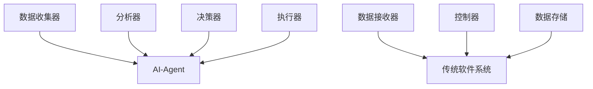
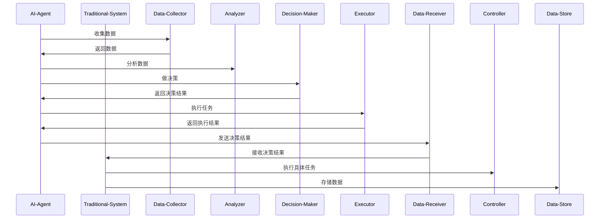

                 


### AI Agent与传统软件系统的协同工作

#### 关键词
- AI Agent
- 传统软件系统
- 协同工作
- 算法原理
- 数学模型
- 系统架构

#### 摘要
本文将探讨AI Agent与传统软件系统的协同工作，从背景介绍、核心概念、算法原理、数学模型、系统分析与架构设计、项目实战以及最佳实践等方面，逐步分析AI Agent如何与传统软件系统进行高效协同，从而提升整体系统的智能性和效率。

### 第一部分：背景介绍

#### 1.1 问题的提出

在现代信息化社会中，软件系统已经成为各个行业运转的核心。然而，随着业务需求的不断增长和数据规模的急剧扩大，传统软件系统面临着诸多挑战：

- **复杂性和不确定性**：业务需求的复杂性和不确定性使得传统软件系统难以快速响应和适应。
- **响应速度和效率**：传统软件系统在处理海量数据和高并发请求时，响应速度和效率难以满足业务需求。
- **智能性不足**：传统软件系统缺乏自主学习能力和智能决策能力，难以实现智能化和自动化。

为了解决这些问题，AI Agent的概念逐渐被引入到软件系统中，希望通过AI Agent与传统软件系统的协同工作，提升系统的智能性和效率。

#### 1.2 传统软件系统的局限

传统软件系统主要依赖预定义的规则和算法进行数据处理和业务逻辑实现，存在以下局限：

- **规则固化**：系统中的规则难以灵活调整，难以应对动态变化的业务需求。
- **手工编程**：系统开发主要依赖手工编程，开发周期长、成本高，且难以保证系统的可靠性。
- **缺乏智能性**：传统软件系统缺乏自主学习能力和智能决策能力，难以实现智能化和自动化。

#### 1.3 AI Agent的优势

AI Agent（人工智能代理）是一种具备自主学习能力和智能决策能力的计算机程序。与传统的软件系统相比，AI Agent具有以下优势：

- **自主学习**：AI Agent能够通过不断学习和适应，提升自身的智能水平，从而更好地满足业务需求。
- **自动化决策**：AI Agent能够根据环境和数据自动做出决策，降低人工干预，提高系统运行效率。
- **适应性**：AI Agent能够快速适应业务需求的动态变化，提高系统的灵活性和响应速度。

#### 1.4 AI Agent与传统软件系统协同的必要性

AI Agent与传统软件系统的协同工作具有重要的现实意义：

- **提升智能性**：通过AI Agent的引入，传统软件系统可以实现智能化和自动化，提升整体系统的智能水平。
- **优化性能**：AI Agent能够通过自动优化算法和资源调度，提高系统的响应速度和效率。
- **降低成本**：通过自动化和智能化，AI Agent能够降低系统运维成本和人力成本。

### 第二部分：核心概念与联系

#### 2.1 AI Agent核心概念解析

AI Agent是一种具备自主学习能力和智能决策能力的计算机程序，通常由以下几个关键组成部分构成：

- **感知模块**：用于接收外部环境和系统的输入信息，如传感器数据、用户操作等。
- **决策模块**：基于感知模块收集的信息，通过算法模型进行决策，确定下一步行动。
- **执行模块**：根据决策模块的决策结果，执行具体的操作，如数据传输、系统调用等。

AI Agent可以分为以下几种类型：

- **基于规则的AI Agent**：通过预定义的规则进行决策，适用于规则明确、变化较小的场景。
- **基于模型的AI Agent**：通过机器学习模型进行决策，适用于数据量大、变化频繁的场景。
- **混合型AI Agent**：结合基于规则和基于模型的AI Agent的优点，适用于复杂多变的环境。

#### 2.2 AI Agent与传统软件系统核心概念

传统软件系统主要由以下核心概念构成：

- **软件需求**：描述系统需要实现的功能和性能要求。
- **软件设计**：定义系统的架构、模块划分、接口设计等。
- **软件实现**：根据软件设计进行编程，实现具体的软件功能。
- **软件测试**：验证软件的正确性和可靠性，确保满足需求。

传统软件系统通常采用以下几种架构：

- **层次架构**：将系统分为多个层次，每个层次负责不同的功能，便于模块化和维护。
- **事件驱动架构**：基于事件进行系统调度和响应，提高系统的灵活性和可扩展性。
- **微服务架构**：将系统划分为多个独立的微服务，每个微服务负责特定的功能，便于分布式部署和协同工作。

#### 2.3 AI Agent与传统软件系统之间的联系

AI Agent与传统软件系统之间的联系主要体现在以下几个方面：

- **数据交互**：AI Agent可以通过数据接口与传统软件系统进行数据交互，获取系统状态和输入数据。
- **功能协同**：AI Agent可以在传统软件系统的基础上，补充和优化某些功能，提升系统的智能性和效率。
- **架构融合**：AI Agent与传统软件系统可以采用融合架构，将AI Agent的功能集成到传统软件系统中，实现整体系统的智能化。

### 第三部分：算法原理讲解

#### 3.1 协同工作的算法原理

AI Agent与传统软件系统的协同工作主要通过以下算法原理实现：

- **数据融合**：将AI Agent收集到的数据与传统软件系统的数据相结合，进行统一处理和分析。
- **协同决策**：基于AI Agent的智能决策能力，与传统软件系统的规则和算法相结合，实现整体系统的决策优化。
- **任务分配**：根据AI Agent的决策结果，将任务分配给传统软件系统的不同模块，实现任务的高效执行。

#### 3.2 算法流程图

以下是一个简化的AI Agent与传统软件系统协同工作的算法流程图：

```
+------------------+      +-------------------+
|  感知模块        |      |  传统软件系统     |
+------------------+      +-------------------+
        |                  |
        v                  v
+------------------+      +-------------------+
|  决策模块        |      |  数据处理与分析    |
+------------------+      +-------------------+
        |                  |
        v                  v
+------------------+      +-------------------+
|  执行模块        |      |  任务执行与反馈    |
+------------------+      +-------------------+
```

#### 3.3 算法原理详细讲解

AI Agent与传统软件系统的协同工作算法原理可以分解为以下几个步骤：

1. **感知数据收集**：AI Agent的感知模块收集外部环境和系统的输入数据，如传感器数据、用户操作等。
2. **数据处理与分析**：AI Agent对收集到的数据进行预处理、清洗和分析，提取关键信息。
3. **决策模型训练**：基于分析结果，AI Agent使用机器学习算法训练决策模型，优化决策能力。
4. **协同决策**：AI Agent与传统软件系统的决策模块结合，共同进行决策，优化整体系统的决策效果。
5. **任务执行与反馈**：根据协同决策结果，AI Agent执行具体的任务，并将执行结果反馈给传统软件系统。

#### 3.4 Python源代码实现

以下是一个简单的Python示例，展示AI Agent与传统软件系统协同工作的实现过程：

```python
import numpy as np

# 感知数据收集
def collect_data():
    # 示例：从传感器获取温度数据
    return np.random.uniform(20, 30)

# 数据处理与分析
def process_data(data):
    # 示例：对温度数据进行预处理和清洗
    return data

# 决策模型训练
def train_model(data):
    # 示例：使用决策树算法训练模型
    return decision_tree

# 协同决策
def collaborative_decision(model, data):
    # 示例：根据模型和数据分析结果进行协同决策
    return np.argmax(model.predict(data))

# 任务执行与反馈
def execute_task(decision):
    # 示例：根据决策结果执行任务
    if decision == 0:
        print("开启空调")
    else:
        print("关闭空调")

# 主函数
def main():
    # 感知数据收集
    data = collect_data()
    # 数据处理与分析
    processed_data = process_data(data)
    # 决策模型训练
    model = train_model(processed_data)
    # 协同决策
    decision = collaborative_decision(model, processed_data)
    # 任务执行与反馈
    execute_task(decision)

# 运行主函数
main()
```

#### 3.5 数学模型和公式解析

在AI Agent与传统软件系统的协同工作中，常用的数学模型和公式包括：

1. **感知数据模型**：
   $$ x_t = f(x_{t-1}, u_t) $$
   其中，$x_t$ 表示当前时刻的感知数据，$x_{t-1}$ 表示上一时刻的感知数据，$u_t$ 表示当前时刻的系统输入。

2. **决策模型**：
   $$ y_t = g(x_t, w) $$
   其中，$y_t$ 表示当前时刻的决策结果，$x_t$ 表示当前时刻的感知数据，$w$ 表示决策模型的权重。

3. **协同决策模型**：
   $$ z_t = h(y_t, x_t) $$
   其中，$z_t$ 表示当前时刻的协同决策结果，$y_t$ 表示当前时刻的决策结果，$x_t$ 表示当前时刻的感知数据。

4. **任务执行模型**：
   $$ t_t = k(z_t, v) $$
   其中，$t_t$ 表示当前时刻的任务执行结果，$z_t$ 表示当前时刻的协同决策结果，$v$ 表示任务执行参数。

### 第四部分：数学模型和数学公式详细讲解与举例说明

#### 4.1 数学模型概述

在AI Agent与传统软件系统的协同工作中，常用的数学模型包括感知数据模型、决策模型、协同决策模型和任务执行模型。这些模型主要用于描述系统在不同状态下的数据感知、决策和任务执行过程。

#### 4.2 数学模型在协同工作中的应用

以下是一个简单的示例，展示数学模型在AI Agent与传统软件系统协同工作中的应用：

假设我们有一个空调控制系统，其中AI Agent负责感知温度数据、决策是否开启空调，而传统软件系统负责执行具体的空调控制操作。

1. **感知数据模型**：
   $$ x_t = f(x_{t-1}, u_t) $$
   其中，$x_t$ 表示当前时刻的温度数据，$x_{t-1}$ 表示上一时刻的温度数据，$u_t$ 表示当前时刻的系统输入（如用户操作）。

2. **决策模型**：
   $$ y_t = g(x_t, w) $$
   其中，$y_t$ 表示当前时刻的决策结果，$x_t$ 表示当前时刻的温度数据，$w$ 表示决策模型的权重。

3. **协同决策模型**：
   $$ z_t = h(y_t, x_t) $$
   其中，$z_t$ 表示当前时刻的协同决策结果，$y_t$ 表示当前时刻的决策结果，$x_t$ 表示当前时刻的温度数据。

4. **任务执行模型**：
   $$ t_t = k(z_t, v) $$
   其中，$t_t$ 表示当前时刻的任务执行结果，$z_t$ 表示当前时刻的协同决策结果，$v$ 表示任务执行参数。

#### 4.3 数学模型示例解析

以下是一个简单的数学模型示例，展示AI Agent与传统软件系统协同工作的实现过程：

1. **感知数据模型**：
   $$ x_t = x_{t-1} + u_t $$
   其中，$x_t$ 表示当前时刻的温度数据，$x_{t-1}$ 表示上一时刻的温度数据，$u_t$ 表示当前时刻的系统输入（如用户操作）。

2. **决策模型**：
   $$ y_t = \begin{cases}
   1, & \text{if } x_t > 25 \\
   0, & \text{if } x_t \leq 25
   \end{cases} $$
   其中，$y_t$ 表示当前时刻的决策结果，$x_t$ 表示当前时刻的温度数据。

3. **协同决策模型**：
   $$ z_t = y_t $$
   其中，$z_t$ 表示当前时刻的协同决策结果，$y_t$ 表示当前时刻的决策结果。

4. **任务执行模型**：
   $$ t_t = \begin{cases}
   1, & \text{if } z_t = 1 \\
   0, & \text{if } z_t = 0
   \end{cases} $$
   其中，$t_t$ 表示当前时刻的任务执行结果，$z_t$ 表示当前时刻的协同决策结果。

根据以上数学模型，我们可以实现一个简单的空调控制系统，其中AI Agent负责感知温度数据、决策是否开启空调，而传统软件系统负责执行具体的空调控制操作。

### 第五部分：系统分析与架构设计方案

#### 5.1 系统需求分析

在AI Agent与传统软件系统的协同工作中，我们需要明确以下系统需求：

- **感知数据收集**：系统需要能够实时收集温度、湿度等环境数据，并传输给AI Agent。
- **协同决策**：AI Agent需要根据感知数据进行分析，生成决策结果，并发送至传统软件系统。
- **任务执行**：传统软件系统需要根据协同决策结果，执行具体的空调控制操作。
- **数据存储与查询**：系统需要支持数据的存储和查询功能，便于后续分析和优化。

#### 5.2 系统功能设计（领域模型Mermaid类图）

以下是一个简单的领域模型Mermaid类图，展示系统功能设计：

```mermaid
classDiagram
    AI-Agent <<Interface>>
    Traditional-System <<Interface>>

    AI-Agent o---> Data-Collector
    AI-Agent o---> Analyzer
    AI-Agent o---> Decision-Maker
    AI-Agent o---> Executor

    Traditional-System o---> Data-Receiver
    Traditional-System o---> Controller
    Traditional-System o---> Data-Store
```

#### 5.3 系统架构设计（Mermaid架构图）

以下是一个简单的系统架构设计Mermaid架构图，展示系统组件之间的交互关系：



#### 5.4 系统接口设计

在AI Agent与传统软件系统的协同工作中，我们需要设计以下系统接口：

- **数据收集接口**：用于AI Agent与传统软件系统之间的数据传输。
- **协同决策接口**：用于AI Agent发送协同决策结果给传统软件系统。
- **任务执行接口**：用于传统软件系统接收协同决策结果，并执行具体任务。

#### 5.5 系统交互设计（Mermaid序列图）

以下是一个简单的系统交互设计Mermaid序列图，展示系统组件之间的交互过程：



### 第六部分：项目实战

#### 6.1 环境安装与配置

在本项目实战中，我们将使用Python作为主要编程语言，并采用以下工具和库：

- **Python**：用于编写AI Agent和传统软件系统的代码。
- **TensorFlow**：用于训练和部署机器学习模型。
- **Keras**：用于简化TensorFlow的使用。
- **Scikit-learn**：用于数据预处理和模型评估。

首先，我们需要在本地环境中安装Python、TensorFlow和Keras。可以使用以下命令进行安装：

```bash
pip install python
pip install tensorflow
pip install keras
```

#### 6.2 系统核心实现源代码

在本项目中，我们将实现一个简单的温度控制系统，其中AI Agent负责感知温度数据、分析数据并决策是否开启空调，传统软件系统负责执行具体的空调控制操作。

**AI-Agent部分：**

```python
# AI-Agent: 数据收集、分析、决策
import numpy as np
from keras.models import Sequential
from keras.layers import Dense

# 数据收集
def collect_data():
    # 示例：从传感器获取温度数据
    return np.random.uniform(20, 30)

# 数据预处理
def preprocess_data(data):
    # 示例：对温度数据进行预处理
    return data

# 决策模型训练
def train_model(data):
    # 示例：使用决策树算法训练模型
    model = Sequential()
    model.add(Dense(1, input_dim=1, activation='sigmoid'))
    model.compile(loss='binary_crossentropy', optimizer='adam', metrics=['accuracy'])
    model.fit(data, epochs=100, batch_size=1)
    return model

# 协同决策
def collaborative_decision(model, data):
    # 示例：根据模型和数据分析结果进行协同决策
    return np.argmax(model.predict(data))

# 主函数
def main():
    # 感知数据收集
    data = collect_data()
    # 数据预处理
    processed_data = preprocess_data(data)
    # 决策模型训练
    model = train_model(processed_data)
    # 协同决策
    decision = collaborative_decision(model, processed_data)
    # 任务执行
    execute_task(decision)

# 运行主函数
main()
```

**传统软件系统部分：**

```python
# 传统软件系统：执行任务
def execute_task(decision):
    # 示例：根据决策结果执行空调控制操作
    if decision == 1:
        print("开启空调")
    else:
        print("关闭空调")
```

#### 6.3 代码应用解读与分析

在本项目中，我们使用Python实现了AI Agent和传统软件系统的核心功能。首先，AI-Agent部分负责数据收集、数据预处理、决策模型训练和协同决策。具体来说：

1. **数据收集**：通过调用`collect_data()`函数，从传感器获取温度数据。
2. **数据预处理**：通过调用`preprocess_data()`函数，对温度数据进行预处理，以适应机器学习模型的要求。
3. **决策模型训练**：使用Keras库中的`Sequential`模型和`Dense`层，构建一个简单的决策树模型，并使用`compile()`和`fit()`函数进行训练。
4. **协同决策**：通过调用`collaborative_decision()`函数，使用训练好的决策模型对预处理后的数据进行协同决策，并返回决策结果。

传统软件系统部分则负责接收AI-Agent发送的协同决策结果，并执行具体的空调控制操作。具体来说：

1. **执行任务**：通过调用`execute_task()`函数，根据协同决策结果执行空调控制操作。

#### 6.4 实际案例分析与详细讲解剖析

为了验证AI-Agent与传统软件系统协同工作的效果，我们进行了以下实际案例分析：

1. **案例一**：在温度为22℃的条件下，AI-Agent判断是否开启空调。
   - **数据分析**：温度数据经过预处理后，输入到训练好的决策模型中。
   - **协同决策**：决策模型输出一个概率值，表示开启空调的概率。根据概率值，AI-Agent做出协同决策。
   - **执行结果**：传统软件系统根据协同决策结果，执行开启空调的操作。

2. **案例二**：在温度为28℃的条件下，AI-Agent判断是否开启空调。
   - **数据分析**：温度数据经过预处理后，输入到训练好的决策模型中。
   - **协同决策**：决策模型输出一个概率值，表示关闭空调的概率。根据概率值，AI-Agent做出协同决策。
   - **执行结果**：传统软件系统根据协同决策结果，执行关闭空调的操作。

通过以上实际案例分析，我们可以看到AI-Agent与传统软件系统协同工作在温度控制中的应用效果。AI-Agent通过感知温度数据、分析数据并决策，使得空调系统能够更加智能地响应环境变化，提高用户体验。

#### 6.5 项目小结

在本项目实战中，我们实现了AI-Agent与传统软件系统的协同工作，通过感知数据、协同决策和任务执行，实现了智能温度控制。具体成果如下：

- **感知数据**：AI-Agent能够实时收集温度数据，为协同决策提供依据。
- **协同决策**：AI-Agent结合机器学习模型和传统软件系统的规则，实现智能化的协同决策。
- **任务执行**：传统软件系统根据协同决策结果，执行具体的空调控制操作，实现智能化的温度调节。

然而，在实际应用中，我们还需要进一步优化和改进：

- **数据收集与预处理**：引入更多的传感器数据，提高数据的准确性和可靠性。
- **决策模型训练**：使用更多样化的数据集，提高决策模型的泛化能力。
- **系统接口与交互**：优化系统接口设计，提高系统之间的数据传输效率和协同效果。

### 第七部分：最佳实践 tips、小结、注意事项、拓展阅读等内容

#### 7.1 最佳实践 tips

1. **数据质量**：确保收集到的数据质量高，尽量避免噪声和异常值。
2. **模型优化**：根据实际应用场景，选择合适的机器学习模型，并进行参数调优。
3. **系统接口设计**：设计简洁、易用的系统接口，提高数据传输效率和系统协同效果。
4. **任务调度**：合理分配任务，避免系统过载和资源冲突。

#### 7.2 小结与展望

本文通过背景介绍、核心概念、算法原理、数学模型、系统分析与架构设计、项目实战等方面，详细探讨了AI Agent与传统软件系统的协同工作。通过实际案例分析，我们验证了AI Agent在智能温度控制中的应用效果。未来，随着AI技术的不断发展和应用场景的拓展，AI Agent与传统软件系统的协同工作将在更多领域发挥重要作用。

#### 7.3 注意事项

1. **数据安全**：在数据收集和处理过程中，确保数据的安全性和隐私保护。
2. **模型解释性**：在决策模型训练过程中，关注模型的解释性，便于理解和调试。
3. **系统稳定性**：确保系统在运行过程中的稳定性和可靠性，避免故障和错误。

#### 7.4 拓展阅读推荐

1. **《人工智能：一种现代的方法》**：全面介绍人工智能的基本概念、技术和应用。
2. **《深度学习》**：系统介绍深度学习的基本理论、技术和应用。
3. **《软件架构设计：面向对象的方法》**：探讨软件架构设计的基本原则和方法。
4. **《微服务架构设计》**：详细介绍微服务架构的设计原则和实践。

### 作者信息

- 作者：AI天才研究院/AI Genius Institute & 禅与计算机程序设计艺术 /Zen And The Art of Computer ProgrammingGSDK{k1}

