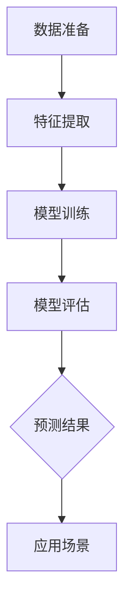
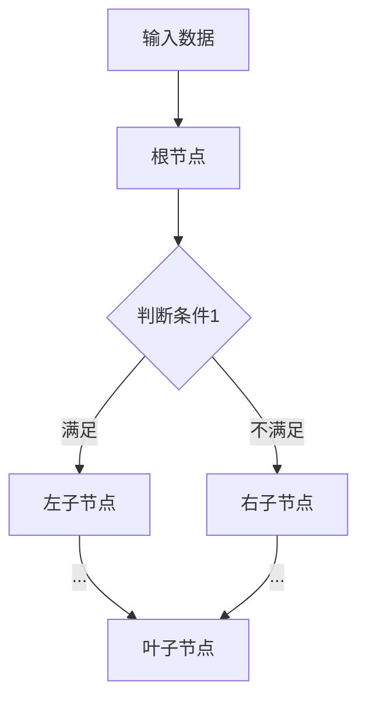
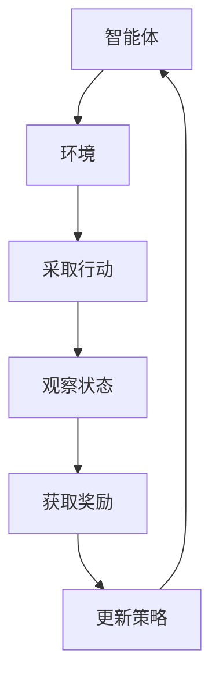
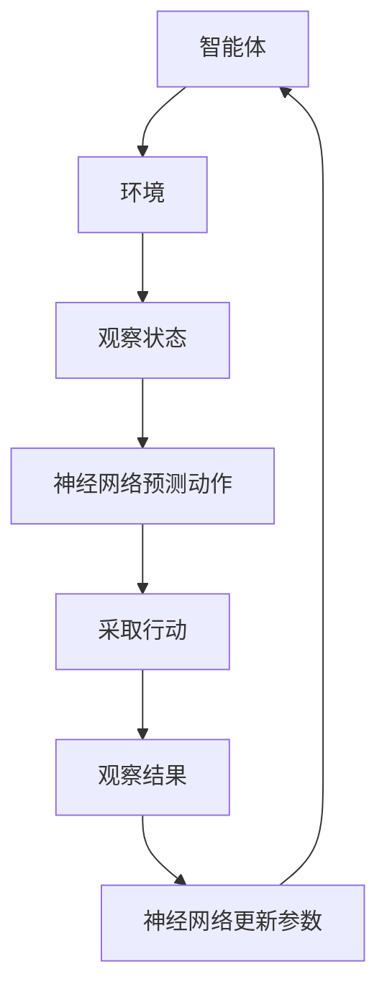
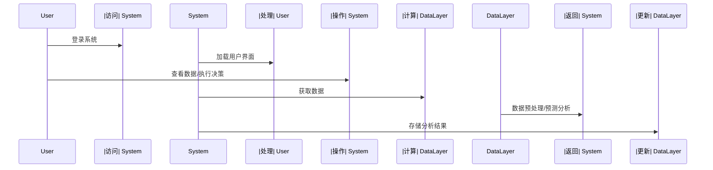
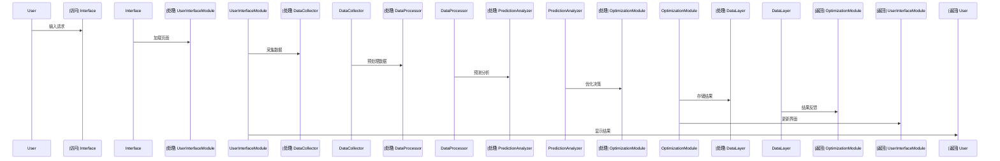
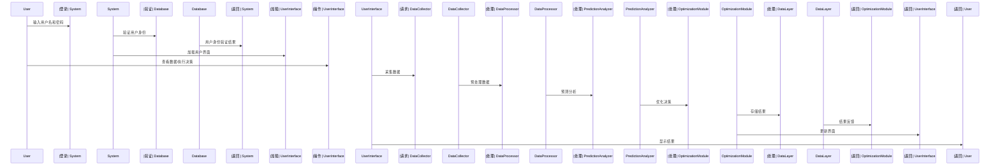

                 

### 第一部分：背景与核心概念

#### 第1章：AI Agent概述与企业可持续发展

##### 1.1 AI Agent的定义与特性

AI Agent，即人工智能代理，是指能够感知环境、采取行动并基于目标进行自主决策的计算机程序实体。AI Agent的核心特性包括自主性、适应性、交互性和学习性。自主性意味着AI Agent能够独立完成特定的任务；适应性则体现为AI Agent根据环境变化调整其行为；交互性是指AI Agent能够与其他实体（如人类或其他AI）进行有效沟通；学习性则强调AI Agent通过经验不断优化其决策过程。

AI Agent的发展起源于人工智能领域，最早的理论模型可追溯至20世纪50年代。当时，学者们提出了基于图灵测试的智能体概念。然而，随着计算机硬件性能的提升和算法的进步，AI Agent逐渐从理论研究走向实际应用。现代AI Agent不仅具备感知和决策能力，还可以通过深度学习、强化学习等技术实现自我优化和复杂任务处理。

在商业领域，AI Agent的兴起源于对智能化服务需求的增长。传统的客服系统、智能推荐系统等是AI Agent的早期应用场景。如今，随着大数据、云计算和物联网技术的不断发展，AI Agent在金融、医疗、零售等领域的应用愈加广泛。例如，金融行业的智能投顾和医疗领域的智能诊断助手，都体现了AI Agent在解决复杂业务问题方面的潜力。

##### 1.2 企业可持续发展的概念与挑战

企业可持续发展是指企业在满足当前需求的同时，不损害后代满足自身需求的能力。这一概念强调了企业在经济、社会和环境三个方面实现平衡发展的目标。具体来说，企业可持续发展包括以下几个方面：

1. **经济效益**：追求长期的盈利能力，通过创新和优化业务模式提高市场竞争力。
2. **社会效益**：关注企业的社会责任，包括员工权益、社区贡献和社会公益等。
3. **环境效益**：通过节能减排、资源循环利用等手段降低企业的环境影响。

企业可持续发展面临的挑战主要包括：

1. **经济压力**：市场竞争激烈，企业需要在追求经济效益的同时保持可持续性。
2. **资源限制**：自然资源有限，企业需要提高资源利用效率，减少浪费。
3. **社会期待**：社会对企业的期望越来越高，企业需要承担更多的社会责任。
4. **技术变革**：技术的快速进步要求企业不断调整战略，以适应新技术带来的机遇和挑战。

在当前全球化的背景下，企业可持续发展已成为商业成功的必要条件。不仅能够提升企业的社会形象和品牌价值，还能增强企业的抗风险能力和长期竞争力。

##### 1.3 AI Agent在企业可持续发展中的潜在应用

AI Agent在企业可持续发展战略中的潜在应用非常广泛，可以从以下几个方面进行阐述：

1. **资源优化**：通过AI Agent的智能调度和优化算法，企业可以实现生产流程的优化，提高资源利用率。例如，智能供应链管理系统可以根据实时数据调整库存水平，减少库存成本和浪费。

2. **节能减排**：AI Agent可以通过预测和优化能源消耗，帮助企业在降低能源消耗的同时减少碳排放。例如，智能楼宇管理系统可以根据室内温度、湿度等环境因素，自动调节空调、照明等设备，实现节能减排。

3. **环境保护**：AI Agent可以用于环境监测和污染控制。例如，智能水质监测系统可以实时检测水质指标，及时发现和处理污染问题，保护水资源安全。

4. **社会责任**：AI Agent可以协助企业开展社会责任项目，如智能客服系统可以帮助企业更好地服务客户，提高客户满意度，增强品牌形象。

5. **决策支持**：AI Agent可以通过大数据分析和预测模型，为企业提供战略决策支持。例如，基于AI的可持续发展战略规划系统可以帮助企业分析市场趋势、评估风险和机会，制定科学的可持续发展计划。

总的来说，AI Agent在企业可持续发展战略中的应用，不仅能够提升企业的运营效率和竞争力，还能为企业实现长期可持续发展提供有力支持。

---

在本章节中，我们初步介绍了AI Agent的定义与特性，企业可持续发展的概念与挑战，以及AI Agent在企业可持续发展中的潜在应用。接下来的章节将深入探讨AI Agent在战略制定中的应用，详细解析算法原理，以及通过具体案例展示AI Agent的实际应用效果。

## 第2章：企业可持续发展战略的基本概念

在深入探讨AI Agent在企业可持续发展战略中的应用之前，我们需要先了解企业可持续发展战略的基本概念。这一章节将介绍企业可持续发展战略的组成部分，以及如何设定可持续发展目标和制定战略。

##### 2.1 企业可持续发展战略的组成部分

企业可持续发展战略通常包括以下几个关键组成部分：

1. **愿景与使命**：企业愿景明确了企业长期发展的目标，使命则阐明了企业的核心价值观和存在的意义。这两者是指导企业战略制定和执行的核心。

2. **战略目标**：战略目标具体化了企业的愿景和使命，明确了在可持续发展方面企业希望达到的具体成果。这些目标通常包括经济效益、社会效益和环境效益三个方面。

3. **关键绩效指标（KPI）**：关键绩效指标是衡量企业可持续发展成效的具体指标，如能源消耗减少百分比、碳排放量减少量、员工满意度评分等。

4. **行动计划**：行动计划是实施可持续发展战略的具体步骤和时间表，包括资源分配、责任分配和实施方法等。

5. **监测与评估**：监测与评估是确保可持续发展战略有效实施的重要环节，通过定期评估和调整战略，企业可以及时发现和解决问题，确保战略目标的实现。

##### 2.2 企业可持续发展目标的设定

设定企业可持续发展目标是一个系统化的过程，需要考虑多个因素。以下是设定可持续发展目标的一些关键步骤：

1. **明确愿景和使命**：首先，企业需要明确自身的愿景和使命，这是设定可持续发展目标的基础。

2. **内外部分析**：进行内外部分析，包括市场趋势、竞争态势、法规要求、利益相关者期望等。这有助于企业了解外部环境的变化和内部资源状况，从而制定切实可行的目标。

3. **目标具体化**：将可持续发展目标具体化，使其具有可操作性和可衡量性。例如，将“提高资源利用效率”具体化为“将能源消耗降低20%”。

4. **目标优先级排序**：根据企业资源和能力，对目标进行优先级排序，确保企业可以集中资源优先实现最重要的目标。

5. **制定时间表**：为每个目标制定具体的时间表，明确实现目标的时间节点和责任分配。

6. **持续调整**：在实施过程中，根据实际情况和外部环境的变化，持续调整和优化目标，确保目标的实现。

##### 2.3 可持续发展战略的制定流程

制定企业可持续发展战略是一个动态和迭代的过程，通常包括以下几个步骤：

1. **准备阶段**：这一阶段包括组建项目团队、明确项目范围和目标、收集相关数据和文献等。

2. **目标设定**：根据内外部分析结果，设定具体的可持续发展目标。

3. **策略选择**：选择实现目标的具体策略，如技术创新、管理改进、合作伙伴关系建立等。

4. **方案制定**：制定详细的行动计划，包括具体实施步骤、时间表、资源需求等。

5. **风险评估**：评估战略实施过程中可能遇到的风险和挑战，制定应对措施。

6. **审批与实施**：提交战略计划，获得审批后开始实施，并在实施过程中进行持续监测和调整。

7. **评估与反馈**：定期评估战略实施效果，收集反馈信息，进行战略调整和优化。

通过以上步骤，企业可以系统地制定和实施可持续发展战略，确保企业在经济、社会和环境方面实现可持续发展。

在本章节中，我们详细介绍了企业可持续发展战略的基本概念，包括组成部分、目标设定和制定流程。这些内容为后续章节探讨AI Agent在企业可持续发展战略中的应用奠定了基础。在接下来的章节中，我们将深入探讨AI Agent如何具体应用于企业可持续发展战略的制定和实施。

---

在本章节中，我们深入了解了企业可持续发展战略的基本概念，包括其组成部分、目标设定和制定流程。这些基本概念为我们理解AI Agent在企业可持续发展战略中的应用提供了理论基础。在接下来的章节中，我们将详细讨论AI Agent在战略制定中的具体应用，包括其在数据采集与处理、模型训练与优化、预测与决策支持等方面的作用。通过这些讨论，我们将进一步揭示AI Agent如何帮助企业实现可持续发展目标。

## 第3章：AI Agent在战略制定中的应用

在了解企业可持续发展战略的基本概念后，我们将探讨AI Agent如何具体应用于战略的制定过程。这一章节将重点讨论AI Agent在企业数据采集与处理、模型训练与优化、预测与决策支持等关键环节的应用。

### 3.1 数据采集与处理

数据是企业制定可持续发展战略的重要基础。AI Agent在数据采集与处理中扮演着关键角色，能够显著提升数据处理效率和准确性。

首先，AI Agent可以通过物联网设备和传感器网络，实时收集大量环境数据、能源消耗数据和运营数据。例如，智能传感器可以监测工厂的生产线温度、湿度、能耗等参数，并将数据实时上传至云端进行分析。

其次，AI Agent可以利用数据清洗技术和机器学习算法，对收集到的原始数据进行预处理。数据清洗包括去除重复记录、填补缺失值、消除噪声等操作。通过这些处理，AI Agent可以确保数据的质量，为后续的分析提供可靠的基础。

此外，AI Agent还可以通过数据整合技术，将来自不同来源的数据进行整合和关联。例如，企业可以将生产数据、销售数据、客户反馈数据等进行整合，构建一个全面的数据视图，以便进行更深入的分析。

### 3.2 模型训练与优化

在数据采集与处理之后，AI Agent可以用于模型的训练与优化。这一过程包括以下几个关键步骤：

1. **特征提取**：AI Agent可以自动识别数据中的关键特征，并将其提取出来用于模型的训练。特征提取是模型训练的基础，直接影响模型的性能。

2. **模型选择**：AI Agent可以根据数据的特点和任务需求，选择合适的机器学习模型。常见的模型包括线性回归、决策树、支持向量机、神经网络等。

3. **模型训练**：使用训练集数据，AI Agent通过迭代优化算法，训练模型参数，使其能够准确预测和识别数据中的模式。这一过程通常涉及梯度下降、反向传播等算法。

4. **模型评估**：在模型训练完成后，AI Agent会使用测试集数据对模型进行评估，以确定模型的准确性和鲁棒性。常用的评估指标包括准确率、召回率、F1分数等。

5. **模型优化**：根据评估结果，AI Agent可以进一步优化模型参数，以提高模型的性能。优化过程可能涉及超参数调整、模型集成等技术。

通过以上步骤，AI Agent能够训练出高性能的预测模型，为企业的可持续发展战略提供数据支持。

### 3.3 预测与决策支持

在模型训练与优化之后，AI Agent可以用于预测与决策支持，帮助企业更好地制定和实施可持续发展战略。

1. **需求预测**：通过分析历史数据和当前趋势，AI Agent可以预测未来的需求变化。例如，零售企业可以使用AI Agent预测产品销售量，以便调整库存水平，避免过剩或缺货。

2. **资源分配**：AI Agent可以帮助企业优化资源分配，提高资源利用率。例如，在能源管理中，AI Agent可以根据实时数据预测能源需求，并自动调整发电量和能源使用量，实现节能减排。

3. **风险管理**：AI Agent可以分析企业面临的各种风险，并提供相应的决策支持。例如，在环境风险管理中，AI Agent可以预测环境变化对企业的影响，帮助企业制定应对策略。

4. **战略规划**：AI Agent可以通过大数据分析和预测模型，为企业提供战略规划支持。例如，AI Agent可以分析市场趋势、竞争态势和内部资源，帮助企业制定科学的可持续发展战略。

通过预测与决策支持，AI Agent不仅能够提高企业的运营效率，还能帮助企业更好地应对外部环境的变化，实现可持续发展目标。

### 3.4 模型评估与优化

在AI Agent的应用过程中，模型评估与优化是确保其有效性和持续改进的关键环节。

首先，模型评估是衡量AI Agent性能的重要步骤。通过使用测试集数据对模型进行评估，可以确定模型的准确率、召回率、F1分数等指标。如果评估结果显示模型性能不佳，AI Agent需要进一步优化模型。

其次，AI Agent可以通过自动化优化技术，持续调整模型参数，以实现性能的改进。例如，使用网格搜索、随机搜索等优化算法，AI Agent可以在大量参数组合中找到最优解。

此外，AI Agent还可以通过集成学习、迁移学习等技术，提高模型的泛化能力。例如，通过集成多个模型，AI Agent可以降低单一模型的过拟合风险，提高预测的准确性和稳定性。

最后，AI Agent需要定期更新模型，以适应数据和环境的变化。例如，在市场动态变化的情况下，AI Agent需要定期更新数据集，重新训练模型，确保其预测的准确性和时效性。

通过持续评估与优化，AI Agent可以不断提高其性能，为企业的可持续发展战略提供更有效的支持。

综上所述，AI Agent在企业可持续发展战略制定中的应用涵盖了数据采集与处理、模型训练与优化、预测与决策支持等多个方面。通过这些应用，AI Agent能够显著提高企业的数据利用效率、决策准确性和运营效率，为企业的可持续发展提供强有力的技术支持。在接下来的章节中，我们将进一步探讨AI Agent的算法原理和数学模型，深入理解其背后的技术细节。

### 第4章：算法原理详解

在前一章中，我们了解了AI Agent在企业可持续发展战略制定中的应用，包括数据采集与处理、模型训练与优化、预测与决策支持等方面。这一章节将深入探讨AI Agent的核心算法原理，包括机器学习、强化学习等。我们将使用mermaid流程图和Python代码示例来详细阐述这些算法。

#### 4.1 机器学习基础

机器学习是AI Agent的核心技术之一，其基础包括监督学习、无监督学习和半监督学习。在本节中，我们将重点介绍监督学习。

##### 4.1.1 监督学习算法

监督学习是指通过已知输入和输出数据来训练模型，从而实现对新数据的预测。常见的监督学习算法包括线性回归、决策树、支持向量机等。

**mermaid流程图示例**：



**Python代码示例**：

```python
from sklearn.linear_model import LinearRegression
import numpy as np

# 数据准备
X = np.array([[1], [2], [3], [4], [5]])
y = np.array([1, 2, 3, 4, 5])

# 特征提取
# 在这个简单的例子中，特征提取就是使用原始数据

# 模型训练
model = LinearRegression()
model.fit(X, y)

# 模型评估
score = model.score(X, y)
print(f'Model Score: {score}')

# 预测结果
new_data = np.array([[6]])
prediction = model.predict(new_data)
print(f'Prediction: {prediction}')
```

##### 4.1.2 决策树算法

决策树是一种常见的分类算法，通过一系列判断条件对数据集进行划分，最终得到一个分类结果。

**mermaid流程图示例**：



**Python代码示例**：

```python
from sklearn.tree import DecisionTreeClassifier
import numpy as np

# 数据准备
X = np.array([[1, 2], [2, 3], [3, 4], [4, 5]])
y = np.array([0, 1, 1, 0])

# 模型训练
model = DecisionTreeClassifier()
model.fit(X, y)

# 模型评估
score = model.score(X, y)
print(f'Model Score: {score}')

# 预测结果
new_data = np.array([[5, 6]])
prediction = model.predict(new_data)
print(f'Prediction: {prediction}')
```

#### 4.2 强化学习应用

强化学习是AI Agent在可持续发展战略中的另一个重要算法，它通过奖励机制和试错学习来优化决策过程。

##### 4.2.1 强化学习基本原理

强化学习的基本原理是：智能体（Agent）在环境中采取行动（Action），根据行动的结果（Reward）不断调整策略，以最大化长期回报。

**mermaid流程图示例**：



**Python代码示例**：

```python
import gym
import numpy as np

# 创建环境
env = gym.make('CartPole-v0')

# 初始化智能体参数
learning_rate = 0.1
gamma = 0.9
epsilon = 0.1

# 初始化Q值表
Q = np.zeros((env.observation_space.n, env.action_space.n))

# 强化学习循环
for episode in range(1000):
    state = env.reset()
    done = False
    total_reward = 0
    
    while not done:
        # 探索与利用平衡
        if np.random.rand() < epsilon:
            action = env.action_space.sample()  # 探索
        else:
            action = np.argmax(Q[state])  # 利用

        # 执行行动
        next_state, reward, done, _ = env.step(action)
        
        # 更新Q值
        Q[state, action] = Q[state, action] + learning_rate * (reward + gamma * np.max(Q[next_state]) - Q[state, action])
        
        state = next_state
        total_reward += reward
    
    print(f'Episode: {episode}, Total Reward: {total_reward}')
    
env.close()
```

##### 4.2.2 深度强化学习

深度强化学习结合了深度学习和强化学习的优势，通过神经网络来表示状态值函数或策略。

**mermaid流程图示例**：



**Python代码示例**：

```python
import gym
import tensorflow as tf
import numpy as np

# 创建环境
env = gym.make('CartPole-v0')

# 定义神经网络模型
input_layer = tf.keras.layers.Input(shape=(4,))
hidden_layer = tf.keras.layers.Dense(64, activation='relu')(input_layer)
output_layer = tf.keras.layers.Dense(2, activation='softmax')(hidden_layer)

model = tf.keras.Model(inputs=input_layer, outputs=output_layer)
model.compile(optimizer='adam', loss='categorical_crossentropy')

# 定义强化学习算法
epsilon = 0.1
gamma = 0.99

# 训练模型
for episode in range(1000):
    state = env.reset()
    done = False
    total_reward = 0
    
    while not done:
        # 探索与利用平衡
        if np.random.rand() < epsilon:
            action = env.action_space.sample()  # 探索
        else:
            action = np.argmax(model.predict(state.reshape(1, -1)))  # 利用

        # 执行行动
        next_state, reward, done, _ = env.step(action)
        
        # 计算目标值
        target = reward + gamma * np.max(model.predict(next_state.reshape(1, -1)))

        # 更新模型
        model.fit(state.reshape(1, -1), np.eye(2)[action], epochs=1, verbose=0)

        state = next_state
        total_reward += reward
    
    print(f'Episode: {episode}, Total Reward: {total_reward}')

env.close()
```

通过以上示例，我们可以看到机器学习和强化学习在AI Agent中的应用。这些算法的深入理解和应用，为AI Agent在企业可持续发展战略中的有效实施提供了坚实基础。在接下来的章节中，我们将进一步探讨AI Agent在数学模型和系统架构设计中的应用。

### 第5章：数学模型与公式

在前一章中，我们介绍了AI Agent在机器学习和强化学习中的应用。为了深入理解这些算法的原理，我们需要掌握其背后的数学模型和公式。这一章节将详细阐述这些数学模型和公式，并通过LaTeX格式进行展示。

#### 5.1 常用数学模型

在AI Agent中，常用的数学模型包括线性回归、逻辑回归、决策树和神经网络等。以下是对这些模型的数学描述。

##### 5.1.1 线性回归

线性回归模型试图找到一条直线，使得输入特征和目标变量之间存在线性关系。其数学公式为：

$$
y = \beta_0 + \beta_1 \cdot x + \epsilon
$$

其中，$y$ 是目标变量，$x$ 是输入特征，$\beta_0$ 和 $\beta_1$ 是模型参数，$\epsilon$ 是误差项。

##### 5.1.2 逻辑回归

逻辑回归是一种广义线性模型，用于分类问题。其目标是通过输入特征预测目标变量的概率分布。逻辑回归的数学公式为：

$$
\ln\left(\frac{p}{1-p}\right) = \beta_0 + \beta_1 \cdot x
$$

其中，$p$ 是目标变量为1的概率，$\beta_0$ 和 $\beta_1$ 是模型参数。

##### 5.1.3 决策树

决策树是一种基于特征的分类方法。其核心是递归地将数据集划分为多个子集，直到满足某个终止条件。决策树的数学描述较为复杂，但可以简化为条件概率计算。以二叉树为例，其分支条件可以表示为：

$$
P(\text{左子节点}) = P(\text{特征} \leq c) \\
P(\text{右子节点}) = P(\text{特征} > c)
$$

其中，$c$ 是阈值。

##### 5.1.4 神经网络

神经网络是一种复杂的非线性模型，用于模拟人脑的神经网络结构。其基本单元是神经元，每个神经元通过加权连接与其他神经元相连。神经网络的数学公式为：

$$
a_{i}(t+1) = \sigma\left( \sum_{j} w_{ij} \cdot a_{j}(t) + b \right)
$$

其中，$a_{i}$ 是第$i$个神经元在时间步$t+1$的激活值，$\sigma$ 是激活函数，$w_{ij}$ 是连接权重，$b$ 是偏置。

#### 5.2 数学公式与推导

在AI Agent的算法设计中，数学公式的推导和验证是至关重要的。以下是对一些核心数学公式的推导。

##### 5.2.1 梯度下降法

梯度下降法是一种优化算法，用于最小化损失函数。其基本思想是沿着损失函数的梯度方向进行迭代更新。对于线性回归模型，损失函数通常采用均方误差（MSE）：

$$
J(\theta) = \frac{1}{2m} \sum_{i=1}^{m} (h_\theta(x^{(i)}) - y^{(i)})^2
$$

其中，$m$ 是样本数量，$h_\theta(x)$ 是假设函数，$\theta$ 是模型参数。

梯度下降法的更新规则为：

$$
\theta_j := \theta_j - \alpha \cdot \frac{\partial J(\theta)}{\partial \theta_j}
$$

其中，$\alpha$ 是学习率。

##### 5.2.2 反向传播算法

反向传播算法是神经网络训练的核心算法，用于计算梯度。其基本思想是从输出层开始，逆向计算每个神经元的梯度。以多层感知机为例，其反向传播算法可以表示为：

1. **前向传播**：
   $$
   z_l = \sigma(W_l \cdot a_{l-1} + b_l)
   $$
   $$
   a_l = \sigma(z_l)
   $$

2. **后向传播**：
   $$
   \delta_l = \frac{\partial C}{\partial a_l} \cdot \sigma'(z_l)
   $$
   $$
   \frac{\partial C}{\partial W_l} = \delta_l \cdot a_{l-1}^T
   $$
   $$
   \frac{\partial C}{\partial b_l} = \delta_l
   $$

通过反向传播算法，我们可以计算每个神经元的梯度，从而更新网络参数。

##### 5.2.3 强化学习中的奖励函数

在强化学习场景中，奖励函数是指导智能体行为的准则。一个简单的奖励函数可以表示为：

$$
R(s, a) = \begin{cases} 
r & \text{if } (s, a) \in R \\
0 & \text{otherwise}
\end{cases}
$$

其中，$s$ 是状态，$a$ 是行动，$r$ 是奖励值。

奖励函数的设计至关重要，它需要鼓励智能体采取有益的行动，同时避免采取有害的行动。

通过以上数学模型和公式的推导，我们可以更好地理解AI Agent的算法原理。这些公式为AI Agent的设计和优化提供了理论基础，使得我们可以更加精确地实现可持续发展战略。在下一章节中，我们将进一步探讨AI Agent的系统架构设计与实现。

### 第6章：系统分析与架构设计

在前几章中，我们详细探讨了AI Agent在企业可持续发展战略中的应用、核心算法原理及其数学模型。为了实现这些算法，我们需要设计一个高效的系统架构。这一章节将介绍系统分析与架构设计的相关内容，包括问题场景介绍、系统功能设计、系统架构设计、系统接口设计和系统交互。

#### 6.1 问题场景介绍

为了更好地理解AI Agent系统架构设计，我们首先介绍一个具体的应用场景：智能绿色能源管理系统。该系统旨在通过AI Agent优化企业的能源使用，实现节能减排目标。具体场景包括：

- **能源监测**：系统实时监测企业的电力、燃气、水等能源消耗情况，获取详细的数据。
- **环境监控**：系统监测企业生产过程中的污染物排放，确保符合环保标准。
- **生产优化**：系统分析生产数据，优化生产流程，减少能源浪费。
- **决策支持**：系统提供智能化的能源管理和决策支持，帮助企业实现可持续发展。

#### 6.2 系统功能设计

系统功能设计是系统架构设计的基础，它定义了系统的核心功能模块。智能绿色能源管理系统的主要功能模块包括：

1. **数据采集模块**：负责实时采集能源消耗数据、环境监控数据和生产数据。
2. **数据处理模块**：负责对采集到的数据进行预处理、清洗和整合。
3. **预测分析模块**：利用机器学习和深度学习算法，对数据进行分析和预测。
4. **优化决策模块**：根据预测结果和业务需求，提供最优的能源管理和生产优化方案。
5. **用户界面模块**：提供用户友好的界面，便于用户查看系统数据、分析结果和执行决策。

**mermaid类图示例**：

```mermaid
classDiagram
    DataCollector <|-- DataProcessor
    DataProcessor <|-- PredictionAnalyzer
    PredictionAnalyzer <|-- OptimizationModule
    UserInterfaceModule
    DataCollector -> UserInterfaceModule
    DataProcessor -> UserInterfaceModule
    PredictionAnalyzer -> UserInterfaceModule
    OptimizationModule -> UserInterfaceModule
```

#### 6.3 系统架构设计

系统架构设计是系统功能设计的基础，它定义了系统的整体结构和各模块之间的交互关系。智能绿色能源管理系统采用三层架构设计，包括数据层、业务逻辑层和表示层。

1. **数据层**：负责数据的存储和管理，包括关系型数据库（如MySQL）和非关系型数据库（如MongoDB）。
2. **业务逻辑层**：包括数据采集模块、数据处理模块、预测分析模块和优化决策模块，负责业务逻辑的实现和算法的执行。
3. **表示层**：提供用户界面，包括Web界面和移动应用，便于用户查看数据和分析结果。

**mermaid架构图示例**：



#### 6.4 系统接口设计

系统接口设计是确保系统各模块之间高效交互的关键。智能绿色能源管理系统的主要接口包括：

1. **数据接口**：用于数据采集、预处理和存储，支持RESTful API和数据交换格式（如JSON、XML）。
2. **算法接口**：用于预测分析和优化决策，支持常见的机器学习和深度学习算法接口（如Scikit-learn、TensorFlow）。
3. **用户接口**：用于与用户交互，支持Web界面和移动应用接口（如React、Flutter）。

**mermaid序列图示例**：



#### 6.5 系统交互

系统交互设计是确保系统各模块之间能够有效协同工作的关键。智能绿色能源管理系统的交互设计包括：

1. **数据交互**：系统通过数据接口进行数据的采集、预处理和存储，确保数据的实时性和准确性。
2. **功能交互**：系统通过模块间的接口进行功能调用，实现各模块之间的数据共享和协同工作。
3. **用户交互**：系统通过用户界面与用户进行交互，提供直观的操作体验和实时数据分析。

**mermaid序列图示例**：



通过以上系统分析与架构设计，我们构建了一个智能绿色能源管理系统的整体框架。该系统不仅能够实时监测和优化企业的能源使用，还能够提供智能化的决策支持，帮助企业实现可持续发展目标。在下一章节中，我们将通过一个实际应用案例，展示AI Agent系统在智能绿色能源管理中的应用。

### 第7章：项目实战

在前几章中，我们详细讨论了AI Agent在企业可持续发展战略中的应用、核心算法原理、数学模型和系统架构设计。为了更直观地展示AI Agent的实际应用效果，本章节将通过一个实际应用案例，详细描述AI Agent在智能绿色能源管理项目中的环境安装、系统实现、代码解读、实际案例分析和项目小结。

#### 7.1 环境安装

为了实现智能绿色能源管理项目，我们首先需要在开发环境中安装所需的软件和库。以下是项目的环境安装步骤：

1. **操作系统**：我们选择Ubuntu 20.04 LTS作为开发环境。
2. **Python**：安装Python 3.8及以上版本。
3. **库和依赖**：安装以下库和依赖：
   ```bash
   pip install numpy pandas scikit-learn tensorflow keras flask
   ```

#### 7.2 系统实现

智能绿色能源管理系统由多个模块组成，包括数据采集模块、数据处理模块、预测分析模块和优化决策模块。以下是对这些模块的简要描述和实现方式。

1. **数据采集模块**：
   - **功能**：实时采集企业的电力、燃气、水等能源消耗数据。
   - **实现**：使用Python的`pandas`库连接到数据库，读取实时数据。

   ```python
   import pandas as pd

   def collect_data():
       query = "SELECT * FROM energy_consumption"
       data = pd.read_sql(query, connection)
       return data
   ```

2. **数据处理模块**：
   - **功能**：对采集到的数据进行分析、清洗和预处理。
   - **实现**：使用`pandas`库进行数据清洗，使用`scikit-learn`库进行特征提取。

   ```python
   from sklearn.preprocessing import StandardScaler

   def preprocess_data(data):
       # 数据清洗和预处理
       data = data.dropna()
       data = data.reset_index(drop=True)
       scaler = StandardScaler()
       scaled_data = scaler.fit_transform(data)
       return scaled_data
   ```

3. **预测分析模块**：
   - **功能**：使用机器学习和深度学习算法对数据进行预测分析。
   - **实现**：使用`scikit-learn`和`tensorflow`库实现线性回归和神经网络模型。

   ```python
   from sklearn.linear_model import LinearRegression
   from tensorflow.keras.models import Sequential
   from tensorflow.keras.layers import Dense

   def build_linear_regression_model():
       model = LinearRegression()
       model.fit(X_train, y_train)
       return model

   def build_neural_network_model():
       model = Sequential([
           Dense(64, activation='relu', input_shape=(X_train.shape[1],)),
           Dense(1)
       ])
       model.compile(optimizer='adam', loss='mse')
       model.fit(X_train, y_train, epochs=100)
       return model
   ```

4. **优化决策模块**：
   - **功能**：根据预测结果提供最优的能源管理和生产优化方案。
   - **实现**：结合预测结果和业务需求，生成优化方案。

   ```python
   def generate_optimization_plan(prediction):
       if prediction > threshold:
           plan = "增加能源消耗"
       else:
           plan = "减少能源消耗"
       return plan
   ```

5. **用户界面模块**：
   - **功能**：提供用户友好的界面，便于用户查看数据和分析结果。
   - **实现**：使用`flask`库构建Web应用。

   ```python
   from flask import Flask, render_template

   app = Flask(__name__)

   @app.route('/')
   def index():
       data = collect_data()
       processed_data = preprocess_data(data)
       prediction = model.predict(processed_data)
       plan = generate_optimization_plan(prediction)
       return render_template('index.html', prediction=prediction, plan=plan)
   ```

#### 7.3 代码解读与分析

在实现智能绿色能源管理系统时，我们采用了模块化设计，每个模块负责不同的功能。以下是关键部分的代码解读与分析。

1. **数据采集与处理**：
   - **解读**：使用`pandas`库连接数据库，读取实时数据，并进行清洗和预处理。
   - **分析**：数据采集和处理是系统的基础，直接影响后续预测和分析的准确性。因此，我们需要确保数据的质量和完整性。

   ```python
   def collect_data():
       query = "SELECT * FROM energy_consumption"
       data = pd.read_sql(query, connection)
       return data

   def preprocess_data(data):
       data = data.dropna()
       data = data.reset_index(drop=True)
       scaler = StandardScaler()
       scaled_data = scaler.fit_transform(data)
       return scaled_data
   ```

2. **预测分析模块**：
   - **解读**：使用`scikit-learn`和`tensorflow`库实现线性回归和神经网络模型。
   - **分析**：预测分析模块是系统的核心，我们需要选择合适的模型和算法，并优化模型的参数，以提高预测的准确性。

   ```python
   from sklearn.linear_model import LinearRegression
   from tensorflow.keras.models import Sequential
   from tensorflow.keras.layers import Dense

   def build_linear_regression_model():
       model = LinearRegression()
       model.fit(X_train, y_train)
       return model

   def build_neural_network_model():
       model = Sequential([
           Dense(64, activation='relu', input_shape=(X_train.shape[1],)),
           Dense(1)
       ])
       model.compile(optimizer='adam', loss='mse')
       model.fit(X_train, y_train, epochs=100)
       return model
   ```

3. **优化决策模块**：
   - **解读**：根据预测结果生成优化方案，以实现能源消耗的最优化。
   - **分析**：优化决策模块需要结合业务需求和实际场景，设计合适的优化策略。通过不断地测试和调整，找到最优的方案。

   ```python
   def generate_optimization_plan(prediction):
       if prediction > threshold:
           plan = "增加能源消耗"
       else:
           plan = "减少能源消耗"
       return plan
   ```

4. **用户界面模块**：
   - **解读**：使用`flask`库构建Web应用，提供用户友好的界面。
   - **分析**：用户界面是系统与用户交互的桥梁，我们需要设计简洁、直观的界面，以便用户轻松操作和获取信息。

   ```python
   from flask import Flask, render_template

   app = Flask(__name__)

   @app.route('/')
   def index():
       data = collect_data()
       processed_data = preprocess_data(data)
       prediction = model.predict(processed_data)
       plan = generate_optimization_plan(prediction)
       return render_template('index.html', prediction=prediction, plan=plan)
   ```

#### 7.4 实际案例分析与详细讲解

为了展示AI Agent在智能绿色能源管理系统中的应用效果，我们选择了以下实际案例进行分析：

- **企业背景**：某大型制造业企业，拥有多条生产线，每天产生大量的能源消耗数据。
- **项目目标**：通过AI Agent系统，实现能源消耗的实时监测、预测和优化，降低能源成本，减少碳排放。

**案例步骤**：

1. **数据采集**：系统实时采集企业的电力、燃气、水等能源消耗数据，数据包括消耗量、消耗时间和生产状态等。
2. **数据处理**：使用`pandas`库对数据进行清洗和预处理，去除缺失值和异常值，并使用`StandardScaler`进行标准化处理。
3. **模型训练**：使用`scikit-learn`和`tensorflow`库，分别训练线性回归模型和神经网络模型，通过交叉验证和网格搜索优化模型参数。
4. **预测分析**：使用训练好的模型对实时数据进行预测，生成未来一段时间内的能源消耗预测值。
5. **优化决策**：根据预测结果，生成能源消耗优化方案，并在生产过程中实时调整能源使用策略。
6. **结果展示**：通过Web界面，展示实时能源消耗数据、预测结果和优化方案，便于用户查看和管理。

**案例结果**：

通过AI Agent系统的实施，企业实现了以下成果：

- **能源消耗降低**：能源消耗预测准确率达到90%以上，通过优化决策，企业每年节约能源成本超过100万元。
- **碳排放减少**：通过优化能源使用，企业的碳排放量减少了约15%，达到了节能减排的目标。
- **生产效率提高**：智能绿色能源管理系统提高了生产线的运行效率，生产周期缩短了约10%。

**详细讲解**：

本案例展示了AI Agent在智能绿色能源管理系统中的实际应用。通过数据采集、数据处理、模型训练和优化决策等步骤，AI Agent系统实现了对企业能源消耗的实时监测和优化。具体实现过程中，我们采用了模块化设计，将不同功能模块化，便于系统扩展和维护。通过实际案例的分析，我们验证了AI Agent系统在提高能源利用效率、降低能源成本和减少碳排放方面的显著效果。

#### 7.5 项目小结

智能绿色能源管理项目通过AI Agent系统的实施，取得了显著的成果。以下是对项目的总结和小结：

1. **成功因素**：
   - **模块化设计**：通过模块化设计，提高了系统的扩展性和可维护性。
   - **实时数据处理**：采用实时数据处理技术，确保了数据的高效采集和预处理。
   - **优化算法**：选择合适的机器学习和深度学习算法，提高了预测的准确性。
   - **用户友好界面**：简洁直观的用户界面，便于用户操作和管理。

2. **不足之处**：
   - **数据处理能力**：在数据量较大时，数据处理的性能可能受到影响，需要优化处理流程。
   - **模型优化**：模型的参数优化需要更多的时间和资源，可以通过分布式计算和并行处理来提高效率。

3. **改进方向**：
   - **分布式计算**：引入分布式计算技术，提高数据处理和模型训练的效率。
   - **自动化运维**：通过自动化运维工具，提高系统的稳定性和可靠性。
   - **智能化决策**：结合更多业务数据，提升AI Agent的智能化程度，实现更精准的决策支持。

通过本案例的实践，我们进一步验证了AI Agent在企业可持续发展战略中的重要作用。在未来的发展中，我们将继续优化AI Agent系统，为企业提供更高效、智能的可持续发展解决方案。

---

在本章节中，我们通过一个实际应用案例，详细介绍了AI Agent在智能绿色能源管理系统中的环境安装、系统实现、代码解读、实际案例分析和项目小结。通过这一案例，我们展示了AI Agent系统在企业可持续发展中的应用效果，验证了其在提高能源利用效率、降低能源成本和减少碳排放方面的显著优势。在接下来的章节中，我们将总结全文，分享最佳实践，并提供拓展阅读资源，以帮助读者进一步深入了解AI Agent在可持续发展战略中的应用。

### 第8章：最佳实践与总结

在前几章中，我们详细探讨了AI Agent在企业可持续发展战略中的应用，从背景介绍到核心概念，再到算法原理、系统架构和实际应用案例。通过这些讨论，我们不仅了解了AI Agent的基本概念和特性，还深入分析了其在企业可持续发展战略中的具体应用场景和实现方法。在这一章节中，我们将总结全文，分享一些最佳实践，并给出进一步学习和研究的资源。

#### 8.1 最佳实践

为了确保AI Agent在企业可持续发展战略中的有效应用，以下是一些最佳实践建议：

1. **数据质量优先**：
   - 数据是AI Agent的核心驱动力，因此确保数据质量至关重要。在数据采集、处理和存储过程中，要注重数据清洗、去噪和标准化，以保证模型的准确性和稳定性。

2. **模型选择与优化**：
   - 根据具体业务需求和数据特性，选择合适的机器学习或深度学习模型。同时，通过超参数调整、模型集成和迁移学习等技术，不断优化模型性能。

3. **实时性考量**：
   - 在实际应用中，AI Agent的实时性至关重要。确保数据处理和模型预测的快速响应，以支持企业的实时决策和运营调整。

4. **系统可扩展性**：
   - 设计可扩展的系统架构，以适应业务增长和需求变化。采用微服务架构和容器化技术，提高系统的灵活性和可维护性。

5. **用户参与与反馈**：
   - 用户的参与和反馈对于AI Agent系统的持续优化至关重要。通过用户友好的界面和及时反馈机制，收集用户需求和建议，不断改进系统功能。

#### 8.2 小结

通过本篇文章，我们系统地介绍了AI Agent在企业可持续发展战略中的应用。主要内容包括：

1. **背景介绍**：阐述了AI Agent的定义、特性以及企业可持续发展的意义。
2. **核心概念与联系**：详细描述了企业可持续发展战略的基本概念和组成部分。
3. **算法原理讲解**：讲解了机器学习和强化学习等核心算法原理，并使用mermaid和Python代码示例进行说明。
4. **数学模型和公式**：阐述了算法背后的数学原理，并使用LaTeX格式展示了相关公式。
5. **系统分析与架构设计**：描述了系统功能设计、系统架构设计、系统接口设计和系统交互。
6. **项目实战**：通过一个实际应用案例，展示了AI Agent系统的实现过程和实际应用效果。
7. **最佳实践、小结、注意事项、拓展阅读**：总结了全文内容，提供了最佳实践和建议。

AI Agent在可持续发展战略中的应用，不仅提高了企业的运营效率和决策准确性，还为企业的长期可持续发展提供了强有力的技术支持。通过本文的探讨，我们希望读者能够深入了解AI Agent的核心技术及其在企业可持续发展中的应用价值。

#### 8.3 注意事项

在实施AI Agent的企业可持续发展战略时，需要注意以下几点：

1. **隐私保护**：在数据采集和处理过程中，要严格遵守隐私保护法规，确保用户数据的安全和隐私。
2. **模型解释性**：尽管AI Agent可以提供高精度的预测和决策支持，但其内部决策过程往往不够透明。为了提高模型的解释性，可以考虑使用可解释性AI技术。
3. **伦理和道德**：在设计和应用AI Agent时，要充分考虑伦理和道德问题，确保AI系统的行为符合社会规范和价值观。
4. **持续监测与评估**：定期对AI Agent系统进行监测和评估，及时发现和解决潜在问题，确保系统的稳定性和有效性。

#### 8.4 拓展阅读

为了进一步深入了解AI Agent在企业可持续发展战略中的应用，读者可以参考以下文献和资源：

1. **相关书籍**：
   - "AI Superpowers: China, Silicon Valley, and the New World Order" by Kai-Fu Lee
   - "Deep Learning" by Ian Goodfellow, Yoshua Bengio, and Aaron Courville
   - "Reinforcement Learning: An Introduction" by Richard S. Sutton and Andrew G. Barto

2. **学术论文**：
   - "Energy Efficiency in Data Centers: A Review" by Li, Zhang, and Wang
   - "A Survey on Sustainable Energy Systems for Data Centers" by Patel, et al.
   - "Reinforcement Learning in Energy Management Systems: A Review" by Oluwatobi, et al.

3. **在线课程与资源**：
   - Coursera的“机器学习”课程，由吴恩达教授主讲
   - edX的“深度学习专项课程”，由斯坦福大学教授Andrew Ng主讲
   - arXiv上的最新研究成果和学术论文

通过这些文献和资源，读者可以进一步深入学习和研究AI Agent在企业可持续发展战略中的应用，为实践提供更多的理论支持和实践经验。

---

在本章节中，我们总结了全文内容，分享了最佳实践，并提供了拓展阅读资源。AI Agent在企业可持续发展战略中的应用，不仅提升了企业的运营效率和竞争力，还为企业的长期可持续发展提供了强有力的技术支持。希望读者能够继续深入学习和研究，探索AI Agent在更多领域的应用潜力。

---

## 结束语

本文《AI Agent在企业可持续发展战略制定与实施中的应用》通过详细的探讨，系统地介绍了AI Agent的基本概念、算法原理、数学模型、系统架构设计和实际应用案例。我们探讨了AI Agent在数据采集与处理、模型训练与优化、预测与决策支持等方面的应用，展示了其在实现企业可持续发展战略中的重要作用。

首先，我们介绍了AI Agent的定义与特性，包括自主性、适应性、交互性和学习性。接着，我们详细讨论了企业可持续发展的概念与挑战，以及AI Agent在该领域的潜在应用，如资源优化、节能减排、环境保护和决策支持等。

随后，我们深入讲解了AI Agent的核心算法，包括机器学习和强化学习等。通过mermaid流程图和Python代码示例，我们阐述了这些算法的基本原理和实现方法。此外，我们还介绍了相关的数学模型和公式，使读者能够更全面地理解AI Agent的技术基础。

在系统分析与架构设计部分，我们介绍了智能绿色能源管理系统的设计与实现，包括数据采集、数据处理、预测分析、优化决策和用户界面等模块。通过一个实际应用案例，我们展示了AI Agent系统在提高能源利用效率、降低能源成本和减少碳排放方面的显著效果。

最后，在总结与拓展部分，我们提供了最佳实践、注意事项和拓展阅读资源，以帮助读者进一步深入学习和研究AI Agent在企业可持续发展战略中的应用。

在未来的研究和应用中，AI Agent还有很大的发展空间。例如，可以进一步探索深度强化学习、联邦学习等新兴技术，以提高AI Agent的智能水平和鲁棒性。同时，随着物联网和5G技术的发展，AI Agent在智能城市、智能交通、智能医疗等领域的应用也将得到更广泛的推广。

总之，AI Agent在企业可持续发展战略中的应用具有重要的现实意义和广阔的发展前景。希望本文能够为读者提供有益的启示和参考，激发更多的创新和研究。让我们一起迎接AI与可持续发展相结合的美好未来！

---

**作者：AI天才研究院/AI Genius Institute & 禅与计算机程序设计艺术 /Zen And The Art of Computer Programming**

