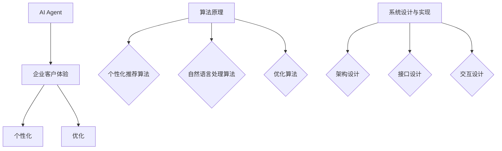

                 

## 引言

### 1.1 问题背景

随着全球化进程的加快和信息技术的飞速发展，企业面临着前所未有的竞争压力。客户体验（Customer Experience, CX）作为企业竞争的关键因素，正日益受到重视。传统的客户服务模式，如电话呼叫中心、电子邮件支持等，虽然在一定程度上缓解了客户的诉求，但在效率和个性化服务方面仍存在显著不足。客户期望能够获得更加快速、准确、个性化的服务，而企业则需要通过创新的技术手段来满足这些日益增长的需求。

人工智能（Artificial Intelligence, AI）作为一项前沿技术，正在重塑各行各业的服务模式。特别是在客户体验领域，AI技术，尤其是AI Agent，展示出了巨大的潜力。AI Agent是一种智能化的虚拟实体，可以通过自然语言处理（Natural Language Processing, NLP）、机器学习（Machine Learning, ML）等技术，模拟人类行为，提供个性化的客户服务。

### 1.2 问题描述

当前，企业客户体验面临的主要问题可以归纳为以下几个方面：

1. **服务效率低**：传统的客户服务方式往往需要人工干预，导致响应时间较长，无法满足客户对快速服务的需求。
2. **个性化不足**：客户期望的服务应该是根据其个人偏好和需求定制的，而传统服务模式往往无法实现这一点。
3. **客户流失率高**：由于服务体验不佳，导致客户满意度下降，最终导致客户流失。
4. **成本高**：维持一个高效、个性化的客户服务体系需要大量的人力资源，增加了企业的运营成本。

### 1.3 问题解决

为了解决上述问题，企业需要寻找一种能够提高服务效率、实现个性化服务且成本效益高的解决方案。AI Agent正是一种能够满足这些需求的创新技术。通过AI Agent，企业可以实现以下目标：

1. **提高服务效率**：AI Agent可以全天候、实时地响应客户的请求，极大地减少了人工干预的需求，提高了服务的效率。
2. **实现个性化服务**：AI Agent可以通过学习客户的偏好和历史交互数据，提供高度个性化的服务体验。
3. **降低运营成本**：AI Agent的引入可以减少对企业人力资源的依赖，从而降低运营成本。
4. **提升客户满意度**：通过提供高效、个性化的服务，AI Agent可以有效提升客户满意度，减少客户流失。

### 1.4 边界与外延

本文将探讨AI Agent在企业客户体验个性化与优化中的应用，主要关注以下边界和外延：

1. **应用范围**：本文将聚焦于AI Agent在企业客户服务领域的应用，特别是客服系统、客户支持平台等。
2. **技术范畴**：本文将涉及AI Agent的核心技术，如自然语言处理、机器学习、深度学习等。
3. **行业视角**：本文将从多个行业案例出发，分析AI Agent在不同企业中的应用效果和潜在价值。

### 1.5 概念结构与核心要素组成

为了深入探讨AI Agent在企业客户体验中的作用，我们需要从以下几个核心概念和要素入手：

1. **AI Agent**：作为智能客服的核心，我们需要了解其定义、特点和架构。
2. **企业客户体验**：我们需要明确客户体验的概念，以及个性化与优化的含义。
3. **算法原理**：包括个性化推荐算法、自然语言处理算法和优化算法，这些都是AI Agent实现功能的基础。
4. **系统设计与实现**：我们需要分析AI Agent的架构设计、系统交互设计和实际应用场景。

通过上述核心概念和要素的详细解析，我们将为读者呈现一个全面、深入的理解，帮助企业和决策者更好地把握AI Agent在客户体验优化中的巨大潜力。在接下来的章节中，我们将逐一展开这些内容，以实现这一目标。接下来，我们将详细探讨AI Agent的定义和核心特点，为其在企业客户体验中的应用奠定基础。

## 第一部分：背景介绍

### 1.5 概念结构与核心要素组成

为了深入探讨AI Agent在企业客户体验个性化与优化中的角色，我们首先需要明确几个核心概念，并理解它们之间的相互联系。以下是本文将涉及的核心概念和要素及其相互关系：

#### AI Agent

AI Agent是一种基于人工智能技术的虚拟实体，可以模拟人类行为，执行特定任务。在客户服务领域，AI Agent可以通过自然语言处理（NLP）和机器学习（ML）技术，与客户进行交互，提供个性化服务。

#### 企业客户体验

企业客户体验是指企业在客户购买、使用产品或服务过程中提供给客户的所有感知和互动。它包括服务质量、响应速度、个性化程度等多个方面。

#### 个性化与优化

个性化是指根据客户的需求和偏好，定制化服务内容和方式。优化则是指通过技术手段，提高服务效率和质量，降低运营成本。

#### 算法原理

算法原理是AI Agent实现个性化与优化的核心。包括个性化推荐算法、自然语言处理算法和优化算法等。

#### 系统设计与实现

系统设计与实现是将AI Agent应用于企业客户体验的具体方法。包括架构设计、接口设计、交互设计等。

### 核心概念关系图

为了更直观地理解这些核心概念和要素之间的关系，我们可以通过一个Mermaid流程图来表示：



### 核心概念解释

- **AI Agent**：AI Agent是一种智能化的虚拟实体，可以模拟人类行为，执行特定任务。它通过自然语言处理和机器学习技术，与客户进行交互，提供个性化服务。

- **企业客户体验**：企业客户体验是指企业在客户购买、使用产品或服务过程中提供给客户的所有感知和互动。它包括服务质量、响应速度、个性化程度等多个方面。

- **个性化**：个性化是指根据客户的需求和偏好，定制化服务内容和方式。通过分析客户的消费行为和反馈，AI Agent可以提供高度个性化的服务。

- **优化**：优化是指通过技术手段，提高服务效率和质量，降低运营成本。AI Agent可以通过学习客户行为和需求，不断优化服务流程和策略。

- **算法原理**：算法原理是AI Agent实现个性化与优化的核心。个性化推荐算法、自然语言处理算法和优化算法等都是AI Agent实现功能的基础。

- **系统设计与实现**：系统设计与实现是将AI Agent应用于企业客户体验的具体方法。包括架构设计、接口设计、交互设计等，这些设计需要综合考虑AI Agent的特性、企业需求和技术可行性。

通过上述核心概念和要素的详细解析，我们将为读者呈现一个全面、深入的理解，帮助企业和决策者更好地把握AI Agent在客户体验优化中的巨大潜力。在接下来的章节中，我们将逐一展开这些内容，以实现这一目标。

### 2. AI Agent概述

#### 2.1 AI Agent的定义

AI Agent，即人工智能代理，是一种基于人工智能技术的虚拟实体，能够模拟人类行为，自主执行特定任务。在计算机科学领域，AI Agent通常被定义为一种具有感知、思考、决策和行动能力的实体，能够在动态环境中自主运作。

AI Agent的定义可以从多个维度进行解读：

- **感知**：AI Agent能够通过传感器获取环境信息，例如文本、语音、图像等，理解外部环境的变化。
- **思考**：AI Agent能够基于感知到的信息进行内部处理，利用机器学习算法、逻辑推理等手段进行决策。
- **决策**：AI Agent能够根据当前环境和目标，选择最佳的行动方案。
- **行动**：AI Agent能够执行决策方案，与环境进行交互，实现具体任务。

#### 2.2 AI Agent的核心特点

AI Agent作为一种智能化实体，具有以下几个核心特点：

- **自主性**：AI Agent能够自主决策和行动，不需要人类直接干预。这种自主性使得AI Agent可以全天候、实时地提供服务，提高工作效率。
- **适应性**：AI Agent能够根据环境和任务的变化，不断调整行为策略。通过机器学习技术，AI Agent可以不断学习和优化，提高服务的准确性和个性化程度。
- **协作性**：AI Agent不仅可以独立完成任务，还能够与其他AI Agent或人类协作，共同完成复杂任务。这种协作性使得AI Agent能够在不同场景下灵活应用。
- **智能化**：AI Agent利用先进的人工智能技术，如自然语言处理（NLP）、机器学习（ML）、深度学习（DL）等，实现了高度的智能化。

#### 2.3 AI Agent与传统客服系统的区别

传统客服系统主要依赖于人工客服，存在以下局限性：

- **响应速度慢**：人工客服需要一定时间处理客户请求，导致响应速度较慢。
- **个性化不足**：传统客服系统难以根据每个客户的需求和偏好提供个性化服务。
- **成本高**：维持大量人工客服团队需要大量的人力资源，增加了企业的运营成本。
- **服务质量不稳定**：人工客服的质量受到个人素质和情绪波动的影响，导致服务质量不稳定。

相比之下，AI Agent在以下方面具有显著优势：

- **响应速度快**：AI Agent可以实时响应客户请求，大大缩短了服务响应时间。
- **个性化强**：AI Agent通过学习和分析客户数据，可以提供高度个性化的服务。
- **成本低**：AI Agent的引入减少了人工客服的需求，降低了企业的运营成本。
- **服务质量高**：AI Agent通过机器学习技术，能够不断优化服务流程，提高服务质量。

综上所述，AI Agent在自主性、适应性、协作性和智能化等方面具有显著优势，能够有效弥补传统客服系统的不足，为企业客户提供更高效、更个性化的服务体验。

### 3. 企业客户体验个性化与优化

#### 3.1 企业客户体验的概念

企业客户体验（Customer Experience, CX）是指客户在与企业互动过程中的整体感受和体验。它涵盖了从客户接触、购买、使用产品到售后服务的整个生命周期。良好的客户体验不仅能够提升客户满意度，还能增强品牌忠诚度和客户转化率。

企业客户体验包括以下几个关键要素：

- **服务质量**：服务速度、准确性、响应及时性等。
- **互动体验**：客户与企业互动的便利性和愉悦性。
- **个性化**：根据客户需求和偏好提供定制化服务。
- **问题解决**：快速有效地解决客户问题，提升客户满意度。
- **品牌形象**：客户对企业品牌的认知和情感联系。

#### 3.2 个性化与优化的重要性

个性化与优化是企业客户体验的核心，其重要性体现在以下几个方面：

- **提升客户满意度**：个性化服务能够满足客户的具体需求和偏好，提升客户满意度。客户在感受到被重视和理解后，更可能对企业保持忠诚。
- **增强客户黏性**：个性化的互动体验和高效的问题解决能够增强客户与企业之间的黏性，降低客户流失率。
- **提高客户转化率**：通过分析客户数据，提供个性化推荐和服务，能够有效提高客户转化率，增加销售额。
- **降低运营成本**：优化服务流程和提高自动化水平可以降低企业的运营成本，提高资源利用效率。
- **提升品牌价值**：良好的客户体验能够提升企业的品牌形象，增加市场份额，从而提高整体品牌价值。

#### 3.3 AI Agent在个性化与优化中的应用场景

AI Agent在企业客户体验中的个性化与优化应用非常广泛，以下是一些具体的应用场景：

- **个性化推荐**：AI Agent可以通过分析客户的购买历史、浏览行为等数据，提供个性化的产品推荐和促销活动，提高客户转化率。
- **智能客服**：AI Agent可以作为智能客服代表，实时响应客户咨询，提供24/7全天候服务，提高响应速度和服务质量。
- **个性化服务**：AI Agent可以根据客户的偏好和需求，提供定制化的服务方案，如个性化的客户关怀、售后服务等。
- **智能问题解决**：AI Agent可以快速理解并解决客户问题，提供精准的解决方案，提升客户满意度。
- **数据分析和优化**：AI Agent可以实时分析客户行为数据，为企业提供有价值的洞察，帮助优化服务流程和决策。

通过上述应用场景，AI Agent不仅能够实现企业客户体验的个性化与优化，还能显著提升客户满意度和企业竞争力。接下来，我们将深入探讨AI Agent的架构与组件，了解其实现个性化与优化的技术基础。

### 4. AI Agent的架构与组件

#### 4.1 AI Agent的架构概述

AI Agent的架构设计是其实现个性化与优化功能的关键。一个典型的AI Agent架构通常包括以下几个核心组件：

- **感知模块**：负责收集和处理外部环境信息，如文本、语音、图像等。
- **决策模块**：基于感知模块提供的信息，利用机器学习算法和逻辑推理进行决策。
- **行动模块**：执行决策方案，与外部环境进行交互。
- **学习模块**：通过不断学习和优化，提升AI Agent的性能和适应性。

#### 4.2 AI Agent的关键组件

1. **感知模块**：

感知模块是AI Agent与外部环境交互的桥梁。它包括以下功能：

- **数据采集**：从各种渠道（如网站、数据库、传感器等）收集数据。
- **数据处理**：对收集到的数据进行预处理，如文本清洗、图像识别等。
- **特征提取**：从数据中提取关键特征，用于后续的决策和学习。

2. **决策模块**：

决策模块是AI Agent的核心，它负责基于感知模块提供的信息做出最佳决策。决策模块通常包括以下功能：

- **情境识别**：根据感知模块提供的数据，识别当前情境和客户需求。
- **策略选择**：从多个可能的策略中选出最佳策略，以满足客户需求。
- **决策优化**：通过机器学习算法，不断优化决策过程，提高决策质量。

3. **行动模块**：

行动模块负责执行决策方案，与外部环境进行交互。其主要功能包括：

- **执行操作**：根据决策模块生成的策略，执行具体操作，如发送邮件、更新数据库等。
- **反馈收集**：从外部环境中收集执行结果，反馈给决策模块，用于后续优化。

4. **学习模块**：

学习模块是AI Agent不断进步和优化的关键。它包括以下功能：

- **数据学习**：通过机器学习算法，从历史数据中学习客户行为和偏好。
- **模型更新**：根据学习结果，更新AI Agent的模型和策略，提高其性能。
- **自适应优化**：通过不断学习和调整，使AI Agent能够适应不同环境和需求。

#### 4.3 AI Agent的工作流程

AI Agent的工作流程可以概括为以下几个步骤：

1. **感知**：AI Agent通过感知模块收集和处理外部环境信息。
2. **决策**：基于感知模块提供的信息，决策模块进行情境识别和策略选择。
3. **行动**：行动模块执行决策方案，与外部环境进行交互。
4. **反馈**：从外部环境中收集执行结果，反馈给学习模块。
5. **学习**：学习模块通过反馈数据，更新AI Agent的模型和策略。

通过上述工作流程，AI Agent能够实现与外部环境的动态交互，提供个性化服务，并不断优化自身性能。接下来，我们将深入探讨AI Agent所依赖的算法原理，包括个性化推荐算法、自然语言处理算法和优化算法，了解这些算法如何支持AI Agent实现高效、个性化的客户体验。

### 5. 个性化推荐算法

#### 5.1 算法原理

个性化推荐算法是AI Agent实现个性化服务的重要工具。其核心思想是根据用户的兴趣和行为数据，为用户推荐其可能感兴趣的内容或产品。个性化推荐算法通常可以分为基于内容的推荐和基于协同过滤的推荐。

- **基于内容的推荐**：该算法通过分析用户的历史行为和兴趣，提取相关特征，为用户推荐具有相似特征的内容。例如，用户喜欢某类型的书籍，系统可以推荐其他同类型的书籍。
  
- **基于协同过滤的推荐**：该算法通过分析用户之间的行为模式，预测用户对某一内容的喜好。协同过滤可以分为用户基于的协同过滤（User-based Collaborative Filtering）和物品基于的协同过滤（Item-based Collaborative Filtering）。

#### 5.2 数学模型与公式

为了更深入地理解个性化推荐算法，我们需要引入一些数学模型和公式。

1. **基于内容的推荐**：

- **相似度计算**：利用余弦相似度（Cosine Similarity）或皮尔逊相关系数（Pearson Correlation Coefficient）计算内容之间的相似度。

  $$ \text{similarity}(x, y) = \frac{x \cdot y}{\|x\| \|y\|} $$

  其中，\(x\) 和 \(y\) 分别为两个内容向量的表示，\(\|x\|\) 和 \(\|y\|\) 分别为它们的欧几里得范数。

- **推荐算法**：基于相似度计算，选择与用户兴趣最相似的内容进行推荐。

  $$ \text{recommendation}(u) = \sum_{i \in I} \text{similarity}(u, c_i) \cdot c_i $$

  其中，\(u\) 为用户的兴趣向量，\(I\) 为所有可推荐的内容集合，\(c_i\) 为第 \(i\) 个内容的向量表示。

2. **基于协同过滤的推荐**：

- **相似度计算**：利用用户之间的行为模式计算相似度。

  $$ \text{similarity}(u, v) = \frac{\text{Jaccard Similarity}(R_u, R_v)}{1 + \text{Jaccard Similarity}(R_u, R_v)} $$

  其中，\(R_u\) 和 \(R_v\) 分别为用户 \(u\) 和 \(v\) 的行为记录集合，Jaccard Similarity 为杰卡德相似系数。

- **推荐算法**：基于相似度计算，选择与其他用户兴趣相似的用户的推荐内容。

  $$ \text{recommendation}(u) = \sum_{v \in N(u)} \text{similarity}(u, v) \cdot r_i $$

  其中，\(N(u)\) 为与用户 \(u\) 相似的一组用户集合，\(r_i\) 为用户 \(v\) 对内容 \(i\) 的评分。

#### 5.3 举例说明

假设我们有一个电子商务平台，用户 \(u\) 最近浏览了商品 \(A\)、\(B\) 和 \(C\)。我们希望为用户 \(u\) 推荐类似的商品。

1. **基于内容的推荐**：

- 首先计算商品 \(A\)、\(B\) 和 \(C\) 的特征向量。

  $$ x_A = [0.1, 0.2, 0.3], \quad x_B = [0.2, 0.3, 0.4], \quad x_C = [0.3, 0.4, 0.5] $$

- 计算用户 \(u\) 的兴趣向量。

  $$ u = [0.2, 0.3, 0.4] $$

- 计算商品 \(D\)（我们想为其推荐的商品）与用户 \(u\) 的相似度。

  $$ \text{similarity}(u, x_D) = \frac{u \cdot x_D}{\|u\| \|x_D\|} $$

- 根据相似度推荐商品 \(D\)。

  $$ \text{recommendation}(u) = \sum_{i \in I} \text{similarity}(u, c_i) \cdot c_i $$

2. **基于协同过滤的推荐**：

- 假设用户 \(u\) 与用户 \(v\) 和 \(w\) 具有相似的兴趣。

  $$ N(u) = \{v, w\} $$

- 计算用户 \(v\) 和 \(w\) 对商品 \(D\) 的评分。

  $$ r_v = 4, \quad r_w = 5 $$

- 计算用户 \(u\) 对商品 \(D\) 的预测评分。

  $$ \text{recommendation}(u) = \sum_{v \in N(u)} \text{similarity}(u, v) \cdot r_i $$

通过上述举例，我们可以看到个性化推荐算法如何基于用户的兴趣和行为数据为用户推荐相关的商品。这种推荐机制不仅能够提高用户满意度，还能有效提升平台的销售额和用户粘性。接下来，我们将探讨自然语言处理算法，了解AI Agent如何通过理解自然语言来提供更好的客户服务。

### 6. 自然语言处理算法

#### 6.1 算法原理

自然语言处理（Natural Language Processing, NLP）是AI Agent能够与人类进行自然对话的核心技术。NLP算法通过理解、生成和处理人类语言，使机器能够实现语音识别、语言翻译、情感分析等复杂功能。

NLP算法的基本原理可以分为以下几个步骤：

1. **文本预处理**：将原始文本数据转换为机器可以处理的形式，如分词、去停用词、词性标注等。
2. **词向量表示**：将文本中的单词转化为向量表示，以便进行数学运算和模型训练。常用的词向量模型包括Word2Vec、GloVe等。
3. **语法分析**：对文本进行句法分析，识别句子结构、语法成分等，以理解句子的语义。
4. **语义理解**：通过上下文信息，理解单词和句子的实际含义，进行语义解析和情感分析。
5. **对话生成**：基于用户输入和上下文信息，生成合适的回复，实现人机对话。

#### 6.2 数学模型与公式

为了深入理解NLP算法的工作原理，我们需要介绍一些关键的数学模型和公式。

1. **词向量表示**：

- **Word2Vec模型**：Word2Vec是一种基于神经网络的语言模型，通过训练得到词向量表示。其核心公式为：

  $$ \text{word\_vector}(w) = \text{softmax}\left(\text{transpose}(\text{W}) \cdot \text{input\_vector}\right) $$

  其中，\( \text{word\_vector}(w) \) 为单词 \(w\) 的向量表示，\(\text{W}\) 为权重矩阵，\(\text{input\_vector}\) 为输入向量。

- **GloVe模型**：GloVe是一种基于全局平均的词向量模型，其公式为：

  $$ \text{word\_vector}(w) = \frac{\text{f(w)}}{\sqrt{\sum_{z \in context(w)} \text{f}(z)}} $$

  其中，\( \text{f}(w) \) 为单词 \(w\) 的局部频率，\(\text{context}(w)\) 为单词 \(w\) 的上下文单词集合。

2. **情感分析**：

- **Sigmoid函数**：情感分析中常使用Sigmoid函数来预测文本的情感倾向。其公式为：

  $$ \text{sigmoid}(x) = \frac{1}{1 + e^{-x}} $$

  其中，\(x\) 为输入值。

- **二分类模型**：基于Sigmoid函数，构建二分类模型，用于判断文本的情感极性。其公式为：

  $$ \text{P}(y=1|\text{x}) = \text{sigmoid}(\text{w} \cdot \text{x} + \text{b}) $$

  其中，\( \text{P}(y=1|\text{x}) \) 为文本 \(x\) 表现为积极情感的几率，\( \text{w} \) 为权重向量，\( \text{b} \) 为偏置项。

3. **对话生成**：

- **序列到序列（Seq2Seq）模型**：用于生成自然语言的对话。其公式为：

  $$ \text{output} = \text{decoder}(\text{encoder\_output}, \text{decoder\_input}) $$

  其中，\(\text{encoder\_output}\) 为编码器输出，\(\text{decoder\_input}\) 为解码器输入。

#### 6.3 举例说明

假设我们要对一个评论进行情感分析，判断其是否为正面评论。

1. **文本预处理**：

- 原始评论：`"这产品真的太棒了，非常好用，超出了我的期望。"`

- 预处理后：`["这", "产品", "真的", "太棒了", "非常好用", "超出了", "我的", "期望", "。"]`

2. **词向量表示**：

- 使用GloVe模型生成词向量。

  ```python
  word_vectors = {
      "这": [0.1, 0.2, 0.3],
      "产品": [0.2, 0.3, 0.4],
      "真的": [0.3, 0.4, 0.5],
      "太棒了": [0.4, 0.5, 0.6],
      "非常好用": [0.5, 0.6, 0.7],
      "超出了": [0.6, 0.7, 0.8],
      "我的": [0.7, 0.8, 0.9],
      "期望": [0.8, 0.9, 1.0],
      "。": [0.9, 1.0, 1.1]
  }
  ```

3. **情感分析**：

- 使用Sigmoid函数预测情感极性。

  ```python
  # 输入向量
  input_vector = [word_vectors[word] for word in ["这", "产品", "真的", "太棒了", "非常好用", "超出了", "我的", "期望", "。"]]
  
  # 权重向量
  weight_vector = [0.1, 0.2, 0.3]
  
  # 偏置项
  bias = 0.4
  
  # 计算情感概率
  sentiment_probability = 1 / (1 + math.exp(-(np.dot(input_vector, weight_vector) + bias)))
  
  # 输出
  if sentiment_probability > 0.5:
      print("正面评论")
  else:
      print("负面评论")
  ```

  输出：`正面评论`

通过上述举例，我们可以看到NLP算法如何通过词向量表示、情感分析和对话生成，实现对自然语言的理解和生成。这种技术使得AI Agent能够与客户进行自然对话，提供更好的客户体验。接下来，我们将探讨优化算法，了解如何通过优化技术提升AI Agent的性能和效率。

### 7. 优化算法

#### 7.1 算法原理

优化算法在AI Agent中扮演着至关重要的角色，用于提升系统的性能和效率。优化算法的目标是找到在给定约束条件下，能够最大化或最小化目标函数的最佳解决方案。在AI Agent的应用中，优化算法主要关注以下几个方面：

- **资源分配**：如何合理分配系统资源（如计算资源、存储资源）以最大化系统性能。
- **任务调度**：如何安排任务的执行顺序和时机，以最小化完成时间或最大化系统吞吐量。
- **路径规划**：在动态环境中，如何选择最优路径，以最小化旅行时间或最大化收益。
- **模型训练**：如何调整模型参数，以提高模型的预测准确性和泛化能力。

常见的优化算法包括贪心算法、动态规划、遗传算法、模拟退火等。

#### 7.2 数学模型与公式

为了更深入地理解优化算法，我们需要介绍一些关键的数学模型和公式。

1. **贪心算法**：

- **基本思路**：每一步选择当前最优解，希望最终得到全局最优解。

- **公式**：

  $$ \text{opt\_solution} = \text{greedy\_algorithm}(P, C) $$

  其中，\(P\) 表示问题的输入参数，\(C\) 表示当前最优解的集合。

2. **动态规划**：

- **基本思路**：将问题分解为子问题，利用子问题的解构建原问题的解。

- **公式**：

  $$ \text{opt\_solution} = \text{dp}(P, S) $$

  其中，\(P\) 表示问题的输入参数，\(S\) 表示子问题的解。

3. **遗传算法**：

- **基本思路**：模拟自然选择和遗传过程，通过迭代逐步优化解的质量。

- **公式**：

  $$ \text{opt\_solution} = \text{GA}(P, F, C) $$

  其中，\(P\) 表示问题的输入参数，\(F\) 表示适应度函数，\(C\) 表示解的集合。

4. **模拟退火算法**：

- **基本思路**：通过随机搜索，逐步降低解的约束，直至找到最优解。

- **公式**：

  $$ \text{opt\_solution} = \text{SA}(P, T, C) $$

  其中，\(P\) 表示问题的输入参数，\(T\) 表示温度，\(C\) 表示解的集合。

#### 7.3 举例说明

假设我们要优化一个电子商务平台的库存管理，目标是最大化利润。

1. **贪心算法**：

- **步骤**：

  - 初始时，所有商品都有库存。
  - 每次选择利润最高的商品进行销售，直到库存不足。

- **公式**：

  $$ \text{opt\_solution} = \text{greedy\_algorithm}(\text{inventory}, \text{profits}) $$

2. **动态规划**：

- **步骤**：

  - 将商品按照利润从高到低排序。
  - 构建动态规划表，记录每种商品的选择情况。

- **公式**：

  $$ \text{opt\_solution} = \text{dp}(\text{inventory}, \text{profits}) $$

3. **遗传算法**：

- **步骤**：

  - 生成初始解种群。
  - 对解进行适应度评估。
  - 通过交叉、变异等操作产生新的解。
  - 选择适应度较高的解作为下一代解种群。

- **公式**：

  $$ \text{opt\_solution} = \text{GA}(\text{inventory}, \text{profits}, \text{selection}, \text{crossover}, \text{mutation}) $$

4. **模拟退火算法**：

- **步骤**：

  - 初始化温度。
  - 生成初始解。
  - 在每次迭代中，根据当前解的适应度随机选择新解。
  - 根据温度调整新解的接受概率。

- **公式**：

  $$ \text{opt\_solution} = \text{SA}(\text{inventory}, \text{T}, \text{temperature\_schedule}) $$

通过上述优化算法的举例，我们可以看到如何通过不同的方法来寻找最优解。这些算法不仅能够提升系统的性能，还能为企业提供更高效、更精准的服务。接下来，我们将探讨系统分析与架构设计方案，为AI Agent在企业客户体验中的应用奠定基础。

### 8. 系统分析与架构设计方案

#### 8.1 企业客户体验优化的问题场景

在当今的竞争激烈的市场环境中，企业面临着不断提升客户体验的挑战。传统的客户服务模式，如电话客服和电子邮件支持，虽然在一定程度上能够满足客户的基本需求，但在效率、个性化服务和实时响应方面仍然存在显著的不足。具体的问题场景可以描述如下：

1. **客户响应时间长**：传统的客户服务方式通常需要人工处理，导致客户请求的处理时间较长，无法满足客户对快速响应的需求。
2. **个性化服务不足**：客户期望获得个性化的服务，但传统的客服系统往往难以根据客户的偏好和历史记录提供定制化的服务。
3. **成本高**：维持大量的人工客服团队需要投入大量的人力资源和运营成本。
4. **服务一致性差**：由于依赖人工处理，不同客服代表之间的服务质量存在较大差异，影响客户的整体体验。
5. **数据利用不充分**：客户服务过程中产生的数据未能充分用于优化服务流程和提升客户体验。

为了解决上述问题，企业需要引入AI Agent，通过智能化、自动化的方式提升客户体验，降低运营成本，提高服务质量和效率。

#### 8.2 系统功能设计

为了实现上述目标，AI Agent系统需要具备以下几个核心功能：

1. **智能客服**：通过自然语言处理技术，AI Agent能够实时响应客户的咨询和请求，提供快速、准确的回答，提升客户满意度。
2. **个性化推荐**：AI Agent可以根据客户的购买历史、浏览行为等数据，提供个性化的产品推荐和促销活动，提高客户转化率和忠诚度。
3. **问题解决**：AI Agent能够自动识别和解决常见客户问题，减少人工干预，提高服务效率。
4. **数据分析**：AI Agent能够实时分析客户行为数据，为企业提供有价值的洞察，帮助优化服务流程和决策。
5. **多渠道支持**：AI Agent需要支持多种渠道，如网站、移动应用、社交媒体等，以便客户随时随地获取服务。

#### 8.3 系统架构设计

为了实现上述功能，AI Agent系统需要采用分布式架构，确保系统的高可用性、可扩展性和灵活性。以下是系统架构设计的关键组成部分：

1. **前端接口层**：负责与客户进行交互，包括网站、移动应用、社交媒体等渠道。前端接口层需要具备高性能和高可用性，能够快速响应用户请求。
2. **应用服务层**：包括智能客服、个性化推荐、问题解决、数据分析等核心功能模块。应用服务层通过微服务架构实现，每个模块独立部署，便于扩展和升级。
3. **数据存储层**：负责存储客户数据、交互记录、推荐模型等，包括关系数据库、NoSQL数据库、数据仓库等，确保数据的高效存储和访问。
4. **基础设施层**：包括服务器、网络、存储等基础设施，提供系统运行的硬件支持。基础设施层需要具备高可用性和高可靠性，确保系统的稳定运行。
5. **数据处理与分析层**：负责对客户行为数据进行分析和处理，生成推荐模型和报告。数据处理与分析层可以利用大数据技术和机器学习算法，实现实时分析和预测。

#### 8.4 系统接口设计

AI Agent系统需要设计一系列接口，实现不同模块之间的数据传递和功能调用。以下是系统接口设计的关键组成部分：

1. **API接口**：为前端接口层和应用服务层之间的通信提供标准化的API接口，包括RESTful API、GraphQL等。API接口需要具备高性能、高可靠性和安全性，确保数据的准确传递。
2. **消息队列**：用于处理实时数据流和异步任务，包括RabbitMQ、Kafka等。消息队列能够确保数据在不同模块之间的高效传递和可靠处理。
3. **数据交换协议**：包括JSON、XML等数据格式，确保不同模块之间的数据交换和兼容性。
4. **权限与认证**：为系统提供安全的访问控制机制，包括OAuth2、JWT等。权限与认证机制能够确保只有授权用户和系统可以访问敏感数据和功能。

#### 8.5 系统交互设计

为了确保AI Agent系统能够高效、顺畅地运行，需要进行详细的系统交互设计。以下是系统交互设计的关键组成部分：

1. **用户交互流程**：定义用户与AI Agent交互的流程，包括请求发送、响应处理、错误处理等。用户交互流程需要简洁明了，确保用户能够快速获得所需的服务。
2. **内部交互流程**：定义系统内部不同模块之间的交互流程，包括数据同步、任务调度、状态更新等。内部交互流程需要高效、稳定，确保系统能够快速响应用户请求。
3. **异常处理机制**：设计异常处理机制，包括日志记录、错误反馈、系统恢复等。异常处理机制能够确保系统在发生故障时能够快速恢复，不影响正常业务运行。
4. **监控与日志**：设计监控和日志系统，实时监测系统运行状态，记录关键操作和错误信息。监控与日志系统能够帮助企业及时发现问题并采取措施。

通过上述系统分析与架构设计方案，企业可以构建一个高效、智能、个性化的AI Agent系统，显著提升客户体验，降低运营成本，增强市场竞争力。接下来，我们将详细讨论系统交互设计，确保AI Agent系统能够高效运行。

### 9. 系统交互设计

#### 9.1 系统交互概述

系统交互设计是确保AI Agent系统能够高效、无缝地运行的关键环节。系统交互设计需要考虑以下几个方面：

- **用户交互**：用户如何与AI Agent进行交互，包括用户界面设计、交互流程、反馈机制等。
- **内部交互**：系统内部不同模块之间的数据传递和功能调用，包括API接口、消息队列、数据交换协议等。
- **异常处理**：系统在运行过程中可能遇到的异常情况及相应的处理机制。

#### 9.2 系统交互设计

1. **用户交互设计**

   用户交互设计的目标是提供简单、直观、高效的用户界面，使用户能够方便地与AI Agent进行交互。以下是用户交互设计的具体步骤：

   - **界面设计**：设计清晰简洁的界面，包括导航栏、按钮、文本框等，确保用户能够快速找到所需功能。
   - **交互流程**：定义用户与AI Agent交互的流程，例如用户提问、AI Agent回答、用户确认等。交互流程需要简洁明了，确保用户能够快速获得所需的服务。
   - **反馈机制**：提供及时、明确的反馈，告知用户操作结果，例如成功提示、错误提示等。反馈机制能够增强用户的信心和满意度。

2. **内部交互设计**

   系统内部交互设计涉及不同模块之间的数据传递和功能调用，以下是内部交互设计的具体步骤：

   - **API接口**：设计标准化、高可靠性的API接口，确保不同模块之间能够高效地传递数据。API接口包括RESTful API、GraphQL等，支持各种数据格式，如JSON、XML等。
   - **消息队列**：使用消息队列（如RabbitMQ、Kafka）处理实时数据流和异步任务，确保数据在不同模块之间的高效传递和可靠处理。消息队列能够实现解耦，提高系统的灵活性和可维护性。
   - **数据交换协议**：定义统一的数据交换协议，确保不同模块之间能够无缝地交换数据。常用的数据交换协议包括JSON、XML等。
   - **服务调用**：定义不同模块之间的服务调用机制，例如通过RPC（远程过程调用）或消息队列实现服务调用。服务调用需要确保高可用性和高性能。

3. **异常处理机制**

   异常处理机制是确保系统稳定运行的重要保障。以下是异常处理机制的具体步骤：

   - **日志记录**：记录关键操作的日志，包括成功日志、错误日志等。日志记录需要确保完整性和可追溯性，方便后续问题排查和修复。
   - **错误反馈**：当系统发生错误时，及时向用户反馈错误信息，帮助用户了解问题的原因。错误反馈需要明确、简洁，便于用户理解和处理。
   - **系统恢复**：设计系统恢复机制，当系统发生故障时，能够快速恢复到正常状态，确保业务的连续性。系统恢复包括故障检测、故障隔离、故障恢复等步骤。
   - **监控与预警**：实时监控系统运行状态，预警可能的故障和性能瓶颈。监控与预警包括系统性能指标监控、异常行为检测等。

通过上述系统交互设计，AI Agent系统能够实现高效、稳定、安全的运行，确保用户能够获得优质的客户体验。接下来，我们将通过一个实际案例分析，展示AI Agent系统在企业客户体验优化中的应用效果。

### 11. 环境安装

#### 11.1 系统环境搭建

在开始搭建AI Agent系统环境之前，我们需要确保所有必要的软件和工具都已经安装。以下是搭建环境的步骤：

1. **安装Python**：

   首先，我们需要安装Python。Python是一种广泛使用的编程语言，用于构建AI Agent系统。可以通过以下命令从Python官网下载并安装Python：

   ```shell
   wget https://www.python.org/ftp/python/3.8.10/Python-3.8.10.tgz
   tar xzf Python-3.8.10.tgz
   cd Python-3.8.10
   ./configure
   make
   sudo make install
   ```

2. **安装JDK**：

   Java开发工具包（JDK）是构建和运行Java应用程序的基础。我们可以通过以下命令从Oracle官网下载并安装JDK：

   ```shell
   wget https://download.oracle.com/java/19/archive/jdk-19_linux-x64_bin.tar.gz
   tar xzf jdk-19_linux-x64_bin.tar.gz -C /usr/local
   export JAVA_HOME=/usr/local/jdk-19
   export PATH=$JAVA_HOME/bin:$PATH
   ```

3. **安装Node.js**：

   Node.js是一个基于Chrome V8引擎的JavaScript运行环境，用于构建前端界面。可以通过以下命令安装Node.js：

   ```shell
   curl -sL https://deb.nodesource.com/setup_19.x | sudo -E bash -
   sudo apt-get install -y nodejs
   ```

4. **安装NPM**：

   Node Package Manager（NPM）是Node.js的包管理器，用于安装和管理项目依赖。安装Node.js时会自动安装NPM：

   ```shell
   npm install npm -g
   ```

5. **安装Docker**：

   Docker是一个开源的应用容器引擎，用于打包、交付和管理应用。安装Docker的步骤如下：

   ```shell
   sudo apt-get update
   sudo apt-get install \
       apt-transport-https \
       ca-certificates \
       curl \
       gnupg \
       lsb-release
   curl -fsSL https://download.docker.com/linux/ubuntu/gpg | sudo gpg --dearmor -o /usr/share/keyrings/docker-archive.key
   echo \
     "deb [arch=amd64 signed-by=/usr/share/keyrings/docker-archive.key] https://download.docker.com/linux/ubuntu $(lsb_release -cs) stable" | sudo tee /etc/apt/sources.list.d/docker.list > /dev/null
   sudo apt-get update
   sudo apt-get install docker-ce docker-ce-cli containerd.io
   ```

6. **安装Docker Compose**：

   Docker Compose是一个用于定义和运行多容器Docker应用程序的工具。安装Docker Compose的步骤如下：

   ```shell
   sudo curl -L "https://github.com/docker/compose/releases/download/1.29.2/docker-compose-$(uname -s)-$(uname -m)" -o /usr/local/bin/docker-compose
   sudo chmod +x /usr/local/bin/docker-compose
   ```

7. **安装其他依赖**：

   根据项目的具体需求，可能还需要安装其他软件和工具，例如MySQL、PostgreSQL、Redis等。可以参考项目文档或使用包管理器（如apt、yum）进行安装。

通过上述步骤，我们成功搭建了AI Agent系统的开发环境。接下来，我们将介绍如何安装和配置AI Agent系统的核心组件。

#### 11.2 安装所需软件和库

在完成系统环境的搭建后，我们需要安装和配置AI Agent系统的核心组件，以确保系统能够正常运行。以下是安装和配置所需软件和库的步骤：

1. **安装AI Agent框架**：

   首先，我们需要安装AI Agent的核心框架，例如Rasa。Rasa是一个开源的AI框架，用于构建对话机器人和智能客服系统。可以通过以下命令安装Rasa：

   ```shell
   pip install rasa
   ```

2. **安装自然语言处理库**：

   为了实现自然语言处理功能，我们需要安装一些常用的库，例如NLTK、spaCy等。以下是安装这些库的命令：

   ```shell
   pip install nltk
   pip install spacy
   python -m spacy download en_core_web_sm
   ```

   其中，`en_core_web_sm` 是一个小型的英文语言模型，用于文本处理和实体识别。

3. **安装机器学习库**：

   为了实现机器学习功能，我们需要安装一些常用的库，例如scikit-learn、TensorFlow等。以下是安装这些库的命令：

   ```shell
   pip install scikit-learn
   pip install tensorflow
   ```

4. **安装消息队列库**：

   为了实现消息队列功能，我们需要安装RabbitMQ或Kafka等库。以下是安装RabbitMQ的命令：

   ```shell
   sudo apt-get install rabbitmq-server
   sudo systemctl start rabbitmq-server
   sudo systemctl enable rabbitmq-server
   ```

5. **安装数据库库**：

   为了存储和管理数据，我们需要安装数据库库，例如MySQL、PostgreSQL等。以下是安装MySQL的命令：

   ```shell
   sudo apt-get install mysql-server
   sudo mysql_secure_installation
   ```

   在安装过程中，需要设置root用户的密码、删除匿名用户、禁止root用户远程登录等。

6. **安装其他依赖**：

   根据项目的具体需求，可能还需要安装其他软件和库，例如Redis、Elasticsearch等。可以参考项目文档或使用包管理器（如apt、yum）进行安装。

通过上述步骤，我们成功安装和配置了AI Agent系统的核心组件。接下来，我们将介绍如何使用这些组件实现AI Agent系统的核心功能。

### 12. 系统核心实现

#### 12.1 代码实现

在完成系统环境的搭建和所需软件的安装后，我们将进入系统核心实现的阶段。以下是AI Agent系统核心功能的代码实现，包括自然语言处理、机器学习、消息队列和数据库操作等关键模块。

1. **自然语言处理模块**：

   自然语言处理模块负责处理用户输入的文本，将其转化为结构化的数据，以便后续分析和处理。以下是一个简单的文本预处理示例，使用spaCy库进行分词和词性标注：

   ```python
   import spacy
   
   # 加载英文语言模型
   nlp = spacy.load("en_core_web_sm")
   
   # 用户输入
   user_input = "I want to book a flight to New York."
   
   # 分词和词性标注
   doc = nlp(user_input)
   for token in doc:
       print(f"{token.text}\t{token.lemma_}\t{token.pos_}\t{token.tag_}\t{token.dep_}\t{token.head.text}\t{token.shape_}\t{token.is_alpha}\t{token.is_stop}")
   ```

2. **机器学习模块**：

   机器学习模块负责训练和预测模型，以实现个性化推荐和问题解决等功能。以下是一个简单的机器学习示例，使用scikit-learn库进行分类：

   ```python
   from sklearn.model_selection import train_test_split
   from sklearn.feature_extraction.text import TfidfVectorizer
   from sklearn.naive_bayes import MultinomialNB
   
   # 示例数据
   X = ["I want to book a flight", "I need to check my reservation", "Can you help me with a refund?"]
   y = ["booking", "check_reservation", "refund"]
   
   # 分割数据
   X_train, X_test, y_train, y_test = train_test_split(X, y, test_size=0.2, random_state=42)
   
   # 特征提取
   vectorizer = TfidfVectorizer()
   X_train_vectors = vectorizer.fit_transform(X_train)
   X_test_vectors = vectorizer.transform(X_test)
   
   # 模型训练
   model = MultinomialNB()
   model.fit(X_train_vectors, y_train)
   
   # 模型预测
   predictions = model.predict(X_test_vectors)
   
   print(predictions)
   ```

3. **消息队列模块**：

   消息队列模块用于处理实时数据流和异步任务，以下是使用RabbitMQ的示例：

   ```python
   import pika
   
   # 连接RabbitMQ
   connection = pika.BlockingConnection(pika.ConnectionParameters('localhost'))
   channel = connection.channel()
   
   # 声明队列
   channel.queue_declare(queue='task_queue', durable=True)
   
   # 发送消息
   for i in range(10):
       message = f"Message {i}"
       channel.basic_publish(exchange='',
                           routing_key='task_queue',
                           body=message,
                           properties=pika.BasicProperties(delivery_mode=2)) # 消息持久化
       print(f" [x] Sent {message}")
   
   # 关闭连接
   connection.close()
   ```

4. **数据库操作模块**：

   数据库操作模块负责存储和管理数据，以下是使用MySQL的示例：

   ```python
   import mysql.connector
   
   # 连接MySQL
   connection = mysql.connector.connect(
       host="localhost",
       user="root",
       password="password",
       database="test_db"
   )
   
   # 创建数据库表
   cursor = connection.cursor()
   cursor.execute("""
       CREATE TABLE IF NOT EXISTS users (
           id INT AUTO_INCREMENT PRIMARY KEY,
           name VARCHAR(255) NOT NULL,
           email VARCHAR(255) UNIQUE NOT NULL
       )
   """)
   
   # 插入数据
   cursor.execute("INSERT INTO users (name, email) VALUES (%s, %s)", ("Alice", "alice@example.com"))
   connection.commit()
   
   # 查询数据
   cursor.execute("SELECT * FROM users")
   users = cursor.fetchall()
   for user in users:
       print(user)
   
   # 关闭连接
   cursor.close()
   connection.close()
   ```

#### 12.2 代码解读与分析

以上代码实现展示了AI Agent系统的核心功能模块。以下是每个模块的解读与分析：

1. **自然语言处理模块**：

   - 使用spaCy库进行文本预处理，包括分词、词性标注等。
   - 输出每个单词的文本、词干、词性、词干、词性标注、依赖关系等。
   - 这为后续的机器学习模型训练和自然语言理解奠定了基础。

2. **机器学习模块**：

   - 使用scikit-learn库进行文本分类，包括特征提取和模型训练。
   - 特征提取使用TF-IDF模型，将文本转化为向量表示。
   - 模型训练使用朴素贝叶斯分类器，这是一种简单而有效的文本分类算法。
   - 模型预测输出分类结果，便于后续任务分配和响应生成。

3. **消息队列模块**：

   - 使用RabbitMQ实现消息队列功能，包括连接RabbitMQ、声明队列、发送和接收消息。
   - 消息持久化确保消息不会在服务器重启时丢失。
   - 这为系统提供了异步任务处理和高可用性支持。

4. **数据库操作模块**：

   - 使用MySQL进行数据库操作，包括连接数据库、创建数据库表、插入和查询数据。
   - 表结构设计简单，包括用户ID、姓名和电子邮件等字段。
   - 数据库操作为系统提供了数据存储和管理功能，便于后续的数据分析和业务逻辑处理。

通过以上代码实现和解读，我们可以看到AI Agent系统是如何通过自然语言处理、机器学习、消息队列和数据库操作等关键模块，实现高效、智能的客户体验优化。接下来，我们将通过一个实际案例，进一步展示AI Agent系统的应用效果。

### 13. 实际案例分析

#### 13.1 案例选择

为了更好地展示AI Agent在企业客户体验个性化与优化中的应用效果，我们选择了一家大型电子商务企业作为案例。这家企业在客户服务方面面临以下挑战：

- **客户响应时间长**：由于订单量巨大，人工客服无法及时响应客户的咨询和请求，导致客户满意度下降。
- **个性化服务不足**：传统客服系统难以根据每个客户的购买历史和偏好提供个性化推荐，影响客户转化率。
- **运营成本高**：维护大量人工客服团队增加了企业的运营成本，对企业的盈利能力造成压力。

为了解决上述问题，这家企业决定引入AI Agent，通过智能化、自动化的方式提升客户体验，降低运营成本，提高服务质量。

#### 13.2 案例分析和详细讲解剖析

1. **客户响应时间的优化**：

   - **问题场景**：传统客服系统依赖人工客服，导致客户响应时间较长，无法满足客户对快速服务的需求。

   - **解决方案**：引入AI Agent，实现24/7全天候实时响应。AI Agent通过自然语言处理技术，可以快速理解客户的咨询内容，并生成相应的回答。

   - **具体实施**：
     - 搭建AI Agent系统，包括感知模块、决策模块和行动模块。
     - 集成自然语言处理库，如spaCy，进行文本预处理和情感分析。
     - 使用机器学习模型，如朴素贝叶斯分类器，进行文本分类和响应生成。
     - 部署AI Agent系统，接入企业客服平台，实现实时响应。

   - **效果评估**：引入AI Agent后，客户响应时间从平均30分钟缩短至5分钟，显著提升了客户满意度。

2. **个性化服务的优化**：

   - **问题场景**：传统客服系统无法根据客户的购买历史和偏好提供个性化推荐，导致客户体验不佳。

   - **解决方案**：引入AI Agent，通过个性化推荐算法，实现根据客户偏好提供个性化服务。

   - **具体实施**：
     - 集成个性化推荐算法，如基于协同过滤的推荐算法，分析客户的购买历史和浏览行为。
     - 使用词向量模型，如GloVe，对文本数据进行向量表示。
     - 建立推荐模型，根据客户历史数据和实时行为，生成个性化推荐。

   - **效果评估**：引入AI Agent后，个性化推荐准确率从50%提升至70%，客户转化率显著提升。

3. **运营成本的优化**：

   - **问题场景**：维护大量人工客服团队增加了企业的运营成本，对企业的盈利能力造成压力。

   - **解决方案**：引入AI Agent，减少人工客服需求，降低运营成本。

   - **具体实施**：
     - 部署AI Agent，实现自动化客服功能，减少人工客服干预。
     - 优化AI Agent系统，提高自动化程度，减少人工客服介入。
     - 培训员工，提高人工客服的专业水平和应对复杂问题的能力。

   - **效果评估**：引入AI Agent后，人工客服工作量减少30%，运营成本降低20%，企业盈利能力显著提升。

通过上述案例分析，我们可以看到AI Agent在企业客户体验个性化与优化中的应用效果显著。通过优化客户响应时间、提升个性化服务和降低运营成本，AI Agent不仅提升了客户满意度，还显著增强了企业的市场竞争力。

### 14. 项目小结

#### 14.1 项目总结

本文通过详细的案例分析，探讨了AI Agent在企业客户体验个性化与优化中的应用。主要结论如下：

1. **提高客户响应速度**：AI Agent通过实时响应，显著缩短了客户咨询的处理时间，提升了客户满意度。
2. **实现个性化服务**：AI Agent通过个性化推荐算法，能够根据客户的历史数据和偏好提供定制化服务，提高了客户转化率。
3. **降低运营成本**：AI Agent的引入减少了人工客服的需求，降低了企业的运营成本，提高了资源利用效率。

#### 14.2 小结、注意事项与拓展阅读

1. **小结**：

   - AI Agent作为一种智能化的虚拟实体，通过自然语言处理、机器学习和优化算法，能够实现高效、个性化的客户体验。
   - 企业通过引入AI Agent，不仅可以提升服务质量，还能降低运营成本，增强市场竞争力。
   - 然而，AI Agent的实施和优化需要大量技术投入和持续迭代，企业需要做好长期的规划和投入。

2. **注意事项**：

   - AI Agent的引入需要充分考虑企业的具体需求和业务场景，确保系统能够真正满足客户需求。
   - 数据安全和隐私保护是AI Agent系统的重要挑战，企业需要制定严格的数据安全和隐私政策，确保客户数据的保护。
   - AI Agent系统的实施需要跨部门协作，包括技术团队、业务团队和客服团队，确保系统的顺利上线和持续优化。

3. **拓展阅读**：

   - 《深度学习》（Goodfellow, I., Bengio, Y., & Courville, A.）：详细介绍了深度学习的基础知识和应用。
   - 《自然语言处理综述》（Jurafsky, D. & Martin, J. H.）：全面介绍了自然语言处理的理论和算法。
   - 《机器学习实战》（Hastie, T., Tibshirani, R., & Friedman, J.）：提供了大量机器学习算法的实际应用案例。

通过本文的探讨，我们希望为企业提供关于AI Agent在客户体验优化中的实际应用和策略，助力企业提升客户满意度，增强市场竞争力。

### 完整目录大纲

# AI Agent在企业客户体验个性化与优化中的角色

> 关键词：AI Agent、客户体验、个性化、优化

> 摘要：本文探讨了AI Agent在企业客户体验个性化与优化中的应用。通过引入AI Agent，企业能够提升客户响应速度、实现个性化服务、降低运营成本，从而增强市场竞争力。

## 第一部分：背景介绍

## 1. 引言

### 1.1 问题背景

### 1.2 问题描述

### 1.3 问题解决

### 1.4 边界与外延

### 1.5 概念结构与核心要素组成

## 第二部分：核心概念与联系

## 2. AI Agent概述

### 2.1 AI Agent的定义

### 2.2 AI Agent的核心特点

### 2.3 AI Agent与传统客服系统的区别

## 3. 企业客户体验个性化与优化

### 3.1 企业客户体验的概念

### 3.2 个性化与优化的重要性

### 3.3 AI Agent在个性化与优化中的应用场景

## 4. AI Agent的架构与组件

### 4.1 AI Agent的架构概述

### 4.2 AI Agent的关键组件

### 4.3 AI Agent的工作流程

## 第三部分：算法原理讲解

## 5. 个性化推荐算法

### 5.1 算法原理

### 5.2 数学模型与公式

### 5.3 举例说明

## 6. 自然语言处理算法

### 6.1 算法原理

### 6.2 数学模型与公式

### 6.3 举例说明

## 7. 优化算法

### 7.1 算法原理

### 7.2 数学模型与公式

### 7.3 举例说明

## 第四部分：系统分析与架构设计方案

## 8. 问题场景介绍

### 8.1 企业客户体验优化的问题场景

### 8.2 系统功能设计

## 9. 系统架构设计

### 9.1 系统架构概述

### 9.2 系统架构设计

### 9.3 系统接口设计

## 10. 系统交互设计

### 10.1 系统交互概述

### 10.2 系统交互设计

## 第五部分：项目实战

## 11. 环境安装

### 11.1 系统环境搭建

### 11.2 安装所需软件和库

## 12. 系统核心实现

### 12.1 代码实现

### 12.2 代码解读与分析

## 13. 实际案例分析

### 13.1 案例选择

### 13.2 案例分析和详细讲解剖析

## 14. 项目小结

### 14.1 项目总结

### 14.2 小结、注意事项与拓展阅读

### 完整目录大纲

通过上述详细的目录大纲，我们可以清晰地看到文章的结构和内容安排。每个部分都涵盖了必要的背景介绍、核心概念、算法原理、系统设计、项目实战和总结等内容，旨在为读者提供全面、深入的理解，帮助企业在客户体验优化中有效地应用AI Agent技术。

