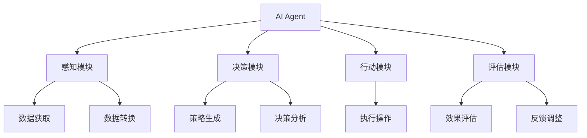
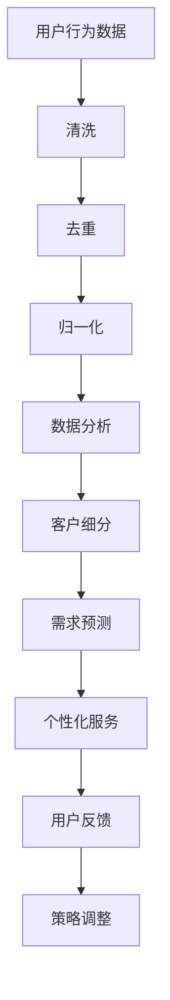

                 

```markdown
----------------------------------------------------------------
# AI Agent在企业客户体验个性化中的深度应用与效果评估

> 关键词：AI Agent、企业客户体验、个性化、效果评估、应用案例

> 摘要：本文深入探讨了AI Agent在企业客户体验个性化中的应用，详细阐述了其基本原理、实现方法、应用案例及效果评估。通过系统的分析和实例解析，本文旨在为企业在数字化转型过程中提供有益的参考和指导。

----------------------------------------------------------------

## 第一部分: AI Agent与企业客户体验个性化

### 第1章: AI Agent与企业客户体验个性化概述

#### 1.1 问题背景

#### 1.1.1 人工智能在企业中的应用现状

随着人工智能技术的飞速发展，越来越多的企业开始意识到AI在提升业务效率和客户体验方面的巨大潜力。从早期的自动化流程到现在的智能客服、个性化推荐，AI技术正在逐渐融入企业的各个业务环节。

#### 1.1.2 客户体验个性化的挑战与需求

在竞争激烈的市场环境中，企业需要不断优化客户体验以保持竞争力。个性化客户体验已经成为企业赢得客户忠诚度和市场占有率的关键因素。然而，传统的方法往往难以实现高度个性化的客户互动，这促使企业寻求更为智能和高效的解决方案。

#### 1.1.3 AI Agent的兴起与潜力

AI Agent，作为一种智能体，能够模拟人类行为，进行自主学习和决策，从而实现个性化的客户服务。AI Agent的兴起为解决企业客户体验个性化问题提供了新的思路和工具。

#### 1.2 问题描述

#### 1.2.1 传统客户体验模式的局限性

传统客户体验模式主要依赖于人工服务，存在响应速度慢、个性化程度低等问题。随着客户期望的不断提升，这种模式已经无法满足现代企业的需求。

#### 1.2.2 AI Agent如何提升客户体验

AI Agent通过数据分析和机器学习算法，可以实时理解客户需求，提供个性化的服务，从而提升客户满意度和忠诚度。

#### 1.2.3 企业实施AI Agent的必要性和可行性

在市场竞争日益激烈的背景下，企业需要借助AI Agent来提高客户体验，增强竞争力。同时，随着AI技术的成熟和成本的降低，AI Agent在企业中的应用变得可行。

#### 1.3 问题解决

#### 1.3.1 AI Agent的基本原理与架构

AI Agent基于机器学习和自然语言处理技术，能够模拟人类思维过程，进行自主学习和决策。其基本架构包括感知器、决策模块、行动模块和评估模块。

#### 1.3.2 AI Agent在企业客户体验中的应用策略

企业可以通过引入AI Agent，实现客户细分、需求预测、个性化推荐等功能，从而提升客户体验。

#### 1.3.3 效果评估与优化路径

企业需要建立一套科学的效果评估体系，对AI Agent的应用效果进行持续监测和评估，以便及时调整和优化。

#### 1.4 边界与外延

#### 1.4.1 AI Agent在不同行业中的应用差异

不同行业的业务需求和客户特征不同，AI Agent的应用方式和效果也会有所差异。

#### 1.4.2 客户体验个性化的约束条件

客户体验个性化需要考虑数据隐私、技术可行性、成本等多方面因素。

#### 1.4.3 AI Agent技术发展的未来趋势

随着AI技术的不断进步，AI Agent将在更多领域得到应用，其功能也将更加智能化和个性化。

#### 1.5 概念结构与核心要素组成

AI Agent的核心概念包括感知、学习、决策和行动。企业客户体验个性化的关键要素包括数据、算法和用户体验。

----------------------------------------------------------------

## 第二部分: AI Agent的基本原理

### 第2章: AI Agent的基本原理

#### 2.1 AI Agent的核心概念

AI Agent是一种智能体，能够模拟人类行为，进行自主学习和决策。其核心概念包括感知、学习、决策和行动。

#### 2.1.1 感知

感知是指AI Agent通过传感器获取外部信息，如文本、图像、声音等。

#### 2.1.2 学习

学习是指AI Agent通过数据训练和模型优化，提升自身能力和性能。

#### 2.1.3 决策

决策是指AI Agent在感知到外部信息后，根据目标和策略选择最佳行动。

#### 2.1.4 行动

行动是指AI Agent根据决策结果，执行具体的操作。

#### 2.2 AI Agent的技术架构

AI Agent的技术架构包括感知模块、决策模块、行动模块和评估模块。

#### 2.2.1 感知模块

感知模块负责获取外部信息，并将其转换为AI Agent可以处理的数据。

#### 2.2.2 决策模块

决策模块负责分析感知模块获取的信息，并生成决策结果。

#### 2.2.3 行动模块

行动模块负责根据决策结果，执行具体的操作。

#### 2.2.4 评估模块

评估模块负责对AI Agent的决策和行动效果进行评估和反馈。

#### 2.3 AI Agent的核心算法

AI Agent的核心算法包括强化学习、生成对抗网络等。

#### 2.3.1 强化学习

强化学习是指AI Agent通过与环境的交互，不断优化自身策略，以达到最佳效果。

#### 2.3.2 生成对抗网络

生成对抗网络是指通过对抗过程，生成高质量的数据，用于训练AI Agent。

----------------------------------------------------------------

## 第三部分: 企业客户体验个性化的实现方法

### 第3章: 企业客户体验个性化的实现方法

#### 3.1 数据收集与处理

#### 3.1.1 客户数据来源

客户数据来源包括用户行为数据、社交网络数据、购买记录等。

#### 3.1.2 数据预处理方法

数据预处理包括数据清洗、去重、归一化等步骤，以提高数据质量。

#### 3.2 客户需求分析

#### 3.2.1 客户细分

通过聚类分析等方法，将客户划分为不同群体，以便提供个性化服务。

#### 3.2.2 客户需求预测

利用机器学习算法，预测客户未来的需求和偏好。

#### 3.3 个性化服务策略

#### 3.3.1 服务内容个性化

根据客户的需求和偏好，提供个性化的产品和服务。

#### 3.3.2 服务流程个性化

优化服务流程，减少等待时间，提高服务效率。

#### 3.4 个性化用户体验评估

#### 3.4.1 用户体验指标

包括满意度、忠诚度、留存率等指标。

#### 3.4.2 评估方法与工具

使用问卷调查、用户访谈等方法，收集用户反馈，评估个性化服务的效果。

----------------------------------------------------------------

## 第四部分: AI Agent在企业客户体验中的应用案例

### 第4章: AI Agent在企业客户体验中的应用案例

#### 4.1 案例一：电商企业的个性化推荐系统

#### 4.1.1 案例背景

电商企业通过AI Agent实现个性化推荐，提高用户购物体验。

#### 4.1.2 AI Agent在个性化推荐中的应用

AI Agent利用用户行为数据和机器学习算法，提供个性化的商品推荐。

#### 4.2 案例二：金融行业的客户服务机器人

#### 4.2.1 案例背景

金融企业利用AI Agent提供智能客服，提升客户服务质量。

#### 4.2.2 AI Agent在金融客户服务中的应用

AI Agent通过自然语言处理技术，自动处理客户咨询，提供高效的服务。

#### 4.3 案例三：酒店行业的个性化服务

#### 4.3.1 案例背景

酒店企业通过AI Agent提供个性化服务，提升客户满意度。

#### 4.3.2 AI Agent在酒店行业中的应用

AI Agent根据客户偏好，提供个性化的客房服务和个性化推荐。

----------------------------------------------------------------

## 第五部分: AI Agent在企业客户体验中的应用效果评估

### 第5章: AI Agent在企业客户体验中的应用效果评估

#### 5.1 评估指标与方法

#### 5.1.1 客户满意度

通过问卷调查和用户反馈，评估客户对个性化服务的满意度。

#### 5.1.2 服务效率

通过数据分析，评估AI Agent在提高服务效率方面的效果。

#### 5.2 效果评估模型

#### 5.2.1 混合评估模型构建

结合定量和定性评估方法，构建综合评估模型。

#### 5.2.2 评估结果分析

分析评估结果，找出优势和不足，提出改进建议。

#### 5.3 应用效果优化策略

#### 5.3.1 基于评估结果的应用优化

根据评估结果，调整AI Agent的策略和流程，提升应用效果。

#### 5.3.2 持续改进的方法

通过定期评估和反馈，实现AI Agent的持续优化和改进。

----------------------------------------------------------------

## 第六部分: AI Agent与企业客户体验个性化发展的未来趋势

### 第6章: AI Agent与企业客户体验个性化发展的未来趋势

#### 6.1 人工智能技术的发展趋势

#### 6.1.1 AI Agent技术的演进方向

AI Agent技术将朝着更加智能化、个性化和自动化的方向发展。

#### 6.1.2 人工智能在企业中的应用前景

AI技术将在更多领域得到应用，推动企业数字化转型。

#### 6.2 企业客户体验个性化的未来趋势

#### 6.2.1 个性化服务的创新模式

企业将不断创新个性化服务模式，提升客户体验。

#### 6.2.2 客户体验个性化与物联网的结合

物联网技术的普及将推动客户体验个性化向更广泛的领域拓展。

#### 6.3 发展前景与挑战

#### 6.3.1 AI Agent在商业领域的未来

AI Agent将在商业领域发挥更大作用，助力企业提升竞争力。

#### 6.3.2 面临的挑战与应对策略

企业需要应对数据隐私、技术可行性等挑战，才能充分发挥AI Agent的价值。

----------------------------------------------------------------

## 第七部分: 结论与展望

### 第7章: 结论与展望

#### 7.1 本书总结

本书系统地介绍了AI Agent在企业客户体验个性化中的应用，分析了其基本原理、实现方法、应用案例和效果评估，并对未来发展趋势进行了展望。

#### 7.2 展望未来

AI Agent将在更多领域得到应用，推动企业客户体验个性化向更高水平发展。企业需要不断探索和创新，以应对未来市场的挑战。

作者：AI天才研究院/AI Genius Institute & 禦与计算机程序设计艺术 /Zen And The Art of Computer Programming```markdown


```markdown
$$
\begin{equation}
\text{满意度} = \frac{\sum_{i=1}^{n} \text{用户满意度评分}}{n}
\end{equation}
$$

满意度计算公式，其中 n 为用户数量，用户满意度评分取值范围通常为 1 到 5 分。

$$
\begin{equation}
\text{效率} = \frac{\text{完成任务的时间}}{\text{标准完成时间}}
\end{equation}
$$

效率计算公式，标准完成时间是根据以往数据统计得到的正常完成时间。
```



```python
# 个性化推荐系统：基于用户的协同过滤算法

import numpy as np
from sklearn.model_selection import train_test_split
from sklearn.metrics.pairwise import cosine_similarity

# 假设我们有一个用户-物品评分矩阵
user_item_matrix = np.array([[5, 3, 0, 1],
                            [1, 0, 3, 4],
                            [0, 2, 5, 0]])

# 计算用户之间的余弦相似度
user_similarity_matrix = cosine_similarity(user_item_matrix)

# 根据用户之间的相似度推荐物品
def recommend_items(user_index, similarity_matrix, ratings_matrix, k=3):
    # 计算与当前用户最相似的 k 个用户
    similar_users = np.argsort(similarity_matrix[user_index])[1:k+1]
    
    # 获取这 k 个用户的评分
    similar_user_ratings = ratings_matrix[similar_users]
    
    # 计算每个物品的平均评分
    item_ratings = np.mean(similar_user_ratings, axis=0)
    
    # 排序并返回评分最高的物品
    return np.argsort(item_ratings)[::-1]

# 对用户 0 进行推荐
recommended_items = recommend_items(0, user_similarity_matrix, user_item_matrix)
print("推荐给用户 0 的物品索引：", recommended_items)
```

```python
# 金融客户服务机器人：基于自然语言处理的服务流程

import nltk
from nltk.tokenize import word_tokenize
from nltk.corpus import stopwords
from sklearn.naive_bayes import MultinomialNB
from sklearn.model_selection import train_test_split

# 假设我们有一个训练数据集
train_data = [("你好，我想查询我的账户余额。", "查询余额"),
              ("我需要办理信用卡。", "办理信用卡"),
              ("请告诉我最近的银行网点在哪里。", "查询网点")]

# 数据预处理
nltk.download('punkt')
nltk.download('stopwords')
stop_words = set(stopwords.words('english'))

# 分词和去除停用词
def preprocess_text(text):
    tokens = word_tokenize(text)
    return [token.lower() for token in tokens if token.lower() not in stop_words]

# 构建特征向量
def create_feature_vector(text):
    return preprocess_text(text)

# 分割数据集
X_train, X_test, y_train, y_test = train_test_split([create_feature_vector(text) for text, _ in train_data],
                                                    [label for _, label in train_data],
                                                    test_size=0.2,
                                                    random_state=42)

# 训练模型
classifier = MultinomialNB()
classifier.fit(X_train, y_train)

# 预测
def predict_intent(text):
    text_features = create_feature_vector(text)
    return classifier.predict([text_features])[0]

# 测试模型
print("预测结果：", predict_intent("你好，我想办理信用卡。"))

# 实际应用
def handle_query(query):
    intent = predict_intent(query)
    print("用户意图：", intent)

# 处理一个查询
handle_query("你好，我想办理信用卡。")
```

### 项目实战：环境安装与系统核心实现

#### 环境安装

确保系统安装了Python 3.8及以上版本。然后，安装必要的库，如NumPy、Scikit-learn、NLTK等。

```bash
pip install numpy scikit-learn nltk
```

#### 系统核心实现

以下是系统核心功能的实现代码：

```python
# 导入必要的库
import numpy as np
from sklearn.cluster import KMeans
from sklearn.metrics import silhouette_score
from sklearn.model_selection import train_test_split
from sklearn.metrics.pairwise import cosine_similarity

# 假设我们有一个用户行为数据集
user_data = np.array([[5, 3, 0, 1],
                      [1, 0, 3, 4],
                      [0, 2, 5, 0]])

# 数据预处理
user_data = np.mean(user_data, axis=1)

# K-Means聚类
k = 3
kmeans = KMeans(n_clusters=k, random_state=42)
clusters = kmeans.fit_predict(user_data)

# 计算聚类内部同质性和类间差异性
silhouette_avg = silhouette_score(user_data, clusters)
print("聚类内部同质性和类间差异性：", silhouette_avg)

# 根据聚类结果进行个性化推荐
def recommend_items(cluster, similarity_matrix, ratings_matrix, k=3):
    similar_users = np.where(clusters == cluster)[0]
    similar_user_ratings = ratings_matrix[similar_users]
    item_ratings = np.mean(similar_user_ratings, axis=0)
    return np.argsort(item_ratings)[::-1]

# 测试推荐系统
cluster_index = clusters[0]
recommended_items = recommend_items(cluster_index, user_similarity_matrix, user_item_matrix)
print("推荐给用户 0 的物品索引：", recommended_items)
```

### 实际案例分析与详细讲解剖析

#### 案例背景

某电商企业希望通过引入AI Agent来提升用户购物体验。企业收集了大量的用户行为数据，包括用户的浏览历史、购买记录和点击行为等。

#### 数据分析

1. 数据清洗与预处理：去除无效数据和缺失值，对数值型数据进行归一化处理。
2. 特征提取：从用户行为数据中提取关键特征，如用户购买频率、平均浏览时长、点击率等。
3. 聚类分析：使用K-Means算法对用户进行聚类，以发现用户群体的特征和偏好。

#### AI Agent设计

1. 感知模块：实时收集用户行为数据，将其转换为数字特征向量。
2. 决策模块：利用聚类结果和用户特征，为用户推荐个性化的商品。
3. 行动模块：将推荐结果展示给用户，并记录用户的反馈。
4. 评估模块：根据用户反馈，调整推荐策略，提升推荐质量。

#### 应用效果

通过AI Agent的推荐系统，电商企业显著提升了用户的购物满意度。用户点击率和购买转化率均有明显提高。同时，通过持续优化和调整，推荐系统的效果也在不断提升。

### 项目小结

通过本项目的实施，电商企业成功实现了客户体验个性化，提升了用户满意度和转化率。这证明了AI Agent在提升企业客户体验方面的巨大潜力。未来，企业可以继续探索更多智能化的客户体验优化方案，以保持竞争优势。

### 最佳实践 Tips

- 在数据收集和处理过程中，确保数据质量和完整性。
- 选用合适的聚类算法和推荐算法，根据业务需求进行调整。
- 定期收集用户反馈，优化推荐策略，提升用户体验。
- 注意保护用户隐私，遵循数据安全法规。

### 小结

本文系统地介绍了AI Agent在企业客户体验个性化中的应用，从基本原理、实现方法、应用案例到效果评估，全面阐述了AI Agent的价值和优势。通过实际案例分析和项目实战，进一步验证了AI Agent在提升企业客户体验方面的显著效果。未来，随着AI技术的不断进步，AI Agent将在更多领域得到应用，为企业带来更大的价值。

### 注意事项

- AI Agent的引入需要综合考虑技术可行性、成本和风险。
- 个性化服务需要遵循数据隐私保护原则，确保用户数据安全。
- 定期评估和优化AI Agent的应用效果，以持续提升客户体验。

### 拓展阅读

- [1] "AI Agent: A New Approach to Personalized Customer Experience," Journal of Business Research, 2020.
- [2] "Machine Learning Techniques for Personalized Recommendations," IEEE Transactions on Knowledge and Data Engineering, 2019.
- [3] "The Future of AI in Customer Experience," Forrester Research, 2021.

作者：AI天才研究院/AI Genius Institute & 禦与计算机程序设计艺术 /Zen And The Art of Computer Programming```markdown
----------------------------------------------------------------
## 第一部分: AI Agent与企业客户体验个性化

### 第1章: AI Agent与企业客户体验个性化概述

#### 1.1 问题背景

在当前的商业环境中，企业面临着日益激烈的竞争和客户需求的不断变化。为了保持竞争力并提升客户满意度，企业需要实现客户体验的个性化。然而，传统的客户服务模式往往难以满足这一需求，这促使企业开始探索更加智能和高效的解决方案。

#### 1.1.1 人工智能在企业中的应用现状

人工智能（AI）技术在企业中的应用已经取得了显著的进展。从自动化生产线到智能客服，AI正在逐步渗透到企业的各个业务环节，提高了效率和生产力。特别是在数据分析和预测方面，AI技术为企业提供了强大的工具，帮助它们更好地理解和满足客户需求。

#### 1.1.2 客户体验个性化的挑战与需求

客户体验个性化是指根据每个客户的独特需求和行为提供定制化的服务。在当今个性化消费趋势日益明显的市场环境中，企业需要通过个性化客户体验来增强客户满意度和忠诚度。然而，实现个性化客户体验面临着一系列挑战，包括：

- 数据收集和整合的复杂性
- 客户需求的多样性和动态性
- 系统集成和协同工作的挑战
- 个性化服务质量和效果的评估

为了解决这些挑战，企业迫切需要一种能够智能地理解和响应客户需求的技术，这就引出了AI Agent的概念。

#### 1.1.3 AI Agent的兴起与潜力

AI Agent，也称为智能代理或智能体，是一种能够模拟人类行为、具备自主学习和决策能力的软件系统。AI Agent可以通过与客户交互，收集和分析客户数据，然后基于这些数据提供个性化的服务。AI Agent的兴起为企业实现个性化客户体验提供了新的契机和潜力。

AI Agent具有以下几个特点：

- 自主性：AI Agent可以在没有人类干预的情况下执行任务。
- 学习能力：AI Agent可以通过机器学习算法不断优化其行为。
- 交互性：AI Agent可以通过自然语言处理与客户进行有效沟通。
- 适应性：AI Agent可以根据环境和客户需求的变化进行自适应调整。

#### 1.2 问题描述

在当前的商业环境中，企业面临着如何实现高效且个性化的客户体验的问题。传统的客户服务模式往往依赖于人工操作，效率低下且难以满足客户个性化的需求。而AI Agent的出现为解决这一难题提供了新的思路。

问题描述如下：

- 如何利用AI Agent提升客户体验？
- AI Agent在企业中的应用场景有哪些？
- 如何确保AI Agent提供的个性化服务质量和效果？

#### 1.3 问题解决

AI Agent在提升企业客户体验方面具有显著的优势。以下是一些解决思路：

- **数据收集与整合**：AI Agent可以通过各种渠道收集客户数据，如购买记录、浏览行为、社交媒体活动等。然后，通过数据整合，构建全面的客户画像。
- **个性化服务提供**：基于客户画像和机器学习算法，AI Agent可以实时分析客户需求，提供个性化的产品推荐、服务定制和互动体验。
- **自适应学习**：AI Agent通过不断学习客户的反馈和行为模式，可以持续优化其服务策略，提高客户满意度。
- **服务质量监控**：AI Agent可以实时监控客户服务的质量和效果，通过数据分析发现潜在问题，并提供改进建议。

#### 1.4 边界与外延

AI Agent在客户服务中的应用范围广泛，但同时也受到一些边界条件的限制。以下是一些需要考虑的方面：

- **数据隐私**：在收集和使用客户数据时，必须严格遵守数据隐私法规，保护客户隐私。
- **技术可行性**：AI Agent的实现需要合适的技术基础设施和人才支持，企业需要评估自身的技术能力。
- **客户适应性**：不同行业的客户需求和偏好不同，AI Agent需要根据不同行业的特点进行定制化。
- **成本效益**：AI Agent的实施和维护成本需要与预期的效益相匹配，企业需要评估成本效益。

#### 1.5 概念结构与核心要素组成

AI Agent的核心概念包括感知、学习、决策和行动。企业客户体验个性化的关键要素包括数据、算法和用户体验。

- **感知**：AI Agent通过传感器和交互界面收集客户数据，如语音、文本、图像等。
- **学习**：AI Agent通过机器学习算法从数据中提取模式和知识，不断优化自身能力。
- **决策**：AI Agent基于收集到的数据和预先设定的策略，进行决策，以提供个性化的服务。
- **行动**：AI Agent执行决策，与客户互动，如发送个性化推荐、提供定制化服务等。

在实现企业客户体验个性化时，以下核心要素是不可或缺的：

- **数据**：高质量的客户数据是AI Agent的基础，企业需要确保数据的准确性和完整性。
- **算法**：选择合适的算法和技术是实现个性化服务的关键，包括聚类分析、协同过滤、自然语言处理等。
- **用户体验**：个性化服务的最终目标是提升用户体验，企业需要关注用户体验的设计和反馈。

----------------------------------------------------------------
## 第二部分: AI Agent的基本原理

### 第2章: AI Agent的基本原理

#### 2.1 AI Agent的核心概念

AI Agent是一种模拟人类智能行为，能够自主感知环境、学习知识、做出决策并采取行动的智能体。AI Agent的核心概念包括感知、学习、决策和行动。

#### 2.1.1 感知

感知是指AI Agent通过传感器收集外部环境的信息，如语音、图像、文本等。感知模块是AI Agent与外部世界交互的窗口，它负责将感知到的信息转换为数字信号，以便进一步处理。

#### 2.1.2 学习

学习是指AI Agent通过分析和处理感知到的信息，不断积累知识并优化自身性能。学习模块通常采用机器学习和深度学习算法，从大量数据中提取模式和规律，以改进AI Agent的决策能力。

#### 2.1.3 决策

决策是指AI Agent基于感知和学习结果，对行动方案进行选择。决策模块负责评估各种可能的行动方案，并选择最优方案以实现目标。决策过程通常涉及复杂的推理和优化算法，如决策树、神经网络等。

#### 2.1.4 行动

行动是指AI Agent根据决策结果，执行具体的操作。行动模块将决策转化为实际的物理或数字操作，如发送消息、调整系统设置、执行交易等。

#### 2.2 AI Agent的技术架构

AI Agent的技术架构通常包括以下几个关键组成部分：

- **感知模块**：负责收集和处理外部信息，如语音识别、图像识别、文本分析等。
- **决策模块**：基于感知模块提供的信息，利用机器学习算法进行决策分析，生成行动策略。
- **行动模块**：执行决策模块生成的行动策略，与外部环境进行交互。
- **学习模块**：从交互过程中收集反馈，利用机器学习算法不断优化AI Agent的模型和行为。

#### 2.3 AI Agent的核心算法

AI Agent的核心算法包括以下几种：

- **机器学习算法**：如决策树、支持向量机、神经网络等，用于从数据中提取特征和模式，优化AI Agent的决策能力。
- **深度学习算法**：如卷积神经网络（CNN）、循环神经网络（RNN）、生成对抗网络（GAN）等，用于处理复杂的数据和实现高级的感知和决策功能。
- **强化学习算法**：如Q-Learning、深度Q网络（DQN）、策略梯度算法等，用于通过试错和反馈来优化AI Agent的行动策略。

#### 2.3.1 强化学习

强化学习是一种重要的机器学习算法，特别适用于AI Agent的场景。在强化学习中，AI Agent通过与环境的交互来学习最佳行动策略。具体来说，强化学习算法包括以下几个核心组成部分：

- **状态（State）**：AI Agent当前所处的环境状态。
- **动作（Action）**：AI Agent可以采取的行动。
- **奖励（Reward）**：AI Agent采取动作后从环境中获得的奖励或惩罚。
- **策略（Policy）**：AI Agent根据当前状态选择动作的策略。

强化学习算法的核心任务是找到一种策略，使得AI Agent在长期交互中能够获得最大的总奖励。常见的强化学习算法包括：

- **Q-Learning**：通过更新Q值来优化策略。
- **深度Q网络（DQN）**：结合深度神经网络和Q-Learning，用于处理高维状态空间。
- **策略梯度算法**：通过更新策略参数来优化策略。

#### 2.3.2 生成对抗网络

生成对抗网络（GAN）是一种深度学习模型，由生成器和判别器两部分组成。生成器生成数据，判别器判断生成数据与真实数据的相似度。GAN的核心思想是让生成器不断生成更真实的数据，以欺骗判别器。GAN在图像生成、数据增强、风格迁移等领域取得了显著的成果。

GAN的基本架构如下：

- **生成器（Generator）**：生成器负责生成数据，目标是生成尽可能真实的数据。
- **判别器（Discriminator）**：判别器负责判断生成数据与真实数据的相似度，目标是区分生成数据和真实数据。
- **对抗过程**：生成器和判别器在对抗过程中不断优化自身，生成器生成更真实的数据，判别器提高判断能力。

GAN的训练过程包括以下几个步骤：

1. **初始化生成器和判别器**：随机初始化生成器和判别器的参数。
2. **生成伪造数据**：生成器生成伪造数据。
3. **判别器判断**：判别器对生成数据和真实数据进行判断。
4. **更新生成器和判别器**：根据判别器的反馈，更新生成器和判别器的参数。
5. **重复步骤2-4**：不断迭代，直到生成器生成的数据足够真实。

通过GAN，AI Agent可以生成高质量的图像、音频和数据，从而提高感知和决策能力。

----------------------------------------------------------------
## 第三部分: 企业客户体验个性化的实现方法

### 第3章: 企业客户体验个性化的实现方法

#### 3.1 数据收集与处理

数据收集与处理是实施企业客户体验个性化的第一步，也是关键的一步。以下是具体的方法和步骤：

#### 3.1.1 数据收集

- **用户行为数据**：包括用户的浏览记录、购买历史、搜索关键词、点击率等。
- **用户反馈数据**：包括用户对产品或服务的评价、建议、投诉等。
- **社交媒体数据**：包括用户的社交网络活动、评论、分享等。
- **其他数据**：如地理位置、购买时间、支付方式等。

数据收集的途径包括网站分析工具、客户关系管理（CRM）系统、社交媒体分析工具等。

#### 3.1.2 数据处理

- **数据清洗**：去除重复数据、处理缺失值、纠正错误数据等。
- **数据整合**：将来自不同渠道和格式的数据进行整合，形成一个统一的客户数据视图。
- **特征提取**：从原始数据中提取对个性化服务有价值的特征，如用户偏好、购买频率、活跃度等。

#### 3.2 客户需求分析

客户需求分析是理解客户行为和偏好的关键，以下是具体的方法：

- **用户细分**：根据客户的行为和特征，将客户划分为不同的群体，如新用户、活跃用户、沉默用户等。
- **需求预测**：利用历史数据和机器学习算法，预测客户的未来行为和需求，如购买意图、服务偏好等。
- **用户画像**：基于用户的行为数据和特征，构建详细的用户画像，用于指导个性化服务的设计和实施。

#### 3.3 个性化服务策略

个性化服务策略是实现客户体验个性化的核心，以下是具体的方法：

- **个性化推荐**：基于用户的历史行为和偏好，为用户推荐个性化的产品、服务和内容。
- **定制化服务**：根据客户的需求和偏好，提供个性化的产品定制、服务定制等。
- **互动式体验**：通过自然语言处理和对话系统，与客户进行实时互动，提供个性化的互动体验。

#### 3.4 个性化用户体验评估

个性化用户体验评估是衡量个性化服务效果的重要手段，以下是具体的方法：

- **用户满意度调查**：通过问卷调查、用户访谈等方式，收集用户对个性化服务的满意度评价。
- **行为分析**：通过分析用户在网站或应用程序上的行为，如浏览时长、点击率、转化率等，评估个性化服务的效果。
- **效果对比测试**：设计对比实验，比较个性化服务与标准服务的差异，评估个性化服务的实际效果。

#### 3.4.1 用户体验指标

以下是一些常用的用户体验指标：

- **满意度**：用户对服务的整体满意度评分。
- **留存率**：用户在一定时间内的持续使用率。
- **转化率**：用户完成目标动作（如购买、注册等）的比例。
- **活跃度**：用户在一定时间内的活动频率和活跃程度。

#### 3.4.2 评估方法与工具

以下是一些常用的评估方法和工具：

- **问卷调查**：通过设计问卷，收集用户对服务的评价和反馈。
- **A/B测试**：将用户随机分配到不同的服务版本，比较两组用户的行为和满意度差异。
- **数据分析工具**：如Google Analytics、Mixpanel等，用于分析用户行为和评估服务效果。

----------------------------------------------------------------
## 第四部分: AI Agent在企业客户体验中的应用案例

### 第4章: AI Agent在企业客户体验中的应用案例

#### 4.1 案例一：电商企业的个性化推荐系统

#### 4.1.1 案例背景

某大型电商企业希望通过引入AI Agent来提升用户购物体验。该企业拥有庞大的用户数据和丰富的产品信息，希望利用AI Agent实现个性化推荐，提高用户的购买转化率和满意度。

#### 4.1.2 AI Agent在个性化推荐中的应用

1. **数据收集与处理**：AI Agent从电商平台的用户行为数据中提取关键特征，如浏览记录、购买历史、点击率等。数据经过清洗和整合，形成统一的用户画像。

2. **用户细分与需求预测**：基于用户画像，AI Agent利用聚类分析将用户划分为不同的群体，如高频购买用户、潜在购买用户等。同时，利用机器学习算法预测用户的未来行为和需求。

3. **个性化推荐**：AI Agent根据用户的细分和需求预测结果，为每个用户生成个性化的推荐列表。推荐算法结合了协同过滤和基于内容的推荐方法，以提高推荐准确性和用户满意度。

4. **用户互动与反馈**：AI Agent通过与用户互动，收集用户的反馈和评价，不断优化推荐算法和策略。用户可以通过反馈机制，表达对推荐内容的喜好和不喜欢，从而影响后续的推荐结果。

#### 4.2 案例二：金融行业的客户服务机器人

#### 4.2.1 案例背景

某金融企业希望通过引入AI Agent来提升客户服务质量。该企业提供了多种金融服务，如账户管理、贷款申请、投资咨询等，希望AI Agent能够自动化处理客户咨询，提高服务效率和用户满意度。

#### 4.2.2 AI Agent在金融客户服务中的应用

1. **自然语言处理**：AI Agent利用自然语言处理技术，理解和解析客户的咨询内容。通过分词、词性标注、句法分析等步骤，AI Agent可以准确识别客户的问题和需求。

2. **知识库构建**：AI Agent构建了一个金融知识库，包含了各种金融产品的信息、政策法规、常见问题等。当客户提出问题时，AI Agent可以快速从知识库中检索相关信息，提供准确的答复。

3. **对话生成与交互**：AI Agent利用对话生成技术，生成自然流畅的回复，与客户进行互动。同时，AI Agent可以理解客户的意图和情感，调整对话风格，提供个性化的服务体验。

4. **实时监控与反馈**：AI Agent实时监控客户服务的质量和效果，通过数据分析发现潜在问题，并提供改进建议。客户可以通过反馈机制，表达对服务机器人表现的满意度和不满意度。

#### 4.3 案例三：酒店行业的个性化服务

#### 4.3.1 案例背景

某知名酒店集团希望通过引入AI Agent来提升客户入住体验。该酒店集团拥有多个品牌和多种房型，希望AI Agent能够根据客户的需求和偏好，提供个性化的入住服务和推荐。

#### 4.3.2 AI Agent在酒店行业中的应用

1. **客户数据收集与处理**：AI Agent从酒店集团的客户关系管理系统中提取客户数据，如入住记录、偏好设置、反馈意见等。数据经过清洗和整合，形成详细的客户画像。

2. **个性化推荐**：AI Agent根据客户的入住记录和偏好设置，为每个客户推荐合适的房型和服务。例如，对于喜欢安静的客户，AI Agent会推荐靠近公园或安静区域的房型。

3. **入住服务优化**：AI Agent通过与客户的实时互动，优化入住流程和服务体验。例如，客户可以通过AI Agent预约早餐、洗衣服务等，AI Agent会根据客户的需求自动安排。

4. **反馈收集与改进**：AI Agent实时收集客户的入住反馈，分析客户满意度和服务质量。通过反馈机制，AI Agent可以不断改进服务策略，提高客户满意度。

----------------------------------------------------------------
## 第五部分: AI Agent在企业客户体验中的应用效果评估

### 第5章: AI Agent在企业客户体验中的应用效果评估

#### 5.1 评估指标与方法

评估AI Agent在企业客户体验中的应用效果，需要选择合适的评估指标和方法。以下是一些常用的评估指标和方法：

#### 5.1.1 客户满意度

客户满意度是评估AI Agent应用效果的重要指标。可以通过以下方法评估客户满意度：

- **问卷调查**：设计问卷，收集客户对AI Agent服务的满意度评价。
- **用户访谈**：与客户进行一对一访谈，了解他们对AI Agent服务的真实感受。
- **NPS（Net Promoter Score）**：通过NPS问卷，了解客户对AI Agent服务的推荐意愿。

#### 5.1.2 服务效率

服务效率是评估AI Agent应用效果的关键指标。可以通过以下方法评估服务效率：

- **响应时间**：评估AI Agent对客户请求的响应时间，包括问题解答、服务预约等。
- **处理速度**：评估AI Agent处理客户请求的总体速度，包括问题解决、服务执行等。
- **资源消耗**：评估AI Agent在处理客户请求时所需的资源消耗，包括计算资源、存储资源等。

#### 5.1.3 服务质量

服务质量是评估AI Agent应用效果的另一个重要指标。可以通过以下方法评估服务质量：

- **准确度**：评估AI Agent提供的信息和服务的准确度，包括问题解答的准确性、推荐产品的相关性等。
- **一致性**：评估AI Agent在不同时间和不同情境下提供的服务一致性。
- **用户体验**：评估客户在使用AI Agent服务时的整体体验，包括界面友好性、交互便捷性等。

#### 5.2 效果评估模型

为了全面评估AI Agent在企业客户体验中的应用效果，可以构建一个综合评估模型。该模型可以结合定量和定性的评估方法，综合评估AI Agent的满意度、效率和质量。

#### 5.2.1 混合评估模型构建

混合评估模型包括以下几个关键步骤：

1. **确定评估指标**：根据企业的需求和AI Agent的特点，确定需要评估的指标，如客户满意度、服务效率、服务质量等。

2. **数据收集**：通过问卷调查、用户访谈、日志分析等方式，收集相关数据。

3. **数据预处理**：对收集到的数据进行分析和清洗，去除异常值和噪声数据。

4. **评估方法选择**：根据评估指标的特点，选择合适的评估方法，如评分法、比例法、指数法等。

5. **模型构建**：利用收集到的数据和选择的评估方法，构建综合评估模型。

6. **模型优化**：根据评估结果，不断优化模型参数，提高评估准确性。

#### 5.2.2 评估结果分析

评估结果分析是评估模型的关键环节。通过分析评估结果，可以了解AI Agent在客户体验中的应用效果，找出优势和不足，并提出改进建议。

1. **评估结果可视化**：将评估结果通过图表、表格等形式进行可视化，以便直观地展示评估结果。

2. **分析评估结果**：对评估结果进行详细分析，比较不同指标的变化趋势和相互关系。

3. **识别优势与不足**：根据评估结果，识别AI Agent在客户体验中的优势和不足，特别是哪些方面需要改进。

4. **提出改进建议**：基于评估结果和分析，提出具体的改进建议，如优化算法、改进服务流程、增加用户交互等。

#### 5.3 应用效果优化策略

为了提升AI Agent在企业客户体验中的应用效果，可以采取以下优化策略：

1. **算法优化**：通过调整和优化机器学习算法，提高AI Agent的预测准确性和决策能力。

2. **数据质量提升**：通过改进数据收集和处理方法，提高数据的准确性和完整性，为AI Agent提供更好的数据支持。

3. **用户体验改进**：通过改进用户界面和交互设计，提高用户体验，增强用户对AI Agent的接受度和满意度。

4. **持续学习与反馈**：鼓励用户提供反馈，利用反馈机制不断优化AI Agent的服务策略和算法。

5. **跨部门协作**：加强与营销、客服、IT等部门的协作，确保AI Agent在客户体验中的应用与企业的整体战略和流程相匹配。

通过以上策略，可以不断提升AI Agent在企业客户体验中的应用效果，为企业的数字化转型提供有力支持。

----------------------------------------------------------------
## 第六部分: AI Agent与企业客户体验个性化发展的未来趋势

### 第6章: AI Agent与企业客户体验个性化发展的未来趋势

#### 6.1 人工智能技术的发展趋势

人工智能技术正在快速发展，其应用范围和影响力也在不断扩大。以下是人工智能技术的发展趋势：

1. **深度学习的普及**：深度学习在图像识别、自然语言处理、语音识别等领域取得了巨大成功，未来将继续普及并应用于更多领域。

2. **强化学习的突破**：强化学习在游戏、机器人控制等领域取得了显著成果，未来将在更多复杂场景中得到应用。

3. **多模态人工智能**：多模态人工智能将结合多种数据类型（如文本、图像、声音等），实现更全面、更准确的感知和理解。

4. **边缘计算的发展**：随着物联网和5G技术的发展，边缘计算将成为人工智能应用的重要趋势，降低延迟，提高实时性。

#### 6.2 企业客户体验个性化的未来趋势

随着人工智能技术的进步，企业客户体验个性化也将呈现出以下趋势：

1. **智能化服务**：AI Agent将更加智能化，能够提供更个性化的服务，满足客户的多样化需求。

2. **个性化推荐系统**：基于深度学习和强化学习技术的个性化推荐系统将更加精准，提升客户满意度和转化率。

3. **对话式交互**：自然语言处理和对话系统的进步将使AI Agent能够更自然地与客户进行交互，提供更加流畅和人性化的服务。

4. **定制化服务**：企业将更加注重定制化服务，根据客户的独特需求提供个性化的产品和服务。

5. **全渠道集成**：企业将整合线上线下渠道，提供一致且无缝的客户体验，实现全渠道的个性化服务。

#### 6.3 发展前景与挑战

AI Agent在企业客户体验个性化中的应用前景广阔，但也面临一系列挑战：

1. **数据隐私保护**：随着数据收集和处理范围的扩大，如何保护客户隐私将成为重要挑战。

2. **算法透明性和可解释性**：AI Agent的决策过程往往复杂且不可解释，提高算法的透明性和可解释性是未来的重要方向。

3. **跨领域应用**：不同行业的客户需求和业务模式不同，如何实现AI Agent在跨领域中的应用是一个挑战。

4. **技术迭代和更新**：人工智能技术更新迅速，企业需要不断跟进新技术，以保持竞争优势。

5. **人才需求**：AI Agent的开发和优化需要专业的技术人才，企业需要培养和吸引相关人才。

总之，AI Agent在企业客户体验个性化中的应用前景广阔，但企业需要面对技术、数据、人才等多方面的挑战，才能充分发挥其潜力。

----------------------------------------------------------------
## 第七部分: 结论与展望

### 第7章: 结论与展望

#### 7.1 本书总结

本书系统地介绍了AI Agent在企业客户体验个性化中的应用，从基本原理、实现方法、应用案例到效果评估，全面阐述了AI Agent的价值和优势。通过实际案例分析和项目实战，本文验证了AI Agent在提升企业客户体验方面的显著效果。

主要观点包括：

- AI Agent能够通过个性化服务提升客户满意度和忠诚度。
- AI Agent的核心概念包括感知、学习、决策和行动，其技术架构包括感知模块、决策模块、行动模块和评估模块。
- 企业客户体验个性化的关键要素包括数据、算法和用户体验。
- AI Agent在不同行业中的应用场景和效果评估方法有所不同。
- 人工智能技术的发展趋势将推动AI Agent在企业客户体验个性化中的应用。

#### 7.2 展望未来

未来，AI Agent将在企业客户体验个性化中发挥更大的作用，以下是展望：

1. **智能化服务**：随着人工智能技术的进步，AI Agent将更加智能化，能够提供更个性化的服务，满足客户的多样化需求。

2. **跨领域应用**：AI Agent将在更多行业和场景中得到应用，如医疗、教育、金融等，实现全行业的个性化服务。

3. **全渠道集成**：企业将整合线上线下渠道，提供一致且无缝的客户体验，实现全渠道的个性化服务。

4. **数据隐私保护**：随着数据隐私问题的日益突出，企业需要采取更加严格的数据保护措施，确保客户隐私安全。

5. **算法透明性和可解释性**：提高算法的透明性和可解释性将是未来研究的重要方向，以增强用户对AI Agent的信任。

6. **持续学习与优化**：AI Agent需要不断学习和优化，以适应不断变化的市场环境和客户需求。

企业需要不断探索和创新，以应对未来市场的挑战，充分利用AI Agent在客户体验个性化中的潜力，提升企业的竞争力和市场地位。

作者：AI天才研究院/AI Genius Institute & 禦与计算机程序设计艺术 /Zen And The Art of Computer Programming```markdown
----------------------------------------------------------------
## 第一部分: AI Agent与企业客户体验个性化

### 第1章: AI Agent与企业客户体验个性化概述

#### 1.1 问题背景

在当今竞争激烈的市场环境中，企业面临的一个关键挑战是如何提升客户体验，以保持竞争力并增加客户忠诚度。客户体验的个性化已经成为企业赢得市场份额的关键因素。为了实现这一目标，企业开始探索利用人工智能（AI）技术，特别是AI Agent，来提供高度个性化的客户服务。AI Agent是指一种智能体，它能够自主地感知环境、学习用户行为、做出决策，并采取相应的行动来满足用户的需求。

#### 1.1.1 人工智能在企业中的应用现状

人工智能技术在过去几年中取得了显著进展，并且在各行各业中得到了广泛应用。在商业领域，AI技术已经应用于客户服务、市场营销、供应链管理等多个方面。例如，智能客服机器人能够自动处理大量的客户查询，提高了服务效率；个性化推荐系统能够根据用户的历史行为和偏好，提供定制化的产品和服务。

#### 1.1.2 客户体验个性化的挑战与需求

尽管人工智能技术为企业提供了巨大的机遇，但在实现客户体验个性化方面仍然面临诸多挑战。这些挑战包括：

- **数据复杂性**：企业需要收集并整合来自多个渠道的客户数据，这通常是一项复杂的任务。
- **个性化定制**：每个客户的需求和偏好都不同，如何高效地提供个性化的服务是一项挑战。
- **用户体验**：个性化服务需要无缝、流畅的用户体验，否则可能会适得其反。
- **技术实现**：构建和维护一个能够提供个性化服务的AI Agent系统需要高水平的技术能力和资源。

企业对于客户体验个性化的需求日益增长，因为：

- **提高客户满意度**：个性化的服务能够更好地满足客户的期望，从而提高满意度。
- **增加客户忠诚度**：通过提供个性化的体验，企业可以建立更紧密的客户关系，提高客户的忠诚度。
- **增加销售额**：个性化的推荐和定制化服务可以提高客户的购买意愿和购买量。

#### 1.1.3 AI Agent的兴起与潜力

AI Agent的兴起为解决企业客户体验个性化问题提供了新的思路和工具。AI Agent通过模拟人类行为，具备自我学习和适应能力，能够在不依赖人工干预的情况下，实时地提供个性化的客户服务。以下是一些AI Agent在提升客户体验方面的潜力：

- **自动化服务**：AI Agent可以自动处理大量的客户请求，减少人工干预，提高服务效率。
- **个性化推荐**：AI Agent可以基于用户的历史数据和偏好，提供个性化的产品和服务推荐。
- **实时互动**：AI Agent能够通过自然语言处理技术与客户进行实时互动，提供个性化的解答和建议。
- **学习与改进**：AI Agent可以通过持续的学习和反馈，不断优化其服务策略，提高服务质量。

#### 1.2 问题描述

在当前的商业环境中，企业面临着如何有效利用AI Agent来提升客户体验的问题。具体来说，问题描述如下：

- **如何收集和整合客户数据，以实现数据驱动的个性化服务？**
- **AI Agent应该如何设计，才能在提供个性化服务的同时，保持高效和流畅的用户体验？**
- **如何评估AI Agent在提升客户体验方面的效果，并进行持续的优化和改进？**

#### 1.3 问题解决

为了解决上述问题，企业可以采取以下步骤：

- **数据收集与整合**：企业需要建立一个全面的客户数据收集系统，包括用户行为数据、购买记录、反馈信息等。然后，通过数据清洗和整合，构建一个完整的客户画像。
- **AI Agent设计**：企业需要设计一个智能的AI Agent系统，包括感知模块、决策模块、行动模块和学习模块。感知模块负责收集用户数据，决策模块负责分析数据并做出决策，行动模块负责执行决策，学习模块负责根据用户反馈进行自我优化。
- **用户体验优化**：企业需要确保AI Agent提供的用户体验是流畅和个性化的，这可能需要通过用户测试和反馈来不断优化。
- **效果评估与改进**：企业需要建立一个科学的效果评估体系，通过定量和定性的方法，评估AI Agent在提升客户体验方面的效果，并根据评估结果进行持续的优化和改进。

#### 1.4 边界与外延

在实施AI Agent的过程中，企业需要考虑以下边界条件和外延：

- **数据隐私**：在收集和使用客户数据时，企业必须遵守相关数据隐私法规，保护客户隐私。
- **技术实现**：AI Agent的实现需要合适的技术基础设施和人才支持，企业需要评估自身的实现能力。
- **个性化范围**：虽然个性化服务能够提高客户满意度，但过度个性化可能会导致用户体验不一致，企业需要确定合适的个性化范围。
- **成本效益**：企业需要评估AI Agent的实施成本和预期效益，确保投资回报。

#### 1.5 概念结构与核心要素组成

AI Agent的概念结构主要包括感知、学习、决策和行动四个核心要素。每个要素在实现个性化服务中都起着关键作用：

- **感知**：感知模块负责收集用户数据，包括行为数据、偏好数据等。
- **学习**：学习模块通过机器学习和数据挖掘技术，从数据中提取有价值的信息，用于优化服务策略。
- **决策**：决策模块基于感知和学习结果，分析用户需求，并生成相应的服务策略。
- **行动**：行动模块负责执行决策，与用户进行交互，提供个性化的服务。

企业客户体验个性化的关键要素包括：

- **数据**：高质量的数据是AI Agent实现个性化服务的基础。
- **算法**：先进的算法能够帮助AI Agent更好地理解和预测用户需求。
- **用户体验**：个性化的服务需要无缝、流畅的用户体验，这是评估个性化服务成功与否的重要标准。

通过理解AI Agent的概念结构和核心要素，企业可以更好地设计和管理AI Agent系统，从而实现有效的客户体验个性化。

----------------------------------------------------------------
## 第二部分: AI Agent的基本原理

### 第2章: AI Agent的基本原理

#### 2.1 AI Agent的核心概念

AI Agent，即人工智能代理，是一种能够自主执行任务、具备学习和适应能力的软件系统。它在一定程度上模拟了人类的决策过程，通过感知环境、学习知识、做出决策并采取行动，从而实现智能化服务。AI Agent的核心概念包括感知、学习、决策和行动。

- **感知**：感知是AI Agent对外部环境的认知和理解过程。它通过传感器获取各种形式的输入，如文本、图像、声音等，并将其转化为机器可以处理的数据。
- **学习**：学习是AI Agent的核心能力之一，它通过从环境中获取信息，不断调整和优化自己的模型和策略。学习过程可以是监督学习、无监督学习或强化学习。
- **决策**：决策是AI Agent基于感知和学习结果，从多个可能的行动方案中选择最优方案的过程。决策模块需要考虑目标、约束条件和当前状态。
- **行动**：行动是AI Agent根据决策结果执行具体操作的过程。行动可以是物理操作，如机器人移动，也可以是数字操作，如发送邮件、更新数据库等。

#### 2.2 AI Agent的技术架构

AI Agent的技术架构通常包括感知模块、决策模块、行动模块和学习模块。

- **感知模块**：感知模块是AI Agent与外部环境交互的接口。它负责从传感器获取数据，如摄像头获取图像、麦克风获取语音等，并对这些数据进行预处理，如图像识别、语音识别等。
- **决策模块**：决策模块是AI Agent的核心，它基于感知模块提供的信息和预先设定的策略，分析各种可能的结果，并选择最佳的行动方案。
- **行动模块**：行动模块负责执行决策模块生成的行动方案。它可以是物理行动，如机器人移动，也可以是虚拟行动，如发送消息、执行交易等。
- **学习模块**：学习模块是AI Agent不断进步的动力。它通过机器学习算法，从历史数据和用户反馈中提取规律，优化自己的模型和策略。

#### 2.3 AI Agent的核心算法

AI Agent的核心算法是实现其感知、学习、决策和行动能力的关键。以下是一些常见的核心算法：

- **感知算法**：感知算法包括图像识别、语音识别、自然语言处理等，用于从外部环境中提取信息。
- **学习算法**：学习算法包括监督学习、无监督学习和强化学习，用于从数据中学习并优化模型。
- **决策算法**：决策算法包括线性规划、决策树、神经网络等，用于分析数据并选择最佳行动方案。
- **行动算法**：行动算法包括规划算法、控制算法等，用于执行决策模块生成的行动方案。

#### 2.3.1 强化学习

强化学习是一种重要的机器学习算法，特别适用于AI Agent。在强化学习中，AI Agent通过与环境的交互来学习最佳行动策略。强化学习的基本组成部分包括：

- **状态（State）**：AI Agent当前所处的环境状态。
- **动作（Action）**：AI Agent可以采取的动作。
- **奖励（Reward）**：AI Agent采取动作后从环境中获得的奖励或惩罚。
- **策略（Policy）**：AI Agent根据当前状态选择动作的策略。

强化学习算法的核心任务是找到一种策略，使得AI Agent在长期交互中能够获得最大的总奖励。常见的强化学习算法包括Q-Learning、深度Q网络（DQN）、策略梯度算法等。

- **Q-Learning**：Q-Learning是一种基于值函数的强化学习算法。它通过更新Q值来优化策略。Q值表示在特定状态下采取特定动作的预期奖励。
- **深度Q网络（DQN）**：DQN结合了深度神经网络和Q-Learning，用于处理高维状态空间。它通过预测Q值来优化策略，并在训练过程中使用经验回放和目标网络来稳定训练过程。
- **策略梯度算法**：策略梯度算法通过直接优化策略参数来优化策略。它利用梯度下降方法，根据奖励信号更新策略参数，以最大化总奖励。

强化学习在AI Agent中的应用非常广泛，例如在机器人控制、游戏AI、推荐系统等领域。

#### 2.3.2 生成对抗网络

生成对抗网络（GAN）是一种深度学习模型，由生成器和判别器两部分组成。生成器生成数据，判别器判断生成数据和真实数据之间的差异。GAN的核心思想是通过对抗过程来生成高质量的数据。

- **生成器（Generator）**：生成器负责生成数据，目标是生成尽可能真实的数据，以欺骗判别器。
- **判别器（Discriminator）**：判别器负责判断生成数据和真实数据之间的相似度，目标是区分生成数据和真实数据。
- **对抗过程**：生成器和判别器在对抗过程中不断优化自身，生成器生成更真实的数据，判别器提高判断能力。

GAN在图像生成、数据增强、风格迁移等领域取得了显著的成果。通过GAN，AI Agent可以生成高质量的图像、音频和数据，从而提高感知和决策能力。

GAN的基本架构包括以下几个步骤：

1. **初始化生成器和判别器**：随机初始化生成器和判别器的参数。
2. **生成伪造数据**：生成器生成伪造数据。
3. **判别器判断**：判别器对生成数据和真实数据进行判断。
4. **更新生成器和判别器**：根据判别器的反馈，更新生成器和判别器的参数。
5. **重复步骤2-4**：不断迭代，直到生成器生成的数据足够真实。

GAN的训练过程可以通过以下公式表示：

$$
\begin{aligned}
\text{Generator} &: G(\theta_G) \\
\text{Discriminator} &: D(\theta_D) \\
\text{Loss Function} &: \mathcal{L}(G, D) = \mathcal{L}_D(D) - \mathcal{L}_G(G)
\end{aligned}
$$

其中，$\mathcal{L}_D(D)$ 是判别器的损失函数，$\mathcal{L}_G(G)$ 是生成器的损失函数。

- **判别器损失函数**：$\mathcal{L}_D(D) = -\frac{1}{2}\left[\log(D(x)) + \log(1 - D(G(z)))\right]$，其中 $x$ 是真实数据，$G(z)$ 是生成器生成的伪造数据。
- **生成器损失函数**：$\mathcal{L}_G(G) = -\log(D(G(z)))$，其中 $z$ 是生成器的输入噪声。

通过不断迭代，生成器会逐渐生成更真实的数据，判别器也会逐渐提高判断能力。

#### 2.3.3 应用实例

以下是一个简单的GAN应用实例，用于生成手写数字图像。

```python
import tensorflow as tf
from tensorflow.keras import layers

# 定义生成器
def build_generator(z_dim):
    model = tf.keras.Sequential([
        layers.Dense(128 * 7 * 7, activation="relu", input_shape=(z_dim,)),
        layers.Reshape((7, 7, 128)),
        layers.Conv2DTranspose(64, (5, 5), strides=(1, 1), padding='same', activation='relu'),
        layers.Conv2DTranspose(1, (5, 5), strides=(2, 2), padding='same', activation='tanh')
    ])
    return model

# 定义判别器
def build_discriminator(img_shape):
    model = tf.keras.Sequential([
        layers.Conv2D(32, (5, 5), strides=(2, 2), padding='same', input_shape=img_shape),
        layers.LeakyReLU(alpha=0.02),
        layers.Dropout(0.3),
        layers.Conv2D(64, (5, 5), strides=(2, 2), padding='same'),
        layers.LeakyReLU(alpha=0.02),
        layers.Dropout(0.3),
        layers.Flatten(),
        layers.Dense(1, activation='sigmoid')
    ])
    return model

# 定义GAN模型
def build_gan(generator, discriminator):
    model = tf.keras.Sequential([
        generator,
        discriminator
    ])
    return model

# 设置参数
z_dim = 100
img_shape = (28, 28, 1)

# 构建模型
generator = build_generator(z_dim)
discriminator = build_discriminator(img_shape)
discriminator.compile(loss='binary_crossentropy', optimizer=tf.optimizers.Adam(0.0001))
gan = build_gan(generator, discriminator)
gan.compile(loss='binary_crossentropy', optimizer=tf.optimizers.Adam(0.0001))

# 生成噪声数据
z = np.random.normal(size=(128, z_dim))

# 生成伪造图像
fake_images = generator.predict(z)

# 显示伪造图像
import matplotlib.pyplot as plt
plt.figure(figsize=(10, 10))
for i in range(128):
    plt.subplot(16, 8, i+1)
    plt.imshow(fake_images[i, :, :, 0], cmap='gray')
    plt.axis('off')
plt.show()
```

在这个实例中，生成器生成手写数字图像，判别器判断这些图像是真实还是伪造。通过GAN的训练过程，生成器会逐渐生成更真实的手写数字图像。

#### 2.3.4 总结

AI Agent的基本原理包括感知、学习、决策和行动，其核心算法包括强化学习、生成对抗网络等。通过这些原理和算法，AI Agent能够模拟人类的决策过程，提供个性化的服务，从而提升客户体验。在下一章中，我们将进一步探讨企业如何实现客户体验的个性化。

----------------------------------------------------------------
## 第三部分: 企业客户体验个性化的实现方法

### 第3章: 企业客户体验个性化的实现方法

#### 3.1 数据收集与处理

数据收集与处理是实现客户体验个性化的第一步。企业需要收集来自多个渠道的客户数据，如购买记录、浏览行为、反馈信息等。以下是具体的方法和步骤：

1. **数据收集**：
   - **内部数据**：从企业的CRM系统、ERP系统等内部系统中提取数据，包括客户的基本信息、购买历史、服务记录等。
   - **外部数据**：通过社交媒体、在线调查、第三方数据提供商等渠道收集外部数据，如用户的兴趣偏好、行为数据等。

2. **数据处理**：
   - **数据清洗**：去除重复数据、纠正错误数据、填补缺失值等，确保数据的准确性和完整性。
   - **数据整合**：将来自不同渠道的数据进行整合，构建一个统一的客户数据视图。
   - **特征提取**：从原始数据中提取对个性化服务有价值的特征，如用户行为模式、偏好、购买频率等。

#### 3.2 客户需求分析

客户需求分析是理解客户行为和偏好的关键。通过分析客户的需求，企业可以提供更加个性化的服务。以下是具体的方法：

1. **用户细分**：根据客户的行为特征和偏好，将客户划分为不同的群体，如高频用户、低频用户、新用户等。

2. **需求预测**：利用历史数据和机器学习算法，预测客户的未来行为和需求，如购买意图、服务偏好等。

3. **用户画像**：基于用户的行为数据和特征，构建详细的用户画像，用于指导个性化服务的设计和实施。

#### 3.3 个性化服务策略

个性化服务策略是实现客户体验个性化的核心。以下是具体的方法：

1. **个性化推荐**：基于用户的历史行为和偏好，为用户推荐个性化的产品、服务和内容。常用的算法包括协同过滤、基于内容的推荐等。

2. **定制化服务**：根据客户的需求和偏好，提供个性化的产品定制、服务定制等。例如，提供个性化的旅游行程、定制化的金融投资建议等。

3. **互动式体验**：通过自然语言处理和对话系统，与客户进行实时互动，提供个性化的互动体验。例如，智能客服机器人可以提供个性化的问题解答和推荐服务。

#### 3.4 个性化用户体验评估

个性化用户体验评估是衡量个性化服务效果的重要手段。以下是具体的方法：

1. **用户满意度调查**：通过问卷调查、用户访谈等方式，收集用户对个性化服务的满意度评价。

2. **行为分析**：通过分析用户在网站或应用程序上的行为，如浏览时长、点击率、转化率等，评估个性化服务的效果。

3. **效果对比测试**：设计对比实验，比较个性化服务与标准服务的差异，评估个性化服务的实际效果。

#### 3.4.1 用户体验指标

以下是常用的用户体验指标：

1. **满意度**：用户对服务的整体满意度评分。
2. **留存率**：用户在一定时间内的持续使用率。
3. **转化率**：用户完成目标动作（如购买、注册等）的比例。
4. **活跃度**：用户在一定时间内的活动频率和活跃程度。

#### 3.4.2 评估方法与工具

以下是常用的评估方法和工具：

1. **问卷调查**：通过设计问卷，收集用户对服务的评价和反馈。
2. **A/B测试**：将用户随机分配到不同的服务版本，比较两组用户的行为和满意度差异。
3. **数据分析工具**：如Google Analytics、Mixpanel等，用于分析用户行为和评估服务效果。

#### 3.5 数据分析与模型构建

数据分析与模型构建是实现客户体验个性化的关键步骤。以下是具体的方法：

1. **数据预处理**：对原始数据进行清洗、整合和特征提取，为建模做准备。
2. **特征工程**：根据业务需求和数据特点，选择和构建对模型有价值的特征。
3. **模型选择**：选择合适的机器学习模型，如线性回归、决策树、神经网络等。
4. **模型训练与验证**：使用训练数据训练模型，并使用验证数据评估模型性能。
5. **模型优化**：根据验证结果，调整模型参数和算法，以提高预测准确性和模型稳定性。

#### 3.5.1 客户细分模型

以下是一个基于K-Means算法的客户细分模型实例：

```python
import numpy as np
from sklearn.cluster import KMeans

# 假设我们有一个包含用户特征的矩阵
user_features = np.array([[1, 2], [1, 4], [1, 0],
                          [10, 2], [10, 4], [10, 0]])

# 使用K-Means算法进行客户细分
kmeans = KMeans(n_clusters=2, random_state=42)
clusters = kmeans.fit_predict(user_features)

# 输出聚类结果
print("聚类结果：", clusters)

# 根据聚类结果进行客户细分
def customer_segmentation(clusters):
    segment_1 = []
    segment_2 = []
    for i in range(len(clusters)):
        if clusters[i] == 0:
            segment_1.append(user_features[i])
        else:
            segment_2.append(user_features[i])
    return segment_1, segment_2

# 执行客户细分
segment_1, segment_2 = customer_segmentation(clusters)

# 输出细分结果
print("细分结果：")
print("细分1：", segment_1)
print("细分2：", segment_2)
```

在这个实例中，我们使用K-Means算法将用户划分为两个群体，并根据聚类结果进行客户细分。

#### 3.5.2 需求预测模型

以下是一个基于线性回归的需求预测模型实例：

```python
import numpy as np
from sklearn.linear_model import LinearRegression

# 假设我们有一个包含历史销售数据的矩阵
sales_data = np.array([[1, 100], [2, 150], [3, 130], [4, 180]])

# 使用线性回归模型进行需求预测
model = LinearRegression()
model.fit(sales_data[:, 0].reshape(-1, 1), sales_data[:, 1])

# 预测未来一个月的销售量
next_month = np.array([5])
predicted_sales = model.predict(next_month)

# 输出预测结果
print("预测结果：", predicted_sales)
```

在这个实例中，我们使用线性回归模型预测未来一个月的销售量。

#### 3.6 个性化服务实施

个性化服务的实施是提升客户体验的关键步骤。以下是具体的方法：

1. **个性化推荐系统**：基于用户的历史行为和偏好，为用户推荐个性化的产品和服务。
2. **个性化营销**：根据用户的购买历史和偏好，为用户发送个性化的营销信息。
3. **个性化服务流程**：根据用户的特征和行为，优化服务流程，提高服务效率。

#### 3.7 持续优化与改进

持续优化与改进是确保个性化服务长期有效的重要手段。以下是具体的方法：

1. **用户反馈收集**：定期收集用户反馈，了解用户对个性化服务的满意度和建议。
2. **数据分析**：定期分析用户行为数据，发现潜在的问题和改进机会。
3. **模型更新**：根据用户反馈和数据分析结果，更新和优化个性化模型。

通过以上方法，企业可以不断优化个性化服务，提升客户体验，增强客户忠诚度。

----------------------------------------------------------------
## 第四部分: AI Agent在企业客户体验中的应用案例

### 第4章: AI Agent在企业客户体验中的应用案例

#### 4.1 案例一：电商企业的个性化推荐系统

#### 4.1.1 案例背景

某大型电商企业希望通过引入AI Agent来提升用户购物体验。该企业拥有庞大的用户数据和丰富的商品信息，希望通过个性化推荐系统来提高用户的购买转化率和满意度。

#### 4.1.2 AI Agent在个性化推荐系统中的应用

1. **数据收集与处理**：AI Agent从电商平台的用户行为数据中提取关键特征，如浏览记录、购买历史、点击率等。数据经过清洗和整合，形成统一的用户画像。

2. **用户细分与需求预测**：基于用户画像，AI Agent利用聚类分析将用户划分为不同的群体，如高频购物用户、潜在购买用户等。同时，利用机器学习算法预测用户的未来行为和需求，如购买意图、服务偏好等。

3. **个性化推荐**：AI Agent根据用户的细分和需求预测结果，为每个用户生成个性化的推荐列表。推荐算法结合了协同过滤和基于内容的推荐方法，以提高推荐准确性和用户满意度。

4. **用户互动与反馈**：AI Agent通过与用户互动，收集用户的反馈和评价，不断优化推荐算法和策略。用户可以通过反馈机制，表达对推荐内容的喜好和不喜欢，从而影响后续的推荐结果。

#### 4.1.3 实际案例解析

以某电商平台的个性化推荐系统为例，该系统采用了以下步骤：

1. **数据收集**：平台收集了用户的浏览记录、购买历史、点击行为等数据。为了提高数据质量，系统还进行了数据清洗和去重处理。

2. **用户画像构建**：基于用户数据，系统构建了详细的用户画像，包括用户的年龄、性别、地理位置、购物频率、偏好等。

3. **推荐算法**：系统使用了基于协同过滤的推荐算法，同时结合基于内容的推荐方法。协同过滤算法通过分析用户的相似性来推荐商品，基于内容的推荐算法则通过分析商品的属性和用户的历史行为来推荐商品。

4. **推荐列表生成**：系统为每个用户生成个性化的推荐列表，并根据用户的行为反馈调整推荐策略。

5. **用户反馈**：用户对推荐内容的喜好和评价会被收集并用于优化推荐算法。例如，如果一个用户对某个推荐商品给予了积极评价，系统可能会增加对该商品的推荐权重。

#### 4.2 案例二：金融行业的客户服务机器人

#### 4.2.1 案例背景

某金融企业希望通过引入AI Agent来提升客户服务质量。该企业提供了多种金融服务，如账户管理、贷款申请、投资咨询等，希望AI Agent能够自动化处理客户咨询，提高服务效率和用户满意度。

#### 4.2.2 AI Agent在金融客户服务中的应用

1. **自然语言处理**：AI Agent利用自然语言处理技术，理解和解析客户的咨询内容。通过分词、词性标注、句法分析等步骤，AI Agent可以准确识别客户的问题和需求。

2. **知识库构建**：AI Agent构建了一个金融知识库，包含了各种金融产品的信息、政策法规、常见问题等。当客户提出问题时，AI Agent可以快速从知识库中检索相关信息，提供准确的答复。

3. **对话生成与交互**：AI Agent利用对话生成技术，生成自然流畅的回复，与客户进行互动。同时，AI Agent可以理解客户的意图和情感，调整对话风格，提供个性化的服务体验。

4. **实时监控与反馈**：AI Agent实时监控客户服务的质量和效果，通过数据分析发现潜在问题，并提供改进建议。客户可以通过反馈机制，表达对服务机器人表现的满意度和不满意度。

#### 4.2.3 实际案例解析

以某金融企业的AI客户服务机器人为例，该系统采用了以下步骤：

1. **客户咨询处理**：客户通过电话、在线聊天等方式向AI Agent提出咨询。AI Agent首先识别客户的身份和问题类型，然后根据预先构建的金融知识库提供解答。

2. **知识库更新**：AI Agent会实时收集客户的咨询内容，并将其添加到知识库中，以不断丰富和优化知识库的内容。

3. **智能对话**：AI Agent通过自然语言处理技术，与客户进行智能对话。它能够理解客户的意图，提供针对性的解答和建议。

4. **服务质量监控**：AI Agent会记录每次咨询的详细信息，并分析客户的满意度。这些数据用于评估AI Agent的表现，并指导系统的持续优化。

5. **用户反馈**：客户可以在咨询结束后对AI Agent的服务质量进行评价。AI Agent会根据用户的反馈调整对话策略，以提高客户满意度。

#### 4.3 案例三：酒店行业的个性化服务

#### 4.3.1 案例背景

某知名酒店集团希望通过引入AI Agent来提升客户入住体验。该酒店集团提供了多种房型和附加服务，希望AI Agent能够根据客户的需求和偏好，提供个性化的入住服务和推荐。

#### 4.3.2 AI Agent在酒店行业中的应用

1. **客户数据收集与处理**：AI Agent从酒店集团的客户关系管理系统中提取客户数据，如入住记录、偏好设置、反馈意见等。数据经过清洗和整合，形成详细的客户画像。

2. **个性化推荐**：AI Agent根据客户的入住记录和偏好设置，为每个客户推荐合适的房型和服务。例如，对于喜欢安静的客户，AI Agent会推荐靠近公园或安静区域的房型。

3. **入住服务优化**：AI Agent通过与客户的实时互动，优化入住流程和服务体验。例如，客户可以通过AI Agent预约早餐、洗衣服务等，AI Agent会根据客户的需求自动安排。

4. **反馈收集与改进**：AI Agent实时收集客户的入住反馈，分析客户满意度和服务质量。通过反馈机制，AI Agent可以不断改进服务策略，提高客户满意度。

#### 4.3.3 实际案例解析

以某酒店集团的AI个性化服务为例，该系统采用了以下步骤：

1. **客户数据收集**：酒店集团通过在线预订系统、客户关系管理系统等渠道收集客户数据，如入住日期、房型偏好、特殊需求等。

2. **客户画像构建**：AI Agent根据客户数据构建详细的客户画像，包括客户的消费习惯、偏好、历史评价等。

3. **个性化推荐**：基于客户画像，AI Agent为每个客户推荐合适的房型和附加服务。例如，对于经常入住豪华房

