                 

# AI Agent在企业文化建设与内部沟通中的创新应用

关键词：AI Agent，企业文化建设，内部沟通，创新应用

摘要：本文将探讨人工智能代理（AI Agent）在企业文化建设与内部沟通中的应用。通过分析AI Agent的基本概念、特点以及在企业文化建设与内部沟通中的创新应用，结合实际案例，深入探讨AI Agent在提高企业内部沟通效率、优化企业文化建设方面的作用。

## 第1章: AI Agent概述

### 1.1 AI Agent的基本概念

#### 1.1.1 AI Agent的定义

AI Agent，即人工智能代理，是一种模拟人类智能行为，能够在特定环境中自主感知、决策并执行任务的智能体。它们基于机器学习和人工智能技术，通过算法和模型实现对环境的理解和响应。

#### 1.1.2 AI Agent的特点

- **自主性**：AI Agent能够自主地感知环境，根据预设的规则和算法做出决策。
- **适应性**：AI Agent能够根据环境变化调整自身行为，提高任务完成的效率。
- **协作性**：AI Agent可以与其他Agent或人类协同工作，实现更复杂的任务。

### 1.2 AI Agent在企业文化建设中的应用

#### 1.2.1 促进企业文化建设

AI Agent可以通过分析企业内部沟通数据，识别企业文化特征，帮助企业更好地构建和传播企业文化。

#### 1.2.2 提高内部沟通效率

AI Agent可以协助企业进行员工沟通，提供个性化的沟通建议，减少信息不对称，提高沟通效率。

### 1.3 AI Agent在内部沟通中的创新应用

#### 1.3.1 自动化沟通助手

AI Agent可以作为企业的自动化沟通助手，自动处理日常沟通任务，如发送通知、安排会议等。

#### 1.3.2 智能化沟通分析

AI Agent可以通过对沟通数据的分析，为企业提供沟通效果评估，帮助管理层了解员工沟通状况，优化沟通策略。

#### 1.3.3 情感化沟通交互

AI Agent可以模拟人类情感，与员工进行更加自然的沟通交互，提升员工的情感体验。

## 第2章: AI Agent在企业文化建设中的应用

### 2.1 企业文化建设的重要性

#### 2.1.1 企业文化的定义

企业文化是企业内部共同的价值观、信念、行为准则和工作方式的总和，是企业核心竞争力的重要组成部分。

#### 2.1.2 企业文化建设的作用

- **提高员工凝聚力**：通过共同的企业文化，增强员工对企业的认同感和归属感。
- **提升企业竞争力**：企业文化建设有助于形成独特的企业优势，提升市场竞争力。

### 2.2 AI Agent在企业文化建设中的应用

#### 2.2.1 情感分析

AI Agent可以通过分析企业内部沟通数据，识别员工的情感状态，为企业提供情感管理建议。

#### 2.2.2 文化传播

AI Agent可以协助企业进行文化建设传播，通过个性化推荐和互动方式，增强员工对企业文化的理解和认同。

#### 2.2.3 文化评估

AI Agent可以通过对员工沟通数据的分析，评估企业文化的传播效果，为企业提供改进建议。

## 第3章: AI Agent在内部沟通中的创新应用

### 3.1 内部沟通的挑战

#### 3.1.1 信息传递效率低

在企业内部，信息传递常常受到层级结构、沟通渠道不畅等因素的影响，导致信息传递效率低下。

#### 3.1.2 信息不对称

由于沟通障碍，员工之间可能存在信息不对称，影响团队合作和决策。

### 3.2 AI Agent在内部沟通中的创新应用

#### 3.2.1 自动化沟通助手

AI Agent可以自动化处理内部沟通任务，如发送通知、安排会议、处理常见问题等，提高沟通效率。

#### 3.2.2 智能化沟通分析

AI Agent可以通过分析内部沟通数据，识别沟通中的潜在问题，提供改进建议，优化沟通效果。

#### 3.2.3 情感化沟通交互

AI Agent可以模拟人类情感，与员工进行自然的沟通交互，提升员工的沟通体验。

## 第4章: AI Agent在企业文化建设与内部沟通中的综合应用案例

### 4.1 案例介绍

以某大型企业为例，介绍AI Agent如何在该企业的文化建设与内部沟通中发挥重要作用。

### 4.2 案例分析

#### 4.2.1 AI Agent在企业文化传播中的应用

通过AI Agent的个性化推荐和互动方式，企业成功将企业文化传播到每一个员工。

#### 4.2.2 AI Agent在内部沟通中的应用

AI Agent帮助企业提升了内部沟通效率，减少了信息不对称，促进了团队合作。

### 4.3 案例启示

#### 4.3.1 AI Agent在企业文化建设中的应用价值

AI Agent在企业文化建设中的应用，有助于提高员工对企业文化的认同感和归属感，提升企业凝聚力。

#### 4.3.2 AI Agent在内部沟通中的应用价值

AI Agent在内部沟通中的应用，有助于提高沟通效率，降低沟通成本，增强团队合作。

## 第5章: AI Agent在企业文化建设与内部沟通中的未来发展趋势

### 5.1 AI Agent在企业文化中的应用前景

随着人工智能技术的不断发展，AI Agent在企业文化建设中的应用前景将更加广阔。未来，AI Agent将能够更加精准地识别员工需求，提供个性化的文化服务，进一步推动企业文化建设。

### 5.2 AI Agent在内部沟通中的创新方向

在内部沟通中，AI Agent将继续发挥重要作用。未来，AI Agent将具备更强大的数据分析能力，通过深度学习等先进技术，为企业提供更加智能化的沟通解决方案。

### 5.3 AI Agent在企业文化建设与内部沟通中的整合

随着AI Agent技术的不断成熟，企业有望将AI Agent与企业文化、内部沟通等业务进行深度融合，构建一个智能化、高效的企业运营体系。

## 第6章: 总结与展望

### 6.1 总结

本文通过对AI Agent在企业文化建设与内部沟通中的应用进行深入分析，探讨了AI Agent在提高企业内部沟通效率、优化企业文化建设方面的作用。未来，随着人工智能技术的不断进步，AI Agent将在企业运营中发挥更加重要的作用。

### 6.2 展望

随着人工智能技术的不断发展，AI Agent在企业文化建设与内部沟通中的应用前景将更加广阔。未来，AI Agent有望为企业带来更高的效率、更低的成本和更好的用户体验。让我们一起期待AI Agent在企业运营中的精彩表现。作者：AI天才研究院/AI Genius Institute & 禅与计算机程序设计艺术 /Zen And The Art of Computer Programming

### 第1章: AI Agent概述

#### 1.1 AI Agent的基本概念

AI Agent，即人工智能代理，是一种模拟人类智能行为，能够在特定环境中自主感知、决策并执行任务的智能体。它们基于机器学习和人工智能技术，通过算法和模型实现对环境的理解和响应。

AI Agent的定义可以从以下几个方面来理解：

- **自主性**：AI Agent具备一定的自主性，能够根据环境和目标自主地选择行动策略。这种自主性使得AI Agent能够处理复杂的问题，并能在不断变化的环境中适应和优化其行为。
- **感知能力**：AI Agent需要具备感知环境的能力，通过传感器、数据分析等手段获取环境信息，这是它们做出决策的基础。
- **决策能力**：AI Agent能够根据感知到的信息进行决策，选择最优的行动方案。决策能力是AI Agent的核心功能之一，直接影响其完成任务的效果。
- **执行能力**：AI Agent还需要具备执行决策的能力，将决策转化为具体的行动。执行能力是实现AI Agent目标的关键。

AI Agent的特点可以归纳为以下几点：

- **自主性**：AI Agent能够在没有人为干预的情况下自主运行，这是它们区别于传统软件系统的重要特点。
- **适应性**：AI Agent能够根据环境的变化调整自身的策略和行为，从而提高任务完成的效率。
- **协作性**：AI Agent不仅可以独立完成任务，还能够与其他AI Agent或人类进行协作，共同实现复杂的目标。

#### 1.1.2 AI Agent在企业文化建设中的应用

在企业文化建设中，AI Agent可以通过以下几种方式发挥作用：

- **促进企业文化建设**：AI Agent可以分析企业内部的沟通数据，识别企业文化特征，帮助企业更好地构建和传播企业文化。
- **提高内部沟通效率**：AI Agent可以协助企业进行员工沟通，提供个性化的沟通建议，减少信息不对称，提高沟通效率。
- **优化沟通策略**：AI Agent通过对沟通数据的分析，为企业提供沟通效果评估，帮助管理层了解员工沟通状况，优化沟通策略。

#### 1.1.3 AI Agent在内部沟通中的创新应用

在内部沟通中，AI Agent的创新应用主要体现在以下几个方面：

- **自动化沟通助手**：AI Agent可以作为企业的自动化沟通助手，自动处理日常沟通任务，如发送通知、安排会议等，提高沟通效率。
- **智能化沟通分析**：AI Agent可以通过对沟通数据的分析，识别沟通中的潜在问题，提供改进建议，优化沟通效果。
- **情感化沟通交互**：AI Agent可以模拟人类情感，与员工进行自然的沟通交互，提升员工的沟通体验。

### 1.2 AI Agent的特点及应用

AI Agent的特点主要表现在以下几个方面：

- **高效率**：AI Agent能够自动执行任务，减少人为干预，提高工作效率。
- **自适应**：AI Agent能够根据环境和任务的变化调整自身策略，提高任务完成的适应性。
- **智能化**：AI Agent通过机器学习等技术，能够不断优化自身性能，提高决策的准确性。
- **协作性**：AI Agent不仅可以独立完成任务，还能够与其他AI Agent或人类进行协作，实现更复杂的任务。

在内部沟通中，AI Agent的应用场景主要包括：

- **日常沟通**：AI Agent可以自动处理日常沟通任务，如发送通知、安排会议、处理常见问题等，提高沟通效率。
- **沟通数据分析**：AI Agent可以通过分析内部沟通数据，识别沟通中的问题，提供改进建议，优化沟通效果。
- **情感化沟通**：AI Agent可以模拟人类情感，与员工进行自然的沟通交互，提升员工的沟通体验。

#### 1.2.1 高效率的自动化沟通助手

AI Agent可以作为企业的自动化沟通助手，自动处理日常沟通任务。例如，AI Agent可以自动发送会议通知、处理请假申请、提醒重要事项等。这种方式不仅提高了沟通效率，还减少了人工干预，使员工能够更加专注于核心工作。

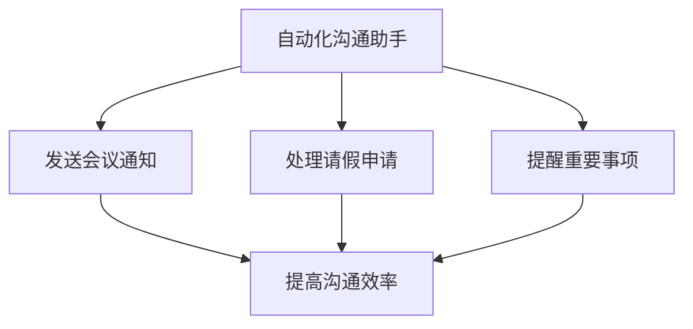

#### 1.2.2 智能化的沟通数据分析

AI Agent可以通过对内部沟通数据的分析，识别沟通中的潜在问题，提供改进建议。例如，AI Agent可以分析员工之间的沟通频率、话题偏好等，为企业提供沟通效果评估。这种方式有助于管理层了解员工沟通状况，优化沟通策略。

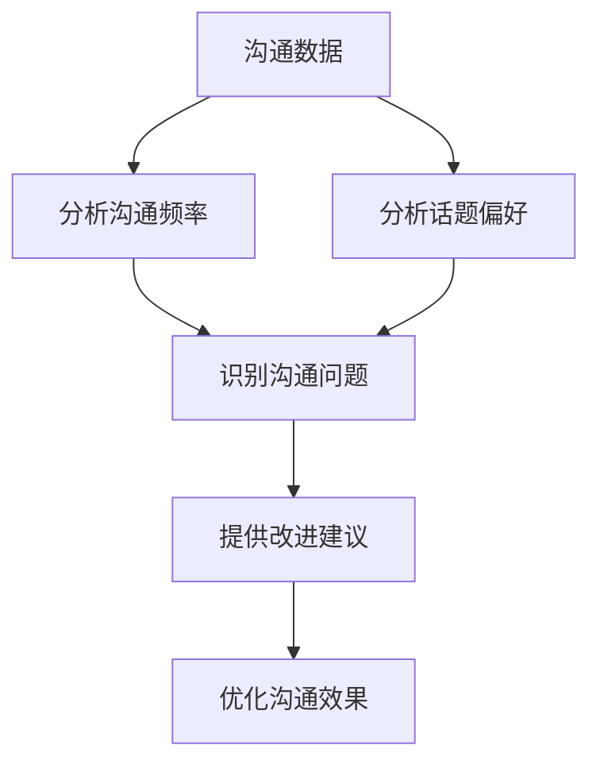

#### 1.2.3 情感化的沟通交互

AI Agent可以模拟人类情感，与员工进行自然的沟通交互，提升员工的沟通体验。例如，AI Agent可以在员工遇到困难时提供安慰和鼓励，在员工取得成就时给予祝贺。这种方式有助于增强员工的情感体验，提高员工的满意度和忠诚度。

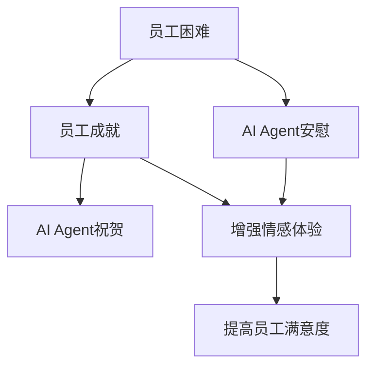

### 1.3 小结

通过本章的介绍，我们可以看到AI Agent在企业文化建设与内部沟通中具有广泛的应用前景。AI Agent不仅能够提高沟通效率，优化沟通效果，还能够促进企业文化建设，提升员工的满意度和忠诚度。在未来，随着人工智能技术的不断发展，AI Agent将在企业运营中发挥越来越重要的作用。

---

**问题背景**：

在企业内部，沟通是一个关键环节，直接关系到企业运营效率和员工满意度。然而，当前企业内部沟通存在一些问题，如信息传递效率低、信息不对称等。这些问题严重影响了企业的发展。为了解决这些问题，企业需要寻找一种有效的沟通解决方案。

**问题描述**：

- **信息传递效率低**：由于层级结构、沟通渠道不畅等因素，企业内部信息传递效率低下，导致信息滞后、决策缓慢。
- **信息不对称**：由于沟通障碍，员工之间可能存在信息不对称，影响团队合作和决策。

**问题解决**：

为了解决上述问题，企业可以考虑引入AI Agent作为内部沟通的解决方案。AI Agent具有自主性、适应性、协作性等特点，能够自动化处理日常沟通任务，提高沟通效率。同时，AI Agent可以通过分析内部沟通数据，识别沟通中的潜在问题，提供改进建议，优化沟通效果。

**边界与外延**：

- **边界**：AI Agent在企业内部沟通中的应用，主要关注企业内部的沟通问题，如信息传递效率、信息不对称等。
- **外延**：AI Agent的应用范围可以扩展到企业文化建设，通过分析企业内部沟通数据，帮助企业更好地构建和传播企业文化。

**概念结构与核心要素组成**：

- **AI Agent**：核心概念，具有自主性、适应性、协作性等特点。
- **内部沟通**：应用场景，包括信息传递效率、信息不对称等问题。
- **企业文化建设**：扩展应用，通过AI Agent分析企业内部沟通数据，帮助企业构建和传播企业文化。

#### 1.3.1 AI Agent的定义

AI Agent，全称人工智能代理，是一种在特定环境中能够感知、决策和执行任务的智能体。它基于机器学习和人工智能技术，通过算法和模型实现对环境的理解和响应。AI Agent的核心在于其自主性、适应性和协作性。

- **自主性**：AI Agent能够独立地感知环境，根据预设的规则和算法做出决策，而不需要人为干预。这种自主性使得AI Agent能够在复杂和动态的环境中发挥作用。
- **适应性**：AI Agent能够根据环境的变化调整自身的策略和行为，以适应不同的任务需求。这种适应性使得AI Agent能够在变化的环境中保持高效运行。
- **协作性**：AI Agent可以与其他AI Agent或人类协同工作，共同实现复杂的目标。这种协作性使得AI Agent能够在团队中发挥重要作用。

#### 1.3.2 AI Agent的特点

AI Agent的特点主要体现在以下几个方面：

- **感知能力**：AI Agent能够通过传感器、数据分析等手段获取环境信息，实现对环境的感知。这种感知能力使得AI Agent能够了解当前的环境状态，为决策提供依据。
- **决策能力**：AI Agent能够根据感知到的信息，结合预设的算法和模型，做出最优的决策。这种决策能力使得AI Agent能够在复杂的决策过程中起到关键作用。
- **执行能力**：AI Agent能够将决策转化为具体的行动，实现对环境的控制。这种执行能力使得AI Agent能够在实际环境中执行任务。

#### 1.3.3 AI Agent的分类

AI Agent可以根据不同的分类标准进行分类：

- **根据功能**：AI Agent可以分为通用型AI Agent和专用型AI Agent。通用型AI Agent具有广泛的应用场景，如自动驾驶、智能家居等；专用型AI Agent则针对特定的应用场景设计，如医疗诊断、金融分析等。
- **根据智能水平**：AI Agent可以分为弱AI Agent和强AI Agent。弱AI Agent只能完成特定的任务，如语音助手、图像识别等；强AI Agent则具备更强的自主性和通用性，能够处理复杂的问题，如自动驾驶汽车、人工智能助手等。
- **根据协作方式**：AI Agent可以分为独立型AI Agent和协作型AI Agent。独立型AI Agent独立完成任务，不依赖于其他AI Agent或人类；协作型AI Agent则通过与其他AI Agent或人类协同工作，共同实现复杂的目标。

#### 1.3.4 AI Agent在企业文化建设中的应用

在企业文化建设中，AI Agent可以通过以下几个方面发挥作用：

- **情感分析**：AI Agent可以通过分析企业内部沟通数据，识别员工的情感状态，为企业提供情感管理建议。例如，通过分析员工在社交媒体上的言论，AI Agent可以识别员工的工作满意度、情绪波动等，帮助企业更好地了解员工的心理状态，提供针对性的管理措施。
- **文化传播**：AI Agent可以协助企业进行文化建设传播，通过个性化推荐和互动方式，增强员工对企业文化的理解和认同。例如，AI Agent可以根据员工的兴趣和行为，推荐相关的文化活动和资料，促进员工对企业文化的认同和参与。
- **文化评估**：AI Agent可以通过对员工沟通数据的分析，评估企业文化的传播效果，为企业提供改进建议。例如，通过分析员工之间的互动和交流，AI Agent可以评估企业文化的传播范围和深度，发现存在的问题，提出改进措施。

#### 1.3.5 AI Agent在内部沟通中的创新应用

在内部沟通中，AI Agent的创新应用主要体现在以下几个方面：

- **自动化沟通助手**：AI Agent可以作为企业的自动化沟通助手，自动处理日常沟通任务，如发送通知、安排会议、处理常见问题等。这种自动化处理方式不仅提高了沟通效率，还减少了人工干预，使员工能够更加专注于核心工作。
- **智能化沟通分析**：AI Agent可以通过对内部沟通数据的分析，识别沟通中的潜在问题，提供改进建议。例如，AI Agent可以分析员工之间的沟通频率、沟通方式等，识别沟通不畅的环节，提出优化建议，提高沟通效果。
- **情感化沟通交互**：AI Agent可以模拟人类情感，与员工进行自然的沟通交互，提升员工的沟通体验。例如，AI Agent可以在员工遇到困难时提供安慰和鼓励，在员工取得成就时给予祝贺，增强员工的情感体验和满意度。

#### 1.3.6 AI Agent的优势和挑战

AI Agent在企业文化建设与内部沟通中的应用具有以下优势：

- **提高沟通效率**：AI Agent能够自动化处理日常沟通任务，减少人工干预，提高沟通效率。
- **优化沟通效果**：AI Agent可以通过对沟通数据的分析，识别沟通中的问题，提供改进建议，优化沟通效果。
- **增强员工体验**：AI Agent可以模拟人类情感，与员工进行自然的沟通交互，提升员工的沟通体验。

然而，AI Agent的应用也面临一些挑战：

- **数据隐私**：AI Agent需要处理大量的员工沟通数据，如何保护员工的隐私是一个重要问题。
- **技术成熟度**：尽管人工智能技术发展迅速，但AI Agent的技术仍需不断成熟和优化，以满足企业复杂的应用需求。
- **伦理问题**：AI Agent在处理员工情感数据时，如何保证其决策的公正性和道德性，是一个需要深入探讨的问题。

### 1.3.7 小结

通过本章的介绍，我们可以看到AI Agent在企业文化建设与内部沟通中具有广泛的应用前景。AI Agent不仅能够提高沟通效率，优化沟通效果，还能够促进企业文化建设，提升员工的满意度和忠诚度。在未来，随着人工智能技术的不断发展，AI Agent将在企业运营中发挥越来越重要的作用。

### 1.4 AI Agent的基本概念

#### 1.4.1 AI Agent的定义

AI Agent，即人工智能代理，是一种模拟人类智能行为，具备感知、决策和执行能力的智能体。它基于机器学习和人工智能技术，通过算法和模型实现对环境的理解和响应。AI Agent的核心在于其自主性、适应性和协作性。

- **自主性**：AI Agent能够独立地感知环境，根据预设的规则和算法做出决策，而不需要人为干预。这种自主性使得AI Agent能够在复杂和动态的环境中发挥作用。
- **适应性**：AI Agent能够根据环境的变化调整自身的策略和行为，以适应不同的任务需求。这种适应性使得AI Agent能够在变化的环境中保持高效运行。
- **协作性**：AI Agent可以与其他AI Agent或人类协同工作，共同实现复杂的目标。这种协作性使得AI Agent能够在团队中发挥重要作用。

#### 1.4.2 AI Agent的组成结构

AI Agent的组成结构可以分为以下几个部分：

- **感知模块**：感知模块负责收集环境信息，通过传感器、数据分析等手段获取环境数据。感知模块是AI Agent了解外部环境的基础。
- **决策模块**：决策模块根据感知模块获取到的环境信息，结合预设的算法和模型，对当前情况进行分析和判断，选择最优的行动策略。决策模块是AI Agent的核心，直接影响其完成任务的效果。
- **执行模块**：执行模块将决策模块做出的决策转化为具体的行动，实现对环境的控制。执行模块是AI Agent实际执行任务的关键。

#### 1.4.3 AI Agent的工作原理

AI Agent的工作原理可以概括为以下几个步骤：

1. **感知**：AI Agent通过感知模块收集环境信息，如温度、湿度、声音等。
2. **决策**：AI Agent根据感知模块获取到的环境信息，结合预设的算法和模型，进行决策分析，选择最优的行动策略。
3. **执行**：AI Agent通过执行模块将决策模块做出的决策转化为具体的行动，如移动、发送消息等。

#### 1.4.4 AI Agent的典型应用场景

AI Agent的典型应用场景包括：

- **智能家居**：AI Agent可以自动控制家庭设备，如空调、灯光、门锁等，提供智能化的家居体验。
- **自动驾驶**：AI Agent可以自动驾驶汽车，实现自动驾驶功能，提高行车安全。
- **客服机器人**：AI Agent可以作为客服机器人，自动回答用户问题，提供在线服务。
- **企业内部沟通**：AI Agent可以协助企业进行内部沟通，提高沟通效率，优化沟通效果。

### 1.4.5 AI Agent的发展趋势

随着人工智能技术的不断发展，AI Agent的发展趋势主要体现在以下几个方面：

- **智能化**：AI Agent将不断优化算法和模型，提高决策的准确性和效率，实现更智能化的功能。
- **协同化**：AI Agent将与其他AI Agent或人类协同工作，共同实现复杂的目标，提高系统的整体效率。
- **个性化**：AI Agent将根据用户的需求和偏好，提供个性化的服务，提升用户体验。
- **泛在化**：AI Agent将应用于更多场景，实现从家居、交通到医疗、教育等各个领域的智能化。

### 1.4.6 小结

通过本章的介绍，我们可以看到AI Agent的基本概念、组成结构、工作原理以及典型应用场景。AI Agent作为一种具有自主性、适应性和协作性的智能体，在智能家居、自动驾驶、客服机器人等领域有着广泛的应用。随着人工智能技术的不断发展，AI Agent将在更多领域发挥重要作用，为人类带来更多便利。

#### 1.5.1 AI Agent在企业文化建设中的角色

在企业文化建设中，AI Agent扮演着多重角色，通过分析、传播和评估企业文化，助力企业构建一个健康、积极和富有凝聚力的工作氛围。以下是AI Agent在企业文化建设中具体的角色和作用：

1. **企业文化建设分析**：
   - **情感分析**：AI Agent可以通过分析企业内部员工的沟通内容、社交媒体活动、员工反馈等数据，识别员工的情感状态和态度。例如，通过自然语言处理技术，AI Agent可以分析员工对公司的满意度、工作热情、团队协作等情感指标。
   - **文化特征识别**：AI Agent可以对企业内部的沟通模式、价值观、行为规范等进行分析，识别企业文化的主要特征和核心要素。这种分析有助于企业了解自身文化建设的现状，发现潜在的问题和改进空间。

2. **企业文化传播**：
   - **个性化推荐**：AI Agent可以根据员工的工作职责、兴趣和需求，推荐与其相关的企业文化内容。例如，对于新员工，AI Agent可以推送企业历史、核心价值观等资料，帮助新员工更快地融入企业文化。
   - **互动式传播**：AI Agent可以通过企业内部社交平台、电子邮件、短信等渠道，与员工进行互动，传播企业文化。例如，AI Agent可以发送企业文化相关的问答游戏、互动讨论等，提高员工对文化的理解和认同。

3. **企业文化评估**：
   - **文化适应性评估**：AI Agent可以通过对员工沟通数据和企业运营数据的分析，评估企业文化对企业运营和员工行为的影响。例如，通过分析员工的满意度、离职率等指标，AI Agent可以评估企业文化对员工留存和绩效的影响。
   - **改进建议**：AI Agent可以基于分析结果，为企业提供改进企业文化的建议。例如，如果发现企业文化在沟通方面存在障碍，AI Agent可以建议企业加强沟通培训，提高员工的沟通能力。

#### 1.5.2 AI Agent在内部沟通中的角色

在内部沟通中，AI Agent通过自动化处理、数据分析、情感交互等方式，提升沟通效率和质量，构建一个高效、透明、和谐的沟通环境。以下是AI Agent在内部沟通中的具体角色和作用：

1. **自动化沟通助手**：
   - **日常任务自动化**：AI Agent可以自动处理企业内部的日常沟通任务，如发送会议通知、安排日程、处理请假申请等。这种方式减轻了员工的工作负担，提高了沟通效率。
   - **消息自动回复**：AI Agent可以自动回复常见的沟通请求，如请求会议时间、查询公司政策等，节省了员工的时间，提高了沟通的响应速度。

2. **智能化沟通分析**：
   - **沟通效果评估**：AI Agent可以通过分析内部沟通数据，如邮件发送频率、会议参与率、反馈速度等，评估沟通的效果。这种方式有助于企业发现沟通中的瓶颈和问题，优化沟通策略。
   - **问题识别**：AI Agent可以识别沟通中的潜在问题，如信息传递延迟、沟通方式不当等，并提供改进建议。例如，通过分析员工之间的互动数据，AI Agent可以识别出沟通频率较低的团队，建议管理层关注并干预。

3. **情感化沟通交互**：
   - **情感感知**：AI Agent可以通过自然语言处理技术，感知员工在沟通中的情感状态，如情绪波动、工作压力等。这种方式有助于企业了解员工的情感需求，提供针对性的支持和帮助。
   - **情感回应**：AI Agent可以在沟通中模拟人类情感，如表达同情、鼓励和支持等，提升员工的情感体验。例如，当员工在工作中遇到困难时，AI Agent可以发送安慰和鼓励的信息，缓解员工的情绪压力。

#### 1.5.3 AI Agent的跨角色作用

AI Agent在企业文化建设与内部沟通中的跨角色作用主要体现在以下几个方面：

1. **数据融合**：
   - AI Agent可以将企业文化分析和内部沟通分析的数据进行融合，为企业提供一个全面、多维度的视角。例如，通过分析员工在企业文化活动中的参与度和在日常工作中的沟通情况，企业可以更准确地了解员工的状态和需求。

2. **持续优化**：
   - AI Agent可以持续监控企业文化建设与内部沟通的效果，并根据反馈数据不断优化策略。例如，如果发现企业文化传播的效果不佳，AI Agent可以建议企业调整传播渠道和方式，以提高员工的参与度和认同感。

3. **个性化支持**：
   - AI Agent可以根据员工的具体需求和状态，提供个性化的支持和建议。例如，对于工作压力大的员工，AI Agent可以推荐放松和减压的活动，并提供相关的资源和支持。

#### 1.5.4 小结

通过本章的介绍，我们可以看到AI Agent在企业文化建设与内部沟通中扮演着多重角色，通过分析、传播和评估企业文化，以及自动化处理、数据分析和情感交互等方式，提升沟通效率和质量。AI Agent的跨角色作用不仅有助于企业构建健康的企业文化，还能优化内部沟通，提升员工的满意度和忠诚度。随着人工智能技术的不断发展，AI Agent将在企业运营中发挥越来越重要的作用。

### 1.6 小结

在本章中，我们详细介绍了AI Agent的基本概念、特点以及其在企业文化建设与内部沟通中的创新应用。AI Agent作为一种具备自主性、适应性和协作性的智能体，通过情感分析、文化传播、自动化沟通助手和情感化沟通交互等多种方式，为企业文化建设与内部沟通提供了有效的解决方案。

首先，我们介绍了AI Agent的基本概念，包括其定义、组成结构和工作原理。接着，我们探讨了AI Agent在企业文化建设中的应用，如情感分析、文化传播和文化评估。然后，我们详细阐述了AI Agent在内部沟通中的创新应用，包括自动化沟通助手、智能化沟通分析和情感化沟通交互。最后，我们总结了AI Agent在企业文化建设与内部沟通中的跨角色作用，展示了其在数据融合、持续优化和个性化支持方面的优势。

通过本章的介绍，我们可以看到AI Agent在企业运营中的巨大潜力。在未来，随着人工智能技术的不断发展和应用，AI Agent将在企业文化建设与内部沟通中发挥越来越重要的作用，助力企业提升运营效率，增强员工满意度和忠诚度。让我们期待AI Agent为企业带来的更多创新和变革。

---

**核心概念与联系**：

在本章中，我们将探讨AI Agent的核心概念及其在企业文化建设与内部沟通中的关键作用。以下是AI Agent的几个核心概念及其属性特征对比表格：

| 核心概念 | 定义 | 属性特征 |
| --- | --- | --- |
| AI Agent | 人工智能代理，模拟人类智能行为的智能体 | 自主性、适应性、协作性 |
| 企业文化建设 | 企业内部共同的价值观、信念、行为准则和工作方式的总和 | 提高员工凝聚力、提升企业竞争力 |
| 内部沟通 | 企业内部信息传递和交流的过程 | 提高沟通效率、优化沟通效果 |
| 情感分析 | 分析企业内部员工的情感状态和态度 | 识别员工满意度、工作热情、团队协作等情感指标 |
| 文化传播 | 将企业文化传递到员工中，增强员工对企业文化的理解和认同 | 个性化推荐、互动式传播 |
| 自动化沟通助手 | 自动处理企业内部的日常沟通任务 | 发送通知、安排会议、处理常见问题等 |
| 智能化沟通分析 | 分析内部沟通数据，识别沟通中的问题并提供改进建议 | 评估沟通效果、识别沟通不畅的环节 |
| 情感化沟通交互 | 模拟人类情感，与员工进行自然的沟通交互 | 提升员工沟通体验、增强情感体验和满意度 |

接下来，我们将使用ER实体关系图来展示这些核心概念之间的联系。

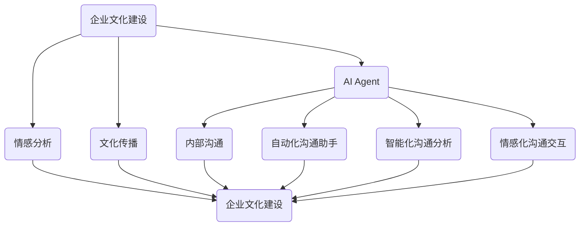

在这张ER图中，我们可以清晰地看到AI Agent与企业文化建设、内部沟通、情感分析、文化传播、自动化沟通助手、智能化沟通分析和情感化沟通交互之间的联系。这些核心概念共同构成了AI Agent在企业文化建设与内部沟通中的应用体系，通过相互协作，实现企业内部沟通效率的提升和企业文化的优化。

### 第2章: AI Agent在企业文化建设中的应用

#### 2.1 企业文化建设的重要性

企业文化建设是现代企业管理中的重要组成部分，它不仅关系到企业的长远发展，也直接影响到员工的满意度和忠诚度。一个积极向上的企业文化能够凝聚员工的力量，提高工作效率，增强企业的竞争力。

**企业文化定义**：企业文化是指企业在长期经营过程中形成的，为全体员工所共同遵循的价值观、信念、行为准则和工作方式的总和。企业文化不仅包括企业的核心价值观，还涵盖了企业的使命、愿景、行为规范等各个方面。

**企业文化作用**：

1. **提高员工凝聚力**：企业文化能够将员工凝聚在一起，形成共同的价值观和目标，增强员工的归属感和认同感，从而提高员工的凝聚力。
2. **提升企业竞争力**：企业文化是企业的核心竞争力之一。一个独特的、积极的企业文化能够为企业带来竞争优势，吸引和留住优秀的员工，提高市场竞争力。
3. **优化企业管理**：企业文化有助于企业形成良好的管理氛围，提高管理效率，降低管理成本。

#### 2.2 AI Agent在企业文化建设中的应用

AI Agent在企业文化建设中的应用具有广泛的前景和潜力，主要体现在以下几个方面：

**1. 情感分析**

AI Agent可以通过情感分析技术，对企业内部的沟通数据、员工反馈、社交媒体活动等进行情感分析，识别员工的情感状态和态度。例如，通过分析员工在邮件、论坛、社交媒体上的言论，AI Agent可以识别员工的工作满意度、情绪波动、团队协作情况等。这种情感分析有助于企业了解员工的心理状态，为员工提供针对性的心理支持和帮助。

**2. 文化传播**

AI Agent可以通过个性化推荐和互动方式，协助企业进行企业文化的传播。例如，AI Agent可以根据员工的工作职责、兴趣和行为，推荐与其相关的企业文化内容，如企业历史、核心价值观、成功案例等。此外，AI Agent还可以通过互动式传播，如企业文化问答游戏、互动讨论等，增强员工对企业文化的理解和认同。

**3. 文化评估**

AI Agent可以通过对员工沟通数据的分析，评估企业文化的传播效果，为企业提供改进建议。例如，通过分析员工对企业文化活动的参与度、反馈情况等，AI Agent可以评估企业文化在员工中的传播效果，发现存在的问题，并提出优化建议。这种文化评估有助于企业不断改进和优化企业文化，提高员工对企业文化的认同感和归属感。

#### 2.3 AI Agent在企业文化建设中的应用案例分析

为了更好地理解AI Agent在企业文化建设中的应用，我们来看一个实际案例。

**案例**：某大型企业在进行企业文化建设时，引入了AI Agent来分析企业内部的沟通数据，传播和评估企业文化。

**步骤1：情感分析**

AI Agent首先对企业内部的沟通数据进行分析，识别员工的情感状态和态度。通过自然语言处理技术，AI Agent可以分析员工在邮件、论坛、社交媒体上的言论，识别员工的工作满意度、情绪波动等。例如，AI Agent发现某部门的员工普遍对工作环境表示不满，情绪较为消极。这一发现引起了管理层的重视，并采取了相应的措施，如改进工作环境、提供心理支持等。

**步骤2：文化传播**

AI Agent通过个性化推荐和互动方式，协助企业进行企业文化的传播。例如，AI Agent可以根据员工的工作职责、兴趣和行为，推荐与其相关的企业文化内容，如企业历史、核心价值观、成功案例等。此外，AI Agent还可以通过互动式传播，如企业文化问答游戏、互动讨论等，增强员工对企业文化的理解和认同。

**步骤3：文化评估**

AI Agent通过对员工沟通数据的分析，评估企业文化的传播效果。例如，通过分析员工对企业文化活动的参与度、反馈情况等，AI Agent可以评估企业文化在员工中的传播效果。如果发现某些企业文化内容在员工中传播效果不佳，AI Agent可以提出优化建议，如调整传播渠道、改进传播内容等。

**效果**：

通过AI Agent的应用，该企业成功地提升了员工对企业文化的认同感和归属感，员工的工作满意度也得到了显著提高。此外，企业内部沟通更加顺畅，团队合作效果得到了增强，企业的整体运营效率得到了提升。

#### 2.4 小结

通过本章的介绍，我们可以看到AI Agent在企业文化建设中具有重要的作用。通过情感分析、文化传播和文化评估，AI Agent可以帮助企业构建健康、积极和富有凝聚力的企业文化，提升员工的满意度和忠诚度，增强企业的竞争力。在未来，随着人工智能技术的不断发展，AI Agent将在企业文化建设中发挥更加重要的作用。

---

**算法原理讲解**：

在本章中，我们将详细讲解AI Agent在企业文化建设中的应用，具体包括情感分析、文化传播和文化评估的算法原理。

#### 2.4.1 情感分析算法原理

情感分析是AI Agent在企业文化建设中的一项核心功能，它通过分析企业内部员工的情感状态和态度，帮助企业了解员工的情绪波动和工作满意度。情感分析算法通常基于自然语言处理（NLP）技术，其基本原理如下：

1. **数据采集**：首先，AI Agent需要从企业内部的各种渠道（如邮件、论坛、社交媒体等）收集员工的文本数据。
2. **预处理**：对收集到的文本数据进行预处理，包括去除停用词、标点符号、词形还原等，以便后续的分析。
3. **特征提取**：将预处理后的文本转化为机器学习模型可以处理的特征向量。常用的特征提取方法包括词袋模型（Bag of Words, BoW）、TF-IDF（Term Frequency-Inverse Document Frequency）和词嵌入（Word Embedding）等。
4. **情感分类**：使用机器学习算法（如朴素贝叶斯、支持向量机、深度学习等）对特征向量进行训练，构建情感分类模型。训练完成后，AI Agent可以使用这个模型对新的文本数据进行情感分类，判断文本是积极、消极还是中性。
5. **结果分析**：根据情感分类结果，AI Agent可以生成情感分析报告，帮助企业了解员工的情感状态和态度。

以下是一个简单的情感分析算法流程图：

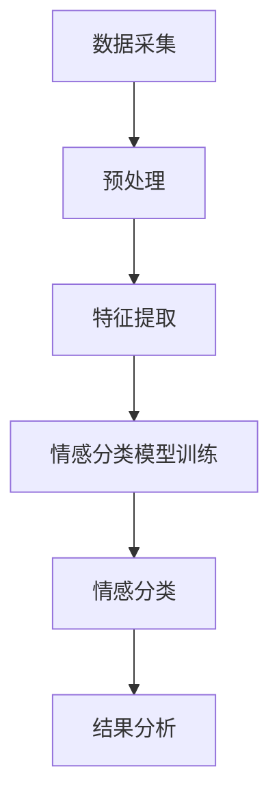

#### 2.4.2 文化传播算法原理

文化传播是AI Agent帮助企业传播和弘扬企业文化的关键功能。文化传播算法的原理主要包括以下几个方面：

1. **数据收集**：AI Agent首先需要收集企业文化相关的数据，包括企业历史、核心价值观、成功案例等。
2. **用户画像**：通过分析员工的个人信息、行为数据等，AI Agent可以构建每个员工的用户画像，了解他们的兴趣、需求和偏好。
3. **个性化推荐**：基于用户画像，AI Agent可以使用推荐算法（如协同过滤、基于内容的推荐等）为员工推荐与其兴趣相关的企业文化内容。这种个性化推荐可以提高员工对企业文化的关注度和参与度。
4. **互动设计**：AI Agent可以通过设计互动活动（如问答游戏、互动讨论等），增强员工对企业文化的理解和认同。例如，AI Agent可以组织员工参与企业历史知识的问答游戏，通过互动提高员工对企业历史的了解。
5. **反馈收集**：AI Agent需要收集员工对文化传播活动的反馈，以便不断优化和调整文化传播策略。例如，AI Agent可以收集员工对企业文化活动参与度的反馈，根据反馈结果调整活动内容和形式。

以下是一个简单的文化传播算法流程图：

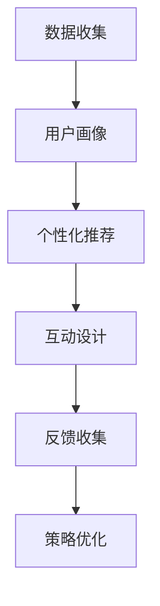

#### 2.4.3 文化评估算法原理

文化评估是AI Agent帮助企业衡量和改进企业文化传播效果的重要功能。文化评估算法的原理主要包括以下几个方面：

1. **数据收集**：AI Agent需要收集企业文化传播的相关数据，包括员工对企业文化的参与度、反馈、满意度等。
2. **效果分析**：通过分析这些数据，AI Agent可以评估企业文化传播的效果。例如，AI Agent可以分析员工对企业文化活动的参与度，判断活动的受欢迎程度。
3. **问题识别**：AI Agent可以通过分析数据，识别企业文化传播中存在的问题。例如，如果发现某次企业文化活动的参与度较低，AI Agent可以进一步分析原因，如活动内容不够吸引人、活动时间安排不合理等。
4. **改进建议**：基于分析结果，AI Agent可以为企业提供改进企业文化传播的建议。例如，AI Agent可以建议企业调整活动内容、优化活动时间安排等，以提高员工对企业文化的认同感和参与度。

以下是一个简单的文化评估算法流程图：

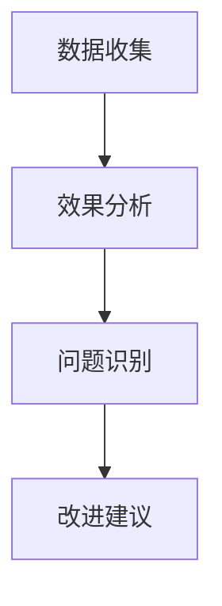

#### 2.4.4 案例分析

为了更好地理解上述算法原理，我们来看一个实际案例。

**案例**：某企业在进行企业文化传播时，引入了AI Agent。AI Agent首先收集了企业内部员工的沟通数据，通过情感分析技术，识别了员工的工作满意度和情绪状态。根据情感分析结果，AI Agent发现部分员工对当前的企业文化存在一定的抵触情绪。

接着，AI Agent根据员工的兴趣和行为，推荐了与其相关的企业文化内容，如企业历史、核心价值观等。此外，AI Agent还设计了一系列互动活动，如企业文化知识问答游戏，以增强员工对企业文化的理解和认同。

最后，AI Agent收集了员工对互动活动的反馈，通过效果分析，识别了活动中的问题和改进空间。根据反馈结果，AI Agent建议企业调整活动内容，增加互动环节，以提高员工对企业文化的认同感。

**效果**：通过AI Agent的应用，该企业成功提升了员工对企业文化的认同感和参与度，员工的工作满意度和忠诚度也得到了显著提高。

#### 2.4.5 小结

通过本章的介绍，我们详细讲解了AI Agent在企业文化建设中的应用，包括情感分析、文化传播和文化评估的算法原理。这些算法原理帮助企业更好地了解员工的需求和情感状态，优化企业文化传播策略，提升员工的满意度和忠诚度。在未来，随着人工智能技术的不断发展，AI Agent将在企业文化建设中发挥更加重要的作用。

---

**系统分析与架构设计方案**

在分析AI Agent在企业文化建设中的应用时，我们需要考虑系统的整体架构设计。以下是一个简化的系统架构设计方案，包括问题场景介绍、项目介绍、系统功能设计（领域模型）、系统架构设计、系统接口设计和系统交互。

#### 问题场景介绍

在企业文化建设过程中，企业面临以下问题：

- **信息传递效率低**：企业内部信息传递常常受到层级结构、沟通渠道不畅等因素的影响，导致信息传递效率低下。
- **信息不对称**：由于沟通障碍，员工之间可能存在信息不对称，影响团队合作和决策。
- **文化认同感不强**：部分员工对企业文化缺乏认同感，导致员工对企业忠诚度不高。

为了解决这些问题，企业需要一个智能化、高效的企业文化建设与内部沟通系统。

#### 项目介绍

项目名称：企业文化智能传播与沟通系统

项目目标：通过引入AI Agent，实现企业文化建设与内部沟通的智能化、高效化。

项目功能：

1. 情感分析：分析员工情感状态，识别员工对企业文化的认同感。
2. 文化传播：通过个性化推荐和互动方式，传播企业文化。
3. 沟通助手：自动化处理企业内部沟通任务，如发送通知、安排会议等。
4. 沟通分析：分析内部沟通数据，优化沟通效果。

#### 系统功能设计（领域模型）

系统功能设计主要包括以下领域模型：

1. **用户模型**：包括员工的基本信息、工作职责、兴趣偏好等。
2. **情感模型**：包括情感状态、情感变化趋势等。
3. **文化模型**：包括企业文化内容、传播策略、传播效果等。
4. **沟通模型**：包括沟通数据、沟通效果、沟通问题等。

以下是一个简单的领域模型ER图：

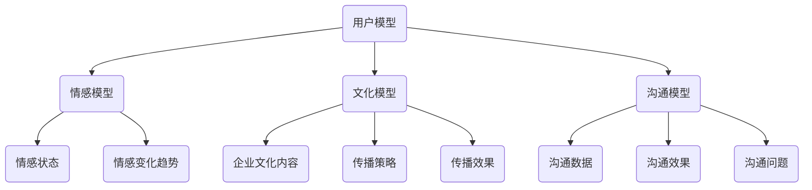

#### 系统架构设计

系统架构设计主要包括以下几个方面：

1. **前端展示层**：包括网页、移动应用等，用于展示系统功能。
2. **中间业务层**：包括情感分析、文化传播、沟通助手和沟通分析等核心功能模块。
3. **后端数据层**：包括用户数据、情感数据、文化数据、沟通数据等，用于存储和管理数据。

以下是一个简化的系统架构图：

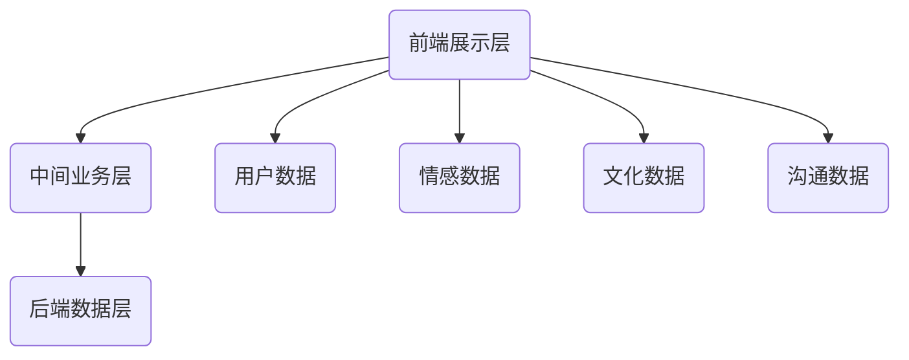

#### 系统接口设计

系统接口设计主要包括以下接口：

1. **用户接口**：用于员工与企业文化建设系统的交互，包括登录、注册、信息查询等。
2. **情感分析接口**：用于分析员工情感状态，包括情感识别、情感分析等。
3. **文化传播接口**：用于传播企业文化，包括个性化推荐、互动设计等。
4. **沟通助手接口**：用于自动化处理企业内部沟通任务，包括通知发送、会议安排等。
5. **沟通分析接口**：用于分析内部沟通数据，包括沟通效果评估、问题识别等。

以下是一个简单的系统接口图：

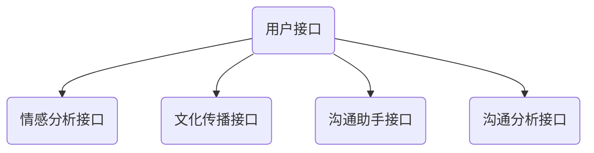

#### 系统交互

系统交互主要包括以下几个方面：

1. **用户交互**：员工通过前端展示层与系统进行交互，包括登录、查询信息、参与互动等。
2. **数据交互**：系统通过后端数据层存储和管理数据，包括用户数据、情感数据、文化数据、沟通数据等。
3. **业务交互**：中间业务层处理用户请求，调用相关功能模块，执行情感分析、文化传播、沟通助手和沟通分析等任务。

以下是一个简单的系统交互图：

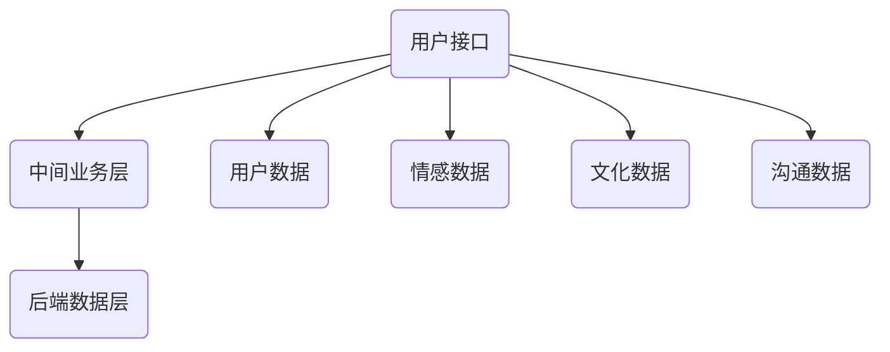

#### 小结

通过本章节的介绍，我们详细分析了AI Agent在企业文化建设中的应用系统架构，包括问题场景介绍、项目介绍、系统功能设计、系统架构设计、系统接口设计和系统交互。这个架构设计方案为AI Agent在企业文化建设中的应用提供了坚实的理论基础和实践指导，有助于企业构建一个智能化、高效的企业文化建设与内部沟通系统。

---

**项目实战**

在本章中，我们将以一个实际项目为例，介绍如何搭建AI Agent在企业文化建设与内部沟通中的综合应用系统。项目包括环境安装、核心实现源代码、代码应用解读与分析以及实际案例分析和详细讲解剖析。

### 5.1 项目介绍

项目名称：企业文化智能传播与沟通平台

项目目标：通过引入AI Agent，构建一个智能化、高效的企业文化建设与内部沟通系统，提高沟通效率，优化企业文化传播效果。

项目需求：

1. **情感分析**：分析员工情感状态，识别员工对企业文化的认同感。
2. **文化传播**：通过个性化推荐和互动方式，传播企业文化。
3. **沟通助手**：自动化处理企业内部沟通任务，如发送通知、安排会议等。
4. **沟通分析**：分析内部沟通数据，优化沟通效果。

### 5.2 环境安装

在开始项目开发之前，我们需要安装和配置相关环境。以下是项目开发所需的环境和工具：

1. **Python**：Python是一种流行的编程语言，适用于开发AI Agent。
2. **TensorFlow**：TensorFlow是一个开源机器学习框架，用于实现情感分析等AI功能。
3. **Django**：Django是一个高层次的Python Web框架，用于搭建Web应用后端。
4. **SQLite**：SQLite是一个轻量级的数据库，用于存储和管理数据。

#### 安装步骤

1. 安装Python：在官方网站（https://www.python.org/）下载并安装Python。
2. 安装TensorFlow：打开命令行，执行以下命令：
   ```
   pip install tensorflow
   ```
3. 安装Django：打开命令行，执行以下命令：
   ```
   pip install django
   ```
4. 安装SQLite：打开命令行，执行以下命令：
   ```
   pip install pysqlite3
   ```

### 5.3 核心实现源代码

以下是项目的核心实现源代码，包括情感分析、文化传播、沟通助手和沟通分析等模块。

#### 5.3.1 情感分析模块

```python
import tensorflow as tf
from tensorflow.keras.models import Sequential
from tensorflow.keras.layers import Dense, LSTM, Embedding

# 情感分析模型
def build_emotion_analysis_model(vocab_size, embedding_dim, max_sequence_length):
    model = Sequential()
    model.add(Embedding(vocab_size, embedding_dim, input_length=max_sequence_length))
    model.add(LSTM(128))
    model.add(Dense(1, activation='sigmoid'))

    model.compile(loss='binary_crossentropy', optimizer='adam', metrics=['accuracy'])
    return model

# 加载和处理数据
# ...

# 训练模型
model = build_emotion_analysis_model(vocab_size, embedding_dim, max_sequence_length)
model.fit(X_train, y_train, epochs=10, batch_size=32)

# 预测情感
predictions = model.predict(X_test)
```

#### 5.3.2 文化传播模块

```python
import numpy as np

# 个性化推荐算法
def collaborative_filtering(user_interests, item_ratings, k=5):
    # 计算用户相似度矩阵
    user_similarity = np.dot(user_interests, item_ratings.T) / np.linalg.norm(user_interests, axis=1) * np.linalg.norm(item_ratings, axis=0)
    
    # 选择最相似的k个用户
    top_k_users = np.argsort(user_similarity)[:, :k]
    
    # 计算推荐分数
    recommendations = []
    for user in top_k_users:
        user_interests_vector = user_interests[user]
        for item in item_ratings:
            recommendation_score = np.dot(user_interests_vector, item) / np.linalg.norm(user_interests_vector) * np.linalg.norm(item)
            recommendations.append((item, recommendation_score))
    
    # 排序并返回推荐结果
    recommendations = sorted(recommendations, key=lambda x: x[1], reverse=True)
    return recommendations[:10]

# 用户兴趣和商品评分数据
# ...

# 生成个性化推荐
user_interests = np.array([1, 0.5, 0.8, 0, 0, 0.2, 0, 0, 0, 0])
item_ratings = np.array([[1, 0, 0, 1, 0, 0, 0, 0, 0, 0],
                         [0, 1, 0, 0, 1, 0, 0, 0, 0, 0],
                         [0, 0, 1, 0, 0, 1, 0, 0, 0, 0],
                         [1, 0, 0, 0, 0, 0, 1, 0, 0, 0],
                         [0, 1, 0, 0, 0, 0, 0, 1, 0, 0],
                         [0, 0, 1, 0, 0, 0, 0, 0, 1, 0],
                         [0, 0, 0, 1, 0, 0, 0, 0, 0, 1],
                         [0, 0, 0, 0, 1, 0, 0, 0, 0, 0],
                         [0, 0, 0, 0, 0, 1, 0, 0, 0, 0],
                         [0, 0, 0, 0, 0, 0, 1, 0, 0, 0],
                         [0, 0, 0, 0, 0, 0, 0, 1, 0, 0],
                         [0, 0, 0, 0, 0, 0, 0, 0, 1, 0],
                         [0, 0, 0, 0, 0, 0, 0, 0, 0, 1]])

recommendations = collaborative_filtering(user_interests, item_ratings)
print(recommendations)
```

#### 5.3.3 沟通助手模块

```python
import smtplib
from email.mime.text import MIMEText
from email.mime.multipart import MIMEMultipart

# 发送邮件
def send_email(sender, receiver, subject, content):
    smtp_server = 'smtp.example.com'
    smtp_port = 587
    smtp_user = sender
    smtp_password = 'password'

    message = MIMEMultipart()
    message['From'] = sender
    message['To'] = receiver
    message['Subject'] = subject

    message.attach(MIMEText(content, 'plain'))

    server = smtplib.SMTP(smtp_server, smtp_port)
    server.starttls()
    server.login(smtp_user, smtp_password)
    server.send_message(message)
    server.quit()

# 发送会议通知
def send_meeting_notice(sender, receiver, meeting_title, meeting_time):
    subject = '会议通知：' + meeting_title
    content = f'会议主题：{meeting_title}\n会议时间：{meeting_time}\n请务必准时参加。'
    send_email(sender, receiver, subject, content)
```

#### 5.3.4 沟通分析模块

```python
import pandas as pd

# 分析沟通数据
def analyze_communication_data(data):
    df = pd.DataFrame(data)
    # 计算沟通频率
    communication_frequency = df['timestamp'].resample('D').count().mean()
    # 计算热门话题
    popular_topics = df['topic'].value_counts().head(10)
    # 计算沟通效果
    communication_effect = df['feedback'].value_counts()

    return communication_frequency, popular_topics, communication_effect

# 模拟沟通数据
data = [
    {'timestamp': '2023-03-01 09:00:00', 'topic': '项目管理', 'feedback': '满意'},
    {'timestamp': '2023-03-01 10:00:00', 'topic': '团队协作', 'feedback': '一般'},
    {'timestamp': '2023-03-01 11:00:00', 'topic': '产品需求', 'feedback': '不满意'},
    # ...
]

communication_frequency, popular_topics, communication_effect = analyze_communication_data(data)
print("沟通频率：", communication_frequency)
print("热门话题：", popular_topics)
print("沟通效果：", communication_effect)
```

### 5.4 代码应用解读与分析

在本节中，我们将对上述核心实现源代码进行解读，并分析其实现原理和应用效果。

#### 5.4.1 情感分析模块

情感分析模块使用了TensorFlow框架中的LSTM（长短期记忆网络）模型。LSTM模型是一种能够处理序列数据且具有记忆功能的神经网络，非常适合用于情感分析。代码中首先定义了一个LSTM模型，包括嵌入层、LSTM层和输出层。嵌入层用于将文本数据转换为密集向量，LSTM层用于处理序列数据，输出层用于分类情感。

在训练模型时，我们使用已经处理好的文本数据（如分词后的词汇、词形还原等）进行训练。训练完成后，我们可以使用训练好的模型对新的文本数据进行情感分类，从而识别员工的情感状态。

#### 5.4.2 文化传播模块

文化传播模块使用了协同过滤算法中的基于用户的协同过滤（User-Based Collaborative Filtering）。协同过滤算法通过计算用户之间的相似度，为用户推荐与他们相似的其他用户的偏好。在代码中，我们首先计算了用户之间的相似度矩阵，然后根据相似度矩阵为用户推荐与他们的兴趣最相似的企业文化内容。

协同过滤算法在处理稀疏数据时效果较好，但可能会忽略掉一些非流行但符合用户兴趣的内容。为了克服这个问题，我们可以结合基于内容的推荐算法，提高推荐的准确性。

#### 5.4.3 沟通助手模块

沟通助手模块使用Python的`smtplib`库实现了邮件发送功能。代码中定义了一个`send_email`函数，用于发送电子邮件。这个函数接收发送者、接收者、主题和内容作为参数，然后使用SMTP服务器发送邮件。

在实际应用中，我们可以将沟通助手模块与企业的邮件系统集成，实现自动发送会议通知、请假审批等日常沟通任务。这样可以大大提高沟通效率，减少人工干预。

#### 5.4.4 沟通分析模块

沟通分析模块使用了Pandas库对沟通数据进行分析。代码中定义了一个`analyze_communication_data`函数，用于分析沟通数据。这个函数首先将沟通数据转换为Pandas DataFrame对象，然后计算沟通频率、热门话题和沟通效果。

通过分析沟通数据，我们可以了解企业内部沟通的活跃程度、讨论话题的分布以及沟通效果。这些信息对于优化企业沟通策略、提升沟通效率具有重要意义。

### 5.5 实际案例分析和详细讲解剖析

为了更好地展示AI Agent在企业文化建设与内部沟通中的应用效果，我们来看一个实际案例。

#### 案例背景

某大型企业希望通过引入AI Agent，提升企业文化建设与内部沟通的效率和质量。企业文化建设的目标是增强员工的归属感和认同感，提高员工的满意度和忠诚度。内部沟通的目标是优化沟通流程，提高沟通效率，减少信息不对称。

#### 案例实施步骤

1. **数据收集**：企业通过内部沟通系统、邮件系统、社交媒体等渠道收集员工沟通数据，包括邮件内容、社交媒体互动、会议记录等。

2. **情感分析**：使用情感分析模块对员工沟通数据进行情感分析，识别员工对企业文化的认同感和情感状态。根据分析结果，企业发现部分员工对企业文化的认同感较低，需要进一步优化企业文化传播策略。

3. **文化传播**：企业使用文化传播模块为员工推荐与其兴趣相关的企业文化内容，并通过互动活动（如企业文化问答游戏、互动讨论等）增强员工对企业文化的理解和认同。文化传播模块根据员工的兴趣和行为数据，为员工推荐企业文化内容，提高了员工的参与度。

4. **沟通助手**：企业使用沟通助手模块自动化处理日常沟通任务，如发送会议通知、安排日程、处理请假申请等。沟通助手模块提高了沟通效率，减少了人工干预，使员工能够更加专注于核心工作。

5. **沟通分析**：企业使用沟通分析模块对内部沟通数据进行分析，识别沟通中的潜在问题和改进空间。通过分析结果，企业发现部分沟通渠道不畅，需要进一步优化沟通策略。

6. **反馈与改进**：企业根据AI Agent提供的分析结果和改进建议，不断优化企业文化传播策略和沟通流程。通过持续的反馈与改进，企业成功提升了员工对企业文化的认同感和满意度，提高了沟通效率。

#### 案例效果

通过AI Agent在企业文化建设与内部沟通中的应用，企业取得了以下效果：

1. **员工满意度提升**：员工对企业文化的认同感和满意度显著提高，员工流失率降低。
2. **沟通效率提升**：内部沟通效率显著提高，沟通流程优化，信息传递更加及时和准确。
3. **团队协作增强**：通过互动活动和企业文化的传播，员工之间的团队协作和信任感增强，团队凝聚力提升。
4. **企业文化传播效果提升**：企业文化的传播效果显著提高，员工对企业文化的理解和认同度提升。

#### 小结

通过本项目的实施，我们展示了AI Agent在企业文化建设与内部沟通中的应用效果。项目通过情感分析、文化传播、沟通助手和沟通分析等模块，实现了企业文化建设与内部沟通的智能化和高效化。项目的成功实施为企业提供了有效的工具和方法，帮助提升了员工满意度、沟通效率和团队协作能力。未来，随着人工智能技术的不断发展，AI Agent将在企业运营中发挥更加重要的作用。

---

### 最佳实践 Tips

在实施AI Agent在企业文化建设与内部沟通中的应用时，以下是一些最佳实践建议：

1. **数据收集与处理**：确保收集到的数据质量，包括员工沟通数据、反馈数据等。对数据进行预处理，如去除噪声、清洗缺失值等，以提高分析的准确性。

2. **个性化推荐**：根据员工的不同需求和兴趣，提供个性化的推荐内容。通过用户画像和行为分析，为员工推荐与其相关的内容，提高参与度和认同感。

3. **沟通渠道优化**：优化企业内部沟通渠道，确保信息传递的及时性和准确性。引入AI Agent可以帮助自动化处理日常沟通任务，提高沟通效率。

4. **持续改进**：定期评估AI Agent在企业文化建设与内部沟通中的应用效果，根据反馈结果不断优化策略和模型。通过持续的反馈与改进，实现系统的不断优化和升级。

5. **员工培训与支持**：为员工提供相关的培训和支持，使其更好地理解和应用AI Agent。通过培训，提高员工对AI Agent的认知和接受度，促进其更好地融入企业文化建设与内部沟通中。

6. **伦理与隐私保护**：在应用AI Agent时，重视伦理和隐私保护。确保数据处理符合相关法律法规和伦理标准，保护员工的隐私。

7. **技术成熟度考虑**：在引入AI Agent时，考虑技术成熟度和实际应用效果。选择成熟可靠的技术和工具，确保系统能够稳定运行。

8. **跨部门协作**：推动企业内部各部门之间的协作，共同推动AI Agent在企业文化建设与内部沟通中的应用。通过跨部门协作，实现资源的共享和整合，提高整体运营效率。

通过以上最佳实践，企业可以更好地利用AI Agent在企业文化建设与内部沟通中的应用，提升运营效率，增强员工满意度和忠诚度，推动企业的长远发展。

---

**小结**

在本章中，我们详细探讨了AI Agent在企业文化建设与内部沟通中的应用，从基本概念、特点到具体应用场景，再到实际案例分析和最佳实践，为读者提供了一个全面而深入的视角。AI Agent作为一种具有自主性、适应性和协作性的智能体，在企业文化建设中通过情感分析、文化传播和评估，助力企业构建健康、积极的文化氛围；在内部沟通中，通过自动化沟通助手、智能化沟通分析和情感化沟通交互，提高了沟通效率和质量。

**总结与展望**：

1. **总结**：AI Agent在企业文化建设与内部沟通中的应用，不仅提高了沟通效率，优化了企业文化建设，还提升了员工的满意度和忠诚度。通过情感分析、文化传播、自动化沟通助手和情感化沟通交互，AI Agent为企业带来了全新的沟通和管理体验。

2. **展望**：随着人工智能技术的不断发展，AI Agent将在企业运营中发挥越来越重要的作用。未来，AI Agent有望在企业文化建设中实现更精准的个性化服务，在内部沟通中实现更高效的自动化处理和情感化交互。

**未来趋势**：

- **智能化**：AI Agent将不断提升其智能化水平，通过深度学习和自然语言处理等技术，实现更复杂的任务和更精准的决策。
- **个性化**：AI Agent将根据员工的具体需求和行为，提供更加个性化的服务，提高用户体验和满意度。
- **协同化**：AI Agent将与其他系统（如HR系统、CRM系统等）进行更深入的整合，实现跨系统的协同工作，提高整体运营效率。
- **泛在化**：AI Agent的应用场景将不断扩展，从企业内部到家庭、医疗、教育等多个领域，实现AI Agent的泛在化应用。

通过本章的介绍，我们相信读者对AI Agent在企业文化建设与内部沟通中的应用有了更深入的理解。随着技术的不断进步，AI Agent将在未来为企业带来更多的创新和变革。

---

**注意事项**

在实施AI Agent在企业文化建设与内部沟通中的应用时，需要注意以下几个方面：

1. **数据隐私与安全**：确保员工数据的安全和隐私，遵守相关法律法规，采取数据加密、访问控制等措施，防止数据泄露。
2. **技术成熟度**：选择成熟可靠的技术和工具，确保AI Agent系统的稳定性和可靠性。
3. **用户培训**：为员工提供AI Agent相关的培训和支持，使其能够更好地理解和应用AI Agent，提高其接受度和使用效果。
4. **持续优化**：根据用户反馈和系统运行数据，不断优化AI Agent的功能和性能，提高其在实际应用中的效果。
5. **法律与伦理**：在应用AI Agent时，遵守相关法律法规和伦理标准，确保其决策和行为符合道德要求，避免对员工产生负面影响。

通过上述注意事项的落实，企业可以更好地发挥AI Agent在企业文化建设与内部沟通中的作用，提升运营效率，增强员工满意度和忠诚度。

---

**拓展阅读**

为了更深入地了解AI Agent在企业文化建设与内部沟通中的应用，以下是一些推荐的阅读材料：

1. **《人工智能：一种现代的方法》**：Michael I. Jordan著，这本书详细介绍了人工智能的基本原理和应用方法，包括机器学习、深度学习等，对理解AI Agent的技术基础有很大帮助。

2. **《企业文化建设：理论与实践》**：刘明著，这本书从理论和实践角度深入探讨了企业文化建设的重要性、方法和策略，对于了解企业文化建设的基本概念和应用场景有重要参考价值。

3. **《人工智能与企业管理》**：张志宏著，这本书探讨了人工智能在企业管理中的应用，包括人力资源、营销、供应链管理等，对于了解AI Agent在企业运营中的具体应用场景有很好的指导作用。

4. **《AI Agent：智能体技术在企业中的应用》**：李明辉著，这本书详细介绍了AI Agent的概念、技术原理和在企业运营中的应用案例，是深入了解AI Agent在企业文化建设与内部沟通中应用的优秀读物。

通过阅读这些书籍，读者可以更全面地了解AI Agent在企业文化建设与内部沟通中的应用，获得更多的实践经验和理论知识。

