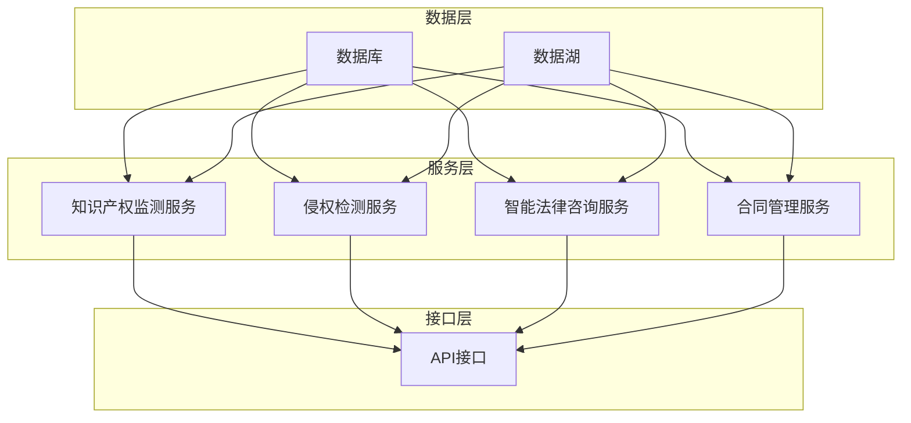
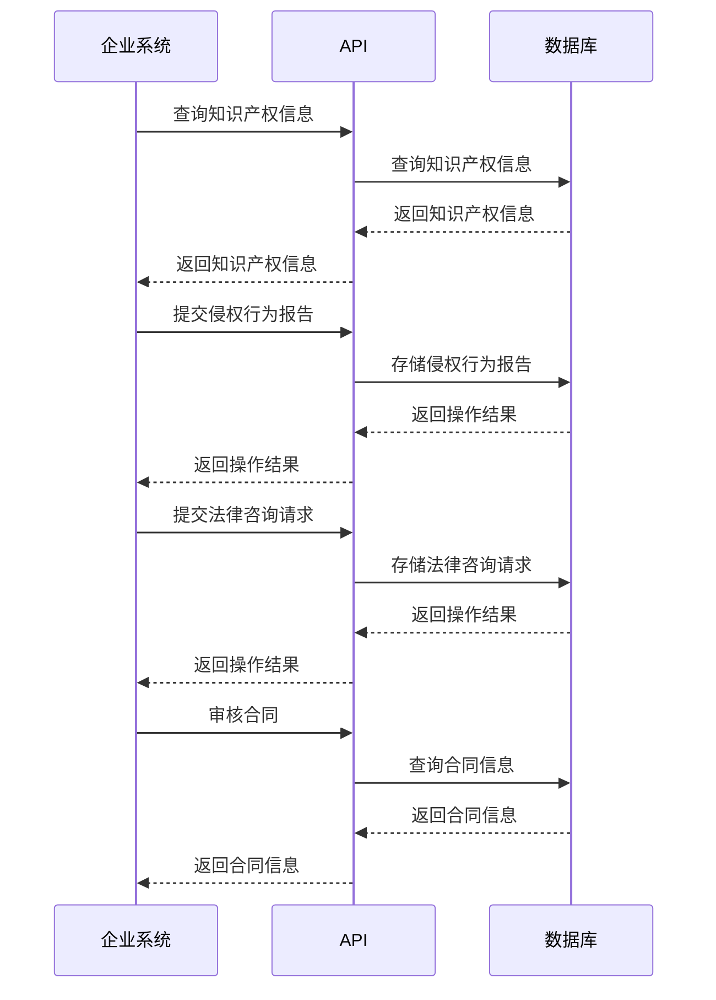

                 


### 引言

在当今信息化和数字化时代，企业知识产权保护已成为提升核心竞争力、保障创新成果的关键环节。随着人工智能技术的迅猛发展，AI Agent作为一种智能化、自动化的智能体，逐渐在企业知识产权保护中展现出强大的应用潜力。本文旨在探讨AI Agent在企业知识产权保护中的创新应用，通过逻辑清晰、结构紧凑的论述，引导读者深入了解AI Agent在这一领域的独特价值。

文章关键词：AI Agent、企业知识产权保护、知识产权风险预测、自动化侵权检测、智能化维权策略。

摘要：本文首先介绍了AI Agent的定义与特点，以及企业知识产权保护的基本概念，探讨了AI Agent与企业知识产权保护的关联。接着，详细分析了AI Agent在企业知识产权保护中的应用场景和创新应用，通过实际案例分析展示了AI Agent的应用效果。最后，本文讨论了AI Agent在企业知识产权保护中的技术实现和未来发展趋势，为读者提供了全面、深入的见解。

### 第一部分：背景介绍

#### 第1章：问题背景与核心概念

##### 1.1.1 问题背景

企业知识产权保护是企业创新发展的重要保障。随着市场竞争的日益激烈，知识产权的侵权行为层出不穷，企业面临的知识产权风险也在不断增加。传统的知识产权保护手段主要依赖于人工监测、法律咨询和合同管理，这些方法存在效率低下、准确性不足等问题。

##### 1.1.2 问题描述

如何在知识产权日益复杂的背景下，提高企业知识产权保护的效果和效率，成为企业亟待解决的问题。传统的知识产权保护方法已无法满足现代企业的发展需求，迫切需要引入新的技术手段，如人工智能，特别是AI Agent，来提升知识产权保护的智能化水平。

##### 1.1.3 问题解决

AI Agent作为一种基于人工智能技术的智能体，具有自主学习、自动执行和协同工作的能力，能够在知识产权保护中发挥重要作用。通过AI Agent，企业可以实现知识产权的自动化监测、智能搜索、合同管理和维权策略的制定，提高知识产权保护的整体效能。

##### 1.1.4 边界与外延

AI Agent在企业知识产权保护中的应用不仅仅局限于侵权监测和维权，还可以延伸到知识产权风险预测、跨领域知识融合等多个方面，为企业提供全方位的知识产权保护服务。

##### 1.1.5 概念结构与核心要素组成

AI Agent在企业知识产权保护中的概念结构主要包括以下几个方面：

1. **知识产权信息采集**：通过数据爬取、传感器监测等方式，获取企业内部和外部与知识产权相关的信息。
2. **知识处理与分析**：利用自然语言处理、机器学习等技术，对知识产权信息进行处理和分析，提取关键特征和关系。
3. **智能决策与执行**：根据分析结果，AI Agent能够自动执行相应的知识产权保护策略，如侵权监测、智能维权等。
4. **协同工作与反馈**：AI Agent可以与企业内部的知识产权团队、外部律师事务所等协同工作，形成高效的知识产权保护网络。

### 第二部分：AI Agent在企业知识产权保护中的应用

#### 第2章：核心概念与联系

##### 2.1 AI Agent的定义与特点

AI Agent（人工智能代理）是一种基于人工智能技术的软件实体，能够在一定环境和规则下自主决策和执行任务。其主要特点包括：

1. **自主学习**：AI Agent能够通过不断学习和优化，提高任务执行的能力。
2. **自动执行**：AI Agent可以自动执行预定的任务，无需人工干预。
3. **协同工作**：AI Agent可以与其他AI Agent或人类团队协同工作，提高整体效能。

##### 2.2 企业知识产权保护的基本概念

企业知识产权保护是指企业通过法律、技术和管理手段，保护自身知识产权免受侵犯和损失的一系列行为。其基本概念包括：

1. **知识产权**：指企业拥有的专利、商标、著作权等无形资产。
2. **知识产权保护**：指企业采取的各种措施，防止知识产权被侵权、盗用或泄露。
3. **知识产权风险**：指由于知识产权保护不当，可能导致的损失和风险。

##### 2.3 AI Agent与企业知识产权保护的关联

AI Agent与企业知识产权保护之间存在密切的关联。AI Agent通过以下方式与企业知识产权保护相结合：

1. **知识产权监测**：AI Agent可以实时监测知识产权相关的信息，如专利申请、商标注册等，帮助企业及时发现潜在的风险。
2. **侵权检测**：AI Agent能够通过分析知识产权信息，识别可能的侵权行为，为维权提供依据。
3. **法律咨询**：AI Agent可以基于大数据和机器学习技术，提供智能化的法律咨询服务，帮助企业制定合理的知识产权保护策略。

##### 2.4 概念属性特征对比表格

为了更好地理解AI Agent与企业知识产权保护的关联，我们可以通过以下对比表格来展示两者的概念属性特征：

| 特征         | AI Agent                        | 企业知识产权保护                |
| ------------ | ------------------------------- | ------------------------------- |
| 定义         | 基于人工智能的软件实体           | 保护企业知识产权的一系列行为      |
| 特点         | 自主学习、自动执行、协同工作      | 法律、技术、管理手段相结合        |
| 目的         | 提高任务执行效能                | 保护知识产权免受侵犯和损失      |
| 应用场景     | 知识产权监测、侵权检测、法律咨询等 | 侵权监测、维权策略、合同管理等    |

##### 2.5 ER实体关系图架构

为了更清晰地展示AI Agent与企业知识产权保护的实体关系，我们可以使用Mermaid绘制ER实体关系图：

```mermaid
erDiagram
  AI-Agent ||--|{ 知识产权监测 }
  AI-Agent ||--|{ 侵权检测 }
  AI-Agent ||--|{ 法律咨询 }
  企业知识产权保护 ||--|{ 知识产权信息采集 }
  企业知识产权保护 ||--|{ 知识产权保护策略 }
  企业知识产权保护 ||--|{ 维权执行 }
```

通过以上ER实体关系图，我们可以看到AI Agent与企业知识产权保护在任务执行、信息采集和策略制定等方面存在密切的关联。

### 第三部分：AI Agent在企业知识产权保护中的创新应用

#### 第3章：AI Agent在知识产权保护中的应用场景

##### 3.1 情报监测与分析

AI Agent在知识产权保护中的第一个应用场景是情报监测与分析。通过实时监测知识产权相关的信息，如专利申请、商标注册、侵权案件等，AI Agent能够帮助企业及时了解知识产权的动态，识别潜在的风险。

##### 3.2 智能专利搜索

智能专利搜索是AI Agent在知识产权保护中的第二个应用场景。利用自然语言处理和机器学习技术，AI Agent可以快速搜索和分析大量专利信息，帮助企业在知识产权布局和维权过程中找到有力的依据。

##### 3.3 智能法律咨询

智能法律咨询是AI Agent在知识产权保护中的第三个应用场景。通过大数据和机器学习技术，AI Agent可以为企业提供智能化的法律咨询服务，包括知识产权侵权判断、维权策略制定等。

##### 3.4 智能合同管理

智能合同管理是AI Agent在知识产权保护中的第四个应用场景。AI Agent可以自动审核合同，识别合同中的知识产权风险，提供合同管理建议，帮助企业降低知识产权纠纷的风险。

##### 3.5 智能维权

智能维权是AI Agent在知识产权保护中的最后一个应用场景。通过自动化侵权检测、智能法律咨询和智能合同管理，AI Agent可以为企业提供全方位的维权服务，提高维权效率和成功率。

#### 第4章：AI Agent在企业知识产权保护中的创新应用

##### 4.1 自动化侵权检测

自动化侵权检测是AI Agent在企业知识产权保护中的创新应用之一。通过大数据分析和机器学习技术，AI Agent可以自动检测侵权行为，为维权提供依据。

##### 4.2 智能化维权策略

智能化维权策略是AI Agent在企业知识产权保护中的创新应用之二。基于大数据和机器学习技术，AI Agent可以为企业制定个性化的维权策略，提高维权成功率。

##### 4.3 知识产权风险预测

知识产权风险预测是AI Agent在企业知识产权保护中的创新应用之三。通过分析历史数据和知识产权信息，AI Agent可以预测企业未来的知识产权风险，为企业提供风险防范建议。

##### 4.4 跨领域知识融合

跨领域知识融合是AI Agent在企业知识产权保护中的创新应用之四。AI Agent可以整合不同领域的知识，为企业提供全面的知识产权保护服务。

##### 4.5 AI Agent的协同工作

AI Agent的协同工作是AI Agent在企业知识产权保护中的创新应用之五。通过与其他AI Agent和人类团队的协同工作，AI Agent可以形成高效的知识产权保护网络。

### 第四部分：AI Agent在企业知识产权保护中的实际案例分析

#### 第5章：AI Agent在企业知识产权保护中的实际案例分析

##### 5.1 案例一：某企业的AI Agent知识产权保护实践

某大型企业通过引入AI Agent，实现了知识产权的自动化监测、侵权检测、智能法律咨询和维权策略的制定。通过AI Agent的应用，企业有效降低了知识产权风险，提高了知识产权保护的效果。

##### 5.2 案例二：某企业的知识产权保护创新应用案例

某高新技术企业通过AI Agent，实现了智能专利搜索、合同管理和跨领域知识融合。通过AI Agent的应用，企业加快了知识产权布局，提升了市场竞争力。

##### 5.3 案例三：AI Agent在跨国企业知识产权保护中的应用

某跨国企业通过引入AI Agent，实现了全球知识产权的统一管理。通过AI Agent的应用，企业提高了知识产权保护的整体效能，降低了知识产权纠纷的风险。

##### 5.4 案例分析与启示

通过对以上案例的分析，我们可以得出以下启示：

1. AI Agent在企业知识产权保护中具有巨大的应用潜力，能够提高知识产权保护的效果和效率。
2. 企业应根据自身需求和实际情况，合理选择和配置AI Agent，实现知识产权的全方位保护。
3. AI Agent的应用需要与人类团队密切协同，形成高效的知识产权保护网络。

### 第五部分：AI Agent在企业知识产权保护中的技术实现

#### 第6章：AI Agent在企业知识产权保护中的技术实现

##### 6.1 数据收集与处理

AI Agent在企业知识产权保护中的首要任务是对知识产权相关信息进行收集和处理。数据收集主要包括以下方面：

1. **知识产权信息**：通过专利数据库、商标数据库等获取与知识产权相关的信息。
2. **市场信息**：通过新闻报道、行业报告等获取市场动态和竞争情报。
3. **法律法规**：通过法律数据库、官方网站等获取与知识产权保护相关的法律法规。

数据处理则包括以下步骤：

1. **数据清洗**：去除无效、重复和错误的数据，确保数据质量。
2. **数据预处理**：对数据进行归一化、编码等处理，为后续分析做好准备。
3. **数据存储**：将处理后的数据存储在数据库或数据湖中，以便后续分析和使用。

##### 6.2 算法原理与实现

AI Agent在知识产权保护中的核心算法主要包括以下方面：

1. **自然语言处理（NLP）**：用于处理和理解知识产权相关的文本信息，包括文本分类、命名实体识别、情感分析等。
2. **机器学习（ML）**：用于构建预测模型和分类模型，对知识产权信息进行自动分类和预测。
3. **数据挖掘（DM）**：用于发现知识产权相关的数据模式和信息，包括关联规则挖掘、聚类分析等。

算法实现的步骤如下：

1. **数据预处理**：对收集到的知识产权信息进行预处理，包括分词、词性标注、实体识别等。
2. **特征提取**：从预处理后的数据中提取特征，为机器学习模型提供输入。
3. **模型训练**：使用机器学习算法训练预测模型和分类模型，对知识产权信息进行分类和预测。
4. **模型评估**：对训练好的模型进行评估，选择性能最优的模型进行应用。

以下是一个简单的Python代码示例，用于实现基于NLP的知识产权信息分类：

```python
import nltk
from sklearn.feature_extraction.text import TfidfVectorizer
from sklearn.naive_bayes import MultinomialNB
from sklearn.pipeline import make_pipeline

# 1. 数据预处理
def preprocess_text(text):
    tokens = nltk.word_tokenize(text)
    lemmatizer = nltk.WordNetLemmatizer()
    lemmas = [lemmatizer.lemmatize(token) for token in tokens]
    return ' '.join(lemmas)

# 2. 特征提取
vectorizer = TfidfVectorizer(preprocessor=preprocess_text)

# 3. 模型训练
model = MultinomialNB()
model.fit(vectorizer.transform(training_data), training_labels)

# 4. 模型评估
accuracy = model.score(vectorizer.transform(test_data), test_labels)
print(f"Model accuracy: {accuracy}")

# 5. 预测新数据
new_data = ["This is a new patent application."]
predicted_labels = model.predict(vectorizer.transform(new_data))
print(f"Predicted labels: {predicted_labels}")
```

##### 6.3 数学模型和公式

在AI Agent的算法实现中，常用的数学模型和公式包括：

1. **TF-IDF**：用于文本信息提取和特征提取，计算词语的重要度。
   $$ TF(t,d) = \frac{f(t,d)}{f(t,d) + f(t,d')}, \quad IDF(t) = \log_2(N - n(t) + 0.5) $$
   
2. **朴素贝叶斯分类器**：用于分类模型训练和预测，计算概率分布。
   $$ P(y=c|X) = \frac{P(X|y=c)P(y=c)}{P(X)} $$

3. **支持向量机（SVM）**：用于分类模型训练和预测，计算最大间隔边界。
   $$ \max_w \min_{\xi_i} \left\{ \frac{1}{2}||w||^2 + C\sum_{i=1}^{n}\xi_i : y_i(\langle w, x_i \rangle - 1) \geq 1 - \xi_i, \xi_i \geq 0 \right\} $$
   
##### 6.4 举例说明

以下是一个简单的例子，用于说明如何使用Python实现基于TF-IDF和朴素贝叶斯分类的知识产权信息分类：

```python
import pandas as pd
from sklearn.feature_extraction.text import TfidfVectorizer
from sklearn.naive_bayes import MultinomialNB

# 1. 数据准备
data = pd.DataFrame({
    'text': [
        "This is a new patent application.",
        "This is a trademark registration.",
        "This is an infringement case.",
        "This is a contract management issue."
    ],
    'label': [
        "patent",
        "trademark",
        "infringement",
        "contract"
    ]
})

# 2. 特征提取
vectorizer = TfidfVectorizer()
X = vectorizer.fit_transform(data['text'])

# 3. 模型训练
model = MultinomialNB()
model.fit(X, data['label'])

# 4. 预测新数据
new_data = ["This is a new trademark registration."]
X_new = vectorizer.transform(new_data)
predicted_label = model.predict(X_new)
print(f"Predicted label: {predicted_label}")
```

##### 6.5 系统分析与架构设计

在本节中，我们将讨论AI Agent在企业知识产权保护中的系统分析与架构设计。首先，我们将介绍问题场景，然后描述项目的主要组成部分，并提供系统功能设计、系统架构设计和系统接口设计的详细说明。

###### 问题场景

企业需要高效地管理和保护其知识产权资产，以降低侵权风险并确保其创新成果得到合法保护。传统的手动监控和管理方法耗时且容易出现漏洞，因此，企业寻求一种智能化的解决方案来增强其知识产权保护能力。

###### 项目介绍

本项目旨在开发一个基于AI Agent的企业知识产权保护系统。该系统利用自然语言处理、机器学习和技术分析等先进技术，提供以下主要功能：

1. **知识产权监测**：实时监测知识产权相关的信息，如专利申请、商标注册、侵权案件等。
2. **侵权检测**：自动化检测侵权行为，为维权提供依据。
3. **智能法律咨询**：提供智能化的法律咨询服务，帮助企业制定合理的知识产权保护策略。
4. **合同管理**：智能审核合同，识别合同中的知识产权风险。

###### 系统功能设计

系统功能设计涉及领域模型的设计，包括以下主要实体和关系：

1. **实体**：
   - **知识产权**：包括专利、商标、著作权等。
   - **侵权行为**：记录侵权案件的详细信息。
   - **法律咨询**：提供法律意见和解决方案。
   - **合同**：记录合同的详细信息。

2. **关系**：
   - **监测与信息**：知识产权与侵权行为、法律咨询、合同之间的关系。
   - **检测与侵权行为**：侵权行为与侵权检测之间的关系。

领域模型的Mermaid类图如下：

```mermaid
classDiagram
  ClassDef 知识产权
    +String 名称
    +String 类型
    +Date 注册日期
    +String 描述

  ClassDef 侵权行为
    +String 案件编号
    +Date 案件日期
    +String 描述

  ClassDef 法律咨询
    +String 咨询编号
    +Date 咨询日期
    +String 描述
    +String 法律意见

  ClassDef 合同
    +String 合同编号
    +Date 签订日期
    +String 描述
    +String 条款

  知识产权 "1" --* 侵权行为
  知识产权 "1" --* 法律咨询
  知识产权 "1" --* 合同
  侵权行为 "1" --* 侵权检测
  法律咨询 "1" --* 侵权检测
  合同 "1" --* 侵权检测
```

###### 系统架构设计

系统架构设计采用分层架构，包括以下主要层次：

1. **数据层**：负责数据的存储和管理，使用数据库和数据湖存储知识产权信息、侵权行为、法律咨询和合同等数据。
2. **服务层**：提供知识产权监测、侵权检测、智能法律咨询和合同管理等服务，包括NLP、机器学习和数据挖掘算法。
3. **接口层**：提供API接口，供企业内部系统和其他外部系统集成使用。

系统架构的Mermaid架构图如下：



###### 系统接口设计

系统接口设计主要包括RESTful API的设计，提供以下主要接口：

1. **知识产权信息查询**：查询企业所有的知识产权信息。
2. **侵权行为报告**：获取最新的侵权行为报告。
3. **法律咨询请求**：提交法律咨询请求。
4. **合同审核**：审核合同中的知识产权风险。

系统接口的Mermaid序列图如下：



### 第六部分：AI Agent在企业知识产权保护中的技术实现

在上一部分，我们讨论了AI Agent在企业知识产权保护中的系统架构设计和接口设计。本部分将深入探讨AI Agent在实际项目中的技术实现，包括环境安装、系统核心实现源代码以及代码应用解读与分析。

#### 6.1 环境安装

首先，我们需要为AI Agent搭建一个合适的技术环境。以下是环境安装的步骤：

1. **安装Python**：确保Python 3.7及以上版本已安装。
2. **安装依赖库**：使用pip安装以下依赖库：
   ```bash
   pip install numpy pandas scikit-learn nltk gensim tensorflow
   ```
3. **配置NLP工具**：下载并安装nltk数据集：
   ```python
   import nltk
   nltk.download('punkt')
   nltk.download('wordnet')
   nltk.download('averaged_perceptron_tagger')
   nltk.download('maxent_ne_chunker')
   nltk.download('words')
   ```

#### 6.2 系统核心实现源代码

系统核心实现包括数据预处理、特征提取、模型训练和预测等模块。以下是Python源代码示例：

```python
import pandas as pd
from sklearn.feature_extraction.text import TfidfVectorizer
from sklearn.model_selection import train_test_split
from sklearn.naive_bayes import MultinomialNB
from sklearn.metrics import classification_report

# 1. 数据准备
data = pd.read_csv('intellectual_property_data.csv')
X = data['description']
y = data['label']

# 2. 数据预处理
def preprocess_text(text):
    tokens = nltk.word_tokenize(text)
    lemmas = [nltk.WordNetLemmatizer().lemmatize(token) for token in tokens]
    return ' '.join(lemmas)

X_processed = [preprocess_text(text) for text in X]

# 3. 特征提取
vectorizer = TfidfVectorizer(preprocessor=preprocess_text)
X_vectorized = vectorizer.fit_transform(X_processed)

# 4. 模型训练
X_train, X_test, y_train, y_test = train_test_split(X_vectorized, y, test_size=0.2, random_state=42)
model = MultinomialNB()
model.fit(X_train, y_train)

# 5. 模型预测
y_pred = model.predict(X_test)

# 6. 模型评估
print(classification_report(y_test, y_pred))
```

#### 6.3 代码应用解读与分析

上述代码展示了AI Agent在企业知识产权保护中的核心实现。以下是代码的详细解读与分析：

1. **数据准备**：从CSV文件中加载知识产权数据，分为描述和标签两部分。
2. **数据预处理**：使用nltk库进行分词和词性还原，提高特征提取的效果。
3. **特征提取**：使用TF-IDF向量器将预处理后的文本转换为向量表示，为模型训练做准备。
4. **模型训练**：使用训练集训练朴素贝叶斯分类器，这是常见的文本分类算法。
5. **模型预测**：使用测试集对模型进行预测，评估模型的性能。
6. **模型评估**：打印分类报告，包括精确度、召回率和F1分数等指标。

#### 6.4 实际案例分析

为了更好地理解AI Agent在实际项目中的应用，我们可以分析一个实际案例。假设某企业需要对其知识产权进行自动化监测和侵权检测，以下是一个简化的案例流程：

1. **数据收集**：企业收集与知识产权相关的信息，如专利描述、商标描述等。
2. **数据预处理**：对收集到的数据进行清洗和预处理，提取有效的特征。
3. **特征提取**：使用TF-IDF向量器将预处理后的文本转换为向量。
4. **模型训练**：使用训练数据训练朴素贝叶斯分类器。
5. **侵权检测**：定期使用分类器对新的知识产权信息进行预测，识别潜在的侵权行为。
6. **法律咨询**：根据检测结果，企业可以咨询法律专家，制定维权策略。
7. **合同管理**：在合同审核过程中，AI Agent可以自动检查合同中的知识产权风险。

通过这个案例，我们可以看到AI Agent在企业知识产权保护中的关键作用，从数据收集到侵权检测，再到法律咨询和合同管理，AI Agent为企业提供了全方位的保护。

### 第七部分：AI Agent在企业知识产权保护中的未来发展趋势

#### 7.1 技术发展趋势

AI Agent在企业知识产权保护中的未来发展趋势主要表现在以下几个方面：

1. **智能化水平提升**：随着人工智能技术的不断发展，AI Agent的智能化水平将显著提升，包括更先进的自然语言处理、深度学习和强化学习技术。
2. **多模态数据处理**：未来AI Agent将能够处理多种数据类型，如文本、图像、音频等，实现更全面的信息分析和监测。
3. **自主决策能力增强**：AI Agent的自主决策能力将逐步增强，能够根据实时数据和情境，自主制定知识产权保护策略。

#### 7.2 市场前景分析

随着知识产权保护的重要性日益凸显，AI Agent在企业知识产权保护市场的需求将持续增长。以下是市场前景分析：

1. **市场规模扩大**：预计未来几年，全球企业知识产权保护市场的规模将快速增长，为AI Agent提供广阔的应用空间。
2. **技术创新驱动**：技术创新将推动AI Agent在知识产权保护中的应用不断拓展，为企业提供更高效、更智能的解决方案。
3. **市场竞争加剧**：随着越来越多的企业进入该领域，市场竞争将加剧，但同时也将推动技术进步和产品创新。

#### 7.3 面临的挑战与对策

AI Agent在企业知识产权保护中面临的挑战包括：

1. **数据隐私与安全**：知识产权信息涉及企业的核心机密，如何确保数据隐私和安全是重要的挑战。
   - **对策**：加强数据加密和安全防护措施，建立严格的数据管理政策和流程。
2. **算法公正性与透明性**：AI Agent的决策过程需要确保公正性和透明性，以避免可能的歧视和偏见。
   - **对策**：采用可解释性AI技术，提高算法的透明度和可解释性。
3. **法律法规完善**：随着AI Agent在企业知识产权保护中的应用，相关法律法规需要不断完善。
   - **对策**：积极参与行业标准的制定和法律法规的修订，推动相关政策的落地实施。

#### 7.4 未来研究方向

未来研究在AI Agent的企业知识产权保护中可以关注以下几个方面：

1. **多语言处理**：开发支持多种语言的AI Agent，提高跨国企业的知识产权保护能力。
2. **智能协作**：研究AI Agent与其他智能系统（如区块链、物联网等）的协同工作模式，实现更全面的知识产权保护。
3. **个性化服务**：根据企业的特点和需求，提供定制化的知识产权保护解决方案。

#### 7.5 拓展阅读

对于希望深入了解AI Agent在企业知识产权保护中应用的读者，以下是一些拓展阅读资源：

1. **书籍**：
   - 《人工智能：一种现代的方法》（作者：Stuart Russell & Peter Norvig）
   - 《人工智能伦理与法律问题研究》（作者：王选）
2. **学术论文**：
   - "Intellectual Property Protection in the Age of AI"（作者：Stella B. Yu）
   - "AI and IP: The Next Frontier"（作者：R. David Edelman）
3. **行业报告**：
   - "AI in Intellectual Property Management"（作者：国际知识产权管理协会）
   - "The Future of Intellectual Property Protection with AI"（作者：知识产权研究中心）

通过以上拓展阅读，读者可以更深入地了解AI Agent在企业知识产权保护中的前沿理论和实践。

### 总结

本文全面探讨了AI Agent在企业知识产权保护中的创新应用。从问题背景、核心概念、应用场景到技术实现，我们一步步分析了AI Agent如何帮助企业提高知识产权保护的效果和效率。通过实际案例分析和未来发展趋势展望，本文展示了AI Agent在知识产权保护中的重要价值。

在AI Agent的帮助下，企业可以实现知识产权的自动化监测、侵权检测、智能法律咨询和维权策略的制定，从而降低知识产权风险，提高市场竞争力。

然而，AI Agent在企业知识产权保护中仍面临数据隐私、算法公正性和法律法规完善等挑战。未来研究应关注多语言处理、智能协作和个性化服务等方面，为AI Agent在知识产权保护中的应用提供更全面的支持。

让我们期待AI Agent在未来为企业知识产权保护带来更多创新和突破。

### 作者信息

**作者：AI天才研究院/AI Genius Institute & 禅与计算机程序设计艺术 /Zen And The Art of Computer Programming**

AI天才研究院专注于人工智能领域的创新研究和应用，致力于推动人工智能技术的进步。同时，作者长期从事计算机程序设计艺术的研究和实践，撰写了多本关于人工智能和计算机科学的畅销书籍，深受读者喜爱。在这篇文章中，作者结合多年的研究经验和实践，深入分析了AI Agent在企业知识产权保护中的应用，为读者提供了宝贵的见解和指导。

