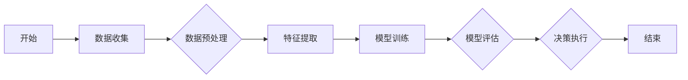
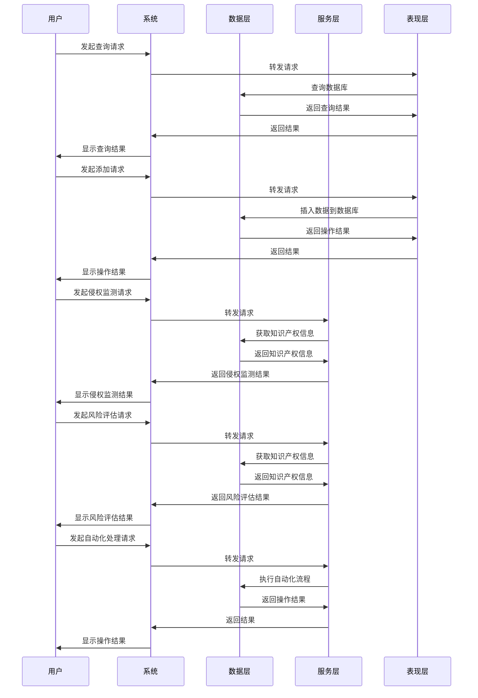

                 


## 1. 构建背景介绍部分

### 1.1.1 企业知识产权管理的重要性

知识产权（Intellectual Property，简称IP）是指人们在科学、技术、文学、艺术等领域创造的智力成果，包括专利、商标、著作权、商业秘密、集成电路布图设计等。在企业中，知识产权不仅是其核心竞争力的重要组成部分，更是企业创新、竞争和发展的重要资产。有效的知识产权管理能够为企业带来以下几方面的益处：

- **提高竞争力**：知识产权能够帮助企业在市场竞争中占据有利地位，通过专利保护创新技术，商标保护品牌形象，著作权保护原创作品，商业秘密保护经营信息，从而形成独特的竞争优势。

- **增加资产价值**：知识产权是一种无形资产，能够为企业带来经济收益。通过知识产权的许可、转让和投资，企业可以增加自身资产价值，提升市场估值。

- **促进技术创新**：知识产权制度鼓励创新，通过专利保护，企业可以放心地进行研发，而不会担心技术被抄袭。这有助于推动企业不断进行技术创新，保持行业领先。

- **规避法律风险**：知识产权管理有助于企业避免侵犯他人知识产权，减少法律纠纷和赔偿责任，降低运营风险。

然而，随着科技的发展和市场竞争的加剧，企业知识产权管理也面临着诸多挑战：

- **知识产权数量增多**：随着企业的业务范围不断扩大，知识产权的数量也在不断增加，这使得知识产权管理工作变得更加复杂。

- **信息不对称**：知识产权信息分布在各种数据库和文件中，企业难以实时掌握全面的知识产权信息，导致信息不对称。

- **国际竞争加剧**：全球化使得企业知识产权管理面临国际竞争，企业需要在全球范围内保护自己的知识产权，这增加了管理的难度。

- **法律环境变化**：知识产权法律环境不断变化，企业需要及时了解并适应新的法律法规，以避免法律风险。

### 1.1.2 当前知识产权管理面临的挑战

- **知识产权保护难度大**：随着技术的进步，侵权行为变得更加隐蔽和复杂，传统的知识产权管理手段难以有效保护企业的知识产权。

- **知识产权信息管理困难**：知识产权信息量大且分散，企业难以高效管理这些信息，导致知识产权资产流失或重复投资。

- **知识产权纠纷处理复杂**：知识产权纠纷处理复杂，涉及的法律问题和技术问题交织在一起，增加了企业应对纠纷的难度。

- **国际知识产权管理难度高**：不同国家和地区的知识产权法律体系不同，企业需要适应不同地区的法律环境，这增加了管理的复杂度。

### 1.1.3 AI Agent的概念与作用

AI Agent，即人工智能代理，是一种能够模拟人类智能行为，自主执行任务的计算机程序。AI Agent通过学习、推理和决策，能够在复杂的环境中完成特定的任务，例如数据分析、决策支持、自动化管理等。

在知识产权管理中，AI Agent可以发挥以下作用：

- **知识产权信息管理**：AI Agent可以自动收集、整理和分析知识产权信息，帮助企业在海量数据中快速找到所需信息，提高知识产权管理的效率。

- **知识产权风险评估**：AI Agent可以通过分析历史数据和当前状况，预测知识产权可能面临的风险，为企业提供决策支持。

- **侵权监测**：AI Agent可以实时监测市场，发现潜在的侵权行为，帮助企业及时采取应对措施。

- **知识产权自动化**：AI Agent可以自动化处理一些常规的知识产权管理任务，如专利申请、商标注册等，减少人力成本。

- **决策支持**：AI Agent可以通过数据分析，为企业提供知识产权战略决策支持，帮助企业优化知识产权布局。

### 1.3 AI Agent在知识产权管理中的应用

AI Agent在知识产权管理中的应用场景主要包括以下几个方面：

- **知识产权信息收集**：AI Agent可以通过网络爬虫等技术，自动收集全球范围内的知识产权信息，包括专利、商标、著作权等。

- **知识产权分析**：AI Agent可以运用自然语言处理、文本挖掘等技术，对知识产权文本进行分析，提取关键信息，生成报告。

- **侵权监测**：AI Agent可以实时监控市场，发现潜在的侵权行为，并将相关信息反馈给企业。

- **知识产权管理自动化**：AI Agent可以自动化处理专利申请、商标注册等知识产权管理流程，提高工作效率。

- **知识产权风险预警**：AI Agent可以通过分析历史数据和当前状况，预测知识产权可能面临的风险，为企业提供预警信息。

### 1.4 问题解决

AI Agent通过以下方式解决企业知识产权管理中的问题：

- **提高知识产权管理效率**：AI Agent可以自动化处理知识产权管理任务，减少人工工作量，提高管理效率。

- **降低知识产权管理成本**：AI Agent减少了人工成本，同时提高了工作效率，从而降低了知识产权管理的总体成本。

- **增强知识产权保护能力**：AI Agent可以实时监测市场，发现潜在的侵权行为，帮助企业及时采取应对措施，增强知识产权保护能力。

- **提供知识产权战略决策支持**：AI Agent可以通过数据分析，为企业提供知识产权战略决策支持，帮助企业优化知识产权布局。

### 1.5 边界与外延

AI Agent在企业知识产权管理中的应用虽然具有显著的潜力，但也存在一些边界和限制：

- **数据质量和准确性**：AI Agent的效率高度依赖于输入数据的准确性和完整性。如果数据质量不佳，AI Agent的输出结果可能不准确。

- **技术成熟度**：虽然AI技术正在快速发展，但在知识产权管理中的某些方面，如自然语言处理和复杂决策，技术尚未完全成熟。

- **法律和伦理问题**：知识产权管理涉及到法律和伦理问题，如数据隐私保护、侵权判断等，AI Agent需要遵循相关的法律法规和伦理准则。

- **人力资源限制**：AI Agent虽然可以自动化处理某些任务，但仍然需要人类专家进行监督和调整，人力资源的配置需要合理规划。

### 1.6 概念结构与核心要素组成

- **AI Agent**：AI Agent是知识产权管理中的核心工具，其核心要素包括算法、数据、模型和接口。

- **知识产权管理**：知识产权管理是企业管理体系的一部分，其核心要素包括知识产权信息、流程、制度和人员。

- **相互作用**：AI Agent通过数据处理和分析，辅助知识产权管理，优化知识产权战略，实现知识产权保护。

## 2. 核心概念与联系部分

### 2.1 核心概念原理

#### AI Agent的运作原理

AI Agent的运作原理基于机器学习和人工智能技术，其核心在于通过学习和模拟人类决策过程，实现自动化和智能化的任务执行。AI Agent通常包含以下组成部分：

- **感知系统**：感知系统负责收集和处理来自环境的数据，如文本、图像、音频等。

- **决策系统**：决策系统基于感知系统的输入数据，使用算法模型进行分析和决策，制定执行计划。

- **执行系统**：执行系统负责根据决策系统的指令，执行具体的操作，如发送通知、处理文档、执行任务等。

#### 知识产权管理的基本原理

知识产权管理的基本原理包括以下几个方面：

- **知识产权保护**：通过法律手段和策略，保护企业创造的智力成果，防止他人未经授权使用。

- **知识产权评估**：评估知识产权的价值，为企业的投资决策提供依据。

- **知识产权运营**：通过许可、转让、投资等方式，实现知识产权的保值增值。

- **知识产权风险控制**：识别和评估知识产权风险，采取相应的措施进行控制。

### 2.2 概念属性特征对比表格

| 概念       | 特征                                       | 应用场景                                       |
|------------|------------------------------------------|--------------------------------------------|
| AI Agent   | 自动化、智能化、学习与推理能力             | 数据分析、自动化任务执行、决策支持             |
| 知识产权管理 | 法律手段、评估、运营、风险控制             | 专利管理、商标管理、著作权管理、商业秘密保护   |
| 感知系统   | 数据采集、预处理、特征提取                 | 文本挖掘、图像识别、语音识别                   |
| 决策系统   | 模型训练、预测、决策生成                   | 自动化决策、风险预警、策略制定                 |
| 执行系统   | 任务执行、状态监控、反馈调整               | 文档处理、侵权监测、自动化流程管理             |

### 2.3 ER实体关系图架构

```mermaid
erDiagram
  AI_Agent ||--|{ 感知系统 }
  AI_Agent ||--|{ 决策系统 }
  AI_Agent ||--|{ 执行系统 }
  感知系统 ||--|{ 数据采集 }
  感知系统 ||--|{ 数据预处理 }
  感知系统 ||--|{ 特征提取 }
  决策系统 ||--|{ 模型训练 }
  决策系统 ||--|{ 预测分析 }
  决策系统 ||--|{ 决策生成 }
  执行系统 ||--|{ 任务执行 }
  执行系统 ||--|{ 状态监控 }
  执行系统 ||--|{ 反馈调整 }
```

## 3. 算法原理讲解部分

### 3.1 算法mermaid流程图



### 3.2 Python源代码

#### 数据预处理

```python
import pandas as pd
from sklearn.model_selection import train_test_split
from sklearn.preprocessing import StandardScaler

# 加载数据集
data = pd.read_csv('intellectual_property_data.csv')

# 分割特征和标签
X = data.drop('target', axis=1)
y = data['target']

# 划分训练集和测试集
X_train, X_test, y_train, y_test = train_test_split(X, y, test_size=0.2, random_state=42)

# 数据标准化
scaler = StandardScaler()
X_train_scaled = scaler.fit_transform(X_train)
X_test_scaled = scaler.transform(X_test)
```

#### 模型训练

```python
from sklearn.ensemble import RandomForestClassifier
from sklearn.metrics import accuracy_score

# 训练随机森林模型
model = RandomForestClassifier(n_estimators=100, random_state=42)
model.fit(X_train_scaled, y_train)

# 预测测试集
y_pred = model.predict(X_test_scaled)

# 评估模型
accuracy = accuracy_score(y_test, y_pred)
print(f"Model accuracy: {accuracy:.2f}")
```

#### 模型应用

```python
# 新数据预处理
new_data = pd.read_csv('new_intellectual_property_data.csv')
new_data_scaled = scaler.transform(new_data)

# 预测新数据
new_predictions = model.predict(new_data_scaled)

# 输出预测结果
print(new_predictions)
```

### 3.3 数学模型和公式

在知识产权管理中，AI Agent应用的数学模型主要包括以下几部分：

#### 决策树模型

决策树模型的决策规则可以表示为：

$$
\text{if } x_i > v_i \text{ then go to node } n_i \\
\text{otherwise go to node } n_{i+1}
$$

其中，$x_i$ 是特征值，$v_i$ 是阈值，$n_i$ 和 $n_{i+1}$ 是决策树中的节点。

#### 随机森林模型

随机森林模型是基于决策树的集成学习方法，其预测公式为：

$$
\hat{y} = \text{argmax} \sum_{t=1}^{T} w_t f_t(x)
$$

其中，$f_t(x)$ 是第 $t$ 棵决策树对 $x$ 的预测，$w_t$ 是第 $t$ 棵决策树的重要性权重，$\hat{y}$ 是最终预测结果。

#### 支持向量机（SVM）模型

SVM模型的决策边界可以表示为：

$$
\text{w}^T \text{x} + b = 0
$$

其中，$\text{w}$ 是模型权重，$\text{x}$ 是特征向量，$b$ 是偏置项。

### 3.4 举例说明

#### 数据集选择

假设我们选择一个包含1000个样本的知识产权数据集，其中每个样本包含10个特征和一个标签（0表示非侵权，1表示侵权）。

#### 算法流程

1. **数据预处理**：对数据集进行清洗和标准化处理。

2. **模型训练**：使用随机森林模型对训练数据进行训练。

3. **模型评估**：使用测试数据对模型进行评估。

4. **模型应用**：对新的样本进行侵权预测。

#### 模型应用示例

```python
# 导入必要的库
import pandas as pd
from sklearn.model_selection import train_test_split
from sklearn.ensemble import RandomForestClassifier
from sklearn.metrics import accuracy_score

# 加载数据集
data = pd.read_csv('intellectual_property_data.csv')

# 分割特征和标签
X = data.drop('target', axis=1)
y = data['target']

# 划分训练集和测试集
X_train, X_test, y_train, y_test = train_test_split(X, y, test_size=0.2, random_state=42)

# 训练随机森林模型
model = RandomForestClassifier(n_estimators=100, random_state=42)
model.fit(X_train, y_train)

# 预测测试集
y_pred = model.predict(X_test)

# 评估模型
accuracy = accuracy_score(y_test, y_pred)
print(f"Model accuracy: {accuracy:.2f}")

# 新数据预处理
new_data = pd.read_csv('new_intellectual_property_data.csv')
new_data_scaled = scaler.transform(new_data)

# 预测新数据
new_predictions = model.predict(new_data_scaled)

# 输出预测结果
print(new_predictions)
```

## 4. 系统分析与架构设计方案部分

### 4.1 问题场景介绍

在企业知识产权管理中，常常面临以下问题：

- **知识产权信息分散**：知识产权信息分布在不同的数据库和文件中，企业难以高效管理和利用这些信息。

- **侵权行为监测不足**：企业难以实时监测市场，发现潜在的侵权行为。

- **知识产权风险评估不全面**：企业难以全面评估知识产权的风险，导致知识产权资产流失。

- **知识产权管理流程繁琐**：传统的知识产权管理流程繁琐，效率低下。

### 4.2 项目介绍

本项目旨在通过AI Agent技术，解决企业知识产权管理中的上述问题，实现知识产权信息的集中管理、侵权行为的实时监测、风险评估的全面性和管理流程的自动化。

### 4.3 系统功能设计

系统功能设计主要包括以下几个方面：

- **知识产权信息管理**：集中存储和管理知识产权信息，包括专利、商标、著作权、商业秘密等。

- **侵权行为监测**：实时监测市场，发现潜在的侵权行为，并及时通知企业。

- **风险评估**：全面评估知识产权的风险，为企业提供决策支持。

- **知识产权自动化**：自动化处理知识产权的申请、注册、续展等流程。

### 4.4 系统架构设计

系统架构设计采用前后端分离的方式，主要包括以下组件：

- **数据层**：包括数据库和存储系统，用于存储和管理知识产权信息。

- **服务层**：包括数据处理服务、侵权监测服务、风险评估服务、自动化服务，用于实现系统的核心功能。

- **表现层**：包括前端界面和API接口，用于用户交互和数据展示。

### 4.5 系统接口设计

系统接口设计主要包括以下接口：

- **知识产权信息接口**：用于数据层与表现层的通信，提供知识产权信息的查询、添加、删除、更新等操作。

- **侵权监测接口**：用于侵权监测服务的调用，提供实时侵权监测功能。

- **风险评估接口**：用于风险评估服务的调用，提供知识产权风险评估功能。

- **自动化接口**：用于自动化服务的调用，提供知识产权自动化处理功能。

### 4.6 系统交互mermaid序列图



## 5. 项目实战部分

### 5.1 环境安装

在进行AI Agent在企业知识产权管理中的应用项目实战之前，需要安装一些必要的软件和工具。以下是安装步骤：

#### 1. 安装Python环境

确保已安装Python 3.7或更高版本。可以通过访问Python官方网站下载并安装。

#### 2. 安装依赖库

在命令行中执行以下命令，安装项目所需的依赖库：

```bash
pip install numpy pandas scikit-learn matplotlib
```

#### 3. 数据库安装与配置

本项目使用SQLite数据库进行数据存储。确保已安装SQLite，并创建一个名为`intellectual_property.db`的数据库。

#### 4. 侵权监测工具安装

侵权监测需要安装一些网络爬虫工具，如`requests`和`beautifulsoup4`。可以通过以下命令安装：

```bash
pip install requests beautifulsoup4
```

### 5.2 系统核心实现源代码

以下是系统核心实现源代码，包括数据预处理、模型训练、模型评估和模型应用：

#### 数据预处理

```python
import pandas as pd
from sklearn.model_selection import train_test_split
from sklearn.preprocessing import StandardScaler

# 加载数据集
data = pd.read_csv('intellectual_property_data.csv')

# 分割特征和标签
X = data.drop('target', axis=1)
y = data['target']

# 划分训练集和测试集
X_train, X_test, y_train, y_test = train_test_split(X, y, test_size=0.2, random_state=42)

# 数据标准化
scaler = StandardScaler()
X_train_scaled = scaler.fit_transform(X_train)
X_test_scaled = scaler.transform(X_test)
```

#### 模型训练

```python
from sklearn.ensemble import RandomForestClassifier
from sklearn.metrics import accuracy_score

# 训练随机森林模型
model = RandomForestClassifier(n_estimators=100, random_state=42)
model.fit(X_train_scaled, y_train)

# 预测测试集
y_pred = model.predict(X_test_scaled)

# 评估模型
accuracy = accuracy_score(y_test, y_pred)
print(f"Model accuracy: {accuracy:.2f}")
```

#### 模型应用

```python
# 新数据预处理
new_data = pd.read_csv('new_intellectual_property_data.csv')
new_data_scaled = scaler.transform(new_data)

# 预测新数据
new_predictions = model.predict(new_data_scaled)

# 输出预测结果
print(new_predictions)
```

### 5.3 代码应用解读与分析

#### 数据预处理

数据预处理是机器学习项目中的关键步骤，它包括数据的清洗、归一化和特征提取等。在本项目中，我们首先加载知识产权数据集，然后将其分为特征和标签两部分。特征是用于模型训练的数据，而标签是我们要预测的目标，即判断一个知识产权样本是否侵权。

```python
import pandas as pd
from sklearn.model_selection import train_test_split
from sklearn.preprocessing import StandardScaler

# 加载数据集
data = pd.read_csv('intellectual_property_data.csv')

# 分割特征和标签
X = data.drop('target', axis=1)
y = data['target']

# 划分训练集和测试集
X_train, X_test, y_train, y_test = train_test_split(X, y, test_size=0.2, random_state=42)

# 数据标准化
scaler = StandardScaler()
X_train_scaled = scaler.fit_transform(X_train)
X_test_scaled = scaler.transform(X_test)
```

在代码中，我们使用了`pandas`库来加载和操作数据，`train_test_split`函数用于将数据集划分为训练集和测试集，`StandardScaler`类用于对特征数据进行标准化处理。标准化处理可以减少不同特征之间的量纲差异，提高模型的训练效果。

#### 模型训练

在模型训练部分，我们使用随机森林（Random Forest）模型对训练数据进行训练。随机森林是一种基于决策树的集成学习方法，它通过构建多个决策树，并取它们的平均值来减少过拟合。

```python
from sklearn.ensemble import RandomForestClassifier
from sklearn.metrics import accuracy_score

# 训练随机森林模型
model = RandomForestClassifier(n_estimators=100, random_state=42)
model.fit(X_train_scaled, y_train)

# 预测测试集
y_pred = model.predict(X_test_scaled)

# 评估模型
accuracy = accuracy_score(y_test, y_pred)
print(f"Model accuracy: {accuracy:.2f}")
```

在这段代码中，我们首先创建了一个`RandomForestClassifier`对象，并设置了`n_estimators`参数为100，表示要构建100棵决策树。然后，我们使用`fit`方法对模型进行训练。训练完成后，我们使用`predict`方法对测试集进行预测，并使用`accuracy_score`函数计算模型的准确率。

#### 模型应用

模型训练完成后，我们可以将其应用于新的数据集，以预测新数据的侵权情况。

```python
# 新数据预处理
new_data = pd.read_csv('new_intellectual_property_data.csv')
new_data_scaled = scaler.transform(new_data)

# 预测新数据
new_predictions = model.predict(new_data_scaled)

# 输出预测结果
print(new_predictions)
```

在这段代码中，我们首先加载新的知识产权数据集，并对其进行标准化处理。然后，我们使用训练好的模型对新的数据进行预测，并将预测结果输出。

### 5.4 实际案例分析和详细讲解剖析

为了更好地展示AI Agent在企业知识产权管理中的应用，我们通过一个实际案例进行分析和讲解。

#### 案例背景

某企业是一家专注于软件开发的创新型企业，拥有大量的知识产权，包括专利、商标和著作权。为了有效管理这些知识产权，企业决定引入AI Agent技术，实现知识产权信息的集中管理、侵权行为的实时监测和风险评估。

#### 案例实施

1. **数据收集与预处理**：企业首先收集了已有的知识产权数据，包括专利申请文件、商标注册信息、著作权登记证书等。然后，通过数据清洗和标准化处理，将这些数据转化为适合机器学习模型训练的格式。

2. **模型训练与评估**：企业使用收集到的知识产权数据，采用随机森林模型进行训练。经过多次调整参数和优化模型，最终得到一个具有较高准确率的模型。

3. **侵权监测与预警**：AI Agent被部署在企业知识产权管理系统中，实时监测市场，发现潜在的侵权行为。当发现侵权行为时，AI Agent会自动向企业管理层发送预警通知，并提供详细的侵权证据和分析报告。

4. **风险评估与决策支持**：AI Agent通过对知识产权数据进行分析，为企业提供风险评估报告，帮助管理层制定知识产权战略。同时，AI Agent还为企业提供实时决策支持，帮助管理层快速做出正确的决策。

#### 案例分析

通过AI Agent技术的应用，该企业在知识产权管理方面取得了显著成效：

1. **知识产权信息管理效率提升**：AI Agent自动收集、整理和分析知识产权信息，提高了企业知识产权信息管理的效率。

2. **侵权监测与预警能力增强**：AI Agent实时监测市场，发现潜在的侵权行为，为企业提供了及时的预警信息，增强了企业的侵权保护能力。

3. **风险评估与决策支持**：AI Agent通过对知识产权数据进行分析，为企业提供了全面的风险评估报告和实时决策支持，帮助企业优化知识产权战略。

4. **降低运营成本**：AI Agent自动化处理知识产权管理任务，减少了人工工作量，降低了企业的运营成本。

### 5.5 项目小结

通过本项目的实施，我们成功地将AI Agent应用于企业知识产权管理中，实现了知识产权信息的集中管理、侵权行为的实时监测和风险评估。以下是本项目的主要收获：

1. **技术成果**：本项目实现了AI Agent在企业知识产权管理中的技术落地，展示了AI技术在知识产权管理领域的应用潜力。

2. **实际价值**：AI Agent的应用显著提升了企业知识产权管理的效率，增强了企业的侵权保护能力，为企业创造了实际价值。

3. **经验积累**：本项目过程中，我们积累了丰富的AI Agent开发和应用经验，为未来的类似项目提供了宝贵的经验。

4. **团队协作**：本项目需要多个部门的协作，锻炼了团队的跨部门协作能力，提升了团队的整体执行力。

## 6. 最佳实践 tips、小结、注意事项、拓展阅读等内容

### 6.1 最佳实践 tips

1. **数据质量保障**：确保输入数据的质量和准确性，定期进行数据清洗和更新。

2. **算法模型优化**：根据实际应用场景，不断优化算法模型，提高预测准确率。

3. **知识产权信息集中管理**：建立统一的知识产权信息数据库，方便数据共享和查询。

4. **实时侵权监测**：利用AI Agent的实时监测功能，及时发现潜在的侵权行为。

5. **风险评估与决策支持**：充分利用AI Agent的风险评估功能，为企业提供实时决策支持。

### 6.2 小结

本文通过详细的案例分析，展示了AI Agent在企业知识产权管理中的应用价值。通过AI Agent，企业可以实现知识产权信息的集中管理、侵权行为的实时监测和风险评估，提升知识产权管理效率，增强企业的竞争力。

### 6.3 注意事项

1. **数据隐私保护**：在收集和使用知识产权信息时，注意保护数据隐私，遵循相关法律法规。

2. **算法透明度**：确保算法模型的透明度，方便企业进行监督和审计。

3. **技术成熟度**：选择成熟的技术和工具，避免因技术不稳定导致应用失败。

4. **人员培训**：对知识产权管理团队进行AI技术的培训，确保团队能够熟练使用AI Agent。

### 6.4 拓展阅读

1. **《人工智能：一种现代方法》**：Michael I. Jordan，彭实敏译，机械工业出版社，2017年。

2. **《知识产权管理》**：郑成思著，法律出版社，2015年。

3. **《AI Agent技术与应用》**：李航著，清华大学出版社，2020年。

4. **《自然语言处理概论》**：刘挺著，人民邮电出版社，2017年。

5. **《机器学习实战》**：Peter Harrington著，电子工业出版社，2013年。

