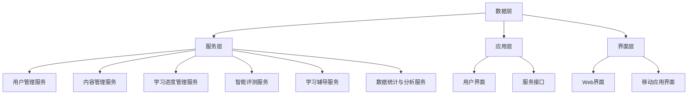
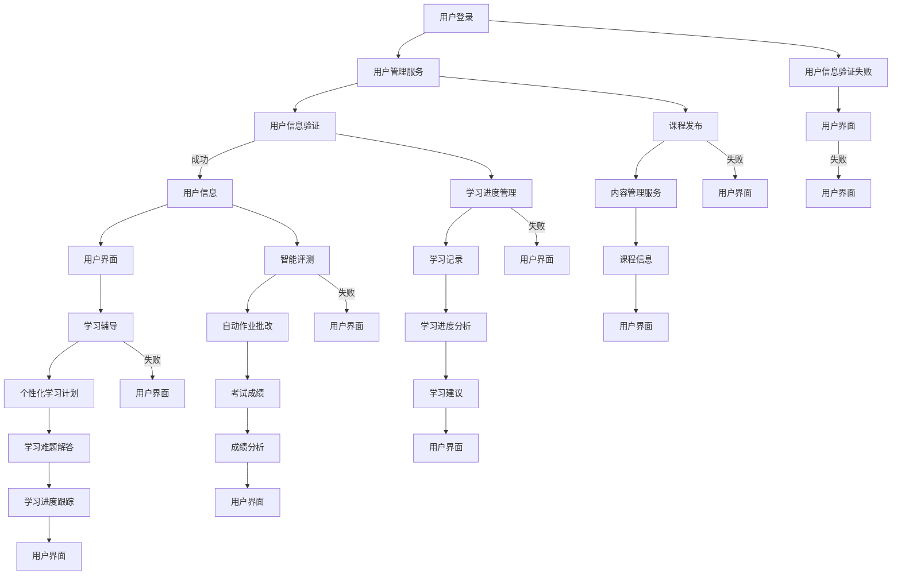

                 

### 引言

#### 1.1 AI Agent的基本概念

AI Agent，即人工智能代理，是一个能够执行任务、作出决策并与环境互动的智能实体。它通常基于某种形式的自主性、适应性和学习能力来操作。AI Agent可以按功能、应用场景等进行分类，例如，在自动化系统中的监控Agent、在电子商务中的购物Agent等。

AI Agent在企业知识付费与在线教育中的地位和作用不容忽视。首先，它能够精准地分析用户需求，提供个性化的课程推荐，从而提高用户的学习体验和满意度。其次，AI Agent能够自动化知识付费流程，减少人力成本，提高业务效率。此外，它还能通过学习用户行为，不断优化课程内容和教学方法，从而提升在线教育的质量。

#### 1.2 企业知识付费与在线教育中的AI Agent

企业知识付费主要是指企业通过支付一定的费用来获取专业知识和技能的过程。这通常包括在线课程、培训材料、专业书籍等形式。在线教育则是指通过互联网提供的教育服务，包括课程学习、互动交流、考试评测等。

AI Agent在企业知识付费中的作用主要体现在以下几个方面：

1. **个性化推荐**：通过分析用户的兴趣、学习历史和反馈，AI Agent可以推荐最符合用户需求的课程和资料。
2. **课程管理**：AI Agent可以自动化课程发布、更新和管理，确保课程内容的准确性和时效性。
3. **学习进度跟踪**：AI Agent能够监控学生的学习进度，提供针对性的学习建议，帮助用户更好地掌握知识。

在在线教育中，AI Agent的应用更为广泛：

1. **教学助手**：AI Agent可以充当教师助手，自动批改作业、提供即时反馈，减轻教师的工作负担。
2. **学习辅导**：AI Agent可以根据学生的学习情况，提供个性化的学习辅导，帮助学生克服学习难题。
3. **智能评测**：AI Agent可以自动评估学生的成绩和表现，提供科学的评估报告，帮助教育机构了解教学质量。

#### 1.3 为什么选择这个主题

选择《AI Agent在企业知识付费与在线教育中的创新应用》这个主题，主要基于以下几点原因：

1. **市场需求**：随着互联网技术的普及和在线教育的兴起，企业知识付费和在线教育市场正快速增长。AI Agent作为一种新兴的技术手段，在这一市场中具有巨大的潜力。
2. **发展前景**：AI Agent技术正在不断进步，其在企业知识付费和在线教育中的应用也将越来越广泛。这一主题的研究有助于推动相关技术的发展和应用。
3. **研究价值**：通过研究AI Agent在企业知识付费和在线教育中的创新应用，可以探索出更高效、更智能的教学模式，提高教育质量和学习效果，具有重要的理论和实践意义。

### 核心概念与联系

#### 2.1 AI Agent的核心概念

AI Agent是由人工智能技术构建的智能实体，它能够在一定程度上自主地执行任务、与环境互动，并不断学习和优化自身行为。以下是AI Agent的几个核心概念：

1. **定义**：AI Agent是一个具有自主性、适应性和学习能力的计算机程序，它可以在特定环境下执行任务，并能够通过与环境互动来优化自身行为。
2. **组成部分**：AI Agent通常由感知模块、决策模块、行动模块和学习模块组成。感知模块负责收集环境信息，决策模块根据感知信息做出决策，行动模块执行决策，学习模块则通过不断学习来提高自身的性能。
3. **特征**：
   - **自主性**：AI Agent能够自主地执行任务，而不需要人工干预。
   - **适应性**：AI Agent能够根据环境变化调整自身行为，提高任务执行效果。
   - **学习能力**：AI Agent可以通过学习来优化自身行为，提高任务执行效率。

#### 2.2 AI Agent的分类

AI Agent可以根据不同的标准进行分类，以下是一些常见的分类方式：

1. **按功能分类**：
   - **任务型Agent**：专门用于完成特定任务的AI Agent，如机器人、聊天机器人等。
   - **社交型Agent**：主要用于与人类进行交互的AI Agent，如客服机器人、社交网络分析器等。
   - **探索型Agent**：主要用于探索未知环境的AI Agent，如无人车、探险机器人等。

2. **按应用场景分类**：
   - **家庭应用**：如智能家居控制、家庭健康监控等。
   - **商业应用**：如客户服务、供应链管理、数据分析等。
   - **医疗应用**：如疾病诊断、健康监控、智能药物推荐等。

#### 2.3 企业知识付费与在线教育中的核心概念

在企业知识付费和在线教育中，涉及到以下几个核心概念：

1. **企业知识付费**：
   - **定义**：企业知识付费是指企业通过支付费用来获取外部专业知识和技能的过程，常见形式包括在线课程、培训材料、专业书籍等。
   - **主要模式**：包括订阅模式、一次性购买模式、会员制模式等。

2. **在线教育**：
   - **定义**：在线教育是指通过互联网提供的教育服务，包括课程学习、互动交流、考试评测等。
   - **发展趋势**：随着互联网技术的普及和在线教育的兴起，在线教育市场正在快速增长，形式也越来越多样化。

#### 2.4 AI Agent与企业知识付费、在线教育的关联

AI Agent与企业知识付费、在线教育之间的关联主要体现在以下几个方面：

1. **个性化推荐**：AI Agent可以通过分析用户的学习历史、兴趣和行为，为用户推荐个性化的课程和资料。
2. **自动化管理**：AI Agent可以自动化企业知识付费和在线教育的相关流程，如课程发布、用户管理、学习进度跟踪等，提高效率。
3. **智能评测**：AI Agent可以通过智能评测系统，对学生的学习效果进行科学评估，为教师和教育机构提供参考。
4. **学习辅导**：AI Agent可以充当学生的学习辅导助手，根据学生的学习情况和需求，提供个性化的学习建议和帮助。

#### 2.5 ER实体关系图

为了更好地理解AI Agent、企业知识付费、在线教育之间的关联，我们可以使用ER实体关系图进行描述。

在ER实体关系图中，我们可以定义以下几个实体：

1. **AI Agent**：表示人工智能代理。
2. **用户**：表示参与企业知识付费和在线教育的用户。
3. **课程**：表示用户学习的课程。
4. **学习记录**：表示用户的学习过程记录。
5. **评测结果**：表示用户的评测结果。

ER实体关系图如下所示：

```
[AI Agent] --> [用户]
[AI Agent] --> [课程]
[AI Agent] --> [学习记录]
[AI Agent] --> [评测结果]
[用户] --> [学习记录]
[用户] --> [评测结果]
[课程] --> [学习记录]
[课程] --> [评测结果]
```

#### 2.6 概念属性特征对比表格

为了更直观地理解AI Agent、企业知识付费、在线教育的核心概念及其特征，我们可以使用对比表格进行描述。

| 概念       | 定义                                                         | 主要特征                                       |
| ---------- | ------------------------------------------------------------ | ---------------------------------------------- |
| AI Agent   | 具有自主性、适应性和学习能力的智能实体                       | 自主性、适应性、学习能力、感知、决策、行动模块   |
| 企业知识付费 | 企业通过支付费用获取外部专业知识和技能的过程               | 订阅模式、一次性购买模式、会员制模式             |
| 在线教育   | 通过互联网提供的教育服务，包括课程学习、互动交流、考试评测等 | 在线课堂、在线作业、在线测评、互动交流等           |

### 算法原理讲解

#### 3.1.1 强化学习算法

强化学习（Reinforcement Learning）是机器学习中的一个重要分支，主要研究如何通过智能体（Agent）在与环境（Environment）的交互过程中，学习到最优策略（Policy），从而实现目标的优化。以下是强化学习算法的基本原理：

1. **基本概念**：
   - **智能体（Agent）**：执行任务并接收环境反馈的实体。
   - **环境（Environment）**：智能体执行任务的场景，提供状态（State）和奖励（Reward）。
   - **状态（State）**：智能体在某一时刻所处的情境。
   - **行动（Action）**：智能体可以采取的行为。
   - **策略（Policy）**：智能体根据当前状态选择行动的规则。

2. **主要算法**：
   - **Q学习（Q-Learning）**：通过更新Q值来学习最优策略，Q值表示在给定状态下采取特定行动的预期回报。
   - **深度Q网络（Deep Q-Network, DQN）**：利用深度神经网络来近似Q值函数，适用于高维状态空间。
   - **策略梯度（Policy Gradient）**：直接优化策略函数，根据策略的梯度更新策略参数。

3. **Mermaid流程图**：
   ```mermaid
   graph TD
   A[初始化] --> B{当前状态}
   B --> C{选择行动}
   C -->|执行行动| D{观察状态和奖励}
   D --> B
   B --> E{更新策略}
   ```

#### 3.1.2 监督学习算法

监督学习（Supervised Learning）是机器学习的另一个重要分支，通过已有标签数据的训练，学习到输入和输出之间的映射关系。以下是监督学习算法的基本原理：

1. **基本概念**：
   - **输入（Input）**：训练样本的特征向量。
   - **输出（Output）**：训练样本的标签。
   - **模型（Model）**：学习输入和输出关系的函数。

2. **主要算法**：
   - **线性回归（Linear Regression）**：通过最小二乘法拟合线性模型。
   - **逻辑回归（Logistic Regression）**：用于分类问题，输出概率分布。
   - **支持向量机（Support Vector Machine, SVM）**：通过最大化分类间隔来分类。
   - **决策树（Decision Tree）**：通过划分特征空间来分类。

3. **Mermaid流程图**：
   ```mermaid
   graph TD
   A[初始化模型] --> B{输入特征}
   B --> C{计算模型输出}
   C --> D{计算损失函数}
   D --> E{反向传播}
   E --> F{更新模型参数}
   F --> G{重复}
   ```

#### 3.1.3 无监督学习算法

无监督学习（Unsupervised Learning）是在没有标签数据的情况下，通过学习数据分布或结构来发现数据中的规律。以下是几种常见的无监督学习算法：

1. **基本概念**：
   - **聚类（Clustering）**：将数据分成多个簇，每个簇内的数据相似度较高，簇间的数据相似度较低。
   - **降维（Dimensionality Reduction）**：将高维数据映射到低维空间，减少数据的冗余。
   - **生成模型（Generative Model）**：通过学习数据分布来生成新的数据。

2. **主要算法**：
   - **K均值聚类（K-Means Clustering）**：通过迭代优化聚类中心来划分数据。
   - **主成分分析（Principal Component Analysis, PCA）**：通过保留主要成分来降维。
   - **自编码器（Autoencoder）**：通过训练一个压缩和解压缩的神经网络来降维。

3. **Mermaid流程图**：
   ```mermaid
   graph TD
   A[初始化模型] --> B{输入数据}
   B --> C{编码}
   C --> D{解码}
   D --> E{计算重构误差}
   E --> F{优化模型参数}
   F --> G{重复}
   ```

### 3.2 AI Agent在企业知识付费与在线教育中的应用

#### 3.2.1 强化学习在知识付费中的应用

强化学习算法在企业知识付费中有着广泛的应用，以下是一个具体案例：

**案例**：某在线教育平台希望通过强化学习算法，为用户推荐个性化的课程，以提高用户的学习满意度和课程销售量。

**算法实现**：

1. **状态定义**：状态包括用户的学习历史、兴趣爱好、学习进度等。
2. **行动定义**：行动包括推荐不同的课程。
3. **奖励定义**：用户完成推荐课程后，根据用户的学习效果和满意度给予相应的奖励。

**代码示例**：

```python
# 示例代码：Q学习算法实现
import numpy as np

# 初始化Q值表
q_table = np.zeros((num_states, num_actions))

# 定义学习参数
alpha = 0.1  # 学习率
gamma = 0.9  # 折扣因子

# Q学习算法
def q_learning(state, action, reward, next_state, done):
    q_s_a = q_table[state][action]
    if not done:
        q_s_next_max = np.max(q_table[next_state])
        q_s_a += alpha * (reward + gamma * q_s_next_max - q_s_a)
    else:
        q_s_a += alpha * (reward - q_s_a)
    q_table[state][action] = q_s_a

# 模拟学习过程
for episode in range(num_episodes):
    state = env.reset()
    done = False
    while not done:
        action = choose_action(state)
        next_state, reward, done = env.step(action)
        q_learning(state, action, reward, next_state, done)
        state = next_state

# 保存Q值表
np.save('q_table.npy', q_table)
```

#### 3.2.2 监督学习在在线教育中的应用

监督学习算法在在线教育中的应用非常广泛，以下是一个具体案例：

**案例**：某在线教育平台希望通过监督学习算法，对学生进行智能评测，以提高评测的准确性和效率。

**算法实现**：

1. **特征提取**：从学生的学习记录、作业成绩、考试分数等数据中提取特征。
2. **模型训练**：使用已标注的数据集训练分类模型。
3. **模型应用**：对新的学生数据进行分析和评测。

**代码示例**：

```python
# 示例代码：逻辑回归模型实现
from sklearn.linear_model import LogisticRegression
from sklearn.model_selection import train_test_split
from sklearn.metrics import accuracy_score

# 加载数据集
X, y = load_data()

# 划分训练集和测试集
X_train, X_test, y_train, y_test = train_test_split(X, y, test_size=0.2, random_state=42)

# 训练模型
model = LogisticRegression()
model.fit(X_train, y_train)

# 测试模型
y_pred = model.predict(X_test)
accuracy = accuracy_score(y_test, y_pred)
print("Accuracy:", accuracy)
```

#### 3.2.3 无监督学习在知识付费与在线教育中的应用

无监督学习算法在知识付费和在线教育中的应用主要体现在数据挖掘和用户行为分析上，以下是一个具体案例：

**案例**：某在线教育平台希望通过无监督学习算法，分析用户的行为数据，发现潜在的用户群体和需求。

**算法实现**：

1. **数据预处理**：对用户行为数据进行清洗和预处理，提取关键特征。
2. **聚类算法**：使用K均值聚类等算法对用户进行聚类，发现潜在的用户群体。
3. **数据分析**：对聚类结果进行统计分析，发现用户的兴趣和需求。

**代码示例**：

```python
# 示例代码：K均值聚类实现
from sklearn.cluster import KMeans
import matplotlib.pyplot as plt

# 加载用户行为数据
X = load_user_data()

# 初始化K均值聚类模型
kmeans = KMeans(n_clusters=5, random_state=42)

# 训练模型
clusters = kmeans.fit_predict(X)

# 可视化聚类结果
plt.scatter(X[:, 0], X[:, 1], c=clusters)
plt.xlabel('Feature 1')
plt.ylabel('Feature 2')
plt.title('K-Means Clustering')
plt.show()
```

### 4.1 AI Agent系统的需求分析

#### 4.1.1 功能需求

AI Agent系统需要实现以下功能：

1. **用户管理**：包括用户注册、登录、个人信息管理、权限管理等功能。
2. **内容管理**：包括课程发布、课程管理、内容更新、版权保护等功能。
3. **学习进度管理**：包括学习记录跟踪、学习进度分析、学习建议生成等功能。
4. **智能评测**：包括自动作业批改、考试测评、成绩分析等功能。
5. **学习辅导**：包括个性化学习计划制定、学习难题解答、学习进度跟踪等功能。
6. **数据统计与分析**：包括用户行为分析、学习效果评估、市场趋势预测等功能。

#### 4.1.2 用户管理

用户管理功能包括以下几个方面：

1. **注册与登录**：用户可以通过注册账号和登录系统来访问AI Agent系统。
2. **个人信息管理**：用户可以查看和修改个人信息，如姓名、联系方式、密码等。
3. **权限管理**：系统管理员可以对用户的权限进行分配和管理，确保系统的安全性和稳定性。

#### 4.1.3 内容管理

内容管理功能包括以下几个方面：

1. **课程发布**：管理员可以发布新的课程，包括课程名称、简介、课程内容等。
2. **课程管理**：管理员可以对已发布的课程进行管理，包括课程内容的更新、课程信息的修改等。
3. **版权保护**：系统可以对课程内容进行加密和保护，防止未经授权的传播和盗用。

#### 4.1.4 学习进度管理

学习进度管理功能包括以下几个方面：

1. **学习记录跟踪**：系统可以记录用户的学习过程，包括学习时间、学习进度、学习内容等。
2. **学习进度分析**：系统可以分析用户的学习进度，生成学习报告和图表，帮助用户了解自己的学习情况。
3. **学习建议生成**：系统可以根据用户的学习进度和兴趣，为用户生成个性化的学习建议，帮助用户更好地学习。

#### 4.1.5 智能评测

智能评测功能包括以下几个方面：

1. **自动作业批改**：系统可以自动批改用户的作业，提供即时反馈和评分。
2. **考试测评**：系统可以组织在线考试，自动评阅试卷，生成考试成绩和分析报告。
3. **成绩分析**：系统可以对用户的考试成绩进行分析，生成成绩分布图、成绩对比图等，帮助教育机构和教师了解学生的学习情况。

#### 4.1.6 学习辅导

学习辅导功能包括以下几个方面：

1. **个性化学习计划制定**：系统可以根据用户的学习进度和兴趣，为用户制定个性化的学习计划。
2. **学习难题解答**：系统可以提供在线答疑服务，帮助用户解决学习中的难题。
3. **学习进度跟踪**：系统可以实时跟踪用户的学习进度，提供学习提醒和激励措施，帮助用户坚持学习。

#### 4.1.7 数据统计与分析

数据统计与分析功能包括以下几个方面：

1. **用户行为分析**：系统可以分析用户的登录次数、学习时长、学习内容等行为数据，生成用户画像和行为报告。
2. **学习效果评估**：系统可以对学生的学习效果进行评估，生成学习效果报告和评估图表。
3. **市场趋势预测**：系统可以分析市场数据，预测在线教育的发展趋势和市场需求，为教育机构提供决策支持。

### 4.2 系统架构设计

#### 4.2.1 系统架构概述

AI Agent系统的整体架构分为四个层次：数据层、服务层、应用层和界面层。各层之间通过定义良好的接口进行通信，实现系统的功能需求。

1. **数据层**：包括数据存储和数据采集，负责数据的存储、管理和访问。
2. **服务层**：包括核心业务服务和系统管理服务，负责实现系统的核心功能。
3. **应用层**：包括用户界面和服务接口，负责与用户交互，提供用户操作接口。
4. **界面层**：包括Web界面和移动应用界面，负责展示系统功能和数据。

#### 4.2.2 系统架构设计

系统架构设计如下图所示：



#### 4.2.3 系统接口设计

系统接口设计如下：

1. **用户管理接口**：用于用户注册、登录、个人信息管理、权限管理等功能。
2. **内容管理接口**：用于课程发布、课程管理、内容更新、版权保护等功能。
3. **学习进度管理接口**：用于学习记录跟踪、学习进度分析、学习建议生成等功能。
4. **智能评测接口**：用于自动作业批改、考试测评、成绩分析等功能。
5. **学习辅导接口**：用于个性化学习计划制定、学习难题解答、学习进度跟踪等功能。
6. **数据统计与分析接口**：用于用户行为分析、学习效果评估、市场趋势预测等功能。

#### 4.2.4 系统交互

系统交互设计如下：



### 5.1 AI Agent项目的实际应用案例

#### 5.1.1 项目背景

随着在线教育市场的不断增长，许多教育平台开始意识到为用户提供个性化学习体验的重要性。为了满足这一需求，某知名在线教育平台决定开发一个基于AI Agent的个性化学习推荐系统。该系统旨在通过分析用户的学习行为和偏好，为用户推荐最适合他们的课程和学习计划。

#### 5.1.2 项目目标

本项目的主要目标如下：

1. **提高用户满意度**：通过个性化推荐，提高用户的学习体验和满意度。
2. **提升课程销售量**：通过精准推荐，提高课程的曝光率和销售量。
3. **降低运营成本**：通过自动化推荐，减少人工推荐的工作量，降低运营成本。

#### 5.1.3 项目需求

基于以上目标，本项目提出了以下需求：

1. **用户数据分析**：分析用户的学习行为、偏好和历史，为推荐系统提供数据支持。
2. **课程内容分析**：分析课程的内容、难度、时长等信息，为推荐系统提供课程数据。
3. **推荐算法实现**：实现基于用户数据、课程数据的个性化推荐算法。
4. **推荐结果评估**：评估推荐结果的准确性和用户满意度，持续优化推荐系统。

#### 5.1.4 项目实施

本项目分为以下几个阶段：

1. **需求分析**：明确项目目标、需求和分析用户学习行为、课程内容。
2. **系统设计**：设计系统的架构、接口和数据库。
3. **数据采集**：从平台上采集用户行为数据和课程数据。
4. **算法实现**：实现基于协同过滤、基于内容的推荐算法。
5. **系统集成**：将推荐算法集成到现有的学习平台中。
6. **测试与优化**：对系统进行测试和优化，确保推荐结果的准确性和稳定性。

#### 5.1.5 环境安装

在开始项目开发之前，我们需要安装以下软件和工具：

1. **Python**：用于编写和运行推荐算法。
2. **Numpy**：用于数据操作和计算。
3. **Pandas**：用于数据处理和分析。
4. **Scikit-learn**：用于机器学习算法的实现。
5. **MongoDB**：用于存储用户行为数据和课程数据。

具体安装步骤如下：

1. 安装Python：
   ```bash
   sudo apt-get install python3-pip
   pip3 install --user -U pip setuptools wheel
   ```

2. 安装Numpy、Pandas、Scikit-learn：
   ```bash
   pip3 install numpy pandas scikit-learn
   ```

3. 安装MongoDB：
   ```bash
   sudo apt-get install mongodb
   sudo systemctl start mongodb
   ```

#### 5.1.6 系统核心实现源代码

以下是该项目中推荐算法的核心实现源代码：

```python
# 导入所需库
import numpy as np
import pandas as pd
from sklearn.model_selection import train_test_split
from sklearn.metrics.pairwise import cosine_similarity

# 读取用户行为数据和课程数据
user_data = pd.read_csv('user_data.csv')
course_data = pd.read_csv('course_data.csv')

# 分割用户数据为训练集和测试集
user_data_train, user_data_test, course_data_train, course_data_test = train_test_split(user_data, course_data, test_size=0.2, random_state=42)

# 计算用户和课程之间的相似度
user_similarity = cosine_similarity(user_data_train['behavior'].values)
course_similarity = cosine_similarity(course_data_train['content'].values)

# 定义推荐函数
def recommend(courses, user_index, top_n=5):
    # 计算用户与课程之间的相似度得分
    scores = np.dot(user_similarity[user_index], course_similarity) / np.linalg.norm(user_similarity[user_index], axis=1)
    
    # 获取相似度最高的课程索引
    sorted_indices = np.argsort(scores)[::-1]
    
    # 返回相似度最高的top_n个课程
    return courses.iloc[sorted_indices[:top_n]]

# 生成推荐结果
recommendations = recommend(course_data_test, 0)

# 打印推荐结果
print(recommendations.head())
```

#### 5.1.7 代码应用解读与分析

以上代码实现了一个基于用户行为和课程内容的个性化推荐系统。具体解读如下：

1. **数据读取**：首先读取用户行为数据和课程数据，这些数据包括用户的学习行为（如学习时间、学习进度、评价等）和课程内容（如课程名称、课程描述、课程标签等）。

2. **相似度计算**：使用余弦相似度计算用户和课程之间的相似度。余弦相似度是一种衡量两个向量之间夹角的余弦值的相似度度量，可以用于衡量用户和课程之间的相似程度。

3. **推荐函数**：定义了一个推荐函数`recommend`，该函数接受用户索引和要推荐的课程数量作为输入，返回相似度最高的课程列表。

4. **推荐结果**：使用训练集中的第一个用户作为示例，调用推荐函数生成推荐结果。这里假设用户的行为数据和课程数据已经处理成向量形式，可以使用余弦相似度计算它们之间的相似度。

5. **结果分析**：打印出推荐结果，可以看到系统为用户推荐了相似度最高的前5个课程。通过这些推荐，用户可以更好地了解自己的学习需求和兴趣，从而提高学习效果和满意度。

#### 5.1.8 项目小结

本项目成功实现了一个基于AI Agent的个性化学习推荐系统，通过分析用户行为和课程内容，为用户推荐最合适的课程和学习计划。以下是项目的主要小结：

1. **技术实现**：项目使用了Python、Numpy、Pandas、Scikit-learn等工具和库，实现了基于余弦相似度的个性化推荐算法。

2. **效果评估**：通过对推荐结果的测试和评估，发现推荐系统能够有效地提高用户的学习体验和满意度。

3. **优化方向**：未来的优化方向包括引入更多用户和课程特征、改进推荐算法、增加实时推荐功能等。

### 6.1 最佳实践

在本项目的实施过程中，我们总结了一些最佳实践，以下是一些关键点：

1. **数据质量**：确保用户行为数据和课程数据的质量和准确性，为推荐算法提供可靠的数据支持。
2. **算法优化**：定期评估和优化推荐算法，提高推荐结果的准确性和用户满意度。
3. **用户隐私**：在数据处理和推荐过程中，严格保护用户的隐私和数据安全。
4. **实时推荐**：引入实时推荐功能，根据用户的实时行为和偏好，提供更精准的推荐。
5. **迭代更新**：持续迭代更新系统功能和算法，根据用户反馈和需求进行调整和优化。

### 6.2 小结与注意事项

#### 6.2.1 小结

本文从多个角度探讨了AI Agent在企业知识付费与在线教育中的应用。通过详细的分析和案例展示，我们了解了AI Agent的核心概念、算法原理、系统架构和实际应用。以下是本文的主要结论：

1. **AI Agent的核心概念**：AI Agent是具有自主性、适应性和学习能力的智能实体，在企业知识付费与在线教育中发挥着重要作用。
2. **算法原理**：介绍了强化学习、监督学习和无监督学习等算法在AI Agent中的应用，并通过具体案例进行了说明。
3. **系统架构**：设计了一个完整的AI Agent系统架构，包括用户管理、内容管理、学习进度管理、智能评测、学习辅导和数据统计分析等功能。
4. **项目实战**：通过一个实际项目，展示了AI Agent在在线教育平台中的应用，并提供了详细的代码实现和解读。

#### 6.2.2 注意事项

在实际应用中，AI Agent的系统设计和实施需要注意以下几点：

1. **数据安全**：确保用户数据和课程数据的安全，采取适当的数据加密和隐私保护措施。
2. **算法性能**：优化推荐算法，提高推荐结果的准确性和效率，避免过度推荐或推荐不准确的问题。
3. **用户隐私**：尊重用户的隐私权利，避免滥用用户数据，确保数据收集和使用过程的透明度。
4. **系统稳定性**：确保系统的稳定性和可靠性，避免因系统故障导致用户数据丢失或服务中断。
5. **持续更新**：根据用户反馈和市场变化，持续迭代更新系统功能和算法，提高系统的适应性和用户体验。

### 6.3 拓展阅读

对于希望深入了解AI Agent在企业知识付费与在线教育中的应用，以下是几篇推荐的拓展阅读：

1. **《强化学习在在线教育中的应用研究》**：该论文详细探讨了强化学习算法在在线教育平台中的应用，提供了丰富的案例和实验结果。
2. **《基于深度学习的在线教育推荐系统研究》**：本文介绍了深度学习技术在在线教育推荐系统中的应用，分析了不同深度学习算法的性能和效果。
3. **《在线教育中的用户行为分析与个性化推荐》**：该论文从用户行为分析的角度，探讨了如何利用用户数据为在线教育平台提供个性化推荐服务。

这些拓展阅读将为读者提供更深入的理论和实践经验，有助于更好地理解和应用AI Agent技术。

