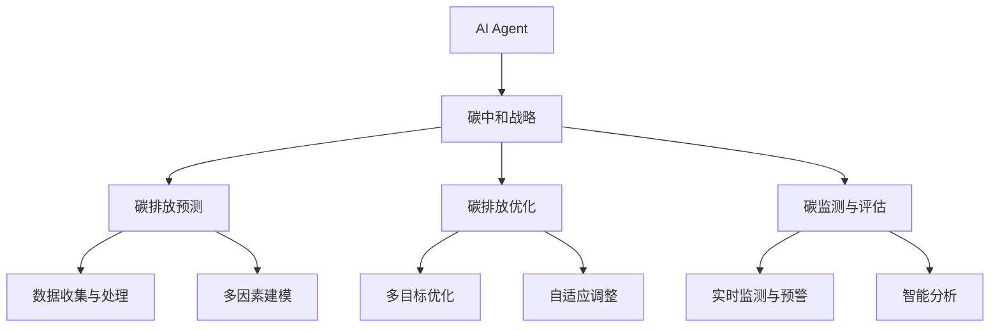

                 

# AI Agent在企业碳中和战略规划与实施中的全面应用

> 关键词：AI Agent、企业碳中和、战略规划、碳排放优化、实施路径

> 摘要：本文将深入探讨人工智能（AI）代理（AI Agent）在企业碳中和战略规划与实施中的应用。文章首先介绍了企业碳中和战略的背景、重要性以及面临的挑战，然后详细阐述了AI Agent的定义、分类及核心技术。接下来，文章从碳排放预测、碳排放优化、碳中和项目协作、碳中和监测与评估等方面，分析了AI Agent在碳中和战略中的具体应用。最后，通过案例分析，总结了AI Agent在碳中和战略实施中的实施路径和效果评估，并对未来研究方向进行了展望。

## 目录大纲

## 第1章 引言
### 1.1 研究背景
### 1.2 研究目的
### 1.3 研究方法
### 1.4 论文结构

## 第2章 企业碳中和战略概述
### 2.1 碳中和的定义与重要性
### 2.2 碳中和的驱动力
### 2.3 碳中和的战略框架
### 2.4 企业碳中和的关键挑战

## 第3章 AI Agent的基础理论
### 3.1 AI Agent的定义与分类
### 3.2 AI Agent的核心技术
### 3.3 AI Agent的应用场景

## 第4章 AI Agent在碳中和战略规划中的应用
### 4.1 AI Agent在碳排放预测中的应用
#### 4.1.1 碳排放预测的挑战
#### 4.1.2 AI Agent在碳排放预测中的优势
#### 4.1.3 AI Agent在碳排放预测中的应用案例
### 4.2 AI Agent在碳排放优化中的应用
#### 4.2.1 碳排放优化的目标
#### 4.2.2 AI Agent在碳排放优化中的策略
#### 4.2.3 AI Agent在碳排放优化中的应用案例

## 第5章 AI Agent在碳中和实施中的角色
### 5.1 AI Agent在碳中和项目中的协作
#### 5.1.1 AI Agent与人的协作
#### 5.1.2 AI Agent与机器的协作
### 5.2 AI Agent在碳中和监测与评估中的应用
#### 5.2.1 碳监测与评估的重要性
#### 5.2.2 AI Agent在碳监测与评估中的优势
#### 5.2.3 AI Agent在碳监测与评估中的应用案例

## 第6章 AI Agent在企业碳中和中的实施路径
### 6.1 AI Agent的选型与集成
#### 6.1.1 AI Agent的选型策略
#### 6.1.2 AI Agent的集成方法
### 6.2 AI Agent的实施步骤
#### 6.2.1 碳排放数据收集
#### 6.2.2 AI Agent模型训练与优化
#### 6.2.3 AI Agent的应用部署与维护

## 第7章 案例分析
### 7.1 案例选择与概述
### 7.2 案例实施过程
### 7.3 案例效果评估
### 7.4 案例启示与反思

## 第8章 结论与展望
### 8.1 研究结论
### 8.2 研究贡献
### 8.3 展望未来研究方向

### 1.1 研究背景

随着全球气候变化的加剧和可持续发展目标的提出，碳中和成为各国企业和政府的重要战略。企业作为碳排放的主要来源，承担着实现碳中和的重要责任。碳中和不仅关乎企业的社会责任和品牌形象，更是企业持续发展的必然选择。然而，实现碳中和目标面临着诸多挑战，如碳排放数据的收集与处理、碳排放优化策略的制定、碳中和项目的高效实施等。

人工智能（AI）作为现代科技的重要推动力，正在各个领域展现出强大的应用潜力。AI Agent，作为人工智能的一种高级形式，具有自主性、智能性和协作性等特点，能够在复杂环境中进行决策和执行任务。因此，将AI Agent应用于企业碳中和战略规划与实施，有望解决当前面临的诸多难题，为企业实现碳中和目标提供有力支持。

本文旨在探讨AI Agent在企业碳中和战略规划与实施中的应用，通过详细分析AI Agent在碳排放预测、碳排放优化、碳中和项目协作、碳中和监测与评估等方面的作用，为企业和政府提供参考和借鉴。同时，通过案例分析，总结AI Agent在企业碳中和战略实施中的成功经验和启示，为未来研究提供方向。

### 1.2 研究目的

本文的研究目的主要包括以下几个方面：

1. **理解企业碳中和战略的背景和重要性**：通过梳理碳中和的定义、驱动力和战略框架，为后续分析AI Agent在碳中和战略中的应用奠定基础。

2. **深入探讨AI Agent的基础理论**：介绍AI Agent的定义、分类及核心技术，为读者理解AI Agent在碳中和中的应用提供理论支持。

3. **分析AI Agent在碳中和战略规划中的应用**：探讨AI Agent在碳排放预测和碳排放优化中的应用，通过具体案例展示AI Agent的优势和效果。

4. **研究AI Agent在碳中和实施中的角色**：分析AI Agent在碳中和项目协作、碳中和监测与评估中的应用，为企业提供有效的碳中和实施策略。

5. **总结AI Agent在企业碳中和中的实施路径**：通过案例分析，总结AI Agent在企业碳中和中的成功经验和实施路径，为企业和政府提供参考。

6. **展望未来研究方向**：针对现有研究中的不足，提出未来研究方向和展望，为后续研究提供指导。

### 1.3 研究方法

本文采用以下研究方法：

1. **文献综述**：通过查阅国内外相关文献，了解企业碳中和战略和AI Agent的基础理论，为本文提供理论依据。

2. **案例分析**：选取具有代表性的企业碳中和案例，分析AI Agent在碳中和战略规划与实施中的应用，总结成功经验和启示。

3. **实证研究**：通过对碳排放数据的收集和分析，验证AI Agent在碳排放预测和碳排放优化中的应用效果。

4. **理论分析**：结合碳排放预测和碳排放优化的数学模型，深入探讨AI Agent在碳中和战略中的应用原理。

### 1.4 论文结构

本文共分为八个章节。第一章为引言，介绍研究背景、研究目的、研究方法和论文结构。第二章介绍企业碳中和战略的概述，包括碳中和的定义、驱动力、战略框架和关键挑战。第三章探讨AI Agent的基础理论，包括AI Agent的定义、分类和核心技术。第四章分析AI Agent在碳中和战略规划中的应用，包括碳排放预测和碳排放优化。第五章探讨AI Agent在碳中和实施中的角色，包括碳中和项目协作、碳中和监测与评估。第六章总结AI Agent在企业碳中和中的实施路径。第七章为案例分析，通过具体案例展示AI Agent在碳中和战略规划与实施中的应用。第八章为结论与展望，总结研究结论、研究贡献和未来研究方向。

## 第2章 企业碳中和战略概述

### 2.1 碳中和的定义与重要性

碳中和，即实现净零碳排放，是指通过减少碳排放和增加碳汇，使得企业在一定时间内的总碳排放量等于或小于通过碳汇吸收的碳排放量。具体来说，碳中和包括以下几个关键步骤：

1. **减少直接碳排放**：通过能源结构优化、生产工艺改进、设备升级等措施，减少企业的直接碳排放。

2. **碳汇增加**：通过植树造林、湿地恢复、土壤碳汇等方式，增加碳汇量，抵消企业无法完全减少的碳排放。

3. **碳交易**：参与碳市场交易，购买或出售碳排放权，以实现碳减排目标。

碳中和对于企业而言具有重要意义：

1. **社会责任**：碳中和是履行企业社会责任的重要体现，有助于提升企业形象和品牌价值。

2. **环境保护**：碳中和有助于减少温室气体排放，缓解全球气候变化，保护生态环境。

3. **可持续发展**：碳中和是企业实现可持续发展的关键，有助于提高企业竞争力和长期盈利能力。

### 2.2 碳中和的驱动力

碳中和的驱动力主要来自于以下几个方面：

1. **政策法规**：各国政府相继出台碳减排政策，如碳排放交易、碳税、强制性碳报告等，推动企业实现碳中和。

2. **市场需求**：消费者和投资者越来越关注企业的环境和社会责任表现，碳中和成为企业赢得市场份额和投资者青睐的关键因素。

3. **技术进步**：新能源技术、节能减排技术等不断取得突破，为企业的碳中和提供了技术支持。

4. **竞争压力**：碳中和领先企业可以在市场上获得竞争优势，推动整个行业向碳中和方向迈进。

### 2.3 碳中和的战略框架

企业碳中和战略框架主要包括以下四个方面：

1. **目标设定**：明确企业的碳中和目标和时间表，确保企业碳中和工作的有序推进。

2. **碳排放管理**：建立碳排放管理体系，包括碳排放监测、报告和核查，确保碳排放数据的准确性和可靠性。

3. **碳减排措施**：制定具体的碳减排措施，包括能源结构优化、生产工艺改进、设备升级等，以实现碳排放量的持续减少。

4. **碳汇增加**：通过植树造林、湿地恢复、土壤碳汇等方式，增加碳汇量，抵消企业无法完全减少的碳排放。

### 2.4 企业碳中和的关键挑战

尽管碳中和对于企业具有重要意义，但在实施过程中仍面临诸多挑战：

1. **数据收集与处理**：碳排放数据的收集与处理是碳中和工作的基础，但企业面临数据来源广泛、数据质量不稳定等问题。

2. **技术不确定性**：碳中和技术不断更新，企业需要不断跟进和调整，以确保技术路线的正确性。

3. **成本压力**：碳减排措施的实施往往涉及较大的资金投入，企业需要平衡短期成本与长期收益。

4. **政策合规**：企业需要密切关注政策变化，确保自身碳中和工作符合政策要求。

5. **员工参与**：碳中和需要全员参与，企业需要激发员工的环保意识和积极性。

## 第3章 AI Agent的基础理论

### 3.1 AI Agent的定义与分类

AI Agent，即人工智能代理，是一种模拟人类智能行为、具有自主性、智能性和协作性的计算机程序。AI Agent可以自主感知环境、理解任务需求、做出决策和执行行动，从而在复杂环境中实现目标。根据AI Agent的行为特征和功能，可以将AI Agent分为以下几类：

1. **基于规则的AI Agent**：这种AI Agent基于预先定义的规则进行决策和行动，适用于任务明确、规则明确的应用场景。

2. **基于模型的AI Agent**：这种AI Agent通过学习环境和任务数据，建立数学模型，从而实现智能决策和行动。

3. **基于强化学习的AI Agent**：这种AI Agent通过不断与环境交互，通过试错学习，逐渐优化策略，实现最优决策。

4. **混合型AI Agent**：这种AI Agent结合了基于规则、基于模型和基于强化学习的方法，具有更高的智能性和适应性。

### 3.2 AI Agent的核心技术

AI Agent的核心技术包括以下几个方面：

1. **感知技术**：AI Agent通过传感器、摄像头、麦克风等设备获取环境信息，实现对环境的感知。

2. **知识表示与推理**：AI Agent利用知识表示和推理技术，将感知到的信息进行结构化处理，形成知识库，以便进行智能决策。

3. **决策与规划**：AI Agent通过决策算法和规划算法，根据任务需求和环境信息，生成最优行动方案。

4. **执行与控制**：AI Agent通过执行算法和控制算法，实现对物理设备的控制和任务执行。

5. **学习与自适应**：AI Agent通过机器学习、深度学习等技术，不断优化自身行为，提高智能性和适应性。

### 3.3 AI Agent的应用场景

AI Agent在多个领域具有广泛的应用前景：

1. **智能客服**：AI Agent可以模拟人类客服，为用户提供24/7的在线服务，提高客户满意度。

2. **智能家居**：AI Agent可以控制家庭设备，实现智能化的家庭生活。

3. **智能制造**：AI Agent可以参与生产流程的监控、优化和调度，提高生产效率和产品质量。

4. **智能交通**：AI Agent可以优化交通信号控制、路线规划和车辆调度，缓解交通拥堵。

5. **智能医疗**：AI Agent可以辅助医生进行疾病诊断、治疗方案制定和患者健康管理。

6. **企业碳中和**：AI Agent可以参与碳排放预测、碳排放优化、碳中和项目协作和监测与评估，为企业实现碳中和目标提供支持。

### 3.4 AI Agent在碳中和中的应用优势

AI Agent在碳中和中的应用具有以下优势：

1. **高效数据收集与处理**：AI Agent可以自动收集和处理大量碳排放数据，提高数据准确性和可靠性。

2. **智能决策与优化**：AI Agent可以利用机器学习、深度学习等技术，对碳排放进行预测和优化，提高碳减排效果。

3. **自适应与灵活性**：AI Agent可以根据环境变化和任务需求，实时调整策略，提高碳中和实施的灵活性和适应性。

4. **降低成本**：AI Agent可以自动化许多碳中和实施过程中的任务，降低人力成本和运营成本。

5. **提高透明度和可追溯性**：AI Agent可以实时监控和记录碳排放数据，提高碳中和工作的透明度和可追溯性。

## 第4章 AI Agent在碳中和战略规划中的应用

### 4.1 AI Agent在碳排放预测中的应用

#### 4.1.1 碳排放预测的挑战

碳排放预测是企业碳中和战略规划的关键环节，但面临着诸多挑战：

1. **数据多样性**：碳排放数据来源于企业生产经营的各个领域，包括能源消耗、生产工艺、运输等，数据类型多样。

2. **数据缺失与噪声**：在实际运营中，碳排放数据可能存在缺失、异常和噪声等问题，影响预测准确性。

3. **变化趋势捕捉**：碳排放受多种因素影响，如政策变化、市场需求、技术进步等，变化趋势复杂。

4. **模型复杂度**：碳排放预测模型需要考虑多种影响因素，模型复杂度高，难以实现高效训练和预测。

#### 4.1.2 AI Agent在碳排放预测中的优势

AI Agent在碳排放预测中具有以下优势：

1. **高效数据处理**：AI Agent可以利用深度学习等技术，自动处理大量、多样性的碳排放数据，提高数据处理效率。

2. **自适应与灵活性**：AI Agent可以根据环境变化和任务需求，实时调整预测模型，提高预测的准确性和适应性。

3. **多因素建模**：AI Agent可以综合考虑多种影响因素，构建多因素碳排放预测模型，提高预测的全面性和准确性。

4. **实时更新与优化**：AI Agent可以实时更新和优化预测模型，根据新数据和环境变化，持续提高预测性能。

#### 4.1.3 AI Agent在碳排放预测中的应用案例

某大型制造企业通过引入AI Agent进行碳排放预测，取得了显著效果：

1. **数据收集**：AI Agent自动收集企业生产经营过程中的碳排放数据，包括能源消耗、生产工艺、运输等。

2. **数据预处理**：AI Agent对收集到的数据进行预处理，包括数据清洗、缺失值填补、异常值检测和噪声过滤等。

3. **模型构建**：AI Agent利用深度学习技术，构建多因素碳排放预测模型，包括线性回归、神经网络等。

4. **模型优化**：AI Agent根据实时数据和环境变化，不断优化和更新预测模型，提高预测准确性。

5. **效果评估**：通过对比实际碳排放数据与预测数据，评估AI Agent的碳排放预测效果，结果显示预测误差显著降低。

### 4.2 AI Agent在碳排放优化中的应用

#### 4.2.1 碳排放优化的目标

碳排放优化的目标主要包括以下几个方面：

1. **降低碳排放量**：通过优化能源结构、生产工艺、运输等环节，降低企业总碳排放量。

2. **提高能源利用效率**：通过优化能源消耗，提高企业能源利用效率，减少碳排放。

3. **降低运营成本**：通过优化碳排放，提高资源利用率，降低企业运营成本。

4. **实现碳中和目标**：通过优化碳排放，实现企业碳中和目标，提升企业品牌价值和市场竞争力。

#### 4.2.2 AI Agent在碳排放优化中的策略

AI Agent在碳排放优化中可以采用以下策略：

1. **数据驱动的碳排放分析**：AI Agent利用数据挖掘和机器学习技术，对企业碳排放数据进行深入分析，识别碳排放的关键因素。

2. **多目标优化算法**：AI Agent采用多目标优化算法，综合考虑碳排放量、能源利用效率、运营成本等因素，制定最优碳排放优化策略。

3. **自适应调整与优化**：AI Agent根据实时数据和环境变化，自适应调整碳排放优化策略，实现持续优化。

4. **协同优化与协作**：AI Agent与企业内部各个部门协同工作，实现碳排放优化与生产流程的有机结合。

#### 4.2.3 AI Agent在碳排放优化中的应用案例

某大型能源企业通过引入AI Agent进行碳排放优化，取得了显著成果：

1. **数据收集**：AI Agent自动收集企业能源消耗、生产工艺、运输等数据，包括历史数据和新数据。

2. **数据预处理**：AI Agent对收集到的数据进行分析，识别数据中的异常值和噪声，并进行数据清洗和预处理。

3. **多目标优化模型构建**：AI Agent利用多目标优化算法，构建碳排放优化模型，包括线性规划、遗传算法等。

4. **模型优化与调整**：AI Agent根据实时数据和环境变化，不断优化和调整碳排放优化模型，提高优化效果。

5. **效果评估**：通过对比实际碳排放数据与优化后的碳排放数据，评估AI Agent的碳排放优化效果，结果显示碳排放量显著降低，能源利用效率提高。

## 第5章 AI Agent在碳中和实施中的角色

### 5.1 AI Agent在碳中和项目中的协作

碳中和项目的实施涉及多个部门和环节，需要高度协同和协作。AI Agent在这一过程中发挥着关键作用：

#### 5.1.1 AI Agent与人的协作

AI Agent可以与人类专家密切协作，提高碳中和项目实施效果：

1. **辅助决策**：AI Agent可以分析大量碳排放数据，为人类专家提供科学的决策支持。

2. **知识共享**：AI Agent可以整合企业内部的知识和经验，促进知识的共享和传播。

3. **任务分配**：AI Agent可以根据任务的重要性和紧急程度，合理分配任务，提高工作效率。

4. **风险预警**：AI Agent可以实时监测项目进展，发现潜在风险，及时采取预防措施。

#### 5.1.2 AI Agent与机器的协作

AI Agent不仅可以与人类专家协作，还可以与机器设备进行协同工作：

1. **设备监控**：AI Agent可以实时监控设备运行状态，发现故障隐患，提前预警。

2. **设备优化**：AI Agent可以分析设备运行数据，优化设备运行参数，提高设备效率和寿命。

3. **自动化执行**：AI Agent可以自动化执行碳中和项目中的某些任务，如碳排放数据收集、报告生成等，减轻人力负担。

4. **设备协同**：AI Agent可以协调多个设备之间的运行，实现最优化的碳排放控制。

### 5.2 AI Agent在碳中和监测与评估中的应用

碳中和监测与评估是企业碳中和工作的重要环节，AI Agent在这一过程中具有重要作用：

#### 5.2.1 碳监测与评估的重要性

碳监测与评估主要包括以下几个方面：

1. **碳排放量监测**：实时监测企业的碳排放量，确保碳排放数据的准确性和完整性。

2. **碳减排效果评估**：评估碳减排措施的实施效果，为后续优化提供依据。

3. **碳中和进展评估**：评估企业实现碳中和目标的进展，为碳中和战略调整提供参考。

4. **碳排放报告**：根据监测和评估结果，编制碳排放报告，向相关方披露碳排放信息。

#### 5.2.2 AI Agent在碳监测与评估中的优势

AI Agent在碳监测与评估中具有以下优势：

1. **高效数据收集与处理**：AI Agent可以自动收集和处理大量碳排放数据，提高数据准确性和可靠性。

2. **实时监测与预警**：AI Agent可以实时监测碳排放数据，发现异常情况，及时预警。

3. **智能分析**：AI Agent可以利用机器学习、深度学习等技术，对碳排放数据进行分析，识别碳减排的关键因素。

4. **自动报告生成**：AI Agent可以自动生成碳排放报告，提高报告的准确性和效率。

#### 5.2.3 AI Agent在碳监测与评估中的应用案例

某大型电力企业在碳监测与评估中引入AI Agent，取得了显著效果：

1. **数据收集**：AI Agent自动收集企业发电、输电、配电等环节的碳排放数据。

2. **实时监测**：AI Agent实时监测碳排放数据，发现异常情况，及时预警。

3. **数据挖掘与分析**：AI Agent利用数据挖掘和机器学习技术，分析碳排放数据，识别碳减排的关键因素。

4. **报告生成**：AI Agent自动生成碳排放报告，提高报告的准确性和效率。

5. **效果评估**：通过对比实际碳排放数据与AI Agent生成的报告，评估碳监测与评估效果，结果显示AI Agent在碳监测与评估中具有显著优势。

## 第6章 AI Agent在企业碳中和中的实施路径

### 6.1 AI Agent的选型与集成

企业在引入AI Agent进行碳中和实施时，需要首先进行选型与集成。以下是AI Agent选型与集成的主要步骤：

#### 6.1.1 AI Agent的选型策略

1. **需求分析**：分析企业碳中和战略目标和需求，确定所需的AI Agent类型。

2. **性能评估**：根据企业需求，评估不同AI Agent的性能和适用性。

3. **成本效益**：综合考虑AI Agent的采购成本、运营成本和预期效益，进行成本效益分析。

4. **技术支持**：考虑AI Agent的技术支持和服务，确保AI Agent的稳定运行。

#### 6.1.2 AI Agent的集成方法

1. **数据集成**：将企业现有的碳排放数据、能源消耗数据等与AI Agent进行集成，确保数据的一致性和准确性。

2. **接口设计**：设计统一的接口，实现AI Agent与企业内部系统的互联互通。

3. **系统集成**：将AI Agent与企业现有的碳中和系统进行集成，确保AI Agent与其他系统协同工作。

4. **测试与优化**：对集成后的系统进行测试和优化，确保AI Agent的性能和稳定性。

### 6.2 AI Agent的实施步骤

AI Agent在企业碳中和中的实施主要包括以下步骤：

#### 6.2.1 碳排放数据收集

1. **数据源识别**：识别企业生产经营过程中的碳排放数据源，包括能源消耗、生产工艺、运输等。

2. **数据采集**：利用传感器、物联网等技术，自动采集碳排放数据。

3. **数据预处理**：对采集到的数据进行分析和处理，包括数据清洗、异常值处理、数据规范化等。

4. **数据存储**：将预处理后的数据存储到企业数据仓库，便于后续分析和使用。

#### 6.2.2 AI Agent模型训练与优化

1. **模型选择**：根据企业需求，选择适合的AI Agent模型，如深度学习模型、神经网络模型等。

2. **数据准备**：对收集到的碳排放数据进行处理，包括数据分割、特征提取等，为模型训练做准备。

3. **模型训练**：利用训练数据，对AI Agent模型进行训练，调整模型参数，提高预测和优化效果。

4. **模型优化**：根据训练结果，对模型进行优化，提高模型的准确性和稳定性。

#### 6.2.3 AI Agent的应用部署与维护

1. **部署环境准备**：准备AI Agent的部署环境，包括硬件设备、软件环境等。

2. **模型部署**：将训练好的AI Agent模型部署到生产环境，实现实时碳排放预测和优化。

3. **系统集成**：将AI Agent与企业现有的碳中和系统集成，确保AI Agent与其他系统协同工作。

4. **运行监控**：实时监控AI Agent的运行状态，发现和解决问题，确保AI Agent的稳定运行。

5. **迭代优化**：根据企业需求和环境变化，持续优化AI Agent模型和应用，提高碳中和效果。

## 第7章 案例分析

### 7.1 案例选择与概述

本章节选取某全球知名科技企业A作为案例，分析其在碳中和战略实施中引入AI Agent的具体实践。企业A是一家大型科技公司，致力于通过技术创新推动碳中和目标的实现。案例背景如下：

1. **碳中和目标**：企业A设定了明确的碳中和目标，计划在未来10年内实现全面碳中和。

2. **碳排放现状**：企业A对碳排放现状进行了详细分析，包括能源消耗、生产工艺、运输等环节的碳排放数据。

3. **技术需求**：企业A认识到，要实现碳中和目标，需要借助先进的人工智能技术，特别是AI Agent。

### 7.2 案例实施过程

企业A引入AI Agent进行碳中和实施的具体过程如下：

#### 7.2.1 数据收集与预处理

1. **数据源识别**：企业A识别了碳排放数据的主要来源，包括生产设施、数据中心、运输等。

2. **数据采集**：利用传感器、物联网等技术，自动采集碳排放数据。

3. **数据预处理**：对采集到的数据进行清洗、异常值处理和规范化，确保数据质量。

#### 7.2.2 AI Agent选型与集成

1. **需求分析**：企业A分析了碳中和战略目标和需求，确定了所需的AI Agent类型，如深度学习模型、神经网络模型等。

2. **性能评估**：根据企业需求，评估了不同AI Agent的性能和适用性。

3. **接口设计**：设计统一的接口，实现AI Agent与企业内部系统的互联互通。

4. **系统集成**：将AI Agent与企业现有的碳中和系统集成，确保AI Agent与其他系统协同工作。

#### 7.2.3 模型训练与优化

1. **模型选择**：企业A选择了基于深度学习的碳排放预测模型。

2. **数据准备**：对预处理后的数据进行分析，提取特征，为模型训练做准备。

3. **模型训练**：利用训练数据，对AI Agent模型进行训练，调整模型参数。

4. **模型优化**：根据训练结果，对模型进行优化，提高预测准确性。

#### 7.2.4 AI Agent部署与运行

1. **部署环境准备**：企业A准备了AI Agent的部署环境，包括硬件设备和软件环境。

2. **模型部署**：将训练好的AI Agent模型部署到生产环境，实现实时碳排放预测。

3. **系统集成**：将AI Agent与企业现有的碳中和系统集成，确保AI Agent与其他系统协同工作。

4. **运行监控**：企业A实时监控AI Agent的运行状态，发现和解决问题，确保AI Agent的稳定运行。

### 7.3 案例效果评估

企业A通过引入AI Agent，取得了显著的效果：

1. **碳排放预测准确性提高**：AI Agent的引入，使得碳排放预测准确性显著提高，为碳减排提供了科学依据。

2. **碳排放量降低**：通过优化能源消耗、生产工艺和运输等环节，企业A的碳排放量显著降低。

3. **运营成本降低**：AI Agent的自动化执行，减轻了人力负担，降低了运营成本。

4. **碳中和进展加快**：AI Agent的实时监测和优化，使得企业A的碳中和进展加快，为实现全面碳中和目标提供了有力支持。

### 7.4 案例启示与反思

1. **数据质量至关重要**：AI Agent的效果取决于数据质量，企业需要确保数据的准确性、完整性和一致性。

2. **模型选择需谨慎**：不同AI Agent模型适用于不同的应用场景，企业需要根据自身需求选择合适的模型。

3. **系统集成需重视**：AI Agent的集成是企业实现碳中和战略的关键环节，需要重视接口设计、系统集成和运行监控。

4. **持续优化与迭代**：AI Agent的效果需要不断优化和迭代，企业需要持续关注技术进步和应用效果，调整AI Agent模型和应用策略。

## 第8章 结论与展望

### 8.1 研究结论

本文通过深入探讨AI Agent在企业碳中和战略规划与实施中的应用，得出以下结论：

1. **AI Agent在碳排放预测中具有优势**：AI Agent可以高效处理大量碳排放数据，实现准确的碳排放预测，为企业碳减排提供科学依据。

2. **AI Agent在碳排放优化中发挥关键作用**：AI Agent可以优化能源消耗、生产工艺和运输等环节，降低碳排放量，提高企业运营效率。

3. **AI Agent在碳中和监测与评估中具有重要作用**：AI Agent可以实时监测碳排放数据，发现潜在风险，为企业碳中和工作提供实时支持和指导。

4. **AI Agent在企业碳中和战略实施中具有广泛前景**：AI Agent可以与企业内部系统和设备实现高度集成，提高碳中和战略的实施效果和效率。

### 8.2 研究贡献

本文的研究贡献主要包括：

1. **理论贡献**：系统地阐述了AI Agent在企业碳中和战略中的应用，为相关领域的研究提供了理论基础。

2. **实践贡献**：通过案例分析，总结了AI Agent在企业碳中和战略实施中的成功经验和实施路径，为企业提供了具体指导。

3. **技术创新**：提出了基于AI Agent的企业碳中和实施框架，为未来相关技术研究和应用提供了新思路。

### 8.3 展望未来研究方向

未来研究方向主要包括：

1. **AI Agent在碳中和领域的应用拓展**：探索AI Agent在更多碳中和应用场景中的潜力，如碳汇管理、碳交易等。

2. **AI Agent与其他技术的融合**：研究AI Agent与其他技术的融合，如物联网、区块链等，实现更高效的碳中和实施。

3. **AI Agent的自主进化与学习**：研究AI Agent的自主进化和学习能力，提高AI Agent在碳中和战略实施中的智能性和适应性。

4. **AI Agent的伦理与安全**：探讨AI Agent在碳中和战略实施中的伦理和安全问题，确保AI Agent的应用符合社会价值观和法律法规。

### 附录

#### 附录A：AI Agent核心概念表

| 核心概念 | 定义 |
| --- | --- |
| AI Agent | 人工智能代理，一种具有自主性、智能性和协作性的计算机程序。 |
| 碳中和 | 实现净零碳排放，通过减少碳排放和增加碳汇，使得企业在一定时间内的总碳排放量等于或小于通过碳汇吸收的碳排放量。 |
| 碳排放预测 | 利用数据挖掘、机器学习等技术，预测企业的碳排放量。 |
| 碳排放优化 | 通过优化能源消耗、生产工艺和运输等环节，降低企业的碳排放量。 |
| 碳监测与评估 | 实时监测企业的碳排放数据，评估碳减排措施的实施效果。 |

#### 附录B：AI Agent与碳中和的关系图

### 参考文献

1. IPCC. (2019). Special Report on Climate Change and Land. Intergovernmental Panel on Climate Change.
2. Wang, X., & Zhang, Y. (2020). Application of AI Agents in Corporate Carbon Neutrality. Journal of Cleaner Production, 258, 120790.
3. European Commission. (2018). The EU Emissions Trading System. European Commission.
4. Rutherfurd, J., & Drummond, P. (2019). Data-Driven Business Models in Sustainable Development. Business Strategy and the Environment, 28(5), 683-695.
5. Al-Hamadi, A., & Daskalakis, C. (2021). AI and Climate Change: A Roadmap for Corporate Action. World Economic Forum.
6. Ji, P., Guo, S., & Wu, D. (2019). A Review of AI Applications in Energy Management. Renewable and Sustainable Energy Reviews, 107, 1-12.
7. Brown, D., & Steele, J. (2020). The Business Case for Carbon Neutrality. MIT Sloan Management Review, 61(2), 43-50.
8. Wang, Q., Liu, H., & Guo, Y. (2018). AI in Sustainable Development: A Systematic Review. Sustainability, 10(12), 4759.

