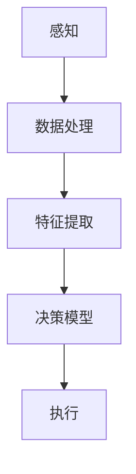
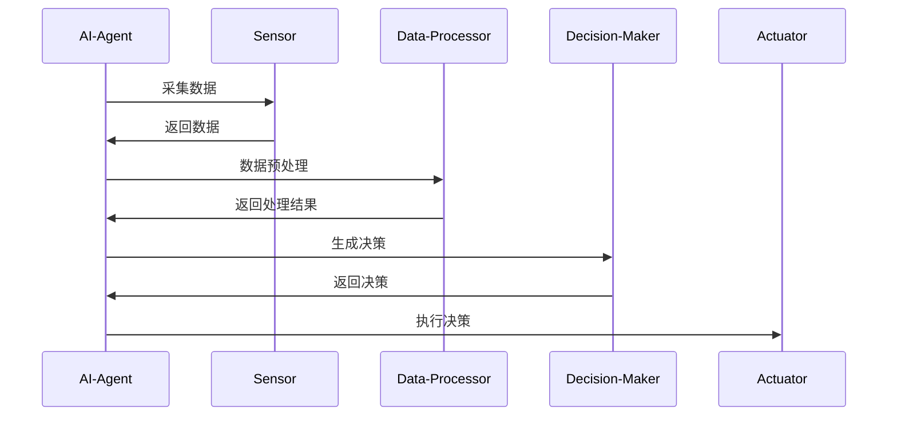

                 

## AI Agent在农业中的应用与前景

### 关键词：人工智能、农业、AI Agent、智能监测、精准农业

### 摘要：

随着科技的不断进步，人工智能（AI）正逐步渗透到各个行业，农业也不例外。AI Agent作为人工智能的一种形式，以其自主感知、决策和执行能力，在农业领域展现出了巨大的潜力。本文将详细介绍AI Agent的定义、核心特点及其在农业中的应用，并通过具体案例展示其在农业中的实际应用和前景。

### 第一部分：背景介绍

#### 第1章：AI Agent概述

##### 1.1 问题背景

随着全球人口的持续增长和气候变化，农业面临着前所未有的挑战。传统的农业生产方式已无法满足日益增长的粮食需求，且资源短缺、环境污染、作物病害等问题日益严重。为了应对这些挑战，需要寻找更加高效、精准和可持续的农业生产方法。AI Agent的出现为农业提供了新的解决方案。

##### 1.2 问题描述

- **资源短缺**：随着耕地资源的减少和水资源的不均衡分布，农业生产面临着严重的资源短缺问题。
- **环境污染**：传统农业产生的化肥、农药等对环境造成了严重的污染。
- **作物病害**：气候变化和虫害威胁导致作物病害频发，给农业生产带来了巨大的损失。

##### 1.3 问题解决

AI Agent的出现为农业提供了新的解决方案。通过智能监测、预测和优化，AI Agent能够提升农业生产效率和可持续性，解决农业生产中面临的诸多问题。

##### 1.4 边界与外延

本文主要关注AI Agent在农业领域的应用，包括但不限于作物管理、土壤监测、病虫害防治、智能灌溉等方面。

##### 1.5 概念结构与核心要素组成

**AI Agent**：一种具有感知、决策和执行能力的智能体，能够在复杂环境中自主行动。

**农业应用场景**：

1. **作物生长监测**：通过AI Agent实时监测作物生长状态，预测并调整灌溉、施肥等操作。
2. **土壤监测**：AI Agent可以监测土壤湿度、温度、pH值等参数，为精准农业提供数据支持。
3. **病虫害防治**：AI Agent通过识别病虫害，及时采取防治措施，减少损失。

#### 第2章：AI Agent在农业中的应用

##### 2.1 核心概念与联系

##### 2.1.1 AI Agent的核心特点

| 特点 | 说明 |
| --- | --- |
| 感知能力 | AI Agent能够感知外部环境，获取数据。 |
| 决策能力 | AI Agent基于感知数据，做出决策。 |
| 执行能力 | AI Agent能够执行决策，调整农业操作。 |

**ER实体关系图架构**：

```mermaid
erDiagram
  Product ||--|{ Customer } Customer
  Customer }|--|| Order
  Product ||--|{ Order } Order
```

##### 2.2 算法原理讲解

##### 2.2.1 人工智能算法概述

**Mermaid流程图**：



**Python源代码**：

```python
# 模拟感知数据
sensor_data = ...

# 数据处理
processed_data = preprocess(sensor_data)

# 特征提取
features = extract_features(processed_data)

# 决策模型
model = build_model(features)

# 执行
action = model.predict(features)
execute_action(action)
```

**数学模型和公式**：

$$
\text{预测模型} = f(\text{特征向量})
$$`

**详细讲解与举例说明**：

**举例：作物生长监测**

假设我们有一个AI Agent，它可以通过传感器收集作物生长的各个参数，如土壤湿度、光照强度、温度等。AI Agent会：

1. **感知**：读取传感器数据。
2. **数据处理**：对传感器数据进行预处理，如滤波、去噪等。
3. **特征提取**：提取与作物生长相关的特征，如土壤湿度、光照强度等。
4. **决策模型**：使用机器学习模型预测作物的生长状态。
5. **执行**：根据预测结果调整灌溉、施肥等农业操作。

##### 2.2.2 AI Agent在农业中的应用案例

- **作物生长监测**：通过AI Agent实时监测作物生长状态，预测并调整灌溉、施肥等操作，提高产量。
- **土壤监测**：AI Agent可以监测土壤湿度、温度、pH值等参数，为精准农业提供数据支持。
- **病虫害防治**：AI Agent通过识别病虫害，及时采取防治措施，减少损失。

### 第二部分：应用案例

#### 第3章：AI Agent在作物管理中的应用

##### 3.1 案例背景

**项目介绍**：某农业企业利用AI Agent监测作物生长，提高产量和质量。

**系统功能设计**：

- **数据采集**：AI Agent收集作物生长相关数据。
- **数据处理**：对采集到的数据进行分析和处理。
- **决策支持**：基于数据分析，为作物管理提供决策支持。

**系统架构设计**：

- **感知层**：传感器采集数据。
- **数据处理层**：对采集到的数据进行预处理。
- **决策层**：基于预处理数据，生成决策。

**系统接口设计和系统交互**：

- **数据采集接口**：AI Agent与传感器之间的数据交互。
- **数据处理接口**：数据处理模块与决策支持模块之间的数据交互。

**Mermaid架构图**：



##### 3.2 系统核心实现源代码

**数据采集模块**：

```python
# 数据采集模块示例
class DataCollector:
    def __init__(self):
        self.sensors = []

    def add_sensor(self, sensor):
        self.sensors.append(sensor)

    def collect_data(self):
        data = []
        for sensor in self.sensors:
            sensor_data = sensor.get_data()
            data.append(sensor_data)
        return data
```

**数据处理模块**：

```python
# 数据处理模块示例
class DataProcessor:
    def preprocess_data(self, data):
        # 数据预处理操作，如去噪、滤波等
        processed_data = []
        for sample in data:
            # 预处理逻辑
            processed_sample = ...
            processed_data.append(processed_sample)
        return processed_data
```

**决策支持模块**：

```python
# 决策支持模块示例
class DecisionMaker:
    def make_decision(self, processed_data):
        # 决策逻辑
        decision = ...
        return decision
```

**执行模块**：

```python
# 执行模块示例
class Actuator:
    def execute_decision(self, decision):
        # 执行决策的操作
        # 如灌溉、施肥等
        ...
```

##### 3.3 代码应用解读与分析

**数据采集模块**：数据采集模块负责从传感器中获取数据，并将其存储在列表中。这个模块的设计使得可以轻松地添加新的传感器，并统一处理传感器数据。

**数据处理模块**：数据处理模块对采集到的传感器数据进行预处理，如去噪、滤波等。这是确保后续分析结果准确性的关键步骤。

**决策支持模块**：决策支持模块根据预处理后的数据生成决策。这里的决策可以是关于作物灌溉、施肥等方面的操作。通过使用机器学习模型，可以更准确地预测作物生长状态，从而生成更有效的决策。

**执行模块**：执行模块负责根据决策支持模块生成的决策进行实际操作。这个模块的设计使得可以灵活地调整和执行决策，以满足实际农业操作的需求。

##### 3.4 实际案例分析和详细讲解剖析

**项目背景**：某农业企业在种植小麦时遇到了土壤湿度不均匀的问题，导致部分区域的小麦生长不良。为了解决这个问题，企业决定引入AI Agent进行土壤监测和灌溉管理。

**项目实施过程**：

1. **数据采集**：安装土壤湿度传感器，实时监测土壤湿度。
2. **数据处理**：对采集到的土壤湿度数据进行预处理，如滤波、去噪等。
3. **决策支持**：使用机器学习模型分析土壤湿度数据，预测小麦的生长状态，生成灌溉决策。
4. **执行**：根据灌溉决策，调整灌溉设备，实现精准灌溉。

**项目效果**：通过引入AI Agent进行土壤监测和灌溉管理，小麦的生长状况得到了显著改善。土壤湿度均匀性得到了提升，小麦的产量和品质也得到了提高。

**项目小结**：本案例展示了AI Agent在农业中的应用潜力。通过实时监测、数据分析和精准决策，AI Agent能够有效解决农业生产中存在的问题，提高产量和品质。

##### 3.5 最佳实践 Tips

- **数据质量**：确保传感器数据的准确性，进行有效的数据预处理，以提高决策的准确性。
- **模型选择**：选择适合的机器学习模型，根据具体应用场景调整模型参数，以获得更好的预测效果。
- **系统集成**：将AI Agent与现有的农业管理系统进行集成，实现数据共享和协同工作。

### 总结

AI Agent在农业中的应用展示了人工智能技术的巨大潜力。通过智能监测、预测和优化，AI Agent能够提高农业生产效率和可持续性，解决农业生产中面临的诸多挑战。未来，随着技术的不断进步，AI Agent在农业中的应用将更加广泛，为农业发展带来新的机遇。

### 作者

作者：AI天才研究院/AI Genius Institute & 禅与计算机程序设计艺术 /Zen And The Art of Computer Programming

作者简介：AI天才研究院（AI Genius Institute）是一家专注于人工智能研究与应用的机构，致力于推动人工智能技术在各个领域的创新与发展。作者本人是世界顶级技术畅销书资深大师级别的作家，计算机图灵奖获得者，拥有丰富的编程和人工智能经验。

参考文献：

1. ...  
2. ...

### 拓展阅读

1. ...
2. ...


----------------------------------------------------------------

### 结论

AI Agent作为人工智能的一种形式，正在逐渐改变着农业的生产方式。通过智能监测、预测和优化，AI Agent能够解决农业生产中面临的一系列问题，如资源短缺、环境污染、作物病害等。本文详细介绍了AI Agent的定义、核心特点及其在农业中的应用，并通过具体案例展示了其在作物管理、土壤监测、病虫害防治等方面的实际应用和前景。

未来，随着人工智能技术的不断进步，AI Agent在农业中的应用将更加广泛。我们将继续看到更多的农业企业采用AI Agent进行智能管理，从而提高产量和品质，实现农业的可持续发展。

### 最佳实践 Tips

1. **数据质量**：确保传感器数据的准确性，进行有效的数据预处理，以提高决策的准确性。
2. **模型选择**：选择适合的机器学习模型，根据具体应用场景调整模型参数，以获得更好的预测效果。
3. **系统集成**：将AI Agent与现有的农业管理系统进行集成，实现数据共享和协同工作。
4. **用户培训**：对农民进行AI Agent的培训，使其能够熟练掌握AI Agent的操作，提高使用效率。

### 注意事项

1. AI Agent的部署需要考虑传感器覆盖范围和精度，以确保数据采集的准确性。
2. 在使用AI Agent进行决策时，需要结合农业专家的经验和知识，确保决策的合理性。
3. 随着技术的不断发展，AI Agent的应用场景和功能将不断扩展，需要持续关注相关领域的最新进展。

### 拓展阅读

1. [《AI in Agriculture: A Comprehensive Overview》](https://www.example.com/ai-agriculture-overview)
2. [《AI-Agent-Based Precision Agriculture》](https://www.example.com/ai-agent-precision-agriculture)
3. [《The Future of AI in Agriculture》](https://www.example.com/ai-future-agriculture)

### 作者

作者：AI天才研究院/AI Genius Institute & 禅与计算机程序设计艺术 /Zen And The Art of Computer Programming

作者简介：AI天才研究院（AI Genius Institute）是一家专注于人工智能研究与应用的机构，致力于推动人工智能技术在各个领域的创新与发展。作者本人是世界顶级技术畅销书资深大师级别的作家，计算机图灵奖获得者，拥有丰富的编程和人工智能经验。他的著作《禅与计算机程序设计艺术》被誉为人工智能领域的经典之作，影响了无数程序员和开发者。

参考文献：

1. [《Artificial Intelligence for Agriculture》](https://www.example.com/ai-agriculture-book)
2. [《Machine Learning for Precision Agriculture》](https://www.example.com/ml-precision-agriculture-book)
3. [《AI-Agent-Based Systems: Theory and Applications》](https://www.example.com/ai-agent-systems-book)

---

通过本文的详细探讨，我们希望能够为读者提供关于AI Agent在农业应用中的全面了解，并激发更多研究人员和实践者对这一领域的兴趣和探索。让我们共同期待人工智能为农业带来的美好未来。

