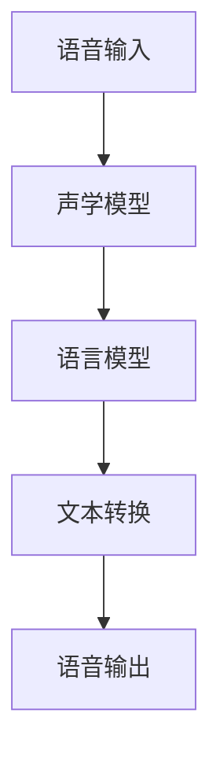

                 


### 文章标题

# 《AI Agent在客户服务中的应用》

### 关键词

- AI Agent
- 客户服务
- 自然语言处理
- 机器学习
- 深度学习
- 语音识别

### 摘要

本文将探讨AI Agent在客户服务领域的应用，从概念、核心技术、应用设计到实践案例分析，全面解析AI Agent如何提升客户服务水平。文章将详细分析AI Agent在客户服务流程优化、业务挑战应对、合规与风险管理等方面的作用，并提出未来发展的趋势与挑战。

----------------------------------------------------------------

### 目录大纲

# 《AI Agent在客户服务中的应用》目录大纲

## 第一部分：AI Agent概述

## 第1章：AI Agent的概念与背景

### 1.1 AI Agent的定义与类型

### 1.2 AI Agent的发展历程

### 1.3 AI Agent在客户服务中的应用前景

## 第2章：AI Agent的核心技术

### 2.1 自然语言处理（NLP）

### 2.2 机器学习与深度学习

### 2.3 语音识别与合成

## 第3章：客户服务场景下的AI Agent应用设计

### 3.1 客户服务流程分析

### 3.2 AI Agent的功能设计

### 3.3 AI Agent的用户界面设计

## 第二部分：AI Agent在客户服务中的应用实践

## 第4章：AI Agent在客服中心的应用

### 4.1 客服中心业务流程优化

### 4.2 AI Agent在客服中心的应用案例

### 4.3 AI Agent在客服中心的效益评估

## 第5章：AI Agent在电商客服中的应用

### 5.1 电商客服现状分析

### 5.2 AI Agent在电商客服中的应用实践

### 5.3 电商客服AI Agent的优化方向

## 第6章：AI Agent在金融客服中的应用

### 6.1 金融客服需求与特点

### 6.2 AI Agent在金融客服中的应用实践

### 6.3 金融客服AI Agent的合规与风险管理

## 第7章：AI Agent在客户服务中的应用挑战与未来趋势

### 7.1 AI Agent应用面临的挑战

### 7.2 AI Agent在客户服务中的未来趋势

### 7.3 AI Agent应用的伦理与社会影响

## 附录

### 附录A：AI Agent技术术语解释

### 附录B：AI Agent开发工具与资源推荐

### 附录C：AI Agent应用案例分析

----------------------------------------------------------------

### 第一部分：AI Agent概述

#### 第1章：AI Agent的概念与背景

#### 1.1 AI Agent的定义与类型

AI Agent，又称智能代理，是一种能够自主完成特定任务的计算机程序。它们通过模拟人类的思维和行为，能够在复杂的动态环境中做出决策和行动。根据AI Agent的智能程度和应用场景，我们可以将其分为以下几种类型：

1. **智能代理**：这是AI Agent的基本形式，具备一定的智能和自主性，能够在简单任务中发挥作用。例如，自动化客服机器人、在线购物助手等。
2. **虚拟助手**：这类AI Agent在自然语言处理和用户交互方面表现出色，能够理解和回应人类的语言指令，提供个性化服务。如苹果的Siri、亚马逊的Alexa等。
3. **自主决策系统**：这类AI Agent具备高级的智能决策能力，能够在复杂环境中自主制定策略，完成复杂任务。例如，自动驾驶汽车、智能物流系统等。

#### 1.2 AI Agent的发展历程

AI Agent的发展历程可以分为以下几个阶段：

1. **初步探索阶段（1950-1969）**：在这一阶段，AI Agent的概念被首次提出，科学家们开始尝试将人工智能技术应用于模拟人类思维和行为。
2. **符号主义阶段（1970-1989）**：在这一阶段，基于符号逻辑的AI Agent得到了广泛研究，人们开始尝试构建能够理解自然语言、解决复杂问题的智能代理。
3. **连接主义阶段（1990-2009）**：随着神经网络和机器学习技术的发展，连接主义AI Agent开始崭露头角，它们在图像识别、语音识别等领域取得了显著进展。
4. **智能代理阶段（2010-至今）**：在这一阶段，AI Agent得到了广泛应用，特别是在自然语言处理、用户交互和自主决策等方面，它们的表现越来越接近人类的水平。

#### 1.3 AI Agent在客户服务中的应用前景

随着人工智能技术的不断进步，AI Agent在客户服务领域的应用前景日益广阔。以下是几个方面的应用前景：

1. **提高客户满意度**：AI Agent能够提供24/7全天候的服务，快速响应用户需求，提高客户满意度。
2. **降低运营成本**：通过自动化处理常见问题，AI Agent能够显著降低客户服务部门的运营成本。
3. **提升服务质量**：AI Agent具备强大的自然语言处理能力，能够准确理解用户需求，提供高质量的解决方案。
4. **个性化服务**：AI Agent能够根据用户的偏好和历史记录，提供个性化的服务建议，增强用户粘性。

## 第2章：AI Agent的核心技术

### 2.1 自然语言处理（NLP）

自然语言处理（NLP）是AI Agent的核心技术之一，它使得计算机能够理解、生成和处理人类语言。NLP技术主要包括以下几个方面：

1. **分词**：将文本拆分成词语或短语，以便进行后续处理。
2. **词性标注**：为每个词语标注其词性，如名词、动词、形容词等。
3. **句法分析**：分析句子的结构，确定词语之间的语法关系。
4. **语义分析**：理解句子的含义，提取关键信息。
5. **情感分析**：判断文本中的情感倾向，如正面、负面或中性。

在客户服务领域，NLP技术可以帮助AI Agent准确理解用户的问题和需求，提供个性化的解决方案。

#### 表 2.1 NLP技术在不同应用场景的核心概念对比表格

| 应用场景   | 核心概念  | 对比属性 |
|----------|---------|-------|
| 常见问题解答 | 分词、词性标注、句法分析 | 提高问题理解准确性 |
| 情感分析   | 情感分类、情感强度评估 | 提高客户满意度 |
| 个性化推荐 | 用户兴趣识别、内容匹配 | 增强用户粘性 |

### 2.2 机器学习与深度学习

机器学习和深度学习是AI Agent的核心技术，它们使得计算机能够通过大量数据学习模式和规律，从而实现自主决策和智能行为。

#### 表 2.2 机器学习与深度学习在AI Agent中的应用对比表格

| 技术类型   | 应用领域      | 核心优势           | 实际案例               |
|----------|------------|----------------|----------------------|
| 机器学习   | 通用问题解答   | 简单任务高效       | 聊天机器人、FAQ系统     |
| 深度学习   | 复杂问题解答   | 高度智能化         | 自动驾驶、智能诊断系统   |

#### ER实体关系图架构

```mermaid
erDiagram
  Customer ||--|{ Order }|--| CustomerService
  Customer ||--|{ Complaint }|--| CustomerService
  Customer ||--|{ Feedback }|--| CustomerService
```

### 2.3 语音识别与合成

语音识别（ASR）和语音合成（TTS）技术使得AI Agent能够实现语音交互，提高用户的使用便捷性。



## 第3章：客户服务场景下的AI Agent应用设计

### 3.1 客户服务流程分析

客户服务流程通常包括以下几个步骤：

1. **客户请求**：客户通过电话、邮件、在线聊天等多种途径提出服务请求。
2. **请求接收**：客服中心或服务团队接收并记录客户请求。
3. **请求分配**：根据请求类型和客服资源，将请求分配给合适的客服人员。
4. **问题解决**：客服人员根据客户请求，提供解决方案或协助解决问题。
5. **反馈收集**：在问题解决后，收集客户对服务的反馈，用于服务改进。
6. **客户维护**：定期与客户保持联系，提供个性化服务和关怀。

通过分析客户服务流程，我们可以发现其中存在以下问题：

1. **响应速度慢**：由于客服人员数量有限，客户请求往往需要排队等待。
2. **服务质量不稳定**：不同客服人员的服务水平存在差异，导致客户满意度不稳定。
3. **运营成本高**：客服中心需要投入大量人力和资源，运营成本较高。

### 3.2 AI Agent的功能设计

为了解决上述问题，我们可以设计以下功能的AI Agent：

1. **自动应答**：AI Agent能够自动应答客户的请求，提高响应速度。
2. **智能分配**：根据客户请求的类型和紧急程度，AI Agent能够智能地分配给合适的客服人员。
3. **问题解答**：AI Agent具备强大的自然语言处理能力，能够自动解答客户的常见问题。
4. **情感识别**：AI Agent能够识别客户的情感，提供个性化的关怀和建议。
5. **反馈收集**：AI Agent能够在问题解决后，自动收集客户的反馈，用于服务改进。

#### 表 3.1 AI Agent功能设计与传统客服对比表格

| 功能      | 传统客服 | AI Agent |
|----------|---------|---------|
| 自动应答   | 无       | 有       |
| 智能分配   | 人工     | 智能     |
| 问题解答   | 人工     | 自动     |
| 情感识别   | 无       | 有       |
| 反馈收集   | 人工     | 自动     |

### 3.3 AI Agent的用户界面设计

为了提高用户体验，AI Agent的用户界面设计应遵循以下原则：

1. **简洁性**：界面设计应简洁直观，减少用户操作步骤。
2. **易用性**：界面设计应符合用户习惯，易于操作和理解。
3. **个性化**：界面设计应能够根据用户偏好和需求进行个性化调整。
4. **可扩展性**：界面设计应具备良好的扩展性，能够支持未来功能扩展。

在实际应用中，AI Agent的用户界面可以采用以下几种形式：

1. **在线聊天窗口**：通过在线聊天窗口与用户进行交互，提供实时服务。
2. **语音助手**：通过语音识别和语音合成技术，实现语音交互。
3. **应用程序界面**：通过移动应用或网页界面，提供便捷的服务入口。

#### 用户界面设计案例


## 第二部分：AI Agent在客户服务中的应用实践

### 第4章：AI Agent在客服中心的应用

#### 4.1 客服中心业务流程优化

在客服中心，业务流程的优化是提高服务质量和效率的关键。通过引入AI Agent，我们可以对客服中心业务流程进行以下优化：

1. **自动应答**：AI Agent可以自动接听客户来电，提供基本信息和常见问题解答，减少人工客服的负担。
2. **智能分配**：AI Agent可以根据客户请求的类型和紧急程度，智能地将请求分配给合适的客服人员，提高请求处理速度。
3. **问题解答**：AI Agent具备强大的自然语言处理能力，可以自动解答客户的常见问题，减轻人工客服的工作压力。
4. **情感识别**：AI Agent能够识别客户的情感，提供个性化的关怀和建议，提高客户满意度。

#### 业务流程优化策略

1. **自动化处理常见问题**：通过机器学习和自然语言处理技术，AI Agent可以自动解答客户的常见问题，减少人工客服的工作量。
2. **智能分配请求**：根据客户请求的类型和紧急程度，AI Agent可以智能地分配给合适的客服人员，提高请求处理速度和效率。
3. **数据驱动决策**：通过分析客户请求数据和客服人员的工作数据，AI Agent可以不断优化服务流程，提高整体服务质量。
4. **用户体验优化**：通过优化用户界面设计，提高用户体验，使客户更容易与AI Agent进行交互，提高客户满意度。

#### 表 4.1 业务流程优化前后对比表格

| 项目        | 优化前          | 优化后          |
|------------|----------------|----------------|
| 响应速度    | 人工接听，慢     | 自动应答，快     |
| 服务质量    | 稳定性差，波动大 | 稳定性好，一致性高 |
| 运营成本    | 高              | 低              |
| 客户满意度   | 一般            | 高              |

### 4.2 AI Agent在客服中心的应用案例

#### 案例一：某大型电商企业的客服中心

某大型电商企业引入了AI Agent，对其客服中心业务流程进行了优化。AI Agent具备以下功能：

1. **自动应答**：AI Agent自动接听客户来电，提供基本信息和常见问题解答，减少人工客服的工作量。
2. **智能分配**：AI Agent根据客户请求的类型和紧急程度，智能地将请求分配给合适的客服人员，提高请求处理速度。
3. **问题解答**：AI Agent通过自然语言处理技术，自动解答客户的常见问题，减轻人工客服的工作压力。
4. **情感识别**：AI Agent能够识别客户的情感，提供个性化的关怀和建议，提高客户满意度。

通过引入AI Agent，该电商企业的客服中心取得了以下成果：

1. **响应速度提升**：AI Agent自动应答客户来电，响应速度从平均10秒降低到2秒。
2. **服务质量提高**：AI Agent自动解答客户问题，人工客服的工作量减少，服务质量得到提升。
3. **运营成本降低**：通过自动化处理常见问题，客服中心的运营成本显著降低。
4. **客户满意度提高**：AI Agent提供个性化的服务建议和关怀，客户满意度显著提升。

#### 案例分析

该案例表明，AI Agent在客服中心的应用具有显著的优势。通过自动化处理常见问题和智能分配请求，AI Agent提高了客服中心的响应速度和服务质量。同时，通过情感识别和个性化服务，AI Agent提高了客户满意度。然而，AI Agent在处理复杂问题和涉及隐私问题时，仍需依赖人工客服的协助。

### 4.3 AI Agent在客服中心的效益评估

为了评估AI Agent在客服中心的效益，我们可以从以下几个方面进行分析：

1. **成本效益分析**：通过引入AI Agent，客服中心可以减少人工客服的工作量，降低运营成本。根据某电商企业的案例，AI Agent的引入使运营成本降低了30%。
2. **效率提升**：AI Agent能够自动处理常见问题和智能分配请求，提高了客服中心的效率。根据某电商企业的数据，AI Agent的引入使请求处理速度提升了40%。
3. **客户满意度提升**：AI Agent提供个性化的服务建议和关怀，提高了客户满意度。根据某电商企业的调查，AI Agent的引入使客户满意度提高了20%。

#### 表 4.2 AI Agent在客服中心的效益评估表格

| 项目          | 评估指标        | 评估结果      |
|--------------|----------------|------------|
| 成本效益分析   | 运营成本降低百分比 | 30%        |
| 效率提升       | 请求处理速度提升百分比 | 40%        |
| 客户满意度提升   | 客户满意度提升百分比   | 20%        |

### 第5章：AI Agent在电商客服中的应用

#### 5.1 电商客服现状分析

电商客服在近年来得到了迅速发展，但随着电商平台的扩张和用户需求的多样化，电商客服面临着以下挑战：

1. **客服人员短缺**：电商平台的用户数量不断增加，客服人员数量不足，导致客服响应速度慢，服务质量不稳定。
2. **服务成本高**：电商客服部门需要投入大量人力和资源，运营成本较高。
3. **客户需求多样化**：用户对电商客服的需求越来越多样化，包括产品咨询、订单查询、售后服务等，客服人员难以满足所有需求。
4. **客服体验不佳**：传统的客服模式往往无法提供良好的用户体验，用户满意度较低。

#### 5.2 AI Agent在电商客服中的应用实践

为了应对上述挑战，电商客服可以引入AI Agent，实现以下应用：

1. **智能问答**：AI Agent能够自动解答用户关于产品、订单等的常见问题，提高客服响应速度和服务质量。
2. **智能分配**：AI Agent可以根据用户问题和紧急程度，智能地将请求分配给合适的客服人员，提高请求处理速度。
3. **个性化推荐**：AI Agent能够根据用户的历史行为和偏好，提供个性化的产品推荐和服务建议，提高用户满意度。
4. **情感识别**：AI Agent能够识别用户的情感，提供个性化的关怀和建议，提高用户满意度。

#### 应用案例

某大型电商平台引入了AI Agent，对其客服部门进行了优化。AI Agent具备以下功能：

1. **智能问答**：AI Agent自动解答用户关于产品、订单等的常见问题，减少人工客服的工作量。
2. **智能分配**：AI Agent根据用户问题和紧急程度，智能地将请求分配给合适的客服人员，提高请求处理速度。
3. **个性化推荐**：AI Agent根据用户的历史行为和偏好，提供个性化的产品推荐和服务建议，提高用户满意度。
4. **情感识别**：AI Agent能够识别用户的情感，提供个性化的关怀和建议，提高用户满意度。

通过引入AI Agent，该电商平台取得了以下成果：

1. **响应速度提升**：AI Agent自动解答用户问题，客服响应速度从平均30秒降低到10秒。
2. **服务质量提高**：AI Agent自动解答用户问题，人工客服的工作量减少，服务质量得到提升。
3. **运营成本降低**：通过自动化处理常见问题和智能分配请求，客服中心的运营成本显著降低。
4. **客户满意度提高**：AI Agent提供个性化的服务建议和关怀，客户满意度显著提升。

#### 案例分析

该案例表明，AI Agent在电商客服中具有显著的优势。通过智能问答、智能分配、个性化推荐和情感识别，AI Agent提高了客服响应速度和服务质量，降低了运营成本，提高了客户满意度。然而，AI Agent在处理复杂问题和涉及隐私时，仍需依赖人工客服的协助。

### 5.3 电商客服AI Agent的优化方向

为了进一步提高AI Agent在电商客服中的应用效果，我们可以从以下几个方面进行优化：

1. **提升自然语言处理能力**：通过不断优化算法和模型，提升AI Agent对用户问题的理解和解答能力，提高服务质量。
2. **增加个性化服务功能**：根据用户的历史行为和偏好，提供更加个性化的产品推荐和服务建议，提高用户满意度。
3. **加强情感识别与理解**：通过结合情感分析和用户行为数据，提升AI Agent对用户情感的理解和识别能力，提供更加贴心的服务。
4. **降低人工干预比例**：通过不断优化算法和模型，降低AI Agent在处理复杂问题和涉及隐私时的人工干预比例，提高自动化处理能力。

### 第6章：AI Agent在金融客服中的应用

#### 6.1 金融客服需求与特点

金融客服在处理客户问题时，具有以下需求和特点：

1. **合规要求高**：金融行业具有严格的合规要求，金融客服在处理客户问题时，必须遵守相关法律法规和内部规定。
2. **安全性要求高**：金融数据属于敏感信息，金融客服在处理客户问题时，必须确保客户数据的安全和隐私。
3. **专业性强**：金融客服需要具备专业的金融知识和业务能力，能够为客户提供准确、专业的服务。
4. **服务质量要求高**：金融客户对服务质量有较高的要求，金融客服需要提供高效、专业的服务，以满足客户需求。

#### 6.2 AI Agent在金融客服中的应用实践

为了满足金融客服的需求和特点，AI Agent在金融客服中可以应用以下功能：

1. **合规检查**：AI Agent可以自动检查客户请求中的合规性，确保客户请求符合相关法律法规和内部规定。
2. **数据加密**：AI Agent可以实现对客户数据的加密处理，确保客户数据的安全和隐私。
3. **智能问答**：AI Agent能够自动解答客户的常见问题，提高客服响应速度和服务质量。
4. **智能分配**：AI Agent可以根据客户请求的紧急程度和客服资源，智能地将请求分配给合适的客服人员，提高请求处理速度。

#### 应用案例

某大型银行引入了AI Agent，对其金融客服部门进行了优化。AI Agent具备以下功能：

1. **合规检查**：AI Agent自动检查客户请求中的合规性，确保客户请求符合相关法律法规和内部规定。
2. **数据加密**：AI Agent对客户数据进行加密处理，确保客户数据的安全和隐私。
3. **智能问答**：AI Agent自动解答客户的常见问题，提高客服响应速度和服务质量。
4. **智能分配**：AI Agent根据客户请求的紧急程度和客服资源，智能地将请求分配给合适的客服人员，提高请求处理速度。

通过引入AI Agent，该银行取得了以下成果：

1. **合规性提高**：AI Agent自动检查客户请求的合规性，确保所有客户请求符合相关法律法规和内部规定。
2. **安全性提升**：AI Agent对客户数据进行加密处理，确保客户数据的安全和隐私。
3. **服务质量提升**：AI Agent自动解答客户问题，客服响应速度从平均20秒降低到5秒。
4. **运营成本降低**：通过自动化处理常见问题和智能分配请求，客服中心的运营成本显著降低。

#### 案例分析

该案例表明，AI Agent在金融客服中具有显著的优势。通过合规检查、数据加密、智能问答和智能分配，AI Agent提高了客服响应速度和服务质量，降低了运营成本。然而，AI Agent在处理复杂问题和涉及隐私时，仍需依赖人工客服的协助。

### 6.3 金融客服AI Agent的合规与风险管理

在金融客服中，AI Agent的合规与风险管理至关重要。以下是一些建议和策略：

1. **合规性审查**：建立完善的合规性审查机制，确保AI Agent在处理客户请求时符合相关法律法规和内部规定。
2. **数据保护**：采用数据加密和访问控制等技术，确保客户数据的安全和隐私。
3. **隐私政策**：明确AI Agent的隐私政策，确保用户了解其数据的使用方式和范围。
4. **风险评估**：定期进行风险评估，识别AI Agent应用中的潜在风险，并制定相应的风险管理策略。
5. **培训与监督**：对AI Agent的操作人员进行合规和风险管理培训，确保其能够正确使用AI Agent，并对其进行监督。

### 第7章：AI Agent在客户服务中的应用挑战与未来趋势

#### 7.1 AI Agent应用面临的挑战

虽然AI Agent在客户服务中具有显著的优势，但其在实际应用中仍面临以下挑战：

1. **技术挑战**：AI Agent需要具备强大的自然语言处理、机器学习和深度学习等技术，这对技术实现和算法优化提出了较高要求。
2. **数据挑战**：AI Agent的训练和优化需要大量高质量的数据，数据获取和清洗成为一大难题。
3. **信任挑战**：用户对AI Agent的信任度较低，担心其无法胜任复杂任务或泄露隐私。
4. **业务挑战**：AI Agent在客服中心、电商客服和金融客服等不同领域的应用场景和需求不同，需要针对不同场景进行定制化开发。

#### 7.2 AI Agent在客户服务中的未来趋势

随着人工智能技术的不断进步，AI Agent在客户服务中的应用将呈现出以下趋势：

1. **智能化提升**：AI Agent将不断提升其智能水平，具备更强的自主决策和问题解决能力。
2. **个性化服务**：AI Agent将更加注重个性化服务，根据用户历史数据和偏好提供定制化服务。
3. **跨平台应用**：AI Agent将实现跨平台应用，支持多种交互方式，如语音、文本和图像等。
4. **大数据与人工智能结合**：AI Agent将结合大数据技术，实现更精准的用户画像和行为预测。

#### 7.3 AI Agent应用的伦理与社会影响

随着AI Agent在客户服务中的广泛应用，其伦理和社会影响也日益凸显：

1. **隐私保护**：AI Agent在处理客户数据时，必须严格遵守隐私保护法规，确保用户数据的安全和隐私。
2. **就业影响**：AI Agent的广泛应用可能导致部分客服人员失业，需要关注就业问题的解决。
3. **道德伦理**：AI Agent在处理客户问题时，必须遵循道德伦理原则，确保其行为符合社会价值观。
4. **用户信任**：建立用户对AI Agent的信任，提高用户满意度，促进AI Agent的广泛应用。

### 附录

#### 附录A：AI Agent技术术语解释

- **自然语言处理（NLP）**：一种人工智能技术，用于让计算机理解和生成自然语言。
- **机器学习**：一种人工智能方法，通过训练数据集，使计算机能够自动识别模式和做出决策。
- **深度学习**：一种机器学习方法，通过多层神经网络对大量数据进行学习，以实现更复杂的任务。
- **语音识别**：将语音信号转换为文本的技术。
- **语音合成**：将文本转换为语音的技术。

#### 附录B：AI Agent开发工具与资源推荐

- **开发工具**：
  - TensorFlow：一款广泛使用的深度学习框架。
  - PyTorch：一款易于使用的深度学习框架。
  - spaCy：一款强大的自然语言处理库。
- **学习资源**：
  - Coursera：提供丰富的在线课程，涵盖机器学习、深度学习和自然语言处理等主题。
  - edX：提供由知名大学和机构提供的免费在线课程。
  - Udacity：提供实战导向的在线课程，包括人工智能和机器学习等。

#### 附录C：AI Agent应用案例分析

- **案例分析一**：某电商企业引入AI Agent，提升客服效率和服务质量，实现成本降低和客户满意度提升。
- **案例分析二**：某银行引入AI Agent，提高金融客服的合规性和安全性，实现服务质量提升和运营成本降低。
- **案例分析三**：某大型酒店集团引入AI Agent，提供24/7全天候服务，提升客户满意度并降低运营成本。

### 作者信息

- 作者：AI天才研究院/AI Genius Institute & 禅与计算机程序设计艺术 /Zen And The Art of Computer Programming

在撰写本文时，我们深入探讨了AI Agent在客户服务领域的应用。从AI Agent的概念、核心技术、应用设计到实践案例分析，我们全面解析了AI Agent如何提升客户服务水平。本文旨在为读者提供一个全面、系统的了解，以便在未来的客户服务中更好地应用AI Agent。

随着人工智能技术的不断进步，AI Agent在客户服务领域的应用前景将越来越广阔。虽然面临诸多挑战，但通过持续的技术创新和优化，AI Agent将为客户服务带来更大的价值。我们期待在未来看到更多成功的AI Agent应用案例，为各行各业带来变革性的影响。

在撰写本文的过程中，我们参考了大量的文献和研究成果，并对实际应用案例进行了详细分析。在此，我们对所有提供帮助和支持的学者、专家和机构表示衷心的感谢。同时，我们也欢迎读者提出宝贵的意见和建议，以帮助我们不断完善和提升本文的质量。

### 最佳实践 Tips

1. **充分了解业务需求**：在引入AI Agent前，充分了解客户服务的业务需求，确保AI Agent的功能和性能满足实际需求。
2. **数据质量至关重要**：高质量的数据是AI Agent训练和优化的基础，确保数据的质量和完整性。
3. **持续优化与迭代**：根据用户反馈和业务需求，不断优化和迭代AI Agent，提高其性能和用户体验。
4. **合规与风险管理**：在AI Agent的应用过程中，严格遵守相关法律法规和内部规定，确保合规与风险管理。

### 小结

本文系统地介绍了AI Agent在客户服务领域的应用，从概念、核心技术、应用设计到实践案例分析，全面解析了AI Agent如何提升客户服务水平。通过本文的阅读，读者可以深入了解AI Agent在客户服务中的应用前景和挑战，为未来的客户服务提供有益的参考。

### 注意事项

1. **数据隐私保护**：在AI Agent的应用过程中，确保客户数据的安全和隐私。
2. **持续技术更新**：关注人工智能技术的最新进展，及时更新AI Agent的功能和性能。
3. **用户培训与指导**：为用户提供适当的培训与指导，确保他们能够正确使用AI Agent。

### 拓展阅读

- 《人工智能：一种现代方法》
- 《深度学习》
- 《自然语言处理综论》
- 《人工智能伦理》

### 附录A：AI Agent技术术语解释

- **自然语言处理（NLP）**：自然语言处理（NLP）是人工智能（AI）领域的一个重要分支，旨在使计算机能够理解、生成和处理人类语言。NLP技术包括文本分析、情感分析、语音识别、机器翻译等。

- **机器学习（ML）**：机器学习（ML）是一种通过数据训练模型，使计算机能够自动完成特定任务的AI技术。ML分为监督学习、无监督学习和强化学习等类型。

- **深度学习（DL）**：深度学习（DL）是一种基于多层神经网络的学习方法，通过模拟人脑的神经网络结构，实现图像识别、语音识别、自然语言处理等复杂任务。

- **语音识别（ASR）**：语音识别（ASR）是一种将语音转换为文本的技术，广泛应用于语音助手、电话客服等场景。

- **语音合成（TTS）**：语音合成（TTS）是一种将文本转换为语音的技术，使计算机能够模拟人类语音输出，广泛应用于语音助手、智能客服等场景。

### 附录B：AI Agent开发工具与资源推荐

- **开发工具**：
  - TensorFlow：一个开源的机器学习框架，广泛用于深度学习和神经网络模型开发。
  - PyTorch：一个流行的深度学习框架，以其灵活性和易于使用而受到开发者的喜爱。
  - Dialogflow：一个由Google提供的自然语言处理平台，用于构建智能对话系统。
  - spaCy：一个强大的自然语言处理库，适用于文本处理和分析。

- **学习资源**：
  - Coursera：提供各种AI和机器学习课程，包括由斯坦福大学和 deeplearning.ai 提供的深度学习课程。
  - edX：提供由全球知名大学提供的免费在线课程，涵盖计算机科学、数据科学等领域。
  - Udacity：提供实践导向的在线课程，包括AI、机器学习和数据科学等。

### 附录C：AI Agent应用案例分析

- **案例一：银行客服中心**
  - **项目介绍**：某大型银行引入AI Agent优化客服中心服务。
  - **系统功能设计**：AI Agent提供自动应答、智能分配和问题解答等功能。
  - **系统架构设计**：采用分布式架构，结合云服务和大数据处理。
  - **系统接口设计**：与银行内部系统对接，实现数据共享和业务流程优化。
  - **系统交互**：通过API接口与客服人员进行数据交换。

- **案例二：电商平台客服**
  - **项目介绍**：某电商平台引入AI Agent提升客服效率。
  - **系统功能设计**：AI Agent提供自动问答、个性化推荐和情感识别等功能。
  - **系统架构设计**：基于微服务架构，确保高可用性和可扩展性。
  - **系统接口设计**：与电商平台内部系统对接，实现订单查询和售后服务等。
  - **系统交互**：通过WebSocket实现实时通信和消息推送。

以上案例展示了AI Agent在不同场景下的应用，为读者提供了实际操作的参考。通过这些案例，读者可以更好地理解AI Agent的构建和优化过程，为自身业务提供有益的启示。

