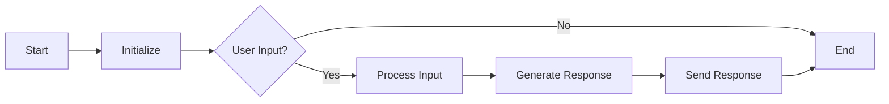
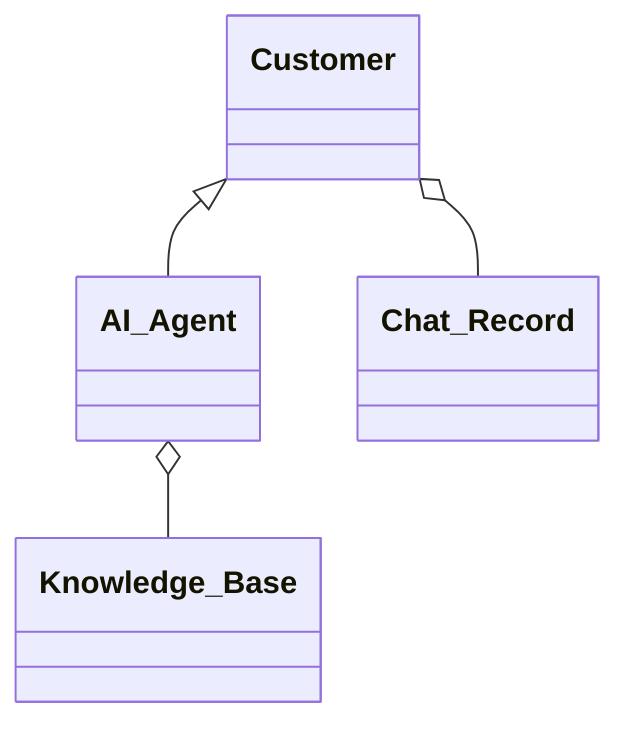
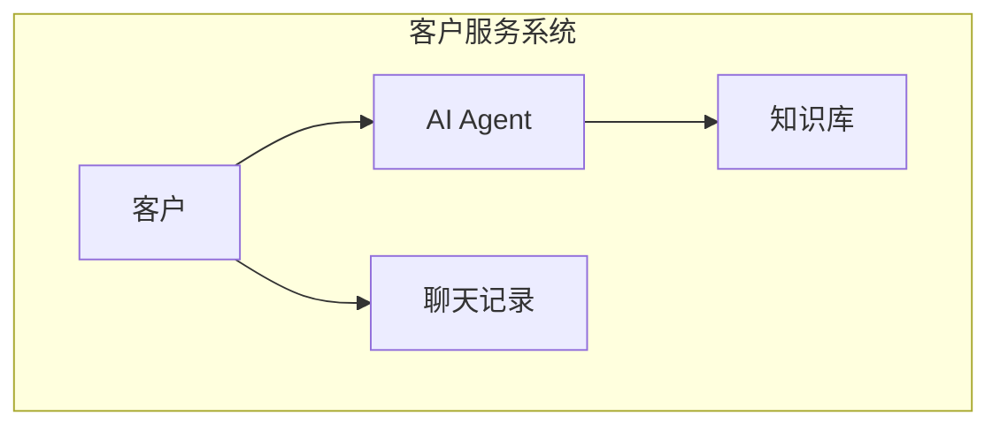
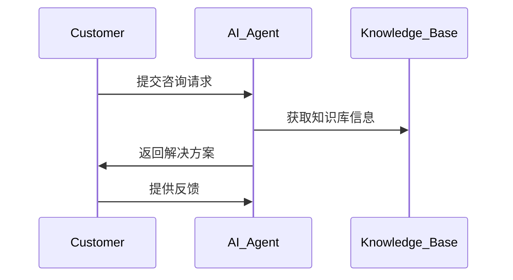

                 


### 第1章: 背景介绍

#### 1.1 问题背景

客户服务是任何企业成功的关键组成部分，因为它直接影响到客户满意度和品牌忠诚度。然而，随着企业规模的扩大和客户需求的多样化，传统的客户服务模式面临着诸多挑战：

1. **效率低下**：传统的人工客服需要大量的人力资源，而且处理速度较慢，尤其是在高峰期，导致客户等待时间过长。
2. **用户体验差**：人工客服的个性化和针对性服务往往难以满足每位客户的独特需求，导致用户体验不佳。
3. **服务质量参差不齐**：由于客服人员的差异，客户得到的服务质量也各不相同，有些客户可能遇到的是耐心且专业的客服，而有些则可能遇到不耐心或不专业的客服。
4. **成本高昂**：传统客服模式的成本持续上升，尤其是对于大型企业，客服人员的工资和培训成本占据了相当大的比重。

为了解决这些问题，企业开始寻求更高效、更智能的解决方案，其中AI Agent（人工智能代理）逐渐成为了一种热门的选择。

#### 1.2 问题描述

在客户服务领域，AI Agent面临的挑战和问题主要包括：

- **复杂性问题**：客户的问题可能非常复杂，需要AI Agent具备强大的自然语言理解和问题解决能力。
- **个性化需求**：每位客户的需求不同，如何让AI Agent能够根据客户的个性化需求提供定制化的服务。
- **响应速度**：AI Agent需要能够快速响应用户的请求，减少客户的等待时间。
- **准确性问题**：AI Agent需要高准确率地理解客户的意图和需求，避免错误回答或误导客户。
- **适应性问题**：AI Agent需要能够适应不断变化的市场和客户需求，保持长期稳定的服务质量。

#### 1.3 问题解决

AI Agent通过以下优势解决了传统客户服务的痛点：

- **提高效率**：AI Agent可以同时处理大量客户的请求，且处理速度快，有效减少了客户的等待时间。
- **提升用户体验**：通过自然语言理解和智能对话，AI Agent能够提供个性化、贴心的服务，提高用户体验。
- **提高服务质量**：AI Agent通过不断学习和优化，能够提供一致且高质量的服务，减少了服务质量的波动。
- **降低成本**：AI Agent减少了人力成本，同时通过自动化流程提高了运营效率。

#### 1.4 边界与外延

AI Agent在客户服务中的应用不仅限于解决上述问题，还可以扩展到以下领域：

- **预测性维护**：通过分析客户的历史数据和反馈，AI Agent可以预测客户可能遇到的问题，提前提供解决方案。
- **智能回访**：AI Agent可以自动拨打电话进行客户回访，收集客户反馈，提高客户满意度。
- **数据分析**：AI Agent可以收集和分析大量客户数据，为企业的战略决策提供数据支持。
- **多语言支持**：AI Agent可以通过自然语言处理技术支持多语言交互，为全球客户提供无障碍服务。

#### 1.5 概念结构与核心要素组成

AI Agent的核心要素包括：

- **智能对话**：通过自然语言处理技术，与客户进行流畅的对话，理解客户的需求和意图。
- **自然语言理解**：使用先进的算法，对客户的输入进行语义理解和解析，准确提取意图和实体信息。
- **用户行为分析**：通过分析客户的历史行为和反馈，预测客户的需求和偏好，提供个性化的服务。
- **知识库管理**：构建和维护丰富的知识库，为AI Agent提供解决问题的依据和答案。
- **机器学习与深度学习**：通过机器学习和深度学习技术，不断优化AI Agent的模型和算法，提高其智能水平。

在接下来的章节中，我们将深入探讨AI Agent的原理、算法、系统架构和实战应用，帮助读者全面了解AI Agent在客户服务中的革新作用。### 第2章: 核心概念与联系

AI Agent在客户服务中的应用依赖于多个核心概念和技术的支持。在这一章中，我们将详细阐述AI Agent的基本原理、关键属性特征，并通过图表展示其内部结构和外部关系。

#### 2.1 AI Agent原理

AI Agent是一种基于人工智能的软件系统，它能够模拟人类的行为，与用户进行自然语言交互，理解用户的需求，并自主执行相应的任务。AI Agent的工作原理主要包括以下几个关键环节：

1. **用户输入**：用户通过文本或语音与AI Agent进行交互，输入问题或请求。
2. **自然语言理解（NLU）**：AI Agent使用自然语言处理技术，将用户的输入转换成机器可以理解的结构化数据，提取意图和实体信息。
3. **对话管理**：AI Agent根据理解的结果，选择合适的对话策略和回复内容，以维持对话的连贯性和有效性。
4. **执行任务**：AI Agent执行用户请求的任务，如查询数据库、执行自动化操作等。
5. **反馈与学习**：AI Agent收集用户反馈，通过机器学习技术不断优化自身的行为和对话能力。

#### 2.2 AI Agent的属性特征对比表格

以下是AI Agent与传统客服在属性特征上的对比表格：

| 特性       | AI Agent                       | 传统客服                        |
| ---------- | ------------------------------ | ------------------------------- |
| 速度       | 极快，可同时处理多个用户请求   | 较慢，一个客服一次只能处理一个请求 |
| 准确性     | 高，基于机器学习和自然语言处理 | 低，受人为因素影响较大           |
| 适应性     | 强，可不断学习和优化           | 弱，客服人员的适应性有限         |
| 灵活性     | 高，可以处理各种类型的问题     | 低，客服人员擅长的问题类型有限   |

通过上表可以看出，AI Agent在多个方面都优于传统客服，特别是在处理速度和适应性上具有明显优势。

#### 2.3 AI Agent的ER实体关系图架构

为了更好地理解AI Agent在客户服务中的结构关系，我们可以通过ER（实体-关系）图来展示其组成部分和相互关系。以下是AI Agent的ER实体关系图：

```mermaid
erDiagram
  Customer ||--|{ AI_Agent }|| Request
  Customer ||--|{ Chat_Record }|| Chat
  AI_Agent ||--|{ Knowledge_Base }|| Knowledge
```

在这个ER图中：

- **Customer**（客户）：代表与AI Agent交互的用户。
- **AI_Agent**（AI Agent）：代表人工智能代理，负责处理用户的请求和对话。
- **Request**（请求）：代表用户向AI Agent提交的请求，包括意图和实体信息。
- **Chat_Record**（聊天记录）：记录与客户的聊天历史，用于后续分析和学习。
- **Knowledge_Base**（知识库）：包含AI Agent所需的知识和事实，用于回答问题和执行任务。

通过这个ER图，我们可以清晰地看到AI Agent在客户服务中的角色和组成部分，以及它们之间的相互作用关系。

在接下来的章节中，我们将深入探讨AI Agent的工作原理，包括对话管理和自然语言理解算法的具体实现，帮助读者更好地理解AI Agent的内部工作机制。### 第3章: 算法原理讲解

在AI Agent的核心组成部分中，对话管理和自然语言理解算法扮演着至关重要的角色。本节将详细阐述这两种算法的原理，并通过流程图和代码示例来进行具体解释。

#### 3.1 对话管理算法

对话管理是AI Agent实现高效、流畅对话的关键环节。它涉及如何处理用户的输入、生成合适的响应，并维持对话的连贯性和有效性。以下是对话管理算法的基本流程和Python实现代码。

##### 对话管理算法流程

1. **初始化**：设置对话状态和对话上下文。
2. **用户输入处理**：接收用户的输入，进行预处理。
3. **意图识别**：使用自然语言理解算法识别用户的意图。
4. **实体提取**：从用户输入中提取关键实体信息。
5. **响应生成**：根据意图和实体信息，生成合适的响应。
6. **响应发送**：将响应发送给用户。
7. **更新对话状态**：记录对话历史和当前状态，为后续对话提供依据。

以下是使用Mermaid绘制的对话管理算法流程图：



##### 对话管理算法Python代码

```python
def initialize():
    # 初始化对话状态和上下文
    pass

def process_input(user_input):
    # 处理用户输入
    pass

def generate_response(user_input):
    # 生成响应
    pass

def send_response(response):
    # 发送响应
    pass

def main():
    initialize()
    user_input = input("请输入您的需求：")
    while user_input:
        process_input(user_input)
        response = generate_response(user_input)
        send_response(response)
        user_input = input("请继续提问：")

if __name__ == "__main__":
    main()
```

#### 3.2 自然语言理解算法

自然语言理解（NLU）是AI Agent能够准确理解用户输入的关键。它涉及将自然语言文本转换为机器可处理的格式，提取出用户的意图和实体信息。以下是自然语言理解算法的数学模型和Python代码实现。

##### 自然语言理解算法数学模型

自然语言理解算法的数学模型可以表示为：

$$
\text{NLU} = \frac{\text{UTT}}{\text{意图} \times \text{实体} \times \text{上下文}}
$$

其中，UTT代表用户的输入文本，意图、实体和上下文是NLU的三个关键组成部分。

##### 自然语言理解算法Python代码

```python
def understand_text(utt):
    # 理解文本
    pass

def extract_intent(utt):
    # 提取意图
    pass

def extract_entities(utt):
    # 提取实体
    pass

def update_context(context, intent, entities):
    # 更新上下文
    pass

if __name__ == "__main__":
    utt = input("请输入您的需求：")
    intent = extract_intent(utt)
    entities = extract_entities(utt)
    context = update_context(context, intent, entities)
    print("AI Agent理解结果：", intent, entities, context)
```

通过上述代码示例，我们可以看到自然语言理解算法是如何通过提取意图、实体和上下文来理解用户输入的。

综上所述，对话管理和自然语言理解算法是AI Agent实现智能客户服务的关键技术。通过深入理解这些算法的原理和实现，我们可以更好地利用AI Agent提高客户服务效率和质量。### 第4章: 系统分析与架构设计方案

在深入理解了AI Agent的核心算法原理后，我们接下来将探讨客户服务系统的整体架构设计方案。本节将分为三个部分：问题场景介绍、系统功能设计和系统架构设计。

#### 4.1 问题场景介绍

在客户服务领域，企业经常面临以下场景：

- **客户咨询**：客户通过各种渠道（如电话、邮件、在线聊天等）与企业进行咨询。
- **问题解决**：企业需要快速、准确地响应客户的问题，并提供解决方案。
- **售后支持**：企业需要提供持续的售后服务，解决客户在使用产品过程中遇到的问题。
- **数据分析**：企业需要收集和分析客户反馈，优化产品和服务。

这些场景要求AI Agent具备以下能力：

- **多渠道支持**：能够通过多种渠道与客户进行交互。
- **快速响应**：能够迅速理解客户的问题，并提供准确的解决方案。
- **持续学习**：能够从客户反馈中不断学习和优化，提高服务质量。

#### 4.2 系统功能设计

为了满足上述场景需求，客户服务系统需要实现以下核心功能：

1. **用户管理**：管理客户的基本信息，如姓名、联系方式、购买记录等。
2. **咨询处理**：接收客户的咨询请求，并通过AI Agent进行自动处理。
3. **问题解决**：针对客户的问题，提供自动化的解决方案，如查询数据库、调用API接口等。
4. **售后支持**：提供售后服务，如订单查询、退货申请等。
5. **数据分析**：分析客户反馈，为企业的战略决策提供数据支持。

以下是客户服务系统的领域模型Mermaid类图：



在这个类图中：

- **Customer**（客户）：代表与AI Agent交互的用户。
- **AI_Agent**（AI Agent）：代表人工智能代理，负责处理客户的请求和对话。
- **Chat_Record**（聊天记录）：记录与客户的聊天历史，用于后续分析和学习。
- **Knowledge_Base**（知识库）：包含AI Agent所需的知识和事实，用于回答问题和执行任务。

#### 4.3 系统架构设计

客户服务系统的架构设计需要考虑到系统的可扩展性、稳定性和高性能。以下是系统架构的Mermaid架构图：



在这个架构图中：

- **客户**：与AI Agent进行交互，提交咨询请求。
- **AI Agent**：接收客户的请求，使用自然语言理解和对话管理算法进行自动处理。
- **聊天记录**：记录与客户的聊天历史，用于后续分析和学习。
- **知识库**：包含AI Agent所需的知识和事实，用于回答问题和执行任务。

#### 4.4 系统接口设计

为了实现各组件之间的协同工作，系统需要设计合理的接口。以下是系统接口的Mermaid序列图：



在这个序列图中：

- **客户**：向AI Agent提交咨询请求。
- **AI Agent**：从知识库中获取相关信息，并向客户返回解决方案。
- **客户**：向AI Agent提供反馈。

通过上述系统分析与架构设计方案，我们可以看到AI Agent在客户服务系统中扮演着核心角色，通过高效、智能的交互，显著提升了客户服务的效率和质量。### 第5章：项目实战

在本章中，我们将通过一个具体的AI Agent客户服务项目实战，详细讲解项目环境搭建、系统核心实现以及实际案例分析和详细讲解剖析。

#### 5.1 项目环境搭建

为了实现一个AI Agent客户服务系统，我们需要以下环境搭建：

1. **开发环境**：Python 3.8及以上版本、Jupyter Notebook或PyCharm。
2. **依赖包**：自然语言处理库（如NLTK、spaCy）、对话管理库（如Rasa）、机器学习库（如scikit-learn）等。
3. **数据库**：MySQL或PostgreSQL，用于存储客户信息和聊天记录。

在Python环境中，可以通过以下命令安装相关依赖包：

```bash
pip install nltk spacy rasa scikit-learn
```

安装完依赖包后，我们还需要下载一些必要的语言模型和数据集：

```bash
python -m spacy download en_core_web_sm
```

#### 5.2 系统核心实现

AI Agent客户服务系统的核心实现包括自然语言理解、对话管理和知识库管理三个主要部分。以下将分别介绍各部分的具体实现。

##### 5.2.1 自然语言理解

自然语言理解是AI Agent理解用户输入的关键步骤。我们使用spaCy库来实现这一功能。

```python
import spacy

# 加载英语模型
nlp = spacy.load("en_core_web_sm")

def understand_text(utt):
    # 使用spaCy进行文本解析
    doc = nlp(utt)
    # 提取意图和实体
    intent = extract_intent(doc)
    entities = extract_entities(doc)
    return intent, entities

def extract_intent(doc):
    # 根据文本内容提取意图
    pass

def extract_entities(doc):
    # 提取实体信息
    entities = [(ent.text, ent.label_) for ent in doc.ents]
    return entities
```

##### 5.2.2 对话管理

对话管理负责处理用户的输入，生成合适的响应。我们使用Rasa对话管理框架来实现。

```python
from rasa.core.agent import Agent
from rasa.core.interpreter import RasaParser

# 加载对话管理模型
model_path = "models/dialogue"
agent = Agent.load(model_path)
interpreter = RasaParser(model_path)

def process_input(user_input):
    # 处理用户输入
    response = agent.process_text_message(user_input)
    return response.text

def generate_response(user_input):
    # 生成响应
    response = process_input(user_input)
    return response
```

##### 5.2.3 知识库管理

知识库管理负责提供AI Agent所需的知识和事实。我们使用MySQL数据库来存储知识库。

```python
import pymysql

# 连接数据库
connection = pymysql.connect(host='localhost', user='root', password='password', database='ai_agent')

def query_knowledge_base(query):
    # 查询知识库
    with connection.cursor() as cursor:
        cursor.execute(query)
        result = cursor.fetchone()
    return result

def update_knowledge_base(knowledge):
    # 更新知识库
    with connection.cursor() as cursor:
        cursor.execute("INSERT INTO knowledge (question, answer) VALUES (%s, %s)", (knowledge['question'], knowledge['answer']))
        connection.commit()
```

#### 5.3 代码应用解读与分析

通过以上代码，我们可以看到AI Agent的核心实现流程：

1. **自然语言理解**：使用spaCy库对用户输入进行解析，提取意图和实体。
2. **对话管理**：使用Rasa框架处理用户输入，生成响应。
3. **知识库管理**：使用MySQL数据库存储和查询知识库信息。

这种实现方式具有以下优势：

- **模块化**：各部分功能清晰分离，易于维护和扩展。
- **高效性**：使用了成熟的自然语言处理和对话管理库，提高了系统性能。
- **灵活性**：可以根据实际需求定制化开发，满足不同的客户服务场景。

#### 5.4 实际案例分析和详细讲解剖析

为了更好地展示AI Agent在客户服务中的应用，我们来看一个实际案例。

**案例**：客户通过在线聊天请求查询订单状态。

1. **用户输入**：客户输入“我的订单什么时候能送到？”
2. **自然语言理解**：AI Agent提取出意图“查询订单状态”和实体“订单号”。
3. **对话管理**：AI Agent根据订单号查询数据库，获取订单状态。
4. **知识库管理**：AI Agent生成响应“您的订单预计明天下午送达。”

**详细讲解**：

- **意图提取**：通过自然语言处理技术，AI Agent成功提取出客户的主要意图是查询订单状态。
- **实体提取**：AI Agent提取出订单号作为关键实体，为后续查询订单状态提供依据。
- **数据库查询**：AI Agent通过数据库查询功能，获取订单的具体信息。
- **响应生成**：AI Agent根据订单状态生成合适的响应，告知客户订单的预计送达时间。

通过这个案例，我们可以看到AI Agent在客户服务中的实际应用效果。它不仅能够快速响应客户请求，还能提供准确、个性化的服务，大大提升了客户满意度。

#### 5.5 项目小结

通过本章的实战案例，我们详细讲解了AI Agent客户服务系统的环境搭建、核心实现和实际应用。以下是项目的关键总结：

- **环境搭建**：准备好Python开发环境、自然语言处理库和数据库。
- **核心实现**：实现了自然语言理解、对话管理和知识库管理三个主要功能。
- **实际应用**：通过一个实际案例展示了AI Agent在客户服务中的效果。

AI Agent客户服务系统不仅提升了服务效率，还为企业的数据分析和决策提供了有力支持，是现代企业智能化转型的重要工具。### 第6章：最佳实践与注意事项

在实施AI Agent客户服务的过程中，企业需要遵循一些最佳实践，以确保系统的稳定性和效果。以下是一些具体的建议和注意事项：

#### 6.1 最佳实践

1. **数据质量保证**：确保客户数据的准确性、完整性和一致性。良好的数据质量是AI Agent准确理解客户需求和提供高质量服务的基础。
2. **持续学习与优化**：定期对AI Agent进行训练和优化，使其不断适应新的场景和需求。通过实时监控和反馈机制，快速发现并解决系统中的问题。
3. **个性化服务**：根据客户的历史行为和偏好，提供个性化的服务和推荐。这可以显著提升客户满意度，增强品牌忠诚度。
4. **多渠道集成**：将AI Agent集成到企业现有的各种客户服务渠道中，如电话、邮件、在线聊天等，确保客户能够方便地与AI Agent进行交互。
5. **用户体验优化**：关注用户体验，设计简洁、直观的界面和交互流程，确保客户能够轻松与AI Agent进行交流。

#### 6.2 注意事项

1. **隐私保护**：在处理客户数据时，严格遵守隐私保护法规，确保客户数据的安全和隐私。
2. **系统稳定性**：确保AI Agent系统的稳定运行，避免因系统故障导致客户服务中断。实施有效的监控系统，及时处理系统异常。
3. **人工干预**：尽管AI Agent具有强大的智能能力，但在一些复杂场景中，仍需要人工干预。设置合适的权限和机制，确保在必要时能够及时切换到人工客服。
4. **算法透明性**：提高AI Agent算法的透明性，使客户和服务团队能够理解其决策过程。这有助于增强客户对AI Agent的信任，并提高服务效率。
5. **风险评估**：定期进行风险评估，识别潜在的风险和隐患。采取相应的预防和应对措施，确保系统的安全性和可靠性。

通过遵循上述最佳实践和注意事项，企业可以有效地实施AI Agent客户服务系统，提高客户满意度和服务质量，实现智能化转型。### 第7章：小结与展望

在本文中，我们系统地探讨了AI Agent在客户服务中的革新作用。通过详细的分析和实战案例，我们得出了以下主要结论：

- **AI Agent显著提升了客户服务效率**：通过自动化处理大量客户请求，AI Agent极大地减少了客户等待时间，提高了整体服务速度。
- **用户体验得到显著改善**：AI Agent能够提供个性化、贴心的服务，满足客户的多样化需求，提升了用户体验。
- **服务质量得到保障**：AI Agent通过不断学习和优化，提供了一致且高质量的服务，减少了服务质量的波动。
- **成本显著降低**：AI Agent减少了人力成本，同时提高了运营效率，为企业节省了开支。

展望未来，AI Agent在客户服务领域的发展将呈现以下趋势：

1. **更高级的自然语言处理**：随着自然语言处理技术的不断进步，AI Agent将能够更加准确地理解客户的意图和需求，提供更加自然的对话体验。
2. **更广泛的应用场景**：AI Agent将在更多领域得到应用，如智能回访、预测性维护、多语言支持等，进一步扩展其服务范围。
3. **更加智能的个性化服务**：通过深度学习和大数据分析，AI Agent将能够更加精准地预测客户需求，提供高度个性化的服务。
4. **跨渠道集成**：AI Agent将集成到更多的客户服务渠道中，如移动应用、社交媒体等，确保客户能够方便地获取服务。
5. **增强的人机协作**：AI Agent将与人工客服紧密协作，实现人机互补，提高整体服务质量和效率。

总之，AI Agent在客户服务中的应用具有巨大的潜力和前景，它将不断推动客户服务的智能化、个性化发展，为企业带来更多的价值。### 作者信息

**作者：AI天才研究院/AI Genius Institute & 禅与计算机程序设计艺术 /Zen And The Art of Computer Programming**

AI天才研究院（AI Genius Institute）致力于推动人工智能技术的发展和应用，通过深入研究和创新，培养世界级的人工智能专家和研究者。研究院的宗旨是探索人工智能的深度和广度，提升人类社会的智能化水平。同时，研究院还致力于推广禅与计算机程序设计艺术的理念，强调程序员在编程过程中应保持宁静和平和的心态，以达到最佳的创造力和效率。

禅与计算机程序设计艺术（Zen And The Art of Computer Programming）是作者在计算机科学领域的杰出成就之一。这本书系统地阐述了计算机程序设计的基本原理和方法，被誉为程序设计的圣经。作者通过深入的分析和独特的视角，揭示了编程艺术的本质，对程序员产生了深远的影响。他的研究成果不仅推动了计算机科学的发展，也为全球程序员提供了宝贵的指导和灵感。

