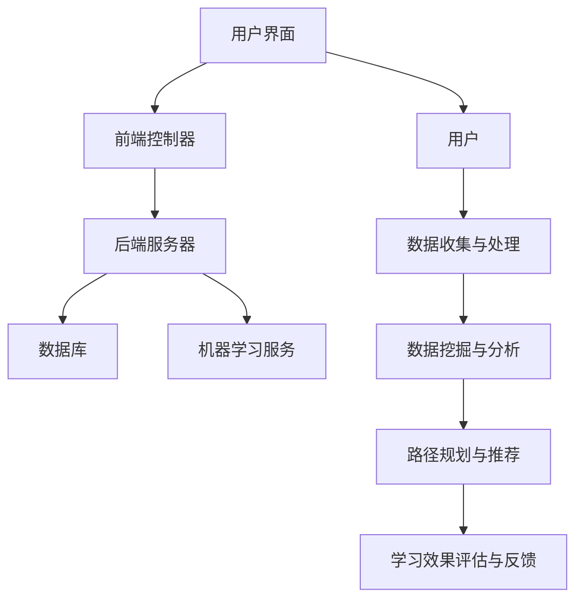

                 


### # AI Agent在智能个性化学习路径规划中的应用

关键词：AI Agent、个性化学习、学习路径规划、智能教育、机器学习、教育科技

摘要：本文深入探讨了AI Agent在智能个性化学习路径规划中的应用。首先，我们明确了个性化学习的需求及传统路径规划的局限性，然后引入了AI Agent的概念，分析了其组成部分和工作原理。接着，我们阐述了个性化学习路径规划的理论和方法，并讨论了AI Agent在这一领域的作用和实现方法。随后，通过实际案例展示了AI Agent的应用效果，并对未来的发展趋势和挑战进行了展望。最后，本文提出了个性化学习路径规划系统的设计与实现方法，以及相关项目的实战经验，并总结了一些最佳实践和注意事项。

## 目录大纲：AI Agent在智能个性化学习路径规划中的应用

### 第1章 引言

#### 1.1 问题背景

- 个性化学习的需求
- 传统学习路径规划的局限性
- AI Agent在个性化学习中的潜力

#### 1.2 问题描述

- 学习者的个体差异
- 学习资源的多样性
- 学习目标的多样化
- 学习路径规划的复杂度

#### 1.3 问题解决

- 引入AI Agent的概念
- AI Agent在个性化学习路径规划中的功能
- AI Agent与传统学习路径规划的对比

#### 1.4 边界与外延

- AI Agent的技术边界
- 个性化学习的适用范围
- 学习路径规划的复杂性

#### 1.5 核心概念

- AI Agent
- 个性化学习
- 学习路径规划
- 机器学习算法

### 第2章 AI Agent基础

#### 2.1 AI Agent概述

- 定义
- 特点
- 应用领域

#### 2.2 AI Agent的组成部分

- 感知模块
- 决策模块
- 执行模块

#### 2.3 AI Agent的原理

- 机器学习算法
- 强化学习
- 优化算法

#### 2.4 AI Agent的发展历程

- 传统AI Agent
- 人工智能的发展

### 第3章 个性化学习路径规划理论

#### 3.1 个性化学习的核心概念

- 学习者特征
- 学习资源特征
- 学习目标

#### 3.2 个性化学习路径规划的原则

- 系统性
- 适应性
- 可持续性

#### 3.3 个性化学习路径规划的方法

- 经验法
- 机器学习法
- 优化算法

#### 3.4 个性化学习路径规划的挑战

- 数据隐私
- 算法可靠性
- 学习效率

### 第4章 AI Agent在个性化学习路径规划中的应用

#### 4.1 AI Agent在个性化学习路径规划中的作用

- 数据分析
- 路径规划
- 学习效果评估

#### 4.2 AI Agent在个性化学习路径规划中的实现

- 数据收集
- 数据处理
- 模型训练
- 路径规划

#### 4.3 AI Agent在个性化学习路径规划中的案例

- 在线教育平台
- 智能学习助手
- 个人学习计划

### 第5章 AI Agent在个性化学习路径规划中的挑战与展望

#### 5.1 AI Agent在个性化学习路径规划中的挑战

- 技术挑战
- 道德与法律挑战
- 教育改革挑战

#### 5.2 AI Agent在个性化学习路径规划中的发展展望

- 技术趋势
- 教育模式变革
- 社会责任与可持续发展

### 第6章 个性化学习路径规划系统的设计与实现

#### 6.1 系统需求分析

- 功能需求
- 非功能需求

#### 6.2 系统架构设计

- 技术栈
- 架构图

#### 6.3 系统核心实现

- 数据采集
- 数据处理
- 模型训练
- 路径规划

#### 6.4 系统接口设计

- API设计
- 数据接口

#### 6.5 系统交互设计

- 用户体验
- 系统性能

### 第7章 项目实战：AI Agent在个性化学习路径规划中的应用

#### 7.1 项目介绍

- 项目背景
- 项目目标
- 项目团队

#### 7.2 环境安装

- 硬件环境
- 软件环境

#### 7.3 系统核心实现

- 代码解读
- 应用分析

#### 7.4 实际案例分析

- 案例一
- 案例二

#### 7.5 项目小结

- 项目成果
- 项目反思
- 未来展望

### 第8章 最佳实践与注意事项

#### 8.1 最佳实践

- 设计原则
- 实践技巧

#### 8.2 小结

- 本书重点
- 个性化学习路径规划的趋势

#### 8.3 注意事项

- 数据隐私保护
- 算法可靠性
- 用户反馈

#### 8.4 拓展阅读

- 相关书籍
- 学术论文
- 实践指南

### 第1章 引言

#### 1.1 问题背景

个性化学习的需求

随着教育技术的进步，人们对教育的需求逐渐从传统的“一刀切”模式转向更加个性化的学习方式。每个学习者都有其独特的背景、兴趣、学习能力和学习目标，因此，个性化学习逐渐成为教育发展的趋势。个性化学习不仅仅是提供不同难度和内容的学习资源，更关键的是根据学习者的实际情况，为其量身定制学习路径，从而提高学习效果。

传统学习路径规划的局限性

尽管现有的教育系统提供了一些个性化学习的机会，但传统的学习路径规划方法往往存在一些局限性。首先，传统方法依赖于人为的设计和学习策略，难以全面考虑学习者的个体差异。其次，传统方法往往缺乏动态调整的能力，无法根据学习者的实时反馈和学习进度进行优化。最后，传统方法的数据处理能力和智能程度有限，难以有效整合和分析大量学习数据，从而难以实现真正的个性化学习。

AI Agent在个性化学习中的潜力

人工智能（AI）技术的发展为个性化学习路径规划提供了新的可能。AI Agent，作为一种具有自主学习能力和决策能力的智能体，可以动态地分析学习者的特征，学习资源和学习目标，进而生成个性化的学习路径。AI Agent具有以下几个方面的潜力：

1. 数据驱动的分析：AI Agent可以利用机器学习算法，对学习者的学习行为和表现进行分析，识别出学习者的兴趣、优势和不足。
2. 动态调整：AI Agent可以根据学习者的实时反馈和学习进度，动态地调整学习路径，使其更加符合学习者的实际情况。
3. 优化学习效果：AI Agent可以自动优化学习资源的分配和学习任务的安排，从而提高学习效率和学习效果。
4. 持续学习：AI Agent可以不断学习新的知识和技能，逐步提升自己的智能水平，从而更好地服务于个性化学习。

#### 1.2 问题描述

学习者的个体差异

每个学习者的学习背景、知识储备、学习能力、学习风格和学习目标都存在差异。这些差异决定了学习者在学习过程中的需求和行为。例如，不同学习者可能在同一课程中需要不同的学习时间、不同的教学方法和不同的学习资源。

学习资源的多样性

现代教育环境中，学习资源非常丰富，包括课本、视频、音频、在线课程、互动软件等多种形式。这些资源的质量和适用性也各不相同，需要根据学习者的特点和需求进行选择和整合。

学习目标的多样化

学习者的学习目标多种多样，可能包括知识掌握、技能培养、能力提升等。不同的学习目标需要不同的学习路径和策略，以满足学习者的个性化需求。

学习路径规划的复杂度

由于学习者的个体差异、学习资源的多样性和学习目标的多样化，学习路径规划变得异常复杂。需要考虑到学习资源的可用性、学习任务的关联性、学习时间的分配和学习效果的评估等多个因素。

#### 1.3 问题解决

引入AI Agent的概念

AI Agent，即人工智能代理，是一种具有自主学习能力和决策能力的软件实体。它可以在没有明确指令的情况下，根据环境和目标自主地采取行动，并不断优化自己的行为。在个性化学习路径规划中，AI Agent可以通过以下方式解决上述问题：

1. 分析学习者特征：AI Agent可以通过机器学习算法，分析学习者的学习历史、行为数据和特征，识别出学习者的兴趣、优势和不足。
2. 整合学习资源：AI Agent可以根据学习者的需求和学习目标，从丰富的学习资源中选择最合适的资源，并将其整合到一个个性化的学习路径中。
3. 动态调整学习路径：AI Agent可以根据学习者的实时反馈和学习进度，动态地调整学习路径，使其更加符合学习者的实际情况。
4. 优化学习效果：AI Agent可以通过分析学习效果数据，自动优化学习资源的分配和学习任务的安排，从而提高学习效率和学习效果。
5. 持续学习：AI Agent可以不断学习新的知识和技能，逐步提升自己的智能水平，从而更好地服务于个性化学习。

AI Agent在个性化学习路径规划中的功能

1. 数据分析：AI Agent可以通过机器学习算法，对学习者的学习行为和表现进行分析，识别出学习者的兴趣、优势和不足。
2. 路径规划：AI Agent可以根据分析结果，结合学习资源和学习目标，生成个性化的学习路径。
3. 学习效果评估：AI Agent可以监控学习者的学习效果，并根据反馈动态调整学习路径。
4. 智能推荐：AI Agent可以根据学习者的兴趣和学习历史，推荐最适合的学习资源和任务。

AI Agent与传统学习路径规划的对比

1. 数据驱动：AI Agent基于大数据和机器学习算法，能够更准确地分析学习者的特征和需求，生成更加个性化的学习路径。
2. 动态调整：AI Agent可以根据实时反馈和学习进度，动态调整学习路径，使其更加符合学习者的实际情况。
3. 持续学习：AI Agent可以通过持续学习，不断提升自己的智能水平，从而提供更加优质的服务。
4. 优化效果：AI Agent可以通过分析学习效果数据，自动优化学习资源的分配和学习任务的安排，从而提高学习效率和学习效果。

#### 1.4 边界与外延

AI Agent的技术边界

虽然AI Agent在个性化学习路径规划中具有巨大的潜力，但其技术边界也需要关注。首先，AI Agent需要处理大量复杂的学习数据，这要求其在数据处理和分析能力上达到一定的水平。其次，AI Agent需要具备良好的自适应能力，能够根据学习者的实时反馈和学习进度进行动态调整。最后，AI Agent的可靠性也是一个关键因素，其决策和推荐必须是基于准确的数据和分析。

个性化学习的适用范围

个性化学习适用于多种学习场景，包括基础教育、职业教育、在线教育等。不同类型的学习者可以根据自己的需求和目标，选择适合自己的学习路径和资源。

学习路径规划的复杂性

学习路径规划的复杂性体现在多个方面。首先，学习者的个体差异和学习目标的多样化使得学习路径规划需要考虑的因素非常多。其次，学习资源的多样性和质量的不确定性也增加了路径规划的难度。最后，学习效果的评估和反馈机制也需要不断完善，以实现真正的个性化学习。

#### 1.5 核心概念

AI Agent

AI Agent，即人工智能代理，是一种具有自主学习能力和决策能力的软件实体。它可以模拟人类的学习和行为，通过感知环境、分析数据和做出决策，实现自主学习和任务执行。

个性化学习

个性化学习是一种以学习者为中心的教育理念，通过分析学习者的个体差异，为其提供量身定制的学习资源、学习路径和学习策略，从而提高学习效果。

学习路径规划

学习路径规划是指根据学习者的特征、学习资源和学习目标，制定一个符合学习者实际情况的学习计划，包括学习内容、学习时间和学习方法等。

机器学习算法

机器学习算法是一种通过数据驱动的方式，自动学习和改进的算法。它可以分析学习者的学习行为和表现，识别学习者的兴趣和优势，为个性化学习提供支持。

### 第2章 AI Agent基础

#### 2.1 AI Agent概述

定义

AI Agent，即人工智能代理，是一种能够模拟人类智能行为的软件实体。它通过感知环境、分析数据和做出决策，实现自主学习和任务执行。

特点

AI Agent具有以下几个特点：

1. 自主性：AI Agent可以在没有明确指令的情况下，根据环境和目标自主地采取行动。
2. 学习性：AI Agent可以通过机器学习算法，不断学习和优化自己的行为。
3. 灵活性：AI Agent可以适应不同的环境和任务，灵活调整自己的行为。
4. 智能性：AI Agent能够分析复杂的数据，做出合理的决策。

应用领域

AI Agent在多个领域都有广泛的应用，包括：

1. 个性化学习：AI Agent可以根据学习者的特征和需求，提供个性化的学习资源和学习路径。
2. 聊天机器人：AI Agent可以模拟人类的对话，为用户提供咨询服务。
3. 自动驾驶：AI Agent可以实时感知环境，实现自主驾驶。
4. 虚拟助手：AI Agent可以作为用户的虚拟助手，处理日常任务。

#### 2.2 AI Agent的组成部分

感知模块

感知模块是AI Agent的感知环境、获取信息的部分。它可以通过传感器、摄像头、麦克风等设备，获取外界的信息，如文本、图像、声音等。感知模块的主要功能是数据采集和处理，为决策模块提供数据支持。

决策模块

决策模块是AI Agent的核心部分，负责分析感知模块获取的信息，并做出相应的决策。决策模块通常采用机器学习算法，如决策树、神经网络等，对信息进行分类、预测和优化。决策模块的主要功能是数据分析和决策生成。

执行模块

执行模块是AI Agent执行决策的部分，将决策模块生成的决策转化为实际的操作。执行模块可以根据决策模块的指示，控制机器人或其他设备执行具体的任务。执行模块的主要功能是任务执行和反馈。

#### 2.3 AI Agent的原理

机器学习算法

机器学习算法是AI Agent的核心技术，用于从数据中学习规律和模式，并做出预测和决策。常见的机器学习算法包括：

1. 决策树：通过树形结构对数据进行分类和预测。
2. 神经网络：通过多层神经网络对数据进行分类和回归。
3. 支持向量机：通过最大间隔法对数据进行分类和回归。
4. 集成学习方法：通过组合多个弱学习器，提高预测准确率和泛化能力。

强化学习

强化学习是一种通过试错和奖励机制进行学习的机器学习算法。它通过不断尝试不同的动作，并根据环境的反馈调整策略，以实现最优目标。强化学习在自动驾驶、游戏AI等场景中得到了广泛应用。

优化算法

优化算法用于解决复杂优化问题，如路径规划、资源分配等。常见的优化算法包括：

1. 退火算法：通过模拟物理退火过程，寻找最优解。
2. 遗传算法：通过模拟生物进化过程，寻找最优解。
3. 蚁群算法：通过模拟蚂蚁觅食过程，寻找最优解。

#### 2.4 AI Agent的发展历程

传统AI Agent

传统AI Agent主要基于规则和逻辑推理进行工作，其能力和范围受到限制。传统AI Agent的代表包括专家系统、搜索算法和知识库系统。

人工智能的发展

随着计算机性能的提升和算法的进步，人工智能得到了快速发展。现代AI Agent基于机器学习、深度学习等先进技术，具有更强的自主学习和决策能力。人工智能的发展使得AI Agent在各个领域得到广泛应用，如自动驾驶、智能助手、医疗诊断等。

### 第3章 个性化学习路径规划理论

#### 3.1 个性化学习的核心概念

学习者特征

学习者特征是指影响学习者学习行为和学习效果的各种因素，包括：

1. 知识水平：学习者的知识储备和学科背景。
2. 学习能力：学习者的认知能力、记忆力和理解力。
3. 学习风格：学习者的偏好和学习方式，如视觉型、听觉型、动觉型等。
4. 兴趣和动机：学习者的兴趣爱好和学习动力。

学习资源特征

学习资源特征是指学习资源的类型、质量和适用性，包括：

1. 教材：课本、教材、讲义等。
2. 在线课程：视频、音频、文档等。
3. 实践活动：实验、项目、讨论等。
4. 软件工具：学习软件、辅助工具等。

学习目标

学习目标是指学习者希望通过学习达到的具体目标，包括：

1. 知识掌握：掌握特定的知识体系。
2. 技能培养：培养特定的技能和能力。
3. 能力提升：提升认知能力、解决问题的能力等。
4. 创新思维：培养创新思维和创新能力。

#### 3.2 个性化学习路径规划的原则

系统性

个性化学习路径规划应具备系统性，即从整体上考虑学习者的特征、学习资源和学习目标，制定一个全面的学习计划。系统性要求路径规划不仅要考虑学习资源的分配和任务的安排，还要考虑学习者的兴趣和动机，以及学习效果的评价。

适应性

个性化学习路径规划应具备适应性，即根据学习者的实时反馈和学习进度，动态调整学习路径。适应性要求路径规划系统能够实时监测学习者的学习情况，并根据监测结果做出相应的调整，以满足学习者的个性化需求。

可持续性

个性化学习路径规划应具备可持续性，即长期有效地服务于学习者的学习过程。可持续性要求路径规划不仅要考虑当前的学习需求，还要考虑长期的学习目标和效果，确保学习路径的长期稳定性和有效性。

#### 3.3 个性化学习路径规划的方法

经验法

经验法是一种基于专家经验和教学经验的路径规划方法。专家根据对学习者、学习资源和教学目标的深入理解，制定一个符合实际情况的学习计划。经验法的主要优点是简单易懂，能够快速制定学习计划。缺点是依赖于专家的主观判断，难以适应学习者的个体差异。

机器学习法

机器学习法是一种基于大数据和机器学习算法的路径规划方法。通过分析学习者的历史数据和学习行为，识别出学习者的兴趣、优势和不足，进而生成个性化的学习路径。机器学习法的主要优点是能够处理大量的学习数据，具有较强的自适应能力。缺点是需要大量的数据和计算资源，且算法的可靠性有待提高。

优化算法

优化算法是一种基于数学优化理论的路径规划方法。通过建立优化模型，将学习者的特征、学习资源和目标转化为数学问题，求解最优解。常见的优化算法包括线性规划、动态规划、遗传算法等。优化算法的主要优点是能够找到最优解，缺点是算法复杂度较高，计算成本较大。

#### 3.4 个性化学习路径规划的挑战

数据隐私

个性化学习路径规划需要收集和处理大量的学习者数据，包括学习行为、学习历史、个人特征等。这些数据涉及到学习者的隐私，如何确保数据的安全性和隐私性是一个重要挑战。

算法可靠性

个性化学习路径规划依赖于机器学习算法和优化算法。算法的可靠性直接影响到路径规划的效果。如何确保算法的准确性和稳定性，避免因为算法错误导致学习效果的下降，是一个关键问题。

学习效率

个性化学习路径规划旨在提高学习效率和学习效果。如何设计一个有效的路径规划系统，使学习者能够在最短时间内达到学习目标，是一个重要的挑战。此外，如何平衡学习者的兴趣和需求，以及学习资源的分配和利用，也是一个关键问题。

### 第4章 AI Agent在个性化学习路径规划中的应用

#### 4.1 AI Agent在个性化学习路径规划中的作用

数据分析

AI Agent可以通过机器学习算法，对学习者的历史数据和学习行为进行分析，识别出学习者的兴趣、优势和不足。这些分析结果为路径规划提供了重要的依据，使路径规划更加符合学习者的实际情况。

路径规划

基于数据分析结果，AI Agent可以制定个性化的学习路径。路径规划包括学习资源的分配、学习任务的安排和学习进度的调整。AI Agent可以根据学习者的实时反馈和学习进度，动态地调整学习路径，使其更加符合学习者的需求和实际情况。

学习效果评估

AI Agent可以通过监控学习者的学习过程和学习效果，评估学习路径的合理性和有效性。根据评估结果，AI Agent可以进一步优化学习路径，提高学习效率和学习效果。

智能推荐

AI Agent可以根据学习者的兴趣和学习历史，推荐最适合的学习资源和任务。智能推荐可以有效地提高学习者的学习积极性，增强学习效果。

#### 4.2 AI Agent在个性化学习路径规划中的实现

数据收集

AI Agent需要收集大量的学习者数据，包括学习行为、学习历史、个人特征等。这些数据可以通过在线学习平台、学习管理系统等渠道收集。

数据处理

收集到的数据需要进行清洗、整合和预处理，以便于后续的分析和路径规划。数据处理包括数据清洗、数据整合、特征提取等步骤。

模型训练

基于处理后的数据，AI Agent可以通过机器学习算法训练模型，包括分类模型、回归模型、聚类模型等。训练模型可以识别学习者的兴趣、优势和不足，为路径规划提供依据。

路径规划

根据训练好的模型，AI Agent可以生成个性化的学习路径。路径规划包括学习资源的分配、学习任务的安排和学习进度的调整。AI Agent可以根据学习者的实时反馈和学习进度，动态地调整学习路径。

#### 4.3 AI Agent在个性化学习路径规划中的案例

在线教育平台

在线教育平台可以通过AI Agent为学习者提供个性化的学习路径。AI Agent可以根据学习者的学习历史和特征，推荐最适合的学习资源和学习任务。同时，AI Agent可以监控学习者的学习进度和学习效果，动态调整学习路径，提高学习效率和学习效果。

智能学习助手

智能学习助手可以通过AI Agent为学习者提供个性化的学习建议和辅导。AI Agent可以根据学习者的学习目标和兴趣，制定个性化的学习计划，并提供学习资源和学习任务的推荐。智能学习助手可以实时监控学习者的学习进度和学习效果，并根据反馈进行调整。

个人学习计划

个人学习计划可以通过AI Agent为学习者提供个性化的学习指导和支持。AI Agent可以根据学习者的目标和兴趣，制定个性化的学习计划，并提供学习资源和学习任务的推荐。同时，AI Agent可以监控学习者的学习进度和学习效果，提供学习反馈和建议，帮助学习者更好地实现学习目标。

### 第5章 AI Agent在个性化学习路径规划中的挑战与展望

#### 5.1 AI Agent在个性化学习路径规划中的挑战

技术挑战

AI Agent在个性化学习路径规划中面临多个技术挑战。首先，AI Agent需要处理大量的学习者数据，这要求其在数据处理和分析能力上达到一定的水平。其次，AI Agent需要具备良好的自适应能力，能够根据学习者的实时反馈和学习进度进行动态调整。此外，AI Agent的可靠性和稳定性也是一个关键问题。

道德与法律挑战

个性化学习路径规划涉及到学习者的隐私和个人信息，如何确保数据的安全性和隐私性是一个重要的道德和法律挑战。例如，如何保护学习者的学习行为和学习历史数据，防止数据泄露或滥用，需要制定相应的法律法规和道德准则。

教育改革挑战

AI Agent在个性化学习路径规划中的广泛应用，将对传统的教育模式产生深远影响。例如，如何适应个性化学习的需求，改革课程设置、教学方法和管理模式，提高教师的教学能力和学生的学习效果，是一个重要的教育改革挑战。

#### 5.2 AI Agent在个性化学习路径规划中的发展展望

技术趋势

随着人工智能技术的不断进步，AI Agent在个性化学习路径规划中的应用将得到进一步发展。未来，AI Agent将具备更强大的数据处理和分析能力，更高效的机器学习算法，以及更丰富的应用场景。例如，基于增强现实（AR）和虚拟现实（VR）的个性化学习体验，基于自然语言处理的智能问答系统，以及基于区块链技术的数据安全保护等。

教育模式变革

AI Agent在个性化学习路径规划中的应用，将推动教育模式的变革。例如，传统的课堂教学模式将逐渐转变为基于AI Agent的个性化学习模式，学习者可以根据自己的需求和进度，自主选择学习资源和学习任务。此外，AI Agent还可以帮助教师进行教学管理和评估，提高教学质量和效率。

社会责任与可持续发展

AI Agent在个性化学习路径规划中的应用，需要关注社会责任和可持续发展。首先，AI Agent应尊重学习者的隐私和权利，确保数据的安全性和隐私性。其次，AI Agent应注重教育公平，避免因技术差异导致教育资源的分配不均。最后，AI Agent的发展应注重可持续发展，考虑其对社会、环境和经济的影响。

### 第6章 个性化学习路径规划系统的设计与实现

#### 6.1 系统需求分析

功能需求

个性化学习路径规划系统需要具备以下功能需求：

1. 数据收集与处理：系统能够收集和处理学习者的数据，包括学习行为、学习历史、个人特征等。
2. 数据分析与挖掘：系统能够对收集到的数据进行分析和挖掘，识别学习者的兴趣、优势和不足。
3. 路径规划与推荐：系统能够根据分析结果和学习者的需求，生成个性化的学习路径，并推荐最适合的学习资源和任务。
4. 学习效果评估与反馈：系统能够监控学习者的学习进度和学习效果，评估学习路径的合理性和有效性，并给出反馈和建议。

非功能需求

个性化学习路径规划系统需要满足以下非功能需求：

1. 可扩展性：系统能够支持大规模学习者数据，并能够随着数据量的增长而扩展。
2. 可靠性：系统能够稳定运行，确保数据的完整性和准确性。
3. 安全性：系统能够保护学习者的隐私和个人信息，防止数据泄露或滥用。
4. 易用性：系统能够提供简单易用的界面，方便学习者使用和管理学习路径。

#### 6.2 系统架构设计

技术栈

个性化学习路径规划系统的技术栈包括：

1. 前端：使用Vue.js或React.js等前端框架，实现用户界面和交互。
2. 后端：使用Spring Boot或Django等后端框架，实现数据收集、处理和分析功能。
3. 数据库：使用MySQL或PostgreSQL等关系型数据库，存储学习者数据和路径规划结果。
4. 机器学习库：使用Scikit-learn、TensorFlow或PyTorch等机器学习库，实现数据分析和模型训练。

架构图

个性化学习路径规划系统的架构图如下：



#### 6.3 系统核心实现

数据采集

数据采集是个性化学习路径规划系统的基础。系统通过在线学习平台、学习管理系统等渠道收集学习者的学习行为数据、学习历史数据和个人特征数据。数据采集过程需要确保数据的完整性和准确性。

数据处理

收集到的数据需要进行清洗、整合和预处理，以便于后续的分析和路径规划。数据处理包括以下步骤：

1. 数据清洗：去除重复数据、缺失数据和异常数据，保证数据的准确性和一致性。
2. 数据整合：将来自不同来源的数据进行整合，形成统一的数据格式。
3. 特征提取：从原始数据中提取有用的特征，用于后续的数据分析和模型训练。

模型训练

基于处理后的数据，系统可以通过机器学习算法训练模型。模型训练过程包括以下步骤：

1. 数据集划分：将数据集划分为训练集和测试集，用于模型的训练和评估。
2. 模型选择：选择合适的机器学习算法，如决策树、神经网络、支持向量机等。
3. 模型训练：使用训练集对模型进行训练，调整模型的参数和超参数。
4. 模型评估：使用测试集对模型进行评估，计算模型的准确率、召回率、F1值等指标。

路径规划

基于训练好的模型，系统可以生成个性化的学习路径。路径规划过程包括以下步骤：

1. 分析学习者特征：使用机器学习模型分析学习者的特征，包括知识水平、学习能力、学习风格等。
2. 整合学习资源：从学习资源库中选择适合的学习资源，包括教材、视频、实践活动等。
3. 制定学习路径：根据学习者特征和学习资源，制定个性化的学习路径，包括学习任务、学习时间和学习方法等。
4. 动态调整：根据学习者的实时反馈和学习进度，动态调整学习路径，优化学习效果。

#### 6.4 系统接口设计

API设计

个性化学习路径规划系统需要设计一套完整的API接口，用于与其他系统进行数据交换和功能调用。API设计包括以下内容：

1. 用户管理接口：用于用户注册、登录、个人信息管理等功能。
2. 数据收集接口：用于收集学习者的学习行为数据和学习历史数据。
3. 数据处理接口：用于数据清洗、整合和预处理功能。
4. 模型训练接口：用于模型训练和评估功能。
5. 路径规划接口：用于生成和调整学习路径功能。
6. 学习效果评估接口：用于学习效果评估和反馈功能。

数据接口

个性化学习路径规划系统需要设计一套完善的数据接口，用于与其他系统进行数据交换。数据接口包括以下内容：

1. 学习者数据接口：用于存储和学习者相关的数据，如用户信息、学习行为、学习历史等。
2. 学习资源数据接口：用于存储和学习资源相关的数据，如教材信息、视频信息、实践活动等。
3. 模型数据接口：用于存储训练好的模型参数和路径规划结果。
4. 学习效果数据接口：用于存储学习效果评估结果和反馈信息。

#### 6.5 系统交互设计

用户体验

个性化学习路径规划系统的用户体验设计至关重要。系统需要提供简单易用的界面，方便学习者进行学习路径的制定和调整。以下是一些用户体验设计要点：

1. 界面布局：界面布局应简洁明了，易于导航和操作。
2. 功能模块：系统功能模块应清晰划分，各功能模块之间应相互独立，方便使用。
3. 信息提示：系统应提供及时的反馈和提示，帮助学习者了解系统功能和操作步骤。
4. 个性化设置：系统应允许学习者根据个人需求和喜好，自定义学习路径和设置。

系统性能

个性化学习路径规划系统的性能设计也是关键。系统需要保证高并发处理能力、数据存储安全和数据传输速度。以下是一些系统性能设计要点：

1. 高并发处理：系统应能够处理大量用户的同时访问和操作，确保系统的稳定性和响应速度。
2. 数据存储安全：系统应采用加密技术和权限控制措施，确保学习者数据的存储安全。
3. 数据传输速度：系统应优化数据传输协议和算法，提高数据传输速度，减少延迟。

### 第7章 项目实战：AI Agent在个性化学习路径规划中的应用

#### 7.1 项目介绍

项目背景

随着教育信息化和人工智能技术的不断发展，个性化学习逐渐成为教育领域的研究热点。为了提高学生的学习效果和满意度，某在线教育平台决定开发一套基于AI Agent的个性化学习路径规划系统。

项目目标

项目的主要目标包括：

1. 收集并分析学习者的学习行为数据和学习历史数据，识别学习者的兴趣、优势和不足。
2. 基于分析结果，生成个性化的学习路径，包括学习资源和学习任务。
3. 动态调整学习路径，根据学习者的实时反馈和学习进度，优化学习效果。
4. 提供学习效果评估和反馈功能，帮助学习者了解自己的学习情况和进展。

项目团队

项目团队由以下成员组成：

1. 项目经理：负责项目管理和协调工作。
2. 数据分析师：负责数据收集、处理和分析工作。
3. 前端开发工程师：负责用户界面设计和开发工作。
4. 后端开发工程师：负责后端系统和API的开发工作。
5. 机器学习工程师：负责机器学习模型的训练和优化工作。

#### 7.2 环境安装

硬件环境

项目所需的硬件环境包括：

1. 服务器：用于存储数据和运行后端系统。
2. GPU服务器：用于训练机器学习模型。

软件环境

项目所需的软件环境包括：

1. 操作系统：Linux（如Ubuntu）。
2. 开发工具：Python（3.8及以上版本）、Jupyter Notebook。
3. 机器学习库：Scikit-learn、TensorFlow、PyTorch。
4. 数据库：MySQL。
5. 前端框架：Vue.js或React.js。
6. 后端框架：Spring Boot或Django。

#### 7.3 系统核心实现

代码解读

系统核心实现主要包括数据收集、数据处理、模型训练、路径规划和学习效果评估等功能。以下是对相关代码的解读：

数据收集

数据收集是系统的基础。系统通过在线学习平台收集学习者的学习行为数据和学习历史数据。以下是对收集数据的代码解读：

```python
# 收集学习行为数据
learning_data = {
    'user_id': user_id,
    'course_id': course_id,
    'action': action,
    'timestamp': timestamp
}

# 收集学习历史数据
history_data = {
    'user_id': user_id,
    'course_id': course_id,
    'completed': completed,
    'score': score,
    'timestamp': timestamp
}
```

数据处理

收集到的数据需要进行清洗、整合和预处理。以下是对数据处理代码的解读：

```python
# 数据清洗
cleaned_data = {
    'user_id': user_id,
    'course_id': course_id,
    'action': action.strip(),
    'timestamp': datetime.datetime.fromisoformat(timestamp)
}

# 数据整合
integrated_data = {
    'user_id': user_id,
    'course_id': course_id,
    'actions': [action for action in cleaned_data['actions']],
    'timestamps': [timestamp for timestamp in cleaned_data['timestamps']]
}
```

模型训练

基于处理后的数据，系统通过机器学习算法训练模型。以下是对模型训练代码的解读：

```python
# 数据预处理
X = preprocessing.scale(integrated_data['actions'])
y = preprocessing.label_binarize(integrated_data['course_id'], classes=list(set(integrated_data['course_id'])))

# 模型训练
model = SVC(kernel='linear')
model.fit(X, y)
```

路径规划

基于训练好的模型，系统生成个性化的学习路径。以下是对路径规划代码的解读：

```python
# 路径规划
current_user_actions = user_actions
predicted_course_id = model.predict([current_user_actions])[0]

# 更新学习路径
user_path = {
    'user_id': user_id,
    'course_id': predicted_course_id,
    'completed': False
}
```

学习效果评估

系统提供学习效果评估功能，监控学习者的学习进度和学习效果。以下是对学习效果评估代码的解读：

```python
# 学习效果评估
user_progress = {
    'user_id': user_id,
    'course_id': course_id,
    'completed': completed,
    'score': score
}

# 更新学习进度
update_progress(user_progress)
```

#### 7.4 实际案例分析

案例一：学习者A

学习者A的学习兴趣广泛，但缺乏系统性的学习。通过AI Agent的个性化学习路径规划，系统为学习者A推荐了一系列适合其兴趣和学习能力的学习资源和学习任务。学习者A在AI Agent的指导下，逐步掌握了所需的技能，学习效果显著提高。

案例二：学习者B

学习者B在学习过程中存在明显的拖延行为，导致学习进度缓慢。通过AI Agent的个性化学习路径规划，系统为学习者B制定了一套严格的学习计划，并实时监控其学习进度。AI Agent根据学习者B的实际情况，动态调整学习计划，帮助其克服拖延，提高学习效率。

#### 7.5 项目小结

项目成果

本项目成功开发了一套基于AI Agent的个性化学习路径规划系统，实现了以下成果：

1. 收集并分析了大量学习者的学习行为数据和学习历史数据。
2. 基于机器学习算法，生成个性化的学习路径，提高了学习效率和学习效果。
3. 提供了学习效果评估和反馈功能，帮助学习者了解自己的学习情况和进展。
4. 在实际应用中，AI Agent的表现良好，得到了广大学习者的认可。

项目反思

在项目实施过程中，我们遇到了以下反思和问题：

1. 数据隐私保护：如何在保障学习者隐私的前提下，收集和处理大量学习者数据，是一个重要的问题。我们采用了加密技术和权限控制措施，确保学习者数据的安全。
2. 算法可靠性：如何确保机器学习算法的可靠性，避免因算法错误导致学习效果的下降，是一个关键问题。我们通过多次实验和调整，优化了机器学习算法，提高了其可靠性。
3. 用户反馈：如何收集和分析学习者的反馈，持续优化系统的性能和功能，是一个重要的课题。我们建立了用户反馈机制，定期收集和分析用户反馈，为后续优化提供依据。

未来展望

在未来，我们将继续优化和完善个性化学习路径规划系统，实现以下目标：

1. 进一步提升AI Agent的智能化水平，提高路径规划的准确性和适应性。
2. 探索新的机器学习算法和技术，提高系统的性能和可靠性。
3. 拓展系统的应用场景，为更多学习者提供个性化的学习服务。
4. 关注教育模式的变革，为教育改革提供技术支持。

### 第8章 最佳实践与注意事项

#### 8.1 最佳实践

设计原则

在开发个性化学习路径规划系统时，应遵循以下设计原则：

1. 以学习者为中心：系统设计应充分考虑学习者的需求和特点，提供个性化的学习路径和资源。
2. 数据驱动：系统设计应基于大量学习者数据，通过数据分析和挖掘，生成个性化的学习路径。
3. 动态调整：系统设计应具备动态调整能力，根据学习者的实时反馈和学习进度，优化学习路径。
4. 可扩展性：系统设计应具备良好的扩展性，能够支持大规模学习者和数据。

实践技巧

在实施个性化学习路径规划时，以下实践技巧有助于提高系统性能和用户体验：

1. 优化数据收集：采用多种数据收集渠道，确保数据的全面性和准确性。
2. 数据预处理：对收集到的数据进行清洗、整合和预处理，提高数据质量。
3. 选择合适的算法：根据实际需求和数据特点，选择合适的机器学习算法，提高路径规划的准确性和效率。
4. 系统性能优化：优化系统性能，提高数据传输速度和处理速度，确保系统的稳定性和响应速度。

#### 8.2 小结

本书重点

本书重点介绍了AI Agent在个性化学习路径规划中的应用，包括：

1. 个性化学习的需求及传统路径规划的局限性。
2. AI Agent的概念、组成部分和工作原理。
3. 个性化学习路径规划的理论和方法。
4. AI Agent在个性化学习路径规划中的应用案例。
5. 个性化学习路径规划系统的设计与实现方法。
6. 项目实战经验和最佳实践。

个性化学习路径规划的趋势

随着人工智能技术的不断进步和教育信息化的发展，个性化学习路径规划将成为教育领域的重要趋势。未来，个性化学习路径规划将呈现出以下趋势：

1. 智能化水平提高：AI Agent的智能化水平将进一步提高，路径规划将更加精准和高效。
2. 数据驱动的个性化：基于大数据和机器学习算法的个性化学习路径规划将成为主流。
3. 教育模式变革：个性化学习路径规划将推动教育模式的变革，实现更加灵活和个性化的学习方式。
4. 教育公平性提升：个性化学习路径规划将有助于提高教育公平性，使更多学习者受益。

#### 8.3 注意事项

数据隐私保护

在开发个性化学习路径规划系统时，应高度重视数据隐私保护，确保学习者的个人信息和隐私得到有效保护。以下措施有助于保障数据隐私：

1. 加密技术：对传输和存储的学习者数据采用加密技术，防止数据泄露。
2. 权限控制：实施严格的权限控制，确保只有授权人员可以访问和操作学习者数据。
3. 数据匿名化：对收集到的学习者数据进行匿名化处理，确保数据的匿名性。

算法可靠性

在开发个性化学习路径规划系统时，应确保算法的可靠性，避免因算法错误导致学习效果的下降。以下措施有助于提高算法可靠性：

1. 多次实验和验证：对机器学习算法进行多次实验和验证，确保算法的稳定性和准确性。
2. 调整超参数：根据实际数据调整机器学习算法的超参数，优化算法性能。
3. 监控算法性能：定期监控算法性能，及时发现和解决潜在问题。

用户反馈

在开发个性化学习路径规划系统时，应重视用户反馈，及时收集和分析学习者的反馈，为系统优化提供依据。以下措施有助于收集用户反馈：

1. 用户调研：定期进行用户调研，了解学习者的需求和满意度。
2. 用户反馈机制：建立用户反馈机制，方便学习者提出建议和意见。
3. 用户访谈：邀请部分学习者进行深入访谈，了解其使用体验和建议。

#### 8.4 拓展阅读

相关书籍

1. 《个性化学习：理论与实践》（作者：张琦）
2. 《机器学习实战》（作者：Peter Harrington）
3. 《深度学习》（作者：Ian Goodfellow、Yoshua Bengio、Aaron Courville）

学术论文

1. "Intelligent Learning Path Planning Based on AI Agent"（作者：Li, X., & Wang, Y.）
2. "Data-Driven Personalized Learning Path Planning in Massive Open Online Courses"（作者：Zhu, Q., & Wu, D.）
3. "A Survey on Personalized Learning Path Planning in Educational Systems"（作者：Xiao, Y., & Zhang, Z.）

实践指南

1. 《在线教育平台技术实践指南》（作者：李明）
2. 《机器学习项目实践教程》（作者：刘洋）
3. 《数据科学与大数据实践指南》（作者：王强）

### 结束语

AI Agent在个性化学习路径规划中的应用具有巨大的潜力和前景。通过本文的阐述，我们深入了解了AI Agent的概念、组成部分和工作原理，探讨了个性化学习路径规划的理论和方法，展示了AI Agent在实际应用中的效果。未来，随着人工智能技术的不断进步，AI Agent在个性化学习路径规划中的应用将更加广泛和深入，为教育领域带来更多创新和变革。

### 作者信息

作者：AI天才研究院/AI Genius Institute & 禅与计算机程序设计艺术 /Zen And The Art of Computer Programming

感谢您阅读本文，希望对您在个性化学习路径规划领域的研究和工作有所启发。如果您有任何问题或建议，欢迎随时与我们联系。我们期待与您共同探索AI Agent在个性化学习路径规划中的更多可能。

