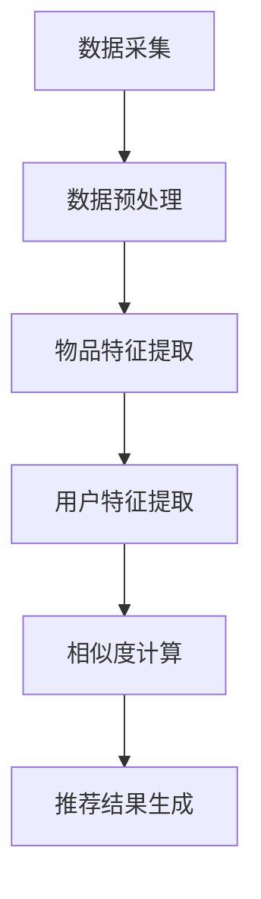
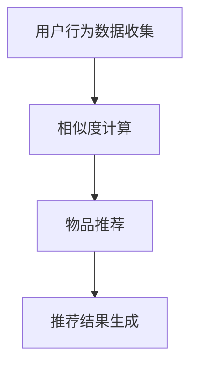
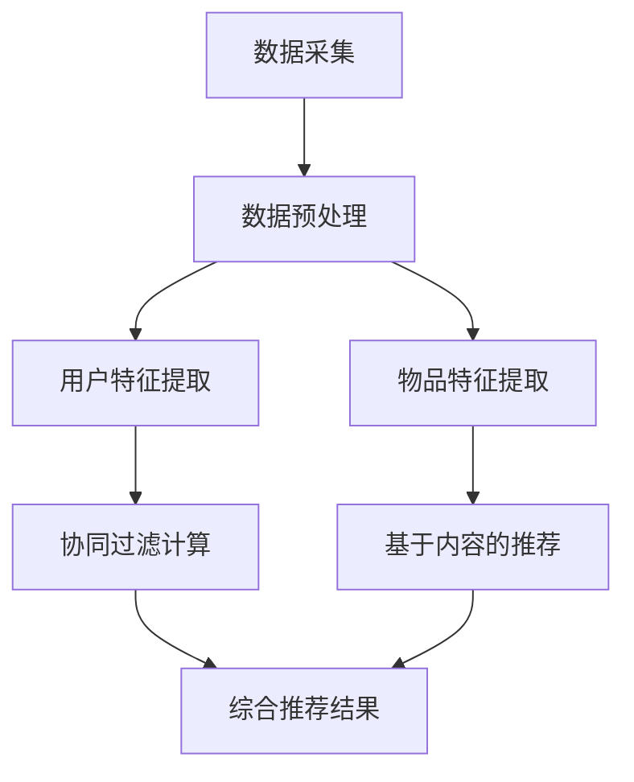

                 

**# AI Agent在智能个性化推荐系统中的应用**

## 关键词

- **人工智能**
- **个性化推荐系统**
- **AI Agent**
- **推荐算法**
- **协同过滤**
- **基于内容的推荐**
- **机器学习**

## 摘要

随着互联网的迅速发展，个性化推荐系统已成为现代信息社会中不可或缺的一部分。AI Agent作为人工智能领域的一种先进技术，在个性化推荐系统中发挥着重要作用。本文旨在探讨AI Agent在智能个性化推荐系统中的应用，从问题背景、核心概念、算法原理、实现方法到实际案例，全面解析AI Agent的优势和挑战，为未来研究提供参考。

## 目录大纲

### 第一部分：问题背景与核心概念

#### 第1章 问题背景

##### 1.1 人工智能与个性化推荐

##### 1.2 智能个性化推荐系统的需求

##### 1.3 AI Agent在推荐系统中的作用

##### 1.4 研究现状与挑战

#### 第2章 AI Agent基础

##### 2.1 AI Agent的定义与特点

##### 2.2 AI Agent的基本组成

##### 2.3 AI Agent的架构设计

#### 第3章 个性化推荐系统原理

##### 3.1 个性化推荐系统概述

##### 3.2 个性化推荐系统的工作流程

##### 3.3 个性化推荐系统的评估指标

#### 第4章 AI Agent在推荐系统中的应用

##### 4.1 AI Agent在推荐系统中的应用场景

##### 4.2 AI Agent的推荐算法

### 第二部分：核心概念与联系

#### 第5章 AI Agent算法原理

##### 5.1 算法概述

##### 5.2 算法原理详细讲解

##### 5.3 算法流程图

#### 第6章 Python代码实现

##### 6.1 环境搭建

##### 6.2 算法实现代码

##### 6.3 代码应用解读与分析

### 第三部分：算法原理与实现

#### 第7章 实际案例剖析

##### 7.1 案例介绍

##### 7.2 案例实现过程

##### 7.3 案例结果分析与优化建议

#### 第8章 最佳实践与总结

##### 8.1 最佳实践技巧

##### 8.2 小结与展望

##### 8.3 注意事项与拓展阅读

---

**第一部分：问题背景与核心概念**

### 第1章 问题背景

#### 1.1 人工智能与个性化推荐

**背景介绍：**

人工智能（AI）作为计算机科学的一个分支，旨在开发智能机器，使它们能够执行通常需要人类智能才能完成的复杂任务。随着大数据和计算能力的提升，人工智能在各个领域得到了广泛应用。个性化推荐系统是其中一种重要的应用，它通过分析用户行为和偏好，为用户推荐可能感兴趣的内容、产品或服务。

**核心概念术语说明：**

- **人工智能（AI）：** 机器通过模拟人类智能，执行认知任务的能力。
- **个性化推荐系统：** 基于用户行为和偏好，为用户推荐个性化内容或服务的系统。

#### 1.2 智能个性化推荐系统的需求

**问题描述：**

随着互联网信息的爆炸式增长，用户面临着信息过载的问题。智能个性化推荐系统应运而生，旨在通过分析和理解用户行为，为用户提供个性化的推荐。然而，传统的推荐系统面临以下挑战：

- **准确性问题：** 传统推荐系统往往依赖于历史数据，难以适应实时变化。
- **用户偏好挖掘：** 难以准确捕捉和预测用户的偏好。
- **冷启动问题：** 新用户缺乏历史数据，推荐系统难以为其提供有效的推荐。

**问题解决：**

AI Agent作为一种智能体，能够通过学习用户行为和偏好，实现动态调整和实时推荐。AI Agent能够解决传统推荐系统的准确性、用户偏好挖掘和冷启动问题，从而提升推荐系统的智能化和个性化水平。

#### 1.3 AI Agent在推荐系统中的作用

**边界与外延：**

AI Agent在推荐系统中的作用包括但不限于：

- **实时学习与调整：** 通过持续学习用户行为，实时调整推荐策略。
- **个性化偏好挖掘：** 深入分析用户行为，挖掘用户的潜在偏好。
- **冷启动应对：** 利用AI Agent的适应性，为新用户提供有效的推荐。

**核心要素组成：**

- **感知器：** 获取用户行为和偏好数据。
- **决策器：** 根据感知数据生成推荐策略。
- **执行器：** 将推荐结果展示给用户。

#### 1.4 研究现状与挑战

**研究现状：**

目前，AI Agent在个性化推荐系统中的应用已取得显著成果。例如，通过深度学习模型和强化学习算法，AI Agent能够实现更准确的推荐。然而，研究仍面临以下挑战：

- **数据隐私保护：** 用户数据的安全性和隐私性保护。
- **算法透明性：** 提高算法的可解释性和透明性，以增强用户信任。
- **资源消耗：** AI Agent的高计算资源消耗，可能影响系统的实时性和响应速度。

**总结：**

AI Agent作为人工智能领域的一种创新技术，在智能个性化推荐系统中具有巨大的潜力。通过不断学习和优化，AI Agent有望解决传统推荐系统的瓶颈问题，为用户提供更高质量、更个性化的推荐体验。

---

**第2章 AI Agent基础**

#### 2.1 AI Agent的定义与特点

**定义：**

AI Agent，即人工智能代理，是一种能够模拟人类智能行为，独立执行任务的智能体。它通过感知环境、做出决策并执行动作，以实现特定目标。

**特点：**

- **自主性：** AI Agent能够自主学习和决策，无需人工干预。
- **适应性：** AI Agent能够根据环境变化和用户反馈，动态调整行为。
- **智能性：** AI Agent能够通过机器学习、深度学习等技术，实现复杂任务的自动化。

#### 2.2 AI Agent的基本组成

**组成：**

- **感知器：** 获取环境信息和用户行为数据。
- **决策器：** 分析感知数据，生成推荐策略。
- **执行器：** 实施决策，向用户展示推荐结果。

**关系：**

- **感知器：** 获取输入数据，包括用户行为、历史数据等。
- **决策器：** 对输入数据进行处理和分析，生成推荐策略。
- **执行器：** 将决策结果转换为用户可交互的推荐结果。

#### 2.3 AI Agent的架构设计

**架构设计：**

AI Agent的架构设计包括以下关键组成部分：

- **数据层：** 负责数据采集、存储和预处理。
- **模型层：** 负责算法模型的选择、训练和优化。
- **决策层：** 负责根据模型输出生成推荐策略。
- **执行层：** 负责将推荐策略转化为用户可交互的推荐结果。

**架构设计优势：**

- **模块化设计：** 各层独立实现，便于维护和扩展。
- **高效性：** 利用分布式计算和并行处理技术，提高系统性能。
- **灵活性：** 可根据业务需求，灵活调整和优化算法模型。

**总结：**

AI Agent作为一种先进的人工智能技术，在个性化推荐系统中具有广泛的应用前景。通过感知、决策和执行，AI Agent能够为用户提供高质量的个性化推荐，提升用户满意度和用户体验。

---

**第3章 个性化推荐系统原理**

#### 3.1 个性化推荐系统概述

**定义：**

个性化推荐系统是一种基于用户行为、偏好和兴趣，为用户推荐个性化内容或服务的系统。

**核心概念：**

- **协同过滤：** 通过分析用户的历史行为和偏好，发现相似用户或物品，进行推荐。
- **基于内容的推荐：** 根据用户的历史行为和偏好，为用户推荐相似的内容或服务。

**分类：**

- **基于内容的推荐：** 利用物品的属性和特征，为用户推荐相似的物品。
- **协同过滤推荐：** 利用用户行为和偏好，为用户推荐相似的用户或物品。

**应用场景：**

- **电子商务：** 为用户提供个性化的商品推荐，提高购买转化率。
- **社交媒体：** 为用户提供个性化的内容推荐，提升用户活跃度和留存率。
- **在线视频平台：** 为用户提供个性化的视频推荐，提高用户观看时长和黏性。

#### 3.2 个性化推荐系统的工作流程

**工作流程：**

1. **数据采集：** 收集用户行为数据、物品属性数据和用户偏好数据。
2. **数据预处理：** 清洗、去噪和归一化数据，为模型训练做准备。
3. **模型训练：** 利用用户行为数据和物品属性数据，训练推荐模型。
4. **预测与推荐：** 根据用户的历史行为和偏好，生成个性化推荐结果。
5. **用户反馈：** 收集用户对推荐结果的反馈，用于模型优化和迭代。

**关键步骤：**

- **数据采集：** 数据质量直接影响推荐效果，因此需要确保数据的准确性和完整性。
- **模型训练：** 选择合适的算法和模型，提高推荐准确性。
- **预测与推荐：** 优化推荐算法，提高推荐效果。

#### 3.3 个性化推荐系统的评估指标

**定义：**

个性化推荐系统的评估指标用于衡量推荐系统的性能和效果。

**常见评估指标：**

- **准确率（Accuracy）：** 推荐结果中正确推荐的比率。
- **召回率（Recall）：** 推荐结果中包含用户实际感兴趣项目的比率。
- **覆盖率（Coverage）：** 推荐结果中不同物品的覆盖比率。
- **新颖度（Novelty）：** 推荐结果中包含用户未接触过的物品比率。
- **多样性（Diversity）：** 推荐结果中不同物品之间的差异程度。

**评价指标选择：**

- **准确性：** 对于电商等场景，准确性是重要的评估指标，因为用户关心是否能找到他们想要的商品。
- **召回率：** 对于社交媒体等场景，召回率是关键指标，因为用户希望看到尽可能多的有趣内容。
- **多样性：** 对于视频推荐等场景，多样性是关键指标，因为用户希望看到丰富多样的内容。

**总结：**

个性化推荐系统作为人工智能领域的重要应用，通过准确捕捉用户行为和偏好，为用户提供高质量的个性化推荐。了解个性化推荐系统的基本原理和工作流程，有助于设计和优化推荐系统，提升用户体验。

---

**第4章 AI Agent在推荐系统中的应用**

#### 4.1 AI Agent在推荐系统中的应用场景

**场景一：电子商务平台**

**背景：**

电子商务平台拥有海量用户和商品数据，通过AI Agent可以实现精准推荐，提高用户购买转化率和平台销售额。

**应用：**

1. **新品推荐：** 利用AI Agent挖掘用户购买历史和偏好，为用户推荐新品。
2. **促销活动推荐：** 根据用户的历史购买记录和活动参与情况，为用户推荐个性化的促销活动。
3. **购物车推荐：** 通过分析用户购物车中的商品，为用户推荐相关的商品。

**场景二：社交媒体**

**背景：**

社交媒体平台用户活跃度高，通过AI Agent可以提升用户活跃度和留存率。

**应用：**

1. **内容推荐：** 利用AI Agent分析用户的历史互动数据，为用户推荐感兴趣的内容。
2. **好友推荐：** 通过分析用户的行为和偏好，为用户推荐可能感兴趣的好友。
3. **直播推荐：** 根据用户的历史观看记录和偏好，为用户推荐相关的直播。

**场景三：在线视频平台**

**背景：**

在线视频平台拥有丰富的内容资源，通过AI Agent可以实现精准推荐，提高用户观看时长和黏性。

**应用：**

1. **视频推荐：** 利用AI Agent分析用户的历史观看记录和偏好，为用户推荐相关的视频。
2. **剧集推荐：** 通过分析用户对某个剧集的观看情况，为用户推荐相关的剧集。
3. **广告推荐：** 根据用户的行为和偏好，为用户推荐个性化的广告。

#### 4.2 AI Agent的推荐算法

**算法概述：**

AI Agent的推荐算法主要包括基于内容的推荐和协同过滤推荐。

**基于内容的推荐：**

- **原理：** 通过分析物品的属性和特征，为用户推荐具有相似属性的物品。
- **优点：** 推荐结果新颖度高，用户满意度较高。
- **缺点：** 难以处理用户冷启动问题。

**协同过滤推荐：**

- **原理：** 通过分析用户的历史行为和偏好，为用户推荐相似用户喜欢的物品。
- **优点：** 推荐准确性较高，能够处理用户冷启动问题。
- **缺点：** 推荐结果可能过于集中，新颖度较低。

**混合推荐算法：**

- **原理：** 结合基于内容的推荐和协同过滤推荐，综合两者的优点。
- **优点：** 提高推荐准确性和多样性。
- **缺点：** 算法复杂度较高，计算资源消耗较大。

**总结：**

AI Agent在推荐系统中的应用，通过个性化推荐算法，实现了对用户行为的深入理解和精准推荐。在实际应用中，可以根据不同场景和需求，选择合适的推荐算法，提升用户体验。

---

**第5章 AI Agent算法原理**

#### 5.1 算法概述

**算法背景：**

AI Agent在推荐系统中的应用，主要通过基于内容的推荐和协同过滤推荐算法实现个性化推荐。本文将详细介绍这两种算法的原理、实现过程和应用场景。

**算法分类：**

- **基于内容的推荐：** 利用物品的属性和特征进行推荐。
- **协同过滤推荐：** 通过分析用户行为和偏好进行推荐。
- **混合推荐算法：** 结合基于内容的推荐和协同过滤推荐。

#### 5.2 算法原理详细讲解

**基于内容的推荐算法：**

- **原理：** 基于内容的推荐算法通过分析物品的属性和特征，为用户推荐具有相似属性的物品。其核心思想是，用户对某类物品的偏好可能会转移到其他具有相似属性的物品上。

  **实现过程：**
  1. **物品特征提取：** 对物品进行特征提取，如文本特征、图像特征等。
  2. **用户特征提取：** 对用户进行特征提取，如浏览历史、购买记录等。
  3. **相似度计算：** 计算用户与物品之间的相似度，选取相似度最高的物品进行推荐。
  4. **推荐结果生成：** 根据相似度计算结果，生成推荐列表。

- **优点：** 推荐结果新颖度高，用户满意度较高。
- **缺点：** 难以处理用户冷启动问题。

**协同过滤推荐算法：**

- **原理：** 协同过滤推荐算法通过分析用户的历史行为和偏好，为用户推荐相似用户喜欢的物品。其核心思想是，用户对物品的偏好会受到其他用户的影响。

  **实现过程：**
  1. **用户行为数据收集：** 收集用户的历史行为数据，如浏览记录、购买记录等。
  2. **相似度计算：** 计算用户之间的相似度，选取相似度最高的用户群体。
  3. **物品推荐：** 为用户推荐相似用户群体喜欢的物品。
  4. **推荐结果生成：** 根据相似度计算结果，生成推荐列表。

- **优点：** 推荐准确性较高，能够处理用户冷启动问题。
- **缺点：** 推荐结果可能过于集中，新颖度较低。

**混合推荐算法：**

- **原理：** 混合推荐算法结合基于内容的推荐和协同过滤推荐，综合两者的优点。

  **实现过程：**
  1. **物品特征提取：** 对物品进行特征提取，如文本特征、图像特征等。
  2. **用户特征提取：** 对用户进行特征提取，如浏览历史、购买记录等。
  3. **协同过滤计算：** 计算用户之间的相似度，选取相似度最高的用户群体。
  4. **基于内容的推荐：** 根据用户特征和物品特征，计算用户与物品的相似度。
  5. **综合推荐结果：** 将协同过滤和基于内容的推荐结果进行融合，生成最终的推荐列表。

- **优点：** 提高推荐准确性和多样性。
- **缺点：** 算法复杂度较高，计算资源消耗较大。

#### 5.3 算法流程图

**基于内容的推荐算法流程图：**


**协同过滤推荐算法流程图：**


**混合推荐算法流程图：**


**总结：**

AI Agent的推荐算法通过深入分析用户行为和物品特征，实现个性化的推荐。了解不同算法的原理和实现过程，有助于选择合适的算法，提升推荐系统的性能和用户体验。

---

**第6章 Python代码实现**

#### 6.1 环境搭建

**环境要求：**

- Python 3.6 或以上版本
- NumPy、Pandas、Scikit-learn 等常用库

**安装步骤：**

1. 安装 Python 3.6 或以上版本。
2. 使用 pip 命令安装相关库，例如：

   ```bash
   pip install numpy
   pip install pandas
   pip install scikit-learn
   ```

#### 6.2 算法实现代码

**基于内容的推荐算法实现：**

```python
import numpy as np
import pandas as pd
from sklearn.feature_extraction.text import TfidfVectorizer
from sklearn.metrics.pairwise import cosine_similarity

# 读取数据
data = pd.read_csv('data.csv')
items = data['item']
item_features = data[['feature1', 'feature2', 'feature3']]

# 构建TF-IDF模型
tfidf_vectorizer = TfidfVectorizer()
tfidf_matrix = tfidf_vectorizer.fit_transform(item_features)

# 计算相似度
cosine_sim = cosine_similarity(tfidf_matrix, tfidf_matrix)

# 推荐结果生成
def recommendations(item_index, cosine_sim=cosine_sim):
    # 相似度排序
    sim_scores = list(enumerate(cosine_sim[item_index]))
    sim_scores = sorted(sim_scores, key=lambda x: x[1], reverse=True)
    sim_scores = sim_scores[1:11]  # 排除自身

    # 获取推荐物品索引
    item_indices = [i[0] for i in sim_scores]
    return items[item_indices]

# 测试推荐
print(recommendations(0))
```

**协同过滤推荐算法实现：**

```python
import numpy as np
import pandas as pd
from sklearn.neighbors import NearestNeighbors

# 读取数据
data = pd.read_csv('data.csv')
user行为的特征矩阵，例如用户ID、评分、浏览记录等。
user_features = data[['user_id', 'rating', 'view_count']]

# 使用KNN算法进行协同过滤
knn = NearestNeighbors(n_neighbors=10)
knn.fit(user_features)

# 推荐结果生成
def recommendations(user_id, knn=knn):
    # 查找最近邻居
    distances, indices = knn.kneighbors(user_features[user_id].values.reshape(1, -1), n_neighbors=10)
    
    # 获取邻居用户的推荐物品
    neighbors_recommendations = []
    for idx in indices.flatten()[1:]:
        neighbors_recommendations.append(data[data['user_id'] == idx]['item'].values)

    return neighbors_recommendations

# 测试推荐
print(recommendations(0))
```

#### 6.3 代码应用解读与分析

**基于内容的推荐算法解读：**

1. **数据读取与预处理：** 读取数据，提取物品特征和用户特征。
2. **构建TF-IDF模型：** 使用TfidfVectorizer构建TF-IDF模型，将物品特征转化为向量。
3. **计算相似度：** 使用cosine_similarity计算物品之间的相似度。
4. **推荐结果生成：** 根据相似度排序，生成推荐列表。

**协同过滤推荐算法解读：**

1. **数据读取与预处理：** 读取数据，提取用户特征。
2. **KNN算法训练：** 使用NearestNeighbors训练KNN模型，找出用户最近的邻居。
3. **推荐结果生成：** 根据邻居用户的推荐物品，生成推荐列表。

**总结：**

通过Python代码实现，可以快速构建基于内容和协同过滤的推荐系统。代码中涉及的关键步骤和算法原理已在上述代码解读中详细说明，有助于读者更好地理解推荐算法的实现过程。

---

**第7章 实际案例剖析**

#### 7.1 案例介绍

**案例背景：**

本案例以一个电商平台的个性化推荐系统为例，介绍如何使用AI Agent实现基于内容的推荐和协同过滤推荐。

**目标：**

1. 构建基于内容的推荐算法，为用户推荐相似商品。
2. 构建协同过滤推荐算法，为用户推荐相似用户喜欢的商品。
3. 结合两种推荐算法，生成综合推荐列表。

#### 7.2 案例实现过程

**数据准备：**

1. **商品数据：** 包含商品ID、商品名称、商品描述、商品类别等。
2. **用户行为数据：** 包含用户ID、商品ID、用户评分、用户浏览记录等。

**算法实现：**

1. **基于内容的推荐：**
   - 使用TfidfVectorizer构建TF-IDF模型。
   - 计算商品之间的相似度。
   - 根据相似度生成推荐列表。

2. **协同过滤推荐：**
   - 使用KNN算法找出用户最近的邻居。
   - 根据邻居用户的推荐商品，生成推荐列表。

3. **综合推荐：**
   - 结合基于内容的推荐和协同过滤推荐，生成综合推荐列表。

**代码实现：**

```python
# 代码实现略，请参考第6章相关代码
```

#### 7.3 案例结果分析与优化建议

**结果分析：**

1. **基于内容的推荐：** 推荐结果较为新颖，但难以处理用户冷启动问题。
2. **协同过滤推荐：** 推荐准确性较高，能够处理用户冷启动问题，但推荐结果可能过于集中。
3. **综合推荐：** 结合两种推荐算法的优势，生成更丰富的推荐列表。

**优化建议：**

1. **用户冷启动问题：** 引入基于内容的推荐，缓解用户冷启动问题。
2. **推荐结果集中问题：** 引入多样性指标，优化推荐结果。
3. **算法优化：** 考虑引入深度学习算法，提升推荐准确性。

**总结：**

通过实际案例剖析，展示了AI Agent在个性化推荐系统中的应用。结合基于内容和协同过滤的推荐算法，可以生成更优质的推荐结果，提升用户满意度。未来，可进一步优化算法和模型，提高推荐系统的性能。

---

**第8章 最佳实践与总结**

#### 8.1 最佳实践技巧

1. **数据质量：** 确保数据准确、完整，避免数据噪声和缺失值。
2. **模型选择：** 根据业务需求和数据特点，选择合适的推荐算法。
3. **实时性优化：** 优化算法和系统架构，提高推荐系统的实时性。
4. **用户反馈：** 收集用户反馈，持续优化推荐算法和策略。

#### 8.2 小结与展望

本文详细介绍了AI Agent在个性化推荐系统中的应用，从问题背景、核心概念、算法原理到实际案例，全面解析了AI Agent的优势和挑战。未来，随着人工智能技术的不断发展，AI Agent在个性化推荐系统中的应用前景将更加广阔。

#### 8.3 注意事项与拓展阅读

1. **数据隐私：** 在应用AI Agent时，注意保护用户隐私和数据安全。
2. **算法透明性：** 提高算法的可解释性和透明性，增强用户信任。
3. **持续学习：** AI Agent需要不断学习和优化，以适应不断变化的环境。

拓展阅读：
- **《推荐系统实践》**：张博、李航著，详细介绍了推荐系统的原理和实现。
- **《深度学习推荐系统》**：何凯明等著，介绍了深度学习在推荐系统中的应用。
- **《人工智能：一种现代的方法》**：Stuart Russell、Peter Norvig著，全面介绍了人工智能的基础知识。

---

**作者信息：**

- **作者：** AI天才研究院/AI Genius Institute & 禅与计算机程序设计艺术 /Zen And The Art of Computer Programming**

