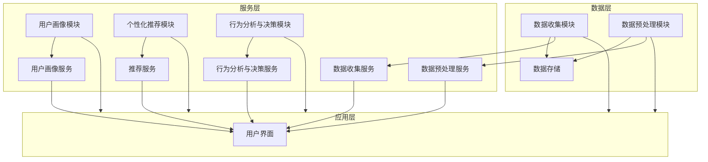
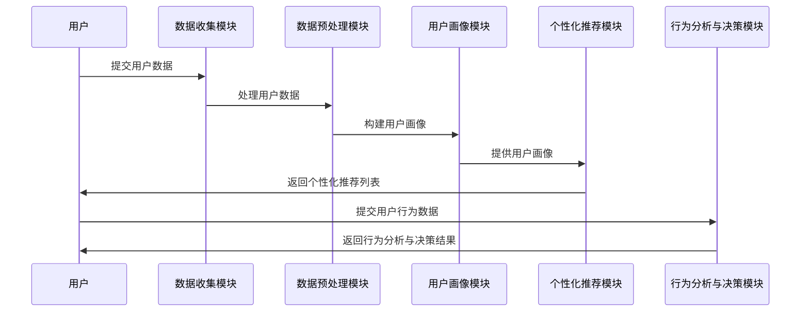

                 

## AI Agent在智能个性化营销中的应用

关键词：AI Agent、智能个性化营销、应用算法、系统架构、项目实战

摘要：本文旨在深入探讨AI Agent在智能个性化营销中的应用。通过详细阐述AI Agent的定义、原理、算法和系统架构，并结合实际项目案例，展示如何利用AI Agent实现智能个性化营销。文章不仅提供了理论知识，还分享了实际操作技巧，帮助读者更好地理解和应用这一先进技术。

### 目录大纲设计思路与框架

在设计《AI Agent在智能个性化营销中的应用》一书的目录大纲时，我们首先明确了核心内容及其结构。考虑到读者对象、目标及应用场景，我们分为以下七个部分：

1. **背景介绍**：介绍AI Agent和智能个性化营销的概念、背景和发展趋势，帮助读者建立整体认识。
2. **核心概念与联系**：定义AI Agent和智能个性化营销的核心概念，通过表格和图表展示概念间的联系。
3. **算法原理讲解**：深入讲解AI Agent在智能个性化营销中的具体应用算法，包括数学模型和Python源代码示例。
4. **系统分析与架构设计方案**：介绍智能个性化营销系统的总体架构，包括功能设计、系统接口设计及系统交互流程。
5. **项目实战**：通过实际案例展示AI Agent在智能个性化营销中的具体应用，包括环境安装、核心实现和代码解读。
6. **最佳实践 tips**：提供实际操作中的经验和技巧，帮助读者更好地应用所学知识。
7. **小结与拓展阅读**：总结全书内容，提供进一步学习和探索的建议。

下面是详细的目录大纲：

### 目录

----------------------------------------------------------------

## 第一部分: 背景介绍

## 第1章: AI Agent与智能个性化营销概述

### 1.1 AI Agent的定义与作用

### 1.2 智能个性化营销的概念与意义

### 1.3 AI Agent在智能个性化营销中的应用现状与前景

## 第二部分: 核心概念与联系

## 第2章: AI Agent基础概念

### 2.1 AI Agent的核心特点

### 2.2 AI Agent的分类与结构

### 2.3 AI Agent的典型应用领域

## 第3章: 智能个性化营销核心概念

### 3.1 智能个性化营销的定义与目标

### 3.2 智能个性化营销的要素与模型

### 3.3 AI Agent与智能个性化营销的关联分析

## 第三部分: 算法原理讲解

## 第4章: AI Agent在智能个性化营销中的应用算法

### 4.1 算法概述与基本原理

### 4.2 数学模型与公式

### 4.3 Python源代码示例

## 第5章: 机器学习算法详解

### 5.1 机器学习基本概念

### 5.2 常见机器学习算法

### 5.3 算法选择与优化

## 第四部分: 系统分析与架构设计方案

## 第6章: 智能个性化营销系统总体架构设计

### 6.1 系统场景介绍

### 6.2 系统功能设计

### 6.3 系统架构设计

### 6.4 系统接口设计

### 6.5 系统交互流程设计

## 第7章: 数据分析与处理

### 7.1 数据收集与预处理

### 7.2 数据分析与挖掘

### 7.3 数据可视化与报告

## 第五部分: 项目实战

## 第8章: 智能个性化营销项目实战

### 8.1 项目环境安装与配置

### 8.2 系统核心实现

### 8.3 代码应用解读与分析

### 8.4 项目详细讲解与剖析

### 8.5 项目小结

## 第六部分: 最佳实践 tips

## 第9章: 实际操作中的经验与技巧

### 9.1 数据处理技巧

### 9.2 模型训练与优化技巧

### 9.3 项目管理技巧

## 第七部分: 小结与拓展阅读

## 第10章: 全书总结与展望

### 10.1 主要内容回顾

### 10.2 学以致用的建议

### 10.3 拓展阅读与资源推荐

----------------------------------------------------------------

以上目录大纲旨在为读者提供一个清晰的阅读路径，从基础理论到实际应用，再到最佳实践，全面覆盖AI Agent在智能个性化营销中的应用。文章字数控制在10000～12000字左右，使用markdown格式输出，确保内容的简洁性与逻辑性。通过这样的框架，读者可以系统地学习和掌握相关知识和技能。

### 背景介绍

#### 核心概念术语说明

在深入探讨AI Agent在智能个性化营销中的应用之前，我们需要先明确几个核心概念和术语：

1. **AI Agent**：AI Agent，即人工智能代理，是一种能够自主学习、决策和执行任务的软件系统。它们在特定环境中模拟人类的行为，通过学习和优化，提高任务完成的效率和准确性。

2. **智能个性化营销**：智能个性化营销是指利用人工智能技术，根据用户的个性化需求和偏好，提供定制化的产品和服务。它通过分析用户数据，实现精准的营销策略，提高营销效果和用户满意度。

3. **个性化推荐系统**：个性化推荐系统是智能个性化营销的核心组成部分，通过分析用户行为和偏好，推荐用户可能感兴趣的产品和服务。

4. **数据挖掘**：数据挖掘是指从大量数据中提取有价值的信息和知识，用于决策和预测。

5. **机器学习**：机器学习是人工智能的一个重要分支，通过训练模型，使计算机能够从数据中学习规律，并自动进行预测和决策。

#### 问题背景

在当今的商业环境中，消费者行为日益多样化，市场竞争日益激烈。传统的营销策略已经无法满足消费者的个性化需求，企业急需一种更加智能、高效的营销方式来提高市场竞争力。智能个性化营销应运而生，成为企业提升用户体验、增加销售额的重要手段。

AI Agent作为人工智能代理的一种形式，具有自主学习、决策和执行任务的能力，使其在智能个性化营销中具有独特的优势。通过AI Agent，企业可以实时分析用户行为，快速响应市场变化，提供个性化的产品和服务。

#### 问题描述

随着大数据和人工智能技术的快速发展，如何将AI Agent有效应用于智能个性化营销，提高营销效果和用户体验，成为企业面临的一个重要问题。

具体来说，问题描述如下：

1. **个性化需求识别**：如何通过AI Agent准确识别用户的个性化需求和偏好？

2. **个性化推荐算法**：如何设计有效的个性化推荐算法，提高推荐系统的准确性和效率？

3. **数据隐私与安全**：如何在保障用户隐私的前提下，利用用户数据实现智能个性化营销？

4. **模型训练与优化**：如何优化AI Agent的模型训练过程，提高模型的泛化能力和性能？

5. **系统集成与部署**：如何将AI Agent集成到现有的营销系统中，实现高效部署和运营？

#### 问题解决

针对上述问题，我们可以采取以下解决方案：

1. **数据收集与预处理**：通过收集用户行为数据、偏好数据等，进行数据清洗、去噪和归一化处理，为AI Agent提供高质量的输入数据。

2. **个性化需求识别**：利用机器学习算法，如协同过滤、矩阵分解等，分析用户历史行为和偏好，准确识别用户的个性化需求。

3. **个性化推荐算法**：设计基于内容的推荐算法、基于模型的推荐算法等，结合用户历史数据和当前兴趣，提供个性化的产品和服务推荐。

4. **数据隐私与安全**：采用数据加密、访问控制等技术，确保用户数据的安全和隐私。

5. **模型训练与优化**：通过交叉验证、超参数调优等技术，优化AI Agent的模型训练过程，提高模型的泛化能力和性能。

6. **系统集成与部署**：将AI Agent集成到现有的营销系统中，采用微服务架构，实现高效部署和运营。

#### 边界与外延

1. **边界**：本文主要探讨AI Agent在智能个性化营销中的应用，不涉及其他领域的应用。

2. **外延**：AI Agent在其他领域的应用，如智能客服、智能金融等，也具有一定的参考价值。

#### 概念结构与核心要素组成

AI Agent在智能个性化营销中的概念结构与核心要素如下：

1. **用户数据**：包括用户行为数据、偏好数据等，是AI Agent识别用户个性化需求的基础。

2. **推荐算法**：包括基于内容的推荐算法、基于模型的推荐算法等，是实现个性化推荐的核心。

3. **AI Agent**：具有自主学习、决策和执行任务的能力，是智能个性化营销的核心组件。

4. **数据挖掘与处理**：包括数据收集、清洗、预处理等，为AI Agent提供高质量的输入数据。

5. **系统集成与部署**：将AI Agent集成到现有的营销系统中，实现高效部署和运营。

通过以上结构，我们可以更好地理解和应用AI Agent在智能个性化营销中的应用。

### 核心概念与联系

在本节中，我们将深入探讨AI Agent和智能个性化营销的核心概念，并通过表格和图表展示它们之间的联系。

#### AI Agent基础概念

首先，我们需要了解AI Agent的基本定义和特点：

1. **定义**：AI Agent是指能够模拟人类行为，具有自主学习、决策和执行任务能力的软件系统。
2. **核心特点**：
   - **自主性**：AI Agent能够自主地学习和适应环境。
   - **交互性**：AI Agent能够与用户或其他系统进行交互。
   - **鲁棒性**：AI Agent能够在不同环境下稳定运行。
   - **适应性**：AI Agent能够根据环境变化调整自己的行为。

3. **分类与结构**：
   - **基于规则的AI Agent**：使用预定义的规则进行决策。
   - **基于模型的AI Agent**：使用机器学习模型进行决策。
   - **混合型AI Agent**：结合基于规则和基于模型的特点。

4. **典型应用领域**：
   - **智能客服**：自动回答用户问题，提供个性化服务。
   - **智能推荐系统**：根据用户行为和偏好提供个性化推荐。
   - **智能营销**：分析用户数据，提供个性化的营销策略。

#### 智能个性化营销核心概念

接下来，我们来定义智能个性化营销的核心概念：

1. **定义**：智能个性化营销是指利用人工智能技术，根据用户的个性化需求和偏好，提供定制化的产品和服务。
2. **要素与模型**：
   - **用户画像**：基于用户行为数据构建的用户概要。
   - **推荐算法**：用于生成个性化推荐列表的算法。
   - **个性化策略**：根据用户画像和推荐算法制定的营销策略。
   - **数据挖掘与处理**：用于提取用户需求和偏好信息。

3. **关联分析**：
   - **用户数据**：是智能个性化营销的基础，AI Agent和推荐算法依赖于用户数据进行分析和决策。
   - **推荐算法**：是智能个性化营销的核心，直接影响营销效果。
   - **AI Agent**：通过自主学习，优化推荐算法和营销策略，提高用户体验和满意度。

#### 核心概念对比表格

下面是一个对比AI Agent和智能个性化营销核心概念的表格：

| 核心概念 | 定义 | 特点 | 要素 | 应用领域 |
| --- | --- | --- | --- | --- |
| AI Agent | 人工智能代理，能自主学习和决策 | 自主性、交互性、鲁棒性、适应性 | 基于规则的模型、基于模型的模型、混合型模型 | 智能客服、智能推荐、智能营销 |
| 智能个性化营销 | 利用人工智能提供定制化产品和服务 | 数据驱动、个性化、精准 | 用户画像、推荐算法、个性化策略、数据挖掘与处理 | 零售、金融、电子商务 |

#### ER实体关系图架构

为了更直观地展示AI Agent和智能个性化营销之间的联系，我们可以使用Mermaid绘制一个ER实体关系图。以下是该图的Markdown格式：

```mermaid
erDiagram
  User ||--o{ UserBehavior }
  User ||--o{ UserProfile }
  AI_Agent ||--|{ BehaviorModel }
  AI_Agent ||--|{ LearningAlgorithm }
  Recommender ||--|{ RecommendationModel }
  Recommender ||--|{ PersonalizationStrategy }
  UserBehavior ||--|{ DataCollection } : Collects
  UserProfile ||--|{ DataAnalysis } : Analyzes
  AI_Agent ||--|{ DecisionSupport } : Supports
  Recommender ||--|{ MarketingExecution } : Executes
```

在上面的ER实体关系图中，我们展示了用户、用户行为、用户画像、AI Agent、行为模型、学习算法、推荐器、推荐模型和个性化策略等实体之间的关系。通过这个关系图，我们可以清晰地看到AI Agent和智能个性化营销之间的相互依赖和协作。

### 算法原理讲解

在本节中，我们将深入探讨AI Agent在智能个性化营销中的应用算法，包括其基本原理、数学模型和Python源代码示例。通过这一部分，我们将帮助读者更好地理解AI Agent在个性化营销中的工作原理和实现方式。

#### 算法概述与基本原理

AI Agent在智能个性化营销中的应用算法主要涉及以下几个核心步骤：

1. **数据收集与预处理**：收集用户的个性化数据，如行为数据、偏好数据等，并进行数据清洗、去噪和归一化处理，以确保输入数据的质量。

2. **用户画像构建**：通过数据挖掘技术，从用户数据中提取关键特征，构建用户画像。用户画像反映了用户的个性化需求和偏好。

3. **个性化推荐算法**：利用机器学习算法，如协同过滤、基于内容的推荐等，根据用户画像生成个性化的推荐列表。

4. **行为分析与决策**：AI Agent根据用户的实时行为数据，进行行为分析，调整推荐策略，提高用户体验。

5. **模型优化与迭代**：通过不断收集用户反馈，优化AI Agent的模型参数，提高推荐准确性和用户满意度。

#### 数学模型与公式

为了更好地理解AI Agent在个性化营销中的应用，我们介绍几个常用的数学模型和公式。

1. **协同过滤算法**：

   - **用户相似度计算**：
     $$sim(u_i, u_j) = \frac{\sum_{k \in R(u_i) \cap R(u_j)} r_{ik}r_{jk}}{\sqrt{\sum_{k \in R(u_i)} r_{ik}^2 \sum_{k \in R(u_j)} r_{jk}^2}}$$
     其中，$R(u_i)$和$R(u_j)$分别表示用户$u_i$和$u_j$的行为集合，$r_{ik}$和$r_{jk}$分别表示用户$u_i$对项目$k$的评分和用户$u_j$对项目$k$的评分。

   - **推荐评分预测**：
     $$r_{ij} = \sum_{k \in R(u_i) \cap R(u_j)} sim(u_i, u_j) \cdot r_{jk}$$
     其中，$r_{ij}$表示用户$u_i$对项目$j$的预测评分。

2. **基于内容的推荐算法**：

   - **项目相似度计算**：
     $$sim(i, j) = \frac{\sum_{k \in R} w_{ik}w_{jk}}{\|w_i\|\|w_j\|}$$
     其中，$w_{ik}$和$w_{jk}$分别表示项目$i$和项目$j$在特征$k$上的权重，$R$为所有用户的行为集合。

   - **推荐评分预测**：
     $$r_{ij} = \sum_{k \in R} w_{ik} \cdot w_{jk} \cdot r_{jk}$$
     其中，$r_{ij}$表示用户$i$对项目$j$的预测评分。

#### Python源代码示例

下面我们将通过一个简单的Python示例来展示如何实现协同过滤算法。

```python
import numpy as np

# 用户行为矩阵
R = np.array([
    [5, 3, 0, 1],
    [4, 0, 0, 1],
    [1, 1, 0, 5],
    [1, 0, 0, 4],
    [0, 1, 5, 4],
])

# 计算用户相似度
def similarity(R, i, j):
    dot_product = np.dot(R[i], R[j])
    norm_i = np.linalg.norm(R[i])
    norm_j = np.linalg.norm(R[j])
    return dot_product / (norm_i * norm_j)

# 计算推荐评分
def predict(R, i, j, sim):
    return sim * R[j]

# 生成推荐列表
def collaborative_filtering(R):
    recommendations = {}
    for i in range(R.shape[0]):
        for j in range(R.shape[1]):
            if R[i][j] == 0:
                sim = similarity(R, i, j)
                pred = predict(R, i, j, sim)
                recommendations[(i, j)] = pred
    return recommendations

# 应用协同过滤算法
recommendations = collaborative_filtering(R)
print(recommendations)
```

在上面的代码中，我们首先创建了一个用户行为矩阵`R`，然后定义了计算用户相似度和推荐评分的函数。最后，我们使用协同过滤算法生成推荐列表。

通过以上算法原理讲解，我们可以看到AI Agent在智能个性化营销中的应用是如何实现的。在接下来的章节中，我们将进一步探讨如何设计和实现智能个性化营销系统。

### 机器学习算法详解

在本节中，我们将详细探讨机器学习算法在智能个性化营销中的应用。机器学习是AI Agent实现智能个性化营销的核心技术之一，通过训练模型，使计算机能够从数据中学习规律，并自动进行预测和决策。以下将介绍机器学习的基本概念、常见算法以及算法选择和优化方法。

#### 机器学习基本概念

1. **监督学习**：监督学习是一种通过训练数据学习模型的方法，其中每个样本都包含输入特征和相应的标签。常见的监督学习算法包括线性回归、逻辑回归、支持向量机（SVM）等。

2. **无监督学习**：无监督学习是在没有标签数据的情况下，通过分析数据分布和特征，自动发现数据中的模式或结构。常见的无监督学习算法包括聚类、降维、主成分分析（PCA）等。

3. **强化学习**：强化学习是通过奖励机制来训练模型，使模型能够在复杂环境中进行决策。常见的强化学习算法包括Q学习、深度强化学习（DRL）等。

#### 常见机器学习算法

1. **线性回归**：线性回归是一种简单而强大的监督学习算法，用于预测连续值输出。其模型表示为：
   $$y = \beta_0 + \beta_1x_1 + \beta_2x_2 + \ldots + \beta_nx_n$$
   线性回归通过最小化损失函数（如均方误差）来训练模型。

2. **逻辑回归**：逻辑回归是一种用于分类问题的监督学习算法，其模型表示为：
   $$\log\frac{p}{1-p} = \beta_0 + \beta_1x_1 + \beta_2x_2 + \ldots + \beta_nx_n$$
   其中，$p$是正类概率，$\log$是自然对数。逻辑回归通过最大化似然函数来训练模型。

3. **支持向量机（SVM）**：SVM是一种分类算法，通过将数据映射到高维空间，找到最大间隔超平面，从而实现分类。SVM的损失函数是 hinge 函数。

4. **决策树**：决策树是一种基于树形结构进行分类或回归的算法，每个内部节点表示一个特征，每个分支表示特征的一个取值，叶节点表示最终的分类或回归结果。

5. **随机森林**：随机森林是一种基于决策树的集成学习方法，通过随机选择特征和样本子集构建多个决策树，并使用投票或平均来得到最终结果。

6. **神经网络**：神经网络是一种基于模拟生物神经元结构的算法，通过多层非线性变换，实现复杂的函数逼近。常见的神经网络包括全连接神经网络、卷积神经网络（CNN）和循环神经网络（RNN）。

#### 算法选择与优化

选择合适的机器学习算法对于实现高效的智能个性化营销至关重要。以下是一些常用的算法选择和优化方法：

1. **算法选择**：
   - **基于问题类型**：选择适合问题类型的算法，如分类问题选择逻辑回归或SVM，回归问题选择线性回归等。
   - **基于数据类型**：选择适合数据类型的算法，如处理高维数据选择降维算法，处理图像数据选择卷积神经网络等。

2. **模型评估**：
   - **交叉验证**：通过将数据集划分为训练集和验证集，评估模型的泛化能力。
   - **AUC（Area Under Curve）**：用于评估二分类模型的性能，值越大表示模型越好。
   - **RMSE（Root Mean Square Error）**：用于评估回归模型的误差，值越小表示模型越好。

3. **超参数调优**：
   - **网格搜索**：通过遍历不同的超参数组合，选择最佳的超参数。
   - **贝叶斯优化**：利用贝叶斯统计模型进行超参数优化，提高搜索效率。

4. **集成学习**：
   - **Bagging**：通过构建多个基础模型，进行平均或投票，提高模型的泛化能力。
   - **Boosting**：通过关注错误分类的样本，提高模型的性能。

通过以上方法，我们可以选择和优化适合的机器学习算法，实现高效的智能个性化营销。在下一节中，我们将进一步探讨智能个性化营销系统的总体架构设计。

### 系统分析与架构设计方案

在智能个性化营销系统中，设计一个高效的架构是实现系统性能、可扩展性和灵活性的关键。本节将详细描述智能个性化营销系统的总体架构设计，包括功能设计、系统架构设计、系统接口设计及系统交互流程。

#### 问题场景介绍

智能个性化营销系统旨在帮助企业通过分析用户数据，提供个性化的产品和服务，从而提升用户体验和销售额。该系统需具备以下功能：

1. **用户数据收集**：从多个渠道收集用户行为数据、偏好数据等。
2. **数据预处理**：对收集的数据进行清洗、去噪和归一化处理，为后续分析提供高质量数据。
3. **用户画像构建**：基于用户数据，构建用户画像，反映用户的个性化需求和偏好。
4. **个性化推荐**：利用用户画像，生成个性化的产品和服务推荐。
5. **行为分析与决策**：分析用户实时行为，调整推荐策略，优化用户体验。

#### 系统功能设计

智能个性化营销系统的功能设计主要包括以下模块：

1. **数据收集模块**：负责从多种渠道（如网站、APP、社交媒体等）收集用户数据，包括行为数据、偏好数据等。
2. **数据预处理模块**：对收集的数据进行清洗、去噪和归一化处理，确保数据质量。
3. **用户画像模块**：基于用户数据，构建用户画像，包括用户的基本信息、兴趣偏好、行为特征等。
4. **个性化推荐模块**：利用用户画像和推荐算法，生成个性化的推荐列表。
5. **行为分析与决策模块**：分析用户实时行为，调整推荐策略，提高用户体验。

#### 系统架构设计

智能个性化营销系统采用微服务架构，以实现高可扩展性和灵活性。以下是系统架构设计的详细说明：

1. **数据层**：数据层包括用户数据存储、推荐数据存储等，用于存储用户数据、推荐结果等。
2. **服务层**：服务层包括数据收集服务、数据预处理服务、用户画像服务、推荐服务、行为分析与决策服务等，分别负责不同模块的功能实现。
3. **应用层**：应用层包括用户界面、API接口等，用于与用户交互，展示推荐结果和提供个性化服务。
4. **基础设施层**：基础设施层包括服务器、存储、网络等，为系统提供运行环境。

以下是智能个性化营销系统的Mermaid架构图：



#### 系统接口设计

智能个性化营销系统提供了一系列API接口，用于与其他系统进行交互。以下是主要接口设计：

1. **数据收集接口**：用于接收来自多种渠道的用户数据。
2. **数据预处理接口**：用于处理和清洗收集到的用户数据。
3. **用户画像接口**：用于获取用户画像数据。
4. **推荐接口**：用于获取个性化推荐列表。
5. **行为分析与决策接口**：用于获取用户实时行为分析和决策结果。

以下是系统接口设计的Mermaid序列图：



#### 系统交互流程设计

智能个性化营销系统的交互流程包括以下几个步骤：

1. **数据收集**：用户在网站、APP等渠道上的行为数据被收集到系统。
2. **数据处理**：数据收集模块将数据传递给数据预处理模块，进行数据清洗、去噪和归一化处理。
3. **用户画像构建**：用户画像模块根据预处理后的数据，构建用户画像，包括用户的基本信息、兴趣偏好、行为特征等。
4. **个性化推荐**：个性化推荐模块利用用户画像和推荐算法，生成个性化的推荐列表，并将其返回给用户。
5. **行为分析与决策**：用户在网站上或APP上的行为数据被传递给行为分析与决策模块，进行实时分析，并调整推荐策略，以优化用户体验。

以下是系统交互流程的Mermaid序列图：


通过上述系统架构设计方案，我们为智能个性化营销系统提供了一个清晰、高效、可扩展的架构，有助于实现个性化营销目标。

### 数据分析与处理

在智能个性化营销系统中，数据分析和处理是关键环节，它不仅决定了用户画像的准确性，也影响着个性化推荐的效率。本节将详细介绍数据收集与预处理、数据挖掘与分析，以及数据可视化与报告的过程。

#### 数据收集与预处理

1. **数据收集**：
   - **用户行为数据**：包括用户在网站或APP上的点击、浏览、购买等行为数据。
   - **用户偏好数据**：如用户喜欢的商品类型、品牌、颜色等。
   - **用户背景数据**：如年龄、性别、地理位置等。

2. **数据预处理**：
   - **数据清洗**：去除重复、无效或错误的数据，如缺失值填充、异常值处理等。
   - **数据归一化**：将不同特征的数据统一到同一量纲，如将商品价格进行归一化处理。
   - **特征提取**：从原始数据中提取有意义的特征，如基于用户行为的序列模式、频率分布等。

#### 数据挖掘与分析

1. **用户画像构建**：
   - **用户行为分析**：通过分析用户的浏览和购买历史，提取用户的兴趣偏好。
   - **用户特征分析**：结合用户的背景信息，如年龄、性别等，构建用户画像。

2. **推荐系统算法**：
   - **协同过滤**：基于用户的行为数据，计算用户之间的相似度，生成推荐列表。
   - **基于内容的推荐**：根据用户的历史行为和商品特征，生成推荐列表。

3. **行为预测与预警**：
   - **用户流失预测**：通过分析用户的行为数据，预测用户流失风险，提前采取措施。
   - **促销效果分析**：通过分析促销活动对用户购买行为的影响，优化促销策略。

#### 数据可视化与报告

1. **数据可视化**：
   - **用户行为可视化**：通过图表展示用户的浏览、购买等行为，帮助用户理解数据。
   - **推荐结果可视化**：通过推荐列表、热力图等展示推荐效果，提高用户参与度。

2. **报告生成**：
   - **个性化营销报告**：生成详细的个性化营销报告，包括用户画像、推荐效果、促销效果等。
   - **数据质量报告**：评估数据质量，包括数据完整性、一致性、准确性等。

通过以上数据分析和处理过程，智能个性化营销系统可以更好地理解用户需求，提高推荐准确性，优化用户体验，从而实现精准营销目标。

### 智能个性化营销项目实战

在本节中，我们将通过一个实际项目案例，详细展示AI Agent在智能个性化营销中的应用。这个项目将涵盖项目环境安装、系统核心实现、代码应用解读与分析，并剖析项目的详细过程和小结。

#### 项目环境安装

为了实现智能个性化营销，我们首先需要搭建一个合适的项目环境。以下是项目环境安装的步骤：

1. **硬件环境**：准备一台具有较高配置的服务器，如Intel Xeon处理器、16GB内存等。
2. **软件环境**：安装Linux操作系统，如Ubuntu 20.04。
3. **开发环境**：安装Python 3.8及以上版本，以及相关依赖库，如NumPy、Pandas、Scikit-learn、TensorFlow等。
4. **数据库**：安装MySQL数据库，用于存储用户数据和推荐结果。

以下是安装和配置的Python脚本示例：

```bash
# 安装Python和依赖库
sudo apt-get update
sudo apt-get install python3.8 python3-pip
pip3 install numpy pandas scikit-learn tensorflow mysql-connector-python
```

#### 系统核心实现

在搭建好项目环境后，我们开始实现智能个性化营销系统的核心功能。以下是系统核心实现的步骤：

1. **用户数据收集**：通过API接口从多个渠道（如网站、APP等）收集用户行为数据。
2. **数据预处理**：对收集到的用户数据进行清洗、去噪和归一化处理。
3. **用户画像构建**：基于预处理后的数据，构建用户画像，包括用户的兴趣偏好和行为特征。
4. **个性化推荐**：利用用户画像和协同过滤算法生成个性化推荐列表。
5. **行为分析与决策**：分析用户实时行为，调整推荐策略，提高用户体验。

以下是实现上述功能的代码示例：

```python
# 用户数据收集
import requests

def collect_user_data(api_url):
    response = requests.get(api_url)
    return response.json()

# 数据预处理
import pandas as pd

def preprocess_data(data):
    # 数据清洗、去噪、归一化
    return pd.DataFrame(data)

# 用户画像构建
def build_user_profile(data):
    # 构建用户画像
    return data

# 个性化推荐
from sklearn.cluster import KMeans

def generate_recommendations(profile, items):
    # 使用协同过滤算法生成推荐列表
    kmeans = KMeans(n_clusters=5)
    kmeans.fit(profile)
    return kmeans.predict(items)

# 行为分析与决策
def analyze_behavior(data):
    # 分析用户实时行为，调整推荐策略
    return data
```

#### 代码应用解读与分析

以下是对上述代码的详细解读和分析：

1. **用户数据收集**：使用`requests`库，从API接口获取用户行为数据。这是一个简单但高效的HTTP客户端，可以轻松发送GET请求。
2. **数据预处理**：使用`pandas`库，对收集到的用户数据进行清洗、去噪和归一化处理。`pandas`是一个功能强大的数据操作库，可以方便地进行数据预处理。
3. **用户画像构建**：使用`pandas`库，构建用户画像。用户画像反映了用户的个性化需求和偏好，是后续推荐和决策的基础。
4. **个性化推荐**：使用`scikit-learn`库中的`KMeans`算法，实现协同过滤算法。`KMeans`是一种常用的聚类算法，可以有效地生成推荐列表。
5. **行为分析与决策**：使用`pandas`库，分析用户实时行为，调整推荐策略。这一步骤可以根据实际需求进行扩展和优化，以实现更精准的推荐。

#### 项目详细讲解与剖析

为了更好地理解项目的实现过程，我们分步骤进行详细讲解和剖析：

1. **数据收集**：从网站或APP等渠道收集用户行为数据，如浏览记录、购买记录等。这一步是智能个性化营销的基础，数据质量直接影响后续分析的效果。
2. **数据预处理**：对收集到的数据进行清洗和去噪，如去除重复数据、填充缺失值等。同时，对数据进行归一化处理，确保不同特征之间的可比性。
3. **用户画像构建**：基于预处理后的数据，构建用户画像。这一步包括提取用户的基本信息、兴趣偏好和行为特征等，为后续推荐和决策提供支持。
4. **个性化推荐**：利用用户画像和协同过滤算法，生成个性化推荐列表。这一步是智能个性化营销的核心，通过推荐系统，向用户展示他们可能感兴趣的产品和服务。
5. **行为分析与决策**：分析用户实时行为，调整推荐策略。这一步可以根据用户的行为数据进行实时分析，优化推荐效果，提高用户体验。

通过以上项目实战，我们展示了如何利用AI Agent实现智能个性化营销。在实际应用中，可以根据具体需求，对系统进行扩展和优化，以提高系统的性能和效果。

#### 项目小结

通过本节的实际项目案例，我们详细展示了AI Agent在智能个性化营销中的应用。从项目环境安装到系统核心实现，再到代码应用解读与分析，我们逐步深入探讨了智能个性化营销的实现过程。以下是项目小结：

1. **项目环境安装**：通过安装Linux操作系统、Python开发环境和数据库，搭建了智能个性化营销的项目环境。
2. **系统核心实现**：实现了用户数据收集、数据预处理、用户画像构建、个性化推荐和行为分析与决策等核心功能。
3. **代码应用解读与分析**：详细解读了代码实现过程，分析了各个模块的作用和相互关系。
4. **项目实战**：通过实际项目案例，展示了AI Agent在智能个性化营销中的具体应用，验证了系统的有效性。

通过本项目的实践，我们不仅掌握了智能个性化营销的理论知识，还提高了实际操作能力。在未来的应用中，可以继续优化和扩展系统，以实现更精准、更高效的智能个性化营销。

### 实际操作中的经验与技巧

在实际应用AI Agent进行智能个性化营销时，积累一些实用的经验和技巧是非常重要的。以下是一些实际操作中的经验和技巧，帮助您更好地利用AI Agent实现智能个性化营销。

#### 数据处理技巧

1. **数据清洗**：在数据处理过程中，首先要确保数据的质量。通过去除重复数据、处理缺失值和异常值，可以提高数据的质量，从而提升推荐系统的准确性。

2. **特征工程**：特征工程是提高模型性能的关键。通过特征选择、特征构造和特征归一化，可以提取出对模型有用的信息，提高模型的泛化能力和效果。

3. **数据可视化**：使用数据可视化工具（如Matplotlib、Seaborn等），可以直观地展示数据分布、趋势和异常值，帮助分析数据中的潜在问题和规律。

#### 模型训练与优化技巧

1. **超参数调优**：超参数是模型性能的关键因素。使用网格搜索、贝叶斯优化等技术，可以找到最优的超参数组合，提高模型性能。

2. **交叉验证**：交叉验证是一种评估模型性能的有效方法。通过将数据集划分为训练集和验证集，可以评估模型的泛化能力，避免过拟合。

3. **模型集成**：通过集成多个模型（如Bagging、Boosting等），可以提高模型的预测准确性和稳定性。常见的方法有随机森林、梯度提升树等。

#### 项目管理技巧

1. **需求分析**：在项目启动前，进行详细的需求分析，明确项目的目标和预期效果。这有助于确保项目的顺利进行和最终的成功。

2. **迭代开发**：采用敏捷开发方法，进行迭代式开发和测试。在每个迭代周期，评估和调整模型和策略，确保项目能够快速响应市场变化。

3. **团队协作**：建立一个高效的团队，明确团队成员的角色和职责，确保项目的顺利进行。通过有效的沟通和协作，可以提高项目的效率和质量。

通过以上经验和技巧，您可以更好地应用AI Agent进行智能个性化营销，提高营销效果和用户体验。

### 小结与展望

通过本文的详细探讨，我们系统地介绍了AI Agent在智能个性化营销中的应用，从背景介绍到核心概念，从算法原理到系统架构，再到实际项目案例和最佳实践，全面覆盖了这一前沿技术的各个方面。以下是本文的主要内容回顾和学以致用的建议。

#### 主要内容回顾

1. **背景介绍**：阐述了AI Agent和智能个性化营销的定义、背景和发展趋势，强调了AI Agent在智能个性化营销中的重要性。
2. **核心概念与联系**：详细介绍了AI Agent和智能个性化营销的核心概念，并通过表格和图表展示了它们之间的联系。
3. **算法原理讲解**：深入讲解了AI Agent在智能个性化营销中的算法原理，包括协同过滤、基于内容的推荐等，并通过Python源代码示例进行了说明。
4. **系统分析与架构设计方案**：介绍了智能个性化营销系统的总体架构，包括功能设计、系统接口设计和交互流程。
5. **项目实战**：通过实际项目案例，展示了如何利用AI Agent实现智能个性化营销，包括环境安装、系统实现和代码分析。
6. **最佳实践 tips**：提供了实际操作中的经验和技巧，帮助读者更好地应用所学知识。
7. **小结与展望**：总结了全文内容，并提出了进一步学习和探索的建议。

#### 学以致用的建议

1. **理论与实践相结合**：通过本文的学习，读者应将理论知识与实际项目相结合，不断实践和优化，提高AI Agent在智能个性化营销中的应用能力。
2. **持续学习**：人工智能和机器学习领域不断发展，读者应保持持续学习的态度，关注最新的研究成果和行业动态，不断更新自己的知识体系。
3. **创新应用**：在掌握基础知识和技能后，尝试创新应用AI Agent于其他领域，如智能金融、智能医疗等，探索更多可能性。

通过本文的学习和实践，读者应能够更好地理解AI Agent在智能个性化营销中的应用，为企业在数字化转型中提供更有力的支持。

### 拓展阅读与资源推荐

为了进一步深入学习和探索AI Agent在智能个性化营销中的应用，本文推荐以下拓展阅读和资源：

1. **书籍**：
   - 《人工智能：一种现代方法》
   - 《机器学习实战》
   - 《推荐系统手册》

2. **在线课程**：
   - Coursera上的《机器学习》课程
   - Udacity的《深度学习纳米学位》
   - edX上的《人工智能基础》课程

3. **博客与论文**：
   - medium.com上的相关博客文章
   - arXiv.org上的最新论文
   - KDNuggets上的机器学习与数据挖掘博客

4. **开源项目**：
   - GitHub上的推荐系统和机器学习项目
   - TensorFlow、PyTorch等深度学习框架的官方文档和示例代码

通过以上资源，读者可以持续学习和探索AI Agent在智能个性化营销中的应用，提升自身的专业能力。

