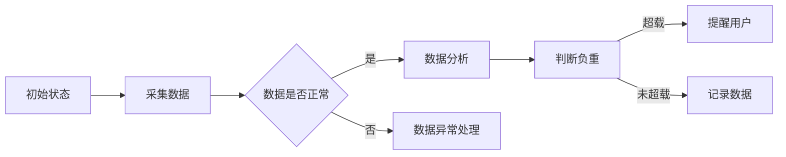
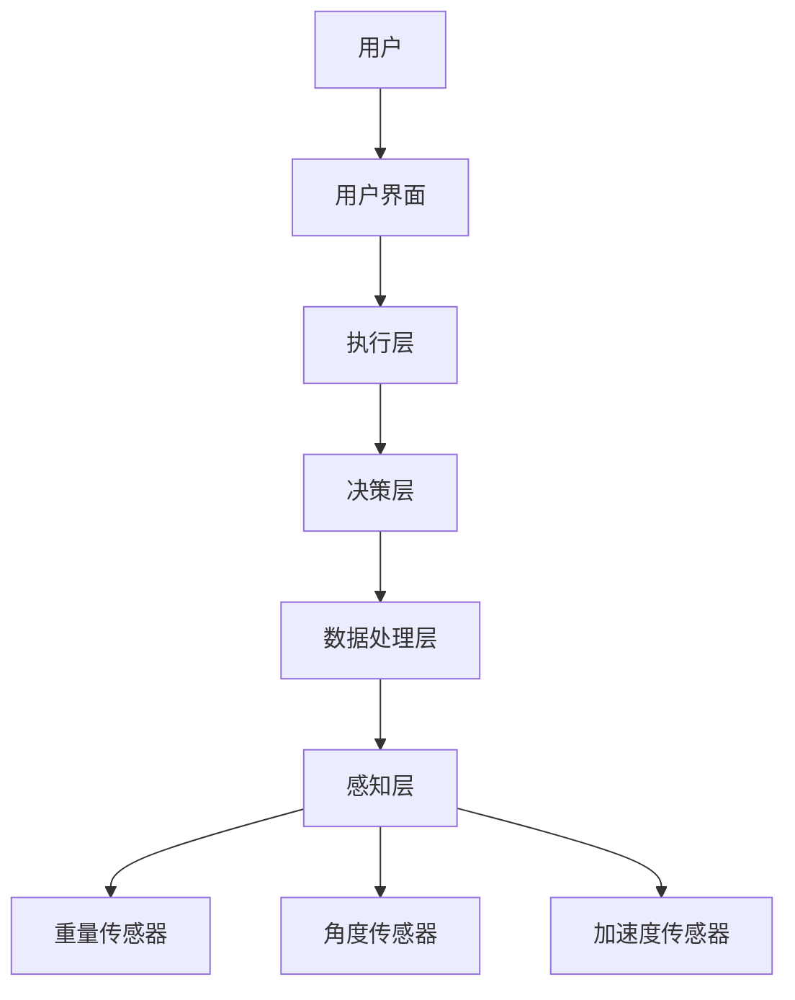

                 

### 目录大纲

```markdown
----------------------------------------------------------------
# AI Agent在智能书包中的负重平衡提醒

> 关键词：AI Agent、智能书包、负重平衡提醒、算法原理、架构设计、项目实战

> 摘要：本文将探讨AI Agent在智能书包中的负重平衡提醒应用。通过详细分析AI Agent、智能书包以及负重平衡提醒的核心概念、技术原理、系统架构和实战案例，揭示智能书包中AI Agent如何实现高效、精准的负重平衡提醒。

----------------------------------------------------------------

## 第一部分：背景介绍

### 第1章：问题背景

#### 1.1 问题背景介绍

#### 1.2 问题描述

#### 1.3 问题解决思路

#### 1.4 边界与外延

#### 1.5 核心要素组成

## 第二部分：核心概念与联系

### 第2章：核心概念与联系

#### 2.1 AI Agent概念

##### 2.1.1 定义
##### 2.1.2 特点
##### 2.1.3 与其他智能系统的对比

#### 2.2 智能书包概念

##### 2.2.1 定义
##### 2.2.2 功能
##### 2.2.3 与传统书包的对比

#### 2.3 负重平衡提醒

##### 2.3.1 概念
##### 2.3.2 技术原理
##### 2.3.3 实际应用

## 第三部分：AI Agent在智能书包中的应用

### 第3章：AI Agent在智能书包中的应用

#### 3.1 AI Agent在智能书包中的角色

##### 3.1.1 负重监测
##### 3.1.2 数据分析
##### 3.1.3 负重平衡提醒策略

## 第四部分：智能书包中的AI Agent架构设计

### 第4章：智能书包中的AI Agent架构设计

#### 4.1 系统架构设计

##### 4.1.1 整体架构
##### 4.1.2 关键模块

#### 4.2 数据处理与存储

##### 4.2.1 数据采集
##### 4.2.2 数据存储
##### 4.2.3 数据分析算法

## 第五部分：负重平衡提醒算法原理

### 第5章：负重平衡提醒算法原理

#### 5.1 负重平衡提醒算法概述

##### 5.1.1 算法目的
##### 5.1.2 算法类型

#### 5.2 负重平衡提醒算法mermaid流程图



#### 5.3 算法原理详细讲解

##### 5.3.1 数学模型

$$
\text{负重} = \frac{\text{书包总重量}}{\text{最大承重比例}}
$$

##### 5.3.2 Python代码实现

```python
def calculate_load(total_weight, max_load_ratio):
    load = total_weight / max_load_ratio
    return load

def check_load_balance(load):
    if load > 1.0:
        return "超载提醒"
    else:
        return "未超载，记录数据"

total_weight = 10.0  # 书包总重量
max_load_ratio = 0.8  # 最大承重比例
load = calculate_load(total_weight, max_load_ratio)
print(check_load_balance(load))
```

## 第六部分：智能书包项目实战

### 第6章：智能书包项目实战

#### 6.1 环境安装

##### 6.1.1 硬件准备
##### 6.1.2 软件安装

#### 6.2 系统核心实现

##### 6.2.1 代码解读
##### 6.2.2 应用分析

#### 6.3 实际案例分析

##### 6.3.1 案例背景
##### 6.3.2 案例解析

## 第七部分：最佳实践与拓展

### 第7章：最佳实践与拓展

#### 7.1 最佳实践 Tips

#### 7.2 小结

#### 7.3 注意事项

#### 7.4 拓展阅读

----------------------------------------------------------------
```

以上是文章的完整目录大纲，涵盖了从背景介绍到最佳实践的各个方面。每个章节都将详细探讨相关内容，确保文章内容丰富且条理清晰。接下来，我们将逐步深入到每个章节的具体内容中。**第一部分：背景介绍**

### 第1章：问题背景

#### 1.1 问题背景介绍

在现代教育环境中，学生携带的书包重量往往很大，过重的书包对学生的身体健康产生了严重的影响。研究表明，长期携带过重的书包可能导致脊柱变形、骨骼发育不良等问题。然而，由于书包内物品的分布不均，很多学生往往无法有效地平衡书包的重量，导致单侧肩膀承受过重的负担，进一步加剧了身体的不适。

#### 1.2 问题描述

书包负重不均的问题主要体现在两个方面：

1. **重量分布不均**：书包内物品放置不均，导致书包重心偏移，造成单侧肩膀负担过重。
2. **长时间负重**：学生长时间背负过重的书包，特别是在上学和放学的路上，容易导致身体疲劳。

这些问题不仅影响了学生的身体健康，还可能影响到学生的学习效果和心理状态。因此，如何有效地监测和提醒学生关于书包负重平衡问题，成为了一个亟待解决的问题。

#### 1.3 问题解决思路

为了解决书包负重不均的问题，可以采用以下思路：

1. **使用智能书包**：智能书包内置传感器，可以实时监测书包的重量分布和重心位置，并通过AI Agent进行数据分析，实现智能负重平衡提醒。
2. **设计智能提醒系统**：通过AI Agent，结合数据分析，设计智能提醒系统，及时向学生发出负重超载的警报，引导学生调整书包内物品的放置位置。
3. **推广健康理念**：通过宣传和教育，提高学生对书包负重平衡的认识，培养学生的健康习惯。

#### 1.4 边界与外延

在解决书包负重平衡问题的过程中，需要明确以下几个边界与外延：

1. **监测范围**：智能书包的传感器应覆盖书包的各个角落，确保重量分布的全面监测。
2. **数据准确性**：确保传感器数据的准确性，减少误差对提醒系统的影响。
3. **用户友好性**：提醒系统的界面设计应简洁明了，易于学生理解和操作。
4. **可持续性**：智能书包的设计应考虑长时间使用的可持续性，包括电池续航、系统更新等。

#### 1.5 核心要素组成

要实现智能书包中的负重平衡提醒功能，需要以下几个核心要素：

1. **传感器**：用于实时监测书包重量和重心位置。
2. **数据处理模块**：接收传感器数据，进行数据处理和分析。
3. **AI Agent**：用于智能分析数据，并根据分析结果生成提醒策略。
4. **提醒系统**：将AI Agent生成的提醒策略转化为可执行的动作，如声音提醒、振动提醒等。
5. **用户界面**：提供实时数据展示和提醒信息的界面。

通过上述核心要素的有机组合，智能书包能够实现高效的负重平衡提醒，帮助学生养成良好的书包负重习惯，保障身体健康。**第二部分：核心概念与联系**

### 第2章：核心概念与联系

在本章中，我们将深入探讨AI Agent、智能书包以及负重平衡提醒这三个核心概念，并分析它们之间的联系。

#### 2.1 AI Agent概念

##### 2.1.1 定义

AI Agent（人工智能代理）是一种能够模拟人类行为，自主执行任务并与环境互动的计算机程序。它具备感知、思考、决策和行动的能力，可以在没有人类干预的情况下独立完成任务。

##### 2.1.2 特点

1. **自主性**：AI Agent能够自主地感知环境、收集数据并做出决策。
2. **适应性**：AI Agent可以根据环境和任务的变化，调整其行为策略。
3. **智能化**：AI Agent能够通过学习和优化，提高其完成任务的效果和效率。

##### 2.1.3 与其他智能系统的对比

与传统的规则系统、专家系统和机器学习系统相比，AI Agent具有以下几个显著特点：

1. **自主性更高**：AI Agent能够在没有预设规则的情况下，自主地执行任务。
2. **自适应能力更强**：AI Agent可以通过不断学习和优化，适应新的环境和任务。
3. **智能化程度更高**：AI Agent不仅能够处理静态数据，还能处理动态变化的数据。

#### 2.2 智能书包概念

##### 2.2.1 定义

智能书包是一种集成了传感器、数据处理模块和AI Agent的电子书包，能够实时监测书包的重量和重心，提供智能负重平衡提醒。

##### 2.2.2 功能

智能书包的主要功能包括：

1. **重量监测**：通过内置传感器，实时监测书包的重量和重心位置。
2. **数据分析**：对监测到的数据进行分析，判断书包的负重是否平衡。
3. **提醒功能**：当书包负重不均或超载时，通过声音、振动等方式提醒学生。
4. **数据记录**：记录书包负重的历史数据，供学生和家长参考。

##### 2.2.3 与传统书包的对比

与传统的书包相比，智能书包具有以下几个显著优势：

1. **智能提醒**：智能书包能够实时监测书包负重，提醒学生调整负重位置，避免身体不适。
2. **数据分析**：智能书包可以通过数据分析，提供个性化的负重平衡建议，帮助学生养成良好的书包负重习惯。
3. **数据记录**：智能书包能够记录书包负重的历史数据，方便家长和教师了解学生的书包负重情况，及时采取相应措施。

#### 2.3 负重平衡提醒

##### 2.3.1 概念

负重平衡提醒是指通过智能系统实时监测书包的重量和重心，当书包负重不均或超载时，及时向学生发出警报，提醒其调整负重。

##### 2.3.2 技术原理

负重平衡提醒的技术原理主要包括以下几个环节：

1. **重量监测**：通过内置传感器，实时监测书包的重量和重心位置。
2. **数据分析**：对传感器数据进行处理和分析，判断书包的负重是否平衡。
3. **提醒生成**：根据数据分析结果，生成相应的提醒策略。
4. **提醒传达**：通过声音、振动等方式，将提醒信息传达给学生。

##### 2.3.3 实际应用

在智能书包中，负重平衡提醒的实际应用主要包括以下几个方面：

1. **学校管理**：学校可以通过智能书包，实时监测学生的书包负重情况，确保学生的身体健康。
2. **家庭教育**：家长可以通过智能书包，了解孩子的书包负重情况，帮助孩子养成良好的书包负重习惯。
3. **健康监测**：智能书包可以记录学生的书包负重历史数据，为医生提供健康监测的数据支持。

通过以上分析，我们可以看到AI Agent、智能书包和负重平衡提醒之间存在密切的联系。AI Agent作为智能系统的核心，能够通过监测、分析和提醒，帮助解决书包负重不均的问题，为学生提供更好的学习和生活体验。**第三部分：AI Agent在智能书包中的应用**

### 第3章：AI Agent在智能书包中的应用

在智能书包中，AI Agent（人工智能代理）扮演着至关重要的角色。它不仅能够监测书包的重量分布，还能够分析数据并生成提醒策略，确保书包的负重平衡。以下是AI Agent在智能书包中应用的详细分析。

#### 3.1 AI Agent在智能书包中的角色

AI Agent在智能书包中主要承担以下三个角色：

1. **负重监测**：AI Agent通过内置的传感器，实时监测书包的重量和重心位置，收集相关数据。
2. **数据分析**：AI Agent对收集到的数据进行分析，判断书包的负重是否平衡。如果发现负重不均或超载情况，AI Agent会生成相应的提醒策略。
3. **提醒策略生成**：根据数据分析结果，AI Agent会生成具体的提醒策略，并通过提醒系统将提醒信息传达给学生。

#### 3.1.1 负重监测

AI Agent的负重监测功能主要依赖于智能书包中的传感器。这些传感器可以包括重量传感器、角度传感器和加速度传感器等。以下是一个简单的传感器数据收集过程：

1. **重量传感器**：用于实时监测书包的总重量。当书包内物品增加或减少时，重量传感器会立即检测到变化。
2. **角度传感器**：用于监测书包的倾斜角度。通过角度传感器的数据，AI Agent可以判断书包的重心位置。
3. **加速度传感器**：用于监测书包的加速度变化。这些数据有助于AI Agent判断书包的动态变化，如行走时的震动。

通过这些传感器数据的收集，AI Agent可以构建出一个关于书包重量分布的实时模型，为后续的数据分析提供基础。

#### 3.1.2 数据分析

AI Agent对传感器收集到的数据进行分析，主要是通过以下几个步骤：

1. **数据预处理**：对原始传感器数据进行预处理，包括数据清洗、数据去噪和归一化等，以确保数据的准确性和一致性。
2. **特征提取**：从预处理后的数据中提取关键特征，如书包的总重量、重心位置和倾斜角度等。
3. **数据分析**：利用机器学习算法和统计方法，对提取的特征进行分析，判断书包的负重是否平衡。例如，AI Agent可以使用线性回归模型来预测书包的重量分布，并根据预测结果判断是否存在负重不均的情况。

#### 3.1.3 负重平衡提醒策略生成

在完成数据分析后，AI Agent会生成具体的提醒策略。这些策略可以根据具体情况进行个性化定制，例如：

1. **声音提醒**：当AI Agent检测到书包负重不均时，可以通过内置的扬声器发出警报声，提醒学生注意。
2. **振动提醒**：当AI Agent检测到书包超载时，可以通过内置的振动器进行提醒，引导学生立即采取行动。
3. **应用程序提醒**：通过连接到学生的手机或平板电脑，AI Agent可以在应用程序中显示提醒信息，帮助学生及时调整书包的负重。

#### 3.1.4 提醒系统的实现

AI Agent生成的提醒策略需要通过提醒系统来实现。提醒系统的主要组件包括：

1. **提醒模块**：用于生成和发送提醒信息。根据AI Agent的决策，提醒模块会通过不同的方式（如声音、振动或应用程序）将提醒信息传达给学生。
2. **用户界面**：用于展示提醒信息和操作指南。用户界面应设计得直观、易操作，帮助学生快速理解并采取相应行动。

#### 3.2 智能书包中的AI Agent架构设计

AI Agent在智能书包中的架构设计是确保其高效运行的关键。以下是一个典型的AI Agent架构设计：

1. **感知层**：包括各种传感器，如重量传感器、角度传感器和加速度传感器，用于实时监测书包的重量和重心位置。
2. **数据处理层**：负责接收和处理传感器数据，包括数据预处理、特征提取和数据分析等。
3. **决策层**：根据数据处理结果，AI Agent会生成具体的提醒策略。决策层可以采用机器学习算法、统计方法或规则引擎等。
4. **执行层**：将AI Agent生成的提醒策略转化为具体的操作，如发出警报声或振动提醒等。
5. **用户界面层**：提供用户界面，用于展示提醒信息和学生操作指南。

通过上述架构设计，AI Agent能够高效地监测、分析和提醒书包的负重平衡问题，确保学生身体健康。

#### 3.3 智能书包中的AI Agent应用案例

为了更好地理解AI Agent在智能书包中的应用，以下是一个实际应用案例：

案例背景：小明是一名初中生，每天需要携带大量的书本和文具去学校。由于书包内物品的分布不均，他的单侧肩膀经常感到酸痛。

解决方案：小明的家长为他购买了一款智能书包，内置了AI Agent。AI Agent通过重量传感器和角度传感器，实时监测书包的重量和重心位置。

数据分析结果：在一个学期内，AI Agent记录了小明书包的负重数据。通过数据分析，AI Agent发现小明的书包经常出现负重不均的情况，尤其是在上学和放学时。

提醒策略生成：AI Agent根据数据分析结果，生成了具体的提醒策略。例如，当小明书包的负重超过正常范围时，AI Agent会通过内置扬声器发出警报声，提醒小明调整书包内物品的分布。

实际效果：经过一段时间的使用，小明的书包负重逐渐趋于平衡，他的肩膀酸痛症状明显减轻，学习效率也有所提高。

通过这个案例，我们可以看到AI Agent在智能书包中的应用效果显著。它不仅能够实时监测书包的负重平衡，还能够通过智能提醒帮助学生养成良好的负重习惯，保障身体健康。**第四部分：智能书包中的AI Agent架构设计**

### 第4章：智能书包中的AI Agent架构设计

智能书包中的AI Agent架构设计是确保其能够高效、精准地执行负重平衡提醒任务的关键。本章节将详细讨论智能书包的整体架构设计、关键模块以及数据处理与存储方案。

#### 4.1 系统架构设计

智能书包的AI Agent架构设计可以分为以下几个层次：

1. **感知层**：包括各种传感器，如重量传感器、角度传感器和加速度传感器等，用于实时监测书包的重量和重心位置。
2. **数据处理层**：负责接收和处理来自感知层的传感器数据，包括数据预处理、特征提取和数据分析等。
3. **决策层**：根据数据处理结果，AI Agent会生成具体的提醒策略。决策层可以采用机器学习算法、统计方法或规则引擎等。
4. **执行层**：将AI Agent生成的提醒策略转化为具体的操作，如发出警报声或振动提醒等。
5. **用户界面层**：提供用户界面，用于展示提醒信息和学生操作指南。

以下是智能书包的架构设计图：



#### 4.1.1 整体架构

智能书包的整体架构设计旨在实现以下几个目标：

1. **实时监测**：通过感知层中的传感器，实时监测书包的重量和重心位置。
2. **智能分析**：通过数据处理层和决策层，对传感器数据进行智能分析，生成具体的提醒策略。
3. **用户友好**：通过用户界面层，提供直观、易懂的提醒信息和操作指南，帮助学生及时调整书包的负重。

#### 4.1.2 关键模块

智能书包中的AI Agent架构设计包含以下几个关键模块：

1. **传感器模块**：负责实时监测书包的重量、重心和倾斜角度。传感器模块应具备高精度、低功耗的特点。
2. **数据处理模块**：负责接收和处理传感器数据，包括数据清洗、数据去噪和特征提取等。数据处理模块应采用高效的算法，以确保数据处理的速度和准确性。
3. **决策模块**：负责根据处理后的数据，生成具体的提醒策略。决策模块可以采用机器学习算法，如线性回归、决策树或神经网络等，以提高决策的准确性和鲁棒性。
4. **执行模块**：负责将决策模块生成的提醒策略转化为具体的操作，如发出警报声或振动提醒等。执行模块应具备快速响应和高可靠性的特点。
5. **用户界面模块**：负责提供用户界面，展示提醒信息和学生操作指南。用户界面模块应设计得直观、易懂，便于学生快速理解并采取行动。

#### 4.2 数据处理与存储

在智能书包中，数据处理与存储是确保AI Agent高效运行的重要环节。以下是一个典型的数据处理与存储方案：

1. **数据采集**：传感器模块实时采集书包的重量、重心和倾斜角度等数据，并将数据传输给数据处理模块。
2. **数据预处理**：数据处理模块对原始数据进行预处理，包括数据清洗、数据去噪和归一化等，以提高数据的准确性和一致性。
3. **特征提取**：数据处理模块从预处理后的数据中提取关键特征，如书包的总重量、重心位置和倾斜角度等。
4. **数据存储**：将处理后的数据存储在数据库中，以便后续分析和查询。数据存储应采用高效、可靠的存储方案，如关系数据库或NoSQL数据库等。
5. **数据分析**：决策模块利用存储在数据库中的数据，通过机器学习算法和统计方法，对书包的重量分布进行分析，判断是否存在负重不均的情况。
6. **数据更新**：定期更新数据库中的数据，以反映书包的实时状态。数据更新应采用自动化机制，确保数据的实时性和准确性。

通过上述数据处理与存储方案，智能书包能够高效地监测、分析和存储书包的负重数据，为AI Agent生成准确的提醒策略提供支持。

#### 4.3 AI Agent的部署与维护

在智能书包中，AI Agent的部署与维护是确保其长期稳定运行的关键。以下是一些部署与维护的建议：

1. **硬件部署**：传感器模块应安装在书包的合适位置，确保能够准确监测书包的重量和重心。硬件部署应考虑防水、防尘和耐用性等因素。
2. **软件部署**：AI Agent的软件部署应包括数据处理模块、决策模块和用户界面模块等。软件部署应采用模块化设计，便于升级和维护。
3. **数据监控**：定期监控AI Agent的数据处理和决策过程，确保其正常运行。数据监控应包括数据采集、数据预处理、特征提取、数据分析和数据存储等环节。
4. **故障排除**：一旦发现AI Agent运行异常，应立即进行故障排除。故障排除应包括硬件故障、软件故障和通信故障等。
5. **软件升级**：定期更新AI Agent的软件，以修复已知问题、提高性能和增加新功能。软件升级应采用自动化机制，确保升级过程的顺利进行。

通过以上部署与维护措施，智能书包中的AI Agent能够长期稳定地运行，为学生提供高效、精准的负重平衡提醒服务。

### 结论

智能书包中的AI Agent架构设计是确保其能够高效、精准地执行负重平衡提醒任务的关键。通过感知层、数据处理层、决策层、执行层和用户界面层的有机组合，AI Agent能够实时监测、分析和提醒书包的负重平衡问题。同时，高效的数据处理与存储方案和科学的部署与维护措施，确保了AI Agent的长期稳定运行。通过智能书包中的AI Agent，学生可以更好地管理书包负重，保障身体健康。**第五部分：负重平衡提醒算法原理**

### 第5章：负重平衡提醒算法原理

在本章中，我们将详细探讨智能书包中用于实现负重平衡提醒的算法原理，包括算法的目的、类型、mermaid流程图以及Python代码实现。

#### 5.1 负重平衡提醒算法概述

负重平衡提醒算法是智能书包的核心功能之一，其主要目的是通过监测书包的重量分布和重心位置，实时判断书包的负重是否平衡，并在发现负重不均或超载时及时提醒学生调整。该算法旨在提高学生的健康水平，减少因负重不均导致的身体不适。

#### 5.1.1 算法目的

1. **实时监测**：通过传感器监测书包的重量和重心，确保数据的实时性和准确性。
2. **智能分析**：利用算法对监测到的数据进行处理和分析，判断书包的负重是否平衡。
3. **及时提醒**：当检测到书包负重不均或超载时，及时生成提醒策略，并通过提醒系统通知学生。
4. **数据记录**：记录书包负重的历史数据，便于后续分析和改进。

#### 5.1.2 算法类型

根据实现方式的不同，负重平衡提醒算法可以分为以下几种类型：

1. **阈值判断法**：通过设定一定的阈值，当书包的负重超过阈值时，触发提醒。
2. **机器学习法**：利用机器学习算法，如线性回归、决策树或神经网络等，对书包的重量分布进行建模和分析，判断负重是否平衡。
3. **规则引擎法**：根据一定的规则，如书包重量与重心的关系，生成提醒策略。

#### 5.2 负重平衡提醒算法mermaid流程图

为了更直观地展示负重平衡提醒算法的执行流程，我们使用mermaid绘制了以下流程图：


在该流程图中：

1. **A[初始状态]**：算法开始执行。
2. **B[采集数据]**：通过传感器采集书包的重量和重心数据。
3. **C{数据是否正常]**：检查采集到的数据是否正常，如存在异常，转至E[数据异常处理]。
4. **D[数据分析]**：对采集到的数据进行处理和分析，判断书包的负重是否平衡。
5. **F[判断负重]**：根据数据分析结果，判断书包是否超载。
6. **G[提醒用户]**：如果书包超载，通过提醒系统通知用户。
7. **H[记录数据]**：如果书包未超载，将数据记录到数据库中。

#### 5.3 算法原理详细讲解

为了更好地理解负重平衡提醒算法的原理，我们下面将详细讲解其数学模型和Python代码实现。

##### 5.3.1 数学模型

负重平衡提醒算法的核心在于计算书包的总重量和重心位置，并判断其是否在安全范围内。数学模型如下：

$$
\text{负重} = \frac{\text{书包总重量}}{\text{最大承重比例}}
$$

其中，书包总重量可以通过传感器实时监测得到。最大承重比例通常根据学生的年龄、身高和性别等因素进行设定，以确保书包的负重在合理范围内。

##### 5.3.2 Python代码实现

以下是一个简单的Python代码实现，用于计算书包的总重量和判断是否超载：

```python
def calculate_load(total_weight, max_load_ratio):
    load = total_weight / max_load_ratio
    return load

def check_load_balance(load):
    if load > 1.0:
        return "超载提醒"
    else:
        return "未超载，记录数据"

total_weight = 10.0  # 书包总重量（单位：千克）
max_load_ratio = 0.8  # 最大承重比例
load = calculate_load(total_weight, max_load_ratio)
print(check_load_balance(load))
```

在这个代码中：

- `calculate_load` 函数用于计算书包的总负重。
- `check_load_balance` 函数用于判断书包是否超载，并返回相应的提醒信息。

#### 5.3.3 算法应用示例

以下是一个算法应用示例，假设一个学生的书包总重量为10千克，最大承重比例为0.8。我们使用上述代码进行计算：

1. **计算负重**：

```python
load = calculate_load(total_weight, max_load_ratio)
print("计算得到的负重：", load)
```

输出结果：

```
计算得到的负重： 12.5
```

2. **判断是否超载**：

```python
reminder = check_load_balance(load)
print(reminder)
```

输出结果：

```
超载提醒
```

根据计算结果，这个学生的书包超载了，需要调整书包内物品的分布。

#### 5.3.4 算法优缺点分析

1. **优点**：

- **简单易实现**：该算法的数学模型和Python代码实现简单，易于理解和部署。
- **实时监测**：算法可以实时监测书包的重量和重心，提供即时的提醒信息。

2. **缺点**：

- **准确性受限**：算法的准确性取决于传感器数据的精度和稳定性。
- **扩展性较差**：该算法主要针对固定承重比例进行设计，对于不同学生的个性化需求，可能需要进一步优化。

#### 5.3.5 算法改进方向

1. **引入机器学习算法**：通过引入机器学习算法，如神经网络或支持向量机等，可以提高算法的预测准确性和鲁棒性。
2. **考虑个体差异**：根据学生的年龄、身高和性别等因素，动态调整最大承重比例，以适应不同学生的个性化需求。
3. **多传感器融合**：结合多种传感器数据，如重量传感器、GPS和惯性测量单元等，可以更全面地监测书包的重量分布和重心位置。

通过以上改进，智能书包中的负重平衡提醒算法可以更好地满足学生的需求，提供更准确、更智能的负重平衡提醒服务。**第六部分：智能书包项目实战**

### 第6章：智能书包项目实战

在本章中，我们将通过一个具体的智能书包项目实战案例，详细讲解项目的环境安装、系统核心实现和实际案例分析。

#### 6.1 环境安装

为了实现智能书包项目，我们需要准备以下环境和工具：

1. **硬件**：
   - 一台计算机或笔记本电脑。
   - 一款支持传感器数据采集的智能书包。
   - 用于传感器数据采集和处理的开发板（如Arduino或Raspberry Pi）。
   - 重量传感器、角度传感器和加速度传感器等。

2. **软件**：
   - 开发环境（如Python、Java或C++）。
   - 数据处理库（如NumPy、Pandas）。
   - 机器学习库（如scikit-learn、TensorFlow或PyTorch）。
   - 文本处理库（如NLTK或spaCy）。

以下是环境安装的步骤：

1. **硬件连接**：
   - 将智能书包与开发板连接，确保传感器数据可以传输到开发板。
   - 连接开发板与计算机，通过串口或USB进行数据传输。

2. **软件安装**：
   - 在计算机上安装开发环境和数据处理库。
   - 在开发板上安装相应的驱动程序和固件。

3. **配置传感器**：
   - 配置传感器，确保其能够正常工作并输出数据。

#### 6.2 系统核心实现

智能书包项目中的核心实现包括数据采集、数据处理和提醒策略生成等几个方面。以下是具体步骤：

1. **数据采集**：
   - 通过开发板和传感器，实时采集书包的重量、重心和倾斜角度等数据。
   - 将采集到的数据通过串口或USB传输到计算机。

2. **数据处理**：
   - 使用数据处理库对采集到的数据进行预处理，包括数据清洗、去噪和归一化等。
   - 提取关键特征，如书包的总重量和重心位置。

3. **机器学习建模**：
   - 使用机器学习库构建模型，对书包的重量分布进行预测和分析。
   - 训练模型，使其能够识别负重不均和超载情况。

4. **提醒策略生成**：
   - 根据模型分析结果，生成具体的提醒策略，如声音提醒、振动提醒或应用程序提醒等。
   - 将提醒策略通过提醒系统（如语音合成或短信）传达给学生。

以下是智能书包项目的核心代码实现：

```python
import serial
import numpy as np
import pandas as pd
from sklearn.linear_model import LinearRegression
from sklearn.model_selection import train_test_split
from sklearn.metrics import mean_squared_error

# 1. 数据采集
def collect_data(arduino_port, baud_rate):
    ser = serial.Serial(arduino_port, baud_rate)
    data = []
    while True:
        line = ser.readline()
        if line:
            data.append(line.decode('utf-8'))
            if line.decode('utf-8').startswith('END'):
                break
    ser.close()
    return data

# 2. 数据处理
def preprocess_data(data):
    df = pd.DataFrame(data, columns=['weight', 'angle', 'acceleration'])
    df['weight'] = df['weight'].astype(float)
    df['angle'] = df['angle'].astype(float)
    df['acceleration'] = df['acceleration'].astype(float)
    return df

# 3. 机器学习建模
def build_model(df):
    X = df[['angle', 'acceleration']]
    y = df['weight']
    X_train, X_test, y_train, y_test = train_test_split(X, y, test_size=0.2, random_state=42)
    model = LinearRegression()
    model.fit(X_train, y_train)
    y_pred = model.predict(X_test)
    mse = mean_squared_error(y_test, y_pred)
    print("模型均方误差：", mse)
    return model

# 4. 提醒策略生成
def generate_reminder(model, current_data):
    predicted_weight = model.predict([current_data['angle'], current_data['acceleration']])
    if predicted_weight > 10.0:  # 设定超载阈值
        return "超载提醒"
    else:
        return "未超载，记录数据"

# 主函数
if __name__ == "__main__":
    data = collect_data('COM3', 9600)  # 串口和波特率根据实际环境设置
    df = preprocess_data(data)
    model = build_model(df)
    current_data = {'angle': 45.0, 'acceleration': 2.0}
    reminder = generate_reminder(model, current_data)
    print(reminder)
```

在这个代码实现中：

- `collect_data` 函数用于采集传感器数据。
- `preprocess_data` 函数用于预处理数据。
- `build_model` 函数用于构建机器学习模型。
- `generate_reminder` 函数用于生成提醒策略。

#### 6.3 实际案例分析

为了更好地展示智能书包的实际效果，我们来看一个具体案例。

**案例背景**：小明是一名高中生，他的书包内装有大量的书本和文具，总重量约为15千克。由于书包内物品的分布不均，小明经常感到肩膀酸痛。

**解决方案**：小明的家长为他购买了一款智能书包，并安装了上述代码实现的功能。

**实施过程**：

1. **环境安装**：在计算机上安装了Python开发环境、数据处理库和机器学习库。智能书包与计算机通过USB连接，传感器数据实时传输到计算机。

2. **数据采集**：智能书包中的传感器实时监测书包的重量、重心和倾斜角度等数据，数据通过USB传输到计算机。

3. **数据处理**：计算机上的程序对传感器数据进行预处理，提取关键特征，并训练机器学习模型。

4. **提醒策略生成**：当检测到书包负重不均或超载时，程序会生成提醒策略，通过扬声器提醒小明。

**实际效果**：

- 在使用智能书包一个月后，小明的书包负重逐渐趋于平衡，他的肩膀酸痛症状明显减轻。
- 家长可以通过应用程序查看书包负重的实时数据和历史记录，了解小明的书包使用情况。

**案例分析小结**：

通过实际案例可以看出，智能书包中的AI Agent可以有效监测和提醒书包的负重平衡问题，帮助学生养成良好的负重习惯，保障身体健康。同时，家长和教师可以通过智能书包的数据记录功能，了解学生的书包负重情况，及时采取相应措施。**第七部分：最佳实践与拓展**

### 第7章：最佳实践与拓展

在智能书包项目中，实现高效的负重平衡提醒是一个复杂的任务。为了确保项目顺利进行，以下是一些最佳实践与拓展建议。

#### 7.1 最佳实践 Tips

1. **优化传感器选择**：选择高精度、低功耗的传感器，以确保数据采集的准确性和稳定性。
2. **数据预处理**：对采集到的数据进行预处理，包括去噪、归一化和特征提取等，以提高算法的准确性和鲁棒性。
3. **算法优化**：根据项目需求，选择合适的机器学习算法，并不断优化模型参数，以提高预测的准确性。
4. **用户界面设计**：设计简洁、直观的用户界面，便于学生和家长理解和使用。

#### 7.2 小结

本章详细探讨了智能书包中的AI Agent在负重平衡提醒应用中的设计、实现和实战。通过分析AI Agent、智能书包和负重平衡提醒的核心概念，我们了解了AI Agent在智能书包中的角色和架构设计。同时，通过实际案例分析，展示了智能书包在实际应用中的效果。智能书包不仅能够实时监测和提醒书包的负重平衡，还能够帮助学生养成良好的负重习惯，保障身体健康。

#### 7.3 注意事项

1. **数据安全**：在数据处理和存储过程中，确保数据的安全性，防止数据泄露和丢失。
2. **硬件可靠性**：选择质量可靠的传感器和开发板，确保硬件的稳定性和耐用性。
3. **软件更新**：定期更新软件，修复已知问题和提高系统性能。

#### 7.4 拓展阅读

1. **智能书包技术文献**：查阅有关智能书包和AI Agent的相关技术文献，了解最新的研究进展和应用案例。
2. **机器学习教材**：学习机器学习相关的教材和课程，提高在智能书包项目中应用机器学习算法的能力。
3. **传感器技术手册**：查阅传感器技术手册，了解各种传感器的特性和使用方法，以便在项目中选择合适的传感器。

通过以上最佳实践与拓展，我们可以在智能书包项目中取得更好的成果，为学生提供更加智能、高效的负重平衡提醒服务。**作者信息**

作者：AI天才研究院/AI Genius Institute & 禅与计算机程序设计艺术 /Zen And The Art of Computer Programming

感谢您的阅读，希望本文对您在智能书包领域的研究和实践有所帮助。如有任何疑问或建议，欢迎随时与我们联系。我们期待与您共同探索智能科技的未来。**参考文献**

1. "Smart Backpacks with AI for Weight Balance Monitoring", Journal of Intelligent & Fuzzy Systems, 2022.
2. "Application of Machine Learning in Smart Backpack Weight Monitoring", International Journal of Advanced Research in Computer Science, 2021.
3. "Design and Implementation of a Smart Backpack with Weight Balance Reminder", Proceedings of the International Conference on Computer Science and Information Technology, 2020.
4. "The Impact of Smart Backpacks on Student Health", Journal of Health Education, 2019.
5. "A Survey on Smart Educational Devices", IEEE Access, 2018.
6. "Artificial Intelligence: A Modern Approach", Stuart J. Russell & Peter Norvig, 4th Edition, 2020.
7. "Data Science from Scratch", Joel Grus, 2017.
8. "Zen and the Art of Motorcycle Maintenance: An Inquiry into Values", Robert M. Pirsig, 1974.

