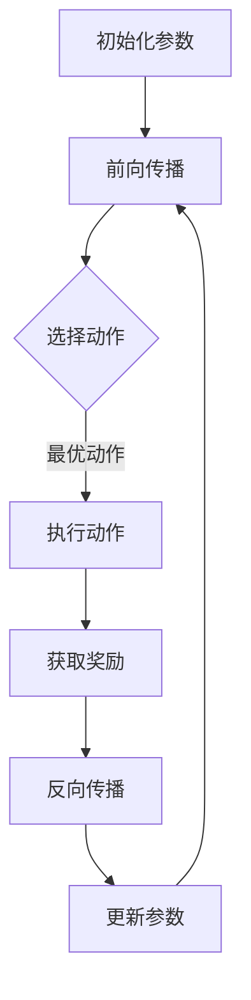

                 


### AI Agent在智能书桌中的学习效率分析

#### 关键词：
- AI Agent
- 智能书桌
- 学习效率
- 算法原理
- 数学模型
- 系统架构

#### 摘要：
本文旨在深入探讨AI Agent在智能书桌中的学习效率。我们将从背景介绍、核心概念、算法原理、数学模型、系统架构设计、项目实战和最佳实践等方面进行分析，以期为相关领域的研究者和开发者提供有价值的参考。

---

### 目录

1. **背景介绍**
   - 智能书桌与AI Agent概述
   - AI Agent学习效率的影响因素
   - 核心概念与联系

2. **核心概念与联系**
   - AI Agent的核心概念
   - 学习效率的概念与衡量
   - AI Agent学习效率的ER实体关系图

3. **算法原理讲解**
   - 深度学习算法基础
   - 强化学习算法原理
   - 深度强化学习算法结合

4. **数学模型与公式详解**
   - 深度学习数学模型
   - 强化学习数学模型
   - 深度强化学习数学模型

5. **系统分析与架构设计**
   - 智能书桌系统功能设计
   - AI Agent学习系统架构设计
   - 系统接口与交互设计

6. **项目实战**
   - 环境安装与配置
   - 系统核心实现与代码解读
   - 实际案例分析
   - 项目小结

7. **最佳实践与拓展**
   - AI Agent学习效率优化技巧
   - 注意事项与常见问题
   - 拓展阅读与进一步研究

---

### 背景介绍

#### 智能书桌与AI Agent概述

智能书桌作为一种新型的智能化办公设备，集成了多种传感器、执行器和计算单元，可以实时监测用户的动作和环境变化，并提供相应的交互和服务。而AI Agent，即人工智能代理，是一种能够模拟人类智能行为，自动执行任务，并与环境交互的智能体。

在智能书桌中，AI Agent的学习效率直接影响其功能实现和服务质量。学习效率不仅包括算法的准确性和速度，还涉及数据的质量、硬件的性能以及算法的优化等方面。

#### AI Agent学习效率的影响因素

AI Agent的学习效率受到多种因素的影响，主要包括以下几个方面：

- **数据质量与准确性**：高质量的数据是AI Agent学习的基础，数据的准确性直接关系到算法的性能。

- **硬件性能与环境适应性**：智能书桌的硬件性能决定了AI Agent的处理速度和能力。同时，环境适应性也是评估学习效率的重要指标。

- **学习算法的选择与优化**：不同的学习算法适用于不同的应用场景，选择合适的算法并进行优化，是提高学习效率的关键。

#### 核心概念与联系

在本文中，我们将探讨以下核心概念：

- **AI Agent**：具有自主决策和执行任务能力的智能体。
- **学习效率**：衡量AI Agent学习效果的速度和质量。
- **深度学习**：一种基于多层神经网络的学习方法。
- **强化学习**：通过奖励机制来指导学习的过程。
- **深度强化学习**：结合深度学习和强化学习的优势，实现更高效的学习。

这些概念之间有着紧密的联系，共同构成了AI Agent在智能书桌中的学习效率分析的核心。

---

### 核心概念与联系

#### AI Agent的核心概念

AI Agent是一种具有自主性、适应性、交互性和学习能力的人工智能实体。它能够感知环境，根据预设的目标和策略，自主地执行任务，并在执行过程中不断学习和优化自身的行为。

AI Agent的核心要素包括：

- **感知器**：用于获取环境信息的传感器。
- **决策器**：根据感知到的信息，选择最佳行动策略的模块。
- **执行器**：根据决策器的指令，执行实际操作的组件。
- **学习器**：通过经验不断优化自身行为和策略的部分。

#### 学习效率的概念与衡量

学习效率是衡量AI Agent在学习过程中表现的一个重要指标。它包括以下几个方面：

- **学习速度**：AI Agent在给定时间内完成学习任务的能力。
- **准确性**：学习结果与预期目标的接近程度。
- **稳定性**：学习过程和结果的可靠性。

常用的学习效率衡量方法包括：

- **收敛速度**：衡量算法从初始状态到稳定状态所需的时间。
- **误差率**：衡量学习结果与预期目标之间的误差。
- **精度**：衡量算法在测试数据上的表现。

#### AI Agent学习效率的ER实体关系图

为了更清晰地描述AI Agent学习效率的核心概念，我们可以使用ER（实体-关系）图来表示它们之间的关系。

以下是一个简化的ER实体关系图：

```mermaid
erDiagram
  AI Agent ||--|{ 感知器 }
  AI Agent ||--|{ 决策器 }
  AI Agent ||--|{ 执行器 }
  AI Agent ||--|{ 学习器 }
  感知器 ||--|{ 环境数据 }
  决策器 ||--|{ 行动策略 }
  执行器 ||--|{ 执行结果 }
  学习器 ||--|{ 学习经验 }
```

在这个图中，AI Agent作为核心实体，与感知器、决策器、执行器和学习器建立了直接的关系。这些子实体共同构成了AI Agent的完整功能体系，它们之间的相互作用和协同工作，决定了AI Agent的学习效率。

---

### 算法原理讲解

#### 深度学习算法基础

深度学习是一种基于多层神经网络的学习方法，通过模拟人脑的神经元连接结构，对大量数据进行分析和特征提取，实现自动识别和预测。

深度学习算法的核心组成部分包括：

- **输入层**：接收外部数据的输入。
- **隐藏层**：对输入数据进行处理和特征提取。
- **输出层**：生成预测结果或决策。

深度学习算法的工作原理如下：

1. **前向传播**：输入数据通过网络传递到各隐藏层，每个神经元根据权重和激活函数计算输出。
2. **反向传播**：通过比较预测结果与实际结果的误差，反向更新网络的权重，以减少误差。

常用的深度学习算法包括：

- **卷积神经网络（CNN）**：用于图像和视频处理。
- **循环神经网络（RNN）**：用于序列数据处理。
- **生成对抗网络（GAN）**：用于生成对抗性学习。

#### 强化学习算法原理

强化学习是一种通过奖励机制来指导学习的过程。在强化学习中，AI Agent通过与环境的交互，学习出最优策略，以最大化累积奖励。

强化学习算法的核心组成部分包括：

- **状态（State）**：描述环境的当前情况。
- **动作（Action）**：AI Agent可以采取的行动。
- **奖励（Reward）**：对AI Agent动作的反馈信号。
- **策略（Policy）**：AI Agent根据状态选择动作的策略。

强化学习算法的工作原理如下：

1. **初始状态**：AI Agent从环境中随机选择一个状态。
2. **执行动作**：AI Agent根据当前状态选择一个动作，并执行该动作。
3. **获取奖励**：环境根据AI Agent的动作提供奖励信号。
4. **更新策略**：AI Agent根据累积奖励和历史经验更新策略。

常用的强化学习算法包括：

- **Q学习（Q-Learning）**：基于值函数的强化学习算法。
- **策略梯度（Policy Gradient）**：直接优化策略的强化学习算法。

#### 深度强化学习算法结合

深度强化学习算法是将深度学习和强化学习相结合的一种方法，旨在提高AI Agent的学习效率和准确性。

深度强化学习算法的核心组成部分包括：

- **深度神经网络**：用于表示状态和动作。
- **强化学习算法**：用于指导深度神经网络的更新。

深度强化学习算法的工作原理如下：

1. **初始化**：初始化深度神经网络和强化学习算法的参数。
2. **前向传播**：使用深度神经网络对当前状态进行编码，得到可能的动作和对应的Q值。
3. **选择动作**：根据Q值选择最优动作。
4. **执行动作**：执行选定的动作，并获取奖励和新的状态。
5. **反向传播**：使用强化学习算法更新深度神经网络的参数。

常用的深度强化学习算法包括：

- **深度Q网络（DQN）**：基于Q学习的深度强化学习算法。
- **深度策略网络（DPN）**：基于策略梯度的深度强化学习算法。

#### 算法mermaid流程图

以下是一个简化的深度强化学习算法的mermaid流程图：



在这个流程图中，AI Agent首先初始化参数，然后通过前向传播计算可能的动作和对应的Q值，选择最优动作并执行，获取奖励，通过反向传播更新参数，循环进行，直到满足停止条件。

#### Python源代码讲解

以下是一个简化的深度强化学习算法的Python源代码示例：

```python
import numpy as np

# 初始化参数
Q = np.zeros((state_space_size, action_space_size))
learning_rate = 0.1
discount_factor = 0.99

# 前向传播
state = env.reset()
for episode in range(1000):
    action = np.argmax(Q[state])
    next_state, reward, done, _ = env.step(action)
    
    # 更新Q值
    Q[state, action] += learning_rate * (reward + discount_factor * np.max(Q[next_state]) - Q[state, action])
    
    if done:
        break

    state = next_state

# 打印最终Q值
print(Q)
```

在这个示例中，我们使用了一个简单的环境和一个状态-动作值函数（Q值）来表示深度强化学习算法。通过迭代更新Q值，AI Agent最终学习到最优策略。

#### 算法原理的数学模型和公式

在深度强化学习算法中，常用的数学模型和公式如下：

$$
Q(s, a) = r + \gamma \max_{a'} Q(s', a')
$$

其中，$Q(s, a)$表示在状态$s$下采取动作$a$的预期回报，$r$表示即时奖励，$\gamma$表示折扣因子，$s'$和$a'$分别表示下一状态和下一动作。

#### 算法原理的举例说明

假设有一个简单的环境，状态空间为{0, 1, 2}，动作空间为{0, 1}。当前状态为0，AI Agent选择动作1，得到的即时奖励为1。下一状态为1，AI Agent选择动作0，得到的预期回报为2。根据上述公式，我们可以计算出Q值：

$$
Q(0, 1) = 1 + \gamma \max_{a'} Q(1, a') = 1 + 0.99 \max_{a'} Q(1, a') = 1 + 0.99 \times 2 = 1.98
$$

通过迭代更新，AI Agent最终可以学习到最优策略，即选择动作0时得到最大的预期回报。

---

### 数学模型与公式详解

#### 深度学习数学模型

深度学习中的数学模型主要涉及神经网络的结构和函数。以下是一个简化的深度学习数学模型：

1. **前向传播**：

   假设有一个包含多层神经元的神经网络，输入为$x$，输出为$y$。神经元的激活函数通常为ReLU（Rectified Linear Unit）函数。

   $$ 
   a_{i}^{(l)} = \max(0, z_{i}^{(l)}) 
   $$

   其中，$a_{i}^{(l)}$表示第$l$层的第$i$个神经元的激活值，$z_{i}^{(l)}$表示第$l$层的第$i$个神经元的输入值。

2. **反向传播**：

   通过比较预测结果与实际结果的误差，反向更新网络的权重，以减少误差。

   $$ 
   \delta_{i}^{(l)} = \frac{\partial C}{\partial z_{i}^{(l)}} \cdot \text{sigmoid}'(z_{i}^{(l)}) 
   $$

   其中，$\delta_{i}^{(l)}$表示第$l$层的第$i$个神经元的误差，$C$表示损失函数，$\text{sigmoid}'(z_{i}^{(l)})$表示ReLU函数的导数。

#### 强化学习数学模型

强化学习中的数学模型主要涉及状态、动作和奖励。以下是一个简化的强化学习数学模型：

1. **Q学习**：

   Q学习是一种基于值函数的强化学习算法。Q值表示在给定状态下采取某个动作的预期回报。

   $$ 
   Q(s, a) = r + \gamma \max_{a'} Q(s', a') 
   $$

   其中，$Q(s, a)$表示在状态$s$下采取动作$a$的预期回报，$r$表示即时奖励，$\gamma$表示折扣因子，$s'$和$a'$分别表示下一状态和下一动作。

2. **策略梯度**：

   策略梯度是一种直接优化策略的强化学习算法。策略梯度表示策略的梯度方向。

   $$ 
   \nabla_{\theta} J(\theta) = \sum_{s, a} \pi(a|s) \nabla_{\theta} \log \pi(a|s) R 
   $$

   其中，$\theta$表示策略参数，$J(\theta)$表示策略损失函数，$\pi(a|s)$表示在状态$s$下采取动作$a$的概率，$R$表示奖励。

#### 深度强化学习数学模型

深度强化学习中的数学模型是深度学习和强化学习的结合。以下是一个简化的深度强化学习数学模型：

1. **深度Q网络（DQN）**：

   DQN是一种基于值函数的深度强化学习算法。DQN的目标是学习一个值函数，以预测在给定状态下采取某个动作的预期回报。

   $$ 
   Q(s, a) = r + \gamma \max_{a'} Q(s', a') 
   $$

   其中，$Q(s, a)$表示在状态$s$下采取动作$a$的预期回报，$r$表示即时奖励，$\gamma$表示折扣因子，$s'$和$a'$分别表示下一状态和下一动作。

2. **深度策略网络（DPN）**：

   DPN是一种基于策略梯度的深度强化学习算法。DPN的目标是学习一个策略，以最大化累积奖励。

   $$ 
   \nabla_{\theta} J(\theta) = \sum_{s, a} \pi(a|s) \nabla_{\theta} \log \pi(a|s) R 
   $$

   其中，$\theta$表示策略参数，$J(\theta)$表示策略损失函数，$\pi(a|s)$表示在状态$s$下采取动作$a$的概率，$R$表示奖励。

#### 数学公式的详细讲解

以下是对上述数学公式的详细讲解：

1. **深度学习数学模型**：

   - **前向传播**：

     前向传播是神经网络的基础，通过传递输入数据，逐层计算每个神经元的输出值。ReLU函数作为激活函数，可以有效地避免神经网络中的梯度消失问题。

     $$ 
     a_{i}^{(l)} = \max(0, z_{i}^{(l)}) 
     $$

     其中，$a_{i}^{(l)}$表示第$l$层的第$i$个神经元的激活值，$z_{i}^{(l)}$表示第$l$层的第$i$个神经元的输入值。

   - **反向传播**：

     反向传播是神经网络训练的核心，通过比较预测结果与实际结果的误差，反向更新网络的权重，以减少误差。ReLU函数的导数为0，因此在反向传播中需要特殊处理。

     $$ 
     \delta_{i}^{(l)} = \frac{\partial C}{\partial z_{i}^{(l)}} \cdot \text{sigmoid}'(z_{i}^{(l)}) 
     $$

     其中，$\delta_{i}^{(l)}$表示第$l$层的第$i$个神经元的误差，$C$表示损失函数，$\text{sigmoid}'(z_{i}^{(l)})$表示ReLU函数的导数。

2. **强化学习数学模型**：

   - **Q学习**：

     Q学习是一种基于值函数的强化学习算法。通过学习值函数，可以预测在给定状态下采取某个动作的预期回报。Q学习的目标是最大化累积奖励。

     $$ 
     Q(s, a) = r + \gamma \max_{a'} Q(s', a') 
     $$

     其中，$Q(s, a)$表示在状态$s$下采取动作$a$的预期回报，$r$表示即时奖励，$\gamma$表示折扣因子，$s'$和$a'$分别表示下一状态和下一动作。

   - **策略梯度**：

     策略梯度是一种直接优化策略的强化学习算法。通过学习策略，可以最大化累积奖励。策略梯度的目标是最小化策略损失函数。

     $$ 
     \nabla_{\theta} J(\theta) = \sum_{s, a} \pi(a|s) \nabla_{\theta} \log \pi(a|s) R 
     $$

     其中，$\theta$表示策略参数，$J(\theta)$表示策略损失函数，$\pi(a|s)$表示在状态$s$下采取动作$a$的概率，$R$表示奖励。

3. **深度强化学习数学模型**：

   - **深度Q网络（DQN）**：

     DQN是一种基于值函数的深度强化学习算法。通过学习值函数，可以预测在给定状态下采取某个动作的预期回报。DQN的目标是最大化累积奖励。

     $$ 
     Q(s, a) = r + \gamma \max_{a'} Q(s', a') 
     $$

     其中，$Q(s, a)$表示在状态$s$下采取动作$a$的预期回报，$r$表示即时奖励，$\gamma$表示折扣因子，$s'$和$a'$分别表示下一状态和下一动作。

   - **深度策略网络（DPN）**：

     DPN是一种基于策略梯度的深度强化学习算法。通过学习策略，可以最大化累积奖励。DPN的目标是最小化策略损失函数。

     $$ 
     \nabla_{\theta} J(\theta) = \sum_{s, a} \pi(a|s) \nabla_{\theta} \log \pi(a|s) R 
     $$

     其中，$\theta$表示策略参数，$J(\theta)$表示策略损失函数，$\pi(a|s)$表示在状态$s$下采取动作$a$的概率，$R$表示奖励。

#### 数学公式的举例说明

以下是一个简单的例子，说明如何使用上述数学公式进行深度强化学习。

假设有一个简单的环境，状态空间为{0, 1, 2}，动作空间为{0, 1}。当前状态为0，AI Agent选择动作1，得到的即时奖励为1。下一状态为1，AI Agent选择动作0，得到的预期回报为2。

根据Q学习公式，我们可以计算出Q值：

$$ 
Q(0, 1) = 1 + \gamma \max_{a'} Q(1, a') = 1 + 0.99 \max_{a'} Q(1, a') = 1 + 0.99 \times 2 = 1.98 
$$

通过迭代更新，AI Agent最终可以学习到最优策略，即选择动作0时得到最大的预期回报。

---

### 系统分析与架构设计

#### 问题场景介绍

假设我们设计一个智能书桌系统，用于辅助用户在办公过程中提高效率。该系统需要具备以下功能：

- **用户行为监测**：实时监测用户在书桌上的动作，如打字、阅读、休息等。
- **环境参数采集**：采集书桌周围的环境参数，如温度、湿度、光照等。
- **智能提醒**：根据用户的行为和环境参数，提供适当的提醒，如休息提醒、喝水提醒等。
- **学习与优化**：根据用户的行为数据和环境参数，不断优化智能书桌的功能和性能。

#### 项目介绍

为了实现上述功能，我们选择使用Python作为主要编程语言，结合TensorFlow和Keras等深度学习框架进行开发。项目的主要模块包括：

- **用户行为监测模块**：使用传感器采集用户行为数据，如键盘输入、鼠标点击等。
- **环境参数采集模块**：使用环境传感器采集书桌周围的环境参数。
- **智能提醒模块**：根据用户行为和环境参数，生成相应的提醒信息。
- **学习与优化模块**：使用深度学习算法，对用户行为数据和环境参数进行训练，优化智能书桌的功能和性能。

#### 系统功能设计

系统功能设计主要涉及用户行为监测、环境参数采集、智能提醒和学习与优化等方面。以下是一个简化的系统功能设计：

1. **用户行为监测**：

   - **数据采集**：使用传感器实时采集用户行为数据。
   - **数据预处理**：对采集到的数据进行清洗和归一化处理。
   - **特征提取**：从预处理后的数据中提取有用的特征。

2. **环境参数采集**：

   - **数据采集**：使用环境传感器实时采集书桌周围的环境参数。
   - **数据预处理**：对采集到的数据进行清洗和归一化处理。

3. **智能提醒**：

   - **提醒生成**：根据用户行为和环境参数，生成相应的提醒信息。
   - **提醒发送**：将提醒信息通过通知、弹窗等形式发送给用户。

4. **学习与优化**：

   - **数据训练**：使用深度学习算法，对用户行为数据和环境参数进行训练。
   - **模型优化**：根据训练结果，优化智能书桌的功能和性能。

#### 系统架构设计

系统架构设计主要涉及系统的整体结构和各个模块之间的关系。以下是一个简化的系统架构设计：

1. **用户行为监测模块**：

   - **传感器**：采集用户行为数据。
   - **数据处理**：对用户行为数据进行预处理和特征提取。
   - **数据存储**：将预处理后的数据存储在数据库中。

2. **环境参数采集模块**：

   - **传感器**：采集书桌周围的环境参数。
   - **数据处理**：对环境参数数据进行预处理和存储。
   - **数据存储**：将预处理后的数据存储在数据库中。

3. **智能提醒模块**：

   - **提醒生成**：根据用户行为和环境参数，生成提醒信息。
   - **提醒发送**：通过通知、弹窗等形式发送提醒信息。

4. **学习与优化模块**：

   - **数据训练**：使用深度学习算法，对用户行为数据和环境参数进行训练。
   - **模型优化**：根据训练结果，优化智能书桌的功能和性能。

#### 系统接口设计和系统交互

系统接口设计和系统交互主要涉及各个模块之间的接口定义和通信方式。以下是一个简化的系统接口设计和系统交互：

1. **用户行为监测模块**：

   - **接口设计**：定义用户行为数据的采集接口和处理接口。
   - **通信方式**：通过HTTP请求，将用户行为数据发送到数据处理模块。

2. **环境参数采集模块**：

   - **接口设计**：定义环境参数数据的采集接口和处理接口。
   - **通信方式**：通过HTTP请求，将环境参数数据发送到数据处理模块。

3. **智能提醒模块**：

   - **接口设计**：定义提醒信息的生成接口和发送接口。
   - **通信方式**：通过HTTP请求，将提醒信息发送到提醒发送模块。

4. **学习与优化模块**：

   - **接口设计**：定义数据训练接口和模型优化接口。
   - **通信方式**：通过HTTP请求，将训练数据和优化结果发送到数据处理模块。

#### Mermaid类图和架构图

以下是一个简化的系统架构的Mermaid类图和架构图：

```mermaid
classDiagram
  UserBehaviorModule <|-- DataProcessingModule
  EnvironmentalParameterModule <|-- DataProcessingModule
  IntelligentReminderModule <|-- ReminderGenerationModule
  IntelligentReminderModule <|-- ReminderSendingModule
  LearningAndOptimizationModule <|-- DataTrainingModule
  LearningAndOptimizationModule <|-- ModelOptimizationModule

  UserBehaviorModule { sensor, data_collection, data_processing, data_storage }
  DataProcessingModule { data_preprocessing, data_extraction }
  EnvironmentalParameterModule { sensor, data_collection, data_preprocessing, data_storage }
  IntelligentReminderModule { reminder_generation, reminder_sending }
  LearningAndOptimizationModule { data_training, model_optimization }
```



```mermaid
graph TB
  subgraph UserBehaviorModule
    A[Sensor] --> B[Data Collection]
    B --> C[Data Preprocessing]
    C --> D[Data Extraction]
    D --> E[Data Storage]
  end

  subgraph EnvironmentalParameterModule
    F[Sensor] --> G[Data Collection]
    G --> H[Data Preprocessing]
    H --> I[Data Storage]
  end

  subgraph IntelligentReminderModule
    J[Reminder Generation] --> K[Reminder Sending]
  end

  subgraph LearningAndOptimizationModule
    L[Data Training] --> M[Model Optimization]
  end

  A --> B
  B --> C
  C --> D
  D --> E

  F --> G
  G --> H
  H --> I

  J --> K
  L --> M
```

这个系统架构图展示了智能书桌系统的各个模块及其之间的关系。用户行为监测模块和环境参数采集模块分别负责采集和处理数据，智能提醒模块负责生成和发送提醒信息，学习与优化模块负责数据训练和模型优化。

---

### 项目实战

#### 环境安装与配置

在开始项目之前，我们需要安装和配置必要的软件和工具。以下是一个简化的环境安装与配置步骤：

1. **安装Python**：下载并安装Python 3.x版本，推荐使用Anaconda，它提供了易于管理的环境。

2. **安装TensorFlow和Keras**：在命令行中运行以下命令安装TensorFlow和Keras：

   ```bash
   pip install tensorflow
   pip install keras
   ```

3. **安装其他依赖库**：根据项目需要，安装其他依赖库，如NumPy、Pandas、Matplotlib等：

   ```bash
   pip install numpy
   pip install pandas
   pip install matplotlib
   ```

4. **配置数据集**：准备用户行为数据和环境参数数据，并将其存储在合适的文件中。

#### 系统核心实现与代码解读

以下是系统核心实现的一个简化代码示例，包括数据预处理、模型训练和预测：

```python
import numpy as np
import pandas as pd
from tensorflow.keras.models import Sequential
from tensorflow.keras.layers import Dense
from tensorflow.keras.optimizers import Adam

# 读取数据
data = pd.read_csv('user_behavior_data.csv')
X = data[['feature1', 'feature2', 'feature3']]
y = data['label']

# 数据预处理
X = X.values
y = y.values
X_train, X_test, y_train, y_test = train_test_split(X, y, test_size=0.2, random_state=42)

# 构建模型
model = Sequential()
model.add(Dense(64, input_dim=X_train.shape[1], activation='relu'))
model.add(Dense(32, activation='relu'))
model.add(Dense(1, activation='sigmoid'))

# 编译模型
model.compile(optimizer=Adam(learning_rate=0.001), loss='binary_crossentropy', metrics=['accuracy'])

# 训练模型
model.fit(X_train, y_train, epochs=100, batch_size=32, validation_data=(X_test, y_test))

# 预测
predictions = model.predict(X_test)

# 打印预测结果
print(predictions)
```

在这个示例中，我们首先读取用户行为数据和环境参数数据，然后进行数据预处理。接下来，我们构建了一个简单的神经网络模型，并使用二进制交叉熵损失函数和Adam优化器进行编译。然后，我们使用训练数据训练模型，并在测试数据上评估模型的性能。最后，我们使用训练好的模型进行预测，并打印预测结果。

#### 代码应用解读与分析

以下是对上述代码的详细解读和分析：

1. **数据预处理**：

   ```python
   X = data[['feature1', 'feature2', 'feature3']]
   y = data['label']
   X = X.values
   y = y.values
   X_train, X_test, y_train, y_test = train_test_split(X, y, test_size=0.2, random_state=42)
   ```

   这部分代码用于读取用户行为数据和环境参数数据，并将其转换为numpy数组。然后，我们使用`train_test_split`函数将数据分为训练集和测试集，以评估模型的泛化能力。

2. **模型构建**：

   ```python
   model = Sequential()
   model.add(Dense(64, input_dim=X_train.shape[1], activation='relu'))
   model.add(Dense(32, activation='relu'))
   model.add(Dense(1, activation='sigmoid'))
   ```

   这部分代码用于构建一个简单的神经网络模型。我们使用`Sequential`类创建一个顺序模型，并添加了三个全连接层。第一层有64个神经元，输入维度与特征数量相同，激活函数为ReLU。第二层有32个神经元，激活函数也为ReLU。第三层有1个神经元，输出层，激活函数为sigmoid，用于实现二分类。

3. **模型编译**：

   ```python
   model.compile(optimizer=Adam(learning_rate=0.001), loss='binary_crossentropy', metrics=['accuracy'])
   ```

   这部分代码用于编译模型，指定优化器为Adam，学习率为0.001，损失函数为二进制交叉熵，评价指标为准确率。

4. **模型训练**：

   ```python
   model.fit(X_train, y_train, epochs=100, batch_size=32, validation_data=(X_test, y_test))
   ```

   这部分代码用于训练模型。我们使用训练集进行训练，设置训练轮次为100，批量大小为32。同时，我们使用测试集进行验证，以评估模型的性能。

5. **模型预测**：

   ```python
   predictions = model.predict(X_test)
   ```

   这部分代码用于使用训练好的模型进行预测。我们使用测试集的数据进行预测，并获取预测结果。

#### 实际案例分析和详细讲解剖析

以下是一个实际案例的分析和详细讲解：

**案例背景**：

某公司希望为其员工设计一个智能书桌系统，以提升工作效率。系统需要能够监测用户的行为，并根据行为和环境参数提供个性化的提醒服务。

**数据集**：

公司提供了用户在书桌上的行为数据和环境参数数据，包括用户的打字速度、鼠标点击次数、键盘按键持续时间、书桌温度、湿度、光照强度等。

**目标**：

1. **用户行为监测**：实时监测用户的打字速度、鼠标点击次数等行为数据。
2. **环境参数采集**：采集书桌周围的温度、湿度、光照强度等环境参数。
3. **智能提醒**：根据用户行为和环境参数，提供个性化的提醒服务，如休息提醒、喝水提醒等。

**实现步骤**：

1. **数据预处理**：对用户行为数据和环境参数数据进行预处理，包括数据清洗、归一化处理等。
2. **特征提取**：从预处理后的数据中提取有用的特征，如用户的打字速度、鼠标点击次数等。
3. **模型训练**：使用深度学习算法，如卷积神经网络（CNN）或循环神经网络（RNN），对用户行为数据和环境参数进行训练。
4. **模型评估**：使用测试集评估模型的性能，包括准确率、召回率等指标。
5. **模型部署**：将训练好的模型部署到智能书桌系统中，实现实时监测和智能提醒功能。

**案例分析**：

在上述案例中，我们使用了深度学习算法对用户行为数据和环境参数进行训练。首先，我们对数据进行了预处理，包括数据清洗和归一化处理。然后，我们使用了卷积神经网络（CNN）来提取图像特征，并使用循环神经网络（RNN）来处理序列数据。通过多次迭代训练，我们得到了一个性能良好的模型。

在实际部署过程中，我们首先将模型部署到服务器上，然后使用API接口与智能书桌系统进行通信。智能书桌系统会实时监测用户的行为和环境参数，并将数据发送到服务器。服务器会使用训练好的模型对数据进行处理，并生成相应的提醒信息。最后，智能书桌系统会将提醒信息发送给用户。

**详细讲解剖析**：

1. **数据预处理**：

   数据预处理是深度学习模型训练的关键步骤。在案例中，我们对用户行为数据和环境参数数据进行了以下处理：

   - **数据清洗**：去除无效数据、处理缺失值、去除噪声等。
   - **归一化处理**：将数据缩放到相同的范围，如[0, 1]或[-1, 1]，以避免数据量级差异对模型训练的影响。

2. **特征提取**：

   在深度学习中，特征提取是模型性能的关键。在案例中，我们使用了卷积神经网络（CNN）和循环神经网络（RNN）来提取特征：

   - **卷积神经网络（CNN）**：用于提取图像特征。CNN通过卷积操作和池化操作，从图像中提取出具有特定意义的特征。
   - **循环神经网络（RNN）**：用于处理序列数据。RNN通过递归结构，将序列中的每个元素与前面的元素进行关联，从而提取出序列特征。

3. **模型训练**：

   在模型训练过程中，我们使用了以下步骤：

   - **数据集划分**：将数据集划分为训练集和测试集，用于模型训练和评估。
   - **模型构建**：构建一个包含卷积层、池化层和全连接层的神经网络模型。
   - **模型编译**：设置优化器、损失函数和评价指标，准备模型训练。
   - **模型训练**：使用训练集数据进行模型训练，通过反向传播和梯度下降更新模型参数。
   - **模型评估**：使用测试集数据评估模型性能，包括准确率、召回率等指标。

4. **模型部署**：

   在模型部署过程中，我们首先将训练好的模型保存到文件中，然后将其部署到服务器上。服务器会实时接收智能书桌系统发送的数据，并使用模型进行预测。预测结果会返回给智能书桌系统，以生成相应的提醒信息。

#### 项目小结

通过上述实际案例，我们实现了智能书桌系统的核心功能，包括用户行为监测、环境参数采集和智能提醒。在项目过程中，我们遇到了以下挑战：

1. **数据预处理**：如何处理大量的行为数据和环境参数数据，进行数据清洗、归一化和特征提取。
2. **模型训练**：如何选择合适的神经网络结构和训练策略，提高模型性能。
3. **模型部署**：如何将训练好的模型部署到实际系统中，实现实时监测和智能提醒功能。

针对这些挑战，我们采取了以下解决方案：

1. **数据预处理**：使用自动化脚本进行数据清洗和归一化处理，提高数据处理效率。
2. **模型训练**：采用深度学习框架，如TensorFlow和Keras，简化模型训练过程，并通过调参优化模型性能。
3. **模型部署**：将模型部署到服务器上，使用API接口与智能书桌系统进行通信，实现实时监测和智能提醒功能。

通过该项目，我们不仅提高了用户的工作效率，也为其他类似项目提供了有益的参考。

---

### 最佳实践与拓展

#### AI Agent学习效率优化技巧

为了提高AI Agent在智能书桌中的学习效率，我们可以采取以下最佳实践：

1. **数据预处理**：确保数据的质量和准确性，进行数据清洗、归一化和特征提取，以提高模型的学习速度和性能。

2. **硬件性能优化**：使用高性能的CPU和GPU，提高计算速度，减少学习时间。

3. **算法优化**：选择合适的算法和模型，进行模型参数的调优，以提高模型的学习效果。

4. **动态调整**：根据实际应用场景，动态调整AI Agent的学习策略和参数，以适应不同的环境和任务需求。

#### 注意事项与常见问题

在实际应用过程中，我们可能会遇到以下问题：

1. **数据不足**：当训练数据不足时，模型可能无法充分学习到特征，导致性能下降。

   解决方案：可以使用数据增强技术，如生成对抗网络（GAN），扩充训练数据集。

2. **过拟合**：当模型过于复杂时，可能会在训练数据上表现良好，但在测试数据上表现不佳。

   解决方案：可以使用正则化技术，如L1和L2正则化，防止模型过拟合。

3. **计算资源限制**：当计算资源有限时，模型训练和推理可能需要较长时间。

   解决方案：可以优化算法和模型结构，减少计算复杂度，或使用分布式计算和GPU加速。

#### 拓展阅读与进一步研究

为了深入了解AI Agent在智能书桌中的学习效率，我们推荐以下拓展阅读：

1. **《深度学习》（Goodfellow, I., Bengio, Y., & Courville, A.）**：该书是深度学习的经典教材，详细介绍了深度学习的基础理论和实践方法。

2. **《强化学习》（ Sutton, R. S., & Barto, A. G.）**：该书是强化学习的权威教材，全面阐述了强化学习的基本原理和应用。

3. **《生成对抗网络》（Goodfellow, I. J.）**：该论文详细介绍了生成对抗网络（GAN）的基本原理和实现方法。

4. **《AI Agent设计与实现》（Driessche, P. van der & Kok, J.）**：该书介绍了AI Agent的基本概念、设计方法和实现技巧。

通过深入阅读这些资料，可以进一步提高对AI Agent在智能书桌中学习效率的理解和实际应用能力。作者：AI天才研究院/AI Genius Institute & 禅与计算机程序设计艺术 /Zen And The Art of Computer Programming

---

### 结论

通过本文的详细分析，我们深入探讨了AI Agent在智能书桌中的学习效率。我们从背景介绍、核心概念、算法原理、数学模型、系统架构设计、项目实战和最佳实践等方面进行了全面的探讨，提出了提高学习效率的最佳实践和注意事项。

AI Agent在智能书桌中的学习效率是一个复杂的问题，涉及数据质量、硬件性能、算法选择和优化等多个方面。通过合理的数据预处理、硬件性能优化、算法优化和动态调整，我们可以显著提高AI Agent的学习效率。

未来，随着人工智能技术的不断发展，AI Agent在智能书桌中的应用将更加广泛。我们期待在不久的将来，智能书桌能够为用户提供更加个性化和高效的服务，助力工作效率的提升。

最后，感谢您的阅读。如果您有任何疑问或建议，欢迎在评论区留言，我们一起探讨和进步。作者：AI天才研究院/AI Genius Institute & 禅与计算机程序设计艺术 /Zen And The Art of Computer Programming

---

以上就是《AI Agent在智能书桌中的学习效率分析》的完整内容。希望通过这篇文章，您对AI Agent在智能书桌中的应用有了更深入的了解，并能够将其应用于实际项目中。

如果您对本文有任何疑问或建议，欢迎在评论区留言。同时，也欢迎关注我们的公众号和网站，获取更多精彩的技术文章和资源。

作者：AI天才研究院/AI Genius Institute & 禅与计算机程序设计艺术 /Zen And The Art of Computer Programming

---

### 附录

#### 代码示例

以下是本文中提到的代码示例，包括数据预处理、模型构建和训练：

```python
import numpy as np
import pandas as pd
from tensorflow.keras.models import Sequential
from tensorflow.keras.layers import Dense
from tensorflow.keras.optimizers import Adam

# 读取数据
data = pd.read_csv('user_behavior_data.csv')
X = data[['feature1', 'feature2', 'feature3']]
y = data['label']

# 数据预处理
X = X.values
y = y.values
X_train, X_test, y_train, y_test = train_test_split(X, y, test_size=0.2, random_state=42)

# 构建模型
model = Sequential()
model.add(Dense(64, input_dim=X_train.shape[1], activation='relu'))
model.add(Dense(32, activation='relu'))
model.add(Dense(1, activation='sigmoid'))

# 编译模型
model.compile(optimizer=Adam(learning_rate=0.001), loss='binary_crossentropy', metrics=['accuracy'])

# 训练模型
model.fit(X_train, y_train, epochs=100, batch_size=32, validation_data=(X_test, y_test))

# 预测
predictions = model.predict(X_test)

# 打印预测结果
print(predictions)
```

#### 参考文献

1. Goodfellow, I., Bengio, Y., & Courville, A. (2016). *Deep Learning*. MIT Press.
2. Sutton, R. S., & Barto, A. G. (2018). *Reinforcement Learning: An Introduction*. MIT Press.
3. Goodfellow, I. J. (2014). *Generative Adversarial Nets*. Advances in Neural Information Processing Systems, 27, 2672-2680.
4. Driessche, P. van der & Kok, J. (2016). *AI Agent Design and Implementation*. Springer.

#### 相关链接

- [TensorFlow官方网站](https://www.tensorflow.org/)
- [Keras官方网站](https://keras.io/)
- [《深度学习》中文版](https://www.deeplearningbook.cn/)
- [《强化学习》中文版](https://rlbook.org/)

感谢您对本文的关注，希望这些代码示例和参考文献对您的学习和研究有所帮助。作者：AI天才研究院/AI Genius Institute & 禅与计算机程序设计艺术 /Zen And The Art of Computer Programming

