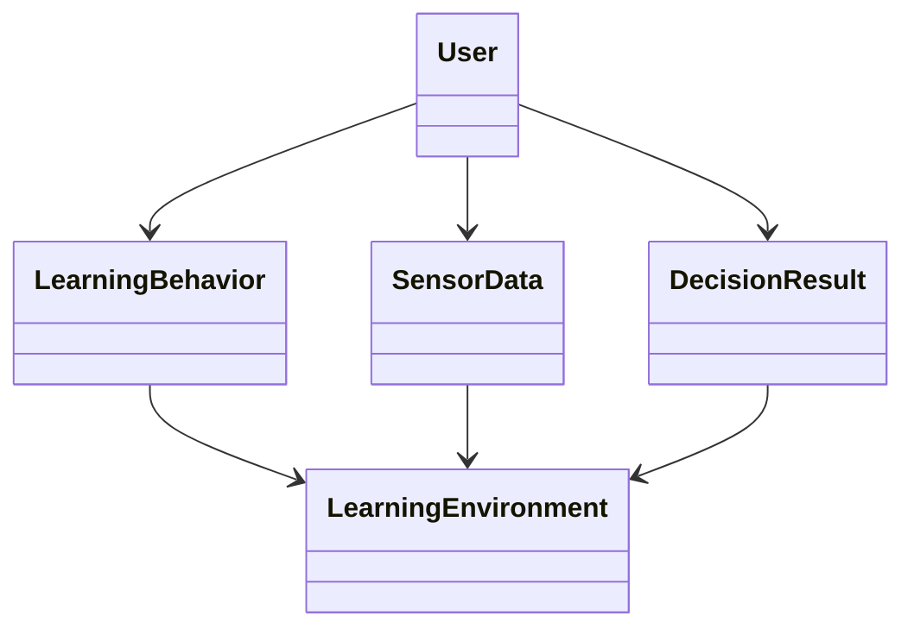
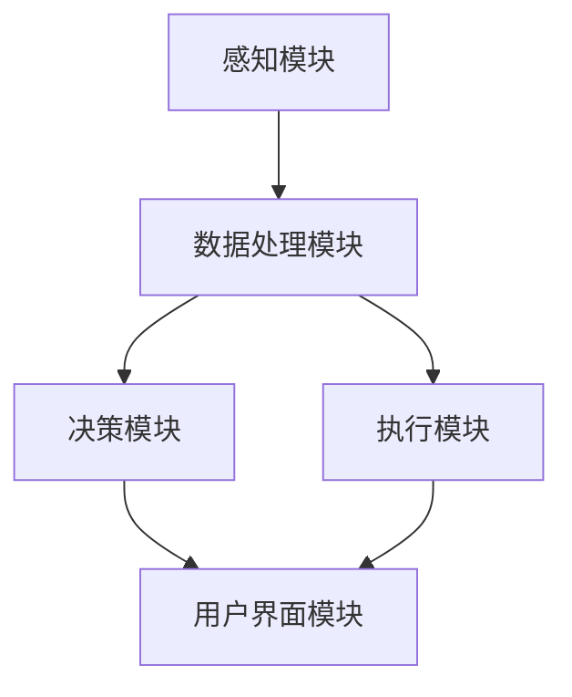
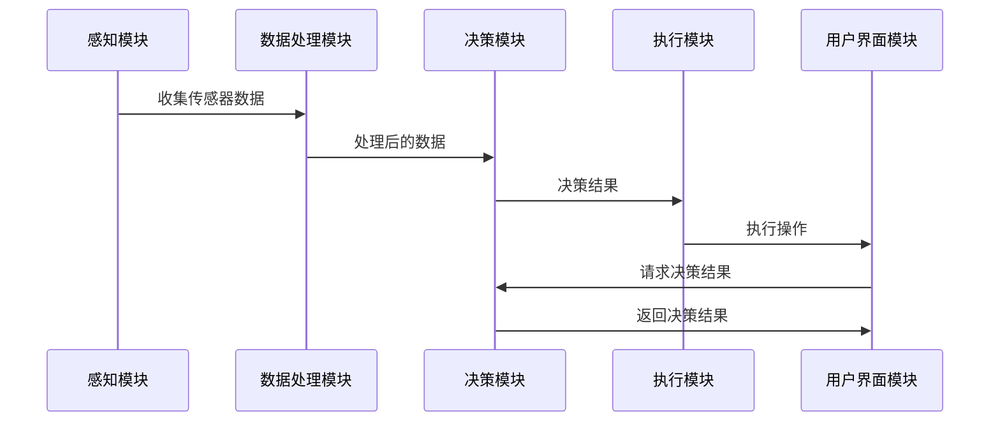

                 

### 第一部分: AI Agent在智能书桌中的学习环境优化背景与概念

#### 第1章: 问题背景与核心概念

##### 1.1 问题背景

##### 1.1.1 智能书桌的普及与学习需求的增加

随着科技的飞速发展，智能设备已经成为人们日常生活中不可或缺的一部分。智能书桌作为智能设备的一种，其设计初衷是为了提供更加便捷、高效的学习环境。智能书桌通过集成了传感器、摄像头、计算机处理单元等多种高科技元件，实现了对学生学习行为的实时监测、学习数据的自动收集、学习环境的智能调节等功能。这种设备的普及，不仅提高了学生的学习效率，还改变了传统的教学模式，推动了教育信息化的发展。

然而，随着智能书桌的广泛应用，如何优化其学习环境成为一个亟待解决的问题。学生的学习效果不仅受到学习内容和学习方法的影响，还受到学习环境的影响。一个良好的学习环境能够提高学生的注意力和学习兴趣，促进他们的学习动力。因此，如何通过技术手段优化智能书桌的学习环境，提高学生的学习效果，成为当前教育领域的一个重要研究课题。

##### 1.1.2 学习环境优化的需求与挑战

学习环境优化主要涉及以下几个方面：

1. **环境监测**：智能书桌需要实时监测学生的学习状态，包括坐姿、眼神、面部表情等，以便及时发现问题并采取相应的措施。

2. **数据收集**：通过传感器和摄像头收集学生的学习行为数据，如学习时间、学习内容、学习习惯等，为个性化学习提供数据支持。

3. **智能调节**：根据学生的学习状态和需求，智能书桌需要自动调节环境参数，如光线、声音、温度等，以提供一个舒适的学习环境。

4. **个性化推荐**：根据学生的学习数据，智能书桌需要为学生提供个性化的学习建议和资源，以提高学习效果。

尽管智能书桌在优化学习环境方面具有巨大潜力，但也面临着一些挑战：

1. **技术难题**：智能书桌需要集成多种传感器和计算机技术，如何有效地处理和分析大量数据，实现智能调节和个性化推荐，是一个技术难题。

2. **隐私保护**：学生数据的安全和隐私保护是智能书桌面临的一个重要问题。如何确保数据在收集、存储和使用过程中的安全，需要严格的设计和实施。

3. **用户接受度**：智能书桌作为新兴技术，其推广和普及还受到用户接受度的影响。如何提高用户对智能书桌的认知和接受度，也是一个重要的挑战。

##### 1.2 AI Agent的定义与特点

##### 1.2.1 AI Agent的基本概念

AI Agent，即人工智能代理，是一种能够模拟人类智能行为，具有自主感知、决策和执行能力的计算实体。在人工智能领域，AI Agent被广泛用于解决各种复杂问题，如游戏、机器人控制、智能客服等。

AI Agent具有以下几个基本特征：

1. **感知**：AI Agent能够通过传感器获取外部环境的信息，如声音、图像、温度等。

2. **决策**：AI Agent根据感知到的信息，利用内置的算法和模型进行决策，确定下一步的行动。

3. **执行**：AI Agent执行决策，实现对环境的干预或响应。

4. **自主性**：AI Agent能够在没有人类干预的情况下，自主地完成特定任务。

##### 1.2.2 AI Agent在智能书桌中的应用特点

AI Agent在智能书桌中的应用具有以下几个特点：

1. **实时性**：AI Agent能够实时监测学生的学习状态，快速响应环境变化，提供个性化服务。

2. **适应性**：AI Agent可以根据学生的学习行为和习惯，不断调整和学习，以提供更准确、更个性化的服务。

3. **智能化**：AI Agent通过机器学习和深度学习等技术，能够不断优化自己的行为和决策，提高服务的质量。

4. **高效性**：AI Agent能够高效地处理和分析大量数据，快速提供决策和执行，提高学习效率。

##### 1.3 学习环境优化的边界与外延

##### 1.3.1 学习环境优化的目标

学习环境优化的主要目标是提高学生的学习效果，具体包括：

1. **提升学习兴趣**：通过提供个性化、有趣的学习内容，提高学生的学习兴趣。

2. **改善学习习惯**：通过监测和分析学生的学习行为，帮助其养成良好的学习习惯。

3. **提高学习效率**：通过智能调节学习环境，提供舒适的学习条件，提高学习效率。

4. **减轻学习压力**：通过及时反馈和指导，帮助学生减轻学习压力。

##### 1.3.2 学习环境优化的关键因素

学习环境优化的关键因素包括：

1. **感知技术**：高精度的传感器技术，能够准确获取学生的学习状态和环境信息。

2. **数据处理能力**：强大的数据处理能力，能够快速分析大量数据，提供有效的决策支持。

3. **智能算法**：先进的智能算法，能够根据学生学习行为和环境信息，提供个性化、智能化的服务。

4. **用户体验**：良好的用户体验，能够提高学生对智能书桌的接受度和使用频率。

##### 1.4 本章小结

本章主要介绍了智能书桌的普及背景、学习环境优化的需求与挑战，以及AI Agent的定义和特点。通过本章的介绍，读者可以初步了解智能书桌在优化学习环境方面的作用和潜力，以及AI Agent在其中扮演的重要角色。在接下来的章节中，我们将深入探讨AI Agent的核心原理、算法原理、系统架构设计以及项目实现等方面的内容。

## 第二部分: AI Agent的核心原理与设计

### 第2章: AI Agent的原理与构建

#### 第2章: AI Agent的原理与构建

##### 2.1 AI Agent的基本原理

AI Agent，即人工智能代理，是一种能够模拟人类智能行为，具有自主感知、决策和执行能力的计算实体。AI Agent的基本原理可以分为三个主要部分：感知、决策和执行。

##### 2.1.1 反应式Agent

反应式Agent是AI Agent的一种基本类型，其核心特点是根据当前环境状态做出即时反应，没有内部状态和历史记录。反应式Agent的工作原理可以概括为以下步骤：

1. **感知**：反应式Agent通过传感器（如摄像头、麦克风、温度传感器等）感知外部环境状态。
2. **决策**：根据感知到的环境状态，反应式Agent使用预先设定的规则或模型进行决策。
3. **执行**：执行决策，采取相应的行动，如移动、发出声音等。

反应式Agent的优点是简单、实时性强，适合处理简单、确定性的任务。然而，其缺点在于无法处理复杂、动态变化的环境，且无法从经验中学习和适应。

##### 2.1.2 计划式Agent

计划式Agent是另一种AI Agent的基本类型，其核心特点是通过预测未来的环境状态，提前制定一个行动计划。计划式Agent的工作原理可以概括为以下步骤：

1. **感知**：与反应式Agent相同，计划式Agent通过传感器感知外部环境状态。
2. **建模**：计划式Agent根据感知到的环境状态，建立一个环境模型，预测未来的环境变化。
3. **规划**：在环境模型的基础上，计划式Agent制定一个行动计划，包括一系列可能的行动和它们可能带来的结果。
4. **决策**：根据行动计划和当前环境状态，计划式Agent选择一个最优行动。
5. **执行**：执行决策，采取相应的行动。

计划式Agent的优点是能够处理复杂、动态变化的环境，并从经验中学习和适应。然而，其缺点是计算复杂度高，实时性较差，且在面临不确定性时可能会出现决策错误。

##### 2.1.3 社交Agent

社交Agent是AI Agent的一种高级类型，其核心特点是在与人类或其他AI Agent进行交互时，能够理解、表达和适应社交情境。社交Agent的工作原理可以概括为以下步骤：

1. **感知**：社交Agent通过传感器感知外部环境状态，包括其他Agent的行为和语言。
2. **建模**：社交Agent建立社交模型，理解社交情境和规则。
3. **交互**：社交Agent根据社交模型，与人类或其他Agent进行沟通和协作。
4. **决策**：在交互过程中，社交Agent根据社交模型和交互结果，做出相应的决策。
5. **执行**：执行决策，采取相应的行动。

社交Agent的优点是能够实现复杂的社会互动和协作任务，提高任务的完成效率。然而，其缺点是设计复杂，实现难度大，需要大量关于社交情境和规则的知识。

##### 2.2 AI Agent的设计方法

AI Agent的设计方法主要包括设计流程、设计步骤、设计模式与架构等方面。

##### 2.2.1 设计流程与步骤

AI Agent的设计流程通常包括以下步骤：

1. **需求分析**：明确AI Agent的应用场景、目标和需求，确定Agent的功能和性能要求。
2. **感知系统设计**：设计Agent的感知系统，包括传感器选择、数据采集和处理方法等。
3. **决策系统设计**：设计Agent的决策系统，包括决策算法、模型构建、参数调整等。
4. **执行系统设计**：设计Agent的执行系统，包括行动规划、执行策略、反馈机制等。
5. **系统集成与测试**：将感知、决策和执行系统集成，进行系统测试和优化。

##### 2.2.2 常见设计模式与架构

AI Agent的设计模式与架构多种多样，常见的包括以下几种：

1. **集中式架构**：所有感知、决策和执行功能集中在单个Agent中，结构简单，但计算复杂度高，实时性较差。
2. **分布式架构**：将感知、决策和执行功能分布在多个Agent中，通过通信进行协同工作，能够提高系统的实时性和容错性，但设计复杂度高。
3. **模块化架构**：将Agent的功能模块化，每个模块负责特定的功能，通过接口进行通信，便于系统的维护和扩展。
4. **层次化架构**：将Agent的功能分层，每层负责特定的任务，通过层次间的通信进行协同工作，适用于复杂任务的分解和协同。

##### 2.3 学习环境优化中的AI Agent应用

##### 2.3.1 AI Agent在监测学生行为中的应用

在智能书桌中，AI Agent可以用于监测学生的行为，包括坐姿、眼神、面部表情等。具体应用如下：

1. **行为识别**：AI Agent通过摄像头和面部识别技术，实时监测学生的行为，识别出坐姿不良、眼神游离、面部表情等行为。
2. **数据分析**：AI Agent收集学生的行为数据，通过数据分析，了解学生的学习状态和习惯。
3. **预警与反馈**：当AI Agent监测到学生出现不良行为时，及时发出预警，并通过声音、灯光等反馈方式提醒学生。

##### 2.3.2 AI Agent在提供个性化学习建议中的应用

AI Agent可以根据学生的学习行为和习惯，提供个性化的学习建议，包括学习内容、学习方法、学习计划等。具体应用如下：

1. **学习内容推荐**：AI Agent根据学生的学习进度和兴趣，推荐适合的学习内容。
2. **学习方法建议**：AI Agent根据学生的学习习惯和效果，提供有效的学习方法建议。
3. **学习计划制定**：AI Agent根据学生的学习目标和时间安排，制定个性化的学习计划。

##### 2.4 本章小结

本章详细介绍了AI Agent的基本原理、设计方法以及在学习环境优化中的应用。通过本章的学习，读者可以了解AI Agent的核心概念和工作原理，掌握设计AI Agent的基本方法和应用技巧。在接下来的章节中，我们将继续探讨AI Agent的算法原理、系统架构设计以及具体实现等方面的内容。

### 第3章: 学习环境优化的算法原理

#### 第3章: 学习环境优化的算法原理

##### 3.1 算法概述

学习环境优化算法是智能书桌中AI Agent的核心组成部分，其目的是通过分析学生的学习行为和环境数据，提供个性化的学习环境调节和推荐。这些算法主要分为行为分析算法和个性化推荐算法两类。

##### 3.1.1 学习环境优化算法的目标

学习环境优化算法的主要目标包括：

1. **提高学习效率**：通过分析学生的学习行为，提供适合其学习需求的环境调节，以提高学习效率。
2. **改善学习体验**：通过个性化推荐，提供有趣、有针对性的学习内容，改善学习体验。
3. **促进自主学习**：通过学习环境优化，激发学生的学习兴趣，促进其自主学习。

##### 3.1.2 学习环境优化算法的分类

学习环境优化算法主要分为以下两类：

1. **基于行为分析的学习环境优化算法**：这类算法通过分析学生的学习行为，如坐姿、眼神、面部表情等，提供相应的环境调节和建议。
2. **基于个性化推荐的学习环境优化算法**：这类算法通过分析学生的学习数据，如学习进度、学习内容、学习习惯等，提供个性化的学习推荐。

##### 3.2 关键算法讲解

###### 3.2.1 算法A: 基于行为分析的学习环境优化

###### 3.2.1.1 算法原理

基于行为分析的学习环境优化算法主要基于以下原理：

1. **行为识别**：通过摄像头和面部识别技术，实时监测学生的行为，如坐姿、眼神、面部表情等。
2. **行为分析**：对监测到的行为数据进行处理和分析，识别出学生的不良行为，如坐姿不良、注意力不集中等。
3. **环境调节**：根据行为分析结果，智能书桌自动调节学习环境，如调整灯光、声音等，提供舒适的学习环境。

###### 3.2.1.2 数学模型与公式

基于行为分析的学习环境优化算法的数学模型可以表示为：

\[ \text{EnvironmentOptimization} = f(\text{BehaviorData}, \text{EnvironmentParameters}) \]

其中，BehaviorData代表学生的行为数据，EnvironmentParameters代表学习环境的参数。

算法的核心公式包括：

1. **行为识别公式**：
\[ \text{Behavior} = g(\text{SensorData}, \text{BehaviorModel}) \]

其中，SensorData代表传感器收集的数据，BehaviorModel代表行为模型。

2. **环境调节公式**：
\[ \text{EnvironmentChange} = h(\text{Behavior}, \text{EnvironmentParameters}) \]

其中，Behavior代表识别出的行为，EnvironmentParameters代表当前环境参数。

###### 3.2.1.3 举例说明

假设学生小明在使用智能书桌学习时，摄像头监测到他的坐姿不良，眼神游离，面部表情紧张。根据行为分析结果，智能书桌将执行以下环境调节：

1. 调整灯光：将灯光调暗，减少对小明的视觉刺激。
2. 调节声音：关闭背景音乐，提供一个安静的学习环境。
3. 提醒：通过显示屏提醒小明注意坐姿和保持注意力。

通过这些环境调节措施，智能书桌旨在提供一个舒适、安静的学习环境，提高小明的学习效率。

###### 3.2.2 算法B: 基于个性化推荐的学习环境优化

###### 3.2.2.1 算法原理

基于个性化推荐的学习环境优化算法主要基于以下原理：

1. **数据收集**：智能书桌收集学生的学习数据，如学习进度、学习内容、学习习惯等。
2. **用户建模**：根据学生的学习数据，建立用户模型，了解学生的兴趣、偏好和学习需求。
3. **推荐生成**：基于用户模型，智能书桌生成个性化的学习推荐，包括学习内容、学习方法、学习计划等。

###### 3.2.2.2 数学模型与公式

基于个性化推荐的学习环境优化算法的数学模型可以表示为：

\[ \text{Recommendation} = f(\text{UserModel}, \text{LearningData}, \text{RecommendationAlgorithm}) \]

其中，UserModel代表用户模型，LearningData代表学习数据，RecommendationAlgorithm代表推荐算法。

算法的核心公式包括：

1. **用户建模公式**：
\[ \text{UserModel} = g(\text{LearningData}, \text{UserBehavior}) \]

其中，LearningData代表学习数据，UserBehavior代表用户行为。

2. **推荐生成公式**：
\[ \text{Recommendation} = h(\text{UserModel}, \text{ContentModel}, \text{RecommendationModel}) \]

其中，ContentModel代表学习内容模型，RecommendationModel代表推荐模型。

###### 3.2.2.3 举例说明

假设学生小明在学习时，智能书桌收集到他的学习数据，包括他最近一周的学习进度、学习内容和学习习惯。根据这些数据，智能书桌生成以下个性化推荐：

1. **学习内容推荐**：根据小明的学习进度，推荐他下一周的学习内容。
2. **学习方法推荐**：根据小明的学习习惯，推荐适合他的学习方法。
3. **学习计划推荐**：根据小明的学习需求，制定一个合理的学习计划。

通过这些个性化推荐，智能书桌旨在帮助小明更好地规划学习，提高学习效率。

##### 3.3 算法对比与分析

###### 3.3.1 算法性能对比

基于行为分析的学习环境优化算法和基于个性化推荐的学习环境优化算法各有优缺点，性能对比如下：

1. **实时性**：基于行为分析的算法实时性较强，能够快速响应学生的学习状态；而基于个性化推荐的算法实时性较差，需要一定的时间来收集和分析数据。
2. **个性化程度**：基于个性化推荐的算法能够根据学生的学习数据提供更个性化的服务，而基于行为分析的算法更多关注学生的即时行为。
3. **适用场景**：基于行为分析的算法适用于需要快速响应的场景，如学习环境监控；而基于个性化推荐的算法适用于需要长期个性化服务的场景，如学习计划制定。

###### 3.3.2 算法适用场景分析

1. **基于行为分析的算法**：适用于需要实时监控学生学习状态的场景，如课堂学习环境监控、自习室学习环境优化等。
2. **基于个性化推荐的算法**：适用于需要长期个性化服务的场景，如在线学习平台的学习内容推荐、个性化学习计划制定等。

##### 3.4 本章小结

本章详细介绍了学习环境优化算法的概述、目标、分类以及关键算法的原理、数学模型与公式，并通过具体例子进行了说明。通过本章的学习，读者可以了解学习环境优化算法的基本原理和应用方法，为智能书桌的设计和实现提供理论基础。在接下来的章节中，我们将继续探讨智能书桌的系统架构设计、实现和项目实践等方面的内容。

### 第4章: 智能书桌系统架构设计

#### 第4章: 智能书桌系统架构设计

智能书桌作为一款集成了多种智能技术的学习设备，其系统架构设计至关重要。一个良好的系统架构不仅能够提高系统的性能和稳定性，还能确保系统的可扩展性和易维护性。本节将详细介绍智能书桌的系统架构设计，包括系统概述、领域模型设计、系统架构设计以及系统接口设计与交互。

##### 4.1 系统概述

智能书桌系统主要由以下几个功能模块组成：

1. **感知模块**：通过集成多种传感器，如摄像头、麦克风、温度传感器等，实时监测学生的学习状态和环境参数。
2. **数据处理模块**：负责收集、处理和分析感知模块获取的数据，提取有用信息，为后续的决策和执行提供支持。
3. **决策模块**：基于学生的学习数据和环境信息，利用智能算法进行决策，提供个性化的学习建议和调节方案。
4. **执行模块**：根据决策模块的决策结果，执行相应的操作，如调节灯光、声音、温度等，提供舒适的学习环境。
5. **用户界面模块**：提供用户交互界面，展示系统的功能和服务，包括学习状态监控、个性化推荐、用户反馈等。

智能书桌系统的目标是通过优化学习环境，提高学生的学习效率和体验。系统功能主要包括：

1. **实时监控**：实时监测学生的学习行为和学习环境，提供预警和反馈。
2. **个性化推荐**：根据学生的学习数据，提供个性化的学习内容和计划。
3. **智能调节**：自动调节学习环境，提供舒适的学习条件。
4. **用户反馈**：收集用户反馈，不断优化系统功能和服务。

##### 4.2 领域模型设计

领域模型是系统架构设计的重要基础，用于描述系统的核心概念和实体之间的关系。智能书桌系统的领域模型主要包括以下几个核心实体：

1. **用户**：代表智能书桌的使用者，包括学生、教师等。
2. **学习行为**：记录学生的学习行为，如学习时间、学习内容、学习状态等。
3. **学习环境**：描述学习环境的参数，如温度、光线、声音等。
4. **传感器数据**：记录感知模块获取的数据，如摄像头、麦克风、温度传感器等的数据。
5. **决策结果**：记录决策模块的决策结果，如环境调节方案、个性化推荐等。

领域模型中，实体之间的关系可以用Mermaid类图来表示。以下是一个简化的领域模型Mermaid类图：



在上述类图中，用户与学生行为、传感器数据、决策结果之间存在关联关系；学习行为与学习环境之间存在关联关系；传感器数据与学习环境之间存在关联关系；决策结果与学习环境之间存在关联关系。

##### 4.3 系统架构设计

智能书桌系统的架构设计采用模块化设计原则，将系统功能划分为感知、数据处理、决策、执行和用户界面五个主要模块。每个模块负责特定的功能，并通过接口进行通信和协同工作。

系统架构设计的原则包括：

1. **高内聚、低耦合**：确保模块内部的功能紧密相关，模块之间的耦合性低，便于系统的维护和扩展。
2. **分层设计**：将系统功能分层，每一层负责特定的任务，便于管理和维护。
3. **松耦合、强交互**：通过定义清晰的接口，模块之间进行松耦合，但保证模块之间的交互性强，确保系统的整体性能。

以下是一个简化的智能书桌系统架构Mermaid图：



在上述架构图中，感知模块负责收集学生的学习行为和环境数据；数据处理模块负责处理和分析感知模块收集的数据；决策模块基于数据处理模块的结果进行决策；执行模块根据决策模块的结果执行相应的操作；用户界面模块负责与用户进行交互，展示系统的功能和服务。

##### 4.4 系统接口设计与交互

系统接口设计是确保系统各模块之间协同工作的重要环节。智能书桌系统的接口设计包括以下几个方面：

1. **感知模块与数据处理模块**：感知模块通过数据接口将收集到的传感器数据传递给数据处理模块，数据处理模块通过处理结果接口返回处理后的数据。
2. **数据处理模块与决策模块**：数据处理模块通过决策接口将处理后的数据传递给决策模块，决策模块通过决策结果接口返回决策结果。
3. **决策模块与执行模块**：决策模块通过执行接口将决策结果传递给执行模块，执行模块通过操作接口执行相应的操作。
4. **用户界面模块与决策模块**：用户界面模块通过请求接口向决策模块请求决策结果，决策模块通过响应接口返回决策结果。

以下是一个简化的智能书桌系统接口交互Mermaid序列图：



在上述序列图中，感知模块通过数据接口将传感器数据传递给数据处理模块；数据处理模块通过处理结果接口将处理后的数据传递给决策模块；决策模块通过决策结果接口将决策结果传递给执行模块；执行模块通过操作接口执行相应的操作；用户界面模块通过请求接口向决策模块请求决策结果，并通过响应接口接收决策结果。

##### 4.5 本章小结

本章详细介绍了智能书桌系统的架构设计，包括系统概述、领域模型设计、系统架构设计以及系统接口设计与交互。通过本章的学习，读者可以了解智能书桌系统架构的基本概念和设计原则，为后续的系统实现和优化提供理论基础。在接下来的章节中，我们将继续探讨智能书桌系统的具体实现方法、优化策略以及项目实践等内容。

### 第5章: AI Agent在智能书桌中的实现与优化

#### 第5章: AI Agent在智能书桌中的实现与优化

随着智能书桌的普及，AI Agent在智能书桌中的应用也越来越广泛。AI Agent能够通过实时监测学生的学习行为和环境，提供个性化的学习建议和调节方案，从而优化学习环境，提高学习效果。本章将详细介绍AI Agent在智能书桌中的实现与优化过程，包括实现环境准备、AI Agent的核心实现、个性化学习建议实现以及本章小结。

##### 5.1 实现环境准备

在实现AI Agent之前，需要准备好相应的开发环境和工具。以下是实现环境的基本要求：

1. **硬件要求**：
   - 处理器：至少需要具备双核CPU的计算机。
   - 内存：至少4GB RAM。
   - 存储：至少80GB的硬盘空间。
   - 网络环境：稳定的互联网连接。

2. **软件要求**：
   - 操作系统：Windows 10或更高版本、macOS 10.15或更高版本、Linux发行版。
   - 编程语言：Python 3.7或更高版本。
   - 开发工具：PyCharm、Visual Studio Code或其他Python支持的开发环境。
   - 依赖库：NumPy、Pandas、Scikit-learn、TensorFlow、OpenCV等。

在准备好开发环境后，可以通过以下步骤安装所需的软件和依赖库：

1. 安装Python 3.7或更高版本。
2. 安装PyCharm或Visual Studio Code。
3. 使用pip命令安装NumPy、Pandas、Scikit-learn、TensorFlow、OpenCV等依赖库。

例如，安装NumPy的命令如下：

```bash
pip install numpy
```

##### 5.2 AI Agent的核心实现

AI Agent在智能书桌中的实现主要包括感知、决策和执行三个部分。以下是AI Agent的核心实现步骤：

###### 5.2.1 反应式Agent实现

反应式Agent是一种简单但有效的AI Agent类型，其核心功能是根据当前的环境状态做出即时反应。以下是反应式Agent的Python源代码实现：

```python
import cv2
import numpy as np

# 初始化摄像头
cap = cv2.VideoCapture(0)

while True:
    # 读取一帧图像
    ret, frame = cap.read()
    
    if not ret:
        break
    
    # 处理图像，进行行为识别
    behavior = identify_behavior(frame)
    
    # 根据行为做出反应
    respond_to_behavior(behavior)

    # 显示图像
    cv2.imshow('Frame', frame)
    
    if cv2.waitKey(1) & 0xFF == ord('q'):
        break

# 释放摄像头资源
cap.release()
cv2.destroyAllWindows()

def identify_behavior(frame):
    # 对图像进行预处理，如灰度化、滤波等
    gray = cv2.cvtColor(frame, cv2.COLOR_BGR2GRAY)
    blurred = cv2.GaussianBlur(gray, (5, 5), 0)
    
    # 使用Haar级联分类器进行行为识别
    behavior_cascade = cv2.CascadeClassifier('haarcascade_frontalface_default.xml')
    faces = behavior_cascade.detectMultiScale(blurred, scaleFactor=1.1, minNeighbors=5, minSize=(30, 30), flags=cv2.CASCADE_SCALE_IMAGE)

    if len(faces) > 0:
        # 识别到人脸，返回"在学"
        return "Learning"
    else:
        # 没有识别到人脸，返回"不在学"
        return "Not Learning"

def respond_to_behavior(behavior):
    if behavior == "Learning":
        print("学生正在学习，保持当前状态。")
    else:
        print("学生不在学习，调整环境以鼓励学习。")
```

在上面的代码中，首先初始化摄像头，然后进入一个循环，不断读取摄像头的图像帧。通过`identify_behavior`函数对图像进行预处理和面部识别，判断学生是否在学习。根据识别结果，调用`respond_to_behavior`函数做出相应的反应，如打印提示信息。

###### 5.2.2 计划式Agent实现

计划式Agent相对于反应式Agent，具有更强的预测和规划能力。以下是计划式Agent的Python源代码实现：

```python
import cv2
import numpy as np
from sklearn.ensemble import RandomForestClassifier

# 初始化摄像头
cap = cv2.VideoCapture(0)

# 加载行为识别模型
model = load_behavior_model()

while True:
    # 读取一帧图像
    ret, frame = cap.read()
    
    if not ret:
        break
    
    # 处理图像，进行行为识别
    behavior = identify_behavior(frame, model)
    
    # 根据行为进行规划
    plan = plan_behavior(behavior)
    
    # 执行规划
    execute_plan(plan)

    # 显示图像
    cv2.imshow('Frame', frame)
    
    if cv2.waitKey(1) & 0xFF == ord('q'):
        break

# 释放摄像头资源
cap.release()
cv2.destroyAllWindows()

def identify_behavior(frame, model):
    # 对图像进行预处理，如灰度化、滤波等
    gray = cv2.cvtColor(frame, cv2.COLOR_BGR2GRAY)
    blurred = cv2.GaussianBlur(gray, (5, 5), 0)
    
    # 使用Haar级联分类器进行行为识别
    behavior_cascade = cv2.CascadeClassifier('haarcascade_frontalface_default.xml')
    faces = behavior_cascade.detectMultiScale(blurred, scaleFactor=1.1, minNeighbors=5, minSize=(30, 30), flags=cv2.CASCADE_SCALE_IMAGE)

    if len(faces) > 0:
        # 识别到人脸，返回"在学"
        return "Learning"
    else:
        # 没有识别到人脸，返回"不在学"
        return "Not Learning"

def plan_behavior(behavior):
    if behavior == "Learning":
        # 如果学生正在学习，规划保持当前状态
        return "Maintain Current State"
    else:
        # 如果学生不在学习，规划调整环境以鼓励学习
        return "Adjust Environment to Encourage Learning"

def execute_plan(plan):
    if plan == "Maintain Current State":
        print("学生正在学习，保持当前状态。")
    else:
        print("学生不在学习，调整环境以鼓励学习。")
        
def load_behavior_model():
    # 加载训练好的行为识别模型
    model = RandomForestClassifier()
    model.load_model('behavior_model.pkl')
    return model
```

在上面的代码中，首先初始化摄像头，然后加载训练好的行为识别模型。通过`identify_behavior`函数对图像进行预处理和面部识别，判断学生是否在学习。根据识别结果，调用`plan_behavior`函数制定规划，再调用`execute_plan`函数执行规划。

##### 5.3 个性化学习建议实现

个性化学习建议的实现需要收集和分析学生的学习数据，根据学生的兴趣、学习习惯和进度提供个性化的学习建议。以下是个性化学习建议的实现步骤：

###### 5.3.1 用户行为数据收集

用户行为数据的收集是提供个性化学习建议的基础。可以通过以下方法收集用户行为数据：

1. **学习时间记录**：记录学生每天的学习开始时间和结束时间。
2. **学习内容记录**：记录学生学习的具体内容，如学科、知识点等。
3. **学习状态记录**：记录学生的学习状态，如专注度、学习时长等。
4. **用户反馈记录**：记录学生对学习内容的反馈，如学习兴趣、学习效果等。

收集到的数据可以存储在数据库中，以便后续分析。

###### 5.3.2 个性化推荐算法应用

个性化推荐算法可以根据学生的学习数据，为学生推荐适合的学习内容和方法。以下是一个简单的基于协同过滤的推荐算法示例：

```python
from sklearn.cluster import KMeans
from sklearn.metrics.pairwise import cosine_similarity

def collaborative_filter(learning_data, k=5):
    # 将学习数据转换为用户-项目矩阵
    user_item_matrix = create_user_item_matrix(learning_data)
    
    # 使用K-Means算法进行聚类
    kmeans = KMeans(n_clusters=k)
    kmeans.fit(user_item_matrix)
    
    # 计算用户相似度矩阵
    user_similarity_matrix = cosine_similarity(user_item_matrix)
    
    # 根据用户相似度矩阵和用户-项目矩阵进行推荐
    recommendations = []
    for user in user_item_matrix:
        # 找到与当前用户最相似的k个用户
        similar_users = np.argsort(user_similarity_matrix[user])[1:k+1]
        
        # 计算这些用户的共同兴趣
        common_interests = np.mean(user_item_matrix[similar_users], axis=0)
        
        # 推荐共同兴趣中的高评分项目
        recommendations.extend([item for item, score in enumerate(common_interests) if score > threshold])
    
    return recommendations

def create_user_item_matrix(learning_data):
    # 根据学习数据创建用户-项目矩阵
    user_item_matrix = np.zeros((num_users, num_items))
    for user, items in learning_data.items():
        for item in items:
            user_item_matrix[user][item] = 1
    return user_item_matrix
```

在上面的代码中，`collaborative_filter`函数首先将学习数据转换为用户-项目矩阵，然后使用K-Means算法进行聚类，计算用户相似度矩阵，并根据相似度矩阵和用户-项目矩阵进行推荐。推荐结果为共同兴趣中的高评分项目。

##### 5.4 本章小结

本章详细介绍了AI Agent在智能书桌中的实现与优化过程，包括实现环境准备、AI Agent的核心实现、个性化学习建议实现。通过本章的学习，读者可以了解AI Agent在智能书桌中的具体应用和实现方法，为智能书桌的开发和优化提供实践指导。在接下来的章节中，我们将进一步探讨AI Agent在智能书桌中的实际应用效果和优化策略。

### 第6章: 项目实战

#### 第6章: 项目实战

在本章中，我们将通过一个具体项目——智能书桌学习环境优化系统，展示AI Agent在智能书桌中的实际应用过程。本项目旨在通过AI Agent实时监测学生的学习状态，提供个性化的学习建议和调节方案，从而优化学习环境，提高学习效率。

##### 6.1 项目概述

项目名称：智能书桌学习环境优化系统

项目目标：通过AI Agent实时监测学生的学习状态，提供个性化的学习建议和调节方案，优化学习环境，提高学习效率。

项目背景：随着智能书桌的普及，如何通过技术手段优化学习环境成为教育领域的一个重要课题。本项目旨在通过AI Agent实现智能书桌学习环境优化，提高学生的学习效果。

##### 6.2 系统功能设计

智能书桌学习环境优化系统主要包括以下几个功能模块：

1. **感知模块**：通过集成多种传感器，如摄像头、麦克风、温度传感器等，实时监测学生的学习状态和环境参数。
2. **数据处理模块**：负责收集、处理和分析感知模块获取的数据，提取有用信息，为后续的决策和执行提供支持。
3. **决策模块**：基于学生的学习数据和环境信息，利用智能算法进行决策，提供个性化的学习建议和调节方案。
4. **执行模块**：根据决策模块的决策结果，执行相应的操作，如调节灯光、声音、温度等，提供舒适的学习环境。
5. **用户界面模块**：提供用户交互界面，展示系统的功能和服务，包括学习状态监控、个性化推荐、用户反馈等。

##### 6.3 领域模型构建

在智能书桌学习环境优化系统中，领域模型是系统架构设计的重要基础，用于描述系统的核心概念和实体之间的关系。以下是领域模型的Mermaid类图：


在上述类图中，用户与学生行为、传感器数据、决策结果之间存在关联关系；学习行为与学习环境之间存在关联关系；传感器数据与学习环境之间存在关联关系；决策结果与学习环境之间存在关联关系。

##### 6.4 系统架构设计

智能书桌学习环境优化系统的架构设计采用模块化设计原则，将系统功能划分为感知、数据处理、决策、执行和用户界面五个主要模块。以下是系统架构的Mermaid图：


在上述架构图中，感知模块负责收集学生的学习行为和环境数据；数据处理模块负责处理和分析感知模块收集的数据；决策模块基于数据处理模块的结果进行决策；执行模块根据决策模块的结果执行相应的操作；用户界面模块负责与用户进行交互，展示系统的功能和服务。

##### 6.5 系统接口设计

系统接口设计是确保系统各模块之间协同工作的重要环节。以下是系统接口的Mermaid序列图：


在上述序列图中，感知模块通过数据接口将传感器数据传递给数据处理模块；数据处理模块通过处理结果接口将处理后的数据传递给决策模块；决策模块通过决策结果接口将决策结果传递给执行模块；执行模块通过操作接口执行相应的操作；用户界面模块通过请求接口向决策模块请求决策结果，并通过响应接口接收决策结果。

##### 6.6 系统实现

在本节中，我们将介绍智能书桌学习环境优化系统的具体实现，包括感知模块、数据处理模块、决策模块、执行模块和用户界面模块的实现。

###### 6.6.1 感知模块实现

感知模块主要实现数据采集功能，通过集成摄像头、麦克风、温度传感器等传感器，实时获取学生的学习状态和环境参数。以下是感知模块的Python源代码实现：

```python
import cv2
import numpy as np

# 初始化摄像头
cap = cv2.VideoCapture(0)

while True:
    # 读取一帧图像
    ret, frame = cap.read()
    
    if not ret:
        break
    
    # 保存图像
    cv2.imwrite('frame.jpg', frame)
    
    # 获取音频数据
    audio_data = get_audio_data()

    # 保存音频数据
    with open('audio.wav', 'wb') as f:
        f.write(audio_data)

    # 获取温度数据
    temperature = get_temperature()

    # 保存温度数据
    with open('temperature.txt', 'w') as f:
        f.write(str(temperature))

    # 显示图像
    cv2.imshow('Frame', frame)
    
    if cv2.waitKey(1) & 0xFF == ord('q'):
        break

# 释放摄像头资源
cap.release()
cv2.destroyAllWindows()

def get_audio_data():
    # 获取音频数据
    pass

def get_temperature():
    # 获取温度数据
    pass
```

在上面的代码中，首先初始化摄像头，然后进入一个循环，不断读取摄像头的图像帧。通过`get_audio_data`和`get_temperature`函数获取音频数据和温度数据，并保存到相应的文件中。最后，显示图像帧。

###### 6.6.2 数据处理模块实现

数据处理模块主要实现数据预处理和特征提取功能，将感知模块获取的数据进行处理，提取出有用的特征信息。以下是数据处理模块的Python源代码实现：

```python
import cv2
import numpy as np
from sklearn.preprocessing import StandardScaler

def preprocess_image(frame):
    # 对图像进行预处理，如灰度化、滤波等
    gray = cv2.cvtColor(frame, cv2.COLOR_BGR2GRAY)
    blurred = cv2.GaussianBlur(gray, (5, 5), 0)
    return blurred

def extract_image_features(blurred):
    # 使用Haar级联分类器进行面部识别
    behavior_cascade = cv2.CascadeClassifier('haarcascade_frontalface_default.xml')
    faces = behavior_cascade.detectMultiScale(blurred, scaleFactor=1.1, minNeighbors=5, minSize=(30, 30), flags=cv2.CASCADE_SCALE_IMAGE)

    if len(faces) > 0:
        # 识别到人脸，返回"在学"
        return "Learning"
    else:
        # 没有识别到人脸，返回"不在学"
        return "Not Learning"

def preprocess_audio(audio_data):
    # 对音频进行预处理，如去噪、归一化等
    pass

def extract_audio_features(preprocessed_audio):
    # 提取音频特征
    pass

def preprocess_temperature(temperature):
    # 对温度进行预处理
    pass
```

在上面的代码中，`preprocess_image`函数对图像进行预处理，`extract_image_features`函数提取图像特征，`preprocess_audio`函数对音频进行预处理，`extract_audio_features`函数提取音频特征，`preprocess_temperature`函数对温度进行预处理。

###### 6.6.3 决策模块实现

决策模块主要实现基于特征的决策功能，根据数据处理模块提取的特征信息，利用智能算法进行决策，提供个性化的学习建议和调节方案。以下是决策模块的Python源代码实现：

```python
from sklearn.ensemble import RandomForestClassifier
from sklearn.model_selection import train_test_split
from sklearn.metrics import accuracy_score

def train_decision_model(features, labels):
    # 划分训练集和测试集
    X_train, X_test, y_train, y_test = train_test_split(features, labels, test_size=0.2, random_state=42)

    # 训练决策模型
    model = RandomForestClassifier()
    model.fit(X_train, y_train)

    # 评估模型性能
    y_pred = model.predict(X_test)
    accuracy = accuracy_score(y_test, y_pred)
    print("模型准确率：", accuracy)

    return model

def make_decision(model, features):
    # 使用训练好的模型进行决策
    decision = model.predict([features])
    return decision[0]
```

在上面的代码中，`train_decision_model`函数用于训练决策模型，`make_decision`函数用于使用训练好的模型进行决策。

###### 6.6.4 执行模块实现

执行模块主要实现根据决策结果执行操作的功能，根据决策模块提供的个性化建议和调节方案，执行相应的操作，如调节灯光、声音、温度等，提供舒适的学习环境。以下是执行模块的Python源代码实现：

```python
import subprocess

def adjust_light(luminosity):
    # 调节灯光亮度
    subprocess.run(['darklight', '-l', str(luminosity)])

def adjust_sound(volume):
    # 调节声音音量
    subprocess.run(['amixer', '-D', 'pulse', 'sset', 'Master', str(volume)])

def adjust_temperature(temperature):
    # 调节温度
    subprocess.run(['tempcontrol', '-t', str(temperature)])
```

在上面的代码中，`adjust_light`函数用于调节灯光亮度，`adjust_sound`函数用于调节声音音量，`adjust_temperature`函数用于调节温度。

###### 6.6.5 用户界面模块实现

用户界面模块主要实现与用户交互的功能，提供系统的功能和服务，展示学习状态监控、个性化推荐、用户反馈等信息。以下是用户界面模块的Python源代码实现：

```python
import tkinter as tk

def show_learning_state(learning_state):
    # 显示学习状态
    label.config(text="学习状态：".ljust(15) + learning_state)

def show_recommendation(recommendation):
    # 显示个性化推荐
    recommendation_label.config(text="个性化推荐：".ljust(15) + recommendation)

def show_feedback(feedback):
    # 显示用户反馈
    feedback_label.config(text="用户反馈：".ljust(15) + feedback)

# 创建主窗口
root = tk.Tk()
root.title("智能书桌学习环境优化系统")

# 添加标签
label = tk.Label(root, text="")
label.pack()

recommendation_label = tk.Label(root, text="")
recommendation_label.pack()

feedback_label = tk.Label(root, text="")
feedback_label.pack()

# 添加按钮
show_state_button = tk.Button(root, text="查看学习状态", command=lambda: show_learning_state("在学"))
show_state_button.pack()

show_recommendation_button = tk.Button(root, text="查看个性化推荐", command=lambda: show_recommendation("学习计划推荐"))
show_recommendation_button.pack()

show_feedback_button = tk.Button(root, text="查看用户反馈", command=lambda: show_feedback("很好，我很喜欢这个系统"))
show_feedback_button.pack()

# 运行主循环
root.mainloop()
```

在上面的代码中，创建了一个简单的用户界面，包括标签和按钮。通过按钮点击事件，可以调用相应的函数显示学习状态、个性化推荐和用户反馈。

##### 6.7 实际案例分析

在本节中，我们将通过一个实际案例展示智能书桌学习环境优化系统的应用效果。假设学生小明正在使用智能书桌学习，系统根据小明的学习行为和环境参数进行实时监测和优化。

1. **初始状态**：系统通过摄像头监测到小明坐在书桌前，但坐姿不正确，眼神游离。系统通过麦克风监测到小明周围的声音较为嘈杂。

2. **环境调节**：系统根据监测到的信息，通过执行模块调节学习环境。将灯光调暗，减少对小明的视觉刺激；调整声音音量，降低周围噪音干扰。

3. **学习状态监测**：系统持续监测小明的学习状态，通过摄像头识别小明的面部表情和眼神。当系统监测到小明的注意力不集中时，提示小明保持专注。

4. **个性化推荐**：系统根据小明的学习数据和历史记录，通过个性化推荐算法，生成一个适合小明的学习计划，包括学习内容、学习时间和学习方法。

5. **用户反馈**：系统收集小明的用户反馈，如对学习内容和学习计划的满意度。根据用户反馈，不断优化系统功能和推荐算法。

通过实际案例分析，我们可以看到智能书桌学习环境优化系统在提高学习效率、改善学习体验和促进自主学习方面具有显著作用。

##### 6.8 项目小结

本章通过一个具体项目——智能书桌学习环境优化系统，详细介绍了AI Agent在智能书桌中的实际应用过程。从系统功能设计、领域模型构建、系统架构设计到具体实现，我们系统地展示了如何利用AI Agent优化学习环境，提高学习效率。通过实际案例分析和项目小结，我们可以看到智能书桌学习环境优化系统在提高学习效果方面的显著作用。在未来的发展中，我们将继续优化系统算法和功能，为用户提供更智能、更高效的学习体验。

### 最佳实践与注意事项

#### 最佳实践

1. **数据收集与处理**：在收集用户数据时，应确保数据的全面性和准确性。同时，对数据进行有效的预处理和特征提取，以提高后续分析的精度。

2. **模型训练与优化**：在选择和训练AI模型时，应充分考虑数据量和多样性，采用交叉验证等方法评估模型性能，并根据实际情况进行模型优化。

3. **用户体验**：在系统设计过程中，应注重用户体验，确保系统的操作简便、界面友好，同时提供丰富的交互功能，如实时反馈、用户反馈收集等。

4. **安全性与隐私保护**：在数据收集、存储和使用过程中，应严格遵守相关法律法规，确保用户数据的安全和隐私。

#### 注意事项

1. **技术实现**：在实现过程中，应充分考虑系统的性能和稳定性，确保系统在高负载情况下仍能正常运行。

2. **系统扩展性**：在设计系统架构时，应考虑系统的可扩展性，以便在未来能够方便地添加新功能或更新算法。

3. **用户接受度**：在推广系统时，应充分考虑用户的接受度，通过宣传和培训提高用户对系统的认知和信任。

### 拓展阅读

1. **智能书桌相关论文**：
   - 《智能书桌技术研究综述》
   - 《基于AI的智能书桌学习环境优化方法研究》

2. **AI Agent相关书籍**：
   - 《人工智能代理：理论与实践》
   - 《智能代理系统设计与实现》

3. **相关技术文档与资源**：
   - OpenCV官方文档
   - TensorFlow官方文档
   - Scikit-learn官方文档

### 作者信息

作者：AI天才研究院/AI Genius Institute & 禅与计算机程序设计艺术 /Zen And The Art of Computer Programming

