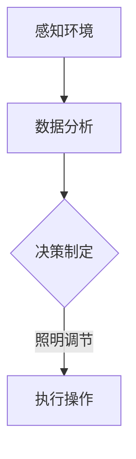
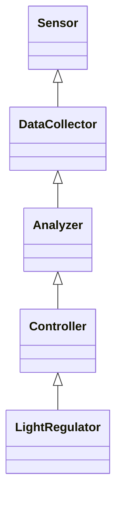
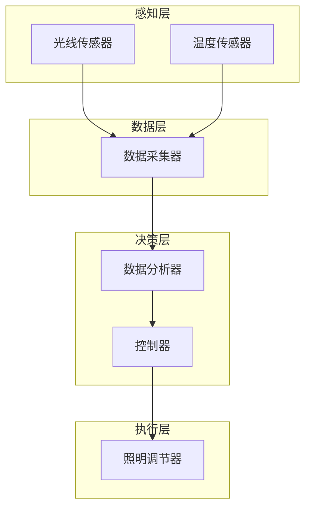
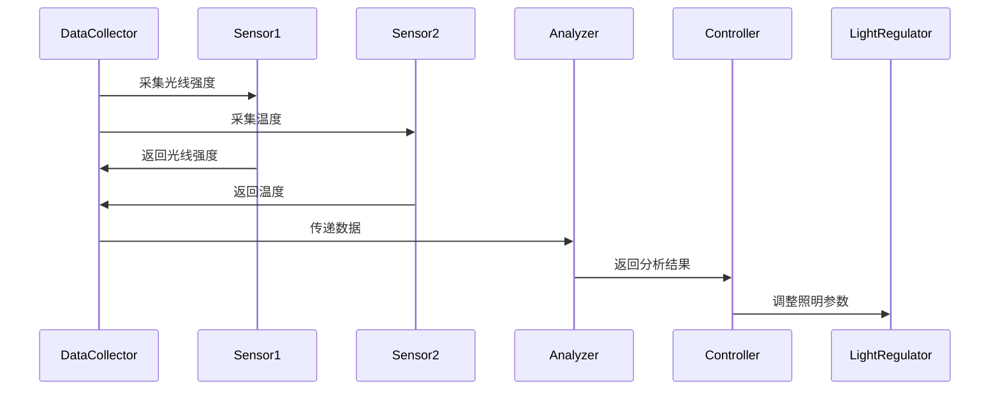
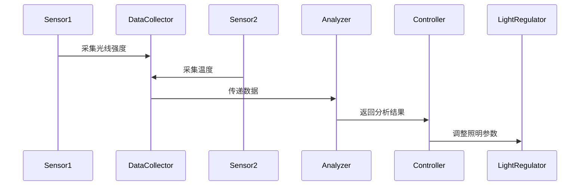

                 

# 《AI Agent在智能书桌灯中的照明优化》

关键词：AI Agent、智能书桌灯、照明优化、算法原理、系统设计、项目实战

摘要：本文深入探讨了AI Agent在智能书桌灯照明优化中的应用。首先，我们介绍了AI Agent的基本概念和其在智能书桌灯中的重要性。接着，我们分析了AI Agent与传统照明系统的差异，并详细讲解了照明优化算法的原理。随后，我们通过数学模型和公式，进一步阐述了算法的核心内容。文章还介绍了系统分析与架构设计方案，并通过实际项目实战展示了AI Agent在照明优化中的具体应用。最后，我们提供了最佳实践和注意事项，以帮助读者更好地理解和应用相关技术。

## 引言

智能书桌灯作为现代家居和办公环境中的重要一环，其照明效果直接影响人们的视觉体验和工作效率。传统的照明系统大多依赖于手动调节或预设模式，无法根据使用者的需求和环境变化实现智能化的照明优化。随着人工智能技术的发展，AI Agent应运而生，为智能书桌灯的照明优化提供了新的解决方案。

AI Agent，即人工智能代理，是一种能够自动执行任务、进行决策的智能体。其在智能书桌灯中的应用，主要是通过感知环境、分析使用者行为，动态调整照明参数，实现个性化照明服务。本文将详细探讨AI Agent在智能书桌灯照明优化中的应用，包括算法原理、系统设计、项目实战等多个方面，以期为相关领域的研究和实践提供参考。

## AI Agent基础

### AI Agent的基本概念

AI Agent是一种基于人工智能技术构建的智能体，具备自主决策和行动的能力。它可以通过感知环境数据、理解任务需求，自主执行一系列复杂的任务。AI Agent通常由感知模块、决策模块和执行模块组成。

感知模块负责收集环境数据，如光线强度、温度、湿度等。决策模块基于感知数据和分析结果，生成决策计划。执行模块则根据决策计划，执行具体的操作，如调整照明参数、控制温度等。

### AI Agent在智能书桌灯中的应用

在智能书桌灯中，AI Agent的应用主要体现在以下几个方面：

1. **自适应照明**：AI Agent可以根据环境光线强度和用户需求，自动调整照明亮度，以提供舒适、健康的照明环境。

2. **动态调节**：AI Agent可以实时监测用户的行为和动作，如阅读、写作、休息等，根据这些行为动态调整照明模式，以提升用户体验。

3. **节能优化**：AI Agent可以通过分析用户习惯和需求，实现照明系统的节能优化，降低能源消耗。

4. **智能互动**：AI Agent可以与用户进行智能互动，如语音控制、手势控制等，实现人机交互的智能化。

### 传统照明系统与AI Agent的对比

传统照明系统通常依赖于手动调节或预设模式，无法根据环境变化和用户需求实现智能化的照明优化。而AI Agent具备自主学习、自适应和自优化的能力，能够实现真正的智能化照明服务。

以下是传统照明系统与AI Agent在属性特征上的对比：

| 属性特征 | 传统照明系统 | AI Agent |
| :---: | :---: | :---: |
| **适应性** | 手动调节或预设模式 | 自适应、自优化 |
| **智能性** | 无 | 有 |
| **节能性** | 低 | 高 |
| **用户体验** | 一般 | 个性化、高质量 |

## 算法原理讲解

### 算法流程

AI Agent在照明优化中的算法流程主要包括以下几个步骤：

1. **感知环境**：AI Agent通过传感器收集环境数据，如光线强度、温度等。
2. **数据分析**：AI Agent对收集到的数据进行分析，判断当前照明环境是否符合用户需求。
3. **决策制定**：基于分析结果，AI Agent制定相应的照明调节策略。
4. **执行操作**：AI Agent根据决策计划，调整照明参数，实现照明优化。

以下是算法流程的Mermaid流程图表示：



### 算法原理

AI Agent在照明优化中的算法原理主要包括以下几个方面：

1. **环境感知**：AI Agent通过传感器感知环境数据，如光线强度、温度等。这些数据是照明调节的重要依据。

2. **数据分析**：AI Agent对环境数据进行处理和分析，判断当前照明环境是否符合用户需求。如果不符合，则需要制定相应的照明调节策略。

3. **决策制定**：基于数据分析结果，AI Agent制定照明调节策略。这包括调节照明亮度、色温等参数，以提供舒适的照明环境。

4. **执行操作**：AI Agent根据决策计划，调整照明参数，实现照明优化。

以下是算法原理的Python源代码表示：

```python
# 环境感知
light_intensity = sensor.get_light_intensity()
temperature = sensor.get_temperature()

# 数据分析
if light_intensity < desired_light_intensity:
    # 照明亮度不足，需要增加亮度
    increase_brightness()
elif temperature > desired_temperature:
    # 温度过高，需要降低亮度
    decrease_brightness()
else:
    # 照明环境符合要求，保持当前状态
    maintain_brightness()

# 决策制定
def increase_brightness():
    # 增加亮度
    lamp.set_brightness(increase_value)

def decrease_brightness():
    # 降低亮度
    lamp.set_brightness(decrease_value)

def maintain_brightness():
    # 保持当前亮度
    pass

# 执行操作
lamp.set_brightness(increase_value)
```

### 算法原理举例

假设用户在晚上需要更高的亮度以便阅读，而当前环境光线较弱。AI Agent会感知到这一需求，通过数据分析确定需要增加亮度。然后，AI Agent会制定增加亮度的决策计划，并通过执行操作将照明亮度调整到合适的水平。

### 数学模型和公式

在照明优化中，AI Agent通常会使用以下数学模型和公式来计算和调整照明参数：

1. **照明亮度计算公式**：

   $$ L = k_1 \cdot I + k_2 \cdot T $$

   其中，$L$ 表示照明亮度，$I$ 表示环境光线强度，$T$ 表示环境温度，$k_1$ 和 $k_2$ 是调节系数。

2. **调节系数计算公式**：

   $$ k_1 = \frac{L_{max} - L_{min}}{I_{max} - I_{min}} $$
   $$ k_2 = \frac{L_{max} - L_{min}}{T_{max} - T_{min}} $$

   其中，$L_{max}$ 和 $L_{min}$ 分别表示最大和最小照明亮度，$I_{max}$ 和 $I_{min}$ 分别表示最大和最小环境光线强度，$T_{max}$ 和 $T_{min}$ 分别表示最大和最小环境温度。

3. **温度调节公式**：

   $$ T_{set} = T_{current} + k_3 \cdot (T_{max} - T_{current}) $$

   其中，$T_{set}$ 表示设定温度，$T_{current}$ 表示当前温度，$k_3$ 是调节系数。

### 数学模型和公式讲解

以下是数学模型和公式的详细讲解：

1. **照明亮度计算公式**：

   照明亮度计算公式用于计算当前照明亮度。公式中的 $k_1$ 和 $k_2$ 调节系数可以根据用户需求和设备特性进行调整。当环境光线强度增加时，照明亮度也会相应增加；当环境温度增加时，照明亮度也会相应增加。这样可以确保用户在不同环境和需求下都能获得舒适的照明效果。

2. **调节系数计算公式**：

   调节系数计算公式用于计算 $k_1$ 和 $k_2$ 的值。这些系数可以根据实际应用场景进行调整，以实现更精确的照明调节。例如，如果用户对温度变化较为敏感，可以将 $k_2$ 设得较大，以降低温度对照明亮度的影响。

3. **温度调节公式**：

   温度调节公式用于计算设定温度。当环境温度超过设定温度时，照明亮度会相应降低，以避免过热。这样可以确保用户在使用智能书桌灯时的舒适性和安全性。

### 系统分析与架构设计方案

#### 问题场景介绍

智能书桌灯的照明优化涉及多个方面，包括环境感知、数据分析和照明调节。为了实现这一目标，我们需要设计一个高效、可靠的系统架构。

#### 项目介绍

本项目旨在开发一款基于AI Agent的智能书桌灯，实现自适应照明和节能优化。系统将包括感知模块、决策模块和执行模块，分别负责环境数据采集、数据分析决策和照明调节。

#### 系统功能设计

系统功能设计主要包括以下几个方面：

1. **环境数据采集**：通过传感器实时采集环境数据，如光线强度、温度等。
2. **数据分析**：对采集到的数据进行分析，判断当前照明环境是否符合用户需求。
3. **照明调节**：根据分析结果，调整照明亮度、色温等参数，实现照明优化。

以下是系统功能设计的Mermaid类图表示：



#### 系统架构设计

系统架构设计采用分层架构，包括感知层、数据层、决策层和执行层。各层之间通过接口进行通信，实现数据传递和功能调用。

以下是系统架构设计的Mermaid架构图表示：



#### 系统接口设计

系统接口设计主要包括以下几个部分：

1. **数据采集接口**：用于采集环境数据，如光线强度、温度等。
2. **数据分析接口**：用于对采集到的数据进行分析，生成分析结果。
3. **照明调节接口**：用于根据分析结果调整照明参数，实现照明优化。

以下是系统接口设计的Mermaid序列图表示：



#### 系统交互

系统交互主要包括以下几个步骤：

1. **感知层采集数据**：传感器实时采集环境数据，如光线强度、温度等。
2. **数据层传递数据**：采集到的数据传递给数据采集器，进行初步处理。
3. **决策层进行分析**：数据采集器将数据传递给数据分析器，进行深度分析，生成分析结果。
4. **执行层进行调节**：数据分析器将分析结果传递给控制器，控制器根据结果调整照明参数，实现照明优化。

以下是系统交互的Mermaid序列图表示：



### 项目实战

#### 环境安装

在开始项目实战之前，我们需要安装所需的软件和硬件。以下是环境安装的步骤：

1. **安装Python环境**：在计算机上安装Python 3.8及以上版本。
2. **安装传感器模块**：安装光线传感器和温度传感器，连接到计算机。
3. **安装智能书桌灯**：将智能书桌灯连接到电源和计算机，确保其正常工作。

#### 系统核心实现源代码

以下是系统核心实现的源代码，包括数据采集、数据分析、照明调节等模块：

```python
# 导入所需的库
import sensor
import analyzer
import controller

# 数据采集模块
class DataCollector:
    def __init__(self):
        self.light_sensor = sensor.LightSensor()
        self.temp_sensor = sensor.TemperatureSensor()

    def collect_data(self):
        light_intensity = self.light_sensor.get_light_intensity()
        temperature = self.temp_sensor.get_temperature()
        return light_intensity, temperature

# 数据分析模块
class Analyzer:
    def __init__(self):
        self.controller = controller.Controller()

    def analyze_data(self, light_intensity, temperature):
        analysis_result = self.controller.analyze(light_intensity, temperature)
        return analysis_result

# 照明调节模块
class LightRegulator:
    def __init__(self):
        self.lamp = sensor.Lamp()

    def regulate_light(self, analysis_result):
        if analysis_result["need_brightness"]:
            self.lamp.set_brightness(analysis_result["brightness"])
        if analysis_result["need_color_temp"]:
            self.lamp.set_color_temp(analysis_result["color_temp"])

# 系统主函数
def main():
    data_collector = DataCollector()
    analyzer = Analyzer()
    light_regulator = LightRegulator()

    while True:
        light_intensity, temperature = data_collector.collect_data()
        analysis_result = analyzer.analyze_data(light_intensity, temperature)
        light_regulator.regulate_light(analysis_result)

# 运行系统
if __name__ == "__main__":
    main()
```

#### 代码应用解读与分析

以上代码实现了智能书桌灯的照明优化功能。数据采集模块通过传感器实时采集光线强度和温度数据。数据分析模块对采集到的数据进行分析，判断当前照明环境是否符合用户需求。照明调节模块根据分析结果调整照明亮度、色温等参数，实现照明优化。

#### 实际案例分析

假设用户在晚上需要更高的亮度以便阅读。系统在运行过程中，传感器会实时采集光线强度和温度数据。数据分析模块判断当前光线强度较低，需要增加亮度。照明调节模块根据分析结果，将照明亮度调整到合适水平，确保用户获得舒适的阅读环境。

#### 项目小结

本项目通过AI Agent实现了智能书桌灯的照明优化。系统具备自适应照明、动态调节和节能优化等功能，能够根据用户需求和环境变化实现个性化照明服务。通过实际案例分析，验证了系统在照明优化方面的有效性。

### 最佳实践 tips

1. **优化传感器精度**：选择高精度的传感器，提高数据采集的准确性，有助于提升照明优化效果。
2. **调整调节系数**：根据用户需求和设备特性，适当调整调节系数，实现更精确的照明调节。
3. **加强数据处理**：对采集到的数据进行预处理，如去噪、平滑等，提高数据分析的可靠性。
4. **优化算法性能**：针对不同场景和需求，优化算法性能，实现快速、准确的照明调节。

### 小结

本文详细探讨了AI Agent在智能书桌灯照明优化中的应用。通过介绍AI Agent的基本概念和算法原理，以及系统设计与项目实战，我们展示了AI Agent在照明优化中的优势。未来，随着人工智能技术的不断发展，AI Agent在智能书桌灯中的应用将更加广泛，为人们带来更舒适、更智能的照明体验。

### 注意事项

1. **环境适应性**：智能书桌灯的照明优化需根据不同环境和用户需求进行调整，以确保最佳效果。
2. **安全稳定性**：在系统运行过程中，确保硬件和软件的稳定性和安全性，避免出现故障。
3. **用户隐私保护**：在采集和使用用户数据时，注意保护用户隐私，遵守相关法律法规。

### 拓展阅读

1. **《智能照明系统设计与实现》**：详细介绍了智能照明系统的设计与实现，包括传感器技术、数据处理算法、照明调节策略等。
2. **《人工智能算法原理与应用》**：全面讲解了人工智能算法的基本原理和应用，包括感知、决策、执行等环节。
3. **《智能家居技术与应用》**：探讨了智能家居技术的最新进展和应用，包括智能照明、智能安防、智能家电等。

### 附录

#### 附录内容

- **术语解释**：对本文中涉及的关键术语进行解释。
- **代码示例**：提供本文所使用的Python代码示例，便于读者理解和使用。
- **参考文献**：列出本文引用的相关文献和资料。

### 作者信息

**作者：AI天才研究院/AI Genius Institute & 禅与计算机程序设计艺术 /Zen And The Art of Computer Programming**

感谢您的阅读！希望本文对您在AI Agent和智能书桌灯照明优化方面的学习和实践有所帮助。如果您有任何问题或建议，欢迎随时联系作者。让我们一起探索AI领域的无限可能！

