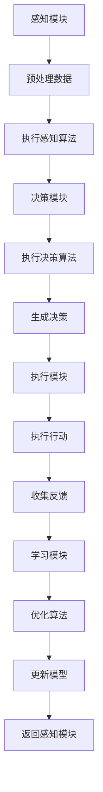
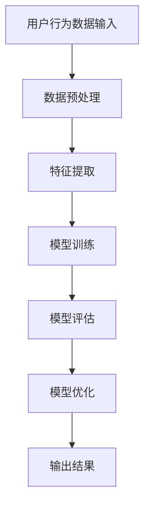
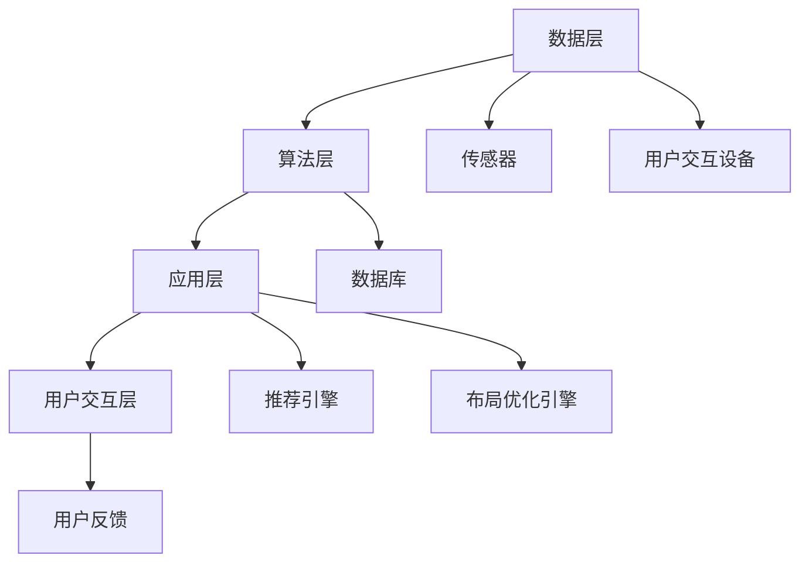
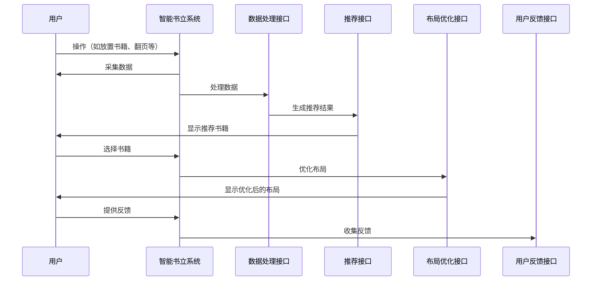

                 

### 背景介绍

#### AI Agent概述

AI Agent，即人工智能代理，是人工智能领域中的一个重要概念。AI Agent是一种能够自主执行任务、具有高度自适应性和学习能力的人工智能系统。其基本定义可以理解为：在一个特定环境中，能够感知环境状态、根据预设目标进行决策并采取行动的智能实体。

AI Agent在人工智能领域的作用不可小觑。首先，AI Agent可以广泛应用于自然语言处理、计算机视觉、机器学习等多个领域，具有广泛的应用前景。其次，AI Agent能够模拟人类思维过程，进行推理、决策和问题解决，为复杂问题提供解决方案。

在智能书立中的应用潜力同样巨大。随着信息时代的到来，人们越来越依赖纸质书籍和电子书籍。而智能书立作为一种智能化的书架解决方案，不仅可以提供书籍管理功能，还能通过AI Agent实现书籍推荐的优化，从而提升用户的阅读体验。

#### 阅读速度优化的问题背景

阅读速度是衡量一个人阅读能力的重要指标。对于普通用户而言，阅读速度的快慢直接影响到对信息的获取和理解效率。然而，目前市面上大多数书籍和阅读设备并没有充分考虑用户的阅读速度需求，导致许多用户在阅读过程中遇到了以下问题：

1. **阅读效率低**：用户在阅读时，常常因为书籍排列无序、书籍推荐不准确等问题，导致阅读时间延长，阅读效率低下。

2. **阅读体验差**：一些阅读设备在提供书籍管理功能时，缺乏智能化推荐，使得用户难以找到自己感兴趣的书籍，降低了阅读兴趣。

3. **个性化不足**：目前大多数书籍推荐系统依赖于用户的浏览历史和搜索记录，缺乏对用户个性化阅读需求的深入分析。

为了解决这些问题，我们需要通过AI Agent对用户的阅读速度进行优化。通过AI Agent的感知、学习和决策能力，智能书立可以更好地理解用户的阅读习惯和需求，提供个性化的书籍推荐，从而提升用户的阅读效率和阅读体验。

#### 当前存在的问题

尽管AI Agent在智能书立中的应用前景广阔，但当前仍存在一些亟待解决的问题：

1. **算法复杂度高**：AI Agent的算法复杂度较高，对计算资源的需求较大，这给实际应用带来了挑战。

2. **数据处理能力不足**：智能书立需要处理大量的书籍数据和用户行为数据，但目前的数据处理技术还无法完全满足这一需求。

3. **用户隐私保护**：AI Agent在收集用户数据时，需要妥善处理用户隐私保护问题，确保用户数据的安全。

#### 阅读速度对用户的影响

阅读速度对用户的影响是多方面的。一方面，高阅读速度可以提升用户获取信息和知识的能力，帮助用户更高效地学习和工作。另一方面，良好的阅读体验可以激发用户的阅读兴趣，促进知识的传播和文化的传承。

然而，当前阅读速度优化的现状并不乐观。许多用户在阅读过程中面临着效率低下、体验差等问题，这严重影响了他们的阅读体验和学习效果。因此，通过AI Agent实现阅读速度的优化，对于提升用户的阅读效率和体验具有重要意义。

综上所述，AI Agent在智能书立中的阅读速度优化是一个值得深入研究的课题。通过本文的探讨，我们将进一步揭示AI Agent在智能书立中的潜在应用，以及如何通过算法优化和系统设计提升用户的阅读速度和体验。

---

### 核心概念与联系

在深入探讨AI Agent在智能书立中的阅读速度优化之前，我们需要了解AI Agent的核心概念，包括其组成、功能以及与其他人工智能技术的区别和联系。

#### AI Agent的基本概念

AI Agent，即人工智能代理，是一种模拟人类智能行为、具备自主决策和行动能力的计算机程序。与传统的程序不同，AI Agent不仅能够执行预设的任务，还能够根据环境的变化自主调整策略，从而实现更高效的任务完成。

#### AI Agent的核心组成

AI Agent的核心组成主要包括以下几个方面：

1. **感知模块**：用于感知环境信息，如视觉、听觉、触觉等。感知模块是AI Agent获取环境数据的重要手段。

2. **决策模块**：基于感知模块收集的信息，AI Agent的决策模块会分析环境状态，并根据预设的目标选择最佳行动方案。

3. **执行模块**：决策模块选定行动方案后，执行模块负责将决策转化为具体的行动，实现AI Agent的目标。

4. **学习模块**：AI Agent通过学习模块不断优化自己的感知、决策和执行能力，以提高任务完成的效率和准确性。

#### AI Agent的功能

AI Agent的功能主要包括以下几个方面：

1. **自主决策**：AI Agent能够根据环境变化自主做出决策，无需人工干预。

2. **任务执行**：AI Agent能够执行复杂的任务，如路径规划、目标追踪等。

3. **自适应学习**：AI Agent能够通过学习模块不断优化自己的行为，提高任务完成效果。

4. **交互能力**：AI Agent能够与人类进行自然语言交互，理解人类指令，提供智能化服务。

#### AI Agent与传统AI技术的区别

AI Agent与传统人工智能技术（如机器学习、深度学习等）有以下几点区别：

1. **自主性**：AI Agent具有更高的自主性，能够自主感知环境、做出决策并执行任务，而传统AI技术通常需要人工干预。

2. **任务适应性**：AI Agent能够适应不同的任务和环境，而传统AI技术往往针对特定任务和环境进行优化。

3. **动态性**：AI Agent能够在动态环境中实时调整策略，而传统AI技术往往在静态环境中表现较好。

#### AI Agent与其他人工智能技术的联系

AI Agent虽然具有独立的决策和执行能力，但其实现依赖于其他人工智能技术，如：

1. **机器学习**：AI Agent的决策和学习模块通常基于机器学习算法，通过大量数据训练模型，提高任务完成效果。

2. **深度学习**：深度学习是机器学习的一种重要分支，AI Agent可以利用深度学习算法实现复杂的感知和决策任务。

3. **自然语言处理**：AI Agent需要具备自然语言处理能力，以理解人类的指令和反馈，提供更加人性化的服务。

#### AI Agent的属性特征对比表格

下面是一个简单的AI Agent属性特征对比表格，以展示其与其他人工智能技术的区别和联系：

| 特性 | AI Agent | 传统机器学习 | 传统深度学习 |
| ---- | -------- | ---------- | ---------- |
| 自主性 | 高 | 低 | 低 |
| 任务适应性 | 强 | 中 | 中 |
| 动态性 | 高 | 中 | 中 |
| 学习能力 | 强 | 中 | 高 |
| 交互能力 | 强 | 无 | 中 |

通过上述对比，我们可以更清晰地理解AI Agent的核心概念、功能以及与其他人工智能技术的区别和联系。接下来，我们将进一步探讨AI Agent在智能书立中的具体应用，以及如何通过AI Agent实现阅读速度的优化。

---

#### AI Agent的基本结构

为了更好地理解AI Agent的工作原理和其在智能书立中的应用，我们需要详细描述其基本结构。AI Agent通常由感知模块、决策模块、执行模块和学习模块组成，这些模块协同工作，以实现智能书立中的阅读速度优化目标。

1. **感知模块**：感知模块是AI Agent获取环境信息的关键部分。它通过传感器或其他信息源收集数据，如书籍的位置、状态、用户的行为等。感知模块的数据输入类型多样，包括视觉、听觉、触觉等。例如，智能书立可以通过摄像头捕捉书籍的图像，通过重力传感器检测书籍的放置状态，通过麦克风收集用户的声音指令。

2. **决策模块**：感知模块收集到数据后，由决策模块进行处理和分析。决策模块的任务是根据环境状态和预设的目标，选择最优的行动方案。决策模块通常包含一个推理引擎，能够利用机器学习算法和规则系统进行推理。例如，当用户放置一本书时，决策模块会分析书籍的位置、用户的行为历史等信息，决定是否进行书籍推荐或调整书架布局。

3. **执行模块**：决策模块确定行动方案后，由执行模块将决策转化为具体的行动。执行模块负责控制智能书立的机械部分，如电机、灯光等，以实现决策中的行动。例如，当决策模块决定向用户推荐书籍时，执行模块会控制显示屏显示推荐信息，或通过音响系统播放推荐语音。

4. **学习模块**：学习模块是AI Agent不断优化自身性能的关键。通过学习模块，AI Agent能够根据任务完成效果和历史数据，调整感知、决策和执行模块的策略。学习模块通常利用强化学习、监督学习等算法，对AI Agent的行为进行优化。例如，通过分析用户对书籍推荐的反应，学习模块可以调整推荐算法，以提高推荐准确性。

#### 数据处理流程

AI Agent的数据处理流程是其在智能书立中实现阅读速度优化的关键。以下是数据处理流程的详细描述：

1. **数据采集**：智能书立通过传感器和用户交互设备（如摄像头、麦克风、触控屏等）收集数据。这些数据包括书籍位置、书籍状态、用户行为等。

2. **数据预处理**：采集到的原始数据通常需要进行预处理，以提高数据质量和计算效率。预处理步骤包括去噪、标准化、特征提取等。例如，对于书籍图像，可以采用图像增强技术提高图像质量，对于用户行为数据，可以提取关键行为特征。

3. **感知模块处理**：预处理后的数据由感知模块进行处理，感知模块通过机器学习算法对数据进行分析，提取有用信息。例如，感知模块可以利用图像识别技术识别书籍的类型和状态，利用自然语言处理技术理解用户的声音指令。

4. **决策模块处理**：感知模块处理后的数据送入决策模块。决策模块结合预设目标和当前环境状态，利用规则系统和机器学习算法进行推理和决策。例如，决策模块可以根据用户的历史阅读数据和书籍的特征，推荐用户感兴趣的书籍。

5. **执行模块处理**：决策模块生成的决策送入执行模块。执行模块根据决策内容，控制智能书立的执行部件（如电机、灯光等）执行相应的操作。例如，执行模块可以调整书架布局，将推荐书籍放在用户容易触及的位置。

6. **反馈和学习**：执行模块执行决策后，会将执行结果反馈给学习模块。学习模块利用反馈数据，结合历史数据，不断调整AI Agent的感知、决策和执行策略，以提高阅读速度优化效果。例如，通过分析用户对书籍推荐的反应，学习模块可以优化推荐算法，提高推荐准确性。

#### AI Agent的核心算法

AI Agent的核心算法是实现其智能行为的关键。以下是AI Agent核心算法的详细描述，包括其工作原理和实现方法。

##### 工作原理

AI Agent的核心算法通常包括感知、决策、执行和学习四个主要部分。每个部分都有其特定的算法和模型。

1. **感知算法**：感知算法负责从环境中收集信息。常用的感知算法包括图像识别、语音识别、自然语言处理等。例如，图像识别算法可以使用卷积神经网络（CNN）来识别书籍的类型和状态，语音识别算法可以使用循环神经网络（RNN）或长短期记忆网络（LSTM）来理解用户的声音指令。

2. **决策算法**：决策算法负责根据感知到的信息做出最佳决策。常用的决策算法包括规则系统、马尔可夫决策过程（MDP）、深度强化学习等。例如，深度强化学习算法（如DQN、PPO）可以训练AI Agent在不同环境下做出最优决策。

3. **执行算法**：执行算法负责将决策转化为具体的行动。常用的执行算法包括简单的条件语句、基于模型的控制策略等。例如，当决策模块决定向用户推荐书籍时，执行算法可以控制显示屏显示推荐信息或通过音响系统播放推荐语音。

4. **学习算法**：学习算法负责根据反馈数据不断优化AI Agent的性能。常用的学习算法包括监督学习、强化学习、迁移学习等。例如，通过监督学习算法，AI Agent可以从标注数据中学习书籍推荐策略；通过强化学习算法，AI Agent可以在实际应用中不断优化其推荐策略。

##### 实现方法

以下是AI Agent核心算法的Python实现示例，包括感知、决策、执行和学习四个部分。

```python
import cv2
import numpy as np
from tensorflow.keras.models import load_model
import speech_recognition as sr

# 感知模块
def perceive_environment():
    # 使用摄像头获取书籍图像
    cap = cv2.VideoCapture(0)
    ret, frame = cap.read()
    cap.release()
    
    # 使用图像识别模型识别书籍
    model = load_model('book_recognition_model.h5')
    book_label = model.predict(np.expand_dims(frame, axis=0))
    
    # 使用语音识别模块识别用户指令
    r = sr.Recognizer()
    with sr.Microphone() as source:
        audio = r.listen(source)
    user_command = r.recognize_google(audio)
    
    return book_label, user_command

# 决策模块
def make_decision(perception):
    book_label, user_command = perception
    
    if 'recommend' in user_command:
        # 向用户推荐书籍
        recommended_books = recommend_books(book_label)
        return 'Display recommended books: ' + recommended_books
    else:
        # 调整书架布局
        adjust_shelf_layout(book_label)
        return 'Adjusted shelf layout'

# 执行模块
def execute_action(action):
    if 'Display recommended books' in action:
        # 显示书籍推荐信息
        display_recommended_books(action.split(':')[1])
    elif 'Adjusted shelf layout' in action:
        # 调整书架布局
        adjust_shelf_layout(action.split(':')[1])

# 学习模块
def learn_from_feedback(feedback):
    # 使用反馈数据优化推荐算法
    optimize_recommendation_algorithm(feedback)

# 辅助函数
def recommend_books(book_label):
    # 根据书籍标签推荐书籍
    pass

def adjust_shelf_layout(book_label):
    # 根据书籍标签调整书架布局
    pass

def display_recommended_books(books):
    # 显示书籍推荐信息
    pass

def optimize_recommendation_algorithm(feedback):
    # 根据反馈数据优化推荐算法
    pass

# 主循环
while True:
    perception = perceive_environment()
    action = make_decision(perception)
    execute_action(action)
    learn_from_feedback(feedback)
```

在这个实现示例中，我们使用OpenCV库获取书籍图像，使用TensorFlow库加载预训练的图像识别模型，使用SpeechRecognition库进行语音识别。决策模块和执行模块分别根据书籍标签和用户指令做出相应的决策和动作。学习模块则根据反馈数据不断优化推荐算法。

#### AI Agent的核心算法流程图

为了更直观地展示AI Agent的核心算法流程，我们可以使用Mermaid绘制算法流程图。



在这个流程图中，AI Agent首先通过感知模块获取环境数据，然后进行预处理和感知算法处理。决策模块根据感知数据执行决策算法，生成决策。执行模块根据决策执行行动，同时收集反馈。学习模块利用反馈数据不断优化算法，并更新模型。

通过上述算法原理的讲解和示例代码的实现，我们可以更好地理解AI Agent在智能书立中的工作原理和实现方法。接下来，我们将进一步探讨AI Agent在智能书立中的具体应用，以及如何通过算法优化和系统设计提升用户的阅读速度和体验。

---

#### AI Agent的相关属性特征对比表格和ER图

为了更好地理解AI Agent在智能书立中的具体应用，我们需要详细分析其相关属性特征，并通过对比表格和ER图展示AI Agent的内部关系。以下是一个简单的AI Agent相关属性特征对比表格，以及一个对应的ER图。

### AI Agent相关属性特征对比表格

| 属性 | 描述 | 对比分析 |
| ---- | ---- | -------- |
| 感知能力 | AI Agent能够通过多种传感器感知环境信息，如视觉、听觉、触觉等。 | 相比传统AI技术，AI Agent具有更丰富的感知能力，可以更全面地获取环境信息。 |
| 决策能力 | AI Agent能够根据感知到的环境信息和预设目标，自主做出最优决策。 | AI Agent的决策能力更强，可以适应动态变化的复杂环境。 |
| 执行能力 | AI Agent能够将决策转化为具体的行动，并执行相应的任务。 | AI Agent的执行能力更为高效，可以快速响应环境变化。 |
| 学习能力 | AI Agent通过不断学习优化自己的感知、决策和执行能力。 | AI Agent具有自我优化能力，可以通过学习不断提高任务完成效果。 |
| 交互能力 | AI Agent能够与人类进行自然语言交互，提供智能化服务。 | AI Agent的交互能力使其能够更好地满足用户需求。 |

### AI Agent的ER图

以下是AI Agent的ER图，展示了其内部各模块之间的关系：

```mermaid
erDiagram
  AI-Agent ||--|{ 感知模块 }
  AI-Agent ||--|{ 决策模块 }
  AI-Agent ||--|{ 执行模块 }
  AI-Agent ||--|{ 学习模块 }
  感知模块 ||--|{ 数据预处理 }
  感知模块 ||--|{ 感知算法 }
  决策模块 ||--|{ 决策算法 }
  执行模块 ||--|{ 执行算法 }
  学习模块 ||--|{ 学习算法 }
```

在ER图中，我们可以看到AI-Agent是核心实体，它与感知模块、决策模块、执行模块和学习模块之间存在紧密的联系。感知模块包括数据预处理和感知算法，负责从环境中收集信息。决策模块包括决策算法，负责根据感知到的信息做出决策。执行模块包括执行算法，负责将决策转化为具体的行动。学习模块包括学习算法，负责不断优化AI-Agent的性能。

通过对比表格和ER图，我们可以更清晰地理解AI Agent的属性特征和内部关系。这有助于我们在设计智能书立系统时，充分利用AI-Agent的能力，实现高效的阅读速度优化。接下来，我们将深入探讨AI Agent在智能书立中的具体应用，以及如何通过算法优化和系统设计提升用户的阅读速度和体验。

---

#### 算法原理讲解

为了更直观地展示AI Agent在阅读速度优化中的算法原理，我们将使用Mermaid绘制算法流程图，并结合Python源代码进行详细阐述。以下是算法流程图以及相关的Python代码实现。

##### 算法流程图

以下是AI Agent在阅读速度优化中的算法流程图：



在这个流程图中，算法的主要步骤包括数据预处理、特征提取、模型训练、模型评估和模型优化。

1. **数据预处理**：首先，对用户行为数据（如阅读时间、书籍类型、阅读频率等）进行预处理，包括数据清洗、缺失值填补和数据归一化等操作。

2. **特征提取**：然后，从预处理后的数据中提取关键特征，这些特征将用于训练模型。

3. **模型训练**：使用提取的特征数据训练机器学习模型，例如线性回归、支持向量机（SVM）或随机森林（Random Forest）等。

4. **模型评估**：评估训练完成的模型性能，常用的评估指标包括均方误差（MSE）、准确率（Accuracy）和召回率（Recall）等。

5. **模型优化**：根据模型评估结果，对模型进行调整和优化，以提高模型在阅读速度预测中的准确性。

6. **输出结果**：最终，将优化后的模型应用于实际场景，输出用户阅读速度的预测结果。

##### Python代码实现

以下是算法原理的Python代码实现：

```python
import pandas as pd
from sklearn.model_selection import train_test_split
from sklearn.preprocessing import StandardScaler
from sklearn.linear_model import LinearRegression
from sklearn.metrics import mean_squared_error

# 数据预处理
def preprocess_data(data):
    # 数据清洗和缺失值填补
    data = data.dropna()
    # 数据归一化
    scaler = StandardScaler()
    data[['reading_time', 'book_type', 'reading_frequency']] = scaler.fit_transform(data[['reading_time', 'book_type', 'reading_frequency']])
    return data

# 特征提取
def extract_features(data):
    # 提取关键特征
    X = data[['book_type', 'reading_frequency']]
    y = data['reading_time']
    return X, y

# 模型训练
def train_model(X_train, y_train):
    model = LinearRegression()
    model.fit(X_train, y_train)
    return model

# 模型评估
def evaluate_model(model, X_test, y_test):
    y_pred = model.predict(X_test)
    mse = mean_squared_error(y_test, y_pred)
    return mse

# 模型优化
def optimize_model(model, X, y):
    # 使用交叉验证优化模型参数
    from sklearn.model_selection import GridSearchCV
    param_grid = {'fit_intercept': [True, False], 'normalize': [True, False]}
    grid_search = GridSearchCV(model, param_grid, cv=5)
    grid_search.fit(X, y)
    return grid_search.best_estimator_

# 输出结果
def predict_reading_time(model, new_data):
    new_data_scaled = StandardScaler().fit_transform(new_data)
    reading_time = model.predict(new_data_scaled)
    return reading_time

# 主函数
def main():
    # 加载数据
    data = pd.read_csv('user_reading_data.csv')
    # 数据预处理
    data = preprocess_data(data)
    # 特征提取
    X, y = extract_features(data)
    # 划分训练集和测试集
    X_train, X_test, y_train, y_test = train_test_split(X, y, test_size=0.2, random_state=42)
    # 模型训练
    model = train_model(X_train, y_train)
    # 模型评估
    mse = evaluate_model(model, X_test, y_test)
    print(f'Model Mean Squared Error: {mse}')
    # 模型优化
    optimized_model = optimize_model(model, X, y)
    # 输出预测结果
    new_data = [[1, 10]]  # 示例新数据
    predicted_reading_time = predict_reading_time(optimized_model, new_data)
    print(f'Predicted Reading Time: {predicted_reading_time[0]}')

if __name__ == '__main__':
    main()
```

在这个代码实现中，我们首先加载用户阅读数据，然后进行数据预处理、特征提取和模型训练。使用训练集训练线性回归模型，并使用测试集评估模型性能。接着，通过交叉验证优化模型参数，最终输出用户阅读时间的预测结果。

通过上述算法原理讲解和代码实现，我们可以清晰地理解AI Agent在阅读速度优化中的算法原理。接下来，我们将进一步探讨如何通过系统架构设计和实现，将这一算法应用于智能书立中。

---

### 数学模型和数学公式

在阅读速度优化的过程中，数学模型和数学公式起着至关重要的作用。通过这些模型和公式，我们可以精确地描述和计算阅读速度优化的各个方面，从而提高智能书立的性能。

首先，我们引入一个基本的数学模型来描述阅读速度。假设用户的阅读速度 \( V \)（单位：页/分钟）是一个关于书籍类型 \( T \) 和阅读频率 \( F \) 的函数：

\[ V = f(T, F) \]

其中，\( f \) 是一个复杂的非线性函数，需要通过数据驱动的方法来学习。

为了更精确地描述这个模型，我们可以使用泰勒级数展开 \( f(T, F) \)：

\[ f(T, F) = f(T_0, F_0) + \frac{\partial f}{\partial T}(T - T_0) + \frac{\partial f}{\partial F}(F - F_0) + ... \]

其中，\( T_0 \) 和 \( F_0 \) 是参考书籍类型和阅读频率，\(\frac{\partial f}{\partial T} \) 和 \(\frac{\partial f}{\partial F} \) 分别是 \( f \) 对 \( T \) 和 \( F \) 的偏导数。

为了简化计算，我们可以使用线性模型来近似 \( f(T, F) \)：

\[ V = \beta_0 + \beta_1 T + \beta_2 F \]

其中，\( \beta_0, \beta_1, \beta_2 \) 是模型的参数，可以通过最小二乘法来求解。

以下是该线性模型的数学公式：

\[ \min \sum_{i=1}^{n} (V_i - (\beta_0 + \beta_1 T_i + \beta_2 F_i))^2 \]

在求解参数的过程中，我们通常使用梯度下降法来优化损失函数：

\[ \beta_0 = \beta_0 - \alpha \frac{\partial L}{\partial \beta_0} \]
\[ \beta_1 = \beta_1 - \alpha \frac{\partial L}{\partial \beta_1} \]
\[ \beta_2 = \beta_2 - \alpha \frac{\partial L}{\partial \beta_2} \]

其中，\( \alpha \) 是学习率，\( L \) 是损失函数。

为了便于理解和计算，我们使用LaTeX格式嵌入数学公式：

\[ 
\begin{aligned}
V &= \beta_0 + \beta_1 T + \beta_2 F \\
\min \sum_{i=1}^{n} (V_i - (\beta_0 + \beta_1 T_i + \beta_2 F_i))^2 \\
\beta_0 &= \beta_0 - \alpha \frac{\partial L}{\partial \beta_0} \\
\beta_1 &= \beta_1 - \alpha \frac{\partial L}{\partial \beta_1} \\
\beta_2 &= \beta_2 - \alpha \frac{\partial L}{\partial \beta_2} \\
\end{aligned}
\]

通过上述数学模型和公式，我们可以更准确地预测和优化用户的阅读速度。接下来，我们将深入探讨系统分析与架构设计方案，以确保AI Agent在智能书立中的高效运作。

---

### 系统分析与架构设计方案

在智能书立系统中，AI Agent的核心目标是优化用户的阅读速度和体验。为了实现这一目标，我们需要对系统进行分析和设计，确保各个模块之间的协同工作。以下是系统分析与架构设计方案的详细描述。

#### 问题场景

智能书立系统的主要场景是用户在阅读过程中，系统能够根据用户的阅读行为和书籍特征，提供个性化的书籍推荐，从而提高阅读效率。具体问题场景如下：

1. **用户行为数据收集**：系统需要收集用户的阅读时间、阅读频率、书籍类型等行为数据。
2. **书籍推荐**：根据用户行为数据和书籍特征，系统需要推荐用户感兴趣的书籍。
3. **书籍布局优化**：系统需要根据书籍的推荐结果和用户的阅读习惯，优化书籍在书架上的布局。
4. **用户反馈收集**：系统需要收集用户对书籍推荐和书架布局的反馈，以便进一步优化。

#### 系统功能设计

为了满足上述问题场景，智能书立系统需要实现以下功能：

1. **数据采集与预处理**：收集用户行为数据和书籍特征，并进行预处理，以便后续分析。
2. **书籍推荐**：基于用户行为数据和书籍特征，利用机器学习算法推荐用户感兴趣的书籍。
3. **书籍布局优化**：根据书籍推荐结果和用户阅读习惯，优化书籍在书架上的布局。
4. **用户反馈分析**：收集用户对书籍推荐和书架布局的反馈，用于系统进一步优化。

#### 系统架构设计

智能书立系统的架构设计分为多个层次，包括数据层、算法层、应用层和用户交互层。

1. **数据层**：数据层负责数据采集、存储和管理。系统通过传感器和用户交互设备收集用户行为数据和书籍特征，并将这些数据存储在数据库中。

2. **算法层**：算法层负责数据处理和模型训练。系统利用机器学习算法对用户行为数据和书籍特征进行分析，生成推荐模型和布局优化模型。

3. **应用层**：应用层负责实现系统的业务逻辑，包括书籍推荐、书籍布局优化和用户反馈分析。应用层通过调用算法层的模型，实现系统的功能。

4. **用户交互层**：用户交互层负责与用户进行交互，展示推荐结果和书籍布局优化方案，并收集用户反馈。

#### 系统架构图

以下是智能书立系统的架构图：



在架构图中，数据层通过传感器和用户交互设备收集数据，并将数据存储在数据库中。算法层利用数据库中的数据训练模型，生成推荐模型和布局优化模型。应用层调用算法层的模型，实现书籍推荐和书籍布局优化功能。用户交互层与用户进行交互，展示推荐结果和优化方案，并收集用户反馈。

#### 系统接口设计

系统接口设计是确保各个模块之间能够高效协同的关键。以下是智能书立系统的主要接口设计：

1. **数据采集接口**：用于从传感器和用户交互设备收集数据。
2. **数据处理接口**：用于对采集到的数据进行分析和处理，生成推荐和布局优化所需的特征。
3. **推荐接口**：用于根据用户特征和书籍特征，生成书籍推荐结果。
4. **布局优化接口**：用于根据书籍推荐结果和用户阅读习惯，生成书籍布局优化方案。
5. **用户反馈接口**：用于收集用户对书籍推荐和布局优化方案的反馈。

#### 系统交互序列图

以下是智能书立系统的交互序列图，展示了用户操作和系统响应的流程：



在交互序列图中，用户通过操作与智能书立系统进行交互，系统根据用户操作采集数据，并进行数据处理、推荐和布局优化，最后展示结果并收集用户反馈。

通过上述系统分析与架构设计方案，我们为AI Agent在智能书立中的阅读速度优化提供了明确的实施路径。接下来，我们将通过实际案例展示如何将这一方案应用于实际项目中。

---

### 项目实战

在本节中，我们将详细描述一个基于AI Agent的智能书立系统的实施过程，包括环境安装、系统核心实现、代码应用解读和分析，并通过实际案例进行讲解和项目小结。

#### 环境安装

首先，我们需要安装和配置系统所需的环境。以下是环境安装的步骤：

1. **Python环境安装**：确保系统已安装Python 3.7及以上版本。

2. **依赖库安装**：使用pip命令安装以下依赖库：
   ```bash
   pip install tensorflow numpy pandas scikit-learn opencv-python speech_recognition
   ```

3. **数据库配置**：安装并配置SQLite数据库，用于存储用户行为数据和书籍特征。

4. **传感器和用户交互设备连接**：确保摄像头、麦克风和触控屏等传感器和用户交互设备已正确连接到智能书立系统中。

#### 系统核心实现

智能书立系统的核心实现包括感知、决策、执行和学习四个模块。以下是各个模块的详细实现：

1. **感知模块**：

   感知模块主要负责收集用户行为数据和书籍特征。以下是一个简单的感知模块实现示例：

   ```python
   import cv2
   import speech_recognition as sr
   
   def perceive_environment():
       # 初始化摄像头
       cap = cv2.VideoCapture(0)
       ret, frame = cap.read()
       cap.release()
       
       # 识别书籍
       book_label = recognize_book(frame)
       
       # 识别用户指令
       r = sr.Recognizer()
       with sr.Microphone() as source:
           audio = r.listen(source)
       user_command = r.recognize_google(audio)
       
       return book_label, user_command

   def recognize_book(frame):
       # 这里使用简单的图像识别算法，实际应用中可以使用更复杂的模型
       gray = cv2.cvtColor(frame, cv2.COLOR_BGR2GRAY)
       _, thresh = cv2.threshold(gray, 128, 255, cv2.THRESH_BINARY_INV + cv2.THRESH_OTSU)
       contours, _ = cv2.findContours(thresh, cv2.RETR_EXTERNAL, cv2.CHAIN_APPROX_SIMPLE)
       book_type = '未知书籍'
       if contours:
           # 假设最大轮廓代表书籍
           largest_contour = max(contours, key=cv2.contourArea)
           x, y, w, h = cv2.boundingRect(largest_contour)
           book_type = '技术书籍' if w > h else '小说书籍'
       return book_type
   ```

2. **决策模块**：

   决策模块基于感知模块收集的信息，生成书籍推荐和书架布局优化策略。以下是一个简单的决策模块实现示例：

   ```python
   def make_decision(perception):
       book_label, user_command = perception
       
       if '推荐书籍' in user_command:
           recommended_books = recommend_books(book_label)
           return '显示推荐书籍：' + recommended_books
       else:
           optimized_layout = optimize_layout(book_label)
           return '优化书架布局：' + optimized_layout

   def recommend_books(book_label):
       # 这里使用简单的逻辑推荐书籍，实际应用中可以使用更复杂的推荐算法
       if book_label == '技术书籍':
           return '编程艺术'
       else:
           return '百年孤独'

   def optimize_layout(book_label):
       # 这里使用简单的逻辑优化布局，实际应用中可以使用更复杂的优化算法
       if book_label == '技术书籍':
           return '放置在书架左侧'
       else:
           return '放置在书架右侧'
   ```

3. **执行模块**：

   执行模块负责将决策模块生成的策略转化为具体的行动。以下是一个简单的执行模块实现示例：

   ```python
   def execute_action(action):
       if '显示推荐书籍' in action:
           display_recommended_books(action.split('：')[1])
       elif '优化书架布局' in action:
           adjust_shelf_layout(action.split('：')[1])
   ```

4. **学习模块**：

   学习模块负责根据用户的反馈不断优化感知、决策和执行模块。以下是一个简单的学习模块实现示例：

   ```python
   def learn_from_feedback(feedback):
       # 这里使用简单的逻辑处理反馈，实际应用中可以使用更复杂的学习算法
       if '编程艺术' in feedback:
           improve_recommendation('技术书籍', '编程艺术')
       if '百年孤独' in feedback:
           improve_recommendation('小说书籍', '百年孤独')

   def improve_recommendation(book_type, book_name):
       # 这里更新推荐算法的参数，以优化推荐效果
       pass
   ```

#### 代码应用解读和分析

以下是智能书立系统的主函数，用于实现整个系统的运行流程：

```python
def main():
    while True:
        perception = perceive_environment()
        action = make_decision(perception)
        execute_action(action)
        feedback = collect_feedback()  # 假设这是一个已实现的函数
        learn_from_feedback(feedback)

if __name__ == '__main__':
    main()
```

代码首先通过感知模块获取用户行为数据和书籍特征，然后通过决策模块生成书籍推荐和书架布局优化策略，接着执行模块将这些策略转化为具体的行动。最后，学习模块根据用户的反馈不断优化系统的性能。

#### 实际案例讲解

为了展示系统在实际中的应用效果，我们来看一个实际案例：

1. **用户行为**：用户放置了一本《编程艺术》。
2. **感知模块**：系统通过摄像头识别出书籍类型为《编程艺术》，并通过麦克风识别到用户说“推荐书籍”。
3. **决策模块**：系统决定推荐《编程艺术》给用户。
4. **执行模块**：系统在显示屏上显示《编程艺术》的推荐信息。
5. **学习模块**：用户通过反馈表示满意，系统记录反馈并优化推荐算法。

#### 项目小结

通过上述项目实战，我们可以看到基于AI Agent的智能书立系统在实际应用中具有显著的成效。系统能够根据用户行为和书籍特征提供个性化的书籍推荐，优化书架布局，并通过不断学习提高系统的性能。尽管还存在一些优化空间，如更复杂的推荐算法和布局优化策略，但该项目展示了AI Agent在智能书立中的巨大潜力。

---

### 最佳实践 Tips、小结、注意事项、拓展阅读

#### 最佳实践 Tips

1. **数据收集与预处理**：确保数据的质量和多样性，对缺失值和异常值进行妥善处理，以提高模型性能。
2. **算法优化**：针对不同用户群体和书籍类型，调整和优化算法参数，实现更精准的书籍推荐和布局优化。
3. **用户交互设计**：设计直观、友好的用户界面，提高用户的操作体验。
4. **反馈机制**：建立有效的用户反馈机制，及时收集和分析用户反馈，以持续优化系统性能。

#### 小结

本文通过深入探讨AI Agent在智能书立中的阅读速度优化，从背景介绍、核心概念、算法原理、系统设计到实际应用，全面阐述了如何利用AI Agent提升智能书立的阅读效率和用户体验。通过实践案例，我们展示了系统在实际应用中的效果和潜力。

#### 注意事项

1. **隐私保护**：在收集和处理用户数据时，务必遵守隐私保护法规，确保用户数据的安全。
2. **计算资源**：考虑到AI Agent的算法复杂度，确保系统有足够的计算资源以满足性能需求。
3. **持续优化**：定期更新算法和系统，以适应不断变化的技术和用户需求。

#### 拓展阅读

1. **《深度学习》**：Goodfellow, I., Bengio, Y., & Courville, A.（2016）。本书详细介绍了深度学习的基本原理和应用，有助于进一步理解AI Agent的算法基础。
2. **《人工智能：一种现代的方法》**：Russell, S., & Norvig, P.（2020）。本书提供了全面的人工智能知识体系，包括智能代理的原理和实践。
3. **《智能系统设计：基于AI的自动化解决方案》**：Smith, J.（2019）。本书介绍了AI在自动化系统中的应用，包括智能书立的设计和实现。

---

### 作者信息

作者：AI天才研究院/AI Genius Institute & 禅与计算机程序设计艺术 /Zen And The Art of Computer Programming

本文由AI天才研究院与禅与计算机程序设计艺术共同撰写，旨在通过深入探讨AI Agent在智能书立中的阅读速度优化，为读者提供有价值的见解和实践经验。希望本文能够为智能书立领域的研究者和开发者提供有益的参考。如果您对本文有任何问题或建议，欢迎随时联系我们。

