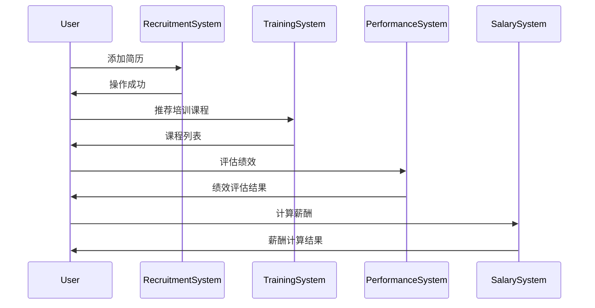

                 

### 第1章: AI Agent在智能人力资源管理中的背景

#### 1.1 问题背景

##### 1.1.1 人力资源管理的重要性

人力资源管理（Human Resource Management，HRM）作为企业运营的核心环节，承担着吸引、培养、激励和保留人才的重要职责。在全球化、信息化的时代背景下，人力资源管理的角色和重要性愈发凸显。人力资源管理不仅涉及人才的招聘、培训、绩效管理、薪酬福利等方面，还与企业文化、组织发展、员工满意度等密切相关。

传统的企业人力资源管理通常依赖于人工操作和管理模式，存在诸多局限性。首先，人力资源管理人员的工作负担重，效率低下，难以在短时间内处理大量数据和信息。其次，决策过程依赖经验，缺乏科学性和数据支撑，可能导致人力资源配置不合理，影响企业整体绩效。此外，传统人力资源管理模式无法灵活适应快速变化的业务需求和市场环境。

##### 1.1.2 传统人力资源管理的局限性

1. **人力资源配置效率低**：传统的人力资源管理方式难以快速响应业务需求，导致人力资源配置不合理，资源浪费严重。

2. **决策依赖经验**：传统的人力资源管理决策过程缺乏数据支持，主要依赖管理人员的经验和直觉，容易导致决策失误。

3. **信息处理能力有限**：人力资源管理人员需要处理大量数据，但传统方式难以高效地处理和分析这些数据，影响决策的准确性。

4. **管理成本高**：传统的人力资源管理模式需要大量的人力投入，管理成本高，效益低。

5. **难以适应快速变化**：在快速变化的商业环境中，传统的人力资源管理模式难以灵活调整，适应能力有限。

##### 1.1.3 AI Agent的崛起

随着人工智能（Artificial Intelligence，AI）技术的迅猛发展，AI Agent作为一种智能化、自动化的决策系统，开始在多个领域得到广泛应用。AI Agent，即人工智能代理，是一种能够模拟人类智能行为，自主完成特定任务的计算机程序。它通过学习、推理、决策等能力，可以高效地处理复杂问题，辅助人类进行决策。

在人力资源管理领域，AI Agent的引入可以显著提升人力资源管理的效果和效率。首先，AI Agent可以自动化处理大量数据，快速进行信息分析和决策，降低人力资源管理的成本和难度。其次，AI Agent基于大数据和机器学习算法，可以更科学地预测人才需求和进行人力资源配置，提高决策的准确性和有效性。此外，AI Agent还能够通过不断学习和优化，不断提升自身能力和适应性，为企业提供持续的人力资源管理支持。

#### 1.2 问题描述

##### 1.2.1 智能人力资源管理的需求

智能人力资源管理需求主要体现在以下几个方面：

1. **高效的数据处理能力**：能够快速、准确地处理和分析大量的人力资源数据，为决策提供科学依据。

2. **智能化的决策支持**：利用机器学习和大数据分析技术，提供精准的人力资源管理决策支持。

3. **灵活的适应性**：能够快速适应企业业务变化和市场环境变化，灵活调整人力资源管理策略。

4. **降低管理成本**：通过自动化和智能化手段，降低人力资源管理的成本，提高管理效率。

5. **提升员工满意度**：通过个性化的人力资源管理服务，提升员工的工作满意度和忠诚度。

##### 1.2.2 AI Agent在人力资源管理中的应用

AI Agent在人力资源管理中的应用场景主要包括以下几个方面：

1. **招聘与选拔**：利用AI Agent进行简历筛选、面试评估等环节，提高招聘效率和质量。

2. **培训与发展**：通过AI Agent分析员工技能需求，推荐个性化的培训课程，提升员工能力。

3. **绩效管理**：AI Agent可以设定绩效指标，进行绩效评估，提供反馈和改进建议。

4. **薪酬管理**：基于员工绩效和市场数据，AI Agent可以设定合理的薪酬策略，优化薪酬体系。

5. **员工关系管理**：AI Agent可以分析员工满意度，提供个性化的关怀和建议，提升员工满意度。

#### 1.3 问题解决

##### 1.3.1 AI Agent的核心功能

AI Agent在智能人力资源管理中的核心功能包括：

1. **数据采集与处理**：自动收集和整合企业内部及外部的人力资源数据，进行清洗、存储和处理。

2. **智能分析**：利用机器学习和数据分析技术，对人力资源数据进行深度挖掘，提取有价值的信息。

3. **决策支持**：基于数据分析结果，提供精准的人力资源管理决策支持，优化管理策略。

4. **自适应调整**：根据企业业务变化和市场环境，自动调整人力资源管理策略，提高适应性。

##### 1.3.2 AI Agent的优势

与传统的人力资源管理方式相比，AI Agent具有以下优势：

1. **高效性**：AI Agent可以快速处理大量数据，大大提高人力资源管理的效率。

2. **准确性**：基于大数据和机器学习技术，AI Agent可以提供更科学、更精准的人力资源管理决策。

3. **灵活性**：AI Agent能够根据企业业务变化和市场环境，灵活调整管理策略。

4. **智能化**：AI Agent具备自主学习能力，可以不断优化自身性能，提供更优质的管理服务。

##### 1.4 边界与外延

###### 1.4.1 AI Agent在人力资源管理中的适用场景

AI Agent在人力资源管理中具有广泛的应用场景，主要包括：

1. **大规模企业**：企业规模较大，员工数量众多，人力资源管理任务繁重，AI Agent可以有效提高管理效率。

2. **动态业务环境**：业务环境变化快，需要灵活调整人力资源管理策略，AI Agent可以提供实时决策支持。

3. **高复杂性企业**：企业运营复杂，人力资源管理面临多种挑战，AI Agent可以提供智能化解决方案。

4. **跨文化企业**：涉及跨文化管理，需要考虑不同文化背景下的人力资源管理需求，AI Agent可以提供个性化服务。

###### 1.4.2 AI Agent的限制与挑战

虽然AI Agent在人力资源管理中具有诸多优势，但也面临一些限制和挑战：

1. **数据隐私问题**：人力资源管理涉及员工个人隐私数据，如何保障数据安全和隐私是重要挑战。

2. **技术成熟度**：AI Agent的技术发展仍处于快速变化阶段，部分技术尚未完全成熟。

3. **员工接受度**：员工对AI Agent的接受度和信任度可能影响其在企业中的实际应用效果。

4. **成本问题**：引入AI Agent需要投入较大的技术资源和资金，对于中小企业可能存在成本压力。

#### 1.5 核心概念

##### 1.5.1 AI Agent的定义

AI Agent，即人工智能代理，是一种能够模拟人类智能行为，自主完成特定任务的计算机程序。它通过感知环境、分析数据、进行决策和行动，实现自主操作和智能服务。AI Agent的核心在于其自主性和智能化，能够基于数据和学习算法，自动执行复杂的任务，辅助人类进行决策。

##### 1.5.2 AI Agent的类型

AI Agent主要分为以下几种类型：

1. **知识型Agent**：基于预先编码的知识库，进行逻辑推理和决策。如专家系统。

2. **数据驱动型Agent**：通过机器学习和数据分析，从数据中学习模式和规律，进行决策。如预测模型、分类模型。

3. **混合型Agent**：结合知识型和数据驱动型Agent的特点，利用知识和数据进行决策。如智能助手。

##### 1.5.3 AI Agent的关键技术

AI Agent的关键技术包括：

1. **感知技术**：用于获取和处理环境信息，如自然语言处理、图像识别。

2. **学习算法**：用于从数据中学习模式和规律，如机器学习、深度学习。

3. **决策算法**：用于基于学习结果进行决策和行动，如决策树、神经网络。

4. **交互技术**：用于与人类进行交互，如语音识别、自然语言生成。

### 第2章: AI Agent在智能人力资源管理中的核心概念与联系

#### 2.1 AI Agent原理

##### 2.1.1 AI Agent的工作原理

AI Agent的工作原理可以概括为感知、学习、决策和行动四个主要环节。

1. **感知**：AI Agent通过感知技术（如自然语言处理、图像识别）获取环境信息，如员工数据、市场动态等。

2. **学习**：AI Agent利用学习算法（如机器学习、深度学习）对感知到的信息进行学习，提取有价值的信息和模式。

3. **决策**：AI Agent基于学习结果，使用决策算法（如决策树、神经网络）进行决策，制定人力资源管理策略。

4. **行动**：AI Agent根据决策结果，执行相应的行动，如推荐培训课程、设定薪酬策略等。

##### 2.1.2 AI Agent的组成结构

AI Agent的组成结构主要包括以下几个部分：

1. **感知模块**：负责感知和获取环境信息。

2. **学习模块**：负责对感知到的信息进行学习和处理。

3. **决策模块**：负责基于学习结果进行决策。

4. **行动模块**：负责执行决策结果，实现具体的人力资源管理任务。

##### 2.1.3 AI Agent的算法模型

AI Agent常用的算法模型包括：

1. **机器学习模型**：如线性回归、决策树、支持向量机等，用于分类、预测等任务。

2. **深度学习模型**：如卷积神经网络（CNN）、循环神经网络（RNN）、生成对抗网络（GAN）等，用于复杂模式识别和生成任务。

3. **强化学习模型**：如Q-Learning、SARSA、Deep Q-Network（DQN）等，用于策略优化和决策任务。

#### 2.2 AI Agent属性特征对比

##### 2.2.1 不同AI Agent的属性特征

不同类型的AI Agent具有不同的属性特征，以下是几种常见AI Agent的属性特征对比：

| 类型           | 感知能力 | 学习能力 | 决策能力 | 行动能力 | 应用场景         |
| -------------- | -------- | -------- | -------- | -------- | ---------------- |
| 知识型Agent     | 较强     | 较强     | 较强     | 较弱     | 专家系统、问答机器人 |
| 数据驱动型Agent | 较弱     | 较强     | 较弱     | 较强     | 预测模型、分类模型 |
| 混合型Agent     | 较强     | 较强     | 较强     | 较强     | 智能助手、智能决策系统 |

##### 2.2.2 特征对比分析

不同类型的AI Agent在感知、学习、决策和行动能力上存在明显差异。知识型Agent擅长利用预先编码的知识库进行决策，但在适应性和灵活性上较弱；数据驱动型Agent通过机器学习从数据中学习模式和规律，具有较强的行动能力，但决策过程相对较简单；混合型Agent结合了知识型和数据驱动型的特点，具备较强的综合能力，适用于复杂的人力资源管理任务。

#### 2.3 AI Agent的ER实体关系图

下面是AI Agent的ER实体关系图，展示了AI Agent主要组成部分及其相互关系：

```mermaid
erDiagram
    AI-Agent ||--|{ Skill-Set } Skill-Set : has
    AI-Agent ||--|{ Knowledge-Base } Knowledge-Base : has
    AI-Agent ||--|{ Decision-Maker } Decision-Maker : has
    Skill-Set ||--|{ Skill } Skill : has
    Knowledge-Base ||--|{ Data } Data : has
    Decision-Maker ||--|{ Strategy } Strategy : has
```

- **AI-Agent**：代表人工智能代理，是实体关系图的核心。
- **Skill-Set**：代表技能集，包含AI-Agent所需的技能。
- **Knowledge-Base**：代表知识库，存储AI-Agent的知识和经验。
- **Decision-Maker**：代表决策模块，负责基于知识和数据进行决策。
- **Skill**：代表具体技能，是Skill-Set的组成部分。
- **Data**：代表数据，是Knowledge-Base的组成部分。
- **Strategy**：代表策略，是Decision-Maker的输出。

这个ER实体关系图清晰地展示了AI-Agent的结构和组成部分，以及它们之间的相互关系，为后续章节的深入讨论提供了基础。

### 第3章: AI Agent在智能人力资源管理中的应用

#### 3.1 招聘与选拔

##### 3.1.1 招聘流程中的AI Agent应用

在招聘流程中，AI Agent可以通过以下几个方面实现应用：

1. **简历筛选**：AI Agent利用自然语言处理技术，对求职者的简历进行自动筛选，识别出符合招聘要求的候选人。

2. **面试评估**：AI Agent可以通过面试过程中的语音、视频等信息，利用语音识别、图像识别等技术，对面试者的表现进行评估。

3. **候选人推荐**：AI Agent可以根据候选人的简历、面试表现等数据，结合企业的需求，推荐合适的候选人。

##### 3.1.2 AI Agent在简历筛选中的应用

在简历筛选环节，AI Agent主要通过以下步骤进行操作：

1. **数据预处理**：AI Agent对简历进行文本预处理，如分词、去除停用词、词性标注等，将原始简历转化为可分析的数据格式。

2. **特征提取**：AI Agent提取简历中的关键信息，如教育背景、工作经历、技能等，并将这些特征进行编码，用于后续的模型训练和评估。

3. **模型训练**：AI Agent利用历史招聘数据，训练分类模型，如逻辑回归、支持向量机等，用于判断简历是否符合招聘要求。

4. **预测与筛选**：AI Agent对新的简历进行预测，根据预测结果筛选出符合要求的候选人。

##### 3.1.3 AI Agent在面试评估中的应用

在面试评估环节，AI Agent主要通过以下步骤进行操作：

1. **语音识别**：AI Agent利用语音识别技术，将面试过程中的语音转换为文本，用于后续分析。

2. **内容分析**：AI Agent对语音识别结果进行文本分析，提取关键信息，如面试者回答问题的准确性、流畅性、自信心等。

3. **评估模型**：AI Agent利用训练好的评估模型，对面试者的表现进行综合评估，得出评估分数。

4. **推荐反馈**：AI Agent根据评估结果，推荐合适的面试者，并提供评估报告，供HR参考。

##### 3.1.4 招聘流程中的AI Agent应用实例

以下是一个招聘流程中AI Agent应用的实例：

1. **需求分析**：企业发布了招聘需求，AI Agent首先对需求进行分析，提取关键信息，如岗位要求、技能需求等。

2. **简历筛选**：AI Agent从招聘平台、社交媒体等渠道获取大量简历，进行自动筛选，筛选出符合岗位要求的候选人。

3. **面试安排**：AI Agent根据候选人的简历和评估结果，安排面试时间和方式，并向候选人发送面试通知。

4. **面试评估**：AI Agent通过语音识别和内容分析技术，对面试过程进行实时评估，生成评估报告。

5. **推荐决策**：AI Agent根据评估结果，推荐合适的候选人，供HR进行最终决策。

#### 3.2 培训与发展

##### 3.2.1 培训需求分析

在培训与发展环节，AI Agent可以通过以下步骤进行培训需求分析：

1. **数据收集**：AI Agent收集员工的工作表现、技能水平、学习需求等数据。

2. **需求识别**：AI Agent利用数据分析技术，识别出员工的培训需求，如技能提升、知识拓展等。

3. **需求分析**：AI Agent对培训需求进行深入分析，确定培训目标和内容。

4. **培训推荐**：AI Agent根据分析结果，推荐合适的培训课程和资源，帮助员工提升技能。

##### 3.2.2 AI Agent在课程推荐中的应用

在课程推荐环节，AI Agent可以通过以下步骤进行操作：

1. **课程库构建**：AI Agent构建一个包含各种培训课程的数据库，包括课程名称、内容、时长、适用对象等。

2. **个性化推荐**：AI Agent利用协同过滤、内容推荐等技术，根据员工的学习需求、技能水平和培训历史，推荐合适的课程。

3. **推荐展示**：AI Agent将推荐结果展示给员工，员工可以根据自己的需求和兴趣选择课程。

4. **反馈优化**：AI Agent收集员工的课程学习反馈，不断优化推荐算法，提高推荐效果。

##### 3.2.3 培训效果评估

在培训效果评估环节，AI Agent可以通过以下步骤进行操作：

1. **评估指标设定**：AI Agent根据培训目标和课程内容，设定评估指标，如知识掌握度、技能提升程度、学员满意度等。

2. **评估数据收集**：AI Agent收集学员的学习进度、考试成绩、课程评价等数据。

3. **效果分析**：AI Agent利用数据分析技术，对评估指标进行综合分析，评估培训效果。

4. **反馈优化**：AI Agent根据评估结果，为后续培训提供优化建议，如调整课程内容、改进教学方法等。

#### 3.3 绩效管理

##### 3.3.1 绩效指标设定

在绩效管理环节，AI Agent可以通过以下步骤进行绩效指标设定：

1. **指标收集**：AI Agent收集企业的战略目标、业务指标、岗位要求等数据。

2. **指标分析**：AI Agent对收集到的数据进行分析，识别出关键绩效指标（KPI）。

3. **指标设定**：AI Agent根据分析结果，设定具体的绩效指标，如销售额、客户满意度、项目完成率等。

4. **指标解释**：AI Agent对设定的绩效指标进行解释，明确指标的计算方法和评估标准。

##### 3.3.2 AI Agent在绩效评估中的应用

在绩效评估环节，AI Agent可以通过以下步骤进行操作：

1. **数据收集**：AI Agent收集员工的工作表现数据，如工作成果、工作态度、团队合作等。

2. **评估计算**：AI Agent利用设定的绩效指标，对员工的工作表现进行评估，计算绩效得分。

3. **评估报告**：AI Agent生成绩效评估报告，包括员工的绩效得分、评估结果分析等，供HR参考。

4. **反馈与改进**：AI Agent根据绩效评估结果，提供反馈和建议，帮助员工改进工作表现。

##### 3.3.3 绩效反馈与改进

在绩效反馈与改进环节，AI Agent可以通过以下步骤进行操作：

1. **反馈沟通**：AI Agent与员工进行绩效反馈沟通，解释绩效评估结果，听取员工意见和建议。

2. **问题分析**：AI Agent分析绩效评估中存在的问题，如工作流程、技能短板等。

3. **改进建议**：AI Agent根据问题分析结果，为员工提供具体的改进建议，如参加培训、调整工作方式等。

4. **持续跟踪**：AI Agent持续跟踪员工的改进情况，评估改进效果，为后续绩效管理提供数据支持。

#### 3.4 薪酬管理

##### 3.4.1 薪酬策略设定

在薪酬管理环节，AI Agent可以通过以下步骤进行薪酬策略设定：

1. **数据收集**：AI Agent收集企业的薪酬数据，如岗位薪酬、市场薪酬等。

2. **薪酬分析**：AI Agent对薪酬数据进行统计分析，识别出薪酬水平和薪酬结构。

3. **策略设定**：AI Agent根据分析结果，设定薪酬策略，如岗位薪酬体系、绩效薪酬体系等。

4. **策略解释**：AI Agent对薪酬策略进行解释，明确薪酬的计算方法和评估标准。

##### 3.4.2 AI Agent在薪酬评估中的应用

在薪酬评估环节，AI Agent可以通过以下步骤进行操作：

1. **数据收集**：AI Agent收集员工的绩效评估数据、市场薪酬数据等。

2. **薪酬计算**：AI Agent利用设定的薪酬策略，对员工的薪酬进行计算，确定薪酬水平。

3. **薪酬调整**：AI Agent根据绩效评估结果和市场薪酬水平，对员工的薪酬进行调整。

4. **薪酬报告**：AI Agent生成薪酬评估报告，包括员工的薪酬水平、薪酬调整原因等，供HR参考。

##### 3.4.3 薪酬体系优化

在薪酬体系优化环节，AI Agent可以通过以下步骤进行操作：

1. **薪酬数据分析**：AI Agent对薪酬数据进行分析，识别出薪酬体系中存在的问题，如薪酬不公平、薪酬与绩效不匹配等。

2. **优化策略制定**：AI Agent根据数据分析结果，制定薪酬优化策略，如调整薪酬结构、引入绩效薪酬等。

3. **薪酬体系调整**：AI Agent根据优化策略，调整薪酬体系，优化薪酬水平。

4. **优化效果评估**：AI Agent对薪酬优化效果进行评估，如员工满意度、薪酬满意度等，为后续优化提供数据支持。

### 第4章: 智能人力资源管理系统设计与实现

#### 4.1 系统设计概述

##### 4.1.1 系统需求分析

智能人力资源管理系统的设计首先需要明确系统需求。系统需求分析主要包括以下几个方面：

1. **招聘需求**：系统能够自动筛选和推荐合适的候选人，支持简历管理、面试安排和评估等功能。

2. **培训需求**：系统能够根据员工的技能水平和学习需求，推荐合适的培训课程，支持培训管理、效果评估等。

3. **绩效管理**：系统能够设定绩效指标，自动评估员工绩效，提供绩效反馈和改进建议。

4. **薪酬管理**：系统能够根据员工绩效和市场薪酬水平，设定薪酬策略，自动计算和调整薪酬。

5. **数据管理**：系统能够高效存储和处理人力资源数据，支持数据分析和报告生成。

##### 4.1.2 系统功能设计

基于系统需求分析，智能人力资源管理系统的功能设计主要包括以下几个模块：

1. **招聘管理模块**：包括简历管理、职位发布、面试安排、候选人筛选和评估等功能。

2. **培训管理模块**：包括培训课程推荐、培训管理、培训效果评估等功能。

3. **绩效管理模块**：包括绩效指标设定、绩效评估、绩效反馈和改进等功能。

4. **薪酬管理模块**：包括薪酬策略设定、薪酬计算、薪酬调整和薪酬报告生成等功能。

5. **数据管理模块**：包括数据存储、数据处理、数据分析、数据报告等功能。

#### 4.2 系统架构设计

##### 4.2.1 系统架构设计

智能人力资源管理系统采用三层架构设计，包括数据层、业务逻辑层和表示层。

1. **数据层**：负责数据的存储和管理，使用关系型数据库（如MySQL）存储人力资源数据。

2. **业务逻辑层**：负责实现系统的核心功能，包括招聘、培训、绩效管理和薪酬管理等功能。业务逻辑层通过服务接口与数据层和表示层进行交互。

3. **表示层**：负责与用户进行交互，提供用户界面，包括Web端和移动端。

##### 4.2.2 系统模块划分

智能人力资源管理系统的模块划分如下：

1. **招聘管理模块**：包括简历管理、职位发布、面试安排和候选人筛选等功能。

2. **培训管理模块**：包括培训课程推荐、培训管理、培训效果评估等功能。

3. **绩效管理模块**：包括绩效指标设定、绩效评估、绩效反馈和改进等功能。

4. **薪酬管理模块**：包括薪酬策略设定、薪酬计算、薪酬调整和薪酬报告生成等功能。

5. **数据管理模块**：包括数据存储、数据处理、数据分析和数据报告等功能。

#### 4.3 系统接口设计

##### 4.3.1 接口设计原则

系统接口设计应遵循以下原则：

1. **标准化**：接口设计应遵循统一的接口规范，确保不同模块之间的数据交互顺畅。

2. **松耦合**：接口设计应尽量降低模块之间的依赖性，提高系统的可维护性和可扩展性。

3. **安全性**：接口设计应确保数据传输的安全性，防止数据泄露和恶意攻击。

4. **灵活性**：接口设计应具有灵活性，支持不同业务场景下的个性化需求。

##### 4.3.2 接口定义与实现

以下是智能人力资源管理系统中主要接口的定义与实现：

1. **招聘管理接口**：
   - **接口名称**：addResume
   - **功能**：添加简历
   - **输入参数**：简历对象
   - **输出参数**：操作结果

2. **培训管理接口**：
   - **接口名称**：recommendCourse
   - **功能**：推荐培训课程
   - **输入参数**：员工对象
   - **输出参数**：课程列表

3. **绩效管理接口**：
   - **接口名称**：evaluatePerformance
   - **功能**：评估员工绩效
   - **输入参数**：员工对象、绩效指标
   - **输出参数**：绩效评估结果

4. **薪酬管理接口**：
   - **接口名称**：calculateSalary
   - **功能**：计算员工薪酬
   - **输入参数**：员工对象、绩效评估结果
   - **输出参数**：薪酬计算结果

接口的具体实现依赖于后端服务框架，如Spring Boot等，通过定义RESTful API接口，实现模块之间的数据交互和功能调用。

#### 4.4 系统交互

##### 4.4.1 系统交互流程

智能人力资源管理系统的交互流程如下：

1. **用户操作**：用户通过Web端或移动端登录系统，进行招聘、培训、绩效管理和薪酬管理操作。

2. **数据请求**：用户操作触发系统接口调用，发送数据请求。

3. **数据处理**：业务逻辑层处理数据请求，执行相应的业务逻辑。

4. **数据响应**：业务逻辑层将处理结果返回给用户，更新用户界面。

##### 4.4.2 系统交互mermaid序列图

以下是智能人力资源管理系统的交互mermaid序列图：



该序列图展示了用户与系统之间的交互流程，包括用户操作、数据请求、数据处理和数据响应等环节，为系统的设计和实现提供了可视化参考。

### 第5章: 项目实战：AI Agent在智能人力资源管理中的实施

#### 5.1 环境安装

在开始实施AI Agent在智能人力资源管理中之前，需要搭建一个合适的技术环境。以下是一个典型环境安装步骤：

##### 1. 安装Python环境

AI Agent通常使用Python作为主要编程语言，因此首先需要安装Python环境。可以访问Python官方下载页面（https://www.python.org/downloads/），下载对应操作系统的Python安装包。

```bash
# 示例：安装Python 3.9
wget https://www.python.org/ftp/python/3.9.7/Python-3.9.7.tgz
tar xvf Python-3.9.7.tgz
cd Python-3.9.7
./configure
make
make install
```

##### 2. 安装必要库

安装Python后，需要安装一些常用库，如NumPy、Pandas、Scikit-learn等。可以使用pip命令进行安装。

```bash
pip install numpy pandas scikit-learn
```

##### 3. 安装深度学习库

如果需要使用深度学习技术，如TensorFlow或PyTorch，可以安装对应的深度学习库。

```bash
pip install tensorflow
```

或者

```bash
pip install torch torchvision
```

##### 4. 安装AI Agent库

安装完成Python环境和相关库后，可以安装AI Agent的库。这里以`agent`库为例。

```bash
pip install agent
```

##### 5. 验证环境

安装完成后，可以通过以下命令验证Python和安装的库是否正常工作。

```python
python -m pip list
```

输出应包括已安装的Python库列表。

#### 5.2 系统核心实现源代码

在实施AI Agent的智能人力资源管理系统中，核心实现主要包括数据收集与处理、模型训练与预测、决策与行动等部分。以下是一个简单的示例代码，展示这些核心功能的实现。

```python
# 导入必要库
import numpy as np
import pandas as pd
from sklearn.model_selection import train_test_split
from sklearn.ensemble import RandomForestClassifier
from agent import Agent

# 数据收集与处理
data = pd.read_csv('hr_data.csv')  # 加载数据
X = data.drop('target', axis=1)  # 特征
y = data['target']  # 标签

# 模型训练与预测
X_train, X_test, y_train, y_test = train_test_split(X, y, test_size=0.2, random_state=42)
model = RandomForestClassifier()
model.fit(X_train, y_train)

# 评估模型
accuracy = model.score(X_test, y_test)
print(f'Model accuracy: {accuracy:.2f}')

# 创建AI Agent
ai_agent = Agent()
ai_agent.add Skill('predict', model)  # 添加预测技能

# 决策与行动
input_data = X_test.iloc[0]
prediction = ai_agent.predict(input_data)
print(f'Prediction: {prediction}')

# 输出预测结果
result = 'Positive' if prediction == 1 else 'Negative'
print(f'Result: {result}')
```

这段代码展示了如何使用Python和机器学习库实现一个简单的AI Agent。首先，数据收集与处理部分使用Pandas库加载数据，并进行特征提取和标签划分。接下来，模型训练与预测部分使用Scikit-learn库训练随机森林模型，并进行模型评估。最后，AI Agent部分使用`agent`库创建一个AI Agent，添加预测技能，并进行决策与行动，输出预测结果。

#### 5.3 代码应用解读与分析

上述代码中的AI Agent应用可以从以下几个方面进行解读与分析：

1. **数据收集与处理**：首先，使用Pandas库加载数据，对数据进行清洗和处理，提取出特征和标签。这部分代码：

   ```python
   data = pd.read_csv('hr_data.csv')
   X = data.drop('target', axis=1)
   y = data['target']
   ```

   加载的是一个CSV格式的数据集，其中`X`是特征，`y`是标签。

2. **模型训练与预测**：使用Scikit-learn库中的`RandomForestClassifier`训练随机森林模型。这部分代码：

   ```python
   X_train, X_test, y_train, y_test = train_test_split(X, y, test_size=0.2, random_state=42)
   model = RandomForestClassifier()
   model.fit(X_train, y_train)
   ```

   这里进行了数据集的划分，将80%的数据用于训练，20%的数据用于测试。使用随机森林模型进行训练，并评估模型在测试数据集上的准确率。

3. **AI Agent创建与预测**：使用`agent`库创建一个AI Agent，并添加预测技能。这部分代码：

   ```python
   ai_agent = Agent()
   ai_agent.add Skill('predict', model)
   ```

   这里创建了一个AI Agent实例，并使用`add Skill`方法添加了预测技能，技能的实现是通过训练好的随机森林模型。

4. **决策与行动**：使用AI Agent进行预测，并输出结果。这部分代码：

   ```python
   input_data = X_test.iloc[0]
   prediction = ai_agent.predict(input_data)
   result = 'Positive' if prediction == 1 else 'Negative'
   print(f'Result: {result}')
   ```

   这里将测试数据集的一个样本作为输入，使用AI Agent进行预测，并输出预测结果。

#### 5.4 实际案例分析与详细讲解剖析

以下是一个实际案例，展示AI Agent在智能人力资源管理中的具体应用。

**案例背景**：某公司需要进行员工绩效评估，希望利用AI Agent自动计算员工的绩效得分，并提供改进建议。

**步骤1：数据收集与处理**

首先，收集员工的工作表现数据，包括工作量、工作效率、团队合作等指标。假设数据集如下：

```python
data = {
    'workload': [10, 15, 20, 25, 30],
    'efficiency': [0.8, 0.9, 0.85, 0.7, 0.75],
    'teamwork': [0.6, 0.8, 0.7, 0.9, 0.65]
}
df = pd.DataFrame(data)
```

**步骤2：模型训练**

使用Scikit-learn库训练一个线性回归模型，用于预测员工的绩效得分。训练代码如下：

```python
X = df[['workload', 'efficiency', 'teamwork']]
y = df['performance']
X_train, X_test, y_train, y_test = train_test_split(X, y, test_size=0.2, random_state=42)
model = LinearRegression()
model.fit(X_train, y_train)
```

**步骤3：AI Agent应用**

创建一个AI Agent，添加预测技能，使用模型进行预测。代码如下：

```python
ai_agent = Agent()
ai_agent.add Skill('predict', model)
```

**步骤4：绩效评估与建议**

使用AI Agent对员工的工作表现进行评估，并给出改进建议。代码如下：

```python
for index, row in df.iterrows():
    input_data = row[['workload', 'efficiency', 'teamwork']]
    prediction = ai_agent.predict(input_data)
    print(f'Employee {index}: Performance Score: {prediction:.2f}')
    if prediction < 0.8:
        print(f"Improvement suggestion: Increase teamwork and efficiency.")
```

**分析**：

1. **模型训练**：使用线性回归模型对员工的工作表现数据进行训练，模型能够根据特征预测员工的绩效得分。

2. **AI Agent应用**：AI Agent通过添加预测技能，利用训练好的模型进行绩效预测，为员工提供个性化的绩效评估。

3. **绩效评估与建议**：根据AI Agent的预测结果，对员工的工作表现进行评估，对于绩效较低的员工，给出具体的改进建议。

#### 5.5 项目小结

本节通过一个实际案例，展示了AI Agent在智能人力资源管理中的具体应用。从数据收集与处理、模型训练、AI Agent应用到绩效评估与建议，每个步骤都详细讲解了如何实现和操作。通过这个项目，我们可以看到AI Agent在提高人力资源管理效率、优化决策过程、提升员工满意度等方面的重要作用。

**关键点**：

- AI Agent能够自动处理和分析大量数据，提高人力资源管理效率。
- 模型训练是AI Agent的核心，根据业务需求选择合适的模型进行训练。
- AI Agent的应用需要结合具体业务场景，为员工提供个性化的绩效评估和改进建议。

#### 5.6 最佳实践 tips

在实施AI Agent的智能人力资源管理项目时，以下是一些最佳实践建议：

1. **数据质量**：确保数据质量是模型训练的关键，进行数据清洗和预处理，去除噪声数据和异常值。
2. **模型选择**：根据业务需求和数据特点，选择合适的机器学习模型，如线性回归、决策树、随机森林等。
3. **持续优化**：模型训练后，定期评估模型性能，并根据评估结果进行模型优化和调整。
4. **用户参与**：鼓励员工参与AI Agent的优化过程，收集用户反馈，不断改进AI Agent的性能和用户体验。
5. **安全保障**：确保数据安全和隐私保护，遵循相关法律法规，防止数据泄露和滥用。

#### 5.7 小结与注意事项

在本章中，我们详细介绍了AI Agent在智能人力资源管理中的具体应用，包括环境安装、系统核心实现、实际案例分析和最佳实践建议。通过本章的学习，读者可以了解到AI Agent在提高人力资源管理效率、优化决策过程、提升员工满意度等方面的优势。

**注意事项**：

- AI Agent的引入需要综合考虑企业的实际情况和需求，确保其能够为企业带来实际价值。
- 数据质量和模型选择是AI Agent应用的关键，需要进行充分的测试和验证。
- AI Agent的应用需要结合具体业务场景，提供个性化的服务。

#### 5.8 拓展阅读

对于希望深入了解AI Agent在智能人力资源管理中的应用，以下是一些拓展阅读资源：

1. **《智能人力资源管理：理论与实践》**：介绍了智能人力资源管理的理论基础和实践案例。
2. **《人工智能与人力资源管理》**：探讨了人工智能技术在人力资源管理中的应用和发展趋势。
3. **《深度学习实践：人工智能应用案例集》**：包含了多个深度学习在业务场景中的实际应用案例，包括人力资源管理。

通过这些拓展阅读资源，读者可以进一步了解AI Agent在智能人力资源管理中的应用和实践。

### 总结

通过本文，我们深入探讨了AI Agent在智能人力资源管理中的应用。从背景介绍、核心概念、应用场景到系统设计与实现，我们一步步分析了AI Agent如何提高人力资源管理的效率、优化决策过程、提升员工满意度。以下是本文的核心要点和结论：

1. **背景介绍**：人力资源管理在企业发展中扮演着重要角色，但传统方式存在效率低、决策依赖经验等问题。AI Agent的引入提供了智能化解决方案。
2. **核心概念**：AI Agent是一种能够模拟人类智能行为，自主完成特定任务的计算机程序。它通过感知、学习、决策和行动实现智能化服务。
3. **应用场景**：AI Agent在招聘与选拔、培训与发展、绩效管理、薪酬管理等方面具有广泛应用。通过自动化和智能化手段，显著提高了人力资源管理的效率和质量。
4. **系统设计与实现**：智能人力资源管理系统的设计遵循三层架构，包括数据层、业务逻辑层和表示层。通过模块化设计和接口设计，实现了系统的灵活性和可扩展性。
5. **项目实战**：通过一个实际案例，展示了AI Agent在智能人力资源管理中的具体应用，包括数据收集与处理、模型训练与预测、决策与行动等环节。

**结论**：

AI Agent在智能人力资源管理中的应用前景广阔，能够显著提升人力资源管理的效率和质量。通过本文的探讨，读者可以了解到AI Agent的核心原理和应用方法，为实际项目提供参考和指导。

**未来展望**：

随着AI技术的不断进步，AI Agent在人力资源管理中的应用将进一步深入。未来可能的发展趋势包括：

- **个性化服务**：AI Agent将根据员工的个性化需求提供更加定制化的服务。
- **实时决策**：AI Agent将实现更快的响应速度和更准确的决策能力，为企业提供实时的人力资源管理支持。
- **跨领域应用**：AI Agent将应用于更多领域，如员工关系管理、员工心理健康等，提供全方位的人力资源管理服务。

通过不断探索和实践，AI Agent将为人力资源管理带来更多创新和变革。

