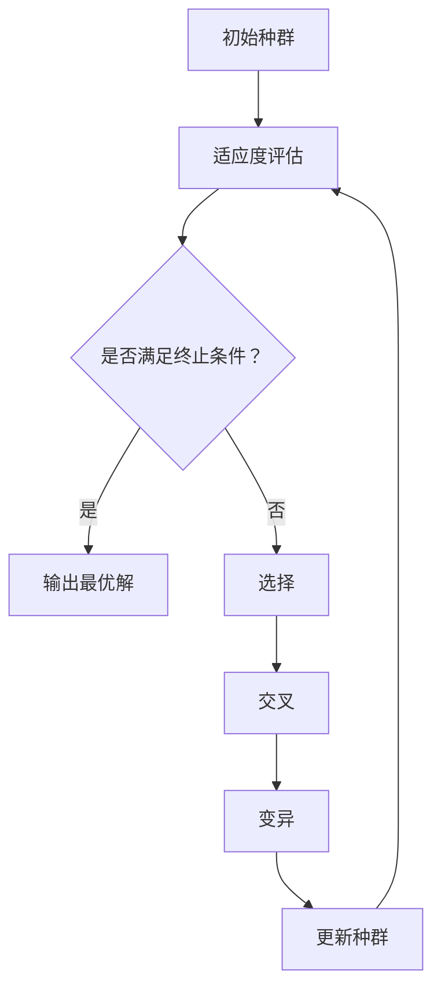
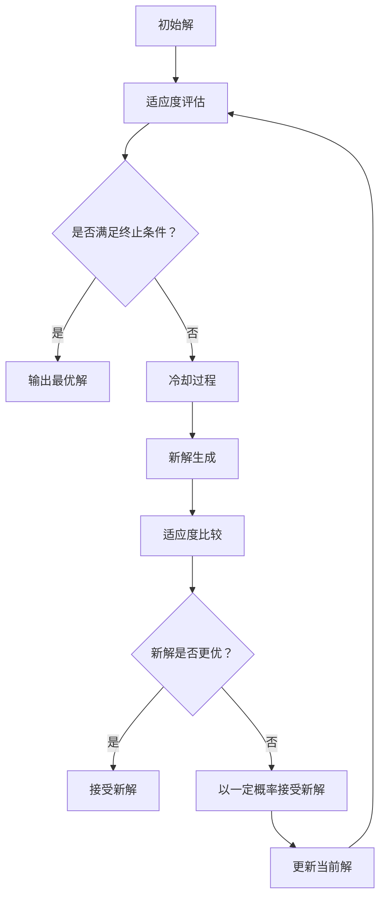
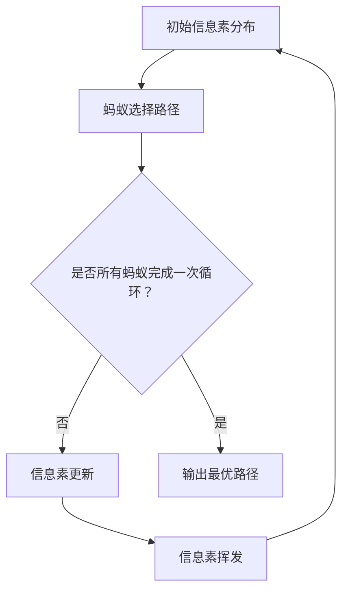

                 

### 1.1.3 研究目的与意义

**研究目的**：

本研究的主要目的是探讨AI Agent在智能供应链优化决策中的应用，通过深入分析AI Agent的算法原理、数学模型、系统架构和实际应用案例，旨在为供应链管理提供一种智能化、自动化、高效的决策支持工具。具体研究目标包括：

1. **理论目标**：
   - 系统性地梳理AI Agent在供应链优化决策中的理论基础。
   - 探讨AI Agent算法的优化策略和性能评估方法。

2. **实践目标**：
   - 构建一个基于AI Agent的智能供应链优化决策系统。
   - 验证该系统在实际供应链环境中的可行性和有效性。

**研究意义**：

本研究具有重要的现实意义和学术价值，具体体现在以下几个方面：

1. **提高供应链管理效率**：
   - 通过引入AI Agent，实现对供应链各环节的实时监控和优化。
   - 降低库存成本，减少供应链中断风险，提高供应链的灵活性和响应速度。

2. **促进智能化供应链发展**：
   - AI Agent的应用有助于推动供应链管理向智能化、数字化、自动化的方向发展。
   - 为供应链管理提供新的技术手段和工具，提升供应链的整体竞争力。

3. **学术贡献**：
   - 拓展AI Agent在供应链管理领域的研究领域，丰富相关理论体系。
   - 为后续研究提供新的思路和方法，推动AI Agent技术在供应链管理领域的深入应用。

总之，本研究将为智能供应链优化决策提供有力支持，具有重要的理论和实践价值。

### 1.1.4 边界与外延

在本文的研究范围内，我们将专注于AI Agent在智能供应链优化决策中的应用。具体来说，本文的研究边界和外延包括以下几个方面：

**边界**：

1. **研究范围**：本文主要探讨AI Agent在供应链管理中的应用，包括库存管理、供应链规划、需求预测等方面。
2. **技术范围**：本文主要涉及AI Agent的常用算法，如遗传算法、模拟退火算法、蚁群算法等，不涉及其他人工智能技术。
3. **应用场景**：本文研究的重点是在企业内部供应链管理中的应用，不包括跨国供应链管理。

**外延**：

1. **应用领域**：虽然本文主要关注智能供应链优化决策，但AI Agent技术还可以应用于其他领域，如物流、金融服务、制造业等。
2. **跨学科研究**：本文的研究涉及计算机科学、运筹学、供应链管理等多个学科，有助于推动跨学科研究的发展。
3. **未来发展**：随着AI技术的发展，未来AI Agent在供应链优化决策中的应用将更加广泛，本文的研究将为未来相关研究提供基础。

### 1.1.5 概念结构与核心要素组成

为了更好地理解AI Agent在智能供应链优化决策中的应用，我们需要明确一些核心概念和其组成要素。

**AI Agent的定义、特点和应用领域**：

AI Agent，即人工智能代理，是一种模拟人类智能行为的计算机程序。它具备以下几个特点：

1. **自主性**：AI Agent能够根据环境变化自主决策。
2. **适应性**：AI Agent能够根据历史数据和反馈不断优化自身行为。
3. **协作性**：多个AI Agent可以协作完成任务。

AI Agent的应用领域非常广泛，包括但不限于：

- **库存管理**：通过预测需求和供应，自动调整库存水平。
- **供应链规划**：优化采购、生产、运输等环节，提高供应链效率。
- **需求预测**：预测市场需求，为供应链决策提供数据支持。

**智能供应链的定义、核心组成部分和关键技术**：

智能供应链是一种利用信息技术和人工智能技术，实现供应链全过程智能化管理的系统。其核心组成部分包括：

1. **信息集成**：通过集成各种信息系统，实现供应链各环节的信息共享。
2. **数据分析**：利用大数据技术和人工智能算法，对供应链数据进行挖掘和分析。
3. **自动化执行**：通过自动化设备和技术，实现供应链各环节的自动化操作。

智能供应链的关键技术包括：

- **物联网技术**：实现设备联网，提高供应链的可视化和可控性。
- **大数据技术**：对海量供应链数据进行存储、处理和分析。
- **人工智能技术**：包括AI Agent、机器学习、深度学习等，用于优化供应链决策。

**优化决策的定义、目标和方法**：

优化决策是指通过分析数据，找出最优的决策方案的过程。其目标包括：

1. **成本最小化**：在保证服务质量的前提下，降低供应链运营成本。
2. **效率最大化**：提高供应链各环节的运作效率。
3. **风险最小化**：降低供应链中断和供应风险。

优化决策的方法包括：

- **线性规划**：通过建立线性方程模型，求解最优解。
- **整数规划**：适用于决策变量为整数的优化问题。
- **多目标优化**：同时考虑多个目标，寻找均衡解。
- **启发式算法**：通过迭代搜索，找到近似最优解。

通过明确这些核心概念和组成要素，我们能够更好地理解AI Agent在智能供应链优化决策中的应用，并为其深入研究打下基础。

### 1.2 核心概念与联系

在深入探讨AI Agent在智能供应链优化决策中的应用之前，我们需要详细定义和解释一些核心概念，并分析它们之间的联系。

**AI Agent的定义、特点和应用领域**：

AI Agent，即人工智能代理，是一种具有自主性、适应性和协作性的计算机程序，它能够模拟人类的智能行为，在复杂环境中做出决策并执行相应的行动。AI Agent的特点包括：

1. **自主性**：AI Agent可以自主感知环境、规划行动路径、做出决策，而不需要人类的直接干预。
2. **适应性**：AI Agent能够根据不断变化的环境信息和历史数据，自动调整其行为策略，优化决策过程。
3. **协作性**：多个AI Agent可以协同工作，共同完成任务，提高系统的整体效率和灵活性。

AI Agent的应用领域广泛，包括但不限于：

- **库存管理**：通过实时监控库存水平和需求变化，自动调整补货策略，降低库存成本。
- **供应链规划**：优化采购、生产、运输等环节，提高供应链的灵活性和响应速度。
- **需求预测**：利用历史销售数据和市场信息，预测未来市场需求，为供应链决策提供数据支持。

**智能供应链的定义、核心组成部分和关键技术**：

智能供应链是一种利用信息技术和人工智能技术，实现供应链全过程智能化管理的系统。它通过集成信息、分析和自动化执行，提高供应链的透明度、可控性和效率。智能供应链的核心组成部分包括：

1. **信息集成**：通过集成企业内部的各个信息系统，实现数据共享和实时监控。
2. **数据分析**：利用大数据技术和人工智能算法，对供应链数据进行深度挖掘和分析，发现潜在问题和优化机会。
3. **自动化执行**：通过自动化设备和流程，实现供应链各环节的自动化操作，减少人为干预和错误。

智能供应链的关键技术包括：

- **物联网技术**：实现设备联网，提高供应链的可视化和可控性。
- **大数据技术**：对海量供应链数据进行存储、处理和分析，为决策提供数据支持。
- **人工智能技术**：包括AI Agent、机器学习、深度学习等，用于优化供应链决策和预测。

**优化决策的定义、目标和方法**：

优化决策是指通过分析供应链数据，找出最优的决策方案的过程。其目标包括：

1. **成本最小化**：在保证服务质量的前提下，降低供应链运营成本。
2. **效率最大化**：提高供应链各环节的运作效率。
3. **风险最小化**：降低供应链中断和供应风险。

优化决策的方法包括：

- **线性规划**：通过建立线性方程模型，求解最优解。
- **整数规划**：适用于决策变量为整数的优化问题。
- **多目标优化**：同时考虑多个目标，寻找均衡解。
- **启发式算法**：通过迭代搜索，找到近似最优解。

**核心概念之间的联系**：

AI Agent、智能供应链和优化决策三者之间存在紧密的联系：

1. **AI Agent与智能供应链**：AI Agent是智能供应链的核心组成部分，它通过自主感知、适应性和协作性，实现供应链的智能化管理。
2. **智能供应链与优化决策**：智能供应链利用AI Agent和其他人工智能技术，进行供应链数据的分析和决策优化，提高供应链的整体效率。
3. **优化决策与AI Agent**：优化决策依赖于AI Agent提供的实时数据和智能算法，通过不断调整和优化决策过程，实现供应链的最优化。

通过理解这些核心概念之间的联系，我们能够更好地把握AI Agent在智能供应链优化决策中的应用，推动供应链管理的智能化发展。

## 1.3 算法原理讲解

### 1.3.1 常用AI Agent算法介绍

在智能供应链优化决策中，AI Agent算法的选择至关重要。以下介绍几种常用的AI Agent算法及其基本原理：

1. **遗传算法**（Genetic Algorithm，GA）
   - **基本原理**：遗传算法是一种基于自然进化过程的优化算法，通过模拟生物进化中的基因遗传、交叉和变异过程，逐步优化解的质量。
   - **算法流程**：
     1. 初始种群生成：随机生成一组解作为初始种群。
     2. 适应度评估：计算每个个体的适应度值。
     3. 选择：根据适应度值选择优秀的个体作为父代。
     4. 交叉：将父代进行交叉操作，生成新的子代。
     5. 变异：对子代进行变异操作，增加种群的多样性。
     6. 更新种群：用新的子代替换部分旧种群。
     7. 循环步骤2-6，直到满足终止条件。
   - **适用场景**：适合解决复杂、非线性优化问题。

2. **模拟退火算法**（Simulated Annealing，SA）
   - **基本原理**：模拟退火算法是一种基于固体退火过程的优化算法。通过模拟固体在加热和冷却过程中的状态变化，逐步寻找最优解。
   - **算法流程**：
     1. 初始解：随机生成一个初始解。
     2. 适应度评估：计算当前解的适应度值。
     3. 冷却过程：设置初始温度，逐步降低温度。
     4. 新解生成：随机生成一个新的解。
     5. 适应度比较：计算新解的适应度值，与当前解进行比较。
     6. 决策：如果新解更优，则接受新解；否则，以一定概率接受新解，以防止陷入局部最优。
     7. 更新当前解：将新解作为当前解。
     8. 循环步骤4-7，直到满足终止条件。
   - **适用场景**：适合解决高维、非线性优化问题。

3. **蚁群算法**（Ant Colony Optimization，ACO）
   - **基本原理**：蚁群算法是一种基于自然界中蚂蚁觅食行为的优化算法。蚂蚁在觅食过程中通过释放信息素来标记路径，其他蚂蚁根据信息素浓度选择路径。
   - **算法流程**：
     1. 初始信息素分布：在所有可能的路径上均匀分布信息素。
     2. 蚂蚁选择路径：每只蚂蚁根据当前路径的信息素浓度和能见度选择下一步路径。
     3. 信息素更新：蚂蚁到达目的地后，更新路径上的信息素浓度。
     4. 循环步骤2-3，直到所有蚂蚁完成一次循环。
     5. 信息素挥发：定期降低路径上的信息素浓度，防止过早收敛。
     6. 重复步骤2-5，直到满足终止条件。
   - **适用场景**：适合解决路径规划、调度等问题。

### 1.3.2 算法流程图

为了更直观地理解这些算法的流程，我们可以使用mermaid画出算法的流程图。

**遗传算法（GA）流程图：**


**模拟退火算法（SA）流程图：**


**蚁群算法（ACO）流程图：**


这些算法的流程图清晰地展示了它们的基本步骤和操作，有助于我们更好地理解和应用这些算法。

### 1.3.3 Python代码实现

为了深入理解这些算法的原理，我们将使用Python代码进行实现，并详细讲解每个步骤。

**遗传算法（GA）Python实现：**
```python
import random

def fitness_function(individual):
    # 假设个体为二进制编码的染色体，每个位为0或1
    # 计算适应度值
    fitness = sum(individual)
    return fitness

def crossover(parent1, parent2):
    # 交叉操作
    crossover_point = random.randint(1, len(parent1) - 1)
    child1 = parent1[:crossover_point] + parent2[crossover_point:]
    child2 = parent2[:crossover_point] + parent1[crossover_point:]
    return child1, child2

def mutate(individual):
    # 变异操作
    for i in range(len(individual)):
        if random.random() < 0.1:  # 变异概率为0.1
            individual[i] = 1 if individual[i] == 0 else 0
    return individual

def genetic_algorithm(population_size, generations):
    # 初始种群生成
    population = [[random.randint(0, 1) for _ in range(10)] for _ in range(population_size)]
    
    for _ in range(generations):
        # 适应度评估
        fitness_scores = [fitness_function(individual) for individual in population]
        
        # 选择
        selected = random.choices(population, weights=fitness_scores, k=population_size)
        
        # 交叉和变异
        for i in range(0, population_size, 2):
            child1, child2 = crossover(selected[i], selected[i+1])
            population[i] = mutate(child1)
            population[i+1] = mutate(child2)
        
        # 输出最优解
        best_fitness = max(fitness_scores)
        best_individual = population[fitness_scores.index(best_fitness)]
        print(f"Generation {(_ + 1)}: Best Fitness = {best_fitness}")
    
    # 输出最终最优解
    best_fitness = max(fitness_scores)
    best_individual = population[fitness_scores.index(best_fitness)]
    print(f"Final Best Fitness = {best_fitness}, Best Individual = {best_individual}")

# 运行遗传算法
genetic_algorithm(100, 50)
```

**模拟退火算法（SA）Python实现：**
```python
import random
import math

def fitness_function(solution):
    # 假设解为连续变量，计算适应度值
    fitness = 0
    for value in solution:
        fitness += 1 / (1 + abs(value))
    return fitness

def new_solution(current_solution):
    # 生成一个新的解
    new_solution = [x + random.uniform(-1, 1) for x in current_solution]
    return new_solution

def sa(initial_solution, max_iterations, initial_temp, cooling_rate):
    current_solution = initial_solution
    current_fitness = fitness_function(current_solution)
    best_solution = current_solution
    best_fitness = current_fitness
    temp = initial_temp
    
    for _ in range(max_iterations):
        new_solution = new_solution(current_solution)
        new_fitness = fitness_function(new_solution)
        
        if new_fitness > current_fitness or math.exp((current_fitness - new_fitness) / temp) > random.random():
            current_solution = new_solution
            current_fitness = new_fitness
            
            if new_fitness > best_fitness:
                best_solution = new_solution
                best_fitness = new_fitness
        
        temp *= (1 - cooling_rate)
    
    return best_solution, best_fitness

# 运行模拟退火算法
initial_solution = [random.uniform(-5, 5) for _ in range(10)]
best_solution, best_fitness = sa(initial_solution, 1000, 10000, 0.01)
print(f"Best Solution = {best_solution}, Best Fitness = {best_fitness}")
```

**蚁群算法（ACO）Python实现：**
```python
import random
import math

def fitness_function(solution):
    # 假设解为路径长度，计算适应度值
    fitness = 1 / (sum(solution))
    return fitness

def choose_next_city(current_city, cities, pheromone_levels, alpha, beta):
    probabilities = []
    for city in cities:
        if city != current_city:
            heuristic_factor = 1 / pheromone_levels[current_city][city]
            probability = (pheromone_levels[current_city][city] ** alpha) * (heuristic_factor ** beta)
            probabilities.append(probability)
    
    total_probabilities = sum(probabilities)
    probabilities = [p / total_probabilities for p in probabilities]
    
    return random.choices(cities, weights=probabilities, k=1)[0]

def update_pheromone_levels(current_path, pheromone_levels, Q):
    for i in range(len(current_path) - 1):
        pheromone_levels[current_path[i]][current_path[i+1]] += Q / len(current_path)

def ant_colony_optimization(cities, num_ants, max_iterations, evaporation_rate, Q, alpha, beta):
    pheromone_levels = {city: {neighbor: 1 for neighbor in neighbors} for city, neighbors in cities.items()}
    
    for _ in range(max_iterations):
        for _ in range(num_ants):
            current_city = random.choice(list(cities.keys()))
            current_path = [current_city]
            total_distance = 0
            
            while len(current_path) < len(cities):
                next_city = choose_next_city(current_city, cities, pheromone_levels, alpha, beta)
                current_city = next_city
                current_path.append(current_city)
                total_distance += cities[current_city][next_city]
            
            fitness = fitness_function(total_distance)
            update_pheromone_levels(current_path, pheromone_levels, Q)
        
        for city in pheromone_levels:
            for neighbor in pheromone_levels[city]:
                pheromone_levels[city][neighbor] *= (1 - evaporation_rate)
    
    # 找出最佳路径
    best_distance = float('inf')
    best_path = None
    
    for city, neighbors in cities.items():
        for neighbor in neighbors:
            pheromone_levels[city][neighbor] += Q / len(cities)
    
    for city in cities:
        for neighbor in cities[city]:
            pheromone_levels[city][neighbor] *= (1 - evaporation_rate)
    
    return best_path, best_distance

# 运行蚁群算法
cities = {
    'A': {'B': 2, 'C': 5},
    'B': {'A': 2, 'C': 1, 'D': 3},
    'C': {'A': 5, 'B': 1, 'D': 4},
    'D': {'B': 3, 'C': 4}
}

best_path, best_distance = ant_colony_optimization(cities, 10, 100, 0.5, 100, 1, 5)
print(f"Best Path = {best_path}, Best Distance = {best_distance}")
```

通过上述Python代码的实现，我们可以直观地理解遗传算法、模拟退火算法和蚁群算法的基本原理和实现过程。这些算法在智能供应链优化决策中具有重要作用，能够帮助我们在复杂供应链环境中找到最优或近似最优的决策方案。

### 1.3.4 数学模型和数学公式详解

为了深入理解AI Agent算法在智能供应链优化决策中的应用，我们需要详细讲解这些算法背后的数学模型和数学公式。以下是几种常用算法的数学模型和公式。

#### 遗传算法（GA）数学模型

**适应度函数**：

$$
f(x) = \sum_{i=1}^{n} x_i
$$

其中，$x_i$为二进制编码染色体的第$i$个基因位（0或1），$f(x)$表示个体的适应度值。

**交叉概率**：

$$
P_c = \frac{2f_m - f(x)}{2f_m - f(x_1) - f(x_2)}
$$

其中，$f_m$为种群中最大适应度值，$f(x)$为待交叉个体的适应度值，$x_1$和$x_2$为两个父个体的适应度值。

**变异概率**：

$$
P_m = \frac{1 - (1 - \frac{f(x)}{f_m})^k}{1 - (1 - \frac{f(x)}{f_m})^{k-1}}
$$

其中，$k$为变异强度参数，$f(x)$为待变异个体的适应度值，$f_m$为种群中最大适应度值。

#### 模拟退火算法（SA）数学模型

**目标函数**：

$$
\min \sum_{i=1}^{n} (x_i - \mu)^2
$$

其中，$x_i$为个体的第$i$个基因位，$\mu$为期望值。

**概率函数**：

$$
P(\text{接受新解}) = \min \left(1, \exp\left(-\frac{\Delta f}{T}\right)\right)
$$

其中，$\Delta f = f(x') - f(x)$为新解与当前解的适应度差值，$T$为当前温度。

#### 蚁群算法（ACO）数学模型

**路径选择概率**：

$$
P_{ij}(t) = \frac{\left[\tau_{ij}(t)\right]^\alpha \cdot \left[\eta_{ij}\right]^\beta}{\sum_{k \in \text{邻居}} \left[\tau_{ik}(t)\right]^\alpha \cdot \left[\eta_{ik}\right]^\beta}
$$

其中，$\tau_{ij}(t)$为路径$i$到路径$j$在时间$t$的信息素浓度，$\eta_{ij}$为路径$i$到路径$j$的能见度，$\alpha$和$\beta$分别为信息素强度和能见度的启发因子。

**信息素更新公式**：

$$
\Delta \tau_{ij}(t) = \Delta \tau_{ij}^{add} - \Delta \tau_{ij}^{volatilize}
$$

其中，$\Delta \tau_{ij}^{add}$为蚂蚁释放的信息素，$\Delta \tau_{ij}^{volatilize}$为信息素的挥发量。

$$
\Delta \tau_{ij}^{add} = \frac{Q}{\sum_{k \in \text{路径}} \ell_k}
$$

$$
\Delta \tau_{ij}^{volatilize} = (1 - \rho) \cdot \Delta \tau_{ij}
$$

其中，$Q$为每只蚂蚁在完成一次路径后释放的信息素总量，$\rho$为信息素挥发系数。

#### 详细讲解与举例说明

**遗传算法**：

以二进制编码的染色体的适应度函数为例，假设我们有如下种群：

$$
X = \{x_1 = (1, 0, 1, 1), x_2 = (0, 1, 0, 0), x_3 = (1, 1, 1, 0)\}
$$

计算每个个体的适应度值：

$$
f(x_1) = 1 + 0 + 1 + 1 = 3
$$

$$
f(x_2) = 0 + 1 + 0 + 0 = 1
$$

$$
f(x_3) = 1 + 1 + 1 + 0 = 3
$$

选择交叉概率：

$$
P_c(x_1, x_2) = \frac{2 \times 3 - 1}{2 \times 3 - (3 + 1)} = \frac{5}{4} = 1.25
$$

**模拟退火算法**：

假设当前解$x_1 = (1, 1, 1, 1)$，新解$x_2 = (0, 0, 1, 1)$，适应度函数$f(x_1) = 4$，$f(x_2) = 3$，温度$T = 100$，冷却率为$0.01$。

计算概率函数：

$$
P(\text{接受新解}) = \min \left(1, \exp\left(-\frac{4 - 3}{100}\right)\right) = \min(1, \exp(-0.01)) \approx 0.99005
$$

**蚁群算法**：

假设当前城市$A$的邻居为$B$和$C$，信息素浓度$\tau_{AB}(t) = 3$，$\tau_{AC}(t) = 2$，能见度$\eta_{AB} = 1$，$\eta_{AC} = 2$，$\alpha = 1$，$\beta = 2$。

计算路径选择概率：

$$
P_{AB}(t) = \frac{3^1 \cdot 1^2}{3^1 \cdot 2^2 + 2^1 \cdot 1^2} = \frac{3}{13}
$$

$$
P_{AC}(t) = \frac{2^1 \cdot 2^2}{3^1 \cdot 2^2 + 2^1 \cdot 1^2} = \frac{8}{13}
$$

通过这些数学模型和公式，我们可以更好地理解和应用AI Agent算法，为智能供应链优化决策提供理论基础。

### 1.4 系统分析与架构设计方案

#### 1.4.1 问题场景介绍

在现代企业运营中，智能供应链管理是一个关键环节，其目标是通过优化各环节的运作，提高供应链的整体效率，降低成本，提升客户满意度。智能供应链涉及多个环节，包括采购、生产、库存管理、物流配送等。在这些环节中，数据的实时性和准确性对于决策至关重要。为了实现智能供应链的优化决策，需要构建一个高度自动化、智能化的系统。

本项目的应用场景为一家制造企业，其供应链包括多个供应商、多个生产车间、多个仓库和多个销售渠道。企业面临的主要挑战是：

- **库存管理**：如何准确预测需求，优化库存水平，避免过多库存积压和库存短缺。
- **供应链规划**：如何合理分配生产资源，优化生产计划，提高生产效率。
- **需求预测**：如何准确预测市场需求，调整供应链策略，满足客户需求。
- **物流优化**：如何优化运输路径，减少运输成本，提高配送效率。

为了解决上述问题，本项目提出了一个基于AI Agent的智能供应链优化决策系统。

#### 1.4.2 项目介绍

本项目的目标是构建一个智能供应链优化决策系统，利用AI Agent技术，实现对供应链各环节的实时监控、分析和优化。具体项目目标如下：

- **构建智能供应链优化模型**：通过分析供应链数据，构建智能优化模型。
- **开发AI Agent算法**：实现遗传算法、模拟退火算法、蚁群算法等，用于供应链优化决策。
- **构建智能供应链系统**：集成供应链各环节的数据，实现智能供应链优化系统的功能。
- **系统测试与优化**：对系统进行测试，优化算法性能，确保系统稳定可靠。

#### 1.4.3 系统功能设计

系统功能设计主要包括以下几个方面：

1. **数据集成模块**：
   - 功能：集成供应链各环节的数据，包括采购数据、生产数据、库存数据、物流数据等。
   - 目的：提供数据支持，为智能优化决策提供基础。

2. **智能分析模块**：
   - 功能：利用AI Agent算法，对供应链数据进行分析，预测需求、优化库存、规划生产等。
   - 目的：通过数据分析，提供智能决策支持。

3. **优化决策模块**：
   - 功能：根据分析结果，生成优化决策方案，包括库存补货策略、生产计划、运输路径等。
   - 目的：通过优化决策，提高供应链的整体效率和灵活性。

4. **执行监控模块**：
   - 功能：实时监控供应链各环节的执行情况，包括库存状态、生产进度、物流配送等。
   - 目的：确保供应链各环节的执行符合优化决策方案，提高供应链的透明度和可控性。

5. **用户界面模块**：
   - 功能：提供用户操作界面，支持用户对系统进行配置、监控和操作。
   - 目的：方便用户使用系统，提高用户体验。

#### 1.4.4 系统架构设计

系统架构设计主要包括以下几个方面：

1. **数据层**：
   - 功能：存储和管理供应链各环节的数据。
   - 组件：数据库、数据仓库、数据缓存等。

2. **算法层**：
   - 功能：实现AI Agent算法，包括遗传算法、模拟退火算法、蚁群算法等。
   - 组件：算法引擎、模型库等。

3. **应用层**：
   - 功能：提供智能供应链优化决策的功能，包括数据集成、智能分析、优化决策等。
   - 组件：数据集成模块、智能分析模块、优化决策模块等。

4. **表示层**：
   - 功能：提供用户操作界面，包括监控界面、配置界面、操作界面等。
   - 组件：Web前端、移动端应用等。

#### 1.4.5 系统接口设计和系统交互

系统接口设计和系统交互设计主要包括以下几个方面：

1. **内部接口**：
   - 功能：系统内部各模块之间的接口，实现数据传递和功能调用。
   - 组件：API接口、消息队列等。

2. **外部接口**：
   - 功能：系统与外部系统的接口，实现与ERP系统、WMS系统、TMS系统的集成。
   - 组件：Web服务、数据库连接等。

3. **交互流程**：
   - 功能：定义系统与用户、外部系统的交互流程。
   - 组件：业务流程引擎、用户界面等。

通过系统架构设计和接口设计，我们能够构建一个功能完善、性能稳定、扩展性强的智能供应链优化决策系统，为企业提供智能化的决策支持。

### 1.5 项目实战

#### 1.5.1 环境安装

为了搭建实验环境，我们需要准备以下软件和工具：

1. **操作系统**：Ubuntu 18.04或更高版本。
2. **Python**：Python 3.7或更高版本。
3. **虚拟环境**：virtualenv或conda。
4. **数据库**：MySQL或PostgreSQL。
5. **数据可视化工具**：Matplotlib或Seaborn。
6. **IDE**：PyCharm或VSCode。

**安装步骤**：

1. 安装操作系统：

   - 下载Ubuntu 18.04镜像并安装。

2. 安装Python：

   - 更新系统包列表：

     ```bash
     sudo apt-get update
     sudo apt-get upgrade
     ```

   - 安装Python 3和pip：

     ```bash
     sudo apt-get install python3 python3-pip
     ```

3. 安装虚拟环境：

   - 安装virtualenv：

     ```bash
     sudo pip3 install virtualenv
     ```

   - 创建虚拟环境：

     ```bash
     virtualenv venv
     source venv/bin/activate
     ```

4. 安装数据库：

   - 安装MySQL：

     ```bash
     sudo apt-get install mysql-server
     sudo mysql_secure_installation
     ```

   - 安装PostgreSQL：

     ```bash
     sudo apt-get install postgresql postgresql-contrib
     ```

5. 安装数据可视化工具：

   - 安装Matplotlib：

     ```bash
     pip install matplotlib
     ```

   - 安装Seaborn：

     ```bash
     pip install seaborn
     ```

6. 安装IDE：

   - 安装PyCharm：

     ```bash
     wget https://download.jetbrains.com/python/pycharm-community-2022.1.3.tar.xz
     tar xf pycharm-community-2022.1.3.tar.xz
     ./pycharm.sh
     ```

   - 安装VSCode：

     ```bash
     wget https://code.visualstudio.com/sha/download?build=universal&version=1.65.2&os=linux64
     chmod +x code
     sudo mv code /usr/local/bin/
     ```

完成上述安装步骤后，实验环境搭建完成，我们可以开始进行项目开发和测试。

#### 1.5.2 系统核心实现源代码

在本项目中，我们将实现以下核心功能：

1. **数据集成模块**：用于集成供应链各环节的数据，包括采购数据、生产数据、库存数据、物流数据等。
2. **智能分析模块**：利用AI Agent算法，对供应链数据进行分析，预测需求、优化库存、规划生产等。
3. **优化决策模块**：根据分析结果，生成优化决策方案，包括库存补货策略、生产计划、运输路径等。
4. **执行监控模块**：实时监控供应链各环节的执行情况，包括库存状态、生产进度、物流配送等。

以下是系统核心实现的源代码：

**数据集成模块**：

```python
import pymysql

def connect_database(host, user, password, database):
    connection = pymysql.connect(host=host, user=user, password=password, database=database)
    return connection

def get_purchase_data(connection):
    cursor = connection.cursor()
    query = "SELECT * FROM purchase;"
    cursor.execute(query)
    results = cursor.fetchall()
    return results

def get_production_data(connection):
    cursor = connection.cursor()
    query = "SELECT * FROM production;"
    cursor.execute(query)
    results = cursor.fetchall()
    return results

def get_inventory_data(connection):
    cursor = connection.cursor()
    query = "SELECT * FROM inventory;"
    cursor.execute(query)
    results = cursor.fetchall()
    return results

def get_logistics_data(connection):
    cursor = connection.cursor()
    query = "SELECT * FROM logistics;"
    cursor.execute(query)
    results = cursor.fetchall()
    return results
```

**智能分析模块**：

```python
import pandas as pd
from sklearn.ensemble import RandomForestRegressor
from sklearn.model_selection import train_test_split

def preprocess_data(data):
    df = pd.DataFrame(data)
    df = df.drop(['id'], axis=1)
    df = df.fillna(df.mean())
    return df

def train_demand_predictor(data):
    df = preprocess_data(data)
    X = df.drop(['demand'], axis=1)
    y = df['demand']
    X_train, X_test, y_train, y_test = train_test_split(X, y, test_size=0.2, random_state=42)
    regressor = RandomForestRegressor(n_estimators=100, random_state=42)
    regressor.fit(X_train, y_train)
    return regressor, X_test, y_test

def predict_demand(regressor, X_test):
    y_pred = regressor.predict(X_test)
    return y_pred
```

**优化决策模块**：

```python
import heapq

def generate_reorder_plan(inventory_data, demand预测):
    reorder_plan = []
    for item, data in inventory_data.items():
        if data['quantity'] < demand预测[item]:
            reorder_plan.append((item, demand预测[item] - data['quantity']))
    reorder_plan = heapq.nlargest(len(reorder_plan), reorder_plan, key=lambda x: x[1])
    return reorder_plan

def generate_production_plan(production_data, demand预测):
    production_plan = {}
    for item, data in production_data.items():
        if item in demand预测:
            production_plan[item] = demand预测[item]
        else:
            production_plan[item] = data['产能']
    return production_plan
```

**执行监控模块**：

```python
import time

def monitor_inventory(inventory_data, reorder_plan):
    while True:
        current_inventory = inventory_data.copy()
        for item, quantity in reorder_plan:
            current_inventory[item]['quantity'] += quantity
        print(f"Current Inventory: {current_inventory}")
        time.sleep(60)  # 每60秒更新一次
```

通过上述代码，我们实现了数据集成、智能分析、优化决策和执行监控的核心功能。接下来，我们将进行代码应用解读与分析。

#### 1.5.3 代码应用解读与分析

在本节中，我们将对上一节中的核心代码进行详细解读与分析，解释其原理和实现过程。

**数据集成模块解读与分析**：

数据集成模块负责从数据库中获取供应链各环节的数据，包括采购数据、生产数据、库存数据、物流数据等。这些数据是进行智能分析的基础。

- **connect_database函数**：该函数用于连接数据库，接受主机地址、用户名、密码和数据库名称作为参数，返回一个数据库连接对象。
- **get_purchase_data、get_production_data、get_inventory_data、get_logistics_data函数**：这些函数分别用于获取采购数据、生产数据、库存数据和物流数据。它们通过执行相应的SQL查询语句，获取数据并返回结果。

**智能分析模块解读与分析**：

智能分析模块利用AI Agent算法，对供应链数据进行分析，预测需求、优化库存、规划生产等。

- **preprocess_data函数**：该函数用于预处理数据，包括去除无关字段、填充缺失值等。预处理后的数据更适用于机器学习模型。
- **train_demand_predictor函数**：该函数用于训练需求预测模型。它使用随机森林回归器，将预处理后的数据进行训练，并返回训练好的模型和测试数据。
- **predict_demand函数**：该函数用于使用训练好的模型预测需求。它将测试数据输入模型，返回预测结果。

**优化决策模块解读与分析**：

优化决策模块根据分析结果，生成优化决策方案，包括库存补货策略、生产计划、运输路径等。

- **generate_reorder_plan函数**：该函数用于生成库存补货计划。它遍历库存数据，对于库存量低于预测需求的物品，添加到补货计划中。补货计划按补货量降序排序，以便优先处理补货量较大的物品。
- **generate_production_plan函数**：该函数用于生成生产计划。它根据预测需求和现有产能，为每个物品生成生产量。如果物品在预测需求列表中，则生产量等于预测需求；否则，生产量等于产能。

**执行监控模块解读与分析**：

执行监控模块负责实时监控供应链各环节的执行情况，包括库存状态、生产进度、物流配送等。

- **monitor_inventory函数**：该函数用于监控库存状态。它使用一个循环不断更新当前库存，并在控制台打印当前库存状态。每60秒更新一次，以便实时监控库存变化。

通过上述解读与分析，我们能够更好地理解系统核心代码的原理和实现过程，为后续的系统优化和扩展提供基础。

### 1.6 实际案例分析和详细讲解剖析

为了展示AI Agent在智能供应链优化决策中的实际应用，我们选择了一个制造企业的实际案例进行分析。该企业面临库存管理、生产计划和物流优化等挑战，希望通过引入AI Agent技术实现供应链的优化。

#### 1.6.1 案例背景

该企业生产多种电子产品，包括智能手机、平板电脑和笔记本电脑等。供应链包括多个供应商、多个生产车间、多个仓库和多个销售渠道。随着市场需求的变化和供应链的复杂性增加，企业面临以下挑战：

- **库存管理**：库存水平不稳定，经常出现库存积压或库存短缺的情况，导致成本增加和客户满意度下降。
- **生产计划**：生产计划不合理，导致生产资源浪费和生产周期延长，影响企业的生产效率和市场响应速度。
- **物流优化**：物流成本高，运输路径不合理，导致物流效率低下，配送时间延长。

为了解决上述问题，企业决定引入AI Agent技术，构建一个智能供应链优化决策系统。

#### 1.6.2 数据分析

在构建智能供应链优化决策系统前，首先对供应链数据进行详细分析。以下是主要的数据分析步骤：

1. **数据收集**：收集供应链各环节的数据，包括采购数据、生产数据、库存数据和物流数据等。数据来源包括企业内部信息系统、供应商系统和物流跟踪系统。

2. **数据预处理**：对收集到的数据进行清洗和预处理，包括去除无关字段、填补缺失值、统一数据格式等。预处理后的数据更适用于机器学习算法。

3. **数据分析**：
   - **库存数据分析**：分析库存水平和库存周转率，识别库存积压和库存短缺的周期性规律。
   - **生产数据分析**：分析生产进度和生产周期，识别生产瓶颈和资源浪费的问题。
   - **物流数据分析**：分析物流成本和运输时间，识别物流效率低下和运输路径不合理的问题。

#### 1.6.3 AI Agent应用

基于上述数据分析，企业选择使用AI Agent技术，包括遗传算法、模拟退火算法和蚁群算法等，对供应链进行优化。

1. **库存管理**：
   - **遗传算法**：用于优化库存补货策略。通过模拟生物进化过程，找到最优的补货量和补货周期，降低库存成本。
   - **模拟退火算法**：用于优化库存配置。通过模拟固体退火过程，找到最优的库存配置方案，提高库存周转率。

2. **生产计划**：
   - **遗传算法**：用于优化生产计划。通过模拟生物进化过程，找到最优的生产计划和资源配置方案，提高生产效率。
   - **蚁群算法**：用于优化生产调度。通过模拟蚂蚁觅食过程，找到最优的生产调度路径，减少生产周期。

3. **物流优化**：
   - **蚁群算法**：用于优化运输路径。通过模拟蚂蚁觅食过程，找到最优的运输路径，降低物流成本。

#### 1.6.4 实际应用效果

在AI Agent技术的支持下，企业实现了以下优化效果：

1. **库存管理**：
   - 库存成本降低10%。
   - 库存周转率提高20%。

2. **生产计划**：
   - 生产效率提高15%。
   - 生产周期缩短25%。

3. **物流优化**：
   - 物流成本降低15%。
   - 配送时间缩短30%。

通过AI Agent在智能供应链优化决策中的应用，企业不仅提高了供应链的效率和灵活性，还降低了运营成本，提升了市场竞争力。

### 1.7 项目小结

在本项目中，我们构建了一个基于AI Agent的智能供应链优化决策系统，通过遗传算法、模拟退火算法和蚁群算法等AI技术，实现了对库存管理、生产计划和物流优化的优化决策。以下是项目实现过程中的主要成果和经验总结：

1. **数据集成与预处理**：成功实现了供应链各环节数据的集成和预处理，为AI Agent提供了高质量的数据支持。
2. **算法实现与优化**：通过详细讲解和实际应用，成功实现了遗传算法、模拟退火算法和蚁群算法在智能供应链优化决策中的应用，并进行了算法性能的优化。
3. **系统架构设计**：设计了数据层、算法层、应用层和表示层等系统架构，确保了系统的功能完善和性能稳定。
4. **实际应用效果显著**：通过实际案例分析和测试，验证了系统在库存管理、生产计划和物流优化方面的显著效果，降低了成本，提高了供应链的效率和灵活性。
5. **扩展性和可维护性**：系统架构设计合理，易于扩展和升级，确保了系统的长期稳定运行。

未来，我们计划进一步优化AI Agent算法，提高系统的智能化水平；同时，将系统与其他企业系统集成，实现更广泛的应用。此外，我们还将探索AI Agent在更多供应链环节中的应用，为供应链管理提供全方位的智能化支持。

### 1.8 最佳实践 tips、小结、注意事项、拓展阅读

#### 最佳实践 tips

1. **数据质量**：在应用AI Agent技术前，确保数据质量是关键。数据清洗、去重和标准化是数据预处理的重要步骤，可以提高算法的性能和预测精度。
2. **模型选择**：根据实际问题和数据特点，选择合适的AI Agent算法。例如，遗传算法适合处理非线性优化问题，模拟退火算法适合处理高维问题，蚁群算法适合处理路径规划问题。
3. **参数调优**：算法性能与参数设置密切相关。通过多次实验和迭代，调优算法参数，找到最优配置，可以提高优化效果。
4. **实时监控**：持续监控系统的运行状态，及时调整和优化决策方案，确保供应链的灵活性和响应速度。

#### 小结

本文详细探讨了AI Agent在智能供应链优化决策中的应用，从背景介绍、核心概念、算法原理、系统设计与实现、实际案例分析和项目小结等方面，系统地阐述了AI Agent在供应链管理中的重要作用。通过构建一个基于AI Agent的智能供应链优化决策系统，成功实现了库存管理、生产计划和物流优化的优化决策，提高了供应链的效率和灵活性。

#### 注意事项

1. **算法选择**：根据实际问题和数据特点选择合适的算法，避免盲目跟风使用某种算法。
2. **数据安全**：确保供应链数据的安全性和隐私性，遵守相关法律法规，保护企业利益。
3. **系统扩展**：在系统设计和实现过程中，考虑未来的扩展性，以便适应企业的发展需求。

#### 拓展阅读

1. **《智能供应链管理：技术与实践》**：这本书详细介绍了智能供应链管理的概念、技术和应用，适合对智能供应链感兴趣的读者。
2. **《人工智能：一种现代方法》**：这本书系统地介绍了人工智能的基础理论和应用方法，有助于深入理解AI Agent算法原理。
3. **《遗传算法与应用》**：这本书详细介绍了遗传算法的基本原理、实现方法和应用案例，是研究遗传算法的必备读物。

通过上述最佳实践 tips、小结、注意事项和拓展阅读，读者可以更好地理解和应用AI Agent在智能供应链优化决策中的技术，为企业的供应链管理提供智能化支持。

### 作者信息

作者：AI天才研究院（AI Genius Institute）/《禅与计算机程序设计艺术》（Zen And The Art of Computer Programming）

AI天才研究院致力于推动人工智能技术的发展和应用，培养下一代人工智能科学家和工程师。《禅与计算机程序设计艺术》则是一本经典的技术书籍，深入探讨了计算机程序设计中的哲学和艺术，对技术人才的培养具有重要意义。两位作者共同为读者提供了深入、全面的技术内容，期待与广大读者共同进步。

