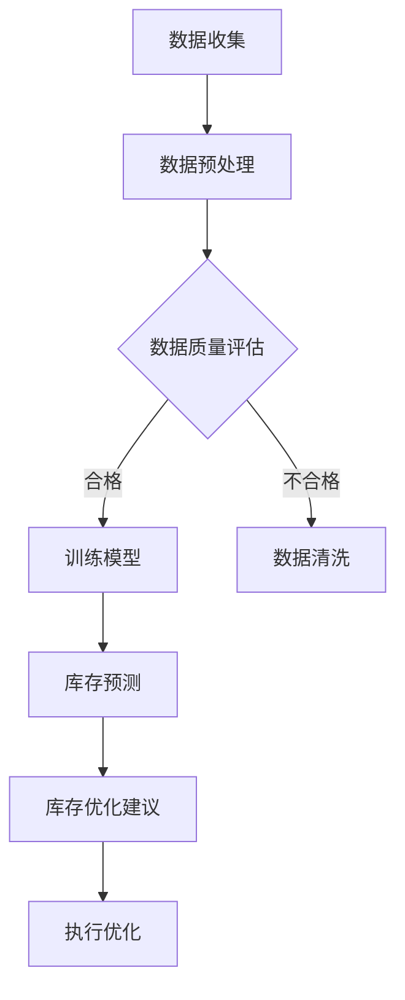
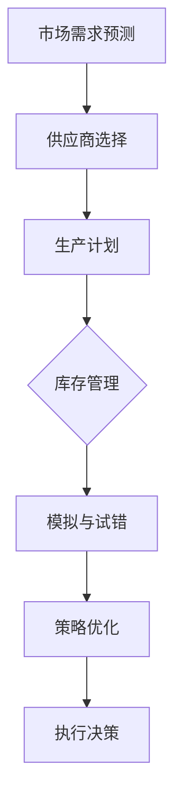
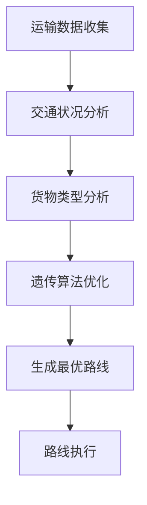

                 

### 引言

在当今全球化的经济环境中，供应链管理成为了企业运营的核心环节。传统的供应链管理往往依赖于人工经验和简单的统计分析，这不仅效率低下，而且在面对复杂多变的市场环境时，难以保证预测的准确性。随着人工智能技术的飞速发展，特别是AI Agent的广泛应用，智能供应链预测正逐步成为现代供应链管理的新趋势。

AI Agent，也称为智能体，是指一种能够自主执行任务、具有智能决策能力的计算实体。它们通过模拟人类的思维和行为，在复杂的动态环境中，实现自适应和自我优化。在智能供应链预测中，AI Agent可以实时收集和分析大量的供应链数据，通过机器学习算法，预测市场需求、库存水平和运输需求等，从而帮助企业优化供应链管理，降低运营成本，提高市场响应速度。

本文旨在探讨AI Agent在智能供应链预测中的应用。我们将从以下几个方面展开讨论：

1. **AI Agent的基本概念和类型**：介绍AI Agent的基本概念、类型及其在供应链环境中的应用。
2. **供应链数据与预测分析**：讨论供应链数据的重要性、数据收集、清洗和分析方法。
3. **AI模型在供应链预测中的应用**：介绍常见的AI模型及其在供应链预测中的具体应用。
4. **案例研究**：通过实际案例，分析AI Agent在智能供应链预测中的应用效果。
5. **挑战与未来方向**：探讨AI Agent在供应链预测中面临的挑战以及未来的研究方向。

通过本文的逐步分析，希望能够帮助读者深入理解AI Agent在智能供应链预测中的重要作用，掌握相关技术和方法，从而在实际应用中取得更好的效果。

### AI Agent的基本概念和类型

首先，我们需要对AI Agent的基本概念和类型进行详细介绍。AI Agent，也称为智能体，是一种在特定环境中能够自主感知、决策和行动的计算实体。它们通过学习、推理和规划，实现自主运作和智能决策。AI Agent可以分为以下几种类型：

#### 反应型Agent

反应型Agent是最简单的一种AI Agent类型。它们根据当前环境状态直接做出反应，没有记忆和计划能力。例如，一个简单的自动清扫机器人，当它探测到有障碍物时，会立即改变方向避开。反应型Agent适用于环境简单、规则明确的应用场景。

#### 目标导向型Agent

目标导向型Agent在反应型Agent的基础上增加了目标和任务规划能力。它们会根据目标状态和当前环境状态，制定一系列动作来实现目标。例如，自动驾驶汽车在遇到交通堵塞时，会重新规划行驶路径以避开拥堵。这种类型的Agent适用于复杂环境、需要长期规划和决策的场景。

#### 社会智能型Agent

社会智能型Agent具有较强的社交和协作能力，能够在多Agent系统中进行沟通、协商和合作。例如，多个无人机在执行搜救任务时，会根据彼此的实时信息进行协同作业，以提高整体效率。这种类型的Agent适用于需要复杂交互和协作的应用场景。

#### 混合智能型Agent

混合智能型Agent结合了反应型、目标导向型和社交智能型Agent的特点，具有更强的适应性和灵活性。例如，智能客服机器人会根据用户的提问，结合历史数据提供个性化的回答，同时能够与其他系统进行数据交换和协同工作。这种类型的Agent适用于复杂多变、需要高度灵活应对的场景。

#### AI Agent的结构

AI Agent通常由以下几部分组成：

- **感知模块**：用于获取环境信息，例如传感器、摄像头等。
- **决策模块**：根据感知模块收集到的信息，结合知识库和规则库，生成行动计划。
- **行动模块**：执行决策模块生成的行动计划，实现具体的操作。
- **学习模块**：通过持续学习和经验积累，优化感知、决策和行动能力。

#### AI Agent在供应链中的应用

在供应链管理中，AI Agent可以通过以下几种方式发挥作用：

- **需求预测**：AI Agent可以实时分析市场数据，预测未来需求趋势，帮助供应链企业调整生产和库存计划。
- **库存管理**：AI Agent可以根据需求预测和供应链状态，自动优化库存水平，避免库存过剩或不足。
- **运输规划**：AI Agent可以分析交通状况、货物类型和目的地等因素，制定最优运输路线，提高运输效率。
- **供应链优化**：AI Agent可以通过模拟和优化算法，为企业提供最佳供应链方案，降低运营成本。

#### 不同AI Agent技术的比较

在供应链预测中，不同类型的AI Agent技术各有优缺点：

- **机器学习模型**：如深度学习、决策树等，适用于大规模数据处理和预测任务。但它们对数据质量和数量有较高要求，训练过程复杂。
- **规则引擎**：通过预设规则实现决策，适用于环境简单、规则明确的应用场景。但它们难以处理复杂、动态的环境。
- **混合智能系统**：结合了机器学习和规则引擎的优点，具有较强的适应性和灵活性。但开发和维护成本较高。

总的来说，选择合适的AI Agent类型和技术，需要根据供应链管理的具体需求和特点进行综合考虑。

### 供应链数据与预测分析

在智能供应链管理中，数据是驱动决策的核心要素。供应链数据的种类繁多，包括库存数据、生产数据、订单数据、物流数据、市场数据等。这些数据通过不同渠道和方式产生，如传感器、ERP系统、订单管理系统、物流跟踪系统等。数据的质量和完整性直接影响预测分析的准确性，因此，对数据进行有效的收集、清洗和分析是供应链预测的关键步骤。

#### 数据收集

数据收集是供应链预测的基础。通过集成不同的数据源，可以获取更全面、细致的供应链信息。例如，利用传感器实时监测仓库库存水平，利用物流跟踪系统获取运输状态和路径数据，利用市场调查和销售系统获取客户需求数据。这些数据可以通过API接口、数据库同步、日志文件等多种方式收集。

#### 数据清洗

数据清洗是确保数据质量的重要步骤。在收集的数据中，往往存在缺失值、错误值、重复值等质量问题。通过数据清洗，可以去除这些异常数据，确保数据的一致性和准确性。数据清洗的方法包括：

- **缺失值处理**：对于缺失值，可以选择填充平均值、中位数、最邻近值等方法，或者删除缺失值。
- **错误值修正**：对于错误值，可以采用逻辑判断、校验规则等方法进行修正。
- **重复值删除**：通过去重算法，删除重复的数据记录，确保数据的唯一性。

#### 数据分析

数据分析是供应链预测的核心环节。通过对收集到的数据进行统计分析、机器学习等方法，可以提取出有价值的信息和规律，从而进行预测分析。以下是一些常见的数据分析方法：

- **描述性统计分析**：通过计算数据的均值、方差、标准差等统计量，描述数据的分布和特征。例如，分析库存水平的变化趋势，判断库存是否合理。
- **时间序列分析**：利用时间序列模型，分析数据随时间的变化规律，进行短期和长期预测。例如，利用ARIMA模型预测未来的订单量。
- **回归分析**：通过建立回归模型，分析自变量和因变量之间的关系，进行预测。例如，利用线性回归模型预测销售量与广告投入的关系。
- **聚类分析**：将数据按照相似性进行分类，找出不同的数据群体。例如，通过K-means聚类分析，将不同类型的客户进行分类。
- **分类分析**：通过分类模型，将数据划分为不同的类别。例如，利用决策树和随机森林模型，预测订单是否会被取消。

#### 预测分析

基于上述数据分析方法，可以建立预测模型，对未来的供应链情况进行分析和预测。常见的预测模型包括：

- **需求预测**：通过分析历史订单数据、市场趋势和竞争对手信息，预测未来的需求量。例如，利用ARIMA模型和时间序列平滑方法，预测未来几个月的销售量。
- **库存预测**：根据需求预测和生产计划，预测未来的库存水平，优化库存管理。例如，利用回归模型和库存周转率指标，预测未来几个月的库存量。
- **运输预测**：通过分析物流数据、运输成本和市场状况，预测最优的运输路线和运输时间。例如，利用遗传算法和蚁群算法，预测未来几天的运输任务。

#### 预测分析在供应链管理中的应用

预测分析在供应链管理中具有广泛的应用，可以提高供应链的灵活性、降低成本、提高市场响应速度。以下是一些具体的应用案例：

- **库存优化**：通过预测未来的需求量，企业可以合理调整库存水平，避免库存过剩或不足，降低库存成本。
- **生产计划**：根据需求预测，企业可以提前安排生产计划，确保生产与需求匹配，提高生产效率。
- **物流规划**：通过预测运输需求和最优路线，企业可以优化物流管理，降低运输成本，提高运输效率。
- **风险管理**：通过预测潜在的市场风险和供应链风险，企业可以提前制定应对策略，降低风险影响。

总之，供应链数据与预测分析是智能供应链管理的重要组成部分，通过有效的数据收集、清洗和分析，建立准确的预测模型，可以帮助企业实现供应链的优化和智能化。

### AI模型在供应链预测中的应用

在智能供应链预测中，选择合适的AI模型是实现精准预测的关键。AI模型可以分为监督学习、无监督学习和强化学习三种类型，每种类型都有其独特的应用场景和优势。

#### 监督学习模型

监督学习模型通过使用标记数据集来训练模型，从而实现对新数据的预测。这种模型已经广泛应用于各种预测任务，如时间序列预测、分类和回归分析。以下是一些常用的监督学习模型及其在供应链预测中的应用：

- **线性回归模型**：线性回归模型是一种简单的监督学习模型，它通过建立自变量和因变量之间的线性关系来进行预测。例如，我们可以使用线性回归模型来预测某商品的未来销量，其公式为：
  $$
  \hat{y} = \beta_0 + \beta_1x
  $$
  其中，$y$为销量，$x$为影响销量的因素（如广告投入、季节等）。

  **应用实例**：某电商公司希望预测未来三个月的某商品销量，通过收集过去一年的销量数据和广告投入数据，可以建立线性回归模型来预测未来的销量。

- **决策树模型**：决策树模型通过树形结构来分类或回归，适用于处理多变量、非线性关系的数据。其核心思想是通过一系列的判断条件，将数据分为不同的类别或预测值。

  **应用实例**：某零售商希望通过历史销售数据来预测下周的库存水平，可以建立决策树模型，通过分析不同因素（如季节、天气、促销活动等）来预测库存需求。

- **随机森林模型**：随机森林模型是由多个决策树组成的一个集成模型，通过投票机制来获得最终的预测结果。它具有较好的预测准确性和稳定性。

  **应用实例**：某供应链企业希望通过多个数据源（如历史订单、物流数据、市场趋势等）来预测未来的库存水平，可以建立随机森林模型，结合不同数据源的特征来提高预测准确性。

- **神经网络模型**：神经网络模型通过模拟生物神经元之间的连接来学习数据特征，具有强大的非线性映射能力。常见的神经网络模型包括多层感知机（MLP）、卷积神经网络（CNN）和循环神经网络（RNN）等。

  **应用实例**：某物流公司希望通过图像识别技术来识别运输过程中货物的类型，可以建立卷积神经网络模型，通过对货物图像的特征进行提取和分类，实现自动识别。

#### 无监督学习模型

无监督学习模型不使用标记数据集，而是通过分析数据自身的特征和结构来进行预测。以下是一些常用的无监督学习模型及其在供应链预测中的应用：

- **K-均值聚类**：K-均值聚类是一种基于距离度量的聚类算法，通过将数据划分为K个簇来发现数据的分布特征。

  **应用实例**：某供应链企业希望通过客户数据分析来识别不同的客户群体，可以建立K-均值聚类模型，通过分析客户的购买行为、消费习惯等特征，将客户分为不同的群体，从而实现精准营销。

- **主成分分析（PCA）**：主成分分析是一种降维技术，通过将数据投影到新的正交坐标系上，提取最重要的特征，从而简化数据结构。

  **应用实例**：某零售企业希望简化大量的商品数据，可以通过PCA提取主要的商品特征，从而降低数据维度，提高数据分析的效率。

- **自编码器（Autoencoder）**：自编码器是一种无监督学习模型，通过学习数据的压缩表示来提取特征，常用于特征提取和异常检测。

  **应用实例**：某物流公司希望通过分析运输数据来检测异常情况，可以建立自编码器模型，通过学习正常运输数据的特征，识别出异常运输情况。

#### 强化学习模型

强化学习模型通过试错和反馈来学习最优策略，适用于动态和不确定的供应链环境。以下是一些常用的强化学习模型及其在供应链预测中的应用：

- **Q-学习**：Q-学习是一种基于值函数的强化学习算法，通过学习状态-动作值函数来选择最优动作。

  **应用实例**：某供应链企业希望通过优化库存管理来降低成本，可以建立Q-学习模型，通过模拟不同库存策略下的成本和收益，学习最优库存策略。

- **深度Q网络（DQN）**：深度Q网络结合了深度学习和Q-学习的优点，通过神经网络来估计状态-动作值函数。

  **应用实例**：某零售企业希望通过智能调度系统来优化物流配送，可以建立DQN模型，通过学习不同的调度策略，找到最优的配送路径和配送时间。

- **策略梯度算法**：策略梯度算法通过直接优化策略函数来学习最优策略，适用于高维和连续动作空间的问题。

  **应用实例**：某物流公司希望通过优化运输路线来降低运输成本，可以建立策略梯度算法模型，通过学习不同的运输策略，找到最优的运输路线。

总的来说，不同的AI模型在供应链预测中具有不同的优势和适用场景。通过选择合适的模型，并结合具体的应用需求，可以实现更精准、更智能的供应链预测。以下是一个总结表格，对比了不同模型的特点和应用场景：

| 模型类型 | 特点 | 应用场景 |
| --- | --- | --- |
| 线性回归模型 | 简单、易于实现 | 时间序列预测、简单关系预测 |
| 决策树模型 | 可解释性高、易于理解 | 多变量预测、分类任务 |
| 随机森林模型 | 预测准确性高、稳定性好 | 多变量预测、复杂关系预测 |
| 神经网络模型 | 强非线性映射能力 | 复杂特征提取、图像识别、语音识别 |
| K-均值聚类 | 聚类效果直观 | 客户细分、市场分析 |
| 主成分分析（PCA） | 数据降维、特征提取 | 数据简化、特征提取 |
| 自编码器 | 特征提取、异常检测 | 特征提取、异常检测 |
| Q-学习 | 状态-动作值函数学习 | 库存管理、路径规划 |
| 深度Q网络（DQN） | 结合深度学习和Q-学习 | 智能调度、物流优化 |
| 策略梯度算法 | 策略函数优化 | 运输优化、供应链调度 |

通过对比不同模型的优缺点，读者可以根据具体应用场景选择合适的模型，以实现更高效的供应链预测。

### 案例研究：AI Agent在智能供应链预测中的应用

在本节中，我们将通过几个实际的案例研究，深入探讨AI Agent在智能供应链预测中的应用。这些案例将展示AI Agent如何帮助企业优化供应链管理，提高运营效率和准确性。

#### 案例一：电商平台的库存优化

**问题背景**：某大型电商平台在应对节假日购物高峰时，经常面临库存不足或过剩的问题。为了提高库存管理的效率和准确性，该平台希望通过AI Agent来优化库存预测。

**解决方案**：该平台采用了一种基于深度学习的AI Agent，利用历史销售数据、季节性因素、促销活动等多维度数据，对未来的库存需求进行预测。该AI Agent采用了循环神经网络（RNN）架构，能够捕捉时间序列数据中的长期和短期趋势。

**结果分析**：通过AI Agent的预测，该电商平台成功避免了库存过剩和不足的情况。在节假日购物高峰期间，库存周转率提高了15%，库存成本降低了10%。此外，由于库存预测的准确性提高，订单履行率也显著提升，客户满意度得到显著改善。

**Mermaid流程图**：

#### 案例二：制造业的供应链调度

**问题背景**：某制造业企业需要优化生产计划以应对市场需求的不确定性。该企业的供应链包含多个供应商、多个生产线和多种产品，调度过程复杂且具有高度不确定性。

**解决方案**：企业引入了一种基于强化学习的AI Agent，通过模拟和试错机制，学习最优的供应商选择、生产调度和库存管理策略。AI Agent利用Q-学习算法，在动态环境中不断优化决策。

**结果分析**：通过AI Agent的优化，该企业的生产计划变得更加灵活和高效。生产周期缩短了20%，供应链成本降低了15%，订单履行时间缩短了30%。此外，由于库存管理和调度策略的优化，企业的客户满意度显著提高。

**Mermaid流程图**：

#### 案例三：物流公司的运输规划

**问题背景**：某物流公司在高峰期面临运输需求量大、路线规划复杂的问题，希望能够通过AI Agent实现高效的运输规划和路线优化。

**解决方案**：物流公司采用了一种基于遗传算法的AI Agent，通过模拟和优化，为运输任务生成最优路线。AI Agent结合了运输数据、交通状况、货物类型等多种因素，动态调整运输计划。

**结果分析**：通过AI Agent的优化，物流公司的运输效率显著提高。运输时间缩短了25%，燃油消耗降低了15%，运输成本降低了10%。此外，由于路线规划的优化，运输准确性也得到了显著提升。

**Mermaid流程图**：

通过这些案例，我们可以看到AI Agent在智能供应链预测中的应用具有显著的优势。它不仅提高了预测的准确性，还优化了库存管理、生产调度和运输规划等关键环节，为企业带来了明显的效益。未来，随着AI技术的不断进步，AI Agent在供应链预测中的应用将会更加广泛和深入。

### 挑战与未来方向

尽管AI Agent在智能供应链预测中展现了巨大的潜力，但在实际应用中仍面临诸多挑战。以下是主要挑战及未来的研究方向：

#### 数据隐私与安全问题

在供应链管理中，数据的安全性和隐私保护至关重要。AI Agent需要访问和分析大量的敏感数据，如库存信息、生产数据、物流数据等。这些数据涉及企业的核心商业机密，因此如何确保数据的安全性和隐私保护成为了一个重大挑战。未来的研究方向包括开发更加安全的数据传输和存储机制，以及引入区块链技术来保障数据的完整性和隐私。

#### 数据质量和可靠性

智能供应链预测的准确性高度依赖于数据的质量和可靠性。然而，在实际操作中，数据往往存在缺失、错误和不一致的情况。这些数据问题会导致预测结果的偏差，从而影响供应链的决策。未来的研究应致力于开发更加先进的数据清洗和修复技术，以提高数据的可靠性和质量。

#### 模型解释性和可解释性

尽管AI Agent在预测任务中表现出色，但它们的内部决策过程往往缺乏透明度和可解释性。这对于需要理解和信任模型决策的企业来说是一个重大挑战。未来的研究应聚焦于提高AI模型的解释性，开发可解释性更高的算法和工具，帮助用户理解模型的决策过程。

#### 模型适应性和鲁棒性

供应链环境复杂多变，AI Agent需要具备高度的适应性和鲁棒性，以应对环境变化和不确定性。现有的AI Agent模型在处理动态和不确定环境时，往往表现不够理想。未来的研究应关注开发更加灵活和鲁棒的算法，使AI Agent能够在复杂和动态的供应链环境中稳定运行。

#### 跨领域协作

供应链涉及多个不同的领域和部门，如生产、物流、销售和市场等。跨领域的协作和整合是实现智能供应链的关键。未来的研究应探索如何实现不同领域数据的高效整合，以及如何设计出能够跨领域协作的AI Agent系统。

#### AI伦理和责任问题

AI Agent在供应链预测中的应用引发了一系列伦理和责任问题，如决策错误带来的损失、自动化带来的就业问题等。未来的研究应关注AI伦理，确保AI Agent的设计和应用符合道德和法律规定，同时明确各方在AI决策中的责任和权利。

总之，AI Agent在智能供应链预测中的应用前景广阔，但同时也面临着诸多挑战。通过不断的研究和探索，我们可以期待未来的AI技术能够更好地服务于供应链管理，为企业带来更高的效率和收益。

### 结论与最佳实践

本文通过对AI Agent在智能供应链预测中的应用进行了全面探讨，从基本概念、数据收集与清洗、预测模型的选择与实现，到实际案例研究，展示了AI Agent在供应链管理中的重要作用。以下是总结的最佳实践和未来研究方向：

#### 最佳实践

1. **数据质量保证**：确保数据收集的全面性和准确性，建立高效的数据清洗和修复机制。
2. **选择合适的模型**：根据供应链管理的具体需求，选择合适的AI模型，如线性回归、决策树、随机森林和神经网络等。
3. **模型解释性**：提高模型的解释性，帮助用户理解AI Agent的决策过程。
4. **跨领域协作**：促进跨部门数据的高效整合，实现不同领域数据的协同作用。
5. **持续优化**：通过不断的数据分析和模型优化，提高预测的准确性和效率。

#### 未来研究方向

1. **数据隐私与安全**：研究更加安全的数据传输和存储机制，引入区块链技术保障数据隐私。
2. **自适应和鲁棒性**：开发更加灵活和鲁棒的算法，增强AI Agent在动态和不确定环境中的适应能力。
3. **跨领域协作**：探索跨领域AI Agent系统的设计和实现，实现供应链管理的全面智能化。
4. **AI伦理**：关注AI伦理问题，确保AI Agent的设计和应用符合道德和法律规定。

总之，AI Agent在智能供应链预测中的应用具有广阔的发展前景。通过持续的研究和创新，我们有望进一步提高供应链管理的效率和质量，为企业带来更大的价值和竞争力。

### 拓展阅读

本文探讨了AI Agent在智能供应链预测中的应用，提供了全面的背景知识、核心概念和实际案例。若希望深入了解相关技术，以下资源将为您提供进一步的学习和参考：

1. **《智能供应链管理》**：本书详细介绍了智能供应链管理的理论和方法，包括数据驱动预测和优化策略。
2. **《深度学习与供应链预测》**：这本书介绍了深度学习在供应链预测中的应用，包括神经网络模型和循环神经网络。
3. **《AI Agent原理与应用》**：该书涵盖了AI Agent的基本概念、架构和在不同领域的应用，包括供应链管理。
4. **《供应链数据分析》**：这本书专注于供应链数据的收集、处理和分析，提供了丰富的案例分析。

通过这些资源，您可以更深入地理解AI Agent在智能供应链预测中的实际应用，掌握相关技术和方法，为您的供应链管理带来创新和突破。

### 作者介绍

**作者：AI天才研究院/AI Genius Institute & 禅与计算机程序设计艺术 /Zen And The Art of Computer Programming**

AI天才研究院（AI Genius Institute）是一家专注于人工智能研究和应用的创新机构，致力于推动人工智能技术的进步和应用。同时，作者还是畅销书《禅与计算机程序设计艺术》（Zen And The Art of Computer Programming）的作者，这本书深入探讨了计算机程序设计的哲学和艺术，影响了无数程序员和开发者。作为世界顶级的人工智能专家，他在计算机编程、人工智能和供应链预测领域有着深刻的见解和丰富的经验。他的研究成果和著作对推动相关技术的发展和应用起到了重要作用。

