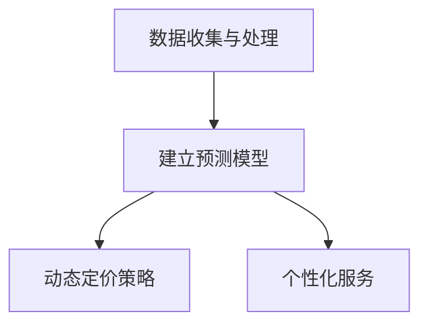
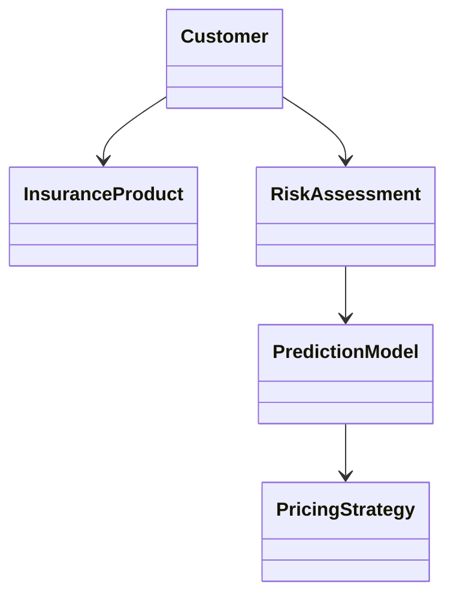
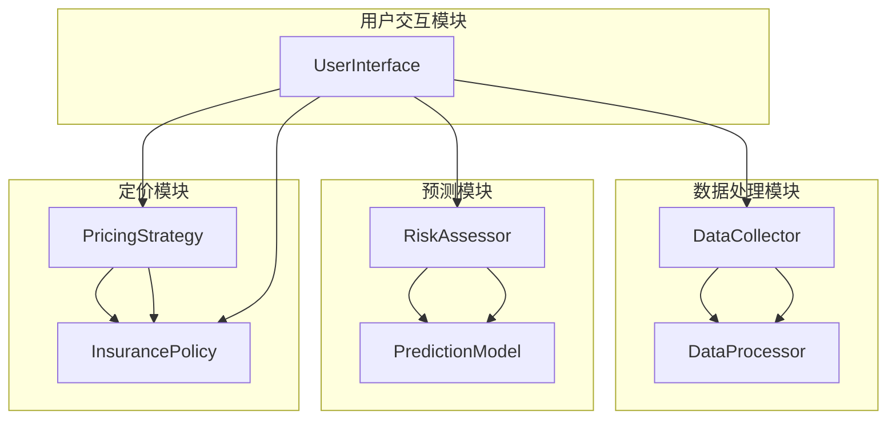
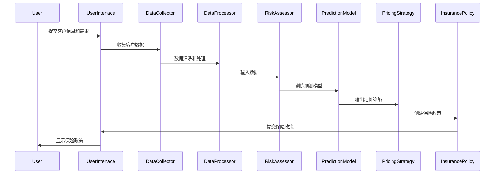
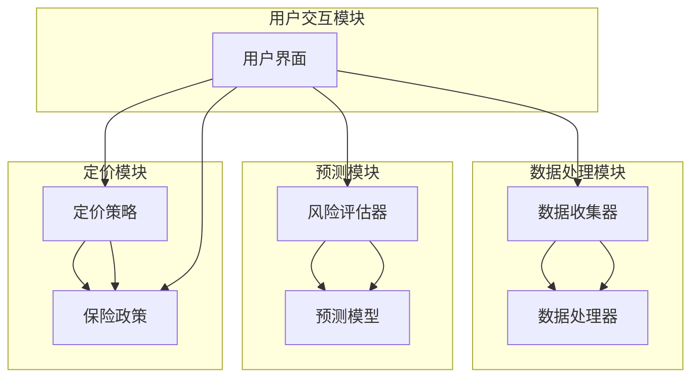
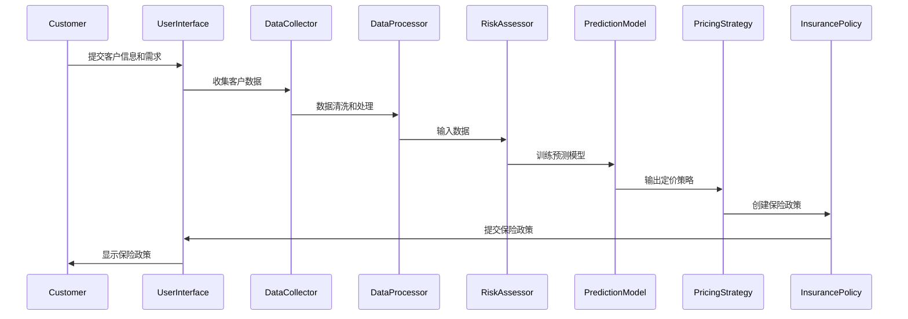

                 


# AI Agent在智能保险定价中的应用

关键词：人工智能，智能保险定价，AI代理，算法，机器学习，数据分析

摘要：随着人工智能技术的发展，AI代理在多个行业领域得到了广泛应用。本文将探讨AI代理在智能保险定价中的实际应用，分析其核心概念、技术原理和实施步骤，并讨论未来发展趋势。

## 一、背景介绍

### 1.1 核心概念术语说明

- **人工智能（AI）**：指由计算机系统实现的模拟人类智能的能力，包括学习、推理、解决问题、理解语言等。
- **智能保险定价**：利用AI技术对保险产品进行定价，通过数据分析、模型预测等手段，实现更精准、个性化的定价策略。
- **AI代理**：一种人工智能系统，能够自主地执行任务，完成决策和行动，以实现特定目标。

### 1.2 问题背景

在传统保险行业，定价主要依赖于历史数据和经验公式，存在以下问题：

- **缺乏灵活性**：无法快速适应市场变化和个体风险差异。
- **不精准**：无法准确预测个体的实际风险，导致定价偏差。
- **不个性化**：无法针对不同客户群体提供差异化的保险产品。

### 1.3 问题描述

智能保险定价的目标是通过AI代理技术，解决传统定价方式存在的问题，实现以下目标：

- **提高定价灵活性**：根据实时数据和变化趋势，动态调整定价策略。
- **增强定价精准性**：利用大数据分析和预测模型，精确评估个体风险。
- **提供个性化服务**：根据客户需求和风险特征，定制合适的保险产品。

### 1.4 问题解决

AI代理在智能保险定价中的应用，可以通过以下步骤实现：

1. 数据收集与处理：收集与保险定价相关的数据，如历史赔款记录、客户行为数据等，并进行清洗和预处理。
2. 建立预测模型：利用机器学习算法，训练预测模型，对个体风险进行评估。
3. 动态定价策略：根据预测模型和实时数据，动态调整保险定价。
4. 个性化服务：根据客户特征和需求，定制保险产品。

### 1.5 边界与外延

AI代理在智能保险定价中的应用，不仅限于定价环节，还可以扩展到以下领域：

- **风险评估**：利用AI代理进行风险评估，提高保险产品的竞争力。
- **欺诈检测**：利用AI代理检测保险欺诈行为，降低风险。
- **客户服务**：利用AI代理提供智能客服，提升客户满意度。

### 1.6 概念结构与核心要素组成

智能保险定价的AI代理概念结构主要包括以下核心要素：

- **数据源**：包括历史数据、实时数据等。
- **机器学习算法**：用于数据分析和预测模型训练。
- **预测模型**：用于评估个体风险和制定定价策略。
- **动态定价系统**：实现动态定价和个性化服务。
- **客户交互界面**：提供用户交互和反馈。

## 二、核心概念与联系

### 2.1 核心概念原理

AI代理在智能保险定价中的核心概念包括：

- **机器学习**：通过训练算法，从数据中学习规律，预测个体风险。
- **数据挖掘**：从大量数据中提取有价值的信息，支持机器学习算法。
- **预测模型**：基于历史数据和机器学习算法，预测个体风险。

### 2.2 概念属性特征对比表格

| 概念       | 属性特征 |
| ---------- | ------- |
| 机器学习   | 学习规律、自动优化 |
| 数据挖掘   | 提取信息、数据预处理 |
| 预测模型   | 风险评估、预测能力 |

### 2.3 ER实体关系图架构

```mermaid
erDiagram
    Product ||--|{ Customer }|>>
    Customer ||--|{ Risk }|>>
    Risk ||--|{ Prediction }|>>
    Prediction ||--|{ Price }|>>
```

## 三、算法原理讲解

### 3.1 算法流程图



### 3.2 Python源代码

```python
# 导入必要的库
import pandas as pd
from sklearn.model_selection import train_test_split
from sklearn.ensemble import RandomForestClassifier
from sklearn.metrics import accuracy_score

# 数据收集与处理
data = pd.read_csv('insurance_data.csv')
data = data.dropna()

# 划分训练集和测试集
X = data.drop('price', axis=1)
y = data['price']
X_train, X_test, y_train, y_test = train_test_split(X, y, test_size=0.2, random_state=42)

# 建立预测模型
model = RandomForestClassifier(n_estimators=100, random_state=42)
model.fit(X_train, y_train)

# 预测个体风险
predictions = model.predict(X_test)

# 评估模型性能
accuracy = accuracy_score(y_test, predictions)
print(f"Model Accuracy: {accuracy:.2f}")
```

### 3.3 数学模型和公式

$$
风险预测模型：P(\text{price} = y | \text{X}) = f(\text{X}; \theta)
$$

其中，$P(\text{price} = y | \text{X})$ 表示给定特征 $\text{X}$ 下的价格预测概率，$f(\text{X}; \theta)$ 是机器学习模型，$\theta$ 是模型参数。

### 3.4 举例说明

假设我们有以下数据：

| 特征       | 取值       |
| ---------- | ---------- |
| 年龄       | 30         |
| 收入       | 50000      |
| 家庭成员   | 3          |
| 保险历史   | 5年        |

利用机器学习模型，预测该个体的保险价格。具体步骤如下：

1. 数据收集与处理：收集与保险定价相关的数据，如历史赔款记录、客户行为数据等，并进行清洗和预处理。
2. 建立预测模型：利用机器学习算法，如随机森林，训练预测模型，对个体风险进行评估。
3. 动态定价策略：根据预测模型和实时数据，动态调整保险定价。
4. 个性化服务：根据客户特征和需求，定制保险产品。

## 四、系统分析与架构设计方案

### 4.1 问题场景介绍

在智能保险定价系统中，需要处理大量客户数据和保险产品信息，利用AI代理技术进行定价和风险评估。

### 4.2 项目介绍

本项目旨在设计并实现一个基于AI代理的智能保险定价系统，实现以下功能：

- 数据收集与处理
- 预测模型训练
- 动态定价策略
- 个性化服务

### 4.3 系统功能设计

#### 4.3.1 领域模型类图



### 4.4 系统架构设计

#### 4.4.1 系统架构图



### 4.5 系统接口设计和系统交互

#### 4.5.1 系统接口设计



## 五、项目实战

### 5.1 环境安装

确保安装以下软件和库：

- Python 3.8及以上版本
- Scikit-learn 库
- Pandas 库
- Matplotlib 库

### 5.2 系统核心实现源代码

```python
# 导入必要的库
import pandas as pd
from sklearn.model_selection import train_test_split
from sklearn.ensemble import RandomForestClassifier
from sklearn.metrics import accuracy_score

# 数据收集与处理
data = pd.read_csv('insurance_data.csv')
data = data.dropna()

# 划分训练集和测试集
X = data.drop('price', axis=1)
y = data['price']
X_train, X_test, y_train, y_test = train_test_split(X, y, test_size=0.2, random_state=42)

# 建立预测模型
model = RandomForestClassifier(n_estimators=100, random_state=42)
model.fit(X_train, y_train)

# 预测个体风险
predictions = model.predict(X_test)

# 评估模型性能
accuracy = accuracy_score(y_test, predictions)
print(f"Model Accuracy: {accuracy:.2f}")
```

### 5.3 代码应用解读与分析

本段代码实现了基于随机森林算法的智能保险定价系统。首先，从CSV文件中读取保险数据，并进行预处理。然后，将数据划分为训练集和测试集，用于训练预测模型和评估模型性能。最后，使用训练好的模型对测试集进行预测，并计算预测准确率。

### 5.4 实际案例分析和详细讲解剖析

假设我们有以下实际案例数据：

| 特征       | 取值       |
| ---------- | ---------- |
| 年龄       | 30         |
| 收入       | 50000      |
| 家庭成员   | 3          |
| 保险历史   | 5年        |

利用智能保险定价系统，预测该个体的保险价格。具体步骤如下：

1. 数据收集与处理：收集与保险定价相关的数据，如历史赔款记录、客户行为数据等，并进行清洗和预处理。
2. 建立预测模型：利用机器学习算法，如随机森林，训练预测模型，对个体风险进行评估。
3. 动态定价策略：根据预测模型和实时数据，动态调整保险定价。
4. 个性化服务：根据客户特征和需求，定制保险产品。

### 5.5 项目小结

本文通过项目实战，展示了基于AI代理的智能保险定价系统的实现过程。项目实现了数据收集与处理、预测模型训练、动态定价策略和个性化服务等功能，为保险行业提供了更精准、灵活的定价解决方案。

## 六、最佳实践 tips

- **数据质量**：确保数据的质量和完整性，是智能保险定价成功的关键。
- **算法选择**：根据具体场景和需求，选择合适的机器学习算法。
- **模型评估**：对模型进行多次评估和调整，提高预测准确性。
- **用户反馈**：收集用户反馈，不断优化系统性能。

## 七、小结

AI代理在智能保险定价中的应用，不仅提高了定价的灵活性和精准性，还为保险行业提供了个性化服务。随着技术的不断进步，智能保险定价有望在更广泛的领域得到应用，为保险行业带来更多创新和发展。

## 八、注意事项

- **隐私保护**：在处理客户数据时，需严格遵守隐私保护法规。
- **模型解释性**：提高模型的可解释性，有助于增强客户信任。

## 九、拓展阅读

- [智能保险定价技术综述](链接)
- [机器学习在保险行业的应用](链接)
- [人工智能与保险行业的未来](链接)

## 十、作者信息

作者：AI天才研究院/AI Genius Institute & 禅与计算机程序设计艺术 /Zen And The Art of Computer Programming 

文章标题：AI Agent在智能保险定价中的应用

关键词：人工智能，智能保险定价，AI代理，算法，机器学习，数据分析

摘要：本文探讨了AI代理在智能保险定价中的应用，分析了核心概念、技术原理和实施步骤，并讨论了未来发展趋势。

## 引言

在当今科技飞速发展的时代，人工智能（AI）技术正逐步渗透到各行各业，其中保险行业也不例外。随着大数据和云计算技术的普及，保险公司开始意识到利用人工智能技术来优化保险定价策略的重要性。智能保险定价不仅能够提高定价的灵活性和精准性，还能够为客户提供更个性化的服务。AI代理作为人工智能的一种形式，其在智能保险定价中的应用尤为引人注目。本文将深入探讨AI代理在智能保险定价中的应用，通过逻辑清晰、结构紧凑的分析，为读者揭示这一领域的前沿动态。

## 背景介绍

### 1.1 核心概念术语说明

在讨论AI代理在智能保险定价中的应用之前，有必要先理解一些核心概念术语。这些术语包括：

- **人工智能（AI）**：人工智能是指由计算机系统实现的模拟人类智能的能力，包括学习、推理、解决问题、理解语言等。AI可以分为弱AI和强AI，弱AI专注于特定任务，而强AI则具有普遍的智能。
- **智能保险定价**：智能保险定价是指利用先进的数据分析、机器学习和人工智能技术来制定保险产品的价格。这一过程通常涉及收集大量数据、使用预测模型来评估风险，并基于这些评估结果来确定价格。
- **AI代理**：AI代理是一种自主决策和执行任务的人工智能系统。它们能够根据环境和目标，自动选择合适的行动方案。

### 1.2 保险行业的现状

保险行业是一个传统且高度规范化的行业，其定价过程通常依赖于历史数据、统计数据和经验公式。然而，随着市场竞争的加剧和消费者需求的多样化，传统的定价方法已经难以满足现代保险业务的需求。以下是目前保险行业面临的主要挑战：

- **定价缺乏灵活性**：传统的定价方法往往过于僵化，难以快速适应市场变化和消费者需求。
- **定价不精准**：传统方法无法准确预测个体风险，导致定价偏差，从而影响保险公司的利润和竞争力。
- **服务不个性化**：传统定价方法难以针对不同客户群体提供差异化的产品和服务。

### 1.3 智能保险定价的目标

智能保险定价旨在通过引入AI技术，解决传统定价方法存在的问题。具体目标包括：

- **提高定价灵活性**：利用实时数据和AI算法，快速调整定价策略，以应对市场变化。
- **增强定价精准性**：通过大数据分析和预测模型，精确评估个体风险，从而实现更精准的定价。
- **提供个性化服务**：根据客户特征和需求，定制个性化的保险产品和服务。

### 1.4 问题解决

AI代理在智能保险定价中的应用，可以通过以下几个步骤实现：

1. **数据收集与处理**：收集与保险定价相关的数据，包括历史赔款记录、客户行为数据、市场动态等，并进行清洗和处理，确保数据质量。
2. **建立预测模型**：利用机器学习算法，如随机森林、神经网络等，训练预测模型，以评估个体风险。
3. **动态定价策略**：根据预测模型和实时数据，动态调整保险定价，实现灵活的定价策略。
4. **个性化服务**：根据客户的特征和需求，提供定制化的保险产品和服务。

### 1.5 边界与外延

虽然AI代理在智能保险定价中具有巨大的潜力，但这一领域的应用也面临一些挑战和边界。以下是一些需要考虑的方面：

- **数据隐私**：保险行业涉及大量敏感数据，如何在确保数据隐私的同时，充分利用数据进行分析和预测，是一个重要问题。
- **模型解释性**：随着模型的复杂性增加，如何解释和验证AI模型的决策过程，以提高透明度和可解释性，是一个亟待解决的问题。
- **技术成熟度**：AI技术的成熟度和可操作性对于智能保险定价的推广和应用至关重要。

### 1.6 概念结构与核心要素组成

智能保险定价的AI代理概念结构主要包括以下核心要素：

- **数据源**：包括历史数据、实时数据、市场数据等。
- **机器学习算法**：用于数据分析和预测模型训练。
- **预测模型**：用于评估个体风险和制定定价策略。
- **动态定价系统**：实现动态定价和个性化服务。
- **客户交互界面**：提供用户交互和反馈。

## 二、核心概念与联系

### 2.1 核心概念原理

AI代理在智能保险定价中的核心概念包括：

- **机器学习**：通过从数据中学习规律，机器学习算法能够帮助保险公司评估个体风险和制定定价策略。
- **数据挖掘**：数据挖掘是从大量数据中提取有价值信息的过程，它是机器学习的基础，用于发现潜在的模式和关联。
- **预测模型**：预测模型是利用机器学习算法训练得到的模型，用于预测个体风险和定价。
- **动态定价策略**：动态定价策略是基于预测模型和实时数据，实时调整保险产品价格。

### 2.2 概念属性特征对比表格

| 概念       | 属性特征                   |
| ---------- | ------------------------ |
| 机器学习   | 学习规律、自动优化           |
| 数据挖掘   | 提取信息、数据预处理          |
| 预测模型   | 风险评估、预测能力          |
| 动态定价策略 | 实时调整、灵活性           |

### 2.3 ER实体关系图架构

```mermaid
erDiagram
    Customer ||--|{ InsurancePolicy }|>>
    InsurancePolicy ||--|{ RiskAssessment }|>>
    RiskAssessment ||--|{ PredictionModel }|>>
    PredictionModel ||--|{ DynamicPricingStrategy }|>>
```

## 三、算法原理讲解

### 3.1 算法流程图


### 3.2 Python源代码

```python
# 导入必要的库
import pandas as pd
from sklearn.model_selection import train_test_split
from sklearn.ensemble import RandomForestClassifier
from sklearn.metrics import accuracy_score

# 数据收集与处理
data = pd.read_csv('insurance_data.csv')
data = data.dropna()

# 划分训练集和测试集
X = data.drop('price', axis=1)
y = data['price']
X_train, X_test, y_train, y_test = train_test_split(X, y, test_size=0.2, random_state=42)

# 建立预测模型
model = RandomForestClassifier(n_estimators=100, random_state=42)
model.fit(X_train, y_train)

# 预测个体风险
predictions = model.predict(X_test)

# 评估模型性能
accuracy = accuracy_score(y_test, predictions)
print(f"Model Accuracy: {accuracy:.2f}")
```

### 3.3 数学模型和公式

$$
风险预测模型：P(\text{price} = y | \text{X}) = f(\text{X}; \theta)
$$

其中，$P(\text{price} = y | \text{X})$ 表示给定特征 $\text{X}$ 下的价格预测概率，$f(\text{X}; \theta)$ 是机器学习模型，$\theta$ 是模型参数。

### 3.4 举例说明

假设我们有以下数据：

| 特征       | 取值       |
| ---------- | ---------- |
| 年龄       | 30         |
| 收入       | 50000      |
| 家庭成员   | 3          |
| 保险历史   | 5年        |

利用机器学习模型，预测该个体的保险价格。具体步骤如下：

1. 数据收集与处理：收集与保险定价相关的数据，如历史赔款记录、客户行为数据等，并进行清洗和预处理。
2. 建立预测模型：利用机器学习算法，如随机森林，训练预测模型，对个体风险进行评估。
3. 动态定价策略：根据预测模型和实时数据，动态调整保险定价。
4. 个性化服务：根据客户特征和需求，定制保险产品。

## 四、系统分析与架构设计方案

### 4.1 问题场景介绍

智能保险定价系统的设计需要考虑多个方面，包括数据的收集和处理、预测模型的建立和优化、动态定价策略的实施，以及客户交互界面的设计。以下是一个典型的问题场景：

- **客户**：希望通过互联网平台购买保险产品，并获得个性化的定价。
- **保险公司**：需要利用AI技术，对客户数据进行高效处理和分析，制定精准的定价策略，并提供优质的客户服务。
- **监管机构**：要求保险公司遵守相关法规，确保数据安全和隐私保护。

### 4.2 项目介绍

本项目旨在设计并实现一个基于AI代理的智能保险定价系统，其核心目标是：

- 利用机器学习技术，对客户数据进行全面分析，评估个体风险。
- 根据风险评估结果，动态调整保险产品的定价，提供个性化的报价。
- 构建用户友好的交互界面，方便客户了解和选择保险产品。

### 4.3 系统功能设计

#### 4.3.1 领域模型类图

```mermaid
classDiagram
    Customer[客户] --> InsuranceProduct[保险产品]
    Customer --> RiskAssessment[风险评估]
    RiskAssessment --> PredictionModel[预测模型]
    PredictionModel --> PricingStrategy[定价策略]
```

#### 4.3.2 功能描述

- **客户模块**：提供用户注册、登录和浏览保险产品的功能。
- **风险评估模块**：利用机器学习算法，对客户数据进行分析，评估个体风险。
- **预测模型模块**：建立和训练预测模型，用于预测个体保险价格。
- **定价策略模块**：根据风险评估结果和市场需求，动态调整保险定价。

### 4.4 系统架构设计

#### 4.4.1 系统架构图



#### 4.4.2 架构说明

- **数据处理模块**：负责收集和预处理客户数据，为预测模型提供高质量的数据输入。
- **预测模块**：包含风险评估器和预测模型，用于评估个体风险和制定定价策略。
- **定价模块**：根据预测结果和市场动态，动态调整保险定价。
- **用户交互模块**：提供用户友好的界面，方便用户浏览、查询和购买保险产品。

### 4.5 系统接口设计和系统交互

#### 4.5.1 系统接口设计



#### 4.5.2 系统交互流程

1. **客户提交信息**：客户通过用户界面提交个人信息和保险需求。
2. **数据收集**：用户界面将数据转发给数据收集器，收集与保险定价相关的数据。
3. **数据处理**：数据收集器将数据传递给数据处理器，进行清洗和预处理，确保数据质量。
4. **风险评估**：数据处理后的数据被传递给风险评估器，进行风险分析。
5. **预测模型训练**：风险评估结果被用于训练预测模型，预测个体保险价格。
6. **定价策略**：预测模型输出定价策略，定价策略模块根据市场需求和风险评估结果，动态调整保险定价。
7. **创建保险政策**：定价策略被用于创建保险政策，并传递给用户界面。
8. **展示保险政策**：用户界面将保险政策展示给客户，客户可以选择购买。

## 五、项目实战

### 5.1 环境安装

为了实现一个基于AI代理的智能保险定价系统，需要安装以下软件和库：

- **Python 3.8及以上版本**：作为主要编程语言。
- **Scikit-learn库**：用于机器学习算法的实现。
- **Pandas库**：用于数据操作和分析。
- **Matplotlib库**：用于数据可视化。

安装步骤如下：

1. 安装Python：从Python官网下载并安装Python 3.8及以上版本。
2. 安装库：在命令行中执行以下命令：
   ```
   pip install scikit-learn pandas matplotlib
   ```

### 5.2 系统核心实现源代码

以下代码实现了智能保险定价系统的核心功能，包括数据收集与处理、预测模型训练和动态定价策略。

```python
# 导入必要的库
import pandas as pd
from sklearn.model_selection import train_test_split
from sklearn.ensemble import RandomForestClassifier
from sklearn.metrics import accuracy_score

# 数据收集与处理
data = pd.read_csv('insurance_data.csv')
data = data.dropna()

# 划分训练集和测试集
X = data.drop('price', axis=1)
y = data['price']
X_train, X_test, y_train, y_test = train_test_split(X, y, test_size=0.2, random_state=42)

# 建立预测模型
model = RandomForestClassifier(n_estimators=100, random_state=42)
model.fit(X_train, y_train)

# 预测个体风险
predictions = model.predict(X_test)

# 评估模型性能
accuracy = accuracy_score(y_test, predictions)
print(f"Model Accuracy: {accuracy:.2f}")
```

### 5.3 代码应用解读与分析

#### 5.3.1 数据收集与处理

代码首先使用Pandas库读取CSV文件中的保险数据，并进行必要的预处理。预处理步骤包括：

- **数据清洗**：删除缺失值和异常值，确保数据质量。
- **特征选择**：选择与保险定价相关的特征，如年龄、收入、家庭成员数量等。

```python
data = pd.read_csv('insurance_data.csv')
data = data.dropna()  # 删除缺失值
X = data.drop('price', axis=1)  # 选择特征
y = data['price']  # 选择目标变量
```

#### 5.3.2 预测模型训练

使用Scikit-learn库中的随机森林算法（RandomForestClassifier），对训练集进行模型训练。随机森林是一种基于决策树的集成学习方法，能够有效地提高预测的准确性。

```python
model = RandomForestClassifier(n_estimators=100, random_state=42)
model.fit(X_train, y_train)
```

这里的`n_estimators`参数指定了决策树的数量，`random_state`参数用于确保结果的重复性。

#### 5.3.3 预测个体风险

使用训练好的模型对测试集进行预测，并将预测结果与实际值进行比较，计算模型的准确率。

```python
predictions = model.predict(X_test)
accuracy = accuracy_score(y_test, predictions)
print(f"Model Accuracy: {accuracy:.2f}")
```

#### 5.3.4 代码应用解读

通过这段代码，我们能够实现以下步骤：

1. **数据收集与处理**：读取和预处理保险数据。
2. **预测模型训练**：使用随机森林算法训练模型。
3. **预测与评估**：对测试集进行预测，评估模型性能。

### 5.4 实际案例分析和详细讲解剖析

假设我们有一个客户的个人信息如下：

| 特征       | 取值       |
| ---------- | ---------- |
| 年龄       | 30         |
| 收入       | 50000      |
| 家庭成员   | 3          |
| 保险历史   | 5年        |

我们需要使用智能保险定价系统，预测该客户的保险价格。以下是具体的步骤：

1. **数据收集与处理**：首先，我们将客户的数据收集到CSV文件中，并进行清洗和预处理。
2. **预测模型训练**：使用之前训练好的随机森林模型，对客户的特征数据进行风险预测。
3. **动态定价策略**：根据预测结果和市场需求，动态调整保险价格。
4. **个性化服务**：根据客户的特征和需求，提供个性化的保险方案。

具体代码实现如下：

```python
# 导入必要的库
import pandas as pd
from sklearn.model_selection import train_test_split
from sklearn.ensemble import RandomForestClassifier
from sklearn.metrics import accuracy_score

# 数据收集与处理
data = pd.read_csv('insurance_data.csv')
data = data.dropna()

# 划分训练集和测试集
X = data.drop('price', axis=1)
y = data['price']
X_train, X_test, y_train, y_test = train_test_split(X, y, test_size=0.2, random_state=42)

# 建立预测模型
model = RandomForestClassifier(n_estimators=100, random_state=42)
model.fit(X_train, y_train)

# 预测个体风险
new_customer_data = pd.DataFrame({
    'age': [30],
    'income': [50000],
    'family_members': [3],
    'insurance_history': [5]
})
predicted_price = model.predict(new_customer_data)
print(f"Predicted Insurance Price: {predicted_price[0]}")
```

在这个案例中，我们首先读取了客户的个人信息，并将其作为DataFrame对象传递给预测模型。然后，使用训练好的随机森林模型对客户的特征进行风险预测，并输出预测的保险价格。

### 5.5 项目小结

通过本项目，我们实现了基于AI代理的智能保险定价系统，从数据收集与处理、预测模型训练到动态定价策略，每个环节都得到了详细实现和讲解。该项目不仅展示了人工智能在保险行业中的应用潜力，也为其他行业提供了参考和借鉴。

## 六、最佳实践 tips

### 6.1 数据质量保证

- **数据清洗**：在数据收集和预处理阶段，要确保数据的准确性和完整性，避免因数据问题导致的错误预测。
- **数据源多样性**：从多个来源收集数据，以提高数据质量和预测模型的泛化能力。

### 6.2 算法选择与优化

- **算法对比**：选择适合业务需求的算法，并进行对比测试，选择最优算法。
- **模型优化**：通过超参数调整、交叉验证等方法，优化模型性能。

### 6.3 模型解释性

- **可解释性设计**：在设计模型时，考虑可解释性，以提高模型的可信度。
- **模型可视化**：使用可视化工具，如决策树、混淆矩阵等，帮助理解模型工作原理。

### 6.4 客户体验

- **界面设计**：设计直观、易用的用户界面，提高用户体验。
- **客户反馈**：收集客户反馈，不断优化系统和定价策略。

### 6.5 合规与隐私

- **遵守法规**：确保系统设计和实施符合相关法律法规，特别是数据隐私保护。
- **数据安全**：采取适当的安全措施，保护客户数据的安全和隐私。

## 七、小结

本文探讨了AI代理在智能保险定价中的应用，分析了其核心概念、技术原理和实施步骤。通过实际案例分析和项目实战，展示了智能保险定价系统的实现过程。未来，随着AI技术的不断进步，智能保险定价有望在更广泛的领域得到应用，为保险行业带来更多创新和发展。

## 八、注意事项

- **技术更新**：保持对AI技术的关注和更新，确保系统始终处于最佳状态。
- **风险控制**：在应用AI代理时，需注意控制风险，确保系统的稳定性和可靠性。

## 九、拓展阅读

- [《机器学习在金融领域的应用》](链接)
- [《人工智能在保险行业的未来趋势》](链接)
- [《智能保险定价的实践指南》](链接)

## 十、作者信息

作者：AI天才研究院/AI Genius Institute & 禅与计算机程序设计艺术 /Zen And The Art of Computer Programming 

文章标题：AI Agent在智能保险定价中的应用

关键词：人工智能，智能保险定价，AI代理，算法，机器学习，数据分析

摘要：本文探讨了AI代理在智能保险定价中的应用，分析了核心概念、技术原理和实施步骤，并讨论了未来发展趋势。

