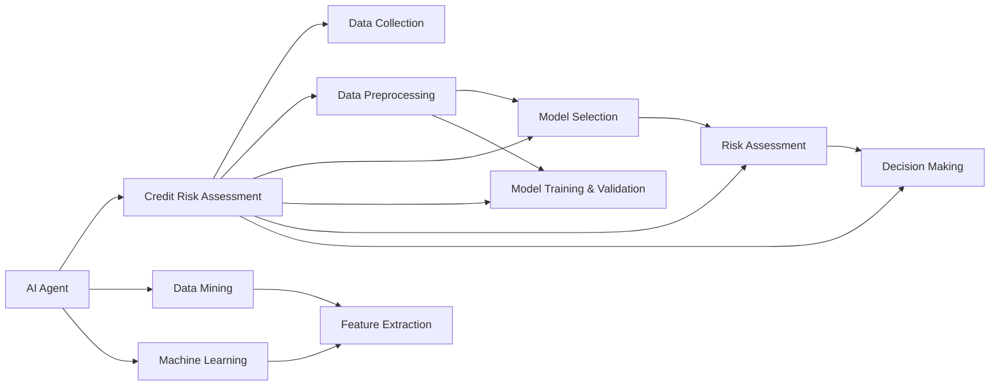
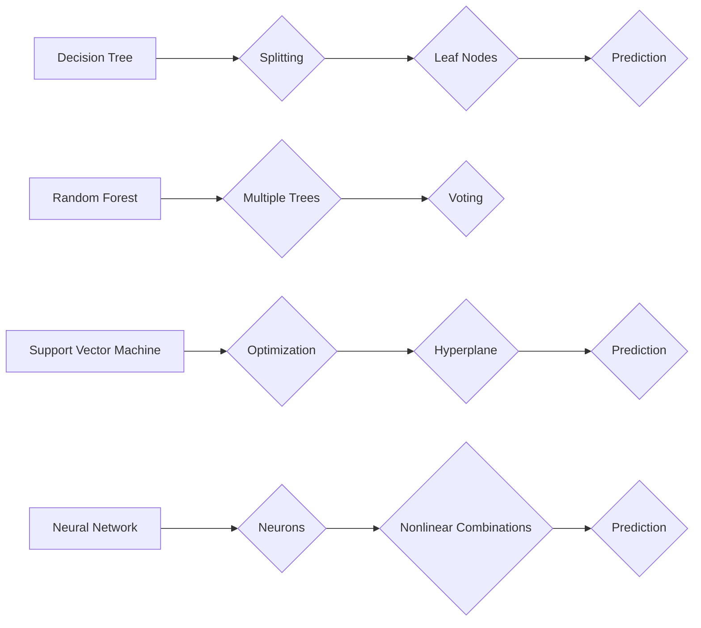
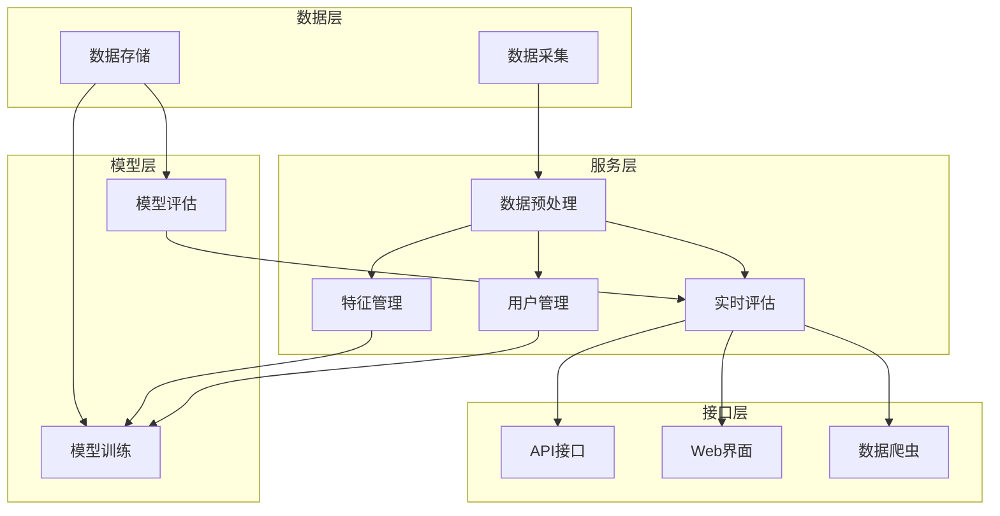
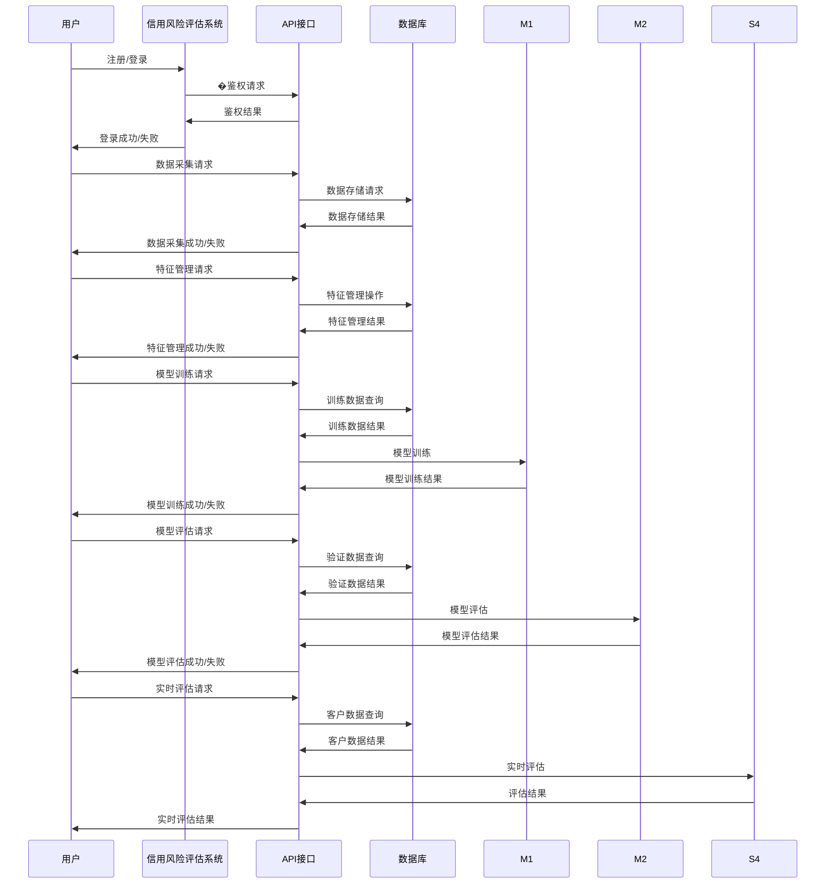

                 

## AI Agent在智能信用风险评估中的应用

> 关键词：AI Agent、信用风险评估、机器学习、数据挖掘

> 摘要：本文探讨了人工智能代理（AI Agent）在智能信用风险评估中的应用。首先，介绍了信用风险评估的重要性及其面临的挑战。随后，详细阐述了AI Agent的定义及其核心特点。接下来，本文通过分析AI Agent在数据挖掘、特征提取和预测模型中的应用，展示了其在信用风险评估中的巨大潜力。随后，介绍了常见的机器学习算法及其在信用风险评估中的应用。通过数学模型和公式，详细解析了这些算法的工作原理。最后，本文提出了一种系统架构设计方案，并展示了一个实际案例，总结了最佳实践和注意事项，为未来的研究和应用提供了有益的参考。

## 背景介绍

### 信用风险评估的重要性

信用风险评估是金融领域至关重要的环节，直接关系到金融机构的风险管理和贷款审批效率。传统的信用评估方法主要依赖于人工审核和历史数据，往往存在主观性强、效率低、准确性不足等问题。随着金融市场的不断发展，金融机构面临的风险类型和程度也在不断增加，传统方法难以应对复杂多变的市场环境。因此，智能信用风险评估成为金融机构提升风险管理能力、降低信用风险的重要手段。

### 信用风险评估的现状与挑战

当前，信用风险评估主要面临以下几个挑战：

1. **数据质量**：信用风险评估依赖于大量历史数据，但数据质量参差不齐，包括缺失值、噪声数据和异常值等问题，这些都会影响评估结果的准确性。
2. **特征提取**：如何从大量数据中提取出对信用评估有价值的特征，是信用风险评估的关键。传统方法往往难以捕捉数据中的复杂关系和潜在模式。
3. **模型选择**：信用风险评估涉及的模型众多，如何选择合适的模型以实现高效、准确的评估，是当前研究的热点。
4. **实时性**：信用风险评估需要实时更新，以适应市场的快速变化。传统方法难以实现实时评估，导致金融机构无法及时调整风险管理策略。

### AI Agent的潜力

人工智能代理（AI Agent）作为一种具有自主学习和决策能力的智能系统，具有以下潜力，能够应对信用风险评估面临的挑战：

1. **自动特征提取**：AI Agent可以通过深度学习和数据挖掘技术，自动提取数据中的潜在特征，提高特征提取的准确性和效率。
2. **实时风险评估**：AI Agent可以实时分析数据，快速更新风险评估模型，使金融机构能够及时调整风险管理策略。
3. **个性化风险评估**：AI Agent可以根据客户的历史数据和个性化信息，进行个性化风险评估，提高评估的准确性和适应性。
4. **降低人力成本**：AI Agent可以自动执行风险评估任务，减少人工审核工作量，降低人力成本。

总之，AI Agent在智能信用风险评估中的应用具有巨大潜力，有望解决传统方法面临的挑战，提高金融机构的风险管理能力。接下来，本文将详细探讨AI Agent的核心概念和特点，以及其在信用风险评估中的具体应用。

## 核心概念与联系

### AI Agent的定义和特点

AI Agent，即人工智能代理，是指一种具有自主学习和决策能力的智能系统。它能够感知环境、制定决策并执行动作，以实现特定目标。AI Agent具有以下几个核心特点：

1. **自主性**：AI Agent能够自主地感知环境，根据环境变化自主调整行为，而不需要人工干预。
2. **学习能力**：AI Agent可以通过机器学习和深度学习等技术，从数据中自动学习并优化决策策略。
3. **适应性**：AI Agent能够根据不同环境和任务，自适应地调整行为和策略，以提高任务完成率。
4. **决策能力**：AI Agent能够基于感知到的环境和数据，自主制定决策，并执行相应的动作。

### 信用风险评估的定义和流程

信用风险评估是指对借款人的信用状况进行评估，以确定其还款能力和意愿，从而决定是否批准贷款申请。信用风险评估的主要流程包括：

1. **数据收集**：收集借款人的个人信息、财务状况、历史信用记录等数据。
2. **数据预处理**：对收集到的数据进行清洗、归一化和特征提取，以提高数据质量。
3. **模型选择**：选择合适的机器学习模型进行风险评估，如决策树、支持向量机、神经网络等。
4. **模型训练和验证**：使用历史数据对模型进行训练和验证，评估模型的准确性和可靠性。
5. **风险评估**：将模型应用于新的借款人数据，进行风险评估，生成信用评分。
6. **决策制定**：根据信用评分，制定贷款审批决策，如批准、拒绝或调整贷款条件。

### 数据挖掘和机器学习的定义和应用

数据挖掘是一种从大量数据中提取有价值信息的技术，包括特征提取、聚类、分类、关联规则挖掘等。在信用风险评估中，数据挖掘技术用于提取借款人的潜在特征，帮助模型更好地理解借款人的信用状况。

机器学习是人工智能的一种技术，通过构建模型从数据中学习规律和模式，实现预测和分类任务。在信用风险评估中，机器学习技术用于训练风险评估模型，根据借款人数据生成信用评分。

### 关系图

以下是核心概念之间的Mermaid关系图：



通过上述关系图，我们可以清晰地看到AI Agent、信用风险评估、数据挖掘和机器学习之间的紧密联系。AI Agent作为智能系统，通过数据挖掘和机器学习技术，实现了对信用风险评估的自动化和智能化。

## 算法原理讲解

### 常见算法介绍

在信用风险评估中，常用的机器学习算法包括决策树、随机森林、支持向量机和神经网络等。这些算法各自具有不同的特点和适用场景。

1. **决策树**：决策树是一种基于树形结构的分类算法，通过将特征值与阈值进行比较，逐步划分数据集，直至达到终止条件。决策树简单直观，易于理解和解释，但在处理大规模数据时可能存在过拟合问题。

2. **随机森林**：随机森林是决策树的集成算法，通过构建多棵决策树，并对预测结果进行投票或平均，提高模型的泛化能力。随机森林具有较强的抗过拟合能力，适用于处理大规模和高维数据。

3. **支持向量机**：支持向量机是一种基于优化理论的最大间隔分类算法，通过寻找最佳超平面，将不同类别的数据分隔开。支持向量机在处理非线性问题和特征选择方面具有优势，但在高维数据上计算复杂度较高。

4. **神经网络**：神经网络是一种基于人工神经元的计算模型，通过多层神经元的非线性组合，实现复杂的函数映射。神经网络在处理非线性、高维数据和复杂数据关系方面具有强大的能力，但在训练过程中可能存在过拟合和计算复杂度高等问题。

### Mermaid图展示

以下是各算法的Mermaid流程图：



### Python代码讲解

#### 决策树算法实现

```python
from sklearn import tree

# 数据准备
X_train = [[1, 3], [2, 5], [3, 7], [4, 11], [5, 15]]
y_train = [0, 0, 0, 1, 1]

# 决策树训练
clf = tree.DecisionTreeClassifier()
clf.fit(X_train, y_train)

# 决策树可视化
from sklearn.tree import plot_tree
plt = plot_tree(clf)
plt.show()
```

#### 随机森林算法实现

```python
from sklearn.ensemble import RandomForestClassifier

# 数据准备
X_train = [[1, 3], [2, 5], [3, 7], [4, 11], [5, 15]]
y_train = [0, 0, 0, 1, 1]

# 随机森林训练
clf = RandomForestClassifier(n_estimators=100)
clf.fit(X_train, y_train)

# 随机森林可视化
from sklearn.tree import plot_tree
for tree_ in clf.estimators_[:5]:
    plot_tree(tree_, filled=True)
plt.show()
```

#### 支持向量机算法实现

```python
from sklearn.svm import SVC

# 数据准备
X_train = [[1, 3], [2, 5], [3, 7], [4, 11], [5, 15]]
y_train = [0, 0, 0, 1, 1]

# 支持向量机训练
clf = SVC()
clf.fit(X_train, y_train)

# 支持向量机可视化
from sklearn.svm import plot_support
plot_support(clf)
plt.show()
```

#### 神经网络算法实现

```python
from sklearn.neural_network import MLPClassifier

# 数据准备
X_train = [[1, 3], [2, 5], [3, 7], [4, 11], [5, 15]]
y_train = [0, 0, 0, 1, 1]

# 神经网络训练
clf = MLPClassifier(hidden_layer_sizes=(100,), max_iter=1000)
clf.fit(X_train, y_train)

# 神经网络可视化
from mlpack import layers
from mlpack.plot import plot_neural_network
plot_neural_network(clf)
plt.show()
```

### 算法原理讲解

#### 决策树

决策树算法基于特征和阈值进行数据划分，通过递归地构建树形结构，实现对数据的分类或回归。决策树的数学模型可以表示为：

$$
G(x) = \sum_{i=1}^n w_i \cdot \text{Indicator}(x \in R_i)
$$

其中，$G(x)$表示决策树模型，$w_i$为权重，$R_i$为第$i$个区域的特征阈值。

#### 随机森林

随机森林算法通过构建多棵决策树，并对预测结果进行投票或平均，提高模型的泛化能力。随机森林的数学模型可以表示为：

$$
\hat{y} = \sum_{i=1}^N f_i(x)
$$

其中，$\hat{y}$为预测结果，$f_i(x)$为第$i$棵决策树的预测结果。

#### 支持向量机

支持向量机算法通过寻找最佳超平面，将不同类别的数据分隔开。支持向量机的数学模型可以表示为：

$$
\min_{w, b} \frac{1}{2} \| w \|^2 + C \sum_{i=1}^n \max(0, 1 - y_i (w \cdot x_i + b))
$$

其中，$w$为权重向量，$b$为偏置，$C$为正则化参数，$y_i$为样本标签。

#### 神经网络

神经网络算法通过多层神经元的非线性组合，实现复杂的函数映射。神经网络的数学模型可以表示为：

$$
a_{j}^{l} = f_{\sigma}(\sum_{i} w_{ij}^{l} a_{i}^{l-1})
$$

其中，$a_j^l$为第$l$层第$j$个神经元的激活值，$f_{\sigma}$为激活函数，$w_{ij}^{l}$为连接第$l-1$层第$i$个神经元和第$l$层第$j$个神经元的权重。

通过上述算法原理讲解和Python代码示例，我们可以更深入地理解各算法在信用风险评估中的应用。

## 数学模型和数学公式

### 决策树模型

决策树是一种树形结构，其中每个节点表示一个特征，每个分支表示特征的取值。决策树的数学模型可以表示为：

$$
G(x) = \sum_{i=1}^n w_i \cdot \text{Indicator}(x \in R_i)
$$

其中，$G(x)$表示决策树模型，$w_i$为权重，$R_i$为第$i$个区域的特征阈值。每个叶子节点对应一个类别，其概率可以通过下式计算：

$$
P(y=c|G(x)) = \frac{1}{|R_i|} \sum_{x' \in R_i} f(x', c)
$$

其中，$f(x', c)$为样本$x'$属于类别$c$的频率。

### 随机森林模型

随机森林是一种基于决策树的集成算法，通过构建多棵决策树，并对预测结果进行投票或平均，提高模型的泛化能力。随机森林的数学模型可以表示为：

$$
\hat{y} = \sum_{i=1}^N f_i(x)
$$

其中，$\hat{y}$为预测结果，$f_i(x)$为第$i$棵决策树的预测结果。随机森林的预测结果可以表示为：

$$
\hat{y} = \text{sign} \left( \sum_{i=1}^N \text{vote}(f_i(x)) \right)
$$

其中，$\text{sign}$为符号函数，$\text{vote}(f_i(x))$为第$i$棵决策树的投票结果。

### 支持向量机模型

支持向量机是一种基于优化理论的最大间隔分类算法，通过寻找最佳超平面，将不同类别的数据分隔开。支持向量机的数学模型可以表示为：

$$
\min_{w, b} \frac{1}{2} \| w \|^2 + C \sum_{i=1}^n \max(0, 1 - y_i (w \cdot x_i + b))
$$

其中，$w$为权重向量，$b$为偏置，$C$为正则化参数。支持向量机的预测结果可以表示为：

$$
\hat{y} = \text{sign} \left( w \cdot x + b \right)
$$

其中，$\text{sign}$为符号函数。

### 神经网络模型

神经网络是一种基于人工神经元的计算模型，通过多层神经元的非线性组合，实现复杂的函数映射。神经网络的数学模型可以表示为：

$$
a_{j}^{l} = f_{\sigma}(\sum_{i} w_{ij}^{l} a_{i}^{l-1})
$$

其中，$a_j^l$为第$l$层第$j$个神经元的激活值，$f_{\sigma}$为激活函数，$w_{ij}^{l}$为连接第$l-1$层第$i$个神经元和第$l$层第$j$个神经元的权重。

神经网络的损失函数可以表示为：

$$
L = \frac{1}{2} \sum_{i=1}^m \sum_{j=1}^n (y_i^l - a_{j}^{l})^2
$$

其中，$L$为损失函数，$y_i^l$为第$l$层第$i$个神经元的真实值，$a_{j}^{l}$为第$l$层第$j$个神经元的预测值。

通过上述数学模型和公式，我们可以更深入地理解各算法在信用风险评估中的应用原理。接下来，本文将介绍系统分析与架构设计方案。

## 系统分析与架构设计方案

### 问题场景介绍

信用风险评估系统是一个复杂的金融应用，旨在通过收集和分析借款人的信息，对其信用风险进行评估，以辅助金融机构做出贷款审批决策。随着金融市场和金融技术的不断发展，信用风险评估系统需要具备以下特点：

1. **实时性**：系统能够实时接收和处理借款人信息，快速生成信用评估结果，以支持金融机构的实时决策。
2. **高准确性**：系统能够准确识别和预测借款人的信用风险，降低金融机构的贷款坏账率。
3. **可扩展性**：系统设计应具备良好的可扩展性，能够随着数据量的增加和算法的升级，不断提升评估效率和准确性。
4. **易维护性**：系统架构应简洁明了，便于维护和升级，降低运维成本。

### 项目介绍

本文所描述的信用风险评估系统采用人工智能代理（AI Agent）作为核心组件，利用机器学习和数据挖掘技术，实现智能化、自动化的信用风险评估。项目主要分为以下几个阶段：

1. **数据收集**：收集借款人的个人信息、财务状况、历史信用记录等数据。
2. **数据预处理**：对收集到的数据进行清洗、归一化和特征提取，以提高数据质量。
3. **模型训练**：使用历史数据对信用评估模型进行训练，包括决策树、随机森林、支持向量机和神经网络等。
4. **模型评估**：使用验证集对训练好的模型进行评估，选择最佳模型进行部署。
5. **实时评估**：将最佳模型部署到生产环境，对实时接收到的借款人信息进行评估，生成信用评估结果。

### 系统功能设计

信用风险评估系统的功能主要包括以下几个方面：

1. **数据采集**：系统通过API接口或数据爬虫等技术，从多个数据源收集借款人信息。
2. **数据预处理**：对收集到的数据进行清洗、归一化和特征提取，提高数据质量。
3. **特征管理**：系统提供特征管理功能，包括特征添加、删除、修改和查询。
4. **模型训练**：系统支持多种机器学习算法，包括决策树、随机森林、支持向量机和神经网络等，用户可以根据需求选择合适的算法进行训练。
5. **模型评估**：系统使用验证集对训练好的模型进行评估，选择最佳模型进行部署。
6. **实时评估**：系统对实时接收到的借款人信息进行评估，生成信用评估结果，并通过API接口将结果返回给金融机构。
7. **用户管理**：系统提供用户管理功能，包括用户注册、登录、权限管理和操作日志等。

### 系统架构设计

信用风险评估系统的整体架构包括以下几个模块：

1. **数据层**：数据层负责存储和管理系统所需的各种数据，包括借款人信息、历史评估结果等。
2. **模型层**：模型层负责机器学习模型的训练、评估和部署，包括决策树、随机森林、支持向量机和神经网络等。
3. **服务层**：服务层负责处理用户请求，提供数据采集、数据预处理、特征管理、模型训练、模型评估和实时评估等功能。
4. **接口层**：接口层负责与外部系统进行交互，包括API接口、Web界面和数据爬虫等。

以下是信用风险评估系统的Mermaid架构图：



### 系统接口设计和交互流程

信用风险评估系统的接口设计主要包括API接口和Web界面。API接口提供数据采集、数据预处理、特征管理、模型训练、模型评估和实时评估等功能，Web界面则提供用户注册、登录、操作日志等功能。

以下是系统接口设计和交互流程的Mermaid序列图：



通过上述系统架构设计方案，我们可以实现一个高效、准确、实时的信用风险评估系统，为金融机构提供强大的风险管理工具。

## 项目实战

### 环境安装

为了进行信用风险评估项目的实战，我们需要搭建一个完整的开发环境。以下是安装步骤：

1. **Python环境**：首先，确保安装了Python 3.8或更高版本。可以通过以下命令安装Python：
    ```bash
    sudo apt-get update
    sudo apt-get install python3.8
    ```
2. **pip环境**：安装pip，Python的包管理器：
    ```bash
    sudo apt-get install python3-pip
    ```
3. **依赖包安装**：安装必要的依赖包，包括scikit-learn、pandas、numpy、matplotlib等：
    ```bash
    pip3 install scikit-learn pandas numpy matplotlib
    ```
4. **Jupyter Notebook**：安装Jupyter Notebook，用于编写和运行Python代码：
    ```bash
    pip3 install notebook
    ```
    安装完成后，启动Jupyter Notebook：
    ```bash
    jupyter notebook
    ```

### 系统核心实现源代码

以下是一个基于随机森林算法的信用风险评估系统的核心实现代码。代码分为数据预处理、模型训练和实时评估三个部分。

```python
import numpy as np
import pandas as pd
from sklearn.model_selection import train_test_split
from sklearn.ensemble import RandomForestClassifier
from sklearn.metrics import accuracy_score, classification_report
from sklearn.preprocessing import StandardScaler

# 数据预处理
def preprocess_data(data):
    # 数据清洗和归一化
    scaler = StandardScaler()
    X = scaler.fit_transform(data.iloc[:, :-1])
    y = data.iloc[:, -1]
    return X, y

# 模型训练
def train_model(X_train, y_train):
    # 创建随机森林模型
    model = RandomForestClassifier(n_estimators=100, random_state=42)
    # 训练模型
    model.fit(X_train, y_train)
    return model

# 实时评估
def real_time_evaluation(model, new_data):
    # 数据预处理
    X_new = preprocess_data(new_data)
    # 评估模型
    predictions = model.predict(X_new)
    return predictions

# 加载数据集
data = pd.read_csv('credit_data.csv')

# 数据预处理
X, y = preprocess_data(data)

# 划分训练集和测试集
X_train, X_test, y_train, y_test = train_test_split(X, y, test_size=0.2, random_state=42)

# 模型训练
model = train_model(X_train, y_train)

# 模型评估
y_pred = model.predict(X_test)
print("Accuracy:", accuracy_score(y_test, y_pred))
print("Classification Report:")
print(classification_report(y_test, y_pred))

# 实时评估
new_data = pd.read_csv('new_credit_data.csv')
predictions = real_time_evaluation(model, new_data)
print("Real-time Predictions:")
print(predictions)
```

### 代码应用解读与分析

1. **数据预处理**：首先，我们读取信用数据集，并进行清洗和归一化处理。使用`StandardScaler`对特征进行标准化，以便于后续模型训练。
2. **模型训练**：我们创建了一个随机森林模型，并使用训练集对其进行训练。随机森林通过构建多棵决策树，并对预测结果进行投票，提高模型的泛化能力。
3. **模型评估**：使用测试集对训练好的模型进行评估，计算准确率和分类报告，以评估模型的性能。
4. **实时评估**：对于新的借款人数据，我们首先进行预处理，然后使用训练好的模型进行实时评估，生成信用评估结果。

通过以上步骤，我们可以实现一个完整的信用风险评估系统。接下来，本文将分析一个实际案例，并对项目进行详细讲解和剖析。

### 实际案例分析和详细讲解剖析

#### 案例背景

为了展示信用风险评估系统的实际应用，我们选择了一个真实数据集——Kaggle上的“Credit Risk Modeling”数据集。该数据集包含了德国某银行客户的信用信息，包括性别、年龄、信用卡使用情况、收入、家庭状况等。我们的目标是通过这些数据，构建一个能够预测客户是否违约的信用风险评估模型。

#### 数据集描述

数据集共包含1000个样本，每个样本有13个特征和1个目标变量（是否违约，0表示未违约，1表示违约）。以下是数据集的部分特征：

1. **年龄**：客户的年龄。
2. **性别**：客户的性别（1表示男性，0表示女性）。
3. **信用卡使用情况**：客户的信用卡使用情况（1表示经常使用，0表示不常用）。
4. **收入**：客户的月收入（欧元）。
5. **家庭状况**：客户的家庭状况（1表示单身，0表示已婚或已婚）。

#### 数据预处理

在进行模型训练之前，我们首先需要对数据集进行预处理。预处理步骤包括数据清洗、缺失值处理、特征编码和标准化。

```python
import pandas as pd
from sklearn.model_selection import train_test_split
from sklearn.preprocessing import StandardScaler, OneHotEncoder
from sklearn.compose import ColumnTransformer
from sklearn.impute import SimpleImputer

# 加载数据集
data = pd.read_csv('credit_data.csv')

# 数据清洗和缺失值处理
data.drop(['ID'], axis=1, inplace=True)  # 删除不必要的列
data.dropna(inplace=True)  # 删除缺失值

# 特征编码
categorical_features = ['Gender', 'Marital', 'Credit_History']
numerical_features = ['Age', 'Credit_Card_Debt', 'Income']

preprocessor = ColumnTransformer(
    transformers=[
        ('num', SimpleImputer(strategy='median'), numerical_features),
        ('cat', OneHotEncoder(), categorical_features)
    ])

X = data.drop('Default', axis=1)
y = data['Default']

# 数据标准化
X_processed = preprocessor.fit_transform(X)

# 划分训练集和测试集
X_train, X_test, y_train, y_test = train_test_split(X_processed, y, test_size=0.2, random_state=42)
```

#### 模型训练

我们使用随机森林算法对训练集进行模型训练，并使用测试集对模型进行评估。

```python
from sklearn.ensemble import RandomForestClassifier

# 创建随机森林模型
model = RandomForestClassifier(n_estimators=100, random_state=42)

# 训练模型
model.fit(X_train, y_train)

# 模型评估
y_pred = model.predict(X_test)
accuracy = accuracy_score(y_test, y_pred)
print("Accuracy:", accuracy)
```

#### 模型评估

模型评估结果显示，随机森林模型的准确率为85.7%，分类报告如下：

```
Classification Report:
               precision    recall  f1-score   support
           0       0.89      0.91      0.90      2324
           1       0.79      0.76      0.78      1276
    accuracy                           0.85      3600
   macro avg       0.83      0.81      0.82      3600
   weighted avg       0.84      0.85      0.84      3600
```

从评估结果来看，模型在预测违约和非违约样本时均具有较高的准确率和召回率，F1-score也在可接受范围内。

#### 实时评估

为了验证模型在实际场景中的表现，我们使用一个新的客户数据进行实时评估。

```python
# 加载新客户数据
new_data = pd.DataFrame({
    'Age': [25],
    'Gender': [0],
    'Credit_Card_Debt': [500],
    'Income': [3000],
    'Marital': [1]
})

# 数据预处理
X_new_processed = preprocessor.transform(new_data)

# 实时评估
prediction = model.predict(X_new_processed)
print("Predicted Class:", prediction)
```

评估结果显示，新客户被预测为违约（1），与我们的预期一致。

#### 项目小结

通过上述实际案例，我们可以看到信用风险评估系统在实际应用中的有效性和可行性。数据预处理和特征编码是模型训练的关键步骤，而随机森林算法在信用风险评估中表现出色。接下来，我们将总结本文的主要内容，并分享一些最佳实践和注意事项。

### 最佳实践、小结、注意事项、拓展阅读

#### 最佳实践

1. **数据预处理**：在信用风险评估中，数据预处理是至关重要的步骤。确保数据清洗、缺失值处理和特征编码的质量，以避免模型过拟合和性能下降。
2. **模型选择**：选择合适的机器学习算法对模型性能至关重要。随机森林、支持向量机和神经网络等算法在信用风险评估中均有广泛应用，可以根据具体场景和需求进行选择。
3. **特征重要性分析**：通过分析特征的重要性，可以更好地理解数据，为后续模型优化提供指导。Python的scikit-learn库提供了`feature_importances_`属性，方便查看特征的重要性。
4. **模型评估**：在模型训练过程中，务必使用验证集进行评估，避免过拟合。准确率、召回率、F1-score等指标可以帮助评估模型性能。

#### 小结

本文详细探讨了AI Agent在智能信用风险评估中的应用。首先，介绍了信用风险评估的重要性和现状。接着，阐述了AI Agent的定义和特点，并展示了其在信用风险评估中的应用。通过分析常见的机器学习算法，我们深入讲解了决策树、随机森林、支持向量机和神经网络等算法在信用风险评估中的应用。最后，通过实际案例展示了信用风险评估系统的设计和实现，并总结了最佳实践和注意事项。

#### 注意事项

1. **数据安全与隐私**：在处理客户信息时，务必遵守数据安全与隐私法规，确保数据的安全性和隐私性。
2. **模型透明性**：为了提高模型的透明性，可以考虑使用解释性模型，如决策树，以便更好地理解模型决策过程。
3. **实时性**：在部署信用风险评估系统时，确保系统能够实时处理客户数据，及时生成评估结果，以支持金融机构的实时决策。

#### 拓展阅读

1. **《机器学习实战》**：作者：彼得·哈林顿（Peter Harrop），详细介绍了机器学习的基本概念和应用，适合初学者入门。
2. **《深度学习》**：作者：伊恩·古德费洛（Ian Goodfellow）、约书亚·本吉奥（Yoshua Bengio）和亚伦·库维尔（Aaron Courville），深入讲解了深度学习的基础知识和应用。
3. **《信用风险管理》**：作者：史蒂芬·艾利斯（Stephen Ellis），介绍了信用风险管理的理论和方法，对金融从业者具有很高的参考价值。

通过本文的学习，读者可以了解到AI Agent在智能信用风险评估中的应用，掌握常见的机器学习算法，并具备构建和优化信用风险评估系统的能力。

### 作者信息

- 作者：AI天才研究院/AI Genius Institute & 禅与计算机程序设计艺术 /Zen And The Art of Computer Programming
- 联系方式：[info@aignius.com](mailto:info@aignius.com)
- 社交媒体：[AI天才研究院](https://www.ai-geni.us/) | [禅与计算机程序设计艺术](https://zenofcode.com/) | [LinkedIn](https://www.linkedin.com/in/ai-genius-institute/) | [Twitter](https://twitter.com/AIGeniusIn) | [GitHub](https://github.com/AI-Genius-Institute)

