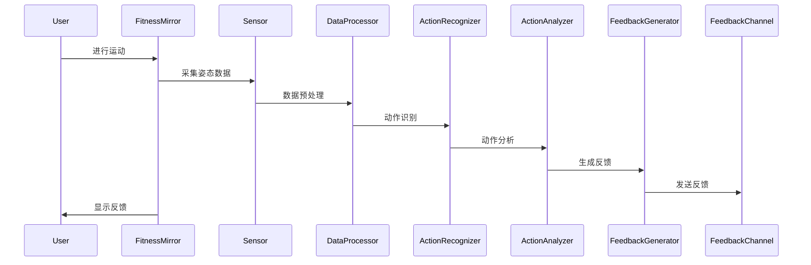
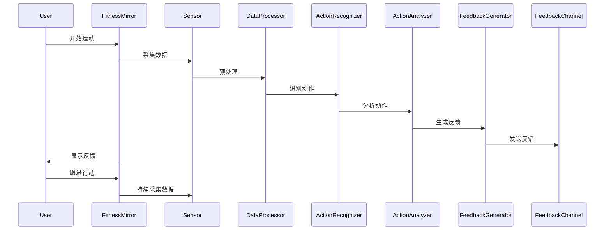

                 


### 1. AI Agent基础知识

#### 1.1 AI Agent的概念与背景

AI Agent，即人工智能代理，是人工智能（AI）领域的核心概念之一。它指的是能够感知环境、采取行动并与其他实体进行交互的智能实体。AI Agent的概念起源于人工智能的早期研究，随着计算机技术和机器学习算法的发展，AI Agent逐渐成为人工智能领域的一个重要分支。

在AI Agent的发展历史中，经历了从简单的反应式Agent到认知Agent，再到当前复杂的混合Agent的发展过程。反应式Agent是基于当前感知环境直接做出反应，而认知Agent则具有更高的智能水平，能够理解问题的上下文，并采取相应的行动。混合Agent结合了反应式Agent和认知Agent的特点，能够在不同的环境下表现出不同的智能行为。

AI Agent的核心要素主要包括感知、决策和执行。感知是指Agent能够从环境中获取信息；决策是指Agent根据感知到的信息进行推理，生成行动计划；执行是指Agent根据决策执行相应的操作。这三个要素共同构成了AI Agent的基本运作机制。

#### 1.2 AI Agent的原理与架构

AI Agent的基本原理是通过感知环境中的信息，利用智能算法进行分析和处理，然后生成行动策略并执行。其原理可以概括为以下几个步骤：

1. **感知（Perception）**：AI Agent通过传感器（如摄像头、麦克风、GPS等）获取环境信息。
2. **理解（Understanding）**：Agent利用感知到的信息进行模式识别、语义理解和目标定位等处理。
3. **决策（Decision Making）**：基于理解结果，Agent使用推理算法（如规划、决策树、强化学习等）生成行动策略。
4. **行动（Action）**：执行决策中定义的动作，并对环境产生实际影响。

AI Agent的典型架构包括以下几个部分：

- **感知模块（Perception Module）**：负责从环境中获取信息。
- **知识库（Knowledge Base）**：存储Agent的规则、事实和模型等知识。
- **推理模块（Reasoning Module）**：基于知识库进行推理，生成决策。
- **行动模块（Action Module）**：执行决策中的行动。

AI Agent的关键技术包括：

- **机器学习（Machine Learning）**：用于感知和推理，提升Agent的智能水平。
- **自然语言处理（Natural Language Processing, NLP）**：用于理解和生成自然语言。
- **计算机视觉（Computer Vision）**：用于图像和视频的分析。
- **强化学习（Reinforcement Learning）**：用于自主学习和策略优化。

#### 1.3 AI Agent的分类与应用

AI Agent可以按照不同的标准进行分类。以下是几种常见的分类方式：

- **按功能分类**：可以分为反应式Agent、认知Agent和混合Agent。
- **按应用领域分类**：可以分为家庭服务Agent、商业服务Agent、医疗保健Agent等。
- **按交互方式分类**：可以分为协同Agent、竞争Agent和对抗Agent。

AI Agent在不同领域的应用非常广泛，以下是一些典型的应用场景：

- **智能家居**：AI Agent可以自动化控制家居设备，提供便捷的生活方式。
- **智能客服**：AI Agent可以模拟人类客服，提供实时、个性化的客户服务。
- **自动驾驶**：AI Agent可以自主驾驶车辆，提高交通效率和安全性。
- **医疗诊断**：AI Agent可以辅助医生进行诊断，提高诊断的准确性和效率。

AI Agent的潜力和挑战体现在以下几个方面：

- **潜力**：AI Agent具有广泛的应用前景，可以提升人类生活的智能化水平，解决复杂问题。
- **挑战**：AI Agent需要处理海量数据、保证决策的准确性和安全性，同时还需要不断学习适应环境变化。

#### 1.4 本章小结

本章介绍了AI Agent的基本概念、发展背景、核心原理与架构，以及分类和应用。AI Agent作为人工智能领域的重要组成部分，具有广泛的应用前景和巨大的发展潜力。然而，要实现高效的AI Agent系统，还需要解决数据处理、安全性和自主学习能力等挑战。

### 2. 智能健身镜概述

#### 2.1 智能健身镜的定义与特点

智能健身镜是一种集成了计算机视觉、传感器和通信技术的先进健身设备。它不仅具备传统健身镜的基本功能，如反射和放大用户影像，还可以通过内置的高精度传感器实时捕捉用户的运动数据，并提供个性化的健身指导和实时反馈。智能健身镜通常采用高清摄像头和麦克风，配合先进的人工智能算法，实现对用户动作的精准捕捉和分析。

智能健身镜的特点包括：

- **实时数据捕捉**：智能健身镜可以实时捕捉用户在镜前的运动姿态，并通过图像处理技术进行精确分析。
- **个性化健身指导**：基于用户的数据分析，智能健身镜可以提供个性化的健身计划和建议，帮助用户有效锻炼。
- **互动性**：智能健身镜支持与用户的实时互动，通过语音和视觉反馈，提高用户的健身体验。
- **数据共享与分析**：智能健身镜可以记录用户的运动数据，并通过互联网与健身应用或设备共享，帮助用户跟踪健身进度和效果。

#### 2.2 智能健身镜的技术组成

智能健身镜的技术组成主要包括硬件和软件两部分。

- **硬件组成**：智能健身镜的硬件主要包括：

  - **摄像头和麦克风**：用于捕捉用户的运动姿态和语音指令。
  - **传感器**：如加速度计、陀螺仪等，用于测量用户的运动数据。
  - **显示器**：用于显示用户的实时影像和健身指导信息。
  - **处理器**：用于处理图像和传感器数据，执行人工智能算法。

- **软件组成**：智能健身镜的软件主要包括：

  - **图像处理软件**：用于实时处理摄像头捕捉的图像数据，进行运动捕捉和姿态识别。
  - **健身应用软件**：提供个性化的健身计划、数据记录和分享等功能。
  - **人工智能算法**：用于分析用户的运动数据，提供实时反馈和个性化指导。

#### 2.3 智能健身镜的发展历程与市场现状

智能健身镜的发展历程可以追溯到20世纪90年代，当时的研究主要集中于计算机视觉和运动捕捉技术。随着计算机性能的提高和人工智能算法的进步，智能健身镜逐渐从实验室走向市场。近年来，智能健身镜市场呈现出快速增长的趋势，主要得益于以下几个因素：

- **健康意识的提升**：随着人们对健康意识的提升，智能健身镜作为一种便捷的健身设备，受到了广泛关注。
- **技术的进步**：计算机视觉、传感器技术和人工智能算法的进步，使得智能健身镜的性能和功能得到了显著提升。
- **智能设备的普及**：智能手机和智能设备的普及，为智能健身镜的互联和数据共享提供了基础。

当前，智能健身镜市场现状表现为：

- **品牌竞争激烈**：市场上涌现出众多智能健身镜品牌，竞争激烈，各品牌在功能、性能和价格等方面进行差异化竞争。
- **用户需求多样化**：用户对智能健身镜的需求多样化，包括个性化健身计划、互动体验和数据分析等。
- **市场潜力巨大**：随着健康意识的提高和智能设备的普及，智能健身镜市场潜力巨大，未来仍有很大的发展空间。

#### 2.4 智能健身镜的未来发展趋势

智能健身镜的未来发展趋势将体现在以下几个方面：

- **人工智能技术的深度融合**：智能健身镜将更加智能化，通过深度学习和强化学习等技术，提供更加精准的健身指导和个性化的服务。
- **跨设备协同**：智能健身镜将与智能手机、智能手表等设备实现无缝连接，实现跨设备的数据共享和协同工作。
- **虚拟现实与增强现实**：智能健身镜将结合虚拟现实和增强现实技术，提供更加沉浸式的健身体验。
- **个性化健康管理系统**：智能健身镜将成为个性化健康管理系统的重要组成部分，通过连续的健康监测和数据分析，提供全面的健康管理和预防服务。

#### 2.4 本章小结

本章介绍了智能健身镜的定义、特点、技术组成以及发展历程和市场现状。智能健身镜作为一种新兴的健身设备，具有广泛的应用前景和市场潜力。随着人工智能技术的不断发展，智能健身镜的功能将更加丰富，为用户提供更加个性化和智能化的健身体验。

### 3. AI Agent在运动捕捉中的应用

#### 3.1 运动捕捉技术概述

运动捕捉（Motion Capture）是一种用于记录和测量物体或人在运动过程中位置和姿态的技术。它广泛应用于电影制作、游戏开发、运动科学、虚拟现实和智能健身等领域。运动捕捉技术的基本原理是通过传感器捕捉运动物体的位置和姿态，然后将这些数据转换为数字信号，用于后续的分析和处理。

运动捕捉技术主要包括以下几种：

- **光学运动捕捉**：利用高速摄像头和标记点，通过捕捉标记点的运动轨迹来计算物体的姿态。
- **惯性运动捕捉**：利用加速度计、陀螺仪等惯性传感器，通过测量物体的惯性参数来计算姿态。
- **声学运动捕捉**：利用声波传感器，通过捕捉声波传播时间差来计算物体的位置和姿态。
- **电磁运动捕捉**：利用电磁传感器，通过测量电磁波在不同位置的传播时间差来计算物体的位置和姿态。

#### 3.2 AI Agent在运动捕捉中的关键作用

AI Agent在运动捕捉中扮演着至关重要的角色，它不仅能够提高捕捉的精度和效率，还能够提供实时反馈和个性化指导。以下是AI Agent在运动捕捉中的几个关键作用：

- **实时数据处理**：AI Agent能够实时处理传感器捕捉到的数据，快速进行姿态估计和轨迹预测，提供实时反馈。
- **异常检测**：AI Agent可以检测运动过程中的异常行为，如动作错误或姿态不稳定，及时给出纠正建议。
- **个性化指导**：基于用户的运动数据和健康档案，AI Agent可以提供个性化的运动计划和建议，帮助用户实现目标。
- **数据融合**：AI Agent可以将不同类型的传感器数据进行融合处理，提高捕捉的精度和可靠性。
- **自适应调整**：AI Agent可以根据用户的反馈和环境变化，自动调整运动捕捉参数，优化捕捉效果。

#### 3.3 运动捕捉技术的AI Agent实现

实现AI Agent在运动捕捉中的应用，需要考虑以下几个方面：

- **架构设计**：运动捕捉系统的架构设计需要包括感知模块、处理模块、决策模块和执行模块。感知模块负责捕捉传感器数据，处理模块负责数据处理和姿态估计，决策模块负责生成行动策略，执行模块负责执行决策。
- **算法选择**：AI Agent在运动捕捉中常用的算法包括深度学习、强化学习、贝叶斯推理等。深度学习算法可以用于姿态估计和轨迹预测，强化学习算法可以用于行为优化和决策制定，贝叶斯推理可以用于异常检测和数据融合。
- **数据预处理**：传感器数据通常包含噪声和缺失值，需要进行预处理，如滤波、插值和归一化等，以提高数据的可靠性和准确性。
- **模型训练**：使用大量运动数据对AI Agent进行训练，以优化模型的参数和性能。训练过程中需要使用交叉验证和超参数调优等技术，以提高模型的泛化能力。
- **系统集成**：将AI Agent集成到运动捕捉系统中，实现实时数据处理、反馈和优化。

#### 3.4 运动捕捉技术的AI Agent性能评估

运动捕捉技术的AI Agent性能评估主要包括以下几个方面：

- **精度**：评估AI Agent在姿态估计和轨迹预测方面的精度，通常使用平均误差、标准差等指标。
- **实时性**：评估AI Agent的处理速度和响应时间，确保系统能够实时处理运动数据。
- **鲁棒性**：评估AI Agent对噪声和异常数据的处理能力，确保系统在恶劣环境下仍能稳定运行。
- **泛化能力**：评估AI Agent在不同场景和数据集上的表现，确保模型具有较好的泛化能力。

#### 3.4 本章小结

本章介绍了运动捕捉技术的基本概念和AI Agent在运动捕捉中的关键作用。通过AI Agent的实时数据处理和个性化指导，运动捕捉技术能够显著提升用户的健身体验和效果。实现AI Agent在运动捕捉中的应用，需要考虑架构设计、算法选择、数据预处理和系统集成等方面，并通过性能评估确保系统的可靠性和准确性。

### 4. AI Agent在动作识别中的应用

#### 4.1 动作识别技术概述

动作识别（Action Recognition）是计算机视觉和人工智能领域的一个重要研究方向，旨在通过分析视频或图像序列，自动识别和分类其中的运动行为。动作识别技术广泛应用于智能监控、人机交互、虚拟现实、健身指导等领域，具有广泛的应用前景。

动作识别技术的基本原理是通过对视频或图像序列进行处理，提取运动特征，然后使用机器学习算法进行分类。其基本步骤包括：

1. **图像预处理**：对视频或图像序列进行缩放、裁剪、灰度化等处理，以适应后续的特征提取和分类算法。
2. **特征提取**：从预处理后的图像中提取运动特征，如外观特征、形状特征、运动轨迹特征等。常见的特征提取方法包括直方图、HOG（方向梯度直方图）、SIFT（尺度不变特征变换）等。
3. **特征降维**：使用降维技术（如PCA、LDA等）减少特征维度，提高计算效率和分类性能。
4. **分类算法**：使用机器学习算法（如SVM、神经网络、决策树等）对提取的特征进行分类，识别出不同的运动行为。

#### 4.2 AI Agent在动作识别中的关键作用

AI Agent在动作识别中扮演着至关重要的角色，能够显著提升动作识别的准确性和实时性。以下是AI Agent在动作识别中的几个关键作用：

- **实时处理**：AI Agent能够实时处理视频或图像数据，快速识别和分类运动行为，提供实时反馈。
- **异常检测**：AI Agent可以检测运动过程中的异常行为，如危险动作或异常姿势，及时发出警报。
- **个性化识别**：AI Agent可以根据用户的健康档案和运动习惯，提供个性化的动作识别和健身指导。
- **多模态融合**：AI Agent可以将不同类型的传感器数据（如视觉、音频、惯性等）进行融合处理，提高动作识别的精度。
- **自适应调整**：AI Agent可以根据环境变化和用户反馈，自动调整识别参数，优化识别效果。

#### 4.3 动作识别技术的AI Agent实现

实现AI Agent在动作识别中的应用，需要考虑以下几个方面：

- **架构设计**：动作识别系统的架构设计需要包括感知模块、特征提取模块、分类模块和决策模块。感知模块负责捕捉视频或图像数据，特征提取模块负责提取运动特征，分类模块负责进行分类，决策模块负责生成行动策略。
- **算法选择**：AI Agent在动作识别中常用的算法包括深度学习、强化学习、贝叶斯推理等。深度学习算法可以用于特征提取和分类，强化学习算法可以用于行为优化和决策制定，贝叶斯推理可以用于异常检测和参数调整。
- **数据预处理**：动作识别数据通常包含噪声和缺失值，需要进行预处理，如滤波、插值和归一化等，以提高数据的可靠性和准确性。
- **模型训练**：使用大量动作数据对AI Agent进行训练，以优化模型的参数和性能。训练过程中需要使用交叉验证和超参数调优等技术，以提高模型的泛化能力。
- **系统集成**：将AI Agent集成到动作识别系统中，实现实时数据处理、特征提取、分类和决策。

#### 4.4 动作识别技术的AI Agent性能评估

动作识别技术的AI Agent性能评估主要包括以下几个方面：

- **识别准确率**：评估AI Agent在动作识别任务中的准确率，通常使用准确率、召回率、F1分数等指标。
- **实时性**：评估AI Agent的处理速度和响应时间，确保系统能够实时处理动作数据。
- **鲁棒性**：评估AI Agent对噪声和异常数据的处理能力，确保系统在恶劣环境下仍能稳定运行。
- **泛化能力**：评估AI Agent在不同场景和数据集上的表现，确保模型具有较好的泛化能力。

#### 4.4 本章小结

本章介绍了动作识别技术的基本概念和AI Agent在动作识别中的关键作用。通过AI Agent的实时处理、异常检测和个性化识别，动作识别技术能够显著提升用户的健身体验和安全性。实现AI Agent在动作识别中的应用，需要考虑架构设计、算法选择、数据预处理和系统集成等方面，并通过性能评估确保系统的可靠性和准确性。

### 5. AI Agent在动作反馈中的应用

#### 5.1 动作反馈技术概述

动作反馈（Action Feedback）是一种用于指导用户正确执行运动动作的技术，通过实时监测用户的运动姿态和动作轨迹，提供即时反馈，帮助用户纠正错误动作、优化动作执行。动作反馈技术广泛应用于健身、康复、运动训练等领域，具有显著的健康促进和运动效能提升作用。

动作反馈技术的基本原理是利用传感器和计算机视觉技术捕捉用户的运动数据，通过算法处理和分析，生成反馈信息，然后通过视觉、听觉或触觉等形式传递给用户。动作反馈技术的核心组成部分包括：

- **传感器**：用于捕捉用户的运动数据，如摄像头、麦克风、惯性测量单元（IMU）等。
- **数据处理**：对捕捉到的运动数据进行分析和处理，提取关键特征，用于动作识别和反馈生成。
- **算法**：用于动作识别、姿态估计、异常检测等，生成实时反馈信息。
- **反馈机制**：将反馈信息以视觉、听觉或触觉等形式传递给用户，指导用户进行动作调整。

#### 5.2 AI Agent在动作反馈中的关键作用

AI Agent在动作反馈中发挥着至关重要的作用，其智能化的处理能力和个性化服务能力，使得动作反馈系统更加高效、精准。以下是AI Agent在动作反馈中的几个关键作用：

- **实时监控**：AI Agent能够实时监控用户的运动姿态和动作轨迹，快速检测出错误动作，提供即时反馈。
- **个性定制**：根据用户的健康档案和运动习惯，AI Agent可以提供个性化的动作反馈，帮助用户制定适合的运动计划。
- **错误纠正**：AI Agent能够分析用户的动作数据，识别出动作中的问题，提供具体的纠正建议，帮助用户改进动作质量。
- **安全性保障**：AI Agent可以监测用户的运动状态，识别潜在的风险动作，及时发出警报，保障用户的安全。
- **学习与适应**：AI Agent可以通过学习用户的运动行为，不断优化反馈策略，提高反馈系统的适应性。

#### 5.3 动作反馈技术的AI Agent实现

实现AI Agent在动作反馈中的应用，需要考虑以下几个方面：

- **感知模块**：感知模块负责实时捕捉用户的运动数据，通常包括摄像头、麦克风和IMU等传感器。
- **数据处理模块**：数据处理模块负责对传感器数据进行预处理、特征提取和姿态估计，常用的算法包括深度学习、贝叶斯推理和卡尔曼滤波等。
- **反馈生成模块**：反馈生成模块根据数据处理结果，生成具体的反馈信息，如视觉提示、语音提示或振动反馈等。
- **反馈传递模块**：反馈传递模块负责将生成的反馈信息传递给用户，常用的形式包括屏幕显示、音响播放或振动设备等。

#### 5.4 动作反馈技术的AI Agent性能评估

动作反馈技术的AI Agent性能评估主要包括以下几个方面：

- **反馈准确性**：评估AI Agent提供的反馈是否准确，通常使用准确率、召回率等指标。
- **实时性**：评估AI Agent的响应速度和处理时间，确保系统能够实时提供反馈。
- **用户满意度**：通过用户反馈和满意度调查，评估AI Agent的实用性和用户体验。
- **鲁棒性**：评估AI Agent对环境变化和噪声的适应性，确保系统在多种环境下仍能稳定运行。
- **可扩展性**：评估AI Agent系统的可扩展性，以适应未来技术的发展和需求变化。

#### 5.4 本章小结

本章介绍了动作反馈技术的基本概念和AI Agent在动作反馈中的关键作用。通过AI Agent的实时监控、个性定制和错误纠正能力，动作反馈技术能够显著提升用户的运动体验和安全水平。实现AI Agent在动作反馈中的应用，需要考虑感知模块、数据处理模块、反馈生成模块和反馈传递模块的设计与集成，并通过性能评估确保系统的有效性。

### 6. 智能健身镜实时动作纠正系统设计

#### 6.1 实时动作纠正系统的需求分析

智能健身镜实时动作纠正系统的需求分析是设计系统的第一步，旨在明确系统需要实现的功能和性能指标。以下是该系统的需求分析：

1. **功能需求**：
   - **实时姿态捕捉**：系统能够实时捕捉用户在健身镜前的运动姿态，保证捕捉的精度和实时性。
   - **动作识别**：系统能够准确识别用户的运动动作，包括常见的健身动作和特定动作。
   - **动作分析**：系统能够分析用户的动作质量，识别出错误动作和需要改进的动作。
   - **实时反馈**：系统能够根据用户的动作质量，提供实时反馈，指导用户进行动作纠正。
   - **个性化指导**：系统能够根据用户的运动历史和健康档案，提供个性化的动作纠正方案。

2. **性能需求**：
   - **实时性**：系统需要在用户动作发生后0.5秒内提供反馈。
   - **精度**：系统需要确保姿态捕捉的精度，动作识别的准确率需达到95%以上。
   - **稳定性**：系统需要在各种环境下（如光线变化、噪声干扰等）保持稳定运行。
   - **用户友好性**：系统的界面设计需简洁易用，用户可以轻松操作和获取反馈。

3. **系统功能**：
   - **用户注册与登录**：用户需要注册并登录系统，以便记录运动数据和获取个性化指导。
   - **运动记录与统计**：系统需要记录用户的运动数据，包括运动时长、运动动作和动作质量等，并提供统计报表。
   - **动作教程**：系统提供标准动作教程，帮助用户了解正确的运动方法。
   - **互动反馈**：系统通过视觉、语音和触觉等多感官方式，提供互动反馈，指导用户进行动作纠正。

#### 6.2 系统功能设计（领域模型）

智能健身镜实时动作纠正系统的领域模型用于描述系统中各个功能模块及其关系。以下是系统功能设计的领域模型：

```mermaid
classDiagram
    User <<类>> {
        ID: <用户ID>
        Name: <用户姓名>
        Age: <用户年龄>
        Gender: <用户性别>
        HealthRecords: <健康档案>
    }

    Action <<类>> {
        ActionID: <动作ID>
        Name: <动作名称>
        Description: <动作描述>
        CorrectForm: <正确动作形式>
    }

    FitnessMirror <<类>> {
        MirrorID: <镜ID>
        UserID: <用户ID>
        ActionID: <动作ID>
        CaptureTime: <捕捉时间>
        Position: <位置>
        Pose: <姿态>
    }

    ActionFeedback <<类>> {
        FeedbackID: <反馈ID>
        ActionID: <动作ID>
        UserID: <用户ID>
        FeedbackMessage: <反馈信息>
        FeedbackTime: <反馈时间>
    }

    User <-- User: 注册
    User --> FitnessMirror: 捕捉动作
    User --> ActionFeedback: 接收反馈
    Action --> FitnessMirror: 动作指导
    ActionFeedback --> User: 提供反馈
```

#### 6.3 系统架构设计

智能健身镜实时动作纠正系统的架构设计包括感知层、数据处理层、反馈层和用户交互层。以下是系统架构设计：



#### 6.4 系统接口设计

智能健身镜实时动作纠正系统的接口设计包括用户接口、传感器接口和反馈接口。以下是系统接口设计：

1. **用户接口**：
   - **注册与登录**：提供用户注册和登录功能，用户可以创建账号并登录系统。
   - **运动记录查询**：提供用户查看运动记录和统计报表的功能。
   - **动作教程**：提供标准动作教程，用户可以学习正确动作形式。

2. **传感器接口**：
   - **摄像头接口**：用于捕捉用户的运动姿态。
   - **麦克风接口**：用于接收用户的语音指令。
   - **IMU接口**：用于采集用户的运动数据。

3. **反馈接口**：
   - **视觉反馈**：在屏幕上显示反馈信息，如正确动作和错误动作提示。
   - **语音反馈**：通过音响播放反馈信息，如语音指导和建议。
   - **触觉反馈**：通过振动设备提供触觉反馈，如动作校正提示。

#### 6.5 系统交互设计

智能健身镜实时动作纠正系统的交互设计包括用户与系统的交互、系统内部模块的交互以及系统与外部设备的交互。以下是系统交互设计：



#### 6.6 本章小结

本章详细介绍了智能健身镜实时动作纠正系统的需求分析、系统功能设计、系统架构设计、系统接口设计和系统交互设计。通过这些设计，智能健身镜实时动作纠正系统能够实现对用户运动姿态的实时捕捉、动作识别、分析反馈和个性化指导，为用户提供高质量的健身体验。

