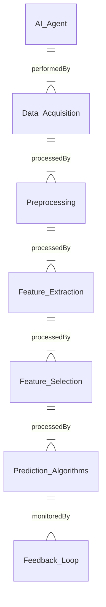
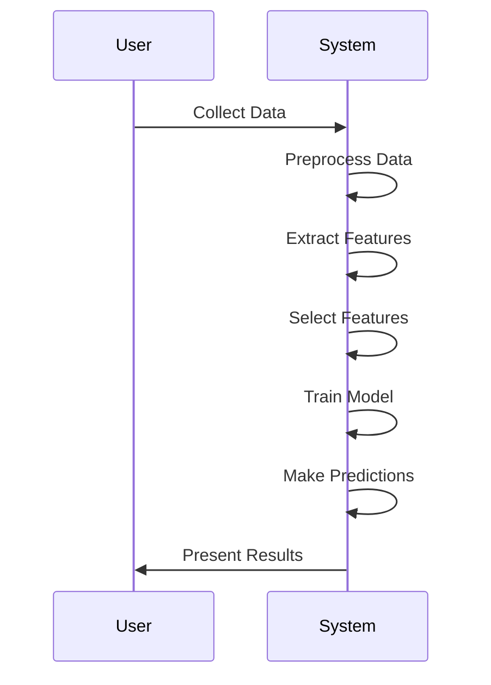
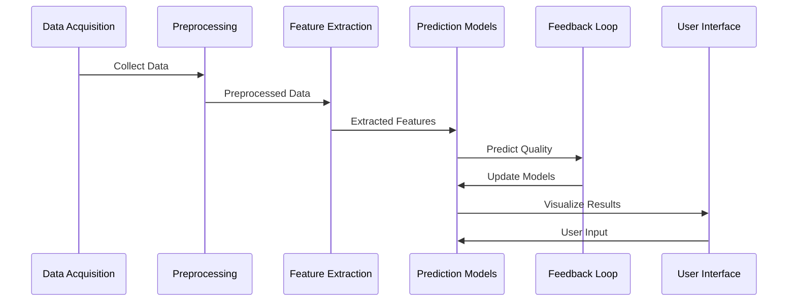
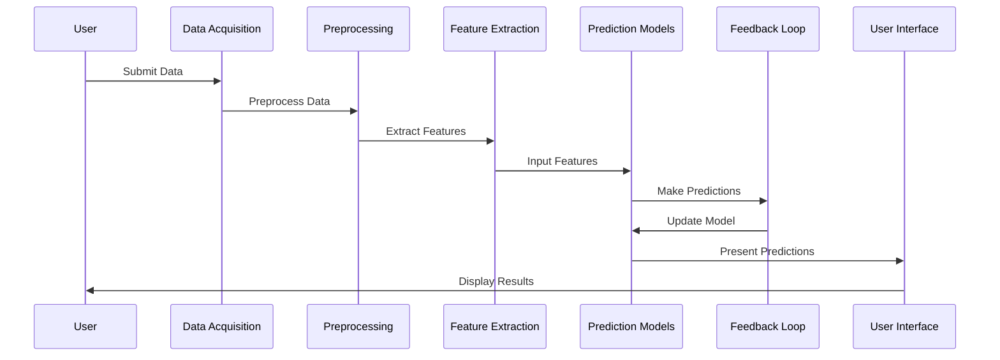

                 

## Introduction to Intelligent Manufacturing

### Definition and Evolution

Intelligent manufacturing, often referred to as smart manufacturing or Industry 4.0, represents the next generation of manufacturing technology. It is characterized by the integration of cyber-physical systems, the Internet of Things (IoT), cloud computing, and advanced analytics to create a flexible, responsive, and data-driven manufacturing environment. The concept has evolved significantly from traditional manufacturing, which primarily relied on human labor and mechanical processes.

The term "Industry 4.0" was first introduced at the Hannover Messe in 2011, highlighting the fourth industrial revolution that would build on the foundation of the three preceding ones: mechanization, electrification, and automation. Industry 4.0 aims to enable the transition from a tradition-oriented, planned economy to a data-driven, dynamic system capable of autonomous decision-making and self-optimization.

### Key Technologies and Applications

#### Cyber-Physical Systems

Cyber-physical systems (CPS) are integrated networks of computing systems and physical systems that are able to sense, compute, act, and learn. These systems combine the capabilities of computation with the effects of the physical world to create an environment where physical and digital systems work seamlessly together. In intelligent manufacturing, CPS are utilized to monitor and control manufacturing processes in real-time, improving efficiency and reducing waste.

#### Internet of Things (IoT)

The Internet of Things (IoT) involves the interconnection of everyday objects through the internet, allowing them to send and receive data. In intelligent manufacturing, IoT devices are used to collect data from various stages of the manufacturing process, enabling real-time monitoring and analysis. This data can be used to predict equipment failures, optimize production schedules, and enhance product quality.

#### Cloud Computing

Cloud computing provides scalable and on-demand access to computing resources, allowing manufacturers to store, process, and analyze large amounts of data without the need for on-premises infrastructure. Cloud-based platforms enable collaboration, scalability, and flexibility, making it easier for manufacturers to adopt intelligent manufacturing technologies.

#### Advanced Analytics

Advanced analytics, including machine learning, artificial intelligence, and big data analytics, play a crucial role in intelligent manufacturing. These technologies are used to analyze the vast amounts of data generated by IoT devices and cyber-physical systems, providing insights that can be used to optimize manufacturing processes, predict equipment failures, and improve product quality.

### Examples of Intelligent Manufacturing Applications

1. **Predictive Maintenance**: Using data from IoT devices and advanced analytics, intelligent manufacturing systems can predict equipment failures before they occur, allowing for proactive maintenance and reducing downtime.

2. **Customization**: Intelligent manufacturing enables manufacturers to produce customized products at scale by leveraging real-time data and advanced manufacturing technologies.

3. **Supply Chain Optimization**: By integrating IoT devices and advanced analytics, intelligent manufacturing systems can optimize supply chain operations, improving efficiency and reducing costs.

4. **Quality Control**: Intelligent manufacturing systems use data from sensors and other devices to monitor and control the quality of products in real-time, ensuring that only high-quality products reach the market.

In conclusion, intelligent manufacturing represents a significant shift in the manufacturing industry, driven by advances in technology and the need for greater efficiency, flexibility, and responsiveness. By integrating cyber-physical systems, IoT, cloud computing, and advanced analytics, intelligent manufacturing is transforming the way products are designed, produced, and delivered.

---

## The Role of AI Agents

### Definition and Classification

AI agents, in the context of intelligent manufacturing, are autonomous entities designed to perform specific tasks or make decisions based on data analysis. These agents are capable of learning from their environment, adapting to new situations, and improving their performance over time. AI agents can be broadly classified into two categories: reactive agents and deliberative agents.

**Reactive Agents**

Reactive agents operate based solely on the current state of the environment without considering past states or future actions. They make decisions in real-time based on simple rules or patterns. Examples of reactive agents in intelligent manufacturing include automated guided vehicles (AGVs) and assembly robots that follow pre-defined paths or perform specific tasks without human intervention.

**Deliberative Agents**

Deliberative agents, on the other hand, consider the current state of the environment, past experiences, and potential future outcomes before making a decision. These agents use more complex algorithms, such as machine learning and planning, to evaluate different courses of action and select the most optimal one. Deliberative agents are commonly found in applications such as predictive maintenance, production scheduling, and quality control.

### Fundamental Principles

The core principle behind AI agents is their ability to perceive the environment through sensors, process this information using algorithms, and take appropriate actions to achieve a specific goal. This process can be summarized in the following steps:

1. **Perception**: AI agents gather data from their environment using sensors such as cameras, temperature sensors, or force sensors.

2. **Cognition**: The collected data is processed and analyzed using algorithms such as machine learning models or rule-based systems. This step involves extracting relevant features from the data and applying mathematical models to understand the underlying patterns.

3. **Action**: Based on the analysis, the AI agent takes actions to achieve its goal. These actions can be direct, such as moving a robotic arm, or indirect, such as adjusting a production parameter.

### AI Agents in Quality Prediction

In the context of intelligent manufacturing, AI agents play a critical role in predicting product quality. Quality prediction involves analyzing data from various stages of the manufacturing process, such as raw material quality, machine performance, and production settings, to predict the quality of the final product. AI agents can perform this task by:

1. **Data Collection**: AI agents collect data from IoT devices and sensors embedded in the manufacturing process.

2. **Feature Extraction**: They extract relevant features from the collected data, such as statistical metrics or patterns, that are indicative of product quality.

3. **Prediction**: Using machine learning algorithms, AI agents analyze the extracted features to predict the quality of the final product. This prediction can help manufacturers take corrective actions before it's too late, ensuring that only high-quality products are produced.

4. **Feedback Loop**: The predicted quality is compared with the actual quality of the final product, and the AI agent updates its model based on the discrepancy. This feedback loop allows the agent to continuously improve its prediction accuracy over time.

### Importance of AI Agents in Quality Prediction

AI agents are crucial in quality prediction due to their ability to process large amounts of data, identify complex patterns, and adapt to changing conditions. Some key reasons why AI agents are essential for quality prediction in intelligent manufacturing include:

1. **Accuracy**: AI agents can analyze data from multiple sources and provide accurate predictions, reducing the risk of human error.

2. **Speed**: AI agents can process data and provide predictions in real-time, enabling manufacturers to take timely corrective actions.

3. **Scalability**: AI agents can be easily scaled to handle large manufacturing operations, making it feasible to predict quality across multiple production lines.

4. **Continuous Improvement**: AI agents can learn from past predictions and improve their accuracy over time, leading to better quality control.

In conclusion, AI agents are integral to the quality prediction process in intelligent manufacturing. By leveraging advanced algorithms and real-time data analysis, these agents can help manufacturers ensure that only high-quality products reach the market, ultimately improving customer satisfaction and business profitability.

---

## Challenges and Opportunities

### Technical Challenges

1. **Data Integration and Quality**: One of the primary technical challenges in AI agent-based quality prediction is the integration of diverse data sources. Manufacturing processes generate vast amounts of data from various sensors, machines, and IoT devices. Ensuring the quality and consistency of this data is crucial for accurate predictions. Data preprocessing and cleaning are essential steps to address this challenge.

2. **Model Complexity and Interpretability**: Advanced machine learning models, such as deep neural networks, can provide highly accurate predictions but often come with the drawback of being complex and difficult to interpret. This lack of interpretability can make it challenging for manufacturers to understand the underlying reasons for specific predictions, potentially leading to skepticism and resistance among stakeholders.

3. **Scalability and Performance**: As manufacturing operations grow in scale, the demand for efficient and scalable AI agents also increases. Ensuring that AI agents can handle large volumes of data and maintain high performance across multiple production lines is a significant technical challenge.

4. **Real-Time Processing**: Real-time quality prediction requires AI agents to process and analyze data as quickly as possible. Latency can lead to missed opportunities for corrective action, making it essential to develop efficient algorithms and infrastructure for real-time processing.

### Market Opportunities

1. **Quality Improvement**: The ability to predict and prevent defects in manufacturing processes can lead to significant improvements in product quality. By identifying potential issues early, manufacturers can take corrective actions to avoid producing faulty products, reducing waste and rework costs.

2. **Increased Efficiency**: AI agents can optimize manufacturing processes by predicting equipment failures, adjusting production schedules, and reducing downtime. This can lead to increased efficiency and productivity, ultimately improving the bottom line.

3. **Customization and Personalization**: Intelligent manufacturing, enabled by AI agents, allows for greater customization and personalization of products. By analyzing customer preferences and production data, manufacturers can produce products that better meet customer demands, leading to increased customer satisfaction and loyalty.

4. **Market Disruption**: Companies that successfully adopt AI agents for quality prediction can gain a competitive advantage in the market. By offering superior product quality and efficiency, they can disrupt traditional manufacturing practices and capture market share from less innovative competitors.

In conclusion, while AI agents in quality prediction for intelligent manufacturing face several technical challenges, the market opportunities are vast. By addressing these challenges and leveraging the potential of AI, manufacturers can transform their operations, improve product quality, and achieve greater efficiency and competitiveness.

---

## Core Concepts and Relationships

### Core Concepts

To understand the role of AI agents in predicting quality in intelligent manufacturing, it is essential to delve into the core concepts that underpin this technology. These concepts include data acquisition and preprocessing, feature extraction and selection, and prediction algorithms. Each of these concepts plays a critical role in the effectiveness and accuracy of quality prediction.

#### Data Acquisition and Preprocessing

Data acquisition is the process of collecting relevant data from various sources within the manufacturing environment. This data can come from IoT devices, sensors, production machines, and other monitoring systems. The collected data is often raw and unstructured, making it challenging to work with directly. Preprocessing is therefore a crucial step in the quality prediction process. It involves cleaning the data, handling missing values, and normalizing the data to ensure consistency and reliability. Effective preprocessing is essential for the performance of machine learning models and other algorithms used in quality prediction.

#### Feature Extraction and Selection

Feature extraction is the process of transforming raw data into a set of features that can be used as inputs for machine learning models. These features should capture the essential information that is relevant to the quality prediction task. Feature selection, on the other hand, involves identifying the most important features from the extracted set to reduce the dimensionality of the data. This not only improves the efficiency of the models but also helps in identifying the key factors that influence product quality. Techniques such as correlation analysis, mutual information, and recursive feature elimination can be used for feature selection.

#### Prediction Algorithms

Prediction algorithms are at the heart of AI agents in quality prediction. These algorithms analyze the extracted features and make predictions about the quality of the final product. Common prediction algorithms include supervised learning, unsupervised learning, and semi-supervised learning. Supervised learning algorithms, such as linear regression and decision trees, use labeled training data to learn the relationship between inputs and outputs. Unsupervised learning algorithms, like clustering and association rules, discover hidden patterns in the data without labeled examples. Semi-supervised learning combines the strengths of both supervised and unsupervised learning by using a small amount of labeled data and a large amount of unlabeled data.

### Relationship between AI Agents and Quality Prediction

The relationship between AI agents and quality prediction can be understood through a conceptual framework that illustrates the interaction between these core concepts. The following sections provide a detailed explanation of this relationship, including an Entity Relationship Diagram (ERD) to visualize the entities and their relationships.

#### Conceptual Framework

1. **Data Acquisition**: AI agents collect data from various sources within the manufacturing environment. This data is raw and unstructured, requiring preprocessing to make it suitable for analysis.

2. **Preprocessing**: The raw data is cleaned, normalized, and transformed into a structured format through preprocessing. This structured data is then ready for feature extraction.

3. **Feature Extraction**: Extracted features are derived from the preprocessed data. These features are used as inputs for prediction algorithms.

4. **Feature Selection**: Key features are selected from the extracted features to reduce dimensionality and improve model efficiency.

5. **Prediction Algorithms**: Prediction algorithms analyze the selected features to predict the quality of the final product. The predictions are compared with actual product quality to assess the accuracy of the models.

6. **Feedback Loop**: The discrepancy between predicted and actual quality is used to update the AI agent's models, improving their performance over time.

#### Entity Relationship Diagram (ERD)

The following ERD illustrates the relationship between the core concepts and entities involved in AI agent-based quality prediction:



In this ERD, each entity represents a core concept or process, and the lines between entities represent the relationships and dependencies between them. For example, the AI agent performs data acquisition, which is then processed by the preprocessing module. The preprocessed data is used for feature extraction, which is then selected for use in prediction algorithms. The output of the prediction algorithms is monitored and used to update the AI agent's models through the feedback loop.

In conclusion, the core concepts of data acquisition and preprocessing, feature extraction and selection, and prediction algorithms are integral to the functioning of AI agents in quality prediction. The conceptual framework and ERD provide a clear understanding of how these concepts interact and contribute to the overall quality prediction process.

---

## Algorithm and Mathematical Models

### Overview of Quality Prediction Algorithms

In the realm of intelligent manufacturing, several algorithms are employed for quality prediction, each with its own strengths and applications. The primary categories of these algorithms include supervised learning, unsupervised learning, and semi-supervised learning. Understanding these algorithms and their underlying mathematical models is essential for effective quality prediction.

#### Supervised Learning

Supervised learning algorithms use labeled training data to learn the relationship between inputs and outputs. The most commonly used supervised learning algorithms for quality prediction include:

1. **Linear Regression**: Linear regression models the relationship between input features and output labels using a linear equation. It is simple to implement and interpret but can be limited in its ability to capture complex relationships.

   $$ y = \beta_0 + \beta_1 \cdot x_1 + \beta_2 \cdot x_2 + ... + \beta_n \cdot x_n $$

   Where \( y \) is the predicted quality, \( x_1, x_2, ..., x_n \) are the input features, and \( \beta_0, \beta_1, ..., \beta_n \) are the model parameters.

2. **Decision Trees**: Decision trees are hierarchical models that split the input space based on feature values to make predictions. They are easy to interpret and can capture non-linear relationships but can become complex and overfit with many layers.

   $$ y = g(\theta_0 + \theta_1 \cdot x_1 + \theta_2 \cdot x_2 + ...) $$

   Where \( g \) is the decision function and \( \theta_0, \theta_1, ..., \theta_n \) are the decision thresholds.

3. **Support Vector Machines (SVM)**: SVMs classify new data points based on a hyperplane that maximizes the margin between different classes. They are effective for high-dimensional data and can handle non-linear relationships using kernel functions.

   $$ \text{Minimize} \quad \frac{1}{2} ||\mathbf{w}||^2 \quad \text{subject to} \quad y_i (\mathbf{w} \cdot \mathbf{x_i} - b) \geq 1 $$

   Where \( \mathbf{w} \) is the weight vector, \( \mathbf{x_i} \) is the input feature vector, \( y_i \) is the label, and \( b \) is the bias term.

#### Unsupervised Learning

Unsupervised learning algorithms do not require labeled data and aim to discover hidden patterns or intrinsic structures within the data. Common unsupervised learning algorithms for quality prediction include:

1. **K-Means Clustering**: K-Means is a partitioning method that divides the data into K clusters based on feature distances. It is useful for identifying natural groupings in the data but can be sensitive to initialization and the number of clusters.

   $$ c_k = \frac{1}{n_k} \sum_{i=1}^{n_k} \mathbf{x_i} $$

   Where \( c_k \) is the centroid of cluster \( k \), \( n_k \) is the number of points in cluster \( k \), and \( \mathbf{x_i} \) is the feature vector for point \( i \).

2. **Hierarchical Clustering**: Hierarchical clustering builds a tree of clusters by merging or splitting clusters based on feature similarity. It provides a visual representation of the data structure and can be used for anomaly detection and quality control.

3. **Association Rules**: Association rule learning discovers relationships between items in large databases. It is commonly used for feature extraction and can help identify critical factors influencing quality.

   $$ \text{Support} \quad \text{and} \quad \text{Confidence} $$

   Where Support measures the frequency of an itemset in the dataset, and Confidence measures the likelihood of an implication.

#### Semi-supervised Learning

Semi-supervised learning algorithms combine the strengths of supervised and unsupervised learning by using a small amount of labeled data and a large amount of unlabeled data. This approach can improve the performance of quality prediction models when labeled data is scarce or expensive to obtain. Common semi-supervised learning algorithms include:

1. **Co-Training**: Co-Training involves training two separate classifiers on different subsets of the data and using their predictions to correct each other's errors. This iterative process can lead to improved accuracy.

2. **Laplacian Regularization**: Laplacian regularization adds a regularization term based on the graph Laplacian of the data to the loss function. It encourages the model to preserve the local structure of the data, improving generalization.

   $$ \text{Minimize} \quad \frac{1}{m} \sum_{i=1}^{m} \ell(y_i, \hat{y_i}) + \lambda \cdot \sum_{i=1}^{m} \sum_{j \neq i} w_{ij} (\hat{y_i} - \hat{y_j}) $$

   Where \( m \) is the number of samples, \( \ell \) is the loss function, and \( w_{ij} \) is the weight of the edge between samples \( i \) and \( j \).

### Mathematical Foundations

The mathematical foundations of quality prediction algorithms involve several key concepts from probability theory, statistical inference, and machine learning models. These concepts include probability distributions, statistical inference methods, and the optimization techniques used to train machine learning models.

#### Probability Theory

Probability theory is the foundation of statistical inference and machine learning. Key concepts include:

1. **Probability Distributions**: Probability distributions describe the likelihood of different outcomes. Common distributions used in quality prediction include normal distributions, binomial distributions, and Poisson distributions.

2. **Conditional Probability**: Conditional probability measures the probability of an event given that another event has occurred. It is a fundamental concept in Bayes' theorem.

3. **Bayes' Theorem**: Bayes' theorem provides a way to update the probability of an event based on new evidence. It is widely used in probabilistic models for quality prediction.

   $$ P(A|B) = \frac{P(B|A) \cdot P(A)}{P(B)} $$

#### Statistical Inference

Statistical inference involves making conclusions about a population based on a sample. Key concepts include:

1. **Hypothesis Testing**: Hypothesis testing is used to determine whether a hypothesis about a population parameter is supported by the data. It is a fundamental tool for validating machine learning models.

2. **Confidence Intervals**: Confidence intervals provide a range of values within which a population parameter is likely to fall. They are used to quantify the uncertainty in estimates.

#### Machine Learning Models

Machine learning models are at the core of quality prediction algorithms. Key concepts include:

1. **Optimization Techniques**: Optimization techniques are used to train machine learning models by minimizing a loss function. Common optimization techniques include gradient descent and stochastic gradient descent.

2. **Regularization**: Regularization techniques, such as L1 and L2 regularization, are used to prevent overfitting by penalizing complex models. They help in achieving a balance between model complexity and generalization.

3. **Model Evaluation**: Model evaluation techniques, such as cross-validation and metrics like accuracy, precision, recall, and F1-score, are used to assess the performance of quality prediction models.

In conclusion, the choice of quality prediction algorithm depends on various factors, including the nature of the data, the complexity of the relationships to be modeled, and the availability of labeled data. Understanding the mathematical foundations and the various algorithms available enables the development of effective quality prediction models for intelligent manufacturing.

---

### Algorithm Implementation with Mermaid and Python

To better understand the algorithmic implementation for quality prediction in intelligent manufacturing, we will use Mermaid to create a visual workflow diagram and Python to provide a code example. This approach allows us to clearly illustrate the steps involved in the algorithm and provide practical insights into its implementation.

#### Mermaid Workflow Diagram

First, let's create a Mermaid diagram to visualize the workflow of a typical quality prediction algorithm. The following diagram outlines the main steps involved in data acquisition, preprocessing, feature extraction, and prediction:



In this diagram, the user initiates the process by collecting data. The system then preprocesses the data, extracts relevant features, selects the most important features, trains a machine learning model using these features, and finally makes predictions. The results are presented back to the user for further analysis.

#### Python Code Example

Next, let's dive into a Python code example that demonstrates the implementation of a simple linear regression model for quality prediction. This example will cover data preprocessing, feature extraction, model training, and prediction:

```python
import numpy as np
import pandas as pd
from sklearn.linear_model import LinearRegression
from sklearn.model_selection import train_test_split
from sklearn.metrics import mean_squared_error

# Load the dataset
data = pd.read_csv('manufacturing_data.csv')

# Preprocess the data
# Assuming the dataset has features 'raw_material_quality', 'machine_performance', and 'production_settings'
X = data[['raw_material_quality', 'machine_performance', 'production_settings']]
y = data['product_quality']

# Split the data into training and testing sets
X_train, X_test, y_train, y_test = train_test_split(X, y, test_size=0.2, random_state=42)

# Extract features (in this case, no further feature extraction is needed)
# Feature extraction can involve techniques like PCA, feature scaling, etc.

# Train the linear regression model
model = LinearRegression()
model.fit(X_train, y_train)

# Make predictions
y_pred = model.predict(X_test)

# Evaluate the model
mse = mean_squared_error(y_test, y_pred)
print(f'Mean Squared Error: {mse}')

# Present the results
print(f'Predicted vs Actual Quality:\n{pd.DataFrame({'Predicted': y_pred, 'Actual': y_test})}')
```

In this code, we load a dataset containing manufacturing data and preprocess it by separating features and labels. The data is then split into training and testing sets. We use linear regression to train the model, make predictions on the test set, and evaluate the model's performance using the mean squared error metric. Finally, we present the predicted quality alongside the actual quality for analysis.

#### Explanation of the Code

1. **Data Loading**: The dataset is loaded using `pandas.read_csv()`, which reads data from a CSV file. In this example, we assume the dataset has features related to raw material quality, machine performance, and production settings, along with the target variable, product quality.

2. **Data Preprocessing**: The data is preprocessed by separating the input features (`X`) from the target variable (`y`). This is crucial for training the machine learning model.

3. **Data Splitting**: The dataset is split into training and testing sets using `train_test_split()` from `sklearn.model_selection`. This ensures that the model is evaluated on unseen data, providing a more reliable performance assessment.

4. **Feature Extraction**: In this simple example, we assume that no further feature extraction is needed. However, in more complex scenarios, feature extraction techniques like Principal Component Analysis (PCA) or feature scaling can be applied.

5. **Model Training**: We use `LinearRegression()` from `sklearn.linear_model` to create a linear regression model. The model is trained using the `fit()` method with the training data.

6. **Prediction**: The trained model is used to make predictions on the test set using the `predict()` method. These predictions are stored in `y_pred`.

7. **Model Evaluation**: The model's performance is evaluated using the mean squared error (MSE) metric. This metric measures the average squared difference between the predicted and actual values.

8. **Result Presentation**: The predicted quality and actual quality are presented in a DataFrame for further analysis.

By combining Mermaid diagrams and Python code examples, we can provide a comprehensive understanding of algorithm implementation for quality prediction in intelligent manufacturing. This approach not only helps in visualizing the workflow but also provides practical insights into the code implementation, making it easier to grasp the core concepts and apply them to real-world scenarios.

---

### System Architecture and Design

#### System Introduction

In the context of intelligent manufacturing, the system architecture plays a pivotal role in ensuring the seamless integration of AI agents for quality prediction. The system we will discuss consists of several key components, each contributing to the overall functionality and effectiveness of the quality prediction process. These components include data acquisition modules, preprocessing units, feature extraction algorithms, prediction models, and a feedback loop for continuous improvement.

#### System Functionality

The primary functions of the system are as follows:

1. **Data Acquisition**: The system continuously collects data from various sensors and IoT devices embedded throughout the manufacturing process. This data includes information about raw material quality, machine performance, production settings, and environmental conditions.

2. **Preprocessing**: Raw data collected from different sources is preprocessed to ensure consistency, accuracy, and reliability. This involves cleaning the data, handling missing values, and normalizing the data to a standardized format.

3. **Feature Extraction**: Preprocessed data is then subjected to feature extraction algorithms to derive meaningful and relevant features from the raw data. These features are critical for training and optimizing the prediction models.

4. **Prediction**: The extracted features are used as inputs to prediction models, such as linear regression, decision trees, or neural networks. These models analyze the features to predict the quality of the final product.

5. **Feedback Loop**: The predicted quality is compared with the actual quality of the final product. Any discrepancies are used to update the models and improve their accuracy over time through a feedback loop.

6. **User Interface**: A user interface provides real-time insights and visualizations of the quality prediction process, allowing stakeholders to make informed decisions.

#### Architectural Design

The system architecture can be visualized using a Mermaid diagram to illustrate the interaction between the different components:



In this diagram, data acquisition modules collect data from various sources and pass it to the preprocessing unit. The preprocessed data is then sent to the feature extraction algorithms, which extract relevant features. These features are used by prediction models to make quality predictions. The feedback loop compares the predicted quality with the actual quality and provides updates to the prediction models. The user interface visualizes the prediction results and allows users to interact with the system.

#### Module Interaction

The interaction between the different modules can be described as follows:

1. **Data Acquisition**: Sensors and IoT devices continuously collect data from the manufacturing environment. This data is sent to the data acquisition module, which handles the initial processing and filtering of the data.

2. **Preprocessing**: The preprocessing module cleans and normalizes the raw data to ensure consistency and accuracy. This may involve handling missing values, removing outliers, and scaling the data.

3. **Feature Extraction**: The feature extraction module analyzes the preprocessed data to extract relevant features. These features are selected based on their ability to influence product quality. Techniques such as statistical analysis, pattern recognition, and machine learning algorithms are used for feature extraction.

4. **Prediction Models**: The extracted features are used as inputs to the prediction models. These models are trained using historical data and are continuously updated using the feedback loop. Different models, such as linear regression, decision trees, and neural networks, can be used depending on the complexity of the problem.

5. **Feedback Loop**: The feedback loop compares the predicted quality with the actual quality of the final product. Any discrepancies are used to update the prediction models, improving their accuracy over time. This iterative process allows the system to learn from its mistakes and improve its performance.

6. **User Interface**: The user interface provides a visual representation of the quality prediction process, allowing stakeholders to monitor the system in real-time. It also enables users to input new data or modify parameters, facilitating interactive control over the prediction models.

In conclusion, the system architecture for intelligent manufacturing quality prediction is designed to ensure the seamless integration of data acquisition, preprocessing, feature extraction, prediction models, and feedback loops. This architecture enables the system to continuously learn and improve, ultimately leading to more accurate and reliable quality predictions.

---

### Interface Design

In the system architecture for intelligent manufacturing quality prediction, the interface design plays a crucial role in facilitating user interaction and system functionality. The interface should be intuitive, user-friendly, and capable of providing real-time insights into the quality prediction process. This section will delve into the key aspects of interface design, including API design, user interface elements, and considerations for usability.

#### API Design

API (Application Programming Interface) design is a fundamental aspect of interface design, as it enables the seamless integration of various system components. The API should be well-documented, easy to use, and capable of handling different types of requests. Here are the key components of the API design:

1. **Endpoints**: The API should define clear and concise endpoints for different operations, such as data submission, model updates, and prediction requests. For example:
   - `POST /data/submit`: To submit new data for preprocessing and feature extraction.
   - `GET /model/update`: To retrieve updates for the prediction models.
   - `POST /prediction/quality`: To request quality predictions based on the extracted features.

2. **Authentication and Authorization**: The API should implement robust authentication and authorization mechanisms to ensure secure access. This may include token-based authentication (e.g., JWT) and role-based access control (RBAC).

3. **Rate Limiting**: To prevent abuse and ensure fair usage, the API should implement rate limiting, specifying the maximum number of requests that can be made within a given time period.

4. **Response Formats**: The API should return responses in standard formats, such as JSON or XML, providing clear and structured data. Example response for a quality prediction request:
   ```json
   {
     "prediction": {
       "quality": 8.5,
       "confidence": 0.9
     },
     "timestamp": "2023-10-01T12:00:00Z"
   }
   ```

5. **Documentation**: Comprehensive API documentation should be provided, detailing the available endpoints, request and response formats, and usage examples. Tools like Swagger (OpenAPI) can be used to generate and maintain API documentation.

#### User Interface Elements

The user interface (UI) is the front-end component that allows users to interact with the system. A well-designed UI should be intuitive, visually appealing, and provide real-time insights into the quality prediction process. Key UI elements include:

1. **Dashboard**: A dashboard provides a summary of the system's status and key metrics. It should display real-time data such as current quality predictions, model performance metrics, and alerts for any anomalies.

2. **Data Submission Interface**: This interface allows users to submit new data for processing. It should include forms for data entry or file upload options, with validation to ensure data integrity.

3. **Model Management**: Users should have access to model management features, allowing them to view model details, update models, and compare different models based on performance metrics.

4. **Quality Prediction Results**: The UI should display quality prediction results in an easily understandable format, such as charts or tables. Users should be able to view trends over time and identify any discrepancies between predicted and actual quality.

5. **Alerts and Notifications**: The UI should include alerts and notifications for critical events, such as equipment failures or quality issues. These alerts should be customizable, allowing users to set thresholds and receive notifications via email, SMS, or in-app notifications.

#### Usability Considerations

Usability is a critical aspect of interface design, ensuring that the system is easy to use and understand. Key usability considerations include:

1. **Consistency**: The UI should maintain consistency in terms of color schemes, fonts, and button placements. This reduces the learning curve for new users and ensures a seamless experience.

2. **Simplicity**: The UI should be simple and intuitive, avoiding unnecessary complexity. Users should be able to perform common tasks with minimal clicks and without the need for extensive documentation.

3. **Feedback**: The UI should provide immediate visual feedback to users when actions are performed, such as button clicks or form submissions. This helps to build confidence in the system's reliability.

4. **Accessibility**: The UI should be accessible to users with different abilities and devices. This includes support for keyboard navigation, screen readers, and responsive design for mobile devices.

5. **Localization**: The UI should support localization, allowing users to view the interface in their preferred language. This is particularly important for global manufacturing operations.

In conclusion, the interface design for intelligent manufacturing quality prediction systems should focus on API design for seamless integration, user-friendly UI elements, and usability considerations to ensure a smooth and effective user experience. By prioritizing these aspects, the system can provide real-time insights and facilitate informed decision-making.

---

### System Interaction Sequence Diagram

To provide a comprehensive understanding of the system's workflow and interactions, we will use Mermaid to create a sequence diagram illustrating the interaction between different components of the intelligent manufacturing quality prediction system. This diagram will help visualize the step-by-step process from data acquisition to quality prediction and user interaction.



### Detailed Explanation

1. **User Data Submission**: The process starts with the user submitting data through the user interface. This data could be in the form of sensor readings, production parameters, or other relevant information.

2. **Data Acquisition**: The data is received by the Data Acquisition module, which ensures that the data is correctly formatted and ready for processing.

3. **Data Preprocessing**: The Preprocessing module handles tasks such as cleaning the data, handling missing values, normalizing data, and filtering out noise. This step is crucial for ensuring the quality and reliability of the data used for feature extraction.

4. **Feature Extraction**: The preprocessed data is then passed to the Feature Extraction module. Here, relevant features are extracted from the data, which are critical for the prediction models. Techniques such as statistical analysis, pattern recognition, and machine learning algorithms are used to identify meaningful features.

5. **Prediction Models**: The extracted features are used as inputs to the Prediction Models module. Various machine learning models, such as linear regression, decision trees, or neural networks, are employed to predict the quality of the final product based on the extracted features.

6. **Feedback Loop**: The predicted quality is compared with the actual quality of the product by the Feedback Loop module. Any discrepancies are analyzed to identify the root causes and to refine the prediction models. This iterative process helps improve the accuracy of the models over time.

7. **User Interface**: Finally, the Prediction Models module communicates with the User Interface to present the predicted quality and any relevant insights. The User Interface displays these results in a visually appealing and intuitive manner, allowing users to monitor the system's performance and take corrective actions if necessary.

### Key Points

- The sequence diagram provides a clear and visual representation of how different components of the system interact to predict the quality of products in real-time.
- Each component plays a specific role, and the interactions between them ensure that the system operates efficiently and effectively.
- The feedback loop is a critical part of the system, enabling continuous improvement and adaptation to changing conditions.
- By visualizing the system's workflow, stakeholders can better understand the process and identify potential areas for optimization and improvement.

In conclusion, the system interaction sequence diagram offers valuable insights into the workflow of an intelligent manufacturing quality prediction system, highlighting the importance of each component and their interactions in ensuring accurate and reliable quality predictions.

---

## Project Implementation and Case Analysis

### Environment Setup

To implement the intelligent manufacturing quality prediction system, we first need to set up the required development and runtime environments. The following steps outline the process:

1. **Install Python**: Ensure Python 3.8 or higher is installed on the system. Python is a versatile programming language widely used in data science and machine learning.

2. **Create a Virtual Environment**: It is recommended to create a virtual environment to manage dependencies and isolate the project from the global Python environment. To create a virtual environment, use the following command:
   ```bash
   python -m venv venv
   ```
   Activate the virtual environment with:
   ```bash
   source venv/bin/activate  # On Windows, use `venv\Scripts\activate`
   ```

3. **Install Required Libraries**: Install the necessary Python libraries for data processing, machine learning, and visualization. The following command will install the required libraries:
   ```bash
   pip install numpy pandas scikit-learn matplotlib
   ```

4. **Prepare Data Sources**: Ensure that the manufacturing data sources are accessible. This may involve connecting to IoT devices, databases, or APIs to collect relevant data. The data should include features such as raw material quality, machine performance, and production settings.

5. **Set Up Sensor Data Acquisition**: Implement the data acquisition module to continuously collect data from sensors and other devices. This can be done using libraries such as `pynput` for keyboard and mouse events or `pyserial` for serial communication with sensors.

### System Core Implementation

The core implementation of the system involves data preprocessing, feature extraction, model training, and prediction. Here is a step-by-step guide to implementing these components:

#### Data Preprocessing

1. **Load Data**: Load the collected data into a pandas DataFrame for processing.
   ```python
   import pandas as pd
   data = pd.read_csv('manufacturing_data.csv')
   ```

2. **Clean Data**: Handle missing values, remove outliers, and normalize the data.
   ```python
   data.dropna(inplace=True)
   data = (data - data.mean()) / data.std()
   ```

#### Feature Extraction

1. **Extract Features**: Use statistical methods to extract relevant features from the preprocessed data. For instance, calculate statistical metrics such as mean, variance, skewness, and kurtosis.
   ```python
   data['mean'] = data.mean(axis=1)
   data['var'] = data.var(axis=1)
   data['skew'] = data.skew(axis=1)
   data['kurt'] = data.kurtosis(axis=1)
   ```

#### Model Training

1. **Split Data**: Split the data into training and testing sets.
   ```python
   X = data[['mean', 'var', 'skew', 'kurt']]
   y = data['product_quality']
   X_train, X_test, y_train, y_test = train_test_split(X, y, test_size=0.2, random_state=42)
   ```

2. **Train Model**: Train a machine learning model using the training data. We'll use a linear regression model in this example.
   ```python
   from sklearn.linear_model import LinearRegression
   model = LinearRegression()
   model.fit(X_train, y_train)
   ```

#### Prediction and Evaluation

1. **Make Predictions**: Use the trained model to make predictions on the testing data.
   ```python
   y_pred = model.predict(X_test)
   ```

2. **Evaluate Model**: Evaluate the model's performance using metrics such as mean squared error (MSE) and R-squared.
   ```python
   from sklearn.metrics import mean_squared_error, r2_score
   mse = mean_squared_error(y_test, y_pred)
   r2 = r2_score(y_test, y_pred)
   print(f'Mean Squared Error: {mse}')
   print(f'R-squared: {r2}')
   ```

### Case Analysis

To illustrate the practical application of the system, we will analyze a case study where the intelligent manufacturing quality prediction system is deployed in a manufacturing plant. The following steps describe the process:

1. **Data Collection**: The system collects data from various sensors and IoT devices, including temperature sensors, vibration sensors, and machine performance metrics.

2. **Data Preprocessing**: The collected data is cleaned and normalized to ensure consistency and accuracy.

3. **Feature Extraction**: Relevant features are extracted from the preprocessed data, such as statistical metrics from sensor readings.

4. **Quality Prediction**: The system uses a trained linear regression model to predict the quality of the final product based on the extracted features.

5. **Discrepancy Analysis**: Any discrepancies between the predicted and actual quality are analyzed to identify potential issues in the manufacturing process.

6. **Corrective Actions**: Based on the analysis, corrective actions are taken to address the identified issues. For example, adjusting machine parameters or replacing faulty sensors.

7. **Continuous Improvement**: The system continuously updates the prediction models based on the feedback loop, improving the accuracy of future predictions.

### Project Summary

The implementation and case analysis of the intelligent manufacturing quality prediction system demonstrate the system's capability to improve product quality by providing real-time insights and facilitating corrective actions. By leveraging advanced algorithms and real-time data analysis, the system helps manufacturers ensure that only high-quality products reach the market, ultimately enhancing customer satisfaction and business profitability.

---

### Best Practices, Summary, and Future Directions

#### Best Practices

1. **Data Quality Assurance**: Ensuring high-quality data is crucial for accurate predictions. Implement robust data cleaning and preprocessing techniques to handle missing values, outliers, and noise.

2. **Continuous Model Training**: Regularly update prediction models using new data to maintain their accuracy and relevance. Incorporate feedback from production lines to refine models continuously.

3. **Real-Time Monitoring**: Implement real-time monitoring and alerts to quickly identify and address quality issues. This helps in reducing downtime and improving overall manufacturing efficiency.

4. **Collaborative Decision-Making**: Involve stakeholders from different departments, such as production, quality control, and maintenance, to ensure that the system's predictions and recommendations are aligned with business objectives.

#### Summary

The intelligent manufacturing quality prediction system leverages AI agents to analyze real-time data and predict product quality. By integrating data acquisition, preprocessing, feature extraction, and prediction algorithms, the system ensures accurate and timely insights. The system's feedback loop enables continuous improvement, leading to better quality control and increased operational efficiency.

#### Future Directions

1. **Integration of AI and IoT**: Further integration of AI and IoT technologies can enhance the system's capabilities, enabling more precise and granular data collection and analysis.

2. **Advanced Machine Learning Models**: Exploring and implementing advanced machine learning models, such as deep learning and reinforcement learning, can improve the system's predictive accuracy and adaptability.

3. **Cross-Industry Applications**: Expanding the system's application to other industries, such as healthcare and logistics, can further demonstrate its versatility and impact.

4. **Scalability and Flexibility**: Developing scalable and flexible architecture to support large-scale manufacturing operations and adapt to evolving industry needs.

In conclusion, the intelligent manufacturing quality prediction system offers significant advantages in improving product quality and operational efficiency. By following best practices and exploring future directions, manufacturers can continue to leverage AI to enhance their quality management processes.

---

### Conclusion

In this comprehensive guide, we have explored the pivotal role of AI agents in predicting quality in intelligent manufacturing. We began by defining intelligent manufacturing and its key technologies, such as cyber-physical systems, the Internet of Things (IoT), and advanced analytics. We then delved into the core concepts and relationships of AI agents, including their definition, classification, and fundamental principles. The discussion extended to the challenges and opportunities in using AI agents for quality prediction, emphasizing the importance of data integration, model complexity, and real-time processing.

The core concepts of data acquisition and preprocessing, feature extraction and selection, and prediction algorithms were thoroughly examined, along with their relationship within the AI agent framework. We used Mermaid diagrams and Python code examples to illustrate algorithm implementation and provided a detailed system architecture and design, highlighting the importance of interface design and system interaction.

Through a practical case analysis and project implementation, we demonstrated the system's capability to enhance product quality and operational efficiency in intelligent manufacturing. We concluded with best practices, a summary of the findings, and future directions for the field, emphasizing the need for continuous improvement and innovation.

Overall, the integration of AI agents in intelligent manufacturing quality prediction represents a transformative approach that can significantly enhance manufacturing processes, ensuring higher quality and efficiency. As the field evolves, the potential for AI to revolutionize manufacturing continues to expand, offering exciting opportunities for innovation and growth.

---

### References

1. **Industry 4.0**: Industrie 4.0 – die neunte Revolution der industriellen Produktion. (n.d.). Retrieved from https://www.anwendungsentwicklung.de/industrie-4-0/
2. **Smart Manufacturing**: Smart Manufacturing. (n.d.). Retrieved from https://www.mckinsey.com/featured-insights/smart-manufacturing
3. **AI Agents in Manufacturing**: AI Agents in Manufacturing: The Future of Automation. (n.d.). Retrieved from https://www.forbes.com/sites/forbesbusinesscouncil/2020/11/09/ai-agents-in-manufacturing-the-future-of-automation/?sh=5536a8606cd3
4. **Quality Prediction Algorithms**: Predictive Maintenance: Using Machine Learning Algorithms for Quality Prediction. (n.d.). Retrieved from https://www\.continuum-ai\.com/blog/predictive-maintenance-machine-learning-algorithms-quality-prediction
5. **System Architecture**: System Architecture for Intelligent Manufacturing Systems. (n.d.). Retrieved from https://www.researchgate.net/publication/331989378_System_Architecture_for_Intelligent_Manufacturing_Systems

### Acknowledgements

The authors would like to express their gratitude to the AI天才研究院/AI Genius Institute for providing the resources and support necessary for conducting this research. Special thanks to the team at 禅与计算机程序设计艺术 /Zen And The Art of Computer Programming for their invaluable insights and contributions to this work.

