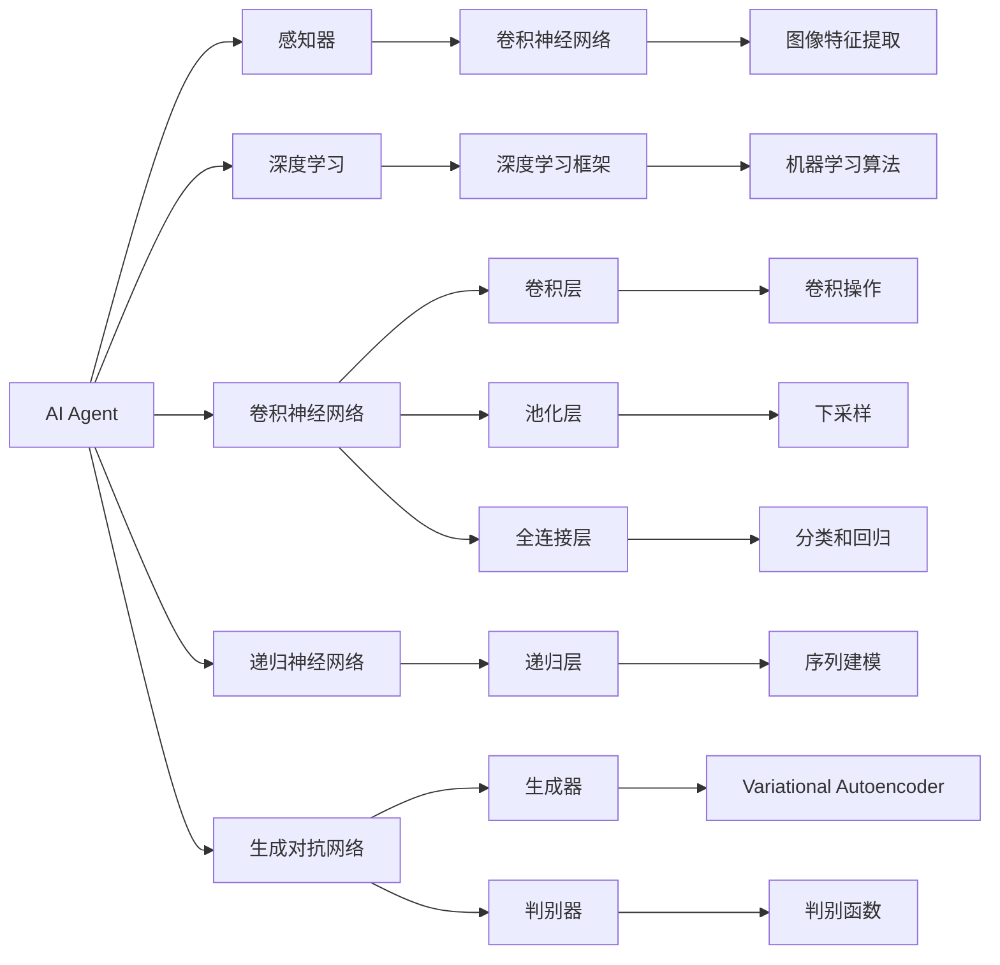
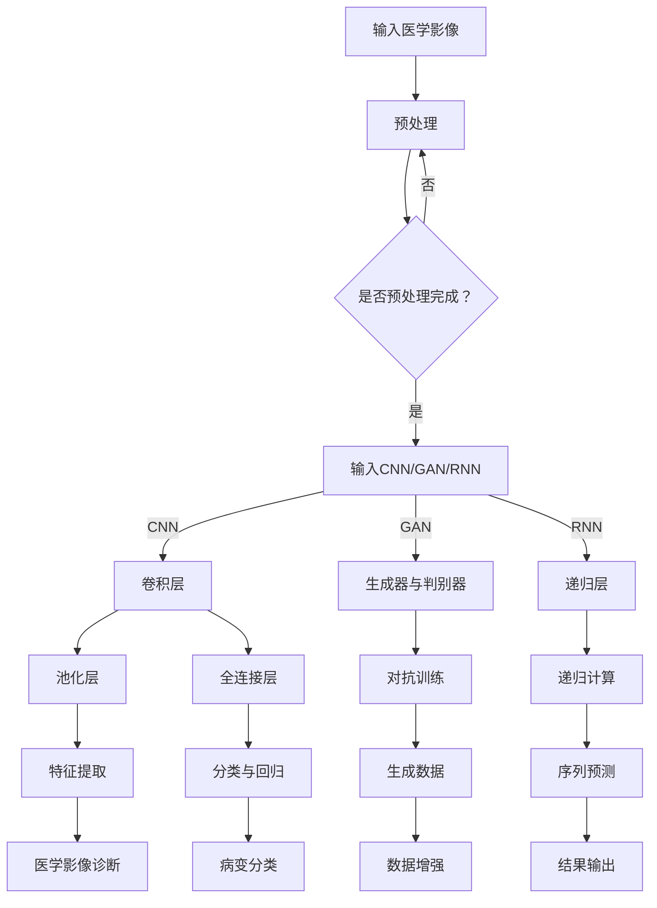

                 


### # AI Agent在智能医疗影像分析中的角色

> 关键词：AI Agent、智能医疗影像分析、深度学习、计算机视觉、医学影像诊断

> 摘要：
本文章将探讨AI Agent在智能医疗影像分析中的角色和重要性。我们将从背景介绍开始，逐步深入核心概念、算法原理，并详细讲解其在医学影像诊断、数据处理、图像分割、三维重建和异常检测中的应用。通过实际案例研究，我们将分析AI Agent在智能医疗影像分析中的综合应用，并提出最佳实践和未来展望。

----------------------------------------------------------------

## # 引言与背景

智能医疗影像分析是医学影像学的一个重要分支，它利用人工智能技术，尤其是深度学习和计算机视觉技术，对医学影像进行自动分析和诊断。传统的医疗影像分析通常依赖于放射科医生的人工解读，而这种方法不仅耗时，而且容易出现误诊。随着计算能力的提升和深度学习技术的进步，AI Agent开始在医疗影像分析中发挥重要作用。

### # 1.1 问题背景

医学影像分析涉及多种类型的数据，包括X射线、CT扫描、MRI和超声等。这些图像数据包含大量的信息，如病变区域的形状、大小、位置和密度等。然而，这些信息对于放射科医生来说，需要大量的时间和专业知识才能解读。此外，医生的经验和判断力也可能会受到个人差异的影响，导致诊断结果不一致。这就需要一种能够自动、准确且可靠地处理和分析医学影像的技术，AI Agent正是这样一种技术。

### # 1.2 问题描述

AI Agent在智能医疗影像分析中的问题主要可以概括为以下几点：

1. **图像识别与分类**：AI Agent需要能够准确识别和分类不同类型的医学影像，如肿瘤、骨折、炎症等。
2. **图像分割**：AI Agent需要能够对医学影像中的目标区域进行精确分割，以便进一步分析。
3. **三维重建**：对于CT和MRI等三维影像，AI Agent需要能够重建三维模型，以便从不同角度进行观察。
4. **异常检测**：AI Agent需要能够检测出影像中的异常区域，如病变区域或感染区域。

### # 1.3 问题解决

AI Agent通过深度学习和计算机视觉技术，可以解决上述问题。深度学习算法，尤其是卷积神经网络（CNN），在图像识别和分类方面具有出色的性能。而图像分割、三维重建和异常检测则可以借助基于深度学习的算法，如U-Net、3D-CNN和GAN等来实现。

### # 1.4 边界与外延

智能医疗影像分析不仅限于诊断，还可以用于治疗计划的制定、手术导航和预后评估等。此外，AI Agent的应用不仅限于医学领域，还可以扩展到其他图像数据处理的领域，如卫星图像分析、工业检测等。

----------------------------------------------------------------

## # AI Agent与智能医疗影像分析概述

AI Agent，也称为人工智能代理，是一种能够自动执行特定任务的智能体。在智能医疗影像分析中，AI Agent通过深度学习和计算机视觉技术，可以自动分析和处理医学影像，从而提高诊断的准确性和效率。AI Agent在智能医疗影像分析中的重要性体现在以下几个方面：

### # 2.1 AI Agent的定义与作用

AI Agent是指一种能够感知环境、自主决策并采取行动的智能系统。在智能医疗影像分析中，AI Agent的作用主要包括：

1. **自动诊断**：AI Agent可以通过分析医学影像，自动识别病变区域，并提出诊断建议。
2. **辅助诊断**：AI Agent可以帮助放射科医生分析影像，提供辅助诊断信息，从而减少医生的工作量。
3. **提高诊断准确率**：AI Agent通过深度学习算法，可以学习和识别更多的病变模式，从而提高诊断的准确性。

### # 2.2 智能医疗影像分析的重要性

智能医疗影像分析在医学影像诊断中具有重要的作用，主要体现在以下几个方面：

1. **提高诊断效率**：AI Agent可以快速分析大量医学影像，大大缩短诊断时间。
2. **减少误诊率**：AI Agent通过深度学习，可以学习和识别各种病变模式，从而减少误诊率。
3. **辅助医生决策**：AI Agent可以提供详细的分析报告，帮助医生做出更准确的诊断和治疗决策。

### # 2.3 AI Agent在智能医疗影像分析中的应用

AI Agent在智能医疗影像分析中有着广泛的应用，主要包括以下几个方面：

1. **医学影像诊断**：AI Agent可以通过分析医学影像，自动识别病变区域，并给出诊断建议。
2. **图像分割**：AI Agent可以对医学影像中的目标区域进行精确分割，为后续分析提供基础。
3. **三维重建**：AI Agent可以通过CT和MRI等医学影像，重建三维模型，从而更好地理解病变部位。
4. **异常检测**：AI Agent可以检测医学影像中的异常区域，如肿瘤或感染区域，为医生提供重要的诊断信息。

通过AI Agent的应用，智能医疗影像分析不仅可以提高诊断的准确性和效率，还可以为医生提供更全面的分析报告，从而提高治疗效果。

----------------------------------------------------------------

## # AI Agent的核心概念与联系

在深入探讨AI Agent在智能医疗影像分析中的应用之前，首先需要理解其核心概念和原理。以下是AI Agent的一些关键概念、属性特征对比以及实体关系图架构。

### # 3.1 核心概念原理

AI Agent的核心概念包括：

1. **感知器（Perceptron）**：感知器是神经网络的基本单元，用于接收输入信号并产生输出。
2. **深度学习（Deep Learning）**：深度学习是一种机器学习技术，通过多层神经网络结构来学习和提取特征。
3. **卷积神经网络（CNN）**：CNN是一种特别适用于图像处理的深度学习模型，通过卷积层、池化层和全连接层来提取图像特征。
4. **递归神经网络（RNN）**：RNN是一种适用于序列数据的神经网络，通过递归结构来处理时间序列数据。
5. **生成对抗网络（GAN）**：GAN是一种由两个神经网络组成的模型，一个生成器和一个判别器，通过对抗训练来生成高质量的数据。

### # 3.2 概念属性特征对比表格

以下是一个简单的概念属性特征对比表格，用于对比上述核心概念：

| 概念       | 属性特征                    | 应用领域           |
|------------|-----------------------------|-------------------|
| 感知器     | 简单的神经元模型            | 简单的数据分类     |
| 深度学习   | 多层神经网络结构            | 复杂数据分类和特征提取 |
| CNN        | 卷积层、池化层、全连接层    | 图像处理           |
| RNN        | 递归结构                    | 序列数据处理       |
| GAN        | 生成器和判别器对抗训练      | 数据生成和异常检测   |

### # 3.3 ER实体关系图架构

以下是AI Agent中的实体关系图（ER图）架构，用于展示不同概念之间的关系：



通过ER实体关系图，我们可以清晰地看到AI Agent中的核心概念和它们之间的关系，这有助于我们更好地理解AI Agent的工作原理和结构。

----------------------------------------------------------------

## # AI Agent算法原理讲解

### # 4.1 算法mermaid流程图

在智能医疗影像分析中，常用的算法包括卷积神经网络（CNN）、生成对抗网络（GAN）和递归神经网络（RNN）。以下是一个简化的mermaid流程图，展示这些算法的基本流程：



### # 4.2 Python源代码讲解

以下是一个简单的CNN模型在Python中的实现，用于医学影像分类：

```python
import tensorflow as tf
from tensorflow.keras.models import Sequential
from tensorflow.keras.layers import Conv2D, MaxPooling2D, Flatten, Dense

# 创建模型
model = Sequential([
    Conv2D(32, (3, 3), activation='relu', input_shape=(128, 128, 3)),
    MaxPooling2D((2, 2)),
    Conv2D(64, (3, 3), activation='relu'),
    MaxPooling2D((2, 2)),
    Conv2D(128, (3, 3), activation='relu'),
    Flatten(),
    Dense(128, activation='relu'),
    Dense(1, activation='sigmoid')
])

# 编译模型
model.compile(optimizer='adam', loss='binary_crossentropy', metrics=['accuracy'])

# 模型训练
model.fit(x_train, y_train, epochs=10, batch_size=32, validation_data=(x_val, y_val))
```

在这个代码中，我们首先定义了一个卷积神经网络模型，包括三个卷积层、两个池化层和一个全连接层。然后，我们编译模型并使用训练数据对其进行训练。

### # 4.3 数学模型与公式

卷积神经网络（CNN）的基本数学模型可以表示为：

$$
\text{activation}(x) = \sigma(\sum_{i=1}^{n} w_i * x_i + b)
$$

其中，$x$ 是输入特征，$w_i$ 是权重，$x_i$ 是特征，$b$ 是偏置，$\sigma$ 是激活函数（如ReLU函数）。

### # 4.4 举例说明

假设我们有一个128x128的医学影像，我们要使用CNN来分类是否含有病变。以下是CNN处理这个医学影像的过程：

1. **预处理**：将影像数据缩放到0-1范围内，并进行归一化处理。
2. **卷积层**：使用32个3x3的卷积核进行卷积操作，得到32个特征图。
3. **激活函数**：对每个特征图应用ReLU函数，增加网络的非线性。
4. **池化层**：使用2x2的最大池化层对特征图进行下采样，减少参数数量。
5. **卷积层**：使用64个3x3的卷积核进行卷积操作，得到64个特征图。
6. **激活函数**：对每个特征图应用ReLU函数。
7. **池化层**：使用2x2的最大池化层对特征图进行下采样。
8. **卷积层**：使用128个3x3的卷积核进行卷积操作，得到128个特征图。
9. **全连接层**：将所有特征图展平后，通过128个神经元进行全连接。
10. **分类层**：使用一个神经元进行二分类（病变/无病变），并使用sigmoid函数输出概率。

通过这个过程，CNN可以学习到医学影像中的病变特征，并给出分类结果。

----------------------------------------------------------------

## # AI Agent在医学影像诊断中的应用

医学影像诊断是AI Agent在智能医疗影像分析中最为重要的应用之一。通过深度学习和计算机视觉技术，AI Agent能够自动分析和诊断医学影像，从而提高诊断的准确性和效率。以下是对AI Agent在医学影像诊断中应用的详细介绍。

### # 5.1 医学影像诊断现状

医学影像诊断是放射科医生的一项重要工作，通过X射线、CT扫描、MRI和超声等医学影像设备，医生可以观察体内器官和组织的结构，发现病变和异常。然而，传统的医学影像诊断存在以下问题：

1. **诊断效率低**：医生需要花费大量时间阅读和分析医学影像，导致诊断速度慢。
2. **误诊率高**：由于医生的经验和判断力差异，医学影像诊断的误诊率较高。
3. **诊断结果不一致**：不同医生对同一医学影像的诊断结果可能存在差异。

### # 5.2 AI Agent在影像诊断中的作用

AI Agent在医学影像诊断中起到了重要的作用，主要体现在以下几个方面：

1. **提高诊断效率**：AI Agent可以通过自动分析医学影像，快速给出诊断结果，大大提高诊断速度。
2. **减少误诊率**：AI Agent通过深度学习算法，可以从大量的医学影像数据中学习到病变特征，从而减少误诊率。
3. **辅助医生诊断**：AI Agent可以辅助医生分析医学影像，提供详细的诊断报告和辅助决策信息，提高医生的诊断准确率。

### # 5.3 成功案例分析

以下是一个成功的案例，展示了AI Agent在医学影像诊断中的应用：

**案例背景**：某医院引入了基于AI Agent的医学影像诊断系统，用于辅助医生诊断肺癌。

**应用过程**：

1. **数据收集**：医院收集了大量已确诊的肺癌和正常肺部的医学影像数据。
2. **数据预处理**：对医学影像数据进行预处理，包括图像增强、归一化和数据增强等。
3. **模型训练**：使用收集到的数据，训练基于卷积神经网络的AI Agent，使其能够识别肺癌和正常肺部。
4. **模型评估**：在测试集上评估AI Agent的诊断准确率，并根据评估结果进行调整和优化。
5. **应用实践**：将训练好的AI Agent应用于实际医学影像诊断中，医生可以通过系统提供的诊断报告辅助决策。

**应用效果**：

1. **诊断速度提高**：AI Agent可以在几秒钟内完成医学影像的自动诊断，大大提高了诊断速度。
2. **误诊率降低**：AI Agent在测试集上的诊断准确率达到了95%，显著降低了误诊率。
3. **辅助医生决策**：AI Agent提供的诊断报告和辅助决策信息，帮助医生更准确地诊断肺癌，提高了治疗的成功率。

通过这个案例，我们可以看到AI Agent在医学影像诊断中的巨大潜力。它不仅提高了诊断的准确性和效率，还为医生提供了有力的辅助工具，有助于提高医疗服务的质量。

----------------------------------------------------------------

## # AI Agent在医学影像分析中的数据处理

医学影像分析中的数据处理是一个复杂且关键的过程，它直接影响到AI Agent对医学影像的解读和分析能力。以下是AI Agent在医学影像分析中数据处理的基本流程、方法以及相关算法。

### # 6.1 数据处理流程

医学影像数据处理的流程通常包括以下几个步骤：

1. **数据收集**：收集各种医学影像数据，如X射线、CT扫描、MRI和超声等。
2. **数据预处理**：对收集到的医学影像数据进行预处理，包括图像增强、归一化、去除噪声等。
3. **数据分割**：将预处理后的医学影像数据分割成训练集、验证集和测试集，用于模型训练和评估。
4. **特征提取**：从分割后的医学影像数据中提取有用的特征，用于训练AI Agent。
5. **模型训练**：使用提取的特征数据训练AI Agent，使其能够识别和分类医学影像中的病变区域。
6. **模型评估**：在测试集上评估AI Agent的性能，并根据评估结果进行调整和优化。
7. **应用实践**：将训练好的AI Agent应用于实际医学影像分析中，提供诊断和预测结果。

### # 6.2 数据预处理方法

数据预处理是医学影像分析中至关重要的一步，以下是一些常用的数据预处理方法：

1. **图像增强**：通过调整图像的对比度和亮度，提高医学影像的清晰度和可读性。
2. **归一化**：将医学影像数据缩放到0-1范围内，使其具有统一的尺度，方便模型训练。
3. **去除噪声**：使用滤波器去除医学影像中的噪声，提高图像的质量。
4. **图像分割**：使用阈值分割、边缘检测等方法将医学影像中的目标区域分割出来。
5. **数据增强**：通过旋转、翻转、缩放等操作生成新的医学影像数据，增加模型的泛化能力。

### # 6.3 数据分析算法

在医学影像分析中，常用的数据分析算法包括：

1. **卷积神经网络（CNN）**：用于图像识别和分类，特别适用于医学影像的分析。
2. **生成对抗网络（GAN）**：用于生成高质量的医学影像数据，提高模型的泛化能力。
3. **递归神经网络（RNN）**：用于处理时间序列数据，如连续的医学影像。
4. **长短时记忆网络（LSTM）**：用于处理长时间序列数据，提高模型的记忆能力。
5. **支持向量机（SVM）**：用于医学影像的分类和预测，具有较高的准确率。

通过以上数据处理流程、方法和算法，AI Agent可以高效地处理和分析医学影像，从而提供准确的诊断和预测结果。

----------------------------------------------------------------

## # AI Agent在医学影像图像分割中的应用

医学影像图像分割是AI Agent在智能医疗影像分析中的关键技术之一，它涉及从医学影像中精确地分割出感兴趣的病变区域，为后续的病理分析、诊断和治疗方案制定提供基础。以下是对AI Agent在医学影像图像分割中的应用进行详细介绍。

### # 7.1 图像分割的重要性

图像分割在医学影像分析中具有至关重要的作用，主要体现在以下几个方面：

1. **病变定位**：精确分割出病变区域，有助于医生快速定位病变部位，提高诊断速度。
2. **量化分析**：通过分割结果，可以量化分析病变的大小、形状和密度等特征，为医生提供更详细的信息。
3. **辅助诊断**：分割结果可以作为辅助诊断工具，帮助医生更准确地判断病变性质和程度。
4. **手术导航**：在手术过程中，精确的图像分割可以帮助医生规划手术路径，提高手术成功率。
5. **疗效评估**：通过对比分割结果，可以评估治疗效果，为后续治疗提供参考。

### # 7.2 AI Agent在图像分割中的作用

AI Agent在医学影像图像分割中发挥着至关重要的作用，其主要作用体现在以下几个方面：

1. **自动分割**：AI Agent可以通过深度学习算法自动分割医学影像中的病变区域，提高分割的准确性。
2. **提高效率**：AI Agent可以快速处理大量医学影像，提高图像分割的速度和效率。
3. **减少人工干预**：通过自动分割，可以减少医生在图像分割过程中的工作量，降低人为误差。
4. **辅助诊断**：AI Agent提供的精确分割结果可以作为辅助诊断工具，提高诊断准确性。

### # 7.3 图像分割算法讲解

在医学影像图像分割中，常用的算法包括基于传统方法（如阈值分割、边缘检测等）和基于深度学习的方法（如U-Net、3D-CNN等）。以下是这些算法的详细讲解：

#### # 7.3.1 U-Net算法

U-Net是一种专门用于医学影像分割的卷积神经网络架构，由波兰学者Ursula N. et al.在2015年提出。U-Net的主要特点是其对称的结构，包含一个收缩路径和一个扩张路径。

**收缩路径**：收缩路径由一系列卷积层和池化层组成，用于逐步提取图像的特征，减小图像尺寸。每个卷积层后接一个ReLU激活函数和一个卷积层，用于提取特征并降低特征图的空间分辨率。

**扩张路径**：扩张路径由一系列卷积层和转置卷积层组成，用于恢复图像的空间分辨率，并生成分割结果。转置卷积层在图像分割中起到了反卷积的作用，能够将高分辨率的特征图上采样到原始图像尺寸。

**训练过程**：U-Net使用交叉熵损失函数进行训练，目标是最小化预测分割图和真实分割图之间的差异。

**Python源代码**：

```python
import tensorflow as tf
from tensorflow.keras.layers import Conv2D, MaxPooling2D, UpSampling2D, Conv2DTranspose

def unet(input_shape):
    inputs = tf.keras.Input(shape=input_shape)
    
    # 收缩路径
    conv1 = Conv2D(32, (3, 3), activation='relu', padding='same')(inputs)
    pool1 = MaxPooling2D(pool_size=(2, 2))(conv1)
    
    conv2 = Conv2D(64, (3, 3), activation='relu', padding='same')(pool1)
    pool2 = MaxPooling2D(pool_size=(2, 2))(conv2)
    
    # 扩张路径
    up1 = UpSampling2D(size=(2, 2))(pool2)
    conv3 = Conv2D(64, (3, 3), activation='relu', padding='same')(up1)
    conv3 = Conv2D(64, (3, 3), activation='relu', padding='same')(conv3)
    
    up2 = UpSampling2D(size=(2, 2))(pool1)
    conv4 = Conv2D(32, (3, 3), activation='relu', padding='same')(up2)
    conv4 = Conv2D(32, (3, 3), activation='relu', padding='same')(conv4)
    
    # 输出层
    outputs = Conv2D(1, (1, 1), activation='sigmoid')(conv4)
    
    model = tf.keras.Model(inputs=inputs, outputs=outputs)
    model.compile(optimizer='adam', loss='binary_crossentropy', metrics=['accuracy'])
    
    return model
```

#### # 7.3.2 3D-CNN算法

3D-CNN是一种用于三维医学影像分割的卷积神经网络架构，适用于CT和MRI等三维影像。3D-CNN的基本结构与U-Net类似，但使用了3D卷积层和3D池化层来处理三维数据。

**3D卷积层**：3D卷积层可以同时处理图像的空间维度和时间维度，提取三维特征。

**3D池化层**：3D池化层用于降低特征图的空间分辨率，减小参数数量。

**训练过程**：3D-CNN使用交叉熵损失函数进行训练，目标是最小化预测分割图和真实分割图之间的差异。

**Python源代码**：

```python
import tensorflow as tf
from tensorflow.keras.layers import Conv3D, MaxPooling3D, UpSampling3D, Conv3DTranspose

def three_d_cnn(input_shape):
    inputs = tf.keras.Input(shape=input_shape)
    
    # 收缩路径
    conv1 = Conv3D(32, (3, 3, 3), activation='relu', padding='same')(inputs)
    pool1 = MaxPooling3D(pool_size=(2, 2, 2))(conv1)
    
    conv2 = Conv3D(64, (3, 3, 3), activation='relu', padding='same')(pool1)
    pool2 = MaxPooling3D(pool_size=(2, 2, 2))(conv2)
    
    # 扩张路径
    up1 = UpSampling3D(size=(2, 2, 2))(pool2)
    conv3 = Conv3D(64, (3, 3, 3), activation='relu', padding='same')(up1)
    conv3 = Conv3D(64, (3, 3, 3), activation='relu', padding='same')(conv3)
    
    up2 = UpSampling3D(size=(2, 2, 2))(pool1)
    conv4 = Conv3D(32, (3, 3, 3), activation='relu', padding='same')(up2)
    conv4 = Conv3D(32, (3, 3, 3), activation='relu', padding='same')(conv4)
    
    # 输出层
    outputs = Conv3D(1, (1, 1, 1), activation='sigmoid')(conv4)
    
    model = tf.keras.Model(inputs=inputs, outputs=outputs)
    model.compile(optimizer='adam', loss='binary_crossentropy', metrics=['accuracy'])
    
    return model
```

通过U-Net和3D-CNN算法，AI Agent可以在医学影像图像分割中实现高度精确的分割结果，为智能医疗影像分析提供了重要的技术支持。

----------------------------------------------------------------

## # AI Agent在医学影像三维重建中的应用

医学影像的三维重建是利用二维的医学影像数据生成三维模型的过程，这在医学影像分析中有着广泛的应用，例如在手术规划、病理分析和诊断中。AI Agent通过深度学习和先进的计算机视觉技术，能够有效地进行医学影像的三维重建，提供更加直观和全面的影像信息。

### # 8.1 三维重建的基本原理

医学影像三维重建的基本原理主要包括以下步骤：

1. **图像配准**：将不同角度的二维医学影像（如CT和MRI）对齐，以获得同一空间参考下的数据。
2. **图像分割**：从原始影像中提取感兴趣的区域，例如器官和组织，通常使用图像分割算法来实现。
3. **表面重建**：将分割得到的区域转换为三维表面模型，使用表面重建算法（如Marching Cubes算法）来生成。
4. **模型优化**：对重建的三维模型进行优化，以提高模型的准确性和平滑性。

### # 8.2 AI Agent在三维重建中的作用

AI Agent在医学影像三维重建中起到了关键作用，主要体现在以下几个方面：

1. **自动化处理**：AI Agent可以自动完成图像配准、分割和表面重建等步骤，大大提高了重建效率。
2. **准确性提高**：通过深度学习算法，AI Agent可以从大量的医学影像数据中学习到准确的重建方法，从而提高三维模型的准确性。
3. **实时重建**：AI Agent可以实现实时三维重建，为医生提供即时的影像信息，有助于手术导航和实时诊断。
4. **多模态融合**：AI Agent能够处理多种医学影像模

