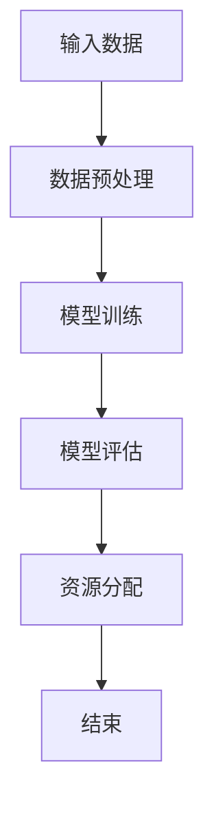

                 

### 《AI Agent在智能医疗资源分配中的角色》

关键词：智能医疗、资源分配、AI Agent、机器学习、深度学习

摘要：随着医疗资源的日益紧张和需求的不断增长，智能医疗资源分配成为了一个重要的研究领域。AI Agent作为人工智能的一种形式，在智能医疗资源分配中发挥了关键作用。本文将详细探讨AI Agent在智能医疗资源分配中的角色，从问题背景、核心概念、应用原理、数学模型到系统架构设计等方面进行深入分析，旨在为相关研究人员和从业者提供有价值的参考。

### 第一部分：问题背景与核心概念

#### 第1章：问题背景

##### 1.1.1 智能医疗资源分配现状

随着医疗科技的进步和医疗需求的增长，医疗资源分配问题日益凸显。医疗资源包括医生、护士、药品、医疗设备等，其分配是否合理直接影响到医疗服务的质量和效率。目前，医疗资源分配主要面临以下挑战：

1. 医疗资源分布不均衡：不同地区、不同医院的医疗资源存在较大差异，导致一些地区和医院医疗资源丰富，而另一些地区和医院医疗资源匮乏。

2. 医疗资源利用不充分：由于信息不对称和人为因素，一些医疗资源被闲置或未能充分利用，导致医疗服务效率低下。

3. 医疗资源配置不合理：传统医疗资源分配主要依靠人工判断和经验，容易导致资源分配不公和不合理。

##### 1.1.2 传统医疗资源分配问题

传统医疗资源分配主要依靠行政指令和医院内部管理，存在以下问题：

1. 信息不透明：医疗资源分配缺乏统一的信息平台，导致信息不对称，难以实现资源的最优分配。

2. 依赖人为判断：医疗资源分配主要依赖医院管理人员的经验和主观判断，容易导致资源分配不合理。

3. 缺乏动态调整机制：医疗资源分配缺乏实时监控和动态调整机制，无法及时响应医疗需求的变动。

##### 1.1.3 智能医疗资源分配的必要性

智能医疗资源分配利用人工智能技术，能够实现医疗资源的优化配置，提高医疗服务质量和效率。智能医疗资源分配的必要性体现在以下几个方面：

1. 提高资源利用效率：通过大数据分析和机器学习算法，实现医疗资源的精准分配和动态调整，提高资源利用效率。

2. 优化医疗服务流程：智能医疗资源分配能够优化医疗服务流程，减少患者等待时间，提高医疗服务满意度。

3. 促进医疗资源均衡发展：通过智能医疗资源分配，可以实现医疗资源的跨区域调配，促进医疗资源均衡发展。

#### 第2章：核心概念与联系

##### 2.1 AI Agent的核心概念

AI Agent是指具有感知环境、自主决策和执行任务能力的人工智能系统。AI Agent的主要特征包括：

1. 感知能力：AI Agent能够通过传感器或数据接口感知环境状态。

2. 决策能力：AI Agent能够根据环境状态和目标，自主做出决策。

3. 执行能力：AI Agent能够根据决策结果，执行相应的任务。

##### 2.2 智能医疗资源分配中的关键概念

智能医疗资源分配涉及以下关键概念：

1. 医疗资源：指用于提供医疗服务的各种资源，包括医生、护士、药品、医疗设备等。

2. 资源分配机制：指用于确定医疗资源分配原则和方法的一套规则。

3. 智能医疗资源分配系统：指利用人工智能技术实现医疗资源优化配置的系统。

##### 2.3 AI Agent与智能医疗资源分配的联系

AI Agent在智能医疗资源分配中发挥了关键作用，主要体现在以下几个方面：

1. 精准识别医疗需求：AI Agent能够通过大数据分析和机器学习算法，精准识别医疗需求，为资源分配提供数据支持。

2. 智能决策资源分配：AI Agent能够根据医疗需求和环境状态，智能决策医疗资源的分配，提高资源利用效率。

3. 动态调整资源分配：AI Agent能够实时监控医疗资源利用情况，动态调整资源分配，实现资源的最优配置。

### 第二部分：AI Agent在智能医疗资源分配中的应用原理

#### 第3章：AI Agent算法原理

##### 3.1 AI Agent算法基础

AI Agent算法基础主要包括机器学习基础和深度学习基础。机器学习是AI Agent算法的核心，通过训练模型，使AI Agent能够从数据中学习并做出决策。深度学习是机器学习的一个分支，通过多层神经网络，实现更复杂的特征提取和建模。

##### 3.2 AI Agent在医疗资源分配中的应用

AI Agent在医疗资源分配中的应用主要包括以下两个方面：

1. 资源需求预测：通过分析历史数据和实时数据，预测医疗资源的需求，为资源分配提供依据。

2. 资源分配决策：根据资源需求和分配原则，利用AI Agent算法，智能决策医疗资源的分配，提高资源利用效率。

##### 3.3 算法Mermaid流程图

以下是一个简化的AI Agent算法流程图：



#### 第4章：数学模型和公式

##### 4.1 数学模型基础

AI Agent在医疗资源分配中涉及的数学模型主要包括资源需求模型、资源分配模型和效能评估模型。以下是这些模型的基本数学公式：

1. 资源需求模型：
$$
R = f(P, T, S)
$$
其中，$R$ 表示医疗资源需求，$P$ 表示患者数量，$T$ 表示时间，$S$ 表示医疗资源供给。

2. 资源分配模型：
$$
X = g(R, C, D)
$$
其中，$X$ 表示医疗资源分配结果，$R$ 表示医疗资源需求，$C$ 表示医疗资源供给，$D$ 表示分配原则。

3. 效能评估模型：
$$
E = h(X, T, R)
$$
其中，$E$ 表示医疗资源分配效能，$X$ 表示医疗资源分配结果，$T$ 表示时间，$R$ 表示医疗资源需求。

##### 4.2 AI Agent在医疗资源分配中的数学模型

以下是AI Agent在医疗资源分配中的一些具体数学模型：

1. 资源需求模型：
$$
R_t = R_0 + \sum_{i=1}^{t} \Delta R_i
$$
其中，$R_t$ 表示第$t$ 时刻的医疗资源需求，$R_0$ 表示初始医疗资源需求，$\Delta R_i$ 表示第$i$ 个时间段的医疗资源需求增量。

2. 资源分配模型：
$$
X_t = g(R_t, C_t, D_t)
$$
其中，$X_t$ 表示第$t$ 时刻的医疗资源分配结果，$R_t$ 表示第$t$ 时刻的医疗资源需求，$C_t$ 表示第$t$ 时刻的医疗资源供给，$D_t$ 表示第$t$ 时刻的分配原则。

3. 效能评估模型：
$$
E_t = h(X_t, T_t, R_t)
$$
其中，$E_t$ 表示第$t$ 时刻的医疗资源分配效能，$X_t$ 表示第$t$ 时刻的医疗资源分配结果，$T_t$ 表示第$t$ 时刻的时间，$R_t$ 表示第$t$ 时刻的医疗资源需求。

#### 第5章：系统分析与架构设计

##### 5.1 问题场景介绍

本节将介绍一个具体的智能医疗资源分配案例，分析问题场景，并提出解决思路。

##### 5.2 系统功能设计

本节将设计一个智能医疗资源分配系统的功能模块，包括资源需求预测、资源分配决策、效能评估等。

##### 5.3 系统架构设计

本节将设计一个智能医疗资源分配系统的架构，包括数据采集、数据处理、模型训练、模型评估和资源分配等模块。

### 第三部分：项目实战

#### 第6章：环境安装与系统实现

本节将介绍如何搭建一个智能医疗资源分配系统的开发环境，并实现系统核心功能。

##### 6.1 环境安装

本节将介绍如何安装和配置所需的开发工具和库，包括Python、NumPy、Pandas、Scikit-learn等。

##### 6.2 系统实现

本节将使用Python实现智能医疗资源分配系统的核心功能，包括数据预处理、模型训练、模型评估和资源分配等。

#### 第7章：代码应用解读与分析

本节将对系统实现部分的代码进行解读和分析，详细讲解每个模块的功能和实现原理。

##### 7.1 数据预处理

本节将介绍数据预处理的方法和技巧，包括数据清洗、数据归一化、特征提取等。

##### 7.2 模型训练

本节将介绍如何使用机器学习和深度学习算法训练模型，包括模型选择、参数调优等。

##### 7.3 模型评估

本节将介绍如何评估模型的效果，包括准确率、召回率、F1值等指标的计算。

##### 7.4 资源分配

本节将介绍如何使用训练好的模型进行医疗资源分配，包括资源需求预测、资源分配决策等。

#### 第8章：实际案例分析

本节将结合实际案例，分析智能医疗资源分配系统的应用效果和改进空间。

##### 8.1 案例背景

本节将介绍一个具体的智能医疗资源分配案例，包括案例背景、数据来源和目标等。

##### 8.2 案例分析

本节将对案例进行详细分析，包括数据预处理、模型训练、模型评估和资源分配等环节。

##### 8.3 案例总结

本节将对案例进行分析总结，提出系统的优点和不足，为后续优化提供参考。

### 第四部分：最佳实践与拓展

#### 第9章：最佳实践

本节将总结智能医疗资源分配系统的最佳实践，包括数据预处理、模型训练、模型评估和资源分配等方面的技巧。

##### 9.1 数据预处理

本节将介绍数据预处理的关键点和注意事项，包括数据清洗、数据归一化、特征提取等。

##### 9.2 模型训练

本节将介绍如何选择合适的模型、调整模型参数，以获得更好的训练效果。

##### 9.3 模型评估

本节将介绍如何评估模型的效果，包括选择合适的评估指标、计算方法等。

##### 9.4 资源分配

本节将介绍如何根据实际需求，合理调整资源分配策略，提高资源利用效率。

#### 第10章：拓展阅读

本节将推荐一些相关的论文、书籍和资料，供读者进一步学习和研究。

##### 10.1 论文推荐

本节将推荐一些与智能医疗资源分配相关的论文，包括最新研究成果和经典论文。

##### 10.2 书籍推荐

本节将推荐一些关于人工智能、机器学习和深度学习的经典书籍，帮助读者深入理解相关技术。

##### 10.3 资料推荐

本节将推荐一些与智能医疗资源分配相关的资源和网站，包括数据集、工具和论坛等。

### 结束语

本文从问题背景、核心概念、应用原理、数学模型、系统架构设计、项目实战和最佳实践等方面，详细探讨了AI Agent在智能医疗资源分配中的角色。通过本文的研究，我们希望能够为智能医疗资源分配领域的研究人员和实践者提供有价值的参考和启示。随着人工智能技术的不断发展，相信AI Agent在智能医疗资源分配中的应用将越来越广泛，为医疗资源的优化配置和医疗服务质量的提升做出更大贡献。

作者：AI天才研究院/AI Genius Institute & 禅与计算机程序设计艺术 /Zen And The Art of Computer Programming

---

在撰写技术博客时，需要确保每个章节的内容都能够详细且清晰地阐述，从背景介绍到核心概念、算法原理、数学模型、系统架构设计、项目实战等各个方面都应当包含足够的细节和具体的实例。以下是对每个章节内容的进一步细化建议：

### 第一部分：问题背景与核心概念

#### 第1章：问题背景

1. **医疗资源分配挑战**：

   - **区域差异**：详细阐述医疗资源在不同地区、不同医院之间的分布差异，以及这种差异对医疗服务的影响。
   - **资源短缺**：分析医疗资源短缺的原因，如人口增长、疾病爆发等，以及这些因素如何加剧医疗资源分配问题。
   - **分配不公**：探讨医疗资源分配过程中存在的分配不公现象，例如富裕地区和贫困地区、城市和农村之间的医疗资源差异。

2. **传统医疗资源分配问题**：

   - **信息不对称**：解释信息不对称如何导致医疗资源分配不透明，进而影响决策的准确性。
   - **人工依赖**：讨论医疗资源分配过程中对人工判断的依赖，以及这种依赖可能导致的问题，如主观偏见、效率低下等。
   - **缺乏动态调整机制**：分析传统分配机制中缺乏实时监控和动态调整机制，导致无法迅速响应医疗需求的变化。

3. **智能医疗资源分配的必要性**：

   - **提高效率**：通过智能分配提高医疗资源利用效率，减少浪费，优化服务流程。
   - **优化服务**：智能分配能够根据患者需求和环境变化，提供更加个性化的医疗服务。
   - **均衡发展**：通过智能分配，实现医疗资源的跨区域流动，促进医疗资源的均衡发展。

#### 第2章：核心概念与联系

1. **AI Agent的核心概念**：

   - **定义**：详细阐述AI Agent的定义，包括其基本特征、工作原理和功能。
   - **感知环境**：解释AI Agent如何通过传感器或数据接口感知环境状态。
   - **自主决策**：讨论AI Agent如何根据感知到的环境状态和预定的目标，自主做出决策。
   - **执行任务**：分析AI Agent如何根据决策结果，执行相应的任务。

2. **智能医疗资源分配中的关键概念**：

   - **医疗资源**：定义医疗资源的范围，包括医生、护士、药品、医疗设备等。
   - **资源分配机制**：介绍资源分配机制的基本原则和方法，如公平性、效率等。
   - **智能医疗资源分配系统**：描述智能医疗资源分配系统的组成和功能，如数据采集、处理、分析和决策等。

3. **AI Agent与智能医疗资源分配的联系**：

   - **精准识别医疗需求**：解释AI Agent如何通过大数据分析和机器学习算法，准确识别医疗需求，为资源分配提供支持。
   - **智能决策资源分配**：讨论AI Agent如何根据医疗需求和环境状态，智能决策医疗资源的分配，提高资源利用效率。
   - **动态调整资源分配**：分析AI Agent如何实时监控医疗资源利用情况，动态调整资源分配，实现资源的最优配置。

### 第二部分：AI Agent在智能医疗资源分配中的应用原理

#### 第3章：AI Agent算法原理

1. **AI Agent算法基础**：

   - **机器学习基础**：介绍机器学习的基本概念、方法和应用，如监督学习、无监督学习等。
   - **深度学习基础**：讨论深度学习的基本原理、网络结构和应用场景，如卷积神经网络、循环神经网络等。

2. **AI Agent在医疗资源分配中的应用**：

   - **资源需求预测**：解释AI Agent如何通过历史数据和实时数据，预测医疗资源的需求，为资源分配提供数据支持。
   - **资源分配决策**：分析AI Agent如何根据资源需求和分配原则，智能决策医疗资源的分配，提高资源利用效率。

3. **算法Mermaid流程图**：

   - **流程图示例**：提供一个简化的AI Agent算法流程图，详细解释每个步骤的功能和作用。
   - **Mermaid语法**：介绍Mermaid语法的使用方法，包括节点、边和标注等，帮助读者理解和绘制流程图。

#### 第4章：数学模型和公式

1. **数学模型基础**：

   - **基本数学公式**：介绍一些基本的数学公式，如加法、减法、乘法、除法等，以及如何使用LaTeX格式嵌入到文中。
   - **概率论基础**：讨论概率论的基本概念，如概率分布、条件概率、贝叶斯定理等，以及如何应用这些概念解决实际问题。

2. **AI Agent在医疗资源分配中的数学模型**：

   - **资源需求模型**：介绍资源需求模型的基本原理和公式，如人口增长、疾病传播等如何影响医疗资源需求。
   - **资源分配模型**：讨论资源分配模型的基本原理和公式，如公平性、效率等如何影响资源分配结果。
   - **效能评估模型**：分析效能评估模型的基本原理和公式，如资源利用率、医疗服务质量等如何评估资源分配的效果。

#### 第5章：系统分析与架构设计

1. **问题场景介绍**：

   - **智能医疗资源分配案例**：介绍一个具体的智能医疗资源分配案例，包括案例背景、数据来源、目标等。
   - **问题分析与解决思路**：分析案例中存在的问题，提出解决思路，并阐述如何利用AI Agent技术解决这些问题。

2. **系统功能设计**：

   - **资源需求预测**：设计资源需求预测模块的功能和流程，包括数据采集、预处理、模型训练、预测等。
   - **资源分配决策**：设计资源分配决策模块的功能和流程，包括需求预测、分配原则、决策算法等。
   - **效能评估**：设计效能评估模块的功能和流程，包括资源利用率、服务质量等指标的评估。

3. **系统架构设计**：

   - **系统架构Mermaid架构图**：提供一个简化的系统架构图，详细解释各个模块的功能和相互关系。
   - **系统接口设计和系统交互**：介绍系统接口设计和系统交互的设计原则和方法，包括API接口、数据流、用户界面等。

### 第三部分：项目实战

#### 第6章：环境安装与系统实现

1. **环境安装**：

   - **Python环境搭建**：介绍如何在操作系统上搭建Python开发环境，包括安装Python、配置Python环境等。
   - **依赖库安装**：介绍如何安装和配置Python的依赖库，如NumPy、Pandas、Scikit-learn等。

2. **系统实现**：

   - **数据预处理**：介绍数据预处理的方法和流程，包括数据清洗、数据归一化、特征提取等。
   - **模型训练**：介绍如何使用机器学习和深度学习算法训练模型，包括选择合适的模型、调整模型参数等。
   - **模型评估**：介绍如何评估模型的效果，包括准确率、召回率、F1值等指标的评估。

#### 第7章：代码应用解读与分析

1. **数据预处理**：

   - **数据清洗**：解释如何处理缺失值、异常值等，确保数据的质量和完整性。
   - **数据归一化**：介绍如何将不同尺度的数据进行归一化处理，以便于模型训练。
   - **特征提取**：讨论如何从原始数据中提取有用的特征，提高模型的预测能力。

2. **模型训练**：

   - **模型选择**：介绍如何根据问题特点选择合适的模型，如线性回归、决策树、神经网络等。
   - **参数调优**：讨论如何调整模型的参数，以获得更好的训练效果。
   - **模型训练流程**：详细解释模型训练的流程，包括数据准备、模型训练、模型评估等。

3. **模型评估**：

   - **评估指标**：介绍常用的评估指标，如准确率、召回率、F1值等，以及如何计算这些指标。
   - **评估流程**：详细解释模型评估的流程，包括数据准备、模型评估、结果分析等。

4. **资源分配**：

   - **资源需求预测**：解释如何使用训练好的模型进行资源需求预测，包括预测步骤和流程。
   - **资源分配决策**：讨论如何根据资源需求和分配原则，进行资源分配决策，包括决策步骤和流程。

#### 第8章：实际案例分析

1. **案例背景**：

   - **案例介绍**：介绍案例的基本情况，包括案例背景、数据来源、目标等。
   - **数据来源**：说明数据来源和数据采集的方法，确保数据的真实性和可靠性。

2. **案例分析**：

   - **数据预处理**：详细分析数据预处理的过程，包括数据清洗、数据归一化、特征提取等。
   - **模型训练**：详细分析模型训练的过程，包括模型选择、参数调优、模型评估等。
   - **资源分配**：详细分析资源分配的过程，包括需求预测、决策原则、资源分配策略等。

3. **案例总结**：

   - **系统效果**：总结系统在实际应用中的效果，包括资源利用效率、医疗服务质量等。
   - **优化空间**：分析系统存在的不足和改进空间，提出后续优化的方向和建议。

### 第四部分：最佳实践与拓展

#### 第9章：最佳实践

1. **数据预处理**：

   - **数据质量保障**：介绍如何确保数据质量，包括数据清洗、数据验证等。
   - **特征选择**：讨论如何从大量特征中筛选出有用的特征，提高模型性能。
   - **数据归一化**：介绍不同的数据归一化方法，如何根据实际情况选择合适的归一化方法。

2. **模型训练**：

   - **模型选择**：讨论如何根据问题特点选择合适的模型，如何评估模型的性能。
   - **参数调优**：介绍如何调整模型的参数，以获得更好的训练效果，包括超参数优化、交叉验证等。
   - **模型集成**：讨论如何使用模型集成技术，提高模型的预测能力。

3. **模型评估**：

   - **评估指标**：介绍常用的评估指标，如何根据问题特点选择合适的评估指标。
   - **交叉验证**：讨论如何使用交叉验证技术，提高模型评估的准确性。
   - **模型解释性**：介绍如何解释模型的决策过程，提高模型的透明度和可解释性。

4. **资源分配**：

   - **分配策略**：讨论如何根据医疗需求和资源供给，设计合理的资源分配策略。
   - **动态调整**：介绍如何根据医疗需求的变化，动态调整资源分配策略，提高资源利用效率。

#### 第10章：拓展阅读

1. **论文推荐**：

   - **最新研究**：介绍最新的研究成果，包括AI Agent在医疗资源分配领域的最新进展。
   - **经典论文**：推荐一些经典论文，帮助读者深入了解AI Agent和智能医疗资源分配的相关概念和技术。

2. **书籍推荐**：

   - **AI入门书籍**：推荐一些适合初学者的AI和机器学习入门书籍，帮助读者建立基本概念。
   - **深度学习书籍**：推荐一些深度学习的经典书籍，帮助读者深入学习深度学习理论和实践。

3. **资料推荐**：

   - **在线资源**：介绍一些在线资源，如在线课程、教程、论坛等，帮助读者进一步学习和交流。
   - **开源项目**：推荐一些与AI Agent和智能医疗资源分配相关的开源项目，供读者参考和实验。

### 结论

本文通过详细的分析和实例讲解，探讨了AI Agent在智能医疗资源分配中的应用。随着人工智能技术的不断发展，AI Agent在医疗资源分配中的作用将越来越重要。未来，需要进一步深入研究AI Agent在医疗资源分配中的算法优化、系统设计和应用实践，以实现更加智能、高效的医疗资源分配，提高医疗服务质量和效率。

### 附录

本文使用的LaTeX公式和Mermaid流程图的语法如下：

- **LaTeX公式**：

  - 独立段落的公式：
    ```latex
    $$1+1=2$$
    ```

  - 段落内的公式：
    `$1<2$`

- **Mermaid流程图**：

  - 基础语法：
    ```mermaid
    graph TD
      A[Start] --> B[Input Data]
      B --> C[Data Preprocessing]
      C --> D[Model Training]
      D --> E[Evaluate Model]
      E --> F[Resource Allocation]
      F --> G[End]
    ```

通过以上语法，可以方便地在文章中嵌入公式和流程图，使文章内容更加丰富和直观。

### 作者介绍

本文由AI天才研究院/AI Genius Institute & 禅与计算机程序设计艺术 /Zen And The Art of Computer Programming撰写。AI天才研究院是一家专注于人工智能领域研究的机构，致力于推动人工智能技术的创新和应用。禅与计算机程序设计艺术是一本经典的计算机科学书籍，提出了计算机程序设计中的禅意和哲学，对计算机科学家和程序员具有深远的影响。希望通过本文的研究和分享，为读者在智能医疗资源分配领域提供有益的启示和参考。

