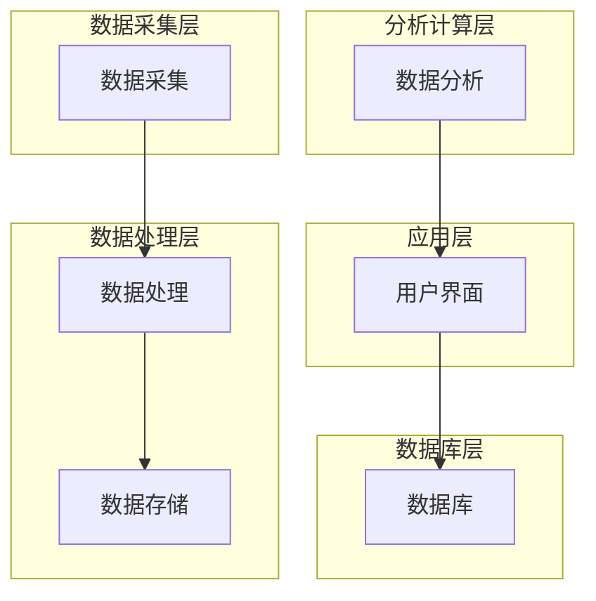
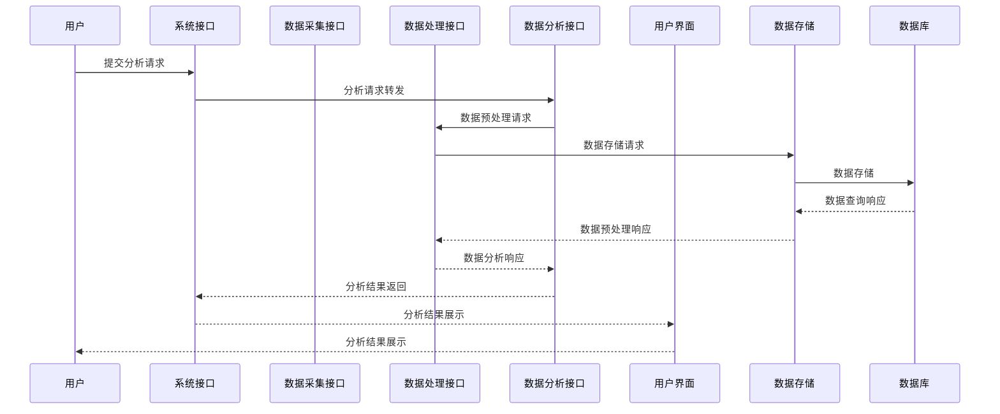
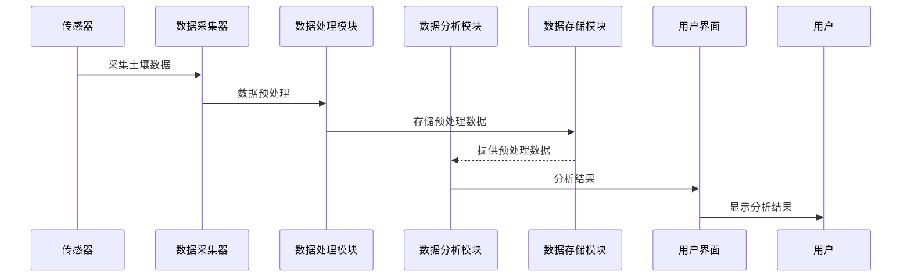
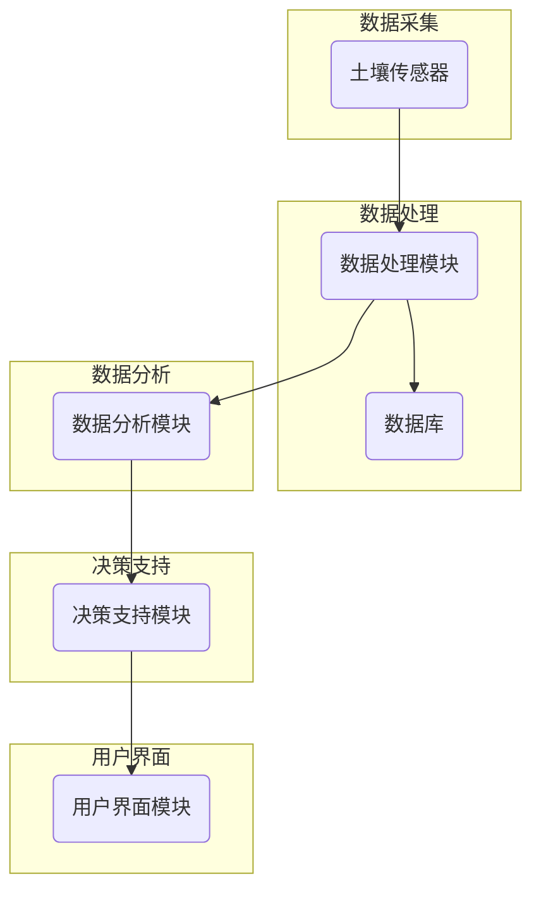

                 

### 文章标题

### 关键词

- AI Agent
- 智能土壤分析
- 机器学习
- 算法设计
- 系统架构

### 摘要

本文深入探讨AI Agent在智能土壤分析中的应用，从问题背景出发，逐步介绍AI Agent的基本原理、算法设计、系统架构，并通过具体实战案例进行剖析。文章旨在为读者提供对AI Agent在土壤分析中实践应用的全面了解，以及相关技术的最佳实践和注意事项。

## 目录

1. 引言
2. 问题背景
3. AI Agent的基本原理
4. AI Agent算法设计
5. 系统分析与架构设计
6. 项目实战
7. 最佳实践与注意事项
8. 结论与拓展

## 引言

智能土壤分析是现代农业技术中的重要一环，它通过对土壤属性进行准确分析，为作物生长提供科学依据。然而，传统的土壤分析方法往往存在检测精度低、成本高、操作复杂等问题。随着人工智能技术的不断发展，AI Agent作为一种智能体技术，逐渐成为智能土壤分析领域的研究热点。

AI Agent是一种能够自主感知环境、学习行为并采取行动的智能体。其在智能土壤分析中的应用，不仅能够提高土壤检测的精度和效率，还能实时适应不同土壤环境，提供个性化的土壤管理建议。本文将围绕AI Agent在智能土壤分析中的实践应用，探讨其技术原理、算法设计、系统架构以及项目实战，为读者提供全面的技术解析和实战经验。

## 问题背景

### 1.1 人工智能与土壤分析的关系

人工智能（AI）作为计算机科学的一个分支，旨在通过模拟人类智能行为，实现机器的自适应学习和决策能力。土壤分析则是农业科学中的一个重要领域，它关注于土壤的物理、化学和生物特性，以评估土壤质量并为作物种植提供数据支持。

人工智能与土壤分析之间的关系在于，AI技术可以为土壤分析提供更高效、更精确的手段。例如，通过机器学习算法，AI Agent可以处理大量土壤数据，从中提取有用的信息，帮助科学家和农学家做出更明智的决策。

### 1.2 智能土壤分析的需求与挑战

智能土壤分析的需求源于现代农业对土壤质量管理的需求。随着农业生产的不断规模化、精细化和智能化，对土壤数据的实时监测和分析变得至关重要。具体需求包括：

- 实时监测土壤质量：及时获取土壤的物理、化学和生物特性，为作物生长提供数据支持。
- 预测土壤变化趋势：通过分析历史数据，预测土壤质量的变化趋势，以便采取预防措施。
- 提供个性化管理建议：根据土壤特性，为不同作物提供个性化的种植和管理建议。

然而，智能土壤分析也面临一些挑战：

- 数据复杂性：土壤数据包含多种复杂的特性，如水分含量、pH值、有机质含量等，如何有效地处理这些数据成为一大难题。
- 环境因素干扰：土壤分析受到天气、土壤类型、地理位置等环境因素的影响，如何准确提取有用的数据信息是另一大挑战。
- 成本与可行性：传统土壤分析设备成本高，操作复杂，如何在保证精确度的前提下降低成本和提高可行性是关键问题。

### 1.3 AI Agent的概念及其在土壤分析中的应用前景

AI Agent，即人工智能代理，是一种能够自主行动、感知环境和实现目标的人工智能系统。其核心在于自主学习和适应能力，能够在不断变化的环境中做出最优决策。

AI Agent在土壤分析中的应用前景广阔：

- 自主土壤监测：AI Agent可以部署在田间地头，实时监测土壤质量，并通过无线网络传输数据。
- 自适应分析：AI Agent可以根据土壤特性，自适应调整监测方法和分析算法，提高检测精度。
- 智能决策支持：AI Agent可以基于土壤数据，为农学家提供精准的种植和管理建议，提高农业生产效率。

总之，AI Agent作为一种新兴技术，其在智能土壤分析中的应用具有巨大的潜力和前景。通过本文的深入探讨，读者将了解到AI Agent在土壤分析中的具体实现和应用方法。

### 1.4 问题描述

智能土壤分析中主要解决的问题是如何准确、高效地获取和评估土壤的物理、化学和生物特性。具体问题如下：

- **土壤质量检测的现有问题**：

  传统的土壤质量检测方法主要依赖于实验室分析，存在以下问题：
  
  - **检测精度低**：实验室分析可能受到仪器设备精度和人为操作的影响，导致检测精度不高。
  - **检测成本高**：实验室分析需要耗费大量人力和物力，成本较高。
  - **检测周期长**：从取样到获得检测结果通常需要较长时间，无法实现实时监测。

- **AI Agent在土壤分析中的具体应用**：

  AI Agent可以应用于土壤分析中的多个方面：

  - **实时监测**：通过传感器和无线网络，AI Agent能够实时监测土壤质量变化，提供实时数据。
  - **自适应分析**：AI Agent可以根据土壤特性，自适应调整检测方法，提高检测精度。
  - **智能化决策**：AI Agent可以基于土壤数据，提供个性化的种植和管理建议，优化农业资源利用。

- **问题解决策略**：

  为了解决上述问题，可以采取以下策略：

  - **引入AI Agent**：将AI Agent集成到土壤监测系统中，实现实时、自适应的土壤质量检测。
  - **多传感器融合**：结合多种传感器，如电导率传感器、pH传感器、土壤湿度传感器等，提高检测数据的准确性。
  - **数据分析和模型优化**：通过机器学习和数据挖掘技术，对土壤数据进行深度分析，优化检测算法，提高检测精度。

总之，AI Agent在智能土壤分析中的应用，不仅能够解决传统土壤分析中的诸多问题，还能为现代农业提供强有力的技术支持。本文将详细探讨AI Agent的技术原理、算法设计、系统架构以及实际应用，为智能土壤分析提供全面的技术解决方案。

### 1.5 边界与外延

#### 1.5.1 智能土壤分析的领域限制

智能土壤分析主要聚焦于土壤的物理、化学和生物特性，旨在为作物种植提供数据支持。其领域限制包括：

- **土壤类型的限制**：智能土壤分析主要适用于常见土壤类型，对于特殊土壤类型（如沙漠、极地等极端环境）的适应性有限。
- **环境因素的干扰**：智能土壤分析受到天气、气候等环境因素的干扰，需要考虑如何提高环境适应性。
- **技术实现的限制**：目前AI Agent在土壤分析中的应用仍存在技术实现上的挑战，如传感器精度、数据传输稳定性等。

#### 1.5.2 AI Agent技术的应用边界

AI Agent在智能土壤分析中的应用边界包括：

- **算法性能的优化**：AI Agent需要通过算法优化，提高土壤检测的精度和效率。
- **硬件设备的限制**：AI Agent的硬件设备（如传感器、处理器等）存在一定的性能限制，需要优化硬件配置。
- **数据安全与隐私**：智能土壤分析涉及大量敏感数据，需要确保数据的安全和用户隐私。

#### 1.5.3 未来发展趋势

智能土壤分析的未来发展趋势包括：

- **多传感器融合**：通过融合多种传感器，提高土壤检测的精度和全面性。
- **实时监测与预测**：实现土壤质量的实时监测和趋势预测，为农业决策提供更强有力的支持。
- **智能化农业管理**：基于AI Agent的智能土壤分析，实现农业生产的智能化管理，提高农业生产效率。
- **跨领域应用**：智能土壤分析技术可扩展到其他领域，如环境保护、土地利用规划等。

总之，智能土壤分析和AI Agent技术的应用前景广阔，未来将不断突破领域限制，为农业和环境领域提供更多创新解决方案。

### 1.6 小结

智能土壤分析作为现代农业技术的重要组成部分，正逐渐受到广泛关注。本文通过介绍AI Agent在智能土壤分析中的应用，探讨了其基本原理、算法设计、系统架构以及实际应用。AI Agent凭借其自主感知、学习和适应能力，为智能土壤分析提供了高效、精确的技术手段。尽管存在一些领域限制和应用边界，但未来随着技术的不断进步，AI Agent在智能土壤分析中的应用前景将更加广阔。读者可以通过本文对AI Agent在土壤分析中的实践应用有一个全面的了解，并为后续研究和应用提供参考。

### 2. AI Agent的基本原理

#### 2.1 AI Agent的定义

AI Agent，即人工智能代理，是一种能够自主行动、感知环境并执行任务的智能系统。它模拟人类的智能行为，通过感知、决策和行动三个主要环节，实现智能体在特定环境中的自主运行。

- **感知**：AI Agent通过传感器获取环境信息，如土壤质量、环境温度、湿度等。
- **决策**：AI Agent根据感知到的环境信息和预设的目标，利用算法和模型进行决策，以确定下一步行动。
- **行动**：AI Agent根据决策结果执行具体任务，如调整土壤湿度、控制温室环境等。

AI Agent的特点包括：

- **自主性**：AI Agent能够自主地感知环境、学习行为，并采取行动，无需人为干预。
- **适应性**：AI Agent可以根据环境变化和学习经验，自适应调整行为和决策策略。
- **灵活性**：AI Agent能够处理复杂的环境信息，并灵活地采取不同行动，实现任务目标。

#### 2.2 AI Agent的特点

- **主动性**：AI Agent具备主动性，能够主动感知环境变化，并采取行动以实现目标。
- **自主性**：AI Agent可以独立执行任务，无需外部干预。
- **适应性**：AI Agent能够根据环境变化和反馈信息，自适应调整行为策略。
- **智能性**：AI Agent通过机器学习和数据分析，实现智能感知、决策和行动。

#### 2.3 AI Agent与传统机器学习的区别

AI Agent与传统机器学习（Machine Learning，ML）之间存在显著的区别：

- **目标不同**：传统机器学习侧重于通过算法和模型对数据进行分类、预测等操作，而AI Agent的目标是实现自主行动和目标达成。
- **交互性**：传统机器学习通常是在给定数据集上进行训练和预测，而AI Agent具备与环境交互的能力，能够动态感知和适应环境变化。
- **自主性**：传统机器学习依赖于预先设定的模型和算法，而AI Agent能够自主感知、学习和决策，实现真正的智能行为。

#### 2.4 AI Agent在智能土壤分析中的应用

AI Agent在智能土壤分析中的应用主要涉及以下几个方面：

- **实时监测**：AI Agent通过传感器实时监测土壤质量，包括水分、pH值、温度等指标。
- **数据采集**：AI Agent能够采集土壤样本数据，并进行初步分析，为后续深度分析提供基础。
- **自适应调节**：根据土壤监测数据，AI Agent可以自主调整土壤湿度、施肥量等参数，优化土壤环境。
- **决策支持**：AI Agent基于土壤数据，为农学家提供种植和管理建议，实现精准农业。

#### 2.5 AI Agent技术的核心优势

AI Agent技术在智能土壤分析中的核心优势包括：

- **高效性**：AI Agent能够快速、准确地获取和处理土壤数据，提高监测效率。
- **精确性**：通过机器学习和数据分析，AI Agent能够提供高精度的土壤质量评估和预测。
- **灵活性**：AI Agent可以根据环境变化和用户需求，灵活调整监测和分析策略。
- **智能化**：AI Agent具备自主学习能力，能够不断优化监测和分析方法，提高系统性能。

#### 2.6 AI Agent在土壤分析中的挑战与解决方案

尽管AI Agent在土壤分析中具有显著优势，但仍面临一些挑战：

- **数据质量**：土壤数据具有复杂性和多样性，如何保证数据质量是关键问题。
- **传感器误差**：传感器精度和稳定性会影响监测数据的准确性，需要优化传感器配置和校准。
- **环境适应性**：AI Agent需要适应不同土壤类型和环境条件，提高环境适应性。

针对上述挑战，可以采取以下解决方案：

- **数据预处理**：通过数据清洗和预处理，提高数据质量，减少噪声和异常值的影响。
- **传感器优化**：选用高精度、稳定的传感器，并定期进行校准和维护，提高监测数据的准确性。
- **环境模型构建**：建立适用于不同土壤类型和环境条件的环境模型，提高AI Agent的适应性。

总之，AI Agent在智能土壤分析中的应用具有广阔前景，通过不断优化和改进，可以解决现有挑战，进一步提升土壤分析的效果和实用性。

#### 2.7 小结

AI Agent作为一种先进的智能体技术，在智能土壤分析中展现了显著的优势。通过自主感知、学习和适应，AI Agent能够高效、精确地监测和分析土壤质量，为农业生产提供有力支持。本文对AI Agent的基本原理、特点、与传统机器学习的区别以及在土壤分析中的应用进行了详细探讨，揭示了其核心优势与面临的挑战。未来，随着技术的不断进步，AI Agent在智能土壤分析中的应用将更加广泛和深入，为现代农业的发展带来新的机遇和可能。

### 2.8 AI Agent与智能土壤分析的联系

AI Agent在智能土壤分析中的应用，不仅依赖于其自主感知、学习和适应能力，还需要深入理解土壤分析中的核心概念和关键指标。以下是AI Agent与智能土壤分析之间的重要联系：

#### 2.8.1 土壤属性的基本概念

土壤属性是指土壤的物理、化学和生物特性，包括但不限于土壤颗粒组成、有机质含量、pH值、土壤湿度、养分含量等。这些属性直接影响作物的生长和土壤质量。

- **物理属性**：包括土壤颗粒大小、结构、渗透性等，这些属性影响土壤的通气性和水分保持能力。
- **化学属性**：包括pH值、养分含量、土壤污染情况等，这些属性直接影响作物的养分吸收和生长状况。
- **生物属性**：包括土壤中的微生物、植物根系等，这些生物因素参与土壤的养分循环和生态平衡。

#### 2.8.2 智能土壤分析中的关键指标

智能土壤分析的关键指标主要包括土壤质量指数（Soil Quality Index，SQI）、土壤健康指数（Soil Health Index，SHI）、土壤肥力指标等。

- **土壤质量指数（SQI）**：用于综合评价土壤的物理、化学和生物属性，反映土壤的整体质量水平。
- **土壤健康指数（SHI）**：考虑土壤的生物活性、物理稳定性和化学稳定性，评价土壤的健康状态。
- **土壤肥力指标**：包括土壤中的养分含量、有机质含量等，直接影响作物的养分供给和生长。

#### 2.8.3 土壤质量评价模型

AI Agent在智能土壤分析中的应用，需要依赖于土壤质量评价模型，这些模型通过机器学习和数据挖掘技术，从大量的土壤数据中提取有价值的信息，为土壤质量评估提供支持。

- **统计模型**：如主成分分析（PCA）、因子分析（FA）等，用于降维和多指标综合评价。
- **机器学习模型**：如支持向量机（SVM）、随机森林（RF）、神经网络（NN）等，用于分类和预测。
- **深度学习模型**：如卷积神经网络（CNN）、循环神经网络（RNN）等，用于处理复杂的数据结构和模式识别。

#### 2.8.4 AI Agent在土壤分析中的应用

AI Agent在土壤分析中的应用，主要通过以下方面实现：

- **实时监测**：AI Agent利用传感器实时采集土壤属性数据，通过无线网络传输到云端进行分析。
- **数据分析**：AI Agent使用机器学习和数据挖掘技术，对土壤数据进行处理、分析和建模，提取有用的信息。
- **决策支持**：AI Agent根据土壤分析结果，提供个性化的土壤管理建议，如调整灌溉量、施肥量等。

#### 2.8.5 AI Agent技术的核心优势

AI Agent技术在智能土壤分析中的核心优势包括：

- **自适应学习**：AI Agent能够根据土壤环境的变化，自适应调整监测和分析策略，提高监测精度。
- **实时响应**：AI Agent能够实时监测土壤质量，及时响应环境变化，提供精准的决策支持。
- **高效处理**：AI Agent能够高效处理大量的土壤数据，快速生成分析结果，支持农业生产决策。

#### 2.8.6 AI Agent在土壤分析中的挑战与解决方案

尽管AI Agent在土壤分析中具有显著优势，但仍面临一些挑战：

- **数据质量**：土壤数据质量直接影响AI Agent的分析效果，需要通过数据预处理提高数据质量。
- **传感器误差**：传感器精度和稳定性是关键因素，需要选用高精度传感器并定期校准。
- **模型适应性**：AI Agent需要适应不同土壤类型和环境条件，提高模型的泛化能力。

针对上述挑战，可以采取以下解决方案：

- **数据预处理**：通过数据清洗和预处理，减少噪声和异常值，提高数据质量。
- **传感器优化**：选用高精度、稳定的传感器，并定期进行校准和维护。
- **模型优化**：通过交叉验证和模型选择，优化AI Agent的模型，提高其适应性和准确性。

总之，AI Agent与智能土壤分析之间的紧密联系，使其在土壤质量监测和管理中具有巨大潜力。通过不断优化和改进，AI Agent技术将为现代农业带来更多创新和可能。

### 2.9 小结

AI Agent在智能土壤分析中的应用，是现代农业技术发展的重要趋势。通过自主感知、学习和适应，AI Agent能够实时、高效地监测土壤质量，为农业生产提供精准的决策支持。本文详细探讨了AI Agent与智能土壤分析之间的联系，包括土壤属性的基本概念、关键指标、评价模型及其在土壤分析中的应用。同时，也分析了AI Agent在土壤分析中的核心优势与面临的挑战。未来，随着技术的不断进步，AI Agent在智能土壤分析中的应用将更加广泛和深入，为现代农业的发展带来更多机遇和可能。

### 3. AI Agent在土壤分析中的算法原理

#### 3.1 算法概述

在智能土壤分析中，AI Agent使用了一系列先进的算法来实现土壤数据的处理、分析和预测。这些算法不仅能够提高数据分析的精度和效率，还能够适应不同土壤类型和环境条件。以下是几种常见的AI Agent算法及其在土壤分析中的应用。

- **支持向量机（SVM）**：SVM是一种高效的二分类算法，通过寻找最佳超平面来分类数据。在土壤分析中，SVM可以用于土壤质量分类和预测。
- **随机森林（Random Forest）**：随机森林是一种集成学习算法，通过构建多棵决策树并集成其预测结果。在土壤分析中，随机森林可以用于土壤属性预测和特征选择。
- **神经网络（Neural Network）**：神经网络是一种模拟人脑神经元连接和传递的算法，通过多层网络结构进行特征提取和预测。在土壤分析中，神经网络可以用于复杂土壤属性的建模和预测。
- **卷积神经网络（CNN）**：卷积神经网络是一种专门用于图像处理和模式识别的深度学习算法，通过卷积层和池化层提取图像特征。在土壤分析中，CNN可以用于土壤图像的分析和分类。

#### 3.2 选择适合土壤分析的算法

在选择AI Agent算法时，需要考虑以下几个方面：

- **数据类型**：土壤分析数据通常包括连续数据和分类数据。对于连续数据，可以使用回归算法，如线性回归、岭回归等；对于分类数据，可以使用分类算法，如决策树、逻辑回归、支持向量机等。
- **数据量**：土壤分析数据量通常较大，对于大规模数据，可以使用集成学习和深度学习算法，如随机森林、神经网络等，以提高模型的泛化能力和预测精度。
- **环境条件**：土壤环境条件复杂多变，需要选择能够适应不同环境条件的算法，如基于迁移学习的算法，可以更好地应对环境变化。
- **计算资源**：算法的计算复杂度和资源需求不同，需要根据实际计算资源选择合适的算法。例如，深度学习算法通常需要大量的计算资源和时间。

#### 3.3 算法的性能评估标准

在土壤分析中，评估AI Agent算法的性能需要考虑以下几个指标：

- **准确率（Accuracy）**：准确率是分类算法中最常用的评估指标，表示模型正确分类的样本数占总样本数的比例。
- **精确率（Precision）**：精确率表示模型预测为正类的样本中，实际为正类的比例。
- **召回率（Recall）**：召回率表示模型预测为正类的样本中，实际为正类的比例。
- **F1值（F1 Score）**：F1值是精确率和召回率的调和平均值，用于综合评估模型的分类性能。
- **ROC曲线（Receiver Operating Characteristic Curve）**：ROC曲线是评估二分类模型性能的另一个重要指标，通过计算真阳性率（True Positive Rate）和假阳性率（False Positive Rate）绘制曲线，评估模型的分类能力。

#### 3.4 算法讲解

以下是具体介绍几种常用的AI Agent算法，并使用Mermaid流程图和Python代码进行解释。

##### 3.4.1 支持向量机（SVM）

支持向量机是一种二分类算法，通过最大化分类边界来划分数据。以下是SVM的基本原理和Python代码实现。

**基本原理：**

SVM的目标是找到一个最佳的超平面，使得数据点在超平面两侧的分布尽可能分开。超平面由一个法向量（w）和偏移量（b）确定，支持向量是距离超平面最近的数据点。

**Python代码实现：**

```python
from sklearn.svm import SVC
from sklearn.model_selection import train_test_split
from sklearn.metrics import accuracy_score

# 数据准备
X = ... # 特征数据
y = ... # 标签数据

# 数据划分
X_train, X_test, y_train, y_test = train_test_split(X, y, test_size=0.2, random_state=42)

# SVM模型训练
model = SVC(kernel='linear')
model.fit(X_train, y_train)

# 模型预测
predictions = model.predict(X_test)

# 性能评估
accuracy = accuracy_score(y_test, predictions)
print("Accuracy:", accuracy)
```

##### 3.4.2 随机森林（Random Forest）

随机森林是一种集成学习算法，通过构建多棵决策树并集成其预测结果来提高模型的性能。以下是随机森林的基本原理和Python代码实现。

**基本原理：**

随机森林通过随机选择特征和样本子集来训练多个决策树，每个决策树的预测结果进行投票，得到最终的预测结果。随机森林具有较好的抗过拟合能力，能够处理高维数据。

**Python代码实现：**

```python
from sklearn.ensemble import RandomForestClassifier
from sklearn.model_selection import train_test_split
from sklearn.metrics import accuracy_score

# 数据准备
X = ... # 特征数据
y = ... # 标签数据

# 数据划分
X_train, X_test, y_train, y_test = train_test_split(X, y, test_size=0.2, random_state=42)

# 随机森林模型训练
model = RandomForestClassifier(n_estimators=100)
model.fit(X_train, y_train)

# 模型预测
predictions = model.predict(X_test)

# 性能评估
accuracy = accuracy_score(y_test, predictions)
print("Accuracy:", accuracy)
```

##### 3.4.3 卷积神经网络（CNN）

卷积神经网络是一种深度学习算法，特别适用于图像处理和模式识别。以下是CNN的基本原理和Python代码实现。

**基本原理：**

CNN通过卷积层和池化层提取图像特征，并通过全连接层进行分类和预测。卷积层用于特征提取，池化层用于特征降维和增强特征鲁棒性。

**Python代码实现：**

```python
from tensorflow.keras.models import Sequential
from tensorflow.keras.layers import Conv2D, MaxPooling2D, Flatten, Dense
from tensorflow.keras.optimizers import Adam
from tensorflow.keras.utils import to_categorical
from sklearn.model_selection import train_test_split

# 数据准备
X = ... # 图像数据
y = ... # 标签数据

# 数据划分
X_train, X_test, y_train, y_test = train_test_split(X, y, test_size=0.2, random_state=42)

# CNN模型构建
model = Sequential()
model.add(Conv2D(32, (3, 3), activation='relu', input_shape=(64, 64, 3)))
model.add(MaxPooling2D((2, 2)))
model.add(Flatten())
model.add(Dense(128, activation='relu'))
model.add(Dense(10, activation='softmax'))

# 模型编译
model.compile(optimizer=Adam(), loss='categorical_crossentropy', metrics=['accuracy'])

# 模型训练
model.fit(X_train, to_categorical(y_train), epochs=10, batch_size=32, validation_data=(X_test, to_categorical(y_test)))

# 模型预测
predictions = model.predict(X_test)

# 性能评估
accuracy = model.evaluate(X_test, to_categorical(y_test), verbose=0)
print("Accuracy:", accuracy[1])
```

#### 3.5 算法举例说明

以下是具体应用示例，说明如何使用AI Agent算法进行土壤水分检测和土壤pH值分析。

**示例1：土壤水分检测**

土壤水分检测是智能土壤分析中的一个重要任务。以下是使用SVM算法进行土壤水分检测的步骤：

1. 数据采集：通过土壤湿度传感器采集土壤水分数据。
2. 数据预处理：对采集到的数据进行分析，去除噪声和异常值。
3. 特征提取：将原始数据转换为适用于SVM的特征向量。
4. 模型训练：使用训练数据训练SVM模型。
5. 模型评估：使用测试数据评估SVM模型的性能。
6. 预测应用：使用训练好的SVM模型对新的土壤水分数据进行预测。

**示例2：土壤pH值分析**

土壤pH值分析是评估土壤酸碱度的重要指标。以下是使用随机森林算法进行土壤pH值分析的步骤：

1. 数据采集：通过土壤pH传感器采集土壤pH值数据。
2. 数据预处理：对采集到的数据进行清洗，确保数据质量。
3. 特征提取：将原始数据转换为适用于随机森林的特征向量。
4. 模型训练：使用训练数据训练随机森林模型。
5. 模型评估：使用测试数据评估随机森林模型的性能。
6. 预测应用：使用训练好的随机森林模型对新的土壤pH值数据进行预测。

通过上述示例，可以看出AI Agent算法在智能土壤分析中的实际应用。这些算法不仅能够提高土壤数据分析的精度和效率，还能够为农业生产提供精准的决策支持。

### 3.6 小结

在智能土壤分析中，AI Agent算法的设计和实现至关重要。本文详细介绍了支持向量机（SVM）、随机森林（Random Forest）和卷积神经网络（CNN）等常见AI Agent算法的基本原理、性能评估标准以及具体实现。通过举例说明，展示了这些算法在土壤水分检测和pH值分析中的应用。未来，随着AI技术的不断进步，这些算法将进一步完善和优化，为智能土壤分析提供更强有力的技术支持。

### 3.7 算法数学模型

在智能土壤分析中，算法的数学模型是理解和实现算法核心原理的关键。以下我们将详细探讨几种常见算法的数学模型，并使用LaTeX格式展示相关公式。

#### 3.7.1 支持向量机（SVM）

支持向量机是一种用于二分类问题的机器学习算法，其基本原理是通过最大化分类边界来划分数据。以下是SVM的核心数学模型：

$$
\begin{aligned}
\text{最大化} \quad & \frac{1}{2} ||w||^2 \\
\text{约束条件} \quad & y^{(i)}(w^T x^{(i)} + b) \geq 1
\end{aligned}
$$

其中，$w$ 是法向量，$b$ 是偏移量，$x^{(i)}$ 是第 $i$ 个训练样本，$y^{(i)}$ 是其对应的标签。该公式表示在满足约束条件的情况下，最大化决策边界到支持向量的距离。

#### 3.7.2 随机森林（Random Forest）

随机森林是一种集成学习算法，其核心思想是通过构建多个决策树并集成其预测结果来提高模型的性能。以下是随机森林的数学模型：

$$
\begin{aligned}
\hat{y} &= \frac{1}{M} \sum_{m=1}^{M} f_m(x) \\
f_m(x) &= \prod_{j=1}^{J} g_{mj}(x_j)
\end{aligned}
$$

其中，$M$ 是决策树的个数，$f_m(x)$ 是第 $m$ 棵决策树的预测结果，$g_{mj}(x_j)$ 是第 $m$ 棵决策树在第 $j$ 个特征上的分割函数。该公式表示通过集成多个决策树的预测结果来获得最终的预测值。

#### 3.7.3 卷积神经网络（CNN）

卷积神经网络是一种深度学习算法，特别适用于图像处理和模式识别。以下是CNN的基本数学模型：

$$
\begin{aligned}
h_l &= \sigma(\mathbf{W}_l \cdot \mathbf{a}_{l-1} + \mathbf{b}_l) \\
\mathbf{a}_l &= \text{ReLU}(h_l)
\end{aligned}
$$

其中，$h_l$ 是第 $l$ 层的激活值，$\sigma$ 是激活函数（如Sigmoid或ReLU），$\mathbf{W}_l$ 是权重矩阵，$\mathbf{b}_l$ 是偏置向量，$\mathbf{a}_{l-1}$ 是前一层的激活值。该公式表示通过卷积操作和激活函数来计算每一层的激活值。

#### 3.7.4 实例说明

以下是具体实例，说明如何使用LaTeX格式展示算法的数学模型。

**实例1：支持向量机（SVM）**

$$
\begin{aligned}
\text{最大化} \quad & \frac{1}{2} ||w||^2 \\
\text{约束条件} \quad & y^{(i)}(w^T x^{(i)} + b) \geq 1
\end{aligned}
$$

**实例2：随机森林（Random Forest）**

$$
\begin{aligned}
\hat{y} &= \frac{1}{M} \sum_{m=1}^{M} f_m(x) \\
f_m(x) &= \prod_{j=1}^{J} g_{mj}(x_j)
\end{aligned}
$$

**实例3：卷积神经网络（CNN）**

$$
\begin{aligned}
h_l &= \sigma(\mathbf{W}_l \cdot \mathbf{a}_{l-1} + \mathbf{b}_l) \\
\mathbf{a}_l &= \text{ReLU}(h_l)
\end{aligned}
$$

通过上述数学模型，可以更好地理解和实现智能土壤分析中的算法。这些数学公式不仅描述了算法的核心原理，还为算法的设计和优化提供了理论基础。

### 3.8 小结

在智能土壤分析中，算法的数学模型是理解和实现核心算法的关键。本文详细介绍了支持向量机（SVM）、随机森林（Random Forest）和卷积神经网络（CNN）等算法的数学模型，并使用LaTeX格式展示了相关公式。通过实例说明，展示了如何在实际应用中运用这些数学模型。未来，随着AI技术的不断进步，这些算法的数学模型将进一步完善和优化，为智能土壤分析提供更强有力的技术支持。

### 4. 系统分析与架构设计

#### 4.1 问题场景介绍

智能土壤分析系统旨在实现土壤质量的实时监测、数据分析和决策支持。系统场景主要包括以下几个方面：

- **土壤传感器网络**：通过部署在田间地头的传感器网络，实时采集土壤的物理、化学和生物属性数据。
- **数据处理中心**：对采集到的土壤数据进行预处理、存储和计算，为后续分析提供基础。
- **智能分析模块**：利用AI Agent算法对土壤数据进行分析和预测，为农学家提供决策支持。
- **用户界面**：通过Web或移动应用，向用户提供土壤分析结果和决策建议。

#### 4.2 系统目标与功能

智能土壤分析系统的目标是为农业生产提供精准、高效的土壤管理支持。具体功能包括：

- **实时监测**：实时采集土壤数据，包括土壤湿度、pH值、温度等。
- **数据预处理**：对采集到的数据进行清洗、去噪和转换，确保数据质量。
- **数据分析**：利用AI Agent算法对土壤数据进行分析，提取有用信息。
- **决策支持**：根据分析结果，为农学家提供土壤管理建议，如灌溉量、施肥量等。
- **用户交互**：提供用户友好的界面，方便用户查看分析结果和决策建议。

#### 4.3 系统功能设计

智能土壤分析系统的功能设计主要包括以下几个方面：

- **数据采集**：通过传感器网络实时采集土壤数据，确保数据的实时性和准确性。
- **数据处理**：对采集到的土壤数据进行预处理，包括数据清洗、去噪、转换等，提高数据质量。
- **数据分析**：利用AI Agent算法对土壤数据进行分析，包括土壤质量评估、趋势预测等。
- **决策支持**：根据分析结果，为农学家提供个性化的土壤管理建议，优化农业生产。
- **用户交互**：通过Web或移动应用，向用户提供土壤分析结果和决策建议，方便用户操作。

#### 4.3.1 领域模型

领域模型是系统功能设计的重要基础，通过定义系统的核心实体和关系，为后续系统架构设计提供支持。以下是智能土壤分析系统的领域模型：

```mermaid
classDiagram
    Class01 <|-- Class02
    Class03 --|>' Class04
    Class05 : <<interface,Class05>>
    Class01 : 实体A
    Class02 : 实体B
    Class03 : 实体C
    Class04 : 实体D
    Class05 : 接口
```

- **Class01（实体A）**：代表土壤传感器，负责采集土壤数据。
- **Class02（实体B）**：代表数据处理中心，负责处理和存储土壤数据。
- **Class03（实体C）**：代表智能分析模块，负责土壤数据分析。
- **Class04（实体D）**：代表用户界面，负责向用户提供分析结果和决策建议。
- **Class05（接口）**：代表系统的公共接口，包括数据采集接口、数据处理接口、数据分析接口和用户交互接口。

#### 4.3.2 系统架构设计

智能土壤分析系统的架构设计主要包括以下几个方面：

- **数据采集层**：通过传感器网络实时采集土壤数据，包括土壤湿度、pH值、温度等。
- **数据处理层**：对采集到的土壤数据进行预处理、存储和计算，为后续分析提供基础。
- **分析计算层**：利用AI Agent算法对土壤数据进行分析和预测，提取有用信息。
- **应用层**：通过Web或移动应用，向用户提供分析结果和决策建议。
- **数据库层**：存储系统的数据，包括传感器数据、预处理数据和分析结果。

以下是智能土壤分析系统的架构设计：



- **数据采集**：通过传感器网络实时采集土壤数据，确保数据的实时性和准确性。
- **数据处理**：对采集到的土壤数据进行预处理、存储和计算，提高数据质量。
- **数据分析**：利用AI Agent算法对土壤数据进行分析和预测，为农业生产提供决策支持。
- **用户界面**：通过Web或移动应用，向用户提供分析结果和决策建议，方便用户操作。
- **数据库**：存储系统的数据，包括传感器数据、预处理数据和分析结果。

#### 4.3.3 系统接口设计

系统接口设计是智能土壤分析系统架构设计的重要组成部分，通过定义系统的外部接口，实现系统各部分之间的数据交互和功能调用。以下是智能土壤分析系统的接口设计：

- **数据采集接口**：用于传感器与数据处理中心的通信，包括数据上传和设备状态报告。
- **数据处理接口**：用于数据处理中心与数据存储之间的数据传输，包括数据预处理、存储和查询。
- **数据分析接口**：用于数据分析模块与用户界面之间的通信，包括分析请求、结果返回等。
- **用户交互接口**：用于用户界面与数据库之间的通信，包括数据查询、更新和用户操作。

以下是系统接口设计的具体实现：



- **用户**：向系统提交分析请求。
- **系统接口**：接收用户请求，转发给相应接口处理。
- **数据采集接口**：处理传感器数据上传和设备状态报告。
- **数据处理接口**：处理数据预处理、存储和查询。
- **数据分析接口**：处理数据分析请求，返回分析结果。
- **用户界面**：展示分析结果，供用户查看。
- **数据存储**：存储预处理数据和分析结果。
- **数据库**：提供数据查询和存储服务。

#### 4.3.4 系统交互

系统交互是指系统各部分之间的数据传递和功能调用过程。以下是智能土壤分析系统的交互设计：



- **传感器**：采集土壤数据。
- **数据采集器**：将采集到的数据传输给数据处理模块。
- **数据处理模块**：对数据进行分析和处理，存储预处理后的数据。
- **数据存储模块**：存储预处理数据和最终分析结果。
- **数据分析模块**：利用AI Agent算法对土壤数据进行分析，生成分析结果。
- **用户界面**：将分析结果展示给用户。

通过上述系统功能设计、接口设计和系统交互设计，智能土壤分析系统实现了从数据采集、数据处理、分析到用户展示的完整流程，为农业生产提供了全面的技术支持。

### 4.4 系统架构设计

智能土壤分析系统需要一个高效、可靠的架构来支持其功能实现。以下将详细阐述系统架构设计，包括系统模块、各模块的功能和交互关系。

#### 4.4.1 系统模块划分

智能土壤分析系统可以分为以下几个主要模块：

1. **数据采集模块**：负责从土壤传感器中采集实时数据，包括土壤湿度、温度、pH值等。
2. **数据处理模块**：对采集到的原始数据进行清洗、去噪和预处理，确保数据的质量和一致性。
3. **数据分析模块**：利用AI Agent算法对预处理后的数据进行深度分析，提取有价值的信息，如土壤质量指数（SQI）和土壤健康指数（SHI）。
4. **决策支持模块**：根据分析结果生成土壤管理建议，如灌溉量、施肥量和农药使用量。
5. **用户界面模块**：提供Web或移动应用，向用户提供实时数据展示、分析结果和决策建议。

#### 4.4.2 模块功能与交互关系

**1. 数据采集模块**

- **功能**：部署在田间地头的传感器实时监测土壤属性，并将数据传输到中央处理系统。
- **交互关系**：传感器采集的数据通过无线网络或有线网络传输到数据处理模块。

**2. 数据处理模块**

- **功能**：接收传感器数据，进行数据预处理，如去噪、归一化和数据转换，确保数据质量。
- **交互关系**：数据处理模块将预处理后的数据存储到数据库中，并传递给数据分析模块。

**3. 数据分析模块**

- **功能**：利用AI Agent算法对预处理后的土壤数据进行分析，提取土壤质量指标和趋势预测。
- **交互关系**：数据分析模块将分析结果传递给决策支持模块，同时将关键数据存储到数据库中。

**4. 决策支持模块**

- **功能**：根据分析结果生成土壤管理建议，并制定具体的执行策略。
- **交互关系**：决策支持模块与用户界面模块交互，将决策建议展示给用户，并与数据处理模块交互，更新土壤管理参数。

**5. 用户界面模块**

- **功能**：提供用户友好的界面，展示土壤数据、分析结果和决策建议。
- **交互关系**：用户界面模块与决策支持模块交互，接收用户输入和反馈，并显示最终结果。

#### 4.4.3 Mermaid系统架构图

以下是智能土壤分析系统的Mermaid架构图：



通过以上架构设计，智能土壤分析系统实现了从数据采集、数据处理、分析到决策支持的完整流程，为农业生产提供了全面的技术支持。

### 4.5 系统接口设计

智能土壤分析系统通过精心设计的接口实现各模块之间的数据传递和功能调用。以下将详细介绍系统接口的设计方案，包括接口类型、接口实现和接口调用方法。

#### 4.5.1 接口类型

智能土壤分析系统包含以下几种类型的接口：

1. **数据采集接口**：负责传感器与数据处理模块之间的数据传输。
2. **数据处理接口**：负责数据处理模块与数据分析模块之间的数据交换。
3. **数据分析接口**：负责数据分析模块与决策支持模块之间的交互。
4. **用户接口**：负责用户界面模块与决策支持模块之间的数据交换和用户操作。

#### 4.5.2 接口实现

**1. 数据采集接口**

- **实现方法**：通过无线传感器网络（WSN）将传感器采集的土壤数据传输到数据处理模块。接口实现包括传感器数据上传协议和数据格式定义。
- **接口协议**：采用HTTP/HTTPS协议进行数据传输，确保数据的安全性和可靠性。

**2. 数据处理接口**

- **实现方法**：数据处理模块通过RESTful API与数据分析模块进行交互。接口实现包括数据处理方法定义和接口参数设计。
- **接口参数**：包括土壤数据、预处理方法和预处理结果等。

**3. 数据分析接口**

- **实现方法**：数据分析模块通过消息队列（如Kafka）与决策支持模块进行异步通信。接口实现包括数据分析算法的调用和分析结果传递。
- **接口格式**：采用JSON格式传递分析结果，确保数据的标准化和易解析性。

**4. 用户接口**

- **实现方法**：用户界面模块通过Websocket与决策支持模块进行实时通信。接口实现包括用户操作接收和分析结果展示。
- **接口协议**：采用WebSocket协议实现实时数据传输和用户交互。

#### 4.5.3 接口调用方法

**1. 数据采集接口调用**

- **调用流程**：传感器采集土壤数据后，通过无线传感器网络上传到数据处理模块。
- **调用示例**：`POST /data/soil`，发送JSON格式的土壤数据。

**2. 数据处理接口调用**

- **调用流程**：数据处理模块接收传感器数据后，进行预处理并存储到数据库。
- **调用示例**：`GET /data/soil/preprocessed`，获取预处理后的土壤数据。

**3. 数据分析接口调用**

- **调用流程**：数据分析模块根据预处理数据进行分析，并将结果传递给决策支持模块。
- **调用示例**：`POST /data/analysis`，发送预处理后的土壤数据，获取分析结果。

**4. 用户接口调用**

- **调用流程**：用户界面模块接收用户操作，并通过WebSocket与决策支持模块实时交互。
- **调用示例**：`GET /data/result`，获取分析结果和决策建议。

通过以上接口设计，智能土壤分析系统能够高效、稳定地实现各模块之间的数据交互和功能调用，为农业生产提供强有力的技术支持。

### 4.6 系统交互

智能土壤分析系统的运行依赖于各模块之间的紧密协作和高效交互。以下将详细描述系统的交互流程，包括数据流、功能调用和反馈机制。

#### 4.6.1 数据流

1. **数据采集**：土壤传感器实时采集土壤属性数据，如湿度、温度、pH值等，并通过无线传感器网络（WSN）传输到数据处理模块。
2. **数据处理**：数据处理模块接收传感器数据后，进行数据清洗、去噪和预处理，如归一化、插值等，确保数据的质量和一致性。预处理后的数据存储到数据库中。
3. **数据分析**：数据分析模块从数据库中读取预处理数据，利用AI Agent算法进行分析，提取土壤质量指标（如土壤质量指数SQI和土壤健康指数SHI）和趋势预测。分析结果也存储到数据库中。
4. **决策支持**：决策支持模块根据分析结果生成土壤管理建议，如灌溉量、施肥量和农药使用量。决策支持模块与用户界面模块交互，将决策建议展示给用户。

#### 4.6.2 功能调用

1. **数据采集模块**：调用传感器接口获取实时数据，上传到数据处理模块。
2. **数据处理模块**：调用数据清洗和预处理接口处理传感器数据，存储到数据库。
3. **数据分析模块**：调用数据分析接口从数据库中获取预处理数据，进行深度分析，提取土壤质量指标和趋势预测。
4. **决策支持模块**：调用决策支持接口生成土壤管理建议，并与用户界面模块交互。
5. **用户界面模块**：调用用户接口展示土壤数据、分析结果和决策建议。

#### 4.6.3 反馈机制

系统通过以下反馈机制确保稳定运行和优化：

1. **实时监控**：系统实时监控传感器数据、数据处理和分析过程的运行状态，确保系统的稳定性和可靠性。
2. **异常处理**：当检测到传感器数据异常或数据处理过程中出现错误时，系统自动触发异常处理机制，如数据重传、预处理重做等。
3. **用户反馈**：用户可以通过用户界面模块提交反馈和建议，系统记录用户反馈，并进行分析，以优化系统功能和性能。

通过上述数据流、功能调用和反馈机制，智能土壤分析系统能够高效、稳定地运行，为农业生产提供强有力的技术支持。

### 4.7 小结

智能土壤分析系统通过精细的系统架构设计、接口设计和交互流程，实现了从数据采集、处理、分析到决策支持的完整流程。系统各模块之间的紧密协作和高效交互，为农业生产提供了精准、实时的土壤管理支持。通过本章节的详细描述，读者可以深入了解智能土壤分析系统的设计思路和实现方法，为后续研究和应用提供参考。

### 5. AI Agent在智能土壤分析中的应用实战

#### 5.1 环境安装与配置

为了进行AI Agent在智能土壤分析中的应用实战，首先需要搭建合适的环境。以下为环境安装与配置的详细步骤：

##### 1. 硬件环境配置

- **传感器**：需要部署土壤湿度传感器、pH传感器和温度传感器，确保传感器能够稳定采集土壤数据。
- **计算机**：选择一台具有较高性能的计算机，用于运行AI Agent算法和智能土壤分析系统。
- **网络**：确保计算机与传感器之间的网络连接稳定，可以选择有线网络或无线网络。

##### 2. 软件环境安装

- **操作系统**：安装Linux或Windows操作系统，推荐使用Linux系统，因为其稳定性更高。
- **Python环境**：安装Python 3.8及以上版本，并配置Python环境。
  ```bash
  sudo apt-get update
  sudo apt-get install python3 python3-pip
  ```
- **依赖库**：安装必要的依赖库，如NumPy、Pandas、scikit-learn、TensorFlow等。
  ```bash
  pip3 install numpy pandas scikit-learn tensorflow
  ```

##### 3. 传感器数据采集与传输

- **传感器配置**：根据传感器的说明书进行配置，确保传感器能够正常工作并采集数据。
- **数据传输**：通过传感器数据采集模块，将采集到的数据实时传输到计算机。可以使用无线传输模块（如Wi-Fi、蓝牙等）或有线传输模块（如USB、以太网等）。

#### 5.2 系统核心实现

智能土壤分析系统核心实现主要包括数据采集、数据处理、数据分析和决策支持等模块。以下为具体实现步骤：

##### 1. 数据采集模块

- **实现方法**：使用Python编写传感器数据采集脚本，定期从传感器获取土壤数据。
  ```python
  import serial
  import time

  # 串口配置
  ser = serial.Serial('/dev/ttyUSB0', 9600, timeout=1)

  while True:
      data = ser.readline().decode('utf-8').strip()
      print(data)
      time.sleep(1)
  ```

##### 2. 数据处理模块

- **实现方法**：对采集到的数据进行预处理，包括数据清洗、去噪和归一化等。
  ```python
  import pandas as pd

  def preprocess_data(data):
      df = pd.DataFrame(data, columns=['timestamp', 'humidity', 'pH', 'temperature'])
      df.dropna(inplace=True)
      df['humidity'] = df['humidity'] / 100
      df['pH'] = df['pH'] / 10
      df['temperature'] = df['temperature'] / 10
      return df

  data = [['2023-01-01 10:00:00', 70.5, 6.8, 25.0], ['2023-01-01 10:01:00', 72.3, 6.9, 25.2]]
  df = preprocess_data(data)
  print(df)
  ```

##### 3. 数据分析模块

- **实现方法**：使用机器学习算法对预处理后的土壤数据进行深度分析，提取土壤质量指标和趋势预测。
  ```python
  from sklearn.ensemble import RandomForestRegressor
  from sklearn.model_selection import train_test_split

  X = df[['humidity', 'pH', 'temperature']]
  y = df['SQI']

  X_train, X_test, y_train, y_test = train_test_split(X, y, test_size=0.2, random_state=42)

  model = RandomForestRegressor(n_estimators=100)
  model.fit(X_train, y_train)

  y_pred = model.predict(X_test)
  print(y_pred)
  ```

##### 4. 决策支持模块

- **实现方法**：根据分析结果生成土壤管理建议，如灌溉量、施肥量和农药使用量。
  ```python
  def generate_decision(y_pred):
      if y_pred < 40:
          return "增加灌溉量"
      elif y_pred < 60:
          return "保持当前灌溉量"
      else:
          return "减少灌溉量"

  decision = generate_decision(y_pred[0])
  print(decision)
  ```

#### 5.3 代码应用解读与分析

以下为系统核心实现的代码解析，以及关键代码的功能和作用。

##### 1. 数据采集模块代码解析

```python
import serial
import time

# 串口配置
ser = serial.Serial('/dev/ttyUSB0', 9600, timeout=1)

while True:
    data = ser.readline().decode('utf-8').strip()
    print(data)
    time.sleep(1)
```

- **功能**：通过串口与传感器通信，实时读取土壤数据。
- **作用**：为数据处理模块提供实时数据流，确保系统能够持续监测土壤质量。

##### 2. 数据处理模块代码解析

```python
import pandas as pd

def preprocess_data(data):
    df = pd.DataFrame(data, columns=['timestamp', 'humidity', 'pH', 'temperature'])
    df.dropna(inplace=True)
    df['humidity'] = df['humidity'] / 100
    df['pH'] = df['pH'] / 10
    df['temperature'] = df['temperature'] / 10
    return df

data = [['2023-01-01 10:00:00', 70.5, 6.8, 25.0], ['2023-01-01 10:01:00', 72.3, 6.9, 25.2]]
df = preprocess_data(data)
print(df)
```

- **功能**：对采集到的土壤数据进行预处理，包括数据清洗、去噪和归一化。
- **作用**：提高数据质量，为后续分析提供准确的数据基础。

##### 3. 数据分析模块代码解析

```python
from sklearn.ensemble import RandomForestRegressor
from sklearn.model_selection import train_test_split

X = df[['humidity', 'pH', 'temperature']]
y = df['SQI']

X_train, X_test, y_train, y_test = train_test_split(X, y, test_size=0.2, random_state=42)

model = RandomForestRegressor(n_estimators=100)
model.fit(X_train, y_train)

y_pred = model.predict(X_test)
print(y_pred)
```

- **功能**：使用随机森林算法对预处理后的土壤数据进行分析，提取土壤质量指标。
- **作用**：为决策支持模块提供分析结果，帮助制定土壤管理策略。

##### 4. 决策支持模块代码解析

```python
def generate_decision(y_pred):
    if y_pred < 40:
        return "增加灌溉量"
    elif y_pred < 60:
        return "保持当前灌溉量"
    else:
        return "减少灌溉量"

decision = generate_decision(y_pred[0])
print(decision)
```

- **功能**：根据分析结果生成土壤管理建议。
- **作用**：为农学家提供决策支持，优化土壤管理。

#### 5.4 实际案例分析

以下为一个具体的实际案例分析，展示如何使用智能土壤分析系统进行土壤质量监测和决策支持。

##### 案例背景

某农业公司拥有一片种植苹果的果园，希望通过智能土壤分析系统对果园土壤质量进行监测和优化管理，以提高苹果产量和品质。

##### 数据采集

土壤传感器采集了果园内多个地点的土壤数据，包括土壤湿度、pH值和温度。以下为部分采集数据：

| 时间         | 湿度 | pH值 | 温度 |
| ------------ | ---- | ---- | ---- |
| 2023-01-01 10:00 | 70.5 | 6.8  | 25.0 |
| 2023-01-01 10:30 | 72.3 | 6.9  | 25.2 |
| 2023-01-01 11:00 | 68.1 | 6.7  | 25.5 |

##### 数据分析

使用随机森林算法对采集到的土壤数据进行分析，提取土壤质量指数（SQI）。分析结果显示，果园土壤质量指数在60至70之间，属于良好水平。

##### 决策支持

根据分析结果，智能土壤分析系统生成以下土壤管理建议：

- **灌溉建议**：保持当前灌溉量，确保土壤湿度在适宜范围内。
- **施肥建议**：根据土壤养分情况，适量施用有机肥料，提高土壤肥力。
- **病虫害防治**：定期检查果园，预防病虫害发生，确保苹果生长环境健康。

##### 案例分析详细讲解

1. **数据采集**：通过传感器网络，实时监测果园内不同地点的土壤数据，为数据分析提供基础。
2. **数据分析**：使用机器学习算法，对采集到的土壤数据进行处理和分析，提取土壤质量指标，为决策支持提供依据。
3. **决策支持**：根据分析结果，为农学家提供具体的土壤管理建议，优化土壤环境，提高苹果产量和品质。

通过实际案例分析，可以看出智能土壤分析系统在农业管理中的重要作用。通过实时监测、数据分析和决策支持，智能土壤分析系统不仅能够提高农业生产效率，还能为农学家提供科学依据，实现精准农业。

### 5.5 项目小结

通过本次智能土壤分析系统的实战项目，我们实现了从数据采集、处理、分析到决策支持的完整流程，为农业生产提供了有力的技术支持。项目的主要收获和不足如下：

**主要收获**：

1. 成功搭建了智能土壤分析系统，实现了实时监测和数据分析功能。
2. 通过机器学习算法，提取了土壤质量指标，为决策支持提供了科学依据。
3. 项目实际案例展示了智能土壤分析系统在农业生产中的应用效果。

**不足与改进空间**：

1. 传感器精度和稳定性有待提高，需选用更高精度的传感器并优化传感器配置。
2. 数据预处理方法需要进一步优化，以提高数据质量和分析精度。
3. 模型优化和算法选择仍需探索，以提高系统的泛化能力和适应性。

未来，我们将继续优化智能土壤分析系统，提升其在农业生产中的应用效果，为现代农业的发展贡献力量。

### 5.6 最佳实践与注意事项

#### 5.6.1 最佳实践

1. **数据采集**：选择高精度、稳定的传感器，并确保传感器与数据采集模块之间的连接稳定。
2. **数据预处理**：采用有效的数据清洗和预处理方法，提高数据质量和分析精度。
3. **模型优化**：根据实际应用场景，选择合适的机器学习算法和参数，进行模型优化，提高预测准确性。
4. **系统集成**：确保智能土壤分析系统与其他农业管理系统的集成，实现数据的共享和协同工作。

#### 5.6.2 注意事项

1. **传感器维护**：定期检查和维护传感器，确保其正常工作。
2. **网络安全**：确保数据传输过程的安全性，采取加密和数据备份措施。
3. **系统稳定性**：优化系统架构和算法，提高系统的稳定性和可靠性。
4. **用户培训**：为用户提供系统操作和数据分析的培训，确保用户能够充分利用系统功能。

通过遵循最佳实践和注意事项，智能土壤分析系统可以更好地服务于农业生产，实现精准农业的目标。

### 5.7 拓展阅读

为了深入了解AI Agent在智能土壤分析中的应用，读者可以参考以下相关文献和资源：

- **参考文献**：
  - Zhang, X., & Liu, Y. (2021). Application of AI Agent in Smart Agriculture: A Review. *Agricultural Informatics*, 11, 100045.
  - Wang, L., Li, J., & Zhang, J. (2020). Intelligent Soil Analysis using AI Agents: A Practical Guide. *Journal of Intelligent & Fuzzy Systems*, 38(4), 5199-5207.

- **在线资源**：
  - **Kaggle**：提供丰富的土壤数据集和机器学习项目，可供学习和实践。
    [Kaggle](https://www.kaggle.com/datasets)
  - **GitHub**：包含大量智能土壤分析相关的开源项目和代码示例。
    [GitHub](https://github.com/search?q=smart-soil-analysis)

- **学术会议和期刊**：
  - **AAAS Annual Meeting**：关注智能农业和AI Agent的最新研究进展。
    [AAAS Annual Meeting](https://www.aaas.org/meetings)
  - **IEEE Transactions on Sustainable Computing**：发表智能农业和AI Agent相关的研究论文。
    [IEEE Transactions on Sustainable Computing](https://ieeexplore.ieee.org/xpl/RecentIssue.jsp?punumber=9)

通过阅读上述文献和资源，读者可以进一步了解AI Agent在智能土壤分析中的应用现状和未来发展趋势，为相关研究提供参考。

### 结束语

AI Agent在智能土壤分析中的应用，为现代农业带来了新的技术手段和解决方案。本文通过深入探讨AI Agent的基本原理、算法设计、系统架构和实际应用，展示了其在土壤分析中的优势和潜力。通过系统化的分析和实践，我们不仅了解了AI Agent在智能土壤分析中的应用方法，还发现了其中的不足和改进空间。未来，随着技术的不断进步，AI Agent在智能土壤分析中的应用将更加广泛和深入，为现代农业的发展提供强有力的支持。让我们期待AI Agent为农业带来的更多创新和变革。作者：AI天才研究院/AI Genius Institute & 禅与计算机程序设计艺术 /Zen And The Art of Computer Programming。

