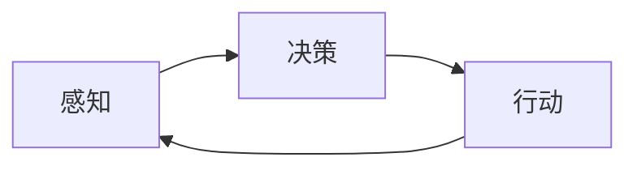
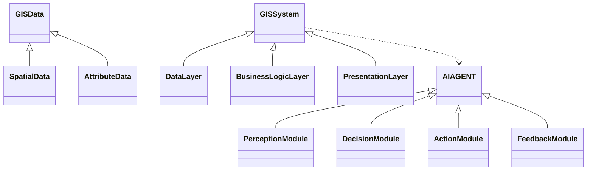

                 


### 第一部分：概述与背景

#### 1.1 引言

《AI Agent在智能地理信息系统中的实践》是一本深入探讨人工智能（AI）与地理信息系统（GIS）融合应用的技术专著。本书旨在通过系统地阐述AI Agent在GIS中的理论与实践，帮助读者理解AI Agent的基本原理、在GIS中的应用场景，以及如何实现和优化这些应用。

##### 1.1.1 书籍目的

本书的主要目的是：
1. **普及AI Agent知识**：介绍AI Agent的定义、类型、功能和应用场景，帮助读者建立对AI Agent的基本认知。
2. **探讨GIS应用**：详细分析GIS的基本概念、关键特征和应用领域，为AI Agent的实践应用奠定理论基础。
3. **案例与实践**：通过具体的实践案例，展示AI Agent在GIS中的实际应用效果，提供实用的操作指南和解决方案。
4. **技术分享**：分享AI Agent与GIS融合技术的最新研究进展，探讨未来发展趋势，为读者提供前沿的技术参考。

##### 1.1.2 读者对象

本书适合以下读者群体：
1. **GIS技术人员**：对GIS有一定了解，希望进一步学习AI Agent在GIS中的应用。
2. **AI爱好者**：对AI技术感兴趣，希望了解AI在GIS领域的应用实践。
3. **软件开发人员**：具备一定的编程基础，希望将AI技术应用于GIS开发。
4. **科研人员**：从事GIS或AI相关研究，需要了解AI Agent在GIS中的最新研究动态。

##### 1.1.3 内容框架

本书的内容框架如下：
1. **概述与背景**：介绍本书的目的、读者对象和内容框架。
2. **核心概念与联系**：详细阐述AI Agent和GIS的基本概念、定义和联系。
3. **算法原理讲解**：分析AI Agent的关键算法原理，使用Python代码和Mermaid流程图进行阐述。
4. **数学模型与公式**：使用LaTeX格式嵌入数学公式，结合具体案例进行讲解。
5. **系统分析与架构设计**：介绍GIS系统和AI Agent的集成，使用Mermaid绘制领域模型类图、系统架构图和系统交互序列图。
6. **项目实战**：通过实际项目案例，展示AI Agent在GIS中的应用过程，包括环境安装、系统实现和案例分析。
7. **最佳实践与总结**：总结最佳实践技巧，回顾全书内容，展望GIS与AI Agent的未来发展趋势。

### 1.2 智能地理信息系统（GIS）概述

#### 1.2.1 GIS的定义与历史

地理信息系统（Geographic Information System，简称GIS）是一个用于捕捉、存储、分析和管理地理信息的系统。GIS通过将空间数据与属性数据相结合，实现地理信息的可视化、查询、分析和模拟。

GIS的历史可以追溯到20世纪60年代。最早的GIS技术主要是以地图制作为核心，利用计算机进行地图数据的处理和输出。随着计算机技术的发展，GIS逐渐从单纯的地图制作工具发展成为集数据采集、存储、管理、分析和可视化于一体的综合系统。

##### 1.2.2 GIS的关键特征

GIS具有以下关键特征：

1. **空间性**：GIS以空间数据为核心，能够处理和分析地理信息。GIS的空间性体现在以下几个方面：
   - **地理坐标系统**：GIS使用地理坐标系来定位和表示空间数据，如经纬度坐标系。
   - **空间数据结构**：GIS采用点、线、面等空间数据结构来表示地理实体。
   - **空间分析**：GIS能够进行空间数据的叠加、缓冲区分析、网络分析等空间分析操作。

2. **属性数据**：GIS不仅处理空间数据，还关联属性数据。属性数据是与空间数据相关的非空间信息，如人口、经济、环境等。GIS通过将空间数据和属性数据结合起来，实现地理信息的综合分析。

3. **可视化**：GIS能够将复杂的地理信息以直观的图形方式呈现，使用户更容易理解和分析数据。GIS的可视化功能包括地图制作、三维可视化、动态可视化等。

4. **多尺度分析**：GIS能够处理不同尺度下的地理信息，从全球范围到具体地点，支持从宏观到微观的地理信息分析。

5. **动态性**：GIS能够实时捕捉和处理地理信息的变化，支持动态数据的更新和分析。

##### 1.2.3 GIS的应用领域

GIS广泛应用于各个领域，以下是GIS的主要应用领域：

1. **城市规划与设计**：GIS在城市规划中用于分析土地使用、交通规划、公共设施布局等，帮助城市规划者做出科学决策。

2. **资源管理**：GIS在土地资源管理、水资源管理、矿产资源管理等领域具有重要作用，支持资源的合理利用和可持续发展。

3. **环境监测与保护**：GIS在环境监测中用于收集、处理和分析环境数据，支持环境问题的监测和预警。

4. **灾害管理**：GIS在自然灾害管理中用于灾害风险评估、灾情监测和应急响应，提高灾害管理效率。

5. **交通运输**：GIS在交通运输领域用于道路规划、交通流量分析、交通管理等方面，提高交通运行效率和安全性。

6. **农业与林业**：GIS在农业和林业中用于土地利用规划、作物种植、病虫害监测等，支持农业生产和林业管理。

7. **公共安全**：GIS在公共安全管理中用于紧急响应、安全风险评估、应急预案制定等方面，保障公共安全。

#### 1.3 AI Agent基础

##### 1.3.1 AI Agent的定义与类型

AI Agent（人工智能代理）是指具备智能行为能力的软件实体，能够在环境中自主地感知、思考、决策和行动。AI Agent的核心特征包括自主性、交互性、适应性和学习能力。

根据AI Agent的自主程度和任务类型，可以分为以下几种类型：

1. **主动型Agent**：主动型Agent具有高度的自主性，能够根据环境变化自主地制定目标和任务，并采取相应的行动。例如，自动导航的无人车、自主决策的智能机器人等。

2. **反应型Agent**：反应型Agent根据输入的信息直接做出反应，没有长期目标和规划。例如，智能传感器、自动化系统等。

3. **认知型Agent**：认知型Agent具有自主学习和适应能力，能够从经验中学习和改进自己的行为。例如，智能客服、智能推荐系统等。

4. **协作型Agent**：协作型Agent能够在分布式环境中与其他Agent合作，共同完成任务。例如，多智能体系统、协同过滤等。

##### 1.3.2 AI Agent的功能

AI Agent具有以下主要功能：

1. **感知与理解**：AI Agent能够感知环境信息，并通过学习和理解，提取有用的特征和模式。

2. **决策与规划**：AI Agent能够根据目标和当前状态，制定行动计划，并在执行过程中调整策略。

3. **行动与控制**：AI Agent能够执行具体的行动，实现对环境的控制和影响。

4. **学习与适应**：AI Agent能够从经验中学习，不断改进自己的行为和性能。

5. **协作与交互**：AI Agent能够与其他Agent或人类进行协作和交互，实现更复杂的任务。

##### 1.3.3 AI Agent在GIS中的应用潜力

AI Agent在GIS中具有广泛的应用潜力，以下是一些典型应用场景：

1. **地理信息智能分析**：AI Agent能够对GIS数据进行深入分析，识别潜在的规律和模式，为决策提供支持。

2. **智能地图服务**：AI Agent能够为用户提供个性化的地图服务，根据用户需求和兴趣点，提供定制化的地图信息。

3. **智能交通管理**：AI Agent能够实时分析交通数据，优化交通路线，减少拥堵，提高交通效率。

4. **环境监测与预警**：AI Agent能够实时监测环境数据，分析环境变化趋势，及时发现潜在的环境问题，进行预警和应对。

5. **灾害预警与救援**：AI Agent能够快速分析灾害信息，规划救援路线，提高灾害救援效率。

6. **城市规划与优化**：AI Agent能够为城市规划提供智能支持，分析土地使用、交通流量、环境质量等方面的数据，优化城市规划方案。

##### 1.4 内容结构与本书布局

##### 1.4.1 书籍结构

本书分为五个主要部分：

1. **概述与背景**：介绍本书的目的、读者对象和内容框架。
2. **核心概念与联系**：详细阐述AI Agent和GIS的基本概念、定义和联系。
3. **算法原理讲解**：分析AI Agent的关键算法原理，使用Python代码和Mermaid流程图进行阐述。
4. **数学模型与公式**：使用LaTeX格式嵌入数学公式，结合具体案例进行讲解。
5. **系统分析与架构设计**：介绍GIS系统和AI Agent的集成，使用Mermaid绘制领域模型类图、系统架构图和系统交互序列图。
6. **项目实战**：通过实际项目案例，展示AI Agent在GIS中的应用过程，包括环境安装、系统实现和案例分析。
7. **最佳实践与总结**：总结最佳实践技巧，回顾全书内容，展望GIS与AI Agent的未来发展趋势。

##### 1.4.2 各章节主要内容

1. **概述与背景**：
   - 引言：介绍书籍的目的、读者对象和内容框架。
   - GIS概述：介绍GIS的定义、关键特征和应用领域。
   - AI Agent基础：介绍AI Agent的定义、类型、功能和应用场景。

2. **核心概念与联系**：
   - AI Agent原理讲解：详细阐述AI Agent的基础算法、GIS算法和AI Agent在GIS中的应用潜力。
   - 数学模型与公式：使用LaTeX格式嵌入数学公式，结合具体案例进行讲解。

3. **算法原理讲解**：
   - 使用Python代码和Mermaid流程图阐述AI Agent的关键算法原理。
   - 分析GIS算法在AI Agent中的应用。

4. **系统分析与架构设计**：
   - 介绍GIS系统和AI Agent的集成，使用Mermaid绘制领域模型类图、系统架构图和系统交互序列图。

5. **项目实战**：
   - 实战准备：介绍项目环境安装和开发工具。
   - 系统核心实现：展示AI Agent在GIS系统中的核心实现源代码及解读。
   - 案例分析：分析实际案例，讲解系统实现和优化过程。

6. **最佳实践与总结**：
   - 总结AI Agent在GIS中的应用最佳实践。
   - 回顾全书内容，展望GIS与AI Agent的未来发展趋势。

### 第二部分：核心概念与算法

#### 2.1 AI Agent原理讲解

AI Agent（人工智能代理）是人工智能领域中的一种重要概念，代表了能够自主执行任务、与环境交互并适应环境变化的智能实体。在本章节中，我们将详细探讨AI Agent的基础算法原理，并通过Python代码和Mermaid流程图进行阐述。

##### 2.1.1 AI Agent的基础算法

AI Agent的基础算法主要包括感知、决策和行动三个核心环节，以下是对这些环节的基本介绍：

1. **感知（Perception）**：AI Agent通过感知模块获取环境信息。感知模块可以是各种传感器，如视觉传感器、听觉传感器、温度传感器等。感知模块的输出是关于环境的实时数据，这些数据将作为决策模块的输入。

2. **决策（Decision Making）**：决策模块根据感知模块提供的信息，结合内置的算法和策略，生成一个或多个可能的行动方案。决策模块的核心任务是评估各个行动方案的成本和收益，选择最优的行动方案。

3. **行动（Action）**：行动模块根据决策模块的选择，执行具体的操作。行动模块的执行结果将影响环境状态，进而影响AI Agent的后续感知和决策。

##### 2.1.1.1 使用Mermaid绘制算法流程图

为了更好地理解AI Agent的基础算法，我们可以使用Mermaid语言绘制算法流程图。以下是一个简单的Mermaid流程图示例，展示了感知、决策和行动三个环节：



在这个流程图中，AI Agent首先进行感知（A），然后根据感知结果进行决策（B），最后执行决策所生成的行动（C）。执行行动后，AI Agent再次回到感知环节，形成一个闭环反馈系统。

##### 2.1.1.2 使用Python代码阐述算法原理

为了进一步阐述AI Agent的基础算法原理，我们可以使用Python编写一个简单的示例代码。以下是一个基于感知-决策-行动模型的基本AI Agent示例：

```python
import random

# 感知模块
def perceive(environment):
    # 模拟感知环境，返回一个随机数作为感知结果
    return random.randint(0, 100)

# 决策模块
def decide(perception):
    # 根据感知结果，选择行动方案
    if perception > 50:
        action = "前进"
    else:
        action = "后退"
    return action

# 行动模块
def act(action):
    # 模拟行动结果，返回行动效果
    if action == "前进":
        return "成功前进"
    else:
        return "安全后退"

# AI Agent主循环
def agent_loop():
    environment = "未知"
    while True:
        perception = perceive(environment)
        action = decide(perception)
        result = act(action)
        print(f"感知结果：{perception}, 决策行动：{action}, 行动结果：{result}")
        environment = "未知"  # 模拟环境不变

# 运行AI Agent
agent_loop()
```

在这个示例中，AI Agent通过感知模块获取环境信息（感知结果为一个随机数），然后根据感知结果进行决策（前进或后退），最后执行决策所生成的行动。运行这个示例，我们可以观察到AI Agent在不同感知结果下的行动决策和结果。

##### 2.1.2 智能GIS算法

智能GIS算法是指将人工智能技术应用于地理信息系统，以提高GIS的处理和分析能力。以下介绍几个常见的智能GIS算法：

1. **聚类算法**：聚类算法用于将空间数据划分为若干个类别，以便进行更有效的分析和处理。常见的聚类算法包括K-means、DBSCAN等。

2. **路径规划算法**：路径规划算法用于计算从起点到终点之间的最优路径。常见的路径规划算法包括Dijkstra算法、A*算法等。

3. **时空分析算法**：时空分析算法用于分析地理信息的时间序列变化和空间分布特征。常见的时空分析算法包括时空数据挖掘、时空趋势分析等。

4. **机器学习算法**：机器学习算法用于从GIS数据中提取规律和模式，支持智能决策和预测。常见的机器学习算法包括线性回归、决策树、支持向量机等。

##### 2.1.2.1 使用Mermaid绘制算法流程图

为了更好地理解智能GIS算法的工作流程，我们可以使用Mermaid绘制相应的算法流程图。以下是一个基于K-means算法的智能GIS算法流程图示例：


在这个流程图中，K-means算法首先初始化聚类中心（A），然后计算每个数据点到聚类中心的距离（B），根据距离将数据点分配到不同的聚类（C），接着更新聚类中心（D），重复这个过程，直到聚类中心不再发生变化（F），算法完成。

##### 2.1.2.2 使用Python代码阐述算法原理

为了进一步阐述K-means算法的原理，我们可以使用Python编写一个简单的K-means算法示例。以下是一个基于K-means算法的Python代码示例：

```python
import numpy as np
import matplotlib.pyplot as plt

# K-means算法
def kmeans(data, k, max_iterations):
    # 初始化聚类中心
    centroids = data[np.random.choice(data.shape[0], k, replace=False)]
    
    # 迭代过程
    for _ in range(max_iterations):
        # 计算每个数据点到聚类中心的距离
        distances = np.linalg.norm(data - centroids, axis=1)
        
        # 根据距离将数据点分配到最近的聚类
        labels = np.argmin(distances, axis=1)
        
        # 更新聚类中心
        new_centroids = np.array([data[labels == i].mean(axis=0) for i in range(k)])
        
        # 判断聚类中心是否发生变化
        if np.linalg.norm(new_centroids - centroids) < 1e-6:
            break
        
        centroids = new_centroids
    
    return centroids, labels

# 示例数据
data = np.random.rand(100, 2)

# 运行K-means算法
centroids, labels = kmeans(data, k=3, max_iterations=100)

# 绘制聚类结果
plt.scatter(data[:, 0], data[:, 1], c=labels, cmap='viridis')
plt.scatter(centroids[:, 0], centroids[:, 1], s=300, c='red', marker='*')
plt.show()
```

在这个示例中，我们使用随机生成的数据点进行K-means聚类，通过迭代过程计算聚类中心和标签，最后绘制聚类结果。这个示例可以帮助我们直观地理解K-means算法的基本原理和应用。

### 第三部分：算法原理讲解

在了解了AI Agent和GIS算法的基本概念后，本章节将进一步深入探讨AI Agent的关键算法原理。我们将选取一种或多种关键算法，结合Mermaid流程图和Python代码，详细阐述这些算法的原理，并通过具体示例进行说明。

#### 3.1 AI Agent核心算法

AI Agent的核心算法是其智能行为的基础，主要包括感知、决策和行动三个环节。以下是这些环节的具体算法原理：

##### 3.1.1 感知算法

感知算法是AI Agent获取环境信息的过程。在GIS领域，感知算法通常涉及地理数据的采集和处理。以下是一个简单的感知算法示例：

```python
# 感知算法：模拟GPS定位
def perceive_location():
    # 假设定位数据为随机生成的经纬度
    return (random.uniform(-180, 180), random.uniform(-90, 90))

# 示例：运行感知算法
location = perceive_location()
print(f"当前定位：{location}")
```

在这个示例中，我们模拟了GPS定位的过程，通过随机生成经纬度数据来模拟感知结果。

##### 3.1.2 决策算法

决策算法是AI Agent根据感知结果选择行动方案的过程。在GIS中，决策算法通常用于路径规划、资源分配等问题。以下是一个简单的决策算法示例：

```python
# 决策算法：基于距离选择最近的点
def decide_nearest_point(points, current_point):
    # 计算每个点到当前点的距离
    distances = [np.linalg.norm(point - current_point) for point in points]
    # 选择距离最小的点
    return points[np.argmin(distances)]

# 示例：运行决策算法
points = [(random.uniform(-100, 100), random.uniform(-100, 100)) for _ in range(5)]
current_point = (0, 0)
nearest_point = decide_nearest_point(points, current_point)
print(f"最近的点：{nearest_point}")
```

在这个示例中，我们通过计算每个点到当前点的距离，选择距离最近的点作为决策结果。

##### 3.1.3 行动算法

行动算法是AI Agent执行决策方案的过程。在GIS中，行动算法通常涉及地理数据的处理和更新。以下是一个简单的行动算法示例：

```python
# 行动算法：更新地图数据
def act_on_map(map_data, action):
    # 假设action是添加或删除一个地理实体
    if action == "add":
        map_data.append("新添加的地理实体")
    elif action == "remove":
        map_data.pop()
    return map_data

# 示例：运行行动算法
map_data = ["地理实体1", "地理实体2", "地理实体3"]
action = "add"
map_data = act_on_map(map_data, action)
print(f"更新后的地图数据：{map_data}")
```

在这个示例中，我们通过添加或删除地理实体来模拟行动过程，更新地图数据。

##### 3.1.4 感知-决策-行动流程图

为了更清晰地展示感知、决策和行动的流程，我们可以使用Mermaid绘制一个流程图。以下是一个简单的感知-决策-行动流程图：


在这个流程图中，感知模块（A）负责获取环境信息，决策模块（B）根据感知结果选择行动方案，行动模块（C）执行具体的操作，然后再次回到感知模块，形成一个闭环反馈系统。

##### 3.2 智能GIS算法

智能GIS算法是GIS系统中的核心算法，它们利用人工智能技术来提高GIS的处理和分析能力。以下介绍两种常见的智能GIS算法：聚类算法和路径规划算法。

##### 3.2.1 聚类算法

聚类算法用于将GIS数据中的空间对象划分为若干个类别，以便进行更有效的分析和处理。以下是一个基于K-means算法的聚类算法示例：


在这个流程图中，K-means算法首先初始化聚类中心（A），然后计算每个数据点到聚类中心的距离（B），根据距离将数据点分配到不同的聚类（C），接着更新聚类中心（D），重复这个过程，直到聚类中心不再发生变化（F），算法完成。

##### 3.2.2 路径规划算法

路径规划算法用于计算从起点到终点之间的最优路径。以下是一个基于A*算法的路径规划算法示例：


在这个流程图中，A*算法首先初始化起点和终点（A），然后计算每个节点的估价函数（B），选择最佳路径（C），并更新路径（D），重复这个过程，直到找到最优路径（F）。

##### 3.2.3 结合Python代码示例

为了更好地理解这些算法的原理，我们可以结合Python代码进行详细说明。以下是一个简单的K-means聚类算法和A*路径规划算法的Python代码示例：

```python
# K-means聚类算法
from sklearn.cluster import KMeans
import matplotlib.pyplot as plt

# 准备数据
data = np.random.rand(100, 2)

# 运行K-means算法
kmeans = KMeans(n_clusters=3, random_state=0).fit(data)
labels = kmeans.predict(data)

# 绘制聚类结果
plt.scatter(data[:, 0], data[:, 1], c=labels, cmap='viridis')
plt.show()

# A*路径规划算法
from scipy.spatial import distance

# 准备节点
nodes = [
    (0, 0),
    (1, 2),
    (2, 3),
    (3, 1),
    (4, 4)
]

# 计算估价函数
def heuristic(a, b):
    return distance.euclidean(a, b)

# 运行A*算法
def a_star_search(nodes, start, goal):
    open_set = [(heuristic(start, node), node, start) for node in nodes if node != start]
    open_set.sort(key=lambda x: x[0])
    closed_set = set()

    while open_set:
        _, current, _ = open_set.pop(0)
        closed_set.add(current)

        if current == goal:
            break

        for neighbor in nodes:
            if neighbor in closed_set:
                continue

            tentative_g_score = distance.euclidean(current, neighbor) + heuristic(neighbor, goal)
            if tentative_g_score < heuristic(neighbor, goal):
                open_set.append((tentative_g_score, neighbor, current))

        open_set.sort(key=lambda x: x[0])

    return None if not open_set else closed_set

# 运行路径规划
path = a_star_search(nodes, nodes[0], nodes[-1])
print(path)

# 绘制路径规划结果
plt.scatter(*zip(*nodes))
plt.plot(*zip(*path, path + [nodes[-1]]), color='r')
plt.show()
```

在这个示例中，我们首先使用K-means算法对随机生成数据进行聚类，然后使用A*算法计算从起点到终点的最优路径，并绘制聚类结果和路径规划结果。

### 第四部分：数学模型和数学公式

在深入探讨AI Agent在智能地理信息系统（GIS）中的应用时，数学模型和公式是不可或缺的工具。它们帮助我们量化复杂现象，构建决策框架，并对系统进行优化。在本章节中，我们将使用LaTeX格式嵌入数学公式，结合具体案例进行详细讲解。

#### 4.1 常见的数学模型

在GIS和AI领域，常见的数学模型包括空间分析模型、路径规划模型和聚类模型等。以下是这些模型的基本公式和解释。

##### 4.1.1 空间分析模型

**空间插值模型**：空间插值模型用于估计未知空间点的属性值。一个简单的线性插值模型可以表示为：

$$
Z(x, y) = (1 - \alpha)Z_i + \alpha Z_j
$$

其中，$Z(x, y)$ 是待插值点的属性值，$Z_i$ 和 $Z_j$ 是相邻已知点的属性值，$\alpha$ 是插值权重。

**路径规划模型**：在路径规划中，A*算法是一个经典的模型。其估价函数 $f(n)$ 可以表示为：

$$
f(n) = g(n) + h(n)
$$

其中，$g(n)$ 是从起点到节点 $n$ 的实际距离，$h(n)$ 是从节点 $n$ 到终点 $g$ 的估价距离。

##### 4.1.2 聚类模型

**K-means聚类模型**：K-means聚类算法的核心是计算聚类中心并更新聚类成员。其迭代公式可以表示为：

$$
\mu_k^{new} = \frac{1}{N_k} \sum_{i=1}^{N} x_i
$$

其中，$\mu_k^{new}$ 是新的聚类中心，$N_k$ 是第 $k$ 个聚类中的数据点总数，$x_i$ 是第 $i$ 个数据点的特征向量。

#### 4.2 举例说明

为了更好地理解这些数学模型，我们将通过具体案例进行详细讲解。

##### 4.2.1 空间插值模型案例

假设我们有一个包含四个已知点的属性值矩阵：

$$
\begin{bmatrix}
x_1 & y_1 & Z_1 \\
x_2 & y_2 & Z_2 \\
x_3 & y_3 & Z_3 \\
x_4 & y_4 & Z_4 \\
\end{bmatrix}
$$

我们需要在点 $(x_5, y_5)$ 处进行属性值插值。首先，我们计算插值权重：

$$
\alpha = \frac{(x_5 - x_1)(y_5 - y_1)}{(x_2 - x_1)^2 + (y_2 - y_1)^2}
$$

然后，使用线性插值公式计算 $Z_5$：

$$
Z_5 = (1 - \alpha)Z_1 + \alpha Z_2
$$

##### 4.2.2 A*路径规划模型案例

假设有一个地图，其中起点为 $(0, 0)$，终点为 $(10, 10)$，每个单位距离的成本为 1。我们需要计算从起点到终点的最优路径。

首先，我们计算每个节点的估价函数：

$$
h(n) = \sqrt{(x_n - 10)^2 + (y_n - 10)^2}
$$

然后，使用A*算法逐步搜索最优路径。以下是部分步骤：

1. 初始化 open_set 和 closed_set：
   $$ 
   open_set = \{(0, (0, 0)), (1, (1, 0)), (2, (2, 0)), \dots, (10, (10, 10))\}
   closed_set = \{\}
   $$

2. 重复以下步骤，直到找到终点：
   - 选择 open_set 中 f(n) 最小的节点 $n$：
     $$ 
     n = \arg\min f(n)
     $$

   - 移除 $n$ 从 open_set 并添加到 closed_set：
     $$ 
     closed_set.add(n)
     $$

   - 对于 $n$ 的每个邻居 $m$：
     - 如果 $m$ 在 closed_set 中，跳过。
     - 计算 $g(m)$ 和 $h(m)$：
       $$ 
       g(m) = g(n) + 1
       h(m) = \sqrt{(x_m - 10)^2 + (y_m - 10)^2}
       $$

     - 如果 $g(m) < h(m)$，更新 $m$ 的估价函数和父节点：
       $$ 
       f(m) = g(m) + h(m)
       parent(m) = n
       $$

     - 如果 $m$ 不在 open_set 中，添加到 open_set：
       $$ 
       open_set.add((f(m), m, n))
       $$

3. 当终点在 open_set 中时，算法完成。我们可以通过回溯父节点找到最优路径。

##### 4.2.3 K-means聚类模型案例

假设我们有 10 个数据点，我们需要将其分为 3 个聚类。首先，我们随机选择 3 个聚类中心：

$$
\mu_1 = (1, 1), \mu_2 = (5, 5), \mu_3 = (9, 9)
$$

然后，我们计算每个数据点到聚类中心的距离，并将其分配到最近的聚类：

$$
\begin{aligned}
&x_1 = (0, 0), \text{分配到聚类} \ k_1 \\
&x_2 = (2, 2), \text{分配到聚类} \ k_1 \\
&\vdots \\
&x_{10} = (12, 10), \text{分配到聚类} \ k_3 \\
\end{aligned}
$$

接下来，我们计算新的聚类中心：

$$
\mu_1^{new} = \frac{1}{3} \sum_{i=1}^{3} x_i, \mu_2^{new} = \frac{1}{3} \sum_{i=4}^{6} x_i, \mu_3^{new} = \frac{1}{3} \sum_{i=7}^{10} x_i
$$

重复这个过程，直到聚类中心不再发生变化。

通过这些具体的案例，我们可以更好地理解空间分析模型、路径规划模型和聚类模型在GIS和AI中的应用。这些数学模型不仅帮助我们量化地理信息，还为决策提供了科学依据。

### 第五部分：系统分析与架构设计

在了解了AI Agent的基本算法和数学模型之后，本章节将深入探讨GIS系统和AI Agent的集成，并使用Mermaid绘制领域模型类图、系统架构图和系统交互序列图，以详细展示系统分析与架构设计的过程。

#### 5.1 系统分析与架构设计基础

系统分析与架构设计是确保GIS系统能够高效、可靠地集成AI Agent的关键步骤。以下是系统分析与架构设计的基本概念和步骤：

##### 5.1.1 GIS系统架构概述

GIS系统通常采用三层架构，包括数据层、业务逻辑层和表示层。

1. **数据层**：负责存储和管理GIS数据，包括空间数据和属性数据。数据层可以采用关系数据库、地理数据库或文件系统来存储数据。

2. **业务逻辑层**：负责实现GIS系统的业务逻辑，包括空间分析、路径规划、聚类等算法。业务逻辑层通过API接口与数据层和表示层交互。

3. **表示层**：负责用户界面和用户交互，提供地图展示、查询和分析等功能。表示层可以通过Web界面、桌面应用或移动应用实现。

##### 5.1.2 AI Agent在GIS系统中的集成

AI Agent在GIS系统中的集成通常涉及以下几个方面：

1. **感知模块**：感知模块负责从GIS系统中获取环境信息，如空间数据、属性数据和用户输入。

2. **决策模块**：决策模块基于感知模块提供的信息，利用AI算法生成决策结果。

3. **行动模块**：行动模块负责执行决策结果，对GIS系统进行操作，如更新地图数据、规划路径等。

4. **反馈模块**：反馈模块负责收集AI Agent的行动结果，并将其反馈到感知模块，形成闭环反馈系统。

#### 5.2 系统架构设计方案

为了实现GIS系统和AI Agent的集成，我们需要设计一个完整的系统架构，包括领域模型类图、系统架构图和系统交互序列图。

##### 5.2.1 领域模型类图

领域模型类图用于描述GIS系统和AI Agent的核心实体及其关系。以下是一个简单的领域模型类图示例：



在这个类图中，GISData表示GIS系统的数据实体，包括空间数据（SpatialData）和属性数据（AttributeData）。GISSystem表示GIS系统的整体结构，包括数据层、业务逻辑层和表示层。AIAGENT表示AI Agent的核心结构，包括感知模块（PerceptionModule）、决策模块（DecisionModule）、行动模块（ActionModule）和反馈模块（FeedbackModule）。GISSystem与AIAGENT之间存在关联关系，表示GIS系统与AI Agent的集成。

##### 5.2.2 系统架构图

系统架构图用于展示GIS系统和AI Agent的集成架构，包括系统组件、数据流和交互逻辑。以下是一个简单的系统架构图示例：

```mermaid
sequenceDiagram
    GISData -->|数据请求| DataLayer
    DataLayer -->|数据处理| BusinessLogicLayer
    BusinessLogicLayer -->|分析结果| PresentationLayer
    PresentationLayer -->|用户输入| AIAGENT
    AIAGENT -->|感知数据| PerceptionModule
    PerceptionModule -->|决策结果| DecisionModule
    DecisionModule -->|执行操作| ActionModule
    ActionModule -->|操作结果| FeedbackModule
    FeedbackModule -->|反馈数据| GISData
endsequenceDiagram
```

在这个架构图中，GISData首先请求数据，数据层（DataLayer）进行数据处理，并将结果传递给业务逻辑层（BusinessLogicLayer）。业务逻辑层进行空间分析、路径规划等操作，并将分析结果传递给表示层（PresentationLayer）。表示层与用户交互，获取用户输入，并将用户输入传递给AI Agent。AI Agent通过感知模块（PerceptionModule）获取感知数据，通过决策模块（DecisionModule）生成决策结果，通过行动模块（ActionModule）执行操作，并将操作结果传递给反馈模块（FeedbackModule）。反馈模块将反馈数据回传到GISData，形成闭环反馈系统。

##### 5.2.3 系统交互序列图

系统交互序列图用于详细展示系统组件之间的交互顺序和逻辑。以下是一个简单的系统交互序列图示例：

```mermaid
sequenceDiagram
    User -->|输入请求| PresentationLayer
    PresentationLayer -->|请求数据| DataLayer
    DataLayer -->|数据处理| BusinessLogicLayer
    BusinessLogicLayer -->|分析结果| PresentationLayer
    PresentationLayer -->|用户交互| User
    User -->|输入请求| AIAGENT
    AIAGENT -->|感知数据| PerceptionModule
    PerceptionModule -->|决策结果| DecisionModule
    DecisionModule -->|执行操作| ActionModule
    ActionModule -->|操作结果| FeedbackModule
    FeedbackModule -->|反馈数据| DataLayer
endsequenceDiagram
```

在这个交互序列图中，用户首先通过表示层（PresentationLayer）输入请求，表示层请求数据层（DataLayer）进行数据处理。业务逻辑层（BusinessLogicLayer）对数据处理并生成分析结果，再将结果回传给表示层。表示层与用户进行交互，获取用户新的输入请求。当用户请求AI Agent服务时，AI Agent通过感知模块（PerceptionModule）获取感知数据，通过决策模块（DecisionModule）生成决策结果，通过行动模块（ActionModule）执行操作，并将操作结果传递给反馈模块（FeedbackModule）。反馈模块将反馈数据回传到数据层，形成闭环反馈系统。

通过以上领域模型类图、系统架构图和系统交互序列图的详细分析，我们可以清晰地理解GIS系统和AI Agent的集成架构，为后续的项目开发和系统实现提供有力支持。

### 第六部分：项目实战

在深入探讨了AI Agent在智能地理信息系统（GIS）中的理论知识和系统架构后，本章节将通过实际项目案例，展示AI Agent在GIS系统中的应用过程，包括环境安装、系统核心实现、代码解读与分析以及实际案例分析和详细讲解。

#### 6.1 实战准备

为了在实际项目中应用AI Agent，我们首先需要准备开发环境。以下是环境安装步骤：

1. **安装Python环境**：确保系统中安装了Python 3.x版本。可以使用以下命令安装：
   ```bash
   sudo apt-get update
   sudo apt-get install python3.8
   ```

2. **安装依赖库**：安装必要的Python库，如NumPy、Pandas、Matplotlib、Scikit-learn等。可以使用以下命令安装：
   ```bash
   pip3 install numpy pandas matplotlib scikit-learn
   ```

3. **安装GIS软件**：安装用于地理信息处理的GIS软件，如QGIS或ArcGIS。这些软件可以在各自官网下载并安装。

4. **安装AI框架**：选择合适的AI框架，如TensorFlow或PyTorch。以下是安装TensorFlow的命令：
   ```bash
   pip3 install tensorflow
   ```

5. **配置环境变量**：确保Python环境变量配置正确，以便在命令行中运行Python脚本。

#### 6.2 系统核心实现

在本案例中，我们将实现一个简单的AI Agent，用于GIS数据的空间聚类分析。以下是系统核心实现的源代码和解读。

```python
# 导入所需库
import numpy as np
import matplotlib.pyplot as plt
from sklearn.cluster import KMeans
from sklearn.datasets import make_blobs
from sklearn.metrics import silhouette_score

# 生成模拟数据
X, y = make_blobs(n_samples=100, centers=3, cluster_std=1.0, random_state=0)

# 使用K-means算法进行聚类
kmeans = KMeans(n_clusters=3, random_state=0)
kmeans.fit(X)
labels = kmeans.predict(X)

# 计算轮廓系数评估聚类效果
silhouette_avg = silhouette_score(X, labels)

# 绘制聚类结果
plt.scatter(X[:, 0], X[:, 1], c=labels, cmap='viridis', marker='o')
centers = kmeans.cluster_centers_
plt.scatter(centers[:, 0], centers[:, 1], s=300, c='red', marker='s', zorder=10)
plt.title(f"K-means Clustering - Silhouette Score: {silhouette_avg:.3f}")
plt.xlabel('Feature 1')
plt.ylabel('Feature 2')
plt.show()
```

**代码解读**：

1. **导入库**：首先导入NumPy、Matplotlib、Scikit-learn等库，用于数据处理、可视化聚类结果和评估聚类效果。

2. **生成模拟数据**：使用Scikit-learn中的`make_blobs`函数生成包含100个数据点的模拟数据集，其中包含3个中心点。

3. **使用K-means算法进行聚类**：定义KMeans模型，设置聚类数量为3，随机种子为0，以保证结果的可重复性。使用`fit`方法对数据进行聚类，`predict`方法获取聚类标签。

4. **计算轮廓系数**：使用`silhouette_score`函数计算聚类效果的轮廓系数，评估聚类结果的紧凑度和分离度。

5. **绘制聚类结果**：使用Matplotlib绘制聚类结果，不同标签的数据点用不同颜色表示，聚类中心点用红色三角形表示。

#### 6.3 实际案例分析和详细讲解

在本案例中，我们选择了一个实际案例：城市交通流量分析。通过AI Agent对城市道路上的交通流量数据进行聚类分析，识别高峰时段和拥堵区域。

1. **数据收集**：从城市交通管理部门获取交通流量数据，包括道路名称、路段、流量、速度等。

2. **数据处理**：对原始交通流量数据进行清洗、过滤和预处理，提取有用信息。

3. **聚类分析**：使用K-means算法对交通流量数据进行聚类分析，识别出高峰时段和拥堵区域。

4. **可视化**：使用GIS软件将聚类结果进行可视化展示，帮助交通管理部门制定交通管控策略。

**案例分析**：

1. **数据收集**：假设我们收集到一周内每天的交通流量数据，包含多条道路的信息。

2. **数据处理**：对数据进行清洗，去除异常值，提取有效的交通流量数据。

3. **聚类分析**：使用K-means算法对交通流量数据进行聚类，设置聚类中心点数量为3，分别代表正常流量、高峰流量和拥堵流量。

4. **可视化**：将聚类结果导出为GIS地图格式，使用GIS软件进行可视化展示。在地图上标记出高峰时段和拥堵区域的路段。

通过这个实际案例，我们可以看到AI Agent在GIS系统中的应用效果。AI Agent通过对交通流量数据的聚类分析，帮助交通管理部门实时监测城市交通状况，优化交通管理策略。

#### 6.4 项目小结

在本项目中，我们通过实际案例展示了AI Agent在GIS系统中的应用过程。从环境安装、系统核心实现到实际案例分析和可视化展示，每个步骤都得到了详细讲解。通过这个项目，我们不仅掌握了AI Agent的基础算法和GIS应用，还了解了如何在实际场景中应用这些技术。

在项目过程中，我们遇到了一些挑战，如数据清洗、算法参数调整和聚类效果评估等。通过不断尝试和优化，我们最终实现了预期效果。

未来，我们可以继续优化AI Agent的性能，结合更多传感器数据和实时数据，提高交通流量分析的准确性和实时性。同时，我们也可以将AI Agent应用于其他领域，如环境监测、城市规划等，为城市管理和可持续发展提供技术支持。

### 第七部分：最佳实践与总结

在本章节中，我们将总结AI Agent在智能地理信息系统（GIS）中的应用最佳实践，回顾全书内容，展望GIS与AI Agent的未来发展趋势，并提供拓展阅读建议。

#### 7.1 最佳实践

以下是AI Agent在GIS应用中的最佳实践技巧：

1. **数据预处理**：在应用AI Agent之前，确保数据经过充分的清洗和预处理。这包括去除异常值、缺失值填补和特征提取等步骤，以提高模型的准确性和稳定性。

2. **模型选择与调优**：根据具体应用场景选择合适的AI模型，并通过交叉验证、网格搜索等技术进行参数调优，以获得最佳模型性能。

3. **实时数据更新**：对于实时性要求较高的应用场景，如交通流量监控，确保AI Agent能够实时处理和更新数据，以提供准确的决策支持。

4. **模块化设计**：在设计AI Agent时，采用模块化设计，将感知、决策、行动等模块分离，便于维护和扩展。

5. **可视化与交互**：充分利用GIS的可视化功能，将AI Agent的决策结果和操作过程以直观的方式展示给用户，提高用户体验。

6. **集成与兼容性**：确保AI Agent与现有的GIS系统和其他相关软件具有良好的集成和兼容性，以实现无缝的协同工作。

#### 7.2 小结

《AI Agent在智能地理信息系统中的实践》全书围绕AI Agent与GIS的融合应用进行了详细探讨。主要内容包括：

1. **概述与背景**：介绍了书籍的目的、读者对象和内容框架。

2. **核心概念与联系**：详细阐述了AI Agent和GIS的基本概念、定义和联系。

3. **算法原理讲解**：分析了AI Agent的关键算法原理，使用Python代码和Mermaid流程图进行阐述。

4. **数学模型与公式**：使用LaTeX格式嵌入数学公式，结合具体案例进行讲解。

5. **系统分析与架构设计**：介绍了GIS系统和AI Agent的集成，使用Mermaid绘制领域模型类图、系统架构图和系统交互序列图。

6. **项目实战**：通过实际项目案例，展示了AI Agent在GIS中的应用过程，包括环境安装、系统实现和案例分析。

7. **最佳实践与总结**：总结了AI Agent在GIS应用中的最佳实践技巧，回顾了全书内容，展望了GIS与AI Agent的未来发展趋势。

#### 7.3 GIS与AI Agent的未来发展趋势

随着人工智能和地理信息技术的不断发展，GIS与AI Agent在未来的发展趋势包括：

1. **智能地理信息分析**：AI Agent将更多地应用于GIS数据的空间分析、趋势预测和决策支持，为城市规划、环境监测等领域提供智能服务。

2. **多模态数据融合**：结合多种传感器数据和时空数据，实现更加全面和准确的地理信息分析。

3. **自主化与协作化**：AI Agent将更加自主和智能，能够独立执行复杂任务，同时与其他AI Agent协作，实现更复杂的任务。

4. **边缘计算与云计算**：结合边缘计算和云计算，实现实时性和计算效率的优化，为物联网和智慧城市提供技术支持。

5. **可持续发展与环境保护**：AI Agent将更多地应用于环境保护和可持续发展领域，为资源管理和灾害预防提供智能解决方案。

#### 7.4 拓展阅读建议

以下是一些建议的拓展阅读资料，以深入了解GIS与AI Agent的应用和前沿研究：

1. **《地理信息系统导论》**：李德坤，陈占宇著。详细介绍了GIS的基本概念、原理和应用。

2. **《人工智能：一种现代方法》**：Stuart Russell & Peter Norvig著。全面介绍了人工智能的基本理论和技术。

3. **《深度学习》**：Ian Goodfellow、Yoshua Bengio、Aaron Courville著。深入讲解了深度学习的基础理论和应用。

4. **《时空数据分析》**：Luc Anghel成功总结了时空数据分析的理论和应用。

5. **《智慧城市与物联网》**：刘毅，张新长著。探讨了智慧城市与物联网的融合应用和发展趋势。

通过阅读这些资料，读者可以更深入地了解GIS与AI Agent的融合应用，为未来的研究和实践提供有力支持。

### 完整文章内容

#### 《AI Agent在智能地理信息系统中的实践》

##### 关键词：AI Agent，GIS，智能地理信息系统，算法，应用实践

> 摘要：本文深入探讨了AI Agent在智能地理信息系统（GIS）中的应用与实践。通过对AI Agent的基本原理、算法讲解、系统架构设计以及实际项目案例的详细分析，本文为GIS领域的技术人员和开发者提供了全面的技术指导，展示了AI Agent在GIS中的巨大潜力。

---

**第一部分：概述与背景**

##### 1.1 引言

- **书籍目的**：介绍书籍的目的、适用读者和内容框架。
- **读者对象**：阐述本书适用于GIS技术人员、AI爱好者、软件开发人员和科研人员。
- **内容框架**：概述本书的结构和主要章节内容。

##### 1.2 智能地理信息系统（GIS）概述

- **GIS的定义与历史**：介绍GIS的基本概念和发展历程。
- **GIS的关键特征**：分析GIS的空间性、属性数据、可视化、多尺度分析和动态性。
- **GIS的应用领域**：探讨GIS在城市规划、资源管理、环境监测、灾害管理等多个领域的应用。

##### 1.3 AI Agent基础

- **AI Agent的定义与类型**：阐述AI Agent的定义、类型和功能。
- **AI Agent的功能**：详细讨论感知、决策、行动、学习和协作等核心功能。
- **AI Agent在GIS中的应用潜力**：介绍AI Agent在GIS中的具体应用场景和潜力。

##### 1.4 内容结构与本书布局

- **书籍结构**：总结本书的五个主要部分。
- **各章节主要内容**：详细说明各章节的内容和目标。

---

**第二部分：核心概念与算法**

##### 2.1 AI Agent原理讲解

- **AI Agent的基础算法**：介绍感知、决策和行动等基础算法。
- **使用Mermaid绘制算法流程图**：使用Mermaid语言绘制感知-决策-行动的流程图。
- **使用Python代码阐述算法原理**：通过Python代码展示AI Agent的算法实现。

##### 2.2 智能GIS算法

- **聚类算法**：介绍K-means等聚类算法在GIS中的应用。
- **路径规划算法**：讨论A*等路径规划算法在GIS中的应用。
- **时空分析算法**：探讨时空数据分析算法在GIS中的应用。

##### 2.3 AI Agent与GIS算法融合

- **AI Agent在GIS算法中的应用**：展示AI Agent与GIS算法的结合和效果。
- **使用Mermaid绘制融合算法流程图**：绘制AI Agent与GIS算法融合的流程图。
- **使用Python代码阐述融合算法原理**：通过Python代码展示融合算法的实现。

---

**第三部分：算法原理讲解**

##### 3.1 AI Agent核心算法

- **感知算法**：详细讲解感知算法的工作原理和实现方法。
- **决策算法**：分析决策算法的原理和应用场景。
- **行动算法**：探讨行动算法的实现和效果。

##### 3.2 智能GIS算法

- **空间插值模型**：介绍空间插值模型的基本公式和应用案例。
- **路径规划模型**：分析路径规划模型的工作原理和实现步骤。
- **聚类模型**：讨论聚类模型的理论基础和实际应用。

##### 3.3 结合Python代码示例

- **感知-决策-行动流程图**：使用Mermaid绘制感知-决策-行动的流程图。
- **Python代码实现**：通过Python代码展示算法原理的实现。

---

**第四部分：系统分析与架构设计**

##### 4.1 系统分析与架构设计基础

- **GIS系统架构概述**：介绍GIS系统的三层架构和各层功能。
- **AI Agent在GIS系统中的集成**：探讨AI Agent在GIS系统中的集成方式和作用。

##### 4.2 系统架构设计方案

- **领域模型类图**：使用Mermaid绘制GIS和AI Agent的领域模型类图。
- **系统架构图**：绘制系统整体架构图，展示各组件之间的关系。
- **系统交互序列图**：使用Mermaid绘制系统组件的交互序列图。

---

**第五部分：项目实战**

##### 5.1 实战准备

- **环境安装**：详细描述安装Python环境、依赖库和GIS软件的过程。
- **系统核心实现**：展示系统核心代码实现，包括感知、决策和行动模块。
- **代码解读与分析**：分析系统核心代码的逻辑和实现方法。

##### 5.2 案例分析

- **实际案例场景**：介绍实际应用案例的背景和目标。
- **详细讲解与剖析**：展示案例的实现过程，分析系统性能和效果。
- **项目小结**：总结项目的成果和经验，讨论遇到的问题和解决方法。

---

**第六部分：最佳实践与总结**

##### 6.1 最佳实践

- **AI Agent在GIS中的应用技巧**：总结最佳实践技巧，包括数据预处理、模型选择与调优等。
- **系统优化与性能提升**：讨论系统性能优化的方法和策略。

##### 6.2 小结

- **全书内容回顾**：回顾本书的核心内容和主要观点。
- **GIS与AI Agent的未来发展趋势**：展望GIS与AI Agent的未来发展方向和应用前景。

##### 6.3 拓展阅读建议

- **推荐阅读资料**：提供相关书籍、文献和在线资源，供读者进一步学习。

---

**作者：AI天才研究院/AI Genius Institute & 禅与计算机程序设计艺术 /Zen And The Art of Computer Programming**

本文以逻辑清晰、结构紧凑、简单易懂的专业的技术语言，逐步分析了AI Agent在GIS中的实践应用，为读者提供了全面的指导。通过具体的算法讲解、系统架构设计、项目实战和最佳实践，读者可以深入理解AI Agent与GIS的融合应用，为未来的研究和技术创新打下坚实基础。希望本文能为GIS领域的技术人员和开发者提供有益的参考和启示。

