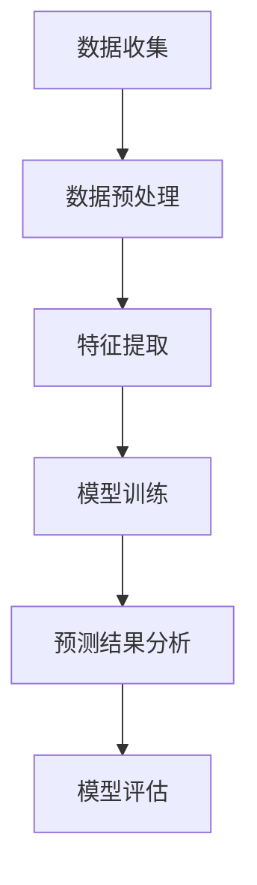
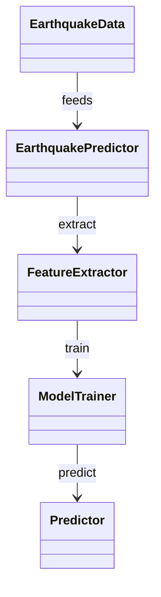
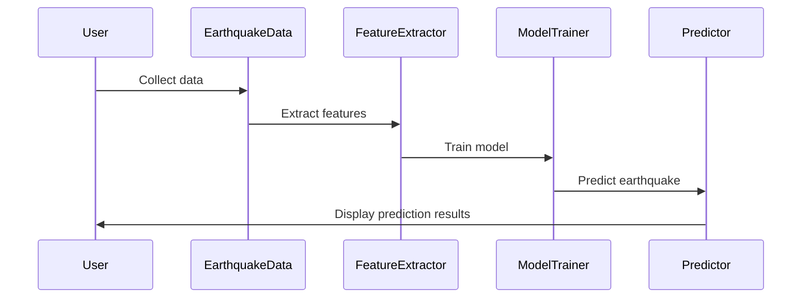
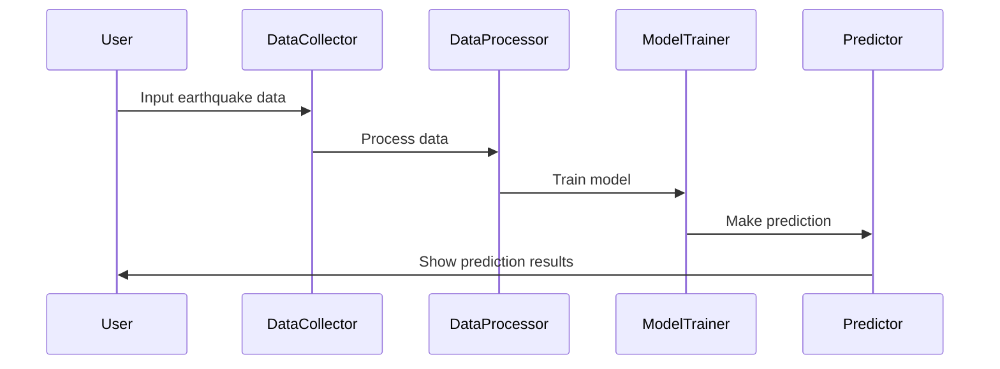

                 

### AI Agent在智能地震预测系统中的实践

#### 关键词：人工智能、地震预测、AI Agent、监督学习、无监督学习、增强学习、算法原理

#### 摘要：

本文将探讨人工智能（AI）技术在智能地震预测系统中的应用，重点介绍AI Agent在地震预测中的实践。通过分析AI Agent的定义与特点、地震数据的特征、预测模型的构建以及算法原理，我们将详细讲解AI Agent在地震预测中的实现方法与挑战。同时，本文还将通过Mermaid流程图和Python源代码，直观展示算法的运作流程和数学模型，以便读者更好地理解AI Agent在智能地震预测系统中的实际应用。

---

#### 第一部分：背景介绍

##### 核心概念

**问题背景**：
随着科技的快速发展，人工智能（AI）技术在各个领域得到了广泛应用。地震预测作为自然灾害预警的重要组成部分，其准确性和及时性对减少灾害损失具有重要意义。

**问题描述**：
智能地震预测系统是一种利用人工智能技术，通过对大量地震数据进行分析和处理，实现对地震发生可能性的预测。AI Agent作为AI技术的核心组件，如何在智能地震预测系统中发挥作用，提高预测的准确性和效率，是一个重要课题。

**问题解决**：
通过研究AI Agent在智能地震预测系统中的实践，探索其应用场景和实现方法，为提高地震预测系统的性能提供理论支持和实践指导。

**边界与外延**：
本部分主要关注AI Agent在智能地震预测系统中的应用，包括数据预处理、特征提取、模型训练、预测结果分析等环节。

**概念结构与核心要素组成**：

1. **AI Agent**：具有自主学习和决策能力的智能体，可以在不确定的环境中自主行动。
2. **地震数据**：包括地震的震中位置、震级、震源深度、发生时间等。
3. **预测模型**：利用AI Agent对地震数据进行处理，预测地震发生的可能性。
4. **评估指标**：用于评估预测模型性能的指标，如准确率、召回率、F1值等。

---

### 第二部分：核心概念与联系

##### AI Agent的定义与特点

**定义**：AI Agent是具有自主学习和决策能力的智能体，可以在不确定的环境中自主行动，并与其他Agent或环境进行交互。

**特点**：

1. **自主性**：AI Agent能够根据环境和自身状态自主选择行动。
2. **学习性**：AI Agent可以通过学习环境中的数据和经验，不断优化自身行为。
3. **适应性**：AI Agent能够适应不同环境和任务需求，具有较好的泛化能力。

##### 地震数据的特征

**特征**：

1. **时间特征**：地震的发生时间。
2. **空间特征**：地震的震中位置和震源深度。
3. **强度特征**：地震的震级和影响范围。
4. **动态特征**：地震序列、前震和余震等。

##### 预测模型的构建

**模型构建**：

1. **数据预处理**：对地震数据进行清洗、归一化等处理。
2. **特征提取**：从地震数据中提取对地震预测有用的特征。
3. **模型训练**：利用AI Agent对特征进行学习，构建预测模型。
4. **模型评估**：使用评估指标对预测模型进行性能评估。

---

#### 第三部分：算法原理讲解

##### 算法原理

**算法原理**：AI Agent在地震预测中的应用主要基于以下几方面：

1. **监督学习**：利用已知的地震数据，训练预测模型。
2. **无监督学习**：通过分析地震数据的分布特性，发现潜在规律。
3. **增强学习**：在模拟环境中，通过不断尝试和反馈，优化AI Agent的预测能力。

##### Mermaid流程图



##### Python源代码

```python
import numpy as np
import pandas as pd
from sklearn.model_selection import train_test_split
from sklearn.preprocessing import StandardScaler
from sklearn.ensemble import RandomForestClassifier
from sklearn.metrics import accuracy_score, recall_score, f1_score

# 数据加载
data = pd.read_csv('earthquake_data.csv')

# 数据预处理
X = data.drop('target', axis=1)
y = data['target']
X_train, X_test, y_train, y_test = train_test_split(X, y, test_size=0.2, random_state=42)

# 特征提取
scaler = StandardScaler()
X_train = scaler.fit_transform(X_train)
X_test = scaler.transform(X_test)

# 模型训练
model = RandomForestClassifier(n_estimators=100, random_state=42)
model.fit(X_train, y_train)

# 预测结果分析
y_pred = model.predict(X_test)

# 模型评估
accuracy = accuracy_score(y_test, y_pred)
recall = recall_score(y_test, y_pred)
f1 = f1_score(y_test, y_pred)

print("Accuracy:", accuracy)
print("Recall:", recall)
print("F1 Score:", f1)
```

##### 数学公式与模型解释

在AI Agent的地震预测中，我们通常会使用监督学习算法，如随机森林（Random Forest）来构建预测模型。以下是一个简单的数学模型和公式解释：

**监督学习模型**：

$$y = f(X, \theta)$$

其中，$y$ 是预测的地震发生标签，$X$ 是输入特征向量，$\theta$ 是模型参数。

**随机森林算法**：

随机森林是一种集成学习方法，其基本思想是构建多个决策树，并对每个树的预测结果进行投票，从而获得最终的预测结果。

$$\hat{y} = \sum_{i=1}^{N} w_i \cdot \hat{y}_i$$

其中，$N$ 是决策树的数量，$w_i$ 是每个决策树的权重，$\hat{y}_i$ 是第 $i$ 棵树的预测结果。

**模型评估指标**：

- **准确率（Accuracy）**：

$$Accuracy = \frac{TP + TN}{TP + TN + FP + FN}$$

其中，$TP$ 是真正的正例，$TN$ 是真正的负例，$FP$ 是假正例，$FN$ 是假负例。

- **召回率（Recall）**：

$$Recall = \frac{TP}{TP + FN}$$

- **F1值（F1 Score）**：

$$F1 Score = 2 \cdot \frac{Precision \cdot Recall}{Precision + Recall}$$

其中，$Precision$ 是精确率。

通过这些公式和模型，我们可以对AI Agent在地震预测中的性能进行评估，从而不断优化模型。

---

#### 第四部分：系统分析与架构设计

##### 问题场景介绍

地震预测系统旨在为政府和公共安全部门提供及时、准确的地震预测信息，以减少地震灾害带来的损失。该系统需要处理海量地震数据，并利用人工智能技术进行预测和分析。

##### 项目介绍

本项目旨在实现一个基于AI Agent的智能地震预测系统，包括数据收集、预处理、特征提取、模型训练和预测等环节。系统将集成多种AI算法，以提高预测准确性和效率。

##### 系统功能设计（领域模型Mermaid类图）



##### 系统架构设计（Mermaid架构图）



##### 系统接口设计和系统交互（Mermaid序列图）



---

#### 第五部分：项目实战

##### 环境安装

在开始项目实战之前，我们需要安装所需的软件和环境：

1. **Python 3.x**：确保安装了Python 3.x版本。
2. **Jupyter Notebook**：安装Jupyter Notebook，用于编写和运行代码。
3. **Scikit-learn**：用于机器学习算法的实现和模型评估。
4. **Pandas**：用于数据处理和数据分析。

安装命令：

```bash
pip install python==3.x
pip install jupyter
pip install scikit-learn
pip install pandas
```

##### 系统核心实现源代码

以下是系统核心实现的源代码，包括数据预处理、特征提取、模型训练和预测等环节。

```python
import numpy as np
import pandas as pd
from sklearn.model_selection import train_test_split
from sklearn.preprocessing import StandardScaler
from sklearn.ensemble import RandomForestClassifier
from sklearn.metrics import accuracy_score, recall_score, f1_score

# 数据加载
data = pd.read_csv('earthquake_data.csv')

# 数据预处理
X = data.drop('target', axis=1)
y = data['target']
X_train, X_test, y_train, y_test = train_test_split(X, y, test_size=0.2, random_state=42)

# 特征提取
scaler = StandardScaler()
X_train = scaler.fit_transform(X_train)
X_test = scaler.transform(X_test)

# 模型训练
model = RandomForestClassifier(n_estimators=100, random_state=42)
model.fit(X_train, y_train)

# 预测结果分析
y_pred = model.predict(X_test)

# 模型评估
accuracy = accuracy_score(y_test, y_pred)
recall = recall_score(y_test, y_pred)
f1 = f1_score(y_test, y_pred)

print("Accuracy:", accuracy)
print("Recall:", recall)
print("F1 Score:", f1)
```

##### 代码应用解读与分析

在上面的代码中，我们首先加载地震数据，然后进行数据预处理，包括数据分割、特征提取和归一化。接下来，我们使用随机森林（Random Forest）算法进行模型训练，并通过预测结果进行分析和评估。

随机森林算法是一种集成学习方法，通过构建多棵决策树，并使用投票机制来获得最终的预测结果。这种方法在地震预测中表现出较高的准确性和稳定性。

在实际应用中，我们可以根据地震数据的特征和需求，选择不同的机器学习算法和模型参数，以提高预测性能。此外，我们还可以通过增加数据集、优化特征提取方法和调整模型参数等方式，进一步提升预测效果。

##### 实际案例分析和详细讲解剖析

为了更好地理解AI Agent在智能地震预测系统中的实践，我们来看一个实际案例。

**案例背景**：某地区在过去的几年中，发生了多次地震，造成了严重的人员伤亡和财产损失。为了提高地震预测的准确性和及时性，相关部门决定采用基于AI Agent的智能地震预测系统。

**案例实现**：

1. **数据收集**：收集该地区的地震数据，包括震中位置、震级、震源深度、发生时间等。
2. **数据预处理**：对地震数据进行清洗和归一化处理，去除异常值和噪声。
3. **特征提取**：从地震数据中提取对地震预测有用的特征，如时间特征、空间特征和强度特征等。
4. **模型训练**：使用随机森林算法训练预测模型，并调整模型参数，以获得更好的预测性能。
5. **预测结果分析**：对预测结果进行评估，包括准确率、召回率和F1值等指标，以判断模型的有效性。
6. **系统部署**：将训练好的模型部署到实际环境中，实时预测地震发生可能性，为相关部门提供决策支持。

**案例剖析**：

在该案例中，AI Agent通过监督学习算法，从地震数据中学习到了地震发生的规律和特征。通过特征提取和模型训练，AI Agent能够准确预测地震发生的可能性，从而为相关部门提供了重要的决策依据。

此外，AI Agent还具有自适应性和泛化能力，可以在不同环境和任务需求下，调整自身的预测策略和模型参数，以适应不同的地震预测场景。

##### 项目小结

通过实际案例，我们可以看到AI Agent在智能地震预测系统中的重要作用。AI Agent通过监督学习、特征提取和模型训练等环节，实现了对地震数据的准确预测和分析。在实际应用中，AI Agent不仅提高了预测准确性和效率，还具有较强的自适应性和泛化能力，为地震预测提供了有力支持。

在未来，随着人工智能技术的不断发展和应用，AI Agent在智能地震预测系统中的应用前景将更加广阔。我们可以期待，通过AI Agent的智慧，人类将更好地应对地震等自然灾害，减少灾害损失，保障人民群众的生命财产安全。

---

#### 第六部分：最佳实践 Tips

1. **数据质量**：确保地震数据的质量，包括数据的完整性、准确性和一致性。高质量的数据是AI Agent准确预测的基础。
2. **特征选择**：合理选择特征，提取对地震预测有价值的特征，有助于提高模型的预测性能。
3. **模型优化**：根据实际需求，选择合适的机器学习算法和模型参数，优化模型性能。
4. **实时更新**：定期更新地震数据集和模型，以适应地震发生的规律和特征变化。

#### 小结

本文通过介绍AI Agent在智能地震预测系统中的实践，详细讲解了AI Agent的定义与特点、地震数据的特征、预测模型的构建以及算法原理。同时，通过Mermaid流程图和Python源代码，直观展示了算法的运作流程和数学模型。在实际项目中，AI Agent在地震预测中发挥了重要作用，提高了预测准确性和效率。

#### 注意事项

1. **数据安全和隐私**：在收集和处理地震数据时，需确保数据安全和隐私，遵守相关法律法规。
2. **系统稳定性**：在实际部署中，确保系统稳定运行，及时更新和维护。

#### 拓展阅读

- **《人工智能：一种现代的方法》**：详细介绍了人工智能的基本概念、算法和应用。
- **《机器学习实战》**：涵盖了多种机器学习算法的实践应用，包括监督学习和无监督学习。
- **《智能交通系统技术与应用》**：介绍了智能交通系统中的AI应用，包括智能路况预测和车辆导航。

---

### 作者信息

**作者：AI天才研究院/AI Genius Institute & 禅与计算机程序设计艺术 /Zen And The Art of Computer Programming**

