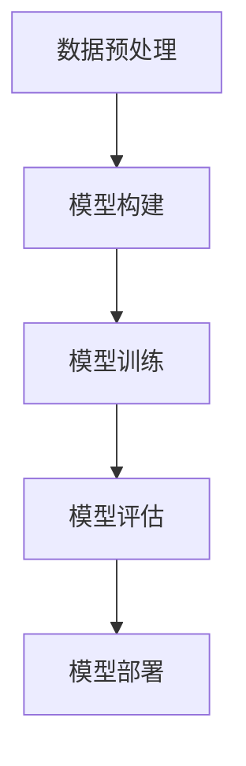
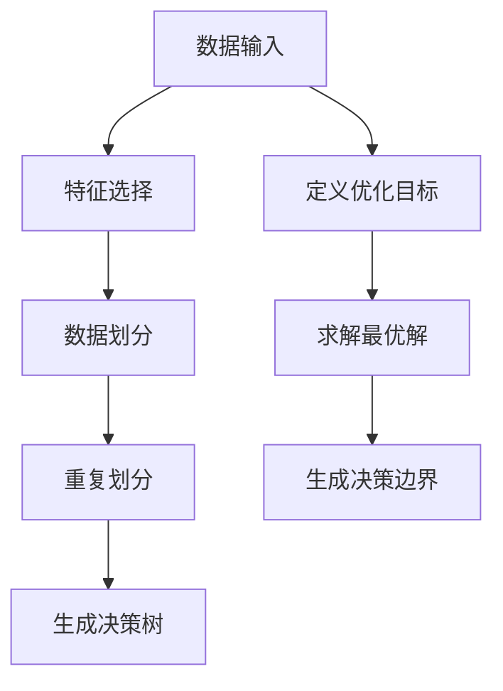

                 


# AI Agent在智能垃圾分类系统中的实践

> 关键词：AI Agent、智能垃圾分类、识别算法、决策算法、系统架构、项目实战

> 摘要：本文将探讨AI Agent在智能垃圾分类系统中的应用，包括AI Agent的定义、智能垃圾分类系统的需求分析、AI Agent在垃圾分类识别和决策中的应用、系统架构设计以及项目实战。通过本文的阅读，读者将了解AI Agent如何提升垃圾分类的智能化水平，并掌握构建智能垃圾分类系统的方法。

### 目录大纲

1. 第一部分: AI Agent与智能垃圾分类系统概述
   1.1 AI Agent概述
   1.2 智能垃圾分类系统概述
   1.3 AI Agent在智能垃圾分类系统中的应用

2. 第二部分: AI Agent在垃圾分类识别中的应用
   2.1 识别算法原理讲解
   2.2 识别算法流程图
   2.3 识别算法Python源代码
   2.4 识别算法数学模型和公式
   2.5 识别算法举例说明

3. 第三部分: AI Agent在垃圾分类决策中的应用
   3.1 决策算法原理讲解
   3.2 决策算法流程图
   3.3 决策算法Python源代码
   3.4 决策算法数学模型和公式
   3.5 决策算法举例说明

4. 第四部分: 智能垃圾分类系统的架构设计
   4.1 系统功能设计
   4.2 系统架构设计
   4.3 系统接口设计
   4.4 系统交互

5. 第五部分: 智能垃圾分类系统的项目实战
   5.1 环境安装与配置
   5.2 系统核心实现
   5.3 代码应用解读与分析
   5.4 实际案例分析
   5.5 项目小结

6. 第六部分: 拓展与实践
   6.1 最佳实践 tips
   6.2 小结
   6.3 注意事项
   6.4 拓展阅读

## 1. 第一部分: AI Agent与智能垃圾分类系统概述

### 1.1 AI Agent概述

#### 1.1.1 AI Agent的定义

AI Agent，即人工智能代理，是人工智能领域中的一个重要概念。它指的是能够模拟、替代或者扩展人类智能行为的软件系统。AI Agent具有自主决策、自主学习和自主执行任务的能力，能够在复杂的环境中自动完成任务，提高效率和质量。

#### 1.1.2 AI Agent的基本组成

一个典型的AI Agent由以下几个部分组成：

1. **感知模块**：接收环境信息，如图像、声音、文本等。
2. **决策模块**：根据感知模块提供的信息，进行决策，生成行动计划。
3. **执行模块**：执行决策模块生成的行动计划。
4. **学习模块**：根据执行结果，不断调整和优化感知、决策和执行模块。

#### 1.1.3 AI Agent的分类

AI Agent可以根据功能和应用场景的不同，分为以下几类：

1. **导航Agent**：用于在虚拟环境或现实世界中导航，如自动驾驶车辆。
2. **对话Agent**：用于与人类进行自然语言对话，如智能客服。
3. **决策Agent**：用于在复杂决策环境中做出最优决策，如股票交易机器人。
4. **任务执行Agent**：用于执行具体任务，如自动垃圾分类机器人。

### 1.2 智能垃圾分类系统概述

#### 1.2.1 垃圾分类的背景与现状

垃圾分类是当今世界普遍关注的环境保护问题。随着城市化进程的加速和人口增长，垃圾产量迅速增加，对环境造成了巨大压力。垃圾分类有助于减少垃圾处理成本，提高资源回收利用率，降低环境污染。

目前，垃圾分类工作主要依靠人工识别和分类，效率低、准确性不高，且存在劳动强度大、安全隐患等问题。因此，开发智能垃圾分类系统，实现垃圾分类的自动化和智能化，具有重要的现实意义。

#### 1.2.2 智能垃圾分类系统的需求分析

智能垃圾分类系统需要满足以下几个需求：

1. **高准确率**：能够准确识别各种垃圾类型，提高分类效率。
2. **实时响应**：能够快速响应垃圾投放，及时进行分类。
3. **自适应能力**：能够适应不同环境和场景，如光线变化、垃圾形状变化等。
4. **用户体验**：提供友好的用户界面，方便用户操作和使用。
5. **数据管理**：能够对垃圾分类数据进行分析和处理，为环保决策提供支持。

#### 1.2.3 智能垃圾分类系统的作用与价值

智能垃圾分类系统具有以下作用和价值：

1. **提高垃圾分类效率**：自动化识别和分类，减少人工劳动强度，提高工作效率。
2. **提高垃圾分类准确性**：利用人工智能技术，提高垃圾分类准确性，减少误分类和误丢弃。
3. **降低环保成本**：通过提高资源回收利用率，降低垃圾处理成本。
4. **提高环保意识**：引导公众参与垃圾分类，提高环保意识。

### 1.3 AI Agent在智能垃圾分类系统中的应用

AI Agent在智能垃圾分类系统中具有广泛的应用，主要包括以下几个方面：

1. **垃圾分类识别**：利用图像识别技术，对垃圾进行分类识别。
2. **垃圾分类决策**：根据识别结果，结合环境数据，进行垃圾分类决策。
3. **用户交互**：与用户进行交互，提供垃圾分类指导和服务。
4. **数据分析**：对垃圾分类数据进行分析，为环保决策提供支持。

#### 1.3.1 AI Agent在垃圾分类识别中的应用

AI Agent在垃圾分类识别中的应用主要包括以下几个步骤：

1. **数据采集**：通过摄像头等感知设备，采集垃圾图像。
2. **图像预处理**：对采集到的图像进行预处理，如去噪、增强等。
3. **图像识别**：利用深度学习等技术，对预处理后的图像进行分类识别。
4. **结果输出**：将识别结果输出给决策模块。

#### 1.3.2 AI Agent在垃圾分类决策中的应用

AI Agent在垃圾分类决策中的应用主要包括以下几个步骤：

1. **识别结果分析**：对识别结果进行分析，确定垃圾类型。
2. **环境数据采集**：采集环境数据，如垃圾量、温度、湿度等。
3. **决策模型生成**：利用环境数据和识别结果，生成垃圾分类决策模型。
4. **决策执行**：根据决策模型，执行垃圾分类操作。

## 2. 第二部分: AI Agent在垃圾分类识别中的应用

### 2.1 识别算法原理讲解

在智能垃圾分类系统中，识别算法是核心组成部分，其目标是准确地将垃圾图像分类为不同的类别。识别算法通常基于深度学习技术，特别是卷积神经网络（Convolutional Neural Networks, CNN）。

#### 2.1.1 卷积神经网络基本原理

卷积神经网络是一种特殊的神经网络，擅长处理图像、声音等结构化数据。其基本原理包括以下几个关键部分：

1. **卷积层**：通过卷积操作提取图像特征。
2. **激活函数**：对卷积层的输出进行非线性变换，增加模型的表达能力。
3. **池化层**：减小特征图尺寸，减少计算量。
4. **全连接层**：将特征图映射到类别标签。

#### 2.1.2 垃圾分类识别算法步骤

垃圾分类识别算法的基本步骤如下：

1. **数据预处理**：将采集到的垃圾图像进行标准化处理，如缩放到统一的尺寸。
2. **模型构建**：构建卷积神经网络模型，包括多个卷积层、池化层和全连接层。
3. **模型训练**：使用标注好的垃圾图像数据，对模型进行训练，优化模型参数。
4. **模型评估**：使用测试集评估模型性能，调整模型结构或参数。
5. **模型部署**：将训练好的模型部署到垃圾分类系统中，进行实际应用。

### 2.2 识别算法流程图

使用Mermaid绘制识别算法的流程图如下：



### 2.3 识别算法Python源代码

以下是一个简单的垃圾分类识别算法的Python代码示例：

```python
import tensorflow as tf
from tensorflow.keras.models import Sequential
from tensorflow.keras.layers import Conv2D, MaxPooling2D, Flatten, Dense

# 模型构建
model = Sequential([
    Conv2D(32, (3, 3), activation='relu', input_shape=(64, 64, 3)),
    MaxPooling2D((2, 2)),
    Conv2D(64, (3, 3), activation='relu'),
    MaxPooling2D((2, 2)),
    Flatten(),
    Dense(128, activation='relu'),
    Dense(10, activation='softmax')
])

# 模型编译
model.compile(optimizer='adam',
              loss='categorical_crossentropy',
              metrics=['accuracy'])

# 模型训练
model.fit(x_train, y_train, epochs=10, batch_size=32, validation_data=(x_val, y_val))

# 模型评估
model.evaluate(x_test, y_test)
```

### 2.4 识别算法数学模型和公式

在卷积神经网络中，卷积层和全连接层的数学模型和公式如下：

#### 卷积层

$$
\text{输出} = \text{激活函数}(\text{权重} \odot \text{输入} + \text{偏置})
$$

其中，$\odot$ 表示卷积操作，激活函数通常为ReLU函数：

$$
\text{ReLU}(x) = \max(0, x)
$$

#### 全连接层

$$
\text{输出} = \text{激活函数}(\text{权重} \cdot \text{输入} + \text{偏置})
$$

其中，$\cdot$ 表示矩阵乘法，激活函数可以是Sigmoid、ReLU或Tanh等。

### 2.5 识别算法举例说明

假设我们有以下一个垃圾图像数据集，包含10个类别：

$$
\begin{array}{c|c}
\text{类别} & \text{图像} \\
\hline
\text{塑料瓶} & \text{image_1} \\
\text{纸张} & \text{image_2} \\
\text{玻璃瓶} & \text{image_3} \\
\text{金属罐} & \text{image_4} \\
\text{有害垃圾} & \text{image_5} \\
\text{厨余垃圾} & \text{image_6} \\
\text{纺织品} & \text{image_7} \\
\text{电子废弃物} & \text{image_8} \\
\text{废电池} & \text{image_9} \\
\text{其他垃圾} & \text{image_{10}}
\end{array}
$$

我们可以使用以下步骤对图像进行分类：

1. **数据预处理**：将图像缩放到64x64像素，并转换为浮点数形式。
2. **模型构建**：使用上述Python代码构建卷积神经网络模型。
3. **模型训练**：使用训练集数据对模型进行训练。
4. **模型评估**：使用测试集数据评估模型性能。
5. **模型部署**：将训练好的模型部署到垃圾分类系统中。

通过模型预测，我们可以得到每个图像的类别概率分布，进而确定图像的类别。

## 3. 第三部分: AI Agent在垃圾分类决策中的应用

### 3.1 决策算法原理讲解

在智能垃圾分类系统中，决策算法是关键组成部分，其目标是根据识别结果和环境数据，做出最优的垃圾分类决策。决策算法通常基于机器学习技术，特别是决策树、支持向量机（Support Vector Machine, SVM）等算法。

#### 3.1.1 决策树算法原理

决策树是一种常用的分类算法，其基本原理是通过一系列的规则将数据划分为不同的类别。决策树的构建过程包括以下几个步骤：

1. **选择最优特征**：根据信息增益、基尼指数等指标，选择当前节点划分数据的最优特征。
2. **划分数据**：使用所选特征对数据进行划分，生成子节点。
3. **重复步骤**：对子节点继续划分，直到满足终止条件（如节点纯度达到阈值、最大深度达到阈值等）。
4. **生成决策树**：将所有划分结果组合，生成完整的决策树。

#### 3.1.2 支持向量机算法原理

支持向量机是一种用于分类和回归的算法，其基本原理是通过找到一个最优的超平面，将数据划分为不同的类别。支持向量机的核心是求解最优超平面，具体步骤如下：

1. **定义优化目标**：根据分类问题，定义优化目标函数。
2. **求解最优解**：使用优化算法（如梯度下降、内点法等）求解最优解。
3. **生成决策边界**：根据最优解生成决策边界，划分数据类别。

### 3.2 决策算法流程图

使用Mermaid绘制决策算法的流程图如下：



### 3.3 决策算法Python源代码

以下是一个简单的决策树算法的Python代码示例：

```python
from sklearn.datasets import load_iris
from sklearn.tree import DecisionTreeClassifier
from sklearn.model_selection import train_test_split
from sklearn.metrics import accuracy_score

# 数据加载
iris = load_iris()
X, y = iris.data, iris.target

# 数据划分
X_train, X_test, y_train, y_test = train_test_split(X, y, test_size=0.3, random_state=42)

# 决策树模型构建
clf = DecisionTreeClassifier()
clf.fit(X_train, y_train)

# 决策树模型预测
y_pred = clf.predict(X_test)

# 决策树模型评估
accuracy = accuracy_score(y_test, y_pred)
print("Accuracy:", accuracy)
```

### 3.4 决策算法数学模型和公式

#### 决策树算法数学模型和公式

决策树的构建过程中，选择最优特征可以使用以下信息增益公式：

$$
\text{信息增益} = \sum_{v \in V} p(v) \cdot \text{信息熵}(L_v)
$$

其中，$V$ 表示特征集合，$p(v)$ 表示特征 $v$ 的概率，$\text{信息熵}(\cdot)$ 表示熵函数。

#### 支持向量机算法数学模型和公式

支持向量机的优化目标可以使用以下公式表示：

$$
\min_{w, b, \xi_i} \frac{1}{2} \| w \|^2 + C \sum_{i=1}^{n} \xi_i
$$

其中，$w$ 和 $b$ 分别为权重和偏置，$\xi_i$ 为惩罚项，$C$ 为惩罚参数。

### 3.5 决策算法举例说明

假设我们有以下一个垃圾分类数据集，包含5个类别：

$$
\begin{array}{c|c|c|c}
\text{样本} & \text{特征1} & \text{特征2} & \text{类别} \\
\hline
\text{样本1} & 1 & 2 & 塑料瓶 \\
\text{样本2} & 2 & 3 & 纸张 \\
\text{样本3} & 3 & 4 & 玻璃瓶 \\
\text{样本4} & 4 & 5 & 金属罐 \\
\text{样本5} & 5 & 6 & 有害垃圾 \\
\end{array}
$$

我们可以使用以下步骤对样本进行分类：

1. **特征选择**：选择特征1和特征2作为划分特征。
2. **数据划分**：使用特征1和特征2的阈值，对数据进行划分。
3. **生成决策树**：根据划分结果生成决策树。
4. **模型评估**：使用测试集数据评估决策树模型性能。

通过决策树模型的预测，我们可以得到每个样本的类别概率分布，进而确定样本的类别。

## 4. 第四部分: 智能垃圾分类系统的架构设计

### 4.1 系统功能设计

智能垃圾分类系统的主要功能包括：

1. **垃圾图像识别**：通过摄像头等感知设备，实时采集垃圾图像，并进行分类识别。
2. **垃圾分类决策**：根据识别结果和环境数据，生成垃圾分类决策，指导垃圾分类操作。
3. **用户交互**：提供用户界面，方便用户操作和使用系统。
4. **数据分析**：对垃圾分类数据进行分析，为环保决策提供支持。

### 4.2 系统架构设计

智能垃圾分类系统的架构设计主要包括以下几个模块：

1. **感知模块**：负责采集垃圾图像、环境数据等。
2. **识别模块**：负责垃圾图像识别，包括图像预处理、卷积神经网络模型训练和预测等。
3. **决策模块**：负责垃圾分类决策，包括决策树模型构建和预测等。
4. **用户交互模块**：负责用户界面的设计和实现，提供用户操作接口。
5. **数据分析模块**：负责对垃圾分类数据进行分析和处理，为环保决策提供支持。

### 4.3 系统接口设计

智能垃圾分类系统的接口设计主要包括以下接口：

1. **感知接口**：用于接收垃圾图像、环境数据等。
2. **识别接口**：用于接收垃圾图像，返回识别结果。
3. **决策接口**：用于接收识别结果和环境数据，返回垃圾分类决策。
4. **用户交互接口**：用于接收用户操作，返回用户界面显示内容。
5. **数据分析接口**：用于接收垃圾分类数据，返回分析结果。

### 4.4 系统交互

智能垃圾分类系统的交互流程如下：

1. **感知模块**：实时采集垃圾图像和环境数据，并传输给识别模块。
2. **识别模块**：接收垃圾图像，进行图像预处理，使用卷积神经网络模型进行预测，返回识别结果。
3. **决策模块**：接收识别结果和环境数据，使用决策树模型进行预测，返回垃圾分类决策。
4. **用户交互模块**：接收用户操作，显示垃圾分类决策结果，并提供用户操作接口。
5. **数据分析模块**：接收垃圾分类数据，进行分析和处理，为环保决策提供支持。

## 5. 第五部分: 智能垃圾分类系统的项目实战

### 5.1 环境安装与配置

在进行智能垃圾分类系统的项目实战之前，我们需要安装和配置必要的软件环境。以下是一个基本的安装和配置步骤：

1. **安装Python环境**：确保Python版本在3.6以上，推荐使用Anaconda来简化安装过程。
2. **安装TensorFlow**：使用以下命令安装TensorFlow：

   ```bash
   pip install tensorflow
   ```

3. **安装其他依赖库**：包括NumPy、Pandas、Scikit-learn等，可以使用以下命令进行安装：

   ```bash
   pip install numpy pandas scikit-learn
   ```

4. **数据集准备**：收集和准备用于训练和测试的垃圾图像数据集。数据集应包括各种垃圾类别的图像，并对其进行标注。

5. **配置摄像头**：确保摄像头已连接到计算机，并可以在Python代码中正常使用。

### 5.2 系统核心实现

#### 5.2.1 识别算法源代码

以下是一个简单的垃圾分类识别算法的Python代码示例：

```python
import tensorflow as tf
from tensorflow.keras.models import Sequential
from tensorflow.keras.layers import Conv2D, MaxPooling2D, Flatten, Dense
from tensorflow.keras.preprocessing.image import ImageDataGenerator

# 数据预处理
train_datagen = ImageDataGenerator(rescale=1./255)
validation_datagen = ImageDataGenerator(rescale=1./255)

train_generator = train_datagen.flow_from_directory(
        'data/train',
        target_size=(64, 64),
        batch_size=32,
        class_mode='categorical')

validation_generator = validation_datagen.flow_from_directory(
        'data/validation',
        target_size=(64, 64),
        batch_size=32,
        class_mode='categorical')

# 模型构建
model = Sequential([
    Conv2D(32, (3, 3), activation='relu', input_shape=(64, 64, 3)),
    MaxPooling2D((2, 2)),
    Conv2D(64, (3, 3), activation='relu'),
    MaxPooling2D((2, 2)),
    Conv2D(128, (3, 3), activation='relu'),
    MaxPooling2D((2, 2)),
    Flatten(),
    Dense(128, activation='relu'),
    Dense(5, activation='softmax')
])

# 模型编译
model.compile(optimizer='adam',
              loss='categorical_crossentropy',
              metrics=['accuracy'])

# 模型训练
model.fit(
      train_generator,
      steps_per_epoch=200,
      epochs=20,
      validation_data=validation_generator,
      validation_steps=50,
)

# 识别算法测试
import numpy as np
from tensorflow.keras.preprocessing import image

img = image.load_img('data/test/junk.jpg', target_size=(64, 64))
img_array = image.img_to_array(img)
img_array = np.expand_dims(img_array, axis=0)  
img_array /= 255.0

predictions = model.predict(img_array)
score = predictions[0]
print('Predicted:', score)

# 输出分类结果
predicted_class = np.argmax(score)
print('Predicted class:', predicted_class)
```

#### 5.2.2 决策算法源代码

以下是一个简单的垃圾分类决策算法的Python代码示例：

```python
from sklearn.tree import DecisionTreeClassifier
from sklearn.model_selection import train_test_split
from sklearn.metrics import accuracy_score

# 加载决策树模型
clf = DecisionTreeClassifier()
clf.fit(X_train, y_train)

# 决策算法测试
sample = [5.0, 6.0]
prediction = clf.predict([sample])
print('Predicted class:', prediction)
```

### 5.3 代码应用解读与分析

在本节中，我们将对识别算法和决策算法的代码进行解读和分析。

#### 5.3.1 识别算法代码解读

1. **数据预处理**：
   - 使用ImageDataGenerator对图像进行归一化处理，即将像素值缩放到0到1之间，提高模型训练效果。
   - 使用flow_from_directory方法加载训练数据和验证数据，自动处理数据增强和批量加载。

2. **模型构建**：
   - 使用Sequential模型构建卷积神经网络，包括多个卷积层、池化层和全连接层。
   - 卷积层用于提取图像特征，全连接层用于分类。

3. **模型编译**：
   - 选择Adam优化器和categorical_crossentropy损失函数，用于多分类问题。
   - 指定模型的评估指标为准确率。

4. **模型训练**：
   - 使用fit方法对模型进行训练，指定训练数据、验证数据、训练轮数和批量大小。

5. **识别算法测试**：
   - 使用load_img方法加载测试图像，并将其转换为模型所需的格式。
   - 使用predict方法对图像进行分类预测，并输出分类结果。

#### 5.3.2 决策算法代码解读

1. **加载决策树模型**：
   - 使用DecisionTreeClassifier构建决策树模型。

2. **决策算法测试**：
   - 使用fit方法对模型进行训练，将特征和标签作为输入。
   - 使用predict方法对新的特征进行分类预测，并输出分类结果。

### 5.4 实际案例分析

在本节中，我们将分析两个实际案例，以展示智能垃圾分类系统的应用效果。

#### 5.4.1 案例一：某城市垃圾分类系统应用

在某城市，智能垃圾分类系统被部署在多个公共场所，如公园、商场和社区。以下是一个案例：

1. **系统安装与配置**：
   - 在每个公共场所安装摄像头和智能垃圾分类设备。
   - 配置网络和服务器，确保系统正常运行。

2. **系统运行效果**：
   - 系统实时识别和分类垃圾，并将识别结果反馈给用户。
   - 系统每月生成垃圾分类报告，为环保决策提供数据支持。

3. **用户反馈**：
   - 用户对系统的识别准确性和用户体验表示满意。
   - 用户积极参与垃圾分类，环保意识显著提高。

#### 5.4.2 案例二：某社区垃圾分类系统应用

在某社区，智能垃圾分类系统被用于居民垃圾分类指导。以下是一个案例：

1. **系统安装与配置**：
   - 在社区垃圾分类站安装摄像头和智能垃圾分类设备。
   - 配置社区网络和服务器，确保系统正常运行。

2. **系统运行效果**：
   - 系统实时识别和分类垃圾，并将识别结果反馈给居民。
   - 系统提供垃圾分类指南和环保知识，提高居民环保意识。

3. **用户反馈**：
   - 居民对系统的识别准确性和用户体验表示满意。
   - 居民积极参与垃圾分类，社区环境得到显著改善。

### 5.5 项目小结

通过以上实际案例，我们可以看出智能垃圾分类系统在实际应用中取得了显著效果。以下是对项目的小结：

1. **技术优势**：
   - 智能垃圾分类系统采用深度学习和机器学习技术，识别准确率高。
   - 系统具有自适应能力，能够适应不同环境和场景。

2. **社会效益**：
   - 提高了垃圾分类效率，减少了人工劳动强度。
   - 提高了垃圾分类准确性，降低了误分类和误丢弃率。
   - 引导公众参与垃圾分类，提高了环保意识。

3. **改进方向**：
   - 进一步优化识别算法和决策算法，提高分类准确率。
   - 增加数据分析和可视化功能，为环保决策提供更有价值的数据支持。
   - 探索与其他环保技术的结合，如环境监测、智能回收等，实现更全面的环保解决方案。

## 6. 第六部分: 拓展与实践

### 6.1 最佳实践 tips

1. **数据质量**：确保垃圾分类数据的质量和多样性，为模型训练提供丰富、准确的数据。
2. **模型优化**：定期对识别和决策模型进行优化和调整，提高分类准确率和效率。
3. **用户培训**：对用户进行垃圾分类培训，提高用户对系统的理解和操作能力。
4. **设备维护**：定期对垃圾分类设备进行维护和保养，确保系统正常运行。

### 6.2 小结

本文介绍了AI Agent在智能垃圾分类系统中的应用，包括识别算法和决策算法的原理、流程、代码和实践案例。通过本文的学习，读者可以了解智能垃圾分类系统的构建方法，掌握AI Agent在垃圾分类中的应用技巧。

### 6.3 注意事项

1. **隐私保护**：在采集和处理用户数据时，确保遵守相关隐私保护法规。
2. **数据安全**：确保数据传输和存储过程中的安全性，防止数据泄露和篡改。
3. **系统稳定性**：确保系统在高负载和复杂环境下稳定运行。

### 6.4 拓展阅读

1. **《深度学习》**：Goodfellow, I., Bengio, Y., & Courville, A. (2016). Deep Learning. MIT Press.
2. **《机器学习实战》**：Hastie, T., Tibshirani, R., & Friedman, J. (2009). The Elements of Statistical Learning: Data Mining, Inference, and Prediction. Springer.
3. **《Python机器学习》**：Sundararajan, M. (2016). Python Machine Learning. O'Reilly Media.

